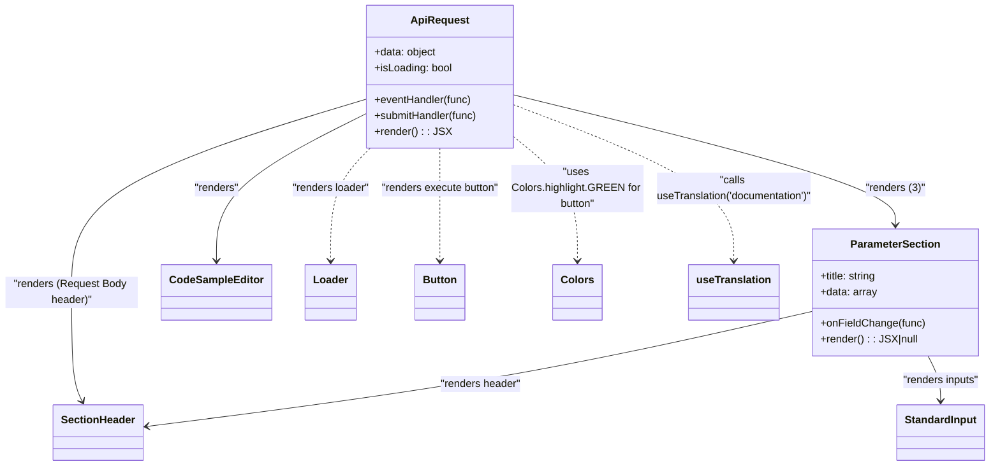

# Diagram: web/portal/src/modules/documentation/documentation-styled-components/ApiRequest.js

> Auto-generated by Obscura crawlers

## Mermaid

### SVG

<svg id="container" width="1493.42578125" xmlns="http://www.w3.org/2000/svg" class="classDiagram" height="704" viewBox="0 0 1493.42578125 704" role="graphics-document document" aria-roledescription="class"><g><defs><marker id="container_class-aggregationStart" class="marker aggregation class" refX="18" refY="7" markerWidth="190" markerHeight="240" orient="auto"><path d="M 18,7 L9,13 L1,7 L9,1 Z"></path></marker></defs><defs><marker id="container_class-aggregationEnd" class="marker aggregation class" refX="1" refY="7" markerWidth="20" markerHeight="28" orient="auto"><path d="M 18,7 L9,13 L1,7 L9,1 Z"></path></marker></defs><defs><marker id="container_class-extensionStart" class="marker extension class" refX="18" refY="7" markerWidth="190" markerHeight="240" orient="auto"><path d="M 1,7 L18,13 V 1 Z"></path></marker></defs><defs><marker id="container_class-extensionEnd" class="marker extension class" refX="1" refY="7" markerWidth="20" markerHeight="28" orient="auto"><path d="M 1,1 V 13 L18,7 Z"></path></marker></defs><defs><marker id="container_class-compositionStart" class="marker composition class" refX="18" refY="7" markerWidth="190" markerHeight="240" orient="auto"><path d="M 18,7 L9,13 L1,7 L9,1 Z"></path></marker></defs><defs><marker id="container_class-compositionEnd" class="marker composition class" refX="1" refY="7" markerWidth="20" markerHeight="28" orient="auto"><path d="M 18,7 L9,13 L1,7 L9,1 Z"></path></marker></defs><defs><marker id="container_class-dependencyStart" class="marker dependency class" refX="6" refY="7" markerWidth="190" markerHeight="240" orient="auto"><path d="M 5,7 L9,13 L1,7 L9,1 Z"></path></marker></defs><defs><marker id="container_class-dependencyEnd" class="marker dependency class" refX="13" refY="7" markerWidth="20" markerHeight="28" orient="auto"><path d="M 18,7 L9,13 L14,7 L9,1 Z"></path></marker></defs><defs><marker id="container_class-lollipopStart" class="marker lollipop class" refX="13" refY="7" markerWidth="190" markerHeight="240" orient="auto"><circle stroke="black" fill="transparent" cx="7" cy="7" r="6"></circle></marker></defs><defs><marker id="container_class-lollipopEnd" class="marker lollipop class" refX="1" refY="7" markerWidth="190" markerHeight="240" orient="auto"><circle stroke="black" fill="transparent" cx="7" cy="7" r="6"></circle></marker></defs><g class="root"><g class="clusters"></g><g class="edgePaths"><path d="M771.844,143.436L868.208,167.03C964.573,190.624,1157.302,237.812,1253.667,270.573C1350.031,303.333,1350.031,321.667,1350.031,330.833L1350.031,340" id="id_ApiRequest_ParameterSection_1" class="edge-thickness-normal edge-pattern-solid relation" style=";;;" data-edge="true" data-et="edge" data-id="id_ApiRequest_ParameterSection_1" data-points="W3sieCI6NzcxLjg0Mzc1LCJ5IjoxNDMuNDM1NjQ4NzE5MzEyNzV9LHsieCI6MTM1MC4wMzEyNSwieSI6Mjg1fSx7IngiOjEzNTAuMDMxMjUsInkiOjM0Nn1d" marker-end="url(#container_class-dependencyEnd)"></path><path d="M547.734,150.32L474.445,172.766C401.156,195.213,254.578,240.107,181.289,288.72C108,337.333,108,389.667,108,438C108,486.333,108,530.667,110.734,558.112C113.468,585.557,118.936,596.115,121.671,601.394L124.405,606.672" id="id_ApiRequest_SectionHeader_2" class="edge-thickness-normal edge-pattern-solid relation" style=";;;" data-edge="true" data-et="edge" data-id="id_ApiRequest_SectionHeader_2" data-points="W3sieCI6NTQ3LjczNDM3NSwieSI6MTUwLjMxOTcxMjg2NTgxOTk4fSx7IngiOjEwOCwieSI6Mjg1fSx7IngiOjEwOCwieSI6NDQyfSx7IngiOjEwOCwieSI6NTc1fSx7IngiOjEyNy4xNjQxMTE5NDYyMDI1MiwieSI6NjEyfV0=" marker-end="url(#container_class-dependencyEnd)"></path><path d="M547.734,172.147L510.197,190.956C472.659,209.764,397.583,247.382,360.046,284.358C322.508,321.333,322.508,357.667,322.508,375.833L322.508,394" id="id_ApiRequest_CodeSampleEditor_3" class="edge-thickness-normal edge-pattern-solid relation" style=";;;" data-edge="true" data-et="edge" data-id="id_ApiRequest_CodeSampleEditor_3" data-points="W3sieCI6NTQ3LjczNDM3NSwieSI6MTcyLjE0NjczODYyNjg4Nzc4fSx7IngiOjMyMi41MDc4MTI1LCJ5IjoyODV9LHsieCI6MzIyLjUwNzgxMjUsInkiOjQwMH1d" marker-end="url(#container_class-dependencyEnd)"></path><path d="M550.85,224L540.595,234.167C530.34,244.333,509.83,264.667,499.575,293C489.32,321.333,489.32,357.667,489.32,375.833L489.32,394" id="id_ApiRequest_Loader_4" class="edge-thickness-normal edge-pattern-dashed relation" style=";;;" data-edge="true" data-et="edge" data-id="id_ApiRequest_Loader_4" data-points="W3sieCI6NTUwLjg1MDQ1MzAzMjU0NDQsInkiOjIyNH0seyJ4Ijo0ODkuMzIwMzEyNSwieSI6Mjg1fSx7IngiOjQ4OS4zMjAzMTI1LCJ5Ijo0MDB9XQ==" marker-end="url(#container_class-dependencyEnd)"></path><path d="M659.789,224L659.789,234.167C659.789,244.333,659.789,264.667,659.789,293C659.789,321.333,659.789,357.667,659.789,375.833L659.789,394" id="id_ApiRequest_Button_5" class="edge-thickness-normal edge-pattern-dashed relation" style=";;;" data-edge="true" data-et="edge" data-id="id_ApiRequest_Button_5" data-points="W3sieCI6NjU5Ljc4OTA2MjUsInkiOjIyNH0seyJ4Ijo2NTkuNzg5MDYyNSwieSI6Mjg1fSx7IngiOjY1OS43ODkwNjI1LCJ5Ijo0MDB9XQ==" marker-end="url(#container_class-dependencyEnd)"></path><path d="M1227.133,470.177L1150.933,487.648C1074.733,505.118,922.333,540.059,754.611,569.172C586.889,598.285,403.844,621.571,312.322,633.213L220.8,644.856" id="id_ParameterSection_SectionHeader_6" class="edge-thickness-normal edge-pattern-solid relation" style=";;;" data-edge="true" data-et="edge" data-id="id_ParameterSection_SectionHeader_6" data-points="W3sieCI6MTIyNy4xMzI4MTI1LCJ5Ijo0NzAuMTc3MTM4ODE2ODc0ODR9LHsieCI6NzY5LjkzMzU5Mzc1LCJ5Ijo1NzV9LHsieCI6MjE0Ljg0NzY1NjI1LCJ5Ijo2NDUuNjEzMDIwNTA1NzI0fV0=" marker-end="url(#container_class-dependencyEnd)"></path><path d="M1400.899,538L1404.166,544.167C1407.434,550.333,1413.969,562.667,1417.236,574C1420.504,585.333,1420.504,595.667,1420.504,600.833L1420.504,606" id="id_ParameterSection_StandardInput_7" class="edge-thickness-normal edge-pattern-solid relation" style=";;;" data-edge="true" data-et="edge" data-id="id_ParameterSection_StandardInput_7" data-points="W3sieCI6MTQwMC44OTg3MzEyMDMwMDc2LCJ5Ijo1Mzh9LHsieCI6MTQyMC41MDM5MDYyNSwieSI6NTc1fSx7IngiOjE0MjAuNTAzOTA2MjUsInkiOjYxMn1d" marker-end="url(#container_class-dependencyEnd)"></path><path d="M771.844,157.965L828.378,179.138C884.911,200.31,997.979,242.655,1054.513,281.994C1111.047,321.333,1111.047,357.667,1111.047,375.833L1111.047,394" id="id_ApiRequest_useTranslation_8" class="edge-thickness-normal edge-pattern-dashed relation" style=";;;" data-edge="true" data-et="edge" data-id="id_ApiRequest_useTranslation_8" data-points="W3sieCI6NzcxLjg0Mzc1LCJ5IjoxNTcuOTY1NDYxMTI0Mjg4MDN9LHsieCI6MTExMS4wNDY4NzUsInkiOjI4NX0seyJ4IjoxMTExLjA0Njg3NSwieSI6NDAwfV0=" marker-end="url(#container_class-dependencyEnd)"></path><path d="M771.844,205.876L788.285,219.064C804.727,232.251,837.609,258.625,854.051,289.979C870.492,321.333,870.492,357.667,870.492,375.833L870.492,394" id="id_ApiRequest_Colors_9" class="edge-thickness-normal edge-pattern-dashed relation" style=";;;" data-edge="true" data-et="edge" data-id="id_ApiRequest_Colors_9" data-points="W3sieCI6NzcxLjg0Mzc1LCJ5IjoyMDUuODc2NDE4MjQyNDkxNjR9LHsieCI6ODcwLjQ5MjE4NzUsInkiOjI4NX0seyJ4Ijo4NzAuNDkyMTg3NSwieSI6NDAwfV0=" marker-end="url(#container_class-dependencyEnd)"></path></g><g class="edgeLabels"><g class="edgeLabel" transform="translate(1350.03125, 285)"><g class="label" data-id="id_ApiRequest_ParameterSection_1" transform="translate(-45.4296875, -12)"><foreignObject width="90.859375" height="24">

"renders (3)"

</foreignObject></g></g><g class="edgeLabel" transform="translate(108, 442)"><g class="label" data-id="id_ApiRequest_SectionHeader_2" transform="translate(-100, -24)"><foreignObject width="200" height="48">

"renders (Request Body header)"

</foreignObject></g></g><g class="edgeLabel" transform="translate(322.5078125, 285)"><g class="label" data-id="id_ApiRequest_CodeSampleEditor_3" transform="translate(-34.015625, -12)"><foreignObject width="68.03125" height="24">

"renders"

</foreignObject></g></g><g class="edgeLabel" transform="translate(489.3203125, 285)"><g class="label" data-id="id_ApiRequest_Loader_4" transform="translate(-59.765625, -12)"><foreignObject width="119.53125" height="24">

"renders loader"

</foreignObject></g></g><g class="edgeLabel" transform="translate(659.7890625, 285)"><g class="label" data-id="id_ApiRequest_Button_5" transform="translate(-90.703125, -12)"><foreignObject width="181.40625" height="24">

"renders execute button"

</foreignObject></g></g><g class="edgeLabel" transform="translate(725.04658, 580.71012)"><g class="label" data-id="id_ParameterSection_SectionHeader_6" transform="translate(-61.8359375, -12)"><foreignObject width="123.671875" height="24">

"renders header"

</foreignObject></g></g><g class="edgeLabel" transform="translate(1420.50390625, 575)"><g class="label" data-id="id_ParameterSection_StandardInput_7" transform="translate(-59.109375, -12)"><foreignObject width="118.21875" height="24">

"renders inputs"

</foreignObject></g></g><g class="edgeLabel" transform="translate(1111.046875, 285)"><g class="label" data-id="id_ApiRequest_useTranslation_8" transform="translate(-120.5546875, -24)"><foreignObject width="241.109375" height="48">

"calls useTranslation('documentation')"

</foreignObject></g></g><g class="edgeLabel" transform="translate(870.4921875, 285)"><g class="label" data-id="id_ApiRequest_Colors_9" transform="translate(-100, -36)"><foreignObject width="200" height="72">

"uses Colors.highlight.GREEN for button"

</foreignObject></g></g></g><g class="nodes"><g class="node default" id="classId-ApiRequest-0" transform="translate(659.7890625, 116)"><g class="basic label-container"><path d="M-112.0546875 -108 L112.0546875 -108 L112.0546875 108 L-112.0546875 108" stroke="none" stroke-width="0" fill="#ECECFF" style=""></path><path d="M-112.0546875 -108 C-65.25197190121861 -108, -18.44925630243722 -108, 112.0546875 -108 M-112.0546875 -108 C-28.343024371248575 -108, 55.36863875750285 -108, 112.0546875 -108 M112.0546875 -108 C112.0546875 -52.299374731531756, 112.0546875 3.4012505369364874, 112.0546875 108 M112.0546875 -108 C112.0546875 -43.862056370960204, 112.0546875 20.275887258079592, 112.0546875 108 M112.0546875 108 C26.676996958529372 108, -58.700693582941255 108, -112.0546875 108 M112.0546875 108 C34.20956788528403 108, -43.63555172943194 108, -112.0546875 108 M-112.0546875 108 C-112.0546875 43.31078595547767, -112.0546875 -21.37842808904466, -112.0546875 -108 M-112.0546875 108 C-112.0546875 29.241602522475063, -112.0546875 -49.516794955049875, -112.0546875 -108" stroke="#9370DB" stroke-width="1.3" fill="none" stroke-dasharray="0 0" style=""></path></g><g class="annotation-group text" transform="translate(0, -84)"></g><g class="label-group text" transform="translate(-41.734375, -84)"><g class="label" style="font-weight: bolder" transform="translate(0,-12)"><foreignObject width="83.46875" height="24">

ApiRequest

</foreignObject></g></g><g class="members-group text" transform="translate(-100.0546875, -36)"><g class="label" style="" transform="translate(0,-12)"><foreignObject width="94.1875" height="24">

+data: object

</foreignObject></g><g class="label" style="" transform="translate(0,12)"><foreignObject width="118.171875" height="24">

+isLoading: bool

</foreignObject></g></g><g class="methods-group text" transform="translate(-100.0546875, 36)"><g class="label" style="" transform="translate(0,-12)"><foreignObject width="148.421875" height="24">

+eventHandler(func)

</foreignObject></g><g class="label" style="" transform="translate(0,12)"><foreignObject width="158.375" height="24">

+submitHandler(func)

</foreignObject></g><g class="label" style="" transform="translate(0,36)"><foreignObject width="109.140625" height="24">

+render() : : JSX

</foreignObject></g></g><g class="divider" style=""><path d="M-112.0546875 -60 C-58.042670809564264 -60, -4.030654119128528 -60, 112.0546875 -60 M-112.0546875 -60 C-25.397296451460832 -60, 61.260094597078336 -60, 112.0546875 -60" stroke="#9370DB" stroke-width="1.3" fill="none" stroke-dasharray="0 0" style=""></path></g><g class="divider" style=""><path d="M-112.0546875 12 C-50.30704709127788 12, 11.44059331744424 12, 112.0546875 12 M-112.0546875 12 C-66.92403865609768 12, -21.79338981219537 12, 112.0546875 12" stroke="#9370DB" stroke-width="1.3" fill="none" stroke-dasharray="0 0" style=""></path></g></g><g class="node default" id="classId-ParameterSection-1" transform="translate(1350.03125, 442)"><g class="basic label-container"><path d="M-122.8984375 -96 L122.8984375 -96 L122.8984375 96 L-122.8984375 96" stroke="none" stroke-width="0" fill="#ECECFF" style=""></path><path d="M-122.8984375 -96 C-73.09770880050243 -96, -23.29698010100485 -96, 122.8984375 -96 M-122.8984375 -96 C-45.17265203964236 -96, 32.553133420715284 -96, 122.8984375 -96 M122.8984375 -96 C122.8984375 -50.64483756486665, 122.8984375 -5.289675129733297, 122.8984375 96 M122.8984375 -96 C122.8984375 -28.138159126156722, 122.8984375 39.723681747686555, 122.8984375 96 M122.8984375 96 C46.21212030633788 96, -30.47419688732424 96, -122.8984375 96 M122.8984375 96 C66.84680469424148 96, 10.795171888482955 96, -122.8984375 96 M-122.8984375 96 C-122.8984375 51.99118737085028, -122.8984375 7.9823747417005535, -122.8984375 -96 M-122.8984375 96 C-122.8984375 21.078978355342898, -122.8984375 -53.842043289314205, -122.8984375 -96" stroke="#9370DB" stroke-width="1.3" fill="none" stroke-dasharray="0 0" style=""></path></g><g class="annotation-group text" transform="translate(0, -72)"></g><g class="label-group text" transform="translate(-65.28125, -72)"><g class="label" style="font-weight: bolder" transform="translate(0,-12)"><foreignObject width="130.5625" height="24">

ParameterSection

</foreignObject></g></g><g class="members-group text" transform="translate(-110.8984375, -24)"><g class="label" style="" transform="translate(0,-12)"><foreignObject width="86.859375" height="24">

+title: string

</foreignObject></g><g class="label" style="" transform="translate(0,12)"><foreignObject width="85.546875" height="24">

+data: array

</foreignObject></g></g><g class="methods-group text" transform="translate(-110.8984375, 48)"><g class="label" style="" transform="translate(0,-12)"><foreignObject width="156.515625" height="24">

+onFieldChange(func)

</foreignObject></g><g class="label" style="" transform="translate(0,12)"><foreignObject width="143.65625" height="24">

+render() : : JSX|null

</foreignObject></g></g><g class="divider" style=""><path d="M-122.8984375 -48 C-50.07490728365882 -48, 22.748622932682366 -48, 122.8984375 -48 M-122.8984375 -48 C-31.045261635041484 -48, 60.80791422991703 -48, 122.8984375 -48" stroke="#9370DB" stroke-width="1.3" fill="none" stroke-dasharray="0 0" style=""></path></g><g class="divider" style=""><path d="M-122.8984375 24 C-27.865687350817865 24, 67.16706279836427 24, 122.8984375 24 M-122.8984375 24 C-35.88561451055577 24, 51.12720847888846 24, 122.8984375 24" stroke="#9370DB" stroke-width="1.3" fill="none" stroke-dasharray="0 0" style=""></path></g></g><g class="node default" id="classId-SectionHeader-2" transform="translate(148.91796875, 654)"><g class="basic label-container"><path d="M-65.9296875 -42 L65.9296875 -42 L65.9296875 42 L-65.9296875 42" stroke="none" stroke-width="0" fill="#ECECFF" style=""></path><path d="M-65.9296875 -42 C-31.268491996020266 -42, 3.3927035079594674 -42, 65.9296875 -42 M-65.9296875 -42 C-22.415265791276383 -42, 21.099155917447234 -42, 65.9296875 -42 M65.9296875 -42 C65.9296875 -13.100245481855584, 65.9296875 15.799509036288832, 65.9296875 42 M65.9296875 -42 C65.9296875 -22.81486140099991, 65.9296875 -3.6297228019998187, 65.9296875 42 M65.9296875 42 C38.7938838907381 42, 11.65808028147621 42, -65.9296875 42 M65.9296875 42 C38.08841345994817 42, 10.247139419896335 42, -65.9296875 42 M-65.9296875 42 C-65.9296875 11.097900983320319, -65.9296875 -19.804198033359363, -65.9296875 -42 M-65.9296875 42 C-65.9296875 24.153363445689127, -65.9296875 6.306726891378254, -65.9296875 -42" stroke="#9370DB" stroke-width="1.3" fill="none" stroke-dasharray="0 0" style=""></path></g><g class="annotation-group text" transform="translate(0, -18)"></g><g class="label-group text" transform="translate(-53.9296875, -18)"><g class="label" style="font-weight: bolder" transform="translate(0,-12)"><foreignObject width="107.859375" height="24">

SectionHeader

</foreignObject></g></g><g class="members-group text" transform="translate(-53.9296875, 30)"></g><g class="methods-group text" transform="translate(-53.9296875, 60)"></g><g class="divider" style=""><path d="M-65.9296875 6 C-17.258969130289614 6, 31.41174923942077 6, 65.9296875 6 M-65.9296875 6 C-38.47809995990009 6, -11.026512419800184 6, 65.9296875 6" stroke="#9370DB" stroke-width="1.3" fill="none" stroke-dasharray="0 0" style=""></path></g><g class="divider" style=""><path d="M-65.9296875 24 C-30.38362685026415 24, 5.1624337994717 24, 65.9296875 24 M-65.9296875 24 C-16.38335683622546 24, 33.16297382754908 24, 65.9296875 24" stroke="#9370DB" stroke-width="1.3" fill="none" stroke-dasharray="0 0" style=""></path></g></g><g class="node default" id="classId-CodeSampleEditor-3" transform="translate(322.5078125, 442)"><g class="basic label-container"><path d="M-79.5078125 -42 L79.5078125 -42 L79.5078125 42 L-79.5078125 42" stroke="none" stroke-width="0" fill="#ECECFF" style=""></path><path d="M-79.5078125 -42 C-26.62045831316469 -42, 26.26689587367062 -42, 79.5078125 -42 M-79.5078125 -42 C-39.047640730500405 -42, 1.412531038999191 -42, 79.5078125 -42 M79.5078125 -42 C79.5078125 -12.990063432727581, 79.5078125 16.019873134544838, 79.5078125 42 M79.5078125 -42 C79.5078125 -10.378980784931965, 79.5078125 21.24203843013607, 79.5078125 42 M79.5078125 42 C22.855540685564286 42, -33.79673112887143 42, -79.5078125 42 M79.5078125 42 C35.92391626100948 42, -7.659979977981038 42, -79.5078125 42 M-79.5078125 42 C-79.5078125 14.071243573145644, -79.5078125 -13.857512853708712, -79.5078125 -42 M-79.5078125 42 C-79.5078125 13.85841885889312, -79.5078125 -14.283162282213759, -79.5078125 -42" stroke="#9370DB" stroke-width="1.3" fill="none" stroke-dasharray="0 0" style=""></path></g><g class="annotation-group text" transform="translate(0, -18)"></g><g class="label-group text" transform="translate(-67.5078125, -18)"><g class="label" style="font-weight: bolder" transform="translate(0,-12)"><foreignObject width="135.015625" height="24">

CodeSampleEditor

</foreignObject></g></g><g class="members-group text" transform="translate(-67.5078125, 30)"></g><g class="methods-group text" transform="translate(-67.5078125, 60)"></g><g class="divider" style=""><path d="M-79.5078125 6 C-20.244537748469007 6, 39.018737003061986 6, 79.5078125 6 M-79.5078125 6 C-38.984416484304 6, 1.5389795313920018 6, 79.5078125 6" stroke="#9370DB" stroke-width="1.3" fill="none" stroke-dasharray="0 0" style=""></path></g><g class="divider" style=""><path d="M-79.5078125 24 C-37.958095715182 24, 3.5916210696360054 24, 79.5078125 24 M-79.5078125 24 C-39.42547306732269 24, 0.6568663653546167 24, 79.5078125 24" stroke="#9370DB" stroke-width="1.3" fill="none" stroke-dasharray="0 0" style=""></path></g></g><g class="node default" id="classId-StandardInput-4" transform="translate(1420.50390625, 654)"><g class="basic label-container"><path d="M-64.921875 -42 L64.921875 -42 L64.921875 42 L-64.921875 42" stroke="none" stroke-width="0" fill="#ECECFF" style=""></path><path d="M-64.921875 -42 C-30.47234289745232 -42, 3.977189205095357 -42, 64.921875 -42 M-64.921875 -42 C-14.395383831390632 -42, 36.13110733721874 -42, 64.921875 -42 M64.921875 -42 C64.921875 -11.3689391842593, 64.921875 19.2621216314814, 64.921875 42 M64.921875 -42 C64.921875 -14.706376937215897, 64.921875 12.587246125568207, 64.921875 42 M64.921875 42 C38.19170522265641 42, 11.461535445312826 42, -64.921875 42 M64.921875 42 C26.817666524941195 42, -11.28654195011761 42, -64.921875 42 M-64.921875 42 C-64.921875 8.80908758024335, -64.921875 -24.3818248395133, -64.921875 -42 M-64.921875 42 C-64.921875 23.863441375118043, -64.921875 5.726882750236086, -64.921875 -42" stroke="#9370DB" stroke-width="1.3" fill="none" stroke-dasharray="0 0" style=""></path></g><g class="annotation-group text" transform="translate(0, -18)"></g><g class="label-group text" transform="translate(-52.921875, -18)"><g class="label" style="font-weight: bolder" transform="translate(0,-12)"><foreignObject width="105.84375" height="24">

StandardInput

</foreignObject></g></g><g class="members-group text" transform="translate(-52.921875, 30)"></g><g class="methods-group text" transform="translate(-52.921875, 60)"></g><g class="divider" style=""><path d="M-64.921875 6 C-16.52723717758616 6, 31.867400644827683 6, 64.921875 6 M-64.921875 6 C-34.28043277349836 6, -3.6389905469967303 6, 64.921875 6" stroke="#9370DB" stroke-width="1.3" fill="none" stroke-dasharray="0 0" style=""></path></g><g class="divider" style=""><path d="M-64.921875 24 C-37.46434084923419 24, -10.006806698468388 24, 64.921875 24 M-64.921875 24 C-32.00393775561145 24, 0.9139994887770939 24, 64.921875 24" stroke="#9370DB" stroke-width="1.3" fill="none" stroke-dasharray="0 0" style=""></path></g></g><g class="node default" id="classId-Loader-5" transform="translate(489.3203125, 442)"><g class="basic label-container"><path d="M-37.3046875 -42 L37.3046875 -42 L37.3046875 42 L-37.3046875 42" stroke="none" stroke-width="0" fill="#ECECFF" style=""></path><path d="M-37.3046875 -42 C-21.36049920098489 -42, -5.4163109019697835 -42, 37.3046875 -42 M-37.3046875 -42 C-19.671432112617918 -42, -2.038176725235836 -42, 37.3046875 -42 M37.3046875 -42 C37.3046875 -12.80650044140189, 37.3046875 16.38699911719622, 37.3046875 42 M37.3046875 -42 C37.3046875 -23.117034975132217, 37.3046875 -4.234069950264434, 37.3046875 42 M37.3046875 42 C13.528878439480142 42, -10.246930621039716 42, -37.3046875 42 M37.3046875 42 C12.167225176554332 42, -12.970237146891336 42, -37.3046875 42 M-37.3046875 42 C-37.3046875 17.528087170260303, -37.3046875 -6.943825659479394, -37.3046875 -42 M-37.3046875 42 C-37.3046875 13.97280805743543, -37.3046875 -14.054383885129141, -37.3046875 -42" stroke="#9370DB" stroke-width="1.3" fill="none" stroke-dasharray="0 0" style=""></path></g><g class="annotation-group text" transform="translate(0, -18)"></g><g class="label-group text" transform="translate(-25.3046875, -18)"><g class="label" style="font-weight: bolder" transform="translate(0,-12)"><foreignObject width="50.609375" height="24">

Loader

</foreignObject></g></g><g class="members-group text" transform="translate(-25.3046875, 30)"></g><g class="methods-group text" transform="translate(-25.3046875, 60)"></g><g class="divider" style=""><path d="M-37.3046875 6 C-12.177604394207904 6, 12.949478711584192 6, 37.3046875 6 M-37.3046875 6 C-22.19915636953234 6, -7.093625239064679 6, 37.3046875 6" stroke="#9370DB" stroke-width="1.3" fill="none" stroke-dasharray="0 0" style=""></path></g><g class="divider" style=""><path d="M-37.3046875 24 C-11.527698896260741 24, 14.249289707478518 24, 37.3046875 24 M-37.3046875 24 C-14.00982222073786 24, 9.28504305852428 24, 37.3046875 24" stroke="#9370DB" stroke-width="1.3" fill="none" stroke-dasharray="0 0" style=""></path></g></g><g class="node default" id="classId-Button-6" transform="translate(659.7890625, 442)"><g class="basic label-container"><path d="M-36.8359375 -42 L36.8359375 -42 L36.8359375 42 L-36.8359375 42" stroke="none" stroke-width="0" fill="#ECECFF" style=""></path><path d="M-36.8359375 -42 C-13.871973277349124 -42, 9.091990945301752 -42, 36.8359375 -42 M-36.8359375 -42 C-16.377098968418576 -42, 4.081739563162849 -42, 36.8359375 -42 M36.8359375 -42 C36.8359375 -17.966401893952906, 36.8359375 6.0671962120941885, 36.8359375 42 M36.8359375 -42 C36.8359375 -17.240410492554247, 36.8359375 7.519179014891506, 36.8359375 42 M36.8359375 42 C10.92507129268417 42, -14.985794914631661 42, -36.8359375 42 M36.8359375 42 C14.476147890725855 42, -7.88364171854829 42, -36.8359375 42 M-36.8359375 42 C-36.8359375 15.328896119243133, -36.8359375 -11.342207761513734, -36.8359375 -42 M-36.8359375 42 C-36.8359375 19.189337214224825, -36.8359375 -3.6213255715503507, -36.8359375 -42" stroke="#9370DB" stroke-width="1.3" fill="none" stroke-dasharray="0 0" style=""></path></g><g class="annotation-group text" transform="translate(0, -18)"></g><g class="label-group text" transform="translate(-24.8359375, -18)"><g class="label" style="font-weight: bolder" transform="translate(0,-12)"><foreignObject width="49.671875" height="24">

Button

</foreignObject></g></g><g class="members-group text" transform="translate(-24.8359375, 30)"></g><g class="methods-group text" transform="translate(-24.8359375, 60)"></g><g class="divider" style=""><path d="M-36.8359375 6 C-14.100784487695726 6, 8.634368524608547 6, 36.8359375 6 M-36.8359375 6 C-10.020255255801494 6, 16.79542698839701 6, 36.8359375 6" stroke="#9370DB" stroke-width="1.3" fill="none" stroke-dasharray="0 0" style=""></path></g><g class="divider" style=""><path d="M-36.8359375 24 C-13.023691886724048 24, 10.788553726551903 24, 36.8359375 24 M-36.8359375 24 C-20.94797535412595 24, -5.060013208251906 24, 36.8359375 24" stroke="#9370DB" stroke-width="1.3" fill="none" stroke-dasharray="0 0" style=""></path></g></g><g class="node default" id="classId-Colors-7" transform="translate(870.4921875, 442)"><g class="basic label-container"><path d="M-35.1015625 -42 L35.1015625 -42 L35.1015625 42 L-35.1015625 42" stroke="none" stroke-width="0" fill="#ECECFF" style=""></path><path d="M-35.1015625 -42 C-16.58412802829106 -42, 1.9333064434178766 -42, 35.1015625 -42 M-35.1015625 -42 C-12.435187695639037 -42, 10.231187108721926 -42, 35.1015625 -42 M35.1015625 -42 C35.1015625 -19.735193766044567, 35.1015625 2.529612467910866, 35.1015625 42 M35.1015625 -42 C35.1015625 -21.846129676696613, 35.1015625 -1.6922593533932258, 35.1015625 42 M35.1015625 42 C7.941429311779029 42, -19.218703876441943 42, -35.1015625 42 M35.1015625 42 C16.941109757387824 42, -1.2193429852243511 42, -35.1015625 42 M-35.1015625 42 C-35.1015625 14.218644313709664, -35.1015625 -13.562711372580672, -35.1015625 -42 M-35.1015625 42 C-35.1015625 9.264915524494583, -35.1015625 -23.470168951010834, -35.1015625 -42" stroke="#9370DB" stroke-width="1.3" fill="none" stroke-dasharray="0 0" style=""></path></g><g class="annotation-group text" transform="translate(0, -18)"></g><g class="label-group text" transform="translate(-23.1015625, -18)"><g class="label" style="font-weight: bolder" transform="translate(0,-12)"><foreignObject width="46.203125" height="24">

Colors

</foreignObject></g></g><g class="members-group text" transform="translate(-23.1015625, 30)"></g><g class="methods-group text" transform="translate(-23.1015625, 60)"></g><g class="divider" style=""><path d="M-35.1015625 6 C-15.467118054239261 6, 4.1673263915214775 6, 35.1015625 6 M-35.1015625 6 C-20.233662524717417 6, -5.365762549434837 6, 35.1015625 6" stroke="#9370DB" stroke-width="1.3" fill="none" stroke-dasharray="0 0" style=""></path></g><g class="divider" style=""><path d="M-35.1015625 24 C-17.571527057398868 24, -0.04149161479773511 24, 35.1015625 24 M-35.1015625 24 C-11.221653100937942 24, 12.658256298124115 24, 35.1015625 24" stroke="#9370DB" stroke-width="1.3" fill="none" stroke-dasharray="0 0" style=""></path></g></g><g class="node default" id="classId-useTranslation-8" transform="translate(1111.046875, 442)"><g class="basic label-container"><path d="M-66.0859375 -42 L66.0859375 -42 L66.0859375 42 L-66.0859375 42" stroke="none" stroke-width="0" fill="#ECECFF" style=""></path><path d="M-66.0859375 -42 C-17.817566531461445 -42, 30.45080443707711 -42, 66.0859375 -42 M-66.0859375 -42 C-20.305963838099565 -42, 25.47400982380087 -42, 66.0859375 -42 M66.0859375 -42 C66.0859375 -9.997425676621319, 66.0859375 22.005148646757362, 66.0859375 42 M66.0859375 -42 C66.0859375 -12.982714111721261, 66.0859375 16.034571776557478, 66.0859375 42 M66.0859375 42 C24.62930665946628 42, -16.82732418106744 42, -66.0859375 42 M66.0859375 42 C38.77298644586637 42, 11.460035391732745 42, -66.0859375 42 M-66.0859375 42 C-66.0859375 19.660030862068357, -66.0859375 -2.679938275863286, -66.0859375 -42 M-66.0859375 42 C-66.0859375 9.906226553417113, -66.0859375 -22.187546893165774, -66.0859375 -42" stroke="#9370DB" stroke-width="1.3" fill="none" stroke-dasharray="0 0" style=""></path></g><g class="annotation-group text" transform="translate(0, -18)"></g><g class="label-group text" transform="translate(-54.0859375, -18)"><g class="label" style="font-weight: bolder" transform="translate(0,-12)"><foreignObject width="108.171875" height="24">

useTranslation

</foreignObject></g></g><g class="members-group text" transform="translate(-54.0859375, 30)"></g><g class="methods-group text" transform="translate(-54.0859375, 60)"></g><g class="divider" style=""><path d="M-66.0859375 6 C-25.45205771430897 6, 15.181822071382058 6, 66.0859375 6 M-66.0859375 6 C-25.442353459652736 6, 15.201230580694528 6, 66.0859375 6" stroke="#9370DB" stroke-width="1.3" fill="none" stroke-dasharray="0 0" style=""></path></g><g class="divider" style=""><path d="M-66.0859375 24 C-20.010790860493643 24, 26.064355779012715 24, 66.0859375 24 M-66.0859375 24 C-28.364872931058024 24, 9.356191637883953 24, 66.0859375 24" stroke="#9370DB" stroke-width="1.3" fill="none" stroke-dasharray="0 0" style=""></path></g></g></g></g></g></svg>
