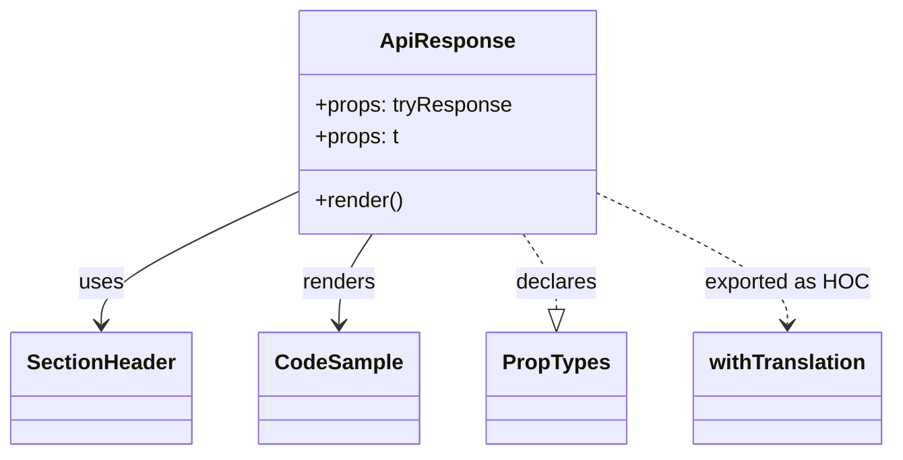

# Diagram: web/portal/src/modules/documentation/documentation-styled-components/ApiResponse.js


> Auto-generated by Obscura crawlers

## Diagram 1



### SVG

<svg id="container" width="651.890625" xmlns="http://www.w3.org/2000/svg" class="classDiagram" height="342" viewBox="0 0 651.890625 342" role="graphics-document document" aria-roledescription="class"><style>#container{font-family:"trebuchet ms",verdana,arial,sans-serif;font-size:16px;fill:#333;}@keyframes edge-animation-frame{from{stroke-dashoffset:0;}}@keyframes dash{to{stroke-dashoffset:0;}}#container .edge-animation-slow{stroke-dasharray:9,5!important;stroke-dashoffset:900;animation:dash 50s linear infinite;stroke-linecap:round;}#container .edge-animation-fast{stroke-dasharray:9,5!important;stroke-dashoffset:900;animation:dash 20s linear infinite;stroke-linecap:round;}#container .error-icon{fill:#552222;}#container .error-text{fill:#552222;stroke:#552222;}#container .edge-thickness-normal{stroke-width:1px;}#container .edge-thickness-thick{stroke-width:3.5px;}#container .edge-pattern-solid{stroke-dasharray:0;}#container .edge-thickness-invisible{stroke-width:0;fill:none;}#container .edge-pattern-dashed{stroke-dasharray:3;}#container .edge-pattern-dotted{stroke-dasharray:2;}#container .marker{fill:#333333;stroke:#333333;}#container .marker.cross{stroke:#333333;}#container svg{font-family:"trebuchet ms",verdana,arial,sans-serif;font-size:16px;}#container p{margin:0;}#container g.classGroup text{fill:#9370DB;stroke:none;font-family:"trebuchet ms",verdana,arial,sans-serif;font-size:10px;}#container g.classGroup text .title{font-weight:bolder;}#container .nodeLabel,#container .edgeLabel{color:#131300;}#container .edgeLabel .label rect{fill:#ECECFF;}#container .label text{fill:#131300;}#container .labelBkg{background:#ECECFF;}#container .edgeLabel .label span{background:#ECECFF;}#container .classTitle{font-weight:bolder;}#container .node rect,#container .node circle,#container .node ellipse,#container .node polygon,#container .node path{fill:#ECECFF;stroke:#9370DB;stroke-width:1px;}#container .divider{stroke:#9370DB;stroke-width:1;}#container g.clickable{cursor:pointer;}#container g.classGroup rect{fill:#ECECFF;stroke:#9370DB;}#container g.classGroup line{stroke:#9370DB;stroke-width:1;}#container .classLabel .box{stroke:none;stroke-width:0;fill:#ECECFF;opacity:0.5;}#container .classLabel .label{fill:#9370DB;font-size:10px;}#container .relation{stroke:#333333;stroke-width:1;fill:none;}#container .dashed-line{stroke-dasharray:3;}#container .dotted-line{stroke-dasharray:1 2;}#container #compositionStart,#container .composition{fill:#333333!important;stroke:#333333!important;stroke-width:1;}#container #compositionEnd,#container .composition{fill:#333333!important;stroke:#333333!important;stroke-width:1;}#container #dependencyStart,#container .dependency{fill:#333333!important;stroke:#333333!important;stroke-width:1;}#container #dependencyStart,#container .dependency{fill:#333333!important;stroke:#333333!important;stroke-width:1;}#container #extensionStart,#container .extension{fill:transparent!important;stroke:#333333!important;stroke-width:1;}#container #extensionEnd,#container .extension{fill:transparent!important;stroke:#333333!important;stroke-width:1;}#container #aggregationStart,#container .aggregation{fill:transparent!important;stroke:#333333!important;stroke-width:1;}#container #aggregationEnd,#container .aggregation{fill:transparent!important;stroke:#333333!important;stroke-width:1;}#container #lollipopStart,#container .lollipop{fill:#ECECFF!important;stroke:#333333!important;stroke-width:1;}#container #lollipopEnd,#container .lollipop{fill:#ECECFF!important;stroke:#333333!important;stroke-width:1;}#container .edgeTerminals{font-size:11px;line-height:initial;}#container .classTitleText{text-anchor:middle;font-size:18px;fill:#333;}#container .label-icon{display:inline-block;height:1em;overflow:visible;vertical-align:-0.125em;}#container .node .label-icon path{fill:currentColor;stroke:revert;stroke-width:revert;}#container :root{--mermaid-font-family:"trebuchet ms",verdana,arial,sans-serif;}</style><g><defs><marker id="container_class-aggregationStart" class="marker aggregation class" refX="18" refY="7" markerWidth="190" markerHeight="240" orient="auto"><path d="M 18,7 L9,13 L1,7 L9,1 Z"></path></marker></defs><defs><marker id="container_class-aggregationEnd" class="marker aggregation class" refX="1" refY="7" markerWidth="20" markerHeight="28" orient="auto"><path d="M 18,7 L9,13 L1,7 L9,1 Z"></path></marker></defs><defs><marker id="container_class-extensionStart" class="marker extension class" refX="18" refY="7" markerWidth="190" markerHeight="240" orient="auto"><path d="M 1,7 L18,13 V 1 Z"></path></marker></defs><defs><marker id="container_class-extensionEnd" class="marker extension class" refX="1" refY="7" markerWidth="20" markerHeight="28" orient="auto"><path d="M 1,1 V 13 L18,7 Z"></path></marker></defs><defs><marker id="container_class-compositionStart" class="marker composition class" refX="18" refY="7" markerWidth="190" markerHeight="240" orient="auto"><path d="M 18,7 L9,13 L1,7 L9,1 Z"></path></marker></defs><defs><marker id="container_class-compositionEnd" class="marker composition class" refX="1" refY="7" markerWidth="20" markerHeight="28" orient="auto"><path d="M 18,7 L9,13 L1,7 L9,1 Z"></path></marker></defs><defs><marker id="container_class-dependencyStart" class="marker dependency class" refX="6" refY="7" markerWidth="190" markerHeight="240" orient="auto"><path d="M 5,7 L9,13 L1,7 L9,1 Z"></path></marker></defs><defs><marker id="container_class-dependencyEnd" class="marker dependency class" refX="13" refY="7" markerWidth="20" markerHeight="28" orient="auto"><path d="M 18,7 L9,13 L14,7 L9,1 Z"></path></marker></defs><defs><marker id="container_class-lollipopStart" class="marker lollipop class" refX="13" refY="7" markerWidth="190" markerHeight="240" orient="auto"><circle stroke="black" fill="transparent" cx="7" cy="7" r="6"></circle></marker></defs><defs><marker id="container_class-lollipopEnd" class="marker lollipop class" refX="1" refY="7" markerWidth="190" markerHeight="240" orient="auto"><circle stroke="black" fill="transparent" cx="7" cy="7" r="6"></circle></marker></defs><g class="root"><g class="clusters"></g><g class="edgePaths"><path d="M217.023,144.408L193.174,155.84C169.326,167.272,121.628,190.136,97.779,206.735C73.93,223.333,73.93,233.667,73.93,238.833L73.93,244" id="id_ApiResponse_SectionHeader_1" class="edge-thickness-normal edge-pattern-solid relation" style=";;;" data-edge="true" data-et="edge" data-id="id_ApiResponse_SectionHeader_1" data-points="W3sieCI6MjE3LjAyMzQzNzUsInkiOjE0NC40MDgxODAwMDM0MDQ0OH0seyJ4Ijo3My45Mjk2ODc1LCJ5IjoyMTN9LHsieCI6NzMuOTI5Njg3NSwieSI6MjUwfV0=" marker-end="url(#container_class-dependencyEnd)"></path><path d="M271.569,176L267.547,182.167C263.525,188.333,255.481,200.667,251.459,212C247.438,223.333,247.438,233.667,247.438,238.833L247.438,244" id="id_ApiResponse_CodeSample_2" class="edge-thickness-normal edge-pattern-solid relation" style=";;;" data-edge="true" data-et="edge" data-id="id_ApiResponse_CodeSample_2" data-points="W3sieCI6MjcxLjU2OTQ0MDg1NzQzOCwieSI6MTc2fSx7IngiOjI0Ny40Mzc1LCJ5IjoyMTN9LHsieCI6MjQ3LjQzNzUsInkiOjI1MH1d" marker-end="url(#container_class-dependencyEnd)"></path><path d="M381.141,176L385.163,182.167C389.185,188.333,397.229,200.667,401.251,210.125C405.273,219.583,405.273,226.167,405.273,229.458L405.273,232.75" id="id_ApiResponse_PropTypes_3" class="edge-thickness-normal edge-pattern-dashed relation" style=";;;" data-edge="true" data-et="edge" data-id="id_ApiResponse_PropTypes_3" data-points="W3sieCI6MzgxLjE0MTQ5NjY0MjU2MiwieSI6MTc2fSx7IngiOjQwNS4yNzM0Mzc1LCJ5IjoyMTN9LHsieCI6NDA1LjI3MzQzNzUsInkiOjI1MH1d" marker-end="url(#container_class-extensionEnd)"></path><path d="M435.688,145.267L458.858,156.556C482.029,167.845,528.37,190.422,551.54,206.878C574.711,223.333,574.711,233.667,574.711,238.833L574.711,244" id="id_ApiResponse_withTranslation_4" class="edge-thickness-normal edge-pattern-dashed relation" style=";;;" data-edge="true" data-et="edge" data-id="id_ApiResponse_withTranslation_4" data-points="W3sieCI6NDM1LjY4NzUsInkiOjE0NS4yNjcxMDA3NzIyNjc1OH0seyJ4Ijo1NzQuNzEwOTM3NSwieSI6MjEzfSx7IngiOjU3NC43MTA5Mzc1LCJ5IjoyNTB9XQ==" marker-end="url(#container_class-dependencyEnd)"></path></g><g class="edgeLabels"><g class="edgeLabel" transform="translate(73.9296875, 213)"><g class="label" data-id="id_ApiResponse_SectionHeader_1" transform="translate(-16.4921875, -12)"><foreignObject width="32.984375" height="24"><div xmlns="http://www.w3.org/1999/xhtml" class="labelBkg" style="display: table-cell; white-space: nowrap; line-height: 1.5; max-width: 200px; text-align: center;"><span class="edgeLabel"><p>uses</p></span></div></foreignObject></g></g><g class="edgeLabel" transform="translate(247.4375, 213)"><g class="label" data-id="id_ApiResponse_CodeSample_2" transform="translate(-27.75, -12)"><foreignObject width="55.5" height="24"><div xmlns="http://www.w3.org/1999/xhtml" class="labelBkg" style="display: table-cell; white-space: nowrap; line-height: 1.5; max-width: 200px; text-align: center;"><span class="edgeLabel"><p>renders</p></span></div></foreignObject></g></g><g class="edgeLabel" transform="translate(405.2734375, 213)"><g class="label" data-id="id_ApiResponse_PropTypes_3" transform="translate(-30.5703125, -12)"><foreignObject width="61.140625" height="24"><div xmlns="http://www.w3.org/1999/xhtml" class="labelBkg" style="display: table-cell; white-space: nowrap; line-height: 1.5; max-width: 200px; text-align: center;"><span class="edgeLabel"><p>declares</p></span></div></foreignObject></g></g><g class="edgeLabel" transform="translate(574.7109375, 213)"><g class="label" data-id="id_ApiResponse_withTranslation_4" transform="translate(-60.296875, -12)"><foreignObject width="120.59375" height="24"><div xmlns="http://www.w3.org/1999/xhtml" class="labelBkg" style="display: table-cell; white-space: nowrap; line-height: 1.5; max-width: 200px; text-align: center;"><span class="edgeLabel"><p>exported as HOC</p></span></div></foreignObject></g></g></g><g class="nodes"><g class="node default" id="classId-ApiResponse-0" transform="translate(326.35546875, 92)"><g class="basic label-container"><path d="M-109.33203125 -84 L109.33203125 -84 L109.33203125 84 L-109.33203125 84" stroke="none" stroke-width="0" fill="#ECECFF" style=""></path><path d="M-109.33203125 -84 C-26.470774039826722 -84, 56.390483170346556 -84, 109.33203125 -84 M-109.33203125 -84 C-50.12372725550176 -84, 9.084576738996475 -84, 109.33203125 -84 M109.33203125 -84 C109.33203125 -38.486301192689574, 109.33203125 7.0273976146208526, 109.33203125 84 M109.33203125 -84 C109.33203125 -49.931538787286286, 109.33203125 -15.863077574572571, 109.33203125 84 M109.33203125 84 C46.51125870151351 84, -16.309513846972976 84, -109.33203125 84 M109.33203125 84 C50.697808032057516 84, -7.936415185884968 84, -109.33203125 84 M-109.33203125 84 C-109.33203125 26.13372655173194, -109.33203125 -31.73254689653612, -109.33203125 -84 M-109.33203125 84 C-109.33203125 43.17259909106539, -109.33203125 2.345198182130787, -109.33203125 -84" stroke="#9370DB" stroke-width="1.3" fill="none" stroke-dasharray="0 0" style=""></path></g><g class="annotation-group text" transform="translate(0, -60)"></g><g class="label-group text" transform="translate(-47.1953125, -60)"><g class="label" style="font-weight: bolder" transform="translate(0,-12)"><foreignObject width="94.390625" height="24"><div xmlns="http://www.w3.org/1999/xhtml" style="display: table-cell; white-space: nowrap; line-height: 1.5; max-width: 143px; text-align: center;"><span class="nodeLabel markdown-node-label" style=""><p>ApiResponse</p></span></div></foreignObject></g></g><g class="members-group text" transform="translate(-97.33203125, -12)"><g class="label" style="" transform="translate(0,-12)"><foreignObject width="147.46875" height="24"><div xmlns="http://www.w3.org/1999/xhtml" style="display: table-cell; white-space: nowrap; line-height: 1.5; max-width: 205px; text-align: center;"><span class="nodeLabel markdown-node-label" style=""><p>+props: tryResponse</p></span></div></foreignObject></g><g class="label" style="" transform="translate(0,12)"><foreignObject width="63.375" height="24"><div xmlns="http://www.w3.org/1999/xhtml" style="display: table-cell; white-space: nowrap; line-height: 1.5; max-width: 121px; text-align: center;"><span class="nodeLabel markdown-node-label" style=""><p>+props: t</p></span></div></foreignObject></g></g><g class="methods-group text" transform="translate(-97.33203125, 60)"><g class="label" style="" transform="translate(0,-12)"><foreignObject width="66.609375" height="24"><div xmlns="http://www.w3.org/1999/xhtml" style="display: table-cell; white-space: nowrap; line-height: 1.5; max-width: 124px; text-align: center;"><span class="nodeLabel markdown-node-label" style=""><p>+render()</p></span></div></foreignObject></g></g><g class="divider" style=""><path d="M-109.33203125 -36 C-28.99351375618693 -36, 51.34500373762614 -36, 109.33203125 -36 M-109.33203125 -36 C-34.24534624419722 -36, 40.841338761605556 -36, 109.33203125 -36" stroke="#9370DB" stroke-width="1.3" fill="none" stroke-dasharray="0 0" style=""></path></g><g class="divider" style=""><path d="M-109.33203125 36 C-38.08515760729249 36, 33.161716035415026 36, 109.33203125 36 M-109.33203125 36 C-22.018482632753546 36, 65.29506598449291 36, 109.33203125 36" stroke="#9370DB" stroke-width="1.3" fill="none" stroke-dasharray="0 0" style=""></path></g></g><g class="node default" id="classId-SectionHeader-1" transform="translate(73.9296875, 292)"><g class="basic label-container"><path d="M-65.9296875 -42 L65.9296875 -42 L65.9296875 42 L-65.9296875 42" stroke="none" stroke-width="0" fill="#ECECFF" style=""></path><path d="M-65.9296875 -42 C-34.11171408996117 -42, -2.2937406799223297 -42, 65.9296875 -42 M-65.9296875 -42 C-17.638442216204453 -42, 30.652803067591094 -42, 65.9296875 -42 M65.9296875 -42 C65.9296875 -25.140917217472364, 65.9296875 -8.281834434944727, 65.9296875 42 M65.9296875 -42 C65.9296875 -21.154549734336896, 65.9296875 -0.3090994686737929, 65.9296875 42 M65.9296875 42 C30.9495226986674 42, -4.0306421026651975 42, -65.9296875 42 M65.9296875 42 C39.43091609695131 42, 12.932144693902615 42, -65.9296875 42 M-65.9296875 42 C-65.9296875 23.777109264147292, -65.9296875 5.554218528294584, -65.9296875 -42 M-65.9296875 42 C-65.9296875 24.793191932483108, -65.9296875 7.586383864966216, -65.9296875 -42" stroke="#9370DB" stroke-width="1.3" fill="none" stroke-dasharray="0 0" style=""></path></g><g class="annotation-group text" transform="translate(0, -18)"></g><g class="label-group text" transform="translate(-53.9296875, -18)"><g class="label" style="font-weight: bolder" transform="translate(0,-12)"><foreignObject width="107.859375" height="24"><div xmlns="http://www.w3.org/1999/xhtml" style="display: table-cell; white-space: nowrap; line-height: 1.5; max-width: 158px; text-align: center;"><span class="nodeLabel markdown-node-label" style=""><p>SectionHeader</p></span></div></foreignObject></g></g><g class="members-group text" transform="translate(-53.9296875, 30)"></g><g class="methods-group text" transform="translate(-53.9296875, 60)"></g><g class="divider" style=""><path d="M-65.9296875 6 C-29.498667656137393 6, 6.932352187725215 6, 65.9296875 6 M-65.9296875 6 C-13.191268344015683 6, 39.547150811968635 6, 65.9296875 6" stroke="#9370DB" stroke-width="1.3" fill="none" stroke-dasharray="0 0" style=""></path></g><g class="divider" style=""><path d="M-65.9296875 24 C-26.28379776692342 24, 13.362091966153159 24, 65.9296875 24 M-65.9296875 24 C-22.013930356402042 24, 21.901826787195915 24, 65.9296875 24" stroke="#9370DB" stroke-width="1.3" fill="none" stroke-dasharray="0 0" style=""></path></g></g><g class="node default" id="classId-CodeSample-2" transform="translate(247.4375, 292)"><g class="basic label-container"><path d="M-57.578125 -42 L57.578125 -42 L57.578125 42 L-57.578125 42" stroke="none" stroke-width="0" fill="#ECECFF" style=""></path><path d="M-57.578125 -42 C-33.72650392023295 -42, -9.8748828404659 -42, 57.578125 -42 M-57.578125 -42 C-22.757213560846004 -42, 12.063697878307991 -42, 57.578125 -42 M57.578125 -42 C57.578125 -24.658950547013053, 57.578125 -7.317901094026105, 57.578125 42 M57.578125 -42 C57.578125 -18.45256521674378, 57.578125 5.094869566512443, 57.578125 42 M57.578125 42 C21.432854677669134 42, -14.712415644661732 42, -57.578125 42 M57.578125 42 C21.709390612301434 42, -14.159343775397133 42, -57.578125 42 M-57.578125 42 C-57.578125 15.232005064531009, -57.578125 -11.535989870937982, -57.578125 -42 M-57.578125 42 C-57.578125 14.782143810319322, -57.578125 -12.435712379361355, -57.578125 -42" stroke="#9370DB" stroke-width="1.3" fill="none" stroke-dasharray="0 0" style=""></path></g><g class="annotation-group text" transform="translate(0, -18)"></g><g class="label-group text" transform="translate(-45.578125, -18)"><g class="label" style="font-weight: bolder" transform="translate(0,-12)"><foreignObject width="91.15625" height="24"><div xmlns="http://www.w3.org/1999/xhtml" style="display: table-cell; white-space: nowrap; line-height: 1.5; max-width: 140px; text-align: center;"><span class="nodeLabel markdown-node-label" style=""><p>CodeSample</p></span></div></foreignObject></g></g><g class="members-group text" transform="translate(-45.578125, 30)"></g><g class="methods-group text" transform="translate(-45.578125, 60)"></g><g class="divider" style=""><path d="M-57.578125 6 C-23.332000847210665 6, 10.91412330557867 6, 57.578125 6 M-57.578125 6 C-27.600902538878792 6, 2.3763199222424163 6, 57.578125 6" stroke="#9370DB" stroke-width="1.3" fill="none" stroke-dasharray="0 0" style=""></path></g><g class="divider" style=""><path d="M-57.578125 24 C-20.00101353475928 24, 17.57609793048144 24, 57.578125 24 M-57.578125 24 C-17.203234449713428 24, 23.171656100573145 24, 57.578125 24" stroke="#9370DB" stroke-width="1.3" fill="none" stroke-dasharray="0 0" style=""></path></g></g><g class="node default" id="classId-PropTypes-3" transform="translate(405.2734375, 292)"><g class="basic label-container"><path d="M-50.2578125 -42 L50.2578125 -42 L50.2578125 42 L-50.2578125 42" stroke="none" stroke-width="0" fill="#ECECFF" style=""></path><path d="M-50.2578125 -42 C-18.85896175441091 -42, 12.53988899117818 -42, 50.2578125 -42 M-50.2578125 -42 C-10.912928255028831 -42, 28.431955989942338 -42, 50.2578125 -42 M50.2578125 -42 C50.2578125 -11.421389213721834, 50.2578125 19.15722157255633, 50.2578125 42 M50.2578125 -42 C50.2578125 -17.197975704835443, 50.2578125 7.604048590329114, 50.2578125 42 M50.2578125 42 C13.773655496288349 42, -22.710501507423302 42, -50.2578125 42 M50.2578125 42 C21.97420768869828 42, -6.309397122603443 42, -50.2578125 42 M-50.2578125 42 C-50.2578125 14.045378869756455, -50.2578125 -13.90924226048709, -50.2578125 -42 M-50.2578125 42 C-50.2578125 12.46570273520507, -50.2578125 -17.06859452958986, -50.2578125 -42" stroke="#9370DB" stroke-width="1.3" fill="none" stroke-dasharray="0 0" style=""></path></g><g class="annotation-group text" transform="translate(0, -18)"></g><g class="label-group text" transform="translate(-38.2578125, -18)"><g class="label" style="font-weight: bolder" transform="translate(0,-12)"><foreignObject width="76.515625" height="24"><div xmlns="http://www.w3.org/1999/xhtml" style="display: table-cell; white-space: nowrap; line-height: 1.5; max-width: 125px; text-align: center;"><span class="nodeLabel markdown-node-label" style=""><p>PropTypes</p></span></div></foreignObject></g></g><g class="members-group text" transform="translate(-38.2578125, 30)"></g><g class="methods-group text" transform="translate(-38.2578125, 60)"></g><g class="divider" style=""><path d="M-50.2578125 6 C-19.243847104587676 6, 11.770118290824648 6, 50.2578125 6 M-50.2578125 6 C-21.591737045317462 6, 7.074338409365076 6, 50.2578125 6" stroke="#9370DB" stroke-width="1.3" fill="none" stroke-dasharray="0 0" style=""></path></g><g class="divider" style=""><path d="M-50.2578125 24 C-19.029574645509694 24, 12.198663208980612 24, 50.2578125 24 M-50.2578125 24 C-15.324653195228144 24, 19.60850610954371 24, 50.2578125 24" stroke="#9370DB" stroke-width="1.3" fill="none" stroke-dasharray="0 0" style=""></path></g></g><g class="node default" id="classId-withTranslation-4" transform="translate(574.7109375, 292)"><g class="basic label-container"><path d="M-69.1796875 -42 L69.1796875 -42 L69.1796875 42 L-69.1796875 42" stroke="none" stroke-width="0" fill="#ECECFF" style=""></path><path d="M-69.1796875 -42 C-40.52008451858601 -42, -11.86048153717202 -42, 69.1796875 -42 M-69.1796875 -42 C-39.398207670406094 -42, -9.616727840812182 -42, 69.1796875 -42 M69.1796875 -42 C69.1796875 -22.262626066511764, 69.1796875 -2.5252521330235282, 69.1796875 42 M69.1796875 -42 C69.1796875 -15.72534242937968, 69.1796875 10.54931514124064, 69.1796875 42 M69.1796875 42 C39.26453870195911 42, 9.34938990391823 42, -69.1796875 42 M69.1796875 42 C32.913063131571505 42, -3.35356123685699 42, -69.1796875 42 M-69.1796875 42 C-69.1796875 9.620995921880997, -69.1796875 -22.758008156238006, -69.1796875 -42 M-69.1796875 42 C-69.1796875 24.27417423935032, -69.1796875 6.548348478700639, -69.1796875 -42" stroke="#9370DB" stroke-width="1.3" fill="none" stroke-dasharray="0 0" style=""></path></g><g class="annotation-group text" transform="translate(0, -18)"></g><g class="label-group text" transform="translate(-57.1796875, -18)"><g class="label" style="font-weight: bolder" transform="translate(0,-12)"><foreignObject width="114.359375" height="24"><div xmlns="http://www.w3.org/1999/xhtml" style="display: table-cell; white-space: nowrap; line-height: 1.5; max-width: 162px; text-align: center;"><span class="nodeLabel markdown-node-label" style=""><p>withTranslation</p></span></div></foreignObject></g></g><g class="members-group text" transform="translate(-57.1796875, 30)"></g><g class="methods-group text" transform="translate(-57.1796875, 60)"></g><g class="divider" style=""><path d="M-69.1796875 6 C-24.77559690956126 6, 19.628493680877483 6, 69.1796875 6 M-69.1796875 6 C-38.183542323917 6, -7.187397147834005 6, 69.1796875 6" stroke="#9370DB" stroke-width="1.3" fill="none" stroke-dasharray="0 0" style=""></path></g><g class="divider" style=""><path d="M-69.1796875 24 C-38.963678381938635 24, -8.747669263877263 24, 69.1796875 24 M-69.1796875 24 C-26.35936228124595 24, 16.4609629375081 24, 69.1796875 24" stroke="#9370DB" stroke-width="1.3" fill="none" stroke-dasharray="0 0" style=""></path></g></g></g></g></g></svg>

## Diagram 2

```mermaid
flowchart TD
    TR[tryResponse] --> CHECK{has tryResponse.data?}
    CHECK -- yes --> CS[CodeSample\ncode = tryResponse.data]
    CHECK -- no --> CS[CodeSample\ncode = {}]
    T[t("API Response")] --> SH[SectionHeader\ntitle = "API Response"]
    SH --> API[ApiResponse component]
    API --> CS
    subgraph imports
        P[PropTypes]
        WT[withTranslation]
        SH
        CS
    end
    P -.-> API
    WT -.-> API
```

> SVG rendering failed for this diagram.
