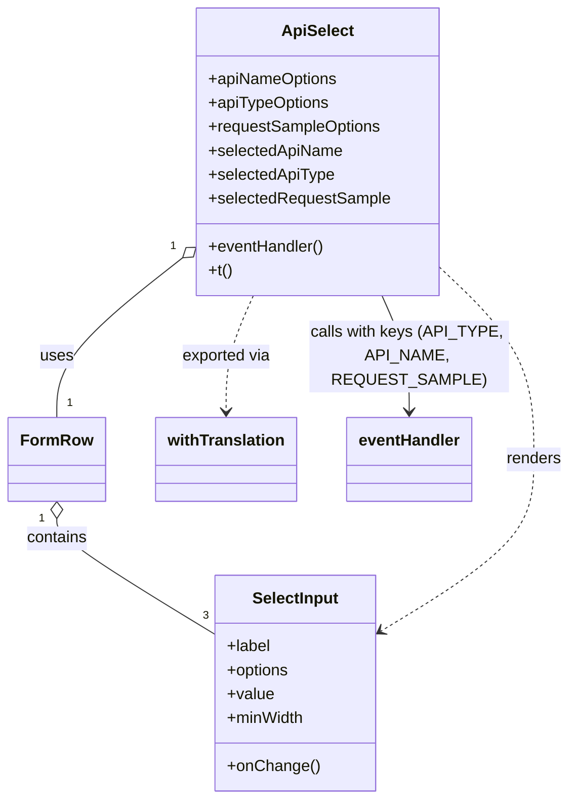

# Diagram: web/portal/src/modules/documentation/documentation-styled-components/ApiSelect.js


> Auto-generated by Obscura crawlers

## Diagram 1



### SVG

<svg id="container" width="559.546875" xmlns="http://www.w3.org/2000/svg" class="classDiagram" height="800" viewBox="0 0 559.546875 800" role="graphics-document document" aria-roledescription="class"><style>#container{font-family:"trebuchet ms",verdana,arial,sans-serif;font-size:16px;fill:#333;}@keyframes edge-animation-frame{from{stroke-dashoffset:0;}}@keyframes dash{to{stroke-dashoffset:0;}}#container .edge-animation-slow{stroke-dasharray:9,5!important;stroke-dashoffset:900;animation:dash 50s linear infinite;stroke-linecap:round;}#container .edge-animation-fast{stroke-dasharray:9,5!important;stroke-dashoffset:900;animation:dash 20s linear infinite;stroke-linecap:round;}#container .error-icon{fill:#552222;}#container .error-text{fill:#552222;stroke:#552222;}#container .edge-thickness-normal{stroke-width:1px;}#container .edge-thickness-thick{stroke-width:3.5px;}#container .edge-pattern-solid{stroke-dasharray:0;}#container .edge-thickness-invisible{stroke-width:0;fill:none;}#container .edge-pattern-dashed{stroke-dasharray:3;}#container .edge-pattern-dotted{stroke-dasharray:2;}#container .marker{fill:#333333;stroke:#333333;}#container .marker.cross{stroke:#333333;}#container svg{font-family:"trebuchet ms",verdana,arial,sans-serif;font-size:16px;}#container p{margin:0;}#container g.classGroup text{fill:#9370DB;stroke:none;font-family:"trebuchet ms",verdana,arial,sans-serif;font-size:10px;}#container g.classGroup text .title{font-weight:bolder;}#container .nodeLabel,#container .edgeLabel{color:#131300;}#container .edgeLabel .label rect{fill:#ECECFF;}#container .label text{fill:#131300;}#container .labelBkg{background:#ECECFF;}#container .edgeLabel .label span{background:#ECECFF;}#container .classTitle{font-weight:bolder;}#container .node rect,#container .node circle,#container .node ellipse,#container .node polygon,#container .node path{fill:#ECECFF;stroke:#9370DB;stroke-width:1px;}#container .divider{stroke:#9370DB;stroke-width:1;}#container g.clickable{cursor:pointer;}#container g.classGroup rect{fill:#ECECFF;stroke:#9370DB;}#container g.classGroup line{stroke:#9370DB;stroke-width:1;}#container .classLabel .box{stroke:none;stroke-width:0;fill:#ECECFF;opacity:0.5;}#container .classLabel .label{fill:#9370DB;font-size:10px;}#container .relation{stroke:#333333;stroke-width:1;fill:none;}#container .dashed-line{stroke-dasharray:3;}#container .dotted-line{stroke-dasharray:1 2;}#container #compositionStart,#container .composition{fill:#333333!important;stroke:#333333!important;stroke-width:1;}#container #compositionEnd,#container .composition{fill:#333333!important;stroke:#333333!important;stroke-width:1;}#container #dependencyStart,#container .dependency{fill:#333333!important;stroke:#333333!important;stroke-width:1;}#container #dependencyStart,#container .dependency{fill:#333333!important;stroke:#333333!important;stroke-width:1;}#container #extensionStart,#container .extension{fill:transparent!important;stroke:#333333!important;stroke-width:1;}#container #extensionEnd,#container .extension{fill:transparent!important;stroke:#333333!important;stroke-width:1;}#container #aggregationStart,#container .aggregation{fill:transparent!important;stroke:#333333!important;stroke-width:1;}#container #aggregationEnd,#container .aggregation{fill:transparent!important;stroke:#333333!important;stroke-width:1;}#container #lollipopStart,#container .lollipop{fill:#ECECFF!important;stroke:#333333!important;stroke-width:1;}#container #lollipopEnd,#container .lollipop{fill:#ECECFF!important;stroke:#333333!important;stroke-width:1;}#container .edgeTerminals{font-size:11px;line-height:initial;}#container .classTitleText{text-anchor:middle;font-size:18px;fill:#333;}#container .label-icon{display:inline-block;height:1em;overflow:visible;vertical-align:-0.125em;}#container .node .label-icon path{fill:currentColor;stroke:revert;stroke-width:revert;}#container :root{--mermaid-font-family:"trebuchet ms",verdana,arial,sans-serif;}</style><g><defs><marker id="container_class-aggregationStart" class="marker aggregation class" refX="18" refY="7" markerWidth="190" markerHeight="240" orient="auto"><path d="M 18,7 L9,13 L1,7 L9,1 Z"></path></marker></defs><defs><marker id="container_class-aggregationEnd" class="marker aggregation class" refX="1" refY="7" markerWidth="20" markerHeight="28" orient="auto"><path d="M 18,7 L9,13 L1,7 L9,1 Z"></path></marker></defs><defs><marker id="container_class-extensionStart" class="marker extension class" refX="18" refY="7" markerWidth="190" markerHeight="240" orient="auto"><path d="M 1,7 L18,13 V 1 Z"></path></marker></defs><defs><marker id="container_class-extensionEnd" class="marker extension class" refX="1" refY="7" markerWidth="20" markerHeight="28" orient="auto"><path d="M 1,1 V 13 L18,7 Z"></path></marker></defs><defs><marker id="container_class-compositionStart" class="marker composition class" refX="18" refY="7" markerWidth="190" markerHeight="240" orient="auto"><path d="M 18,7 L9,13 L1,7 L9,1 Z"></path></marker></defs><defs><marker id="container_class-compositionEnd" class="marker composition class" refX="1" refY="7" markerWidth="20" markerHeight="28" orient="auto"><path d="M 18,7 L9,13 L1,7 L9,1 Z"></path></marker></defs><defs><marker id="container_class-dependencyStart" class="marker dependency class" refX="6" refY="7" markerWidth="190" markerHeight="240" orient="auto"><path d="M 5,7 L9,13 L1,7 L9,1 Z"></path></marker></defs><defs><marker id="container_class-dependencyEnd" class="marker dependency class" refX="13" refY="7" markerWidth="20" markerHeight="28" orient="auto"><path d="M 18,7 L9,13 L14,7 L9,1 Z"></path></marker></defs><defs><marker id="container_class-lollipopStart" class="marker lollipop class" refX="13" refY="7" markerWidth="190" markerHeight="240" orient="auto"><circle stroke="black" fill="transparent" cx="7" cy="7" r="6"></circle></marker></defs><defs><marker id="container_class-lollipopEnd" class="marker lollipop class" refX="1" refY="7" markerWidth="190" markerHeight="240" orient="auto"><circle stroke="black" fill="transparent" cx="7" cy="7" r="6"></circle></marker></defs><g class="root"><g class="clusters"></g><g class="edgePaths"><path d="M175.416,259.303L155.137,275.586C134.858,291.869,94.3,324.434,74.021,350.884C53.742,377.333,53.742,397.667,53.742,407.833L53.742,418" id="id_ApiSelect_FormRow_1" class="edge-thickness-normal edge-pattern-solid relation" style=";;;" data-edge="true" data-et="edge" data-id="id_ApiSelect_FormRow_1" data-points="W3sieCI6MTg4Ljg2NzE4NzUsInkiOjI0OC41MDMwNTk5NzU1MjAyMn0seyJ4Ijo1My43NDIxODc1LCJ5IjozNTd9LHsieCI6NTMuNzQyMTg3NSwieSI6NDE4fV0=" marker-start="url(#container_class-aggregationStart)"></path><path d="M53.742,519.25L53.742,522.542C53.742,525.833,53.742,532.417,79.897,551.845C106.052,571.273,158.362,603.545,184.517,619.681L210.672,635.818" id="id_FormRow_SelectInput_2" class="edge-thickness-normal edge-pattern-solid relation" style=";;;" data-edge="true" data-et="edge" data-id="id_FormRow_SelectInput_2" data-points="W3sieCI6NTMuNzQyMTg3NSwieSI6NTAyfSx7IngiOjUzLjc0MjE4NzUsInkiOjUzOX0seyJ4IjoyMTAuNjcxODc1LCJ5Ijo2MzUuODE3NjkwNzYwNzE2fV0=" marker-start="url(#container_class-aggregationStart)"></path><path d="M429.242,266.735L445.001,281.779C460.76,296.823,492.279,326.912,508.038,359.122C523.797,391.333,523.797,425.667,523.797,456C523.797,486.333,523.797,512.667,498.493,541.445C473.189,570.222,422.581,601.445,397.277,617.056L371.974,632.667" id="id_ApiSelect_SelectInput_3" class="edge-thickness-normal edge-pattern-dashed relation" style=";;;" data-edge="true" data-et="edge" data-id="id_ApiSelect_SelectInput_3" data-points="W3sieCI6NDI5LjI0MjE4NzUsInkiOjI2Ni43MzQ5NjU2MjAxMTEzfSx7IngiOjUyMy43OTY4NzUsInkiOjM1N30seyJ4Ijo1MjMuNzk2ODc1LCJ5Ijo0NjB9LHsieCI6NTIzLjc5Njg3NSwieSI6NTM5fSx7IngiOjM2Ni44NjcxODc1LCJ5Ijo2MzUuODE3NjkwNzYwNzE2fV0=" marker-end="url(#container_class-dependencyEnd)"></path><path d="M245.561,296L241.078,306.167C236.595,316.333,227.63,336.667,223.147,356C218.664,375.333,218.664,393.667,218.664,402.833L218.664,412" id="id_ApiSelect_withTranslation_4" class="edge-thickness-normal edge-pattern-dashed relation" style=";;;" data-edge="true" data-et="edge" data-id="id_ApiSelect_withTranslation_4" data-points="W3sieCI6MjQ1LjU2MDc4NTA2MDk3NTYsInkiOjI5Nn0seyJ4IjoyMTguNjY0MDYyNSwieSI6MzU3fSx7IngiOjIxOC42NjQwNjI1LCJ5Ijo0MTh9XQ==" marker-end="url(#container_class-dependencyEnd)"></path><path d="M372.549,296L377.031,306.167C381.514,316.333,390.48,336.667,394.963,356C399.445,375.333,399.445,393.667,399.445,402.833L399.445,412" id="id_ApiSelect_eventHandler_5" class="edge-thickness-normal edge-pattern-solid relation" style=";;;" data-edge="true" data-et="edge" data-id="id_ApiSelect_eventHandler_5" data-points="W3sieCI6MzcyLjU0ODU4OTkzOTAyNDQsInkiOjI5Nn0seyJ4IjozOTkuNDQ1MzEyNSwieSI6MzU3fSx7IngiOjM5OS40NDUzMTI1LCJ5Ijo0MTh9XQ==" marker-end="url(#container_class-dependencyEnd)"></path></g><g class="edgeLabels"><g class="edgeLabel" transform="translate(53.7421875, 357)"><g class="label" data-id="id_ApiSelect_FormRow_1" transform="translate(-16.4921875, -12)"><foreignObject width="32.984375" height="24"><div xmlns="http://www.w3.org/1999/xhtml" class="labelBkg" style="display: table-cell; white-space: nowrap; line-height: 1.5; max-width: 200px; text-align: center;"><span class="edgeLabel"><p>uses</p></span></div></foreignObject></g></g><g class="edgeLabel" transform="translate(53.7421875, 539)"><g class="label" data-id="id_FormRow_SelectInput_2" transform="translate(-30.890625, -12)"><foreignObject width="61.78125" height="24"><div xmlns="http://www.w3.org/1999/xhtml" class="labelBkg" style="display: table-cell; white-space: nowrap; line-height: 1.5; max-width: 200px; text-align: center;"><span class="edgeLabel"><p>contains</p></span></div></foreignObject></g></g><g class="edgeLabel" transform="translate(523.796875, 460)"><g class="label" data-id="id_ApiSelect_SelectInput_3" transform="translate(-27.75, -12)"><foreignObject width="55.5" height="24"><div xmlns="http://www.w3.org/1999/xhtml" class="labelBkg" style="display: table-cell; white-space: nowrap; line-height: 1.5; max-width: 200px; text-align: center;"><span class="edgeLabel"><p>renders</p></span></div></foreignObject></g></g><g class="edgeLabel" transform="translate(218.6640625, 357)"><g class="label" data-id="id_ApiSelect_withTranslation_4" transform="translate(-45.2578125, -12)"><foreignObject width="90.515625" height="24"><div xmlns="http://www.w3.org/1999/xhtml" class="labelBkg" style="display: table-cell; white-space: nowrap; line-height: 1.5; max-width: 200px; text-align: center;"><span class="edgeLabel"><p>exported via</p></span></div></foreignObject></g></g><g class="edgeLabel" transform="translate(399.4453125, 357)"><g class="label" data-id="id_ApiSelect_eventHandler_5" transform="translate(-100, -36)"><foreignObject width="200" height="72"><div xmlns="http://www.w3.org/1999/xhtml" class="labelBkg" style="display: table; white-space: break-spaces; line-height: 1.5; max-width: 200px; text-align: center; width: 200px;"><span class="edgeLabel"><p>calls with keys (API_TYPE, API_NAME, REQUEST_SAMPLE)</p></span></div></foreignObject></g></g><g class="edgeTerminals" transform="translate(165.83019662875506, 247.7633977030475)"><g class="inner" transform="translate(0, 0)"><foreignObject style="width: 9px; height: 12px;"><div xmlns="http://www.w3.org/1999/xhtml" style="display: inline-block; padding-right: 1px; white-space: nowrap;"><span class="edgeLabel">1</span></div></foreignObject></g></g><g class="edgeTerminals" transform="translate(38.74218875000004, 519.5000010714285)"><g class="inner" transform="translate(0, 0)"><foreignObject style="width: 9px; height: 12px;"><div xmlns="http://www.w3.org/1999/xhtml" style="display: inline-block; padding-right: 1px; white-space: nowrap;"><span class="edgeLabel">1</span></div></foreignObject></g></g><g class="edgeTerminals" transform="translate(63.742188749999954, 395.5000010714286)"><g class="inner" transform="translate(0, 0)"></g><foreignObject style="width: 9px; height: 12px;"><div xmlns="http://www.w3.org/1999/xhtml" style="display: inline-block; padding-right: 1px; white-space: nowrap;"><span class="edgeLabel">1</span></div></foreignObject></g><g class="edgeTerminals" transform="translate(198.6542147991436, 608.863136369763)"><g class="inner" transform="translate(0, 0)"></g><foreignObject style="width: 9px; height: 12px;"><div xmlns="http://www.w3.org/1999/xhtml" style="display: inline-block; padding-right: 1px; white-space: nowrap;"><span class="edgeLabel">3</span></div></foreignObject></g></g><g class="nodes"><g class="node default" id="classId-ApiSelect-0" transform="translate(309.0546875, 152)"><g class="basic label-container"><path d="M-120.1875 -144 L120.1875 -144 L120.1875 144 L-120.1875 144" stroke="none" stroke-width="0" fill="#ECECFF" style=""></path><path d="M-120.1875 -144 C-32.824362894070944 -144, 54.53877421185811 -144, 120.1875 -144 M-120.1875 -144 C-37.56090386248768 -144, 45.065692275024645 -144, 120.1875 -144 M120.1875 -144 C120.1875 -83.86715610812195, 120.1875 -23.734312216243893, 120.1875 144 M120.1875 -144 C120.1875 -55.08757112879236, 120.1875 33.824857742415276, 120.1875 144 M120.1875 144 C70.30564810513907 144, 20.42379621027814 144, -120.1875 144 M120.1875 144 C40.228687556534226 144, -39.73012488693155 144, -120.1875 144 M-120.1875 144 C-120.1875 82.06903348933591, -120.1875 20.138066978671816, -120.1875 -144 M-120.1875 144 C-120.1875 35.4612772076044, -120.1875 -73.0774455847912, -120.1875 -144" stroke="#9370DB" stroke-width="1.3" fill="none" stroke-dasharray="0 0" style=""></path></g><g class="annotation-group text" transform="translate(0, -120)"></g><g class="label-group text" transform="translate(-34.421875, -120)"><g class="label" style="font-weight: bolder" transform="translate(0,-12)"><foreignObject width="68.84375" height="24"><div xmlns="http://www.w3.org/1999/xhtml" style="display: table-cell; white-space: nowrap; line-height: 1.5; max-width: 118px; text-align: center;"><span class="nodeLabel markdown-node-label" style=""><p>ApiSelect</p></span></div></foreignObject></g></g><g class="members-group text" transform="translate(-108.1875, -72)"><g class="label" style="" transform="translate(0,-12)"><foreignObject width="129.59375" height="24"><div xmlns="http://www.w3.org/1999/xhtml" style="display: table-cell; white-space: nowrap; line-height: 1.5; max-width: 187px; text-align: center;"><span class="nodeLabel markdown-node-label" style=""><p>+apiNameOptions</p></span></div></foreignObject></g><g class="label" style="" transform="translate(0,12)"><foreignObject width="121.25" height="24"><div xmlns="http://www.w3.org/1999/xhtml" style="display: table-cell; white-space: nowrap; line-height: 1.5; max-width: 179px; text-align: center;"><span class="nodeLabel markdown-node-label" style=""><p>+apiTypeOptions</p></span></div></foreignObject></g><g class="label" style="" transform="translate(0,36)"><foreignObject width="174.28125" height="24"><div xmlns="http://www.w3.org/1999/xhtml" style="display: table-cell; white-space: nowrap; line-height: 1.5; max-width: 232px; text-align: center;"><span class="nodeLabel markdown-node-label" style=""><p>+requestSampleOptions</p></span></div></foreignObject></g><g class="label" style="" transform="translate(0,60)"><foreignObject width="134.234375" height="24"><div xmlns="http://www.w3.org/1999/xhtml" style="display: table-cell; white-space: nowrap; line-height: 1.5; max-width: 192px; text-align: center;"><span class="nodeLabel markdown-node-label" style=""><p>+selectedApiName</p></span></div></foreignObject></g><g class="label" style="" transform="translate(0,84)"><foreignObject width="125.890625" height="24"><div xmlns="http://www.w3.org/1999/xhtml" style="display: table-cell; white-space: nowrap; line-height: 1.5; max-width: 183px; text-align: center;"><span class="nodeLabel markdown-node-label" style=""><p>+selectedApiType</p></span></div></foreignObject></g><g class="label" style="" transform="translate(0,108)"><foreignObject width="181.953125" height="24"><div xmlns="http://www.w3.org/1999/xhtml" style="display: table-cell; white-space: nowrap; line-height: 1.5; max-width: 239px; text-align: center;"><span class="nodeLabel markdown-node-label" style=""><p>+selectedRequestSample</p></span></div></foreignObject></g></g><g class="methods-group text" transform="translate(-108.1875, 96)"><g class="label" style="" transform="translate(0,-12)"><foreignObject width="116.734375" height="24"><div xmlns="http://www.w3.org/1999/xhtml" style="display: table-cell; white-space: nowrap; line-height: 1.5; max-width: 174px; text-align: center;"><span class="nodeLabel markdown-node-label" style=""><p>+eventHandler()</p></span></div></foreignObject></g><g class="label" style="" transform="translate(0,12)"><foreignObject width="24.0625" height="24"><div xmlns="http://www.w3.org/1999/xhtml" style="display: table-cell; white-space: nowrap; line-height: 1.5; max-width: 81px; text-align: center;"><span class="nodeLabel markdown-node-label" style=""><p>+t()</p></span></div></foreignObject></g></g><g class="divider" style=""><path d="M-120.1875 -96 C-25.42510851575193 -96, 69.33728296849614 -96, 120.1875 -96 M-120.1875 -96 C-26.377727912721426 -96, 67.43204417455715 -96, 120.1875 -96" stroke="#9370DB" stroke-width="1.3" fill="none" stroke-dasharray="0 0" style=""></path></g><g class="divider" style=""><path d="M-120.1875 72 C-61.01941135898252 72, -1.851322717965047 72, 120.1875 72 M-120.1875 72 C-41.76723858606981 72, 36.65302282786038 72, 120.1875 72" stroke="#9370DB" stroke-width="1.3" fill="none" stroke-dasharray="0 0" style=""></path></g></g><g class="node default" id="classId-FormRow-1" transform="translate(53.7421875, 460)"><g class="basic label-container"><path d="M-45.7421875 -42 L45.7421875 -42 L45.7421875 42 L-45.7421875 42" stroke="none" stroke-width="0" fill="#ECECFF" style=""></path><path d="M-45.7421875 -42 C-16.15100753347267 -42, 13.440172433054663 -42, 45.7421875 -42 M-45.7421875 -42 C-22.676413625885214 -42, 0.38936024822957194 -42, 45.7421875 -42 M45.7421875 -42 C45.7421875 -10.507815913439387, 45.7421875 20.984368173121226, 45.7421875 42 M45.7421875 -42 C45.7421875 -20.269215104553368, 45.7421875 1.4615697908932646, 45.7421875 42 M45.7421875 42 C16.872879194430002 42, -11.996429111139996 42, -45.7421875 42 M45.7421875 42 C26.68623109863032 42, 7.630274697260639 42, -45.7421875 42 M-45.7421875 42 C-45.7421875 20.223300820904797, -45.7421875 -1.5533983581904067, -45.7421875 -42 M-45.7421875 42 C-45.7421875 10.117351490768005, -45.7421875 -21.76529701846399, -45.7421875 -42" stroke="#9370DB" stroke-width="1.3" fill="none" stroke-dasharray="0 0" style=""></path></g><g class="annotation-group text" transform="translate(0, -18)"></g><g class="label-group text" transform="translate(-33.7421875, -18)"><g class="label" style="font-weight: bolder" transform="translate(0,-12)"><foreignObject width="67.484375" height="24"><div xmlns="http://www.w3.org/1999/xhtml" style="display: table-cell; white-space: nowrap; line-height: 1.5; max-width: 117px; text-align: center;"><span class="nodeLabel markdown-node-label" style=""><p>FormRow</p></span></div></foreignObject></g></g><g class="members-group text" transform="translate(-33.7421875, 30)"></g><g class="methods-group text" transform="translate(-33.7421875, 60)"></g><g class="divider" style=""><path d="M-45.7421875 6 C-21.58130560722881 6, 2.5795762855423803 6, 45.7421875 6 M-45.7421875 6 C-24.615941104928222 6, -3.489694709856444 6, 45.7421875 6" stroke="#9370DB" stroke-width="1.3" fill="none" stroke-dasharray="0 0" style=""></path></g><g class="divider" style=""><path d="M-45.7421875 24 C-14.25900116349776 24, 17.22418517300448 24, 45.7421875 24 M-45.7421875 24 C-9.218509439541812 24, 27.305168620916376 24, 45.7421875 24" stroke="#9370DB" stroke-width="1.3" fill="none" stroke-dasharray="0 0" style=""></path></g></g><g class="node default" id="classId-SelectInput-2" transform="translate(288.76953125, 684)"><g class="basic label-container"><path d="M-78.09765625 -108 L78.09765625 -108 L78.09765625 108 L-78.09765625 108" stroke="none" stroke-width="0" fill="#ECECFF" style=""></path><path d="M-78.09765625 -108 C-31.179753281747224 -108, 15.738149686505551 -108, 78.09765625 -108 M-78.09765625 -108 C-31.49760484282026 -108, 15.102446564359482 -108, 78.09765625 -108 M78.09765625 -108 C78.09765625 -50.3654955012191, 78.09765625 7.269008997561798, 78.09765625 108 M78.09765625 -108 C78.09765625 -54.453176766263645, 78.09765625 -0.9063535325272909, 78.09765625 108 M78.09765625 108 C34.88237893012241 108, -8.332898389755186 108, -78.09765625 108 M78.09765625 108 C17.958060248221194 108, -42.18153575355761 108, -78.09765625 108 M-78.09765625 108 C-78.09765625 41.93903844263711, -78.09765625 -24.121923114725774, -78.09765625 -108 M-78.09765625 108 C-78.09765625 58.55644330394616, -78.09765625 9.112886607892321, -78.09765625 -108" stroke="#9370DB" stroke-width="1.3" fill="none" stroke-dasharray="0 0" style=""></path></g><g class="annotation-group text" transform="translate(0, -84)"></g><g class="label-group text" transform="translate(-42.0703125, -84)"><g class="label" style="font-weight: bolder" transform="translate(0,-12)"><foreignObject width="84.140625" height="24"><div xmlns="http://www.w3.org/1999/xhtml" style="display: table-cell; white-space: nowrap; line-height: 1.5; max-width: 133px; text-align: center;"><span class="nodeLabel markdown-node-label" style=""><p>SelectInput</p></span></div></foreignObject></g></g><g class="members-group text" transform="translate(-66.09765625, -36)"><g class="label" style="" transform="translate(0,-12)"><foreignObject width="44.21875" height="24"><div xmlns="http://www.w3.org/1999/xhtml" style="display: table-cell; white-space: nowrap; line-height: 1.5; max-width: 102px; text-align: center;"><span class="nodeLabel markdown-node-label" style=""><p>+label</p></span></div></foreignObject></g><g class="label" style="" transform="translate(0,12)"><foreignObject width="63.3125" height="24"><div xmlns="http://www.w3.org/1999/xhtml" style="display: table-cell; white-space: nowrap; line-height: 1.5; max-width: 121px; text-align: center;"><span class="nodeLabel markdown-node-label" style=""><p>+options</p></span></div></foreignObject></g><g class="label" style="" transform="translate(0,36)"><foreignObject width="46.71875" height="24"><div xmlns="http://www.w3.org/1999/xhtml" style="display: table-cell; white-space: nowrap; line-height: 1.5; max-width: 104px; text-align: center;"><span class="nodeLabel markdown-node-label" style=""><p>+value</p></span></div></foreignObject></g><g class="label" style="" transform="translate(0,60)"><foreignObject width="78.046875" height="24"><div xmlns="http://www.w3.org/1999/xhtml" style="display: table-cell; white-space: nowrap; line-height: 1.5; max-width: 135px; text-align: center;"><span class="nodeLabel markdown-node-label" style=""><p>+minWidth</p></span></div></foreignObject></g></g><g class="methods-group text" transform="translate(-66.09765625, 84)"><g class="label" style="" transform="translate(0,-12)"><foreignObject width="90.125" height="24"><div xmlns="http://www.w3.org/1999/xhtml" style="display: table-cell; white-space: nowrap; line-height: 1.5; max-width: 147px; text-align: center;"><span class="nodeLabel markdown-node-label" style=""><p>+onChange()</p></span></div></foreignObject></g></g><g class="divider" style=""><path d="M-78.09765625 -60 C-23.65969822011776 -60, 30.778259809764478 -60, 78.09765625 -60 M-78.09765625 -60 C-30.880639982555287 -60, 16.336376284889425 -60, 78.09765625 -60" stroke="#9370DB" stroke-width="1.3" fill="none" stroke-dasharray="0 0" style=""></path></g><g class="divider" style=""><path d="M-78.09765625 60 C-44.70699480461145 60, -11.316333359222895 60, 78.09765625 60 M-78.09765625 60 C-27.776798136146503 60, 22.544059977706993 60, 78.09765625 60" stroke="#9370DB" stroke-width="1.3" fill="none" stroke-dasharray="0 0" style=""></path></g></g><g class="node default" id="classId-withTranslation-3" transform="translate(218.6640625, 460)"><g class="basic label-container"><path d="M-69.1796875 -42 L69.1796875 -42 L69.1796875 42 L-69.1796875 42" stroke="none" stroke-width="0" fill="#ECECFF" style=""></path><path d="M-69.1796875 -42 C-41.033410503445396 -42, -12.887133506890784 -42, 69.1796875 -42 M-69.1796875 -42 C-14.451021878510723 -42, 40.277643742978555 -42, 69.1796875 -42 M69.1796875 -42 C69.1796875 -8.802800075958139, 69.1796875 24.394399848083722, 69.1796875 42 M69.1796875 -42 C69.1796875 -8.490190357705053, 69.1796875 25.019619284589893, 69.1796875 42 M69.1796875 42 C22.103681409301743 42, -24.972324681396515 42, -69.1796875 42 M69.1796875 42 C18.309989131757796 42, -32.55970923648441 42, -69.1796875 42 M-69.1796875 42 C-69.1796875 12.687012835786689, -69.1796875 -16.625974328426622, -69.1796875 -42 M-69.1796875 42 C-69.1796875 14.474757555955495, -69.1796875 -13.05048488808901, -69.1796875 -42" stroke="#9370DB" stroke-width="1.3" fill="none" stroke-dasharray="0 0" style=""></path></g><g class="annotation-group text" transform="translate(0, -18)"></g><g class="label-group text" transform="translate(-57.1796875, -18)"><g class="label" style="font-weight: bolder" transform="translate(0,-12)"><foreignObject width="114.359375" height="24"><div xmlns="http://www.w3.org/1999/xhtml" style="display: table-cell; white-space: nowrap; line-height: 1.5; max-width: 162px; text-align: center;"><span class="nodeLabel markdown-node-label" style=""><p>withTranslation</p></span></div></foreignObject></g></g><g class="members-group text" transform="translate(-57.1796875, 30)"></g><g class="methods-group text" transform="translate(-57.1796875, 60)"></g><g class="divider" style=""><path d="M-69.1796875 6 C-32.55819103480284 6, 4.063305430394323 6, 69.1796875 6 M-69.1796875 6 C-39.419715805925755 6, -9.65974411185151 6, 69.1796875 6" stroke="#9370DB" stroke-width="1.3" fill="none" stroke-dasharray="0 0" style=""></path></g><g class="divider" style=""><path d="M-69.1796875 24 C-39.314001848626084 24, -9.448316197252169 24, 69.1796875 24 M-69.1796875 24 C-17.68555151031294 24, 33.80858447937412 24, 69.1796875 24" stroke="#9370DB" stroke-width="1.3" fill="none" stroke-dasharray="0 0" style=""></path></g></g><g class="node default" id="classId-eventHandler-4" transform="translate(399.4453125, 460)"><g class="basic label-container"><path d="M-61.6015625 -42 L61.6015625 -42 L61.6015625 42 L-61.6015625 42" stroke="none" stroke-width="0" fill="#ECECFF" style=""></path><path d="M-61.6015625 -42 C-25.885022131870663 -42, 9.831518236258674 -42, 61.6015625 -42 M-61.6015625 -42 C-32.439091313153185 -42, -3.2766201263063763 -42, 61.6015625 -42 M61.6015625 -42 C61.6015625 -14.009151132836255, 61.6015625 13.98169773432749, 61.6015625 42 M61.6015625 -42 C61.6015625 -23.46689436315148, 61.6015625 -4.933788726302957, 61.6015625 42 M61.6015625 42 C20.093179275896546 42, -21.41520394820691 42, -61.6015625 42 M61.6015625 42 C18.907397597694363 42, -23.786767304611274 42, -61.6015625 42 M-61.6015625 42 C-61.6015625 22.95882756358312, -61.6015625 3.917655127166242, -61.6015625 -42 M-61.6015625 42 C-61.6015625 18.131450593946468, -61.6015625 -5.737098812107064, -61.6015625 -42" stroke="#9370DB" stroke-width="1.3" fill="none" stroke-dasharray="0 0" style=""></path></g><g class="annotation-group text" transform="translate(0, -18)"></g><g class="label-group text" transform="translate(-49.6015625, -18)"><g class="label" style="font-weight: bolder" transform="translate(0,-12)"><foreignObject width="99.203125" height="24"><div xmlns="http://www.w3.org/1999/xhtml" style="display: table-cell; white-space: nowrap; line-height: 1.5; max-width: 149px; text-align: center;"><span class="nodeLabel markdown-node-label" style=""><p>eventHandler</p></span></div></foreignObject></g></g><g class="members-group text" transform="translate(-49.6015625, 30)"></g><g class="methods-group text" transform="translate(-49.6015625, 60)"></g><g class="divider" style=""><path d="M-61.6015625 6 C-26.348176739426805 6, 8.90520902114639 6, 61.6015625 6 M-61.6015625 6 C-16.00349667342949 6, 29.594569153141023 6, 61.6015625 6" stroke="#9370DB" stroke-width="1.3" fill="none" stroke-dasharray="0 0" style=""></path></g><g class="divider" style=""><path d="M-61.6015625 24 C-14.265283952540983 24, 33.070994594918034 24, 61.6015625 24 M-61.6015625 24 C-30.47438077880017 24, 0.6528009423996579 24, 61.6015625 24" stroke="#9370DB" stroke-width="1.3" fill="none" stroke-dasharray="0 0" style=""></path></g></g></g></g></g></svg>

## Diagram 2

```mermaid
flowchart TD
    A[withTranslation HOC] --> B[ApiSelect]
    B --> C[FormRow]
    C --> D1[SelectInput: API Type]
    C --> D2[SelectInput: API Name]
    C --> D3[SelectInput: Request Sample]
    D1 --> E[eventHandler("API_TYPE", val)]
    D2 --> E[eventHandler("API_NAME", val)]
    D3 --> E[eventHandler("REQUEST_SAMPLE", val)]
    B --> F[i18n t()] 
    F --> D1
    F --> D2
    F --> D3
```

> SVG rendering failed for this diagram.
