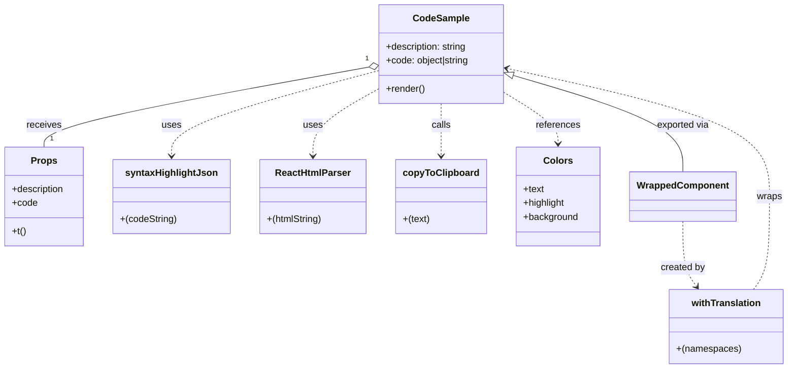

# Diagram: web/portal/src/modules/documentation/documentation-styled-components/CodeSample.js


> Auto-generated by Obscura crawlers

## Diagram 1



### SVG

<svg id="container" width="1314.83203125" xmlns="http://www.w3.org/2000/svg" class="classDiagram" height="626" viewBox="0 0 1314.83203125 626" role="graphics-document document" aria-roledescription="class"><style>#container{font-family:"trebuchet ms",verdana,arial,sans-serif;font-size:16px;fill:#333;}@keyframes edge-animation-frame{from{stroke-dashoffset:0;}}@keyframes dash{to{stroke-dashoffset:0;}}#container .edge-animation-slow{stroke-dasharray:9,5!important;stroke-dashoffset:900;animation:dash 50s linear infinite;stroke-linecap:round;}#container .edge-animation-fast{stroke-dasharray:9,5!important;stroke-dashoffset:900;animation:dash 20s linear infinite;stroke-linecap:round;}#container .error-icon{fill:#552222;}#container .error-text{fill:#552222;stroke:#552222;}#container .edge-thickness-normal{stroke-width:1px;}#container .edge-thickness-thick{stroke-width:3.5px;}#container .edge-pattern-solid{stroke-dasharray:0;}#container .edge-thickness-invisible{stroke-width:0;fill:none;}#container .edge-pattern-dashed{stroke-dasharray:3;}#container .edge-pattern-dotted{stroke-dasharray:2;}#container .marker{fill:#333333;stroke:#333333;}#container .marker.cross{stroke:#333333;}#container svg{font-family:"trebuchet ms",verdana,arial,sans-serif;font-size:16px;}#container p{margin:0;}#container g.classGroup text{fill:#9370DB;stroke:none;font-family:"trebuchet ms",verdana,arial,sans-serif;font-size:10px;}#container g.classGroup text .title{font-weight:bolder;}#container .nodeLabel,#container .edgeLabel{color:#131300;}#container .edgeLabel .label rect{fill:#ECECFF;}#container .label text{fill:#131300;}#container .labelBkg{background:#ECECFF;}#container .edgeLabel .label span{background:#ECECFF;}#container .classTitle{font-weight:bolder;}#container .node rect,#container .node circle,#container .node ellipse,#container .node polygon,#container .node path{fill:#ECECFF;stroke:#9370DB;stroke-width:1px;}#container .divider{stroke:#9370DB;stroke-width:1;}#container g.clickable{cursor:pointer;}#container g.classGroup rect{fill:#ECECFF;stroke:#9370DB;}#container g.classGroup line{stroke:#9370DB;stroke-width:1;}#container .classLabel .box{stroke:none;stroke-width:0;fill:#ECECFF;opacity:0.5;}#container .classLabel .label{fill:#9370DB;font-size:10px;}#container .relation{stroke:#333333;stroke-width:1;fill:none;}#container .dashed-line{stroke-dasharray:3;}#container .dotted-line{stroke-dasharray:1 2;}#container #compositionStart,#container .composition{fill:#333333!important;stroke:#333333!important;stroke-width:1;}#container #compositionEnd,#container .composition{fill:#333333!important;stroke:#333333!important;stroke-width:1;}#container #dependencyStart,#container .dependency{fill:#333333!important;stroke:#333333!important;stroke-width:1;}#container #dependencyStart,#container .dependency{fill:#333333!important;stroke:#333333!important;stroke-width:1;}#container #extensionStart,#container .extension{fill:transparent!important;stroke:#333333!important;stroke-width:1;}#container #extensionEnd,#container .extension{fill:transparent!important;stroke:#333333!important;stroke-width:1;}#container #aggregationStart,#container .aggregation{fill:transparent!important;stroke:#333333!important;stroke-width:1;}#container #aggregationEnd,#container .aggregation{fill:transparent!important;stroke:#333333!important;stroke-width:1;}#container #lollipopStart,#container .lollipop{fill:#ECECFF!important;stroke:#333333!important;stroke-width:1;}#container #lollipopEnd,#container .lollipop{fill:#ECECFF!important;stroke:#333333!important;stroke-width:1;}#container .edgeTerminals{font-size:11px;line-height:initial;}#container .classTitleText{text-anchor:middle;font-size:18px;fill:#333;}#container .label-icon{display:inline-block;height:1em;overflow:visible;vertical-align:-0.125em;}#container .node .label-icon path{fill:currentColor;stroke:revert;stroke-width:revert;}#container :root{--mermaid-font-family:"trebuchet ms",verdana,arial,sans-serif;}</style><g><defs><marker id="container_class-aggregationStart" class="marker aggregation class" refX="18" refY="7" markerWidth="190" markerHeight="240" orient="auto"><path d="M 18,7 L9,13 L1,7 L9,1 Z"></path></marker></defs><defs><marker id="container_class-aggregationEnd" class="marker aggregation class" refX="1" refY="7" markerWidth="20" markerHeight="28" orient="auto"><path d="M 18,7 L9,13 L1,7 L9,1 Z"></path></marker></defs><defs><marker id="container_class-extensionStart" class="marker extension class" refX="18" refY="7" markerWidth="190" markerHeight="240" orient="auto"><path d="M 1,7 L18,13 V 1 Z"></path></marker></defs><defs><marker id="container_class-extensionEnd" class="marker extension class" refX="1" refY="7" markerWidth="20" markerHeight="28" orient="auto"><path d="M 1,1 V 13 L18,7 Z"></path></marker></defs><defs><marker id="container_class-compositionStart" class="marker composition class" refX="18" refY="7" markerWidth="190" markerHeight="240" orient="auto"><path d="M 18,7 L9,13 L1,7 L9,1 Z"></path></marker></defs><defs><marker id="container_class-compositionEnd" class="marker composition class" refX="1" refY="7" markerWidth="20" markerHeight="28" orient="auto"><path d="M 18,7 L9,13 L1,7 L9,1 Z"></path></marker></defs><defs><marker id="container_class-dependencyStart" class="marker dependency class" refX="6" refY="7" markerWidth="190" markerHeight="240" orient="auto"><path d="M 5,7 L9,13 L1,7 L9,1 Z"></path></marker></defs><defs><marker id="container_class-dependencyEnd" class="marker dependency class" refX="13" refY="7" markerWidth="20" markerHeight="28" orient="auto"><path d="M 18,7 L9,13 L14,7 L9,1 Z"></path></marker></defs><defs><marker id="container_class-lollipopStart" class="marker lollipop class" refX="13" refY="7" markerWidth="190" markerHeight="240" orient="auto"><circle stroke="black" fill="transparent" cx="7" cy="7" r="6"></circle></marker></defs><defs><marker id="container_class-lollipopEnd" class="marker lollipop class" refX="1" refY="7" markerWidth="190" markerHeight="240" orient="auto"><circle stroke="black" fill="transparent" cx="7" cy="7" r="6"></circle></marker></defs><g class="root"><g class="clusters"></g><g class="edgePaths"><path d="M616.037,114.594L525.99,130.995C435.944,147.396,255.851,180.198,165.804,202.766C75.758,225.333,75.758,237.667,75.758,243.833L75.758,250" id="id_CodeSample_Props_1" class="edge-thickness-normal edge-pattern-solid relation" style=";;;" data-edge="true" data-et="edge" data-id="id_CodeSample_Props_1" data-points="W3sieCI6NjMzLjAwNzgxMjUsInkiOjExMS41MDMwOTI4ODA0OTQ4Nn0seyJ4Ijo3NS43NTc4MTI1LCJ5IjoyMTN9LHsieCI6NzUuNzU3ODEyNSwieSI6MjUwfV0=" marker-start="url(#container_class-aggregationStart)"></path><path d="M633.008,120.794L575.858,136.161C518.708,151.529,404.409,182.265,347.259,206.299C290.109,230.333,290.109,247.667,290.109,256.333L290.109,265" id="id_CodeSample_syntaxHighlightJson_2" class="edge-thickness-normal edge-pattern-dashed relation" style=";;;" data-edge="true" data-et="edge" data-id="id_CodeSample_syntaxHighlightJson_2" data-points="W3sieCI6NjMzLjAwNzgxMjUsInkiOjEyMC43OTM2MTc3MjMxNDUzfSx7IngiOjI5MC4xMDkzNzUsInkiOjIxM30seyJ4IjoyOTAuMTA5Mzc1LCJ5IjoyNzF9XQ==" marker-end="url(#container_class-dependencyEnd)"></path><path d="M633.008,152.745L615.305,162.787C597.603,172.83,562.198,192.915,544.495,211.624C526.793,230.333,526.793,247.667,526.793,256.333L526.793,265" id="id_CodeSample_ReactHtmlParser_3" class="edge-thickness-normal edge-pattern-dashed relation" style=";;;" data-edge="true" data-et="edge" data-id="id_CodeSample_ReactHtmlParser_3" data-points="W3sieCI6NjMzLjAwNzgxMjUsInkiOjE1Mi43NDQ4Njc0OTgxMjI4fSx7IngiOjUyNi43OTI5Njg3NSwieSI6MjEzfSx7IngiOjUyNi43OTI5Njg3NSwieSI6MjcxfV0=" marker-end="url(#container_class-dependencyEnd)"></path><path d="M740.086,176L740.086,182.167C740.086,188.333,740.086,200.667,740.086,215.5C740.086,230.333,740.086,247.667,740.086,256.333L740.086,265" id="id_CodeSample_copyToClipboard_4" class="edge-thickness-normal edge-pattern-dashed relation" style=";;;" data-edge="true" data-et="edge" data-id="id_CodeSample_copyToClipboard_4" data-points="W3sieCI6NzQwLjA4NTkzNzUsInkiOjE3Nn0seyJ4Ijo3NDAuMDg1OTM3NSwieSI6MjEzfSx7IngiOjc0MC4wODU5Mzc1LCJ5IjoyNzF9XQ==" marker-end="url(#container_class-dependencyEnd)"></path><path d="M847.164,158.976L861.559,167.98C875.954,176.984,904.745,194.992,919.14,209.163C933.535,223.333,933.535,233.667,933.535,238.833L933.535,244" id="id_CodeSample_Colors_5" class="edge-thickness-normal edge-pattern-dashed relation" style=";;;" data-edge="true" data-et="edge" data-id="id_CodeSample_Colors_5" data-points="W3sieCI6ODQ3LjE2NDA2MjUsInkiOjE1OC45NzU5OTA5NTM2OTgyN30seyJ4Ijo5MzMuNTM1MTU2MjUsInkiOjIxM30seyJ4Ijo5MzMuNTM1MTU2MjUsInkiOjI1MH1d" marker-end="url(#container_class-dependencyEnd)"></path><path d="M863.677,129.333L909.84,143.278C956.004,157.222,1048.33,185.111,1094.493,212.222C1140.656,239.333,1140.656,265.667,1140.656,278.833L1140.656,292" id="id_CodeSample_WrappedComponent_6" class="edge-thickness-normal edge-pattern-solid relation" style=";;;" data-edge="true" data-et="edge" data-id="id_CodeSample_WrappedComponent_6" data-points="W3sieCI6ODQ3LjE2NDA2MjUsInkiOjEyNC4zNDUwMTU4OTUzMDU1Mn0seyJ4IjoxMTQwLjY1NjI1LCJ5IjoyMTN9LHsieCI6MTE0MC42NTYyNSwieSI6MjkyfV0=" marker-start="url(#container_class-extensionStart)"></path><path d="M1140.656,376L1140.656,389.167C1140.656,402.333,1140.656,428.667,1144.491,447.187C1148.326,465.707,1155.996,476.415,1159.831,481.769L1163.666,487.122" id="id_WrappedComponent_withTranslation_7" class="edge-thickness-normal edge-pattern-dashed relation" style=";;;" data-edge="true" data-et="edge" data-id="id_WrappedComponent_withTranslation_7" data-points="W3sieCI6MTE0MC42NTYyNSwieSI6Mzc2fSx7IngiOjExNDAuNjU2MjUsInkiOjQ1NX0seyJ4IjoxMTY3LjE2MDM5MDYyNSwieSI6NDkyfV0=" marker-end="url(#container_class-dependencyEnd)"></path><path d="M1257.418,492L1261.835,485.833C1266.252,479.667,1275.087,467.333,1279.505,441C1283.922,414.667,1283.922,374.333,1283.922,334C1283.922,293.667,1283.922,253.333,1212.105,217.188C1140.288,181.042,996.655,149.085,924.838,133.106L853.021,117.127" id="id_withTranslation_CodeSample_8" class="edge-thickness-normal edge-pattern-dashed relation" style=";;;" data-edge="true" data-et="edge" data-id="id_withTranslation_CodeSample_8" data-points="W3sieCI6MTI1Ny40MTc3MzQzNzUsInkiOjQ5Mn0seyJ4IjoxMjgzLjkyMTg3NSwieSI6NDU1fSx7IngiOjEyODMuOTIxODc1LCJ5IjozMzR9LHsieCI6MTI4My45MjE4NzUsInkiOjIxM30seyJ4Ijo4NDcuMTY0MDYyNSwieSI6MTE1LjgyNDE5NDQ1MjAyNjI2fV0=" marker-end="url(#container_class-dependencyEnd)"></path></g><g class="edgeLabels"><g class="edgeLabel" transform="translate(75.7578125, 213)"><g class="label" data-id="id_CodeSample_Props_1" transform="translate(-29.4921875, -12)"><foreignObject width="58.984375" height="24"><div xmlns="http://www.w3.org/1999/xhtml" class="labelBkg" style="display: table-cell; white-space: nowrap; line-height: 1.5; max-width: 200px; text-align: center;"><span class="edgeLabel"><p>receives</p></span></div></foreignObject></g></g><g class="edgeLabel" transform="translate(290.109375, 213)"><g class="label" data-id="id_CodeSample_syntaxHighlightJson_2" transform="translate(-16.4921875, -12)"><foreignObject width="32.984375" height="24"><div xmlns="http://www.w3.org/1999/xhtml" class="labelBkg" style="display: table-cell; white-space: nowrap; line-height: 1.5; max-width: 200px; text-align: center;"><span class="edgeLabel"><p>uses</p></span></div></foreignObject></g></g><g class="edgeLabel" transform="translate(526.79296875, 213)"><g class="label" data-id="id_CodeSample_ReactHtmlParser_3" transform="translate(-16.4921875, -12)"><foreignObject width="32.984375" height="24"><div xmlns="http://www.w3.org/1999/xhtml" class="labelBkg" style="display: table-cell; white-space: nowrap; line-height: 1.5; max-width: 200px; text-align: center;"><span class="edgeLabel"><p>uses</p></span></div></foreignObject></g></g><g class="edgeLabel" transform="translate(740.0859375, 213)"><g class="label" data-id="id_CodeSample_copyToClipboard_4" transform="translate(-16.4453125, -12)"><foreignObject width="32.890625" height="24"><div xmlns="http://www.w3.org/1999/xhtml" class="labelBkg" style="display: table-cell; white-space: nowrap; line-height: 1.5; max-width: 200px; text-align: center;"><span class="edgeLabel"><p>calls</p></span></div></foreignObject></g></g><g class="edgeLabel" transform="translate(933.53515625, 213)"><g class="label" data-id="id_CodeSample_Colors_5" transform="translate(-37.828125, -12)"><foreignObject width="75.65625" height="24"><div xmlns="http://www.w3.org/1999/xhtml" class="labelBkg" style="display: table-cell; white-space: nowrap; line-height: 1.5; max-width: 200px; text-align: center;"><span class="edgeLabel"><p>references</p></span></div></foreignObject></g></g><g class="edgeLabel" transform="translate(1140.65625, 213)"><g class="label" data-id="id_CodeSample_WrappedComponent_6" transform="translate(-45.2578125, -12)"><foreignObject width="90.515625" height="24"><div xmlns="http://www.w3.org/1999/xhtml" class="labelBkg" style="display: table-cell; white-space: nowrap; line-height: 1.5; max-width: 200px; text-align: center;"><span class="edgeLabel"><p>exported via</p></span></div></foreignObject></g></g><g class="edgeLabel" transform="translate(1140.65625, 455)"><g class="label" data-id="id_WrappedComponent_withTranslation_7" transform="translate(-37.9921875, -12)"><foreignObject width="75.984375" height="24"><div xmlns="http://www.w3.org/1999/xhtml" class="labelBkg" style="display: table-cell; white-space: nowrap; line-height: 1.5; max-width: 200px; text-align: center;"><span class="edgeLabel"><p>created by</p></span></div></foreignObject></g></g><g class="edgeLabel" transform="translate(1283.921875, 334)"><g class="label" data-id="id_withTranslation_CodeSample_8" transform="translate(-21.390625, -12)"><foreignObject width="42.78125" height="24"><div xmlns="http://www.w3.org/1999/xhtml" class="labelBkg" style="display: table-cell; white-space: nowrap; line-height: 1.5; max-width: 200px; text-align: center;"><span class="edgeLabel"><p>wraps</p></span></div></foreignObject></g></g><g class="edgeTerminals" transform="translate(613.1031996584121, 99.88171625361866)"><g class="inner" transform="translate(0, 0)"><foreignObject style="width: 9px; height: 12px;"><div xmlns="http://www.w3.org/1999/xhtml" style="display: inline-block; padding-right: 1px; white-space: nowrap;"><span class="edgeLabel">1</span></div></foreignObject></g></g><g class="edgeTerminals" transform="translate(85.75781124999996, 227.49999892857144)"><g class="inner" transform="translate(0, 0)"></g><foreignObject style="width: 9px; height: 12px;"><div xmlns="http://www.w3.org/1999/xhtml" style="display: inline-block; padding-right: 1px; white-space: nowrap;"><span class="edgeLabel">1</span></div></foreignObject></g></g><g class="nodes"><g class="node default" id="classId-CodeSample-0" transform="translate(740.0859375, 92)"><g class="basic label-container"><path d="M-107.078125 -84 L107.078125 -84 L107.078125 84 L-107.078125 84" stroke="none" stroke-width="0" fill="#ECECFF" style=""></path><path d="M-107.078125 -84 C-28.76893189840206 -84, 49.54026120319588 -84, 107.078125 -84 M-107.078125 -84 C-33.48295235700705 -84, 40.1122202859859 -84, 107.078125 -84 M107.078125 -84 C107.078125 -37.09219761255965, 107.078125 9.815604774880697, 107.078125 84 M107.078125 -84 C107.078125 -19.81044635751823, 107.078125 44.37910728496354, 107.078125 84 M107.078125 84 C43.549597527770274 84, -19.978929944459452 84, -107.078125 84 M107.078125 84 C63.24103566380654 84, 19.403946327613085 84, -107.078125 84 M-107.078125 84 C-107.078125 34.50145817575238, -107.078125 -14.997083648495234, -107.078125 -84 M-107.078125 84 C-107.078125 49.821976762745365, -107.078125 15.64395352549073, -107.078125 -84" stroke="#9370DB" stroke-width="1.3" fill="none" stroke-dasharray="0 0" style=""></path></g><g class="annotation-group text" transform="translate(0, -60)"></g><g class="label-group text" transform="translate(-45.578125, -60)"><g class="label" style="font-weight: bolder" transform="translate(0,-12)"><foreignObject width="91.15625" height="24"><div xmlns="http://www.w3.org/1999/xhtml" style="display: table-cell; white-space: nowrap; line-height: 1.5; max-width: 140px; text-align: center;"><span class="nodeLabel markdown-node-label" style=""><p>CodeSample</p></span></div></foreignObject></g></g><g class="members-group text" transform="translate(-95.078125, -12)"><g class="label" style="" transform="translate(0,-12)"><foreignObject width="140.3125" height="24"><div xmlns="http://www.w3.org/1999/xhtml" style="display: table-cell; white-space: nowrap; line-height: 1.5; max-width: 198px; text-align: center;"><span class="nodeLabel markdown-node-label" style=""><p>+description: string</p></span></div></foreignObject></g><g class="label" style="" transform="translate(0,12)"><foreignObject width="144.578125" height="24"><div xmlns="http://www.w3.org/1999/xhtml" style="display: table-cell; white-space: nowrap; line-height: 1.5; max-width: 203px; text-align: center;"><span class="nodeLabel markdown-node-label" style=""><p>+code: object|string</p></span></div></foreignObject></g></g><g class="methods-group text" transform="translate(-95.078125, 60)"><g class="label" style="" transform="translate(0,-12)"><foreignObject width="66.609375" height="24"><div xmlns="http://www.w3.org/1999/xhtml" style="display: table-cell; white-space: nowrap; line-height: 1.5; max-width: 124px; text-align: center;"><span class="nodeLabel markdown-node-label" style=""><p>+render()</p></span></div></foreignObject></g></g><g class="divider" style=""><path d="M-107.078125 -36 C-47.34312582565019 -36, 12.391873348699619 -36, 107.078125 -36 M-107.078125 -36 C-63.4478543868288 -36, -19.817583773657603 -36, 107.078125 -36" stroke="#9370DB" stroke-width="1.3" fill="none" stroke-dasharray="0 0" style=""></path></g><g class="divider" style=""><path d="M-107.078125 36 C-58.458712898859424 36, -9.839300797718849 36, 107.078125 36 M-107.078125 36 C-56.0297429440981 36, -4.981360888196207 36, 107.078125 36" stroke="#9370DB" stroke-width="1.3" fill="none" stroke-dasharray="0 0" style=""></path></g></g><g class="node default" id="classId-Props-1" transform="translate(75.7578125, 334)"><g class="basic label-container"><path d="M-67.7578125 -84 L67.7578125 -84 L67.7578125 84 L-67.7578125 84" stroke="none" stroke-width="0" fill="#ECECFF" style=""></path><path d="M-67.7578125 -84 C-30.43757373505452 -84, 6.882665029890958 -84, 67.7578125 -84 M-67.7578125 -84 C-31.349336455507064 -84, 5.059139588985872 -84, 67.7578125 -84 M67.7578125 -84 C67.7578125 -38.36687004349416, 67.7578125 7.26625991301168, 67.7578125 84 M67.7578125 -84 C67.7578125 -32.89675785282948, 67.7578125 18.20648429434104, 67.7578125 84 M67.7578125 84 C14.495654396870108 84, -38.76650370625978 84, -67.7578125 84 M67.7578125 84 C25.97811333155888 84, -15.80158583688224 84, -67.7578125 84 M-67.7578125 84 C-67.7578125 22.953328831131856, -67.7578125 -38.09334233773629, -67.7578125 -84 M-67.7578125 84 C-67.7578125 33.76962285451331, -67.7578125 -16.460754290973384, -67.7578125 -84" stroke="#9370DB" stroke-width="1.3" fill="none" stroke-dasharray="0 0" style=""></path></g><g class="annotation-group text" transform="translate(0, -60)"></g><g class="label-group text" transform="translate(-20.921875, -60)"><g class="label" style="font-weight: bolder" transform="translate(0,-12)"><foreignObject width="41.84375" height="24"><div xmlns="http://www.w3.org/1999/xhtml" style="display: table-cell; white-space: nowrap; line-height: 1.5; max-width: 91px; text-align: center;"><span class="nodeLabel markdown-node-label" style=""><p>Props</p></span></div></foreignObject></g></g><g class="members-group text" transform="translate(-55.7578125, -12)"><g class="label" style="" transform="translate(0,-12)"><foreignObject width="90.59375" height="24"><div xmlns="http://www.w3.org/1999/xhtml" style="display: table-cell; white-space: nowrap; line-height: 1.5; max-width: 148px; text-align: center;"><span class="nodeLabel markdown-node-label" style=""><p>+description</p></span></div></foreignObject></g><g class="label" style="" transform="translate(0,12)"><foreignObject width="42.953125" height="24"><div xmlns="http://www.w3.org/1999/xhtml" style="display: table-cell; white-space: nowrap; line-height: 1.5; max-width: 100px; text-align: center;"><span class="nodeLabel markdown-node-label" style=""><p>+code</p></span></div></foreignObject></g></g><g class="methods-group text" transform="translate(-55.7578125, 60)"><g class="label" style="" transform="translate(0,-12)"><foreignObject width="24.0625" height="24"><div xmlns="http://www.w3.org/1999/xhtml" style="display: table-cell; white-space: nowrap; line-height: 1.5; max-width: 81px; text-align: center;"><span class="nodeLabel markdown-node-label" style=""><p>+t()</p></span></div></foreignObject></g></g><g class="divider" style=""><path d="M-67.7578125 -36 C-20.678013164359818 -36, 26.401786171280364 -36, 67.7578125 -36 M-67.7578125 -36 C-31.69068413082166 -36, 4.376444238356683 -36, 67.7578125 -36" stroke="#9370DB" stroke-width="1.3" fill="none" stroke-dasharray="0 0" style=""></path></g><g class="divider" style=""><path d="M-67.7578125 36 C-36.09322893097259 36, -4.428645361945186 36, 67.7578125 36 M-67.7578125 36 C-37.26298138032436 36, -6.768150260648717 36, 67.7578125 36" stroke="#9370DB" stroke-width="1.3" fill="none" stroke-dasharray="0 0" style=""></path></g></g><g class="node default" id="classId-syntaxHighlightJson-2" transform="translate(290.109375, 334)"><g class="basic label-container"><path d="M-96.59375 -63 L96.59375 -63 L96.59375 63 L-96.59375 63" stroke="none" stroke-width="0" fill="#ECECFF" style=""></path><path d="M-96.59375 -63 C-35.66168206576066 -63, 25.270385868478684 -63, 96.59375 -63 M-96.59375 -63 C-47.15743735868336 -63, 2.2788752826332797 -63, 96.59375 -63 M96.59375 -63 C96.59375 -23.096520206594185, 96.59375 16.80695958681163, 96.59375 63 M96.59375 -63 C96.59375 -18.165091835928486, 96.59375 26.66981632814303, 96.59375 63 M96.59375 63 C51.09756982622689 63, 5.601389652453776 63, -96.59375 63 M96.59375 63 C54.32578295418402 63, 12.057815908368042 63, -96.59375 63 M-96.59375 63 C-96.59375 15.664038594691782, -96.59375 -31.671922810616437, -96.59375 -63 M-96.59375 63 C-96.59375 31.67851456745335, -96.59375 0.3570291349067034, -96.59375 -63" stroke="#9370DB" stroke-width="1.3" fill="none" stroke-dasharray="0 0" style=""></path></g><g class="annotation-group text" transform="translate(0, -39)"></g><g class="label-group text" transform="translate(-72.984375, -39)"><g class="label" style="font-weight: bolder" transform="translate(0,-12)"><foreignObject width="145.96875" height="24"><div xmlns="http://www.w3.org/1999/xhtml" style="display: table-cell; white-space: nowrap; line-height: 1.5; max-width: 193px; text-align: center;"><span class="nodeLabel markdown-node-label" style=""><p>syntaxHighlightJson</p></span></div></foreignObject></g></g><g class="members-group text" transform="translate(-84.59375, 9)"></g><g class="methods-group text" transform="translate(-84.59375, 39)"><g class="label" style="" transform="translate(0,-12)"><foreignObject width="96.203125" height="24"><div xmlns="http://www.w3.org/1999/xhtml" style="display: table-cell; white-space: nowrap; line-height: 1.5; max-width: 146px; text-align: center;"><span class="nodeLabel markdown-node-label" style=""><p>+(codeString)</p></span></div></foreignObject></g></g><g class="divider" style=""><path d="M-96.59375 -15 C-38.858791842377514 -15, 18.876166315244973 -15, 96.59375 -15 M-96.59375 -15 C-35.80244657254285 -15, 24.988856854914303 -15, 96.59375 -15" stroke="#9370DB" stroke-width="1.3" fill="none" stroke-dasharray="0 0" style=""></path></g><g class="divider" style=""><path d="M-96.59375 9 C-31.36628320620386 9, 33.86118358759228 9, 96.59375 9 M-96.59375 9 C-19.369706408072716 9, 57.85433718385457 9, 96.59375 9" stroke="#9370DB" stroke-width="1.3" fill="none" stroke-dasharray="0 0" style=""></path></g></g><g class="node default" id="classId-ReactHtmlParser-3" transform="translate(526.79296875, 334)"><g class="basic label-container"><path d="M-90.08984375 -63 L90.08984375 -63 L90.08984375 63 L-90.08984375 63" stroke="none" stroke-width="0" fill="#ECECFF" style=""></path><path d="M-90.08984375 -63 C-42.27389099987804 -63, 5.542061750243917 -63, 90.08984375 -63 M-90.08984375 -63 C-39.98845671582069 -63, 10.112930318358622 -63, 90.08984375 -63 M90.08984375 -63 C90.08984375 -24.533477033206402, 90.08984375 13.933045933587195, 90.08984375 63 M90.08984375 -63 C90.08984375 -21.550332265847956, 90.08984375 19.899335468304088, 90.08984375 63 M90.08984375 63 C51.466293987224944 63, 12.842744224449888 63, -90.08984375 63 M90.08984375 63 C32.64846255534882 63, -24.792918639302357 63, -90.08984375 63 M-90.08984375 63 C-90.08984375 23.417960877322898, -90.08984375 -16.164078245354204, -90.08984375 -63 M-90.08984375 63 C-90.08984375 27.71027283782358, -90.08984375 -7.579454324352838, -90.08984375 -63" stroke="#9370DB" stroke-width="1.3" fill="none" stroke-dasharray="0 0" style=""></path></g><g class="annotation-group text" transform="translate(0, -39)"></g><g class="label-group text" transform="translate(-61.3828125, -39)"><g class="label" style="font-weight: bolder" transform="translate(0,-12)"><foreignObject width="122.765625" height="24"><div xmlns="http://www.w3.org/1999/xhtml" style="display: table-cell; white-space: nowrap; line-height: 1.5; max-width: 171px; text-align: center;"><span class="nodeLabel markdown-node-label" style=""><p>ReactHtmlParser</p></span></div></foreignObject></g></g><g class="members-group text" transform="translate(-78.08984375, 9)"></g><g class="methods-group text" transform="translate(-78.08984375, 39)"><g class="label" style="" transform="translate(0,-12)"><foreignObject width="94.796875" height="24"><div xmlns="http://www.w3.org/1999/xhtml" style="display: table-cell; white-space: nowrap; line-height: 1.5; max-width: 145px; text-align: center;"><span class="nodeLabel markdown-node-label" style=""><p>+(htmlString)</p></span></div></foreignObject></g></g><g class="divider" style=""><path d="M-90.08984375 -15 C-43.923454492538774 -15, 2.2429347649224525 -15, 90.08984375 -15 M-90.08984375 -15 C-28.854383196199933 -15, 32.381077357600134 -15, 90.08984375 -15" stroke="#9370DB" stroke-width="1.3" fill="none" stroke-dasharray="0 0" style=""></path></g><g class="divider" style=""><path d="M-90.08984375 9 C-53.88636310303332 9, -17.682882456066636 9, 90.08984375 9 M-90.08984375 9 C-34.30027540612502 9, 21.489292937749966 9, 90.08984375 9" stroke="#9370DB" stroke-width="1.3" fill="none" stroke-dasharray="0 0" style=""></path></g></g><g class="node default" id="classId-copyToClipboard-4" transform="translate(740.0859375, 334)"><g class="basic label-container"><path d="M-73.203125 -63 L73.203125 -63 L73.203125 63 L-73.203125 63" stroke="none" stroke-width="0" fill="#ECECFF" style=""></path><path d="M-73.203125 -63 C-31.53285630451029 -63, 10.13741239097942 -63, 73.203125 -63 M-73.203125 -63 C-31.03668326288524 -63, 11.129758474229519 -63, 73.203125 -63 M73.203125 -63 C73.203125 -28.31099353231383, 73.203125 6.37801293537234, 73.203125 63 M73.203125 -63 C73.203125 -34.30257775700982, 73.203125 -5.605155514019643, 73.203125 63 M73.203125 63 C37.12837355327255 63, 1.053622106545106 63, -73.203125 63 M73.203125 63 C32.657504159906345 63, -7.888116680187309 63, -73.203125 63 M-73.203125 63 C-73.203125 19.92308226554615, -73.203125 -23.1538354689077, -73.203125 -63 M-73.203125 63 C-73.203125 37.42408145771337, -73.203125 11.848162915426741, -73.203125 -63" stroke="#9370DB" stroke-width="1.3" fill="none" stroke-dasharray="0 0" style=""></path></g><g class="annotation-group text" transform="translate(0, -39)"></g><g class="label-group text" transform="translate(-61.203125, -39)"><g class="label" style="font-weight: bolder" transform="translate(0,-12)"><foreignObject width="122.40625" height="24"><div xmlns="http://www.w3.org/1999/xhtml" style="display: table-cell; white-space: nowrap; line-height: 1.5; max-width: 171px; text-align: center;"><span class="nodeLabel markdown-node-label" style=""><p>copyToClipboard</p></span></div></foreignObject></g></g><g class="members-group text" transform="translate(-61.203125, 9)"></g><g class="methods-group text" transform="translate(-61.203125, 39)"><g class="label" style="" transform="translate(0,-12)"><foreignObject width="46.015625" height="24"><div xmlns="http://www.w3.org/1999/xhtml" style="display: table-cell; white-space: nowrap; line-height: 1.5; max-width: 96px; text-align: center;"><span class="nodeLabel markdown-node-label" style=""><p>+(text)</p></span></div></foreignObject></g></g><g class="divider" style=""><path d="M-73.203125 -15 C-25.411598415203784 -15, 22.379928169592432 -15, 73.203125 -15 M-73.203125 -15 C-42.98813971963184 -15, -12.773154439263678 -15, 73.203125 -15" stroke="#9370DB" stroke-width="1.3" fill="none" stroke-dasharray="0 0" style=""></path></g><g class="divider" style=""><path d="M-73.203125 9 C-25.79979509442247 9, 21.603534811155058 9, 73.203125 9 M-73.203125 9 C-21.923369492648924 9, 29.356386014702153 9, 73.203125 9" stroke="#9370DB" stroke-width="1.3" fill="none" stroke-dasharray="0 0" style=""></path></g></g><g class="node default" id="classId-withTranslation-5" transform="translate(1212.2890625, 555)"><g class="basic label-container"><path d="M-94.54296875 -63 L94.54296875 -63 L94.54296875 63 L-94.54296875 63" stroke="none" stroke-width="0" fill="#ECECFF" style=""></path><path d="M-94.54296875 -63 C-44.04685502087647 -63, 6.449258708247058 -63, 94.54296875 -63 M-94.54296875 -63 C-49.27109405006957 -63, -3.9992193501391426 -63, 94.54296875 -63 M94.54296875 -63 C94.54296875 -14.885679685116216, 94.54296875 33.22864062976757, 94.54296875 63 M94.54296875 -63 C94.54296875 -25.86474993839385, 94.54296875 11.270500123212301, 94.54296875 63 M94.54296875 63 C28.496266278498453 63, -37.550436193003094 63, -94.54296875 63 M94.54296875 63 C35.37802287643435 63, -23.7869229971313 63, -94.54296875 63 M-94.54296875 63 C-94.54296875 13.69130582976986, -94.54296875 -35.61738834046028, -94.54296875 -63 M-94.54296875 63 C-94.54296875 32.90186223338254, -94.54296875 2.8037244667650754, -94.54296875 -63" stroke="#9370DB" stroke-width="1.3" fill="none" stroke-dasharray="0 0" style=""></path></g><g class="annotation-group text" transform="translate(0, -39)"></g><g class="label-group text" transform="translate(-57.1796875, -39)"><g class="label" style="font-weight: bolder" transform="translate(0,-12)"><foreignObject width="114.359375" height="24"><div xmlns="http://www.w3.org/1999/xhtml" style="display: table-cell; white-space: nowrap; line-height: 1.5; max-width: 162px; text-align: center;"><span class="nodeLabel markdown-node-label" style=""><p>withTranslation</p></span></div></foreignObject></g></g><g class="members-group text" transform="translate(-82.54296875, 9)"></g><g class="methods-group text" transform="translate(-82.54296875, 39)"><g class="label" style="" transform="translate(0,-12)"><foreignObject width="107.90625" height="24"><div xmlns="http://www.w3.org/1999/xhtml" style="display: table-cell; white-space: nowrap; line-height: 1.5; max-width: 158px; text-align: center;"><span class="nodeLabel markdown-node-label" style=""><p>+(namespaces)</p></span></div></foreignObject></g></g><g class="divider" style=""><path d="M-94.54296875 -15 C-20.16885205184299 -15, 54.20526464631402 -15, 94.54296875 -15 M-94.54296875 -15 C-43.77848308676357 -15, 6.986002576472856 -15, 94.54296875 -15" stroke="#9370DB" stroke-width="1.3" fill="none" stroke-dasharray="0 0" style=""></path></g><g class="divider" style=""><path d="M-94.54296875 9 C-37.44062138186194 9, 19.661725986276124 9, 94.54296875 9 M-94.54296875 9 C-56.13904338177732 9, -17.73511801355464 9, 94.54296875 9" stroke="#9370DB" stroke-width="1.3" fill="none" stroke-dasharray="0 0" style=""></path></g></g><g class="node default" id="classId-Colors-6" transform="translate(933.53515625, 334)"><g class="basic label-container"><path d="M-70.24609375 -84 L70.24609375 -84 L70.24609375 84 L-70.24609375 84" stroke="none" stroke-width="0" fill="#ECECFF" style=""></path><path d="M-70.24609375 -84 C-38.45471079187071 -84, -6.663327833741413 -84, 70.24609375 -84 M-70.24609375 -84 C-40.3221703773131 -84, -10.398247004626192 -84, 70.24609375 -84 M70.24609375 -84 C70.24609375 -25.062934653839193, 70.24609375 33.874130692321614, 70.24609375 84 M70.24609375 -84 C70.24609375 -47.80763503835756, 70.24609375 -11.61527007671512, 70.24609375 84 M70.24609375 84 C39.86160856110866 84, 9.47712337221732 84, -70.24609375 84 M70.24609375 84 C34.98875823346076 84, -0.2685772830784856 84, -70.24609375 84 M-70.24609375 84 C-70.24609375 45.36470015669115, -70.24609375 6.7294003133823, -70.24609375 -84 M-70.24609375 84 C-70.24609375 30.112043268360942, -70.24609375 -23.775913463278116, -70.24609375 -84" stroke="#9370DB" stroke-width="1.3" fill="none" stroke-dasharray="0 0" style=""></path></g><g class="annotation-group text" transform="translate(0, -60)"></g><g class="label-group text" transform="translate(-23.1015625, -60)"><g class="label" style="font-weight: bolder" transform="translate(0,-12)"><foreignObject width="46.203125" height="24"><div xmlns="http://www.w3.org/1999/xhtml" style="display: table-cell; white-space: nowrap; line-height: 1.5; max-width: 95px; text-align: center;"><span class="nodeLabel markdown-node-label" style=""><p>Colors</p></span></div></foreignObject></g></g><g class="members-group text" transform="translate(-58.24609375, -12)"><g class="label" style="" transform="translate(0,-12)"><foreignObject width="35.5625" height="24"><div xmlns="http://www.w3.org/1999/xhtml" style="display: table-cell; white-space: nowrap; line-height: 1.5; max-width: 93px; text-align: center;"><span class="nodeLabel markdown-node-label" style=""><p>+text</p></span></div></foreignObject></g><g class="label" style="" transform="translate(0,12)"><foreignObject width="72.25" height="24"><div xmlns="http://www.w3.org/1999/xhtml" style="display: table-cell; white-space: nowrap; line-height: 1.5; max-width: 130px; text-align: center;"><span class="nodeLabel markdown-node-label" style=""><p>+highlight</p></span></div></foreignObject></g><g class="label" style="" transform="translate(0,36)"><foreignObject width="93.390625" height="24"><div xmlns="http://www.w3.org/1999/xhtml" style="display: table-cell; white-space: nowrap; line-height: 1.5; max-width: 151px; text-align: center;"><span class="nodeLabel markdown-node-label" style=""><p>+background</p></span></div></foreignObject></g></g><g class="methods-group text" transform="translate(-58.24609375, 84)"></g><g class="divider" style=""><path d="M-70.24609375 -36 C-21.124457854312944 -36, 27.997178041374113 -36, 70.24609375 -36 M-70.24609375 -36 C-18.81305823109023 -36, 32.61997728781954 -36, 70.24609375 -36" stroke="#9370DB" stroke-width="1.3" fill="none" stroke-dasharray="0 0" style=""></path></g><g class="divider" style=""><path d="M-70.24609375 60 C-15.165796271666473 60, 39.914501206667055 60, 70.24609375 60 M-70.24609375 60 C-33.91455155188631 60, 2.416990646227376 60, 70.24609375 60" stroke="#9370DB" stroke-width="1.3" fill="none" stroke-dasharray="0 0" style=""></path></g></g><g class="node default" id="classId-WrappedComponent-7" transform="translate(1140.65625, 334)"><g class="basic label-container"><path d="M-86.875 -42 L86.875 -42 L86.875 42 L-86.875 42" stroke="none" stroke-width="0" fill="#ECECFF" style=""></path><path d="M-86.875 -42 C-26.77741339584101 -42, 33.32017320831798 -42, 86.875 -42 M-86.875 -42 C-39.04525798102903 -42, 8.784484037941937 -42, 86.875 -42 M86.875 -42 C86.875 -19.953705669952004, 86.875 2.0925886600959913, 86.875 42 M86.875 -42 C86.875 -19.375154594578007, 86.875 3.249690810843987, 86.875 42 M86.875 42 C42.2755181743336 42, -2.3239636513328037 42, -86.875 42 M86.875 42 C25.433941136515237 42, -36.007117726969526 42, -86.875 42 M-86.875 42 C-86.875 10.068163562794563, -86.875 -21.863672874410874, -86.875 -42 M-86.875 42 C-86.875 12.99478609123425, -86.875 -16.0104278175315, -86.875 -42" stroke="#9370DB" stroke-width="1.3" fill="none" stroke-dasharray="0 0" style=""></path></g><g class="annotation-group text" transform="translate(0, -18)"></g><g class="label-group text" transform="translate(-74.875, -18)"><g class="label" style="font-weight: bolder" transform="translate(0,-12)"><foreignObject width="149.75" height="24"><div xmlns="http://www.w3.org/1999/xhtml" style="display: table-cell; white-space: nowrap; line-height: 1.5; max-width: 199px; text-align: center;"><span class="nodeLabel markdown-node-label" style=""><p>WrappedComponent</p></span></div></foreignObject></g></g><g class="members-group text" transform="translate(-74.875, 30)"></g><g class="methods-group text" transform="translate(-74.875, 60)"></g><g class="divider" style=""><path d="M-86.875 6 C-24.66814045021954 6, 37.53871909956092 6, 86.875 6 M-86.875 6 C-42.076849222441716 6, 2.7213015551165682 6, 86.875 6" stroke="#9370DB" stroke-width="1.3" fill="none" stroke-dasharray="0 0" style=""></path></g><g class="divider" style=""><path d="M-86.875 24 C-47.33222057236207 24, -7.789441144724137 24, 86.875 24 M-86.875 24 C-18.102128080635623 24, 50.670743838728754 24, 86.875 24" stroke="#9370DB" stroke-width="1.3" fill="none" stroke-dasharray="0 0" style=""></path></g></g></g></g></g></svg>

## Diagram 2

```mermaid
flowchart LR
    A[Props: description, code, t] --> B[CodeSample component]
    B --> C{isJson? typeof code === "object"}
    C -- yes --> D[JSON.stringify -> syntaxHighlightJson]
    D --> E[ReactHtmlParser(rendered HTML)]
    C -- no --> F[Use codeString (XML) directly]
    E --> G[<pre> sampleCss content]
    F --> G
    B --> H[Copy button (copyCss)]
    H --> I[onClick -> copyToClipboard(codeString)]
    I --> J[System Clipboard]
```

> SVG rendering failed for this diagram.
