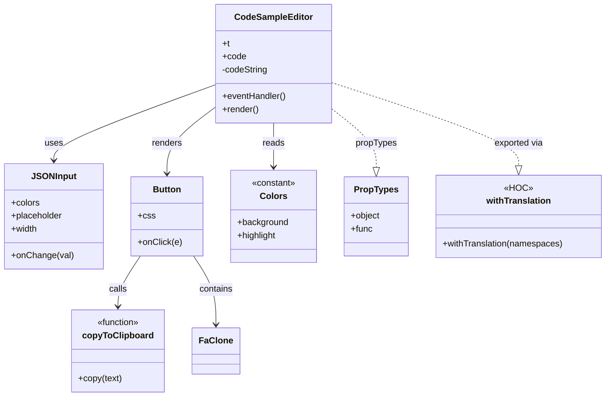
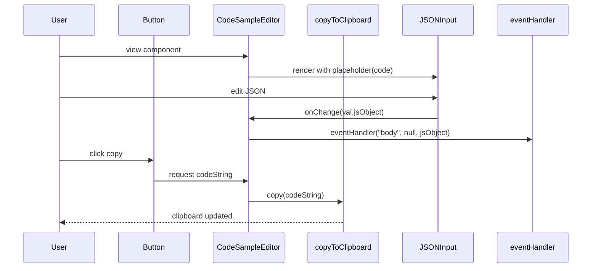

# Diagram: web/portal/src/modules/documentation/documentation-styled-components/CodeSampleEditor.js

> Auto-generated by Obscura crawlers

## Diagram 1

### SVG

<svg id="container" width="1091.9140625" xmlns="http://www.w3.org/2000/svg" class="classDiagram" height="722" viewBox="0 0 1091.9140625 722" role="graphics-document document" aria-roledescription="class"><g><defs><marker id="container_class-aggregationStart" class="marker aggregation class" refX="18" refY="7" markerWidth="190" markerHeight="240" orient="auto"><path d="M 18,7 L9,13 L1,7 L9,1 Z"></path></marker></defs><defs><marker id="container_class-aggregationEnd" class="marker aggregation class" refX="1" refY="7" markerWidth="20" markerHeight="28" orient="auto"><path d="M 18,7 L9,13 L1,7 L9,1 Z"></path></marker></defs><defs><marker id="container_class-extensionStart" class="marker extension class" refX="18" refY="7" markerWidth="190" markerHeight="240" orient="auto"><path d="M 1,7 L18,13 V 1 Z"></path></marker></defs><defs><marker id="container_class-extensionEnd" class="marker extension class" refX="1" refY="7" markerWidth="20" markerHeight="28" orient="auto"><path d="M 1,1 V 13 L18,7 Z"></path></marker></defs><defs><marker id="container_class-compositionStart" class="marker composition class" refX="18" refY="7" markerWidth="190" markerHeight="240" orient="auto"><path d="M 18,7 L9,13 L1,7 L9,1 Z"></path></marker></defs><defs><marker id="container_class-compositionEnd" class="marker composition class" refX="1" refY="7" markerWidth="20" markerHeight="28" orient="auto"><path d="M 18,7 L9,13 L1,7 L9,1 Z"></path></marker></defs><defs><marker id="container_class-dependencyStart" class="marker dependency class" refX="6" refY="7" markerWidth="190" markerHeight="240" orient="auto"><path d="M 5,7 L9,13 L1,7 L9,1 Z"></path></marker></defs><defs><marker id="container_class-dependencyEnd" class="marker dependency class" refX="13" refY="7" markerWidth="20" markerHeight="28" orient="auto"><path d="M 18,7 L9,13 L14,7 L9,1 Z"></path></marker></defs><defs><marker id="container_class-lollipopStart" class="marker lollipop class" refX="13" refY="7" markerWidth="190" markerHeight="240" orient="auto"><circle stroke="black" fill="transparent" cx="7" cy="7" r="6"></circle></marker></defs><defs><marker id="container_class-lollipopEnd" class="marker lollipop class" refX="1" refY="7" markerWidth="190" markerHeight="240" orient="auto"><circle stroke="black" fill="transparent" cx="7" cy="7" r="6"></circle></marker></defs><g class="root"><g class="clusters"></g><g class="edgePaths"><path d="M383.617,154.36L335.374,172.133C287.132,189.907,190.646,225.453,142.403,248.393C94.16,271.333,94.16,281.667,94.16,286.833L94.16,292" id="id_CodeSampleEditor_JSONInput_1" class="edge-thickness-normal edge-pattern-solid relation" style=";;;" data-edge="true" data-et="edge" data-id="id_CodeSampleEditor_JSONInput_1" data-points="W3sieCI6MzgzLjYxNzE4NzUsInkiOjE1NC4zNTk3NTAyODc4MjQwNn0seyJ4Ijo5NC4xNjAxNTYyNSwieSI6MjYxfSx7IngiOjk0LjE2MDE1NjI1LCJ5IjoyOTh9XQ==" marker-end="url(#container_class-dependencyEnd)"></path><path d="M383.617,194.153L368.774,205.294C353.931,216.435,324.245,238.718,309.402,259.025C294.559,279.333,294.559,297.667,294.559,306.833L294.559,316" id="id_CodeSampleEditor_Button_2" class="edge-thickness-normal edge-pattern-solid relation" style=";;;" data-edge="true" data-et="edge" data-id="id_CodeSampleEditor_Button_2" data-points="W3sieCI6MzgzLjYxNzE4NzUsInkiOjE5NC4xNTI5Mjk5OTU1NTE0fSx7IngiOjI5NC41NTg1OTM3NSwieSI6MjYxfSx7IngiOjI5NC41NTg1OTM3NSwieSI6MzIyfV0=" marker-end="url(#container_class-dependencyEnd)"></path><path d="M247.742,466L241.131,476.167C234.521,486.333,221.299,506.667,214.689,522C208.078,537.333,208.078,547.667,208.078,552.833L208.078,558" id="id_Button_copyToClipboard_3" class="edge-thickness-normal edge-pattern-solid relation" style=";;;" data-edge="true" data-et="edge" data-id="id_Button_copyToClipboard_3" data-points="W3sieCI6MjQ3Ljc0MjA5OTM4OTA5Nzc1LCJ5Ijo0NjZ9LHsieCI6MjA4LjA3ODEyNSwieSI6NTI3fSx7IngiOjIwOC4wNzgxMjUsInkiOjU2NH1d" marker-end="url(#container_class-dependencyEnd)"></path><path d="M341.375,466L347.986,476.167C354.596,486.333,367.818,506.667,374.428,527.5C381.039,548.333,381.039,569.667,381.039,580.333L381.039,591" id="id_Button_FaClone_4" class="edge-thickness-normal edge-pattern-solid relation" style=";;;" data-edge="true" data-et="edge" data-id="id_Button_FaClone_4" data-points="W3sieCI6MzQxLjM3NTA4ODExMDkwMjI1LCJ5Ijo0NjZ9LHsieCI6MzgxLjAzOTA2MjUsInkiOjUyN30seyJ4IjozODEuMDM5MDYyNSwieSI6NTk3fV0=" marker-end="url(#container_class-dependencyEnd)"></path><path d="M487.738,224L487.738,230.167C487.738,236.333,487.738,248.667,487.738,262C487.738,275.333,487.738,289.667,487.738,296.833L487.738,304" id="id_CodeSampleEditor_Colors_5" class="edge-thickness-normal edge-pattern-solid relation" style=";;;" data-edge="true" data-et="edge" data-id="id_CodeSampleEditor_Colors_5" data-points="W3sieCI6NDg3LjczODI4MTI1LCJ5IjoyMjR9LHsieCI6NDg3LjczODI4MTI1LCJ5IjoyNjF9LHsieCI6NDg3LjczODI4MTI1LCJ5IjozMTB9XQ==" marker-end="url(#container_class-dependencyEnd)"></path><path d="M591.859,149.895L648.743,168.412C705.626,186.93,819.393,223.965,876.277,249.274C933.16,274.583,933.16,288.167,933.16,294.958L933.16,301.75" id="id_CodeSampleEditor_withTranslation_6" class="edge-thickness-normal edge-pattern-dashed relation" style=";;;" data-edge="true" data-et="edge" data-id="id_CodeSampleEditor_withTranslation_6" data-points="W3sieCI6NTkxLjg1OTM3NSwieSI6MTQ5Ljg5NDk2NDM5NDcxMDF9LHsieCI6OTMzLjE2MDE1NjI1LCJ5IjoyNjF9LHsieCI6OTMzLjE2MDE1NjI1LCJ5IjozMTl9XQ==" marker-end="url(#container_class-extensionEnd)"></path><path d="M591.859,196.82L605.64,207.517C619.421,218.213,646.982,239.607,660.762,257.595C674.543,275.583,674.543,290.167,674.543,297.458L674.543,304.75" id="id_CodeSampleEditor_PropTypes_7" class="edge-thickness-normal edge-pattern-dashed relation" style=";;;" data-edge="true" data-et="edge" data-id="id_CodeSampleEditor_PropTypes_7" data-points="W3sieCI6NTkxLjg1OTM3NSwieSI6MTk2LjgyMDAyMDA3NDQ0Mjd9LHsieCI6Njc0LjU0Mjk2ODc1LCJ5IjoyNjF9LHsieCI6Njc0LjU0Mjk2ODc1LCJ5IjozMjJ9XQ==" marker-end="url(#container_class-extensionEnd)"></path></g><g class="edgeLabels"><g class="edgeLabel" transform="translate(94.16015625, 261)"><g class="label" data-id="id_CodeSampleEditor_JSONInput_1" transform="translate(-16.4921875, -12)"><foreignObject width="32.984375" height="24">

uses

</foreignObject></g></g><g class="edgeLabel" transform="translate(294.55859375, 261)"><g class="label" data-id="id_CodeSampleEditor_Button_2" transform="translate(-27.75, -12)"><foreignObject width="55.5" height="24">

renders

</foreignObject></g></g><g class="edgeLabel" transform="translate(208.078125, 527)"><g class="label" data-id="id_Button_copyToClipboard_3" transform="translate(-16.4453125, -12)"><foreignObject width="32.890625" height="24">

calls

</foreignObject></g></g><g class="edgeLabel" transform="translate(381.0390625, 527)"><g class="label" data-id="id_Button_FaClone_4" transform="translate(-30.890625, -12)"><foreignObject width="61.78125" height="24">

contains

</foreignObject></g></g><g class="edgeLabel" transform="translate(487.73828125, 261)"><g class="label" data-id="id_CodeSampleEditor_Colors_5" transform="translate(-20.0078125, -12)"><foreignObject width="40.015625" height="24">

reads

</foreignObject></g></g><g class="edgeLabel" transform="translate(933.16015625, 261)"><g class="label" data-id="id_CodeSampleEditor_withTranslation_6" transform="translate(-45.2578125, -12)"><foreignObject width="90.515625" height="24">

exported via

</foreignObject></g></g><g class="edgeLabel" transform="translate(674.54296875, 261)"><g class="label" data-id="id_CodeSampleEditor_PropTypes_7" transform="translate(-37.625, -12)"><foreignObject width="75.25" height="24">

propTypes

</foreignObject></g></g></g><g class="nodes"><g class="node default" id="classId-CodeSampleEditor-0" transform="translate(487.73828125, 116)"><g class="basic label-container"><path d="M-104.12109375 -108 L104.12109375 -108 L104.12109375 108 L-104.12109375 108" stroke="none" stroke-width="0" fill="#ECECFF" style=""></path><path d="M-104.12109375 -108 C-54.35973192018072 -108, -4.598370090361442 -108, 104.12109375 -108 M-104.12109375 -108 C-59.085660741848756 -108, -14.050227733697511 -108, 104.12109375 -108 M104.12109375 -108 C104.12109375 -37.1774348247333, 104.12109375 33.64513035053341, 104.12109375 108 M104.12109375 -108 C104.12109375 -51.54171176924602, 104.12109375 4.916576461507958, 104.12109375 108 M104.12109375 108 C46.75881012380136 108, -10.603473502397279 108, -104.12109375 108 M104.12109375 108 C57.3367533982069 108, 10.552413046413804 108, -104.12109375 108 M-104.12109375 108 C-104.12109375 42.88149373642656, -104.12109375 -22.237012527146874, -104.12109375 -108 M-104.12109375 108 C-104.12109375 56.63083992663066, -104.12109375 5.261679853261313, -104.12109375 -108" stroke="#9370DB" stroke-width="1.3" fill="none" stroke-dasharray="0 0" style=""></path></g><g class="annotation-group text" transform="translate(0, -84)"></g><g class="label-group text" transform="translate(-67.5078125, -84)"><g class="label" style="font-weight: bolder" transform="translate(0,-12)"><foreignObject width="135.015625" height="24">

CodeSampleEditor

</foreignObject></g></g><g class="members-group text" transform="translate(-92.12109375, -36)"><g class="label" style="" transform="translate(0,-12)"><foreignObject width="13.6875" height="24">

+t

</foreignObject></g><g class="label" style="" transform="translate(0,12)"><foreignObject width="42.953125" height="24">

+code

</foreignObject></g><g class="label" style="" transform="translate(0,36)"><foreignObject width="84.296875" height="24">

-codeString

</foreignObject></g></g><g class="methods-group text" transform="translate(-92.12109375, 60)"><g class="label" style="" transform="translate(0,-12)"><foreignObject width="116.734375" height="24">

+eventHandler()

</foreignObject></g><g class="label" style="" transform="translate(0,12)"><foreignObject width="66.609375" height="24">

+render()

</foreignObject></g></g><g class="divider" style=""><path d="M-104.12109375 -60 C-22.588350618749928 -60, 58.944392512500144 -60, 104.12109375 -60 M-104.12109375 -60 C-41.806305035746604 -60, 20.508483678506792 -60, 104.12109375 -60" stroke="#9370DB" stroke-width="1.3" fill="none" stroke-dasharray="0 0" style=""></path></g><g class="divider" style=""><path d="M-104.12109375 36 C-32.318508425296486 36, 39.48407689940703 36, 104.12109375 36 M-104.12109375 36 C-56.047165999185054 36, -7.973238248370109 36, 104.12109375 36" stroke="#9370DB" stroke-width="1.3" fill="none" stroke-dasharray="0 0" style=""></path></g></g><g class="node default" id="classId-JSONInput-1" transform="translate(94.16015625, 394)"><g class="basic label-container"><path d="M-86.16015625 -96 L86.16015625 -96 L86.16015625 96 L-86.16015625 96" stroke="none" stroke-width="0" fill="#ECECFF" style=""></path><path d="M-86.16015625 -96 C-33.480963807197426 -96, 19.198228635605147 -96, 86.16015625 -96 M-86.16015625 -96 C-37.09130825787281 -96, 11.977539734254378 -96, 86.16015625 -96 M86.16015625 -96 C86.16015625 -45.548941806777556, 86.16015625 4.902116386444888, 86.16015625 96 M86.16015625 -96 C86.16015625 -49.67682968157257, 86.16015625 -3.353659363145141, 86.16015625 96 M86.16015625 96 C50.147269254925796 96, 14.134382259851591 96, -86.16015625 96 M86.16015625 96 C45.98604520792191 96, 5.811934165843823 96, -86.16015625 96 M-86.16015625 96 C-86.16015625 22.76480524968848, -86.16015625 -50.47038950062304, -86.16015625 -96 M-86.16015625 96 C-86.16015625 30.757748970973807, -86.16015625 -34.484502058052385, -86.16015625 -96" stroke="#9370DB" stroke-width="1.3" fill="none" stroke-dasharray="0 0" style=""></path></g><g class="annotation-group text" transform="translate(0, -72)"></g><g class="label-group text" transform="translate(-37.3515625, -72)"><g class="label" style="font-weight: bolder" transform="translate(0,-12)"><foreignObject width="74.703125" height="24">

JSONInput

</foreignObject></g></g><g class="members-group text" transform="translate(-74.16015625, -24)"><g class="label" style="" transform="translate(0,-12)"><foreignObject width="52.03125" height="24">

+colors

</foreignObject></g><g class="label" style="" transform="translate(0,12)"><foreignObject width="94.640625" height="24">

+placeholder

</foreignObject></g><g class="label" style="" transform="translate(0,36)"><foreignObject width="48.703125" height="24">

+width

</foreignObject></g></g><g class="methods-group text" transform="translate(-74.16015625, 72)"><g class="label" style="" transform="translate(0,-12)"><foreignObject width="110.96875" height="24">

+onChange(val)

</foreignObject></g></g><g class="divider" style=""><path d="M-86.16015625 -48 C-37.42644571986913 -48, 11.307264810261742 -48, 86.16015625 -48 M-86.16015625 -48 C-50.69247079798956 -48, -15.224785345979114 -48, 86.16015625 -48" stroke="#9370DB" stroke-width="1.3" fill="none" stroke-dasharray="0 0" style=""></path></g><g class="divider" style=""><path d="M-86.16015625 48 C-22.004492187591566 48, 42.15117187481687 48, 86.16015625 48 M-86.16015625 48 C-25.302734305008478 48, 35.554687639983044 48, 86.16015625 48" stroke="#9370DB" stroke-width="1.3" fill="none" stroke-dasharray="0 0" style=""></path></g></g><g class="node default" id="classId-Button-2" transform="translate(294.55859375, 394)"><g class="basic label-container"><path d="M-64.23828125 -72 L64.23828125 -72 L64.23828125 72 L-64.23828125 72" stroke="none" stroke-width="0" fill="#ECECFF" style=""></path><path d="M-64.23828125 -72 C-31.305680709562154 -72, 1.6269198308756927 -72, 64.23828125 -72 M-64.23828125 -72 C-36.48718165122527 -72, -8.736082052450548 -72, 64.23828125 -72 M64.23828125 -72 C64.23828125 -33.03429315659005, 64.23828125 5.931413686819894, 64.23828125 72 M64.23828125 -72 C64.23828125 -42.28869693533855, 64.23828125 -12.577393870677092, 64.23828125 72 M64.23828125 72 C14.886517165205305 72, -34.46524691958939 72, -64.23828125 72 M64.23828125 72 C35.422967611818606 72, 6.607653973637213 72, -64.23828125 72 M-64.23828125 72 C-64.23828125 37.956208828847394, -64.23828125 3.912417657694789, -64.23828125 -72 M-64.23828125 72 C-64.23828125 34.91074674016435, -64.23828125 -2.178506519671302, -64.23828125 -72" stroke="#9370DB" stroke-width="1.3" fill="none" stroke-dasharray="0 0" style=""></path></g><g class="annotation-group text" transform="translate(0, -48)"></g><g class="label-group text" transform="translate(-24.8359375, -48)"><g class="label" style="font-weight: bolder" transform="translate(0,-12)"><foreignObject width="49.671875" height="24">

Button

</foreignObject></g></g><g class="members-group text" transform="translate(-52.23828125, 0)"><g class="label" style="" transform="translate(0,-12)"><foreignObject width="30.421875" height="24">

+css

</foreignObject></g></g><g class="methods-group text" transform="translate(-52.23828125, 48)"><g class="label" style="" transform="translate(0,-12)"><foreignObject width="79.640625" height="24">

+onClick(e)

</foreignObject></g></g><g class="divider" style=""><path d="M-64.23828125 -24 C-25.684017323428037 -24, 12.870246603143926 -24, 64.23828125 -24 M-64.23828125 -24 C-30.476411272810594 -24, 3.2854587043788115 -24, 64.23828125 -24" stroke="#9370DB" stroke-width="1.3" fill="none" stroke-dasharray="0 0" style=""></path></g><g class="divider" style=""><path d="M-64.23828125 24 C-27.019706547835746 24, 10.198868154328508 24, 64.23828125 24 M-64.23828125 24 C-29.696975126796396 24, 4.8443309964072085 24, 64.23828125 24" stroke="#9370DB" stroke-width="1.3" fill="none" stroke-dasharray="0 0" style=""></path></g></g><g class="node default" id="classId-FaClone-3" transform="translate(381.0390625, 639)"><g class="basic label-container"><path d="M-40.3671875 -42 L40.3671875 -42 L40.3671875 42 L-40.3671875 42" stroke="none" stroke-width="0" fill="#ECECFF" style=""></path><path d="M-40.3671875 -42 C-11.262286607663857 -42, 17.842614284672287 -42, 40.3671875 -42 M-40.3671875 -42 C-13.224459202784129 -42, 13.918269094431743 -42, 40.3671875 -42 M40.3671875 -42 C40.3671875 -24.58677916463435, 40.3671875 -7.173558329268701, 40.3671875 42 M40.3671875 -42 C40.3671875 -19.319047278102516, 40.3671875 3.361905443794967, 40.3671875 42 M40.3671875 42 C20.73393758477835 42, 1.1006876695566987 42, -40.3671875 42 M40.3671875 42 C9.005429002560337 42, -22.356329494879326 42, -40.3671875 42 M-40.3671875 42 C-40.3671875 11.443381429562098, -40.3671875 -19.113237140875803, -40.3671875 -42 M-40.3671875 42 C-40.3671875 19.340161920508194, -40.3671875 -3.3196761589836115, -40.3671875 -42" stroke="#9370DB" stroke-width="1.3" fill="none" stroke-dasharray="0 0" style=""></path></g><g class="annotation-group text" transform="translate(0, -18)"></g><g class="label-group text" transform="translate(-28.3671875, -18)"><g class="label" style="font-weight: bolder" transform="translate(0,-12)"><foreignObject width="56.734375" height="24">

FaClone

</foreignObject></g></g><g class="members-group text" transform="translate(-28.3671875, 30)"></g><g class="methods-group text" transform="translate(-28.3671875, 60)"></g><g class="divider" style=""><path d="M-40.3671875 6 C-10.32002441547677 6, 19.72713866904646 6, 40.3671875 6 M-40.3671875 6 C-8.458165646974837 6, 23.450856206050325 6, 40.3671875 6" stroke="#9370DB" stroke-width="1.3" fill="none" stroke-dasharray="0 0" style=""></path></g><g class="divider" style=""><path d="M-40.3671875 24 C-10.104823656344454 24, 20.157540187311092 24, 40.3671875 24 M-40.3671875 24 C-10.225908887744328 24, 19.915369724511343 24, 40.3671875 24" stroke="#9370DB" stroke-width="1.3" fill="none" stroke-dasharray="0 0" style=""></path></g></g><g class="node default" id="classId-Colors-4" transform="translate(487.73828125, 394)"><g class="basic label-container"><path d="M-78.94140625 -84 L78.94140625 -84 L78.94140625 84 L-78.94140625 84" stroke="none" stroke-width="0" fill="#ECECFF" style=""></path><path d="M-78.94140625 -84 C-36.330143735119385 -84, 6.281118779761229 -84, 78.94140625 -84 M-78.94140625 -84 C-38.18435783995862 -84, 2.572690570082756 -84, 78.94140625 -84 M78.94140625 -84 C78.94140625 -20.204049406172935, 78.94140625 43.59190118765413, 78.94140625 84 M78.94140625 -84 C78.94140625 -22.969798812596387, 78.94140625 38.060402374807225, 78.94140625 84 M78.94140625 84 C26.65336138774694 84, -25.63468347450612 84, -78.94140625 84 M78.94140625 84 C16.92333038598035 84, -45.0947454780393 84, -78.94140625 84 M-78.94140625 84 C-78.94140625 45.78507729767093, -78.94140625 7.570154595341862, -78.94140625 -84 M-78.94140625 84 C-78.94140625 28.527913361082653, -78.94140625 -26.944173277834693, -78.94140625 -84" stroke="#9370DB" stroke-width="1.3" fill="none" stroke-dasharray="0 0" style=""></path></g><g class="annotation-group text" transform="translate(-40.4921875, -60)"><g class="label" style="" transform="translate(0,-12)"><foreignObject width="80.984375" height="24">

«constant»

</foreignObject></g></g><g class="label-group text" transform="translate(-23.1015625, -36)"><g class="label" style="font-weight: bolder" transform="translate(0,-12)"><foreignObject width="46.203125" height="24">

Colors

</foreignObject></g></g><g class="members-group text" transform="translate(-66.94140625, 12)"><g class="label" style="" transform="translate(0,-12)"><foreignObject width="93.390625" height="24">

+background

</foreignObject></g><g class="label" style="" transform="translate(0,12)"><foreignObject width="72.25" height="24">

+highlight

</foreignObject></g></g><g class="methods-group text" transform="translate(-66.94140625, 84)"></g><g class="divider" style=""><path d="M-78.94140625 -12 C-28.33952740227246 -12, 22.26235144545508 -12, 78.94140625 -12 M-78.94140625 -12 C-40.94693821009547 -12, -2.952470170190935 -12, 78.94140625 -12" stroke="#9370DB" stroke-width="1.3" fill="none" stroke-dasharray="0 0" style=""></path></g><g class="divider" style=""><path d="M-78.94140625 60 C-37.54112094428093 60, 3.859164361438147 60, 78.94140625 60 M-78.94140625 60 C-23.707487127928978 60, 31.526431994142044 60, 78.94140625 60" stroke="#9370DB" stroke-width="1.3" fill="none" stroke-dasharray="0 0" style=""></path></g></g><g class="node default" id="classId-copyToClipboard-5" transform="translate(208.078125, 639)"><g class="basic label-container"><path d="M-82.59375 -75 L82.59375 -75 L82.59375 75 L-82.59375 75" stroke="none" stroke-width="0" fill="#ECECFF" style=""></path><path d="M-82.59375 -75 C-20.98364344928126 -75, 40.62646310143748 -75, 82.59375 -75 M-82.59375 -75 C-44.74649687666817 -75, -6.899243753336336 -75, 82.59375 -75 M82.59375 -75 C82.59375 -28.6123992053884, 82.59375 17.7752015892232, 82.59375 75 M82.59375 -75 C82.59375 -42.130431324537824, 82.59375 -9.260862649075648, 82.59375 75 M82.59375 75 C44.138557325036295 75, 5.6833646500725905 75, -82.59375 75 M82.59375 75 C36.88847378348803 75, -8.816802433023938 75, -82.59375 75 M-82.59375 75 C-82.59375 19.471920577670915, -82.59375 -36.05615884465817, -82.59375 -75 M-82.59375 75 C-82.59375 17.579753829743183, -82.59375 -39.840492340513634, -82.59375 -75" stroke="#9370DB" stroke-width="1.3" fill="none" stroke-dasharray="0 0" style=""></path></g><g class="annotation-group text" transform="translate(-39.484375, -51)"><g class="label" style="" transform="translate(0,-12)"><foreignObject width="78.96875" height="24">

«function»

</foreignObject></g></g><g class="label-group text" transform="translate(-61.203125, -27)"><g class="label" style="font-weight: bolder" transform="translate(0,-12)"><foreignObject width="122.40625" height="24">

copyToClipboard

</foreignObject></g></g><g class="members-group text" transform="translate(-70.59375, 21)"></g><g class="methods-group text" transform="translate(-70.59375, 51)"><g class="label" style="" transform="translate(0,-12)"><foreignObject width="79.984375" height="24">

+copy(text)

</foreignObject></g></g><g class="divider" style=""><path d="M-82.59375 -3 C-42.791565278479865 -3, -2.9893805569597305 -3, 82.59375 -3 M-82.59375 -3 C-19.781068103270748 -3, 43.031613793458504 -3, 82.59375 -3" stroke="#9370DB" stroke-width="1.3" fill="none" stroke-dasharray="0 0" style=""></path></g><g class="divider" style=""><path d="M-82.59375 21 C-27.461088190728333 21, 27.671573618543334 21, 82.59375 21 M-82.59375 21 C-46.25241161932822 21, -9.911073238656442 21, 82.59375 21" stroke="#9370DB" stroke-width="1.3" fill="none" stroke-dasharray="0 0" style=""></path></g></g><g class="node default" id="classId-PropTypes-6" transform="translate(674.54296875, 394)"><g class="basic label-container"><path d="M-57.86328125 -72 L57.86328125 -72 L57.86328125 72 L-57.86328125 72" stroke="none" stroke-width="0" fill="#ECECFF" style=""></path><path d="M-57.86328125 -72 C-22.54344359349315 -72, 12.776394063013697 -72, 57.86328125 -72 M-57.86328125 -72 C-17.32891771038289 -72, 23.205445829234222 -72, 57.86328125 -72 M57.86328125 -72 C57.86328125 -29.827148383013395, 57.86328125 12.345703233973211, 57.86328125 72 M57.86328125 -72 C57.86328125 -30.91752904903113, 57.86328125 10.164941901937738, 57.86328125 72 M57.86328125 72 C21.07961287668318 72, -15.704055496633643 72, -57.86328125 72 M57.86328125 72 C16.906586210948525 72, -24.05010882810295 72, -57.86328125 72 M-57.86328125 72 C-57.86328125 29.08589373003374, -57.86328125 -13.828212539932522, -57.86328125 -72 M-57.86328125 72 C-57.86328125 22.982647840199014, -57.86328125 -26.03470431960197, -57.86328125 -72" stroke="#9370DB" stroke-width="1.3" fill="none" stroke-dasharray="0 0" style=""></path></g><g class="annotation-group text" transform="translate(0, -48)"></g><g class="label-group text" transform="translate(-38.2578125, -48)"><g class="label" style="font-weight: bolder" transform="translate(0,-12)"><foreignObject width="76.515625" height="24">

PropTypes

</foreignObject></g></g><g class="members-group text" transform="translate(-45.86328125, 0)"><g class="label" style="" transform="translate(0,-12)"><foreignObject width="53.46875" height="24">

+object

</foreignObject></g><g class="label" style="" transform="translate(0,12)"><foreignObject width="39.453125" height="24">

+func

</foreignObject></g></g><g class="methods-group text" transform="translate(-45.86328125, 72)"></g><g class="divider" style=""><path d="M-57.86328125 -24 C-29.540960662980012 -24, -1.2186400759600247 -24, 57.86328125 -24 M-57.86328125 -24 C-12.435110441604891 -24, 32.99306036679022 -24, 57.86328125 -24" stroke="#9370DB" stroke-width="1.3" fill="none" stroke-dasharray="0 0" style=""></path></g><g class="divider" style=""><path d="M-57.86328125 48 C-13.663736332834127 48, 30.535808584331747 48, 57.86328125 48 M-57.86328125 48 C-34.17885939140429 48, -10.494437532808568 48, 57.86328125 48" stroke="#9370DB" stroke-width="1.3" fill="none" stroke-dasharray="0 0" style=""></path></g></g><g class="node default" id="classId-withTranslation-7" transform="translate(933.16015625, 394)"><g class="basic label-container"><path d="M-150.75390625 -75 L150.75390625 -75 L150.75390625 75 L-150.75390625 75" stroke="none" stroke-width="0" fill="#ECECFF" style=""></path><path d="M-150.75390625 -75 C-37.36191935541352 -75, 76.03006753917296 -75, 150.75390625 -75 M-150.75390625 -75 C-86.79570893974011 -75, -22.837511629480204 -75, 150.75390625 -75 M150.75390625 -75 C150.75390625 -32.40697166200911, 150.75390625 10.186056675981774, 150.75390625 75 M150.75390625 -75 C150.75390625 -42.97202718478921, 150.75390625 -10.944054369578424, 150.75390625 75 M150.75390625 75 C71.81439580885504 75, -7.125114632289922 75, -150.75390625 75 M150.75390625 75 C61.023583910276955 75, -28.70673842944609 75, -150.75390625 75 M-150.75390625 75 C-150.75390625 16.347418661809222, -150.75390625 -42.305162676381556, -150.75390625 -75 M-150.75390625 75 C-150.75390625 25.711825323858598, -150.75390625 -23.576349352282804, -150.75390625 -75" stroke="#9370DB" stroke-width="1.3" fill="none" stroke-dasharray="0 0" style=""></path></g><g class="annotation-group text" transform="translate(-24.4296875, -51)"><g class="label" style="" transform="translate(0,-12)"><foreignObject width="48.859375" height="24">

«HOC»

</foreignObject></g></g><g class="label-group text" transform="translate(-57.1796875, -27)"><g class="label" style="font-weight: bolder" transform="translate(0,-12)"><foreignObject width="114.359375" height="24">

withTranslation

</foreignObject></g></g><g class="members-group text" transform="translate(-138.75390625, 21)"></g><g class="methods-group text" transform="translate(-138.75390625, 51)"><g class="label" style="" transform="translate(0,-12)"><foreignObject width="220.328125" height="24">

+withTranslation(namespaces)

</foreignObject></g></g><g class="divider" style=""><path d="M-150.75390625 -3 C-49.73548879653224 -3, 51.282928656935525 -3, 150.75390625 -3 M-150.75390625 -3 C-71.10351438265506 -3, 8.546877484689873 -3, 150.75390625 -3" stroke="#9370DB" stroke-width="1.3" fill="none" stroke-dasharray="0 0" style=""></path></g><g class="divider" style=""><path d="M-150.75390625 21 C-41.35135211538565 21, 68.0512020192287 21, 150.75390625 21 M-150.75390625 21 C-89.5609186359431 21, -28.36793102188618 21, 150.75390625 21" stroke="#9370DB" stroke-width="1.3" fill="none" stroke-dasharray="0 0" style=""></path></g></g></g></g></g></svg>

## Diagram 2

### SVG

<svg id="container" width="1260" xmlns="http://www.w3.org/2000/svg" height="603" viewBox="-50 -10 1260 603" role="graphics-document document" aria-roledescription="sequence"><g><rect x="1010" y="517" fill="#eaeaea" stroke="#666" width="150" height="65" name="eventHandler" rx="3" ry="3" class="actor actor-bottom"></rect><text x="1085" y="549.5" dominant-baseline="central" alignment-baseline="central" class="actor actor-box" style="text-anchor: middle; font-size: 16px; font-weight: 400;"><tspan x="1085" dy="0">eventHandler</tspan></text></g><g><rect x="810" y="517" fill="#eaeaea" stroke="#666" width="150" height="65" name="JSONInput" rx="3" ry="3" class="actor actor-bottom"></rect><text x="885" y="549.5" dominant-baseline="central" alignment-baseline="central" class="actor actor-box" style="text-anchor: middle; font-size: 16px; font-weight: 400;"><tspan x="885" dy="0">JSONInput</tspan></text></g><g><rect x="610" y="517" fill="#eaeaea" stroke="#666" width="150" height="65" name="copyToClipboard" rx="3" ry="3" class="actor actor-bottom"></rect><text x="685" y="549.5" dominant-baseline="central" alignment-baseline="central" class="actor actor-box" style="text-anchor: middle; font-size: 16px; font-weight: 400;"><tspan x="685" dy="0">copyToClipboard</tspan></text></g><g><rect x="406" y="517" fill="#eaeaea" stroke="#666" width="154" height="65" name="CodeSampleEditor" rx="3" ry="3" class="actor actor-bottom"></rect><text x="483" y="549.5" dominant-baseline="central" alignment-baseline="central" class="actor actor-box" style="text-anchor: middle; font-size: 16px; font-weight: 400;"><tspan x="483" dy="0">CodeSampleEditor</tspan></text></g><g><rect x="200" y="517" fill="#eaeaea" stroke="#666" width="150" height="65" name="Button" rx="3" ry="3" class="actor actor-bottom"></rect><text x="275" y="549.5" dominant-baseline="central" alignment-baseline="central" class="actor actor-box" style="text-anchor: middle; font-size: 16px; font-weight: 400;"><tspan x="275" dy="0">Button</tspan></text></g><g><rect x="0" y="517" fill="#eaeaea" stroke="#666" width="150" height="65" name="User" rx="3" ry="3" class="actor actor-bottom"></rect><text x="75" y="549.5" dominant-baseline="central" alignment-baseline="central" class="actor actor-box" style="text-anchor: middle; font-size: 16px; font-weight: 400;"><tspan x="75" dy="0">User</tspan></text></g><g><line id="actor5" x1="1085" y1="65" x2="1085" y2="517" class="actor-line 200" stroke-width="0.5px" stroke="#999" name="eventHandler"></line><g id="root-5"><rect x="1010" y="0" fill="#eaeaea" stroke="#666" width="150" height="65" name="eventHandler" rx="3" ry="3" class="actor actor-top"></rect><text x="1085" y="32.5" dominant-baseline="central" alignment-baseline="central" class="actor actor-box" style="text-anchor: middle; font-size: 16px; font-weight: 400;"><tspan x="1085" dy="0">eventHandler</tspan></text></g></g><g><line id="actor4" x1="885" y1="65" x2="885" y2="517" class="actor-line 200" stroke-width="0.5px" stroke="#999" name="JSONInput"></line><g id="root-4"><rect x="810" y="0" fill="#eaeaea" stroke="#666" width="150" height="65" name="JSONInput" rx="3" ry="3" class="actor actor-top"></rect><text x="885" y="32.5" dominant-baseline="central" alignment-baseline="central" class="actor actor-box" style="text-anchor: middle; font-size: 16px; font-weight: 400;"><tspan x="885" dy="0">JSONInput</tspan></text></g></g><g><line id="actor3" x1="685" y1="65" x2="685" y2="517" class="actor-line 200" stroke-width="0.5px" stroke="#999" name="copyToClipboard"></line><g id="root-3"><rect x="610" y="0" fill="#eaeaea" stroke="#666" width="150" height="65" name="copyToClipboard" rx="3" ry="3" class="actor actor-top"></rect><text x="685" y="32.5" dominant-baseline="central" alignment-baseline="central" class="actor actor-box" style="text-anchor: middle; font-size: 16px; font-weight: 400;"><tspan x="685" dy="0">copyToClipboard</tspan></text></g></g><g><line id="actor2" x1="483" y1="65" x2="483" y2="517" class="actor-line 200" stroke-width="0.5px" stroke="#999" name="CodeSampleEditor"></line><g id="root-2"><rect x="406" y="0" fill="#eaeaea" stroke="#666" width="154" height="65" name="CodeSampleEditor" rx="3" ry="3" class="actor actor-top"></rect><text x="483" y="32.5" dominant-baseline="central" alignment-baseline="central" class="actor actor-box" style="text-anchor: middle; font-size: 16px; font-weight: 400;"><tspan x="483" dy="0">CodeSampleEditor</tspan></text></g></g><g><line id="actor1" x1="275" y1="65" x2="275" y2="517" class="actor-line 200" stroke-width="0.5px" stroke="#999" name="Button"></line><g id="root-1"><rect x="200" y="0" fill="#eaeaea" stroke="#666" width="150" height="65" name="Button" rx="3" ry="3" class="actor actor-top"></rect><text x="275" y="32.5" dominant-baseline="central" alignment-baseline="central" class="actor actor-box" style="text-anchor: middle; font-size: 16px; font-weight: 400;"><tspan x="275" dy="0">Button</tspan></text></g></g><g><line id="actor0" x1="75" y1="65" x2="75" y2="517" class="actor-line 200" stroke-width="0.5px" stroke="#999" name="User"></line><g id="root-0"><rect x="0" y="0" fill="#eaeaea" stroke="#666" width="150" height="65" name="User" rx="3" ry="3" class="actor actor-top"></rect><text x="75" y="32.5" dominant-baseline="central" alignment-baseline="central" class="actor actor-box" style="text-anchor: middle; font-size: 16px; font-weight: 400;"><tspan x="75" dy="0">User</tspan></text></g></g><g></g><defs><symbol id="computer" width="24" height="24"><path transform="scale(.5)" d="M2 2v13h20v-13h-20zm18 11h-16v-9h16v9zm-10.228 6l.466-1h3.524l.467 1h-4.457zm14.228 3h-24l2-6h2.104l-1.33 4h18.45l-1.297-4h2.073l2 6zm-5-10h-14v-7h14v7z"></path></symbol></defs><defs><symbol id="database" fill-rule="evenodd" clip-rule="evenodd"><path transform="scale(.5)" d="M12.258.001l.256.004.255.005.253.008.251.01.249.012.247.015.246.016.242.019.241.02.239.023.236.024.233.027.231.028.229.031.225.032.223.034.22.036.217.038.214.04.211.041.208.043.205.045.201.046.198.048.194.05.191.051.187.053.183.054.18.056.175.057.172.059.168.06.163.061.16.063.155.064.15.066.074.033.073.033.071.034.07.034.069.035.068.035.067.035.066.035.064.036.064.036.062.036.06.036.06.037.058.037.058.037.055.038.055.038.053.038.052.038.051.039.05.039.048.039.047.039.045.04.044.04.043.04.041.04.04.041.039.041.037.041.036.041.034.041.033.042.032.042.03.042.029.042.027.042.026.043.024.043.023.043.021.043.02.043.018.044.017.043.015.044.013.044.012.044.011.045.009.044.007.045.006.045.004.045.002.045.001.045v17l-.001.045-.002.045-.004.045-.006.045-.007.045-.009.044-.011.045-.012.044-.013.044-.015.044-.017.043-.018.044-.02.043-.021.043-.023.043-.024.043-.026.043-.027.042-.029.042-.03.042-.032.042-.033.042-.034.041-.036.041-.037.041-.039.041-.04.041-.041.04-.043.04-.044.04-.045.04-.047.039-.048.039-.05.039-.051.039-.052.038-.053.038-.055.038-.055.038-.058.037-.058.037-.06.037-.06.036-.062.036-.064.036-.064.036-.066.035-.067.035-.068.035-.069.035-.07.034-.071.034-.073.033-.074.033-.15.066-.155.064-.16.063-.163.061-.168.06-.172.059-.175.057-.18.056-.183.054-.187.053-.191.051-.194.05-.198.048-.201.046-.205.045-.208.043-.211.041-.214.04-.217.038-.22.036-.223.034-.225.032-.229.031-.231.028-.233.027-.236.024-.239.023-.241.02-.242.019-.246.016-.247.015-.249.012-.251.01-.253.008-.255.005-.256.004-.258.001-.258-.001-.256-.004-.255-.005-.253-.008-.251-.01-.249-.012-.247-.015-.245-.016-.243-.019-.241-.02-.238-.023-.236-.024-.234-.027-.231-.028-.228-.031-.226-.032-.223-.034-.22-.036-.217-.038-.214-.04-.211-.041-.208-.043-.204-.045-.201-.046-.198-.048-.195-.05-.19-.051-.187-.053-.184-.054-.179-.056-.176-.057-.172-.059-.167-.06-.164-.061-.159-.063-.155-.064-.151-.066-.074-.033-.072-.033-.072-.034-.07-.034-.069-.035-.068-.035-.067-.035-.066-.035-.064-.036-.063-.036-.062-.036-.061-.036-.06-.037-.058-.037-.057-.037-.056-.038-.055-.038-.053-.038-.052-.038-.051-.039-.049-.039-.049-.039-.046-.039-.046-.04-.044-.04-.043-.04-.041-.04-.04-.041-.039-.041-.037-.041-.036-.041-.034-.041-.033-.042-.032-.042-.03-.042-.029-.042-.027-.042-.026-.043-.024-.043-.023-.043-.021-.043-.02-.043-.018-.044-.017-.043-.015-.044-.013-.044-.012-.044-.011-.045-.009-.044-.007-.045-.006-.045-.004-.045-.002-.045-.001-.045v-17l.001-.045.002-.045.004-.045.006-.045.007-.045.009-.044.011-.045.012-.044.013-.044.015-.044.017-.043.018-.044.02-.043.021-.043.023-.043.024-.043.026-.043.027-.042.029-.042.03-.042.032-.042.033-.042.034-.041.036-.041.037-.041.039-.041.04-.041.041-.04.043-.04.044-.04.046-.04.046-.039.049-.039.049-.039.051-.039.052-.038.053-.038.055-.038.056-.038.057-.037.058-.037.06-.037.061-.036.062-.036.063-.036.064-.036.066-.035.067-.035.068-.035.069-.035.07-.034.072-.034.072-.033.074-.033.151-.066.155-.064.159-.063.164-.061.167-.06.172-.059.176-.057.179-.056.184-.054.187-.053.19-.051.195-.05.198-.048.201-.046.204-.045.208-.043.211-.041.214-.04.217-.038.22-.036.223-.034.226-.032.228-.031.231-.028.234-.027.236-.024.238-.023.241-.02.243-.019.245-.016.247-.015.249-.012.251-.01.253-.008.255-.005.256-.004.258-.001.258.001zm-9.258 20.499v.01l.001.021.003.021.004.022.005.021.006.022.007.022.009.023.01.022.011.023.012.023.013.023.015.023.016.024.017.023.018.024.019.024.021.024.022.025.023.024.024.025.052.049.056.05.061.051.066.051.07.051.075.051.079.052.084.052.088.052.092.052.097.052.102.051.105.052.11.052.114.051.119.051.123.051.127.05.131.05.135.05.139.048.144.049.147.047.152.047.155.047.16.045.163.045.167.043.171.043.176.041.178.041.183.039.187.039.19.037.194.035.197.035.202.033.204.031.209.03.212.029.216.027.219.025.222.024.226.021.23.02.233.018.236.016.24.015.243.012.246.01.249.008.253.005.256.004.259.001.26-.001.257-.004.254-.005.25-.008.247-.011.244-.012.241-.014.237-.016.233-.018.231-.021.226-.021.224-.024.22-.026.216-.027.212-.028.21-.031.205-.031.202-.034.198-.034.194-.036.191-.037.187-.039.183-.04.179-.04.175-.042.172-.043.168-.044.163-.045.16-.046.155-.046.152-.047.148-.048.143-.049.139-.049.136-.05.131-.05.126-.05.123-.051.118-.052.114-.051.11-.052.106-.052.101-.052.096-.052.092-.052.088-.053.083-.051.079-.052.074-.052.07-.051.065-.051.06-.051.056-.05.051-.05.023-.024.023-.025.021-.024.02-.024.019-.024.018-.024.017-.024.015-.023.014-.024.013-.023.012-.023.01-.023.01-.022.008-.022.006-.022.006-.022.004-.022.004-.021.001-.021.001-.021v-4.127l-.077.055-.08.053-.083.054-.085.053-.087.052-.09.052-.093.051-.095.05-.097.05-.1.049-.102.049-.105.048-.106.047-.109.047-.111.046-.114.045-.115.045-.118.044-.12.043-.122.042-.124.042-.126.041-.128.04-.13.04-.132.038-.134.038-.135.037-.138.037-.139.035-.142.035-.143.034-.144.033-.147.032-.148.031-.15.03-.151.03-.153.029-.154.027-.156.027-.158.026-.159.025-.161.024-.162.023-.163.022-.165.021-.166.02-.167.019-.169.018-.169.017-.171.016-.173.015-.173.014-.175.013-.175.012-.177.011-.178.01-.179.008-.179.008-.181.006-.182.005-.182.004-.184.003-.184.002h-.37l-.184-.002-.184-.003-.182-.004-.182-.005-.181-.006-.179-.008-.179-.008-.178-.01-.176-.011-.176-.012-.175-.013-.173-.014-.172-.015-.171-.016-.17-.017-.169-.018-.167-.019-.166-.02-.165-.021-.163-.022-.162-.023-.161-.024-.159-.025-.157-.026-.156-.027-.155-.027-.153-.029-.151-.03-.15-.03-.148-.031-.146-.032-.145-.033-.143-.034-.141-.035-.14-.035-.137-.037-.136-.037-.134-.038-.132-.038-.13-.04-.128-.04-.126-.041-.124-.042-.122-.042-.12-.044-.117-.043-.116-.045-.113-.045-.112-.046-.109-.047-.106-.047-.105-.048-.102-.049-.1-.049-.097-.05-.095-.05-.093-.052-.09-.051-.087-.052-.085-.053-.083-.054-.08-.054-.077-.054v4.127zm0-5.654v.011l.001.021.003.021.004.021.005.022.006.022.007.022.009.022.01.022.011.023.012.023.013.023.015.024.016.023.017.024.018.024.019.024.021.024.022.024.023.025.024.024.052.05.056.05.061.05.066.051.07.051.075.052.079.051.084.052.088.052.092.052.097.052.102.052.105.052.11.051.114.051.119.052.123.05.127.051.131.05.135.049.139.049.144.048.147.048.152.047.155.046.16.045.163.045.167.044.171.042.176.042.178.04.183.04.187.038.19.037.194.036.197.034.202.033.204.032.209.03.212.028.216.027.219.025.222.024.226.022.23.02.233.018.236.016.24.014.243.012.246.01.249.008.253.006.256.003.259.001.26-.001.257-.003.254-.006.25-.008.247-.01.244-.012.241-.015.237-.016.233-.018.231-.02.226-.022.224-.024.22-.025.216-.027.212-.029.21-.03.205-.032.202-.033.198-.035.194-.036.191-.037.187-.039.183-.039.179-.041.175-.042.172-.043.168-.044.163-.045.16-.045.155-.047.152-.047.148-.048.143-.048.139-.05.136-.049.131-.05.126-.051.123-.051.118-.051.114-.052.11-.052.106-.052.101-.052.096-.052.092-.052.088-.052.083-.052.079-.052.074-.051.07-.052.065-.051.06-.05.056-.051.051-.049.023-.025.023-.024.021-.025.02-.024.019-.024.018-.024.017-.024.015-.023.014-.023.013-.024.012-.022.01-.023.01-.023.008-.022.006-.022.006-.022.004-.021.004-.022.001-.021.001-.021v-4.139l-.077.054-.08.054-.083.054-.085.052-.087.053-.09.051-.093.051-.095.051-.097.05-.1.049-.102.049-.105.048-.106.047-.109.047-.111.046-.114.045-.115.044-.118.044-.12.044-.122.042-.124.042-.126.041-.128.04-.13.039-.132.039-.134.038-.135.037-.138.036-.139.036-.142.035-.143.033-.144.033-.147.033-.148.031-.15.03-.151.03-.153.028-.154.028-.156.027-.158.026-.159.025-.161.024-.162.023-.163.022-.165.021-.166.02-.167.019-.169.018-.169.017-.171.016-.173.015-.173.014-.175.013-.175.012-.177.011-.178.009-.179.009-.179.007-.181.007-.182.005-.182.004-.184.003-.184.002h-.37l-.184-.002-.184-.003-.182-.004-.182-.005-.181-.007-.179-.007-.179-.009-.178-.009-.176-.011-.176-.012-.175-.013-.173-.014-.172-.015-.171-.016-.17-.017-.169-.018-.167-.019-.166-.02-.165-.021-.163-.022-.162-.023-.161-.024-.159-.025-.157-.026-.156-.027-.155-.028-.153-.028-.151-.03-.15-.03-.148-.031-.146-.033-.145-.033-.143-.033-.141-.035-.14-.036-.137-.036-.136-.037-.134-.038-.132-.039-.13-.039-.128-.04-.126-.041-.124-.042-.122-.043-.12-.043-.117-.044-.116-.044-.113-.046-.112-.046-.109-.046-.106-.047-.105-.048-.102-.049-.1-.049-.097-.05-.095-.051-.093-.051-.09-.051-.087-.053-.085-.052-.083-.054-.08-.054-.077-.054v4.139zm0-5.666v.011l.001.02.003.022.004.021.005.022.006.021.007.022.009.023.01.022.011.023.012.023.013.023.015.023.016.024.017.024.018.023.019.024.021.025.022.024.023.024.024.025.052.05.056.05.061.05.066.051.07.051.075.052.079.051.084.052.088.052.092.052.097.052.102.052.105.051.11.052.114.051.119.051.123.051.127.05.131.05.135.05.139.049.144.048.147.048.152.047.155.046.16.045.163.045.167.043.171.043.176.042.178.04.183.04.187.038.19.037.194.036.197.034.202.033.204.032.209.03.212.028.216.027.219.025.222.024.226.021.23.02.233.018.236.017.24.014.243.012.246.01.249.008.253.006.256.003.259.001.26-.001.257-.003.254-.006.25-.008.247-.01.244-.013.241-.014.237-.016.233-.018.231-.02.226-.022.224-.024.22-.025.216-.027.212-.029.21-.03.205-.032.202-.033.198-.035.194-.036.191-.037.187-.039.183-.039.179-.041.175-.042.172-.043.168-.044.163-.045.16-.045.155-.047.152-.047.148-.048.143-.049.139-.049.136-.049.131-.051.126-.05.123-.051.118-.052.114-.051.11-.052.106-.052.101-.052.096-.052.092-.052.088-.052.083-.052.079-.052.074-.052.07-.051.065-.051.06-.051.056-.05.051-.049.023-.025.023-.025.021-.024.02-.024.019-.024.018-.024.017-.024.015-.023.014-.024.013-.023.012-.023.01-.022.01-.023.008-.022.006-.022.006-.022.004-.022.004-.021.001-.021.001-.021v-4.153l-.077.054-.08.054-.083.053-.085.053-.087.053-.09.051-.093.051-.095.051-.097.05-.1.049-.102.048-.105.048-.106.048-.109.046-.111.046-.114.046-.115.044-.118.044-.12.043-.122.043-.124.042-.126.041-.128.04-.13.039-.132.039-.134.038-.135.037-.138.036-.139.036-.142.034-.143.034-.144.033-.147.032-.148.032-.15.03-.151.03-.153.028-.154.028-.156.027-.158.026-.159.024-.161.024-.162.023-.163.023-.165.021-.166.02-.167.019-.169.018-.169.017-.171.016-.173.015-.173.014-.175.013-.175.012-.177.01-.178.01-.179.009-.179.007-.181.006-.182.006-.182.004-.184.003-.184.001-.185.001-.185-.001-.184-.001-.184-.003-.182-.004-.182-.006-.181-.006-.179-.007-.179-.009-.178-.01-.176-.01-.176-.012-.175-.013-.173-.014-.172-.015-.171-.016-.17-.017-.169-.018-.167-.019-.166-.02-.165-.021-.163-.023-.162-.023-.161-.024-.159-.024-.157-.026-.156-.027-.155-.028-.153-.028-.151-.03-.15-.03-.148-.032-.146-.032-.145-.033-.143-.034-.141-.034-.14-.036-.137-.036-.136-.037-.134-.038-.132-.039-.13-.039-.128-.041-.126-.041-.124-.041-.122-.043-.12-.043-.117-.044-.116-.044-.113-.046-.112-.046-.109-.046-.106-.048-.105-.048-.102-.048-.1-.05-.097-.049-.095-.051-.093-.051-.09-.052-.087-.052-.085-.053-.083-.053-.08-.054-.077-.054v4.153zm8.74-8.179l-.257.004-.254.005-.25.008-.247.011-.244.012-.241.014-.237.016-.233.018-.231.021-.226.022-.224.023-.22.026-.216.027-.212.028-.21.031-.205.032-.202.033-.198.034-.194.036-.191.038-.187.038-.183.04-.179.041-.175.042-.172.043-.168.043-.163.045-.16.046-.155.046-.152.048-.148.048-.143.048-.139.049-.136.05-.131.05-.126.051-.123.051-.118.051-.114.052-.11.052-.106.052-.101.052-.096.052-.092.052-.088.052-.083.052-.079.052-.074.051-.07.052-.065.051-.06.05-.056.05-.051.05-.023.025-.023.024-.021.024-.02.025-.019.024-.018.024-.017.023-.015.024-.014.023-.013.023-.012.023-.01.023-.01.022-.008.022-.006.023-.006.021-.004.022-.004.021-.001.021-.001.021.001.021.001.021.004.021.004.022.006.021.006.023.008.022.01.022.01.023.012.023.013.023.014.023.015.024.017.023.018.024.019.024.02.025.021.024.023.024.023.025.051.05.056.05.06.05.065.051.07.052.074.051.079.052.083.052.088.052.092.052.096.052.101.052.106.052.11.052.114.052.118.051.123.051.126.051.131.05.136.05.139.049.143.048.148.048.152.048.155.046.16.046.163.045.168.043.172.043.175.042.179.041.183.04.187.038.191.038.194.036.198.034.202.033.205.032.21.031.212.028.216.027.22.026.224.023.226.022.231.021.233.018.237.016.241.014.244.012.247.011.25.008.254.005.257.004.26.001.26-.001.257-.004.254-.005.25-.008.247-.011.244-.012.241-.014.237-.016.233-.018.231-.021.226-.022.224-.023.22-.026.216-.027.212-.028.21-.031.205-.032.202-.033.198-.034.194-.036.191-.038.187-.038.183-.04.179-.041.175-.042.172-.043.168-.043.163-.045.16-.046.155-.046.152-.048.148-.048.143-.048.139-.049.136-.05.131-.05.126-.051.123-.051.118-.051.114-.052.11-.052.106-.052.101-.052.096-.052.092-.052.088-.052.083-.052.079-.052.074-.051.07-.052.065-.051.06-.05.056-.05.051-.05.023-.025.023-.024.021-.024.02-.025.019-.024.018-.024.017-.023.015-.024.014-.023.013-.023.012-.023.01-.023.01-.022.008-.022.006-.023.006-.021.004-.022.004-.021.001-.021.001-.021-.001-.021-.001-.021-.004-.021-.004-.022-.006-.021-.006-.023-.008-.022-.01-.022-.01-.023-.012-.023-.013-.023-.014-.023-.015-.024-.017-.023-.018-.024-.019-.024-.02-.025-.021-.024-.023-.024-.023-.025-.051-.05-.056-.05-.06-.05-.065-.051-.07-.052-.074-.051-.079-.052-.083-.052-.088-.052-.092-.052-.096-.052-.101-.052-.106-.052-.11-.052-.114-.052-.118-.051-.123-.051-.126-.051-.131-.05-.136-.05-.139-.049-.143-.048-.148-.048-.152-.048-.155-.046-.16-.046-.163-.045-.168-.043-.172-.043-.175-.042-.179-.041-.183-.04-.187-.038-.191-.038-.194-.036-.198-.034-.202-.033-.205-.032-.21-.031-.212-.028-.216-.027-.22-.026-.224-.023-.226-.022-.231-.021-.233-.018-.237-.016-.241-.014-.244-.012-.247-.011-.25-.008-.254-.005-.257-.004-.26-.001-.26.001z"></path></symbol></defs><defs><symbol id="clock" width="24" height="24"><path transform="scale(.5)" d="M12 2c5.514 0 10 4.486 10 10s-4.486 10-10 10-10-4.486-10-10 4.486-10 10-10zm0-2c-6.627 0-12 5.373-12 12s5.373 12 12 12 12-5.373 12-12-5.373-12-12-12zm5.848 12.459c.202.038.202.333.001.372-1.907.361-6.045 1.111-6.547 1.111-.719 0-1.301-.582-1.301-1.301 0-.512.77-5.447 1.125-7.445.034-.192.312-.181.343.014l.985 6.238 5.394 1.011z"></path></symbol></defs><defs><marker id="arrowhead" refX="7.9" refY="5" markerUnits="userSpaceOnUse" markerWidth="12" markerHeight="12" orient="auto-start-reverse"><path d="M -1 0 L 10 5 L 0 10 z"></path></marker></defs><defs><marker id="crosshead" markerWidth="15" markerHeight="8" orient="auto" refX="4" refY="4.5"><path fill="none" stroke="#000000" stroke-width="1pt" d="M 1,2 L 6,7 M 6,2 L 1,7" style="stroke-dasharray: 0, 0;"></path></marker></defs><defs><marker id="filled-head" refX="15.5" refY="7" markerWidth="20" markerHeight="28" orient="auto"><path d="M 18,7 L9,13 L14,7 L9,1 Z"></path></marker></defs><defs><marker id="sequencenumber" refX="15" refY="15" markerWidth="60" markerHeight="40" orient="auto"><circle cx="15" cy="15" r="6"></circle></marker></defs><text x="278" y="80" text-anchor="middle" dominant-baseline="middle" alignment-baseline="middle" class="messageText" dy="1em" style="font-size: 16px; font-weight: 400;">view component</text><line x1="76" y1="113" x2="479" y2="113" class="messageLine0" stroke-width="2" stroke="none" marker-end="url(#arrowhead)" style="fill: none;"></line><text x="683" y="128" text-anchor="middle" dominant-baseline="middle" alignment-baseline="middle" class="messageText" dy="1em" style="font-size: 16px; font-weight: 400;">render with placeholder(code)</text><line x1="484" y1="161" x2="881" y2="161" class="messageLine0" stroke-width="2" stroke="none" marker-end="url(#arrowhead)" style="fill: none;"></line><text x="479" y="176" text-anchor="middle" dominant-baseline="middle" alignment-baseline="middle" class="messageText" dy="1em" style="font-size: 16px; font-weight: 400;">edit JSON</text><line x1="76" y1="209" x2="881" y2="209" class="messageLine0" stroke-width="2" stroke="none" marker-end="url(#arrowhead)" style="fill: none;"></line><text x="686" y="224" text-anchor="middle" dominant-baseline="middle" alignment-baseline="middle" class="messageText" dy="1em" style="font-size: 16px; font-weight: 400;">onChange(val.jsObject)</text><line x1="884" y1="257" x2="487" y2="257" class="messageLine0" stroke-width="2" stroke="none" marker-end="url(#arrowhead)" style="fill: none;"></line><text x="783" y="272" text-anchor="middle" dominant-baseline="middle" alignment-baseline="middle" class="messageText" dy="1em" style="font-size: 16px; font-weight: 400;">eventHandler("body", null, jsObject)</text><line x1="484" y1="305" x2="1081" y2="305" class="messageLine0" stroke-width="2" stroke="none" marker-end="url(#arrowhead)" style="fill: none;"></line><text x="174" y="320" text-anchor="middle" dominant-baseline="middle" alignment-baseline="middle" class="messageText" dy="1em" style="font-size: 16px; font-weight: 400;">click copy</text><line x1="76" y1="353" x2="271" y2="353" class="messageLine0" stroke-width="2" stroke="none" marker-end="url(#arrowhead)" style="fill: none;"></line><text x="378" y="368" text-anchor="middle" dominant-baseline="middle" alignment-baseline="middle" class="messageText" dy="1em" style="font-size: 16px; font-weight: 400;">request codeString</text><line x1="276" y1="401" x2="479" y2="401" class="messageLine0" stroke-width="2" stroke="none" marker-end="url(#arrowhead)" style="fill: none;"></line><text x="583" y="416" text-anchor="middle" dominant-baseline="middle" alignment-baseline="middle" class="messageText" dy="1em" style="font-size: 16px; font-weight: 400;">copy(codeString)</text><line x1="484" y1="449" x2="681" y2="449" class="messageLine0" stroke-width="2" stroke="none" marker-end="url(#arrowhead)" style="fill: none;"></line><text x="382" y="464" text-anchor="middle" dominant-baseline="middle" alignment-baseline="middle" class="messageText" dy="1em" style="font-size: 16px; font-weight: 400;">clipboard updated</text><line x1="684" y1="497" x2="79" y2="497" class="messageLine1" stroke-width="2" stroke="none" marker-end="url(#arrowhead)" style="stroke-dasharray: 3, 3; fill: none;"></line></svg>
