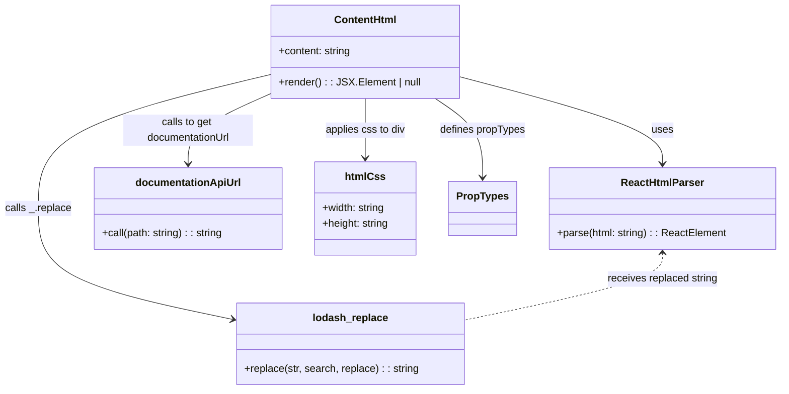

# Diagram: web/portal/src/modules/documentation/documentation-styled-components/ContentHtml.js


> Auto-generated by Obscura crawlers

## Diagram 1

```mermaid
flowchart TD
    ContentProp[content (prop)] -->|if not present: returns null| EndNull((null))
    ContentProp -->|passed to| ReplaceCall[_.replace(content, "{{documentationUrl}}", documentationUrl)]
    DocUrl[documentationApiUrl("")] -->|produces| documentationUrl
    ReplaceCall --> UpdatedContent["updatedContent (string)"]
    UpdatedContent --> Parsed[ReactHtmlParser(updatedContent)]
    Parsed --> RenderDiv[div css={htmlCss}]
    htmlCss["htmlCss { width:100%; height:100% }"] --> RenderDiv
    ContentProp -->|validated by| PropTypes[PropTypes.string]
```

> SVG rendering failed for this diagram.

## Diagram 2



### SVG

<svg id="container" width="1199.0703125" xmlns="http://www.w3.org/2000/svg" class="classDiagram" height="602" viewBox="0 0 1199.0703125 602" role="graphics-document document" aria-roledescription="class"><style>#container{font-family:"trebuchet ms",verdana,arial,sans-serif;font-size:16px;fill:#333;}@keyframes edge-animation-frame{from{stroke-dashoffset:0;}}@keyframes dash{to{stroke-dashoffset:0;}}#container .edge-animation-slow{stroke-dasharray:9,5!important;stroke-dashoffset:900;animation:dash 50s linear infinite;stroke-linecap:round;}#container .edge-animation-fast{stroke-dasharray:9,5!important;stroke-dashoffset:900;animation:dash 20s linear infinite;stroke-linecap:round;}#container .error-icon{fill:#552222;}#container .error-text{fill:#552222;stroke:#552222;}#container .edge-thickness-normal{stroke-width:1px;}#container .edge-thickness-thick{stroke-width:3.5px;}#container .edge-pattern-solid{stroke-dasharray:0;}#container .edge-thickness-invisible{stroke-width:0;fill:none;}#container .edge-pattern-dashed{stroke-dasharray:3;}#container .edge-pattern-dotted{stroke-dasharray:2;}#container .marker{fill:#333333;stroke:#333333;}#container .marker.cross{stroke:#333333;}#container svg{font-family:"trebuchet ms",verdana,arial,sans-serif;font-size:16px;}#container p{margin:0;}#container g.classGroup text{fill:#9370DB;stroke:none;font-family:"trebuchet ms",verdana,arial,sans-serif;font-size:10px;}#container g.classGroup text .title{font-weight:bolder;}#container .nodeLabel,#container .edgeLabel{color:#131300;}#container .edgeLabel .label rect{fill:#ECECFF;}#container .label text{fill:#131300;}#container .labelBkg{background:#ECECFF;}#container .edgeLabel .label span{background:#ECECFF;}#container .classTitle{font-weight:bolder;}#container .node rect,#container .node circle,#container .node ellipse,#container .node polygon,#container .node path{fill:#ECECFF;stroke:#9370DB;stroke-width:1px;}#container .divider{stroke:#9370DB;stroke-width:1;}#container g.clickable{cursor:pointer;}#container g.classGroup rect{fill:#ECECFF;stroke:#9370DB;}#container g.classGroup line{stroke:#9370DB;stroke-width:1;}#container .classLabel .box{stroke:none;stroke-width:0;fill:#ECECFF;opacity:0.5;}#container .classLabel .label{fill:#9370DB;font-size:10px;}#container .relation{stroke:#333333;stroke-width:1;fill:none;}#container .dashed-line{stroke-dasharray:3;}#container .dotted-line{stroke-dasharray:1 2;}#container #compositionStart,#container .composition{fill:#333333!important;stroke:#333333!important;stroke-width:1;}#container #compositionEnd,#container .composition{fill:#333333!important;stroke:#333333!important;stroke-width:1;}#container #dependencyStart,#container .dependency{fill:#333333!important;stroke:#333333!important;stroke-width:1;}#container #dependencyStart,#container .dependency{fill:#333333!important;stroke:#333333!important;stroke-width:1;}#container #extensionStart,#container .extension{fill:transparent!important;stroke:#333333!important;stroke-width:1;}#container #extensionEnd,#container .extension{fill:transparent!important;stroke:#333333!important;stroke-width:1;}#container #aggregationStart,#container .aggregation{fill:transparent!important;stroke:#333333!important;stroke-width:1;}#container #aggregationEnd,#container .aggregation{fill:transparent!important;stroke:#333333!important;stroke-width:1;}#container #lollipopStart,#container .lollipop{fill:#ECECFF!important;stroke:#333333!important;stroke-width:1;}#container #lollipopEnd,#container .lollipop{fill:#ECECFF!important;stroke:#333333!important;stroke-width:1;}#container .edgeTerminals{font-size:11px;line-height:initial;}#container .classTitleText{text-anchor:middle;font-size:18px;fill:#333;}#container .label-icon{display:inline-block;height:1em;overflow:visible;vertical-align:-0.125em;}#container .node .label-icon path{fill:currentColor;stroke:revert;stroke-width:revert;}#container :root{--mermaid-font-family:"trebuchet ms",verdana,arial,sans-serif;}</style><g><defs><marker id="container_class-aggregationStart" class="marker aggregation class" refX="18" refY="7" markerWidth="190" markerHeight="240" orient="auto"><path d="M 18,7 L9,13 L1,7 L9,1 Z"></path></marker></defs><defs><marker id="container_class-aggregationEnd" class="marker aggregation class" refX="1" refY="7" markerWidth="20" markerHeight="28" orient="auto"><path d="M 18,7 L9,13 L1,7 L9,1 Z"></path></marker></defs><defs><marker id="container_class-extensionStart" class="marker extension class" refX="18" refY="7" markerWidth="190" markerHeight="240" orient="auto"><path d="M 1,7 L18,13 V 1 Z"></path></marker></defs><defs><marker id="container_class-extensionEnd" class="marker extension class" refX="1" refY="7" markerWidth="20" markerHeight="28" orient="auto"><path d="M 1,1 V 13 L18,7 Z"></path></marker></defs><defs><marker id="container_class-compositionStart" class="marker composition class" refX="18" refY="7" markerWidth="190" markerHeight="240" orient="auto"><path d="M 18,7 L9,13 L1,7 L9,1 Z"></path></marker></defs><defs><marker id="container_class-compositionEnd" class="marker composition class" refX="1" refY="7" markerWidth="20" markerHeight="28" orient="auto"><path d="M 18,7 L9,13 L1,7 L9,1 Z"></path></marker></defs><defs><marker id="container_class-dependencyStart" class="marker dependency class" refX="6" refY="7" markerWidth="190" markerHeight="240" orient="auto"><path d="M 5,7 L9,13 L1,7 L9,1 Z"></path></marker></defs><defs><marker id="container_class-dependencyEnd" class="marker dependency class" refX="13" refY="7" markerWidth="20" markerHeight="28" orient="auto"><path d="M 18,7 L9,13 L14,7 L9,1 Z"></path></marker></defs><defs><marker id="container_class-lollipopStart" class="marker lollipop class" refX="13" refY="7" markerWidth="190" markerHeight="240" orient="auto"><circle stroke="black" fill="transparent" cx="7" cy="7" r="6"></circle></marker></defs><defs><marker id="container_class-lollipopEnd" class="marker lollipop class" refX="1" refY="7" markerWidth="190" markerHeight="240" orient="auto"><circle stroke="black" fill="transparent" cx="7" cy="7" r="6"></circle></marker></defs><g class="root"><g class="clusters"></g><g class="edgePaths"><path d="M707.727,118.191L759.348,131.993C810.97,145.794,914.214,173.397,965.835,195.865C1017.457,218.333,1017.457,235.667,1017.457,244.333L1017.457,253" id="id_ContentHtml_ReactHtmlParser_1" class="edge-thickness-normal edge-pattern-solid relation" style=";;;" data-edge="true" data-et="edge" data-id="id_ContentHtml_ReactHtmlParser_1" data-points="W3sieCI6NzA3LjcyNjU2MjUsInkiOjExOC4xOTEzNDMwMDAxNzI2Mn0seyJ4IjoxMDE3LjQ1NzAzMTI1LCJ5IjoyMDF9LHsieCI6MTAxNy40NTcwMzEyNSwieSI6MjU5fV0=" marker-end="url(#container_class-dependencyEnd)"></path><path d="M422.031,114.186L361.573,128.655C301.115,143.124,180.198,172.062,119.74,206.698C59.281,241.333,59.281,281.667,59.281,320C59.281,358.333,59.281,394.667,109.113,423.235C158.945,451.803,258.609,472.606,308.441,483.007L358.273,493.409" id="id_ContentHtml_lodash_replace_2" class="edge-thickness-normal edge-pattern-solid relation" style=";;;" data-edge="true" data-et="edge" data-id="id_ContentHtml_lodash_replace_2" data-points="W3sieCI6NDIyLjAzMTI1LCJ5IjoxMTQuMTg2NDA1MzIxNjcyMjN9LHsieCI6NTkuMjgxMjUsInkiOjIwMX0seyJ4Ijo1OS4yODEyNSwieSI6MzIyfSx7IngiOjU5LjI4MTI1LCJ5Ijo0MzF9LHsieCI6MzY0LjE0NjQ4NDM3NSwieSI6NDk0LjYzNDUxMDU2NDkxNjI0fV0=" marker-end="url(#container_class-dependencyEnd)"></path><path d="M422.031,143.109L400.192,152.758C378.353,162.406,334.674,181.703,312.835,200.018C290.996,218.333,290.996,235.667,290.996,244.333L290.996,253" id="id_ContentHtml_documentationApiUrl_3" class="edge-thickness-normal edge-pattern-solid relation" style=";;;" data-edge="true" data-et="edge" data-id="id_ContentHtml_documentationApiUrl_3" data-points="W3sieCI6NDIyLjAzMTI1LCJ5IjoxNDMuMTA5MzUwNDg2MzUwOH0seyJ4IjoyOTAuOTk2MDkzNzUsInkiOjIwMX0seyJ4IjoyOTAuOTk2MDkzNzUsInkiOjI1OX1d" marker-end="url(#container_class-dependencyEnd)"></path><path d="M564.879,152L564.879,160.167C564.879,168.333,564.879,184.667,564.879,200C564.879,215.333,564.879,229.667,564.879,236.833L564.879,244" id="id_ContentHtml_htmlCss_4" class="edge-thickness-normal edge-pattern-solid relation" style=";;;" data-edge="true" data-et="edge" data-id="id_ContentHtml_htmlCss_4" data-points="W3sieCI6NTY0Ljg3ODkwNjI1LCJ5IjoxNTJ9LHsieCI6NTY0Ljg3ODkwNjI1LCJ5IjoyMDF9LHsieCI6NTY0Ljg3ODkwNjI1LCJ5IjoyNTB9XQ==" marker-end="url(#container_class-dependencyEnd)"></path><path d="M671.217,152L683.278,160.167C695.34,168.333,719.463,184.667,731.524,205C743.586,225.333,743.586,249.667,743.586,261.833L743.586,274" id="id_ContentHtml_PropTypes_5" class="edge-thickness-normal edge-pattern-solid relation" style=";;;" data-edge="true" data-et="edge" data-id="id_ContentHtml_PropTypes_5" data-points="W3sieCI6NjcxLjIxNjk3NDQzMTgxODIsInkiOjE1Mn0seyJ4Ijo3NDMuNTg1OTM3NSwieSI6MjAxfSx7IngiOjc0My41ODU5Mzc1LCJ5IjoyODB9XQ==" marker-end="url(#container_class-dependencyEnd)"></path><path d="M1017.457,391L1017.457,397.667C1017.457,404.333,1017.457,417.667,966.646,434.939C915.835,452.212,814.214,473.423,763.403,484.029L712.592,494.635" id="id_ReactHtmlParser_lodash_replace_6" class="edge-thickness-normal edge-pattern-dashed relation" style=";;;" data-edge="true" data-et="edge" data-id="id_ReactHtmlParser_lodash_replace_6" data-points="W3sieCI6MTAxNy40NTcwMzEyNSwieSI6Mzg1fSx7IngiOjEwMTcuNDU3MDMxMjUsInkiOjQzMX0seyJ4Ijo3MTIuNTkxNzk2ODc1LCJ5Ijo0OTQuNjM0NTEwNTY0OTE2MjR9XQ==" marker-start="url(#container_class-dependencyStart)"></path></g><g class="edgeLabels"><g class="edgeLabel" transform="translate(1017.45703125, 201)"><g class="label" data-id="id_ContentHtml_ReactHtmlParser_1" transform="translate(-16.4921875, -12)"><foreignObject width="32.984375" height="24"><div xmlns="http://www.w3.org/1999/xhtml" class="labelBkg" style="display: table-cell; white-space: nowrap; line-height: 1.5; max-width: 200px; text-align: center;"><span class="edgeLabel"><p>uses</p></span></div></foreignObject></g></g><g class="edgeLabel" transform="translate(59.28125, 322)"><g class="label" data-id="id_ContentHtml_lodash_replace_2" transform="translate(-51.28125, -12)"><foreignObject width="102.5625" height="24"><div xmlns="http://www.w3.org/1999/xhtml" class="labelBkg" style="display: table-cell; white-space: nowrap; line-height: 1.5; max-width: 200px; text-align: center;"><span class="edgeLabel"><p>calls _.replace</p></span></div></foreignObject></g></g><g class="edgeLabel" transform="translate(290.99609375, 201)"><g class="label" data-id="id_ContentHtml_documentationApiUrl_3" transform="translate(-100, -24)"><foreignObject width="200" height="48"><div xmlns="http://www.w3.org/1999/xhtml" class="labelBkg" style="display: table; white-space: break-spaces; line-height: 1.5; max-width: 200px; text-align: center; width: 200px;"><span class="edgeLabel"><p>calls to get documentationUrl</p></span></div></foreignObject></g></g><g class="edgeLabel" transform="translate(564.87890625, 201)"><g class="label" data-id="id_ContentHtml_htmlCss_4" transform="translate(-62.546875, -12)"><foreignObject width="125.09375" height="24"><div xmlns="http://www.w3.org/1999/xhtml" class="labelBkg" style="display: table-cell; white-space: nowrap; line-height: 1.5; max-width: 200px; text-align: center;"><span class="edgeLabel"><p>applies css to div</p></span></div></foreignObject></g></g><g class="edgeLabel" transform="translate(743.5859375, 201)"><g class="label" data-id="id_ContentHtml_PropTypes_5" transform="translate(-66.2734375, -12)"><foreignObject width="132.546875" height="24"><div xmlns="http://www.w3.org/1999/xhtml" class="labelBkg" style="display: table-cell; white-space: nowrap; line-height: 1.5; max-width: 200px; text-align: center;"><span class="edgeLabel"><p>defines propTypes</p></span></div></foreignObject></g></g><g class="edgeLabel" transform="translate(1017.45703125, 431)"><g class="label" data-id="id_ReactHtmlParser_lodash_replace_6" transform="translate(-85.96875, -12)"><foreignObject width="171.9375" height="24"><div xmlns="http://www.w3.org/1999/xhtml" class="labelBkg" style="display: table-cell; white-space: nowrap; line-height: 1.5; max-width: 200px; text-align: center;"><span class="edgeLabel"><p>receives replaced string</p></span></div></foreignObject></g></g></g><g class="nodes"><g class="node default" id="classId-ContentHtml-0" transform="translate(564.87890625, 80)"><g class="basic label-container"><path d="M-142.84765625 -72 L142.84765625 -72 L142.84765625 72 L-142.84765625 72" stroke="none" stroke-width="0" fill="#ECECFF" style=""></path><path d="M-142.84765625 -72 C-81.46310245374751 -72, -20.07854865749502 -72, 142.84765625 -72 M-142.84765625 -72 C-70.54500964515374 -72, 1.757636959692519 -72, 142.84765625 -72 M142.84765625 -72 C142.84765625 -27.23555416864636, 142.84765625 17.52889166270728, 142.84765625 72 M142.84765625 -72 C142.84765625 -31.97758334295392, 142.84765625 8.044833314092159, 142.84765625 72 M142.84765625 72 C40.77433832831551 72, -61.29897959336898 72, -142.84765625 72 M142.84765625 72 C74.0246941722133 72, 5.201732094426603 72, -142.84765625 72 M-142.84765625 72 C-142.84765625 14.808215132864888, -142.84765625 -42.383569734270225, -142.84765625 -72 M-142.84765625 72 C-142.84765625 27.7065019067419, -142.84765625 -16.586996186516203, -142.84765625 -72" stroke="#9370DB" stroke-width="1.3" fill="none" stroke-dasharray="0 0" style=""></path></g><g class="annotation-group text" transform="translate(0, -48)"></g><g class="label-group text" transform="translate(-46.3515625, -48)"><g class="label" style="font-weight: bolder" transform="translate(0,-12)"><foreignObject width="92.703125" height="24"><div xmlns="http://www.w3.org/1999/xhtml" style="display: table-cell; white-space: nowrap; line-height: 1.5; max-width: 142px; text-align: center;"><span class="nodeLabel markdown-node-label" style=""><p>ContentHtml</p></span></div></foreignObject></g></g><g class="members-group text" transform="translate(-130.84765625, 0)"><g class="label" style="" transform="translate(0,-12)"><foreignObject width="113.21875" height="24"><div xmlns="http://www.w3.org/1999/xhtml" style="display: table-cell; white-space: nowrap; line-height: 1.5; max-width: 171px; text-align: center;"><span class="nodeLabel markdown-node-label" style=""><p>+content: string</p></span></div></foreignObject></g></g><g class="methods-group text" transform="translate(-130.84765625, 48)"><g class="label" style="" transform="translate(0,-12)"><foreignObject width="215.34375" height="24"><div xmlns="http://www.w3.org/1999/xhtml" style="display: table-cell; white-space: nowrap; line-height: 1.5; max-width: 273px; text-align: center;"><span class="nodeLabel markdown-node-label" style=""><p>+render() : : JSX.Element | null</p></span></div></foreignObject></g></g><g class="divider" style=""><path d="M-142.84765625 -24 C-50.50719302076638 -24, 41.83327020846724 -24, 142.84765625 -24 M-142.84765625 -24 C-81.12338472137897 -24, -19.399113192757937 -24, 142.84765625 -24" stroke="#9370DB" stroke-width="1.3" fill="none" stroke-dasharray="0 0" style=""></path></g><g class="divider" style=""><path d="M-142.84765625 24 C-52.66683580762414 24, 37.51398463475172 24, 142.84765625 24 M-142.84765625 24 C-33.971033298309464 24, 74.90558965338107 24, 142.84765625 24" stroke="#9370DB" stroke-width="1.3" fill="none" stroke-dasharray="0 0" style=""></path></g></g><g class="node default" id="classId-ReactHtmlParser-1" transform="translate(1017.45703125, 322)"><g class="basic label-container"><path d="M-173.61328125 -63 L173.61328125 -63 L173.61328125 63 L-173.61328125 63" stroke="none" stroke-width="0" fill="#ECECFF" style=""></path><path d="M-173.61328125 -63 C-67.99304391495266 -63, 37.62719342009467 -63, 173.61328125 -63 M-173.61328125 -63 C-42.63502122288483 -63, 88.34323880423034 -63, 173.61328125 -63 M173.61328125 -63 C173.61328125 -34.74828599425034, 173.61328125 -6.496571988500669, 173.61328125 63 M173.61328125 -63 C173.61328125 -15.413139659272602, 173.61328125 32.173720681454796, 173.61328125 63 M173.61328125 63 C72.53717844594956 63, -28.53892435810087 63, -173.61328125 63 M173.61328125 63 C73.06804608640194 63, -27.47718907719613 63, -173.61328125 63 M-173.61328125 63 C-173.61328125 25.27476998030062, -173.61328125 -12.450460039398763, -173.61328125 -63 M-173.61328125 63 C-173.61328125 13.909603983931333, -173.61328125 -35.18079203213733, -173.61328125 -63" stroke="#9370DB" stroke-width="1.3" fill="none" stroke-dasharray="0 0" style=""></path></g><g class="annotation-group text" transform="translate(0, -39)"></g><g class="label-group text" transform="translate(-61.3828125, -39)"><g class="label" style="font-weight: bolder" transform="translate(0,-12)"><foreignObject width="122.765625" height="24"><div xmlns="http://www.w3.org/1999/xhtml" style="display: table-cell; white-space: nowrap; line-height: 1.5; max-width: 171px; text-align: center;"><span class="nodeLabel markdown-node-label" style=""><p>ReactHtmlParser</p></span></div></foreignObject></g></g><g class="members-group text" transform="translate(-161.61328125, 9)"></g><g class="methods-group text" transform="translate(-161.61328125, 39)"><g class="label" style="" transform="translate(0,-12)"><foreignObject width="261.84375" height="24"><div xmlns="http://www.w3.org/1999/xhtml" style="display: table-cell; white-space: nowrap; line-height: 1.5; max-width: 319px; text-align: center;"><span class="nodeLabel markdown-node-label" style=""><p>+parse(html: string) : : ReactElement</p></span></div></foreignObject></g></g><g class="divider" style=""><path d="M-173.61328125 -15 C-63.7098474673669 -15, 46.1935863152662 -15, 173.61328125 -15 M-173.61328125 -15 C-84.7073558632593 -15, 4.19856952348141 -15, 173.61328125 -15" stroke="#9370DB" stroke-width="1.3" fill="none" stroke-dasharray="0 0" style=""></path></g><g class="divider" style=""><path d="M-173.61328125 9 C-85.23497492455586 9, 3.143331400888286 9, 173.61328125 9 M-173.61328125 9 C-66.05520964299825 9, 41.5028619640035 9, 173.61328125 9" stroke="#9370DB" stroke-width="1.3" fill="none" stroke-dasharray="0 0" style=""></path></g></g><g class="node default" id="classId-lodash_replace-2" transform="translate(538.369140625, 531)"><g class="basic label-container"><path d="M-174.22265625 -63 L174.22265625 -63 L174.22265625 63 L-174.22265625 63" stroke="none" stroke-width="0" fill="#ECECFF" style=""></path><path d="M-174.22265625 -63 C-74.14112706950166 -63, 25.940402110996672 -63, 174.22265625 -63 M-174.22265625 -63 C-47.33584698355078 -63, 79.55096228289844 -63, 174.22265625 -63 M174.22265625 -63 C174.22265625 -37.597450778920575, 174.22265625 -12.194901557841149, 174.22265625 63 M174.22265625 -63 C174.22265625 -18.788970934534063, 174.22265625 25.422058130931873, 174.22265625 63 M174.22265625 63 C49.39880359394992 63, -75.42504906210016 63, -174.22265625 63 M174.22265625 63 C101.97197247166976 63, 29.721288693339517 63, -174.22265625 63 M-174.22265625 63 C-174.22265625 12.74548667604391, -174.22265625 -37.50902664791218, -174.22265625 -63 M-174.22265625 63 C-174.22265625 30.711317980465147, -174.22265625 -1.5773640390697068, -174.22265625 -63" stroke="#9370DB" stroke-width="1.3" fill="none" stroke-dasharray="0 0" style=""></path></g><g class="annotation-group text" transform="translate(0, -39)"></g><g class="label-group text" transform="translate(-55.7265625, -39)"><g class="label" style="font-weight: bolder" transform="translate(0,-12)"><foreignObject width="111.453125" height="24"><div xmlns="http://www.w3.org/1999/xhtml" style="display: table-cell; white-space: nowrap; line-height: 1.5; max-width: 161px; text-align: center;"><span class="nodeLabel markdown-node-label" style=""><p>lodash_replace</p></span></div></foreignObject></g></g><g class="members-group text" transform="translate(-162.22265625, 9)"></g><g class="methods-group text" transform="translate(-162.22265625, 39)"><g class="label" style="" transform="translate(0,-12)"><foreignObject width="268.71875" height="24"><div xmlns="http://www.w3.org/1999/xhtml" style="display: table-cell; white-space: nowrap; line-height: 1.5; max-width: 327px; text-align: center;"><span class="nodeLabel markdown-node-label" style=""><p>+replace(str, search, replace) : : string</p></span></div></foreignObject></g></g><g class="divider" style=""><path d="M-174.22265625 -15 C-47.62915776273469 -15, 78.96434072453062 -15, 174.22265625 -15 M-174.22265625 -15 C-81.02762357525735 -15, 12.167409099485297 -15, 174.22265625 -15" stroke="#9370DB" stroke-width="1.3" fill="none" stroke-dasharray="0 0" style=""></path></g><g class="divider" style=""><path d="M-174.22265625 9 C-35.55901191400574 9, 103.10463242198853 9, 174.22265625 9 M-174.22265625 9 C-53.10371886563884 9, 68.01521851872232 9, 174.22265625 9" stroke="#9370DB" stroke-width="1.3" fill="none" stroke-dasharray="0 0" style=""></path></g></g><g class="node default" id="classId-documentationApiUrl-3" transform="translate(290.99609375, 322)"><g class="basic label-container"><path d="M-145.43359375 -63 L145.43359375 -63 L145.43359375 63 L-145.43359375 63" stroke="none" stroke-width="0" fill="#ECECFF" style=""></path><path d="M-145.43359375 -63 C-63.73969723846463 -63, 17.954199273070742 -63, 145.43359375 -63 M-145.43359375 -63 C-64.70454755876048 -63, 16.024498632479037 -63, 145.43359375 -63 M145.43359375 -63 C145.43359375 -33.940602059691955, 145.43359375 -4.881204119383909, 145.43359375 63 M145.43359375 -63 C145.43359375 -36.255705893234065, 145.43359375 -9.511411786468138, 145.43359375 63 M145.43359375 63 C78.185748411216 63, 10.937903072431993 63, -145.43359375 63 M145.43359375 63 C53.594857536729435 63, -38.24387867654113 63, -145.43359375 63 M-145.43359375 63 C-145.43359375 14.445282630571981, -145.43359375 -34.10943473885604, -145.43359375 -63 M-145.43359375 63 C-145.43359375 24.658879329742312, -145.43359375 -13.682241340515375, -145.43359375 -63" stroke="#9370DB" stroke-width="1.3" fill="none" stroke-dasharray="0 0" style=""></path></g><g class="annotation-group text" transform="translate(0, -39)"></g><g class="label-group text" transform="translate(-78.1484375, -39)"><g class="label" style="font-weight: bolder" transform="translate(0,-12)"><foreignObject width="156.296875" height="24"><div xmlns="http://www.w3.org/1999/xhtml" style="display: table-cell; white-space: nowrap; line-height: 1.5; max-width: 206px; text-align: center;"><span class="nodeLabel markdown-node-label" style=""><p>documentationApiUrl</p></span></div></foreignObject></g></g><g class="members-group text" transform="translate(-133.43359375, 9)"></g><g class="methods-group text" transform="translate(-133.43359375, 39)"><g class="label" style="" transform="translate(0,-12)"><foreignObject width="188.71875" height="24"><div xmlns="http://www.w3.org/1999/xhtml" style="display: table-cell; white-space: nowrap; line-height: 1.5; max-width: 247px; text-align: center;"><span class="nodeLabel markdown-node-label" style=""><p>+call(path: string) : : string</p></span></div></foreignObject></g></g><g class="divider" style=""><path d="M-145.43359375 -15 C-69.21687186523178 -15, 6.999850019536439 -15, 145.43359375 -15 M-145.43359375 -15 C-61.65325422499832 -15, 22.12708530000336 -15, 145.43359375 -15" stroke="#9370DB" stroke-width="1.3" fill="none" stroke-dasharray="0 0" style=""></path></g><g class="divider" style=""><path d="M-145.43359375 9 C-81.60973957670316 9, -17.78588540340634 9, 145.43359375 9 M-145.43359375 9 C-70.72076917507296 9, 3.992055399854081 9, 145.43359375 9" stroke="#9370DB" stroke-width="1.3" fill="none" stroke-dasharray="0 0" style=""></path></g></g><g class="node default" id="classId-htmlCss-4" transform="translate(564.87890625, 322)"><g class="basic label-container"><path d="M-78.44921875 -72 L78.44921875 -72 L78.44921875 72 L-78.44921875 72" stroke="none" stroke-width="0" fill="#ECECFF" style=""></path><path d="M-78.44921875 -72 C-35.7837497110536 -72, 6.881719327892796 -72, 78.44921875 -72 M-78.44921875 -72 C-37.13490783358108 -72, 4.179403082837837 -72, 78.44921875 -72 M78.44921875 -72 C78.44921875 -15.636387841573551, 78.44921875 40.7272243168529, 78.44921875 72 M78.44921875 -72 C78.44921875 -21.479105341056368, 78.44921875 29.041789317887265, 78.44921875 72 M78.44921875 72 C41.454882691719824 72, 4.460546633439648 72, -78.44921875 72 M78.44921875 72 C18.11102281149479 72, -42.22717312701042 72, -78.44921875 72 M-78.44921875 72 C-78.44921875 24.42289859618819, -78.44921875 -23.15420280762362, -78.44921875 -72 M-78.44921875 72 C-78.44921875 38.42852251785062, -78.44921875 4.857045035701233, -78.44921875 -72" stroke="#9370DB" stroke-width="1.3" fill="none" stroke-dasharray="0 0" style=""></path></g><g class="annotation-group text" transform="translate(0, -48)"></g><g class="label-group text" transform="translate(-29.0546875, -48)"><g class="label" style="font-weight: bolder" transform="translate(0,-12)"><foreignObject width="58.109375" height="24"><div xmlns="http://www.w3.org/1999/xhtml" style="display: table-cell; white-space: nowrap; line-height: 1.5; max-width: 107px; text-align: center;"><span class="nodeLabel markdown-node-label" style=""><p>htmlCss</p></span></div></foreignObject></g></g><g class="members-group text" transform="translate(-66.44921875, 0)"><g class="label" style="" transform="translate(0,-12)"><foreignObject width="98.40625" height="24"><div xmlns="http://www.w3.org/1999/xhtml" style="display: table-cell; white-space: nowrap; line-height: 1.5; max-width: 156px; text-align: center;"><span class="nodeLabel markdown-node-label" style=""><p>+width: string</p></span></div></foreignObject></g><g class="label" style="" transform="translate(0,12)"><foreignObject width="103.84375" height="24"><div xmlns="http://www.w3.org/1999/xhtml" style="display: table-cell; white-space: nowrap; line-height: 1.5; max-width: 162px; text-align: center;"><span class="nodeLabel markdown-node-label" style=""><p>+height: string</p></span></div></foreignObject></g></g><g class="methods-group text" transform="translate(-66.44921875, 72)"></g><g class="divider" style=""><path d="M-78.44921875 -24 C-37.17489526508446 -24, 4.099428219831083 -24, 78.44921875 -24 M-78.44921875 -24 C-21.08279028164514 -24, 36.28363818670972 -24, 78.44921875 -24" stroke="#9370DB" stroke-width="1.3" fill="none" stroke-dasharray="0 0" style=""></path></g><g class="divider" style=""><path d="M-78.44921875 48 C-44.61550949081992 48, -10.781800231639835 48, 78.44921875 48 M-78.44921875 48 C-24.807683381408758 48, 28.833851987182484 48, 78.44921875 48" stroke="#9370DB" stroke-width="1.3" fill="none" stroke-dasharray="0 0" style=""></path></g></g><g class="node default" id="classId-PropTypes-5" transform="translate(743.5859375, 322)"><g class="basic label-container"><path d="M-50.2578125 -42 L50.2578125 -42 L50.2578125 42 L-50.2578125 42" stroke="none" stroke-width="0" fill="#ECECFF" style=""></path><path d="M-50.2578125 -42 C-10.161566402443711 -42, 29.934679695112578 -42, 50.2578125 -42 M-50.2578125 -42 C-11.131133513587336 -42, 27.995545472825327 -42, 50.2578125 -42 M50.2578125 -42 C50.2578125 -12.116613967779877, 50.2578125 17.766772064440246, 50.2578125 42 M50.2578125 -42 C50.2578125 -12.99437617741717, 50.2578125 16.01124764516566, 50.2578125 42 M50.2578125 42 C29.251441270581967 42, 8.245070041163935 42, -50.2578125 42 M50.2578125 42 C20.28494986546216 42, -9.68791276907568 42, -50.2578125 42 M-50.2578125 42 C-50.2578125 19.80704484234314, -50.2578125 -2.3859103153137227, -50.2578125 -42 M-50.2578125 42 C-50.2578125 20.854851410204365, -50.2578125 -0.29029717959127055, -50.2578125 -42" stroke="#9370DB" stroke-width="1.3" fill="none" stroke-dasharray="0 0" style=""></path></g><g class="annotation-group text" transform="translate(0, -18)"></g><g class="label-group text" transform="translate(-38.2578125, -18)"><g class="label" style="font-weight: bolder" transform="translate(0,-12)"><foreignObject width="76.515625" height="24"><div xmlns="http://www.w3.org/1999/xhtml" style="display: table-cell; white-space: nowrap; line-height: 1.5; max-width: 125px; text-align: center;"><span class="nodeLabel markdown-node-label" style=""><p>PropTypes</p></span></div></foreignObject></g></g><g class="members-group text" transform="translate(-38.2578125, 30)"></g><g class="methods-group text" transform="translate(-38.2578125, 60)"></g><g class="divider" style=""><path d="M-50.2578125 6 C-15.97830541173429 6, 18.30120167653142 6, 50.2578125 6 M-50.2578125 6 C-27.290024676819222 6, -4.322236853638444 6, 50.2578125 6" stroke="#9370DB" stroke-width="1.3" fill="none" stroke-dasharray="0 0" style=""></path></g><g class="divider" style=""><path d="M-50.2578125 24 C-23.184260638792168 24, 3.8892912224156646 24, 50.2578125 24 M-50.2578125 24 C-26.493060554101007 24, -2.7283086082020134 24, 50.2578125 24" stroke="#9370DB" stroke-width="1.3" fill="none" stroke-dasharray="0 0" style=""></path></g></g></g></g></g></svg>
