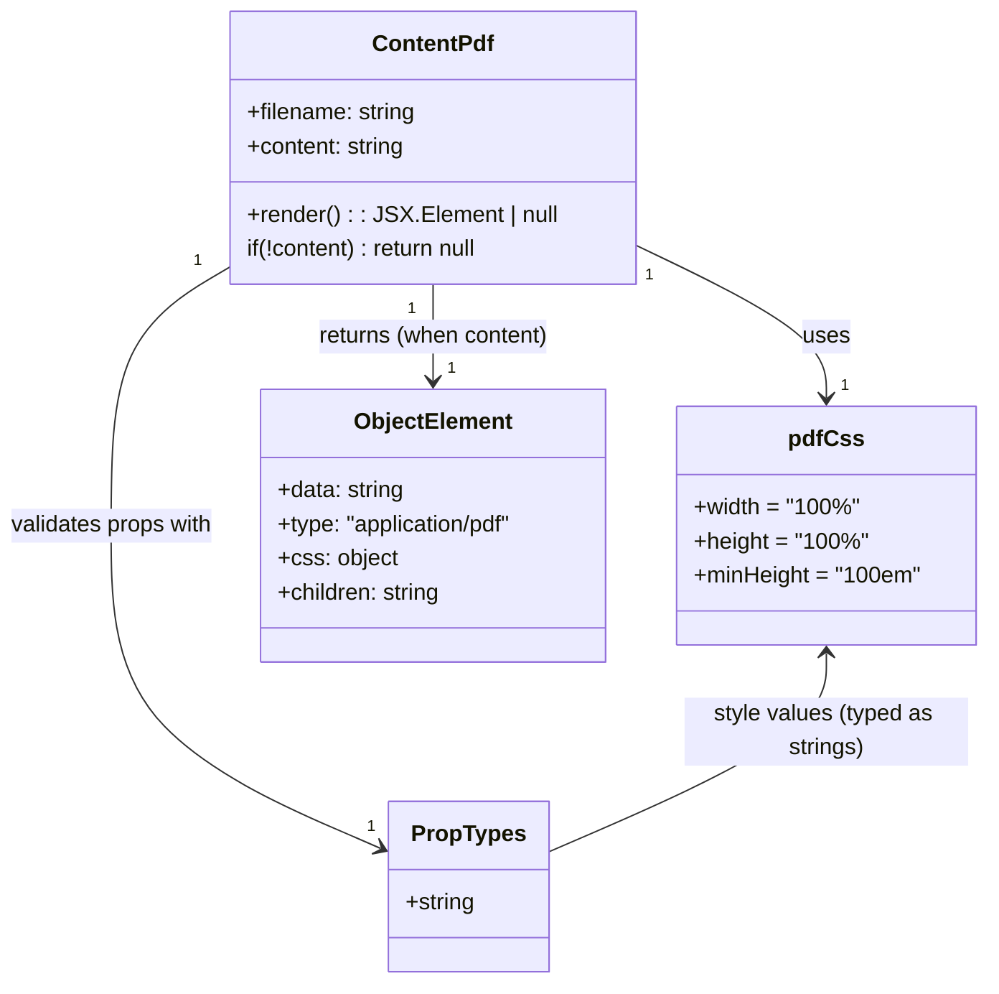

# Diagram: web/portal/src/modules/documentation/documentation-styled-components/ContentPdf.js

> Auto-generated by Obscura crawlers

## Mermaid

### SVG

<svg id="container" width="709.0859375" xmlns="http://www.w3.org/2000/svg" class="classDiagram" height="692" viewBox="0 0 709.0859375 692" role="graphics-document document" aria-roledescription="class"><g><defs><marker id="container_class-aggregationStart" class="marker aggregation class" refX="18" refY="7" markerWidth="190" markerHeight="240" orient="auto"><path d="M 18,7 L9,13 L1,7 L9,1 Z"></path></marker></defs><defs><marker id="container_class-aggregationEnd" class="marker aggregation class" refX="1" refY="7" markerWidth="20" markerHeight="28" orient="auto"><path d="M 18,7 L9,13 L1,7 L9,1 Z"></path></marker></defs><defs><marker id="container_class-extensionStart" class="marker extension class" refX="18" refY="7" markerWidth="190" markerHeight="240" orient="auto"><path d="M 1,7 L18,13 V 1 Z"></path></marker></defs><defs><marker id="container_class-extensionEnd" class="marker extension class" refX="1" refY="7" markerWidth="20" markerHeight="28" orient="auto"><path d="M 1,1 V 13 L18,7 Z"></path></marker></defs><defs><marker id="container_class-compositionStart" class="marker composition class" refX="18" refY="7" markerWidth="190" markerHeight="240" orient="auto"><path d="M 18,7 L9,13 L1,7 L9,1 Z"></path></marker></defs><defs><marker id="container_class-compositionEnd" class="marker composition class" refX="1" refY="7" markerWidth="20" markerHeight="28" orient="auto"><path d="M 18,7 L9,13 L1,7 L9,1 Z"></path></marker></defs><defs><marker id="container_class-dependencyStart" class="marker dependency class" refX="6" refY="7" markerWidth="190" markerHeight="240" orient="auto"><path d="M 5,7 L9,13 L1,7 L9,1 Z"></path></marker></defs><defs><marker id="container_class-dependencyEnd" class="marker dependency class" refX="13" refY="7" markerWidth="20" markerHeight="28" orient="auto"><path d="M 18,7 L9,13 L14,7 L9,1 Z"></path></marker></defs><defs><marker id="container_class-lollipopStart" class="marker lollipop class" refX="13" refY="7" markerWidth="190" markerHeight="240" orient="auto"><circle stroke="black" fill="transparent" cx="7" cy="7" r="6"></circle></marker></defs><defs><marker id="container_class-lollipopEnd" class="marker lollipop class" refX="1" refY="7" markerWidth="190" markerHeight="240" orient="auto"><circle stroke="black" fill="transparent" cx="7" cy="7" r="6"></circle></marker></defs><g class="root"><g class="clusters"></g><g class="edgePaths"><path d="M456.41,170.395L479.846,181.496C503.283,192.597,550.155,214.798,573.591,233.066C597.027,251.333,597.027,265.667,597.027,272.833L597.027,280" id="id_ContentPdf_pdfCss_1" class="edge-thickness-normal edge-pattern-solid relation" style=";;;" data-edge="true" data-et="edge" data-id="id_ContentPdf_pdfCss_1" data-points="W3sieCI6NDU2LjQxMDE1NjI1LCJ5IjoxNzAuMzk1NDYyMDcwMzA4N30seyJ4Ijo1OTcuMDI3MzQzNzUsInkiOjIzN30seyJ4Ijo1OTcuMDI3MzQzNzUsInkiOjI4Nn1d" marker-end="url(#container_class-dependencyEnd)"></path><path d="M176.059,183.339L160.257,192.282C144.456,201.226,112.853,219.113,97.051,250.223C81.25,281.333,81.25,325.667,81.25,372C81.25,418.333,81.25,466.667,113.987,504.67C146.724,542.673,212.197,570.346,244.934,584.183L277.671,598.02" id="id_ContentPdf_PropTypes_2" class="edge-thickness-normal edge-pattern-solid relation" style=";;;" data-edge="true" data-et="edge" data-id="id_ContentPdf_PropTypes_2" data-points="W3sieCI6MTc2LjA1ODU5Mzc1LCJ5IjoxODMuMzM4ODAyNDQ2OTcxMjF9LHsieCI6ODEuMjUsInkiOjIzN30seyJ4Ijo4MS4yNSwieSI6MzcwfSx7IngiOjgxLjI1LCJ5Ijo1MTV9LHsieCI6MjgzLjE5NzI2NTYyNSwieSI6NjAwLjM1NTYzNzM0OTU3MX1d" marker-end="url(#container_class-dependencyEnd)"></path><path d="M316.234,200L316.234,206.167C316.234,212.333,316.234,224.667,316.234,236C316.234,247.333,316.234,257.667,316.234,262.833L316.234,268" id="id_ContentPdf_ObjectElement_3" class="edge-thickness-normal edge-pattern-solid relation" style=";;;" data-edge="true" data-et="edge" data-id="id_ContentPdf_ObjectElement_3" data-points="W3sieCI6MzE2LjIzNDM3NSwieSI6MjAwfSx7IngiOjMxNi4yMzQzNzUsInkiOjIzN30seyJ4IjozMTYuMjM0Mzc1LCJ5IjoyNzR9XQ==" marker-end="url(#container_class-dependencyEnd)"></path><path d="M597.027,460L597.027,469.167C597.027,478.333,597.027,496.667,563.369,520.059C529.712,543.452,462.396,571.904,428.738,586.13L395.08,600.356" id="id_pdfCss_PropTypes_4" class="edge-thickness-normal edge-pattern-solid relation" style=";;;" data-edge="true" data-et="edge" data-id="id_pdfCss_PropTypes_4" data-points="W3sieCI6NTk3LjAyNzM0Mzc1LCJ5Ijo0NTR9LHsieCI6NTk3LjAyNzM0Mzc1LCJ5Ijo1MTV9LHsieCI6Mzk1LjA4MDA3ODEyNSwieSI6NjAwLjM1NTYzNzM0OTU3MX1d" marker-start="url(#container_class-dependencyStart)"></path></g><g class="edgeLabels"><g class="edgeLabel" transform="translate(597.02734375, 237)"><g class="label" data-id="id_ContentPdf_pdfCss_1" transform="translate(-16.4921875, -12)"><foreignObject width="32.984375" height="24">

uses

</foreignObject></g></g><g class="edgeLabel" transform="translate(81.25, 370)"><g class="label" data-id="id_ContentPdf_PropTypes_2" transform="translate(-73.25, -12)"><foreignObject width="146.5" height="24">

validates props with

</foreignObject></g></g><g class="edgeLabel" transform="translate(316.234375, 237)"><g class="label" data-id="id_ContentPdf_ObjectElement_3" transform="translate(-82.890625, -12)"><foreignObject width="165.78125" height="24">

returns (when content)

</foreignObject></g></g><g class="edgeLabel" transform="translate(597.02734375, 515)"><g class="label" data-id="id_pdfCss_PropTypes_4" transform="translate(-100, -24)"><foreignObject width="200" height="48">

style values (typed as strings)

</foreignObject></g></g><g class="edgeTerminals" transform="translate(465.8047117226166, 191.44284303167473)"><g class="inner" transform="translate(0, 0)"><foreignObject style="width: 9px; height: 12px;">
1
</foreignObject></g></g><g class="edgeTerminals" transform="translate(153.44026846273843, 178.9046907352839)"><g class="inner" transform="translate(0, 0)"><foreignObject style="width: 9px; height: 12px;">
1
</foreignObject></g></g><g class="edgeTerminals" transform="translate(301.23437750000016, 217.50000214285714)"><g class="inner" transform="translate(0, 0)"><foreignObject style="width: 9px; height: 12px;">
1
</foreignObject></g></g><g class="edgeTerminals" transform="translate(607.0273418749999, 263.49999839285715)"><g class="inner" transform="translate(0, 0)"></g><foreignObject style="width: 9px; height: 12px;">
1
</foreignObject></g><g class="edgeTerminals" transform="translate(267.9176961754826, 574.7260383554787)"><g class="inner" transform="translate(0, 0)"></g><foreignObject style="width: 9px; height: 12px;">
1
</foreignObject></g><g class="edgeTerminals" transform="translate(326.2343774999998, 251.5000021428571)"><g class="inner" transform="translate(0, 0)"></g><foreignObject style="width: 9px; height: 12px;">
1
</foreignObject></g></g><g class="nodes"><g class="node default" id="classId-ContentPdf-0" transform="translate(316.234375, 104)"><g class="basic label-container"><path d="M-140.17578125 -96 L140.17578125 -96 L140.17578125 96 L-140.17578125 96" stroke="none" stroke-width="0" fill="#ECECFF" style=""></path><path d="M-140.17578125 -96 C-52.72357071527772 -96, 34.72863981944457 -96, 140.17578125 -96 M-140.17578125 -96 C-61.36480423826819 -96, 17.446172773463616 -96, 140.17578125 -96 M140.17578125 -96 C140.17578125 -56.53630950802881, 140.17578125 -17.072619016057615, 140.17578125 96 M140.17578125 -96 C140.17578125 -20.02440545521472, 140.17578125 55.95118908957056, 140.17578125 96 M140.17578125 96 C58.66415532367324 96, -22.847470602653516 96, -140.17578125 96 M140.17578125 96 C63.7276533949876 96, -12.720474460024803 96, -140.17578125 96 M-140.17578125 96 C-140.17578125 33.54946734504165, -140.17578125 -28.901065309916703, -140.17578125 -96 M-140.17578125 96 C-140.17578125 27.781267240191, -140.17578125 -40.437465519618, -140.17578125 -96" stroke="#9370DB" stroke-width="1.3" fill="none" stroke-dasharray="0 0" style=""></path></g><g class="annotation-group text" transform="translate(0, -72)"></g><g class="label-group text" transform="translate(-41.0078125, -72)"><g class="label" style="font-weight: bolder" transform="translate(0,-12)"><foreignObject width="82.015625" height="24">

ContentPdf

</foreignObject></g></g><g class="members-group text" transform="translate(-128.17578125, -24)"><g class="label" style="" transform="translate(0,-12)"><foreignObject width="120.5" height="24">

+filename: string

</foreignObject></g><g class="label" style="" transform="translate(0,12)"><foreignObject width="113.21875" height="24">

+content: string

</foreignObject></g></g><g class="methods-group text" transform="translate(-128.17578125, 48)"><g class="label" style="" transform="translate(0,-12)"><foreignObject width="215.34375" height="24">

+render() : : JSX.Element | null

</foreignObject></g><g class="label" style="" transform="translate(0,12)"><foreignObject width="169.234375" height="24">

if(!content) : return null

</foreignObject></g></g><g class="divider" style=""><path d="M-140.17578125 -48 C-48.238705970043696 -48, 43.69836930991261 -48, 140.17578125 -48 M-140.17578125 -48 C-31.73476126518206 -48, 76.70625871963588 -48, 140.17578125 -48" stroke="#9370DB" stroke-width="1.3" fill="none" stroke-dasharray="0 0" style=""></path></g><g class="divider" style=""><path d="M-140.17578125 24 C-48.95577132474121 24, 42.26423860051759 24, 140.17578125 24 M-140.17578125 24 C-44.58186745379166 24, 51.01204634241668 24, 140.17578125 24" stroke="#9370DB" stroke-width="1.3" fill="none" stroke-dasharray="0 0" style=""></path></g></g><g class="node default" id="classId-pdfCss-1" transform="translate(597.02734375, 370)"><g class="basic label-container"><path d="M-104.05859375 -84 L104.05859375 -84 L104.05859375 84 L-104.05859375 84" stroke="none" stroke-width="0" fill="#ECECFF" style=""></path><path d="M-104.05859375 -84 C-46.518549835010866 -84, 11.021494079978268 -84, 104.05859375 -84 M-104.05859375 -84 C-25.59325896980566 -84, 52.87207581038868 -84, 104.05859375 -84 M104.05859375 -84 C104.05859375 -22.418341311851833, 104.05859375 39.163317376296334, 104.05859375 84 M104.05859375 -84 C104.05859375 -41.850155041084165, 104.05859375 0.299689917831671, 104.05859375 84 M104.05859375 84 C57.286759433315055 84, 10.51492511663011 84, -104.05859375 84 M104.05859375 84 C46.95251774979554 84, -10.15355825040892 84, -104.05859375 84 M-104.05859375 84 C-104.05859375 42.415352004922426, -104.05859375 0.830704009844851, -104.05859375 -84 M-104.05859375 84 C-104.05859375 40.73456102480031, -104.05859375 -2.530877950399386, -104.05859375 -84" stroke="#9370DB" stroke-width="1.3" fill="none" stroke-dasharray="0 0" style=""></path></g><g class="annotation-group text" transform="translate(0, -60)"></g><g class="label-group text" transform="translate(-24.6328125, -60)"><g class="label" style="font-weight: bolder" transform="translate(0,-12)"><foreignObject width="49.265625" height="24">

pdfCss

</foreignObject></g></g><g class="members-group text" transform="translate(-92.05859375, -12)"><g class="label" style="" transform="translate(0,-12)"><foreignObject width="114.984375" height="24">

+width = "100%"

</foreignObject></g><g class="label" style="" transform="translate(0,12)"><foreignObject width="120.359375" height="24">

+height = "100%"

</foreignObject></g><g class="label" style="" transform="translate(0,36)"><foreignObject width="159.484375" height="24">

+minHeight = "100em"

</foreignObject></g></g><g class="methods-group text" transform="translate(-92.05859375, 84)"></g><g class="divider" style=""><path d="M-104.05859375 -36 C-38.0708071733919 -36, 27.916979403216203 -36, 104.05859375 -36 M-104.05859375 -36 C-33.41044455138504 -36, 37.23770464722992 -36, 104.05859375 -36" stroke="#9370DB" stroke-width="1.3" fill="none" stroke-dasharray="0 0" style=""></path></g><g class="divider" style=""><path d="M-104.05859375 60 C-42.59129896282264 60, 18.875995824354717 60, 104.05859375 60 M-104.05859375 60 C-51.25022877581734 60, 1.5581361983653181 60, 104.05859375 60" stroke="#9370DB" stroke-width="1.3" fill="none" stroke-dasharray="0 0" style=""></path></g></g><g class="node default" id="classId-PropTypes-2" transform="translate(339.138671875, 624)"><g class="basic label-container"><path d="M-55.94140625 -60 L55.94140625 -60 L55.94140625 60 L-55.94140625 60" stroke="none" stroke-width="0" fill="#ECECFF" style=""></path><path d="M-55.94140625 -60 C-23.223894872565523 -60, 9.493616504868953 -60, 55.94140625 -60 M-55.94140625 -60 C-28.670851481056395 -60, -1.400296712112791 -60, 55.94140625 -60 M55.94140625 -60 C55.94140625 -12.310048688208731, 55.94140625 35.37990262358254, 55.94140625 60 M55.94140625 -60 C55.94140625 -15.04202301472187, 55.94140625 29.91595397055626, 55.94140625 60 M55.94140625 60 C26.338662373155742 60, -3.264081503688516 60, -55.94140625 60 M55.94140625 60 C27.391647693807823 60, -1.1581108623843548 60, -55.94140625 60 M-55.94140625 60 C-55.94140625 32.05194054197666, -55.94140625 4.1038810839533255, -55.94140625 -60 M-55.94140625 60 C-55.94140625 29.149182963291185, -55.94140625 -1.7016340734176296, -55.94140625 -60" stroke="#9370DB" stroke-width="1.3" fill="none" stroke-dasharray="0 0" style=""></path></g><g class="annotation-group text" transform="translate(0, -36)"></g><g class="label-group text" transform="translate(-38.2578125, -36)"><g class="label" style="font-weight: bolder" transform="translate(0,-12)"><foreignObject width="76.515625" height="24">

PropTypes

</foreignObject></g></g><g class="members-group text" transform="translate(-43.94140625, 12)"><g class="label" style="" transform="translate(0,-12)"><foreignObject width="49.625" height="24">

+string

</foreignObject></g></g><g class="methods-group text" transform="translate(-43.94140625, 60)"></g><g class="divider" style=""><path d="M-55.94140625 -12 C-22.644282644786124 -12, 10.652840960427753 -12, 55.94140625 -12 M-55.94140625 -12 C-25.996258240081342 -12, 3.948889769837315 -12, 55.94140625 -12" stroke="#9370DB" stroke-width="1.3" fill="none" stroke-dasharray="0 0" style=""></path></g><g class="divider" style=""><path d="M-55.94140625 36 C-27.262163692794623 36, 1.4170788644107546 36, 55.94140625 36 M-55.94140625 36 C-13.880508750175082 36, 28.180388749649836 36, 55.94140625 36" stroke="#9370DB" stroke-width="1.3" fill="none" stroke-dasharray="0 0" style=""></path></g></g><g class="node default" id="classId-ObjectElement-3" transform="translate(316.234375, 370)"><g class="basic label-container"><path d="M-126.734375 -96 L126.734375 -96 L126.734375 96 L-126.734375 96" stroke="none" stroke-width="0" fill="#ECECFF" style=""></path><path d="M-126.734375 -96 C-49.064104931558475 -96, 28.60616513688305 -96, 126.734375 -96 M-126.734375 -96 C-69.43990692898342 -96, -12.145438857966823 -96, 126.734375 -96 M126.734375 -96 C126.734375 -34.724641122737395, 126.734375 26.55071775452521, 126.734375 96 M126.734375 -96 C126.734375 -40.98226220110439, 126.734375 14.03547559779122, 126.734375 96 M126.734375 96 C67.67786950289442 96, 8.621364005788863 96, -126.734375 96 M126.734375 96 C51.34865973775878 96, -24.03705552448244 96, -126.734375 96 M-126.734375 96 C-126.734375 56.87951183199981, -126.734375 17.759023663999614, -126.734375 -96 M-126.734375 96 C-126.734375 46.1347276680403, -126.734375 -3.730544663919403, -126.734375 -96" stroke="#9370DB" stroke-width="1.3" fill="none" stroke-dasharray="0 0" style=""></path></g><g class="annotation-group text" transform="translate(0, -72)"></g><g class="label-group text" transform="translate(-53.65625, -72)"><g class="label" style="font-weight: bolder" transform="translate(0,-12)"><foreignObject width="107.3125" height="24">

ObjectElement

</foreignObject></g></g><g class="members-group text" transform="translate(-114.734375, -24)"><g class="label" style="" transform="translate(0,-12)"><foreignObject width="90.34375" height="24">

+data: string

</foreignObject></g><g class="label" style="" transform="translate(0,12)"><foreignObject width="175.8125" height="24">

+type: "application/pdf"

</foreignObject></g><g class="label" style="" transform="translate(0,36)"><foreignObject width="83.96875" height="24">

+css: object

</foreignObject></g><g class="label" style="" transform="translate(0,60)"><foreignObject width="117.203125" height="24">

+children: string

</foreignObject></g></g><g class="methods-group text" transform="translate(-114.734375, 96)"></g><g class="divider" style=""><path d="M-126.734375 -48 C-35.61376752085151 -48, 55.50683995829698 -48, 126.734375 -48 M-126.734375 -48 C-49.797546893665725 -48, 27.13928121266855 -48, 126.734375 -48" stroke="#9370DB" stroke-width="1.3" fill="none" stroke-dasharray="0 0" style=""></path></g><g class="divider" style=""><path d="M-126.734375 72 C-57.068392089155594 72, 12.597590821688812 72, 126.734375 72 M-126.734375 72 C-55.45514158027615 72, 15.824091839447703 72, 126.734375 72" stroke="#9370DB" stroke-width="1.3" fill="none" stroke-dasharray="0 0" style=""></path></g></g></g></g></g></svg>
