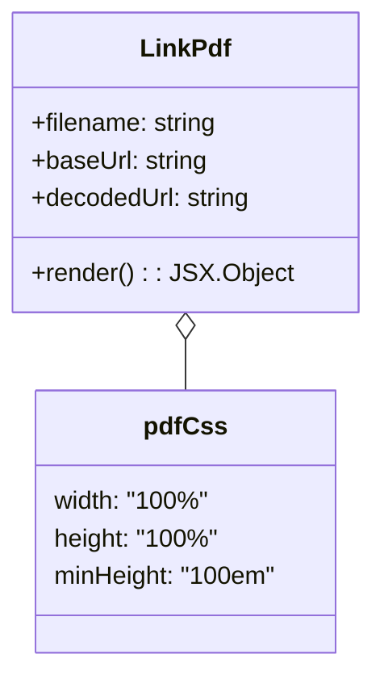

# Diagram: web/portal/src/modules/documentation/documentation-styled-components/LinkPdf.js


> Auto-generated by Obscura crawlers

## Diagram 1



### SVG

<svg id="container" width="227.4609375" xmlns="http://www.w3.org/2000/svg" class="classDiagram" height="426" viewBox="0 0 227.4609375 426" role="graphics-document document" aria-roledescription="class"><style>#container{font-family:"trebuchet ms",verdana,arial,sans-serif;font-size:16px;fill:#333;}@keyframes edge-animation-frame{from{stroke-dashoffset:0;}}@keyframes dash{to{stroke-dashoffset:0;}}#container .edge-animation-slow{stroke-dasharray:9,5!important;stroke-dashoffset:900;animation:dash 50s linear infinite;stroke-linecap:round;}#container .edge-animation-fast{stroke-dasharray:9,5!important;stroke-dashoffset:900;animation:dash 20s linear infinite;stroke-linecap:round;}#container .error-icon{fill:#552222;}#container .error-text{fill:#552222;stroke:#552222;}#container .edge-thickness-normal{stroke-width:1px;}#container .edge-thickness-thick{stroke-width:3.5px;}#container .edge-pattern-solid{stroke-dasharray:0;}#container .edge-thickness-invisible{stroke-width:0;fill:none;}#container .edge-pattern-dashed{stroke-dasharray:3;}#container .edge-pattern-dotted{stroke-dasharray:2;}#container .marker{fill:#333333;stroke:#333333;}#container .marker.cross{stroke:#333333;}#container svg{font-family:"trebuchet ms",verdana,arial,sans-serif;font-size:16px;}#container p{margin:0;}#container g.classGroup text{fill:#9370DB;stroke:none;font-family:"trebuchet ms",verdana,arial,sans-serif;font-size:10px;}#container g.classGroup text .title{font-weight:bolder;}#container .nodeLabel,#container .edgeLabel{color:#131300;}#container .edgeLabel .label rect{fill:#ECECFF;}#container .label text{fill:#131300;}#container .labelBkg{background:#ECECFF;}#container .edgeLabel .label span{background:#ECECFF;}#container .classTitle{font-weight:bolder;}#container .node rect,#container .node circle,#container .node ellipse,#container .node polygon,#container .node path{fill:#ECECFF;stroke:#9370DB;stroke-width:1px;}#container .divider{stroke:#9370DB;stroke-width:1;}#container g.clickable{cursor:pointer;}#container g.classGroup rect{fill:#ECECFF;stroke:#9370DB;}#container g.classGroup line{stroke:#9370DB;stroke-width:1;}#container .classLabel .box{stroke:none;stroke-width:0;fill:#ECECFF;opacity:0.5;}#container .classLabel .label{fill:#9370DB;font-size:10px;}#container .relation{stroke:#333333;stroke-width:1;fill:none;}#container .dashed-line{stroke-dasharray:3;}#container .dotted-line{stroke-dasharray:1 2;}#container #compositionStart,#container .composition{fill:#333333!important;stroke:#333333!important;stroke-width:1;}#container #compositionEnd,#container .composition{fill:#333333!important;stroke:#333333!important;stroke-width:1;}#container #dependencyStart,#container .dependency{fill:#333333!important;stroke:#333333!important;stroke-width:1;}#container #dependencyStart,#container .dependency{fill:#333333!important;stroke:#333333!important;stroke-width:1;}#container #extensionStart,#container .extension{fill:transparent!important;stroke:#333333!important;stroke-width:1;}#container #extensionEnd,#container .extension{fill:transparent!important;stroke:#333333!important;stroke-width:1;}#container #aggregationStart,#container .aggregation{fill:transparent!important;stroke:#333333!important;stroke-width:1;}#container #aggregationEnd,#container .aggregation{fill:transparent!important;stroke:#333333!important;stroke-width:1;}#container #lollipopStart,#container .lollipop{fill:#ECECFF!important;stroke:#333333!important;stroke-width:1;}#container #lollipopEnd,#container .lollipop{fill:#ECECFF!important;stroke:#333333!important;stroke-width:1;}#container .edgeTerminals{font-size:11px;line-height:initial;}#container .classTitleText{text-anchor:middle;font-size:18px;fill:#333;}#container .label-icon{display:inline-block;height:1em;overflow:visible;vertical-align:-0.125em;}#container .node .label-icon path{fill:currentColor;stroke:revert;stroke-width:revert;}#container :root{--mermaid-font-family:"trebuchet ms",verdana,arial,sans-serif;}</style><g><defs><marker id="container_class-aggregationStart" class="marker aggregation class" refX="18" refY="7" markerWidth="190" markerHeight="240" orient="auto"><path d="M 18,7 L9,13 L1,7 L9,1 Z"></path></marker></defs><defs><marker id="container_class-aggregationEnd" class="marker aggregation class" refX="1" refY="7" markerWidth="20" markerHeight="28" orient="auto"><path d="M 18,7 L9,13 L1,7 L9,1 Z"></path></marker></defs><defs><marker id="container_class-extensionStart" class="marker extension class" refX="18" refY="7" markerWidth="190" markerHeight="240" orient="auto"><path d="M 1,7 L18,13 V 1 Z"></path></marker></defs><defs><marker id="container_class-extensionEnd" class="marker extension class" refX="1" refY="7" markerWidth="20" markerHeight="28" orient="auto"><path d="M 1,1 V 13 L18,7 Z"></path></marker></defs><defs><marker id="container_class-compositionStart" class="marker composition class" refX="18" refY="7" markerWidth="190" markerHeight="240" orient="auto"><path d="M 18,7 L9,13 L1,7 L9,1 Z"></path></marker></defs><defs><marker id="container_class-compositionEnd" class="marker composition class" refX="1" refY="7" markerWidth="20" markerHeight="28" orient="auto"><path d="M 18,7 L9,13 L1,7 L9,1 Z"></path></marker></defs><defs><marker id="container_class-dependencyStart" class="marker dependency class" refX="6" refY="7" markerWidth="190" markerHeight="240" orient="auto"><path d="M 5,7 L9,13 L1,7 L9,1 Z"></path></marker></defs><defs><marker id="container_class-dependencyEnd" class="marker dependency class" refX="13" refY="7" markerWidth="20" markerHeight="28" orient="auto"><path d="M 18,7 L9,13 L14,7 L9,1 Z"></path></marker></defs><defs><marker id="container_class-lollipopStart" class="marker lollipop class" refX="13" refY="7" markerWidth="190" markerHeight="240" orient="auto"><circle stroke="black" fill="transparent" cx="7" cy="7" r="6"></circle></marker></defs><defs><marker id="container_class-lollipopEnd" class="marker lollipop class" refX="1" refY="7" markerWidth="190" markerHeight="240" orient="auto"><circle stroke="black" fill="transparent" cx="7" cy="7" r="6"></circle></marker></defs><g class="root"><g class="clusters"></g><g class="edgePaths"><path d="M113.73,217.25L113.73,218.542C113.73,219.833,113.73,222.417,113.73,227.875C113.73,233.333,113.73,241.667,113.73,245.833L113.73,250" id="id_LinkPdf_pdfCss_1" class="edge-thickness-normal edge-pattern-solid relation" style=";;;" data-edge="true" data-et="edge" data-id="id_LinkPdf_pdfCss_1" data-points="W3sieCI6MTEzLjczMDQ2ODc1LCJ5IjoyMDB9LHsieCI6MTEzLjczMDQ2ODc1LCJ5IjoyMjV9LHsieCI6MTEzLjczMDQ2ODc1LCJ5IjoyNTB9XQ==" marker-start="url(#container_class-aggregationStart)"></path></g><g class="edgeLabels"><g class="edgeLabel"><g class="label" data-id="id_LinkPdf_pdfCss_1" transform="translate(0, 0)"><foreignObject width="0" height="0"><div xmlns="http://www.w3.org/1999/xhtml" class="labelBkg" style="display: table-cell; white-space: nowrap; line-height: 1.5; max-width: 200px; text-align: center;"><span class="edgeLabel"></span></div></foreignObject></g></g></g><g class="nodes"><g class="node default" id="classId-LinkPdf-0" transform="translate(113.73046875, 104)"><g class="basic label-container"><path d="M-105.73046875 -96 L105.73046875 -96 L105.73046875 96 L-105.73046875 96" stroke="none" stroke-width="0" fill="#ECECFF" style=""></path><path d="M-105.73046875 -96 C-62.26615319541737 -96, -18.801837640834734 -96, 105.73046875 -96 M-105.73046875 -96 C-21.882439052272318 -96, 61.965590645455364 -96, 105.73046875 -96 M105.73046875 -96 C105.73046875 -47.418885568414176, 105.73046875 1.1622288631716486, 105.73046875 96 M105.73046875 -96 C105.73046875 -39.856894635056904, 105.73046875 16.286210729886193, 105.73046875 96 M105.73046875 96 C53.749215999987484 96, 1.7679632499749687 96, -105.73046875 96 M105.73046875 96 C32.78627228621227 96, -40.15792417757547 96, -105.73046875 96 M-105.73046875 96 C-105.73046875 27.112034696806745, -105.73046875 -41.77593060638651, -105.73046875 -96 M-105.73046875 96 C-105.73046875 25.61570949691665, -105.73046875 -44.7685810061667, -105.73046875 -96" stroke="#9370DB" stroke-width="1.3" fill="none" stroke-dasharray="0 0" style=""></path></g><g class="annotation-group text" transform="translate(0, -72)"></g><g class="label-group text" transform="translate(-27.6015625, -72)"><g class="label" style="font-weight: bolder" transform="translate(0,-12)"><foreignObject width="55.203125" height="24"><div xmlns="http://www.w3.org/1999/xhtml" style="display: table-cell; white-space: nowrap; line-height: 1.5; max-width: 105px; text-align: center;"><span class="nodeLabel markdown-node-label" style=""><p>LinkPdf</p></span></div></foreignObject></g></g><g class="members-group text" transform="translate(-93.73046875, -24)"><g class="label" style="" transform="translate(0,-12)"><foreignObject width="120.5" height="24"><div xmlns="http://www.w3.org/1999/xhtml" style="display: table-cell; white-space: nowrap; line-height: 1.5; max-width: 179px; text-align: center;"><span class="nodeLabel markdown-node-label" style=""><p>+filename: string</p></span></div></foreignObject></g><g class="label" style="" transform="translate(0,12)"><foreignObject width="113.40625" height="24"><div xmlns="http://www.w3.org/1999/xhtml" style="display: table-cell; white-space: nowrap; line-height: 1.5; max-width: 171px; text-align: center;"><span class="nodeLabel markdown-node-label" style=""><p>+baseUrl: string</p></span></div></foreignObject></g><g class="label" style="" transform="translate(0,36)"><foreignObject width="142.140625" height="24"><div xmlns="http://www.w3.org/1999/xhtml" style="display: table-cell; white-space: nowrap; line-height: 1.5; max-width: 200px; text-align: center;"><span class="nodeLabel markdown-node-label" style=""><p>+decodedUrl: string</p></span></div></foreignObject></g></g><g class="methods-group text" transform="translate(-93.73046875, 72)"><g class="label" style="" transform="translate(0,-12)"><foreignObject width="159.859375" height="24"><div xmlns="http://www.w3.org/1999/xhtml" style="display: table-cell; white-space: nowrap; line-height: 1.5; max-width: 217px; text-align: center;"><span class="nodeLabel markdown-node-label" style=""><p>+render() : : JSX.Object</p></span></div></foreignObject></g></g><g class="divider" style=""><path d="M-105.73046875 -48 C-56.63827816772942 -48, -7.546087585458835 -48, 105.73046875 -48 M-105.73046875 -48 C-57.37869540425637 -48, -9.026922058512739 -48, 105.73046875 -48" stroke="#9370DB" stroke-width="1.3" fill="none" stroke-dasharray="0 0" style=""></path></g><g class="divider" style=""><path d="M-105.73046875 48 C-50.9289757810265 48, 3.872517187946997 48, 105.73046875 48 M-105.73046875 48 C-30.963059963674382 48, 43.804348822651235 48, 105.73046875 48" stroke="#9370DB" stroke-width="1.3" fill="none" stroke-dasharray="0 0" style=""></path></g></g><g class="node default" id="classId-pdfCss-1" transform="translate(113.73046875, 334)"><g class="basic label-container"><path d="M-95.89453125 -84 L95.89453125 -84 L95.89453125 84 L-95.89453125 84" stroke="none" stroke-width="0" fill="#ECECFF" style=""></path><path d="M-95.89453125 -84 C-44.20711394156134 -84, 7.4803033668773224 -84, 95.89453125 -84 M-95.89453125 -84 C-47.305828716601496 -84, 1.2828738167970073 -84, 95.89453125 -84 M95.89453125 -84 C95.89453125 -21.201412006481576, 95.89453125 41.59717598703685, 95.89453125 84 M95.89453125 -84 C95.89453125 -26.363542754443117, 95.89453125 31.272914491113767, 95.89453125 84 M95.89453125 84 C48.51487073041098 84, 1.1352102108219668 84, -95.89453125 84 M95.89453125 84 C45.30174095657725 84, -5.291049336845504 84, -95.89453125 84 M-95.89453125 84 C-95.89453125 42.98921023852806, -95.89453125 1.978420477056119, -95.89453125 -84 M-95.89453125 84 C-95.89453125 30.61282010405602, -95.89453125 -22.77435979188796, -95.89453125 -84" stroke="#9370DB" stroke-width="1.3" fill="none" stroke-dasharray="0 0" style=""></path></g><g class="annotation-group text" transform="translate(0, -60)"></g><g class="label-group text" transform="translate(-24.6328125, -60)"><g class="label" style="font-weight: bolder" transform="translate(0,-12)"><foreignObject width="49.265625" height="24"><div xmlns="http://www.w3.org/1999/xhtml" style="display: table-cell; white-space: nowrap; line-height: 1.5; max-width: 98px; text-align: center;"><span class="nodeLabel markdown-node-label" style=""><p>pdfCss</p></span></div></foreignObject></g></g><g class="members-group text" transform="translate(-83.89453125, -12)"><g class="label" style="" transform="translate(0,-12)"><foreignObject width="98.59375" height="24"><div xmlns="http://www.w3.org/1999/xhtml" style="display: table-cell; white-space: nowrap; line-height: 1.5; max-width: 149px; text-align: center;"><span class="nodeLabel markdown-node-label" style=""><p>width: "100%"</p></span></div></foreignObject></g><g class="label" style="" transform="translate(0,12)"><foreignObject width="104.046875" height="24"><div xmlns="http://www.w3.org/1999/xhtml" style="display: table-cell; white-space: nowrap; line-height: 1.5; max-width: 154px; text-align: center;"><span class="nodeLabel markdown-node-label" style=""><p>height: "100%"</p></span></div></foreignObject></g><g class="label" style="" transform="translate(0,36)"><foreignObject width="143.15625" height="24"><div xmlns="http://www.w3.org/1999/xhtml" style="display: table-cell; white-space: nowrap; line-height: 1.5; max-width: 193px; text-align: center;"><span class="nodeLabel markdown-node-label" style=""><p>minHeight: "100em"</p></span></div></foreignObject></g></g><g class="methods-group text" transform="translate(-83.89453125, 84)"></g><g class="divider" style=""><path d="M-95.89453125 -36 C-38.591041632623146 -36, 18.71244798475371 -36, 95.89453125 -36 M-95.89453125 -36 C-29.97558288732162 -36, 35.94336547535676 -36, 95.89453125 -36" stroke="#9370DB" stroke-width="1.3" fill="none" stroke-dasharray="0 0" style=""></path></g><g class="divider" style=""><path d="M-95.89453125 60 C-38.25390792864668 60, 19.386715392706634 60, 95.89453125 60 M-95.89453125 60 C-56.411422521975446 60, -16.928313793950892 60, 95.89453125 60" stroke="#9370DB" stroke-width="1.3" fill="none" stroke-dasharray="0 0" style=""></path></g></g></g></g></g></svg>

## Diagram 2

```mermaid
flowchart TD
  A[Props: filename, baseUrl] --> B[decodeURIComponent(baseUrl) -> decodedUrl]
  B --> C{decodedUrl endsWith "/"?}
  C -- No --> D[append "/" -> decodedUrl]
  C -- Yes --> E[keep decodedUrl]
  D --> F[Construct data URL: decodedUrl + filename]
  E --> F
  F --> G[Return <object data="..." type="application/pdf" css=pdfCss>]
  G --> H[Children fallback content: filename]
```

> SVG rendering failed for this diagram.
