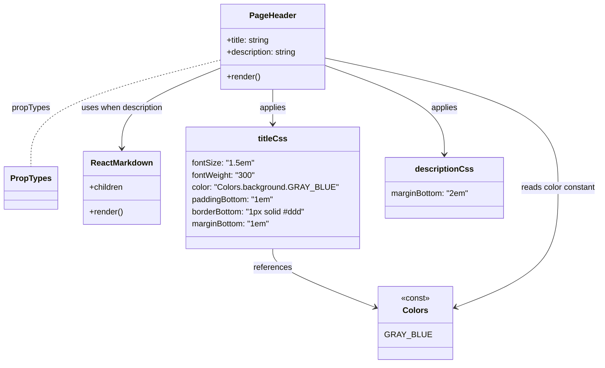

# Diagram: web/portal/src/modules/documentation/documentation-styled-components/PageHeader.js

> Auto-generated by Obscura crawlers

## Mermaid

### SVG

<svg id="container" width="1160.4765625" xmlns="http://www.w3.org/2000/svg" class="classDiagram" height="716" viewBox="0 0 1160.4765625 716" role="graphics-document document" aria-roledescription="class"><g><defs><marker id="container_class-aggregationStart" class="marker aggregation class" refX="18" refY="7" markerWidth="190" markerHeight="240" orient="auto"><path d="M 18,7 L9,13 L1,7 L9,1 Z"></path></marker></defs><defs><marker id="container_class-aggregationEnd" class="marker aggregation class" refX="1" refY="7" markerWidth="20" markerHeight="28" orient="auto"><path d="M 18,7 L9,13 L1,7 L9,1 Z"></path></marker></defs><defs><marker id="container_class-extensionStart" class="marker extension class" refX="18" refY="7" markerWidth="190" markerHeight="240" orient="auto"><path d="M 1,7 L18,13 V 1 Z"></path></marker></defs><defs><marker id="container_class-extensionEnd" class="marker extension class" refX="1" refY="7" markerWidth="20" markerHeight="28" orient="auto"><path d="M 1,1 V 13 L18,7 Z"></path></marker></defs><defs><marker id="container_class-compositionStart" class="marker composition class" refX="18" refY="7" markerWidth="190" markerHeight="240" orient="auto"><path d="M 18,7 L9,13 L1,7 L9,1 Z"></path></marker></defs><defs><marker id="container_class-compositionEnd" class="marker composition class" refX="1" refY="7" markerWidth="20" markerHeight="28" orient="auto"><path d="M 18,7 L9,13 L1,7 L9,1 Z"></path></marker></defs><defs><marker id="container_class-dependencyStart" class="marker dependency class" refX="6" refY="7" markerWidth="190" markerHeight="240" orient="auto"><path d="M 5,7 L9,13 L1,7 L9,1 Z"></path></marker></defs><defs><marker id="container_class-dependencyEnd" class="marker dependency class" refX="13" refY="7" markerWidth="20" markerHeight="28" orient="auto"><path d="M 18,7 L9,13 L14,7 L9,1 Z"></path></marker></defs><defs><marker id="container_class-lollipopStart" class="marker lollipop class" refX="13" refY="7" markerWidth="190" markerHeight="240" orient="auto"><circle stroke="black" fill="transparent" cx="7" cy="7" r="6"></circle></marker></defs><defs><marker id="container_class-lollipopEnd" class="marker lollipop class" refX="1" refY="7" markerWidth="190" markerHeight="240" orient="auto"><circle stroke="black" fill="transparent" cx="7" cy="7" r="6"></circle></marker></defs><g class="root"><g class="clusters"></g><g class="edgePaths"><path d="M418.523,135.576L387.708,148.48C356.893,161.384,295.263,187.192,264.448,213.263C233.633,239.333,233.633,265.667,233.633,278.833L233.633,292" id="id_PageHeader_ReactMarkdown_1" class="edge-thickness-normal edge-pattern-solid relation" style=";;;" data-edge="true" data-et="edge" data-id="id_PageHeader_ReactMarkdown_1" data-points="W3sieCI6NDE4LjUyMzQzNzUsInkiOjEzNS41NzY0ODg0MDEwMTY2fSx7IngiOjIzMy42MzI4MTI1LCJ5IjoyMTN9LHsieCI6MjMzLjYzMjgxMjUsInkiOjI5OH1d" marker-end="url(#container_class-dependencyEnd)"></path><path d="M418.523,119.118L358.479,134.765C298.435,150.412,178.346,181.706,118.302,216.52C58.258,251.333,58.258,289.667,58.258,308.833L58.258,328" id="id_PageHeader_PropTypes_2" class="edge-thickness-normal edge-pattern-dashed relation" style=";;;" data-edge="true" data-et="edge" data-id="id_PageHeader_PropTypes_2" data-points="W3sieCI6NDE4LjUyMzQzNzUsInkiOjExOS4xMTc4MTEzNTM3NzA1OH0seyJ4Ijo1OC4yNTc4MTI1LCJ5IjoyMTN9LHsieCI6NTguMjU3ODEyNSwieSI6MzI4fV0="></path><path d="M522.586,176L522.586,182.167C522.586,188.333,522.586,200.667,522.586,212C522.586,223.333,522.586,233.667,522.586,238.833L522.586,244" id="id_PageHeader_titleCss_3" class="edge-thickness-normal edge-pattern-solid relation" style=";;;" data-edge="true" data-et="edge" data-id="id_PageHeader_titleCss_3" data-points="W3sieCI6NTIyLjU4NTkzNzUsInkiOjE3Nn0seyJ4Ijo1MjIuNTg1OTM3NSwieSI6MjEzfSx7IngiOjUyMi41ODU5Mzc1LCJ5IjoyNTB9XQ==" marker-end="url(#container_class-dependencyEnd)"></path><path d="M626.648,130.133L664.338,143.944C702.027,157.755,777.406,185.378,815.096,214.356C852.785,243.333,852.785,273.667,852.785,288.833L852.785,304" id="id_PageHeader_descriptionCss_4" class="edge-thickness-normal edge-pattern-solid relation" style=";;;" data-edge="true" data-et="edge" data-id="id_PageHeader_descriptionCss_4" data-points="W3sieCI6NjI2LjY0ODQzNzUsInkiOjEzMC4xMzMyMjkyMjk1MTM0M30seyJ4Ijo4NTIuNzg1MTU2MjUsInkiOjIxM30seyJ4Ijo4NTIuNzg1MTU2MjUsInkiOjMxMH1d" marker-end="url(#container_class-dependencyEnd)"></path><path d="M522.586,490L522.586,496.167C522.586,502.333,522.586,514.667,556.876,534.285C591.167,553.903,659.748,580.806,694.038,594.257L728.328,607.709" id="id_titleCss_Colors_5" class="edge-thickness-normal edge-pattern-solid relation" style=";;;" data-edge="true" data-et="edge" data-id="id_titleCss_Colors_5" data-points="W3sieCI6NTIyLjU4NTkzNzUsInkiOjQ5MH0seyJ4Ijo1MjIuNTg1OTM3NSwieSI6NTI3fSx7IngiOjczMy45MTQwNjI1LCJ5Ijo2MDkuODk5NjM4NzA0OTYxMX1d" marker-end="url(#container_class-dependencyEnd)"></path><path d="M626.648,114.658L701.926,131.048C777.203,147.439,927.758,180.219,1003.035,222.776C1078.313,265.333,1078.313,317.667,1078.313,370C1078.313,422.333,1078.313,474.667,1044.022,514.285C1009.732,553.903,941.151,580.806,906.86,594.257L872.57,607.709" id="id_PageHeader_Colors_6" class="edge-thickness-normal edge-pattern-solid relation" style=";;;" data-edge="true" data-et="edge" data-id="id_PageHeader_Colors_6" data-points="W3sieCI6NjI2LjY0ODQzNzUsInkiOjExNC42NTc4MzgxMzQxOTkzMn0seyJ4IjoxMDc4LjMxMjUsInkiOjIxM30seyJ4IjoxMDc4LjMxMjUsInkiOjM3MH0seyJ4IjoxMDc4LjMxMjUsInkiOjUyN30seyJ4Ijo4NjYuOTg0Mzc1LCJ5Ijo2MDkuODk5NjM4NzA0OTYxMX1d" marker-end="url(#container_class-dependencyEnd)"></path></g><g class="edgeLabels"><g class="edgeLabel" transform="translate(233.6328125, 213)"><g class="label" data-id="id_PageHeader_ReactMarkdown_1" transform="translate(-81.5078125, -12)"><foreignObject width="163.015625" height="24">

uses when description

</foreignObject></g></g><g class="edgeLabel" transform="translate(58.2578125, 213)"><g class="label" data-id="id_PageHeader_PropTypes_2" transform="translate(-37.625, -12)"><foreignObject width="75.25" height="24">

propTypes

</foreignObject></g></g><g class="edgeLabel" transform="translate(522.5859375, 213)"><g class="label" data-id="id_PageHeader_titleCss_3" transform="translate(-26.5546875, -12)"><foreignObject width="53.109375" height="24">

applies

</foreignObject></g></g><g class="edgeLabel" transform="translate(852.78515625, 213)"><g class="label" data-id="id_PageHeader_descriptionCss_4" transform="translate(-26.5546875, -12)"><foreignObject width="53.109375" height="24">

applies

</foreignObject></g></g><g class="edgeLabel" transform="translate(522.5859375, 527)"><g class="label" data-id="id_titleCss_Colors_5" transform="translate(-37.828125, -12)"><foreignObject width="75.65625" height="24">

references

</foreignObject></g></g><g class="edgeLabel" transform="translate(1078.3125, 370)"><g class="label" data-id="id_PageHeader_Colors_6" transform="translate(-74.1640625, -12)"><foreignObject width="148.328125" height="24">

reads color constant

</foreignObject></g></g></g><g class="nodes"><g class="node default" id="classId-PageHeader-0" transform="translate(522.5859375, 92)"><g class="basic label-container"><path d="M-104.0625 -84 L104.0625 -84 L104.0625 84 L-104.0625 84" stroke="none" stroke-width="0" fill="#ECECFF" style=""></path><path d="M-104.0625 -84 C-35.761687355470144 -84, 32.53912528905971 -84, 104.0625 -84 M-104.0625 -84 C-48.73266605083115 -84, 6.597167898337702 -84, 104.0625 -84 M104.0625 -84 C104.0625 -18.315397708420946, 104.0625 47.36920458315811, 104.0625 84 M104.0625 -84 C104.0625 -26.432946116657604, 104.0625 31.134107766684792, 104.0625 84 M104.0625 84 C22.95679685355057 84, -58.14890629289886 84, -104.0625 84 M104.0625 84 C45.561525759965626 84, -12.939448480068748 84, -104.0625 84 M-104.0625 84 C-104.0625 30.122550861428294, -104.0625 -23.75489827714341, -104.0625 -84 M-104.0625 84 C-104.0625 22.726967626061978, -104.0625 -38.546064747876045, -104.0625 -84" stroke="#9370DB" stroke-width="1.3" fill="none" stroke-dasharray="0 0" style=""></path></g><g class="annotation-group text" transform="translate(0, -60)"></g><g class="label-group text" transform="translate(-43.8125, -60)"><g class="label" style="font-weight: bolder" transform="translate(0,-12)"><foreignObject width="87.625" height="24">

PageHeader

</foreignObject></g></g><g class="members-group text" transform="translate(-92.0625, -12)"><g class="label" style="" transform="translate(0,-12)"><foreignObject width="86.859375" height="24">

+title: string

</foreignObject></g><g class="label" style="" transform="translate(0,12)"><foreignObject width="140.3125" height="24">

+description: string

</foreignObject></g></g><g class="methods-group text" transform="translate(-92.0625, 60)"><g class="label" style="" transform="translate(0,-12)"><foreignObject width="66.609375" height="24">

+render()

</foreignObject></g></g><g class="divider" style=""><path d="M-104.0625 -36 C-22.92785416500402 -36, 58.20679166999196 -36, 104.0625 -36 M-104.0625 -36 C-23.09290823465406 -36, 57.87668353069188 -36, 104.0625 -36" stroke="#9370DB" stroke-width="1.3" fill="none" stroke-dasharray="0 0" style=""></path></g><g class="divider" style=""><path d="M-104.0625 36 C-59.820522066516105 36, -15.57854413303221 36, 104.0625 36 M-104.0625 36 C-30.10591656440559 36, 43.85066687118882 36, 104.0625 36" stroke="#9370DB" stroke-width="1.3" fill="none" stroke-dasharray="0 0" style=""></path></g></g><g class="node default" id="classId-PropTypes-1" transform="translate(58.2578125, 370)"><g class="basic label-container"><path d="M-50.2578125 -42 L50.2578125 -42 L50.2578125 42 L-50.2578125 42" stroke="none" stroke-width="0" fill="#ECECFF" style=""></path><path d="M-50.2578125 -42 C-10.070845516330827 -42, 30.116121467338345 -42, 50.2578125 -42 M-50.2578125 -42 C-30.11180619564729 -42, -9.96579989129458 -42, 50.2578125 -42 M50.2578125 -42 C50.2578125 -14.945683387363296, 50.2578125 12.108633225273408, 50.2578125 42 M50.2578125 -42 C50.2578125 -12.97099752756736, 50.2578125 16.05800494486528, 50.2578125 42 M50.2578125 42 C11.364811914301661 42, -27.528188671396677 42, -50.2578125 42 M50.2578125 42 C10.821525398875984 42, -28.614761702248032 42, -50.2578125 42 M-50.2578125 42 C-50.2578125 10.704919864397386, -50.2578125 -20.590160271205228, -50.2578125 -42 M-50.2578125 42 C-50.2578125 13.949543238316828, -50.2578125 -14.100913523366344, -50.2578125 -42" stroke="#9370DB" stroke-width="1.3" fill="none" stroke-dasharray="0 0" style=""></path></g><g class="annotation-group text" transform="translate(0, -18)"></g><g class="label-group text" transform="translate(-38.2578125, -18)"><g class="label" style="font-weight: bolder" transform="translate(0,-12)"><foreignObject width="76.515625" height="24">

PropTypes

</foreignObject></g></g><g class="members-group text" transform="translate(-38.2578125, 30)"></g><g class="methods-group text" transform="translate(-38.2578125, 60)"></g><g class="divider" style=""><path d="M-50.2578125 6 C-20.72656254303803 6, 8.804687413923943 6, 50.2578125 6 M-50.2578125 6 C-27.526600256134355 6, -4.79538801226871 6, 50.2578125 6" stroke="#9370DB" stroke-width="1.3" fill="none" stroke-dasharray="0 0" style=""></path></g><g class="divider" style=""><path d="M-50.2578125 24 C-11.074545144309496 24, 28.108722211381007 24, 50.2578125 24 M-50.2578125 24 C-22.861361848378525 24, 4.5350888032429495 24, 50.2578125 24" stroke="#9370DB" stroke-width="1.3" fill="none" stroke-dasharray="0 0" style=""></path></g></g><g class="node default" id="classId-ReactMarkdown-2" transform="translate(233.6328125, 370)"><g class="basic label-container"><path d="M-75.1171875 -72 L75.1171875 -72 L75.1171875 72 L-75.1171875 72" stroke="none" stroke-width="0" fill="#ECECFF" style=""></path><path d="M-75.1171875 -72 C-42.99710454854424 -72, -10.877021597088486 -72, 75.1171875 -72 M-75.1171875 -72 C-32.36691527936895 -72, 10.383356941262093 -72, 75.1171875 -72 M75.1171875 -72 C75.1171875 -31.482814096729633, 75.1171875 9.034371806540733, 75.1171875 72 M75.1171875 -72 C75.1171875 -41.99400671889087, 75.1171875 -11.988013437781746, 75.1171875 72 M75.1171875 72 C21.113285490654278 72, -32.890616518691445 72, -75.1171875 72 M75.1171875 72 C16.670531925026452 72, -41.776123649947095 72, -75.1171875 72 M-75.1171875 72 C-75.1171875 42.05260016753175, -75.1171875 12.1052003350635, -75.1171875 -72 M-75.1171875 72 C-75.1171875 24.706694692746268, -75.1171875 -22.586610614507464, -75.1171875 -72" stroke="#9370DB" stroke-width="1.3" fill="none" stroke-dasharray="0 0" style=""></path></g><g class="annotation-group text" transform="translate(0, -48)"></g><g class="label-group text" transform="translate(-58.734375, -48)"><g class="label" style="font-weight: bolder" transform="translate(0,-12)"><foreignObject width="117.46875" height="24">

ReactMarkdown

</foreignObject></g></g><g class="members-group text" transform="translate(-63.1171875, 0)"><g class="label" style="" transform="translate(0,-12)"><foreignObject width="67.5" height="24">

+children

</foreignObject></g></g><g class="methods-group text" transform="translate(-63.1171875, 48)"><g class="label" style="" transform="translate(0,-12)"><foreignObject width="66.609375" height="24">

+render()

</foreignObject></g></g><g class="divider" style=""><path d="M-75.1171875 -24 C-30.784026192609154 -24, 13.549135114781691 -24, 75.1171875 -24 M-75.1171875 -24 C-16.00322318678989 -24, 43.11074112642022 -24, 75.1171875 -24" stroke="#9370DB" stroke-width="1.3" fill="none" stroke-dasharray="0 0" style=""></path></g><g class="divider" style=""><path d="M-75.1171875 24 C-25.07325834569528 24, 24.97067080860944 24, 75.1171875 24 M-75.1171875 24 C-23.666164878122927 24, 27.784857743754145 24, 75.1171875 24" stroke="#9370DB" stroke-width="1.3" fill="none" stroke-dasharray="0 0" style=""></path></g></g><g class="node default" id="classId-Colors-3" transform="translate(800.44921875, 636)"><g class="basic label-container"><path d="M-66.53515625 -72 L66.53515625 -72 L66.53515625 72 L-66.53515625 72" stroke="none" stroke-width="0" fill="#ECECFF" style=""></path><path d="M-66.53515625 -72 C-37.36958610488274 -72, -8.204015959765478 -72, 66.53515625 -72 M-66.53515625 -72 C-28.00098236668792 -72, 10.533191516624157 -72, 66.53515625 -72 M66.53515625 -72 C66.53515625 -25.957526144120017, 66.53515625 20.084947711759966, 66.53515625 72 M66.53515625 -72 C66.53515625 -26.097608611616707, 66.53515625 19.804782776766586, 66.53515625 72 M66.53515625 72 C38.238351710310226 72, 9.941547170620453 72, -66.53515625 72 M66.53515625 72 C36.3285288508724 72, 6.121901451744797 72, -66.53515625 72 M-66.53515625 72 C-66.53515625 22.453195634225594, -66.53515625 -27.093608731548812, -66.53515625 -72 M-66.53515625 72 C-66.53515625 24.340967594333712, -66.53515625 -23.318064811332576, -66.53515625 -72" stroke="#9370DB" stroke-width="1.3" fill="none" stroke-dasharray="0 0" style=""></path></g><g class="annotation-group text" transform="translate(-28.6171875, -48)"><g class="label" style="" transform="translate(0,-12)"><foreignObject width="57.234375" height="24">

«const»

</foreignObject></g></g><g class="label-group text" transform="translate(-23.1015625, -24)"><g class="label" style="font-weight: bolder" transform="translate(0,-12)"><foreignObject width="46.203125" height="24">

Colors

</foreignObject></g></g><g class="members-group text" transform="translate(-54.53515625, 24)"><g class="label" style="" transform="translate(0,-12)"><foreignObject width="80.453125" height="24">

GRAY_BLUE

</foreignObject></g></g><g class="methods-group text" transform="translate(-54.53515625, 72)"></g><g class="divider" style=""><path d="M-66.53515625 0 C-37.522320731381626 0, -8.509485212763245 0, 66.53515625 0 M-66.53515625 0 C-39.283439610537776 0, -12.031722971075553 0, 66.53515625 0" stroke="#9370DB" stroke-width="1.3" fill="none" stroke-dasharray="0 0" style=""></path></g><g class="divider" style=""><path d="M-66.53515625 48 C-27.637331463721402 48, 11.260493322557195 48, 66.53515625 48 M-66.53515625 48 C-33.740267040587696 48, -0.9453778311753922 48, 66.53515625 48" stroke="#9370DB" stroke-width="1.3" fill="none" stroke-dasharray="0 0" style=""></path></g></g><g class="node default" id="classId-titleCss-4" transform="translate(522.5859375, 370)"><g class="basic label-container"><path d="M-163.8359375 -120 L163.8359375 -120 L163.8359375 120 L-163.8359375 120" stroke="none" stroke-width="0" fill="#ECECFF" style=""></path><path d="M-163.8359375 -120 C-62.16696624272144 -120, 39.50200501455711 -120, 163.8359375 -120 M-163.8359375 -120 C-54.36312619622257 -120, 55.10968510755487 -120, 163.8359375 -120 M163.8359375 -120 C163.8359375 -24.5953792556613, 163.8359375 70.8092414886774, 163.8359375 120 M163.8359375 -120 C163.8359375 -39.96679734711205, 163.8359375 40.0664053057759, 163.8359375 120 M163.8359375 120 C63.02793652703605 120, -37.780064445927906 120, -163.8359375 120 M163.8359375 120 C45.745599288919294 120, -72.34473892216141 120, -163.8359375 120 M-163.8359375 120 C-163.8359375 50.06786125669582, -163.8359375 -19.86427748660836, -163.8359375 -120 M-163.8359375 120 C-163.8359375 47.14048355735626, -163.8359375 -25.719032885287476, -163.8359375 -120" stroke="#9370DB" stroke-width="1.3" fill="none" stroke-dasharray="0 0" style=""></path></g><g class="annotation-group text" transform="translate(0, -96)"></g><g class="label-group text" transform="translate(-27.3125, -96)"><g class="label" style="font-weight: bolder" transform="translate(0,-12)"><foreignObject width="54.625" height="24">

titleCss

</foreignObject></g></g><g class="members-group text" transform="translate(-151.8359375, -48)"><g class="label" style="" transform="translate(0,-12)"><foreignObject width="120.59375" height="24">

fontSize: "1.5em"

</foreignObject></g><g class="label" style="" transform="translate(0,12)"><foreignObject width="126.0625" height="24">

fontWeight: "300"

</foreignObject></g><g class="label" style="" transform="translate(0,36)"><foreignObject width="276.359375" height="24">

color: "Colors.background.GRAY_BLUE"

</foreignObject></g><g class="label" style="" transform="translate(0,60)"><foreignObject width="162.890625" height="24">

paddingBottom: "1em"

</foreignObject></g><g class="label" style="" transform="translate(0,84)"><foreignObject width="228.171875" height="24">

borderBottom: "1px solid #ddd"

</foreignObject></g><g class="label" style="" transform="translate(0,108)"><foreignObject width="154.0625" height="24">

marginBottom: "1em"

</foreignObject></g></g><g class="methods-group text" transform="translate(-151.8359375, 120)"></g><g class="divider" style=""><path d="M-163.8359375 -72 C-65.1593465650058 -72, 33.51724436998839 -72, 163.8359375 -72 M-163.8359375 -72 C-90.92432730154994 -72, -18.012717103099874 -72, 163.8359375 -72" stroke="#9370DB" stroke-width="1.3" fill="none" stroke-dasharray="0 0" style=""></path></g><g class="divider" style=""><path d="M-163.8359375 96 C-62.92617939169101 96, 37.983578716617984 96, 163.8359375 96 M-163.8359375 96 C-70.85687282755617 96, 22.122191844887652 96, 163.8359375 96" stroke="#9370DB" stroke-width="1.3" fill="none" stroke-dasharray="0 0" style=""></path></g></g><g class="node default" id="classId-descriptionCss-5" transform="translate(852.78515625, 370)"><g class="basic label-container"><path d="M-116.36328125 -60 L116.36328125 -60 L116.36328125 60 L-116.36328125 60" stroke="none" stroke-width="0" fill="#ECECFF" style=""></path><path d="M-116.36328125 -60 C-27.387429336158633 -60, 61.588422577682735 -60, 116.36328125 -60 M-116.36328125 -60 C-34.117353070125986 -60, 48.12857510974803 -60, 116.36328125 -60 M116.36328125 -60 C116.36328125 -24.740142883465936, 116.36328125 10.519714233068129, 116.36328125 60 M116.36328125 -60 C116.36328125 -15.246259400081144, 116.36328125 29.507481199837713, 116.36328125 60 M116.36328125 60 C29.99958460274881 60, -56.36411204450238 60, -116.36328125 60 M116.36328125 60 C66.63151270416134 60, 16.899744158322676 60, -116.36328125 60 M-116.36328125 60 C-116.36328125 21.27632318572774, -116.36328125 -17.44735362854452, -116.36328125 -60 M-116.36328125 60 C-116.36328125 24.50905953053325, -116.36328125 -10.9818809389335, -116.36328125 -60" stroke="#9370DB" stroke-width="1.3" fill="none" stroke-dasharray="0 0" style=""></path></g><g class="annotation-group text" transform="translate(0, -36)"></g><g class="label-group text" transform="translate(-53.9921875, -36)"><g class="label" style="font-weight: bolder" transform="translate(0,-12)"><foreignObject width="107.984375" height="24">

descriptionCss

</foreignObject></g></g><g class="members-group text" transform="translate(-104.36328125, 12)"><g class="label" style="" transform="translate(0,-12)"><foreignObject width="154.734375" height="24">

marginBottom: "2em"

</foreignObject></g></g><g class="methods-group text" transform="translate(-104.36328125, 60)"></g><g class="divider" style=""><path d="M-116.36328125 -12 C-29.449078666555522 -12, 57.465123916888956 -12, 116.36328125 -12 M-116.36328125 -12 C-24.015965295389407 -12, 68.33135065922119 -12, 116.36328125 -12" stroke="#9370DB" stroke-width="1.3" fill="none" stroke-dasharray="0 0" style=""></path></g><g class="divider" style=""><path d="M-116.36328125 36 C-63.339472095046226 36, -10.315662940092452 36, 116.36328125 36 M-116.36328125 36 C-67.11998435992993 36, -17.876687469859874 36, 116.36328125 36" stroke="#9370DB" stroke-width="1.3" fill="none" stroke-dasharray="0 0" style=""></path></g></g></g></g></g></svg>
