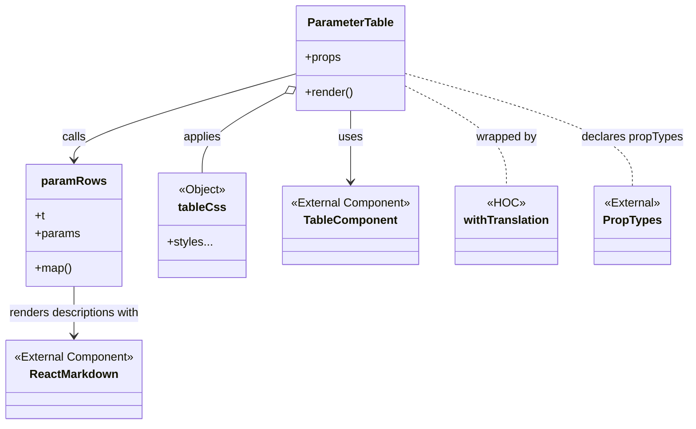

# Diagram: web/portal/src/modules/documentation/documentation-styled-components/ParameterTable.js


> Auto-generated by Obscura crawlers

## Diagram 1



### SVG

<svg id="container" width="942.0859375" xmlns="http://www.w3.org/2000/svg" class="classDiagram" height="584" viewBox="0 0 942.0859375 584" role="graphics-document document" aria-roledescription="class"><style>#container{font-family:"trebuchet ms",verdana,arial,sans-serif;font-size:16px;fill:#333;}@keyframes edge-animation-frame{from{stroke-dashoffset:0;}}@keyframes dash{to{stroke-dashoffset:0;}}#container .edge-animation-slow{stroke-dasharray:9,5!important;stroke-dashoffset:900;animation:dash 50s linear infinite;stroke-linecap:round;}#container .edge-animation-fast{stroke-dasharray:9,5!important;stroke-dashoffset:900;animation:dash 20s linear infinite;stroke-linecap:round;}#container .error-icon{fill:#552222;}#container .error-text{fill:#552222;stroke:#552222;}#container .edge-thickness-normal{stroke-width:1px;}#container .edge-thickness-thick{stroke-width:3.5px;}#container .edge-pattern-solid{stroke-dasharray:0;}#container .edge-thickness-invisible{stroke-width:0;fill:none;}#container .edge-pattern-dashed{stroke-dasharray:3;}#container .edge-pattern-dotted{stroke-dasharray:2;}#container .marker{fill:#333333;stroke:#333333;}#container .marker.cross{stroke:#333333;}#container svg{font-family:"trebuchet ms",verdana,arial,sans-serif;font-size:16px;}#container p{margin:0;}#container g.classGroup text{fill:#9370DB;stroke:none;font-family:"trebuchet ms",verdana,arial,sans-serif;font-size:10px;}#container g.classGroup text .title{font-weight:bolder;}#container .nodeLabel,#container .edgeLabel{color:#131300;}#container .edgeLabel .label rect{fill:#ECECFF;}#container .label text{fill:#131300;}#container .labelBkg{background:#ECECFF;}#container .edgeLabel .label span{background:#ECECFF;}#container .classTitle{font-weight:bolder;}#container .node rect,#container .node circle,#container .node ellipse,#container .node polygon,#container .node path{fill:#ECECFF;stroke:#9370DB;stroke-width:1px;}#container .divider{stroke:#9370DB;stroke-width:1;}#container g.clickable{cursor:pointer;}#container g.classGroup rect{fill:#ECECFF;stroke:#9370DB;}#container g.classGroup line{stroke:#9370DB;stroke-width:1;}#container .classLabel .box{stroke:none;stroke-width:0;fill:#ECECFF;opacity:0.5;}#container .classLabel .label{fill:#9370DB;font-size:10px;}#container .relation{stroke:#333333;stroke-width:1;fill:none;}#container .dashed-line{stroke-dasharray:3;}#container .dotted-line{stroke-dasharray:1 2;}#container #compositionStart,#container .composition{fill:#333333!important;stroke:#333333!important;stroke-width:1;}#container #compositionEnd,#container .composition{fill:#333333!important;stroke:#333333!important;stroke-width:1;}#container #dependencyStart,#container .dependency{fill:#333333!important;stroke:#333333!important;stroke-width:1;}#container #dependencyStart,#container .dependency{fill:#333333!important;stroke:#333333!important;stroke-width:1;}#container #extensionStart,#container .extension{fill:transparent!important;stroke:#333333!important;stroke-width:1;}#container #extensionEnd,#container .extension{fill:transparent!important;stroke:#333333!important;stroke-width:1;}#container #aggregationStart,#container .aggregation{fill:transparent!important;stroke:#333333!important;stroke-width:1;}#container #aggregationEnd,#container .aggregation{fill:transparent!important;stroke:#333333!important;stroke-width:1;}#container #lollipopStart,#container .lollipop{fill:#ECECFF!important;stroke:#333333!important;stroke-width:1;}#container #lollipopEnd,#container .lollipop{fill:#ECECFF!important;stroke:#333333!important;stroke-width:1;}#container .edgeTerminals{font-size:11px;line-height:initial;}#container .classTitleText{text-anchor:middle;font-size:18px;fill:#333;}#container .label-icon{display:inline-block;height:1em;overflow:visible;vertical-align:-0.125em;}#container .node .label-icon path{fill:currentColor;stroke:revert;stroke-width:revert;}#container :root{--mermaid-font-family:"trebuchet ms",verdana,arial,sans-serif;}</style><g><defs><marker id="container_class-aggregationStart" class="marker aggregation class" refX="18" refY="7" markerWidth="190" markerHeight="240" orient="auto"><path d="M 18,7 L9,13 L1,7 L9,1 Z"></path></marker></defs><defs><marker id="container_class-aggregationEnd" class="marker aggregation class" refX="1" refY="7" markerWidth="20" markerHeight="28" orient="auto"><path d="M 18,7 L9,13 L1,7 L9,1 Z"></path></marker></defs><defs><marker id="container_class-extensionStart" class="marker extension class" refX="18" refY="7" markerWidth="190" markerHeight="240" orient="auto"><path d="M 1,7 L18,13 V 1 Z"></path></marker></defs><defs><marker id="container_class-extensionEnd" class="marker extension class" refX="1" refY="7" markerWidth="20" markerHeight="28" orient="auto"><path d="M 1,1 V 13 L18,7 Z"></path></marker></defs><defs><marker id="container_class-compositionStart" class="marker composition class" refX="18" refY="7" markerWidth="190" markerHeight="240" orient="auto"><path d="M 18,7 L9,13 L1,7 L9,1 Z"></path></marker></defs><defs><marker id="container_class-compositionEnd" class="marker composition class" refX="1" refY="7" markerWidth="20" markerHeight="28" orient="auto"><path d="M 18,7 L9,13 L1,7 L9,1 Z"></path></marker></defs><defs><marker id="container_class-dependencyStart" class="marker dependency class" refX="6" refY="7" markerWidth="190" markerHeight="240" orient="auto"><path d="M 5,7 L9,13 L1,7 L9,1 Z"></path></marker></defs><defs><marker id="container_class-dependencyEnd" class="marker dependency class" refX="13" refY="7" markerWidth="20" markerHeight="28" orient="auto"><path d="M 18,7 L9,13 L14,7 L9,1 Z"></path></marker></defs><defs><marker id="container_class-lollipopStart" class="marker lollipop class" refX="13" refY="7" markerWidth="190" markerHeight="240" orient="auto"><circle stroke="black" fill="transparent" cx="7" cy="7" r="6"></circle></marker></defs><defs><marker id="container_class-lollipopEnd" class="marker lollipop class" refX="1" refY="7" markerWidth="190" markerHeight="240" orient="auto"><circle stroke="black" fill="transparent" cx="7" cy="7" r="6"></circle></marker></defs><g class="root"><g class="clusters"></g><g class="edgePaths"><path d="M479.773,152L479.773,158.167C479.773,164.333,479.773,176.667,479.773,193C479.773,209.333,479.773,229.667,479.773,239.833L479.773,250" id="id_ParameterTable_TableComponent_1" class="edge-thickness-normal edge-pattern-solid relation" style=";;;" data-edge="true" data-et="edge" data-id="id_ParameterTable_TableComponent_1" data-points="W3sieCI6NDc5Ljc3MzQzNzUsInkiOjE1Mn0seyJ4Ijo0NzkuNzczNDM3NSwieSI6MTg5fSx7IngiOjQ3OS43NzM0Mzc1LCJ5IjoyNTZ9XQ==" marker-end="url(#container_class-dependencyEnd)"></path><path d="M390.428,127.768L371.34,137.973C352.252,148.178,314.075,168.589,294.987,186.961C275.898,205.333,275.898,221.667,275.898,229.833L275.898,238" id="id_ParameterTable_tableCss_2" class="edge-thickness-normal edge-pattern-solid relation" style=";;;" data-edge="true" data-et="edge" data-id="id_ParameterTable_tableCss_2" data-points="W3sieCI6NDA1LjY0MDYyNSwieSI6MTE5LjYzNDQ2NTA1MjExNTI3fSx7IngiOjI3NS44OTg0Mzc1LCJ5IjoxODl9LHsieCI6Mjc1Ljg5ODQzNzUsInkiOjIzOH1d" marker-start="url(#container_class-aggregationStart)"></path><path d="M405.641,101.437L355.172,116.031C304.703,130.624,203.766,159.812,153.297,179.573C102.828,199.333,102.828,209.667,102.828,214.833L102.828,220" id="id_ParameterTable_paramRows_3" class="edge-thickness-normal edge-pattern-solid relation" style=";;;" data-edge="true" data-et="edge" data-id="id_ParameterTable_paramRows_3" data-points="W3sieCI6NDA1LjY0MDYyNSwieSI6MTAxLjQzNjczNDQ0MDA5MjAyfSx7IngiOjEwMi44MjgxMjUsInkiOjE4OX0seyJ4IjoxMDIuODI4MTI1LCJ5IjoyMjZ9XQ==" marker-end="url(#container_class-dependencyEnd)"></path><path d="M553.906,117.758L577.219,129.632C600.531,141.505,647.156,165.253,670.469,188.293C693.781,211.333,693.781,233.667,693.781,244.833L693.781,256" id="id_ParameterTable_withTranslation_4" class="edge-thickness-normal edge-pattern-dashed relation" style=";;;" data-edge="true" data-et="edge" data-id="id_ParameterTable_withTranslation_4" data-points="W3sieCI6NTUzLjkwNjI1LCJ5IjoxMTcuNzU3ODU3ODQ2ODk1MTl9LHsieCI6NjkzLjc4MTI1LCJ5IjoxODl9LHsieCI6NjkzLjc4MTI1LCJ5IjoyNTZ9XQ=="></path><path d="M102.828,394L102.828,400.167C102.828,406.333,102.828,418.667,102.828,430C102.828,441.333,102.828,451.667,102.828,456.833L102.828,462" id="id_paramRows_ReactMarkdown_5" class="edge-thickness-normal edge-pattern-solid relation" style=";;;" data-edge="true" data-et="edge" data-id="id_paramRows_ReactMarkdown_5" data-points="W3sieCI6MTAyLjgyODEyNSwieSI6Mzk0fSx7IngiOjEwMi44MjgxMjUsInkiOjQzMX0seyJ4IjoxMDIuODI4MTI1LCJ5Ijo0Njh9XQ==" marker-end="url(#container_class-dependencyEnd)"></path><path d="M553.906,101.043L605.551,115.702C657.195,130.362,760.484,159.681,812.129,185.507C863.773,211.333,863.773,233.667,863.773,244.833L863.773,256" id="id_ParameterTable_PropTypes_6" class="edge-thickness-normal edge-pattern-dashed relation" style=";;;" data-edge="true" data-et="edge" data-id="id_ParameterTable_PropTypes_6" data-points="W3sieCI6NTUzLjkwNjI1LCJ5IjoxMDEuMDQyOTA3NzE0ODQzNzV9LHsieCI6ODYzLjc3MzQzNzUsInkiOjE4OX0seyJ4Ijo4NjMuNzczNDM3NSwieSI6MjU2fV0="></path></g><g class="edgeLabels"><g class="edgeLabel" transform="translate(479.7734375, 189)"><g class="label" data-id="id_ParameterTable_TableComponent_1" transform="translate(-16.4921875, -12)"><foreignObject width="32.984375" height="24"><div xmlns="http://www.w3.org/1999/xhtml" class="labelBkg" style="display: table-cell; white-space: nowrap; line-height: 1.5; max-width: 200px; text-align: center;"><span class="edgeLabel"><p>uses</p></span></div></foreignObject></g></g><g class="edgeLabel" transform="translate(275.8984375, 189)"><g class="label" data-id="id_ParameterTable_tableCss_2" transform="translate(-26.5546875, -12)"><foreignObject width="53.109375" height="24"><div xmlns="http://www.w3.org/1999/xhtml" class="labelBkg" style="display: table-cell; white-space: nowrap; line-height: 1.5; max-width: 200px; text-align: center;"><span class="edgeLabel"><p>applies</p></span></div></foreignObject></g></g><g class="edgeLabel" transform="translate(102.828125, 189)"><g class="label" data-id="id_ParameterTable_paramRows_3" transform="translate(-16.4453125, -12)"><foreignObject width="32.890625" height="24"><div xmlns="http://www.w3.org/1999/xhtml" class="labelBkg" style="display: table-cell; white-space: nowrap; line-height: 1.5; max-width: 200px; text-align: center;"><span class="edgeLabel"><p>calls</p></span></div></foreignObject></g></g><g class="edgeLabel" transform="translate(693.78125, 189)"><g class="label" data-id="id_ParameterTable_withTranslation_4" transform="translate(-42.3203125, -12)"><foreignObject width="84.640625" height="24"><div xmlns="http://www.w3.org/1999/xhtml" class="labelBkg" style="display: table-cell; white-space: nowrap; line-height: 1.5; max-width: 200px; text-align: center;"><span class="edgeLabel"><p>wrapped by</p></span></div></foreignObject></g></g><g class="edgeLabel" transform="translate(102.828125, 431)"><g class="label" data-id="id_paramRows_ReactMarkdown_5" transform="translate(-92.59375, -12)"><foreignObject width="185.1875" height="24"><div xmlns="http://www.w3.org/1999/xhtml" class="labelBkg" style="display: table-cell; white-space: nowrap; line-height: 1.5; max-width: 200px; text-align: center;"><span class="edgeLabel"><p>renders descriptions with</p></span></div></foreignObject></g></g><g class="edgeLabel" transform="translate(863.7734375, 189)"><g class="label" data-id="id_ParameterTable_PropTypes_6" transform="translate(-70.3125, -12)"><foreignObject width="140.625" height="24"><div xmlns="http://www.w3.org/1999/xhtml" class="labelBkg" style="display: table-cell; white-space: nowrap; line-height: 1.5; max-width: 200px; text-align: center;"><span class="edgeLabel"><p>declares propTypes</p></span></div></foreignObject></g></g></g><g class="nodes"><g class="node default" id="classId-ParameterTable-0" transform="translate(479.7734375, 80)"><g class="basic label-container"><path d="M-74.1328125 -72 L74.1328125 -72 L74.1328125 72 L-74.1328125 72" stroke="none" stroke-width="0" fill="#ECECFF" style=""></path><path d="M-74.1328125 -72 C-25.60216128896213 -72, 22.92848992207574 -72, 74.1328125 -72 M-74.1328125 -72 C-32.535473095480675 -72, 9.061866309038649 -72, 74.1328125 -72 M74.1328125 -72 C74.1328125 -33.65184476125263, 74.1328125 4.696310477494734, 74.1328125 72 M74.1328125 -72 C74.1328125 -18.315754332718804, 74.1328125 35.36849133456239, 74.1328125 72 M74.1328125 72 C40.982795301702495 72, 7.832778103404991 72, -74.1328125 72 M74.1328125 72 C44.15056273281561 72, 14.168312965631216 72, -74.1328125 72 M-74.1328125 72 C-74.1328125 40.442202129362585, -74.1328125 8.88440425872517, -74.1328125 -72 M-74.1328125 72 C-74.1328125 22.802483242498987, -74.1328125 -26.395033515002027, -74.1328125 -72" stroke="#9370DB" stroke-width="1.3" fill="none" stroke-dasharray="0 0" style=""></path></g><g class="annotation-group text" transform="translate(0, -48)"></g><g class="label-group text" transform="translate(-57.65625, -48)"><g class="label" style="font-weight: bolder" transform="translate(0,-12)"><foreignObject width="115.3125" height="24"><div xmlns="http://www.w3.org/1999/xhtml" style="display: table-cell; white-space: nowrap; line-height: 1.5; max-width: 163px; text-align: center;"><span class="nodeLabel markdown-node-label" style=""><p>ParameterTable</p></span></div></foreignObject></g></g><g class="members-group text" transform="translate(-62.1328125, 0)"><g class="label" style="" transform="translate(0,-12)"><foreignObject width="49.515625" height="24"><div xmlns="http://www.w3.org/1999/xhtml" style="display: table-cell; white-space: nowrap; line-height: 1.5; max-width: 107px; text-align: center;"><span class="nodeLabel markdown-node-label" style=""><p>+props</p></span></div></foreignObject></g></g><g class="methods-group text" transform="translate(-62.1328125, 48)"><g class="label" style="" transform="translate(0,-12)"><foreignObject width="66.609375" height="24"><div xmlns="http://www.w3.org/1999/xhtml" style="display: table-cell; white-space: nowrap; line-height: 1.5; max-width: 124px; text-align: center;"><span class="nodeLabel markdown-node-label" style=""><p>+render()</p></span></div></foreignObject></g></g><g class="divider" style=""><path d="M-74.1328125 -24 C-31.86082066579175 -24, 10.411171168416502 -24, 74.1328125 -24 M-74.1328125 -24 C-15.313629819354013 -24, 43.505552861291974 -24, 74.1328125 -24" stroke="#9370DB" stroke-width="1.3" fill="none" stroke-dasharray="0 0" style=""></path></g><g class="divider" style=""><path d="M-74.1328125 24 C-25.5584656974994 24, 23.0158811050012 24, 74.1328125 24 M-74.1328125 24 C-32.213561432038944 24, 9.705689635922113 24, 74.1328125 24" stroke="#9370DB" stroke-width="1.3" fill="none" stroke-dasharray="0 0" style=""></path></g></g><g class="node default" id="classId-paramRows-1" transform="translate(102.828125, 310)"><g class="basic label-container"><path d="M-64.0234375 -84 L64.0234375 -84 L64.0234375 84 L-64.0234375 84" stroke="none" stroke-width="0" fill="#ECECFF" style=""></path><path d="M-64.0234375 -84 C-21.899242596453163 -84, 20.224952307093673 -84, 64.0234375 -84 M-64.0234375 -84 C-21.156945266485877 -84, 21.709546967028245 -84, 64.0234375 -84 M64.0234375 -84 C64.0234375 -36.37714854334489, 64.0234375 11.245702913310225, 64.0234375 84 M64.0234375 -84 C64.0234375 -34.31469624233533, 64.0234375 15.37060751532934, 64.0234375 84 M64.0234375 84 C29.175301332980553 84, -5.672834834038895 84, -64.0234375 84 M64.0234375 84 C36.793326700054294 84, 9.563215900108581 84, -64.0234375 84 M-64.0234375 84 C-64.0234375 48.6653611455559, -64.0234375 13.330722291111798, -64.0234375 -84 M-64.0234375 84 C-64.0234375 26.476877179549795, -64.0234375 -31.04624564090041, -64.0234375 -84" stroke="#9370DB" stroke-width="1.3" fill="none" stroke-dasharray="0 0" style=""></path></g><g class="annotation-group text" transform="translate(0, -60)"></g><g class="label-group text" transform="translate(-42.5, -60)"><g class="label" style="font-weight: bolder" transform="translate(0,-12)"><foreignObject width="85" height="24"><div xmlns="http://www.w3.org/1999/xhtml" style="display: table-cell; white-space: nowrap; line-height: 1.5; max-width: 134px; text-align: center;"><span class="nodeLabel markdown-node-label" style=""><p>paramRows</p></span></div></foreignObject></g></g><g class="members-group text" transform="translate(-52.0234375, -12)"><g class="label" style="" transform="translate(0,-12)"><foreignObject width="13.6875" height="24"><div xmlns="http://www.w3.org/1999/xhtml" style="display: table-cell; white-space: nowrap; line-height: 1.5; max-width: 71px; text-align: center;"><span class="nodeLabel markdown-node-label" style=""><p>+t</p></span></div></foreignObject></g><g class="label" style="" transform="translate(0,12)"><foreignObject width="61.546875" height="24"><div xmlns="http://www.w3.org/1999/xhtml" style="display: table-cell; white-space: nowrap; line-height: 1.5; max-width: 119px; text-align: center;"><span class="nodeLabel markdown-node-label" style=""><p>+params</p></span></div></foreignObject></g></g><g class="methods-group text" transform="translate(-52.0234375, 60)"><g class="label" style="" transform="translate(0,-12)"><foreignObject width="50.28125" height="24"><div xmlns="http://www.w3.org/1999/xhtml" style="display: table-cell; white-space: nowrap; line-height: 1.5; max-width: 108px; text-align: center;"><span class="nodeLabel markdown-node-label" style=""><p>+map()</p></span></div></foreignObject></g></g><g class="divider" style=""><path d="M-64.0234375 -36 C-35.26702626509514 -36, -6.510615030190287 -36, 64.0234375 -36 M-64.0234375 -36 C-29.778324844638966 -36, 4.466787810722067 -36, 64.0234375 -36" stroke="#9370DB" stroke-width="1.3" fill="none" stroke-dasharray="0 0" style=""></path></g><g class="divider" style=""><path d="M-64.0234375 36 C-24.595379143979933 36, 14.832679212040134 36, 64.0234375 36 M-64.0234375 36 C-20.14781134735812 36, 23.727814805283757 36, 64.0234375 36" stroke="#9370DB" stroke-width="1.3" fill="none" stroke-dasharray="0 0" style=""></path></g></g><g class="node default" id="classId-tableCss-2" transform="translate(275.8984375, 310)"><g class="basic label-container"><path d="M-59.046875 -72 L59.046875 -72 L59.046875 72 L-59.046875 72" stroke="none" stroke-width="0" fill="#ECECFF" style=""></path><path d="M-59.046875 -72 C-34.692158970278555 -72, -10.33744294055711 -72, 59.046875 -72 M-59.046875 -72 C-28.390593106029225 -72, 2.2656887879415493 -72, 59.046875 -72 M59.046875 -72 C59.046875 -40.27109291428087, 59.046875 -8.542185828561749, 59.046875 72 M59.046875 -72 C59.046875 -30.41242182094934, 59.046875 11.175156358101319, 59.046875 72 M59.046875 72 C23.00655548837529 72, -13.033764023249418 72, -59.046875 72 M59.046875 72 C23.574639440074584 72, -11.897596119850832 72, -59.046875 72 M-59.046875 72 C-59.046875 25.797220014655878, -59.046875 -20.405559970688245, -59.046875 -72 M-59.046875 72 C-59.046875 24.616483413996207, -59.046875 -22.767033172007586, -59.046875 -72" stroke="#9370DB" stroke-width="1.3" fill="none" stroke-dasharray="0 0" style=""></path></g><g class="annotation-group text" transform="translate(-32.734375, -48)"><g class="label" style="" transform="translate(0,-12)"><foreignObject width="65.46875" height="24"><div xmlns="http://www.w3.org/1999/xhtml" style="display: table-cell; white-space: nowrap; line-height: 1.5; max-width: 115px; text-align: center;"><span class="nodeLabel markdown-node-label" style=""><p>«Object»</p></span></div></foreignObject></g></g><g class="label-group text" transform="translate(-31.1171875, -24)"><g class="label" style="font-weight: bolder" transform="translate(0,-12)"><foreignObject width="62.234375" height="24"><div xmlns="http://www.w3.org/1999/xhtml" style="display: table-cell; white-space: nowrap; line-height: 1.5; max-width: 111px; text-align: center;"><span class="nodeLabel markdown-node-label" style=""><p>tableCss</p></span></div></foreignObject></g></g><g class="members-group text" transform="translate(-47.046875, 24)"><g class="label" style="" transform="translate(0,-12)"><foreignObject width="61.359375" height="24"><div xmlns="http://www.w3.org/1999/xhtml" style="display: table-cell; white-space: nowrap; line-height: 1.5; max-width: 119px; text-align: center;"><span class="nodeLabel markdown-node-label" style=""><p>+styles...</p></span></div></foreignObject></g></g><g class="methods-group text" transform="translate(-47.046875, 72)"></g><g class="divider" style=""><path d="M-59.046875 0 C-27.765011606780305 0, 3.516851786439389 0, 59.046875 0 M-59.046875 0 C-25.656558193203956 0, 7.733758613592087 0, 59.046875 0" stroke="#9370DB" stroke-width="1.3" fill="none" stroke-dasharray="0 0" style=""></path></g><g class="divider" style=""><path d="M-59.046875 48 C-13.761455533955463 48, 31.523963932089075 48, 59.046875 48 M-59.046875 48 C-16.130054881963254 48, 26.786765236073492 48, 59.046875 48" stroke="#9370DB" stroke-width="1.3" fill="none" stroke-dasharray="0 0" style=""></path></g></g><g class="node default" id="classId-TableComponent-3" transform="translate(479.7734375, 310)"><g class="basic label-container"><path d="M-94.828125 -54 L94.828125 -54 L94.828125 54 L-94.828125 54" stroke="none" stroke-width="0" fill="#ECECFF" style=""></path><path d="M-94.828125 -54 C-31.068027900373167 -54, 32.692069199253666 -54, 94.828125 -54 M-94.828125 -54 C-32.19905032511094 -54, 30.430024349778122 -54, 94.828125 -54 M94.828125 -54 C94.828125 -20.483872678691036, 94.828125 13.032254642617929, 94.828125 54 M94.828125 -54 C94.828125 -22.5557894918967, 94.828125 8.8884210162066, 94.828125 54 M94.828125 54 C48.75286121078421 54, 2.6775974215684215 54, -94.828125 54 M94.828125 54 C25.8535354884541 54, -43.1210540230918 54, -94.828125 54 M-94.828125 54 C-94.828125 15.77515149236904, -94.828125 -22.44969701526192, -94.828125 -54 M-94.828125 54 C-94.828125 24.617963538560648, -94.828125 -4.764072922878704, -94.828125 -54" stroke="#9370DB" stroke-width="1.3" fill="none" stroke-dasharray="0 0" style=""></path></g><g class="annotation-group text" transform="translate(-82.828125, -30)"><g class="label" style="" transform="translate(0,-12)"><foreignObject width="165.65625" height="24"><div xmlns="http://www.w3.org/1999/xhtml" style="display: table-cell; white-space: nowrap; line-height: 1.5; max-width: 216px; text-align: center;"><span class="nodeLabel markdown-node-label" style=""><p>«External Component»</p></span></div></foreignObject></g></g><g class="label-group text" transform="translate(-61.890625, -6)"><g class="label" style="font-weight: bolder" transform="translate(0,-12)"><foreignObject width="123.78125" height="24"><div xmlns="http://www.w3.org/1999/xhtml" style="display: table-cell; white-space: nowrap; line-height: 1.5; max-width: 173px; text-align: center;"><span class="nodeLabel markdown-node-label" style=""><p>TableComponent</p></span></div></foreignObject></g></g><g class="members-group text" transform="translate(-82.828125, 42)"></g><g class="methods-group text" transform="translate(-82.828125, 72)"></g><g class="divider" style=""><path d="M-94.828125 18 C-42.66383328831334 18, 9.500458423373317 18, 94.828125 18 M-94.828125 18 C-51.93428652261019 18, -9.040448045220387 18, 94.828125 18" stroke="#9370DB" stroke-width="1.3" fill="none" stroke-dasharray="0 0" style=""></path></g><g class="divider" style=""><path d="M-94.828125 36 C-31.498619483932508 36, 31.830886032134984 36, 94.828125 36 M-94.828125 36 C-26.670894275661027 36, 41.486336448677946 36, 94.828125 36" stroke="#9370DB" stroke-width="1.3" fill="none" stroke-dasharray="0 0" style=""></path></g></g><g class="node default" id="classId-ReactMarkdown-4" transform="translate(102.828125, 522)"><g class="basic label-container"><path d="M-94.828125 -54 L94.828125 -54 L94.828125 54 L-94.828125 54" stroke="none" stroke-width="0" fill="#ECECFF" style=""></path><path d="M-94.828125 -54 C-51.74015100159239 -54, -8.652177003184775 -54, 94.828125 -54 M-94.828125 -54 C-35.08355298233 -54, 24.661019035340004 -54, 94.828125 -54 M94.828125 -54 C94.828125 -19.42320994348401, 94.828125 15.153580113031978, 94.828125 54 M94.828125 -54 C94.828125 -13.372562409576844, 94.828125 27.254875180846312, 94.828125 54 M94.828125 54 C55.100495863000056 54, 15.372866726000112 54, -94.828125 54 M94.828125 54 C24.752051035526534 54, -45.32402292894693 54, -94.828125 54 M-94.828125 54 C-94.828125 26.334253891230986, -94.828125 -1.3314922175380275, -94.828125 -54 M-94.828125 54 C-94.828125 18.76388987513819, -94.828125 -16.47222024972362, -94.828125 -54" stroke="#9370DB" stroke-width="1.3" fill="none" stroke-dasharray="0 0" style=""></path></g><g class="annotation-group text" transform="translate(-82.828125, -30)"><g class="label" style="" transform="translate(0,-12)"><foreignObject width="165.65625" height="24"><div xmlns="http://www.w3.org/1999/xhtml" style="display: table-cell; white-space: nowrap; line-height: 1.5; max-width: 216px; text-align: center;"><span class="nodeLabel markdown-node-label" style=""><p>«External Component»</p></span></div></foreignObject></g></g><g class="label-group text" transform="translate(-58.734375, -6)"><g class="label" style="font-weight: bolder" transform="translate(0,-12)"><foreignObject width="117.46875" height="24"><div xmlns="http://www.w3.org/1999/xhtml" style="display: table-cell; white-space: nowrap; line-height: 1.5; max-width: 165px; text-align: center;"><span class="nodeLabel markdown-node-label" style=""><p>ReactMarkdown</p></span></div></foreignObject></g></g><g class="members-group text" transform="translate(-82.828125, 42)"></g><g class="methods-group text" transform="translate(-82.828125, 72)"></g><g class="divider" style=""><path d="M-94.828125 18 C-35.78928632045014 18, 23.249552359099724 18, 94.828125 18 M-94.828125 18 C-52.078631320271825 18, -9.32913764054365 18, 94.828125 18" stroke="#9370DB" stroke-width="1.3" fill="none" stroke-dasharray="0 0" style=""></path></g><g class="divider" style=""><path d="M-94.828125 36 C-40.30788332936191 36, 14.212358341276186 36, 94.828125 36 M-94.828125 36 C-46.76981346463186 36, 1.2884980707362814 36, 94.828125 36" stroke="#9370DB" stroke-width="1.3" fill="none" stroke-dasharray="0 0" style=""></path></g></g><g class="node default" id="classId-withTranslation-5" transform="translate(693.78125, 310)"><g class="basic label-container"><path d="M-69.1796875 -54 L69.1796875 -54 L69.1796875 54 L-69.1796875 54" stroke="none" stroke-width="0" fill="#ECECFF" style=""></path><path d="M-69.1796875 -54 C-17.497306817667493 -54, 34.185073864665014 -54, 69.1796875 -54 M-69.1796875 -54 C-37.878152652880104 -54, -6.5766178057602005 -54, 69.1796875 -54 M69.1796875 -54 C69.1796875 -24.139731901537452, 69.1796875 5.720536196925096, 69.1796875 54 M69.1796875 -54 C69.1796875 -25.71075413578332, 69.1796875 2.578491728433363, 69.1796875 54 M69.1796875 54 C36.215077547728164 54, 3.2504675954563282 54, -69.1796875 54 M69.1796875 54 C15.246793240771062 54, -38.686101018457876 54, -69.1796875 54 M-69.1796875 54 C-69.1796875 32.23992536651018, -69.1796875 10.479850733020356, -69.1796875 -54 M-69.1796875 54 C-69.1796875 24.631283709276083, -69.1796875 -4.737432581447834, -69.1796875 -54" stroke="#9370DB" stroke-width="1.3" fill="none" stroke-dasharray="0 0" style=""></path></g><g class="annotation-group text" transform="translate(-24.4296875, -30)"><g class="label" style="" transform="translate(0,-12)"><foreignObject width="48.859375" height="24"><div xmlns="http://www.w3.org/1999/xhtml" style="display: table-cell; white-space: nowrap; line-height: 1.5; max-width: 99px; text-align: center;"><span class="nodeLabel markdown-node-label" style=""><p>«HOC»</p></span></div></foreignObject></g></g><g class="label-group text" transform="translate(-57.1796875, -6)"><g class="label" style="font-weight: bolder" transform="translate(0,-12)"><foreignObject width="114.359375" height="24"><div xmlns="http://www.w3.org/1999/xhtml" style="display: table-cell; white-space: nowrap; line-height: 1.5; max-width: 162px; text-align: center;"><span class="nodeLabel markdown-node-label" style=""><p>withTranslation</p></span></div></foreignObject></g></g><g class="members-group text" transform="translate(-57.1796875, 42)"></g><g class="methods-group text" transform="translate(-57.1796875, 72)"></g><g class="divider" style=""><path d="M-69.1796875 18 C-29.802624812664504 18, 9.574437874670991 18, 69.1796875 18 M-69.1796875 18 C-17.344402667082917 18, 34.490882165834165 18, 69.1796875 18" stroke="#9370DB" stroke-width="1.3" fill="none" stroke-dasharray="0 0" style=""></path></g><g class="divider" style=""><path d="M-69.1796875 36 C-36.8399863887626 36, -4.500285277525194 36, 69.1796875 36 M-69.1796875 36 C-35.69910051609648 36, -2.218513532192958 36, 69.1796875 36" stroke="#9370DB" stroke-width="1.3" fill="none" stroke-dasharray="0 0" style=""></path></g></g><g class="node default" id="classId-PropTypes-6" transform="translate(863.7734375, 310)"><g class="basic label-container"><path d="M-50.8125 -54 L50.8125 -54 L50.8125 54 L-50.8125 54" stroke="none" stroke-width="0" fill="#ECECFF" style=""></path><path d="M-50.8125 -54 C-13.239907839067264 -54, 24.33268432186547 -54, 50.8125 -54 M-50.8125 -54 C-26.059942219574815 -54, -1.3073844391496294 -54, 50.8125 -54 M50.8125 -54 C50.8125 -26.05532306958179, 50.8125 1.8893538608364224, 50.8125 54 M50.8125 -54 C50.8125 -16.052838973748578, 50.8125 21.894322052502844, 50.8125 54 M50.8125 54 C27.795946697123316 54, 4.7793933942466325 54, -50.8125 54 M50.8125 54 C26.291166059801114 54, 1.7698321196022277 54, -50.8125 54 M-50.8125 54 C-50.8125 12.963395536496591, -50.8125 -28.073208927006817, -50.8125 -54 M-50.8125 54 C-50.8125 24.131911904443424, -50.8125 -5.736176191113152, -50.8125 -54" stroke="#9370DB" stroke-width="1.3" fill="none" stroke-dasharray="0 0" style=""></path></g><g class="annotation-group text" transform="translate(-38.8125, -30)"><g class="label" style="" transform="translate(0,-12)"><foreignObject width="77.625" height="24"><div xmlns="http://www.w3.org/1999/xhtml" style="display: table-cell; white-space: nowrap; line-height: 1.5; max-width: 128px; text-align: center;"><span class="nodeLabel markdown-node-label" style=""><p>«External»</p></span></div></foreignObject></g></g><g class="label-group text" transform="translate(-38.2578125, -6)"><g class="label" style="font-weight: bolder" transform="translate(0,-12)"><foreignObject width="76.515625" height="24"><div xmlns="http://www.w3.org/1999/xhtml" style="display: table-cell; white-space: nowrap; line-height: 1.5; max-width: 125px; text-align: center;"><span class="nodeLabel markdown-node-label" style=""><p>PropTypes</p></span></div></foreignObject></g></g><g class="members-group text" transform="translate(-38.8125, 42)"></g><g class="methods-group text" transform="translate(-38.8125, 72)"></g><g class="divider" style=""><path d="M-50.8125 18 C-27.648321881503215 18, -4.484143763006429 18, 50.8125 18 M-50.8125 18 C-24.680272488049432 18, 1.4519550239011352 18, 50.8125 18" stroke="#9370DB" stroke-width="1.3" fill="none" stroke-dasharray="0 0" style=""></path></g><g class="divider" style=""><path d="M-50.8125 36 C-24.819700719554135 36, 1.1730985608917308 36, 50.8125 36 M-50.8125 36 C-18.243673919742236 36, 14.325152160515529 36, 50.8125 36" stroke="#9370DB" stroke-width="1.3" fill="none" stroke-dasharray="0 0" style=""></path></g></g></g></g></g></svg>

## Diagram 2

```mermaid
graph LR
    Props[props: { t, params }] --> ParameterTableComp[ParameterTable component]
    ParameterTableComp --> TableElem[Table (react-bootstrap)]
    TableElem --> Thead[thead\n- header row: Parameter, Description, Required]
    TableElem --> Tbody[tbody]
    Tbody --> ParamRows[paramRows(t, params)]
    ParamRows --> MapIter[for each param]
    MapIter --> Row[tr]
    Row --> NameTd["td: param.name (pre > strong)"]
    Row --> DescTd["td: ReactMarkdown(children=t(...))"]
    Row --> ReqTd["td: t('Yes'/'No')"]
```

> SVG rendering failed for this diagram.
