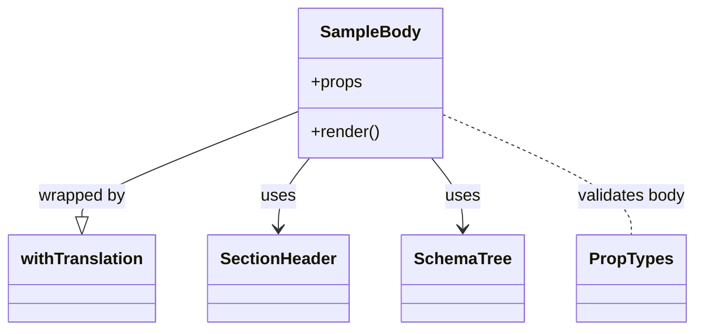

# Diagram: web/portal/src/modules/documentation/documentation-styled-components/SampleBody.js


> Auto-generated by Obscura crawlers

## Diagram 1



### SVG

<svg id="container" width="652.359375" xmlns="http://www.w3.org/2000/svg" class="classDiagram" height="318" viewBox="0 0 652.359375 318" role="graphics-document document" aria-roledescription="class"><style>#container{font-family:"trebuchet ms",verdana,arial,sans-serif;font-size:16px;fill:#333;}@keyframes edge-animation-frame{from{stroke-dashoffset:0;}}@keyframes dash{to{stroke-dashoffset:0;}}#container .edge-animation-slow{stroke-dasharray:9,5!important;stroke-dashoffset:900;animation:dash 50s linear infinite;stroke-linecap:round;}#container .edge-animation-fast{stroke-dasharray:9,5!important;stroke-dashoffset:900;animation:dash 20s linear infinite;stroke-linecap:round;}#container .error-icon{fill:#552222;}#container .error-text{fill:#552222;stroke:#552222;}#container .edge-thickness-normal{stroke-width:1px;}#container .edge-thickness-thick{stroke-width:3.5px;}#container .edge-pattern-solid{stroke-dasharray:0;}#container .edge-thickness-invisible{stroke-width:0;fill:none;}#container .edge-pattern-dashed{stroke-dasharray:3;}#container .edge-pattern-dotted{stroke-dasharray:2;}#container .marker{fill:#333333;stroke:#333333;}#container .marker.cross{stroke:#333333;}#container svg{font-family:"trebuchet ms",verdana,arial,sans-serif;font-size:16px;}#container p{margin:0;}#container g.classGroup text{fill:#9370DB;stroke:none;font-family:"trebuchet ms",verdana,arial,sans-serif;font-size:10px;}#container g.classGroup text .title{font-weight:bolder;}#container .nodeLabel,#container .edgeLabel{color:#131300;}#container .edgeLabel .label rect{fill:#ECECFF;}#container .label text{fill:#131300;}#container .labelBkg{background:#ECECFF;}#container .edgeLabel .label span{background:#ECECFF;}#container .classTitle{font-weight:bolder;}#container .node rect,#container .node circle,#container .node ellipse,#container .node polygon,#container .node path{fill:#ECECFF;stroke:#9370DB;stroke-width:1px;}#container .divider{stroke:#9370DB;stroke-width:1;}#container g.clickable{cursor:pointer;}#container g.classGroup rect{fill:#ECECFF;stroke:#9370DB;}#container g.classGroup line{stroke:#9370DB;stroke-width:1;}#container .classLabel .box{stroke:none;stroke-width:0;fill:#ECECFF;opacity:0.5;}#container .classLabel .label{fill:#9370DB;font-size:10px;}#container .relation{stroke:#333333;stroke-width:1;fill:none;}#container .dashed-line{stroke-dasharray:3;}#container .dotted-line{stroke-dasharray:1 2;}#container #compositionStart,#container .composition{fill:#333333!important;stroke:#333333!important;stroke-width:1;}#container #compositionEnd,#container .composition{fill:#333333!important;stroke:#333333!important;stroke-width:1;}#container #dependencyStart,#container .dependency{fill:#333333!important;stroke:#333333!important;stroke-width:1;}#container #dependencyStart,#container .dependency{fill:#333333!important;stroke:#333333!important;stroke-width:1;}#container #extensionStart,#container .extension{fill:transparent!important;stroke:#333333!important;stroke-width:1;}#container #extensionEnd,#container .extension{fill:transparent!important;stroke:#333333!important;stroke-width:1;}#container #aggregationStart,#container .aggregation{fill:transparent!important;stroke:#333333!important;stroke-width:1;}#container #aggregationEnd,#container .aggregation{fill:transparent!important;stroke:#333333!important;stroke-width:1;}#container #lollipopStart,#container .lollipop{fill:#ECECFF!important;stroke:#333333!important;stroke-width:1;}#container #lollipopEnd,#container .lollipop{fill:#ECECFF!important;stroke:#333333!important;stroke-width:1;}#container .edgeTerminals{font-size:11px;line-height:initial;}#container .classTitleText{text-anchor:middle;font-size:18px;fill:#333;}#container .label-icon{display:inline-block;height:1em;overflow:visible;vertical-align:-0.125em;}#container .node .label-icon path{fill:currentColor;stroke:revert;stroke-width:revert;}#container :root{--mermaid-font-family:"trebuchet ms",verdana,arial,sans-serif;}</style><g><defs><marker id="container_class-aggregationStart" class="marker aggregation class" refX="18" refY="7" markerWidth="190" markerHeight="240" orient="auto"><path d="M 18,7 L9,13 L1,7 L9,1 Z"></path></marker></defs><defs><marker id="container_class-aggregationEnd" class="marker aggregation class" refX="1" refY="7" markerWidth="20" markerHeight="28" orient="auto"><path d="M 18,7 L9,13 L1,7 L9,1 Z"></path></marker></defs><defs><marker id="container_class-extensionStart" class="marker extension class" refX="18" refY="7" markerWidth="190" markerHeight="240" orient="auto"><path d="M 1,7 L18,13 V 1 Z"></path></marker></defs><defs><marker id="container_class-extensionEnd" class="marker extension class" refX="1" refY="7" markerWidth="20" markerHeight="28" orient="auto"><path d="M 1,1 V 13 L18,7 Z"></path></marker></defs><defs><marker id="container_class-compositionStart" class="marker composition class" refX="18" refY="7" markerWidth="190" markerHeight="240" orient="auto"><path d="M 18,7 L9,13 L1,7 L9,1 Z"></path></marker></defs><defs><marker id="container_class-compositionEnd" class="marker composition class" refX="1" refY="7" markerWidth="20" markerHeight="28" orient="auto"><path d="M 18,7 L9,13 L1,7 L9,1 Z"></path></marker></defs><defs><marker id="container_class-dependencyStart" class="marker dependency class" refX="6" refY="7" markerWidth="190" markerHeight="240" orient="auto"><path d="M 5,7 L9,13 L1,7 L9,1 Z"></path></marker></defs><defs><marker id="container_class-dependencyEnd" class="marker dependency class" refX="13" refY="7" markerWidth="20" markerHeight="28" orient="auto"><path d="M 18,7 L9,13 L14,7 L9,1 Z"></path></marker></defs><defs><marker id="container_class-lollipopStart" class="marker lollipop class" refX="13" refY="7" markerWidth="190" markerHeight="240" orient="auto"><circle stroke="black" fill="transparent" cx="7" cy="7" r="6"></circle></marker></defs><defs><marker id="container_class-lollipopEnd" class="marker lollipop class" refX="1" refY="7" markerWidth="190" markerHeight="240" orient="auto"><circle stroke="black" fill="transparent" cx="7" cy="7" r="6"></circle></marker></defs><g class="root"><g class="clusters"></g><g class="edgePaths"><path d="M280.281,107.403L246.431,121.002C212.581,134.602,144.88,161.801,111.03,178.692C77.18,195.583,77.18,202.167,77.18,205.458L77.18,208.75" id="id_SampleBody_withTranslation_1" class="edge-thickness-normal edge-pattern-solid relation" style=";;;" data-edge="true" data-et="edge" data-id="id_SampleBody_withTranslation_1" data-points="W3sieCI6MjgwLjI4MTI1LCJ5IjoxMDcuNDAyNjIwNDAxNjk4OTR9LHsieCI6NzcuMTc5Njg3NSwieSI6MTg5fSx7IngiOjc3LjE3OTY4NzUsInkiOjIyNn1d" marker-end="url(#container_class-extensionEnd)"></path><path d="M291.549,152L286.673,158.167C281.796,164.333,272.042,176.667,267.166,188C262.289,199.333,262.289,209.667,262.289,214.833L262.289,220" id="id_SampleBody_SectionHeader_2" class="edge-thickness-normal edge-pattern-solid relation" style=";;;" data-edge="true" data-et="edge" data-id="id_SampleBody_SectionHeader_2" data-points="W3sieCI6MjkxLjU0OTM0Nzc2Mzc2MTUsInkiOjE1Mn0seyJ4IjoyNjIuMjg5MDYyNSwieSI6MTg5fSx7IngiOjI2Mi4yODkwNjI1LCJ5IjoyMjZ9XQ==" marker-end="url(#container_class-dependencyEnd)"></path><path d="M405.427,152L410.304,158.167C415.181,164.333,424.934,176.667,429.811,188C434.688,199.333,434.688,209.667,434.688,214.833L434.688,220" id="id_SampleBody_SchemaTree_3" class="edge-thickness-normal edge-pattern-solid relation" style=";;;" data-edge="true" data-et="edge" data-id="id_SampleBody_SchemaTree_3" data-points="W3sieCI6NDA1LjQyNzIxNDczNjIzODUsInkiOjE1Mn0seyJ4Ijo0MzQuNjg3NSwieSI6MTg5fSx7IngiOjQzNC42ODc1LCJ5IjoyMjZ9XQ==" marker-end="url(#container_class-dependencyEnd)"></path><path d="M416.695,110.604L445.815,123.67C474.935,136.736,533.174,162.868,562.294,182.101C591.414,201.333,591.414,213.667,591.414,219.833L591.414,226" id="id_SampleBody_PropTypes_4" class="edge-thickness-normal edge-pattern-dashed relation" style=";;;" data-edge="true" data-et="edge" data-id="id_SampleBody_PropTypes_4" data-points="W3sieCI6NDE2LjY5NTMxMjUsInkiOjExMC42MDQyNzA4NTE3NTgzNH0seyJ4Ijo1OTEuNDE0MDYyNSwieSI6MTg5fSx7IngiOjU5MS40MTQwNjI1LCJ5IjoyMjZ9XQ=="></path></g><g class="edgeLabels"><g class="edgeLabel" transform="translate(77.1796875, 189)"><g class="label" data-id="id_SampleBody_withTranslation_1" transform="translate(-42.3203125, -12)"><foreignObject width="84.640625" height="24"><div xmlns="http://www.w3.org/1999/xhtml" class="labelBkg" style="display: table-cell; white-space: nowrap; line-height: 1.5; max-width: 200px; text-align: center;"><span class="edgeLabel"><p>wrapped by</p></span></div></foreignObject></g></g><g class="edgeLabel" transform="translate(262.2890625, 189)"><g class="label" data-id="id_SampleBody_SectionHeader_2" transform="translate(-16.4921875, -12)"><foreignObject width="32.984375" height="24"><div xmlns="http://www.w3.org/1999/xhtml" class="labelBkg" style="display: table-cell; white-space: nowrap; line-height: 1.5; max-width: 200px; text-align: center;"><span class="edgeLabel"><p>uses</p></span></div></foreignObject></g></g><g class="edgeLabel" transform="translate(434.6875, 189)"><g class="label" data-id="id_SampleBody_SchemaTree_3" transform="translate(-16.4921875, -12)"><foreignObject width="32.984375" height="24"><div xmlns="http://www.w3.org/1999/xhtml" class="labelBkg" style="display: table-cell; white-space: nowrap; line-height: 1.5; max-width: 200px; text-align: center;"><span class="edgeLabel"><p>uses</p></span></div></foreignObject></g></g><g class="edgeLabel" transform="translate(591.4140625, 189)"><g class="label" data-id="id_SampleBody_PropTypes_4" transform="translate(-52.9453125, -12)"><foreignObject width="105.890625" height="24"><div xmlns="http://www.w3.org/1999/xhtml" class="labelBkg" style="display: table-cell; white-space: nowrap; line-height: 1.5; max-width: 200px; text-align: center;"><span class="edgeLabel"><p>validates body</p></span></div></foreignObject></g></g></g><g class="nodes"><g class="node default" id="classId-SampleBody-0" transform="translate(348.48828125, 80)"><g class="basic label-container"><path d="M-68.20703125 -72 L68.20703125 -72 L68.20703125 72 L-68.20703125 72" stroke="none" stroke-width="0" fill="#ECECFF" style=""></path><path d="M-68.20703125 -72 C-15.903538720576883 -72, 36.399953808846234 -72, 68.20703125 -72 M-68.20703125 -72 C-21.757520419637324 -72, 24.691990410725353 -72, 68.20703125 -72 M68.20703125 -72 C68.20703125 -40.403322882581676, 68.20703125 -8.806645765163353, 68.20703125 72 M68.20703125 -72 C68.20703125 -37.874444073113345, 68.20703125 -3.7488881462266903, 68.20703125 72 M68.20703125 72 C30.44102383662581 72, -7.32498357674838 72, -68.20703125 72 M68.20703125 72 C24.458069271305057 72, -19.290892707389887 72, -68.20703125 72 M-68.20703125 72 C-68.20703125 37.06632218107697, -68.20703125 2.1326443621539397, -68.20703125 -72 M-68.20703125 72 C-68.20703125 42.017572678246346, -68.20703125 12.035145356492691, -68.20703125 -72" stroke="#9370DB" stroke-width="1.3" fill="none" stroke-dasharray="0 0" style=""></path></g><g class="annotation-group text" transform="translate(0, -48)"></g><g class="label-group text" transform="translate(-45.8046875, -48)"><g class="label" style="font-weight: bolder" transform="translate(0,-12)"><foreignObject width="91.609375" height="24"><div xmlns="http://www.w3.org/1999/xhtml" style="display: table-cell; white-space: nowrap; line-height: 1.5; max-width: 141px; text-align: center;"><span class="nodeLabel markdown-node-label" style=""><p>SampleBody</p></span></div></foreignObject></g></g><g class="members-group text" transform="translate(-56.20703125, 0)"><g class="label" style="" transform="translate(0,-12)"><foreignObject width="49.515625" height="24"><div xmlns="http://www.w3.org/1999/xhtml" style="display: table-cell; white-space: nowrap; line-height: 1.5; max-width: 107px; text-align: center;"><span class="nodeLabel markdown-node-label" style=""><p>+props</p></span></div></foreignObject></g></g><g class="methods-group text" transform="translate(-56.20703125, 48)"><g class="label" style="" transform="translate(0,-12)"><foreignObject width="66.609375" height="24"><div xmlns="http://www.w3.org/1999/xhtml" style="display: table-cell; white-space: nowrap; line-height: 1.5; max-width: 124px; text-align: center;"><span class="nodeLabel markdown-node-label" style=""><p>+render()</p></span></div></foreignObject></g></g><g class="divider" style=""><path d="M-68.20703125 -24 C-36.521395604752556 -24, -4.835759959505118 -24, 68.20703125 -24 M-68.20703125 -24 C-39.004971704112364 -24, -9.802912158224729 -24, 68.20703125 -24" stroke="#9370DB" stroke-width="1.3" fill="none" stroke-dasharray="0 0" style=""></path></g><g class="divider" style=""><path d="M-68.20703125 24 C-22.751406310959197 24, 22.704218628081605 24, 68.20703125 24 M-68.20703125 24 C-21.135250597652465 24, 25.93653005469507 24, 68.20703125 24" stroke="#9370DB" stroke-width="1.3" fill="none" stroke-dasharray="0 0" style=""></path></g></g><g class="node default" id="classId-SectionHeader-1" transform="translate(262.2890625, 268)"><g class="basic label-container"><path d="M-65.9296875 -42 L65.9296875 -42 L65.9296875 42 L-65.9296875 42" stroke="none" stroke-width="0" fill="#ECECFF" style=""></path><path d="M-65.9296875 -42 C-17.368483149575887 -42, 31.192721200848226 -42, 65.9296875 -42 M-65.9296875 -42 C-30.459693184997832 -42, 5.010301130004336 -42, 65.9296875 -42 M65.9296875 -42 C65.9296875 -19.949290060602205, 65.9296875 2.101419878795589, 65.9296875 42 M65.9296875 -42 C65.9296875 -20.425134723949448, 65.9296875 1.1497305521011043, 65.9296875 42 M65.9296875 42 C15.707758278347896 42, -34.51417094330421 42, -65.9296875 42 M65.9296875 42 C36.27420899670843 42, 6.618730493416862 42, -65.9296875 42 M-65.9296875 42 C-65.9296875 25.0944784758372, -65.9296875 8.188956951674399, -65.9296875 -42 M-65.9296875 42 C-65.9296875 12.056806381432963, -65.9296875 -17.886387237134073, -65.9296875 -42" stroke="#9370DB" stroke-width="1.3" fill="none" stroke-dasharray="0 0" style=""></path></g><g class="annotation-group text" transform="translate(0, -18)"></g><g class="label-group text" transform="translate(-53.9296875, -18)"><g class="label" style="font-weight: bolder" transform="translate(0,-12)"><foreignObject width="107.859375" height="24"><div xmlns="http://www.w3.org/1999/xhtml" style="display: table-cell; white-space: nowrap; line-height: 1.5; max-width: 158px; text-align: center;"><span class="nodeLabel markdown-node-label" style=""><p>SectionHeader</p></span></div></foreignObject></g></g><g class="members-group text" transform="translate(-53.9296875, 30)"></g><g class="methods-group text" transform="translate(-53.9296875, 60)"></g><g class="divider" style=""><path d="M-65.9296875 6 C-16.582524623742508 6, 32.764638252514985 6, 65.9296875 6 M-65.9296875 6 C-32.66687862701612 6, 0.5959302459677644 6, 65.9296875 6" stroke="#9370DB" stroke-width="1.3" fill="none" stroke-dasharray="0 0" style=""></path></g><g class="divider" style=""><path d="M-65.9296875 24 C-18.854811505824976 24, 28.220064488350047 24, 65.9296875 24 M-65.9296875 24 C-15.322282244674945 24, 35.28512301065011 24, 65.9296875 24" stroke="#9370DB" stroke-width="1.3" fill="none" stroke-dasharray="0 0" style=""></path></g></g><g class="node default" id="classId-SchemaTree-2" transform="translate(434.6875, 268)"><g class="basic label-container"><path d="M-56.46875 -42 L56.46875 -42 L56.46875 42 L-56.46875 42" stroke="none" stroke-width="0" fill="#ECECFF" style=""></path><path d="M-56.46875 -42 C-32.472387138441505 -42, -8.476024276883017 -42, 56.46875 -42 M-56.46875 -42 C-25.064795875866206 -42, 6.339158248267587 -42, 56.46875 -42 M56.46875 -42 C56.46875 -19.323333888813256, 56.46875 3.3533322223734885, 56.46875 42 M56.46875 -42 C56.46875 -21.069495150282673, 56.46875 -0.13899030056534656, 56.46875 42 M56.46875 42 C13.895681369293555 42, -28.67738726141289 42, -56.46875 42 M56.46875 42 C14.80108171615717 42, -26.86658656768566 42, -56.46875 42 M-56.46875 42 C-56.46875 10.080716650585035, -56.46875 -21.83856669882993, -56.46875 -42 M-56.46875 42 C-56.46875 16.25076436685159, -56.46875 -9.498471266296818, -56.46875 -42" stroke="#9370DB" stroke-width="1.3" fill="none" stroke-dasharray="0 0" style=""></path></g><g class="annotation-group text" transform="translate(0, -18)"></g><g class="label-group text" transform="translate(-44.46875, -18)"><g class="label" style="font-weight: bolder" transform="translate(0,-12)"><foreignObject width="88.9375" height="24"><div xmlns="http://www.w3.org/1999/xhtml" style="display: table-cell; white-space: nowrap; line-height: 1.5; max-width: 138px; text-align: center;"><span class="nodeLabel markdown-node-label" style=""><p>SchemaTree</p></span></div></foreignObject></g></g><g class="members-group text" transform="translate(-44.46875, 30)"></g><g class="methods-group text" transform="translate(-44.46875, 60)"></g><g class="divider" style=""><path d="M-56.46875 6 C-19.4456145760294 6, 17.5775208479412 6, 56.46875 6 M-56.46875 6 C-26.149424044304272 6, 4.169901911391456 6, 56.46875 6" stroke="#9370DB" stroke-width="1.3" fill="none" stroke-dasharray="0 0" style=""></path></g><g class="divider" style=""><path d="M-56.46875 24 C-31.084485988204055 24, -5.700221976408109 24, 56.46875 24 M-56.46875 24 C-16.295239620820297 24, 23.878270758359406 24, 56.46875 24" stroke="#9370DB" stroke-width="1.3" fill="none" stroke-dasharray="0 0" style=""></path></g></g><g class="node default" id="classId-withTranslation-3" transform="translate(77.1796875, 268)"><g class="basic label-container"><path d="M-69.1796875 -42 L69.1796875 -42 L69.1796875 42 L-69.1796875 42" stroke="none" stroke-width="0" fill="#ECECFF" style=""></path><path d="M-69.1796875 -42 C-19.810723627889374 -42, 29.558240244221253 -42, 69.1796875 -42 M-69.1796875 -42 C-26.09017084523188 -42, 16.999345809536237 -42, 69.1796875 -42 M69.1796875 -42 C69.1796875 -20.04426971493124, 69.1796875 1.9114605701375211, 69.1796875 42 M69.1796875 -42 C69.1796875 -20.544369871340475, 69.1796875 0.91126025731905, 69.1796875 42 M69.1796875 42 C34.03370222784649 42, -1.11228304430702 42, -69.1796875 42 M69.1796875 42 C16.5485161177688 42, -36.0826552644624 42, -69.1796875 42 M-69.1796875 42 C-69.1796875 9.97283225769948, -69.1796875 -22.05433548460104, -69.1796875 -42 M-69.1796875 42 C-69.1796875 15.99275732046037, -69.1796875 -10.01448535907926, -69.1796875 -42" stroke="#9370DB" stroke-width="1.3" fill="none" stroke-dasharray="0 0" style=""></path></g><g class="annotation-group text" transform="translate(0, -18)"></g><g class="label-group text" transform="translate(-57.1796875, -18)"><g class="label" style="font-weight: bolder" transform="translate(0,-12)"><foreignObject width="114.359375" height="24"><div xmlns="http://www.w3.org/1999/xhtml" style="display: table-cell; white-space: nowrap; line-height: 1.5; max-width: 162px; text-align: center;"><span class="nodeLabel markdown-node-label" style=""><p>withTranslation</p></span></div></foreignObject></g></g><g class="members-group text" transform="translate(-57.1796875, 30)"></g><g class="methods-group text" transform="translate(-57.1796875, 60)"></g><g class="divider" style=""><path d="M-69.1796875 6 C-26.339448594865928 6, 16.500790310268144 6, 69.1796875 6 M-69.1796875 6 C-16.157026858015897 6, 36.86563378396821 6, 69.1796875 6" stroke="#9370DB" stroke-width="1.3" fill="none" stroke-dasharray="0 0" style=""></path></g><g class="divider" style=""><path d="M-69.1796875 24 C-22.46888679168344 24, 24.241913916633123 24, 69.1796875 24 M-69.1796875 24 C-30.102720321373965 24, 8.97424685725207 24, 69.1796875 24" stroke="#9370DB" stroke-width="1.3" fill="none" stroke-dasharray="0 0" style=""></path></g></g><g class="node default" id="classId-PropTypes-4" transform="translate(591.4140625, 268)"><g class="basic label-container"><path d="M-50.2578125 -42 L50.2578125 -42 L50.2578125 42 L-50.2578125 42" stroke="none" stroke-width="0" fill="#ECECFF" style=""></path><path d="M-50.2578125 -42 C-18.662696443858593 -42, 12.932419612282814 -42, 50.2578125 -42 M-50.2578125 -42 C-21.434222544845067 -42, 7.389367410309866 -42, 50.2578125 -42 M50.2578125 -42 C50.2578125 -13.071510077310876, 50.2578125 15.856979845378248, 50.2578125 42 M50.2578125 -42 C50.2578125 -12.089097488822862, 50.2578125 17.821805022354276, 50.2578125 42 M50.2578125 42 C21.103654181457014 42, -8.050504137085973 42, -50.2578125 42 M50.2578125 42 C18.657131371879743 42, -12.943549756240515 42, -50.2578125 42 M-50.2578125 42 C-50.2578125 24.63953008016553, -50.2578125 7.279060160331063, -50.2578125 -42 M-50.2578125 42 C-50.2578125 24.27737362492605, -50.2578125 6.554747249852099, -50.2578125 -42" stroke="#9370DB" stroke-width="1.3" fill="none" stroke-dasharray="0 0" style=""></path></g><g class="annotation-group text" transform="translate(0, -18)"></g><g class="label-group text" transform="translate(-38.2578125, -18)"><g class="label" style="font-weight: bolder" transform="translate(0,-12)"><foreignObject width="76.515625" height="24"><div xmlns="http://www.w3.org/1999/xhtml" style="display: table-cell; white-space: nowrap; line-height: 1.5; max-width: 125px; text-align: center;"><span class="nodeLabel markdown-node-label" style=""><p>PropTypes</p></span></div></foreignObject></g></g><g class="members-group text" transform="translate(-38.2578125, 30)"></g><g class="methods-group text" transform="translate(-38.2578125, 60)"></g><g class="divider" style=""><path d="M-50.2578125 6 C-19.839178956026217 6, 10.579454587947566 6, 50.2578125 6 M-50.2578125 6 C-18.683898626640616 6, 12.890015246718768 6, 50.2578125 6" stroke="#9370DB" stroke-width="1.3" fill="none" stroke-dasharray="0 0" style=""></path></g><g class="divider" style=""><path d="M-50.2578125 24 C-28.197159126335677 24, -6.136505752671354 24, 50.2578125 24 M-50.2578125 24 C-28.18307588420762 24, -6.108339268415243 24, 50.2578125 24" stroke="#9370DB" stroke-width="1.3" fill="none" stroke-dasharray="0 0" style=""></path></g></g></g></g></g></svg>

## Diagram 2

```mermaid
flowchart TD
    Start["Invocation: SampleBody(props)"]
    CheckBody{body present?}
    Null["Return null"]
    Div["<div id=\"body\">"]
    SectionHeaderNode["SectionHeader(title, description)"]
    SchemaTreeNode["SchemaTree(schema)"]
    Start --> CheckBody
    CheckBody -- No --> Null
    CheckBody -- Yes --> Div
    Div --> SectionHeaderNode
    Div --> SchemaTreeNode
    SectionHeaderNode --> End["Rendered output"]
    SchemaTreeNode --> End
```

> SVG rendering failed for this diagram.
