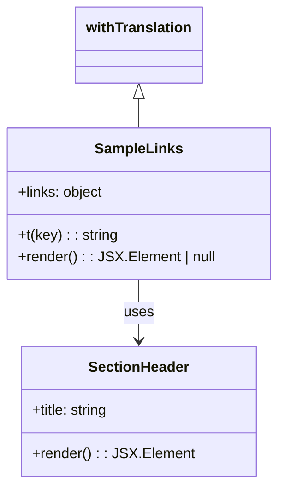

# Diagram: web/portal/src/modules/documentation/documentation-styled-components/SampleLinks.js


> Auto-generated by Obscura crawlers

## Diagram 1



### SVG

<svg id="container" width="301.8125" xmlns="http://www.w3.org/2000/svg" class="classDiagram" height="536" viewBox="0 0 301.8125 536" role="graphics-document document" aria-roledescription="class"><style>#container{font-family:"trebuchet ms",verdana,arial,sans-serif;font-size:16px;fill:#333;}@keyframes edge-animation-frame{from{stroke-dashoffset:0;}}@keyframes dash{to{stroke-dashoffset:0;}}#container .edge-animation-slow{stroke-dasharray:9,5!important;stroke-dashoffset:900;animation:dash 50s linear infinite;stroke-linecap:round;}#container .edge-animation-fast{stroke-dasharray:9,5!important;stroke-dashoffset:900;animation:dash 20s linear infinite;stroke-linecap:round;}#container .error-icon{fill:#552222;}#container .error-text{fill:#552222;stroke:#552222;}#container .edge-thickness-normal{stroke-width:1px;}#container .edge-thickness-thick{stroke-width:3.5px;}#container .edge-pattern-solid{stroke-dasharray:0;}#container .edge-thickness-invisible{stroke-width:0;fill:none;}#container .edge-pattern-dashed{stroke-dasharray:3;}#container .edge-pattern-dotted{stroke-dasharray:2;}#container .marker{fill:#333333;stroke:#333333;}#container .marker.cross{stroke:#333333;}#container svg{font-family:"trebuchet ms",verdana,arial,sans-serif;font-size:16px;}#container p{margin:0;}#container g.classGroup text{fill:#9370DB;stroke:none;font-family:"trebuchet ms",verdana,arial,sans-serif;font-size:10px;}#container g.classGroup text .title{font-weight:bolder;}#container .nodeLabel,#container .edgeLabel{color:#131300;}#container .edgeLabel .label rect{fill:#ECECFF;}#container .label text{fill:#131300;}#container .labelBkg{background:#ECECFF;}#container .edgeLabel .label span{background:#ECECFF;}#container .classTitle{font-weight:bolder;}#container .node rect,#container .node circle,#container .node ellipse,#container .node polygon,#container .node path{fill:#ECECFF;stroke:#9370DB;stroke-width:1px;}#container .divider{stroke:#9370DB;stroke-width:1;}#container g.clickable{cursor:pointer;}#container g.classGroup rect{fill:#ECECFF;stroke:#9370DB;}#container g.classGroup line{stroke:#9370DB;stroke-width:1;}#container .classLabel .box{stroke:none;stroke-width:0;fill:#ECECFF;opacity:0.5;}#container .classLabel .label{fill:#9370DB;font-size:10px;}#container .relation{stroke:#333333;stroke-width:1;fill:none;}#container .dashed-line{stroke-dasharray:3;}#container .dotted-line{stroke-dasharray:1 2;}#container #compositionStart,#container .composition{fill:#333333!important;stroke:#333333!important;stroke-width:1;}#container #compositionEnd,#container .composition{fill:#333333!important;stroke:#333333!important;stroke-width:1;}#container #dependencyStart,#container .dependency{fill:#333333!important;stroke:#333333!important;stroke-width:1;}#container #dependencyStart,#container .dependency{fill:#333333!important;stroke:#333333!important;stroke-width:1;}#container #extensionStart,#container .extension{fill:transparent!important;stroke:#333333!important;stroke-width:1;}#container #extensionEnd,#container .extension{fill:transparent!important;stroke:#333333!important;stroke-width:1;}#container #aggregationStart,#container .aggregation{fill:transparent!important;stroke:#333333!important;stroke-width:1;}#container #aggregationEnd,#container .aggregation{fill:transparent!important;stroke:#333333!important;stroke-width:1;}#container #lollipopStart,#container .lollipop{fill:#ECECFF!important;stroke:#333333!important;stroke-width:1;}#container #lollipopEnd,#container .lollipop{fill:#ECECFF!important;stroke:#333333!important;stroke-width:1;}#container .edgeTerminals{font-size:11px;line-height:initial;}#container .classTitleText{text-anchor:middle;font-size:18px;fill:#333;}#container .label-icon{display:inline-block;height:1em;overflow:visible;vertical-align:-0.125em;}#container .node .label-icon path{fill:currentColor;stroke:revert;stroke-width:revert;}#container :root{--mermaid-font-family:"trebuchet ms",verdana,arial,sans-serif;}</style><g><defs><marker id="container_class-aggregationStart" class="marker aggregation class" refX="18" refY="7" markerWidth="190" markerHeight="240" orient="auto"><path d="M 18,7 L9,13 L1,7 L9,1 Z"></path></marker></defs><defs><marker id="container_class-aggregationEnd" class="marker aggregation class" refX="1" refY="7" markerWidth="20" markerHeight="28" orient="auto"><path d="M 18,7 L9,13 L1,7 L9,1 Z"></path></marker></defs><defs><marker id="container_class-extensionStart" class="marker extension class" refX="18" refY="7" markerWidth="190" markerHeight="240" orient="auto"><path d="M 1,7 L18,13 V 1 Z"></path></marker></defs><defs><marker id="container_class-extensionEnd" class="marker extension class" refX="1" refY="7" markerWidth="20" markerHeight="28" orient="auto"><path d="M 1,1 V 13 L18,7 Z"></path></marker></defs><defs><marker id="container_class-compositionStart" class="marker composition class" refX="18" refY="7" markerWidth="190" markerHeight="240" orient="auto"><path d="M 18,7 L9,13 L1,7 L9,1 Z"></path></marker></defs><defs><marker id="container_class-compositionEnd" class="marker composition class" refX="1" refY="7" markerWidth="20" markerHeight="28" orient="auto"><path d="M 18,7 L9,13 L1,7 L9,1 Z"></path></marker></defs><defs><marker id="container_class-dependencyStart" class="marker dependency class" refX="6" refY="7" markerWidth="190" markerHeight="240" orient="auto"><path d="M 5,7 L9,13 L1,7 L9,1 Z"></path></marker></defs><defs><marker id="container_class-dependencyEnd" class="marker dependency class" refX="13" refY="7" markerWidth="20" markerHeight="28" orient="auto"><path d="M 18,7 L9,13 L14,7 L9,1 Z"></path></marker></defs><defs><marker id="container_class-lollipopStart" class="marker lollipop class" refX="13" refY="7" markerWidth="190" markerHeight="240" orient="auto"><circle stroke="black" fill="transparent" cx="7" cy="7" r="6"></circle></marker></defs><defs><marker id="container_class-lollipopEnd" class="marker lollipop class" refX="1" refY="7" markerWidth="190" markerHeight="240" orient="auto"><circle stroke="black" fill="transparent" cx="7" cy="7" r="6"></circle></marker></defs><g class="root"><g class="clusters"></g><g class="edgePaths"><path d="M150.906,109.25L150.906,110.542C150.906,111.833,150.906,114.417,150.906,119.875C150.906,125.333,150.906,133.667,150.906,137.833L150.906,142" id="id_withTranslation_SampleLinks_1" class="edge-thickness-normal edge-pattern-solid relation" style=";;;" data-edge="true" data-et="edge" data-id="id_withTranslation_SampleLinks_1" data-points="W3sieCI6MTUwLjkwNjI1LCJ5Ijo5Mn0seyJ4IjoxNTAuOTA2MjUsInkiOjExN30seyJ4IjoxNTAuOTA2MjUsInkiOjE0Mn1d" marker-start="url(#container_class-extensionStart)"></path><path d="M150.906,310L150.906,316.167C150.906,322.333,150.906,334.667,150.906,346C150.906,357.333,150.906,367.667,150.906,372.833L150.906,378" id="id_SampleLinks_SectionHeader_2" class="edge-thickness-normal edge-pattern-solid relation" style=";;;" data-edge="true" data-et="edge" data-id="id_SampleLinks_SectionHeader_2" data-points="W3sieCI6MTUwLjkwNjI1LCJ5IjozMTB9LHsieCI6MTUwLjkwNjI1LCJ5IjozNDd9LHsieCI6MTUwLjkwNjI1LCJ5IjozODR9XQ==" marker-end="url(#container_class-dependencyEnd)"></path></g><g class="edgeLabels"><g class="edgeLabel"><g class="label" data-id="id_withTranslation_SampleLinks_1" transform="translate(0, 0)"><foreignObject width="0" height="0"><div xmlns="http://www.w3.org/1999/xhtml" class="labelBkg" style="display: table-cell; white-space: nowrap; line-height: 1.5; max-width: 200px; text-align: center;"><span class="edgeLabel"></span></div></foreignObject></g></g><g class="edgeLabel" transform="translate(150.90625, 347)"><g class="label" data-id="id_SampleLinks_SectionHeader_2" transform="translate(-16.4921875, -12)"><foreignObject width="32.984375" height="24"><div xmlns="http://www.w3.org/1999/xhtml" class="labelBkg" style="display: table-cell; white-space: nowrap; line-height: 1.5; max-width: 200px; text-align: center;"><span class="edgeLabel"><p>uses</p></span></div></foreignObject></g></g></g><g class="nodes"><g class="node default" id="classId-SampleLinks-0" transform="translate(150.90625, 226)"><g class="basic label-container"><path d="M-142.90625 -84 L142.90625 -84 L142.90625 84 L-142.90625 84" stroke="none" stroke-width="0" fill="#ECECFF" style=""></path><path d="M-142.90625 -84 C-52.77955010035092 -84, 37.347149799298165 -84, 142.90625 -84 M-142.90625 -84 C-28.65741999052949 -84, 85.59141001894102 -84, 142.90625 -84 M142.90625 -84 C142.90625 -36.76449016419774, 142.90625 10.471019671604523, 142.90625 84 M142.90625 -84 C142.90625 -33.39614574172164, 142.90625 17.20770851655672, 142.90625 84 M142.90625 84 C82.8087419258769 84, 22.711233851753803 84, -142.90625 84 M142.90625 84 C43.69628642683762 84, -55.51367714632477 84, -142.90625 84 M-142.90625 84 C-142.90625 33.30152016453487, -142.90625 -17.396959670930258, -142.90625 -84 M-142.90625 84 C-142.90625 32.58298984364882, -142.90625 -18.834020312702364, -142.90625 -84" stroke="#9370DB" stroke-width="1.3" fill="none" stroke-dasharray="0 0" style=""></path></g><g class="annotation-group text" transform="translate(0, -60)"></g><g class="label-group text" transform="translate(-46.46875, -60)"><g class="label" style="font-weight: bolder" transform="translate(0,-12)"><foreignObject width="92.9375" height="24"><div xmlns="http://www.w3.org/1999/xhtml" style="display: table-cell; white-space: nowrap; line-height: 1.5; max-width: 141px; text-align: center;"><span class="nodeLabel markdown-node-label" style=""><p>SampleLinks</p></span></div></foreignObject></g></g><g class="members-group text" transform="translate(-130.90625, -12)"><g class="label" style="" transform="translate(0,-12)"><foreignObject width="95.703125" height="24"><div xmlns="http://www.w3.org/1999/xhtml" style="display: table-cell; white-space: nowrap; line-height: 1.5; max-width: 153px; text-align: center;"><span class="nodeLabel markdown-node-label" style=""><p>+links: object</p></span></div></foreignObject></g></g><g class="methods-group text" transform="translate(-130.90625, 36)"><g class="label" style="" transform="translate(0,-12)"><foreignObject width="110.65625" height="24"><div xmlns="http://www.w3.org/1999/xhtml" style="display: table-cell; white-space: nowrap; line-height: 1.5; max-width: 169px; text-align: center;"><span class="nodeLabel markdown-node-label" style=""><p>+t(key) : : string</p></span></div></foreignObject></g><g class="label" style="" transform="translate(0,12)"><foreignObject width="215.34375" height="24"><div xmlns="http://www.w3.org/1999/xhtml" style="display: table-cell; white-space: nowrap; line-height: 1.5; max-width: 273px; text-align: center;"><span class="nodeLabel markdown-node-label" style=""><p>+render() : : JSX.Element | null</p></span></div></foreignObject></g></g><g class="divider" style=""><path d="M-142.90625 -36 C-81.16475445114158 -36, -19.423258902283152 -36, 142.90625 -36 M-142.90625 -36 C-38.708941473629224 -36, 65.48836705274155 -36, 142.90625 -36" stroke="#9370DB" stroke-width="1.3" fill="none" stroke-dasharray="0 0" style=""></path></g><g class="divider" style=""><path d="M-142.90625 12 C-83.01790939393021 12, -23.129568787860435 12, 142.90625 12 M-142.90625 12 C-44.95724539808346 12, 52.991759203833084 12, 142.90625 12" stroke="#9370DB" stroke-width="1.3" fill="none" stroke-dasharray="0 0" style=""></path></g></g><g class="node default" id="classId-SectionHeader-1" transform="translate(150.90625, 456)"><g class="basic label-container"><path d="M-125.13671875 -72 L125.13671875 -72 L125.13671875 72 L-125.13671875 72" stroke="none" stroke-width="0" fill="#ECECFF" style=""></path><path d="M-125.13671875 -72 C-45.9617740991619 -72, 33.2131705516762 -72, 125.13671875 -72 M-125.13671875 -72 C-38.693394743279015 -72, 47.74992926344197 -72, 125.13671875 -72 M125.13671875 -72 C125.13671875 -37.76962710800126, 125.13671875 -3.5392542160025187, 125.13671875 72 M125.13671875 -72 C125.13671875 -38.17498500201309, 125.13671875 -4.349970004026176, 125.13671875 72 M125.13671875 72 C52.581276919677634 72, -19.97416491064473 72, -125.13671875 72 M125.13671875 72 C72.74190161561715 72, 20.347084481234305 72, -125.13671875 72 M-125.13671875 72 C-125.13671875 14.809317728001432, -125.13671875 -42.38136454399714, -125.13671875 -72 M-125.13671875 72 C-125.13671875 19.14595971719585, -125.13671875 -33.7080805656083, -125.13671875 -72" stroke="#9370DB" stroke-width="1.3" fill="none" stroke-dasharray="0 0" style=""></path></g><g class="annotation-group text" transform="translate(0, -48)"></g><g class="label-group text" transform="translate(-53.9296875, -48)"><g class="label" style="font-weight: bolder" transform="translate(0,-12)"><foreignObject width="107.859375" height="24"><div xmlns="http://www.w3.org/1999/xhtml" style="display: table-cell; white-space: nowrap; line-height: 1.5; max-width: 158px; text-align: center;"><span class="nodeLabel markdown-node-label" style=""><p>SectionHeader</p></span></div></foreignObject></g></g><g class="members-group text" transform="translate(-113.13671875, 0)"><g class="label" style="" transform="translate(0,-12)"><foreignObject width="86.859375" height="24"><div xmlns="http://www.w3.org/1999/xhtml" style="display: table-cell; white-space: nowrap; line-height: 1.5; max-width: 145px; text-align: center;"><span class="nodeLabel markdown-node-label" style=""><p>+title: string</p></span></div></foreignObject></g></g><g class="methods-group text" transform="translate(-113.13671875, 48)"><g class="label" style="" transform="translate(0,-12)"><foreignObject width="172.34375" height="24"><div xmlns="http://www.w3.org/1999/xhtml" style="display: table-cell; white-space: nowrap; line-height: 1.5; max-width: 230px; text-align: center;"><span class="nodeLabel markdown-node-label" style=""><p>+render() : : JSX.Element</p></span></div></foreignObject></g></g><g class="divider" style=""><path d="M-125.13671875 -24 C-60.553716555809984 -24, 4.029285638380031 -24, 125.13671875 -24 M-125.13671875 -24 C-27.105227462385912 -24, 70.92626382522818 -24, 125.13671875 -24" stroke="#9370DB" stroke-width="1.3" fill="none" stroke-dasharray="0 0" style=""></path></g><g class="divider" style=""><path d="M-125.13671875 24 C-41.94312004101664 24, 41.25047866796672 24, 125.13671875 24 M-125.13671875 24 C-39.76084520137185 24, 45.6150283472563 24, 125.13671875 24" stroke="#9370DB" stroke-width="1.3" fill="none" stroke-dasharray="0 0" style=""></path></g></g><g class="node default" id="classId-withTranslation-2" transform="translate(150.90625, 50)"><g class="basic label-container"><path d="M-69.1796875 -42 L69.1796875 -42 L69.1796875 42 L-69.1796875 42" stroke="none" stroke-width="0" fill="#ECECFF" style=""></path><path d="M-69.1796875 -42 C-22.210859553869028 -42, 24.757968392261944 -42, 69.1796875 -42 M-69.1796875 -42 C-21.06289138923629 -42, 27.053904721527417 -42, 69.1796875 -42 M69.1796875 -42 C69.1796875 -21.497138381466254, 69.1796875 -0.9942767629325076, 69.1796875 42 M69.1796875 -42 C69.1796875 -23.48275796386773, 69.1796875 -4.96551592773546, 69.1796875 42 M69.1796875 42 C27.079431687220968 42, -15.020824125558065 42, -69.1796875 42 M69.1796875 42 C16.94291861293126 42, -35.29385027413748 42, -69.1796875 42 M-69.1796875 42 C-69.1796875 17.68377279296668, -69.1796875 -6.632454414066643, -69.1796875 -42 M-69.1796875 42 C-69.1796875 16.620066235746382, -69.1796875 -8.759867528507236, -69.1796875 -42" stroke="#9370DB" stroke-width="1.3" fill="none" stroke-dasharray="0 0" style=""></path></g><g class="annotation-group text" transform="translate(0, -18)"></g><g class="label-group text" transform="translate(-57.1796875, -18)"><g class="label" style="font-weight: bolder" transform="translate(0,-12)"><foreignObject width="114.359375" height="24"><div xmlns="http://www.w3.org/1999/xhtml" style="display: table-cell; white-space: nowrap; line-height: 1.5; max-width: 162px; text-align: center;"><span class="nodeLabel markdown-node-label" style=""><p>withTranslation</p></span></div></foreignObject></g></g><g class="members-group text" transform="translate(-57.1796875, 30)"></g><g class="methods-group text" transform="translate(-57.1796875, 60)"></g><g class="divider" style=""><path d="M-69.1796875 6 C-17.915655613349294 6, 33.34837627330141 6, 69.1796875 6 M-69.1796875 6 C-34.016067385486814 6, 1.1475527290263727 6, 69.1796875 6" stroke="#9370DB" stroke-width="1.3" fill="none" stroke-dasharray="0 0" style=""></path></g><g class="divider" style=""><path d="M-69.1796875 24 C-35.24805139996404 24, -1.3164152999280816 24, 69.1796875 24 M-69.1796875 24 C-21.77690371227508 24, 25.625880075449842 24, 69.1796875 24" stroke="#9370DB" stroke-width="1.3" fill="none" stroke-dasharray="0 0" style=""></path></g></g></g></g></g></svg>

## Diagram 2

```mermaid
flowchart TD
    A[Start] --> B{links present?}
    B -- Yes --> C[Render div id="links" (css: linksCss)]
    C --> D[SectionHeader(title = t("documentation:Related Links"))]
    C --> E[ul > li > a(href=links.url, target="_blank", rel="noopener noreferrer")]
    E --> F[anchor text = links.content]
    B -- No --> G[Return null]
    F --> H[End]
    G --> H
```

> SVG rendering failed for this diagram.
