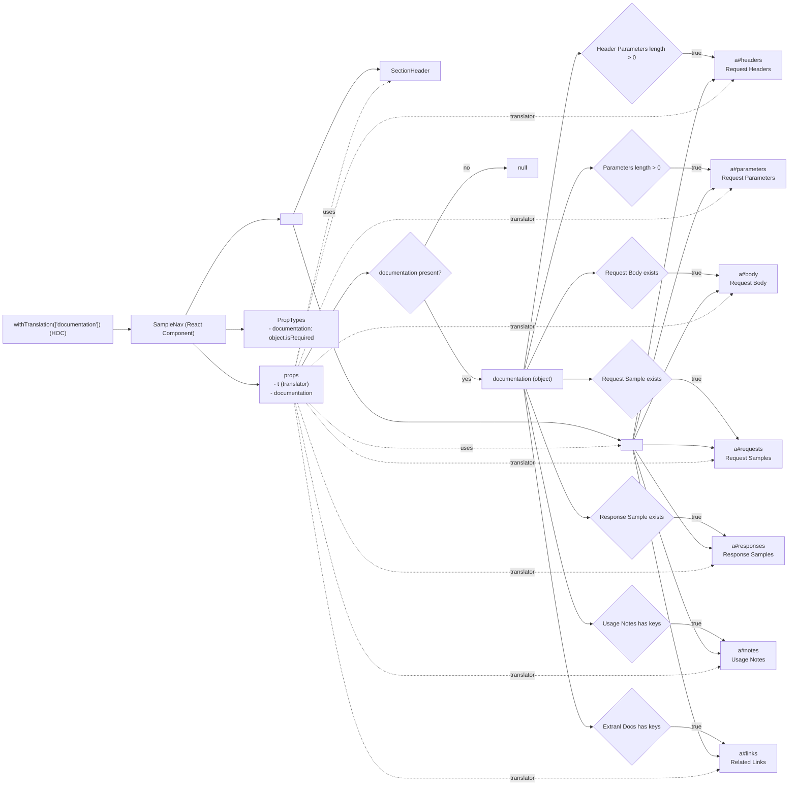

# Diagram: web/portal/src/modules/documentation/documentation-styled-components/SampleNav.js

> Auto-generated by Obscura crawlers

## Mermaid

### SVG

<svg id="container" width="2247.4375" xmlns="http://www.w3.org/2000/svg" class="flowchart" height="2154.25" viewBox="0 0 2247.4375 2154.25" role="graphics-document document" aria-roledescription="flowchart-v2"><g><marker id="container_flowchart-v2-pointEnd" class="marker flowchart-v2" viewBox="0 0 10 10" refX="5" refY="5" markerUnits="userSpaceOnUse" markerWidth="8" markerHeight="8" orient="auto"><path d="M 0 0 L 10 5 L 0 10 z" class="arrowMarkerPath" style="stroke-width: 1; stroke-dasharray: 1, 0;"></path></marker><marker id="container_flowchart-v2-pointStart" class="marker flowchart-v2" viewBox="0 0 10 10" refX="4.5" refY="5" markerUnits="userSpaceOnUse" markerWidth="8" markerHeight="8" orient="auto"><path d="M 0 5 L 10 10 L 10 0 z" class="arrowMarkerPath" style="stroke-width: 1; stroke-dasharray: 1, 0;"></path></marker><marker id="container_flowchart-v2-circleEnd" class="marker flowchart-v2" viewBox="0 0 10 10" refX="11" refY="5" markerUnits="userSpaceOnUse" markerWidth="11" markerHeight="11" orient="auto"><circle cx="5" cy="5" r="5" class="arrowMarkerPath" style="stroke-width: 1; stroke-dasharray: 1, 0;"></circle></marker><marker id="container_flowchart-v2-circleStart" class="marker flowchart-v2" viewBox="0 0 10 10" refX="-1" refY="5" markerUnits="userSpaceOnUse" markerWidth="11" markerHeight="11" orient="auto"><circle cx="5" cy="5" r="5" class="arrowMarkerPath" style="stroke-width: 1; stroke-dasharray: 1, 0;"></circle></marker><marker id="container_flowchart-v2-crossEnd" class="marker cross flowchart-v2" viewBox="0 0 11 11" refX="12" refY="5.2" markerUnits="userSpaceOnUse" markerWidth="11" markerHeight="11" orient="auto"><path d="M 1,1 l 9,9 M 10,1 l -9,9" class="arrowMarkerPath" style="stroke-width: 2; stroke-dasharray: 1, 0;"></path></marker><marker id="container_flowchart-v2-crossStart" class="marker cross flowchart-v2" viewBox="0 0 11 11" refX="-1" refY="5.2" markerUnits="userSpaceOnUse" markerWidth="11" markerHeight="11" orient="auto"><path d="M 1,1 l 9,9 M 10,1 l -9,9" class="arrowMarkerPath" style="stroke-width: 2; stroke-dasharray: 1, 0;"></path></marker><g class="root"><g class="clusters"></g><g class="edgePaths"><path d="M323.234,922.156L327.401,922.156C331.568,922.156,339.901,922.156,347.568,922.156C355.234,922.156,362.234,922.156,365.734,922.156L369.234,922.156" id="L_HOC_SampleNav_0" class="edge-thickness-normal edge-pattern-solid edge-thickness-normal edge-pattern-solid flowchart-link" style=";" data-edge="true" data-et="edge" data-id="L_HOC_SampleNav_0" data-points="W3sieCI6MzIzLjIzNDM3NSwieSI6OTIyLjE1NjI1fSx7IngiOjM0OC4yMzQzNzUsInkiOjkyMi4xNTYyNX0seyJ4IjozNzMuMjM0Mzc1LCJ5Ijo5MjIuMTU2MjV9XQ==" marker-end="url(#container_flowchart-v2-pointEnd)"></path><path d="M546.413,961.156L565.05,977.99C583.687,994.823,620.961,1028.49,643.097,1045.323C665.234,1062.156,672.234,1062.156,675.734,1062.156L679.234,1062.156" id="L_SampleNav_Props_0" class="edge-thickness-normal edge-pattern-solid edge-thickness-normal edge-pattern-solid flowchart-link" style=";" data-edge="true" data-et="edge" data-id="L_SampleNav_Props_0" data-points="W3sieCI6NTQ2LjQxMjk0NjQyODU3MTQsInkiOjk2MS4xNTYyNX0seyJ4Ijo2NTguMjM0Mzc1LCJ5IjoxMDYyLjE1NjI1fSx7IngiOjY4My4yMzQzNzUsInkiOjEwNjIuMTU2MjV9XQ==" marker-end="url(#container_flowchart-v2-pointEnd)"></path><path d="M633.234,922.156L637.401,922.156C641.568,922.156,649.901,922.156,657.568,922.156C665.234,922.156,672.234,922.156,675.734,922.156L679.234,922.156" id="L_SampleNav_PropTypes_0" class="edge-thickness-normal edge-pattern-solid edge-thickness-normal edge-pattern-solid flowchart-link" style=";" data-edge="true" data-et="edge" data-id="L_SampleNav_PropTypes_0" data-points="W3sieCI6NjMzLjIzNDM3NSwieSI6OTIyLjE1NjI1fSx7IngiOjY1OC4yMzQzNzUsInkiOjkyMi4xNTYyNX0seyJ4Ijo2ODMuMjM0Mzc1LCJ5Ijo5MjIuMTU2MjV9XQ==" marker-end="url(#container_flowchart-v2-pointEnd)"></path><path d="M522.652,883.156L545.249,837.77C567.846,792.383,613.04,701.609,655.804,656.223C698.568,610.836,738.901,610.836,759.068,610.836L779.234,610.836" id="L_SampleNav_NavDiv_0" class="edge-thickness-normal edge-pattern-solid edge-thickness-normal edge-pattern-solid flowchart-link" style=";" data-edge="true" data-et="edge" data-id="L_SampleNav_NavDiv_0" data-points="W3sieCI6NTIyLjY1MTY3NTMwODY2NTIsInkiOjg4My4xNTYyNX0seyJ4Ijo2NTguMjM0Mzc1LCJ5Ijo2MTAuODM1OTM3NX0seyJ4Ijo3ODMuMjM0Mzc1LCJ5Ijo2MTAuODM1OTM3NX1d" marker-end="url(#container_flowchart-v2-pointEnd)"></path><path d="M819.304,595.836L846.874,527.697C874.445,459.557,929.586,323.279,968.785,255.731C1007.983,188.184,1031.24,189.368,1042.869,189.96L1054.497,190.552" id="L_NavDiv_SectionHeader_0" class="edge-thickness-normal edge-pattern-solid edge-thickness-normal edge-pattern-solid flowchart-link" style=";" data-edge="true" data-et="edge" data-id="L_NavDiv_SectionHeader_0" data-points="W3sieCI6ODE5LjMwMzY2NDA0NTM2MzIsInkiOjU5NS44MzU5Mzc1fSx7IngiOjk4NC43MjY1NjI1LCJ5IjoxODd9LHsieCI6MTA1OC40OTIxODc1LCJ5IjoxOTAuNzU1NzY3NzAwODc1MX1d" marker-end="url(#container_flowchart-v2-pointEnd)"></path><path d="M817.877,625.836L845.685,715.682C873.494,805.529,929.11,985.221,983.106,1075.068C1037.102,1164.914,1089.477,1164.914,1141.852,1164.914C1194.227,1164.914,1246.602,1164.914,1298.953,1164.914C1351.305,1164.914,1403.633,1164.914,1453.212,1164.914C1502.792,1164.914,1549.622,1164.914,1594.748,1173.222C1639.875,1181.53,1683.296,1198.146,1705.007,1206.454L1726.717,1214.762" id="L_NavDiv_Nav_0" class="edge-thickness-normal edge-pattern-solid edge-thickness-normal edge-pattern-solid flowchart-link" style=";" data-edge="true" data-et="edge" data-id="L_NavDiv_Nav_0" data-points="W3sieCI6ODE3Ljg3NzAxMDU3MTQ3MjksInkiOjYyNS44MzU5Mzc1fSx7IngiOjk4NC43MjY1NjI1LCJ5IjoxMTY0LjkxNDA2MjV9LHsieCI6MTE0MS44NTE1NjI1LCJ5IjoxMTY0LjkxNDA2MjV9LHsieCI6MTI5OC45NzY1NjI1LCJ5IjoxMTY0LjkxNDA2MjV9LHsieCI6MTQ1NS45NjA5Mzc1LCJ5IjoxMTY0LjkxNDA2MjV9LHsieCI6MTU5Ni40NTMxMjUsInkiOjExNjQuOTE0MDYyNX0seyJ4IjoxNzMwLjQ1MzEyNSwieSI6MTIxNi4xOTE3ODczNDc1NjA5fV0=" marker-end="url(#container_flowchart-v2-pointEnd)"></path><path d="M834.869,1023.156L859.845,978.132C884.821,933.107,934.774,843.057,965.999,798.033C997.224,753.008,1009.721,753.008,1015.97,753.008L1022.219,753.008" id="L_Props_CondDocs_0" class="edge-thickness-normal edge-pattern-solid edge-thickness-normal edge-pattern-solid flowchart-link" style=";" data-edge="true" data-et="edge" data-id="L_Props_CondDocs_0" data-points="W3sieCI6ODM0Ljg2ODYyNzM1NjUyMzcsInkiOjEwMjMuMTU2MjV9LHsieCI6OTg0LjcyNjU2MjUsInkiOjc1My4wMDc4MTI1fSx7IngiOjEwMjYuMjE4NzUsInkiOjc1My4wMDc4MTI1fV0=" marker-end="url(#container_flowchart-v2-pointEnd)"></path><path d="M1182.113,828.379L1201.59,864.842C1221.067,901.305,1260.022,974.231,1285.748,1010.693C1311.474,1047.156,1323.971,1047.156,1330.22,1047.156L1336.469,1047.156" id="L_CondDocs_Docs_0" class="edge-thickness-normal edge-pattern-solid edge-thickness-normal edge-pattern-solid flowchart-link" style=";" data-edge="true" data-et="edge" data-id="L_CondDocs_Docs_0" data-points="W3sieCI6MTE4Mi4xMTI3NTI2MjE3MDQyLCJ5Ijo4MjguMzc5NDM0ODc4Mjk1OH0seyJ4IjoxMjk4Ljk3NjU2MjUsInkiOjEwNDcuMTU2MjV9LHsieCI6MTM0MC40Njg3NSwieSI6MTA0Ny4xNTYyNX1d" marker-end="url(#container_flowchart-v2-pointEnd)"></path><path d="M1182.367,677.89L1201.802,641.856C1221.237,605.823,1260.107,533.755,1297.699,497.721C1335.292,461.688,1371.607,461.688,1389.764,461.688L1407.922,461.688" id="L_CondDocs_Null_0" class="edge-thickness-normal edge-pattern-solid edge-thickness-normal edge-pattern-solid flowchart-link" style=";" data-edge="true" data-et="edge" data-id="L_CondDocs_Null_0" data-points="W3sieCI6MTE4Mi4zNjY2NjAyMzM0ODksInkiOjY3Ny44OTAwOTc3MzM0ODg5fSx7IngiOjEyOTguOTc2NTYyNSwieSI6NDYxLjY4NzV9LHsieCI6MTQxMS45MjE4NzUsInkiOjQ2MS42ODc1fV0=" marker-end="url(#container_flowchart-v2-pointEnd)"></path><path d="M1460.175,1020.156L1482.888,874.63C1505.601,729.104,1551.027,438.052,1577.24,292.526C1603.453,147,1610.453,147,1613.953,147L1617.453,147" id="L_Docs_CheckHeaders_0" class="edge-thickness-normal edge-pattern-solid edge-thickness-normal edge-pattern-solid flowchart-link" style=";" data-edge="true" data-et="edge" data-id="L_Docs_CheckHeaders_0" data-points="W3sieCI6MTQ2MC4xNzQ5NzE1MjE4NzEyLCJ5IjoxMDIwLjE1NjI1fSx7IngiOjE1OTYuNDUzMTI1LCJ5IjoxNDd9LHsieCI6MTYyMS40NTMxMjUsInkiOjE0N31d" marker-end="url(#container_flowchart-v2-pointEnd)"></path><path d="M1462.44,1020.156L1484.776,927.078C1507.111,834,1551.782,647.844,1583.17,554.766C1614.557,461.688,1632.661,461.688,1641.714,461.688L1650.766,461.688" id="L_Docs_CheckParams_0" class="edge-thickness-normal edge-pattern-solid edge-thickness-normal edge-pattern-solid flowchart-link" style=";" data-edge="true" data-et="edge" data-id="L_Docs_CheckParams_0" data-points="W3sieCI6MTQ2Mi40NDAwMDA3NTA2MDA2LCJ5IjoxMDIwLjE1NjI1fSx7IngiOjE1OTYuNDUzMTI1LCJ5Ijo0NjEuNjg3NX0seyJ4IjoxNjU0Ljc2NTYyNSwieSI6NDYxLjY4NzV9XQ==" marker-end="url(#container_flowchart-v2-pointEnd)"></path><path d="M1468.857,1020.156L1490.123,975.632C1511.389,931.107,1553.921,842.057,1585.222,797.533C1616.523,753.008,1636.594,753.008,1646.629,753.008L1656.664,753.008" id="L_Docs_CheckBody_0" class="edge-thickness-normal edge-pattern-solid edge-thickness-normal edge-pattern-solid flowchart-link" style=";" data-edge="true" data-et="edge" data-id="L_Docs_CheckBody_0" data-points="W3sieCI6MTQ2OC44NTY3NzAyODAwMDU4LCJ5IjoxMDIwLjE1NjI1fSx7IngiOjE1OTYuNDUzMTI1LCJ5Ijo3NTMuMDA3ODEyNX0seyJ4IjoxNjYwLjY2NDA2MjUsInkiOjc1My4wMDc4MTI1fV0=" marker-end="url(#container_flowchart-v2-pointEnd)"></path><path d="M1571.453,1047.156L1575.62,1047.156C1579.786,1047.156,1588.12,1047.156,1600.867,1047.156C1613.615,1047.156,1630.776,1047.156,1639.357,1047.156L1647.938,1047.156" id="L_Docs_CheckRequests_0" class="edge-thickness-normal edge-pattern-solid edge-thickness-normal edge-pattern-solid flowchart-link" style=";" data-edge="true" data-et="edge" data-id="L_Docs_CheckRequests_0" data-points="W3sieCI6MTU3MS40NTMxMjUsInkiOjEwNDcuMTU2MjV9LHsieCI6MTU5Ni40NTMxMjUsInkiOjEwNDcuMTU2MjV9LHsieCI6MTY1MS45Mzc1LCJ5IjoxMDQ3LjE1NjI1fV0=" marker-end="url(#container_flowchart-v2-pointEnd)"></path><path d="M1465.955,1074.156L1487.705,1132.915C1509.454,1191.674,1552.954,1309.193,1582.364,1367.952C1611.773,1426.711,1627.094,1426.711,1634.754,1426.711L1642.414,1426.711" id="L_Docs_CheckResponses_0" class="edge-thickness-normal edge-pattern-solid edge-thickness-normal edge-pattern-solid flowchart-link" style=";" data-edge="true" data-et="edge" data-id="L_Docs_CheckResponses_0" data-points="W3sieCI6MTQ2NS45NTQ5ODg5MTcxNjI0LCJ5IjoxMDc0LjE1NjI1fSx7IngiOjE1OTYuNDUzMTI1LCJ5IjoxNDI2LjcxMDkzNzV9LHsieCI6MTY0Ni40MTQwNjI1LCJ5IjoxNDI2LjcxMDkzNzV9XQ==" marker-end="url(#container_flowchart-v2-pointEnd)"></path><path d="M1461.638,1074.156L1484.107,1181.022C1506.576,1287.888,1551.515,1501.62,1583.217,1608.486C1614.919,1715.352,1633.385,1715.352,1642.618,1715.352L1651.852,1715.352" id="L_Docs_CheckNotes_0" class="edge-thickness-normal edge-pattern-solid edge-thickness-normal edge-pattern-solid flowchart-link" style=";" data-edge="true" data-et="edge" data-id="L_Docs_CheckNotes_0" data-points="W3sieCI6MTQ2MS42Mzc4NTQxMDEzODY3LCJ5IjoxMDc0LjE1NjI1fSx7IngiOjE1OTYuNDUzMTI1LCJ5IjoxNzE1LjM1MTU2MjV9LHsieCI6MTY1NS44NTE1NjI1LCJ5IjoxNzE1LjM1MTU2MjV9XQ==" marker-end="url(#container_flowchart-v2-pointEnd)"></path><path d="M1459.965,1074.156L1482.713,1227.564C1505.461,1380.971,1550.957,1687.786,1582.93,1841.194C1614.904,1994.602,1633.354,1994.602,1642.579,1994.602L1651.805,1994.602" id="L_Docs_CheckLinks_0" class="edge-thickness-normal edge-pattern-solid edge-thickness-normal edge-pattern-solid flowchart-link" style=";" data-edge="true" data-et="edge" data-id="L_Docs_CheckLinks_0" data-points="W3sieCI6MTQ1OS45NjQ2Mzk4OTA0NzQ1LCJ5IjoxMDc0LjE1NjI1fSx7IngiOjE1OTYuNDUzMTI1LCJ5IjoxOTk0LjYwMTU2MjV9LHsieCI6MTY1NS44MDQ2ODc1LCJ5IjoxOTk0LjYwMTU2MjV9XQ==" marker-end="url(#container_flowchart-v2-pointEnd)"></path><path d="M1899.453,147L1906.118,147C1912.784,147,1926.115,147,1938.795,148.336C1951.474,149.672,1963.504,152.344,1969.518,153.68L1975.533,155.016" id="L_CheckHeaders_LinkHeaders_0" class="edge-thickness-normal edge-pattern-solid edge-thickness-normal edge-pattern-solid flowchart-link" style=";" data-edge="true" data-et="edge" data-id="L_CheckHeaders_LinkHeaders_0" data-points="W3sieCI6MTg5OS40NTMxMjUsInkiOjE0N30seyJ4IjoxOTM5LjQ0NTMxMjUsInkiOjE0N30seyJ4IjoxOTc5LjQzNzUsInkiOjE1NS44ODI4NjQyMDI3NDM3fV0=" marker-end="url(#container_flowchart-v2-pointEnd)"></path><path d="M1866.141,461.688L1878.358,461.688C1890.576,461.688,1915.01,461.688,1933.232,462.433C1951.453,463.178,1963.46,464.669,1969.464,465.414L1975.468,466.159" id="L_CheckParams_LinkParams_0" class="edge-thickness-normal edge-pattern-solid edge-thickness-normal edge-pattern-solid flowchart-link" style=";" data-edge="true" data-et="edge" data-id="L_CheckParams_LinkParams_0" data-points="W3sieCI6MTg2Ni4xNDA2MjUsInkiOjQ2MS42ODc1fSx7IngiOjE5MzkuNDQ1MzEyNSwieSI6NDYxLjY4NzV9LHsieCI6MTk3OS40Mzc1LCJ5Ijo0NjYuNjUxODMxOTI4NzQyMX1d" marker-end="url(#container_flowchart-v2-pointEnd)"></path><path d="M1860.242,753.008L1873.443,753.008C1886.643,753.008,1913.044,753.008,1934.712,753.912C1956.38,754.816,1973.315,756.624,1981.782,757.529L1990.249,758.433" id="L_CheckBody_LinkBody_0" class="edge-thickness-normal edge-pattern-solid edge-thickness-normal edge-pattern-solid flowchart-link" style=";" data-edge="true" data-et="edge" data-id="L_CheckBody_LinkBody_0" data-points="W3sieCI6MTg2MC4yNDIxODc1LCJ5Ijo3NTMuMDA3ODEyNX0seyJ4IjoxOTM5LjQ0NTMxMjUsInkiOjc1My4wMDc4MTI1fSx7IngiOjE5OTQuMjI2NTYyNSwieSI6NzU4Ljg1NzU0MDYyOTczOTR9XQ==" marker-end="url(#container_flowchart-v2-pointEnd)"></path><path d="M1868.969,1047.156L1880.715,1047.156C1892.461,1047.156,1915.953,1047.156,1950.23,1074.395C1984.507,1101.634,2029.568,1156.112,2052.099,1183.351L2074.629,1210.59" id="L_CheckRequests_LinkRequests_0" class="edge-thickness-normal edge-pattern-solid edge-thickness-normal edge-pattern-solid flowchart-link" style=";" data-edge="true" data-et="edge" data-id="L_CheckRequests_LinkRequests_0" data-points="W3sieCI6MTg2OC45Njg3NSwieSI6MTA0Ny4xNTYyNX0seyJ4IjoxOTM5LjQ0NTMxMjUsInkiOjEwNDcuMTU2MjV9LHsieCI6MjA3Ny4xNzg2NjE3MTIxNTcsInkiOjEyMTMuNjcxODc1fV0=" marker-end="url(#container_flowchart-v2-pointEnd)"></path><path d="M1874.492,1426.711L1885.318,1426.711C1896.143,1426.711,1917.794,1426.711,1944.157,1434.984C1970.519,1443.257,2001.593,1459.804,2017.13,1468.077L2032.666,1476.35" id="L_CheckResponses_LinkResponses_0" class="edge-thickness-normal edge-pattern-solid edge-thickness-normal edge-pattern-solid flowchart-link" style=";" data-edge="true" data-et="edge" data-id="L_CheckResponses_LinkResponses_0" data-points="W3sieCI6MTg3NC40OTIxODc1LCJ5IjoxNDI2LjcxMDkzNzV9LHsieCI6MTkzOS40NDUzMTI1LCJ5IjoxNDI2LjcxMDkzNzV9LHsieCI6MjAzNi4xOTcwMDQ1OTU4NjU4LCJ5IjoxNDc4LjIzMDQ2ODc1fV0=" marker-end="url(#container_flowchart-v2-pointEnd)"></path><path d="M1865.055,1715.352L1877.453,1715.352C1889.852,1715.352,1914.648,1715.352,1945.868,1724.851C1977.088,1734.351,2014.73,1753.351,2033.552,1762.85L2052.373,1772.35" id="L_CheckNotes_LinkNotes_0" class="edge-thickness-normal edge-pattern-solid edge-thickness-normal edge-pattern-solid flowchart-link" style=";" data-edge="true" data-et="edge" data-id="L_CheckNotes_LinkNotes_0" data-points="W3sieCI6MTg2NS4wNTQ2ODc1LCJ5IjoxNzE1LjM1MTU2MjV9LHsieCI6MTkzOS40NDUzMTI1LCJ5IjoxNzE1LjM1MTU2MjV9LHsieCI6MjA1NS45NDM5NDIwNjY5MjQ2LCJ5IjoxNzc0LjE1MjM0Mzc1fV0=" marker-end="url(#container_flowchart-v2-pointEnd)"></path><path d="M1865.102,1994.602L1877.492,1994.602C1889.883,1994.602,1914.664,1994.602,1945.878,2004.105C1977.093,2013.609,2014.74,2032.616,2033.564,2042.119L2052.388,2051.623" id="L_CheckLinks_LinkLinks_0" class="edge-thickness-normal edge-pattern-solid edge-thickness-normal edge-pattern-solid flowchart-link" style=";" data-edge="true" data-et="edge" data-id="L_CheckLinks_LinkLinks_0" data-points="W3sieCI6MTg2NS4xMDE1NjI1LCJ5IjoxOTk0LjYwMTU2MjV9LHsieCI6MTkzOS40NDUzMTI1LCJ5IjoxOTk0LjYwMTU2MjV9LHsieCI6MjA1NS45NTg1NTA0NzU2MjcsInkiOjIwNTMuNDI1NzgxMjV9XQ==" marker-end="url(#container_flowchart-v2-pointEnd)"></path><path d="M1763.172,1212.672L1792.55,1050.56C1821.929,888.448,1880.687,564.224,1917.762,399.611C1954.837,234.998,1970.23,229.996,1977.926,227.495L1985.622,224.994" id="L_Nav_LinkHeaders_0" class="edge-thickness-normal edge-pattern-solid edge-thickness-normal edge-pattern-solid flowchart-link" style=";" data-edge="true" data-et="edge" data-id="L_Nav_LinkHeaders_0" data-points="W3sieCI6MTc2My4xNzE1MjA1MzI0MjMsInkiOjEyMTIuNjcxODc1fSx7IngiOjE5MzkuNDQ1MzEyNSwieSI6MjQwfSx7IngiOjE5ODkuNDI2MDQ0NzYwMjg4NSwieSI6MjIzLjc1NzgxMjV9XQ==" marker-end="url(#container_flowchart-v2-pointEnd)"></path><path d="M1764.346,1212.672L1793.529,1100.232C1822.713,987.792,1881.079,762.911,1917.958,647.97C1954.837,533.029,1970.23,528.027,1977.926,525.526L1985.622,523.025" id="L_Nav_LinkParams_0" class="edge-thickness-normal edge-pattern-solid edge-thickness-normal edge-pattern-solid flowchart-link" style=";" data-edge="true" data-et="edge" data-id="L_Nav_LinkParams_0" data-points="W3sieCI6MTc2NC4zNDYyODcxOTk1MTUyLCJ5IjoxMjEyLjY3MTg3NX0seyJ4IjoxOTM5LjQ0NTMxMjUsInkiOjUzOC4wMzEyNX0seyJ4IjoxOTg5LjQyNjA0NDc2MDI4ODUsInkiOjUyMS43ODkwNjI1fV0=" marker-end="url(#container_flowchart-v2-pointEnd)"></path><path d="M1767.144,1212.672L1795.861,1148.294C1824.578,1083.915,1882.012,955.159,1924.579,886.28C1967.146,817.4,1994.847,808.398,2008.698,803.897L2022.548,799.396" id="L_Nav_LinkBody_0" class="edge-thickness-normal edge-pattern-solid edge-thickness-normal edge-pattern-solid flowchart-link" style=";" data-edge="true" data-et="edge" data-id="L_Nav_LinkBody_0" data-points="W3sieCI6MTc2Ny4xNDQwOTYwMzkxODI0LCJ5IjoxMjEyLjY3MTg3NX0seyJ4IjoxOTM5LjQ0NTMxMjUsInkiOjgyNi40MDIzNDM3NX0seyJ4IjoyMDI2LjM1MjY0NjM3MjUwNzUsInkiOjc5OC4xNjAxNTYyNX1d" marker-end="url(#container_flowchart-v2-pointEnd)"></path><path d="M1790.453,1227.672L1815.285,1227.672C1840.117,1227.672,1889.781,1227.672,1920.619,1228.555C1951.457,1229.438,1963.468,1231.205,1969.474,1232.088L1975.48,1232.971" id="L_Nav_LinkRequests_0" class="edge-thickness-normal edge-pattern-solid edge-thickness-normal edge-pattern-solid flowchart-link" style=";" data-edge="true" data-et="edge" data-id="L_Nav_LinkRequests_0" data-points="W3sieCI6MTc5MC40NTMxMjUsInkiOjEyMjcuNjcxODc1fSx7IngiOjE5MzkuNDQ1MzEyNSwieSI6MTIyNy42NzE4NzV9LHsieCI6MTk3OS40Mzc1LCJ5IjoxMjMzLjU1MzM0OTMzMjQ2MDF9XQ==" marker-end="url(#container_flowchart-v2-pointEnd)"></path><path d="M1770.057,1242.672L1798.288,1286.765C1826.52,1330.858,1882.983,1419.044,1917.214,1463.49C1951.445,1507.936,1963.445,1508.642,1969.445,1508.995L1975.444,1509.348" id="L_Nav_LinkResponses_0" class="edge-thickness-normal edge-pattern-solid edge-thickness-normal edge-pattern-solid flowchart-link" style=";" data-edge="true" data-et="edge" data-id="L_Nav_LinkResponses_0" data-points="W3sieCI6MTc3MC4wNTcxMzI0MzM1OTM4LCJ5IjoxMjQyLjY3MTg3NX0seyJ4IjoxOTM5LjQ0NTMxMjUsInkiOjE1MDcuMjMwNDY4NzV9LHsieCI6MTk3OS40Mzc1LCJ5IjoxNTA5LjU4MzA1ODQ4Mjk4NDF9XQ==" marker-end="url(#container_flowchart-v2-pointEnd)"></path><path d="M1765.218,1242.672L1794.256,1334.085C1823.294,1425.499,1881.37,1608.326,1919.423,1700.269C1957.476,1792.213,1975.507,1793.274,1984.523,1793.804L1993.538,1794.334" id="L_Nav_LinkNotes_0" class="edge-thickness-normal edge-pattern-solid edge-thickness-normal edge-pattern-solid flowchart-link" style=";" data-edge="true" data-et="edge" data-id="L_Nav_LinkNotes_0" data-points="W3sieCI6MTc2NS4yMTc5NDQ2NTQ2Mjk3LCJ5IjoxMjQyLjY3MTg3NX0seyJ4IjoxOTM5LjQ0NTMxMjUsInkiOjE3OTEuMTUyMzQzNzV9LHsieCI6MTk5Ny41MzEyNSwieSI6MTc5NC41NjkzMjA2MzMxMjg5fV0=" marker-end="url(#container_flowchart-v2-pointEnd)"></path><path d="M1763.639,1242.672L1792.94,1380.631C1822.241,1518.59,1880.843,1794.508,1919.045,1932.99C1957.247,2071.473,1975.049,2072.52,1983.95,2073.044L1992.851,2073.567" id="L_Nav_LinkLinks_0" class="edge-thickness-normal edge-pattern-solid edge-thickness-normal edge-pattern-solid flowchart-link" style=";" data-edge="true" data-et="edge" data-id="L_Nav_LinkLinks_0" data-points="W3sieCI6MTc2My42Mzg5NjkzOTk2Mzg0LCJ5IjoxMjQyLjY3MTg3NX0seyJ4IjoxOTM5LjQ0NTMxMjUsInkiOjIwNzAuNDI1NzgxMjV9LHsieCI6MTk5Ni44NDM3NSwieSI6MjA3My44MDIzMTUwOTgwNjN9XQ==" marker-end="url(#container_flowchart-v2-pointEnd)"></path><path d="M821.72,1023.156L848.888,898.297C876.056,773.438,930.391,523.719,974.201,390.492C1018.01,257.266,1051.293,240.531,1067.935,232.164L1084.577,223.797" id="L_Props_SectionHeader_0" class="edge-thickness-normal edge-pattern-dotted edge-thickness-normal edge-pattern-solid flowchart-link" style=";" data-edge="true" data-et="edge" data-id="L_Props_SectionHeader_0" data-points="W3sieCI6ODIxLjcyMDI0OTg2NjE4MjksInkiOjEwMjMuMTU2MjV9LHsieCI6OTg0LjcyNjU2MjUsInkiOjI3NH0seyJ4IjoxMDg4LjE1MDYxMzEzMjkxMTMsInkiOjIyMn1d" marker-end="url(#container_flowchart-v2-pointEnd)"></path><path d="M851.559,1101.156L873.753,1123.742C895.948,1146.328,940.337,1191.5,988.719,1214.086C1037.102,1236.672,1089.477,1236.672,1141.852,1236.672C1194.227,1236.672,1246.602,1236.672,1298.953,1236.672C1351.305,1236.672,1403.633,1236.672,1453.212,1236.672C1502.792,1236.672,1549.622,1236.672,1594.705,1235.483C1639.788,1234.294,1683.124,1231.916,1704.791,1230.726L1726.459,1229.537" id="L_Props_Nav_0" class="edge-thickness-normal edge-pattern-dotted edge-thickness-normal edge-pattern-solid flowchart-link" style=";" data-edge="true" data-et="edge" data-id="L_Props_Nav_0" data-points="W3sieCI6ODUxLjU1ODcxMDIxMzUzNzQsInkiOjExMDEuMTU2MjV9LHsieCI6OTg0LjcyNjU2MjUsInkiOjEyMzYuNjcxODc1fSx7IngiOjExNDEuODUxNTYyNSwieSI6MTIzNi42NzE4NzV9LHsieCI6MTI5OC45NzY1NjI1LCJ5IjoxMjM2LjY3MTg3NX0seyJ4IjoxNDU1Ljk2MDkzNzUsInkiOjEyMzYuNjcxODc1fSx7IngiOjE1OTYuNDUzMTI1LCJ5IjoxMjM2LjY3MTg3NX0seyJ4IjoxNzMwLjQ1MzEyNSwieSI6MTIyOS4zMTgyMTY0NjM0MTQ3fV0=" marker-end="url(#container_flowchart-v2-pointEnd)"></path><path d="M822.258,1023.156L849.336,906.13C876.414,789.104,930.571,555.052,983.836,438.026C1037.102,321,1089.477,321,1141.852,321C1194.227,321,1246.602,321,1298.953,321C1351.305,321,1403.633,321,1453.212,321C1502.792,321,1549.622,321,1600.371,321C1651.12,321,1705.786,321,1762.952,321C1820.117,321,1879.781,321,1929.315,305.21C1978.849,289.42,2018.252,257.84,2037.954,242.049L2057.655,226.259" id="L_Props_LinkHeaders_0" class="edge-thickness-normal edge-pattern-dotted edge-thickness-normal edge-pattern-solid flowchart-link" style=";" data-edge="true" data-et="edge" data-id="L_Props_LinkHeaders_0" data-points="W3sieCI6ODIyLjI1ODM3Njc3MDg4MTcsInkiOjEwMjMuMTU2MjV9LHsieCI6OTg0LjcyNjU2MjUsInkiOjMyMX0seyJ4IjoxMTQxLjg1MTU2MjUsInkiOjMyMX0seyJ4IjoxMjk4Ljk3NjU2MjUsInkiOjMyMX0seyJ4IjoxNDU1Ljk2MDkzNzUsInkiOjMyMX0seyJ4IjoxNTk2LjQ1MzEyNSwieSI6MzIxfSx7IngiOjE3NjAuNDUzMTI1LCJ5IjozMjF9LHsieCI6MTkzOS40NDUzMTI1LCJ5IjozMjF9LHsieCI6MjA2MC43NzYzOTU1Nzg4NzUsInkiOjIyMy43NTc4MTI1fV0=" marker-end="url(#container_flowchart-v2-pointEnd)"></path><path d="M827.781,1023.156L853.938,953.026C880.096,882.896,932.411,742.635,984.756,672.505C1037.102,602.375,1089.477,602.375,1141.852,602.375C1194.227,602.375,1246.602,602.375,1298.953,602.375C1351.305,602.375,1403.633,602.375,1453.212,602.375C1502.792,602.375,1549.622,602.375,1600.371,602.375C1651.12,602.375,1705.786,602.375,1762.952,602.375C1820.117,602.375,1879.781,602.375,1928.16,589.328C1976.539,576.28,2013.633,550.185,2032.18,537.138L2050.727,524.091" id="L_Props_LinkParams_0" class="edge-thickness-normal edge-pattern-dotted edge-thickness-normal edge-pattern-solid flowchart-link" style=";" data-edge="true" data-et="edge" data-id="L_Props_LinkParams_0" data-points="W3sieCI6ODI3Ljc4MDg0NzUwNzMwNjUsInkiOjEwMjMuMTU2MjV9LHsieCI6OTg0LjcyNjU2MjUsInkiOjYwMi4zNzV9LHsieCI6MTE0MS44NTE1NjI1LCJ5Ijo2MDIuMzc1fSx7IngiOjEyOTguOTc2NTYyNSwieSI6NjAyLjM3NX0seyJ4IjoxNDU1Ljk2MDkzNzUsInkiOjYwMi4zNzV9LHsieCI6MTU5Ni40NTMxMjUsInkiOjYwMi4zNzV9LHsieCI6MTc2MC40NTMxMjUsInkiOjYwMi4zNzV9LHsieCI6MTkzOS40NDUzMTI1LCJ5Ijo2MDIuMzc1fSx7IngiOjIwNTMuOTk4NzQ2NDg4NTM1LCJ5Ijo1MjEuNzg5MDYyNX1d" marker-end="url(#container_flowchart-v2-pointEnd)"></path><path d="M855.427,1023.156L876.977,1003.237C898.527,983.318,941.627,943.479,989.364,923.56C1037.102,903.641,1089.477,903.641,1141.852,903.641C1194.227,903.641,1246.602,903.641,1298.953,903.641C1351.305,903.641,1403.633,903.641,1453.212,903.641C1502.792,903.641,1549.622,903.641,1600.371,903.641C1651.12,903.641,1705.786,903.641,1762.952,903.641C1820.117,903.641,1879.781,903.641,1931.645,886.47C1983.509,869.3,2027.573,834.96,2049.605,817.789L2071.637,800.619" id="L_Props_LinkBody_0" class="edge-thickness-normal edge-pattern-dotted edge-thickness-normal edge-pattern-solid flowchart-link" style=";" data-edge="true" data-et="edge" data-id="L_Props_LinkBody_0" data-points="W3sieCI6ODU1LjQyNzAzMTQ4MTAyNTEsInkiOjEwMjMuMTU2MjV9LHsieCI6OTg0LjcyNjU2MjUsInkiOjkwMy42NDA2MjV9LHsieCI6MTE0MS44NTE1NjI1LCJ5Ijo5MDMuNjQwNjI1fSx7IngiOjEyOTguOTc2NTYyNSwieSI6OTAzLjY0MDYyNX0seyJ4IjoxNDU1Ljk2MDkzNzUsInkiOjkwMy42NDA2MjV9LHsieCI6MTU5Ni40NTMxMjUsInkiOjkwMy42NDA2MjV9LHsieCI6MTc2MC40NTMxMjUsInkiOjkwMy42NDA2MjV9LHsieCI6MTkzOS40NDUzMTI1LCJ5Ijo5MDMuNjQwNjI1fSx7IngiOjIwNzQuNzkyNDc1Njc0NDgsInkiOjc5OC4xNjAxNTYyNX1d" marker-end="url(#container_flowchart-v2-pointEnd)"></path><path d="M844.268,1101.156L867.678,1130.576C891.087,1159.995,937.907,1218.833,987.504,1248.253C1037.102,1277.672,1089.477,1277.672,1141.852,1277.672C1194.227,1277.672,1246.602,1277.672,1298.953,1277.672C1351.305,1277.672,1403.633,1277.672,1453.212,1277.672C1502.792,1277.672,1549.622,1277.672,1600.371,1277.672C1651.12,1277.672,1705.786,1277.672,1762.952,1277.672C1820.117,1277.672,1879.781,1277.672,1915.619,1276.789C1951.457,1275.905,1963.468,1274.139,1969.474,1273.256L1975.48,1272.372" id="L_Props_LinkRequests_0" class="edge-thickness-normal edge-pattern-dotted edge-thickness-normal edge-pattern-solid flowchart-link" style=";" data-edge="true" data-et="edge" data-id="L_Props_LinkRequests_0" data-points="W3sieCI6ODQ0LjI2NzgzNDAwMDk0MjUsInkiOjExMDEuMTU2MjV9LHsieCI6OTg0LjcyNjU2MjUsInkiOjEyNzcuNjcxODc1fSx7IngiOjExNDEuODUxNTYyNSwieSI6MTI3Ny42NzE4NzV9LHsieCI6MTI5OC45NzY1NjI1LCJ5IjoxMjc3LjY3MTg3NX0seyJ4IjoxNDU1Ljk2MDkzNzUsInkiOjEyNzcuNjcxODc1fSx7IngiOjE1OTYuNDUzMTI1LCJ5IjoxMjc3LjY3MTg3NX0seyJ4IjoxNzYwLjQ1MzEyNSwieSI6MTI3Ny42NzE4NzV9LHsieCI6MTkzOS40NDUzMTI1LCJ5IjoxMjc3LjY3MTg3NX0seyJ4IjoxOTc5LjQzNzUsInkiOjEyNzEuNzkwNDAwNjY3NTM5OX1d" marker-end="url(#container_flowchart-v2-pointEnd)"></path><path d="M826.257,1101.156L852.668,1180.255C879.08,1259.354,931.903,1417.552,984.502,1496.651C1037.102,1575.75,1089.477,1575.75,1141.852,1575.75C1194.227,1575.75,1246.602,1575.75,1298.953,1575.75C1351.305,1575.75,1403.633,1575.75,1453.212,1575.75C1502.792,1575.75,1549.622,1575.75,1600.371,1575.75C1651.12,1575.75,1705.786,1575.75,1762.952,1575.75C1820.117,1575.75,1879.781,1575.75,1918.433,1572.714C1957.085,1569.677,1974.725,1563.605,1983.545,1560.569L1992.365,1557.532" id="L_Props_LinkResponses_0" class="edge-thickness-normal edge-pattern-dotted edge-thickness-normal edge-pattern-solid flowchart-link" style=";" data-edge="true" data-et="edge" data-id="L_Props_LinkResponses_0" data-points="W3sieCI6ODI2LjI1NjcyMDYwMzg5NDEsInkiOjExMDEuMTU2MjV9LHsieCI6OTg0LjcyNjU2MjUsInkiOjE1NzUuNzV9LHsieCI6MTE0MS44NTE1NjI1LCJ5IjoxNTc1Ljc1fSx7IngiOjEyOTguOTc2NTYyNSwieSI6MTU3NS43NX0seyJ4IjoxNDU1Ljk2MDkzNzUsInkiOjE1NzUuNzV9LHsieCI6MTU5Ni40NTMxMjUsInkiOjE1NzUuNzV9LHsieCI6MTc2MC40NTMxMjUsInkiOjE1NzUuNzV9LHsieCI6MTkzOS40NDUzMTI1LCJ5IjoxNTc1Ljc1fSx7IngiOjE5OTYuMTQ3MTk4OTUyMDA2LCJ5IjoxNTU2LjIzMDQ2ODc1fV0=" marker-end="url(#container_flowchart-v2-pointEnd)"></path><path d="M821.671,1101.156L848.847,1226.789C876.023,1352.422,930.375,1603.688,983.738,1729.32C1037.102,1854.953,1089.477,1854.953,1141.852,1854.953C1194.227,1854.953,1246.602,1854.953,1298.953,1854.953C1351.305,1854.953,1403.633,1854.953,1453.212,1854.953C1502.792,1854.953,1549.622,1854.953,1600.371,1854.953C1651.12,1854.953,1705.786,1854.953,1762.952,1854.953C1820.117,1854.953,1879.781,1854.953,1923.091,1850.687C1966.401,1846.422,1993.357,1837.891,2006.835,1833.625L2020.313,1829.359" id="L_Props_LinkNotes_0" class="edge-thickness-normal edge-pattern-dotted edge-thickness-normal edge-pattern-solid flowchart-link" style=";" data-edge="true" data-et="edge" data-id="L_Props_LinkNotes_0" data-points="W3sieCI6ODIxLjY3MDU3NzkyMDgzMDIsInkiOjExMDEuMTU2MjV9LHsieCI6OTg0LjcyNjU2MjUsInkiOjE4NTQuOTUzMTI1fSx7IngiOjExNDEuODUxNTYyNSwieSI6MTg1NC45NTMxMjV9LHsieCI6MTI5OC45NzY1NjI1LCJ5IjoxODU0Ljk1MzEyNX0seyJ4IjoxNDU1Ljk2MDkzNzUsInkiOjE4NTQuOTUzMTI1fSx7IngiOjE1OTYuNDUzMTI1LCJ5IjoxODU0Ljk1MzEyNX0seyJ4IjoxNzYwLjQ1MzEyNSwieSI6MTg1NC45NTMxMjV9LHsieCI6MTkzOS40NDUzMTI1LCJ5IjoxODU0Ljk1MzEyNX0seyJ4IjoyMDI0LjEyNjY3NDQ3MTc5MjcsInkiOjE4MjguMTUyMzQzNzV9XQ==" marker-end="url(#container_flowchart-v2-pointEnd)"></path><path d="M819.473,1101.156L847.015,1273.339C874.557,1445.521,929.642,1789.885,983.372,1962.068C1037.102,2134.25,1089.477,2134.25,1141.852,2134.25C1194.227,2134.25,1246.602,2134.25,1298.953,2134.25C1351.305,2134.25,1403.633,2134.25,1453.212,2134.25C1502.792,2134.25,1549.622,2134.25,1600.371,2134.25C1651.12,2134.25,1705.786,2134.25,1762.952,2134.25C1820.117,2134.25,1879.781,2134.25,1923.097,2129.981C1966.414,2125.711,1993.382,2117.172,2006.866,2112.903L2020.35,2108.633" id="L_Props_LinkLinks_0" class="edge-thickness-normal edge-pattern-dotted edge-thickness-normal edge-pattern-solid flowchart-link" style=";" data-edge="true" data-et="edge" data-id="L_Props_LinkLinks_0" data-points="W3sieCI6ODE5LjQ3MjgxNzU5MTg5MDgsInkiOjExMDEuMTU2MjV9LHsieCI6OTg0LjcyNjU2MjUsInkiOjIxMzQuMjV9LHsieCI6MTE0MS44NTE1NjI1LCJ5IjoyMTM0LjI1fSx7IngiOjEyOTguOTc2NTYyNSwieSI6MjEzNC4yNX0seyJ4IjoxNDU1Ljk2MDkzNzUsInkiOjIxMzQuMjV9LHsieCI6MTU5Ni40NTMxMjUsInkiOjIxMzQuMjV9LHsieCI6MTc2MC40NTMxMjUsInkiOjIxMzQuMjV9LHsieCI6MTkzOS40NDUzMTI1LCJ5IjoyMTM0LjI1fSx7IngiOjIwMjQuMTYzODIyNjY0OTI1LCJ5IjoyMTA3LjQyNTc4MTI1fV0=" marker-end="url(#container_flowchart-v2-pointEnd)"></path></g><g class="edgeLabels"><g class="edgeLabel"><g class="label" data-id="L_HOC_SampleNav_0" transform="translate(0, 0)"><foreignObject width="0" height="0">

</foreignObject></g></g><g class="edgeLabel"><g class="label" data-id="L_SampleNav_Props_0" transform="translate(0, 0)"><foreignObject width="0" height="0">

</foreignObject></g></g><g class="edgeLabel"><g class="label" data-id="L_SampleNav_PropTypes_0" transform="translate(0, 0)"><foreignObject width="0" height="0">

</foreignObject></g></g><g class="edgeLabel"><g class="label" data-id="L_SampleNav_NavDiv_0" transform="translate(0, 0)"><foreignObject width="0" height="0">

</foreignObject></g></g><g class="edgeLabel"><g class="label" data-id="L_NavDiv_SectionHeader_0" transform="translate(0, 0)"><foreignObject width="0" height="0">

</foreignObject></g></g><g class="edgeLabel"><g class="label" data-id="L_NavDiv_Nav_0" transform="translate(0, 0)"><foreignObject width="0" height="0">

</foreignObject></g></g><g class="edgeLabel"><g class="label" data-id="L_Props_CondDocs_0" transform="translate(0, 0)"><foreignObject width="0" height="0">

</foreignObject></g></g><g class="edgeLabel" transform="translate(1298.9765625, 1047.15625)"><g class="label" data-id="L_CondDocs_Docs_0" transform="translate(-12.0078125, -12)"><foreignObject width="24.015625" height="24">

yes

</foreignObject></g></g><g class="edgeLabel" transform="translate(1298.9765625, 461.6875)"><g class="label" data-id="L_CondDocs_Null_0" transform="translate(-9.3671875, -12)"><foreignObject width="18.734375" height="24">

no

</foreignObject></g></g><g class="edgeLabel"><g class="label" data-id="L_Docs_CheckHeaders_0" transform="translate(0, 0)"><foreignObject width="0" height="0">

</foreignObject></g></g><g class="edgeLabel"><g class="label" data-id="L_Docs_CheckParams_0" transform="translate(0, 0)"><foreignObject width="0" height="0">

</foreignObject></g></g><g class="edgeLabel"><g class="label" data-id="L_Docs_CheckBody_0" transform="translate(0, 0)"><foreignObject width="0" height="0">

</foreignObject></g></g><g class="edgeLabel"><g class="label" data-id="L_Docs_CheckRequests_0" transform="translate(0, 0)"><foreignObject width="0" height="0">

</foreignObject></g></g><g class="edgeLabel"><g class="label" data-id="L_Docs_CheckResponses_0" transform="translate(0, 0)"><foreignObject width="0" height="0">

</foreignObject></g></g><g class="edgeLabel"><g class="label" data-id="L_Docs_CheckNotes_0" transform="translate(0, 0)"><foreignObject width="0" height="0">

</foreignObject></g></g><g class="edgeLabel"><g class="label" data-id="L_Docs_CheckLinks_0" transform="translate(0, 0)"><foreignObject width="0" height="0">

</foreignObject></g></g><g class="edgeLabel" transform="translate(1939.4453125, 147)"><g class="label" data-id="L_CheckHeaders_LinkHeaders_0" transform="translate(-14.9921875, -12)"><foreignObject width="29.984375" height="24">

true

</foreignObject></g></g><g class="edgeLabel" transform="translate(1939.4453125, 461.6875)"><g class="label" data-id="L_CheckParams_LinkParams_0" transform="translate(-14.9921875, -12)"><foreignObject width="29.984375" height="24">

true

</foreignObject></g></g><g class="edgeLabel" transform="translate(1939.4453125, 753.0078125)"><g class="label" data-id="L_CheckBody_LinkBody_0" transform="translate(-14.9921875, -12)"><foreignObject width="29.984375" height="24">

true

</foreignObject></g></g><g class="edgeLabel" transform="translate(1939.4453125, 1047.15625)"><g class="label" data-id="L_CheckRequests_LinkRequests_0" transform="translate(-14.9921875, -12)"><foreignObject width="29.984375" height="24">

true

</foreignObject></g></g><g class="edgeLabel" transform="translate(1939.4453125, 1426.7109375)"><g class="label" data-id="L_CheckResponses_LinkResponses_0" transform="translate(-14.9921875, -12)"><foreignObject width="29.984375" height="24">

true

</foreignObject></g></g><g class="edgeLabel" transform="translate(1939.4453125, 1715.3515625)"><g class="label" data-id="L_CheckNotes_LinkNotes_0" transform="translate(-14.9921875, -12)"><foreignObject width="29.984375" height="24">

true

</foreignObject></g></g><g class="edgeLabel" transform="translate(1939.4453125, 1994.6015625)"><g class="label" data-id="L_CheckLinks_LinkLinks_0" transform="translate(-14.9921875, -12)"><foreignObject width="29.984375" height="24">

true

</foreignObject></g></g><g class="edgeLabel"><g class="label" data-id="L_Nav_LinkHeaders_0" transform="translate(0, 0)"><foreignObject width="0" height="0">

</foreignObject></g></g><g class="edgeLabel"><g class="label" data-id="L_Nav_LinkParams_0" transform="translate(0, 0)"><foreignObject width="0" height="0">

</foreignObject></g></g><g class="edgeLabel"><g class="label" data-id="L_Nav_LinkBody_0" transform="translate(0, 0)"><foreignObject width="0" height="0">

</foreignObject></g></g><g class="edgeLabel"><g class="label" data-id="L_Nav_LinkRequests_0" transform="translate(0, 0)"><foreignObject width="0" height="0">

</foreignObject></g></g><g class="edgeLabel"><g class="label" data-id="L_Nav_LinkResponses_0" transform="translate(0, 0)"><foreignObject width="0" height="0">

</foreignObject></g></g><g class="edgeLabel"><g class="label" data-id="L_Nav_LinkNotes_0" transform="translate(0, 0)"><foreignObject width="0" height="0">

</foreignObject></g></g><g class="edgeLabel"><g class="label" data-id="L_Nav_LinkLinks_0" transform="translate(0, 0)"><foreignObject width="0" height="0">

</foreignObject></g></g><g class="edgeLabel" transform="translate(915.52945, 592.02112)"><g class="label" data-id="L_Props_SectionHeader_0" transform="translate(-16.4921875, -12)"><foreignObject width="32.984375" height="24">

uses

</foreignObject></g></g><g class="edgeLabel" transform="translate(1298.9765625, 1236.671875)"><g class="label" data-id="L_Props_Nav_0" transform="translate(-16.4921875, -12)"><foreignObject width="32.984375" height="24">

uses

</foreignObject></g></g><g class="edgeLabel" transform="translate(1455.9609375, 321)"><g class="label" data-id="L_Props_LinkHeaders_0" transform="translate(-35.65625, -12)"><foreignObject width="71.3125" height="24">

translator

</foreignObject></g></g><g class="edgeLabel" transform="translate(1455.9609375, 602.375)"><g class="label" data-id="L_Props_LinkParams_0" transform="translate(-35.65625, -12)"><foreignObject width="71.3125" height="24">

translator

</foreignObject></g></g><g class="edgeLabel" transform="translate(1455.9609375, 903.640625)"><g class="label" data-id="L_Props_LinkBody_0" transform="translate(-35.65625, -12)"><foreignObject width="71.3125" height="24">

translator

</foreignObject></g></g><g class="edgeLabel" transform="translate(1455.9609375, 1277.671875)"><g class="label" data-id="L_Props_LinkRequests_0" transform="translate(-35.65625, -12)"><foreignObject width="71.3125" height="24">

translator

</foreignObject></g></g><g class="edgeLabel" transform="translate(1455.9609375, 1575.75)"><g class="label" data-id="L_Props_LinkResponses_0" transform="translate(-35.65625, -12)"><foreignObject width="71.3125" height="24">

translator

</foreignObject></g></g><g class="edgeLabel" transform="translate(1455.9609375, 1854.953125)"><g class="label" data-id="L_Props_LinkNotes_0" transform="translate(-35.65625, -12)"><foreignObject width="71.3125" height="24">

translator

</foreignObject></g></g><g class="edgeLabel" transform="translate(1455.9609375, 2134.25)"><g class="label" data-id="L_Props_LinkLinks_0" transform="translate(-35.65625, -12)"><foreignObject width="71.3125" height="24">

translator

</foreignObject></g></g></g><g class="nodes"><g class="node default" id="flowchart-SampleNav-0" transform="translate(503.234375, 922.15625)"><rect class="basic label-container" style="" x="-130" y="-39" width="260" height="78"></rect><g class="label" style="" transform="translate(-100, -24)"><rect></rect><foreignObject width="200" height="48">

SampleNav (React Component)

</foreignObject></g></g><g class="node default" id="flowchart-HOC-1" transform="translate(165.6171875, 922.15625)"><rect class="basic label-container" style="" x="-157.6171875" y="-39" width="315.234375" height="78"></rect><g class="label" style="" transform="translate(-127.6171875, -24)"><rect></rect><foreignObject width="255.234375" height="48">

withTranslation(['documentation']) (HOC)

</foreignObject></g></g><g class="node default" id="flowchart-Props-2" transform="translate(813.234375, 1062.15625)"><rect class="basic label-container" style="" x="-130" y="-39" width="260" height="78"></rect><g class="label" style="" transform="translate(-100, -24)"><rect></rect><foreignObject width="200" height="48">

props\n- t (translator)\n- documentation

</foreignObject></g></g><g class="node default" id="flowchart-PropTypes-3" transform="translate(813.234375, 922.15625)"><rect class="basic label-container" style="" x="-130" y="-51" width="260" height="102"></rect><g class="label" style="" transform="translate(-100, -36)"><rect></rect><foreignObject width="200" height="72">

PropTypes\n- documentation: object.isRequired

</foreignObject></g></g><g class="node default" id="flowchart-SectionHeader-4" transform="translate(1141.8515625, 195)"><rect class="basic label-container" style="" x="-83.359375" y="-27" width="166.71875" height="54"></rect><g class="label" style="" transform="translate(-53.359375, -12)"><rect></rect><foreignObject width="106.71875" height="24">

SectionHeader

</foreignObject></g></g><g class="node default" id="flowchart-NavDiv-5" transform="translate(813.234375, 610.8359375)"><rect class="basic label-container" style="" x="-30" y="-15" width="60" height="30"></rect><g class="label" style="" transform="translate(0, 0)"><rect></rect><foreignObject width="0" height="0">

</foreignObject></g></g><g class="node default" id="flowchart-Nav-6" transform="translate(1760.453125, 1227.671875)"><rect class="basic label-container" style="" x="-30" y="-15" width="60" height="30"></rect><g class="label" style="" transform="translate(0, 0)"><rect></rect><foreignObject width="0" height="0">
<nav></nav>
</foreignObject></g></g><g class="node default" id="flowchart-CondDocs-7" transform="translate(1141.8515625, 753.0078125)"><polygon points="115.6328125,0 231.265625,-115.6328125 115.6328125,-231.265625 0,-115.6328125" class="label-container" transform="translate(-115.1328125, 115.6328125)"></polygon><g class="label" style="" transform="translate(-88.6328125, -12)"><rect></rect><foreignObject width="177.265625" height="24">

documentation present?

</foreignObject></g></g><g class="node default" id="flowchart-Docs-8" transform="translate(1455.9609375, 1047.15625)"><rect class="basic label-container" style="" x="-115.4921875" y="-27" width="230.984375" height="54"></rect><g class="label" style="" transform="translate(-85.4921875, -12)"><rect></rect><foreignObject width="170.984375" height="24">

documentation (object)

</foreignObject></g></g><g class="node default" id="flowchart-CheckHeaders-9" transform="translate(1760.453125, 147)"><polygon points="139,0 278,-139 139,-278 0,-139" class="label-container" transform="translate(-138.5, 139)"></polygon><g class="label" style="" transform="translate(-100, -24)"><rect></rect><foreignObject width="200" height="48">

Header Parameters length &gt; 0

</foreignObject></g></g><g class="node default" id="flowchart-CheckParams-10" transform="translate(1760.453125, 461.6875)"><polygon points="105.6875,0 211.375,-105.6875 105.6875,-211.375 0,-105.6875" class="label-container" transform="translate(-105.1875, 105.6875)"></polygon><g class="label" style="" transform="translate(-78.6875, -12)"><rect></rect><foreignObject width="157.375" height="24">

Parameters length &gt; 0

</foreignObject></g></g><g class="node default" id="flowchart-CheckBody-11" transform="translate(1760.453125, 753.0078125)"><polygon points="99.7890625,0 199.578125,-99.7890625 99.7890625,-199.578125 0,-99.7890625" class="label-container" transform="translate(-99.2890625, 99.7890625)"></polygon><g class="label" style="" transform="translate(-72.7890625, -12)"><rect></rect><foreignObject width="145.578125" height="24">

Request Body exists

</foreignObject></g></g><g class="node default" id="flowchart-CheckRequests-12" transform="translate(1760.453125, 1047.15625)"><polygon points="108.515625,0 217.03125,-108.515625 108.515625,-217.03125 0,-108.515625" class="label-container" transform="translate(-108.015625, 108.515625)"></polygon><g class="label" style="" transform="translate(-81.515625, -12)"><rect></rect><foreignObject width="163.03125" height="24">

Request Sample exists

</foreignObject></g></g><g class="node default" id="flowchart-CheckResponses-13" transform="translate(1760.453125, 1426.7109375)"><polygon points="114.0390625,0 228.078125,-114.0390625 114.0390625,-228.078125 0,-114.0390625" class="label-container" transform="translate(-113.5390625, 114.0390625)"></polygon><g class="label" style="" transform="translate(-87.0390625, -12)"><rect></rect><foreignObject width="174.078125" height="24">

Response Sample exists

</foreignObject></g></g><g class="node default" id="flowchart-CheckNotes-14" transform="translate(1760.453125, 1715.3515625)"><polygon points="104.6015625,0 209.203125,-104.6015625 104.6015625,-209.203125 0,-104.6015625" class="label-container" transform="translate(-104.1015625, 104.6015625)"></polygon><g class="label" style="" transform="translate(-77.6015625, -12)"><rect></rect><foreignObject width="155.203125" height="24">

Usage Notes has keys

</foreignObject></g></g><g class="node default" id="flowchart-CheckLinks-15" transform="translate(1760.453125, 1994.6015625)"><polygon points="104.6484375,0 209.296875,-104.6484375 104.6484375,-209.296875 0,-104.6484375" class="label-container" transform="translate(-104.1484375, 104.6484375)"></polygon><g class="label" style="" transform="translate(-77.6484375, -12)"><rect></rect><foreignObject width="155.296875" height="24">

Extranl Docs has keys

</foreignObject></g></g><g class="node default" id="flowchart-LinkHeaders-16" transform="translate(2109.4375, 184.7578125)"><rect class="basic label-container" style="" x="-130" y="-39" width="260" height="78"></rect><g class="label" style="" transform="translate(-100, -24)"><rect></rect><foreignObject width="200" height="48">

a#headers\nRequest Headers

</foreignObject></g></g><g class="node default" id="flowchart-LinkParams-17" transform="translate(2109.4375, 482.7890625)"><rect class="basic label-container" style="" x="-130" y="-39" width="260" height="78"></rect><g class="label" style="" transform="translate(-100, -24)"><rect></rect><foreignObject width="200" height="48">

a#parameters\nRequest Parameters

</foreignObject></g></g><g class="node default" id="flowchart-LinkBody-18" transform="translate(2109.4375, 771.16015625)"><rect class="basic label-container" style="" x="-115.2109375" y="-27" width="230.421875" height="54"></rect><g class="label" style="" transform="translate(-85.2109375, -12)"><rect></rect><foreignObject width="170.421875" height="24">

a#body\nRequest Body

</foreignObject></g></g><g class="node default" id="flowchart-LinkRequests-19" transform="translate(2109.4375, 1252.671875)"><rect class="basic label-container" style="" x="-130" y="-39" width="260" height="78"></rect><g class="label" style="" transform="translate(-100, -24)"><rect></rect><foreignObject width="200" height="48">

a#requests\nRequest Samples

</foreignObject></g></g><g class="node default" id="flowchart-LinkResponses-20" transform="translate(2109.4375, 1517.23046875)"><rect class="basic label-container" style="" x="-130" y="-39" width="260" height="78"></rect><g class="label" style="" transform="translate(-100, -24)"><rect></rect><foreignObject width="200" height="48">

a#responses\nResponse Samples

</foreignObject></g></g><g class="node default" id="flowchart-LinkNotes-21" transform="translate(2109.4375, 1801.15234375)"><rect class="basic label-container" style="" x="-111.90625" y="-27" width="223.8125" height="54"></rect><g class="label" style="" transform="translate(-81.90625, -12)"><rect></rect><foreignObject width="163.8125" height="24">

a#notes\nUsage Notes

</foreignObject></g></g><g class="node default" id="flowchart-LinkLinks-22" transform="translate(2109.4375, 2080.42578125)"><rect class="basic label-container" style="" x="-112.59375" y="-27" width="225.1875" height="54"></rect><g class="label" style="" transform="translate(-82.59375, -12)"><rect></rect><foreignObject width="165.1875" height="24">

a#links\nRelated Links

</foreignObject></g></g><g class="node default" id="flowchart-Null-40" transform="translate(1455.9609375, 461.6875)"><rect class="basic label-container" style="" x="-44.0390625" y="-27" width="88.078125" height="54"></rect><g class="label" style="" transform="translate(-14.0390625, -12)"><rect></rect><foreignObject width="28.078125" height="24">

null

</foreignObject></g></g></g></g></g></svg>
