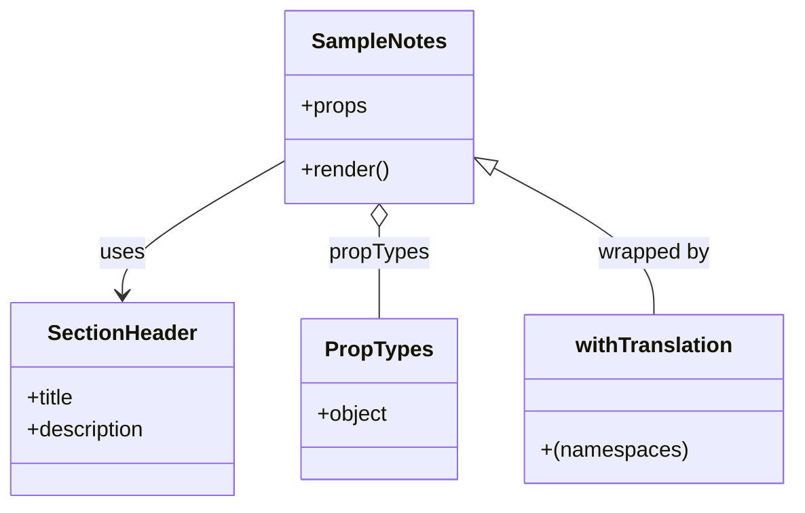

# Diagram: web/portal/src/modules/documentation/documentation-styled-components/SampleNotes.js


> Auto-generated by Obscura crawlers

## Diagram 1



### SVG

<svg id="container" width="589.3359375" xmlns="http://www.w3.org/2000/svg" class="classDiagram" height="378" viewBox="0 0 589.3359375 378" role="graphics-document document" aria-roledescription="class"><style>#container{font-family:"trebuchet ms",verdana,arial,sans-serif;font-size:16px;fill:#333;}@keyframes edge-animation-frame{from{stroke-dashoffset:0;}}@keyframes dash{to{stroke-dashoffset:0;}}#container .edge-animation-slow{stroke-dasharray:9,5!important;stroke-dashoffset:900;animation:dash 50s linear infinite;stroke-linecap:round;}#container .edge-animation-fast{stroke-dasharray:9,5!important;stroke-dashoffset:900;animation:dash 20s linear infinite;stroke-linecap:round;}#container .error-icon{fill:#552222;}#container .error-text{fill:#552222;stroke:#552222;}#container .edge-thickness-normal{stroke-width:1px;}#container .edge-thickness-thick{stroke-width:3.5px;}#container .edge-pattern-solid{stroke-dasharray:0;}#container .edge-thickness-invisible{stroke-width:0;fill:none;}#container .edge-pattern-dashed{stroke-dasharray:3;}#container .edge-pattern-dotted{stroke-dasharray:2;}#container .marker{fill:#333333;stroke:#333333;}#container .marker.cross{stroke:#333333;}#container svg{font-family:"trebuchet ms",verdana,arial,sans-serif;font-size:16px;}#container p{margin:0;}#container g.classGroup text{fill:#9370DB;stroke:none;font-family:"trebuchet ms",verdana,arial,sans-serif;font-size:10px;}#container g.classGroup text .title{font-weight:bolder;}#container .nodeLabel,#container .edgeLabel{color:#131300;}#container .edgeLabel .label rect{fill:#ECECFF;}#container .label text{fill:#131300;}#container .labelBkg{background:#ECECFF;}#container .edgeLabel .label span{background:#ECECFF;}#container .classTitle{font-weight:bolder;}#container .node rect,#container .node circle,#container .node ellipse,#container .node polygon,#container .node path{fill:#ECECFF;stroke:#9370DB;stroke-width:1px;}#container .divider{stroke:#9370DB;stroke-width:1;}#container g.clickable{cursor:pointer;}#container g.classGroup rect{fill:#ECECFF;stroke:#9370DB;}#container g.classGroup line{stroke:#9370DB;stroke-width:1;}#container .classLabel .box{stroke:none;stroke-width:0;fill:#ECECFF;opacity:0.5;}#container .classLabel .label{fill:#9370DB;font-size:10px;}#container .relation{stroke:#333333;stroke-width:1;fill:none;}#container .dashed-line{stroke-dasharray:3;}#container .dotted-line{stroke-dasharray:1 2;}#container #compositionStart,#container .composition{fill:#333333!important;stroke:#333333!important;stroke-width:1;}#container #compositionEnd,#container .composition{fill:#333333!important;stroke:#333333!important;stroke-width:1;}#container #dependencyStart,#container .dependency{fill:#333333!important;stroke:#333333!important;stroke-width:1;}#container #dependencyStart,#container .dependency{fill:#333333!important;stroke:#333333!important;stroke-width:1;}#container #extensionStart,#container .extension{fill:transparent!important;stroke:#333333!important;stroke-width:1;}#container #extensionEnd,#container .extension{fill:transparent!important;stroke:#333333!important;stroke-width:1;}#container #aggregationStart,#container .aggregation{fill:transparent!important;stroke:#333333!important;stroke-width:1;}#container #aggregationEnd,#container .aggregation{fill:transparent!important;stroke:#333333!important;stroke-width:1;}#container #lollipopStart,#container .lollipop{fill:#ECECFF!important;stroke:#333333!important;stroke-width:1;}#container #lollipopEnd,#container .lollipop{fill:#ECECFF!important;stroke:#333333!important;stroke-width:1;}#container .edgeTerminals{font-size:11px;line-height:initial;}#container .classTitleText{text-anchor:middle;font-size:18px;fill:#333;}#container .label-icon{display:inline-block;height:1em;overflow:visible;vertical-align:-0.125em;}#container .node .label-icon path{fill:currentColor;stroke:revert;stroke-width:revert;}#container :root{--mermaid-font-family:"trebuchet ms",verdana,arial,sans-serif;}</style><g><defs><marker id="container_class-aggregationStart" class="marker aggregation class" refX="18" refY="7" markerWidth="190" markerHeight="240" orient="auto"><path d="M 18,7 L9,13 L1,7 L9,1 Z"></path></marker></defs><defs><marker id="container_class-aggregationEnd" class="marker aggregation class" refX="1" refY="7" markerWidth="20" markerHeight="28" orient="auto"><path d="M 18,7 L9,13 L1,7 L9,1 Z"></path></marker></defs><defs><marker id="container_class-extensionStart" class="marker extension class" refX="18" refY="7" markerWidth="190" markerHeight="240" orient="auto"><path d="M 1,7 L18,13 V 1 Z"></path></marker></defs><defs><marker id="container_class-extensionEnd" class="marker extension class" refX="1" refY="7" markerWidth="20" markerHeight="28" orient="auto"><path d="M 1,1 V 13 L18,7 Z"></path></marker></defs><defs><marker id="container_class-compositionStart" class="marker composition class" refX="18" refY="7" markerWidth="190" markerHeight="240" orient="auto"><path d="M 18,7 L9,13 L1,7 L9,1 Z"></path></marker></defs><defs><marker id="container_class-compositionEnd" class="marker composition class" refX="1" refY="7" markerWidth="20" markerHeight="28" orient="auto"><path d="M 18,7 L9,13 L1,7 L9,1 Z"></path></marker></defs><defs><marker id="container_class-dependencyStart" class="marker dependency class" refX="6" refY="7" markerWidth="190" markerHeight="240" orient="auto"><path d="M 5,7 L9,13 L1,7 L9,1 Z"></path></marker></defs><defs><marker id="container_class-dependencyEnd" class="marker dependency class" refX="13" refY="7" markerWidth="20" markerHeight="28" orient="auto"><path d="M 18,7 L9,13 L14,7 L9,1 Z"></path></marker></defs><defs><marker id="container_class-lollipopStart" class="marker lollipop class" refX="13" refY="7" markerWidth="190" markerHeight="240" orient="auto"><circle stroke="black" fill="transparent" cx="7" cy="7" r="6"></circle></marker></defs><defs><marker id="container_class-lollipopEnd" class="marker lollipop class" refX="1" refY="7" markerWidth="190" markerHeight="240" orient="auto"><circle stroke="black" fill="transparent" cx="7" cy="7" r="6"></circle></marker></defs><g class="root"><g class="clusters"></g><g class="edgePaths"><path d="M214.855,119.448L194.423,131.04C173.991,142.632,133.126,165.816,112.694,182.575C92.262,199.333,92.262,209.667,92.262,214.833L92.262,220" id="id_SampleNotes_SectionHeader_1" class="edge-thickness-normal edge-pattern-solid relation" style=";;;" data-edge="true" data-et="edge" data-id="id_SampleNotes_SectionHeader_1" data-points="W3sieCI6MjE0Ljg1NTQ2ODc1LCJ5IjoxMTkuNDQ3Nzg3ODk4NTAzNTh9LHsieCI6OTIuMjYxNzE4NzUsInkiOjE4OX0seyJ4Ijo5Mi4yNjE3MTg3NSwieSI6MjI2fV0=" marker-end="url(#container_class-dependencyEnd)"></path><path d="M284.387,169.25L284.387,172.542C284.387,175.833,284.387,182.417,284.387,193.875C284.387,205.333,284.387,221.667,284.387,229.833L284.387,238" id="id_SampleNotes_PropTypes_2" class="edge-thickness-normal edge-pattern-solid relation" style=";;;" data-edge="true" data-et="edge" data-id="id_SampleNotes_PropTypes_2" data-points="W3sieCI6Mjg0LjM4NjcxODc1LCJ5IjoxNTJ9LHsieCI6Mjg0LjM4NjcxODc1LCJ5IjoxODl9LHsieCI6Mjg0LjM4NjcxODc1LCJ5IjoyMzh9XQ==" marker-start="url(#container_class-aggregationStart)"></path><path d="M369.106,125.623L388.72,136.186C408.335,146.749,447.564,167.874,467.178,186.104C486.793,204.333,486.793,219.667,486.793,227.333L486.793,235" id="id_SampleNotes_withTranslation_3" class="edge-thickness-normal edge-pattern-solid relation" style=";;;" data-edge="true" data-et="edge" data-id="id_SampleNotes_withTranslation_3" data-points="W3sieCI6MzUzLjkxNzk2ODc1LCJ5IjoxMTcuNDQ0MDMyNzMxMjAyNzN9LHsieCI6NDg2Ljc5Mjk2ODc1LCJ5IjoxODl9LHsieCI6NDg2Ljc5Mjk2ODc1LCJ5IjoyMzV9XQ==" marker-start="url(#container_class-extensionStart)"></path></g><g class="edgeLabels"><g class="edgeLabel" transform="translate(92.26171875, 189)"><g class="label" data-id="id_SampleNotes_SectionHeader_1" transform="translate(-16.4921875, -12)"><foreignObject width="32.984375" height="24"><div xmlns="http://www.w3.org/1999/xhtml" class="labelBkg" style="display: table-cell; white-space: nowrap; line-height: 1.5; max-width: 200px; text-align: center;"><span class="edgeLabel"><p>uses</p></span></div></foreignObject></g></g><g class="edgeLabel" transform="translate(284.38671875, 189)"><g class="label" data-id="id_SampleNotes_PropTypes_2" transform="translate(-37.625, -12)"><foreignObject width="75.25" height="24"><div xmlns="http://www.w3.org/1999/xhtml" class="labelBkg" style="display: table-cell; white-space: nowrap; line-height: 1.5; max-width: 200px; text-align: center;"><span class="edgeLabel"><p>propTypes</p></span></div></foreignObject></g></g><g class="edgeLabel" transform="translate(486.79296875, 189)"><g class="label" data-id="id_SampleNotes_withTranslation_3" transform="translate(-42.3203125, -12)"><foreignObject width="84.640625" height="24"><div xmlns="http://www.w3.org/1999/xhtml" class="labelBkg" style="display: table-cell; white-space: nowrap; line-height: 1.5; max-width: 200px; text-align: center;"><span class="edgeLabel"><p>wrapped by</p></span></div></foreignObject></g></g></g><g class="nodes"><g class="node default" id="classId-SampleNotes-0" transform="translate(284.38671875, 80)"><g class="basic label-container"><path d="M-69.53125 -72 L69.53125 -72 L69.53125 72 L-69.53125 72" stroke="none" stroke-width="0" fill="#ECECFF" style=""></path><path d="M-69.53125 -72 C-30.58629173742802 -72, 8.35866652514396 -72, 69.53125 -72 M-69.53125 -72 C-26.359605039135246 -72, 16.812039921729507 -72, 69.53125 -72 M69.53125 -72 C69.53125 -17.156624095719856, 69.53125 37.68675180856029, 69.53125 72 M69.53125 -72 C69.53125 -16.80721624325256, 69.53125 38.38556751349488, 69.53125 72 M69.53125 72 C18.177990280561986 72, -33.17526943887603 72, -69.53125 72 M69.53125 72 C20.085429640642147 72, -29.360390718715706 72, -69.53125 72 M-69.53125 72 C-69.53125 42.937006866063314, -69.53125 13.874013732126627, -69.53125 -72 M-69.53125 72 C-69.53125 28.051740327394505, -69.53125 -15.89651934521099, -69.53125 -72" stroke="#9370DB" stroke-width="1.3" fill="none" stroke-dasharray="0 0" style=""></path></g><g class="annotation-group text" transform="translate(0, -48)"></g><g class="label-group text" transform="translate(-48.453125, -48)"><g class="label" style="font-weight: bolder" transform="translate(0,-12)"><foreignObject width="96.90625" height="24"><div xmlns="http://www.w3.org/1999/xhtml" style="display: table-cell; white-space: nowrap; line-height: 1.5; max-width: 146px; text-align: center;"><span class="nodeLabel markdown-node-label" style=""><p>SampleNotes</p></span></div></foreignObject></g></g><g class="members-group text" transform="translate(-57.53125, 0)"><g class="label" style="" transform="translate(0,-12)"><foreignObject width="49.515625" height="24"><div xmlns="http://www.w3.org/1999/xhtml" style="display: table-cell; white-space: nowrap; line-height: 1.5; max-width: 107px; text-align: center;"><span class="nodeLabel markdown-node-label" style=""><p>+props</p></span></div></foreignObject></g></g><g class="methods-group text" transform="translate(-57.53125, 48)"><g class="label" style="" transform="translate(0,-12)"><foreignObject width="66.609375" height="24"><div xmlns="http://www.w3.org/1999/xhtml" style="display: table-cell; white-space: nowrap; line-height: 1.5; max-width: 124px; text-align: center;"><span class="nodeLabel markdown-node-label" style=""><p>+render()</p></span></div></foreignObject></g></g><g class="divider" style=""><path d="M-69.53125 -24 C-29.476314652362575 -24, 10.57862069527485 -24, 69.53125 -24 M-69.53125 -24 C-17.025359407545636 -24, 35.48053118490873 -24, 69.53125 -24" stroke="#9370DB" stroke-width="1.3" fill="none" stroke-dasharray="0 0" style=""></path></g><g class="divider" style=""><path d="M-69.53125 24 C-34.120453380360544 24, 1.2903432392789114 24, 69.53125 24 M-69.53125 24 C-28.374236300310386 24, 12.782777399379228 24, 69.53125 24" stroke="#9370DB" stroke-width="1.3" fill="none" stroke-dasharray="0 0" style=""></path></g></g><g class="node default" id="classId-SectionHeader-1" transform="translate(92.26171875, 298)"><g class="basic label-container"><path d="M-84.26171875 -72 L84.26171875 -72 L84.26171875 72 L-84.26171875 72" stroke="none" stroke-width="0" fill="#ECECFF" style=""></path><path d="M-84.26171875 -72 C-37.13093508820134 -72, 9.999848573597319 -72, 84.26171875 -72 M-84.26171875 -72 C-40.07436820609494 -72, 4.112982337810124 -72, 84.26171875 -72 M84.26171875 -72 C84.26171875 -14.827284013772378, 84.26171875 42.345431972455245, 84.26171875 72 M84.26171875 -72 C84.26171875 -26.73604573813266, 84.26171875 18.52790852373468, 84.26171875 72 M84.26171875 72 C23.815713448833556 72, -36.63029185233289 72, -84.26171875 72 M84.26171875 72 C33.351392307653526 72, -17.558934134692947 72, -84.26171875 72 M-84.26171875 72 C-84.26171875 25.47351276173743, -84.26171875 -21.052974476525137, -84.26171875 -72 M-84.26171875 72 C-84.26171875 21.240603053927856, -84.26171875 -29.518793892144288, -84.26171875 -72" stroke="#9370DB" stroke-width="1.3" fill="none" stroke-dasharray="0 0" style=""></path></g><g class="annotation-group text" transform="translate(0, -48)"></g><g class="label-group text" transform="translate(-53.9296875, -48)"><g class="label" style="font-weight: bolder" transform="translate(0,-12)"><foreignObject width="107.859375" height="24"><div xmlns="http://www.w3.org/1999/xhtml" style="display: table-cell; white-space: nowrap; line-height: 1.5; max-width: 158px; text-align: center;"><span class="nodeLabel markdown-node-label" style=""><p>SectionHeader</p></span></div></foreignObject></g></g><g class="members-group text" transform="translate(-72.26171875, 0)"><g class="label" style="" transform="translate(0,-12)"><foreignObject width="37.140625" height="24"><div xmlns="http://www.w3.org/1999/xhtml" style="display: table-cell; white-space: nowrap; line-height: 1.5; max-width: 95px; text-align: center;"><span class="nodeLabel markdown-node-label" style=""><p>+title</p></span></div></foreignObject></g><g class="label" style="" transform="translate(0,12)"><foreignObject width="90.59375" height="24"><div xmlns="http://www.w3.org/1999/xhtml" style="display: table-cell; white-space: nowrap; line-height: 1.5; max-width: 148px; text-align: center;"><span class="nodeLabel markdown-node-label" style=""><p>+description</p></span></div></foreignObject></g></g><g class="methods-group text" transform="translate(-72.26171875, 72)"></g><g class="divider" style=""><path d="M-84.26171875 -24 C-22.384074844012687 -24, 39.493569061974625 -24, 84.26171875 -24 M-84.26171875 -24 C-47.1322337667367 -24, -10.002748783473393 -24, 84.26171875 -24" stroke="#9370DB" stroke-width="1.3" fill="none" stroke-dasharray="0 0" style=""></path></g><g class="divider" style=""><path d="M-84.26171875 48 C-38.329413786093426 48, 7.602891177813149 48, 84.26171875 48 M-84.26171875 48 C-24.23346796211935 48, 35.7947828257613 48, 84.26171875 48" stroke="#9370DB" stroke-width="1.3" fill="none" stroke-dasharray="0 0" style=""></path></g></g><g class="node default" id="classId-withTranslation-2" transform="translate(486.79296875, 298)"><g class="basic label-container"><path d="M-94.54296875 -63 L94.54296875 -63 L94.54296875 63 L-94.54296875 63" stroke="none" stroke-width="0" fill="#ECECFF" style=""></path><path d="M-94.54296875 -63 C-56.19599964365961 -63, -17.849030537319223 -63, 94.54296875 -63 M-94.54296875 -63 C-24.90620046106575 -63, 44.7305678278685 -63, 94.54296875 -63 M94.54296875 -63 C94.54296875 -29.295064884012348, 94.54296875 4.4098702319753045, 94.54296875 63 M94.54296875 -63 C94.54296875 -30.37570826696269, 94.54296875 2.2485834660746207, 94.54296875 63 M94.54296875 63 C44.489626599580475 63, -5.563715550839049 63, -94.54296875 63 M94.54296875 63 C32.59761290079699 63, -29.347742948406022 63, -94.54296875 63 M-94.54296875 63 C-94.54296875 20.055024835772592, -94.54296875 -22.889950328454816, -94.54296875 -63 M-94.54296875 63 C-94.54296875 17.10251556069062, -94.54296875 -28.79496887861876, -94.54296875 -63" stroke="#9370DB" stroke-width="1.3" fill="none" stroke-dasharray="0 0" style=""></path></g><g class="annotation-group text" transform="translate(0, -39)"></g><g class="label-group text" transform="translate(-57.1796875, -39)"><g class="label" style="font-weight: bolder" transform="translate(0,-12)"><foreignObject width="114.359375" height="24"><div xmlns="http://www.w3.org/1999/xhtml" style="display: table-cell; white-space: nowrap; line-height: 1.5; max-width: 162px; text-align: center;"><span class="nodeLabel markdown-node-label" style=""><p>withTranslation</p></span></div></foreignObject></g></g><g class="members-group text" transform="translate(-82.54296875, 9)"></g><g class="methods-group text" transform="translate(-82.54296875, 39)"><g class="label" style="" transform="translate(0,-12)"><foreignObject width="107.90625" height="24"><div xmlns="http://www.w3.org/1999/xhtml" style="display: table-cell; white-space: nowrap; line-height: 1.5; max-width: 158px; text-align: center;"><span class="nodeLabel markdown-node-label" style=""><p>+(namespaces)</p></span></div></foreignObject></g></g><g class="divider" style=""><path d="M-94.54296875 -15 C-46.42399850918451 -15, 1.6949717316309858 -15, 94.54296875 -15 M-94.54296875 -15 C-44.80168732300859 -15, 4.939594103982813 -15, 94.54296875 -15" stroke="#9370DB" stroke-width="1.3" fill="none" stroke-dasharray="0 0" style=""></path></g><g class="divider" style=""><path d="M-94.54296875 9 C-30.21588976738316 9, 34.11118921523368 9, 94.54296875 9 M-94.54296875 9 C-49.687846751917625 9, -4.832724753835251 9, 94.54296875 9" stroke="#9370DB" stroke-width="1.3" fill="none" stroke-dasharray="0 0" style=""></path></g></g><g class="node default" id="classId-PropTypes-3" transform="translate(284.38671875, 298)"><g class="basic label-container"><path d="M-57.86328125 -60 L57.86328125 -60 L57.86328125 60 L-57.86328125 60" stroke="none" stroke-width="0" fill="#ECECFF" style=""></path><path d="M-57.86328125 -60 C-19.44584302766623 -60, 18.971595194667543 -60, 57.86328125 -60 M-57.86328125 -60 C-22.263111642644155 -60, 13.33705796471169 -60, 57.86328125 -60 M57.86328125 -60 C57.86328125 -20.068450902403974, 57.86328125 19.86309819519205, 57.86328125 60 M57.86328125 -60 C57.86328125 -30.279773344950456, 57.86328125 -0.5595466899009125, 57.86328125 60 M57.86328125 60 C18.583925467597766 60, -20.69543031480447 60, -57.86328125 60 M57.86328125 60 C28.43983507689752 60, -0.9836110962049602 60, -57.86328125 60 M-57.86328125 60 C-57.86328125 27.288635208711774, -57.86328125 -5.422729582576451, -57.86328125 -60 M-57.86328125 60 C-57.86328125 13.771651459232316, -57.86328125 -32.45669708153537, -57.86328125 -60" stroke="#9370DB" stroke-width="1.3" fill="none" stroke-dasharray="0 0" style=""></path></g><g class="annotation-group text" transform="translate(0, -36)"></g><g class="label-group text" transform="translate(-38.2578125, -36)"><g class="label" style="font-weight: bolder" transform="translate(0,-12)"><foreignObject width="76.515625" height="24"><div xmlns="http://www.w3.org/1999/xhtml" style="display: table-cell; white-space: nowrap; line-height: 1.5; max-width: 125px; text-align: center;"><span class="nodeLabel markdown-node-label" style=""><p>PropTypes</p></span></div></foreignObject></g></g><g class="members-group text" transform="translate(-45.86328125, 12)"><g class="label" style="" transform="translate(0,-12)"><foreignObject width="53.46875" height="24"><div xmlns="http://www.w3.org/1999/xhtml" style="display: table-cell; white-space: nowrap; line-height: 1.5; max-width: 111px; text-align: center;"><span class="nodeLabel markdown-node-label" style=""><p>+object</p></span></div></foreignObject></g></g><g class="methods-group text" transform="translate(-45.86328125, 60)"></g><g class="divider" style=""><path d="M-57.86328125 -12 C-30.6145339935545 -12, -3.365786737108998 -12, 57.86328125 -12 M-57.86328125 -12 C-27.62754700436841 -12, 2.608187241263181 -12, 57.86328125 -12" stroke="#9370DB" stroke-width="1.3" fill="none" stroke-dasharray="0 0" style=""></path></g><g class="divider" style=""><path d="M-57.86328125 36 C-32.403988786025735 36, -6.9446963220514775 36, 57.86328125 36 M-57.86328125 36 C-12.985066393633623 36, 31.893148462732754 36, 57.86328125 36" stroke="#9370DB" stroke-width="1.3" fill="none" stroke-dasharray="0 0" style=""></path></g></g></g></g></g></svg>

## Diagram 2

```mermaid
flowchart TD
    A[Props (t, notes)] --> B{notes present?}
    B -- No --> C[Return null]
    B -- Yes --> D[description = notes.description || ""]
    D --> E[Render <div id="notes">]
    E --> F[SectionHeader(title=t("documentation:Usage Notes"))]
    E --> G[SectionHeader(description=t(`documentation-remote:${description}`))]
    F --> H[Output DOM]
    G --> H
```

> SVG rendering failed for this diagram.
