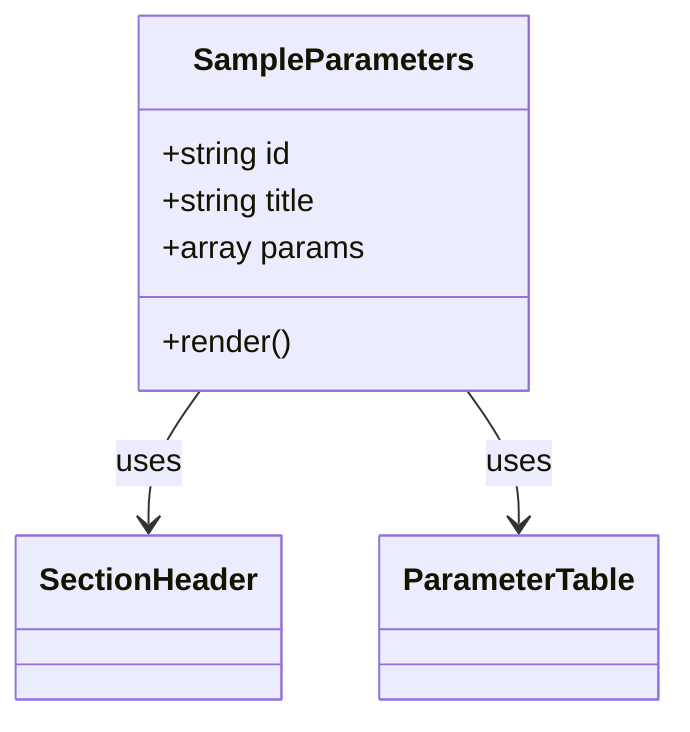

# Diagram: web/portal/src/modules/documentation/documentation-styled-components/SampleParameters.js


> Auto-generated by Obscura crawlers

## Diagram 1



### SVG

<svg id="container" width="337.171875" xmlns="http://www.w3.org/2000/svg" class="classDiagram" height="366" viewBox="0 0 337.171875 366" role="graphics-document document" aria-roledescription="class"><style>#container{font-family:"trebuchet ms",verdana,arial,sans-serif;font-size:16px;fill:#333;}@keyframes edge-animation-frame{from{stroke-dashoffset:0;}}@keyframes dash{to{stroke-dashoffset:0;}}#container .edge-animation-slow{stroke-dasharray:9,5!important;stroke-dashoffset:900;animation:dash 50s linear infinite;stroke-linecap:round;}#container .edge-animation-fast{stroke-dasharray:9,5!important;stroke-dashoffset:900;animation:dash 20s linear infinite;stroke-linecap:round;}#container .error-icon{fill:#552222;}#container .error-text{fill:#552222;stroke:#552222;}#container .edge-thickness-normal{stroke-width:1px;}#container .edge-thickness-thick{stroke-width:3.5px;}#container .edge-pattern-solid{stroke-dasharray:0;}#container .edge-thickness-invisible{stroke-width:0;fill:none;}#container .edge-pattern-dashed{stroke-dasharray:3;}#container .edge-pattern-dotted{stroke-dasharray:2;}#container .marker{fill:#333333;stroke:#333333;}#container .marker.cross{stroke:#333333;}#container svg{font-family:"trebuchet ms",verdana,arial,sans-serif;font-size:16px;}#container p{margin:0;}#container g.classGroup text{fill:#9370DB;stroke:none;font-family:"trebuchet ms",verdana,arial,sans-serif;font-size:10px;}#container g.classGroup text .title{font-weight:bolder;}#container .nodeLabel,#container .edgeLabel{color:#131300;}#container .edgeLabel .label rect{fill:#ECECFF;}#container .label text{fill:#131300;}#container .labelBkg{background:#ECECFF;}#container .edgeLabel .label span{background:#ECECFF;}#container .classTitle{font-weight:bolder;}#container .node rect,#container .node circle,#container .node ellipse,#container .node polygon,#container .node path{fill:#ECECFF;stroke:#9370DB;stroke-width:1px;}#container .divider{stroke:#9370DB;stroke-width:1;}#container g.clickable{cursor:pointer;}#container g.classGroup rect{fill:#ECECFF;stroke:#9370DB;}#container g.classGroup line{stroke:#9370DB;stroke-width:1;}#container .classLabel .box{stroke:none;stroke-width:0;fill:#ECECFF;opacity:0.5;}#container .classLabel .label{fill:#9370DB;font-size:10px;}#container .relation{stroke:#333333;stroke-width:1;fill:none;}#container .dashed-line{stroke-dasharray:3;}#container .dotted-line{stroke-dasharray:1 2;}#container #compositionStart,#container .composition{fill:#333333!important;stroke:#333333!important;stroke-width:1;}#container #compositionEnd,#container .composition{fill:#333333!important;stroke:#333333!important;stroke-width:1;}#container #dependencyStart,#container .dependency{fill:#333333!important;stroke:#333333!important;stroke-width:1;}#container #dependencyStart,#container .dependency{fill:#333333!important;stroke:#333333!important;stroke-width:1;}#container #extensionStart,#container .extension{fill:transparent!important;stroke:#333333!important;stroke-width:1;}#container #extensionEnd,#container .extension{fill:transparent!important;stroke:#333333!important;stroke-width:1;}#container #aggregationStart,#container .aggregation{fill:transparent!important;stroke:#333333!important;stroke-width:1;}#container #aggregationEnd,#container .aggregation{fill:transparent!important;stroke:#333333!important;stroke-width:1;}#container #lollipopStart,#container .lollipop{fill:#ECECFF!important;stroke:#333333!important;stroke-width:1;}#container #lollipopEnd,#container .lollipop{fill:#ECECFF!important;stroke:#333333!important;stroke-width:1;}#container .edgeTerminals{font-size:11px;line-height:initial;}#container .classTitleText{text-anchor:middle;font-size:18px;fill:#333;}#container .label-icon{display:inline-block;height:1em;overflow:visible;vertical-align:-0.125em;}#container .node .label-icon path{fill:currentColor;stroke:revert;stroke-width:revert;}#container :root{--mermaid-font-family:"trebuchet ms",verdana,arial,sans-serif;}</style><g><defs><marker id="container_class-aggregationStart" class="marker aggregation class" refX="18" refY="7" markerWidth="190" markerHeight="240" orient="auto"><path d="M 18,7 L9,13 L1,7 L9,1 Z"></path></marker></defs><defs><marker id="container_class-aggregationEnd" class="marker aggregation class" refX="1" refY="7" markerWidth="20" markerHeight="28" orient="auto"><path d="M 18,7 L9,13 L1,7 L9,1 Z"></path></marker></defs><defs><marker id="container_class-extensionStart" class="marker extension class" refX="18" refY="7" markerWidth="190" markerHeight="240" orient="auto"><path d="M 1,7 L18,13 V 1 Z"></path></marker></defs><defs><marker id="container_class-extensionEnd" class="marker extension class" refX="1" refY="7" markerWidth="20" markerHeight="28" orient="auto"><path d="M 1,1 V 13 L18,7 Z"></path></marker></defs><defs><marker id="container_class-compositionStart" class="marker composition class" refX="18" refY="7" markerWidth="190" markerHeight="240" orient="auto"><path d="M 18,7 L9,13 L1,7 L9,1 Z"></path></marker></defs><defs><marker id="container_class-compositionEnd" class="marker composition class" refX="1" refY="7" markerWidth="20" markerHeight="28" orient="auto"><path d="M 18,7 L9,13 L1,7 L9,1 Z"></path></marker></defs><defs><marker id="container_class-dependencyStart" class="marker dependency class" refX="6" refY="7" markerWidth="190" markerHeight="240" orient="auto"><path d="M 5,7 L9,13 L1,7 L9,1 Z"></path></marker></defs><defs><marker id="container_class-dependencyEnd" class="marker dependency class" refX="13" refY="7" markerWidth="20" markerHeight="28" orient="auto"><path d="M 18,7 L9,13 L14,7 L9,1 Z"></path></marker></defs><defs><marker id="container_class-lollipopStart" class="marker lollipop class" refX="13" refY="7" markerWidth="190" markerHeight="240" orient="auto"><circle stroke="black" fill="transparent" cx="7" cy="7" r="6"></circle></marker></defs><defs><marker id="container_class-lollipopEnd" class="marker lollipop class" refX="1" refY="7" markerWidth="190" markerHeight="240" orient="auto"><circle stroke="black" fill="transparent" cx="7" cy="7" r="6"></circle></marker></defs><g class="root"><g class="clusters"></g><g class="edgePaths"><path d="M99.744,200L95.442,206.167C91.139,212.333,82.535,224.667,78.232,236C73.93,247.333,73.93,257.667,73.93,262.833L73.93,268" id="id_SampleParameters_SectionHeader_1" class="edge-thickness-normal edge-pattern-solid relation" style=";;;" data-edge="true" data-et="edge" data-id="id_SampleParameters_SectionHeader_1" data-points="W3sieCI6OTkuNzQ0MjcyNzkxMzUzMzgsInkiOjIwMH0seyJ4Ijo3My45Mjk2ODc1LCJ5IjoyMzd9LHsieCI6NzMuOTI5Njg3NSwieSI6Mjc0fV0=" marker-end="url(#container_class-dependencyEnd)"></path><path d="M233.701,200L238.003,206.167C242.306,212.333,250.911,224.667,255.213,236C259.516,247.333,259.516,257.667,259.516,262.833L259.516,268" id="id_SampleParameters_ParameterTable_2" class="edge-thickness-normal edge-pattern-solid relation" style=";;;" data-edge="true" data-et="edge" data-id="id_SampleParameters_ParameterTable_2" data-points="W3sieCI6MjMzLjcwMTAzOTcwODY0NjYyLCJ5IjoyMDB9LHsieCI6MjU5LjUxNTYyNSwieSI6MjM3fSx7IngiOjI1OS41MTU2MjUsInkiOjI3NH1d" marker-end="url(#container_class-dependencyEnd)"></path></g><g class="edgeLabels"><g class="edgeLabel" transform="translate(73.9296875, 237)"><g class="label" data-id="id_SampleParameters_SectionHeader_1" transform="translate(-16.4921875, -12)"><foreignObject width="32.984375" height="24"><div xmlns="http://www.w3.org/1999/xhtml" class="labelBkg" style="display: table-cell; white-space: nowrap; line-height: 1.5; max-width: 200px; text-align: center;"><span class="edgeLabel"><p>uses</p></span></div></foreignObject></g></g><g class="edgeLabel" transform="translate(259.515625, 237)"><g class="label" data-id="id_SampleParameters_ParameterTable_2" transform="translate(-16.4921875, -12)"><foreignObject width="32.984375" height="24"><div xmlns="http://www.w3.org/1999/xhtml" class="labelBkg" style="display: table-cell; white-space: nowrap; line-height: 1.5; max-width: 200px; text-align: center;"><span class="edgeLabel"><p>uses</p></span></div></foreignObject></g></g></g><g class="nodes"><g class="node default" id="classId-SampleParameters-0" transform="translate(166.72265625, 104)"><g class="basic label-container"><path d="M-97.609375 -96 L97.609375 -96 L97.609375 96 L-97.609375 96" stroke="none" stroke-width="0" fill="#ECECFF" style=""></path><path d="M-97.609375 -96 C-45.76370735585622 -96, 6.081960288287561 -96, 97.609375 -96 M-97.609375 -96 C-27.98788619108994 -96, 41.63360261782012 -96, 97.609375 -96 M97.609375 -96 C97.609375 -57.09649405723219, 97.609375 -18.192988114464384, 97.609375 96 M97.609375 -96 C97.609375 -47.237936239797364, 97.609375 1.5241275204052727, 97.609375 96 M97.609375 96 C50.4523954564912 96, 3.2954159129824063 96, -97.609375 96 M97.609375 96 C54.650841840022096 96, 11.692308680044192 96, -97.609375 96 M-97.609375 96 C-97.609375 47.77064734111397, -97.609375 -0.4587053177720577, -97.609375 -96 M-97.609375 96 C-97.609375 36.6138346530322, -97.609375 -22.7723306939356, -97.609375 -96" stroke="#9370DB" stroke-width="1.3" fill="none" stroke-dasharray="0 0" style=""></path></g><g class="annotation-group text" transform="translate(0, -72)"></g><g class="label-group text" transform="translate(-68.84375, -72)"><g class="label" style="font-weight: bolder" transform="translate(0,-12)"><foreignObject width="137.6875" height="24"><div xmlns="http://www.w3.org/1999/xhtml" style="display: table-cell; white-space: nowrap; line-height: 1.5; max-width: 186px; text-align: center;"><span class="nodeLabel markdown-node-label" style=""><p>SampleParameters</p></span></div></foreignObject></g></g><g class="members-group text" transform="translate(-85.609375, -24)"><g class="label" style="" transform="translate(0,-12)"><foreignObject width="67.9375" height="24"><div xmlns="http://www.w3.org/1999/xhtml" style="display: table-cell; white-space: nowrap; line-height: 1.5; max-width: 125px; text-align: center;"><span class="nodeLabel markdown-node-label" style=""><p>+string id</p></span></div></foreignObject></g><g class="label" style="" transform="translate(0,12)"><foreignObject width="83.09375" height="24"><div xmlns="http://www.w3.org/1999/xhtml" style="display: table-cell; white-space: nowrap; line-height: 1.5; max-width: 140px; text-align: center;"><span class="nodeLabel markdown-node-label" style=""><p>+string title</p></span></div></foreignObject></g><g class="label" style="" transform="translate(0,36)"><foreignObject width="102.375" height="24"><div xmlns="http://www.w3.org/1999/xhtml" style="display: table-cell; white-space: nowrap; line-height: 1.5; max-width: 160px; text-align: center;"><span class="nodeLabel markdown-node-label" style=""><p>+array params</p></span></div></foreignObject></g></g><g class="methods-group text" transform="translate(-85.609375, 72)"><g class="label" style="" transform="translate(0,-12)"><foreignObject width="66.609375" height="24"><div xmlns="http://www.w3.org/1999/xhtml" style="display: table-cell; white-space: nowrap; line-height: 1.5; max-width: 124px; text-align: center;"><span class="nodeLabel markdown-node-label" style=""><p>+render()</p></span></div></foreignObject></g></g><g class="divider" style=""><path d="M-97.609375 -48 C-30.664561712415377 -48, 36.280251575169245 -48, 97.609375 -48 M-97.609375 -48 C-39.35436977228656 -48, 18.90063545542688 -48, 97.609375 -48" stroke="#9370DB" stroke-width="1.3" fill="none" stroke-dasharray="0 0" style=""></path></g><g class="divider" style=""><path d="M-97.609375 48 C-38.84071476850641 48, 19.927945462987182 48, 97.609375 48 M-97.609375 48 C-49.78140021514357 48, -1.9534254302871403 48, 97.609375 48" stroke="#9370DB" stroke-width="1.3" fill="none" stroke-dasharray="0 0" style=""></path></g></g><g class="node default" id="classId-SectionHeader-1" transform="translate(73.9296875, 316)"><g class="basic label-container"><path d="M-65.9296875 -42 L65.9296875 -42 L65.9296875 42 L-65.9296875 42" stroke="none" stroke-width="0" fill="#ECECFF" style=""></path><path d="M-65.9296875 -42 C-34.12423626138502 -42, -2.3187850227700437 -42, 65.9296875 -42 M-65.9296875 -42 C-31.943164205533094 -42, 2.043359088933812 -42, 65.9296875 -42 M65.9296875 -42 C65.9296875 -10.113934365557206, 65.9296875 21.772131268885587, 65.9296875 42 M65.9296875 -42 C65.9296875 -8.447606209836835, 65.9296875 25.10478758032633, 65.9296875 42 M65.9296875 42 C23.37227113181497 42, -19.18514523637006 42, -65.9296875 42 M65.9296875 42 C35.44148455128074 42, 4.953281602561468 42, -65.9296875 42 M-65.9296875 42 C-65.9296875 11.087559669522971, -65.9296875 -19.824880660954058, -65.9296875 -42 M-65.9296875 42 C-65.9296875 10.837790717662482, -65.9296875 -20.324418564675035, -65.9296875 -42" stroke="#9370DB" stroke-width="1.3" fill="none" stroke-dasharray="0 0" style=""></path></g><g class="annotation-group text" transform="translate(0, -18)"></g><g class="label-group text" transform="translate(-53.9296875, -18)"><g class="label" style="font-weight: bolder" transform="translate(0,-12)"><foreignObject width="107.859375" height="24"><div xmlns="http://www.w3.org/1999/xhtml" style="display: table-cell; white-space: nowrap; line-height: 1.5; max-width: 158px; text-align: center;"><span class="nodeLabel markdown-node-label" style=""><p>SectionHeader</p></span></div></foreignObject></g></g><g class="members-group text" transform="translate(-53.9296875, 30)"></g><g class="methods-group text" transform="translate(-53.9296875, 60)"></g><g class="divider" style=""><path d="M-65.9296875 6 C-28.0560810188736 6, 9.817525462252803 6, 65.9296875 6 M-65.9296875 6 C-31.727429088217193 6, 2.474829323565615 6, 65.9296875 6" stroke="#9370DB" stroke-width="1.3" fill="none" stroke-dasharray="0 0" style=""></path></g><g class="divider" style=""><path d="M-65.9296875 24 C-14.140116540231944 24, 37.64945441953611 24, 65.9296875 24 M-65.9296875 24 C-26.537670295893733 24, 12.854346908212534 24, 65.9296875 24" stroke="#9370DB" stroke-width="1.3" fill="none" stroke-dasharray="0 0" style=""></path></g></g><g class="node default" id="classId-ParameterTable-2" transform="translate(259.515625, 316)"><g class="basic label-container"><path d="M-69.65625 -42 L69.65625 -42 L69.65625 42 L-69.65625 42" stroke="none" stroke-width="0" fill="#ECECFF" style=""></path><path d="M-69.65625 -42 C-36.040342026010464 -42, -2.4244340520209278 -42, 69.65625 -42 M-69.65625 -42 C-35.535211440644346 -42, -1.4141728812886925 -42, 69.65625 -42 M69.65625 -42 C69.65625 -15.204715361044826, 69.65625 11.590569277910348, 69.65625 42 M69.65625 -42 C69.65625 -22.922571827488643, 69.65625 -3.845143654977285, 69.65625 42 M69.65625 42 C19.705011849642432 42, -30.246226300715136 42, -69.65625 42 M69.65625 42 C36.19148337094945 42, 2.7267167418988976 42, -69.65625 42 M-69.65625 42 C-69.65625 18.051576430913304, -69.65625 -5.896847138173392, -69.65625 -42 M-69.65625 42 C-69.65625 14.677844244643573, -69.65625 -12.644311510712853, -69.65625 -42" stroke="#9370DB" stroke-width="1.3" fill="none" stroke-dasharray="0 0" style=""></path></g><g class="annotation-group text" transform="translate(0, -18)"></g><g class="label-group text" transform="translate(-57.65625, -18)"><g class="label" style="font-weight: bolder" transform="translate(0,-12)"><foreignObject width="115.3125" height="24"><div xmlns="http://www.w3.org/1999/xhtml" style="display: table-cell; white-space: nowrap; line-height: 1.5; max-width: 163px; text-align: center;"><span class="nodeLabel markdown-node-label" style=""><p>ParameterTable</p></span></div></foreignObject></g></g><g class="members-group text" transform="translate(-57.65625, 30)"></g><g class="methods-group text" transform="translate(-57.65625, 60)"></g><g class="divider" style=""><path d="M-69.65625 6 C-34.21782154415574 6, 1.2206069116885203 6, 69.65625 6 M-69.65625 6 C-18.221407958713606 6, 33.21343408257279 6, 69.65625 6" stroke="#9370DB" stroke-width="1.3" fill="none" stroke-dasharray="0 0" style=""></path></g><g class="divider" style=""><path d="M-69.65625 24 C-25.62600959476144 24, 18.404230810477117 24, 69.65625 24 M-69.65625 24 C-21.100776054150913 24, 27.454697891698174 24, 69.65625 24" stroke="#9370DB" stroke-width="1.3" fill="none" stroke-dasharray="0 0" style=""></path></g></g></g></g></g></svg>

## Diagram 2

```mermaid
flowchart TD
    A[props.params] -->|empty or undefined| B[return null]
    A -->|has items| C[div id={id}]
    C --> D[SectionHeader(title)]
    C --> E[ParameterTable(params)]
    B --> F[No DOM rendered]
```

> SVG rendering failed for this diagram.
