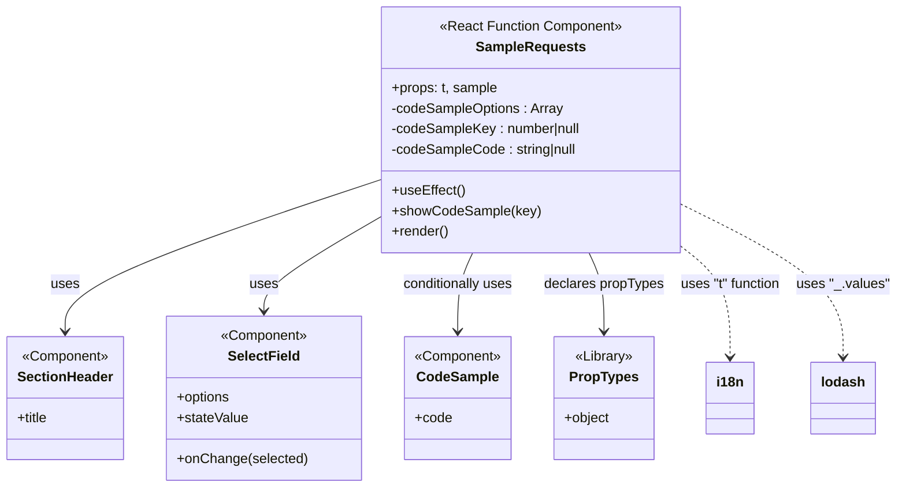

# Diagram: web/portal/src/modules/documentation/documentation-styled-components/SampleRequests.js


> Auto-generated by Obscura crawlers

## Diagram 1

```mermaid
flowchart LR
  Props[Props: t, sample] --> MapOptions[Map sample to codeSampleOptions\n(_.values & map)]
  MapOptions --> SampleRequests[Component: SampleRequests]
  SampleRequests -->|initializes| StateKey["state: codeSampleKey\\n(useState)"]
  SampleRequests -->|initializes| StateCode["state: codeSampleCode\\n(useState)"]
  SampleRequests --> UseEffect[useEffect\n(reset to first option when mounted)]
  UseEffect -->|sets| StateKey
  UseEffect -->|sets| StateCode
  SampleRequests --> SelectFieldComp[SelectField component]
  SelectFieldComp -->|onChange selected.value| ShowCodeSample[showCodeSample(key)]
  ShowCodeSample -->|calls| SetStateKey[setCodeSampleKey(key)]
  ShowCodeSample -->|calls| SetStateCode[setCodeSampleCode(codeSampleOptions[key].code)]
  SetStateKey --> StateKey
  SetStateCode --> StateCode
  StateCode -->|if present render| CodeSampleComp[CodeSample component]
  SampleRequests --> SectionHeaderComp[SectionHeader component]
  MapOptions -->|uses| i18n["t(...) translation"]
  MapOptions -->|uses| lodash[_.values]
```

> SVG rendering failed for this diagram.

## Diagram 2



### SVG

<svg id="container" width="1044.89453125" xmlns="http://www.w3.org/2000/svg" class="classDiagram" height="570" viewBox="0 0 1044.89453125 570" role="graphics-document document" aria-roledescription="class"><style>#container{font-family:"trebuchet ms",verdana,arial,sans-serif;font-size:16px;fill:#333;}@keyframes edge-animation-frame{from{stroke-dashoffset:0;}}@keyframes dash{to{stroke-dashoffset:0;}}#container .edge-animation-slow{stroke-dasharray:9,5!important;stroke-dashoffset:900;animation:dash 50s linear infinite;stroke-linecap:round;}#container .edge-animation-fast{stroke-dasharray:9,5!important;stroke-dashoffset:900;animation:dash 20s linear infinite;stroke-linecap:round;}#container .error-icon{fill:#552222;}#container .error-text{fill:#552222;stroke:#552222;}#container .edge-thickness-normal{stroke-width:1px;}#container .edge-thickness-thick{stroke-width:3.5px;}#container .edge-pattern-solid{stroke-dasharray:0;}#container .edge-thickness-invisible{stroke-width:0;fill:none;}#container .edge-pattern-dashed{stroke-dasharray:3;}#container .edge-pattern-dotted{stroke-dasharray:2;}#container .marker{fill:#333333;stroke:#333333;}#container .marker.cross{stroke:#333333;}#container svg{font-family:"trebuchet ms",verdana,arial,sans-serif;font-size:16px;}#container p{margin:0;}#container g.classGroup text{fill:#9370DB;stroke:none;font-family:"trebuchet ms",verdana,arial,sans-serif;font-size:10px;}#container g.classGroup text .title{font-weight:bolder;}#container .nodeLabel,#container .edgeLabel{color:#131300;}#container .edgeLabel .label rect{fill:#ECECFF;}#container .label text{fill:#131300;}#container .labelBkg{background:#ECECFF;}#container .edgeLabel .label span{background:#ECECFF;}#container .classTitle{font-weight:bolder;}#container .node rect,#container .node circle,#container .node ellipse,#container .node polygon,#container .node path{fill:#ECECFF;stroke:#9370DB;stroke-width:1px;}#container .divider{stroke:#9370DB;stroke-width:1;}#container g.clickable{cursor:pointer;}#container g.classGroup rect{fill:#ECECFF;stroke:#9370DB;}#container g.classGroup line{stroke:#9370DB;stroke-width:1;}#container .classLabel .box{stroke:none;stroke-width:0;fill:#ECECFF;opacity:0.5;}#container .classLabel .label{fill:#9370DB;font-size:10px;}#container .relation{stroke:#333333;stroke-width:1;fill:none;}#container .dashed-line{stroke-dasharray:3;}#container .dotted-line{stroke-dasharray:1 2;}#container #compositionStart,#container .composition{fill:#333333!important;stroke:#333333!important;stroke-width:1;}#container #compositionEnd,#container .composition{fill:#333333!important;stroke:#333333!important;stroke-width:1;}#container #dependencyStart,#container .dependency{fill:#333333!important;stroke:#333333!important;stroke-width:1;}#container #dependencyStart,#container .dependency{fill:#333333!important;stroke:#333333!important;stroke-width:1;}#container #extensionStart,#container .extension{fill:transparent!important;stroke:#333333!important;stroke-width:1;}#container #extensionEnd,#container .extension{fill:transparent!important;stroke:#333333!important;stroke-width:1;}#container #aggregationStart,#container .aggregation{fill:transparent!important;stroke:#333333!important;stroke-width:1;}#container #aggregationEnd,#container .aggregation{fill:transparent!important;stroke:#333333!important;stroke-width:1;}#container #lollipopStart,#container .lollipop{fill:#ECECFF!important;stroke:#333333!important;stroke-width:1;}#container #lollipopEnd,#container .lollipop{fill:#ECECFF!important;stroke:#333333!important;stroke-width:1;}#container .edgeTerminals{font-size:11px;line-height:initial;}#container .classTitleText{text-anchor:middle;font-size:18px;fill:#333;}#container .label-icon{display:inline-block;height:1em;overflow:visible;vertical-align:-0.125em;}#container .node .label-icon path{fill:currentColor;stroke:revert;stroke-width:revert;}#container :root{--mermaid-font-family:"trebuchet ms",verdana,arial,sans-serif;}</style><g><defs><marker id="container_class-aggregationStart" class="marker aggregation class" refX="18" refY="7" markerWidth="190" markerHeight="240" orient="auto"><path d="M 18,7 L9,13 L1,7 L9,1 Z"></path></marker></defs><defs><marker id="container_class-aggregationEnd" class="marker aggregation class" refX="1" refY="7" markerWidth="20" markerHeight="28" orient="auto"><path d="M 18,7 L9,13 L1,7 L9,1 Z"></path></marker></defs><defs><marker id="container_class-extensionStart" class="marker extension class" refX="18" refY="7" markerWidth="190" markerHeight="240" orient="auto"><path d="M 1,7 L18,13 V 1 Z"></path></marker></defs><defs><marker id="container_class-extensionEnd" class="marker extension class" refX="1" refY="7" markerWidth="20" markerHeight="28" orient="auto"><path d="M 1,1 V 13 L18,7 Z"></path></marker></defs><defs><marker id="container_class-compositionStart" class="marker composition class" refX="18" refY="7" markerWidth="190" markerHeight="240" orient="auto"><path d="M 18,7 L9,13 L1,7 L9,1 Z"></path></marker></defs><defs><marker id="container_class-compositionEnd" class="marker composition class" refX="1" refY="7" markerWidth="20" markerHeight="28" orient="auto"><path d="M 18,7 L9,13 L1,7 L9,1 Z"></path></marker></defs><defs><marker id="container_class-dependencyStart" class="marker dependency class" refX="6" refY="7" markerWidth="190" markerHeight="240" orient="auto"><path d="M 5,7 L9,13 L1,7 L9,1 Z"></path></marker></defs><defs><marker id="container_class-dependencyEnd" class="marker dependency class" refX="13" refY="7" markerWidth="20" markerHeight="28" orient="auto"><path d="M 18,7 L9,13 L14,7 L9,1 Z"></path></marker></defs><defs><marker id="container_class-lollipopStart" class="marker lollipop class" refX="13" refY="7" markerWidth="190" markerHeight="240" orient="auto"><circle stroke="black" fill="transparent" cx="7" cy="7" r="6"></circle></marker></defs><defs><marker id="container_class-lollipopEnd" class="marker lollipop class" refX="1" refY="7" markerWidth="190" markerHeight="240" orient="auto"><circle stroke="black" fill="transparent" cx="7" cy="7" r="6"></circle></marker></defs><g class="root"><g class="clusters"></g><g class="edgePaths"><path d="M436.787,211.499L376.311,231.749C315.835,251.999,194.882,292.5,134.406,321.917C73.93,351.333,73.93,369.667,73.93,378.833L73.93,388" id="id_SampleRequests_SectionHeader_1" class="edge-thickness-normal edge-pattern-solid relation" style=";;;" data-edge="true" data-et="edge" data-id="id_SampleRequests_SectionHeader_1" data-points="W3sieCI6NDM2Ljc4NzEwOTM3NSwieSI6MjExLjQ5OTA1NTE0MTQzOTczfSx7IngiOjczLjkyOTY4NzUsInkiOjMzM30seyJ4Ijo3My45Mjk2ODc1LCJ5IjozOTR9XQ==" marker-end="url(#container_class-dependencyEnd)"></path><path d="M436.787,255.233L414.478,268.194C392.168,281.155,347.549,307.078,325.239,325.206C302.93,343.333,302.93,353.667,302.93,358.833L302.93,364" id="id_SampleRequests_SelectField_2" class="edge-thickness-normal edge-pattern-solid relation" style=";;;" data-edge="true" data-et="edge" data-id="id_SampleRequests_SelectField_2" data-points="W3sieCI6NDM2Ljc4NzEwOTM3NSwieSI6MjU1LjIzMzA3ODE4MTcxNTZ9LHsieCI6MzAyLjkyOTY4NzUsInkiOjMzM30seyJ4IjozMDIuOTI5Njg3NSwieSI6MzcwfV0=" marker-end="url(#container_class-dependencyEnd)"></path><path d="M546.498,296L543.587,302.167C540.676,308.333,534.854,320.667,531.942,336C529.031,351.333,529.031,369.667,529.031,378.833L529.031,388" id="id_SampleRequests_CodeSample_3" class="edge-thickness-normal edge-pattern-solid relation" style=";;;" data-edge="true" data-et="edge" data-id="id_SampleRequests_CodeSample_3" data-points="W3sieCI6NTQ2LjQ5ODM3MDU5NzM3NTcsInkiOjI5Nn0seyJ4Ijo1MjkuMDMxMjUsInkiOjMzM30seyJ4Ijo1MjkuMDMxMjUsInkiOjM5NH1d" marker-end="url(#container_class-dependencyEnd)"></path><path d="M682.459,296L685.37,302.167C688.281,308.333,694.103,320.667,697.015,336C699.926,351.333,699.926,369.667,699.926,378.833L699.926,388" id="id_SampleRequests_PropTypes_4" class="edge-thickness-normal edge-pattern-solid relation" style=";;;" data-edge="true" data-et="edge" data-id="id_SampleRequests_PropTypes_4" data-points="W3sieCI6NjgyLjQ1ODY2MDY1MjYyNDMsInkiOjI5Nn0seyJ4Ijo2OTkuOTI1NzgxMjUsInkiOjMzM30seyJ4Ijo2OTkuOTI1NzgxMjUsInkiOjM5NH1d" marker-end="url(#container_class-dependencyEnd)"></path><path d="M792.17,288.239L801.9,295.699C811.63,303.159,831.09,318.08,840.821,339.706C850.551,361.333,850.551,389.667,850.551,403.833L850.551,418" id="id_SampleRequests_i18n_5" class="edge-thickness-normal edge-pattern-dashed relation" style=";;;" data-edge="true" data-et="edge" data-id="id_SampleRequests_i18n_5" data-points="W3sieCI6NzkyLjE2OTkyMTg3NSwieSI6Mjg4LjIzODU1NTc5MTgwNzd9LHsieCI6ODUwLjU1MDc4MTI1LCJ5IjozMzN9LHsieCI6ODUwLjU1MDc4MTI1LCJ5Ijo0MjR9XQ==" marker-end="url(#container_class-dependencyEnd)"></path><path d="M792.17,239.066L824.121,254.722C856.073,270.377,919.976,301.689,951.927,331.511C983.879,361.333,983.879,389.667,983.879,403.833L983.879,418" id="id_SampleRequests_lodash_6" class="edge-thickness-normal edge-pattern-dashed relation" style=";;;" data-edge="true" data-et="edge" data-id="id_SampleRequests_lodash_6" data-points="W3sieCI6NzkyLjE2OTkyMTg3NSwieSI6MjM5LjA2NTgxMDgzMTUzMTI1fSx7IngiOjk4My44Nzg5MDYyNSwieSI6MzMzfSx7IngiOjk4My44Nzg5MDYyNSwieSI6NDI0fV0=" marker-end="url(#container_class-dependencyEnd)"></path></g><g class="edgeLabels"><g class="edgeLabel" transform="translate(73.9296875, 333)"><g class="label" data-id="id_SampleRequests_SectionHeader_1" transform="translate(-16.4921875, -12)"><foreignObject width="32.984375" height="24"><div xmlns="http://www.w3.org/1999/xhtml" class="labelBkg" style="display: table-cell; white-space: nowrap; line-height: 1.5; max-width: 200px; text-align: center;"><span class="edgeLabel"><p>uses</p></span></div></foreignObject></g></g><g class="edgeLabel" transform="translate(302.9296875, 333)"><g class="label" data-id="id_SampleRequests_SelectField_2" transform="translate(-16.4921875, -12)"><foreignObject width="32.984375" height="24"><div xmlns="http://www.w3.org/1999/xhtml" class="labelBkg" style="display: table-cell; white-space: nowrap; line-height: 1.5; max-width: 200px; text-align: center;"><span class="edgeLabel"><p>uses</p></span></div></foreignObject></g></g><g class="edgeLabel" transform="translate(529.03125, 333)"><g class="label" data-id="id_SampleRequests_CodeSample_3" transform="translate(-65.9921875, -12)"><foreignObject width="131.984375" height="24"><div xmlns="http://www.w3.org/1999/xhtml" class="labelBkg" style="display: table-cell; white-space: nowrap; line-height: 1.5; max-width: 200px; text-align: center;"><span class="edgeLabel"><p>conditionally uses</p></span></div></foreignObject></g></g><g class="edgeLabel" transform="translate(699.92578125, 333)"><g class="label" data-id="id_SampleRequests_PropTypes_4" transform="translate(-70.3125, -12)"><foreignObject width="140.625" height="24"><div xmlns="http://www.w3.org/1999/xhtml" class="labelBkg" style="display: table-cell; white-space: nowrap; line-height: 1.5; max-width: 200px; text-align: center;"><span class="edgeLabel"><p>declares propTypes</p></span></div></foreignObject></g></g><g class="edgeLabel" transform="translate(850.55078125, 333)"><g class="label" data-id="id_SampleRequests_i18n_5" transform="translate(-60.3125, -12)"><foreignObject width="120.625" height="24"><div xmlns="http://www.w3.org/1999/xhtml" class="labelBkg" style="display: table-cell; white-space: nowrap; line-height: 1.5; max-width: 200px; text-align: center;"><span class="edgeLabel"><p>uses "t" function</p></span></div></foreignObject></g></g><g class="edgeLabel" transform="translate(983.87890625, 333)"><g class="label" data-id="id_SampleRequests_lodash_6" transform="translate(-53.015625, -12)"><foreignObject width="106.03125" height="24"><div xmlns="http://www.w3.org/1999/xhtml" class="labelBkg" style="display: table-cell; white-space: nowrap; line-height: 1.5; max-width: 200px; text-align: center;"><span class="edgeLabel"><p>uses "_.values"</p></span></div></foreignObject></g></g></g><g class="nodes"><g class="node default" id="classId-SampleRequests-0" transform="translate(614.478515625, 152)"><g class="basic label-container"><path d="M-177.69140625 -144 L177.69140625 -144 L177.69140625 144 L-177.69140625 144" stroke="none" stroke-width="0" fill="#ECECFF" style=""></path><path d="M-177.69140625 -144 C-83.25041853968526 -144, 11.190569170629487 -144, 177.69140625 -144 M-177.69140625 -144 C-82.57393220350573 -144, 12.543541842988532 -144, 177.69140625 -144 M177.69140625 -144 C177.69140625 -58.933179903804614, 177.69140625 26.13364019239077, 177.69140625 144 M177.69140625 -144 C177.69140625 -56.69633581312269, 177.69140625 30.607328373754626, 177.69140625 144 M177.69140625 144 C89.98526905467108 144, 2.279131859342158 144, -177.69140625 144 M177.69140625 144 C41.449661227941675 144, -94.79208379411665 144, -177.69140625 144 M-177.69140625 144 C-177.69140625 76.34408966784638, -177.69140625 8.688179335692752, -177.69140625 -144 M-177.69140625 144 C-177.69140625 63.35619066703502, -177.69140625 -17.287618665929955, -177.69140625 -144" stroke="#9370DB" stroke-width="1.3" fill="none" stroke-dasharray="0 0" style=""></path></g><g class="annotation-group text" transform="translate(-106.6328125, -120)"><g class="label" style="" transform="translate(0,-12)"><foreignObject width="213.265625" height="24"><div xmlns="http://www.w3.org/1999/xhtml" style="display: table-cell; white-space: nowrap; line-height: 1.5; max-width: 263px; text-align: center;"><span class="nodeLabel markdown-node-label" style=""><p>«React Function Component»</p></span></div></foreignObject></g></g><g class="label-group text" transform="translate(-61.09375, -96)"><g class="label" style="font-weight: bolder" transform="translate(0,-12)"><foreignObject width="122.1875" height="24"><div xmlns="http://www.w3.org/1999/xhtml" style="display: table-cell; white-space: nowrap; line-height: 1.5; max-width: 170px; text-align: center;"><span class="nodeLabel markdown-node-label" style=""><p>SampleRequests</p></span></div></foreignObject></g></g><g class="members-group text" transform="translate(-165.69140625, -48)"><g class="label" style="" transform="translate(0,-12)"><foreignObject width="124.078125" height="24"><div xmlns="http://www.w3.org/1999/xhtml" style="display: table-cell; white-space: nowrap; line-height: 1.5; max-width: 181px; text-align: center;"><span class="nodeLabel markdown-node-label" style=""><p>+props: t, sample</p></span></div></foreignObject></g><g class="label" style="" transform="translate(0,12)"><foreignObject width="202.0625" height="24"><div xmlns="http://www.w3.org/1999/xhtml" style="display: table-cell; white-space: nowrap; line-height: 1.5; max-width: 260px; text-align: center;"><span class="nodeLabel markdown-node-label" style=""><p>-codeSampleOptions : Array</p></span></div></foreignObject></g><g class="label" style="" transform="translate(0,36)"><foreignObject width="224.75" height="24"><div xmlns="http://www.w3.org/1999/xhtml" style="display: table-cell; white-space: nowrap; line-height: 1.5; max-width: 282px; text-align: center;"><span class="nodeLabel markdown-node-label" style=""><p>-codeSampleKey : number|null</p></span></div></foreignObject></g><g class="label" style="" transform="translate(0,60)"><foreignObject width="220.125" height="24"><div xmlns="http://www.w3.org/1999/xhtml" style="display: table-cell; white-space: nowrap; line-height: 1.5; max-width: 278px; text-align: center;"><span class="nodeLabel markdown-node-label" style=""><p>-codeSampleCode : string|null</p></span></div></foreignObject></g></g><g class="methods-group text" transform="translate(-165.69140625, 72)"><g class="label" style="" transform="translate(0,-12)"><foreignObject width="84.8125" height="24"><div xmlns="http://www.w3.org/1999/xhtml" style="display: table-cell; white-space: nowrap; line-height: 1.5; max-width: 142px; text-align: center;"><span class="nodeLabel markdown-node-label" style=""><p>+useEffect()</p></span></div></foreignObject></g><g class="label" style="" transform="translate(0,12)"><foreignObject width="170.84375" height="24"><div xmlns="http://www.w3.org/1999/xhtml" style="display: table-cell; white-space: nowrap; line-height: 1.5; max-width: 228px; text-align: center;"><span class="nodeLabel markdown-node-label" style=""><p>+showCodeSample(key)</p></span></div></foreignObject></g><g class="label" style="" transform="translate(0,36)"><foreignObject width="66.609375" height="24"><div xmlns="http://www.w3.org/1999/xhtml" style="display: table-cell; white-space: nowrap; line-height: 1.5; max-width: 124px; text-align: center;"><span class="nodeLabel markdown-node-label" style=""><p>+render()</p></span></div></foreignObject></g></g><g class="divider" style=""><path d="M-177.69140625 -72 C-72.80977723102245 -72, 32.0718517879551 -72, 177.69140625 -72 M-177.69140625 -72 C-105.00180425857948 -72, -32.312202267158966 -72, 177.69140625 -72" stroke="#9370DB" stroke-width="1.3" fill="none" stroke-dasharray="0 0" style=""></path></g><g class="divider" style=""><path d="M-177.69140625 48 C-80.94959467416835 48, 15.792216901663295 48, 177.69140625 48 M-177.69140625 48 C-101.9435586245563 48, -26.195710999112606 48, 177.69140625 48" stroke="#9370DB" stroke-width="1.3" fill="none" stroke-dasharray="0 0" style=""></path></g></g><g class="node default" id="classId-SectionHeader-1" transform="translate(73.9296875, 466)"><g class="basic label-container"><path d="M-65.9296875 -72 L65.9296875 -72 L65.9296875 72 L-65.9296875 72" stroke="none" stroke-width="0" fill="#ECECFF" style=""></path><path d="M-65.9296875 -72 C-26.01172012937908 -72, 13.906247241241843 -72, 65.9296875 -72 M-65.9296875 -72 C-35.77408611645906 -72, -5.618484732918127 -72, 65.9296875 -72 M65.9296875 -72 C65.9296875 -33.82795558738265, 65.9296875 4.3440888252347065, 65.9296875 72 M65.9296875 -72 C65.9296875 -42.745925397182994, 65.9296875 -13.491850794365988, 65.9296875 72 M65.9296875 72 C23.263834725755224 72, -19.402018048489552 72, -65.9296875 72 M65.9296875 72 C35.04427622085183 72, 4.158864941703662 72, -65.9296875 72 M-65.9296875 72 C-65.9296875 20.569421384679508, -65.9296875 -30.861157230640984, -65.9296875 -72 M-65.9296875 72 C-65.9296875 29.30972050212599, -65.9296875 -13.380558995748018, -65.9296875 -72" stroke="#9370DB" stroke-width="1.3" fill="none" stroke-dasharray="0 0" style=""></path></g><g class="annotation-group text" transform="translate(-51.03125, -48)"><g class="label" style="" transform="translate(0,-12)"><foreignObject width="102.0625" height="24"><div xmlns="http://www.w3.org/1999/xhtml" style="display: table-cell; white-space: nowrap; line-height: 1.5; max-width: 152px; text-align: center;"><span class="nodeLabel markdown-node-label" style=""><p>«Component»</p></span></div></foreignObject></g></g><g class="label-group text" transform="translate(-53.9296875, -24)"><g class="label" style="font-weight: bolder" transform="translate(0,-12)"><foreignObject width="107.859375" height="24"><div xmlns="http://www.w3.org/1999/xhtml" style="display: table-cell; white-space: nowrap; line-height: 1.5; max-width: 158px; text-align: center;"><span class="nodeLabel markdown-node-label" style=""><p>SectionHeader</p></span></div></foreignObject></g></g><g class="members-group text" transform="translate(-53.9296875, 24)"><g class="label" style="" transform="translate(0,-12)"><foreignObject width="37.140625" height="24"><div xmlns="http://www.w3.org/1999/xhtml" style="display: table-cell; white-space: nowrap; line-height: 1.5; max-width: 95px; text-align: center;"><span class="nodeLabel markdown-node-label" style=""><p>+title</p></span></div></foreignObject></g></g><g class="methods-group text" transform="translate(-53.9296875, 72)"></g><g class="divider" style=""><path d="M-65.9296875 0 C-31.44072411536017 0, 3.0482392692796623 0, 65.9296875 0 M-65.9296875 0 C-17.475519623826592 0, 30.978648252346815 0, 65.9296875 0" stroke="#9370DB" stroke-width="1.3" fill="none" stroke-dasharray="0 0" style=""></path></g><g class="divider" style=""><path d="M-65.9296875 48 C-33.22482561260066 48, -0.5199637252013218 48, 65.9296875 48 M-65.9296875 48 C-37.60449627338707 48, -9.279305046774134 48, 65.9296875 48" stroke="#9370DB" stroke-width="1.3" fill="none" stroke-dasharray="0 0" style=""></path></g></g><g class="node default" id="classId-SelectField-2" transform="translate(302.9296875, 466)"><g class="basic label-container"><path d="M-113.0703125 -96 L113.0703125 -96 L113.0703125 96 L-113.0703125 96" stroke="none" stroke-width="0" fill="#ECECFF" style=""></path><path d="M-113.0703125 -96 C-45.24814733396447 -96, 22.574017832071064 -96, 113.0703125 -96 M-113.0703125 -96 C-59.49211251272197 -96, -5.9139125254439335 -96, 113.0703125 -96 M113.0703125 -96 C113.0703125 -51.041782087916275, 113.0703125 -6.083564175832549, 113.0703125 96 M113.0703125 -96 C113.0703125 -53.38725651174144, 113.0703125 -10.774513023482882, 113.0703125 96 M113.0703125 96 C64.60959273866803 96, 16.14887297733604 96, -113.0703125 96 M113.0703125 96 C39.020836056769014 96, -35.02864038646197 96, -113.0703125 96 M-113.0703125 96 C-113.0703125 50.39489085062595, -113.0703125 4.789781701251897, -113.0703125 -96 M-113.0703125 96 C-113.0703125 34.43492477764429, -113.0703125 -27.13015044471142, -113.0703125 -96" stroke="#9370DB" stroke-width="1.3" fill="none" stroke-dasharray="0 0" style=""></path></g><g class="annotation-group text" transform="translate(-51.03125, -72)"><g class="label" style="" transform="translate(0,-12)"><foreignObject width="102.0625" height="24"><div xmlns="http://www.w3.org/1999/xhtml" style="display: table-cell; white-space: nowrap; line-height: 1.5; max-width: 152px; text-align: center;"><span class="nodeLabel markdown-node-label" style=""><p>«Component»</p></span></div></foreignObject></g></g><g class="label-group text" transform="translate(-40.140625, -48)"><g class="label" style="font-weight: bolder" transform="translate(0,-12)"><foreignObject width="80.28125" height="24"><div xmlns="http://www.w3.org/1999/xhtml" style="display: table-cell; white-space: nowrap; line-height: 1.5; max-width: 129px; text-align: center;"><span class="nodeLabel markdown-node-label" style=""><p>SelectField</p></span></div></foreignObject></g></g><g class="members-group text" transform="translate(-101.0703125, 0)"><g class="label" style="" transform="translate(0,-12)"><foreignObject width="63.3125" height="24"><div xmlns="http://www.w3.org/1999/xhtml" style="display: table-cell; white-space: nowrap; line-height: 1.5; max-width: 121px; text-align: center;"><span class="nodeLabel markdown-node-label" style=""><p>+options</p></span></div></foreignObject></g><g class="label" style="" transform="translate(0,12)"><foreignObject width="83.609375" height="24"><div xmlns="http://www.w3.org/1999/xhtml" style="display: table-cell; white-space: nowrap; line-height: 1.5; max-width: 141px; text-align: center;"><span class="nodeLabel markdown-node-label" style=""><p>+stateValue</p></span></div></foreignObject></g></g><g class="methods-group text" transform="translate(-101.0703125, 72)"><g class="label" style="" transform="translate(0,-12)"><foreignObject width="151.109375" height="24"><div xmlns="http://www.w3.org/1999/xhtml" style="display: table-cell; white-space: nowrap; line-height: 1.5; max-width: 208px; text-align: center;"><span class="nodeLabel markdown-node-label" style=""><p>+onChange(selected)</p></span></div></foreignObject></g></g><g class="divider" style=""><path d="M-113.0703125 -24 C-40.206277594458 -24, 32.657757311084 -24, 113.0703125 -24 M-113.0703125 -24 C-25.461426147604413 -24, 62.14746020479117 -24, 113.0703125 -24" stroke="#9370DB" stroke-width="1.3" fill="none" stroke-dasharray="0 0" style=""></path></g><g class="divider" style=""><path d="M-113.0703125 48 C-24.38167686929762 48, 64.30695876140476 48, 113.0703125 48 M-113.0703125 48 C-24.61883016259506 48, 63.83265217480988 48, 113.0703125 48" stroke="#9370DB" stroke-width="1.3" fill="none" stroke-dasharray="0 0" style=""></path></g></g><g class="node default" id="classId-CodeSample-3" transform="translate(529.03125, 466)"><g class="basic label-container"><path d="M-63.03125 -72 L63.03125 -72 L63.03125 72 L-63.03125 72" stroke="none" stroke-width="0" fill="#ECECFF" style=""></path><path d="M-63.03125 -72 C-27.158266734079795 -72, 8.71471653184041 -72, 63.03125 -72 M-63.03125 -72 C-23.255804561232395 -72, 16.51964087753521 -72, 63.03125 -72 M63.03125 -72 C63.03125 -34.95570208885274, 63.03125 2.088595822294522, 63.03125 72 M63.03125 -72 C63.03125 -29.31765380922348, 63.03125 13.364692381553041, 63.03125 72 M63.03125 72 C32.94259030638527 72, 2.853930612770533 72, -63.03125 72 M63.03125 72 C26.23579187768302 72, -10.55966624463396 72, -63.03125 72 M-63.03125 72 C-63.03125 23.818511721516508, -63.03125 -24.362976556966984, -63.03125 -72 M-63.03125 72 C-63.03125 39.55489159545138, -63.03125 7.1097831909027605, -63.03125 -72" stroke="#9370DB" stroke-width="1.3" fill="none" stroke-dasharray="0 0" style=""></path></g><g class="annotation-group text" transform="translate(-51.03125, -48)"><g class="label" style="" transform="translate(0,-12)"><foreignObject width="102.0625" height="24"><div xmlns="http://www.w3.org/1999/xhtml" style="display: table-cell; white-space: nowrap; line-height: 1.5; max-width: 152px; text-align: center;"><span class="nodeLabel markdown-node-label" style=""><p>«Component»</p></span></div></foreignObject></g></g><g class="label-group text" transform="translate(-45.578125, -24)"><g class="label" style="font-weight: bolder" transform="translate(0,-12)"><foreignObject width="91.15625" height="24"><div xmlns="http://www.w3.org/1999/xhtml" style="display: table-cell; white-space: nowrap; line-height: 1.5; max-width: 140px; text-align: center;"><span class="nodeLabel markdown-node-label" style=""><p>CodeSample</p></span></div></foreignObject></g></g><g class="members-group text" transform="translate(-51.03125, 24)"><g class="label" style="" transform="translate(0,-12)"><foreignObject width="42.953125" height="24"><div xmlns="http://www.w3.org/1999/xhtml" style="display: table-cell; white-space: nowrap; line-height: 1.5; max-width: 100px; text-align: center;"><span class="nodeLabel markdown-node-label" style=""><p>+code</p></span></div></foreignObject></g></g><g class="methods-group text" transform="translate(-51.03125, 72)"></g><g class="divider" style=""><path d="M-63.03125 0 C-13.086350529307843 0, 36.85854894138431 0, 63.03125 0 M-63.03125 0 C-24.01289361939007 0, 15.00546276121986 0, 63.03125 0" stroke="#9370DB" stroke-width="1.3" fill="none" stroke-dasharray="0 0" style=""></path></g><g class="divider" style=""><path d="M-63.03125 48 C-35.91092482850864 48, -8.790599657017282 48, 63.03125 48 M-63.03125 48 C-33.09209964022112 48, -3.152949280442243 48, 63.03125 48" stroke="#9370DB" stroke-width="1.3" fill="none" stroke-dasharray="0 0" style=""></path></g></g><g class="node default" id="classId-PropTypes-4" transform="translate(699.92578125, 466)"><g class="basic label-container"><path d="M-57.86328125 -72 L57.86328125 -72 L57.86328125 72 L-57.86328125 72" stroke="none" stroke-width="0" fill="#ECECFF" style=""></path><path d="M-57.86328125 -72 C-14.384718195455712 -72, 29.093844859088577 -72, 57.86328125 -72 M-57.86328125 -72 C-23.54690847688645 -72, 10.769464296227099 -72, 57.86328125 -72 M57.86328125 -72 C57.86328125 -31.09829356525534, 57.86328125 9.803412869489321, 57.86328125 72 M57.86328125 -72 C57.86328125 -30.514338814708985, 57.86328125 10.97132237058203, 57.86328125 72 M57.86328125 72 C24.837320850015665 72, -8.18863954996867 72, -57.86328125 72 M57.86328125 72 C14.906716690587366 72, -28.049847868825267 72, -57.86328125 72 M-57.86328125 72 C-57.86328125 30.46865192059137, -57.86328125 -11.06269615881726, -57.86328125 -72 M-57.86328125 72 C-57.86328125 24.887852781824584, -57.86328125 -22.22429443635083, -57.86328125 -72" stroke="#9370DB" stroke-width="1.3" fill="none" stroke-dasharray="0 0" style=""></path></g><g class="annotation-group text" transform="translate(-34.3046875, -48)"><g class="label" style="" transform="translate(0,-12)"><foreignObject width="68.609375" height="24"><div xmlns="http://www.w3.org/1999/xhtml" style="display: table-cell; white-space: nowrap; line-height: 1.5; max-width: 119px; text-align: center;"><span class="nodeLabel markdown-node-label" style=""><p>«Library»</p></span></div></foreignObject></g></g><g class="label-group text" transform="translate(-38.2578125, -24)"><g class="label" style="font-weight: bolder" transform="translate(0,-12)"><foreignObject width="76.515625" height="24"><div xmlns="http://www.w3.org/1999/xhtml" style="display: table-cell; white-space: nowrap; line-height: 1.5; max-width: 125px; text-align: center;"><span class="nodeLabel markdown-node-label" style=""><p>PropTypes</p></span></div></foreignObject></g></g><g class="members-group text" transform="translate(-45.86328125, 24)"><g class="label" style="" transform="translate(0,-12)"><foreignObject width="53.46875" height="24"><div xmlns="http://www.w3.org/1999/xhtml" style="display: table-cell; white-space: nowrap; line-height: 1.5; max-width: 111px; text-align: center;"><span class="nodeLabel markdown-node-label" style=""><p>+object</p></span></div></foreignObject></g></g><g class="methods-group text" transform="translate(-45.86328125, 72)"></g><g class="divider" style=""><path d="M-57.86328125 0 C-25.641442821501798 0, 6.5803956069964045 0, 57.86328125 0 M-57.86328125 0 C-21.300848841225417 0, 15.261583567549167 0, 57.86328125 0" stroke="#9370DB" stroke-width="1.3" fill="none" stroke-dasharray="0 0" style=""></path></g><g class="divider" style=""><path d="M-57.86328125 48 C-30.967611086546103 48, -4.071940923092207 48, 57.86328125 48 M-57.86328125 48 C-28.206647363561128 48, 1.4499865228777438 48, 57.86328125 48" stroke="#9370DB" stroke-width="1.3" fill="none" stroke-dasharray="0 0" style=""></path></g></g><g class="node default" id="classId-i18n-5" transform="translate(850.55078125, 466)"><g class="basic label-container"><path d="M-27.234375 -42 L27.234375 -42 L27.234375 42 L-27.234375 42" stroke="none" stroke-width="0" fill="#ECECFF" style=""></path><path d="M-27.234375 -42 C-8.161224296010204 -42, 10.911926407979593 -42, 27.234375 -42 M-27.234375 -42 C-7.288175949864925 -42, 12.65802310027015 -42, 27.234375 -42 M27.234375 -42 C27.234375 -24.42817906619497, 27.234375 -6.856358132389943, 27.234375 42 M27.234375 -42 C27.234375 -8.699542844617937, 27.234375 24.600914310764125, 27.234375 42 M27.234375 42 C8.248275531027424 42, -10.737823937945151 42, -27.234375 42 M27.234375 42 C6.798560902086383 42, -13.637253195827235 42, -27.234375 42 M-27.234375 42 C-27.234375 20.552050980679056, -27.234375 -0.8958980386418887, -27.234375 -42 M-27.234375 42 C-27.234375 21.319801332591304, -27.234375 0.6396026651826077, -27.234375 -42" stroke="#9370DB" stroke-width="1.3" fill="none" stroke-dasharray="0 0" style=""></path></g><g class="annotation-group text" transform="translate(0, -18)"></g><g class="label-group text" transform="translate(-15.234375, -18)"><g class="label" style="font-weight: bolder" transform="translate(0,-12)"><foreignObject width="30.46875" height="24"><div xmlns="http://www.w3.org/1999/xhtml" style="display: table-cell; white-space: nowrap; line-height: 1.5; max-width: 80px; text-align: center;"><span class="nodeLabel markdown-node-label" style=""><p>i18n</p></span></div></foreignObject></g></g><g class="members-group text" transform="translate(-15.234375, 30)"></g><g class="methods-group text" transform="translate(-15.234375, 60)"></g><g class="divider" style=""><path d="M-27.234375 6 C-14.848295219321493 6, -2.4622154386429855 6, 27.234375 6 M-27.234375 6 C-9.941123000452357 6, 7.352128999095285 6, 27.234375 6" stroke="#9370DB" stroke-width="1.3" fill="none" stroke-dasharray="0 0" style=""></path></g><g class="divider" style=""><path d="M-27.234375 24 C-5.721238751271255 24, 15.79189749745749 24, 27.234375 24 M-27.234375 24 C-9.041117107044421 24, 9.152140785911158 24, 27.234375 24" stroke="#9370DB" stroke-width="1.3" fill="none" stroke-dasharray="0 0" style=""></path></g></g><g class="node default" id="classId-lodash-6" transform="translate(983.87890625, 466)"><g class="basic label-container"><path d="M-36.59375 -42 L36.59375 -42 L36.59375 42 L-36.59375 42" stroke="none" stroke-width="0" fill="#ECECFF" style=""></path><path d="M-36.59375 -42 C-10.376673895124384 -42, 15.840402209751232 -42, 36.59375 -42 M-36.59375 -42 C-8.088270963819244 -42, 20.41720807236151 -42, 36.59375 -42 M36.59375 -42 C36.59375 -15.749583938146486, 36.59375 10.500832123707028, 36.59375 42 M36.59375 -42 C36.59375 -19.23866022690643, 36.59375 3.522679546187142, 36.59375 42 M36.59375 42 C14.948670980776381 42, -6.696408038447238 42, -36.59375 42 M36.59375 42 C16.329982923621117 42, -3.9337841527577666 42, -36.59375 42 M-36.59375 42 C-36.59375 16.176259570461003, -36.59375 -9.647480859077994, -36.59375 -42 M-36.59375 42 C-36.59375 17.731163238934315, -36.59375 -6.537673522131371, -36.59375 -42" stroke="#9370DB" stroke-width="1.3" fill="none" stroke-dasharray="0 0" style=""></path></g><g class="annotation-group text" transform="translate(0, -18)"></g><g class="label-group text" transform="translate(-24.59375, -18)"><g class="label" style="font-weight: bolder" transform="translate(0,-12)"><foreignObject width="49.1875" height="24"><div xmlns="http://www.w3.org/1999/xhtml" style="display: table-cell; white-space: nowrap; line-height: 1.5; max-width: 99px; text-align: center;"><span class="nodeLabel markdown-node-label" style=""><p>lodash</p></span></div></foreignObject></g></g><g class="members-group text" transform="translate(-24.59375, 30)"></g><g class="methods-group text" transform="translate(-24.59375, 60)"></g><g class="divider" style=""><path d="M-36.59375 6 C-20.55995905196803 6, -4.526168103936058 6, 36.59375 6 M-36.59375 6 C-13.162869786333431 6, 10.268010427333138 6, 36.59375 6" stroke="#9370DB" stroke-width="1.3" fill="none" stroke-dasharray="0 0" style=""></path></g><g class="divider" style=""><path d="M-36.59375 24 C-18.32231322087831 24, -0.050876441756621205 24, 36.59375 24 M-36.59375 24 C-18.091856025401203 24, 0.4100379491975943 24, 36.59375 24" stroke="#9370DB" stroke-width="1.3" fill="none" stroke-dasharray="0 0" style=""></path></g></g></g></g></g></svg>
