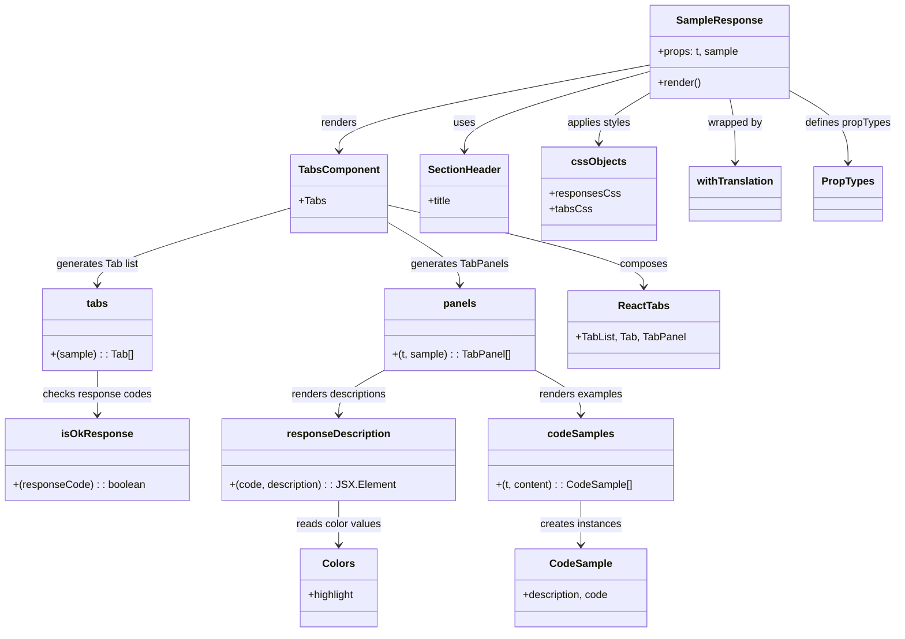

# Diagram: web/portal/src/modules/documentation/documentation-styled-components/SampleResponses.js

> Auto-generated by Obscura crawlers

## Mermaid

### SVG

<svg id="container" width="1344.5546875" xmlns="http://www.w3.org/2000/svg" class="classDiagram" height="972" viewBox="0 0 1344.5546875 972" role="graphics-document document" aria-roledescription="class"><g><defs><marker id="container_class-aggregationStart" class="marker aggregation class" refX="18" refY="7" markerWidth="190" markerHeight="240" orient="auto"><path d="M 18,7 L9,13 L1,7 L9,1 Z"></path></marker></defs><defs><marker id="container_class-aggregationEnd" class="marker aggregation class" refX="1" refY="7" markerWidth="20" markerHeight="28" orient="auto"><path d="M 18,7 L9,13 L1,7 L9,1 Z"></path></marker></defs><defs><marker id="container_class-extensionStart" class="marker extension class" refX="18" refY="7" markerWidth="190" markerHeight="240" orient="auto"><path d="M 1,7 L18,13 V 1 Z"></path></marker></defs><defs><marker id="container_class-extensionEnd" class="marker extension class" refX="1" refY="7" markerWidth="20" markerHeight="28" orient="auto"><path d="M 1,1 V 13 L18,7 Z"></path></marker></defs><defs><marker id="container_class-compositionStart" class="marker composition class" refX="18" refY="7" markerWidth="190" markerHeight="240" orient="auto"><path d="M 18,7 L9,13 L1,7 L9,1 Z"></path></marker></defs><defs><marker id="container_class-compositionEnd" class="marker composition class" refX="1" refY="7" markerWidth="20" markerHeight="28" orient="auto"><path d="M 18,7 L9,13 L1,7 L9,1 Z"></path></marker></defs><defs><marker id="container_class-dependencyStart" class="marker dependency class" refX="6" refY="7" markerWidth="190" markerHeight="240" orient="auto"><path d="M 5,7 L9,13 L1,7 L9,1 Z"></path></marker></defs><defs><marker id="container_class-dependencyEnd" class="marker dependency class" refX="13" refY="7" markerWidth="20" markerHeight="28" orient="auto"><path d="M 18,7 L9,13 L14,7 L9,1 Z"></path></marker></defs><defs><marker id="container_class-lollipopStart" class="marker lollipop class" refX="13" refY="7" markerWidth="190" markerHeight="240" orient="auto"><circle stroke="black" fill="transparent" cx="7" cy="7" r="6"></circle></marker></defs><defs><marker id="container_class-lollipopEnd" class="marker lollipop class" refX="1" refY="7" markerWidth="190" markerHeight="240" orient="auto"><circle stroke="black" fill="transparent" cx="7" cy="7" r="6"></circle></marker></defs><g class="root"><g class="clusters"></g><g class="edgePaths"><path d="M973.414,110.101L927.375,123.251C881.336,136.401,789.258,162.7,743.219,183.017C697.18,203.333,697.18,217.667,697.18,224.833L697.18,232" id="id_SampleResponse_SectionHeader_1" class="edge-thickness-normal edge-pattern-solid relation" style=";;;" data-edge="true" data-et="edge" data-id="id_SampleResponse_SectionHeader_1" data-points="W3sieCI6OTczLjQxNDA2MjUsInkiOjExMC4xMDA5MzY1ODgzNjE3M30seyJ4Ijo2OTcuMTc5Njg3NSwieSI6MTg5fSx7IngiOjY5Ny4xNzk2ODc1LCJ5IjoyMzh9XQ==" marker-end="url(#container_class-dependencyEnd)"></path><path d="M973.414,100.204L896.219,115.003C819.023,129.803,664.633,159.401,587.438,181.367C510.242,203.333,510.242,217.667,510.242,224.833L510.242,232" id="id_SampleResponse_TabsComponent_2" class="edge-thickness-normal edge-pattern-solid relation" style=";;;" data-edge="true" data-et="edge" data-id="id_SampleResponse_TabsComponent_2" data-points="W3sieCI6OTczLjQxNDA2MjUsInkiOjEwMC4yMDM5OTAzNTM4OTY1N30seyJ4Ijo1MTAuMjQyMTg3NSwieSI6MTg5fSx7IngiOjUxMC4yNDIxODc1LCJ5IjoyMzh9XQ==" marker-end="url(#container_class-dependencyEnd)"></path><path d="M581.25,314.832L646.052,330.194C710.854,345.555,840.458,376.277,905.26,397.305C970.063,418.333,970.063,429.667,970.063,435.333L970.063,441" id="id_TabsComponent_ReactTabs_3" class="edge-thickness-normal edge-pattern-solid relation" style=";;;" data-edge="true" data-et="edge" data-id="id_TabsComponent_ReactTabs_3" data-points="W3sieCI6NTgxLjI1LCJ5IjozMTQuODMyMzM5Mzk4ODgyfSx7IngiOjk3MC4wNjI1LCJ5Ijo0MDd9LHsieCI6OTcwLjA2MjUsInkiOjQ0N31d" marker-end="url(#container_class-dependencyEnd)"></path><path d="M439.234,319.258L390.386,333.881C341.538,348.505,243.841,377.753,194.993,397.543C146.145,417.333,146.145,427.667,146.145,432.833L146.145,438" id="id_TabsComponent_tabs_4" class="edge-thickness-normal edge-pattern-solid relation" style=";;;" data-edge="true" data-et="edge" data-id="id_TabsComponent_tabs_4" data-points="W3sieCI6NDM5LjIzNDM3NSwieSI6MzE5LjI1NzYyNTMzNjYwOTF9LHsieCI6MTQ2LjE0NDUzMTI1LCJ5Ijo0MDd9LHsieCI6MTQ2LjE0NDUzMTI1LCJ5Ijo0NDR9XQ==" marker-end="url(#container_class-dependencyEnd)"></path><path d="M581.25,340.664L599.651,351.72C618.052,362.776,654.854,384.888,673.255,401.111C691.656,417.333,691.656,427.667,691.656,432.833L691.656,438" id="id_TabsComponent_panels_5" class="edge-thickness-normal edge-pattern-solid relation" style=";;;" data-edge="true" data-et="edge" data-id="id_TabsComponent_panels_5" data-points="W3sieCI6NTgxLjI1LCJ5IjozNDAuNjY0MDExMDI0NTAzN30seyJ4Ijo2OTEuNjU2MjUsInkiOjQwN30seyJ4Ijo2OTEuNjU2MjUsInkiOjQ0NH1d" marker-end="url(#container_class-dependencyEnd)"></path><path d="M146.145,570L146.145,576.167C146.145,582.333,146.145,594.667,146.145,606C146.145,617.333,146.145,627.667,146.145,632.833L146.145,638" id="id_tabs_isOkResponse_6" class="edge-thickness-normal edge-pattern-solid relation" style=";;;" data-edge="true" data-et="edge" data-id="id_tabs_isOkResponse_6" data-points="W3sieCI6MTQ2LjE0NDUzMTI1LCJ5Ijo1NzB9LHsieCI6MTQ2LjE0NDUzMTI1LCJ5Ijo2MDd9LHsieCI6MTQ2LjE0NDUzMTI1LCJ5Ijo2NDR9XQ==" marker-end="url(#container_class-dependencyEnd)"></path><path d="M576.914,569.809L565.59,576.008C554.267,582.206,531.62,594.603,520.296,605.968C508.973,617.333,508.973,627.667,508.973,632.833L508.973,638" id="id_panels_responseDescription_7" class="edge-thickness-normal edge-pattern-solid relation" style=";;;" data-edge="true" data-et="edge" data-id="id_panels_responseDescription_7" data-points="W3sieCI6NTc2LjkxNDA2MjUsInkiOjU2OS44MDkyNDU4MzU3Mzg5fSx7IngiOjUwOC45NzI2NTYyNSwieSI6NjA3fSx7IngiOjUwOC45NzI2NTYyNSwieSI6NjQ0fV0=" marker-end="url(#container_class-dependencyEnd)"></path><path d="M806.398,569.809L817.722,576.008C829.046,582.206,851.693,594.603,863.016,605.968C874.34,617.333,874.34,627.667,874.34,632.833L874.34,638" id="id_panels_codeSamples_8" class="edge-thickness-normal edge-pattern-solid relation" style=";;;" data-edge="true" data-et="edge" data-id="id_panels_codeSamples_8" data-points="W3sieCI6ODA2LjM5ODQzNzUsInkiOjU2OS44MDkyNDU4MzU3Mzg5fSx7IngiOjg3NC4zMzk4NDM3NSwieSI6NjA3fSx7IngiOjg3NC4zMzk4NDM3NSwieSI6NjQ0fV0=" marker-end="url(#container_class-dependencyEnd)"></path><path d="M874.34,770L874.34,776.167C874.34,782.333,874.34,794.667,874.34,806C874.34,817.333,874.34,827.667,874.34,832.833L874.34,838" id="id_codeSamples_CodeSample_9" class="edge-thickness-normal edge-pattern-solid relation" style=";;;" data-edge="true" data-et="edge" data-id="id_codeSamples_CodeSample_9" data-points="W3sieCI6ODc0LjMzOTg0Mzc1LCJ5Ijo3NzB9LHsieCI6ODc0LjMzOTg0Mzc1LCJ5Ijo4MDd9LHsieCI6ODc0LjMzOTg0Mzc1LCJ5Ijo4NDR9XQ==" marker-end="url(#container_class-dependencyEnd)"></path><path d="M508.973,770L508.973,776.167C508.973,782.333,508.973,794.667,508.973,806C508.973,817.333,508.973,827.667,508.973,832.833L508.973,838" id="id_responseDescription_Colors_10" class="edge-thickness-normal edge-pattern-solid relation" style=";;;" data-edge="true" data-et="edge" data-id="id_responseDescription_Colors_10" data-points="W3sieCI6NTA4Ljk3MjY1NjI1LCJ5Ijo3NzB9LHsieCI6NTA4Ljk3MjY1NjI1LCJ5Ijo4MDd9LHsieCI6NTA4Ljk3MjY1NjI1LCJ5Ijo4NDR9XQ==" marker-end="url(#container_class-dependencyEnd)"></path><path d="M973.414,143.32L960.743,150.933C948.072,158.547,922.729,173.773,910.058,186.553C897.387,199.333,897.387,209.667,897.387,214.833L897.387,220" id="id_SampleResponse_cssObjects_11" class="edge-thickness-normal edge-pattern-solid relation" style=";;;" data-edge="true" data-et="edge" data-id="id_SampleResponse_cssObjects_11" data-points="W3sieCI6OTczLjQxNDA2MjUsInkiOjE0My4zMjAwNzY2NTQ3NTIxN30seyJ4Ijo4OTcuMzg2NzE4NzUsInkiOjE4OX0seyJ4Ijo4OTcuMzg2NzE4NzUsInkiOjIyNn1d" marker-end="url(#container_class-dependencyEnd)"></path><path d="M1093.361,152L1094.608,158.167C1095.855,164.333,1098.35,176.667,1099.597,193C1100.844,209.333,1100.844,229.667,1100.844,239.833L1100.844,250" id="id_SampleResponse_withTranslation_12" class="edge-thickness-normal edge-pattern-solid relation" style=";;;" data-edge="true" data-et="edge" data-id="id_SampleResponse_withTranslation_12" data-points="W3sieCI6MTA5My4zNjEyNzQzNjkyNjYsInkiOjE1Mn0seyJ4IjoxMTAwLjg0Mzc1LCJ5IjoxODl9LHsieCI6MTEwMC44NDM3NSwieSI6MjU2fV0=" marker-end="url(#container_class-dependencyEnd)"></path><path d="M1184.188,139.991L1198.536,148.159C1212.885,156.327,1241.583,172.664,1255.932,190.999C1270.281,209.333,1270.281,229.667,1270.281,239.833L1270.281,250" id="id_SampleResponse_PropTypes_13" class="edge-thickness-normal edge-pattern-solid relation" style=";;;" data-edge="true" data-et="edge" data-id="id_SampleResponse_PropTypes_13" data-points="W3sieCI6MTE4NC4xODc1LCJ5IjoxMzkuOTkxMjQ4MjkxNDc4ODN9LHsieCI6MTI3MC4yODEyNSwieSI6MTg5fSx7IngiOjEyNzAuMjgxMjUsInkiOjI1Nn1d" marker-end="url(#container_class-dependencyEnd)"></path></g><g class="edgeLabels"><g class="edgeLabel" transform="translate(697.1796875, 189)"><g class="label" data-id="id_SampleResponse_SectionHeader_1" transform="translate(-16.4921875, -12)"><foreignObject width="32.984375" height="24">

uses

</foreignObject></g></g><g class="edgeLabel" transform="translate(510.2421875, 189)"><g class="label" data-id="id_SampleResponse_TabsComponent_2" transform="translate(-27.75, -12)"><foreignObject width="55.5" height="24">

renders

</foreignObject></g></g><g class="edgeLabel" transform="translate(970.0625, 407)"><g class="label" data-id="id_TabsComponent_ReactTabs_3" transform="translate(-36.453125, -12)"><foreignObject width="72.90625" height="24">

composes

</foreignObject></g></g><g class="edgeLabel" transform="translate(146.14453125, 407)"><g class="label" data-id="id_TabsComponent_tabs_4" transform="translate(-63.7734375, -12)"><foreignObject width="127.546875" height="24">

generates Tab list

</foreignObject></g></g><g class="edgeLabel" transform="translate(691.65625, 407)"><g class="label" data-id="id_TabsComponent_panels_5" transform="translate(-74.1171875, -12)"><foreignObject width="148.234375" height="24">

generates TabPanels

</foreignObject></g></g><g class="edgeLabel" transform="translate(146.14453125, 607)"><g class="label" data-id="id_tabs_isOkResponse_6" transform="translate(-83.1015625, -12)"><foreignObject width="166.203125" height="24">

checks response codes

</foreignObject></g></g><g class="edgeLabel" transform="translate(508.97265625, 607)"><g class="label" data-id="id_panels_responseDescription_7" transform="translate(-74.90625, -12)"><foreignObject width="149.8125" height="24">

renders descriptions

</foreignObject></g></g><g class="edgeLabel" transform="translate(874.33984375, 607)"><g class="label" data-id="id_panels_codeSamples_8" transform="translate(-64.2734375, -12)"><foreignObject width="128.546875" height="24">

renders examples

</foreignObject></g></g><g class="edgeLabel" transform="translate(874.33984375, 807)"><g class="label" data-id="id_codeSamples_CodeSample_9" transform="translate(-62.6015625, -12)"><foreignObject width="125.203125" height="24">

creates instances

</foreignObject></g></g><g class="edgeLabel" transform="translate(508.97265625, 807)"><g class="label" data-id="id_responseDescription_Colors_10" transform="translate(-65.8203125, -12)"><foreignObject width="131.640625" height="24">

reads color values

</foreignObject></g></g><g class="edgeLabel" transform="translate(897.38671875, 189)"><g class="label" data-id="id_SampleResponse_cssObjects_11" transform="translate(-49.59375, -12)"><foreignObject width="99.1875" height="24">

applies styles

</foreignObject></g></g><g class="edgeLabel" transform="translate(1100.84375, 189)"><g class="label" data-id="id_SampleResponse_withTranslation_12" transform="translate(-42.3203125, -12)"><foreignObject width="84.640625" height="24">

wrapped by

</foreignObject></g></g><g class="edgeLabel" transform="translate(1270.28125, 189)"><g class="label" data-id="id_SampleResponse_PropTypes_13" transform="translate(-66.2734375, -12)"><foreignObject width="132.546875" height="24">

defines propTypes

</foreignObject></g></g></g><g class="nodes"><g class="node default" id="classId-SampleResponse-0" transform="translate(1078.80078125, 80)"><g class="basic label-container"><path d="M-105.38671875 -72 L105.38671875 -72 L105.38671875 72 L-105.38671875 72" stroke="none" stroke-width="0" fill="#ECECFF" style=""></path><path d="M-105.38671875 -72 C-36.72503141579614 -72, 31.936655918407723 -72, 105.38671875 -72 M-105.38671875 -72 C-22.02035164649105 -72, 61.3460154570179 -72, 105.38671875 -72 M105.38671875 -72 C105.38671875 -39.706818752237815, 105.38671875 -7.413637504475631, 105.38671875 72 M105.38671875 -72 C105.38671875 -31.624488701264298, 105.38671875 8.751022597471405, 105.38671875 72 M105.38671875 72 C42.79763777543997 72, -19.791443199120053 72, -105.38671875 72 M105.38671875 72 C62.424587683816185 72, 19.46245661763237 72, -105.38671875 72 M-105.38671875 72 C-105.38671875 22.850167572790852, -105.38671875 -26.299664854418296, -105.38671875 -72 M-105.38671875 72 C-105.38671875 19.527649369957352, -105.38671875 -32.944701260085296, -105.38671875 -72" stroke="#9370DB" stroke-width="1.3" fill="none" stroke-dasharray="0 0" style=""></path></g><g class="annotation-group text" transform="translate(0, -48)"></g><g class="label-group text" transform="translate(-62.6953125, -48)"><g class="label" style="font-weight: bolder" transform="translate(0,-12)"><foreignObject width="125.390625" height="24">

SampleResponse

</foreignObject></g></g><g class="members-group text" transform="translate(-93.38671875, 0)"><g class="label" style="" transform="translate(0,-12)"><foreignObject width="124.078125" height="24">

+props: t, sample

</foreignObject></g></g><g class="methods-group text" transform="translate(-93.38671875, 48)"><g class="label" style="" transform="translate(0,-12)"><foreignObject width="66.609375" height="24">

+render()

</foreignObject></g></g><g class="divider" style=""><path d="M-105.38671875 -24 C-24.16887085437328 -24, 57.04897704125344 -24, 105.38671875 -24 M-105.38671875 -24 C-23.896309661208875 -24, 57.59409942758225 -24, 105.38671875 -24" stroke="#9370DB" stroke-width="1.3" fill="none" stroke-dasharray="0 0" style=""></path></g><g class="divider" style=""><path d="M-105.38671875 24 C-56.033768170132966 24, -6.6808175902659315 24, 105.38671875 24 M-105.38671875 24 C-26.80179208965629 24, 51.78313457068742 24, 105.38671875 24" stroke="#9370DB" stroke-width="1.3" fill="none" stroke-dasharray="0 0" style=""></path></g></g><g class="node default" id="classId-TabsComponent-1" transform="translate(510.2421875, 298)"><g class="basic label-container"><path d="M-71.0078125 -60 L71.0078125 -60 L71.0078125 60 L-71.0078125 60" stroke="none" stroke-width="0" fill="#ECECFF" style=""></path><path d="M-71.0078125 -60 C-32.848037265370614 -60, 5.311737969258772 -60, 71.0078125 -60 M-71.0078125 -60 C-32.276735462674104 -60, 6.454341574651792 -60, 71.0078125 -60 M71.0078125 -60 C71.0078125 -15.29893020072582, 71.0078125 29.40213959854836, 71.0078125 60 M71.0078125 -60 C71.0078125 -35.55264709344982, 71.0078125 -11.105294186899641, 71.0078125 60 M71.0078125 60 C15.685290313488956 60, -39.63723187302209 60, -71.0078125 60 M71.0078125 60 C36.767162191253796 60, 2.5265118825075916 60, -71.0078125 60 M-71.0078125 60 C-71.0078125 31.376241514435918, -71.0078125 2.7524830288718363, -71.0078125 -60 M-71.0078125 60 C-71.0078125 30.950273827027985, -71.0078125 1.9005476540559698, -71.0078125 -60" stroke="#9370DB" stroke-width="1.3" fill="none" stroke-dasharray="0 0" style=""></path></g><g class="annotation-group text" transform="translate(0, -36)"></g><g class="label-group text" transform="translate(-59.0078125, -36)"><g class="label" style="font-weight: bolder" transform="translate(0,-12)"><foreignObject width="118.015625" height="24">

TabsComponent

</foreignObject></g></g><g class="members-group text" transform="translate(-59.0078125, 12)"><g class="label" style="" transform="translate(0,-12)"><foreignObject width="40.34375" height="24">

+Tabs

</foreignObject></g></g><g class="methods-group text" transform="translate(-59.0078125, 60)"></g><g class="divider" style=""><path d="M-71.0078125 -12 C-34.99929432424319 -12, 1.0092238515136245 -12, 71.0078125 -12 M-71.0078125 -12 C-18.714322536533096 -12, 33.57916742693381 -12, 71.0078125 -12" stroke="#9370DB" stroke-width="1.3" fill="none" stroke-dasharray="0 0" style=""></path></g><g class="divider" style=""><path d="M-71.0078125 36 C-34.03588485303731 36, 2.936042793925381 36, 71.0078125 36 M-71.0078125 36 C-39.17776143130931 36, -7.3477103626186135 36, 71.0078125 36" stroke="#9370DB" stroke-width="1.3" fill="none" stroke-dasharray="0 0" style=""></path></g></g><g class="node default" id="classId-SectionHeader-2" transform="translate(697.1796875, 298)"><g class="basic label-container"><path d="M-65.9296875 -60 L65.9296875 -60 L65.9296875 60 L-65.9296875 60" stroke="none" stroke-width="0" fill="#ECECFF" style=""></path><path d="M-65.9296875 -60 C-32.99679156901909 -60, -0.06389563803817566 -60, 65.9296875 -60 M-65.9296875 -60 C-28.53071778249093 -60, 8.868251935018137 -60, 65.9296875 -60 M65.9296875 -60 C65.9296875 -33.748858488592234, 65.9296875 -7.497716977184467, 65.9296875 60 M65.9296875 -60 C65.9296875 -30.250341882196956, 65.9296875 -0.5006837643939122, 65.9296875 60 M65.9296875 60 C29.12074055349533 60, -7.688206393009338 60, -65.9296875 60 M65.9296875 60 C18.114895907038786 60, -29.699895685922428 60, -65.9296875 60 M-65.9296875 60 C-65.9296875 15.604661248809933, -65.9296875 -28.790677502380134, -65.9296875 -60 M-65.9296875 60 C-65.9296875 21.996503715271658, -65.9296875 -16.006992569456685, -65.9296875 -60" stroke="#9370DB" stroke-width="1.3" fill="none" stroke-dasharray="0 0" style=""></path></g><g class="annotation-group text" transform="translate(0, -36)"></g><g class="label-group text" transform="translate(-53.9296875, -36)"><g class="label" style="font-weight: bolder" transform="translate(0,-12)"><foreignObject width="107.859375" height="24">

SectionHeader

</foreignObject></g></g><g class="members-group text" transform="translate(-53.9296875, 12)"><g class="label" style="" transform="translate(0,-12)"><foreignObject width="37.140625" height="24">

+title

</foreignObject></g></g><g class="methods-group text" transform="translate(-53.9296875, 60)"></g><g class="divider" style=""><path d="M-65.9296875 -12 C-13.247015709463753 -12, 39.435656081072494 -12, 65.9296875 -12 M-65.9296875 -12 C-19.067061444277478 -12, 27.795564611445045 -12, 65.9296875 -12" stroke="#9370DB" stroke-width="1.3" fill="none" stroke-dasharray="0 0" style=""></path></g><g class="divider" style=""><path d="M-65.9296875 36 C-13.906045108988835 36, 38.11759728202233 36, 65.9296875 36 M-65.9296875 36 C-29.366159633274513 36, 7.197368233450973 36, 65.9296875 36" stroke="#9370DB" stroke-width="1.3" fill="none" stroke-dasharray="0 0" style=""></path></g></g><g class="node default" id="classId-tabs-3" transform="translate(146.14453125, 507)"><g class="basic label-container"><path d="M-83.66015625 -63 L83.66015625 -63 L83.66015625 63 L-83.66015625 63" stroke="none" stroke-width="0" fill="#ECECFF" style=""></path><path d="M-83.66015625 -63 C-36.72010698573601 -63, 10.21994227852798 -63, 83.66015625 -63 M-83.66015625 -63 C-17.00203594120933 -63, 49.65608436758134 -63, 83.66015625 -63 M83.66015625 -63 C83.66015625 -19.07570225476745, 83.66015625 24.8485954904651, 83.66015625 63 M83.66015625 -63 C83.66015625 -27.618443513338484, 83.66015625 7.763112973323032, 83.66015625 63 M83.66015625 63 C38.0945425813659 63, -7.4710710872682 63, -83.66015625 63 M83.66015625 63 C43.68411453898738 63, 3.7080728279747603 63, -83.66015625 63 M-83.66015625 63 C-83.66015625 25.071179943629858, -83.66015625 -12.857640112740285, -83.66015625 -63 M-83.66015625 63 C-83.66015625 25.658530560708797, -83.66015625 -11.682938878582405, -83.66015625 -63" stroke="#9370DB" stroke-width="1.3" fill="none" stroke-dasharray="0 0" style=""></path></g><g class="annotation-group text" transform="translate(0, -39)"></g><g class="label-group text" transform="translate(-16.0234375, -39)"><g class="label" style="font-weight: bolder" transform="translate(0,-12)"><foreignObject width="32.046875" height="24">

tabs

</foreignObject></g></g><g class="members-group text" transform="translate(-71.66015625, 9)"></g><g class="methods-group text" transform="translate(-71.66015625, 39)"><g class="label" style="" transform="translate(0,-12)"><foreignObject width="127.296875" height="24">

+(sample) : : Tab[]

</foreignObject></g></g><g class="divider" style=""><path d="M-83.66015625 -15 C-27.12167886434927 -15, 29.41679852130146 -15, 83.66015625 -15 M-83.66015625 -15 C-33.042717794784856 -15, 17.574720660430287 -15, 83.66015625 -15" stroke="#9370DB" stroke-width="1.3" fill="none" stroke-dasharray="0 0" style=""></path></g><g class="divider" style=""><path d="M-83.66015625 9 C-38.76400511213296 9, 6.132146025734073 9, 83.66015625 9 M-83.66015625 9 C-35.931272833911166 9, 11.797610582177668 9, 83.66015625 9" stroke="#9370DB" stroke-width="1.3" fill="none" stroke-dasharray="0 0" style=""></path></g></g><g class="node default" id="classId-panels-4" transform="translate(691.65625, 507)"><g class="basic label-container"><path d="M-114.7421875 -63 L114.7421875 -63 L114.7421875 63 L-114.7421875 63" stroke="none" stroke-width="0" fill="#ECECFF" style=""></path><path d="M-114.7421875 -63 C-27.761902106696795 -63, 59.21838328660641 -63, 114.7421875 -63 M-114.7421875 -63 C-27.598015929538562 -63, 59.546155640922876 -63, 114.7421875 -63 M114.7421875 -63 C114.7421875 -19.015954855226063, 114.7421875 24.968090289547874, 114.7421875 63 M114.7421875 -63 C114.7421875 -22.190209707282953, 114.7421875 18.619580585434093, 114.7421875 63 M114.7421875 63 C26.433751573808493 63, -61.874684352383014 63, -114.7421875 63 M114.7421875 63 C58.62332213590343 63, 2.5044567718068578 63, -114.7421875 63 M-114.7421875 63 C-114.7421875 24.4179014280149, -114.7421875 -14.164197143970199, -114.7421875 -63 M-114.7421875 63 C-114.7421875 20.71416894691078, -114.7421875 -21.571662106178437, -114.7421875 -63" stroke="#9370DB" stroke-width="1.3" fill="none" stroke-dasharray="0 0" style=""></path></g><g class="annotation-group text" transform="translate(0, -39)"></g><g class="label-group text" transform="translate(-24.359375, -39)"><g class="label" style="font-weight: bolder" transform="translate(0,-12)"><foreignObject width="48.71875" height="24">

panels

</foreignObject></g></g><g class="members-group text" transform="translate(-102.7421875, 9)"></g><g class="methods-group text" transform="translate(-102.7421875, 39)"><g class="label" style="" transform="translate(0,-12)"><foreignObject width="181.125" height="24">

+(t, sample) : : TabPanel[]

</foreignObject></g></g><g class="divider" style=""><path d="M-114.7421875 -15 C-37.7379445170932 -15, 39.266298465813605 -15, 114.7421875 -15 M-114.7421875 -15 C-58.435887307133314 -15, -2.129587114266627 -15, 114.7421875 -15" stroke="#9370DB" stroke-width="1.3" fill="none" stroke-dasharray="0 0" style=""></path></g><g class="divider" style=""><path d="M-114.7421875 9 C-27.942069367174668 9, 58.858048765650665 9, 114.7421875 9 M-114.7421875 9 C-59.21583118194345 9, -3.6894748638869004 9, 114.7421875 9" stroke="#9370DB" stroke-width="1.3" fill="none" stroke-dasharray="0 0" style=""></path></g></g><g class="node default" id="classId-isOkResponse-5" transform="translate(146.14453125, 707)"><g class="basic label-container"><path d="M-138.14453125 -63 L138.14453125 -63 L138.14453125 63 L-138.14453125 63" stroke="none" stroke-width="0" fill="#ECECFF" style=""></path><path d="M-138.14453125 -63 C-78.92015125601728 -63, -19.695771262034555 -63, 138.14453125 -63 M-138.14453125 -63 C-36.484003212987304 -63, 65.17652482402539 -63, 138.14453125 -63 M138.14453125 -63 C138.14453125 -16.27347618499308, 138.14453125 30.45304763001384, 138.14453125 63 M138.14453125 -63 C138.14453125 -22.871868086570814, 138.14453125 17.256263826858373, 138.14453125 63 M138.14453125 63 C32.88636406270817 63, -72.37180312458366 63, -138.14453125 63 M138.14453125 63 C78.13284520618333 63, 18.121159162366666 63, -138.14453125 63 M-138.14453125 63 C-138.14453125 22.05016058771149, -138.14453125 -18.899678824577023, -138.14453125 -63 M-138.14453125 63 C-138.14453125 22.10729583836273, -138.14453125 -18.785408323274538, -138.14453125 -63" stroke="#9370DB" stroke-width="1.3" fill="none" stroke-dasharray="0 0" style=""></path></g><g class="annotation-group text" transform="translate(0, -39)"></g><g class="label-group text" transform="translate(-51.5078125, -39)"><g class="label" style="font-weight: bolder" transform="translate(0,-12)"><foreignObject width="103.015625" height="24">

isOkResponse

</foreignObject></g></g><g class="members-group text" transform="translate(-126.14453125, 9)"></g><g class="methods-group text" transform="translate(-126.14453125, 39)"><g class="label" style="" transform="translate(0,-12)"><foreignObject width="200.78125" height="24">

+(responseCode) : : boolean

</foreignObject></g></g><g class="divider" style=""><path d="M-138.14453125 -15 C-58.289096839715796 -15, 21.566337570568408 -15, 138.14453125 -15 M-138.14453125 -15 C-50.00212083371218 -15, 38.14028958257563 -15, 138.14453125 -15" stroke="#9370DB" stroke-width="1.3" fill="none" stroke-dasharray="0 0" style=""></path></g><g class="divider" style=""><path d="M-138.14453125 9 C-34.84803509192517 9, 68.44846106614966 9, 138.14453125 9 M-138.14453125 9 C-51.42567724033023 9, 35.29317676933954 9, 138.14453125 9" stroke="#9370DB" stroke-width="1.3" fill="none" stroke-dasharray="0 0" style=""></path></g></g><g class="node default" id="classId-responseDescription-6" transform="translate(508.97265625, 707)"><g class="basic label-container"><path d="M-174.68359375 -63 L174.68359375 -63 L174.68359375 63 L-174.68359375 63" stroke="none" stroke-width="0" fill="#ECECFF" style=""></path><path d="M-174.68359375 -63 C-100.24086095639582 -63, -25.79812816279164 -63, 174.68359375 -63 M-174.68359375 -63 C-80.70474000094318 -63, 13.274113748113649 -63, 174.68359375 -63 M174.68359375 -63 C174.68359375 -26.085866594272296, 174.68359375 10.828266811455407, 174.68359375 63 M174.68359375 -63 C174.68359375 -21.21216574745806, 174.68359375 20.575668505083883, 174.68359375 63 M174.68359375 63 C62.851196719694826 63, -48.98120031061035 63, -174.68359375 63 M174.68359375 63 C58.34321181980479 63, -57.997170110390414 63, -174.68359375 63 M-174.68359375 63 C-174.68359375 32.23237441274988, -174.68359375 1.464748825499747, -174.68359375 -63 M-174.68359375 63 C-174.68359375 24.24644808639171, -174.68359375 -14.507103827216582, -174.68359375 -63" stroke="#9370DB" stroke-width="1.3" fill="none" stroke-dasharray="0 0" style=""></path></g><g class="annotation-group text" transform="translate(0, -39)"></g><g class="label-group text" transform="translate(-75.7890625, -39)"><g class="label" style="font-weight: bolder" transform="translate(0,-12)"><foreignObject width="151.578125" height="24">

responseDescription

</foreignObject></g></g><g class="members-group text" transform="translate(-162.68359375, 9)"></g><g class="methods-group text" transform="translate(-162.68359375, 39)"><g class="label" style="" transform="translate(0,-12)"><foreignObject width="249.578125" height="24">

+(code, description) : : JSX.Element

</foreignObject></g></g><g class="divider" style=""><path d="M-174.68359375 -15 C-79.63020853421584 -15, 15.423176681568322 -15, 174.68359375 -15 M-174.68359375 -15 C-80.18381011322631 -15, 14.31597352354737 -15, 174.68359375 -15" stroke="#9370DB" stroke-width="1.3" fill="none" stroke-dasharray="0 0" style=""></path></g><g class="divider" style=""><path d="M-174.68359375 9 C-90.03495754323966 9, -5.3863213364793125 9, 174.68359375 9 M-174.68359375 9 C-104.11491057896629 9, -33.54622740793258 9, 174.68359375 9" stroke="#9370DB" stroke-width="1.3" fill="none" stroke-dasharray="0 0" style=""></path></g></g><g class="node default" id="classId-codeSamples-7" transform="translate(874.33984375, 707)"><g class="basic label-container"><path d="M-140.68359375 -63 L140.68359375 -63 L140.68359375 63 L-140.68359375 63" stroke="none" stroke-width="0" fill="#ECECFF" style=""></path><path d="M-140.68359375 -63 C-69.46486326658325 -63, 1.7538672168334983 -63, 140.68359375 -63 M-140.68359375 -63 C-63.87375583091553 -63, 12.936082088168945 -63, 140.68359375 -63 M140.68359375 -63 C140.68359375 -13.670753496984595, 140.68359375 35.65849300603081, 140.68359375 63 M140.68359375 -63 C140.68359375 -17.889230250166754, 140.68359375 27.22153949966649, 140.68359375 63 M140.68359375 63 C57.190760258272334 63, -26.30207323345533 63, -140.68359375 63 M140.68359375 63 C34.46087615200382 63, -71.76184144599236 63, -140.68359375 63 M-140.68359375 63 C-140.68359375 32.862241837472325, -140.68359375 2.7244836749446577, -140.68359375 -63 M-140.68359375 63 C-140.68359375 26.578716081213933, -140.68359375 -9.842567837572133, -140.68359375 -63" stroke="#9370DB" stroke-width="1.3" fill="none" stroke-dasharray="0 0" style=""></path></g><g class="annotation-group text" transform="translate(0, -39)"></g><g class="label-group text" transform="translate(-48.6796875, -39)"><g class="label" style="font-weight: bolder" transform="translate(0,-12)"><foreignObject width="97.359375" height="24">

codeSamples

</foreignObject></g></g><g class="members-group text" transform="translate(-128.68359375, 9)"></g><g class="methods-group text" transform="translate(-128.68359375, 39)"><g class="label" style="" transform="translate(0,-12)"><foreignObject width="208.6875" height="24">

+(t, content) : : CodeSample[]

</foreignObject></g></g><g class="divider" style=""><path d="M-140.68359375 -15 C-55.720940861013915 -15, 29.24171202797217 -15, 140.68359375 -15 M-140.68359375 -15 C-46.519265729150334 -15, 47.64506229169933 -15, 140.68359375 -15" stroke="#9370DB" stroke-width="1.3" fill="none" stroke-dasharray="0 0" style=""></path></g><g class="divider" style=""><path d="M-140.68359375 9 C-28.315153893856987 9, 84.05328596228603 9, 140.68359375 9 M-140.68359375 9 C-39.812385287400375 9, 61.05882317519925 9, 140.68359375 9" stroke="#9370DB" stroke-width="1.3" fill="none" stroke-dasharray="0 0" style=""></path></g></g><g class="node default" id="classId-CodeSample-8" transform="translate(874.33984375, 904)"><g class="basic label-container"><path d="M-101.609375 -60 L101.609375 -60 L101.609375 60 L-101.609375 60" stroke="none" stroke-width="0" fill="#ECECFF" style=""></path><path d="M-101.609375 -60 C-42.33937303281501 -60, 16.930628934369977 -60, 101.609375 -60 M-101.609375 -60 C-55.79533517897353 -60, -9.981295357947062 -60, 101.609375 -60 M101.609375 -60 C101.609375 -29.635939854678778, 101.609375 0.728120290642444, 101.609375 60 M101.609375 -60 C101.609375 -31.48186530732411, 101.609375 -2.9637306146482203, 101.609375 60 M101.609375 60 C22.841530927714956 60, -55.92631314457009 60, -101.609375 60 M101.609375 60 C41.6464670023648 60, -18.316440995270398 60, -101.609375 60 M-101.609375 60 C-101.609375 25.720107645715224, -101.609375 -8.559784708569552, -101.609375 -60 M-101.609375 60 C-101.609375 27.003806233469426, -101.609375 -5.992387533061148, -101.609375 -60" stroke="#9370DB" stroke-width="1.3" fill="none" stroke-dasharray="0 0" style=""></path></g><g class="annotation-group text" transform="translate(0, -36)"></g><g class="label-group text" transform="translate(-45.578125, -36)"><g class="label" style="font-weight: bolder" transform="translate(0,-12)"><foreignObject width="91.15625" height="24">

CodeSample

</foreignObject></g></g><g class="members-group text" transform="translate(-89.609375, 12)"><g class="label" style="" transform="translate(0,-12)"><foreignObject width="133.640625" height="24">

+description, code

</foreignObject></g></g><g class="methods-group text" transform="translate(-89.609375, 60)"></g><g class="divider" style=""><path d="M-101.609375 -12 C-57.21309511398015 -12, -12.816815227960305 -12, 101.609375 -12 M-101.609375 -12 C-42.076287558823374 -12, 17.456799882353252 -12, 101.609375 -12" stroke="#9370DB" stroke-width="1.3" fill="none" stroke-dasharray="0 0" style=""></path></g><g class="divider" style=""><path d="M-101.609375 36 C-29.70477266782035 36, 42.1998296643593 36, 101.609375 36 M-101.609375 36 C-21.736971569227677 36, 58.135431861544646 36, 101.609375 36" stroke="#9370DB" stroke-width="1.3" fill="none" stroke-dasharray="0 0" style=""></path></g></g><g class="node default" id="classId-Colors-9" transform="translate(508.97265625, 904)"><g class="basic label-container"><path d="M-59.67578125 -60 L59.67578125 -60 L59.67578125 60 L-59.67578125 60" stroke="none" stroke-width="0" fill="#ECECFF" style=""></path><path d="M-59.67578125 -60 C-33.998585808788704 -60, -8.321390367577415 -60, 59.67578125 -60 M-59.67578125 -60 C-33.95961098883717 -60, -8.24344072767434 -60, 59.67578125 -60 M59.67578125 -60 C59.67578125 -17.04190150881186, 59.67578125 25.916196982376277, 59.67578125 60 M59.67578125 -60 C59.67578125 -16.062410050789182, 59.67578125 27.875179898421635, 59.67578125 60 M59.67578125 60 C28.01360471577205 60, -3.648571818455899 60, -59.67578125 60 M59.67578125 60 C27.01900852649763 60, -5.637764197004742 60, -59.67578125 60 M-59.67578125 60 C-59.67578125 20.46277523025624, -59.67578125 -19.074449539487517, -59.67578125 -60 M-59.67578125 60 C-59.67578125 33.31200548395487, -59.67578125 6.62401096790974, -59.67578125 -60" stroke="#9370DB" stroke-width="1.3" fill="none" stroke-dasharray="0 0" style=""></path></g><g class="annotation-group text" transform="translate(0, -36)"></g><g class="label-group text" transform="translate(-23.1015625, -36)"><g class="label" style="font-weight: bolder" transform="translate(0,-12)"><foreignObject width="46.203125" height="24">

Colors

</foreignObject></g></g><g class="members-group text" transform="translate(-47.67578125, 12)"><g class="label" style="" transform="translate(0,-12)"><foreignObject width="72.25" height="24">

+highlight

</foreignObject></g></g><g class="methods-group text" transform="translate(-47.67578125, 60)"></g><g class="divider" style=""><path d="M-59.67578125 -12 C-27.758379944044577 -12, 4.159021361910845 -12, 59.67578125 -12 M-59.67578125 -12 C-32.794966254556726 -12, -5.914151259113446 -12, 59.67578125 -12" stroke="#9370DB" stroke-width="1.3" fill="none" stroke-dasharray="0 0" style=""></path></g><g class="divider" style=""><path d="M-59.67578125 36 C-33.331849354052444 36, -6.987917458104889 36, 59.67578125 36 M-59.67578125 36 C-20.30994464597164 36, 19.05589195805672 36, 59.67578125 36" stroke="#9370DB" stroke-width="1.3" fill="none" stroke-dasharray="0 0" style=""></path></g></g><g class="node default" id="classId-cssObjects-10" transform="translate(897.38671875, 298)"><g class="basic label-container"><path d="M-84.27734375 -72 L84.27734375 -72 L84.27734375 72 L-84.27734375 72" stroke="none" stroke-width="0" fill="#ECECFF" style=""></path><path d="M-84.27734375 -72 C-47.72139035538609 -72, -11.165436960772183 -72, 84.27734375 -72 M-84.27734375 -72 C-50.49482564718463 -72, -16.712307544369267 -72, 84.27734375 -72 M84.27734375 -72 C84.27734375 -41.63664003961402, 84.27734375 -11.273280079228051, 84.27734375 72 M84.27734375 -72 C84.27734375 -32.22752403914776, 84.27734375 7.544951921704481, 84.27734375 72 M84.27734375 72 C22.990728941906177 72, -38.295885866187646 72, -84.27734375 72 M84.27734375 72 C29.384846744846193 72, -25.507650260307614 72, -84.27734375 72 M-84.27734375 72 C-84.27734375 26.838368817406547, -84.27734375 -18.323262365186906, -84.27734375 -72 M-84.27734375 72 C-84.27734375 20.818327476587577, -84.27734375 -30.363345046824847, -84.27734375 -72" stroke="#9370DB" stroke-width="1.3" fill="none" stroke-dasharray="0 0" style=""></path></g><g class="annotation-group text" transform="translate(0, -48)"></g><g class="label-group text" transform="translate(-39.2578125, -48)"><g class="label" style="font-weight: bolder" transform="translate(0,-12)"><foreignObject width="78.515625" height="24">

cssObjects

</foreignObject></g></g><g class="members-group text" transform="translate(-72.27734375, 0)"><g class="label" style="" transform="translate(0,-12)"><foreignObject width="105.296875" height="24">

+responsesCss

</foreignObject></g><g class="label" style="" transform="translate(0,12)"><foreignObject width="62.796875" height="24">

+tabsCss

</foreignObject></g></g><g class="methods-group text" transform="translate(-72.27734375, 72)"></g><g class="divider" style=""><path d="M-84.27734375 -24 C-25.034142759107787 -24, 34.209058231784425 -24, 84.27734375 -24 M-84.27734375 -24 C-32.12130811797344 -24, 20.034727514053117 -24, 84.27734375 -24" stroke="#9370DB" stroke-width="1.3" fill="none" stroke-dasharray="0 0" style=""></path></g><g class="divider" style=""><path d="M-84.27734375 48 C-38.390845925073954 48, 7.495651899852092 48, 84.27734375 48 M-84.27734375 48 C-50.154218797506026 48, -16.03109384501205 48, 84.27734375 48" stroke="#9370DB" stroke-width="1.3" fill="none" stroke-dasharray="0 0" style=""></path></g></g><g class="node default" id="classId-ReactTabs-11" transform="translate(970.0625, 507)"><g class="basic label-container"><path d="M-113.6640625 -60 L113.6640625 -60 L113.6640625 60 L-113.6640625 60" stroke="none" stroke-width="0" fill="#ECECFF" style=""></path><path d="M-113.6640625 -60 C-53.01106538809531 -60, 7.641931723809378 -60, 113.6640625 -60 M-113.6640625 -60 C-38.39704390384591 -60, 36.869974692308176 -60, 113.6640625 -60 M113.6640625 -60 C113.6640625 -14.132427585991664, 113.6640625 31.735144828016672, 113.6640625 60 M113.6640625 -60 C113.6640625 -30.883743012212705, 113.6640625 -1.7674860244254091, 113.6640625 60 M113.6640625 60 C62.66672646513689 60, 11.66939043027378 60, -113.6640625 60 M113.6640625 60 C31.073089110746224 60, -51.51788427850755 60, -113.6640625 60 M-113.6640625 60 C-113.6640625 30.590186915673186, -113.6640625 1.1803738313463725, -113.6640625 -60 M-113.6640625 60 C-113.6640625 20.694652163496762, -113.6640625 -18.610695673006475, -113.6640625 -60" stroke="#9370DB" stroke-width="1.3" fill="none" stroke-dasharray="0 0" style=""></path></g><g class="annotation-group text" transform="translate(0, -36)"></g><g class="label-group text" transform="translate(-37.40625, -36)"><g class="label" style="font-weight: bolder" transform="translate(0,-12)"><foreignObject width="74.8125" height="24">

ReactTabs

</foreignObject></g></g><g class="members-group text" transform="translate(-101.6640625, 12)"><g class="label" style="" transform="translate(0,-12)"><foreignObject width="165.921875" height="24">

+TabList, Tab, TabPanel

</foreignObject></g></g><g class="methods-group text" transform="translate(-101.6640625, 60)"></g><g class="divider" style=""><path d="M-113.6640625 -12 C-62.75223834283112 -12, -11.84041418566224 -12, 113.6640625 -12 M-113.6640625 -12 C-49.0633329726993 -12, 15.5373965546014 -12, 113.6640625 -12" stroke="#9370DB" stroke-width="1.3" fill="none" stroke-dasharray="0 0" style=""></path></g><g class="divider" style=""><path d="M-113.6640625 36 C-65.19228783977894 36, -16.72051317955787 36, 113.6640625 36 M-113.6640625 36 C-48.80401266357944 36, 16.056037172841116 36, 113.6640625 36" stroke="#9370DB" stroke-width="1.3" fill="none" stroke-dasharray="0 0" style=""></path></g></g><g class="node default" id="classId-withTranslation-12" transform="translate(1100.84375, 298)"><g class="basic label-container"><path d="M-69.1796875 -42 L69.1796875 -42 L69.1796875 42 L-69.1796875 42" stroke="none" stroke-width="0" fill="#ECECFF" style=""></path><path d="M-69.1796875 -42 C-38.42781077681509 -42, -7.675934053630186 -42, 69.1796875 -42 M-69.1796875 -42 C-33.32421899772268 -42, 2.531249504554637 -42, 69.1796875 -42 M69.1796875 -42 C69.1796875 -16.88987529211624, 69.1796875 8.220249415767519, 69.1796875 42 M69.1796875 -42 C69.1796875 -16.523067426284012, 69.1796875 8.953865147431976, 69.1796875 42 M69.1796875 42 C21.783131868954264 42, -25.61342376209147 42, -69.1796875 42 M69.1796875 42 C37.20653116464676 42, 5.233374829293524 42, -69.1796875 42 M-69.1796875 42 C-69.1796875 15.682491800004804, -69.1796875 -10.635016399990391, -69.1796875 -42 M-69.1796875 42 C-69.1796875 10.83620921360884, -69.1796875 -20.32758157278232, -69.1796875 -42" stroke="#9370DB" stroke-width="1.3" fill="none" stroke-dasharray="0 0" style=""></path></g><g class="annotation-group text" transform="translate(0, -18)"></g><g class="label-group text" transform="translate(-57.1796875, -18)"><g class="label" style="font-weight: bolder" transform="translate(0,-12)"><foreignObject width="114.359375" height="24">

withTranslation

</foreignObject></g></g><g class="members-group text" transform="translate(-57.1796875, 30)"></g><g class="methods-group text" transform="translate(-57.1796875, 60)"></g><g class="divider" style=""><path d="M-69.1796875 6 C-27.94976023149549 6, 13.280167037009022 6, 69.1796875 6 M-69.1796875 6 C-33.79110586062676 6, 1.5974757787464853 6, 69.1796875 6" stroke="#9370DB" stroke-width="1.3" fill="none" stroke-dasharray="0 0" style=""></path></g><g class="divider" style=""><path d="M-69.1796875 24 C-26.770745272610093 24, 15.638196954779815 24, 69.1796875 24 M-69.1796875 24 C-32.82960757987622 24, 3.520472340247565 24, 69.1796875 24" stroke="#9370DB" stroke-width="1.3" fill="none" stroke-dasharray="0 0" style=""></path></g></g><g class="node default" id="classId-PropTypes-13" transform="translate(1270.28125, 298)"><g class="basic label-container"><path d="M-50.2578125 -42 L50.2578125 -42 L50.2578125 42 L-50.2578125 42" stroke="none" stroke-width="0" fill="#ECECFF" style=""></path><path d="M-50.2578125 -42 C-29.881890242839898 -42, -9.505967985679796 -42, 50.2578125 -42 M-50.2578125 -42 C-17.494490326661953 -42, 15.268831846676093 -42, 50.2578125 -42 M50.2578125 -42 C50.2578125 -24.136741984825417, 50.2578125 -6.273483969650833, 50.2578125 42 M50.2578125 -42 C50.2578125 -14.661808552163304, 50.2578125 12.676382895673392, 50.2578125 42 M50.2578125 42 C30.027400150433504 42, 9.796987800867008 42, -50.2578125 42 M50.2578125 42 C21.99892020171081 42, -6.25997209657838 42, -50.2578125 42 M-50.2578125 42 C-50.2578125 12.67551972703285, -50.2578125 -16.6489605459343, -50.2578125 -42 M-50.2578125 42 C-50.2578125 14.466999977640828, -50.2578125 -13.066000044718344, -50.2578125 -42" stroke="#9370DB" stroke-width="1.3" fill="none" stroke-dasharray="0 0" style=""></path></g><g class="annotation-group text" transform="translate(0, -18)"></g><g class="label-group text" transform="translate(-38.2578125, -18)"><g class="label" style="font-weight: bolder" transform="translate(0,-12)"><foreignObject width="76.515625" height="24">

PropTypes

</foreignObject></g></g><g class="members-group text" transform="translate(-38.2578125, 30)"></g><g class="methods-group text" transform="translate(-38.2578125, 60)"></g><g class="divider" style=""><path d="M-50.2578125 6 C-24.92734493707791 6, 0.40312262584418335 6, 50.2578125 6 M-50.2578125 6 C-17.469691100514275 6, 15.31843029897145 6, 50.2578125 6" stroke="#9370DB" stroke-width="1.3" fill="none" stroke-dasharray="0 0" style=""></path></g><g class="divider" style=""><path d="M-50.2578125 24 C-18.90123845008229 24, 12.455335599835422 24, 50.2578125 24 M-50.2578125 24 C-16.33832367804061 24, 17.58116514391878 24, 50.2578125 24" stroke="#9370DB" stroke-width="1.3" fill="none" stroke-dasharray="0 0" style=""></path></g></g></g></g></g></svg>
