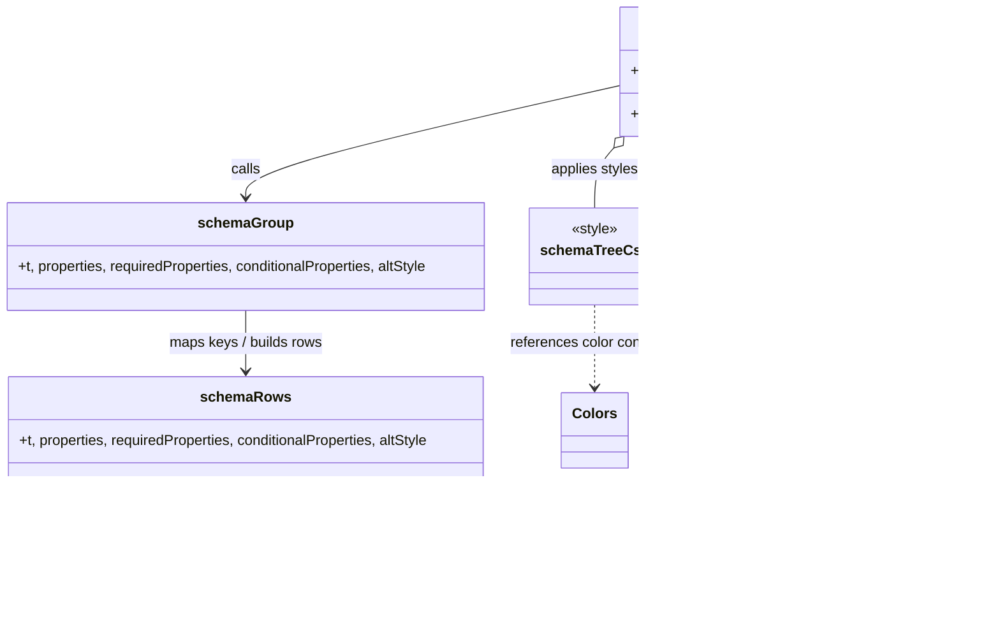

# Diagram: web/portal/src/modules/documentation/documentation-styled-components/SchemaTree.js

> Auto-generated by Obscura crawlers

## Mermaid

```mermaid
classDiagram
class SchemaTree {
  +props
  +render()
}
class schemaGroup {
  +t, properties, requiredProperties, conditionalProperties, altStyle
}
class schemaRows {
  +t, properties, requiredProperties, conditionalProperties, altStyle
}
class schemaTreeCss <<style>>
class ReactMarkdown
class withTranslation
class PropTypes
class _

SchemaTree --> schemaGroup : calls
schemaGroup --> schemaRows : maps keys / builds rows
schemaRows --> ReactMarkdown : uses to render description
SchemaTree o-- schemaTreeCss : applies styles
SchemaTree ..|> withTranslation : exported via
SchemaTree ..> PropTypes : defines propTypes
schemaTreeCss ..> Colors : references color constants
schemaRows ..> _ : uses _.keys for iteration
```

> SVG rendering failed for this diagram.
