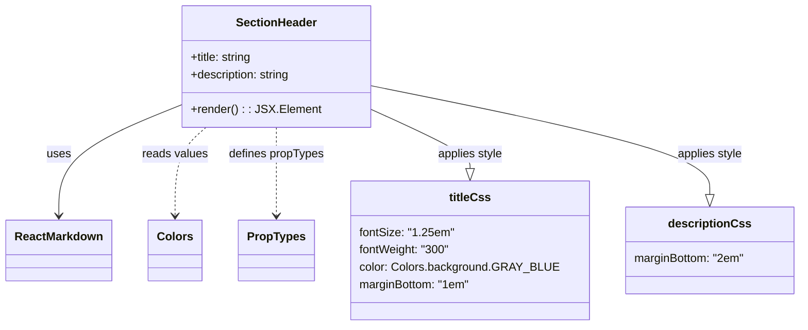

# Diagram: web/portal/src/modules/documentation/documentation-styled-components/SectionHeader.js

> Auto-generated by Obscura crawlers

## Mermaid

### SVG

<svg id="container" width="1075.8203125" xmlns="http://www.w3.org/2000/svg" class="classDiagram" height="450" viewBox="0 0 1075.8203125 450" role="graphics-document document" aria-roledescription="class"><g><defs><marker id="container_class-aggregationStart" class="marker aggregation class" refX="18" refY="7" markerWidth="190" markerHeight="240" orient="auto"><path d="M 18,7 L9,13 L1,7 L9,1 Z"></path></marker></defs><defs><marker id="container_class-aggregationEnd" class="marker aggregation class" refX="1" refY="7" markerWidth="20" markerHeight="28" orient="auto"><path d="M 18,7 L9,13 L1,7 L9,1 Z"></path></marker></defs><defs><marker id="container_class-extensionStart" class="marker extension class" refX="18" refY="7" markerWidth="190" markerHeight="240" orient="auto"><path d="M 1,7 L18,13 V 1 Z"></path></marker></defs><defs><marker id="container_class-extensionEnd" class="marker extension class" refX="1" refY="7" markerWidth="20" markerHeight="28" orient="auto"><path d="M 1,1 V 13 L18,7 Z"></path></marker></defs><defs><marker id="container_class-compositionStart" class="marker composition class" refX="18" refY="7" markerWidth="190" markerHeight="240" orient="auto"><path d="M 18,7 L9,13 L1,7 L9,1 Z"></path></marker></defs><defs><marker id="container_class-compositionEnd" class="marker composition class" refX="1" refY="7" markerWidth="20" markerHeight="28" orient="auto"><path d="M 18,7 L9,13 L1,7 L9,1 Z"></path></marker></defs><defs><marker id="container_class-dependencyStart" class="marker dependency class" refX="6" refY="7" markerWidth="190" markerHeight="240" orient="auto"><path d="M 5,7 L9,13 L1,7 L9,1 Z"></path></marker></defs><defs><marker id="container_class-dependencyEnd" class="marker dependency class" refX="13" refY="7" markerWidth="20" markerHeight="28" orient="auto"><path d="M 18,7 L9,13 L14,7 L9,1 Z"></path></marker></defs><defs><marker id="container_class-lollipopStart" class="marker lollipop class" refX="13" refY="7" markerWidth="190" markerHeight="240" orient="auto"><circle stroke="black" fill="transparent" cx="7" cy="7" r="6"></circle></marker></defs><defs><marker id="container_class-lollipopEnd" class="marker lollipop class" refX="1" refY="7" markerWidth="190" markerHeight="240" orient="auto"><circle stroke="black" fill="transparent" cx="7" cy="7" r="6"></circle></marker></defs><g class="root"><g class="clusters"></g><g class="edgePaths"><path d="M244.793,143.998L217.117,155.498C189.44,166.999,134.087,189.999,106.411,215.666C78.734,241.333,78.734,269.667,78.734,283.833L78.734,298" id="id_SectionHeader_ReactMarkdown_1" class="edge-thickness-normal edge-pattern-solid relation" style=";;;" data-edge="true" data-et="edge" data-id="id_SectionHeader_ReactMarkdown_1" data-points="W3sieCI6MjQ0Ljc5Mjk2ODc1LCJ5IjoxNDMuOTk3ODkzOTE3ODQ5Mzh9LHsieCI6NzguNzM0Mzc1LCJ5IjoyMTN9LHsieCI6NzguNzM0Mzc1LCJ5IjozMDR9XQ==" marker-end="url(#container_class-dependencyEnd)"></path><path d="M275.961,176L269.063,182.167C262.164,188.333,248.367,200.667,241.469,221C234.57,241.333,234.57,269.667,234.57,283.833L234.57,298" id="id_SectionHeader_Colors_2" class="edge-thickness-normal edge-pattern-dashed relation" style=";;;" data-edge="true" data-et="edge" data-id="id_SectionHeader_Colors_2" data-points="W3sieCI6Mjc1Ljk2MTE5NTc2NDQ2MjgsInkiOjE3Nn0seyJ4IjoyMzQuNTcwMzEyNSwieSI6MjEzfSx7IngiOjIzNC41NzAzMTI1LCJ5IjozMDR9XQ==" marker-end="url(#container_class-dependencyEnd)"></path><path d="M369.93,176L369.93,182.167C369.93,188.333,369.93,200.667,369.93,221C369.93,241.333,369.93,269.667,369.93,283.833L369.93,298" id="id_SectionHeader_PropTypes_3" class="edge-thickness-normal edge-pattern-dashed relation" style=";;;" data-edge="true" data-et="edge" data-id="id_SectionHeader_PropTypes_3" data-points="W3sieCI6MzY5LjkyOTY4NzUsInkiOjE3Nn0seyJ4IjozNjkuOTI5Njg3NSwieSI6MjEzfSx7IngiOjM2OS45Mjk2ODc1LCJ5IjozMDR9XQ==" marker-end="url(#container_class-dependencyEnd)"></path><path d="M495.066,150.754L517.162,161.128C539.258,171.503,583.449,192.251,605.545,205.917C627.641,219.583,627.641,226.167,627.641,229.458L627.641,232.75" id="id_SectionHeader_titleCss_4" class="edge-thickness-normal edge-pattern-solid relation" style=";;;" data-edge="true" data-et="edge" data-id="id_SectionHeader_titleCss_4" data-points="W3sieCI6NDk1LjA2NjQwNjI1LCJ5IjoxNTAuNzUzOTc4ODQwMTQ5MTZ9LHsieCI6NjI3LjY0MDYyNSwieSI6MjEzfSx7IngiOjYyNy42NDA2MjUsInkiOjI1MH1d" marker-end="url(#container_class-extensionEnd)"></path><path d="M495.066,118.038L571.132,133.865C647.197,149.692,799.327,181.346,875.392,206.465C951.457,231.583,951.457,250.167,951.457,259.458L951.457,268.75" id="id_SectionHeader_descriptionCss_5" class="edge-thickness-normal edge-pattern-solid relation" style=";;;" data-edge="true" data-et="edge" data-id="id_SectionHeader_descriptionCss_5" data-points="W3sieCI6NDk1LjA2NjQwNjI1LCJ5IjoxMTguMDM3NTQyNTcwNDEzMzF9LHsieCI6OTUxLjQ1NzAzMTI1LCJ5IjoyMTN9LHsieCI6OTUxLjQ1NzAzMTI1LCJ5IjoyODZ9XQ==" marker-end="url(#container_class-extensionEnd)"></path></g><g class="edgeLabels"><g class="edgeLabel" transform="translate(78.734375, 213)"><g class="label" data-id="id_SectionHeader_ReactMarkdown_1" transform="translate(-16.4921875, -12)"><foreignObject width="32.984375" height="24">

uses

</foreignObject></g></g><g class="edgeLabel" transform="translate(234.5703125, 213)"><g class="label" data-id="id_SectionHeader_Colors_2" transform="translate(-45.296875, -12)"><foreignObject width="90.59375" height="24">

reads values

</foreignObject></g></g><g class="edgeLabel" transform="translate(369.9296875, 213)"><g class="label" data-id="id_SectionHeader_PropTypes_3" transform="translate(-66.2734375, -12)"><foreignObject width="132.546875" height="24">

defines propTypes

</foreignObject></g></g><g class="edgeLabel" transform="translate(627.640625, 213)"><g class="label" data-id="id_SectionHeader_titleCss_4" transform="translate(-45.859375, -12)"><foreignObject width="91.71875" height="24">

applies style

</foreignObject></g></g><g class="edgeLabel" transform="translate(951.45703125, 213)"><g class="label" data-id="id_SectionHeader_descriptionCss_5" transform="translate(-45.859375, -12)"><foreignObject width="91.71875" height="24">

applies style

</foreignObject></g></g></g><g class="nodes"><g class="node default" id="classId-SectionHeader-0" transform="translate(369.9296875, 92)"><g class="basic label-container"><path d="M-125.13671875 -84 L125.13671875 -84 L125.13671875 84 L-125.13671875 84" stroke="none" stroke-width="0" fill="#ECECFF" style=""></path><path d="M-125.13671875 -84 C-64.77237986879015 -84, -4.408040987580293 -84, 125.13671875 -84 M-125.13671875 -84 C-67.05519600896343 -84, -8.973673267926856 -84, 125.13671875 -84 M125.13671875 -84 C125.13671875 -47.365168161592635, 125.13671875 -10.73033632318527, 125.13671875 84 M125.13671875 -84 C125.13671875 -16.935764489281368, 125.13671875 50.128471021437264, 125.13671875 84 M125.13671875 84 C39.917594325660275 84, -45.30153009867945 84, -125.13671875 84 M125.13671875 84 C47.74630141067195 84, -29.644115928656106 84, -125.13671875 84 M-125.13671875 84 C-125.13671875 22.321678209514623, -125.13671875 -39.356643580970754, -125.13671875 -84 M-125.13671875 84 C-125.13671875 29.236737900967192, -125.13671875 -25.526524198065616, -125.13671875 -84" stroke="#9370DB" stroke-width="1.3" fill="none" stroke-dasharray="0 0" style=""></path></g><g class="annotation-group text" transform="translate(0, -60)"></g><g class="label-group text" transform="translate(-53.9296875, -60)"><g class="label" style="font-weight: bolder" transform="translate(0,-12)"><foreignObject width="107.859375" height="24">

SectionHeader

</foreignObject></g></g><g class="members-group text" transform="translate(-113.13671875, -12)"><g class="label" style="" transform="translate(0,-12)"><foreignObject width="86.859375" height="24">

+title: string

</foreignObject></g><g class="label" style="" transform="translate(0,12)"><foreignObject width="140.3125" height="24">

+description: string

</foreignObject></g></g><g class="methods-group text" transform="translate(-113.13671875, 60)"><g class="label" style="" transform="translate(0,-12)"><foreignObject width="172.34375" height="24">

+render() : : JSX.Element

</foreignObject></g></g><g class="divider" style=""><path d="M-125.13671875 -36 C-31.257860650560175 -36, 62.62099744887965 -36, 125.13671875 -36 M-125.13671875 -36 C-55.38094794628633 -36, 14.374822857427347 -36, 125.13671875 -36" stroke="#9370DB" stroke-width="1.3" fill="none" stroke-dasharray="0 0" style=""></path></g><g class="divider" style=""><path d="M-125.13671875 36 C-67.78903188855998 36, -10.441345027119937 36, 125.13671875 36 M-125.13671875 36 C-61.65966425075535 36, 1.8173902484893034 36, 125.13671875 36" stroke="#9370DB" stroke-width="1.3" fill="none" stroke-dasharray="0 0" style=""></path></g></g><g class="node default" id="classId-PropTypes-1" transform="translate(369.9296875, 346)"><g class="basic label-container"><path d="M-50.2578125 -42 L50.2578125 -42 L50.2578125 42 L-50.2578125 42" stroke="none" stroke-width="0" fill="#ECECFF" style=""></path><path d="M-50.2578125 -42 C-25.67287153740993 -42, -1.0879305748198576 -42, 50.2578125 -42 M-50.2578125 -42 C-20.434306671817886 -42, 9.389199156364228 -42, 50.2578125 -42 M50.2578125 -42 C50.2578125 -23.666559585129004, 50.2578125 -5.3331191702580085, 50.2578125 42 M50.2578125 -42 C50.2578125 -23.383139458759693, 50.2578125 -4.7662789175193865, 50.2578125 42 M50.2578125 42 C28.287149642797463 42, 6.316486785594925 42, -50.2578125 42 M50.2578125 42 C20.58371382989367 42, -9.090384840212657 42, -50.2578125 42 M-50.2578125 42 C-50.2578125 11.437617278753333, -50.2578125 -19.124765442493334, -50.2578125 -42 M-50.2578125 42 C-50.2578125 16.88535772137851, -50.2578125 -8.229284557242977, -50.2578125 -42" stroke="#9370DB" stroke-width="1.3" fill="none" stroke-dasharray="0 0" style=""></path></g><g class="annotation-group text" transform="translate(0, -18)"></g><g class="label-group text" transform="translate(-38.2578125, -18)"><g class="label" style="font-weight: bolder" transform="translate(0,-12)"><foreignObject width="76.515625" height="24">

PropTypes

</foreignObject></g></g><g class="members-group text" transform="translate(-38.2578125, 30)"></g><g class="methods-group text" transform="translate(-38.2578125, 60)"></g><g class="divider" style=""><path d="M-50.2578125 6 C-28.097423909008782 6, -5.937035318017564 6, 50.2578125 6 M-50.2578125 6 C-27.89039333949745 6, -5.5229741789949 6, 50.2578125 6" stroke="#9370DB" stroke-width="1.3" fill="none" stroke-dasharray="0 0" style=""></path></g><g class="divider" style=""><path d="M-50.2578125 24 C-10.709193642186747 24, 28.839425215626505 24, 50.2578125 24 M-50.2578125 24 C-24.28018710934724 24, 1.6974382813055229 24, 50.2578125 24" stroke="#9370DB" stroke-width="1.3" fill="none" stroke-dasharray="0 0" style=""></path></g></g><g class="node default" id="classId-ReactMarkdown-2" transform="translate(78.734375, 346)"><g class="basic label-container"><path d="M-70.734375 -42 L70.734375 -42 L70.734375 42 L-70.734375 42" stroke="none" stroke-width="0" fill="#ECECFF" style=""></path><path d="M-70.734375 -42 C-18.370317831285945 -42, 33.99373933742811 -42, 70.734375 -42 M-70.734375 -42 C-30.39711563692785 -42, 9.9401437261443 -42, 70.734375 -42 M70.734375 -42 C70.734375 -18.91582153078546, 70.734375 4.168356938429078, 70.734375 42 M70.734375 -42 C70.734375 -22.186652703301952, 70.734375 -2.3733054066039045, 70.734375 42 M70.734375 42 C22.154683378192438 42, -26.425008243615125 42, -70.734375 42 M70.734375 42 C25.439664788906327 42, -19.855045422187345 42, -70.734375 42 M-70.734375 42 C-70.734375 12.951923890684355, -70.734375 -16.09615221863129, -70.734375 -42 M-70.734375 42 C-70.734375 15.906370320208875, -70.734375 -10.18725935958225, -70.734375 -42" stroke="#9370DB" stroke-width="1.3" fill="none" stroke-dasharray="0 0" style=""></path></g><g class="annotation-group text" transform="translate(0, -18)"></g><g class="label-group text" transform="translate(-58.734375, -18)"><g class="label" style="font-weight: bolder" transform="translate(0,-12)"><foreignObject width="117.46875" height="24">

ReactMarkdown

</foreignObject></g></g><g class="members-group text" transform="translate(-58.734375, 30)"></g><g class="methods-group text" transform="translate(-58.734375, 60)"></g><g class="divider" style=""><path d="M-70.734375 6 C-25.867841394006838 6, 18.998692211986324 6, 70.734375 6 M-70.734375 6 C-22.183110734600113 6, 26.368153530799773 6, 70.734375 6" stroke="#9370DB" stroke-width="1.3" fill="none" stroke-dasharray="0 0" style=""></path></g><g class="divider" style=""><path d="M-70.734375 24 C-18.166444910292483 24, 34.40148517941503 24, 70.734375 24 M-70.734375 24 C-41.48474671635758 24, -12.235118432715154 24, 70.734375 24" stroke="#9370DB" stroke-width="1.3" fill="none" stroke-dasharray="0 0" style=""></path></g></g><g class="node default" id="classId-Colors-3" transform="translate(234.5703125, 346)"><g class="basic label-container"><path d="M-35.1015625 -42 L35.1015625 -42 L35.1015625 42 L-35.1015625 42" stroke="none" stroke-width="0" fill="#ECECFF" style=""></path><path d="M-35.1015625 -42 C-17.592816701989868 -42, -0.08407090397973604 -42, 35.1015625 -42 M-35.1015625 -42 C-13.641155731121128 -42, 7.819251037757745 -42, 35.1015625 -42 M35.1015625 -42 C35.1015625 -9.983337525612058, 35.1015625 22.033324948775885, 35.1015625 42 M35.1015625 -42 C35.1015625 -10.495194942019605, 35.1015625 21.00961011596079, 35.1015625 42 M35.1015625 42 C7.439722280283043 42, -20.222117939433915 42, -35.1015625 42 M35.1015625 42 C20.792900707038655 42, 6.484238914077309 42, -35.1015625 42 M-35.1015625 42 C-35.1015625 15.153562485293865, -35.1015625 -11.69287502941227, -35.1015625 -42 M-35.1015625 42 C-35.1015625 16.55361005406025, -35.1015625 -8.8927798918795, -35.1015625 -42" stroke="#9370DB" stroke-width="1.3" fill="none" stroke-dasharray="0 0" style=""></path></g><g class="annotation-group text" transform="translate(0, -18)"></g><g class="label-group text" transform="translate(-23.1015625, -18)"><g class="label" style="font-weight: bolder" transform="translate(0,-12)"><foreignObject width="46.203125" height="24">

Colors

</foreignObject></g></g><g class="members-group text" transform="translate(-23.1015625, 30)"></g><g class="methods-group text" transform="translate(-23.1015625, 60)"></g><g class="divider" style=""><path d="M-35.1015625 6 C-14.974643608831279 6, 5.152275282337442 6, 35.1015625 6 M-35.1015625 6 C-18.221435069666803 6, -1.341307639333607 6, 35.1015625 6" stroke="#9370DB" stroke-width="1.3" fill="none" stroke-dasharray="0 0" style=""></path></g><g class="divider" style=""><path d="M-35.1015625 24 C-8.541883507770919 24, 18.017795484458162 24, 35.1015625 24 M-35.1015625 24 C-10.089064163683428 24, 14.923434172633144 24, 35.1015625 24" stroke="#9370DB" stroke-width="1.3" fill="none" stroke-dasharray="0 0" style=""></path></g></g><g class="node default" id="classId-titleCss-4" transform="translate(627.640625, 346)"><g class="basic label-container"><path d="M-157.453125 -96 L157.453125 -96 L157.453125 96 L-157.453125 96" stroke="none" stroke-width="0" fill="#ECECFF" style=""></path><path d="M-157.453125 -96 C-66.10438101554601 -96, 25.24436296890798 -96, 157.453125 -96 M-157.453125 -96 C-42.097668108633286 -96, 73.25778878273343 -96, 157.453125 -96 M157.453125 -96 C157.453125 -56.85006769655352, 157.453125 -17.700135393107047, 157.453125 96 M157.453125 -96 C157.453125 -20.86883911530751, 157.453125 54.26232176938498, 157.453125 96 M157.453125 96 C68.124612459183 96, -21.203900081634004 96, -157.453125 96 M157.453125 96 C76.12779818315967 96, -5.197528633680662 96, -157.453125 96 M-157.453125 96 C-157.453125 46.82720816055116, -157.453125 -2.3455836788976825, -157.453125 -96 M-157.453125 96 C-157.453125 35.12472367493817, -157.453125 -25.750552650123666, -157.453125 -96" stroke="#9370DB" stroke-width="1.3" fill="none" stroke-dasharray="0 0" style=""></path></g><g class="annotation-group text" transform="translate(0, -72)"></g><g class="label-group text" transform="translate(-27.3125, -72)"><g class="label" style="font-weight: bolder" transform="translate(0,-12)"><foreignObject width="54.625" height="24">

titleCss

</foreignObject></g></g><g class="members-group text" transform="translate(-145.453125, -24)"><g class="label" style="" transform="translate(0,-12)"><foreignObject width="128.359375" height="24">

fontSize: "1.25em"

</foreignObject></g><g class="label" style="" transform="translate(0,12)"><foreignObject width="126.0625" height="24">

fontWeight: "300"

</foreignObject></g><g class="label" style="" transform="translate(0,36)"><foreignObject width="263.59375" height="24">

color: Colors.background.GRAY_BLUE

</foreignObject></g><g class="label" style="" transform="translate(0,60)"><foreignObject width="154.0625" height="24">

marginBottom: "1em"

</foreignObject></g></g><g class="methods-group text" transform="translate(-145.453125, 96)"></g><g class="divider" style=""><path d="M-157.453125 -48 C-94.25173209776722 -48, -31.050339195534434 -48, 157.453125 -48 M-157.453125 -48 C-68.99101871169165 -48, 19.471087576616696 -48, 157.453125 -48" stroke="#9370DB" stroke-width="1.3" fill="none" stroke-dasharray="0 0" style=""></path></g><g class="divider" style=""><path d="M-157.453125 72 C-82.61981254871871 72, -7.786500097437425 72, 157.453125 72 M-157.453125 72 C-76.87565681440512 72, 3.7018113711897627 72, 157.453125 72" stroke="#9370DB" stroke-width="1.3" fill="none" stroke-dasharray="0 0" style=""></path></g></g><g class="node default" id="classId-descriptionCss-5" transform="translate(951.45703125, 346)"><g class="basic label-container"><path d="M-116.36328125 -60 L116.36328125 -60 L116.36328125 60 L-116.36328125 60" stroke="none" stroke-width="0" fill="#ECECFF" style=""></path><path d="M-116.36328125 -60 C-59.786136942849154 -60, -3.2089926356983085 -60, 116.36328125 -60 M-116.36328125 -60 C-52.208000896930784 -60, 11.947279456138432 -60, 116.36328125 -60 M116.36328125 -60 C116.36328125 -18.964536154032437, 116.36328125 22.070927691935125, 116.36328125 60 M116.36328125 -60 C116.36328125 -18.05369932872688, 116.36328125 23.892601342546243, 116.36328125 60 M116.36328125 60 C55.868937675487174 60, -4.625405899025651 60, -116.36328125 60 M116.36328125 60 C63.24167649115752 60, 10.12007173231504 60, -116.36328125 60 M-116.36328125 60 C-116.36328125 35.86374592395646, -116.36328125 11.727491847912923, -116.36328125 -60 M-116.36328125 60 C-116.36328125 34.01726271653274, -116.36328125 8.03452543306549, -116.36328125 -60" stroke="#9370DB" stroke-width="1.3" fill="none" stroke-dasharray="0 0" style=""></path></g><g class="annotation-group text" transform="translate(0, -36)"></g><g class="label-group text" transform="translate(-53.9921875, -36)"><g class="label" style="font-weight: bolder" transform="translate(0,-12)"><foreignObject width="107.984375" height="24">

descriptionCss

</foreignObject></g></g><g class="members-group text" transform="translate(-104.36328125, 12)"><g class="label" style="" transform="translate(0,-12)"><foreignObject width="154.734375" height="24">

marginBottom: "2em"

</foreignObject></g></g><g class="methods-group text" transform="translate(-104.36328125, 60)"></g><g class="divider" style=""><path d="M-116.36328125 -12 C-49.833357163384775 -12, 16.69656692323045 -12, 116.36328125 -12 M-116.36328125 -12 C-30.991371279147444 -12, 54.38053869170511 -12, 116.36328125 -12" stroke="#9370DB" stroke-width="1.3" fill="none" stroke-dasharray="0 0" style=""></path></g><g class="divider" style=""><path d="M-116.36328125 36 C-58.910079348418485 36, -1.4568774468369696 36, 116.36328125 36 M-116.36328125 36 C-56.69574794510336 36, 2.971785359793273 36, 116.36328125 36" stroke="#9370DB" stroke-width="1.3" fill="none" stroke-dasharray="0 0" style=""></path></g></g></g></g></g></svg>
