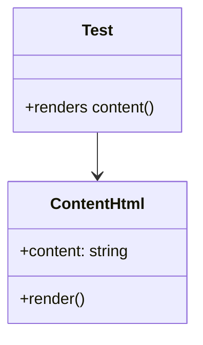

# Diagram: web/portal/src/modules/documentation/documentation-styled-components/tests/ContentHtml.test.js


> Auto-generated by Obscura crawlers

## Diagram 1

```mermaid
flowchart TD
    A[Test "renders content"] --> B[Define content string]
    B --> C[Build contentHtml = `<div>${content}</div>`]
    C --> D[Render <ContentHtml content={contentHtml}/>]
    D --> E[renderUtils.findByText(content)]
    E --> F[expect(...).toBeInTheDocument()]
```

> SVG rendering failed for this diagram.

## Diagram 2



### SVG

<svg id="container" width="199.5703125" xmlns="http://www.w3.org/2000/svg" class="classDiagram" height="336" viewBox="0 0 199.5703125 336" role="graphics-document document" aria-roledescription="class"><style>#container{font-family:"trebuchet ms",verdana,arial,sans-serif;font-size:16px;fill:#333;}@keyframes edge-animation-frame{from{stroke-dashoffset:0;}}@keyframes dash{to{stroke-dashoffset:0;}}#container .edge-animation-slow{stroke-dasharray:9,5!important;stroke-dashoffset:900;animation:dash 50s linear infinite;stroke-linecap:round;}#container .edge-animation-fast{stroke-dasharray:9,5!important;stroke-dashoffset:900;animation:dash 20s linear infinite;stroke-linecap:round;}#container .error-icon{fill:#552222;}#container .error-text{fill:#552222;stroke:#552222;}#container .edge-thickness-normal{stroke-width:1px;}#container .edge-thickness-thick{stroke-width:3.5px;}#container .edge-pattern-solid{stroke-dasharray:0;}#container .edge-thickness-invisible{stroke-width:0;fill:none;}#container .edge-pattern-dashed{stroke-dasharray:3;}#container .edge-pattern-dotted{stroke-dasharray:2;}#container .marker{fill:#333333;stroke:#333333;}#container .marker.cross{stroke:#333333;}#container svg{font-family:"trebuchet ms",verdana,arial,sans-serif;font-size:16px;}#container p{margin:0;}#container g.classGroup text{fill:#9370DB;stroke:none;font-family:"trebuchet ms",verdana,arial,sans-serif;font-size:10px;}#container g.classGroup text .title{font-weight:bolder;}#container .nodeLabel,#container .edgeLabel{color:#131300;}#container .edgeLabel .label rect{fill:#ECECFF;}#container .label text{fill:#131300;}#container .labelBkg{background:#ECECFF;}#container .edgeLabel .label span{background:#ECECFF;}#container .classTitle{font-weight:bolder;}#container .node rect,#container .node circle,#container .node ellipse,#container .node polygon,#container .node path{fill:#ECECFF;stroke:#9370DB;stroke-width:1px;}#container .divider{stroke:#9370DB;stroke-width:1;}#container g.clickable{cursor:pointer;}#container g.classGroup rect{fill:#ECECFF;stroke:#9370DB;}#container g.classGroup line{stroke:#9370DB;stroke-width:1;}#container .classLabel .box{stroke:none;stroke-width:0;fill:#ECECFF;opacity:0.5;}#container .classLabel .label{fill:#9370DB;font-size:10px;}#container .relation{stroke:#333333;stroke-width:1;fill:none;}#container .dashed-line{stroke-dasharray:3;}#container .dotted-line{stroke-dasharray:1 2;}#container #compositionStart,#container .composition{fill:#333333!important;stroke:#333333!important;stroke-width:1;}#container #compositionEnd,#container .composition{fill:#333333!important;stroke:#333333!important;stroke-width:1;}#container #dependencyStart,#container .dependency{fill:#333333!important;stroke:#333333!important;stroke-width:1;}#container #dependencyStart,#container .dependency{fill:#333333!important;stroke:#333333!important;stroke-width:1;}#container #extensionStart,#container .extension{fill:transparent!important;stroke:#333333!important;stroke-width:1;}#container #extensionEnd,#container .extension{fill:transparent!important;stroke:#333333!important;stroke-width:1;}#container #aggregationStart,#container .aggregation{fill:transparent!important;stroke:#333333!important;stroke-width:1;}#container #aggregationEnd,#container .aggregation{fill:transparent!important;stroke:#333333!important;stroke-width:1;}#container #lollipopStart,#container .lollipop{fill:#ECECFF!important;stroke:#333333!important;stroke-width:1;}#container #lollipopEnd,#container .lollipop{fill:#ECECFF!important;stroke:#333333!important;stroke-width:1;}#container .edgeTerminals{font-size:11px;line-height:initial;}#container .classTitleText{text-anchor:middle;font-size:18px;fill:#333;}#container .label-icon{display:inline-block;height:1em;overflow:visible;vertical-align:-0.125em;}#container .node .label-icon path{fill:currentColor;stroke:revert;stroke-width:revert;}#container :root{--mermaid-font-family:"trebuchet ms",verdana,arial,sans-serif;}</style><g><defs><marker id="container_class-aggregationStart" class="marker aggregation class" refX="18" refY="7" markerWidth="190" markerHeight="240" orient="auto"><path d="M 18,7 L9,13 L1,7 L9,1 Z"></path></marker></defs><defs><marker id="container_class-aggregationEnd" class="marker aggregation class" refX="1" refY="7" markerWidth="20" markerHeight="28" orient="auto"><path d="M 18,7 L9,13 L1,7 L9,1 Z"></path></marker></defs><defs><marker id="container_class-extensionStart" class="marker extension class" refX="18" refY="7" markerWidth="190" markerHeight="240" orient="auto"><path d="M 1,7 L18,13 V 1 Z"></path></marker></defs><defs><marker id="container_class-extensionEnd" class="marker extension class" refX="1" refY="7" markerWidth="20" markerHeight="28" orient="auto"><path d="M 1,1 V 13 L18,7 Z"></path></marker></defs><defs><marker id="container_class-compositionStart" class="marker composition class" refX="18" refY="7" markerWidth="190" markerHeight="240" orient="auto"><path d="M 18,7 L9,13 L1,7 L9,1 Z"></path></marker></defs><defs><marker id="container_class-compositionEnd" class="marker composition class" refX="1" refY="7" markerWidth="20" markerHeight="28" orient="auto"><path d="M 18,7 L9,13 L1,7 L9,1 Z"></path></marker></defs><defs><marker id="container_class-dependencyStart" class="marker dependency class" refX="6" refY="7" markerWidth="190" markerHeight="240" orient="auto"><path d="M 5,7 L9,13 L1,7 L9,1 Z"></path></marker></defs><defs><marker id="container_class-dependencyEnd" class="marker dependency class" refX="13" refY="7" markerWidth="20" markerHeight="28" orient="auto"><path d="M 18,7 L9,13 L14,7 L9,1 Z"></path></marker></defs><defs><marker id="container_class-lollipopStart" class="marker lollipop class" refX="13" refY="7" markerWidth="190" markerHeight="240" orient="auto"><circle stroke="black" fill="transparent" cx="7" cy="7" r="6"></circle></marker></defs><defs><marker id="container_class-lollipopEnd" class="marker lollipop class" refX="1" refY="7" markerWidth="190" markerHeight="240" orient="auto"><circle stroke="black" fill="transparent" cx="7" cy="7" r="6"></circle></marker></defs><g class="root"><g class="clusters"></g><g class="edgePaths"><path d="M99.785,134L99.785,138.167C99.785,142.333,99.785,150.667,99.785,158C99.785,165.333,99.785,171.667,99.785,174.833L99.785,178" id="id_Test_ContentHtml_1" class="edge-thickness-normal edge-pattern-solid relation" style=";;;" data-edge="true" data-et="edge" data-id="id_Test_ContentHtml_1" data-points="W3sieCI6OTkuNzg1MTU2MjUsInkiOjEzNH0seyJ4Ijo5OS43ODUxNTYyNSwieSI6MTU5fSx7IngiOjk5Ljc4NTE1NjI1LCJ5IjoxODR9XQ==" marker-end="url(#container_class-dependencyEnd)"></path></g><g class="edgeLabels"><g class="edgeLabel"><g class="label" data-id="id_Test_ContentHtml_1" transform="translate(0, 0)"><foreignObject width="0" height="0"><div xmlns="http://www.w3.org/1999/xhtml" class="labelBkg" style="display: table-cell; white-space: nowrap; line-height: 1.5; max-width: 200px; text-align: center;"><span class="edgeLabel"></span></div></foreignObject></g></g></g><g class="nodes"><g class="node default" id="classId-Test-0" transform="translate(99.78515625, 71)"><g class="basic label-container"><path d="M-86.3984375 -63 L86.3984375 -63 L86.3984375 63 L-86.3984375 63" stroke="none" stroke-width="0" fill="#ECECFF" style=""></path><path d="M-86.3984375 -63 C-33.06061586128236 -63, 20.277205777435285 -63, 86.3984375 -63 M-86.3984375 -63 C-18.3398193023732 -63, 49.7187988952536 -63, 86.3984375 -63 M86.3984375 -63 C86.3984375 -18.94844919028128, 86.3984375 25.10310161943744, 86.3984375 63 M86.3984375 -63 C86.3984375 -27.97218854135309, 86.3984375 7.055622917293817, 86.3984375 63 M86.3984375 63 C44.013377780036244 63, 1.6283180600724876 63, -86.3984375 63 M86.3984375 63 C38.130143230652386 63, -10.138151038695227 63, -86.3984375 63 M-86.3984375 63 C-86.3984375 22.29852668213389, -86.3984375 -18.40294663573222, -86.3984375 -63 M-86.3984375 63 C-86.3984375 24.982442918884438, -86.3984375 -13.035114162231125, -86.3984375 -63" stroke="#9370DB" stroke-width="1.3" fill="none" stroke-dasharray="0 0" style=""></path></g><g class="annotation-group text" transform="translate(0, -39)"></g><g class="label-group text" transform="translate(-15.25, -39)"><g class="label" style="font-weight: bolder" transform="translate(0,-12)"><foreignObject width="30.5" height="24"><div xmlns="http://www.w3.org/1999/xhtml" style="display: table-cell; white-space: nowrap; line-height: 1.5; max-width: 80px; text-align: center;"><span class="nodeLabel markdown-node-label" style=""><p>Test</p></span></div></foreignObject></g></g><g class="members-group text" transform="translate(-74.3984375, 9)"></g><g class="methods-group text" transform="translate(-74.3984375, 39)"><g class="label" style="" transform="translate(0,-12)"><foreignObject width="133.546875" height="24"><div xmlns="http://www.w3.org/1999/xhtml" style="display: table-cell; white-space: nowrap; line-height: 1.5; max-width: 191px; text-align: center;"><span class="nodeLabel markdown-node-label" style=""><p>+renders content()</p></span></div></foreignObject></g></g><g class="divider" style=""><path d="M-86.3984375 -15 C-36.21903958626032 -15, 13.960358327479355 -15, 86.3984375 -15 M-86.3984375 -15 C-51.79168525607868 -15, -17.18493301215736 -15, 86.3984375 -15" stroke="#9370DB" stroke-width="1.3" fill="none" stroke-dasharray="0 0" style=""></path></g><g class="divider" style=""><path d="M-86.3984375 9 C-32.16657351387719 9, 22.06529047224562 9, 86.3984375 9 M-86.3984375 9 C-50.61597695306914 9, -14.833516406138287 9, 86.3984375 9" stroke="#9370DB" stroke-width="1.3" fill="none" stroke-dasharray="0 0" style=""></path></g></g><g class="node default" id="classId-ContentHtml-1" transform="translate(99.78515625, 256)"><g class="basic label-container"><path d="M-91.78515625 -72 L91.78515625 -72 L91.78515625 72 L-91.78515625 72" stroke="none" stroke-width="0" fill="#ECECFF" style=""></path><path d="M-91.78515625 -72 C-39.979576019092804 -72, 11.826004211814393 -72, 91.78515625 -72 M-91.78515625 -72 C-51.607945924020285 -72, -11.43073559804057 -72, 91.78515625 -72 M91.78515625 -72 C91.78515625 -19.85441145672913, 91.78515625 32.29117708654174, 91.78515625 72 M91.78515625 -72 C91.78515625 -41.70143205130589, 91.78515625 -11.402864102611787, 91.78515625 72 M91.78515625 72 C41.17181933929213 72, -9.441517571415744 72, -91.78515625 72 M91.78515625 72 C19.080078936145554 72, -53.62499837770889 72, -91.78515625 72 M-91.78515625 72 C-91.78515625 38.89445242876903, -91.78515625 5.788904857538057, -91.78515625 -72 M-91.78515625 72 C-91.78515625 38.21730498537527, -91.78515625 4.434609970750543, -91.78515625 -72" stroke="#9370DB" stroke-width="1.3" fill="none" stroke-dasharray="0 0" style=""></path></g><g class="annotation-group text" transform="translate(0, -48)"></g><g class="label-group text" transform="translate(-46.3515625, -48)"><g class="label" style="font-weight: bolder" transform="translate(0,-12)"><foreignObject width="92.703125" height="24"><div xmlns="http://www.w3.org/1999/xhtml" style="display: table-cell; white-space: nowrap; line-height: 1.5; max-width: 142px; text-align: center;"><span class="nodeLabel markdown-node-label" style=""><p>ContentHtml</p></span></div></foreignObject></g></g><g class="members-group text" transform="translate(-79.78515625, 0)"><g class="label" style="" transform="translate(0,-12)"><foreignObject width="113.21875" height="24"><div xmlns="http://www.w3.org/1999/xhtml" style="display: table-cell; white-space: nowrap; line-height: 1.5; max-width: 171px; text-align: center;"><span class="nodeLabel markdown-node-label" style=""><p>+content: string</p></span></div></foreignObject></g></g><g class="methods-group text" transform="translate(-79.78515625, 48)"><g class="label" style="" transform="translate(0,-12)"><foreignObject width="66.609375" height="24"><div xmlns="http://www.w3.org/1999/xhtml" style="display: table-cell; white-space: nowrap; line-height: 1.5; max-width: 124px; text-align: center;"><span class="nodeLabel markdown-node-label" style=""><p>+render()</p></span></div></foreignObject></g></g><g class="divider" style=""><path d="M-91.78515625 -24 C-35.82745261246148 -24, 20.130251025077044 -24, 91.78515625 -24 M-91.78515625 -24 C-24.512819569474615 -24, 42.75951711105077 -24, 91.78515625 -24" stroke="#9370DB" stroke-width="1.3" fill="none" stroke-dasharray="0 0" style=""></path></g><g class="divider" style=""><path d="M-91.78515625 24 C-22.819515928689455 24, 46.14612439262109 24, 91.78515625 24 M-91.78515625 24 C-33.01887389784089 24, 25.74740845431822 24, 91.78515625 24" stroke="#9370DB" stroke-width="1.3" fill="none" stroke-dasharray="0 0" style=""></path></g></g></g></g></g></svg>
