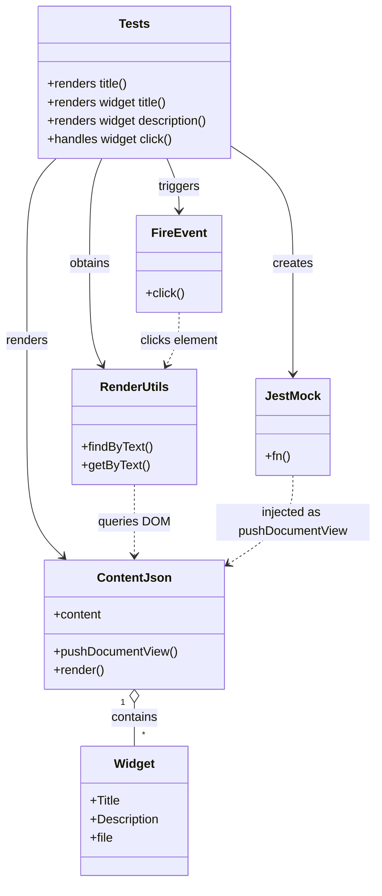

# Diagram: web/portal/src/modules/documentation/documentation-styled-components/tests/ContentJson.test.js

> Auto-generated by Obscura crawlers

## Mermaid

### SVG

<svg id="container" width="487.203125" xmlns="http://www.w3.org/2000/svg" class="classDiagram" height="1146" viewBox="0 0 487.203125 1146" role="graphics-document document" aria-roledescription="class"><g><defs><marker id="container_class-aggregationStart" class="marker aggregation class" refX="18" refY="7" markerWidth="190" markerHeight="240" orient="auto"><path d="M 18,7 L9,13 L1,7 L9,1 Z"></path></marker></defs><defs><marker id="container_class-aggregationEnd" class="marker aggregation class" refX="1" refY="7" markerWidth="20" markerHeight="28" orient="auto"><path d="M 18,7 L9,13 L1,7 L9,1 Z"></path></marker></defs><defs><marker id="container_class-extensionStart" class="marker extension class" refX="18" refY="7" markerWidth="190" markerHeight="240" orient="auto"><path d="M 1,7 L18,13 V 1 Z"></path></marker></defs><defs><marker id="container_class-extensionEnd" class="marker extension class" refX="1" refY="7" markerWidth="20" markerHeight="28" orient="auto"><path d="M 1,1 V 13 L18,7 Z"></path></marker></defs><defs><marker id="container_class-compositionStart" class="marker composition class" refX="18" refY="7" markerWidth="190" markerHeight="240" orient="auto"><path d="M 18,7 L9,13 L1,7 L9,1 Z"></path></marker></defs><defs><marker id="container_class-compositionEnd" class="marker composition class" refX="1" refY="7" markerWidth="20" markerHeight="28" orient="auto"><path d="M 18,7 L9,13 L1,7 L9,1 Z"></path></marker></defs><defs><marker id="container_class-dependencyStart" class="marker dependency class" refX="6" refY="7" markerWidth="190" markerHeight="240" orient="auto"><path d="M 5,7 L9,13 L1,7 L9,1 Z"></path></marker></defs><defs><marker id="container_class-dependencyEnd" class="marker dependency class" refX="13" refY="7" markerWidth="20" markerHeight="28" orient="auto"><path d="M 18,7 L9,13 L14,7 L9,1 Z"></path></marker></defs><defs><marker id="container_class-lollipopStart" class="marker lollipop class" refX="13" refY="7" markerWidth="190" markerHeight="240" orient="auto"><circle stroke="black" fill="transparent" cx="7" cy="7" r="6"></circle></marker></defs><defs><marker id="container_class-lollipopEnd" class="marker lollipop class" refX="1" refY="7" markerWidth="190" markerHeight="240" orient="auto"><circle stroke="black" fill="transparent" cx="7" cy="7" r="6"></circle></marker></defs><g class="root"><g class="clusters"></g><g class="edgePaths"><path d="M175.521,913.25L175.521,916.542C175.521,919.833,175.521,926.417,175.521,935.875C175.521,945.333,175.521,957.667,175.521,963.833L175.521,970" id="id_ContentJson_Widget_1" class="edge-thickness-normal edge-pattern-solid relation" style=";;;" data-edge="true" data-et="edge" data-id="id_ContentJson_Widget_1" data-points="W3sieCI6MTc1LjUyMTQ4NDM3NSwieSI6ODk2fSx7IngiOjE3NS41MjE0ODQzNzUsInkiOjkzM30seyJ4IjoxNzUuNTIxNDg0Mzc1LCJ5Ijo5NzB9XQ==" marker-start="url(#container_class-aggregationStart)"></path><path d="M73.776,206L67.438,212.167C61.101,218.333,48.425,230.667,42.088,253.5C35.75,276.333,35.75,309.667,35.75,343C35.75,376.333,35.75,409.667,35.75,445C35.75,480.333,35.75,517.667,35.75,557C35.75,596.333,35.75,637.667,43.608,665.811C51.466,693.955,67.182,708.909,75.04,716.387L82.898,723.864" id="id_Tests_ContentJson_2" class="edge-thickness-normal edge-pattern-solid relation" style=";;;" data-edge="true" data-et="edge" data-id="id_Tests_ContentJson_2" data-points="W3sieCI6NzMuNzc2MDY1NjAyMDIyMDYsInkiOjIwNn0seyJ4IjozNS43NSwieSI6MjQzfSx7IngiOjM1Ljc1LCJ5IjozNDN9LHsieCI6MzUuNzUsInkiOjQ0M30seyJ4IjozNS43NSwieSI6NTU1fSx7IngiOjM1Ljc1LCJ5Ijo2Nzl9LHsieCI6ODcuMjQ0NzU3NDAxMzE1OCwieSI6NzI4fV0=" marker-end="url(#container_class-dependencyEnd)"></path><path d="M133.093,206L130.45,212.167C127.808,218.333,122.522,230.667,119.879,253.5C117.236,276.333,117.236,309.667,117.236,343C117.236,376.333,117.236,409.667,119.984,431.613C122.731,453.559,128.226,464.118,130.974,469.398L133.721,474.678" id="id_Tests_RenderUtils_3" class="edge-thickness-normal edge-pattern-solid relation" style=";;;" data-edge="true" data-et="edge" data-id="id_Tests_RenderUtils_3" data-points="W3sieCI6MTMzLjA5MzMxOTE2MzYwMjkzLCJ5IjoyMDZ9LHsieCI6MTE3LjIzNjMyODEyNSwieSI6MjQzfSx7IngiOjExNy4yMzYzMjgxMjUsInkiOjM0M30seyJ4IjoxMTcuMjM2MzI4MTI1LCJ5Ijo0NDN9LHsieCI6MTM2LjQ5MTI0NTgxNDczMjE0LCJ5Ijo0ODB9XQ==" marker-end="url(#container_class-dependencyEnd)"></path><path d="M217.95,206L220.592,212.167C223.235,218.333,228.521,230.667,231.164,242C233.807,253.333,233.807,263.667,233.807,268.833L233.807,274" id="id_Tests_FireEvent_4" class="edge-thickness-normal edge-pattern-solid relation" style=";;;" data-edge="true" data-et="edge" data-id="id_Tests_FireEvent_4" data-points="W3sieCI6MjE3Ljk0OTY0OTU4NjM5NzA3LCJ5IjoyMDZ9LHsieCI6MjMzLjgwNjY0MDYyNSwieSI6MjQzfSx7IngiOjIzMy44MDY2NDA2MjUsInkiOjI4MH1d" marker-end="url(#container_class-dependencyEnd)"></path><path d="M303.604,192.521L316.203,200.935C328.803,209.348,354.003,226.174,366.603,251.254C379.203,276.333,379.203,309.667,379.203,343C379.203,376.333,379.203,409.667,379.203,433.5C379.203,457.333,379.203,471.667,379.203,478.833L379.203,486" id="id_Tests_JestMock_5" class="edge-thickness-normal edge-pattern-solid relation" style=";;;" data-edge="true" data-et="edge" data-id="id_Tests_JestMock_5" data-points="W3sieCI6MzAzLjYwMzUxNTYyNSwieSI6MTkyLjUyMTQ4NDM5MzcyODd9LHsieCI6Mzc5LjIwMzEyNSwieSI6MjQzfSx7IngiOjM3OS4yMDMxMjUsInkiOjM0M30seyJ4IjozNzkuMjAzMTI1LCJ5Ijo0NDN9LHsieCI6Mzc5LjIwMzEyNSwieSI6NDkyfV0=" marker-end="url(#container_class-dependencyEnd)"></path><path d="M175.521,630L175.521,638.167C175.521,646.333,175.521,662.667,175.521,678C175.521,693.333,175.521,707.667,175.521,714.833L175.521,722" id="id_RenderUtils_ContentJson_6" class="edge-thickness-normal edge-pattern-dashed relation" style=";;;" data-edge="true" data-et="edge" data-id="id_RenderUtils_ContentJson_6" data-points="W3sieCI6MTc1LjUyMTQ4NDM3NSwieSI6NjMwfSx7IngiOjE3NS41MjE0ODQzNzUsInkiOjY3OX0seyJ4IjoxNzUuNTIxNDg0Mzc1LCJ5Ijo3Mjh9XQ==" marker-end="url(#container_class-dependencyEnd)"></path><path d="M233.807,406L233.807,412.167C233.807,418.333,233.807,430.667,231.059,442.113C228.312,453.559,222.817,464.118,220.069,469.398L217.322,474.678" id="id_FireEvent_RenderUtils_7" class="edge-thickness-normal edge-pattern-dashed relation" style=";;;" data-edge="true" data-et="edge" data-id="id_FireEvent_RenderUtils_7" data-points="W3sieCI6MjMzLjgwNjY0MDYyNSwieSI6NDA2fSx7IngiOjIzMy44MDY2NDA2MjUsInkiOjQ0M30seyJ4IjoyMTQuNTUxNzIyOTM1MjY3ODYsInkiOjQ4MH1d" marker-end="url(#container_class-dependencyEnd)"></path><path d="M379.203,618L379.203,628.167C379.203,638.333,379.203,658.667,365.272,677.93C351.341,697.194,323.478,715.387,309.547,724.484L295.616,733.581" id="id_JestMock_ContentJson_8" class="edge-thickness-normal edge-pattern-dashed relation" style=";;;" data-edge="true" data-et="edge" data-id="id_JestMock_ContentJson_8" data-points="W3sieCI6Mzc5LjIwMzEyNSwieSI6NjE4fSx7IngiOjM3OS4yMDMxMjUsInkiOjY3OX0seyJ4IjoyOTAuNTkxNzk2ODc1LCJ5Ijo3MzYuODYxNDA4NjM5Nzg1Mn1d" marker-end="url(#container_class-dependencyEnd)"></path></g><g class="edgeLabels"><g class="edgeLabel" transform="translate(175.521484375, 933)"><g class="label" data-id="id_ContentJson_Widget_1" transform="translate(-30.890625, -12)"><foreignObject width="61.78125" height="24">

contains

</foreignObject></g></g><g class="edgeLabel" transform="translate(35.75, 443)"><g class="label" data-id="id_Tests_ContentJson_2" transform="translate(-27.75, -12)"><foreignObject width="55.5" height="24">

renders

</foreignObject></g></g><g class="edgeLabel" transform="translate(117.236328125, 343)"><g class="label" data-id="id_Tests_RenderUtils_3" transform="translate(-27.2890625, -12)"><foreignObject width="54.578125" height="24">

obtains

</foreignObject></g></g><g class="edgeLabel" transform="translate(233.806640625, 243)"><g class="label" data-id="id_Tests_FireEvent_4" transform="translate(-27.4921875, -12)"><foreignObject width="54.984375" height="24">

triggers

</foreignObject></g></g><g class="edgeLabel" transform="translate(379.203125, 343)"><g class="label" data-id="id_Tests_JestMock_5" transform="translate(-26.171875, -12)"><foreignObject width="52.34375" height="24">

creates

</foreignObject></g></g><g class="edgeLabel" transform="translate(175.521484375, 679)"><g class="label" data-id="id_RenderUtils_ContentJson_6" transform="translate(-46.21875, -12)"><foreignObject width="92.4375" height="24">

queries DOM

</foreignObject></g></g><g class="edgeLabel" transform="translate(233.806640625, 443)"><g class="label" data-id="id_FireEvent_RenderUtils_7" transform="translate(-51.9765625, -12)"><foreignObject width="103.953125" height="24">

clicks element

</foreignObject></g></g><g class="edgeLabel" transform="translate(379.203125, 679)"><g class="label" data-id="id_JestMock_ContentJson_8" transform="translate(-100, -24)"><foreignObject width="200" height="48">

injected as pushDocumentView

</foreignObject></g></g><g class="edgeTerminals" transform="translate(160.5214821875001, 913.499998125)"><g class="inner" transform="translate(0, 0)"><foreignObject style="width: 9px; height: 12px;">
1
</foreignObject></g></g><g class="edgeTerminals" transform="translate(185.52148218749988, 947.499998125)"><g class="inner" transform="translate(0, 0)"></g><foreignObject style="width: 9px; height: 12px;">
*
</foreignObject></g></g><g class="nodes"><g class="node default" id="classId-ContentJson-0" transform="translate(175.521484375, 812)"><g class="basic label-container"><path d="M-115.0703125 -84 L115.0703125 -84 L115.0703125 84 L-115.0703125 84" stroke="none" stroke-width="0" fill="#ECECFF" style=""></path><path d="M-115.0703125 -84 C-39.47774037284425 -84, 36.114831754311496 -84, 115.0703125 -84 M-115.0703125 -84 C-30.371813062755265 -84, 54.32668637448947 -84, 115.0703125 -84 M115.0703125 -84 C115.0703125 -38.29991094784566, 115.0703125 7.400178104308679, 115.0703125 84 M115.0703125 -84 C115.0703125 -18.06136249242897, 115.0703125 47.87727501514206, 115.0703125 84 M115.0703125 84 C56.27463353235264 84, -2.521045435294724 84, -115.0703125 84 M115.0703125 84 C61.79747592454619 84, 8.524639349092382 84, -115.0703125 84 M-115.0703125 84 C-115.0703125 33.68769800258833, -115.0703125 -16.624603994823346, -115.0703125 -84 M-115.0703125 84 C-115.0703125 28.746504509843113, -115.0703125 -26.506990980313773, -115.0703125 -84" stroke="#9370DB" stroke-width="1.3" fill="none" stroke-dasharray="0 0" style=""></path></g><g class="annotation-group text" transform="translate(0, -60)"></g><g class="label-group text" transform="translate(-44.484375, -60)"><g class="label" style="font-weight: bolder" transform="translate(0,-12)"><foreignObject width="88.96875" height="24">

ContentJson

</foreignObject></g></g><g class="members-group text" transform="translate(-103.0703125, -12)"><g class="label" style="" transform="translate(0,-12)"><foreignObject width="63.453125" height="24">

+content

</foreignObject></g></g><g class="methods-group text" transform="translate(-103.0703125, 36)"><g class="label" style="" transform="translate(0,-12)"><foreignObject width="161.65625" height="24">

+pushDocumentView()

</foreignObject></g><g class="label" style="" transform="translate(0,12)"><foreignObject width="66.609375" height="24">

+render()

</foreignObject></g></g><g class="divider" style=""><path d="M-115.0703125 -36 C-33.91331071248594 -36, 47.243691075028124 -36, 115.0703125 -36 M-115.0703125 -36 C-63.16707815967006 -36, -11.263843819340124 -36, 115.0703125 -36" stroke="#9370DB" stroke-width="1.3" fill="none" stroke-dasharray="0 0" style=""></path></g><g class="divider" style=""><path d="M-115.0703125 12 C-53.7182376554971 12, 7.633837189005803 12, 115.0703125 12 M-115.0703125 12 C-26.21548275132757 12, 62.63934699734486 12, 115.0703125 12" stroke="#9370DB" stroke-width="1.3" fill="none" stroke-dasharray="0 0" style=""></path></g></g><g class="node default" id="classId-Widget-1" transform="translate(175.521484375, 1054)"><g class="basic label-container"><path d="M-70.45703125 -84 L70.45703125 -84 L70.45703125 84 L-70.45703125 84" stroke="none" stroke-width="0" fill="#ECECFF" style=""></path><path d="M-70.45703125 -84 C-38.083480658435775 -84, -5.70993006687155 -84, 70.45703125 -84 M-70.45703125 -84 C-34.05155021796303 -84, 2.3539308140739337 -84, 70.45703125 -84 M70.45703125 -84 C70.45703125 -47.72993384576773, 70.45703125 -11.459867691535464, 70.45703125 84 M70.45703125 -84 C70.45703125 -29.218351256407203, 70.45703125 25.563297487185594, 70.45703125 84 M70.45703125 84 C33.90149152671951 84, -2.6540481965609786 84, -70.45703125 84 M70.45703125 84 C41.39715035152339 84, 12.337269453046794 84, -70.45703125 84 M-70.45703125 84 C-70.45703125 17.305085242030486, -70.45703125 -49.38982951593903, -70.45703125 -84 M-70.45703125 84 C-70.45703125 33.83134193759825, -70.45703125 -16.337316124803493, -70.45703125 -84" stroke="#9370DB" stroke-width="1.3" fill="none" stroke-dasharray="0 0" style=""></path></g><g class="annotation-group text" transform="translate(0, -60)"></g><g class="label-group text" transform="translate(-25.5703125, -60)"><g class="label" style="font-weight: bolder" transform="translate(0,-12)"><foreignObject width="51.140625" height="24">

Widget

</foreignObject></g></g><g class="members-group text" transform="translate(-58.45703125, -12)"><g class="label" style="" transform="translate(0,-12)"><foreignObject width="38.921875" height="24">

+Title

</foreignObject></g><g class="label" style="" transform="translate(0,12)"><foreignObject width="91.34375" height="24">

+Description

</foreignObject></g><g class="label" style="" transform="translate(0,36)"><foreignObject width="30.28125" height="24">

+file

</foreignObject></g></g><g class="methods-group text" transform="translate(-58.45703125, 84)"></g><g class="divider" style=""><path d="M-70.45703125 -36 C-18.044046528639832 -36, 34.368938192720336 -36, 70.45703125 -36 M-70.45703125 -36 C-19.686243773634082 -36, 31.084543702731835 -36, 70.45703125 -36" stroke="#9370DB" stroke-width="1.3" fill="none" stroke-dasharray="0 0" style=""></path></g><g class="divider" style=""><path d="M-70.45703125 60 C-18.254064972331562 60, 33.948901305336875 60, 70.45703125 60 M-70.45703125 60 C-19.23121371422316 60, 31.99460382155368 60, 70.45703125 60" stroke="#9370DB" stroke-width="1.3" fill="none" stroke-dasharray="0 0" style=""></path></g></g><g class="node default" id="classId-Tests-2" transform="translate(175.521484375, 107)"><g class="basic label-container"><path d="M-128.08203125 -99 L128.08203125 -99 L128.08203125 99 L-128.08203125 99" stroke="none" stroke-width="0" fill="#ECECFF" style=""></path><path d="M-128.08203125 -99 C-71.31329153156004 -99, -14.54455181312008 -99, 128.08203125 -99 M-128.08203125 -99 C-75.33594027496565 -99, -22.589849299931288 -99, 128.08203125 -99 M128.08203125 -99 C128.08203125 -20.410954538004376, 128.08203125 58.17809092399125, 128.08203125 99 M128.08203125 -99 C128.08203125 -52.254488972611234, 128.08203125 -5.508977945222469, 128.08203125 99 M128.08203125 99 C50.773701978887715 99, -26.53462729222457 99, -128.08203125 99 M128.08203125 99 C66.80777508307978 99, 5.533518916159551 99, -128.08203125 99 M-128.08203125 99 C-128.08203125 48.154688612893246, -128.08203125 -2.6906227742135087, -128.08203125 -99 M-128.08203125 99 C-128.08203125 47.78370901950085, -128.08203125 -3.4325819609983057, -128.08203125 -99" stroke="#9370DB" stroke-width="1.3" fill="none" stroke-dasharray="0 0" style=""></path></g><g class="annotation-group text" transform="translate(0, -75)"></g><g class="label-group text" transform="translate(-19.1171875, -75)"><g class="label" style="font-weight: bolder" transform="translate(0,-12)"><foreignObject width="38.234375" height="24">

Tests

</foreignObject></g></g><g class="members-group text" transform="translate(-116.08203125, -27)"></g><g class="methods-group text" transform="translate(-116.08203125, 3)"><g class="label" style="" transform="translate(0,-12)"><foreignObject width="107.3125" height="24">

+renders title()

</foreignObject></g><g class="label" style="" transform="translate(0,12)"><foreignObject width="159.671875" height="24">

+renders widget title()

</foreignObject></g><g class="label" style="" transform="translate(0,36)"><foreignObject width="213.046875" height="24">

+renders widget description()

</foreignObject></g><g class="label" style="" transform="translate(0,60)"><foreignObject width="165.46875" height="24">

+handles widget click()

</foreignObject></g></g><g class="divider" style=""><path d="M-128.08203125 -51 C-73.15166976838748 -51, -18.221308286774956 -51, 128.08203125 -51 M-128.08203125 -51 C-72.88383594202 -51, -17.68564063404 -51, 128.08203125 -51" stroke="#9370DB" stroke-width="1.3" fill="none" stroke-dasharray="0 0" style=""></path></g><g class="divider" style=""><path d="M-128.08203125 -27 C-31.47077896598607 -27, 65.14047331802786 -27, 128.08203125 -27 M-128.08203125 -27 C-69.24042396802923 -27, -10.398816686058481 -27, 128.08203125 -27" stroke="#9370DB" stroke-width="1.3" fill="none" stroke-dasharray="0 0" style=""></path></g></g><g class="node default" id="classId-RenderUtils-3" transform="translate(175.521484375, 555)"><g class="basic label-container"><path d="M-80.22265625 -75 L80.22265625 -75 L80.22265625 75 L-80.22265625 75" stroke="none" stroke-width="0" fill="#ECECFF" style=""></path><path d="M-80.22265625 -75 C-37.3343520871785 -75, 5.5539520756429965 -75, 80.22265625 -75 M-80.22265625 -75 C-40.110044328024095 -75, 0.0025675939518094992 -75, 80.22265625 -75 M80.22265625 -75 C80.22265625 -20.448982242483815, 80.22265625 34.10203551503237, 80.22265625 75 M80.22265625 -75 C80.22265625 -41.07010363109072, 80.22265625 -7.140207262181434, 80.22265625 75 M80.22265625 75 C29.298860339295757 75, -21.624935571408486 75, -80.22265625 75 M80.22265625 75 C24.402941225222143 75, -31.416773799555713 75, -80.22265625 75 M-80.22265625 75 C-80.22265625 23.82269714292105, -80.22265625 -27.3546057141579, -80.22265625 -75 M-80.22265625 75 C-80.22265625 27.0898898559128, -80.22265625 -20.820220288174397, -80.22265625 -75" stroke="#9370DB" stroke-width="1.3" fill="none" stroke-dasharray="0 0" style=""></path></g><g class="annotation-group text" transform="translate(0, -51)"></g><g class="label-group text" transform="translate(-43.0703125, -51)"><g class="label" style="font-weight: bolder" transform="translate(0,-12)"><foreignObject width="86.140625" height="24">

RenderUtils

</foreignObject></g></g><g class="members-group text" transform="translate(-68.22265625, -3)"></g><g class="methods-group text" transform="translate(-68.22265625, 27)"><g class="label" style="" transform="translate(0,-12)"><foreignObject width="93.375" height="24">

+findByText()

</foreignObject></g><g class="label" style="" transform="translate(0,12)"><foreignObject width="88.03125" height="24">

+getByText()

</foreignObject></g></g><g class="divider" style=""><path d="M-80.22265625 -27 C-36.998806049517626 -27, 6.225044150964749 -27, 80.22265625 -27 M-80.22265625 -27 C-16.95434113381824 -27, 46.31397398236352 -27, 80.22265625 -27" stroke="#9370DB" stroke-width="1.3" fill="none" stroke-dasharray="0 0" style=""></path></g><g class="divider" style=""><path d="M-80.22265625 -3 C-32.86555820326462 -3, 14.491539843470761 -3, 80.22265625 -3 M-80.22265625 -3 C-44.235095709312525 -3, -8.247535168625049 -3, 80.22265625 -3" stroke="#9370DB" stroke-width="1.3" fill="none" stroke-dasharray="0 0" style=""></path></g></g><g class="node default" id="classId-FireEvent-4" transform="translate(233.806640625, 343)"><g class="basic label-container"><path d="M-54.28125 -63 L54.28125 -63 L54.28125 63 L-54.28125 63" stroke="none" stroke-width="0" fill="#ECECFF" style=""></path><path d="M-54.28125 -63 C-26.591375822804796 -63, 1.0984983543904079 -63, 54.28125 -63 M-54.28125 -63 C-32.5390453436538 -63, -10.796840687307593 -63, 54.28125 -63 M54.28125 -63 C54.28125 -33.37464980258544, 54.28125 -3.749299605170883, 54.28125 63 M54.28125 -63 C54.28125 -35.85638913163872, 54.28125 -8.71277826327745, 54.28125 63 M54.28125 63 C23.167635264037095 63, -7.94597947192581 63, -54.28125 63 M54.28125 63 C29.77642232123677 63, 5.271594642473538 63, -54.28125 63 M-54.28125 63 C-54.28125 24.573770801418455, -54.28125 -13.85245839716309, -54.28125 -63 M-54.28125 63 C-54.28125 22.94896851898563, -54.28125 -17.10206296202874, -54.28125 -63" stroke="#9370DB" stroke-width="1.3" fill="none" stroke-dasharray="0 0" style=""></path></g><g class="annotation-group text" transform="translate(0, -39)"></g><g class="label-group text" transform="translate(-33.515625, -39)"><g class="label" style="font-weight: bolder" transform="translate(0,-12)"><foreignObject width="67.03125" height="24">

FireEvent

</foreignObject></g></g><g class="members-group text" transform="translate(-42.28125, 9)"></g><g class="methods-group text" transform="translate(-42.28125, 39)"><g class="label" style="" transform="translate(0,-12)"><foreignObject width="51.046875" height="24">

+click()

</foreignObject></g></g><g class="divider" style=""><path d="M-54.28125 -15 C-30.705037619298416 -15, -7.128825238596832 -15, 54.28125 -15 M-54.28125 -15 C-15.162044363224823 -15, 23.957161273550355 -15, 54.28125 -15" stroke="#9370DB" stroke-width="1.3" fill="none" stroke-dasharray="0 0" style=""></path></g><g class="divider" style=""><path d="M-54.28125 9 C-27.317165676278094 9, -0.3530813525561882 9, 54.28125 9 M-54.28125 9 C-26.797589517881793 9, 0.6860709642364142 9, 54.28125 9" stroke="#9370DB" stroke-width="1.3" fill="none" stroke-dasharray="0 0" style=""></path></g></g><g class="node default" id="classId-JestMock-5" transform="translate(379.203125, 555)"><g class="basic label-container"><path d="M-45.1171875 -63 L45.1171875 -63 L45.1171875 63 L-45.1171875 63" stroke="none" stroke-width="0" fill="#ECECFF" style=""></path><path d="M-45.1171875 -63 C-14.532348517317882 -63, 16.052490465364237 -63, 45.1171875 -63 M-45.1171875 -63 C-24.09044909552843 -63, -3.063710691056862 -63, 45.1171875 -63 M45.1171875 -63 C45.1171875 -35.38490258411453, 45.1171875 -7.769805168229048, 45.1171875 63 M45.1171875 -63 C45.1171875 -21.695015803368072, 45.1171875 19.609968393263856, 45.1171875 63 M45.1171875 63 C26.04391680046012 63, 6.970646100920241 63, -45.1171875 63 M45.1171875 63 C25.014220456144287 63, 4.911253412288573 63, -45.1171875 63 M-45.1171875 63 C-45.1171875 26.181931482125492, -45.1171875 -10.636137035749016, -45.1171875 -63 M-45.1171875 63 C-45.1171875 28.52944612578021, -45.1171875 -5.941107748439578, -45.1171875 -63" stroke="#9370DB" stroke-width="1.3" fill="none" stroke-dasharray="0 0" style=""></path></g><g class="annotation-group text" transform="translate(0, -39)"></g><g class="label-group text" transform="translate(-33.1171875, -39)"><g class="label" style="font-weight: bolder" transform="translate(0,-12)"><foreignObject width="66.234375" height="24">

JestMock

</foreignObject></g></g><g class="members-group text" transform="translate(-33.1171875, 9)"></g><g class="methods-group text" transform="translate(-33.1171875, 39)"><g class="label" style="" transform="translate(0,-12)"><foreignObject width="32.859375" height="24">

+fn()

</foreignObject></g></g><g class="divider" style=""><path d="M-45.1171875 -15 C-9.63096184618388 -15, 25.85526380763224 -15, 45.1171875 -15 M-45.1171875 -15 C-25.646220003552553 -15, -6.175252507105107 -15, 45.1171875 -15" stroke="#9370DB" stroke-width="1.3" fill="none" stroke-dasharray="0 0" style=""></path></g><g class="divider" style=""><path d="M-45.1171875 9 C-14.195197063372486 9, 16.726793373255028 9, 45.1171875 9 M-45.1171875 9 C-18.995246108930797 9, 7.126695282138407 9, 45.1171875 9" stroke="#9370DB" stroke-width="1.3" fill="none" stroke-dasharray="0 0" style=""></path></g></g></g></g></g></svg>
