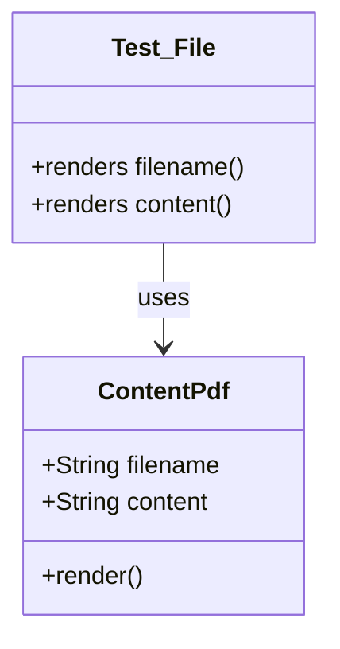

# Diagram: web/portal/src/modules/documentation/documentation-styled-components/tests/ContentPdf.test.js


> Auto-generated by Obscura crawlers

## Diagram 1



### SVG

<svg id="container" width="213.2109375" xmlns="http://www.w3.org/2000/svg" class="classDiagram" height="408" viewBox="0 0 213.2109375 408" role="graphics-document document" aria-roledescription="class"><style>#container{font-family:"trebuchet ms",verdana,arial,sans-serif;font-size:16px;fill:#333;}@keyframes edge-animation-frame{from{stroke-dashoffset:0;}}@keyframes dash{to{stroke-dashoffset:0;}}#container .edge-animation-slow{stroke-dasharray:9,5!important;stroke-dashoffset:900;animation:dash 50s linear infinite;stroke-linecap:round;}#container .edge-animation-fast{stroke-dasharray:9,5!important;stroke-dashoffset:900;animation:dash 20s linear infinite;stroke-linecap:round;}#container .error-icon{fill:#552222;}#container .error-text{fill:#552222;stroke:#552222;}#container .edge-thickness-normal{stroke-width:1px;}#container .edge-thickness-thick{stroke-width:3.5px;}#container .edge-pattern-solid{stroke-dasharray:0;}#container .edge-thickness-invisible{stroke-width:0;fill:none;}#container .edge-pattern-dashed{stroke-dasharray:3;}#container .edge-pattern-dotted{stroke-dasharray:2;}#container .marker{fill:#333333;stroke:#333333;}#container .marker.cross{stroke:#333333;}#container svg{font-family:"trebuchet ms",verdana,arial,sans-serif;font-size:16px;}#container p{margin:0;}#container g.classGroup text{fill:#9370DB;stroke:none;font-family:"trebuchet ms",verdana,arial,sans-serif;font-size:10px;}#container g.classGroup text .title{font-weight:bolder;}#container .nodeLabel,#container .edgeLabel{color:#131300;}#container .edgeLabel .label rect{fill:#ECECFF;}#container .label text{fill:#131300;}#container .labelBkg{background:#ECECFF;}#container .edgeLabel .label span{background:#ECECFF;}#container .classTitle{font-weight:bolder;}#container .node rect,#container .node circle,#container .node ellipse,#container .node polygon,#container .node path{fill:#ECECFF;stroke:#9370DB;stroke-width:1px;}#container .divider{stroke:#9370DB;stroke-width:1;}#container g.clickable{cursor:pointer;}#container g.classGroup rect{fill:#ECECFF;stroke:#9370DB;}#container g.classGroup line{stroke:#9370DB;stroke-width:1;}#container .classLabel .box{stroke:none;stroke-width:0;fill:#ECECFF;opacity:0.5;}#container .classLabel .label{fill:#9370DB;font-size:10px;}#container .relation{stroke:#333333;stroke-width:1;fill:none;}#container .dashed-line{stroke-dasharray:3;}#container .dotted-line{stroke-dasharray:1 2;}#container #compositionStart,#container .composition{fill:#333333!important;stroke:#333333!important;stroke-width:1;}#container #compositionEnd,#container .composition{fill:#333333!important;stroke:#333333!important;stroke-width:1;}#container #dependencyStart,#container .dependency{fill:#333333!important;stroke:#333333!important;stroke-width:1;}#container #dependencyStart,#container .dependency{fill:#333333!important;stroke:#333333!important;stroke-width:1;}#container #extensionStart,#container .extension{fill:transparent!important;stroke:#333333!important;stroke-width:1;}#container #extensionEnd,#container .extension{fill:transparent!important;stroke:#333333!important;stroke-width:1;}#container #aggregationStart,#container .aggregation{fill:transparent!important;stroke:#333333!important;stroke-width:1;}#container #aggregationEnd,#container .aggregation{fill:transparent!important;stroke:#333333!important;stroke-width:1;}#container #lollipopStart,#container .lollipop{fill:#ECECFF!important;stroke:#333333!important;stroke-width:1;}#container #lollipopEnd,#container .lollipop{fill:#ECECFF!important;stroke:#333333!important;stroke-width:1;}#container .edgeTerminals{font-size:11px;line-height:initial;}#container .classTitleText{text-anchor:middle;font-size:18px;fill:#333;}#container .label-icon{display:inline-block;height:1em;overflow:visible;vertical-align:-0.125em;}#container .node .label-icon path{fill:currentColor;stroke:revert;stroke-width:revert;}#container :root{--mermaid-font-family:"trebuchet ms",verdana,arial,sans-serif;}</style><g><defs><marker id="container_class-aggregationStart" class="marker aggregation class" refX="18" refY="7" markerWidth="190" markerHeight="240" orient="auto"><path d="M 18,7 L9,13 L1,7 L9,1 Z"></path></marker></defs><defs><marker id="container_class-aggregationEnd" class="marker aggregation class" refX="1" refY="7" markerWidth="20" markerHeight="28" orient="auto"><path d="M 18,7 L9,13 L1,7 L9,1 Z"></path></marker></defs><defs><marker id="container_class-extensionStart" class="marker extension class" refX="18" refY="7" markerWidth="190" markerHeight="240" orient="auto"><path d="M 1,7 L18,13 V 1 Z"></path></marker></defs><defs><marker id="container_class-extensionEnd" class="marker extension class" refX="1" refY="7" markerWidth="20" markerHeight="28" orient="auto"><path d="M 1,1 V 13 L18,7 Z"></path></marker></defs><defs><marker id="container_class-compositionStart" class="marker composition class" refX="18" refY="7" markerWidth="190" markerHeight="240" orient="auto"><path d="M 18,7 L9,13 L1,7 L9,1 Z"></path></marker></defs><defs><marker id="container_class-compositionEnd" class="marker composition class" refX="1" refY="7" markerWidth="20" markerHeight="28" orient="auto"><path d="M 18,7 L9,13 L1,7 L9,1 Z"></path></marker></defs><defs><marker id="container_class-dependencyStart" class="marker dependency class" refX="6" refY="7" markerWidth="190" markerHeight="240" orient="auto"><path d="M 5,7 L9,13 L1,7 L9,1 Z"></path></marker></defs><defs><marker id="container_class-dependencyEnd" class="marker dependency class" refX="13" refY="7" markerWidth="20" markerHeight="28" orient="auto"><path d="M 18,7 L9,13 L14,7 L9,1 Z"></path></marker></defs><defs><marker id="container_class-lollipopStart" class="marker lollipop class" refX="13" refY="7" markerWidth="190" markerHeight="240" orient="auto"><circle stroke="black" fill="transparent" cx="7" cy="7" r="6"></circle></marker></defs><defs><marker id="container_class-lollipopEnd" class="marker lollipop class" refX="1" refY="7" markerWidth="190" markerHeight="240" orient="auto"><circle stroke="black" fill="transparent" cx="7" cy="7" r="6"></circle></marker></defs><g class="root"><g class="clusters"></g><g class="edgePaths"><path d="M106.605,158L106.605,164.167C106.605,170.333,106.605,182.667,106.605,194C106.605,205.333,106.605,215.667,106.605,220.833L106.605,226" id="id_Test_File_ContentPdf_1" class="edge-thickness-normal edge-pattern-solid relation" style=";;;" data-edge="true" data-et="edge" data-id="id_Test_File_ContentPdf_1" data-points="W3sieCI6MTA2LjYwNTQ2ODc1LCJ5IjoxNTh9LHsieCI6MTA2LjYwNTQ2ODc1LCJ5IjoxOTV9LHsieCI6MTA2LjYwNTQ2ODc1LCJ5IjoyMzJ9XQ==" marker-end="url(#container_class-dependencyEnd)"></path></g><g class="edgeLabels"><g class="edgeLabel" transform="translate(106.60546875, 195)"><g class="label" data-id="id_Test_File_ContentPdf_1" transform="translate(-16.4921875, -12)"><foreignObject width="32.984375" height="24"><div xmlns="http://www.w3.org/1999/xhtml" class="labelBkg" style="display: table-cell; white-space: nowrap; line-height: 1.5; max-width: 200px; text-align: center;"><span class="edgeLabel"><p>uses</p></span></div></foreignObject></g></g></g><g class="nodes"><g class="node default" id="classId-ContentPdf-0" transform="translate(106.60546875, 316)"><g class="basic label-container"><path d="M-91.26171875 -84 L91.26171875 -84 L91.26171875 84 L-91.26171875 84" stroke="none" stroke-width="0" fill="#ECECFF" style=""></path><path d="M-91.26171875 -84 C-27.38046738125817 -84, 36.50078398748366 -84, 91.26171875 -84 M-91.26171875 -84 C-19.832968050812596 -84, 51.59578264837481 -84, 91.26171875 -84 M91.26171875 -84 C91.26171875 -40.52553573016674, 91.26171875 2.9489285396665252, 91.26171875 84 M91.26171875 -84 C91.26171875 -42.95941238510463, 91.26171875 -1.9188247702092553, 91.26171875 84 M91.26171875 84 C22.18073435156441 84, -46.90025004687118 84, -91.26171875 84 M91.26171875 84 C47.96240103639872 84, 4.6630833227974335 84, -91.26171875 84 M-91.26171875 84 C-91.26171875 27.141099355265702, -91.26171875 -29.717801289468596, -91.26171875 -84 M-91.26171875 84 C-91.26171875 18.02398924245206, -91.26171875 -47.95202151509588, -91.26171875 -84" stroke="#9370DB" stroke-width="1.3" fill="none" stroke-dasharray="0 0" style=""></path></g><g class="annotation-group text" transform="translate(0, -60)"></g><g class="label-group text" transform="translate(-41.0078125, -60)"><g class="label" style="font-weight: bolder" transform="translate(0,-12)"><foreignObject width="82.015625" height="24"><div xmlns="http://www.w3.org/1999/xhtml" style="display: table-cell; white-space: nowrap; line-height: 1.5; max-width: 132px; text-align: center;"><span class="nodeLabel markdown-node-label" style=""><p>ContentPdf</p></span></div></foreignObject></g></g><g class="members-group text" transform="translate(-79.26171875, -12)"><g class="label" style="" transform="translate(0,-12)"><foreignObject width="117.515625" height="24"><div xmlns="http://www.w3.org/1999/xhtml" style="display: table-cell; white-space: nowrap; line-height: 1.5; max-width: 175px; text-align: center;"><span class="nodeLabel markdown-node-label" style=""><p>+String filename</p></span></div></foreignObject></g><g class="label" style="" transform="translate(0,12)"><foreignObject width="109.921875" height="24"><div xmlns="http://www.w3.org/1999/xhtml" style="display: table-cell; white-space: nowrap; line-height: 1.5; max-width: 168px; text-align: center;"><span class="nodeLabel markdown-node-label" style=""><p>+String content</p></span></div></foreignObject></g></g><g class="methods-group text" transform="translate(-79.26171875, 60)"><g class="label" style="" transform="translate(0,-12)"><foreignObject width="66.609375" height="24"><div xmlns="http://www.w3.org/1999/xhtml" style="display: table-cell; white-space: nowrap; line-height: 1.5; max-width: 124px; text-align: center;"><span class="nodeLabel markdown-node-label" style=""><p>+render()</p></span></div></foreignObject></g></g><g class="divider" style=""><path d="M-91.26171875 -36 C-33.32232112146053 -36, 24.617076507078934 -36, 91.26171875 -36 M-91.26171875 -36 C-40.91948741642404 -36, 9.42274391715192 -36, 91.26171875 -36" stroke="#9370DB" stroke-width="1.3" fill="none" stroke-dasharray="0 0" style=""></path></g><g class="divider" style=""><path d="M-91.26171875 36 C-27.072675671693048 36, 37.116367406613904 36, 91.26171875 36 M-91.26171875 36 C-51.656109935596966 36, -12.050501121193932 36, 91.26171875 36" stroke="#9370DB" stroke-width="1.3" fill="none" stroke-dasharray="0 0" style=""></path></g></g><g class="node default" id="classId-Test_File-1" transform="translate(106.60546875, 83)"><g class="basic label-container"><path d="M-98.60546875 -75 L98.60546875 -75 L98.60546875 75 L-98.60546875 75" stroke="none" stroke-width="0" fill="#ECECFF" style=""></path><path d="M-98.60546875 -75 C-30.27082506847104 -75, 38.06381861305792 -75, 98.60546875 -75 M-98.60546875 -75 C-51.23707128184125 -75, -3.8686738136825056 -75, 98.60546875 -75 M98.60546875 -75 C98.60546875 -32.232885497977406, 98.60546875 10.534229004045187, 98.60546875 75 M98.60546875 -75 C98.60546875 -38.08291626469616, 98.60546875 -1.1658325293923184, 98.60546875 75 M98.60546875 75 C34.453932997554986 75, -29.697602754890028 75, -98.60546875 75 M98.60546875 75 C30.563088215825715 75, -37.47929231834857 75, -98.60546875 75 M-98.60546875 75 C-98.60546875 16.35708712776305, -98.60546875 -42.2858257444739, -98.60546875 -75 M-98.60546875 75 C-98.60546875 36.79744378676131, -98.60546875 -1.4051124264773733, -98.60546875 -75" stroke="#9370DB" stroke-width="1.3" fill="none" stroke-dasharray="0 0" style=""></path></g><g class="annotation-group text" transform="translate(0, -51)"></g><g class="label-group text" transform="translate(-32.0859375, -51)"><g class="label" style="font-weight: bolder" transform="translate(0,-12)"><foreignObject width="64.171875" height="24"><div xmlns="http://www.w3.org/1999/xhtml" style="display: table-cell; white-space: nowrap; line-height: 1.5; max-width: 113px; text-align: center;"><span class="nodeLabel markdown-node-label" style=""><p>Test_File</p></span></div></foreignObject></g></g><g class="members-group text" transform="translate(-86.60546875, -3)"></g><g class="methods-group text" transform="translate(-86.60546875, 27)"><g class="label" style="" transform="translate(0,-12)"><foreignObject width="141.125" height="24"><div xmlns="http://www.w3.org/1999/xhtml" style="display: table-cell; white-space: nowrap; line-height: 1.5; max-width: 198px; text-align: center;"><span class="nodeLabel markdown-node-label" style=""><p>+renders filename()</p></span></div></foreignObject></g><g class="label" style="" transform="translate(0,12)"><foreignObject width="133.546875" height="24"><div xmlns="http://www.w3.org/1999/xhtml" style="display: table-cell; white-space: nowrap; line-height: 1.5; max-width: 191px; text-align: center;"><span class="nodeLabel markdown-node-label" style=""><p>+renders content()</p></span></div></foreignObject></g></g><g class="divider" style=""><path d="M-98.60546875 -27 C-42.14687523971206 -27, 14.31171827057588 -27, 98.60546875 -27 M-98.60546875 -27 C-36.85177135243406 -27, 24.901926045131873 -27, 98.60546875 -27" stroke="#9370DB" stroke-width="1.3" fill="none" stroke-dasharray="0 0" style=""></path></g><g class="divider" style=""><path d="M-98.60546875 -3 C-35.959516845104616 -3, 26.686435059790767 -3, 98.60546875 -3 M-98.60546875 -3 C-42.60148126238881 -3, 13.402506225222382 -3, 98.60546875 -3" stroke="#9370DB" stroke-width="1.3" fill="none" stroke-dasharray="0 0" style=""></path></g></g></g></g></g></svg>

## Diagram 2

```mermaid
sequenceDiagram
    participant Test as Tester
    participant R as render()
    participant C as ContentPdf
    participant D as DOM
    Tester->>R: render(<ContentPdf filename, content />)
    R->>C: instantiate with props
    C->>D: display text node: filename
    C->>D: create <embed data="data:application/pdf;base64,content">
    Tester->>D: querySelector(`[data="data:application/pdf;base64,content"]`)
    Tester->>Tester: expect(filename).toBeInTheDocument()
    Tester->>Tester: expect(element).toBeInTheDocument()
```

> SVG rendering failed for this diagram.
