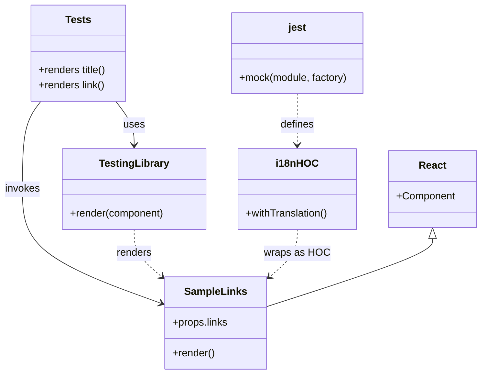

# Diagram: web/portal/src/modules/documentation/documentation-styled-components/tests/SampleLinks.test.js

> Auto-generated by Obscura crawlers

## Mermaid

### SVG

<svg id="container" width="753.3125" xmlns="http://www.w3.org/2000/svg" class="classDiagram" height="584" viewBox="0 0 753.3125 584" role="graphics-document document" aria-roledescription="class"><g><defs><marker id="container_class-aggregationStart" class="marker aggregation class" refX="18" refY="7" markerWidth="190" markerHeight="240" orient="auto"><path d="M 18,7 L9,13 L1,7 L9,1 Z"></path></marker></defs><defs><marker id="container_class-aggregationEnd" class="marker aggregation class" refX="1" refY="7" markerWidth="20" markerHeight="28" orient="auto"><path d="M 18,7 L9,13 L1,7 L9,1 Z"></path></marker></defs><defs><marker id="container_class-extensionStart" class="marker extension class" refX="18" refY="7" markerWidth="190" markerHeight="240" orient="auto"><path d="M 1,7 L18,13 V 1 Z"></path></marker></defs><defs><marker id="container_class-extensionEnd" class="marker extension class" refX="1" refY="7" markerWidth="20" markerHeight="28" orient="auto"><path d="M 1,1 V 13 L18,7 Z"></path></marker></defs><defs><marker id="container_class-compositionStart" class="marker composition class" refX="18" refY="7" markerWidth="190" markerHeight="240" orient="auto"><path d="M 18,7 L9,13 L1,7 L9,1 Z"></path></marker></defs><defs><marker id="container_class-compositionEnd" class="marker composition class" refX="1" refY="7" markerWidth="20" markerHeight="28" orient="auto"><path d="M 18,7 L9,13 L1,7 L9,1 Z"></path></marker></defs><defs><marker id="container_class-dependencyStart" class="marker dependency class" refX="6" refY="7" markerWidth="190" markerHeight="240" orient="auto"><path d="M 5,7 L9,13 L1,7 L9,1 Z"></path></marker></defs><defs><marker id="container_class-dependencyEnd" class="marker dependency class" refX="13" refY="7" markerWidth="20" markerHeight="28" orient="auto"><path d="M 18,7 L9,13 L14,7 L9,1 Z"></path></marker></defs><defs><marker id="container_class-lollipopStart" class="marker lollipop class" refX="13" refY="7" markerWidth="190" markerHeight="240" orient="auto"><circle stroke="black" fill="transparent" cx="7" cy="7" r="6"></circle></marker></defs><defs><marker id="container_class-lollipopEnd" class="marker lollipop class" refX="1" refY="7" markerWidth="190" markerHeight="240" orient="auto"><circle stroke="black" fill="transparent" cx="7" cy="7" r="6"></circle></marker></defs><g class="root"><g class="clusters"></g><g class="edgePaths"><path d="M64.541,158L59.715,164.167C54.889,170.333,45.238,182.667,40.412,205.5C35.586,228.333,35.586,261.667,35.586,295C35.586,328.333,35.586,361.667,71.983,391.426C108.38,421.185,181.175,447.37,217.572,460.462L253.969,473.555" id="id_Tests_SampleLinks_1" class="edge-thickness-normal edge-pattern-solid relation" style=";;;" data-edge="true" data-et="edge" data-id="id_Tests_SampleLinks_1" data-points="W3sieCI6NjQuNTQxMjI0ODg4MzkyODYsInkiOjE1OH0seyJ4IjozNS41ODU5Mzc1LCJ5IjoxOTV9LHsieCI6MzUuNTg1OTM3NSwieSI6Mjk1fSx7IngiOjM1LjU4NTkzNzUsInkiOjM5NX0seyJ4IjoyNTkuNjE1MjM0Mzc1LCJ5Ijo0NzUuNTg1NjgzMjU1MjM1NH1d" marker-end="url(#container_class-dependencyEnd)"></path><path d="M181.928,158L186.753,164.167C191.579,170.333,201.231,182.667,206.057,194C210.883,205.333,210.883,215.667,210.883,220.833L210.883,226" id="id_Tests_TestingLibrary_2" class="edge-thickness-normal edge-pattern-solid relation" style=";;;" data-edge="true" data-et="edge" data-id="id_Tests_TestingLibrary_2" data-points="W3sieCI6MTgxLjkyNzUyNTExMTYwNzE0LCJ5IjoxNTh9LHsieCI6MjEwLjg4MjgxMjUsInkiOjE5NX0seyJ4IjoyMTAuODgyODEyNSwieSI6MjMyfV0=" marker-end="url(#container_class-dependencyEnd)"></path><path d="M210.883,358L210.883,364.167C210.883,370.333,210.883,382.667,218.244,395.116C225.606,407.564,240.328,420.129,247.69,426.411L255.051,432.693" id="id_TestingLibrary_SampleLinks_3" class="edge-thickness-normal edge-pattern-dashed relation" style=";;;" data-edge="true" data-et="edge" data-id="id_TestingLibrary_SampleLinks_3" data-points="W3sieCI6MjEwLjg4MjgxMjUsInkiOjM1OH0seyJ4IjoyMTAuODgyODEyNSwieSI6Mzk1fSx7IngiOjI1OS42MTUyMzQzNzUsInkiOjQzNi41ODgxNzk1MjQ0Mjg1fV0=" marker-end="url(#container_class-dependencyEnd)"></path><path d="M466.332,146L466.332,154.167C466.332,162.333,466.332,178.667,466.332,192C466.332,205.333,466.332,215.667,466.332,220.833L466.332,226" id="id_jest_i18nHOC_4" class="edge-thickness-normal edge-pattern-dashed relation" style=";;;" data-edge="true" data-et="edge" data-id="id_jest_i18nHOC_4" data-points="W3sieCI6NDY2LjMzMjAzMTI1LCJ5IjoxNDZ9LHsieCI6NDY2LjMzMjAzMTI1LCJ5IjoxOTV9LHsieCI6NDY2LjMzMjAzMTI1LCJ5IjoyMzJ9XQ==" marker-end="url(#container_class-dependencyEnd)"></path><path d="M466.332,358L466.332,364.167C466.332,370.333,466.332,382.667,458.971,395.116C451.609,407.564,436.886,420.129,429.525,426.411L422.164,432.693" id="id_i18nHOC_SampleLinks_5" class="edge-thickness-normal edge-pattern-dashed relation" style=";;;" data-edge="true" data-et="edge" data-id="id_i18nHOC_SampleLinks_5" data-points="W3sieCI6NDY2LjMzMjAzMTI1LCJ5IjozNTh9LHsieCI6NDY2LjMzMjAzMTI1LCJ5IjozOTV9LHsieCI6NDE3LjU5OTYwOTM3NSwieSI6NDM2LjU4ODE3OTUyNDQyODV9XQ==" marker-end="url(#container_class-dependencyEnd)"></path><path d="M677.191,372.25L677.191,376.042C677.191,379.833,677.191,387.417,633.926,405.137C590.661,422.857,504.13,450.713,460.865,464.642L417.6,478.57" id="id_React_SampleLinks_6" class="edge-thickness-normal edge-pattern-solid relation" style=";;;" data-edge="true" data-et="edge" data-id="id_React_SampleLinks_6" data-points="W3sieCI6Njc3LjE5MTQwNjI1LCJ5IjozNTV9LHsieCI6Njc3LjE5MTQwNjI1LCJ5IjozOTV9LHsieCI6NDE3LjU5OTYwOTM3NSwieSI6NDc4LjU3MDEyNDg4ODIzNTF9XQ==" marker-start="url(#container_class-extensionStart)"></path></g><g class="edgeLabels"><g class="edgeLabel" transform="translate(35.5859375, 295)"><g class="label" data-id="id_Tests_SampleLinks_1" transform="translate(-27.5859375, -12)"><foreignObject width="55.171875" height="24">

invokes

</foreignObject></g></g><g class="edgeLabel" transform="translate(210.8828125, 195)"><g class="label" data-id="id_Tests_TestingLibrary_2" transform="translate(-16.4921875, -12)"><foreignObject width="32.984375" height="24">

uses

</foreignObject></g></g><g class="edgeLabel" transform="translate(210.8828125, 395)"><g class="label" data-id="id_TestingLibrary_SampleLinks_3" transform="translate(-27.75, -12)"><foreignObject width="55.5" height="24">

renders

</foreignObject></g></g><g class="edgeLabel" transform="translate(466.33203125, 195)"><g class="label" data-id="id_jest_i18nHOC_4" transform="translate(-26.53125, -12)"><foreignObject width="53.0625" height="24">

defines

</foreignObject></g></g><g class="edgeLabel" transform="translate(466.33203125, 395)"><g class="label" data-id="id_i18nHOC_SampleLinks_5" transform="translate(-49.09375, -12)"><foreignObject width="98.1875" height="24">

wraps as HOC

</foreignObject></g></g><g class="edgeLabel"><g class="label" data-id="id_React_SampleLinks_6" transform="translate(0, 0)"><foreignObject width="0" height="0">

</foreignObject></g></g></g><g class="nodes"><g class="node default" id="classId-SampleLinks-0" transform="translate(338.607421875, 504)"><g class="basic label-container"><path d="M-78.9921875 -72 L78.9921875 -72 L78.9921875 72 L-78.9921875 72" stroke="none" stroke-width="0" fill="#ECECFF" style=""></path><path d="M-78.9921875 -72 C-18.20617314935724 -72, 42.57984120128552 -72, 78.9921875 -72 M-78.9921875 -72 C-46.39077285069604 -72, -13.789358201392076 -72, 78.9921875 -72 M78.9921875 -72 C78.9921875 -17.983516849756654, 78.9921875 36.03296630048669, 78.9921875 72 M78.9921875 -72 C78.9921875 -21.866667938519228, 78.9921875 28.266664122961544, 78.9921875 72 M78.9921875 72 C28.04804847181059 72, -22.896090556378823 72, -78.9921875 72 M78.9921875 72 C34.99674601713133 72, -8.998695465737342 72, -78.9921875 72 M-78.9921875 72 C-78.9921875 33.75922866732104, -78.9921875 -4.481542665357921, -78.9921875 -72 M-78.9921875 72 C-78.9921875 42.585149299946, -78.9921875 13.170298599892007, -78.9921875 -72" stroke="#9370DB" stroke-width="1.3" fill="none" stroke-dasharray="0 0" style=""></path></g><g class="annotation-group text" transform="translate(0, -48)"></g><g class="label-group text" transform="translate(-46.46875, -48)"><g class="label" style="font-weight: bolder" transform="translate(0,-12)"><foreignObject width="92.9375" height="24">

SampleLinks

</foreignObject></g></g><g class="members-group text" transform="translate(-66.9921875, 0)"><g class="label" style="" transform="translate(0,-12)"><foreignObject width="87.515625" height="24">

+props.links

</foreignObject></g></g><g class="methods-group text" transform="translate(-66.9921875, 48)"><g class="label" style="" transform="translate(0,-12)"><foreignObject width="66.609375" height="24">

+render()

</foreignObject></g></g><g class="divider" style=""><path d="M-78.9921875 -24 C-32.4324698140241 -24, 14.127247871951795 -24, 78.9921875 -24 M-78.9921875 -24 C-39.798279533587255 -24, -0.6043715671745105 -24, 78.9921875 -24" stroke="#9370DB" stroke-width="1.3" fill="none" stroke-dasharray="0 0" style=""></path></g><g class="divider" style=""><path d="M-78.9921875 24 C-44.60527042787793 24, -10.218353355755866 24, 78.9921875 24 M-78.9921875 24 C-32.99501751465533 24, 13.002152470689339 24, 78.9921875 24" stroke="#9370DB" stroke-width="1.3" fill="none" stroke-dasharray="0 0" style=""></path></g></g><g class="node default" id="classId-Tests-1" transform="translate(123.234375, 83)"><g class="basic label-container"><path d="M-75.21484375 -75 L75.21484375 -75 L75.21484375 75 L-75.21484375 75" stroke="none" stroke-width="0" fill="#ECECFF" style=""></path><path d="M-75.21484375 -75 C-15.608630828515416 -75, 43.99758209296917 -75, 75.21484375 -75 M-75.21484375 -75 C-25.406701342930624 -75, 24.40144106413875 -75, 75.21484375 -75 M75.21484375 -75 C75.21484375 -15.764130068975696, 75.21484375 43.47173986204861, 75.21484375 75 M75.21484375 -75 C75.21484375 -22.819376140724643, 75.21484375 29.361247718550715, 75.21484375 75 M75.21484375 75 C24.515893664618375 75, -26.18305642076325 75, -75.21484375 75 M75.21484375 75 C35.90804439682401 75, -3.398754956351979 75, -75.21484375 75 M-75.21484375 75 C-75.21484375 29.748002342328128, -75.21484375 -15.503995315343744, -75.21484375 -75 M-75.21484375 75 C-75.21484375 43.20819465535212, -75.21484375 11.416389310704247, -75.21484375 -75" stroke="#9370DB" stroke-width="1.3" fill="none" stroke-dasharray="0 0" style=""></path></g><g class="annotation-group text" transform="translate(0, -51)"></g><g class="label-group text" transform="translate(-19.1171875, -51)"><g class="label" style="font-weight: bolder" transform="translate(0,-12)"><foreignObject width="38.234375" height="24">

Tests

</foreignObject></g></g><g class="members-group text" transform="translate(-63.21484375, -3)"></g><g class="methods-group text" transform="translate(-63.21484375, 27)"><g class="label" style="" transform="translate(0,-12)"><foreignObject width="107.3125" height="24">

+renders title()

</foreignObject></g><g class="label" style="" transform="translate(0,12)"><foreignObject width="104.859375" height="24">

+renders link()

</foreignObject></g></g><g class="divider" style=""><path d="M-75.21484375 -27 C-36.36121924904694 -27, 2.4924052519061206 -27, 75.21484375 -27 M-75.21484375 -27 C-17.79571039200053 -27, 39.62342296599894 -27, 75.21484375 -27" stroke="#9370DB" stroke-width="1.3" fill="none" stroke-dasharray="0 0" style=""></path></g><g class="divider" style=""><path d="M-75.21484375 -3 C-44.24776622521382 -3, -13.280688700427639 -3, 75.21484375 -3 M-75.21484375 -3 C-27.62003627257397 -3, 19.97477120485206 -3, 75.21484375 -3" stroke="#9370DB" stroke-width="1.3" fill="none" stroke-dasharray="0 0" style=""></path></g></g><g class="node default" id="classId-React-2" transform="translate(677.19140625, 295)"><g class="basic label-container"><path d="M-68.12109375 -60 L68.12109375 -60 L68.12109375 60 L-68.12109375 60" stroke="none" stroke-width="0" fill="#ECECFF" style=""></path><path d="M-68.12109375 -60 C-19.928025834137536 -60, 28.26504208172493 -60, 68.12109375 -60 M-68.12109375 -60 C-27.4360319134012 -60, 13.249029923197597 -60, 68.12109375 -60 M68.12109375 -60 C68.12109375 -27.24424716802166, 68.12109375 5.511505663956683, 68.12109375 60 M68.12109375 -60 C68.12109375 -35.96929807291364, 68.12109375 -11.938596145827276, 68.12109375 60 M68.12109375 60 C17.711464280309535 60, -32.69816518938093 60, -68.12109375 60 M68.12109375 60 C21.02446027533167 60, -26.07217319933666 60, -68.12109375 60 M-68.12109375 60 C-68.12109375 22.730147426562453, -68.12109375 -14.539705146875093, -68.12109375 -60 M-68.12109375 60 C-68.12109375 25.631526635184912, -68.12109375 -8.736946729630176, -68.12109375 -60" stroke="#9370DB" stroke-width="1.3" fill="none" stroke-dasharray="0 0" style=""></path></g><g class="annotation-group text" transform="translate(0, -36)"></g><g class="label-group text" transform="translate(-20.4609375, -36)"><g class="label" style="font-weight: bolder" transform="translate(0,-12)"><foreignObject width="40.921875" height="24">

React

</foreignObject></g></g><g class="members-group text" transform="translate(-56.12109375, 12)"><g class="label" style="" transform="translate(0,-12)"><foreignObject width="91.78125" height="24">

+Component

</foreignObject></g></g><g class="methods-group text" transform="translate(-56.12109375, 60)"></g><g class="divider" style=""><path d="M-68.12109375 -12 C-15.10232676160345 -12, 37.9164402267931 -12, 68.12109375 -12 M-68.12109375 -12 C-36.967746066539306 -12, -5.814398383078604 -12, 68.12109375 -12" stroke="#9370DB" stroke-width="1.3" fill="none" stroke-dasharray="0 0" style=""></path></g><g class="divider" style=""><path d="M-68.12109375 36 C-19.609870308309986 36, 28.901353133380027 36, 68.12109375 36 M-68.12109375 36 C-29.45549444438366 36, 9.21010486123268 36, 68.12109375 36" stroke="#9370DB" stroke-width="1.3" fill="none" stroke-dasharray="0 0" style=""></path></g></g><g class="node default" id="classId-TestingLibrary-3" transform="translate(210.8828125, 295)"><g class="basic label-container"><path d="M-112.7109375 -63 L112.7109375 -63 L112.7109375 63 L-112.7109375 63" stroke="none" stroke-width="0" fill="#ECECFF" style=""></path><path d="M-112.7109375 -63 C-56.445247211519465 -63, -0.17955692303893045 -63, 112.7109375 -63 M-112.7109375 -63 C-43.45542115275059 -63, 25.800095194498823 -63, 112.7109375 -63 M112.7109375 -63 C112.7109375 -12.873950012106313, 112.7109375 37.252099975787374, 112.7109375 63 M112.7109375 -63 C112.7109375 -16.660170691472608, 112.7109375 29.679658617054784, 112.7109375 63 M112.7109375 63 C58.60912480259408 63, 4.507312105188163 63, -112.7109375 63 M112.7109375 63 C41.795723172878 63, -29.119491154244002 63, -112.7109375 63 M-112.7109375 63 C-112.7109375 16.443402095696506, -112.7109375 -30.11319580860699, -112.7109375 -63 M-112.7109375 63 C-112.7109375 37.54776510334527, -112.7109375 12.09553020669054, -112.7109375 -63" stroke="#9370DB" stroke-width="1.3" fill="none" stroke-dasharray="0 0" style=""></path></g><g class="annotation-group text" transform="translate(0, -39)"></g><g class="label-group text" transform="translate(-52.328125, -39)"><g class="label" style="font-weight: bolder" transform="translate(0,-12)"><foreignObject width="104.65625" height="24">

TestingLibrary

</foreignObject></g></g><g class="members-group text" transform="translate(-100.7109375, 9)"></g><g class="methods-group text" transform="translate(-100.7109375, 39)"><g class="label" style="" transform="translate(0,-12)"><foreignObject width="149.09375" height="24">

+render(component)

</foreignObject></g></g><g class="divider" style=""><path d="M-112.7109375 -15 C-39.021909235243754 -15, 34.66711902951249 -15, 112.7109375 -15 M-112.7109375 -15 C-45.36316596972377 -15, 21.984605560552467 -15, 112.7109375 -15" stroke="#9370DB" stroke-width="1.3" fill="none" stroke-dasharray="0 0" style=""></path></g><g class="divider" style=""><path d="M-112.7109375 9 C-48.753046136131005 9, 15.20484522773799 9, 112.7109375 9 M-112.7109375 9 C-33.023773902882965 9, 46.66338969423407 9, 112.7109375 9" stroke="#9370DB" stroke-width="1.3" fill="none" stroke-dasharray="0 0" style=""></path></g></g><g class="node default" id="classId-jest-4" transform="translate(466.33203125, 83)"><g class="basic label-container"><path d="M-104.17578125 -63 L104.17578125 -63 L104.17578125 63 L-104.17578125 63" stroke="none" stroke-width="0" fill="#ECECFF" style=""></path><path d="M-104.17578125 -63 C-55.049802364888656 -63, -5.923823479777312 -63, 104.17578125 -63 M-104.17578125 -63 C-21.59392146502435 -63, 60.9879383199513 -63, 104.17578125 -63 M104.17578125 -63 C104.17578125 -13.724169674970767, 104.17578125 35.551660650058466, 104.17578125 63 M104.17578125 -63 C104.17578125 -33.11507980269689, 104.17578125 -3.23015960539378, 104.17578125 63 M104.17578125 63 C32.62741090205331 63, -38.920959445893374 63, -104.17578125 63 M104.17578125 63 C26.314201342903473 63, -51.54737856419305 63, -104.17578125 63 M-104.17578125 63 C-104.17578125 37.45283228730579, -104.17578125 11.905664574611578, -104.17578125 -63 M-104.17578125 63 C-104.17578125 31.846885500815123, -104.17578125 0.6937710016302461, -104.17578125 -63" stroke="#9370DB" stroke-width="1.3" fill="none" stroke-dasharray="0 0" style=""></path></g><g class="annotation-group text" transform="translate(0, -39)"></g><g class="label-group text" transform="translate(-13.6171875, -39)"><g class="label" style="font-weight: bolder" transform="translate(0,-12)"><foreignObject width="27.234375" height="24">

jest

</foreignObject></g></g><g class="members-group text" transform="translate(-92.17578125, 9)"></g><g class="methods-group text" transform="translate(-92.17578125, 39)"><g class="label" style="" transform="translate(0,-12)"><foreignObject width="170.734375" height="24">

+mock(module, factory)

</foreignObject></g></g><g class="divider" style=""><path d="M-104.17578125 -15 C-50.12873379493039 -15, 3.9183136601392192 -15, 104.17578125 -15 M-104.17578125 -15 C-47.33713026453231 -15, 9.501520720935375 -15, 104.17578125 -15" stroke="#9370DB" stroke-width="1.3" fill="none" stroke-dasharray="0 0" style=""></path></g><g class="divider" style=""><path d="M-104.17578125 9 C-27.330541299443084 9, 49.51469865111383 9, 104.17578125 9 M-104.17578125 9 C-39.53648637096421 9, 25.102808508071575 9, 104.17578125 9" stroke="#9370DB" stroke-width="1.3" fill="none" stroke-dasharray="0 0" style=""></path></g></g><g class="node default" id="classId-i18nHOC-5" transform="translate(466.33203125, 295)"><g class="basic label-container"><path d="M-92.73828125 -63 L92.73828125 -63 L92.73828125 63 L-92.73828125 63" stroke="none" stroke-width="0" fill="#ECECFF" style=""></path><path d="M-92.73828125 -63 C-21.1719254336101 -63, 50.3944303827798 -63, 92.73828125 -63 M-92.73828125 -63 C-29.018930220613242 -63, 34.700420808773515 -63, 92.73828125 -63 M92.73828125 -63 C92.73828125 -29.0024353135926, 92.73828125 4.995129372814802, 92.73828125 63 M92.73828125 -63 C92.73828125 -31.530448756152307, 92.73828125 -0.0608975123046136, 92.73828125 63 M92.73828125 63 C41.18084440836787 63, -10.376592433264264 63, -92.73828125 63 M92.73828125 63 C49.198892020575556 63, 5.659502791151112 63, -92.73828125 63 M-92.73828125 63 C-92.73828125 18.560845724950177, -92.73828125 -25.878308550099646, -92.73828125 -63 M-92.73828125 63 C-92.73828125 34.993578758335644, -92.73828125 6.987157516671282, -92.73828125 -63" stroke="#9370DB" stroke-width="1.3" fill="none" stroke-dasharray="0 0" style=""></path></g><g class="annotation-group text" transform="translate(0, -39)"></g><g class="label-group text" transform="translate(-30.6953125, -39)"><g class="label" style="font-weight: bolder" transform="translate(0,-12)"><foreignObject width="61.390625" height="24">

i18nHOC

</foreignObject></g></g><g class="members-group text" transform="translate(-80.73828125, 9)"></g><g class="methods-group text" transform="translate(-80.73828125, 39)"><g class="label" style="" transform="translate(0,-12)"><foreignObject width="130.78125" height="24">

+withTranslation()

</foreignObject></g></g><g class="divider" style=""><path d="M-92.73828125 -15 C-55.613780335007874 -15, -18.489279420015748 -15, 92.73828125 -15 M-92.73828125 -15 C-21.393478230204707 -15, 49.951324789590586 -15, 92.73828125 -15" stroke="#9370DB" stroke-width="1.3" fill="none" stroke-dasharray="0 0" style=""></path></g><g class="divider" style=""><path d="M-92.73828125 9 C-27.808251073514555 9, 37.12177910297089 9, 92.73828125 9 M-92.73828125 9 C-55.0482151016384 9, -17.358148953276796 9, 92.73828125 9" stroke="#9370DB" stroke-width="1.3" fill="none" stroke-dasharray="0 0" style=""></path></g></g></g></g></g></svg>
