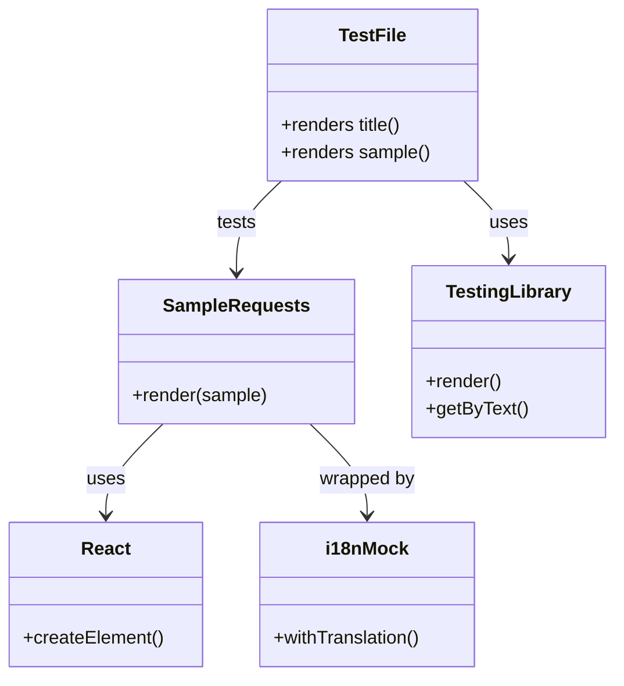

# Diagram: web/portal/src/modules/documentation/documentation-styled-components/tests/SampleRequests.test.js


> Auto-generated by Obscura crawlers

## Diagram 1



### SVG

<svg id="container" width="530.078125" xmlns="http://www.w3.org/2000/svg" class="classDiagram" height="590" viewBox="0 0 530.078125 590" role="graphics-document document" aria-roledescription="class"><style>#container{font-family:"trebuchet ms",verdana,arial,sans-serif;font-size:16px;fill:#333;}@keyframes edge-animation-frame{from{stroke-dashoffset:0;}}@keyframes dash{to{stroke-dashoffset:0;}}#container .edge-animation-slow{stroke-dasharray:9,5!important;stroke-dashoffset:900;animation:dash 50s linear infinite;stroke-linecap:round;}#container .edge-animation-fast{stroke-dasharray:9,5!important;stroke-dashoffset:900;animation:dash 20s linear infinite;stroke-linecap:round;}#container .error-icon{fill:#552222;}#container .error-text{fill:#552222;stroke:#552222;}#container .edge-thickness-normal{stroke-width:1px;}#container .edge-thickness-thick{stroke-width:3.5px;}#container .edge-pattern-solid{stroke-dasharray:0;}#container .edge-thickness-invisible{stroke-width:0;fill:none;}#container .edge-pattern-dashed{stroke-dasharray:3;}#container .edge-pattern-dotted{stroke-dasharray:2;}#container .marker{fill:#333333;stroke:#333333;}#container .marker.cross{stroke:#333333;}#container svg{font-family:"trebuchet ms",verdana,arial,sans-serif;font-size:16px;}#container p{margin:0;}#container g.classGroup text{fill:#9370DB;stroke:none;font-family:"trebuchet ms",verdana,arial,sans-serif;font-size:10px;}#container g.classGroup text .title{font-weight:bolder;}#container .nodeLabel,#container .edgeLabel{color:#131300;}#container .edgeLabel .label rect{fill:#ECECFF;}#container .label text{fill:#131300;}#container .labelBkg{background:#ECECFF;}#container .edgeLabel .label span{background:#ECECFF;}#container .classTitle{font-weight:bolder;}#container .node rect,#container .node circle,#container .node ellipse,#container .node polygon,#container .node path{fill:#ECECFF;stroke:#9370DB;stroke-width:1px;}#container .divider{stroke:#9370DB;stroke-width:1;}#container g.clickable{cursor:pointer;}#container g.classGroup rect{fill:#ECECFF;stroke:#9370DB;}#container g.classGroup line{stroke:#9370DB;stroke-width:1;}#container .classLabel .box{stroke:none;stroke-width:0;fill:#ECECFF;opacity:0.5;}#container .classLabel .label{fill:#9370DB;font-size:10px;}#container .relation{stroke:#333333;stroke-width:1;fill:none;}#container .dashed-line{stroke-dasharray:3;}#container .dotted-line{stroke-dasharray:1 2;}#container #compositionStart,#container .composition{fill:#333333!important;stroke:#333333!important;stroke-width:1;}#container #compositionEnd,#container .composition{fill:#333333!important;stroke:#333333!important;stroke-width:1;}#container #dependencyStart,#container .dependency{fill:#333333!important;stroke:#333333!important;stroke-width:1;}#container #dependencyStart,#container .dependency{fill:#333333!important;stroke:#333333!important;stroke-width:1;}#container #extensionStart,#container .extension{fill:transparent!important;stroke:#333333!important;stroke-width:1;}#container #extensionEnd,#container .extension{fill:transparent!important;stroke:#333333!important;stroke-width:1;}#container #aggregationStart,#container .aggregation{fill:transparent!important;stroke:#333333!important;stroke-width:1;}#container #aggregationEnd,#container .aggregation{fill:transparent!important;stroke:#333333!important;stroke-width:1;}#container #lollipopStart,#container .lollipop{fill:#ECECFF!important;stroke:#333333!important;stroke-width:1;}#container #lollipopEnd,#container .lollipop{fill:#ECECFF!important;stroke:#333333!important;stroke-width:1;}#container .edgeTerminals{font-size:11px;line-height:initial;}#container .classTitleText{text-anchor:middle;font-size:18px;fill:#333;}#container .label-icon{display:inline-block;height:1em;overflow:visible;vertical-align:-0.125em;}#container .node .label-icon path{fill:currentColor;stroke:revert;stroke-width:revert;}#container :root{--mermaid-font-family:"trebuchet ms",verdana,arial,sans-serif;}</style><g><defs><marker id="container_class-aggregationStart" class="marker aggregation class" refX="18" refY="7" markerWidth="190" markerHeight="240" orient="auto"><path d="M 18,7 L9,13 L1,7 L9,1 Z"></path></marker></defs><defs><marker id="container_class-aggregationEnd" class="marker aggregation class" refX="1" refY="7" markerWidth="20" markerHeight="28" orient="auto"><path d="M 18,7 L9,13 L1,7 L9,1 Z"></path></marker></defs><defs><marker id="container_class-extensionStart" class="marker extension class" refX="18" refY="7" markerWidth="190" markerHeight="240" orient="auto"><path d="M 1,7 L18,13 V 1 Z"></path></marker></defs><defs><marker id="container_class-extensionEnd" class="marker extension class" refX="1" refY="7" markerWidth="20" markerHeight="28" orient="auto"><path d="M 1,1 V 13 L18,7 Z"></path></marker></defs><defs><marker id="container_class-compositionStart" class="marker composition class" refX="18" refY="7" markerWidth="190" markerHeight="240" orient="auto"><path d="M 18,7 L9,13 L1,7 L9,1 Z"></path></marker></defs><defs><marker id="container_class-compositionEnd" class="marker composition class" refX="1" refY="7" markerWidth="20" markerHeight="28" orient="auto"><path d="M 18,7 L9,13 L1,7 L9,1 Z"></path></marker></defs><defs><marker id="container_class-dependencyStart" class="marker dependency class" refX="6" refY="7" markerWidth="190" markerHeight="240" orient="auto"><path d="M 5,7 L9,13 L1,7 L9,1 Z"></path></marker></defs><defs><marker id="container_class-dependencyEnd" class="marker dependency class" refX="13" refY="7" markerWidth="20" markerHeight="28" orient="auto"><path d="M 18,7 L9,13 L14,7 L9,1 Z"></path></marker></defs><defs><marker id="container_class-lollipopStart" class="marker lollipop class" refX="13" refY="7" markerWidth="190" markerHeight="240" orient="auto"><circle stroke="black" fill="transparent" cx="7" cy="7" r="6"></circle></marker></defs><defs><marker id="container_class-lollipopEnd" class="marker lollipop class" refX="1" refY="7" markerWidth="190" markerHeight="240" orient="auto"><circle stroke="black" fill="transparent" cx="7" cy="7" r="6"></circle></marker></defs><g class="root"><g class="clusters"></g><g class="edgePaths"><path d="M244.289,158L237.839,164.167C231.388,170.333,218.487,182.667,212.037,196C205.586,209.333,205.586,223.667,205.586,230.833L205.586,238" id="id_TestFile_SampleRequests_1" class="edge-thickness-normal edge-pattern-solid relation" style=";;;" data-edge="true" data-et="edge" data-id="id_TestFile_SampleRequests_1" data-points="W3sieCI6MjQ0LjI4OTM0MTUxNzg1NzE0LCJ5IjoxNTh9LHsieCI6MjA1LjU4NTkzNzUsInkiOjE5NX0seyJ4IjoyMDUuNTg1OTM3NSwieSI6MjQ0fV0=" marker-end="url(#container_class-dependencyEnd)"></path><path d="M401.195,158L407.646,164.167C414.096,170.333,426.997,182.667,433.448,194C439.898,205.333,439.898,215.667,439.898,220.833L439.898,226" id="id_TestFile_TestingLibrary_2" class="edge-thickness-normal edge-pattern-solid relation" style=";;;" data-edge="true" data-et="edge" data-id="id_TestFile_TestingLibrary_2" data-points="W3sieCI6NDAxLjE5NTAzMzQ4MjE0MjksInkiOjE1OH0seyJ4Ijo0MzkuODk4NDM3NSwieSI6MTk1fSx7IngiOjQzOS44OTg0Mzc1LCJ5IjoyMzJ9XQ==" marker-end="url(#container_class-dependencyEnd)"></path><path d="M141.424,370L133.106,378.167C124.789,386.333,108.154,402.667,99.837,416C91.52,429.333,91.52,439.667,91.52,444.833L91.52,450" id="id_SampleRequests_React_3" class="edge-thickness-normal edge-pattern-solid relation" style=";;;" data-edge="true" data-et="edge" data-id="id_SampleRequests_React_3" data-points="W3sieCI6MTQxLjQyMzU4Mzk4NDM3NSwieSI6MzcwfSx7IngiOjkxLjUxOTUzMTI1LCJ5Ijo0MTl9LHsieCI6OTEuNTE5NTMxMjUsInkiOjQ1Nn1d" marker-end="url(#container_class-dependencyEnd)"></path><path d="M269.748,370L278.066,378.167C286.383,386.333,303.018,402.667,311.335,416C319.652,429.333,319.652,439.667,319.652,444.833L319.652,450" id="id_SampleRequests_i18nMock_4" class="edge-thickness-normal edge-pattern-solid relation" style=";;;" data-edge="true" data-et="edge" data-id="id_SampleRequests_i18nMock_4" data-points="W3sieCI6MjY5Ljc0ODI5MTAxNTYyNSwieSI6MzcwfSx7IngiOjMxOS42NTIzNDM3NSwieSI6NDE5fSx7IngiOjMxOS42NTIzNDM3NSwieSI6NDU2fV0=" marker-end="url(#container_class-dependencyEnd)"></path></g><g class="edgeLabels"><g class="edgeLabel" transform="translate(205.5859375, 195)"><g class="label" data-id="id_TestFile_SampleRequests_1" transform="translate(-17.4921875, -12)"><foreignObject width="34.984375" height="24"><div xmlns="http://www.w3.org/1999/xhtml" class="labelBkg" style="display: table-cell; white-space: nowrap; line-height: 1.5; max-width: 200px; text-align: center;"><span class="edgeLabel"><p>tests</p></span></div></foreignObject></g></g><g class="edgeLabel" transform="translate(439.8984375, 195)"><g class="label" data-id="id_TestFile_TestingLibrary_2" transform="translate(-16.4921875, -12)"><foreignObject width="32.984375" height="24"><div xmlns="http://www.w3.org/1999/xhtml" class="labelBkg" style="display: table-cell; white-space: nowrap; line-height: 1.5; max-width: 200px; text-align: center;"><span class="edgeLabel"><p>uses</p></span></div></foreignObject></g></g><g class="edgeLabel" transform="translate(91.51953125, 419)"><g class="label" data-id="id_SampleRequests_React_3" transform="translate(-16.4921875, -12)"><foreignObject width="32.984375" height="24"><div xmlns="http://www.w3.org/1999/xhtml" class="labelBkg" style="display: table-cell; white-space: nowrap; line-height: 1.5; max-width: 200px; text-align: center;"><span class="edgeLabel"><p>uses</p></span></div></foreignObject></g></g><g class="edgeLabel" transform="translate(319.65234375, 419)"><g class="label" data-id="id_SampleRequests_i18nMock_4" transform="translate(-42.3203125, -12)"><foreignObject width="84.640625" height="24"><div xmlns="http://www.w3.org/1999/xhtml" class="labelBkg" style="display: table-cell; white-space: nowrap; line-height: 1.5; max-width: 200px; text-align: center;"><span class="edgeLabel"><p>wrapped by</p></span></div></foreignObject></g></g></g><g class="nodes"><g class="node default" id="classId-SampleRequests-0" transform="translate(205.5859375, 307)"><g class="basic label-container"><path d="M-102.1328125 -63 L102.1328125 -63 L102.1328125 63 L-102.1328125 63" stroke="none" stroke-width="0" fill="#ECECFF" style=""></path><path d="M-102.1328125 -63 C-33.05121280459433 -63, 36.03038689081134 -63, 102.1328125 -63 M-102.1328125 -63 C-48.67239840267658 -63, 4.788015694646845 -63, 102.1328125 -63 M102.1328125 -63 C102.1328125 -32.45598166956742, 102.1328125 -1.911963339134843, 102.1328125 63 M102.1328125 -63 C102.1328125 -28.12841303588297, 102.1328125 6.743173928234057, 102.1328125 63 M102.1328125 63 C52.90947392585566 63, 3.6861353517113145 63, -102.1328125 63 M102.1328125 63 C60.74153547844715 63, 19.350258456894295 63, -102.1328125 63 M-102.1328125 63 C-102.1328125 24.951709868534635, -102.1328125 -13.096580262930729, -102.1328125 -63 M-102.1328125 63 C-102.1328125 16.03211156016809, -102.1328125 -30.93577687966382, -102.1328125 -63" stroke="#9370DB" stroke-width="1.3" fill="none" stroke-dasharray="0 0" style=""></path></g><g class="annotation-group text" transform="translate(0, -39)"></g><g class="label-group text" transform="translate(-61.09375, -39)"><g class="label" style="font-weight: bolder" transform="translate(0,-12)"><foreignObject width="122.1875" height="24"><div xmlns="http://www.w3.org/1999/xhtml" style="display: table-cell; white-space: nowrap; line-height: 1.5; max-width: 170px; text-align: center;"><span class="nodeLabel markdown-node-label" style=""><p>SampleRequests</p></span></div></foreignObject></g></g><g class="members-group text" transform="translate(-90.1328125, 9)"></g><g class="methods-group text" transform="translate(-90.1328125, 39)"><g class="label" style="" transform="translate(0,-12)"><foreignObject width="119.171875" height="24"><div xmlns="http://www.w3.org/1999/xhtml" style="display: table-cell; white-space: nowrap; line-height: 1.5; max-width: 177px; text-align: center;"><span class="nodeLabel markdown-node-label" style=""><p>+render(sample)</p></span></div></foreignObject></g></g><g class="divider" style=""><path d="M-102.1328125 -15 C-42.52411370495208 -15, 17.084585090095842 -15, 102.1328125 -15 M-102.1328125 -15 C-34.836237276067635 -15, 32.46033794786473 -15, 102.1328125 -15" stroke="#9370DB" stroke-width="1.3" fill="none" stroke-dasharray="0 0" style=""></path></g><g class="divider" style=""><path d="M-102.1328125 9 C-35.104272412533305 9, 31.92426767493339 9, 102.1328125 9 M-102.1328125 9 C-30.35866228470441 9, 41.41548793059118 9, 102.1328125 9" stroke="#9370DB" stroke-width="1.3" fill="none" stroke-dasharray="0 0" style=""></path></g></g><g class="node default" id="classId-TestFile-1" transform="translate(322.7421875, 83)"><g class="basic label-container"><path d="M-91.28125 -75 L91.28125 -75 L91.28125 75 L-91.28125 75" stroke="none" stroke-width="0" fill="#ECECFF" style=""></path><path d="M-91.28125 -75 C-24.445916198799736 -75, 42.38941760240053 -75, 91.28125 -75 M-91.28125 -75 C-20.540407813428544 -75, 50.20043437314291 -75, 91.28125 -75 M91.28125 -75 C91.28125 -15.464759576638848, 91.28125 44.070480846722305, 91.28125 75 M91.28125 -75 C91.28125 -41.2851851409206, 91.28125 -7.570370281841207, 91.28125 75 M91.28125 75 C28.799602923417666 75, -33.68204415316467 75, -91.28125 75 M91.28125 75 C27.021016409265002 75, -37.239217181469996 75, -91.28125 75 M-91.28125 75 C-91.28125 25.21113980354899, -91.28125 -24.577720392902023, -91.28125 -75 M-91.28125 75 C-91.28125 36.586159989852455, -91.28125 -1.827680020295091, -91.28125 -75" stroke="#9370DB" stroke-width="1.3" fill="none" stroke-dasharray="0 0" style=""></path></g><g class="annotation-group text" transform="translate(0, -51)"></g><g class="label-group text" transform="translate(-27.921875, -51)"><g class="label" style="font-weight: bolder" transform="translate(0,-12)"><foreignObject width="55.84375" height="24"><div xmlns="http://www.w3.org/1999/xhtml" style="display: table-cell; white-space: nowrap; line-height: 1.5; max-width: 105px; text-align: center;"><span class="nodeLabel markdown-node-label" style=""><p>TestFile</p></span></div></foreignObject></g></g><g class="members-group text" transform="translate(-79.28125, -3)"></g><g class="methods-group text" transform="translate(-79.28125, 27)"><g class="label" style="" transform="translate(0,-12)"><foreignObject width="107.3125" height="24"><div xmlns="http://www.w3.org/1999/xhtml" style="display: table-cell; white-space: nowrap; line-height: 1.5; max-width: 165px; text-align: center;"><span class="nodeLabel markdown-node-label" style=""><p>+renders title()</p></span></div></foreignObject></g><g class="label" style="" transform="translate(0,12)"><foreignObject width="130.640625" height="24"><div xmlns="http://www.w3.org/1999/xhtml" style="display: table-cell; white-space: nowrap; line-height: 1.5; max-width: 188px; text-align: center;"><span class="nodeLabel markdown-node-label" style=""><p>+renders sample()</p></span></div></foreignObject></g></g><g class="divider" style=""><path d="M-91.28125 -27 C-44.30503623311746 -27, 2.671177533765075 -27, 91.28125 -27 M-91.28125 -27 C-44.997674004570165 -27, 1.2859019908596707 -27, 91.28125 -27" stroke="#9370DB" stroke-width="1.3" fill="none" stroke-dasharray="0 0" style=""></path></g><g class="divider" style=""><path d="M-91.28125 -3 C-30.25109169581335 -3, 30.7790666083733 -3, 91.28125 -3 M-91.28125 -3 C-48.89851308915153 -3, -6.5157761783030566 -3, 91.28125 -3" stroke="#9370DB" stroke-width="1.3" fill="none" stroke-dasharray="0 0" style=""></path></g></g><g class="node default" id="classId-React-2" transform="translate(91.51953125, 519)"><g class="basic label-container"><path d="M-83.51953125 -63 L83.51953125 -63 L83.51953125 63 L-83.51953125 63" stroke="none" stroke-width="0" fill="#ECECFF" style=""></path><path d="M-83.51953125 -63 C-25.97274318841098 -63, 31.57404487317804 -63, 83.51953125 -63 M-83.51953125 -63 C-32.99798221551622 -63, 17.523566818967566 -63, 83.51953125 -63 M83.51953125 -63 C83.51953125 -34.44920779689033, 83.51953125 -5.898415593780655, 83.51953125 63 M83.51953125 -63 C83.51953125 -36.604466221113896, 83.51953125 -10.208932442227791, 83.51953125 63 M83.51953125 63 C28.39191910543549 63, -26.735693039129018 63, -83.51953125 63 M83.51953125 63 C44.35310715496781 63, 5.186683059935618 63, -83.51953125 63 M-83.51953125 63 C-83.51953125 23.65500300567301, -83.51953125 -15.689993988653981, -83.51953125 -63 M-83.51953125 63 C-83.51953125 37.04842010323488, -83.51953125 11.096840206469764, -83.51953125 -63" stroke="#9370DB" stroke-width="1.3" fill="none" stroke-dasharray="0 0" style=""></path></g><g class="annotation-group text" transform="translate(0, -39)"></g><g class="label-group text" transform="translate(-20.4609375, -39)"><g class="label" style="font-weight: bolder" transform="translate(0,-12)"><foreignObject width="40.921875" height="24"><div xmlns="http://www.w3.org/1999/xhtml" style="display: table-cell; white-space: nowrap; line-height: 1.5; max-width: 90px; text-align: center;"><span class="nodeLabel markdown-node-label" style=""><p>React</p></span></div></foreignObject></g></g><g class="members-group text" transform="translate(-71.51953125, 9)"></g><g class="methods-group text" transform="translate(-71.51953125, 39)"><g class="label" style="" transform="translate(0,-12)"><foreignObject width="122.578125" height="24"><div xmlns="http://www.w3.org/1999/xhtml" style="display: table-cell; white-space: nowrap; line-height: 1.5; max-width: 180px; text-align: center;"><span class="nodeLabel markdown-node-label" style=""><p>+createElement()</p></span></div></foreignObject></g></g><g class="divider" style=""><path d="M-83.51953125 -15 C-32.37265625073861 -15, 18.774218748522784 -15, 83.51953125 -15 M-83.51953125 -15 C-33.25571679149757 -15, 17.00809766700486 -15, 83.51953125 -15" stroke="#9370DB" stroke-width="1.3" fill="none" stroke-dasharray="0 0" style=""></path></g><g class="divider" style=""><path d="M-83.51953125 9 C-47.191050325559544 9, -10.862569401119089 9, 83.51953125 9 M-83.51953125 9 C-42.63004792227646 9, -1.7405645945529216 9, 83.51953125 9" stroke="#9370DB" stroke-width="1.3" fill="none" stroke-dasharray="0 0" style=""></path></g></g><g class="node default" id="classId-TestingLibrary-3" transform="translate(439.8984375, 307)"><g class="basic label-container"><path d="M-82.1796875 -75 L82.1796875 -75 L82.1796875 75 L-82.1796875 75" stroke="none" stroke-width="0" fill="#ECECFF" style=""></path><path d="M-82.1796875 -75 C-28.435124281719162 -75, 25.309438936561676 -75, 82.1796875 -75 M-82.1796875 -75 C-18.935572483143602 -75, 44.308542533712796 -75, 82.1796875 -75 M82.1796875 -75 C82.1796875 -20.56243956542383, 82.1796875 33.87512086915234, 82.1796875 75 M82.1796875 -75 C82.1796875 -22.074462195435736, 82.1796875 30.85107560912853, 82.1796875 75 M82.1796875 75 C37.36734563934521 75, -7.44499622130958 75, -82.1796875 75 M82.1796875 75 C28.72583746607973 75, -24.728012567840537 75, -82.1796875 75 M-82.1796875 75 C-82.1796875 44.6236884694393, -82.1796875 14.24737693887861, -82.1796875 -75 M-82.1796875 75 C-82.1796875 20.146481212574272, -82.1796875 -34.707037574851455, -82.1796875 -75" stroke="#9370DB" stroke-width="1.3" fill="none" stroke-dasharray="0 0" style=""></path></g><g class="annotation-group text" transform="translate(0, -51)"></g><g class="label-group text" transform="translate(-52.328125, -51)"><g class="label" style="font-weight: bolder" transform="translate(0,-12)"><foreignObject width="104.65625" height="24"><div xmlns="http://www.w3.org/1999/xhtml" style="display: table-cell; white-space: nowrap; line-height: 1.5; max-width: 152px; text-align: center;"><span class="nodeLabel markdown-node-label" style=""><p>TestingLibrary</p></span></div></foreignObject></g></g><g class="members-group text" transform="translate(-70.1796875, -3)"></g><g class="methods-group text" transform="translate(-70.1796875, 27)"><g class="label" style="" transform="translate(0,-12)"><foreignObject width="66.609375" height="24"><div xmlns="http://www.w3.org/1999/xhtml" style="display: table-cell; white-space: nowrap; line-height: 1.5; max-width: 124px; text-align: center;"><span class="nodeLabel markdown-node-label" style=""><p>+render()</p></span></div></foreignObject></g><g class="label" style="" transform="translate(0,12)"><foreignObject width="88.03125" height="24"><div xmlns="http://www.w3.org/1999/xhtml" style="display: table-cell; white-space: nowrap; line-height: 1.5; max-width: 145px; text-align: center;"><span class="nodeLabel markdown-node-label" style=""><p>+getByText()</p></span></div></foreignObject></g></g><g class="divider" style=""><path d="M-82.1796875 -27 C-23.393776997355026 -27, 35.39213350528995 -27, 82.1796875 -27 M-82.1796875 -27 C-45.35437592404357 -27, -8.529064348087147 -27, 82.1796875 -27" stroke="#9370DB" stroke-width="1.3" fill="none" stroke-dasharray="0 0" style=""></path></g><g class="divider" style=""><path d="M-82.1796875 -3 C-16.727477806819323 -3, 48.724731886361354 -3, 82.1796875 -3 M-82.1796875 -3 C-45.37221534340518 -3, -8.564743186810361 -3, 82.1796875 -3" stroke="#9370DB" stroke-width="1.3" fill="none" stroke-dasharray="0 0" style=""></path></g></g><g class="node default" id="classId-i18nMock-4" transform="translate(319.65234375, 519)"><g class="basic label-container"><path d="M-94.61328125 -63 L94.61328125 -63 L94.61328125 63 L-94.61328125 63" stroke="none" stroke-width="0" fill="#ECECFF" style=""></path><path d="M-94.61328125 -63 C-51.26412115494855 -63, -7.914961059897095 -63, 94.61328125 -63 M-94.61328125 -63 C-33.96935807810326 -63, 26.674565093793476 -63, 94.61328125 -63 M94.61328125 -63 C94.61328125 -20.005546415026515, 94.61328125 22.98890716994697, 94.61328125 63 M94.61328125 -63 C94.61328125 -33.97994998329487, 94.61328125 -4.959899966589745, 94.61328125 63 M94.61328125 63 C41.483736059554865 63, -11.645809130890271 63, -94.61328125 63 M94.61328125 63 C37.439897242305875 63, -19.73348676538825 63, -94.61328125 63 M-94.61328125 63 C-94.61328125 17.766683286818775, -94.61328125 -27.46663342636245, -94.61328125 -63 M-94.61328125 63 C-94.61328125 35.723675266271925, -94.61328125 8.447350532543858, -94.61328125 -63" stroke="#9370DB" stroke-width="1.3" fill="none" stroke-dasharray="0 0" style=""></path></g><g class="annotation-group text" transform="translate(0, -39)"></g><g class="label-group text" transform="translate(-34.4453125, -39)"><g class="label" style="font-weight: bolder" transform="translate(0,-12)"><foreignObject width="68.890625" height="24"><div xmlns="http://www.w3.org/1999/xhtml" style="display: table-cell; white-space: nowrap; line-height: 1.5; max-width: 118px; text-align: center;"><span class="nodeLabel markdown-node-label" style=""><p>i18nMock</p></span></div></foreignObject></g></g><g class="members-group text" transform="translate(-82.61328125, 9)"></g><g class="methods-group text" transform="translate(-82.61328125, 39)"><g class="label" style="" transform="translate(0,-12)"><foreignObject width="130.78125" height="24"><div xmlns="http://www.w3.org/1999/xhtml" style="display: table-cell; white-space: nowrap; line-height: 1.5; max-width: 188px; text-align: center;"><span class="nodeLabel markdown-node-label" style=""><p>+withTranslation()</p></span></div></foreignObject></g></g><g class="divider" style=""><path d="M-94.61328125 -15 C-55.62173624198246 -15, -16.630191233964922 -15, 94.61328125 -15 M-94.61328125 -15 C-33.21518282184599 -15, 28.182915606308015 -15, 94.61328125 -15" stroke="#9370DB" stroke-width="1.3" fill="none" stroke-dasharray="0 0" style=""></path></g><g class="divider" style=""><path d="M-94.61328125 9 C-38.669586338809 9, 17.274108572382005 9, 94.61328125 9 M-94.61328125 9 C-32.98237941664992 9, 28.64852241670016 9, 94.61328125 9" stroke="#9370DB" stroke-width="1.3" fill="none" stroke-dasharray="0 0" style=""></path></g></g></g></g></g></svg>

## Diagram 2

```mermaid
flowchart TD
    A[Mock withTranslation] --> B[Component defaultProps.t = key => key]
    B --> C[Render SampleRequests with sample {}]
    C --> D[getByText("documentation:Request Samples")]
    D --> E[expect(...).toBeInTheDocument()]
    C2[Render SampleRequests with sample containing summary] --> F[getByText(summary, { exact: false })]
    F --> G[expect(...).toBeInTheDocument()]
    subgraph Tests
        C
        C2
    end
    A --> Tests
```

> SVG rendering failed for this diagram.
