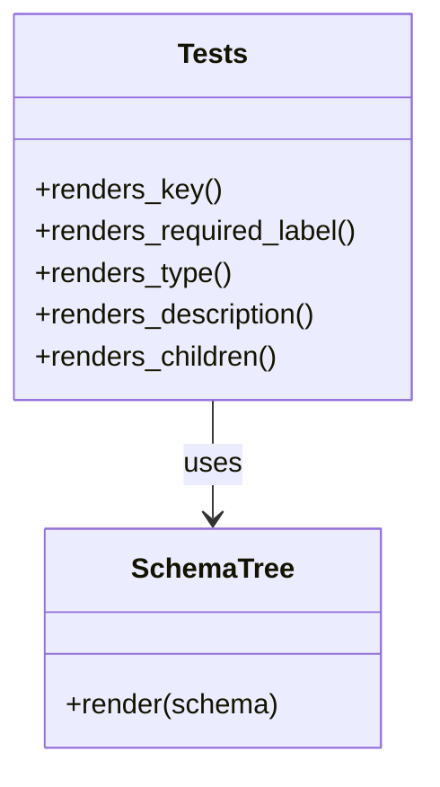

# Diagram: web/portal/src/modules/documentation/documentation-styled-components/tests/SchemaTree.test.js


> Auto-generated by Obscura crawlers

## Diagram 1



### SVG

<svg id="container" width="247.1484375" xmlns="http://www.w3.org/2000/svg" class="classDiagram" height="438" viewBox="0 0 247.1484375 438" role="graphics-document document" aria-roledescription="class"><style>#container{font-family:"trebuchet ms",verdana,arial,sans-serif;font-size:16px;fill:#333;}@keyframes edge-animation-frame{from{stroke-dashoffset:0;}}@keyframes dash{to{stroke-dashoffset:0;}}#container .edge-animation-slow{stroke-dasharray:9,5!important;stroke-dashoffset:900;animation:dash 50s linear infinite;stroke-linecap:round;}#container .edge-animation-fast{stroke-dasharray:9,5!important;stroke-dashoffset:900;animation:dash 20s linear infinite;stroke-linecap:round;}#container .error-icon{fill:#552222;}#container .error-text{fill:#552222;stroke:#552222;}#container .edge-thickness-normal{stroke-width:1px;}#container .edge-thickness-thick{stroke-width:3.5px;}#container .edge-pattern-solid{stroke-dasharray:0;}#container .edge-thickness-invisible{stroke-width:0;fill:none;}#container .edge-pattern-dashed{stroke-dasharray:3;}#container .edge-pattern-dotted{stroke-dasharray:2;}#container .marker{fill:#333333;stroke:#333333;}#container .marker.cross{stroke:#333333;}#container svg{font-family:"trebuchet ms",verdana,arial,sans-serif;font-size:16px;}#container p{margin:0;}#container g.classGroup text{fill:#9370DB;stroke:none;font-family:"trebuchet ms",verdana,arial,sans-serif;font-size:10px;}#container g.classGroup text .title{font-weight:bolder;}#container .nodeLabel,#container .edgeLabel{color:#131300;}#container .edgeLabel .label rect{fill:#ECECFF;}#container .label text{fill:#131300;}#container .labelBkg{background:#ECECFF;}#container .edgeLabel .label span{background:#ECECFF;}#container .classTitle{font-weight:bolder;}#container .node rect,#container .node circle,#container .node ellipse,#container .node polygon,#container .node path{fill:#ECECFF;stroke:#9370DB;stroke-width:1px;}#container .divider{stroke:#9370DB;stroke-width:1;}#container g.clickable{cursor:pointer;}#container g.classGroup rect{fill:#ECECFF;stroke:#9370DB;}#container g.classGroup line{stroke:#9370DB;stroke-width:1;}#container .classLabel .box{stroke:none;stroke-width:0;fill:#ECECFF;opacity:0.5;}#container .classLabel .label{fill:#9370DB;font-size:10px;}#container .relation{stroke:#333333;stroke-width:1;fill:none;}#container .dashed-line{stroke-dasharray:3;}#container .dotted-line{stroke-dasharray:1 2;}#container #compositionStart,#container .composition{fill:#333333!important;stroke:#333333!important;stroke-width:1;}#container #compositionEnd,#container .composition{fill:#333333!important;stroke:#333333!important;stroke-width:1;}#container #dependencyStart,#container .dependency{fill:#333333!important;stroke:#333333!important;stroke-width:1;}#container #dependencyStart,#container .dependency{fill:#333333!important;stroke:#333333!important;stroke-width:1;}#container #extensionStart,#container .extension{fill:transparent!important;stroke:#333333!important;stroke-width:1;}#container #extensionEnd,#container .extension{fill:transparent!important;stroke:#333333!important;stroke-width:1;}#container #aggregationStart,#container .aggregation{fill:transparent!important;stroke:#333333!important;stroke-width:1;}#container #aggregationEnd,#container .aggregation{fill:transparent!important;stroke:#333333!important;stroke-width:1;}#container #lollipopStart,#container .lollipop{fill:#ECECFF!important;stroke:#333333!important;stroke-width:1;}#container #lollipopEnd,#container .lollipop{fill:#ECECFF!important;stroke:#333333!important;stroke-width:1;}#container .edgeTerminals{font-size:11px;line-height:initial;}#container .classTitleText{text-anchor:middle;font-size:18px;fill:#333;}#container .label-icon{display:inline-block;height:1em;overflow:visible;vertical-align:-0.125em;}#container .node .label-icon path{fill:currentColor;stroke:revert;stroke-width:revert;}#container :root{--mermaid-font-family:"trebuchet ms",verdana,arial,sans-serif;}</style><g><defs><marker id="container_class-aggregationStart" class="marker aggregation class" refX="18" refY="7" markerWidth="190" markerHeight="240" orient="auto"><path d="M 18,7 L9,13 L1,7 L9,1 Z"></path></marker></defs><defs><marker id="container_class-aggregationEnd" class="marker aggregation class" refX="1" refY="7" markerWidth="20" markerHeight="28" orient="auto"><path d="M 18,7 L9,13 L1,7 L9,1 Z"></path></marker></defs><defs><marker id="container_class-extensionStart" class="marker extension class" refX="18" refY="7" markerWidth="190" markerHeight="240" orient="auto"><path d="M 1,7 L18,13 V 1 Z"></path></marker></defs><defs><marker id="container_class-extensionEnd" class="marker extension class" refX="1" refY="7" markerWidth="20" markerHeight="28" orient="auto"><path d="M 1,1 V 13 L18,7 Z"></path></marker></defs><defs><marker id="container_class-compositionStart" class="marker composition class" refX="18" refY="7" markerWidth="190" markerHeight="240" orient="auto"><path d="M 18,7 L9,13 L1,7 L9,1 Z"></path></marker></defs><defs><marker id="container_class-compositionEnd" class="marker composition class" refX="1" refY="7" markerWidth="20" markerHeight="28" orient="auto"><path d="M 18,7 L9,13 L1,7 L9,1 Z"></path></marker></defs><defs><marker id="container_class-dependencyStart" class="marker dependency class" refX="6" refY="7" markerWidth="190" markerHeight="240" orient="auto"><path d="M 5,7 L9,13 L1,7 L9,1 Z"></path></marker></defs><defs><marker id="container_class-dependencyEnd" class="marker dependency class" refX="13" refY="7" markerWidth="20" markerHeight="28" orient="auto"><path d="M 18,7 L9,13 L14,7 L9,1 Z"></path></marker></defs><defs><marker id="container_class-lollipopStart" class="marker lollipop class" refX="13" refY="7" markerWidth="190" markerHeight="240" orient="auto"><circle stroke="black" fill="transparent" cx="7" cy="7" r="6"></circle></marker></defs><defs><marker id="container_class-lollipopEnd" class="marker lollipop class" refX="1" refY="7" markerWidth="190" markerHeight="240" orient="auto"><circle stroke="black" fill="transparent" cx="7" cy="7" r="6"></circle></marker></defs><g class="root"><g class="clusters"></g><g class="edgePaths"><path d="M123.574,230L123.574,236.167C123.574,242.333,123.574,254.667,123.574,266C123.574,277.333,123.574,287.667,123.574,292.833L123.574,298" id="id_Tests_SchemaTree_1" class="edge-thickness-normal edge-pattern-solid relation" style=";;;" data-edge="true" data-et="edge" data-id="id_Tests_SchemaTree_1" data-points="W3sieCI6MTIzLjU3NDIxODc1LCJ5IjoyMzB9LHsieCI6MTIzLjU3NDIxODc1LCJ5IjoyNjd9LHsieCI6MTIzLjU3NDIxODc1LCJ5IjozMDR9XQ==" marker-end="url(#container_class-dependencyEnd)"></path></g><g class="edgeLabels"><g class="edgeLabel" transform="translate(123.57421875, 267)"><g class="label" data-id="id_Tests_SchemaTree_1" transform="translate(-16.4921875, -12)"><foreignObject width="32.984375" height="24"><div xmlns="http://www.w3.org/1999/xhtml" class="labelBkg" style="display: table-cell; white-space: nowrap; line-height: 1.5; max-width: 200px; text-align: center;"><span class="edgeLabel"><p>uses</p></span></div></foreignObject></g></g></g><g class="nodes"><g class="node default" id="classId-SchemaTree-0" transform="translate(123.57421875, 367)"><g class="basic label-container"><path d="M-95.359375 -63 L95.359375 -63 L95.359375 63 L-95.359375 63" stroke="none" stroke-width="0" fill="#ECECFF" style=""></path><path d="M-95.359375 -63 C-34.33117927576391 -63, 26.697016448472183 -63, 95.359375 -63 M-95.359375 -63 C-34.997097840914584 -63, 25.36517931817083 -63, 95.359375 -63 M95.359375 -63 C95.359375 -28.59653132223781, 95.359375 5.806937355524383, 95.359375 63 M95.359375 -63 C95.359375 -30.320365633203842, 95.359375 2.359268733592316, 95.359375 63 M95.359375 63 C48.16772799944739 63, 0.9760809988947869 63, -95.359375 63 M95.359375 63 C47.52054403363883 63, -0.3182869327223443 63, -95.359375 63 M-95.359375 63 C-95.359375 16.335257022631332, -95.359375 -30.329485954737336, -95.359375 -63 M-95.359375 63 C-95.359375 22.567535048062993, -95.359375 -17.864929903874014, -95.359375 -63" stroke="#9370DB" stroke-width="1.3" fill="none" stroke-dasharray="0 0" style=""></path></g><g class="annotation-group text" transform="translate(0, -39)"></g><g class="label-group text" transform="translate(-44.46875, -39)"><g class="label" style="font-weight: bolder" transform="translate(0,-12)"><foreignObject width="88.9375" height="24"><div xmlns="http://www.w3.org/1999/xhtml" style="display: table-cell; white-space: nowrap; line-height: 1.5; max-width: 138px; text-align: center;"><span class="nodeLabel markdown-node-label" style=""><p>SchemaTree</p></span></div></foreignObject></g></g><g class="members-group text" transform="translate(-83.359375, 9)"></g><g class="methods-group text" transform="translate(-83.359375, 39)"><g class="label" style="" transform="translate(0,-12)"><foreignObject width="122.25" height="24"><div xmlns="http://www.w3.org/1999/xhtml" style="display: table-cell; white-space: nowrap; line-height: 1.5; max-width: 180px; text-align: center;"><span class="nodeLabel markdown-node-label" style=""><p>+render(schema)</p></span></div></foreignObject></g></g><g class="divider" style=""><path d="M-95.359375 -15 C-33.25941829580645 -15, 28.840538408387104 -15, 95.359375 -15 M-95.359375 -15 C-50.982283583050894 -15, -6.605192166101787 -15, 95.359375 -15" stroke="#9370DB" stroke-width="1.3" fill="none" stroke-dasharray="0 0" style=""></path></g><g class="divider" style=""><path d="M-95.359375 9 C-51.79341451776319 9, -8.227454035526378 9, 95.359375 9 M-95.359375 9 C-49.61242280260245 9, -3.865470605204905 9, 95.359375 9" stroke="#9370DB" stroke-width="1.3" fill="none" stroke-dasharray="0 0" style=""></path></g></g><g class="node default" id="classId-Tests-1" transform="translate(123.57421875, 119)"><g class="basic label-container"><path d="M-115.57421875 -111 L115.57421875 -111 L115.57421875 111 L-115.57421875 111" stroke="none" stroke-width="0" fill="#ECECFF" style=""></path><path d="M-115.57421875 -111 C-52.895595532830036 -111, 9.783027684339928 -111, 115.57421875 -111 M-115.57421875 -111 C-52.288732256266556 -111, 10.996754237466888 -111, 115.57421875 -111 M115.57421875 -111 C115.57421875 -22.223041181491936, 115.57421875 66.55391763701613, 115.57421875 111 M115.57421875 -111 C115.57421875 -55.519558992288786, 115.57421875 -0.03911798457757243, 115.57421875 111 M115.57421875 111 C58.107537176339896 111, 0.6408556026797925 111, -115.57421875 111 M115.57421875 111 C31.29654132969202 111, -52.98113609061596 111, -115.57421875 111 M-115.57421875 111 C-115.57421875 23.2905105909891, -115.57421875 -64.4189788180218, -115.57421875 -111 M-115.57421875 111 C-115.57421875 40.666536730640615, -115.57421875 -29.66692653871877, -115.57421875 -111" stroke="#9370DB" stroke-width="1.3" fill="none" stroke-dasharray="0 0" style=""></path></g><g class="annotation-group text" transform="translate(0, -87)"></g><g class="label-group text" transform="translate(-19.1171875, -87)"><g class="label" style="font-weight: bolder" transform="translate(0,-12)"><foreignObject width="38.234375" height="24"><div xmlns="http://www.w3.org/1999/xhtml" style="display: table-cell; white-space: nowrap; line-height: 1.5; max-width: 87px; text-align: center;"><span class="nodeLabel markdown-node-label" style=""><p>Tests</p></span></div></foreignObject></g></g><g class="members-group text" transform="translate(-103.57421875, -39)"></g><g class="methods-group text" transform="translate(-103.57421875, -9)"><g class="label" style="" transform="translate(0,-12)"><foreignObject width="106.421875" height="24"><div xmlns="http://www.w3.org/1999/xhtml" style="display: table-cell; white-space: nowrap; line-height: 1.5; max-width: 164px; text-align: center;"><span class="nodeLabel markdown-node-label" style=""><p>+renders_key()</p></span></div></foreignObject></g><g class="label" style="" transform="translate(0,12)"><foreignObject width="188.03125" height="24"><div xmlns="http://www.w3.org/1999/xhtml" style="display: table-cell; white-space: nowrap; line-height: 1.5; max-width: 245px; text-align: center;"><span class="nodeLabel markdown-node-label" style=""><p>+renders_required_label()</p></span></div></foreignObject></g><g class="label" style="" transform="translate(0,36)"><foreignObject width="113.3125" height="24"><div xmlns="http://www.w3.org/1999/xhtml" style="display: table-cell; white-space: nowrap; line-height: 1.5; max-width: 171px; text-align: center;"><span class="nodeLabel markdown-node-label" style=""><p>+renders_type()</p></span></div></foreignObject></g><g class="label" style="" transform="translate(0,60)"><foreignObject width="164.140625" height="24"><div xmlns="http://www.w3.org/1999/xhtml" style="display: table-cell; white-space: nowrap; line-height: 1.5; max-width: 222px; text-align: center;"><span class="nodeLabel markdown-node-label" style=""><p>+renders_description()</p></span></div></foreignObject></g><g class="label" style="" transform="translate(0,84)"><foreignObject width="141.03125" height="24"><div xmlns="http://www.w3.org/1999/xhtml" style="display: table-cell; white-space: nowrap; line-height: 1.5; max-width: 198px; text-align: center;"><span class="nodeLabel markdown-node-label" style=""><p>+renders_children()</p></span></div></foreignObject></g></g><g class="divider" style=""><path d="M-115.57421875 -63 C-47.92043929788284 -63, 19.733340154234327 -63, 115.57421875 -63 M-115.57421875 -63 C-34.228674199164374 -63, 47.11687035167125 -63, 115.57421875 -63" stroke="#9370DB" stroke-width="1.3" fill="none" stroke-dasharray="0 0" style=""></path></g><g class="divider" style=""><path d="M-115.57421875 -39 C-68.0499628216874 -39, -20.525706893374803 -39, 115.57421875 -39 M-115.57421875 -39 C-59.43365332873472 -39, -3.2930879074694417 -39, 115.57421875 -39" stroke="#9370DB" stroke-width="1.3" fill="none" stroke-dasharray="0 0" style=""></path></g></g></g></g></g></svg>

## Diagram 2

```mermaid
flowchart TD
    Start([Start]) --> Render[Render SchemaTree with schema]
    Render --> HasProps{schema.properties?}
    HasProps -->|yes| DisplayKeys[Display property keys]
    HasProps -->|no| Empty[Show empty state]
    DisplayKeys --> CheckAttrs{property has type/description/children/required?}
    CheckAttrs -->|type| ShowType[Show type text]
    CheckAttrs -->|description| ShowDesc[Show description text]
    CheckAttrs -->|children| RenderChild[Render nested SchemaTree]
    CheckAttrs -->|required| ShowReq[Show "documentation:Required" label]
    ShowType --> Assert[Assert text present]
    ShowDesc --> Assert
    RenderChild --> Assert
    ShowReq --> Assert
    Empty --> Assert
    Assert --> End([End])
```

> SVG rendering failed for this diagram.
