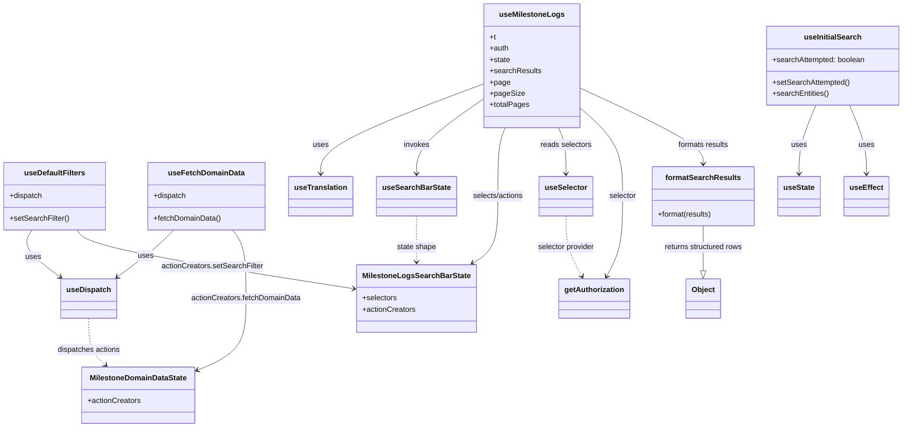

# Diagram: web/portal/src/modules/documentation/milestone-logs/MilestoneLogsHooks.js

> Auto-generated by Obscura crawlers

## Mermaid

### SVG

<svg id="container" width="1902.83203125" xmlns="http://www.w3.org/2000/svg" class="classDiagram" height="910" viewBox="0 0 1902.83203125 910" role="graphics-document document" aria-roledescription="class"><g><defs><marker id="container_class-aggregationStart" class="marker aggregation class" refX="18" refY="7" markerWidth="190" markerHeight="240" orient="auto"><path d="M 18,7 L9,13 L1,7 L9,1 Z"></path></marker></defs><defs><marker id="container_class-aggregationEnd" class="marker aggregation class" refX="1" refY="7" markerWidth="20" markerHeight="28" orient="auto"><path d="M 18,7 L9,13 L1,7 L9,1 Z"></path></marker></defs><defs><marker id="container_class-extensionStart" class="marker extension class" refX="18" refY="7" markerWidth="190" markerHeight="240" orient="auto"><path d="M 1,7 L18,13 V 1 Z"></path></marker></defs><defs><marker id="container_class-extensionEnd" class="marker extension class" refX="1" refY="7" markerWidth="20" markerHeight="28" orient="auto"><path d="M 1,1 V 13 L18,7 Z"></path></marker></defs><defs><marker id="container_class-compositionStart" class="marker composition class" refX="18" refY="7" markerWidth="190" markerHeight="240" orient="auto"><path d="M 18,7 L9,13 L1,7 L9,1 Z"></path></marker></defs><defs><marker id="container_class-compositionEnd" class="marker composition class" refX="1" refY="7" markerWidth="20" markerHeight="28" orient="auto"><path d="M 18,7 L9,13 L1,7 L9,1 Z"></path></marker></defs><defs><marker id="container_class-dependencyStart" class="marker dependency class" refX="6" refY="7" markerWidth="190" markerHeight="240" orient="auto"><path d="M 5,7 L9,13 L1,7 L9,1 Z"></path></marker></defs><defs><marker id="container_class-dependencyEnd" class="marker dependency class" refX="13" refY="7" markerWidth="20" markerHeight="28" orient="auto"><path d="M 18,7 L9,13 L14,7 L9,1 Z"></path></marker></defs><defs><marker id="container_class-lollipopStart" class="marker lollipop class" refX="13" refY="7" markerWidth="190" markerHeight="240" orient="auto"><circle stroke="black" fill="transparent" cx="7" cy="7" r="6"></circle></marker></defs><defs><marker id="container_class-lollipopEnd" class="marker lollipop class" refX="1" refY="7" markerWidth="190" markerHeight="240" orient="auto"><circle stroke="black" fill="transparent" cx="7" cy="7" r="6"></circle></marker></defs><g class="root"><g class="clusters"></g><g class="edgePaths"><path d="M1017.668,177.799L960.461,199.666C903.254,221.532,788.84,265.266,731.633,297.3C674.426,329.333,674.426,349.667,674.426,359.833L674.426,370" id="id_useMilestoneLogs_useTranslation_1" class="edge-thickness-normal edge-pattern-solid relation" style=";;;" data-edge="true" data-et="edge" data-id="id_useMilestoneLogs_useTranslation_1" data-points="W3sieCI6MTAxNy42Njc5Njg3NSwieSI6MTc3Ljc5ODYwNDA1NTMwNzd9LHsieCI6Njc0LjQyNTc4MTI1LCJ5IjozMDl9LHsieCI6Njc0LjQyNTc4MTI1LCJ5IjozNzZ9XQ==" marker-end="url(#container_class-dependencyEnd)"></path><path d="M1017.668,208.315L993.378,225.096C969.087,241.877,920.507,275.438,896.216,302.386C871.926,329.333,871.926,349.667,871.926,359.833L871.926,370" id="id_useMilestoneLogs_useSearchBarState_2" class="edge-thickness-normal edge-pattern-solid relation" style=";;;" data-edge="true" data-et="edge" data-id="id_useMilestoneLogs_useSearchBarState_2" data-points="W3sieCI6MTAxNy42Njc5Njg3NSwieSI6MjA4LjMxNTEyOTc0MDUxODk2fSx7IngiOjg3MS45MjU3ODEyNSwieSI6MzA5fSx7IngiOjg3MS45MjU3ODEyNSwieSI6Mzc2fV0=" marker-end="url(#container_class-dependencyEnd)"></path><path d="M1059.674,272L1057.017,278.167C1054.36,284.333,1049.045,296.667,1046.388,321C1043.73,345.333,1043.73,381.667,1043.73,418C1043.73,454.333,1043.73,490.667,1034.855,514.464C1025.98,538.262,1008.229,549.524,999.353,555.155L990.478,560.786" id="id_useMilestoneLogs_MilestoneLogsSearchBarState_3" class="edge-thickness-normal edge-pattern-solid relation" style=";;;" data-edge="true" data-et="edge" data-id="id_useMilestoneLogs_MilestoneLogsSearchBarState_3" data-points="W3sieCI6MTA1OS42NzQyMzI2MTgzNDMyLCJ5IjoyNzJ9LHsieCI6MTA0My43MzA0Njg3NSwieSI6MzA5fSx7IngiOjEwNDMuNzMwNDY4NzUsInkiOjQxOH0seyJ4IjoxMDQzLjczMDQ2ODc1LCJ5Ijo1Mjd9LHsieCI6OTg1LjQxMTQ0NjM4NzYxNDcsInkiOjU2NH1d" marker-end="url(#container_class-dependencyEnd)"></path><path d="M1173.435,272L1176.092,278.167C1178.75,284.333,1184.064,296.667,1186.722,313C1189.379,329.333,1189.379,349.667,1189.379,359.833L1189.379,370" id="id_useMilestoneLogs_useSelector_4" class="edge-thickness-normal edge-pattern-solid relation" style=";;;" data-edge="true" data-et="edge" data-id="id_useMilestoneLogs_useSelector_4" data-points="W3sieCI6MTE3My40MzUxNDIzODE2NTY4LCJ5IjoyNzJ9LHsieCI6MTE4OS4zNzg5MDYyNSwieSI6MzA5fSx7IngiOjExODkuMzc4OTA2MjUsInkiOjM3Nn1d" marker-end="url(#container_class-dependencyEnd)"></path><path d="M1215.441,226.951L1230.993,240.626C1246.546,254.3,1277.65,281.65,1293.202,313.492C1308.754,345.333,1308.754,381.667,1308.754,418C1308.754,454.333,1308.754,490.667,1303.119,519.123C1297.485,547.579,1286.216,568.158,1280.582,578.448L1274.947,588.737" id="id_useMilestoneLogs_getAuthorization_5" class="edge-thickness-normal edge-pattern-solid relation" style=";;;" data-edge="true" data-et="edge" data-id="id_useMilestoneLogs_getAuthorization_5" data-points="W3sieCI6MTIxNS40NDE0MDYyNSwieSI6MjI2Ljk1MDY5NDA2MzM3MDEyfSx7IngiOjEzMDguNzUzOTA2MjUsInkiOjMwOX0seyJ4IjoxMzA4Ljc1MzkwNjI1LCJ5Ijo0MTh9LHsieCI6MTMwOC43NTM5MDYyNSwieSI6NTI3fSx7IngiOjEyNzIuMDY1MjU5NDYxMDA5MiwieSI6NTk0fV0=" marker-end="url(#container_class-dependencyEnd)"></path><path d="M1215.441,185.824L1259.743,206.353C1304.046,226.882,1392.65,267.941,1436.952,295.137C1481.254,322.333,1481.254,335.667,1481.254,342.333L1481.254,349" id="id_useMilestoneLogs_formatSearchResults_6" class="edge-thickness-normal edge-pattern-solid relation" style=";;;" data-edge="true" data-et="edge" data-id="id_useMilestoneLogs_formatSearchResults_6" data-points="W3sieCI6MTIxNS40NDE0MDYyNSwieSI6MTg1LjgyMzY2Njc2MzA2NDU4fSx7IngiOjE0ODEuMjUzOTA2MjUsInkiOjMwOX0seyJ4IjoxNDgxLjI1MzkwNjI1LCJ5IjozNTV9XQ==" marker-end="url(#container_class-dependencyEnd)"></path><path d="M66.213,490L62.113,496.167C58.014,502.333,49.816,514.667,59.763,531.399C69.711,548.131,97.804,569.262,111.851,579.828L125.898,590.393" id="id_useDefaultFilters_useDispatch_7" class="edge-thickness-normal edge-pattern-solid relation" style=";;;" data-edge="true" data-et="edge" data-id="id_useDefaultFilters_useDispatch_7" data-points="W3sieCI6NjYuMjEyNjkzNTIwNjQyMiwieSI6NDkwfSx7IngiOjQxLjYxNzE4NzUsInkiOjUyN30seyJ4IjoxMzAuNjkyODAzODk5MDgyNTgsInkiOjU5NH1d" marker-end="url(#container_class-dependencyEnd)"></path><path d="M161.936,490L166.035,496.167C170.134,502.333,178.333,514.667,275.159,535.58C371.984,556.493,557.438,585.986,650.164,600.733L742.891,615.479" id="id_useDefaultFilters_MilestoneLogsSearchBarState_8" class="edge-thickness-normal edge-pattern-solid relation" style=";;;" data-edge="true" data-et="edge" data-id="id_useDefaultFilters_MilestoneLogsSearchBarState_8" data-points="W3sieCI6MTYxLjkzNTc0Mzk3OTM1NzgsInkiOjQ5MH0seyJ4IjoxODYuNTMxMjUsInkiOjUyN30seyJ4Ijo3NDguODE2NDA2MjUsInkiOjYxNi40MjE2MDkzNjA0ODQ3fV0=" marker-end="url(#container_class-dependencyEnd)"></path><path d="M1719.024,224L1713.154,238.167C1707.285,252.333,1695.547,280.667,1689.678,305C1683.809,329.333,1683.809,349.667,1683.809,359.833L1683.809,370" id="id_useInitialSearch_useState_9" class="edge-thickness-normal edge-pattern-solid relation" style=";;;" data-edge="true" data-et="edge" data-id="id_useInitialSearch_useState_9" data-points="W3sieCI6MTcxOS4wMjM1NTMwNjk1MjY1LCJ5IjoyMjR9LHsieCI6MTY4My44MDg1OTM3NSwieSI6MzA5fSx7IngiOjE2ODMuODA4NTkzNzUsInkiOjM3Nn1d" marker-end="url(#container_class-dependencyEnd)"></path><path d="M1788.625,224L1794.494,238.167C1800.363,252.333,1812.102,280.667,1817.971,305C1823.84,329.333,1823.84,349.667,1823.84,359.833L1823.84,370" id="id_useInitialSearch_useEffect_10" class="edge-thickness-normal edge-pattern-solid relation" style=";;;" data-edge="true" data-et="edge" data-id="id_useInitialSearch_useEffect_10" data-points="W3sieCI6MTc4OC42MjQ4ODQ0MzA0NzM1LCJ5IjoyMjR9LHsieCI6MTgyMy44Mzk4NDM3NSwieSI6MzA5fSx7IngiOjE4MjMuODM5ODQzNzUsInkiOjM3Nn1d" marker-end="url(#container_class-dependencyEnd)"></path><path d="M366.91,490L360.999,496.167C355.088,502.333,343.267,514.667,323.309,531.399C303.352,548.131,275.258,569.262,261.211,579.828L247.165,590.393" id="id_useFetchDomainData_useDispatch_11" class="edge-thickness-normal edge-pattern-solid relation" style=";;;" data-edge="true" data-et="edge" data-id="id_useFetchDomainData_useDispatch_11" data-points="W3sieCI6MzY2LjkwOTgzMzcxNTU5NjMzLCJ5Ijo0OTB9LHsieCI6MzMxLjQ0NTMxMjUsInkiOjUyN30seyJ4IjoyNDIuMzY5Njk2MTAwOTE3NDIsInkiOjU5NH1d" marker-end="url(#container_class-dependencyEnd)"></path><path d="M488.963,490L493.506,496.167C498.049,502.333,507.135,514.667,511.678,539C516.221,563.333,516.221,599.667,516.221,636C516.221,672.333,516.221,708.667,499.352,734.099C482.484,759.531,448.747,774.061,431.879,781.326L415.011,788.592" id="id_useFetchDomainData_MilestoneDomainDataState_12" class="edge-thickness-normal edge-pattern-solid relation" style=";;;" data-edge="true" data-et="edge" data-id="id_useFetchDomainData_MilestoneDomainDataState_12" data-points="W3sieCI6NDg4Ljk2MzMwMjc1MjI5MzYsInkiOjQ5MH0seyJ4Ijo1MTYuMjIwNzAzMTI1LCJ5Ijo1Mjd9LHsieCI6NTE2LjIyMDcwMzEyNSwieSI6NjM2fSx7IngiOjUxNi4yMjA3MDMxMjUsInkiOjc0NX0seyJ4Ijo0MDkuNSwieSI6NzkwLjk2NDk4OTcyMzI2NTN9XQ==" marker-end="url(#container_class-dependencyEnd)"></path><path d="M1481.254,481L1481.254,488.667C1481.254,496.333,1481.254,511.667,1481.254,527.625C1481.254,543.583,1481.254,560.167,1481.254,568.458L1481.254,576.75" id="id_formatSearchResults_Object_13" class="edge-thickness-normal edge-pattern-solid relation" style=";;;" data-edge="true" data-et="edge" data-id="id_formatSearchResults_Object_13" data-points="W3sieCI6MTQ4MS4yNTM5MDYyNSwieSI6NDgxfSx7IngiOjE0ODEuMjUzOTA2MjUsInkiOjUyN30seyJ4IjoxNDgxLjI1MzkwNjI1LCJ5Ijo1OTR9XQ==" marker-end="url(#container_class-extensionEnd)"></path><path d="M871.926,460L871.926,471.167C871.926,482.333,871.926,504.667,871.926,521C871.926,537.333,871.926,547.667,871.926,552.833L871.926,558" id="id_useSearchBarState_MilestoneLogsSearchBarState_14" class="edge-thickness-normal edge-pattern-dashed relation" style=";;;" data-edge="true" data-et="edge" data-id="id_useSearchBarState_MilestoneLogsSearchBarState_14" data-points="W3sieCI6ODcxLjkyNTc4MTI1LCJ5Ijo0NjB9LHsieCI6ODcxLjkyNTc4MTI1LCJ5Ijo1Mjd9LHsieCI6ODcxLjkyNTc4MTI1LCJ5Ijo1NjR9XQ==" marker-end="url(#container_class-dependencyEnd)"></path><path d="M1189.379,460L1189.379,471.167C1189.379,482.333,1189.379,504.667,1195.013,526.123C1200.648,547.579,1211.917,568.158,1217.551,578.448L1223.186,588.737" id="id_useSelector_getAuthorization_15" class="edge-thickness-normal edge-pattern-dashed relation" style=";;;" data-edge="true" data-et="edge" data-id="id_useSelector_getAuthorization_15" data-points="W3sieCI6MTE4OS4zNzg5MDYyNSwieSI6NDYwfSx7IngiOjExODkuMzc4OTA2MjUsInkiOjUyN30seyJ4IjoxMjI2LjA2NzU1MzAzODk5MDgsInkiOjU5NH1d" marker-end="url(#container_class-dependencyEnd)"></path><path d="M186.531,678L186.531,689.167C186.531,700.333,186.531,722.667,192.44,739.32C198.35,755.973,210.168,766.945,216.077,772.431L221.986,777.918" id="id_useDispatch_MilestoneDomainDataState_16" class="edge-thickness-normal edge-pattern-dashed relation" style=";;;" data-edge="true" data-et="edge" data-id="id_useDispatch_MilestoneDomainDataState_16" data-points="W3sieCI6MTg2LjUzMTI1LCJ5Ijo2Nzh9LHsieCI6MTg2LjUzMTI1LCJ5Ijo3NDV9LHsieCI6MjI2LjM4MzEzNDY2NDk0ODQ0LCJ5Ijo3ODJ9XQ==" marker-end="url(#container_class-dependencyEnd)"></path></g><g class="edgeLabels"><g class="edgeLabel" transform="translate(674.42578125, 309)"><g class="label" data-id="id_useMilestoneLogs_useTranslation_1" transform="translate(-16.4921875, -12)"><foreignObject width="32.984375" height="24">

uses

</foreignObject></g></g><g class="edgeLabel" transform="translate(871.92578125, 309)"><g class="label" data-id="id_useMilestoneLogs_useSearchBarState_2" transform="translate(-27.5859375, -12)"><foreignObject width="55.171875" height="24">

invokes

</foreignObject></g></g><g class="edgeLabel" transform="translate(1043.73046875, 418)"><g class="label" data-id="id_useMilestoneLogs_MilestoneLogsSearchBarState_3" transform="translate(-55.390625, -12)"><foreignObject width="110.78125" height="24">

selects/actions

</foreignObject></g></g><g class="edgeLabel" transform="translate(1189.37890625, 309)"><g class="label" data-id="id_useMilestoneLogs_useSelector_4" transform="translate(-54.8515625, -12)"><foreignObject width="109.703125" height="24">

reads selectors

</foreignObject></g></g><g class="edgeLabel" transform="translate(1308.75390625, 418)"><g class="label" data-id="id_useMilestoneLogs_getAuthorization_5" transform="translate(-29.1171875, -12)"><foreignObject width="58.234375" height="24">

selector

</foreignObject></g></g><g class="edgeLabel" transform="translate(1481.25390625, 309)"><g class="label" data-id="id_useMilestoneLogs_formatSearchResults_6" transform="translate(-54.8828125, -12)"><foreignObject width="109.765625" height="24">

formats results

</foreignObject></g></g><g class="edgeLabel" transform="translate(68.40189, 547.14665)"><g class="label" data-id="id_useDefaultFilters_useDispatch_7" transform="translate(-16.4921875, -12)"><foreignObject width="32.984375" height="24">

uses

</foreignObject></g></g><g class="edgeLabel" transform="translate(445.73501, 568.22182)"><g class="label" data-id="id_useDefaultFilters_MilestoneLogsSearchBarState_8" transform="translate(-108.421875, -12)"><foreignObject width="216.84375" height="24">

actionCreators.setSearchFilter

</foreignObject></g></g><g class="edgeLabel" transform="translate(1683.80859375, 309)"><g class="label" data-id="id_useInitialSearch_useState_9" transform="translate(-16.4921875, -12)"><foreignObject width="32.984375" height="24">

uses

</foreignObject></g></g><g class="edgeLabel" transform="translate(1823.83984375, 309)"><g class="label" data-id="id_useInitialSearch_useEffect_10" transform="translate(-16.4921875, -12)"><foreignObject width="32.984375" height="24">

uses

</foreignObject></g></g><g class="edgeLabel" transform="translate(307.38682, 545.09608)"><g class="label" data-id="id_useFetchDomainData_useDispatch_11" transform="translate(-16.4921875, -12)"><foreignObject width="32.984375" height="24">

uses

</foreignObject></g></g><g class="edgeLabel" transform="translate(516.220703125, 636)"><g class="label" data-id="id_useFetchDomainData_MilestoneDomainDataState_12" transform="translate(-117.296875, -12)"><foreignObject width="234.59375" height="24">

actionCreators.fetchDomainData

</foreignObject></g></g><g class="edgeLabel" transform="translate(1481.25390625, 527)"><g class="label" data-id="id_formatSearchResults_Object_13" transform="translate(-85.2265625, -12)"><foreignObject width="170.453125" height="24">

returns structured rows

</foreignObject></g></g><g class="edgeLabel" transform="translate(871.92578125, 527)"><g class="label" data-id="id_useSearchBarState_MilestoneLogsSearchBarState_14" transform="translate(-42.0625, -12)"><foreignObject width="84.125" height="24">

state shape

</foreignObject></g></g><g class="edgeLabel" transform="translate(1189.37890625, 527)"><g class="label" data-id="id_useSelector_getAuthorization_15" transform="translate(-61.8984375, -12)"><foreignObject width="123.796875" height="24">

selector provider

</foreignObject></g></g><g class="edgeLabel" transform="translate(186.53125, 745)"><g class="label" data-id="id_useDispatch_MilestoneDomainDataState_16" transform="translate(-67.71875, -12)"><foreignObject width="135.4375" height="24">

dispatches actions

</foreignObject></g></g></g><g class="nodes"><g class="node default" id="classId-useMilestoneLogs-0" transform="translate(1116.5546875, 140)"><g class="basic label-container"><path d="M-98.88671875 -132 L98.88671875 -132 L98.88671875 132 L-98.88671875 132" stroke="none" stroke-width="0" fill="#ECECFF" style=""></path><path d="M-98.88671875 -132 C-50.18706504618645 -132, -1.4874113423728943 -132, 98.88671875 -132 M-98.88671875 -132 C-37.68332181831014 -132, 23.52007511337972 -132, 98.88671875 -132 M98.88671875 -132 C98.88671875 -39.29853925357364, 98.88671875 53.40292149285273, 98.88671875 132 M98.88671875 -132 C98.88671875 -70.55554040208378, 98.88671875 -9.111080804167557, 98.88671875 132 M98.88671875 132 C56.03545070374806 132, 13.184182657496123 132, -98.88671875 132 M98.88671875 132 C33.65031404691493 132, -31.586090656170143 132, -98.88671875 132 M-98.88671875 132 C-98.88671875 41.00019943053735, -98.88671875 -49.9996011389253, -98.88671875 -132 M-98.88671875 132 C-98.88671875 60.82705057209155, -98.88671875 -10.345898855816898, -98.88671875 -132" stroke="#9370DB" stroke-width="1.3" fill="none" stroke-dasharray="0 0" style=""></path></g><g class="annotation-group text" transform="translate(0, -108)"></g><g class="label-group text" transform="translate(-65.4453125, -108)"><g class="label" style="font-weight: bolder" transform="translate(0,-12)"><foreignObject width="130.890625" height="24">

useMilestoneLogs

</foreignObject></g></g><g class="members-group text" transform="translate(-86.88671875, -60)"><g class="label" style="" transform="translate(0,-12)"><foreignObject width="13.6875" height="24">

+t

</foreignObject></g><g class="label" style="" transform="translate(0,12)"><foreignObject width="40.921875" height="24">

+auth

</foreignObject></g><g class="label" style="" transform="translate(0,36)"><foreignObject width="44.09375" height="24">

+state

</foreignObject></g><g class="label" style="" transform="translate(0,60)"><foreignObject width="108.328125" height="24">

+searchResults

</foreignObject></g><g class="label" style="" transform="translate(0,84)"><foreignObject width="42.65625" height="24">

+page

</foreignObject></g><g class="label" style="" transform="translate(0,108)"><foreignObject width="71.5" height="24">

+pageSize

</foreignObject></g><g class="label" style="" transform="translate(0,132)"><foreignObject width="82.90625" height="24">

+totalPages

</foreignObject></g></g><g class="methods-group text" transform="translate(-86.88671875, 132)"></g><g class="divider" style=""><path d="M-98.88671875 -84 C-32.29553613568834 -84, 34.295646478623325 -84, 98.88671875 -84 M-98.88671875 -84 C-47.90746869477777 -84, 3.0717813604444615 -84, 98.88671875 -84" stroke="#9370DB" stroke-width="1.3" fill="none" stroke-dasharray="0 0" style=""></path></g><g class="divider" style=""><path d="M-98.88671875 108 C-26.523664785198036 108, 45.83938917960393 108, 98.88671875 108 M-98.88671875 108 C-22.640720514352722 108, 53.605277721294556 108, 98.88671875 108" stroke="#9370DB" stroke-width="1.3" fill="none" stroke-dasharray="0 0" style=""></path></g></g><g class="node default" id="classId-useDefaultFilters-1" transform="translate(114.07421875, 418)"><g class="basic label-container"><path d="M-106.07421875 -72 L106.07421875 -72 L106.07421875 72 L-106.07421875 72" stroke="none" stroke-width="0" fill="#ECECFF" style=""></path><path d="M-106.07421875 -72 C-23.309889583137647 -72, 59.45443958372471 -72, 106.07421875 -72 M-106.07421875 -72 C-23.179390190375386 -72, 59.71543836924923 -72, 106.07421875 -72 M106.07421875 -72 C106.07421875 -20.07277999758481, 106.07421875 31.85444000483038, 106.07421875 72 M106.07421875 -72 C106.07421875 -17.548907785765707, 106.07421875 36.90218442846859, 106.07421875 72 M106.07421875 72 C44.75792847096589 72, -16.558361808068213 72, -106.07421875 72 M106.07421875 72 C23.42987959045162 72, -59.21445956909676 72, -106.07421875 72 M-106.07421875 72 C-106.07421875 29.641618618679217, -106.07421875 -12.716762762641565, -106.07421875 -72 M-106.07421875 72 C-106.07421875 37.217802337230594, -106.07421875 2.435604674461189, -106.07421875 -72" stroke="#9370DB" stroke-width="1.3" fill="none" stroke-dasharray="0 0" style=""></path></g><g class="annotation-group text" transform="translate(0, -48)"></g><g class="label-group text" transform="translate(-62.1953125, -48)"><g class="label" style="font-weight: bolder" transform="translate(0,-12)"><foreignObject width="124.390625" height="24">

useDefaultFilters

</foreignObject></g></g><g class="members-group text" transform="translate(-94.07421875, 0)"><g class="label" style="" transform="translate(0,-12)"><foreignObject width="70.15625" height="24">

+dispatch

</foreignObject></g></g><g class="methods-group text" transform="translate(-94.07421875, 48)"><g class="label" style="" transform="translate(0,-12)"><foreignObject width="125.953125" height="24">

+setSearchFilter()

</foreignObject></g></g><g class="divider" style=""><path d="M-106.07421875 -24 C-53.04598472706304 -24, -0.017750704126086703 -24, 106.07421875 -24 M-106.07421875 -24 C-53.93799908643603 -24, -1.801779422872059 -24, 106.07421875 -24" stroke="#9370DB" stroke-width="1.3" fill="none" stroke-dasharray="0 0" style=""></path></g><g class="divider" style=""><path d="M-106.07421875 24 C-31.53488116214602 24, 43.00445642570796 24, 106.07421875 24 M-106.07421875 24 C-44.278877138922695 24, 17.51646447215461 24, 106.07421875 24" stroke="#9370DB" stroke-width="1.3" fill="none" stroke-dasharray="0 0" style=""></path></g></g><g class="node default" id="classId-useInitialSearch-2" transform="translate(1753.82421875, 140)"><g class="basic label-container"><path d="M-141.0078125 -84 L141.0078125 -84 L141.0078125 84 L-141.0078125 84" stroke="none" stroke-width="0" fill="#ECECFF" style=""></path><path d="M-141.0078125 -84 C-61.053888975284394 -84, 18.90003454943121 -84, 141.0078125 -84 M-141.0078125 -84 C-46.575062347237505 -84, 47.85768780552499 -84, 141.0078125 -84 M141.0078125 -84 C141.0078125 -35.65628453944152, 141.0078125 12.687430921116956, 141.0078125 84 M141.0078125 -84 C141.0078125 -47.06960932867804, 141.0078125 -10.139218657356082, 141.0078125 84 M141.0078125 84 C66.73730573642018 84, -7.533201027159635 84, -141.0078125 84 M141.0078125 84 C83.60207933499743 84, 26.19634616999484 84, -141.0078125 84 M-141.0078125 84 C-141.0078125 21.48552311160089, -141.0078125 -41.02895377679822, -141.0078125 -84 M-141.0078125 84 C-141.0078125 24.788074248475695, -141.0078125 -34.42385150304861, -141.0078125 -84" stroke="#9370DB" stroke-width="1.3" fill="none" stroke-dasharray="0 0" style=""></path></g><g class="annotation-group text" transform="translate(0, -60)"></g><g class="label-group text" transform="translate(-58.8125, -60)"><g class="label" style="font-weight: bolder" transform="translate(0,-12)"><foreignObject width="117.625" height="24">

useInitialSearch

</foreignObject></g></g><g class="members-group text" transform="translate(-129.0078125, -12)"><g class="label" style="" transform="translate(0,-12)"><foreignObject width="199.203125" height="24">

+searchAttempted: boolean

</foreignObject></g></g><g class="methods-group text" transform="translate(-129.0078125, 36)"><g class="label" style="" transform="translate(0,-12)"><foreignObject width="165.265625" height="24">

+setSearchAttempted()

</foreignObject></g><g class="label" style="" transform="translate(0,12)"><foreignObject width="120.359375" height="24">

+searchEntities()

</foreignObject></g></g><g class="divider" style=""><path d="M-141.0078125 -36 C-36.32375541173293 -36, 68.36030167653414 -36, 141.0078125 -36 M-141.0078125 -36 C-37.59600409391061 -36, 65.81580431217878 -36, 141.0078125 -36" stroke="#9370DB" stroke-width="1.3" fill="none" stroke-dasharray="0 0" style=""></path></g><g class="divider" style=""><path d="M-141.0078125 12 C-66.11417370116713 12, 8.779465097665735 12, 141.0078125 12 M-141.0078125 12 C-70.3047543671989 12, 0.3983037656022077 12, 141.0078125 12" stroke="#9370DB" stroke-width="1.3" fill="none" stroke-dasharray="0 0" style=""></path></g></g><g class="node default" id="classId-useFetchDomainData-3" transform="translate(435.921875, 418)"><g class="basic label-container"><path d="M-122.41796875 -72 L122.41796875 -72 L122.41796875 72 L-122.41796875 72" stroke="none" stroke-width="0" fill="#ECECFF" style=""></path><path d="M-122.41796875 -72 C-55.784993749088216 -72, 10.847981251823569 -72, 122.41796875 -72 M-122.41796875 -72 C-56.71692311728863 -72, 8.98412251542274 -72, 122.41796875 -72 M122.41796875 -72 C122.41796875 -40.97788465026427, 122.41796875 -9.955769300528551, 122.41796875 72 M122.41796875 -72 C122.41796875 -28.243537796726457, 122.41796875 15.512924406547086, 122.41796875 72 M122.41796875 72 C58.69424984129013 72, -5.02946906741974 72, -122.41796875 72 M122.41796875 72 C37.86096188675495 72, -46.6960449764901 72, -122.41796875 72 M-122.41796875 72 C-122.41796875 24.342214607800237, -122.41796875 -23.315570784399526, -122.41796875 -72 M-122.41796875 72 C-122.41796875 32.16568759149288, -122.41796875 -7.6686248170142335, -122.41796875 -72" stroke="#9370DB" stroke-width="1.3" fill="none" stroke-dasharray="0 0" style=""></path></g><g class="annotation-group text" transform="translate(0, -48)"></g><g class="label-group text" transform="translate(-77.0703125, -48)"><g class="label" style="font-weight: bolder" transform="translate(0,-12)"><foreignObject width="154.140625" height="24">

useFetchDomainData

</foreignObject></g></g><g class="members-group text" transform="translate(-110.41796875, 0)"><g class="label" style="" transform="translate(0,-12)"><foreignObject width="70.15625" height="24">

+dispatch

</foreignObject></g></g><g class="methods-group text" transform="translate(-110.41796875, 48)"><g class="label" style="" transform="translate(0,-12)"><foreignObject width="143.765625" height="24">

+fetchDomainData()

</foreignObject></g></g><g class="divider" style=""><path d="M-122.41796875 -24 C-57.91210527238202 -24, 6.593758205235957 -24, 122.41796875 -24 M-122.41796875 -24 C-43.747620551990636 -24, 34.92272764601873 -24, 122.41796875 -24" stroke="#9370DB" stroke-width="1.3" fill="none" stroke-dasharray="0 0" style=""></path></g><g class="divider" style=""><path d="M-122.41796875 24 C-44.31745086046942 24, 33.78306702906116 24, 122.41796875 24 M-122.41796875 24 C-61.244205574302455 24, -0.07044239860491075 24, 122.41796875 24" stroke="#9370DB" stroke-width="1.3" fill="none" stroke-dasharray="0 0" style=""></path></g></g><g class="node default" id="classId-formatSearchResults-4" transform="translate(1481.25390625, 418)"><g class="basic label-container"><path d="M-108.3828125 -63 L108.3828125 -63 L108.3828125 63 L-108.3828125 63" stroke="none" stroke-width="0" fill="#ECECFF" style=""></path><path d="M-108.3828125 -63 C-64.46427579867861 -63, -20.54573909735724 -63, 108.3828125 -63 M-108.3828125 -63 C-48.89058596902227 -63, 10.601640561955463 -63, 108.3828125 -63 M108.3828125 -63 C108.3828125 -18.986776101225743, 108.3828125 25.026447797548514, 108.3828125 63 M108.3828125 -63 C108.3828125 -26.076030017469385, 108.3828125 10.84793996506123, 108.3828125 63 M108.3828125 63 C27.65286392227071 63, -53.07708465545858 63, -108.3828125 63 M108.3828125 63 C37.705935645481745 63, -32.97094120903651 63, -108.3828125 63 M-108.3828125 63 C-108.3828125 35.922849732244444, -108.3828125 8.845699464488888, -108.3828125 -63 M-108.3828125 63 C-108.3828125 24.304561517196973, -108.3828125 -14.390876965606054, -108.3828125 -63" stroke="#9370DB" stroke-width="1.3" fill="none" stroke-dasharray="0 0" style=""></path></g><g class="annotation-group text" transform="translate(0, -39)"></g><g class="label-group text" transform="translate(-76.59375, -39)"><g class="label" style="font-weight: bolder" transform="translate(0,-12)"><foreignObject width="153.1875" height="24">

formatSearchResults

</foreignObject></g></g><g class="members-group text" transform="translate(-96.3828125, 9)"></g><g class="methods-group text" transform="translate(-96.3828125, 39)"><g class="label" style="" transform="translate(0,-12)"><foreignObject width="116.171875" height="24">

+format(results)

</foreignObject></g></g><g class="divider" style=""><path d="M-108.3828125 -15 C-59.95133874867079 -15, -11.519864997341585 -15, 108.3828125 -15 M-108.3828125 -15 C-55.50748733892223 -15, -2.6321621778444637 -15, 108.3828125 -15" stroke="#9370DB" stroke-width="1.3" fill="none" stroke-dasharray="0 0" style=""></path></g><g class="divider" style=""><path d="M-108.3828125 9 C-30.58568121649175 9, 47.2114500670165 9, 108.3828125 9 M-108.3828125 9 C-63.84717988468167 9, -19.311547269363345 9, 108.3828125 9" stroke="#9370DB" stroke-width="1.3" fill="none" stroke-dasharray="0 0" style=""></path></g></g><g class="node default" id="classId-MilestoneLogsSearchBarState-5" transform="translate(871.92578125, 636)"><g class="basic label-container"><path d="M-123.109375 -72 L123.109375 -72 L123.109375 72 L-123.109375 72" stroke="none" stroke-width="0" fill="#ECECFF" style=""></path><path d="M-123.109375 -72 C-41.32404034132047 -72, 40.46129431735906 -72, 123.109375 -72 M-123.109375 -72 C-48.095759448737596 -72, 26.91785610252481 -72, 123.109375 -72 M123.109375 -72 C123.109375 -19.20419987220596, 123.109375 33.59160025558808, 123.109375 72 M123.109375 -72 C123.109375 -34.919377722148454, 123.109375 2.1612445557030924, 123.109375 72 M123.109375 72 C41.3934910353705 72, -40.322392929258996 72, -123.109375 72 M123.109375 72 C61.628481990070995 72, 0.14758898014198962 72, -123.109375 72 M-123.109375 72 C-123.109375 29.293386056638695, -123.109375 -13.41322788672261, -123.109375 -72 M-123.109375 72 C-123.109375 17.635054170281265, -123.109375 -36.72989165943747, -123.109375 -72" stroke="#9370DB" stroke-width="1.3" fill="none" stroke-dasharray="0 0" style=""></path></g><g class="annotation-group text" transform="translate(0, -48)"></g><g class="label-group text" transform="translate(-109.140625, -48)"><g class="label" style="font-weight: bolder" transform="translate(0,-12)"><foreignObject width="218.28125" height="24">

MilestoneLogsSearchBarState

</foreignObject></g></g><g class="members-group text" transform="translate(-111.109375, 0)"><g class="label" style="" transform="translate(0,-12)"><foreignObject width="73.453125" height="24">

+selectors

</foreignObject></g><g class="label" style="" transform="translate(0,12)"><foreignObject width="113.078125" height="24">

+actionCreators

</foreignObject></g></g><g class="methods-group text" transform="translate(-111.109375, 72)"></g><g class="divider" style=""><path d="M-123.109375 -24 C-54.79769889446442 -24, 13.513977211071165 -24, 123.109375 -24 M-123.109375 -24 C-39.21250750482726 -24, 44.684359990345484 -24, 123.109375 -24" stroke="#9370DB" stroke-width="1.3" fill="none" stroke-dasharray="0 0" style=""></path></g><g class="divider" style=""><path d="M-123.109375 48 C-36.432579694777644 48, 50.24421561044471 48, 123.109375 48 M-123.109375 48 C-72.64340457066962 48, -22.177434141339248 48, 123.109375 48" stroke="#9370DB" stroke-width="1.3" fill="none" stroke-dasharray="0 0" style=""></path></g></g><g class="node default" id="classId-MilestoneDomainDataState-6" transform="translate(291.0078125, 842)"><g class="basic label-container"><path d="M-118.4921875 -60 L118.4921875 -60 L118.4921875 60 L-118.4921875 60" stroke="none" stroke-width="0" fill="#ECECFF" style=""></path><path d="M-118.4921875 -60 C-48.33791242506659 -60, 21.816362649866818 -60, 118.4921875 -60 M-118.4921875 -60 C-27.84702875394187 -60, 62.79812999211626 -60, 118.4921875 -60 M118.4921875 -60 C118.4921875 -33.84236393666723, 118.4921875 -7.684727873334467, 118.4921875 60 M118.4921875 -60 C118.4921875 -15.321083212787173, 118.4921875 29.357833574425655, 118.4921875 60 M118.4921875 60 C45.908047477932584 60, -26.676092544134832 60, -118.4921875 60 M118.4921875 60 C34.50999742998694 60, -49.47219264002612 60, -118.4921875 60 M-118.4921875 60 C-118.4921875 22.820333288206918, -118.4921875 -14.359333423586165, -118.4921875 -60 M-118.4921875 60 C-118.4921875 23.9047008054796, -118.4921875 -12.190598389040801, -118.4921875 -60" stroke="#9370DB" stroke-width="1.3" fill="none" stroke-dasharray="0 0" style=""></path></g><g class="annotation-group text" transform="translate(0, -36)"></g><g class="label-group text" transform="translate(-99.90625, -36)"><g class="label" style="font-weight: bolder" transform="translate(0,-12)"><foreignObject width="199.8125" height="24">

MilestoneDomainDataState

</foreignObject></g></g><g class="members-group text" transform="translate(-106.4921875, 12)"><g class="label" style="" transform="translate(0,-12)"><foreignObject width="113.078125" height="24">

+actionCreators

</foreignObject></g></g><g class="methods-group text" transform="translate(-106.4921875, 60)"></g><g class="divider" style=""><path d="M-118.4921875 -12 C-60.23231158877625 -12, -1.9724356775524967 -12, 118.4921875 -12 M-118.4921875 -12 C-40.7066477193039 -12, 37.078892061392196 -12, 118.4921875 -12" stroke="#9370DB" stroke-width="1.3" fill="none" stroke-dasharray="0 0" style=""></path></g><g class="divider" style=""><path d="M-118.4921875 36 C-29.437216380319285 36, 59.61775473936143 36, 118.4921875 36 M-118.4921875 36 C-26.39406972616719 36, 65.70404804766562 36, 118.4921875 36" stroke="#9370DB" stroke-width="1.3" fill="none" stroke-dasharray="0 0" style=""></path></g></g><g class="node default" id="classId-useSearchBarState-7" transform="translate(871.92578125, 418)"><g class="basic label-container"><path d="M-81.4140625 -42 L81.4140625 -42 L81.4140625 42 L-81.4140625 42" stroke="none" stroke-width="0" fill="#ECECFF" style=""></path><path d="M-81.4140625 -42 C-44.099913802864705 -42, -6.785765105729411 -42, 81.4140625 -42 M-81.4140625 -42 C-33.17379784043919 -42, 15.066466819121615 -42, 81.4140625 -42 M81.4140625 -42 C81.4140625 -23.471327361971763, 81.4140625 -4.942654723943527, 81.4140625 42 M81.4140625 -42 C81.4140625 -9.030819779935378, 81.4140625 23.938360440129244, 81.4140625 42 M81.4140625 42 C40.84909993223856 42, 0.2841373644771181 42, -81.4140625 42 M81.4140625 42 C36.181420556451755 42, -9.05122138709649 42, -81.4140625 42 M-81.4140625 42 C-81.4140625 22.71721875923609, -81.4140625 3.43443751847218, -81.4140625 -42 M-81.4140625 42 C-81.4140625 15.084839105761574, -81.4140625 -11.830321788476851, -81.4140625 -42" stroke="#9370DB" stroke-width="1.3" fill="none" stroke-dasharray="0 0" style=""></path></g><g class="annotation-group text" transform="translate(0, -18)"></g><g class="label-group text" transform="translate(-69.4140625, -18)"><g class="label" style="font-weight: bolder" transform="translate(0,-12)"><foreignObject width="138.828125" height="24">

useSearchBarState

</foreignObject></g></g><g class="members-group text" transform="translate(-69.4140625, 30)"></g><g class="methods-group text" transform="translate(-69.4140625, 60)"></g><g class="divider" style=""><path d="M-81.4140625 6 C-36.88166542421802 6, 7.650731651563959 6, 81.4140625 6 M-81.4140625 6 C-33.8667157314404 6, 13.680631037119198 6, 81.4140625 6" stroke="#9370DB" stroke-width="1.3" fill="none" stroke-dasharray="0 0" style=""></path></g><g class="divider" style=""><path d="M-81.4140625 24 C-24.418792547762507 24, 32.576477404474986 24, 81.4140625 24 M-81.4140625 24 C-32.334716432617036 24, 16.74462963476593 24, 81.4140625 24" stroke="#9370DB" stroke-width="1.3" fill="none" stroke-dasharray="0 0" style=""></path></g></g><g class="node default" id="classId-useTranslation-8" transform="translate(674.42578125, 418)"><g class="basic label-container"><path d="M-66.0859375 -42 L66.0859375 -42 L66.0859375 42 L-66.0859375 42" stroke="none" stroke-width="0" fill="#ECECFF" style=""></path><path d="M-66.0859375 -42 C-14.263767477287608 -42, 37.558402545424784 -42, 66.0859375 -42 M-66.0859375 -42 C-21.769451628780615 -42, 22.54703424243877 -42, 66.0859375 -42 M66.0859375 -42 C66.0859375 -20.55979209538331, 66.0859375 0.8804158092333765, 66.0859375 42 M66.0859375 -42 C66.0859375 -23.307188298997573, 66.0859375 -4.614376597995147, 66.0859375 42 M66.0859375 42 C23.21725085377355 42, -19.6514357924529 42, -66.0859375 42 M66.0859375 42 C17.35588142213762 42, -31.374174655724758 42, -66.0859375 42 M-66.0859375 42 C-66.0859375 19.493390398187014, -66.0859375 -3.0132192036259724, -66.0859375 -42 M-66.0859375 42 C-66.0859375 11.573169556623842, -66.0859375 -18.853660886752316, -66.0859375 -42" stroke="#9370DB" stroke-width="1.3" fill="none" stroke-dasharray="0 0" style=""></path></g><g class="annotation-group text" transform="translate(0, -18)"></g><g class="label-group text" transform="translate(-54.0859375, -18)"><g class="label" style="font-weight: bolder" transform="translate(0,-12)"><foreignObject width="108.171875" height="24">

useTranslation

</foreignObject></g></g><g class="members-group text" transform="translate(-54.0859375, 30)"></g><g class="methods-group text" transform="translate(-54.0859375, 60)"></g><g class="divider" style=""><path d="M-66.0859375 6 C-20.271556009092606 6, 25.542825481814788 6, 66.0859375 6 M-66.0859375 6 C-15.41765080284516 6, 35.25063589430968 6, 66.0859375 6" stroke="#9370DB" stroke-width="1.3" fill="none" stroke-dasharray="0 0" style=""></path></g><g class="divider" style=""><path d="M-66.0859375 24 C-15.096009807475603 24, 35.89391788504879 24, 66.0859375 24 M-66.0859375 24 C-17.523482778034392 24, 31.038971943931216 24, 66.0859375 24" stroke="#9370DB" stroke-width="1.3" fill="none" stroke-dasharray="0 0" style=""></path></g></g><g class="node default" id="classId-useDispatch-9" transform="translate(186.53125, 636)"><g class="basic label-container"><path d="M-56.65625 -42 L56.65625 -42 L56.65625 42 L-56.65625 42" stroke="none" stroke-width="0" fill="#ECECFF" style=""></path><path d="M-56.65625 -42 C-25.802747610074864 -42, 5.050754779850273 -42, 56.65625 -42 M-56.65625 -42 C-11.521778823659055 -42, 33.61269235268189 -42, 56.65625 -42 M56.65625 -42 C56.65625 -19.713062753770622, 56.65625 2.5738744924587564, 56.65625 42 M56.65625 -42 C56.65625 -21.521087597321106, 56.65625 -1.042175194642212, 56.65625 42 M56.65625 42 C14.110309732505634 42, -28.435630534988732 42, -56.65625 42 M56.65625 42 C20.029005604576227 42, -16.598238790847546 42, -56.65625 42 M-56.65625 42 C-56.65625 22.23770782170512, -56.65625 2.475415643410237, -56.65625 -42 M-56.65625 42 C-56.65625 9.786638447005771, -56.65625 -22.426723105988458, -56.65625 -42" stroke="#9370DB" stroke-width="1.3" fill="none" stroke-dasharray="0 0" style=""></path></g><g class="annotation-group text" transform="translate(0, -18)"></g><g class="label-group text" transform="translate(-44.65625, -18)"><g class="label" style="font-weight: bolder" transform="translate(0,-12)"><foreignObject width="89.3125" height="24">

useDispatch

</foreignObject></g></g><g class="members-group text" transform="translate(-44.65625, 30)"></g><g class="methods-group text" transform="translate(-44.65625, 60)"></g><g class="divider" style=""><path d="M-56.65625 6 C-22.3336772274998 6, 11.988895545000403 6, 56.65625 6 M-56.65625 6 C-19.05373919589831 6, 18.54877160820338 6, 56.65625 6" stroke="#9370DB" stroke-width="1.3" fill="none" stroke-dasharray="0 0" style=""></path></g><g class="divider" style=""><path d="M-56.65625 24 C-17.571203594397105 24, 21.51384281120579 24, 56.65625 24 M-56.65625 24 C-25.32556346835384 24, 6.0051230632923165 24, 56.65625 24" stroke="#9370DB" stroke-width="1.3" fill="none" stroke-dasharray="0 0" style=""></path></g></g><g class="node default" id="classId-useSelector-10" transform="translate(1189.37890625, 418)"><g class="basic label-container"><path d="M-55.2578125 -42 L55.2578125 -42 L55.2578125 42 L-55.2578125 42" stroke="none" stroke-width="0" fill="#ECECFF" style=""></path><path d="M-55.2578125 -42 C-24.400444428482864 -42, 6.456923643034273 -42, 55.2578125 -42 M-55.2578125 -42 C-23.637228322409033 -42, 7.983355855181934 -42, 55.2578125 -42 M55.2578125 -42 C55.2578125 -18.31455632567911, 55.2578125 5.37088734864178, 55.2578125 42 M55.2578125 -42 C55.2578125 -9.840455422808198, 55.2578125 22.319089154383605, 55.2578125 42 M55.2578125 42 C17.558011844147252 42, -20.141788811705496 42, -55.2578125 42 M55.2578125 42 C30.785595640494734 42, 6.313378780989467 42, -55.2578125 42 M-55.2578125 42 C-55.2578125 24.488317987089918, -55.2578125 6.976635974179835, -55.2578125 -42 M-55.2578125 42 C-55.2578125 24.25322512794324, -55.2578125 6.506450255886477, -55.2578125 -42" stroke="#9370DB" stroke-width="1.3" fill="none" stroke-dasharray="0 0" style=""></path></g><g class="annotation-group text" transform="translate(0, -18)"></g><g class="label-group text" transform="translate(-43.2578125, -18)"><g class="label" style="font-weight: bolder" transform="translate(0,-12)"><foreignObject width="86.515625" height="24">

useSelector

</foreignObject></g></g><g class="members-group text" transform="translate(-43.2578125, 30)"></g><g class="methods-group text" transform="translate(-43.2578125, 60)"></g><g class="divider" style=""><path d="M-55.2578125 6 C-15.346278537060691 6, 24.565255425878618 6, 55.2578125 6 M-55.2578125 6 C-29.203364614890358 6, -3.1489167297807157 6, 55.2578125 6" stroke="#9370DB" stroke-width="1.3" fill="none" stroke-dasharray="0 0" style=""></path></g><g class="divider" style=""><path d="M-55.2578125 24 C-11.278089209886389 24, 32.70163408022722 24, 55.2578125 24 M-55.2578125 24 C-16.63910597770409 24, 21.97960054459182 24, 55.2578125 24" stroke="#9370DB" stroke-width="1.3" fill="none" stroke-dasharray="0 0" style=""></path></g></g><g class="node default" id="classId-getAuthorization-11" transform="translate(1249.06640625, 636)"><g class="basic label-container"><path d="M-73.4453125 -42 L73.4453125 -42 L73.4453125 42 L-73.4453125 42" stroke="none" stroke-width="0" fill="#ECECFF" style=""></path><path d="M-73.4453125 -42 C-20.762578209922985 -42, 31.92015608015403 -42, 73.4453125 -42 M-73.4453125 -42 C-30.73340089322386 -42, 11.978510713552282 -42, 73.4453125 -42 M73.4453125 -42 C73.4453125 -21.550209513644845, 73.4453125 -1.1004190272896892, 73.4453125 42 M73.4453125 -42 C73.4453125 -18.807527861489437, 73.4453125 4.384944277021127, 73.4453125 42 M73.4453125 42 C38.4924790581535 42, 3.5396456163069985 42, -73.4453125 42 M73.4453125 42 C38.97026748633885 42, 4.495222472677696 42, -73.4453125 42 M-73.4453125 42 C-73.4453125 19.02263561263241, -73.4453125 -3.9547287747351803, -73.4453125 -42 M-73.4453125 42 C-73.4453125 13.380484430310641, -73.4453125 -15.239031139378717, -73.4453125 -42" stroke="#9370DB" stroke-width="1.3" fill="none" stroke-dasharray="0 0" style=""></path></g><g class="annotation-group text" transform="translate(0, -18)"></g><g class="label-group text" transform="translate(-61.4453125, -18)"><g class="label" style="font-weight: bolder" transform="translate(0,-12)"><foreignObject width="122.890625" height="24">

getAuthorization

</foreignObject></g></g><g class="members-group text" transform="translate(-61.4453125, 30)"></g><g class="methods-group text" transform="translate(-61.4453125, 60)"></g><g class="divider" style=""><path d="M-73.4453125 6 C-15.973991659556248 6, 41.497329180887505 6, 73.4453125 6 M-73.4453125 6 C-38.90235123324746 6, -4.359389966494916 6, 73.4453125 6" stroke="#9370DB" stroke-width="1.3" fill="none" stroke-dasharray="0 0" style=""></path></g><g class="divider" style=""><path d="M-73.4453125 24 C-39.4320511245823 24, -5.418789749164603 24, 73.4453125 24 M-73.4453125 24 C-29.449108768678528 24, 14.547094962642944 24, 73.4453125 24" stroke="#9370DB" stroke-width="1.3" fill="none" stroke-dasharray="0 0" style=""></path></g></g><g class="node default" id="classId-useState-12" transform="translate(1683.80859375, 418)"><g class="basic label-container"><path d="M-44.171875 -42 L44.171875 -42 L44.171875 42 L-44.171875 42" stroke="none" stroke-width="0" fill="#ECECFF" style=""></path><path d="M-44.171875 -42 C-25.21082640284332 -42, -6.249777805686641 -42, 44.171875 -42 M-44.171875 -42 C-23.493106753073693 -42, -2.8143385061473865 -42, 44.171875 -42 M44.171875 -42 C44.171875 -14.235370034367815, 44.171875 13.52925993126437, 44.171875 42 M44.171875 -42 C44.171875 -11.236758891621232, 44.171875 19.526482216757536, 44.171875 42 M44.171875 42 C22.70563547314815 42, 1.2393959462962982 42, -44.171875 42 M44.171875 42 C18.030301947323384 42, -8.111271105353232 42, -44.171875 42 M-44.171875 42 C-44.171875 24.391481581299697, -44.171875 6.782963162599394, -44.171875 -42 M-44.171875 42 C-44.171875 19.17543536779673, -44.171875 -3.6491292644065396, -44.171875 -42" stroke="#9370DB" stroke-width="1.3" fill="none" stroke-dasharray="0 0" style=""></path></g><g class="annotation-group text" transform="translate(0, -18)"></g><g class="label-group text" transform="translate(-32.171875, -18)"><g class="label" style="font-weight: bolder" transform="translate(0,-12)"><foreignObject width="64.34375" height="24">

useState

</foreignObject></g></g><g class="members-group text" transform="translate(-32.171875, 30)"></g><g class="methods-group text" transform="translate(-32.171875, 60)"></g><g class="divider" style=""><path d="M-44.171875 6 C-22.098529320813736 6, -0.02518364162747133 6, 44.171875 6 M-44.171875 6 C-12.699034840049013 6, 18.773805319901975 6, 44.171875 6" stroke="#9370DB" stroke-width="1.3" fill="none" stroke-dasharray="0 0" style=""></path></g><g class="divider" style=""><path d="M-44.171875 24 C-21.873982664512525 24, 0.42390967097495036 24, 44.171875 24 M-44.171875 24 C-24.32406262390026 24, -4.476250247800522 24, 44.171875 24" stroke="#9370DB" stroke-width="1.3" fill="none" stroke-dasharray="0 0" style=""></path></g></g><g class="node default" id="classId-useEffect-13" transform="translate(1823.83984375, 418)"><g class="basic label-container"><path d="M-45.859375 -42 L45.859375 -42 L45.859375 42 L-45.859375 42" stroke="none" stroke-width="0" fill="#ECECFF" style=""></path><path d="M-45.859375 -42 C-13.883150692529245 -42, 18.09307361494151 -42, 45.859375 -42 M-45.859375 -42 C-15.618546693381091 -42, 14.622281613237817 -42, 45.859375 -42 M45.859375 -42 C45.859375 -14.419535684042728, 45.859375 13.160928631914544, 45.859375 42 M45.859375 -42 C45.859375 -24.881745631081834, 45.859375 -7.763491262163669, 45.859375 42 M45.859375 42 C21.300944996755845 42, -3.2574850064883094 42, -45.859375 42 M45.859375 42 C18.911449461548308 42, -8.036476076903384 42, -45.859375 42 M-45.859375 42 C-45.859375 23.285489220408785, -45.859375 4.570978440817569, -45.859375 -42 M-45.859375 42 C-45.859375 20.13884410091071, -45.859375 -1.7223117981785805, -45.859375 -42" stroke="#9370DB" stroke-width="1.3" fill="none" stroke-dasharray="0 0" style=""></path></g><g class="annotation-group text" transform="translate(0, -18)"></g><g class="label-group text" transform="translate(-33.859375, -18)"><g class="label" style="font-weight: bolder" transform="translate(0,-12)"><foreignObject width="67.71875" height="24">

useEffect

</foreignObject></g></g><g class="members-group text" transform="translate(-33.859375, 30)"></g><g class="methods-group text" transform="translate(-33.859375, 60)"></g><g class="divider" style=""><path d="M-45.859375 6 C-10.264968888041004 6, 25.329437223917992 6, 45.859375 6 M-45.859375 6 C-12.046682514814343 6, 21.766009970371314 6, 45.859375 6" stroke="#9370DB" stroke-width="1.3" fill="none" stroke-dasharray="0 0" style=""></path></g><g class="divider" style=""><path d="M-45.859375 24 C-22.02530618284367 24, 1.8087626343126573 24, 45.859375 24 M-45.859375 24 C-23.915722160184067 24, -1.972069320368135 24, 45.859375 24" stroke="#9370DB" stroke-width="1.3" fill="none" stroke-dasharray="0 0" style=""></path></g></g><g class="node default" id="classId-Object-14" transform="translate(1481.25390625, 636)"><g class="basic label-container"><path d="M-35.890625 -42 L35.890625 -42 L35.890625 42 L-35.890625 42" stroke="none" stroke-width="0" fill="#ECECFF" style=""></path><path d="M-35.890625 -42 C-13.954526218734365 -42, 7.9815725625312695 -42, 35.890625 -42 M-35.890625 -42 C-8.863481540559157 -42, 18.163661918881687 -42, 35.890625 -42 M35.890625 -42 C35.890625 -11.728168602727497, 35.890625 18.543662794545007, 35.890625 42 M35.890625 -42 C35.890625 -8.579680506148208, 35.890625 24.840638987703585, 35.890625 42 M35.890625 42 C12.069377672329122 42, -11.751869655341757 42, -35.890625 42 M35.890625 42 C15.73366427163624 42, -4.42329645672752 42, -35.890625 42 M-35.890625 42 C-35.890625 16.746536911261565, -35.890625 -8.50692617747687, -35.890625 -42 M-35.890625 42 C-35.890625 24.525120537836717, -35.890625 7.0502410756734335, -35.890625 -42" stroke="#9370DB" stroke-width="1.3" fill="none" stroke-dasharray="0 0" style=""></path></g><g class="annotation-group text" transform="translate(0, -18)"></g><g class="label-group text" transform="translate(-23.890625, -18)"><g class="label" style="font-weight: bolder" transform="translate(0,-12)"><foreignObject width="47.78125" height="24">

Object

</foreignObject></g></g><g class="members-group text" transform="translate(-23.890625, 30)"></g><g class="methods-group text" transform="translate(-23.890625, 60)"></g><g class="divider" style=""><path d="M-35.890625 6 C-8.460816492728476 6, 18.968992014543048 6, 35.890625 6 M-35.890625 6 C-15.81552301026466 6, 4.259578979470682 6, 35.890625 6" stroke="#9370DB" stroke-width="1.3" fill="none" stroke-dasharray="0 0" style=""></path></g><g class="divider" style=""><path d="M-35.890625 24 C-8.942128706796737 24, 18.006367586406526 24, 35.890625 24 M-35.890625 24 C-17.481687432256177 24, 0.9272501354876468 24, 35.890625 24" stroke="#9370DB" stroke-width="1.3" fill="none" stroke-dasharray="0 0" style=""></path></g></g></g></g></g></svg>
