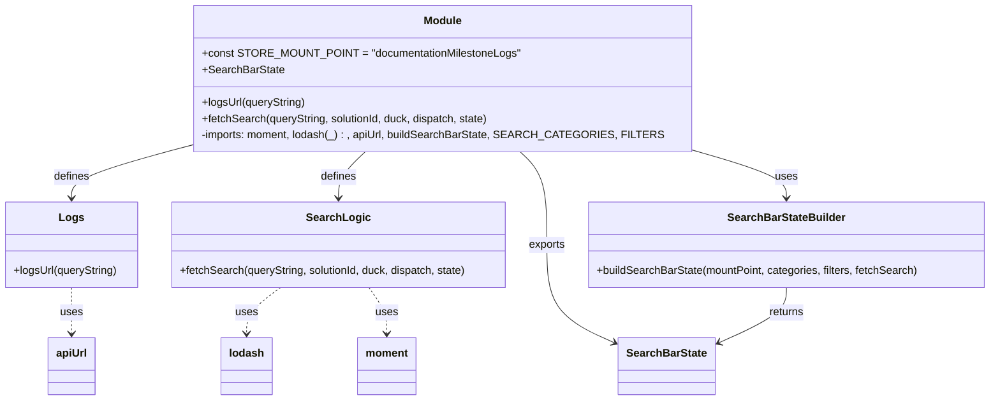

# Diagram: web/portal/src/modules/documentation/milestone-logs/MilestoneLogsSearchBarState.js


> Auto-generated by Obscura crawlers

## Diagram 1

```mermaid
flowchart TD
    A[Start: fetchSearch(queryString, solutionId, duck, dispatch, state)] --> B{Read searchFilters\nstate[documentationMilestoneLogs].searchFilters}
    B --> C{Has required keys?\n(type present)}
    C -- No --> C1[dispatch REQUEST_ERROR\n"Please specify a Status Type"]
    C -- Yes --> D{Has at least one of\nts, entityId, milestone_status_code?}
    D -- No --> D1[dispatch REQUEST_ERROR\n"Please specify a VIN, Milestone Status Code, or Date Range"]
    D -- Yes --> E{Date range valid?\n(from/to within 24 hours)}
    E -- Invalid --> E1[dispatch REQUEST_ERROR\n"Please specify a Date Range of 24 hours or less"]
    E -- Valid --> F[Compute url = logsUrl(queryString)]
    F --> G[dispatch duck.fetch(url, {headers: Accept: application/json;version=milestone})]
    C1 --> End1((End))
    D1 --> End2((End))
    E1 --> End3((End))
    G --> End4((End))
```

> SVG rendering failed for this diagram.

## Diagram 2



### SVG

<svg id="container" width="1465.171875" xmlns="http://www.w3.org/2000/svg" class="classDiagram" height="590" viewBox="0 0 1465.171875 590" role="graphics-document document" aria-roledescription="class"><style>#container{font-family:"trebuchet ms",verdana,arial,sans-serif;font-size:16px;fill:#333;}@keyframes edge-animation-frame{from{stroke-dashoffset:0;}}@keyframes dash{to{stroke-dashoffset:0;}}#container .edge-animation-slow{stroke-dasharray:9,5!important;stroke-dashoffset:900;animation:dash 50s linear infinite;stroke-linecap:round;}#container .edge-animation-fast{stroke-dasharray:9,5!important;stroke-dashoffset:900;animation:dash 20s linear infinite;stroke-linecap:round;}#container .error-icon{fill:#552222;}#container .error-text{fill:#552222;stroke:#552222;}#container .edge-thickness-normal{stroke-width:1px;}#container .edge-thickness-thick{stroke-width:3.5px;}#container .edge-pattern-solid{stroke-dasharray:0;}#container .edge-thickness-invisible{stroke-width:0;fill:none;}#container .edge-pattern-dashed{stroke-dasharray:3;}#container .edge-pattern-dotted{stroke-dasharray:2;}#container .marker{fill:#333333;stroke:#333333;}#container .marker.cross{stroke:#333333;}#container svg{font-family:"trebuchet ms",verdana,arial,sans-serif;font-size:16px;}#container p{margin:0;}#container g.classGroup text{fill:#9370DB;stroke:none;font-family:"trebuchet ms",verdana,arial,sans-serif;font-size:10px;}#container g.classGroup text .title{font-weight:bolder;}#container .nodeLabel,#container .edgeLabel{color:#131300;}#container .edgeLabel .label rect{fill:#ECECFF;}#container .label text{fill:#131300;}#container .labelBkg{background:#ECECFF;}#container .edgeLabel .label span{background:#ECECFF;}#container .classTitle{font-weight:bolder;}#container .node rect,#container .node circle,#container .node ellipse,#container .node polygon,#container .node path{fill:#ECECFF;stroke:#9370DB;stroke-width:1px;}#container .divider{stroke:#9370DB;stroke-width:1;}#container g.clickable{cursor:pointer;}#container g.classGroup rect{fill:#ECECFF;stroke:#9370DB;}#container g.classGroup line{stroke:#9370DB;stroke-width:1;}#container .classLabel .box{stroke:none;stroke-width:0;fill:#ECECFF;opacity:0.5;}#container .classLabel .label{fill:#9370DB;font-size:10px;}#container .relation{stroke:#333333;stroke-width:1;fill:none;}#container .dashed-line{stroke-dasharray:3;}#container .dotted-line{stroke-dasharray:1 2;}#container #compositionStart,#container .composition{fill:#333333!important;stroke:#333333!important;stroke-width:1;}#container #compositionEnd,#container .composition{fill:#333333!important;stroke:#333333!important;stroke-width:1;}#container #dependencyStart,#container .dependency{fill:#333333!important;stroke:#333333!important;stroke-width:1;}#container #dependencyStart,#container .dependency{fill:#333333!important;stroke:#333333!important;stroke-width:1;}#container #extensionStart,#container .extension{fill:transparent!important;stroke:#333333!important;stroke-width:1;}#container #extensionEnd,#container .extension{fill:transparent!important;stroke:#333333!important;stroke-width:1;}#container #aggregationStart,#container .aggregation{fill:transparent!important;stroke:#333333!important;stroke-width:1;}#container #aggregationEnd,#container .aggregation{fill:transparent!important;stroke:#333333!important;stroke-width:1;}#container #lollipopStart,#container .lollipop{fill:#ECECFF!important;stroke:#333333!important;stroke-width:1;}#container #lollipopEnd,#container .lollipop{fill:#ECECFF!important;stroke:#333333!important;stroke-width:1;}#container .edgeTerminals{font-size:11px;line-height:initial;}#container .classTitleText{text-anchor:middle;font-size:18px;fill:#333;}#container .label-icon{display:inline-block;height:1em;overflow:visible;vertical-align:-0.125em;}#container .node .label-icon path{fill:currentColor;stroke:revert;stroke-width:revert;}#container :root{--mermaid-font-family:"trebuchet ms",verdana,arial,sans-serif;}</style><g><defs><marker id="container_class-aggregationStart" class="marker aggregation class" refX="18" refY="7" markerWidth="190" markerHeight="240" orient="auto"><path d="M 18,7 L9,13 L1,7 L9,1 Z"></path></marker></defs><defs><marker id="container_class-aggregationEnd" class="marker aggregation class" refX="1" refY="7" markerWidth="20" markerHeight="28" orient="auto"><path d="M 18,7 L9,13 L1,7 L9,1 Z"></path></marker></defs><defs><marker id="container_class-extensionStart" class="marker extension class" refX="18" refY="7" markerWidth="190" markerHeight="240" orient="auto"><path d="M 1,7 L18,13 V 1 Z"></path></marker></defs><defs><marker id="container_class-extensionEnd" class="marker extension class" refX="1" refY="7" markerWidth="20" markerHeight="28" orient="auto"><path d="M 1,1 V 13 L18,7 Z"></path></marker></defs><defs><marker id="container_class-compositionStart" class="marker composition class" refX="18" refY="7" markerWidth="190" markerHeight="240" orient="auto"><path d="M 18,7 L9,13 L1,7 L9,1 Z"></path></marker></defs><defs><marker id="container_class-compositionEnd" class="marker composition class" refX="1" refY="7" markerWidth="20" markerHeight="28" orient="auto"><path d="M 18,7 L9,13 L1,7 L9,1 Z"></path></marker></defs><defs><marker id="container_class-dependencyStart" class="marker dependency class" refX="6" refY="7" markerWidth="190" markerHeight="240" orient="auto"><path d="M 5,7 L9,13 L1,7 L9,1 Z"></path></marker></defs><defs><marker id="container_class-dependencyEnd" class="marker dependency class" refX="13" refY="7" markerWidth="20" markerHeight="28" orient="auto"><path d="M 18,7 L9,13 L14,7 L9,1 Z"></path></marker></defs><defs><marker id="container_class-lollipopStart" class="marker lollipop class" refX="13" refY="7" markerWidth="190" markerHeight="240" orient="auto"><circle stroke="black" fill="transparent" cx="7" cy="7" r="6"></circle></marker></defs><defs><marker id="container_class-lollipopEnd" class="marker lollipop class" refX="1" refY="7" markerWidth="190" markerHeight="240" orient="auto"><circle stroke="black" fill="transparent" cx="7" cy="7" r="6"></circle></marker></defs><g class="root"><g class="clusters"></g><g class="edgePaths"><path d="M305.131,208.322L271.838,217.102C238.546,225.881,171.96,243.441,138.668,257.387C105.375,271.333,105.375,281.667,105.375,286.833L105.375,292" id="id_Module_Logs_1" class="edge-thickness-normal edge-pattern-solid relation" style=";;;" data-edge="true" data-et="edge" data-id="id_Module_Logs_1" data-points="W3sieCI6MzA1LjEzMDg1OTM3NSwieSI6MjA4LjMyMTkzOTE5NDE1NzR9LHsieCI6MTA1LjM3NSwieSI6MjYxfSx7IngiOjEwNS4zNzUsInkiOjI5OH1d" marker-end="url(#container_class-dependencyEnd)"></path><path d="M539.825,224L533.237,230.167C526.648,236.333,513.47,248.667,506.882,260C500.293,271.333,500.293,281.667,500.293,286.833L500.293,292" id="id_Module_SearchLogic_2" class="edge-thickness-normal edge-pattern-solid relation" style=";;;" data-edge="true" data-et="edge" data-id="id_Module_SearchLogic_2" data-points="W3sieCI6NTM5LjgyNTI1NTkyNjcyNDEsInkiOjIyNH0seyJ4Ijo1MDAuMjkyOTY4NzUsInkiOjI2MX0seyJ4Ijo1MDAuMjkyOTY4NzUsInkiOjI5OH1d" marker-end="url(#container_class-dependencyEnd)"></path><path d="M1005.303,215.614L1031.887,223.178C1058.471,230.743,1111.64,245.871,1138.224,258.602C1164.809,271.333,1164.809,281.667,1164.809,286.833L1164.809,292" id="id_Module_SearchBarStateBuilder_3" class="edge-thickness-normal edge-pattern-solid relation" style=";;;" data-edge="true" data-et="edge" data-id="id_Module_SearchBarStateBuilder_3" data-points="W3sieCI6MTAwNS4zMDI3MzQzNzUsInkiOjIxNS42MTM5Njc5ODE0MTg5N30seyJ4IjoxMTY0LjgwODU5Mzc1LCJ5IjoyNjF9LHsieCI6MTE2NC44MDg1OTM3NSwieSI6Mjk4fV0=" marker-end="url(#container_class-dependencyEnd)"></path><path d="M413.947,424L405.495,430.167C397.044,436.333,380.14,448.667,371.688,460C363.236,471.333,363.236,481.667,363.236,486.833L363.236,492" id="id_SearchLogic_lodash_4" class="edge-thickness-normal edge-pattern-dashed relation" style=";;;" data-edge="true" data-et="edge" data-id="id_SearchLogic_lodash_4" data-points="W3sieCI6NDEzLjk0NzI4NTE1NjI1LCJ5Ijo0MjR9LHsieCI6MzYzLjIzNjMyODEyNSwieSI6NDYxfSx7IngiOjM2My4yMzYzMjgxMjUsInkiOjQ5OH1d" marker-end="url(#container_class-dependencyEnd)"></path><path d="M547.222,424L551.815,430.167C556.409,436.333,565.596,448.667,570.19,460C574.783,471.333,574.783,481.667,574.783,486.833L574.783,492" id="id_SearchLogic_moment_5" class="edge-thickness-normal edge-pattern-dashed relation" style=";;;" data-edge="true" data-et="edge" data-id="id_SearchLogic_moment_5" data-points="W3sieCI6NTQ3LjIyMTgxNjQwNjI1LCJ5Ijo0MjR9LHsieCI6NTc0Ljc4MzIwMzEyNSwieSI6NDYxfSx7IngiOjU3NC43ODMyMDMxMjUsInkiOjQ5OH1d" marker-end="url(#container_class-dependencyEnd)"></path><path d="M105.375,424L105.375,430.167C105.375,436.333,105.375,448.667,105.375,460C105.375,471.333,105.375,481.667,105.375,486.833L105.375,492" id="id_Logs_apiUrl_6" class="edge-thickness-normal edge-pattern-dashed relation" style=";;;" data-edge="true" data-et="edge" data-id="id_Logs_apiUrl_6" data-points="W3sieCI6MTA1LjM3NSwieSI6NDI0fSx7IngiOjEwNS4zNzUsInkiOjQ2MX0seyJ4IjoxMDUuMzc1LCJ5Ijo0OTh9XQ==" marker-end="url(#container_class-dependencyEnd)"></path><path d="M770.608,224L777.197,230.167C783.786,236.333,796.963,248.667,803.552,271.5C810.141,294.333,810.141,327.667,810.141,361C810.141,394.333,810.141,427.667,827.357,452.003C844.573,476.339,879.006,491.679,896.223,499.348L913.439,507.018" id="id_Module_SearchBarState_7" class="edge-thickness-normal edge-pattern-solid relation" style=";;;" data-edge="true" data-et="edge" data-id="id_Module_SearchBarState_7" data-points="W3sieCI6NzcwLjYwODMzNzgyMzI3NTksInkiOjIyNH0seyJ4Ijo4MTAuMTQwNjI1LCJ5IjoyNjF9LHsieCI6ODEwLjE0MDYyNSwieSI6MzYxfSx7IngiOjgxMC4xNDA2MjUsInkiOjQ2MX0seyJ4Ijo5MTguOTE5OTIxODc1LCJ5Ijo1MDkuNDU5NzcyMDEzODc3NH1d" marker-end="url(#container_class-dependencyEnd)"></path><path d="M1164.809,424L1164.809,430.167C1164.809,436.333,1164.809,448.667,1147.592,462.503C1130.376,476.339,1095.943,491.679,1078.726,499.348L1061.51,507.018" id="id_SearchBarStateBuilder_SearchBarState_8" class="edge-thickness-normal edge-pattern-solid relation" style=";;;" data-edge="true" data-et="edge" data-id="id_SearchBarStateBuilder_SearchBarState_8" data-points="W3sieCI6MTE2NC44MDg1OTM3NSwieSI6NDI0fSx7IngiOjExNjQuODA4NTkzNzUsInkiOjQ2MX0seyJ4IjoxMDU2LjAyOTI5Njg3NSwieSI6NTA5LjQ1OTc3MjAxMzg3NzR9XQ==" marker-end="url(#container_class-dependencyEnd)"></path></g><g class="edgeLabels"><g class="edgeLabel" transform="translate(105.375, 261)"><g class="label" data-id="id_Module_Logs_1" transform="translate(-26.53125, -12)"><foreignObject width="53.0625" height="24"><div xmlns="http://www.w3.org/1999/xhtml" class="labelBkg" style="display: table-cell; white-space: nowrap; line-height: 1.5; max-width: 200px; text-align: center;"><span class="edgeLabel"><p>defines</p></span></div></foreignObject></g></g><g class="edgeLabel" transform="translate(500.29296875, 261)"><g class="label" data-id="id_Module_SearchLogic_2" transform="translate(-26.53125, -12)"><foreignObject width="53.0625" height="24"><div xmlns="http://www.w3.org/1999/xhtml" class="labelBkg" style="display: table-cell; white-space: nowrap; line-height: 1.5; max-width: 200px; text-align: center;"><span class="edgeLabel"><p>defines</p></span></div></foreignObject></g></g><g class="edgeLabel" transform="translate(1164.80859375, 261)"><g class="label" data-id="id_Module_SearchBarStateBuilder_3" transform="translate(-16.4921875, -12)"><foreignObject width="32.984375" height="24"><div xmlns="http://www.w3.org/1999/xhtml" class="labelBkg" style="display: table-cell; white-space: nowrap; line-height: 1.5; max-width: 200px; text-align: center;"><span class="edgeLabel"><p>uses</p></span></div></foreignObject></g></g><g class="edgeLabel" transform="translate(363.236328125, 461)"><g class="label" data-id="id_SearchLogic_lodash_4" transform="translate(-16.4921875, -12)"><foreignObject width="32.984375" height="24"><div xmlns="http://www.w3.org/1999/xhtml" class="labelBkg" style="display: table-cell; white-space: nowrap; line-height: 1.5; max-width: 200px; text-align: center;"><span class="edgeLabel"><p>uses</p></span></div></foreignObject></g></g><g class="edgeLabel" transform="translate(574.783203125, 461)"><g class="label" data-id="id_SearchLogic_moment_5" transform="translate(-16.4921875, -12)"><foreignObject width="32.984375" height="24"><div xmlns="http://www.w3.org/1999/xhtml" class="labelBkg" style="display: table-cell; white-space: nowrap; line-height: 1.5; max-width: 200px; text-align: center;"><span class="edgeLabel"><p>uses</p></span></div></foreignObject></g></g><g class="edgeLabel" transform="translate(105.375, 461)"><g class="label" data-id="id_Logs_apiUrl_6" transform="translate(-16.4921875, -12)"><foreignObject width="32.984375" height="24"><div xmlns="http://www.w3.org/1999/xhtml" class="labelBkg" style="display: table-cell; white-space: nowrap; line-height: 1.5; max-width: 200px; text-align: center;"><span class="edgeLabel"><p>uses</p></span></div></foreignObject></g></g><g class="edgeLabel" transform="translate(810.140625, 361)"><g class="label" data-id="id_Module_SearchBarState_7" transform="translate(-27.3046875, -12)"><foreignObject width="54.609375" height="24"><div xmlns="http://www.w3.org/1999/xhtml" class="labelBkg" style="display: table-cell; white-space: nowrap; line-height: 1.5; max-width: 200px; text-align: center;"><span class="edgeLabel"><p>exports</p></span></div></foreignObject></g></g><g class="edgeLabel" transform="translate(1164.80859375, 461)"><g class="label" data-id="id_SearchBarStateBuilder_SearchBarState_8" transform="translate(-26.265625, -12)"><foreignObject width="52.53125" height="24"><div xmlns="http://www.w3.org/1999/xhtml" class="labelBkg" style="display: table-cell; white-space: nowrap; line-height: 1.5; max-width: 200px; text-align: center;"><span class="edgeLabel"><p>returns</p></span></div></foreignObject></g></g></g><g class="nodes"><g class="node default" id="classId-Module-0" transform="translate(655.216796875, 116)"><g class="basic label-container"><path d="M-350.0859375 -108 L350.0859375 -108 L350.0859375 108 L-350.0859375 108" stroke="none" stroke-width="0" fill="#ECECFF" style=""></path><path d="M-350.0859375 -108 C-125.1172069453684 -108, 99.85152360926321 -108, 350.0859375 -108 M-350.0859375 -108 C-170.90928480641003 -108, 8.267367887179944 -108, 350.0859375 -108 M350.0859375 -108 C350.0859375 -39.03842181499043, 350.0859375 29.923156370019143, 350.0859375 108 M350.0859375 -108 C350.0859375 -41.22894265274397, 350.0859375 25.542114694512065, 350.0859375 108 M350.0859375 108 C135.75393059036145 108, -78.5780763192771 108, -350.0859375 108 M350.0859375 108 C177.03908746063894 108, 3.9922374212778777 108, -350.0859375 108 M-350.0859375 108 C-350.0859375 29.15892276421124, -350.0859375 -49.68215447157752, -350.0859375 -108 M-350.0859375 108 C-350.0859375 64.2416607374449, -350.0859375 20.483321474889806, -350.0859375 -108" stroke="#9370DB" stroke-width="1.3" fill="none" stroke-dasharray="0 0" style=""></path></g><g class="annotation-group text" transform="translate(0, -84)"></g><g class="label-group text" transform="translate(-27.09375, -84)"><g class="label" style="font-weight: bolder" transform="translate(0,-12)"><foreignObject width="54.1875" height="24"><div xmlns="http://www.w3.org/1999/xhtml" style="display: table-cell; white-space: nowrap; line-height: 1.5; max-width: 104px; text-align: center;"><span class="nodeLabel markdown-node-label" style=""><p>Module</p></span></div></foreignObject></g></g><g class="members-group text" transform="translate(-338.0859375, -36)"><g class="label" style="" transform="translate(0,-12)"><foreignObject width="453.265625" height="24"><div xmlns="http://www.w3.org/1999/xhtml" style="display: table-cell; white-space: nowrap; line-height: 1.5; max-width: 511px; text-align: center;"><span class="nodeLabel markdown-node-label" style=""><p>+const STORE_MOUNT_POINT = "documentationMilestoneLogs"</p></span></div></foreignObject></g><g class="label" style="" transform="translate(0,12)"><foreignObject width="118.015625" height="24"><div xmlns="http://www.w3.org/1999/xhtml" style="display: table-cell; white-space: nowrap; line-height: 1.5; max-width: 175px; text-align: center;"><span class="nodeLabel markdown-node-label" style=""><p>+SearchBarState</p></span></div></foreignObject></g></g><g class="methods-group text" transform="translate(-338.0859375, 36)"><g class="label" style="" transform="translate(0,-12)"><foreignObject width="153.96875" height="24"><div xmlns="http://www.w3.org/1999/xhtml" style="display: table-cell; white-space: nowrap; line-height: 1.5; max-width: 211px; text-align: center;"><span class="nodeLabel markdown-node-label" style=""><p>+logsUrl(queryString)</p></span></div></foreignObject></g><g class="label" style="" transform="translate(0,12)"><foreignObject width="427.296875" height="24"><div xmlns="http://www.w3.org/1999/xhtml" style="display: table-cell; white-space: nowrap; line-height: 1.5; max-width: 485px; text-align: center;"><span class="nodeLabel markdown-node-label" style=""><p>+fetchSearch(queryString, solutionId, duck, dispatch, state)</p></span></div></foreignObject></g><g class="label" style="" transform="translate(0,36)"><foreignObject width="649.078125" height="24"><div xmlns="http://www.w3.org/1999/xhtml" style="display: table-cell; white-space: nowrap; line-height: 1.5; max-width: 707px; text-align: center;"><span class="nodeLabel markdown-node-label" style=""><p>-imports: moment, lodash(_) : , apiUrl, buildSearchBarState, SEARCH_CATEGORIES, FILTERS</p></span></div></foreignObject></g></g><g class="divider" style=""><path d="M-350.0859375 -60 C-161.97256051768238 -60, 26.140816464635236 -60, 350.0859375 -60 M-350.0859375 -60 C-117.05893556520388 -60, 115.96806636959224 -60, 350.0859375 -60" stroke="#9370DB" stroke-width="1.3" fill="none" stroke-dasharray="0 0" style=""></path></g><g class="divider" style=""><path d="M-350.0859375 12 C-152.46755764802208 12, 45.15082220395584 12, 350.0859375 12 M-350.0859375 12 C-185.34464708016282 12, -20.60335666032563 12, 350.0859375 12" stroke="#9370DB" stroke-width="1.3" fill="none" stroke-dasharray="0 0" style=""></path></g></g><g class="node default" id="classId-Logs-1" transform="translate(105.375, 361)"><g class="basic label-container"><path d="M-97.375 -63 L97.375 -63 L97.375 63 L-97.375 63" stroke="none" stroke-width="0" fill="#ECECFF" style=""></path><path d="M-97.375 -63 C-41.86594874906852 -63, 13.643102501862955 -63, 97.375 -63 M-97.375 -63 C-54.1272873867338 -63, -10.879574773467596 -63, 97.375 -63 M97.375 -63 C97.375 -14.335723837971223, 97.375 34.328552324057554, 97.375 63 M97.375 -63 C97.375 -29.975340353644974, 97.375 3.0493192927100523, 97.375 63 M97.375 63 C54.38958642229722 63, 11.404172844594441 63, -97.375 63 M97.375 63 C29.038689132266654 63, -39.29762173546669 63, -97.375 63 M-97.375 63 C-97.375 32.2614609478167, -97.375 1.5229218956334094, -97.375 -63 M-97.375 63 C-97.375 35.15882933662667, -97.375 7.317658673253327, -97.375 -63" stroke="#9370DB" stroke-width="1.3" fill="none" stroke-dasharray="0 0" style=""></path></g><g class="annotation-group text" transform="translate(0, -39)"></g><g class="label-group text" transform="translate(-16.78125, -39)"><g class="label" style="font-weight: bolder" transform="translate(0,-12)"><foreignObject width="33.5625" height="24"><div xmlns="http://www.w3.org/1999/xhtml" style="display: table-cell; white-space: nowrap; line-height: 1.5; max-width: 83px; text-align: center;"><span class="nodeLabel markdown-node-label" style=""><p>Logs</p></span></div></foreignObject></g></g><g class="members-group text" transform="translate(-85.375, 9)"></g><g class="methods-group text" transform="translate(-85.375, 39)"><g class="label" style="" transform="translate(0,-12)"><foreignObject width="153.96875" height="24"><div xmlns="http://www.w3.org/1999/xhtml" style="display: table-cell; white-space: nowrap; line-height: 1.5; max-width: 211px; text-align: center;"><span class="nodeLabel markdown-node-label" style=""><p>+logsUrl(queryString)</p></span></div></foreignObject></g></g><g class="divider" style=""><path d="M-97.375 -15 C-20.68952910057105 -15, 55.9959417988579 -15, 97.375 -15 M-97.375 -15 C-35.18042185245102 -15, 27.014156295097962 -15, 97.375 -15" stroke="#9370DB" stroke-width="1.3" fill="none" stroke-dasharray="0 0" style=""></path></g><g class="divider" style=""><path d="M-97.375 9 C-49.68027798464251 9, -1.9855559692850164 9, 97.375 9 M-97.375 9 C-57.513880798623106 9, -17.65276159724621 9, 97.375 9" stroke="#9370DB" stroke-width="1.3" fill="none" stroke-dasharray="0 0" style=""></path></g></g><g class="node default" id="classId-SearchLogic-2" transform="translate(500.29296875, 361)"><g class="basic label-container"><path d="M-247.54296875 -63 L247.54296875 -63 L247.54296875 63 L-247.54296875 63" stroke="none" stroke-width="0" fill="#ECECFF" style=""></path><path d="M-247.54296875 -63 C-120.90316880288032 -63, 5.736631144239368 -63, 247.54296875 -63 M-247.54296875 -63 C-90.39017877765198 -63, 66.76261119469603 -63, 247.54296875 -63 M247.54296875 -63 C247.54296875 -17.763299148886354, 247.54296875 27.473401702227292, 247.54296875 63 M247.54296875 -63 C247.54296875 -14.268208654677672, 247.54296875 34.46358269064466, 247.54296875 63 M247.54296875 63 C59.756090521390576 63, -128.03078770721885 63, -247.54296875 63 M247.54296875 63 C114.43258244420008 63, -18.67780386159984 63, -247.54296875 63 M-247.54296875 63 C-247.54296875 29.533052170277394, -247.54296875 -3.933895659445213, -247.54296875 -63 M-247.54296875 63 C-247.54296875 15.810755519770204, -247.54296875 -31.378488960459592, -247.54296875 -63" stroke="#9370DB" stroke-width="1.3" fill="none" stroke-dasharray="0 0" style=""></path></g><g class="annotation-group text" transform="translate(0, -39)"></g><g class="label-group text" transform="translate(-43.7890625, -39)"><g class="label" style="font-weight: bolder" transform="translate(0,-12)"><foreignObject width="87.578125" height="24"><div xmlns="http://www.w3.org/1999/xhtml" style="display: table-cell; white-space: nowrap; line-height: 1.5; max-width: 136px; text-align: center;"><span class="nodeLabel markdown-node-label" style=""><p>SearchLogic</p></span></div></foreignObject></g></g><g class="members-group text" transform="translate(-235.54296875, 9)"></g><g class="methods-group text" transform="translate(-235.54296875, 39)"><g class="label" style="" transform="translate(0,-12)"><foreignObject width="427.296875" height="24"><div xmlns="http://www.w3.org/1999/xhtml" style="display: table-cell; white-space: nowrap; line-height: 1.5; max-width: 485px; text-align: center;"><span class="nodeLabel markdown-node-label" style=""><p>+fetchSearch(queryString, solutionId, duck, dispatch, state)</p></span></div></foreignObject></g></g><g class="divider" style=""><path d="M-247.54296875 -15 C-143.6085276945396 -15, -39.674086639079206 -15, 247.54296875 -15 M-247.54296875 -15 C-75.92148923944583 -15, 95.69999027110833 -15, 247.54296875 -15" stroke="#9370DB" stroke-width="1.3" fill="none" stroke-dasharray="0 0" style=""></path></g><g class="divider" style=""><path d="M-247.54296875 9 C-89.38555057468042 9, 68.77186760063915 9, 247.54296875 9 M-247.54296875 9 C-136.5459643812264 9, -25.548960012452824 9, 247.54296875 9" stroke="#9370DB" stroke-width="1.3" fill="none" stroke-dasharray="0 0" style=""></path></g></g><g class="node default" id="classId-SearchBarStateBuilder-3" transform="translate(1164.80859375, 361)"><g class="basic label-container"><path d="M-292.36328125 -63 L292.36328125 -63 L292.36328125 63 L-292.36328125 63" stroke="none" stroke-width="0" fill="#ECECFF" style=""></path><path d="M-292.36328125 -63 C-124.80237073192319 -63, 42.75853978615362 -63, 292.36328125 -63 M-292.36328125 -63 C-71.45872728814953 -63, 149.44582667370094 -63, 292.36328125 -63 M292.36328125 -63 C292.36328125 -35.61466046648423, 292.36328125 -8.229320932968463, 292.36328125 63 M292.36328125 -63 C292.36328125 -27.175690482967106, 292.36328125 8.648619034065788, 292.36328125 63 M292.36328125 63 C86.98312370349885 63, -118.3970338430023 63, -292.36328125 63 M292.36328125 63 C144.8167424032682 63, -2.729796443463613 63, -292.36328125 63 M-292.36328125 63 C-292.36328125 36.370899667470965, -292.36328125 9.741799334941923, -292.36328125 -63 M-292.36328125 63 C-292.36328125 25.311951260640477, -292.36328125 -12.376097478719046, -292.36328125 -63" stroke="#9370DB" stroke-width="1.3" fill="none" stroke-dasharray="0 0" style=""></path></g><g class="annotation-group text" transform="translate(0, -39)"></g><g class="label-group text" transform="translate(-83.0859375, -39)"><g class="label" style="font-weight: bolder" transform="translate(0,-12)"><foreignObject width="166.171875" height="24"><div xmlns="http://www.w3.org/1999/xhtml" style="display: table-cell; white-space: nowrap; line-height: 1.5; max-width: 214px; text-align: center;"><span class="nodeLabel markdown-node-label" style=""><p>SearchBarStateBuilder</p></span></div></foreignObject></g></g><g class="members-group text" transform="translate(-280.36328125, 9)"></g><g class="methods-group text" transform="translate(-280.36328125, 39)"><g class="label" style="" transform="translate(0,-12)"><foreignObject width="477.640625" height="24"><div xmlns="http://www.w3.org/1999/xhtml" style="display: table-cell; white-space: nowrap; line-height: 1.5; max-width: 535px; text-align: center;"><span class="nodeLabel markdown-node-label" style=""><p>+buildSearchBarState(mountPoint, categories, filters, fetchSearch)</p></span></div></foreignObject></g></g><g class="divider" style=""><path d="M-292.36328125 -15 C-102.35349053180522 -15, 87.65630018638956 -15, 292.36328125 -15 M-292.36328125 -15 C-117.80560102241577 -15, 56.75207920516846 -15, 292.36328125 -15" stroke="#9370DB" stroke-width="1.3" fill="none" stroke-dasharray="0 0" style=""></path></g><g class="divider" style=""><path d="M-292.36328125 9 C-141.1863880509634 9, 9.990505148073225 9, 292.36328125 9 M-292.36328125 9 C-125.54128282736727 9, 41.28071559526546 9, 292.36328125 9" stroke="#9370DB" stroke-width="1.3" fill="none" stroke-dasharray="0 0" style=""></path></g></g><g class="node default" id="classId-lodash-4" transform="translate(363.236328125, 540)"><g class="basic label-container"><path d="M-36.59375 -42 L36.59375 -42 L36.59375 42 L-36.59375 42" stroke="none" stroke-width="0" fill="#ECECFF" style=""></path><path d="M-36.59375 -42 C-8.219547110916938 -42, 20.154655778166124 -42, 36.59375 -42 M-36.59375 -42 C-9.25628550501838 -42, 18.08117898996324 -42, 36.59375 -42 M36.59375 -42 C36.59375 -19.75803617204859, 36.59375 2.483927655902818, 36.59375 42 M36.59375 -42 C36.59375 -10.208858500441515, 36.59375 21.58228299911697, 36.59375 42 M36.59375 42 C12.727255014508778 42, -11.139239970982445 42, -36.59375 42 M36.59375 42 C9.409768943330505 42, -17.77421211333899 42, -36.59375 42 M-36.59375 42 C-36.59375 17.338751397001246, -36.59375 -7.322497205997507, -36.59375 -42 M-36.59375 42 C-36.59375 9.42972188408735, -36.59375 -23.1405562318253, -36.59375 -42" stroke="#9370DB" stroke-width="1.3" fill="none" stroke-dasharray="0 0" style=""></path></g><g class="annotation-group text" transform="translate(0, -18)"></g><g class="label-group text" transform="translate(-24.59375, -18)"><g class="label" style="font-weight: bolder" transform="translate(0,-12)"><foreignObject width="49.1875" height="24"><div xmlns="http://www.w3.org/1999/xhtml" style="display: table-cell; white-space: nowrap; line-height: 1.5; max-width: 99px; text-align: center;"><span class="nodeLabel markdown-node-label" style=""><p>lodash</p></span></div></foreignObject></g></g><g class="members-group text" transform="translate(-24.59375, 30)"></g><g class="methods-group text" transform="translate(-24.59375, 60)"></g><g class="divider" style=""><path d="M-36.59375 6 C-18.009532337543195 6, 0.5746853249136095 6, 36.59375 6 M-36.59375 6 C-13.258056267747854 6, 10.077637464504292 6, 36.59375 6" stroke="#9370DB" stroke-width="1.3" fill="none" stroke-dasharray="0 0" style=""></path></g><g class="divider" style=""><path d="M-36.59375 24 C-9.257939500620662 24, 18.077870998758677 24, 36.59375 24 M-36.59375 24 C-20.0796970656153 24, -3.5656441312305986 24, 36.59375 24" stroke="#9370DB" stroke-width="1.3" fill="none" stroke-dasharray="0 0" style=""></path></g></g><g class="node default" id="classId-moment-5" transform="translate(574.783203125, 540)"><g class="basic label-container"><path d="M-42.3125 -42 L42.3125 -42 L42.3125 42 L-42.3125 42" stroke="none" stroke-width="0" fill="#ECECFF" style=""></path><path d="M-42.3125 -42 C-24.079634334500447 -42, -5.846768669000895 -42, 42.3125 -42 M-42.3125 -42 C-24.15213424993011 -42, -5.991768499860221 -42, 42.3125 -42 M42.3125 -42 C42.3125 -21.02989478953631, 42.3125 -0.05978957907262128, 42.3125 42 M42.3125 -42 C42.3125 -13.204449717490931, 42.3125 15.591100565018138, 42.3125 42 M42.3125 42 C22.878788388171273 42, 3.445076776342546 42, -42.3125 42 M42.3125 42 C12.930299502240487 42, -16.451900995519026 42, -42.3125 42 M-42.3125 42 C-42.3125 12.420625668785092, -42.3125 -17.158748662429815, -42.3125 -42 M-42.3125 42 C-42.3125 16.46390251423139, -42.3125 -9.072194971537222, -42.3125 -42" stroke="#9370DB" stroke-width="1.3" fill="none" stroke-dasharray="0 0" style=""></path></g><g class="annotation-group text" transform="translate(0, -18)"></g><g class="label-group text" transform="translate(-30.3125, -18)"><g class="label" style="font-weight: bolder" transform="translate(0,-12)"><foreignObject width="60.625" height="24"><div xmlns="http://www.w3.org/1999/xhtml" style="display: table-cell; white-space: nowrap; line-height: 1.5; max-width: 111px; text-align: center;"><span class="nodeLabel markdown-node-label" style=""><p>moment</p></span></div></foreignObject></g></g><g class="members-group text" transform="translate(-30.3125, 30)"></g><g class="methods-group text" transform="translate(-30.3125, 60)"></g><g class="divider" style=""><path d="M-42.3125 6 C-19.16194627053988 6, 3.9886074589202423 6, 42.3125 6 M-42.3125 6 C-13.708244107702647 6, 14.896011784594705 6, 42.3125 6" stroke="#9370DB" stroke-width="1.3" fill="none" stroke-dasharray="0 0" style=""></path></g><g class="divider" style=""><path d="M-42.3125 24 C-12.654124952645848 24, 17.004250094708304 24, 42.3125 24 M-42.3125 24 C-21.132723626340486 24, 0.047052747319028754 24, 42.3125 24" stroke="#9370DB" stroke-width="1.3" fill="none" stroke-dasharray="0 0" style=""></path></g></g><g class="node default" id="classId-apiUrl-6" transform="translate(105.375, 540)"><g class="basic label-container"><path d="M-34.2109375 -42 L34.2109375 -42 L34.2109375 42 L-34.2109375 42" stroke="none" stroke-width="0" fill="#ECECFF" style=""></path><path d="M-34.2109375 -42 C-11.341692222641797 -42, 11.527553054716407 -42, 34.2109375 -42 M-34.2109375 -42 C-12.231498372815913 -42, 9.747940754368173 -42, 34.2109375 -42 M34.2109375 -42 C34.2109375 -23.49193938997384, 34.2109375 -4.9838787799476805, 34.2109375 42 M34.2109375 -42 C34.2109375 -10.078165374918665, 34.2109375 21.84366925016267, 34.2109375 42 M34.2109375 42 C16.246493404771048 42, -1.7179506904579043 42, -34.2109375 42 M34.2109375 42 C12.755117608647176 42, -8.700702282705649 42, -34.2109375 42 M-34.2109375 42 C-34.2109375 13.13545723505646, -34.2109375 -15.72908552988708, -34.2109375 -42 M-34.2109375 42 C-34.2109375 11.394442629637904, -34.2109375 -19.21111474072419, -34.2109375 -42" stroke="#9370DB" stroke-width="1.3" fill="none" stroke-dasharray="0 0" style=""></path></g><g class="annotation-group text" transform="translate(0, -18)"></g><g class="label-group text" transform="translate(-22.2109375, -18)"><g class="label" style="font-weight: bolder" transform="translate(0,-12)"><foreignObject width="44.421875" height="24"><div xmlns="http://www.w3.org/1999/xhtml" style="display: table-cell; white-space: nowrap; line-height: 1.5; max-width: 94px; text-align: center;"><span class="nodeLabel markdown-node-label" style=""><p>apiUrl</p></span></div></foreignObject></g></g><g class="members-group text" transform="translate(-22.2109375, 30)"></g><g class="methods-group text" transform="translate(-22.2109375, 60)"></g><g class="divider" style=""><path d="M-34.2109375 6 C-18.852958876093712 6, -3.4949802521874247 6, 34.2109375 6 M-34.2109375 6 C-14.972841691816498 6, 4.265254116367004 6, 34.2109375 6" stroke="#9370DB" stroke-width="1.3" fill="none" stroke-dasharray="0 0" style=""></path></g><g class="divider" style=""><path d="M-34.2109375 24 C-11.65400649716538 24, 10.90292450566924 24, 34.2109375 24 M-34.2109375 24 C-10.354713373220154 24, 13.501510753559693 24, 34.2109375 24" stroke="#9370DB" stroke-width="1.3" fill="none" stroke-dasharray="0 0" style=""></path></g></g><g class="node default" id="classId-SearchBarState-7" transform="translate(987.474609375, 540)"><g class="basic label-container"><path d="M-68.5546875 -42 L68.5546875 -42 L68.5546875 42 L-68.5546875 42" stroke="none" stroke-width="0" fill="#ECECFF" style=""></path><path d="M-68.5546875 -42 C-30.534172363698545 -42, 7.48634277260291 -42, 68.5546875 -42 M-68.5546875 -42 C-38.604737271603526 -42, -8.654787043207044 -42, 68.5546875 -42 M68.5546875 -42 C68.5546875 -8.618716275609941, 68.5546875 24.762567448780118, 68.5546875 42 M68.5546875 -42 C68.5546875 -10.30936009834295, 68.5546875 21.3812798033141, 68.5546875 42 M68.5546875 42 C34.636236032535294 42, 0.7177845650705876 42, -68.5546875 42 M68.5546875 42 C22.261337386723376 42, -24.032012726553248 42, -68.5546875 42 M-68.5546875 42 C-68.5546875 10.235766714864319, -68.5546875 -21.528466570271362, -68.5546875 -42 M-68.5546875 42 C-68.5546875 13.602474024306613, -68.5546875 -14.795051951386775, -68.5546875 -42" stroke="#9370DB" stroke-width="1.3" fill="none" stroke-dasharray="0 0" style=""></path></g><g class="annotation-group text" transform="translate(0, -18)"></g><g class="label-group text" transform="translate(-56.5546875, -18)"><g class="label" style="font-weight: bolder" transform="translate(0,-12)"><foreignObject width="113.109375" height="24"><div xmlns="http://www.w3.org/1999/xhtml" style="display: table-cell; white-space: nowrap; line-height: 1.5; max-width: 161px; text-align: center;"><span class="nodeLabel markdown-node-label" style=""><p>SearchBarState</p></span></div></foreignObject></g></g><g class="members-group text" transform="translate(-56.5546875, 30)"></g><g class="methods-group text" transform="translate(-56.5546875, 60)"></g><g class="divider" style=""><path d="M-68.5546875 6 C-37.82714568474999 6, -7.099603869499987 6, 68.5546875 6 M-68.5546875 6 C-23.131213185814005 6, 22.29226112837199 6, 68.5546875 6" stroke="#9370DB" stroke-width="1.3" fill="none" stroke-dasharray="0 0" style=""></path></g><g class="divider" style=""><path d="M-68.5546875 24 C-13.97116044540823 24, 40.61236660918354 24, 68.5546875 24 M-68.5546875 24 C-34.75791743159329 24, -0.9611473631865834 24, 68.5546875 24" stroke="#9370DB" stroke-width="1.3" fill="none" stroke-dasharray="0 0" style=""></path></g></g></g></g></g></svg>
