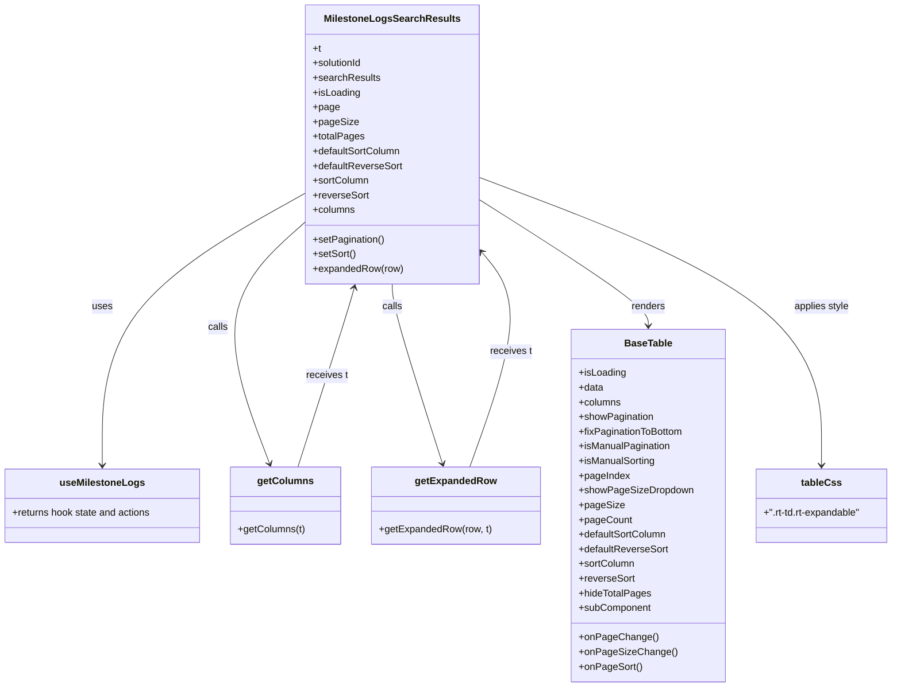

# Diagram: web/portal/src/modules/documentation/milestone-logs/MilestoneLogsSearchResults.js

> Auto-generated by Obscura crawlers

## Mermaid

### SVG

<svg id="container" width="1443.515625" xmlns="http://www.w3.org/2000/svg" class="classDiagram" height="1122" viewBox="0 0 1443.515625 1122" role="graphics-document document" aria-roledescription="class"><g><defs><marker id="container_class-aggregationStart" class="marker aggregation class" refX="18" refY="7" markerWidth="190" markerHeight="240" orient="auto"><path d="M 18,7 L9,13 L1,7 L9,1 Z"></path></marker></defs><defs><marker id="container_class-aggregationEnd" class="marker aggregation class" refX="1" refY="7" markerWidth="20" markerHeight="28" orient="auto"><path d="M 18,7 L9,13 L1,7 L9,1 Z"></path></marker></defs><defs><marker id="container_class-extensionStart" class="marker extension class" refX="18" refY="7" markerWidth="190" markerHeight="240" orient="auto"><path d="M 1,7 L18,13 V 1 Z"></path></marker></defs><defs><marker id="container_class-extensionEnd" class="marker extension class" refX="1" refY="7" markerWidth="20" markerHeight="28" orient="auto"><path d="M 1,1 V 13 L18,7 Z"></path></marker></defs><defs><marker id="container_class-compositionStart" class="marker composition class" refX="18" refY="7" markerWidth="190" markerHeight="240" orient="auto"><path d="M 18,7 L9,13 L1,7 L9,1 Z"></path></marker></defs><defs><marker id="container_class-compositionEnd" class="marker composition class" refX="1" refY="7" markerWidth="20" markerHeight="28" orient="auto"><path d="M 18,7 L9,13 L1,7 L9,1 Z"></path></marker></defs><defs><marker id="container_class-dependencyStart" class="marker dependency class" refX="6" refY="7" markerWidth="190" markerHeight="240" orient="auto"><path d="M 5,7 L9,13 L1,7 L9,1 Z"></path></marker></defs><defs><marker id="container_class-dependencyEnd" class="marker dependency class" refX="13" refY="7" markerWidth="20" markerHeight="28" orient="auto"><path d="M 18,7 L9,13 L14,7 L9,1 Z"></path></marker></defs><defs><marker id="container_class-lollipopStart" class="marker lollipop class" refX="13" refY="7" markerWidth="190" markerHeight="240" orient="auto"><circle stroke="black" fill="transparent" cx="7" cy="7" r="6"></circle></marker></defs><defs><marker id="container_class-lollipopEnd" class="marker lollipop class" refX="1" refY="7" markerWidth="190" markerHeight="240" orient="auto"><circle stroke="black" fill="transparent" cx="7" cy="7" r="6"></circle></marker></defs><g class="root"><g class="clusters"></g><g class="edgePaths"><path d="M500.434,313.527L445.008,344.772C389.582,376.018,278.73,438.509,223.305,512.921C167.879,587.333,167.879,673.667,167.879,716.833L167.879,760" id="id_MilestoneLogsSearchResults_useMilestoneLogs_1" class="edge-thickness-normal edge-pattern-solid relation" style=";;;" data-edge="true" data-et="edge" data-id="id_MilestoneLogsSearchResults_useMilestoneLogs_1" data-points="W3sieCI6NTAwLjQzMzU5Mzc1LCJ5IjozMTMuNTI2OTIzNzE2MTM3Nn0seyJ4IjoxNjcuODc4OTA2MjUsInkiOjUwMX0seyJ4IjoxNjcuODc4OTA2MjUsInkiOjc2Nn1d" marker-end="url(#container_class-dependencyEnd)"></path><path d="M500.434,359.706L474.254,383.255C448.075,406.804,395.716,453.902,385.648,520.182C375.581,586.462,407.804,671.924,423.916,714.655L440.028,757.386" id="id_MilestoneLogsSearchResults_getColumns_2" class="edge-thickness-normal edge-pattern-solid relation" style=";;;" data-edge="true" data-et="edge" data-id="id_MilestoneLogsSearchResults_getColumns_2" data-points="W3sieCI6NTAwLjQzMzU5Mzc1LCJ5IjozNTkuNzA1OTAzODAyMTY3OTR9LHsieCI6MzQzLjM1NzQyMTg3NSwieSI6NTAxfSx7IngiOjQ0Mi4xNDQzMzI5MzI2OTIzLCJ5Ijo3NjN9XQ==" marker-end="url(#container_class-dependencyEnd)"></path><path d="M637.957,464L637.957,470.167C637.957,476.333,637.957,488.667,651.245,537.545C664.534,586.424,691.111,671.847,704.399,714.559L717.687,757.271" id="id_MilestoneLogsSearchResults_getExpandedRow_3" class="edge-thickness-normal edge-pattern-solid relation" style=";;;" data-edge="true" data-et="edge" data-id="id_MilestoneLogsSearchResults_getExpandedRow_3" data-points="W3sieCI6NjM3Ljk1NzAzMTI1LCJ5Ijo0NjR9LHsieCI6NjM3Ljk1NzAzMTI1LCJ5Ijo1MDF9LHsieCI6NzE5LjQ2OTg5MTgyNjkyMzEsInkiOjc2M31d" marker-end="url(#container_class-dependencyEnd)"></path><path d="M775.48,325.269L820.601,354.557C865.721,383.846,955.962,442.423,1001.083,476.878C1046.203,511.333,1046.203,521.667,1046.203,526.833L1046.203,532" id="id_MilestoneLogsSearchResults_BaseTable_4" class="edge-thickness-normal edge-pattern-solid relation" style=";;;" data-edge="true" data-et="edge" data-id="id_MilestoneLogsSearchResults_BaseTable_4" data-points="W3sieCI6Nzc1LjQ4MDQ2ODc1LCJ5IjozMjUuMjY4OTc2NDcxMzc2Mn0seyJ4IjoxMDQ2LjIwMzEyNSwieSI6NTAxfSx7IngiOjEwNDYuMjAzMTI1LCJ5Ijo1Mzh9XQ==" marker-end="url(#container_class-dependencyEnd)"></path><path d="M775.48,288.897L867.385,324.248C959.29,359.598,1143.1,430.299,1235.005,508.816C1326.91,587.333,1326.91,673.667,1326.91,716.833L1326.91,760" id="id_MilestoneLogsSearchResults_tableCss_5" class="edge-thickness-normal edge-pattern-solid relation" style=";;;" data-edge="true" data-et="edge" data-id="id_MilestoneLogsSearchResults_tableCss_5" data-points="W3sieCI6Nzc1LjQ4MDQ2ODc1LCJ5IjoyODguODk3MjI4NTg1MDM2MTV9LHsieCI6MTMyNi45MTAxNTYyNSwieSI6NTAxfSx7IngiOjEzMjYuOTEwMTU2MjUsInkiOjc2Nn1d" marker-end="url(#container_class-dependencyEnd)"></path><path d="M760.867,763L775.974,719.333C791.082,675.667,821.297,588.333,824.36,529.721C827.423,471.108,803.334,441.216,791.29,426.271L779.245,411.325" id="id_getExpandedRow_MilestoneLogsSearchResults_6" class="edge-thickness-normal edge-pattern-solid relation" style=";;;" data-edge="true" data-et="edge" data-id="id_getExpandedRow_MilestoneLogsSearchResults_6" data-points="W3sieCI6NzYwLjg2NjY0NjYzNDYxNTMsInkiOjc2M30seyJ4Ijo4NTEuNTExNzE4NzUsInkiOjUwMX0seyJ4Ijo3NzUuNDgwNDY4NzUsInkiOjQwNi42NTI4MjYwNDcxOTIyfV0=" marker-end="url(#container_class-dependencyEnd)"></path><path d="M485.499,763L499.084,719.333C512.67,675.667,539.841,588.333,554.819,539.466C569.796,490.599,572.581,480.197,573.973,474.997L575.366,469.796" id="id_getColumns_MilestoneLogsSearchResults_7" class="edge-thickness-normal edge-pattern-solid relation" style=";;;" data-edge="true" data-et="edge" data-id="id_getColumns_MilestoneLogsSearchResults_7" data-points="W3sieCI6NDg1LjQ5ODg1ODE3MzA3Njk0LCJ5Ijo3NjN9LHsieCI6NTY3LjAxMTcxODc1LCJ5Ijo1MDF9LHsieCI6NTc2LjkxNzI5MDY4Mzk2MjMsInkiOjQ2NH1d" marker-end="url(#container_class-dependencyEnd)"></path></g><g class="edgeLabels"><g class="edgeLabel" transform="translate(167.87890625, 501)"><g class="label" data-id="id_MilestoneLogsSearchResults_useMilestoneLogs_1" transform="translate(-16.4921875, -12)"><foreignObject width="32.984375" height="24">

uses

</foreignObject></g></g><g class="edgeLabel" transform="translate(355.48162, 533.15548)"><g class="label" data-id="id_MilestoneLogsSearchResults_getColumns_2" transform="translate(-16.4453125, -12)"><foreignObject width="32.890625" height="24">

calls

</foreignObject></g></g><g class="edgeLabel" transform="translate(637.95703125, 501)"><g class="label" data-id="id_MilestoneLogsSearchResults_getExpandedRow_3" transform="translate(-16.4453125, -12)"><foreignObject width="32.890625" height="24">

calls

</foreignObject></g></g><g class="edgeLabel" transform="translate(1046.203125, 501)"><g class="label" data-id="id_MilestoneLogsSearchResults_BaseTable_4" transform="translate(-27.75, -12)"><foreignObject width="55.5" height="24">

renders

</foreignObject></g></g><g class="edgeLabel" transform="translate(1326.91015625, 501)"><g class="label" data-id="id_MilestoneLogsSearchResults_tableCss_5" transform="translate(-45.859375, -12)"><foreignObject width="91.71875" height="24">

applies style

</foreignObject></g></g><g class="edgeLabel" transform="translate(825.99794, 574.74488)"><g class="label" data-id="id_getExpandedRow_MilestoneLogsSearchResults_6" transform="translate(-34.5, -12)"><foreignObject width="69" height="24">

receives t

</foreignObject></g></g><g class="edgeLabel" transform="translate(531.94467, 613.71309)"><g class="label" data-id="id_getColumns_MilestoneLogsSearchResults_7" transform="translate(-34.5, -12)"><foreignObject width="69" height="24">

receives t

</foreignObject></g></g></g><g class="nodes"><g class="node default" id="classId-MilestoneLogsSearchResults-0" transform="translate(637.95703125, 236)"><g class="basic label-container"><path d="M-137.5234375 -228 L137.5234375 -228 L137.5234375 228 L-137.5234375 228" stroke="none" stroke-width="0" fill="#ECECFF" style=""></path><path d="M-137.5234375 -228 C-48.99725443873248 -228, 39.528928622535034 -228, 137.5234375 -228 M-137.5234375 -228 C-37.885438175421754 -228, 61.75256114915649 -228, 137.5234375 -228 M137.5234375 -228 C137.5234375 -52.06925338352261, 137.5234375 123.86149323295479, 137.5234375 228 M137.5234375 -228 C137.5234375 -115.46785425373331, 137.5234375 -2.9357085074666145, 137.5234375 228 M137.5234375 228 C71.43165994337569 228, 5.339882386751384 228, -137.5234375 228 M137.5234375 228 C72.37934696881754 228, 7.235256437635087 228, -137.5234375 228 M-137.5234375 228 C-137.5234375 121.43313935730413, -137.5234375 14.866278714608256, -137.5234375 -228 M-137.5234375 228 C-137.5234375 82.63604489485064, -137.5234375 -62.72791021029872, -137.5234375 -228" stroke="#9370DB" stroke-width="1.3" fill="none" stroke-dasharray="0 0" style=""></path></g><g class="annotation-group text" transform="translate(0, -204)"></g><g class="label-group text" transform="translate(-104.296875, -204)"><g class="label" style="font-weight: bolder" transform="translate(0,-12)"><foreignObject width="208.59375" height="24">

MilestoneLogsSearchResults

</foreignObject></g></g><g class="members-group text" transform="translate(-125.5234375, -156)"><g class="label" style="" transform="translate(0,-12)"><foreignObject width="13.6875" height="24">

+t

</foreignObject></g><g class="label" style="" transform="translate(0,12)"><foreignObject width="82.109375" height="24">

+solutionId

</foreignObject></g><g class="label" style="" transform="translate(0,36)"><foreignObject width="108.328125" height="24">

+searchResults

</foreignObject></g><g class="label" style="" transform="translate(0,60)"><foreignObject width="77.203125" height="24">

+isLoading

</foreignObject></g><g class="label" style="" transform="translate(0,84)"><foreignObject width="42.65625" height="24">

+page

</foreignObject></g><g class="label" style="" transform="translate(0,108)"><foreignObject width="71.5" height="24">

+pageSize

</foreignObject></g><g class="label" style="" transform="translate(0,132)"><foreignObject width="82.90625" height="24">

+totalPages

</foreignObject></g><g class="label" style="" transform="translate(0,156)"><foreignObject width="144.859375" height="24">

+defaultSortColumn

</foreignObject></g><g class="label" style="" transform="translate(0,180)"><foreignObject width="146.53125" height="24">

+defaultReverseSort

</foreignObject></g><g class="label" style="" transform="translate(0,204)"><foreignObject width="91.828125" height="24">

+sortColumn

</foreignObject></g><g class="label" style="" transform="translate(0,228)"><foreignObject width="91.015625" height="24">

+reverseSort

</foreignObject></g><g class="label" style="" transform="translate(0,252)"><foreignObject width="69.21875" height="24">

+columns

</foreignObject></g></g><g class="methods-group text" transform="translate(-125.5234375, 156)"><g class="label" style="" transform="translate(0,-12)"><foreignObject width="117.203125" height="24">

+setPagination()

</foreignObject></g><g class="label" style="" transform="translate(0,12)"><foreignObject width="70.34375" height="24">

+setSort()

</foreignObject></g><g class="label" style="" transform="translate(0,36)"><foreignObject width="146.75" height="24">

+expandedRow(row)

</foreignObject></g></g><g class="divider" style=""><path d="M-137.5234375 -180 C-55.05412604322564 -180, 27.415185413548727 -180, 137.5234375 -180 M-137.5234375 -180 C-55.889961409863304 -180, 25.743514680273393 -180, 137.5234375 -180" stroke="#9370DB" stroke-width="1.3" fill="none" stroke-dasharray="0 0" style=""></path></g><g class="divider" style=""><path d="M-137.5234375 132 C-56.395628670931885 132, 24.73218015813623 132, 137.5234375 132 M-137.5234375 132 C-49.75494098962034 132, 38.013555520759326 132, 137.5234375 132" stroke="#9370DB" stroke-width="1.3" fill="none" stroke-dasharray="0 0" style=""></path></g></g><g class="node default" id="classId-useMilestoneLogs-1" transform="translate(167.87890625, 826)"><g class="basic label-container"><path d="M-159.87890625 -60 L159.87890625 -60 L159.87890625 60 L-159.87890625 60" stroke="none" stroke-width="0" fill="#ECECFF" style=""></path><path d="M-159.87890625 -60 C-74.6116827990857 -60, 10.655540651828602 -60, 159.87890625 -60 M-159.87890625 -60 C-56.80926410606783 -60, 46.26037803786434 -60, 159.87890625 -60 M159.87890625 -60 C159.87890625 -14.38897291146467, 159.87890625 31.22205417707066, 159.87890625 60 M159.87890625 -60 C159.87890625 -30.264393998972235, 159.87890625 -0.5287879979444696, 159.87890625 60 M159.87890625 60 C85.12977329726996 60, 10.380640344539927 60, -159.87890625 60 M159.87890625 60 C58.416664622091645 60, -43.04557700581671 60, -159.87890625 60 M-159.87890625 60 C-159.87890625 26.52487585544771, -159.87890625 -6.950248289104579, -159.87890625 -60 M-159.87890625 60 C-159.87890625 34.98861586907869, -159.87890625 9.977231738157386, -159.87890625 -60" stroke="#9370DB" stroke-width="1.3" fill="none" stroke-dasharray="0 0" style=""></path></g><g class="annotation-group text" transform="translate(0, -36)"></g><g class="label-group text" transform="translate(-65.4453125, -36)"><g class="label" style="font-weight: bolder" transform="translate(0,-12)"><foreignObject width="130.890625" height="24">

useMilestoneLogs

</foreignObject></g></g><g class="members-group text" transform="translate(-147.87890625, 12)"><g class="label" style="" transform="translate(0,-12)"><foreignObject width="230.3125" height="24">

+returns hook state and actions

</foreignObject></g></g><g class="methods-group text" transform="translate(-147.87890625, 60)"></g><g class="divider" style=""><path d="M-159.87890625 -12 C-86.82099978120291 -12, -13.763093312405829 -12, 159.87890625 -12 M-159.87890625 -12 C-92.27609954033143 -12, -24.67329283066286 -12, 159.87890625 -12" stroke="#9370DB" stroke-width="1.3" fill="none" stroke-dasharray="0 0" style=""></path></g><g class="divider" style=""><path d="M-159.87890625 36 C-92.62497047973595 36, -25.3710347094719 36, 159.87890625 36 M-159.87890625 36 C-51.45954761422395 36, 56.9598110215521 36, 159.87890625 36" stroke="#9370DB" stroke-width="1.3" fill="none" stroke-dasharray="0 0" style=""></path></g></g><g class="node default" id="classId-getColumns-2" transform="translate(465.8984375, 826)"><g class="basic label-container"><path d="M-88.140625 -63 L88.140625 -63 L88.140625 63 L-88.140625 63" stroke="none" stroke-width="0" fill="#ECECFF" style=""></path><path d="M-88.140625 -63 C-28.840010476517485 -63, 30.46060404696503 -63, 88.140625 -63 M-88.140625 -63 C-47.87705925150651 -63, -7.613493503013018 -63, 88.140625 -63 M88.140625 -63 C88.140625 -17.88479698316476, 88.140625 27.230406033670477, 88.140625 63 M88.140625 -63 C88.140625 -23.609712866405843, 88.140625 15.780574267188314, 88.140625 63 M88.140625 63 C35.69030717524005 63, -16.7600106495199 63, -88.140625 63 M88.140625 63 C20.654183209949238 63, -46.832258580101524 63, -88.140625 63 M-88.140625 63 C-88.140625 29.840859639332564, -88.140625 -3.3182807213348724, -88.140625 -63 M-88.140625 63 C-88.140625 12.871272490739159, -88.140625 -37.25745501852168, -88.140625 -63" stroke="#9370DB" stroke-width="1.3" fill="none" stroke-dasharray="0 0" style=""></path></g><g class="annotation-group text" transform="translate(0, -39)"></g><g class="label-group text" transform="translate(-43.046875, -39)"><g class="label" style="font-weight: bolder" transform="translate(0,-12)"><foreignObject width="86.09375" height="24">

getColumns

</foreignObject></g></g><g class="members-group text" transform="translate(-76.140625, 9)"></g><g class="methods-group text" transform="translate(-76.140625, 39)"><g class="label" style="" transform="translate(0,-12)"><foreignObject width="109.234375" height="24">

+getColumns(t)

</foreignObject></g></g><g class="divider" style=""><path d="M-88.140625 -15 C-28.396836400626633 -15, 31.346952198746735 -15, 88.140625 -15 M-88.140625 -15 C-29.135952695786393 -15, 29.868719608427213 -15, 88.140625 -15" stroke="#9370DB" stroke-width="1.3" fill="none" stroke-dasharray="0 0" style=""></path></g><g class="divider" style=""><path d="M-88.140625 9 C-21.35122699792136 9, 45.43817100415728 9, 88.140625 9 M-88.140625 9 C-42.54510813674647 9, 3.050408726507058 9, 88.140625 9" stroke="#9370DB" stroke-width="1.3" fill="none" stroke-dasharray="0 0" style=""></path></g></g><g class="node default" id="classId-getExpandedRow-3" transform="translate(739.0703125, 826)"><g class="basic label-container"><path d="M-135.03125 -63 L135.03125 -63 L135.03125 63 L-135.03125 63" stroke="none" stroke-width="0" fill="#ECECFF" style=""></path><path d="M-135.03125 -63 C-78.71591988395073 -63, -22.40058976790145 -63, 135.03125 -63 M-135.03125 -63 C-71.07815237691219 -63, -7.125054753824358 -63, 135.03125 -63 M135.03125 -63 C135.03125 -24.199868074434512, 135.03125 14.600263851130975, 135.03125 63 M135.03125 -63 C135.03125 -23.641728825817744, 135.03125 15.716542348364513, 135.03125 63 M135.03125 63 C64.0915727955829 63, -6.848104408834189 63, -135.03125 63 M135.03125 63 C48.449505572475914 63, -38.13223885504817 63, -135.03125 63 M-135.03125 63 C-135.03125 33.617115359102975, -135.03125 4.23423071820595, -135.03125 -63 M-135.03125 63 C-135.03125 13.674848211806754, -135.03125 -35.65030357638649, -135.03125 -63" stroke="#9370DB" stroke-width="1.3" fill="none" stroke-dasharray="0 0" style=""></path></g><g class="annotation-group text" transform="translate(0, -39)"></g><g class="label-group text" transform="translate(-63.234375, -39)"><g class="label" style="font-weight: bolder" transform="translate(0,-12)"><foreignObject width="126.46875" height="24">

getExpandedRow

</foreignObject></g></g><g class="members-group text" transform="translate(-123.03125, 9)"></g><g class="methods-group text" transform="translate(-123.03125, 39)"><g class="label" style="" transform="translate(0,-12)"><foreignObject width="182.828125" height="24">

+getExpandedRow(row, t)

</foreignObject></g></g><g class="divider" style=""><path d="M-135.03125 -15 C-42.86658704589435 -15, 49.2980759082113 -15, 135.03125 -15 M-135.03125 -15 C-56.809004432857165 -15, 21.41324113428567 -15, 135.03125 -15" stroke="#9370DB" stroke-width="1.3" fill="none" stroke-dasharray="0 0" style=""></path></g><g class="divider" style=""><path d="M-135.03125 9 C-57.96634855422586 9, 19.09855289154828 9, 135.03125 9 M-135.03125 9 C-52.85060832496366 9, 29.330033350072682 9, 135.03125 9" stroke="#9370DB" stroke-width="1.3" fill="none" stroke-dasharray="0 0" style=""></path></g></g><g class="node default" id="classId-BaseTable-4" transform="translate(1046.203125, 826)"><g class="basic label-container"><path d="M-122.1015625 -288 L122.1015625 -288 L122.1015625 288 L-122.1015625 288" stroke="none" stroke-width="0" fill="#ECECFF" style=""></path><path d="M-122.1015625 -288 C-46.307563124330414 -288, 29.48643625133917 -288, 122.1015625 -288 M-122.1015625 -288 C-62.00379905692454 -288, -1.9060356138490846 -288, 122.1015625 -288 M122.1015625 -288 C122.1015625 -144.72657968265028, 122.1015625 -1.4531593653005643, 122.1015625 288 M122.1015625 -288 C122.1015625 -101.70326860263526, 122.1015625 84.59346279472948, 122.1015625 288 M122.1015625 288 C72.85352721993027 288, 23.605491939860556 288, -122.1015625 288 M122.1015625 288 C27.112357212897194 288, -67.87684807420561 288, -122.1015625 288 M-122.1015625 288 C-122.1015625 140.3257761709224, -122.1015625 -7.34844765815518, -122.1015625 -288 M-122.1015625 288 C-122.1015625 83.28807171562312, -122.1015625 -121.42385656875376, -122.1015625 -288" stroke="#9370DB" stroke-width="1.3" fill="none" stroke-dasharray="0 0" style=""></path></g><g class="annotation-group text" transform="translate(0, -264)"></g><g class="label-group text" transform="translate(-37.359375, -264)"><g class="label" style="font-weight: bolder" transform="translate(0,-12)"><foreignObject width="74.71875" height="24">

BaseTable

</foreignObject></g></g><g class="members-group text" transform="translate(-110.1015625, -216)"><g class="label" style="" transform="translate(0,-12)"><foreignObject width="77.203125" height="24">

+isLoading

</foreignObject></g><g class="label" style="" transform="translate(0,12)"><foreignObject width="40.625" height="24">

+data

</foreignObject></g><g class="label" style="" transform="translate(0,36)"><foreignObject width="69.21875" height="24">

+columns

</foreignObject></g><g class="label" style="" transform="translate(0,60)"><foreignObject width="122.53125" height="24">

+showPagination

</foreignObject></g><g class="label" style="" transform="translate(0,84)"><foreignObject width="171.765625" height="24">

+fixPaginationToBottom

</foreignObject></g><g class="label" style="" transform="translate(0,108)"><foreignObject width="149.921875" height="24">

+isManualPagination

</foreignObject></g><g class="label" style="" transform="translate(0,132)"><foreignObject width="125.265625" height="24">

+isManualSorting

</foreignObject></g><g class="label" style="" transform="translate(0,156)"><foreignObject width="82.65625" height="24">

+pageIndex

</foreignObject></g><g class="label" style="" transform="translate(0,180)"><foreignObject width="182.84375" height="24">

+showPageSizeDropdown

</foreignObject></g><g class="label" style="" transform="translate(0,204)"><foreignObject width="71.5" height="24">

+pageSize

</foreignObject></g><g class="label" style="" transform="translate(0,228)"><foreignObject width="85.109375" height="24">

+pageCount

</foreignObject></g><g class="label" style="" transform="translate(0,252)"><foreignObject width="144.859375" height="24">

+defaultSortColumn

</foreignObject></g><g class="label" style="" transform="translate(0,276)"><foreignObject width="146.53125" height="24">

+defaultReverseSort

</foreignObject></g><g class="label" style="" transform="translate(0,300)"><foreignObject width="91.828125" height="24">

+sortColumn

</foreignObject></g><g class="label" style="" transform="translate(0,324)"><foreignObject width="91.015625" height="24">

+reverseSort

</foreignObject></g><g class="label" style="" transform="translate(0,348)"><foreignObject width="117.015625" height="24">

+hideTotalPages

</foreignObject></g><g class="label" style="" transform="translate(0,372)"><foreignObject width="118.078125" height="24">

+subComponent

</foreignObject></g></g><g class="methods-group text" transform="translate(-110.1015625, 216)"><g class="label" style="" transform="translate(0,-12)"><foreignObject width="123.859375" height="24">

+onPageChange()

</foreignObject></g><g class="label" style="" transform="translate(0,12)"><foreignObject width="152.703125" height="24">

+onPageSizeChange()

</foreignObject></g><g class="label" style="" transform="translate(0,36)"><foreignObject width="100.84375" height="24">

+onPageSort()

</foreignObject></g></g><g class="divider" style=""><path d="M-122.1015625 -240 C-72.3420395943024 -240, -22.582516688604812 -240, 122.1015625 -240 M-122.1015625 -240 C-25.89598908194195 -240, 70.3095843361161 -240, 122.1015625 -240" stroke="#9370DB" stroke-width="1.3" fill="none" stroke-dasharray="0 0" style=""></path></g><g class="divider" style=""><path d="M-122.1015625 192 C-49.80733974434763 192, 22.48688301130474 192, 122.1015625 192 M-122.1015625 192 C-60.08573070017611 192, 1.9301010996477856 192, 122.1015625 192" stroke="#9370DB" stroke-width="1.3" fill="none" stroke-dasharray="0 0" style=""></path></g></g><g class="node default" id="classId-tableCss-5" transform="translate(1326.91015625, 826)"><g class="basic label-container"><path d="M-108.60546875 -60 L108.60546875 -60 L108.60546875 60 L-108.60546875 60" stroke="none" stroke-width="0" fill="#ECECFF" style=""></path><path d="M-108.60546875 -60 C-22.530237726130252 -60, 63.544993297739495 -60, 108.60546875 -60 M-108.60546875 -60 C-35.05702623229118 -60, 38.49141628541764 -60, 108.60546875 -60 M108.60546875 -60 C108.60546875 -30.340694880834086, 108.60546875 -0.6813897616681714, 108.60546875 60 M108.60546875 -60 C108.60546875 -28.053396338781987, 108.60546875 3.8932073224360266, 108.60546875 60 M108.60546875 60 C44.23440978820149 60, -20.13664917359702 60, -108.60546875 60 M108.60546875 60 C43.172190580472716 60, -22.26108758905457 60, -108.60546875 60 M-108.60546875 60 C-108.60546875 14.754392675312985, -108.60546875 -30.49121464937403, -108.60546875 -60 M-108.60546875 60 C-108.60546875 13.771634393996436, -108.60546875 -32.45673121200713, -108.60546875 -60" stroke="#9370DB" stroke-width="1.3" fill="none" stroke-dasharray="0 0" style=""></path></g><g class="annotation-group text" transform="translate(0, -36)"></g><g class="label-group text" transform="translate(-31.1171875, -36)"><g class="label" style="font-weight: bolder" transform="translate(0,-12)"><foreignObject width="62.234375" height="24">

tableCss

</foreignObject></g></g><g class="members-group text" transform="translate(-96.60546875, 12)"><g class="label" style="" transform="translate(0,-12)"><foreignObject width="162.09375" height="24">

+".rt-td.rt-expandable"

</foreignObject></g></g><g class="methods-group text" transform="translate(-96.60546875, 60)"></g><g class="divider" style=""><path d="M-108.60546875 -12 C-52.57877561865673 -12, 3.4479175126865442 -12, 108.60546875 -12 M-108.60546875 -12 C-34.90160568403887 -12, 38.80225738192226 -12, 108.60546875 -12" stroke="#9370DB" stroke-width="1.3" fill="none" stroke-dasharray="0 0" style=""></path></g><g class="divider" style=""><path d="M-108.60546875 36 C-54.75814020902558 36, -0.9108116680511671 36, 108.60546875 36 M-108.60546875 36 C-34.70948043841814 36, 39.18650787316372 36, 108.60546875 36" stroke="#9370DB" stroke-width="1.3" fill="none" stroke-dasharray="0 0" style=""></path></g></g></g></g></g></svg>
