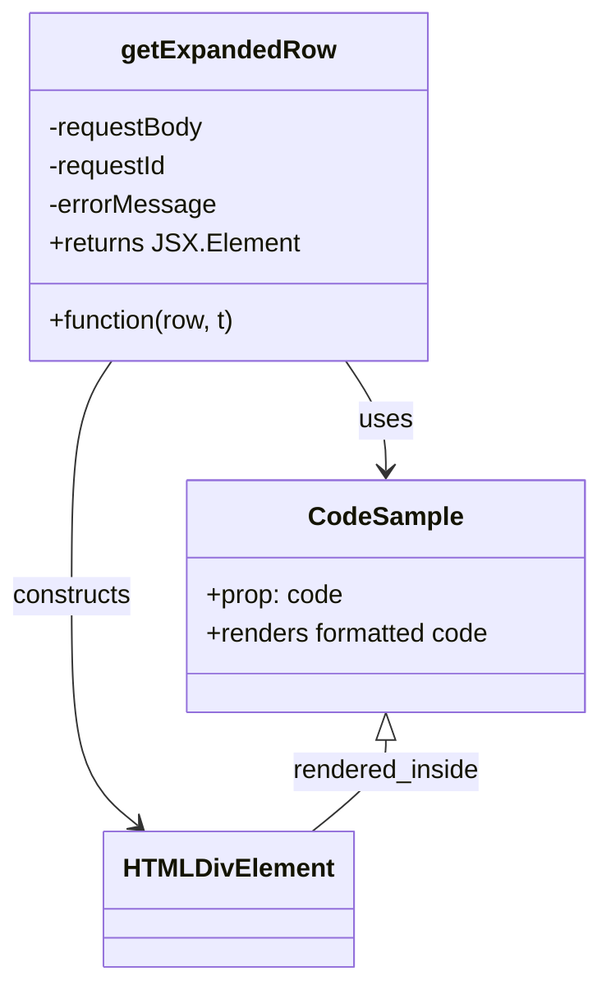

# Diagram: web/portal/src/modules/documentation/milestone-logs/MilestoneLogsTableExpandedRow.js


> Auto-generated by Obscura crawlers

## Diagram 1

```mermaid
flowchart TD
  A[getExpandedRow(row, t)]
  B[Destructure row.row.original: requestBody, requestId, errorMessage]
  C[Container DIV data-qa="row-expanded"]
  D[DIV: Request ID -> span data-qa="text-request-id"]
  E[Conditional DIV: Error Message -> span data-qa="text-error-message"]
  F[CodeSample component (renders requestBody)]
  A --> B
  B --> C
  C --> D
  B -->|errorMessage exists| E
  C --> F
```

> SVG rendering failed for this diagram.

## Diagram 2



### SVG

<svg id="container" width="375.921875" xmlns="http://www.w3.org/2000/svg" class="classDiagram" height="608" viewBox="0 0 375.921875 608" role="graphics-document document" aria-roledescription="class"><style>#container{font-family:"trebuchet ms",verdana,arial,sans-serif;font-size:16px;fill:#333;}@keyframes edge-animation-frame{from{stroke-dashoffset:0;}}@keyframes dash{to{stroke-dashoffset:0;}}#container .edge-animation-slow{stroke-dasharray:9,5!important;stroke-dashoffset:900;animation:dash 50s linear infinite;stroke-linecap:round;}#container .edge-animation-fast{stroke-dasharray:9,5!important;stroke-dashoffset:900;animation:dash 20s linear infinite;stroke-linecap:round;}#container .error-icon{fill:#552222;}#container .error-text{fill:#552222;stroke:#552222;}#container .edge-thickness-normal{stroke-width:1px;}#container .edge-thickness-thick{stroke-width:3.5px;}#container .edge-pattern-solid{stroke-dasharray:0;}#container .edge-thickness-invisible{stroke-width:0;fill:none;}#container .edge-pattern-dashed{stroke-dasharray:3;}#container .edge-pattern-dotted{stroke-dasharray:2;}#container .marker{fill:#333333;stroke:#333333;}#container .marker.cross{stroke:#333333;}#container svg{font-family:"trebuchet ms",verdana,arial,sans-serif;font-size:16px;}#container p{margin:0;}#container g.classGroup text{fill:#9370DB;stroke:none;font-family:"trebuchet ms",verdana,arial,sans-serif;font-size:10px;}#container g.classGroup text .title{font-weight:bolder;}#container .nodeLabel,#container .edgeLabel{color:#131300;}#container .edgeLabel .label rect{fill:#ECECFF;}#container .label text{fill:#131300;}#container .labelBkg{background:#ECECFF;}#container .edgeLabel .label span{background:#ECECFF;}#container .classTitle{font-weight:bolder;}#container .node rect,#container .node circle,#container .node ellipse,#container .node polygon,#container .node path{fill:#ECECFF;stroke:#9370DB;stroke-width:1px;}#container .divider{stroke:#9370DB;stroke-width:1;}#container g.clickable{cursor:pointer;}#container g.classGroup rect{fill:#ECECFF;stroke:#9370DB;}#container g.classGroup line{stroke:#9370DB;stroke-width:1;}#container .classLabel .box{stroke:none;stroke-width:0;fill:#ECECFF;opacity:0.5;}#container .classLabel .label{fill:#9370DB;font-size:10px;}#container .relation{stroke:#333333;stroke-width:1;fill:none;}#container .dashed-line{stroke-dasharray:3;}#container .dotted-line{stroke-dasharray:1 2;}#container #compositionStart,#container .composition{fill:#333333!important;stroke:#333333!important;stroke-width:1;}#container #compositionEnd,#container .composition{fill:#333333!important;stroke:#333333!important;stroke-width:1;}#container #dependencyStart,#container .dependency{fill:#333333!important;stroke:#333333!important;stroke-width:1;}#container #dependencyStart,#container .dependency{fill:#333333!important;stroke:#333333!important;stroke-width:1;}#container #extensionStart,#container .extension{fill:transparent!important;stroke:#333333!important;stroke-width:1;}#container #extensionEnd,#container .extension{fill:transparent!important;stroke:#333333!important;stroke-width:1;}#container #aggregationStart,#container .aggregation{fill:transparent!important;stroke:#333333!important;stroke-width:1;}#container #aggregationEnd,#container .aggregation{fill:transparent!important;stroke:#333333!important;stroke-width:1;}#container #lollipopStart,#container .lollipop{fill:#ECECFF!important;stroke:#333333!important;stroke-width:1;}#container #lollipopEnd,#container .lollipop{fill:#ECECFF!important;stroke:#333333!important;stroke-width:1;}#container .edgeTerminals{font-size:11px;line-height:initial;}#container .classTitleText{text-anchor:middle;font-size:18px;fill:#333;}#container .label-icon{display:inline-block;height:1em;overflow:visible;vertical-align:-0.125em;}#container .node .label-icon path{fill:currentColor;stroke:revert;stroke-width:revert;}#container :root{--mermaid-font-family:"trebuchet ms",verdana,arial,sans-serif;}</style><g><defs><marker id="container_class-aggregationStart" class="marker aggregation class" refX="18" refY="7" markerWidth="190" markerHeight="240" orient="auto"><path d="M 18,7 L9,13 L1,7 L9,1 Z"></path></marker></defs><defs><marker id="container_class-aggregationEnd" class="marker aggregation class" refX="1" refY="7" markerWidth="20" markerHeight="28" orient="auto"><path d="M 18,7 L9,13 L1,7 L9,1 Z"></path></marker></defs><defs><marker id="container_class-extensionStart" class="marker extension class" refX="18" refY="7" markerWidth="190" markerHeight="240" orient="auto"><path d="M 1,7 L18,13 V 1 Z"></path></marker></defs><defs><marker id="container_class-extensionEnd" class="marker extension class" refX="1" refY="7" markerWidth="20" markerHeight="28" orient="auto"><path d="M 1,1 V 13 L18,7 Z"></path></marker></defs><defs><marker id="container_class-compositionStart" class="marker composition class" refX="18" refY="7" markerWidth="190" markerHeight="240" orient="auto"><path d="M 18,7 L9,13 L1,7 L9,1 Z"></path></marker></defs><defs><marker id="container_class-compositionEnd" class="marker composition class" refX="1" refY="7" markerWidth="20" markerHeight="28" orient="auto"><path d="M 18,7 L9,13 L1,7 L9,1 Z"></path></marker></defs><defs><marker id="container_class-dependencyStart" class="marker dependency class" refX="6" refY="7" markerWidth="190" markerHeight="240" orient="auto"><path d="M 5,7 L9,13 L1,7 L9,1 Z"></path></marker></defs><defs><marker id="container_class-dependencyEnd" class="marker dependency class" refX="13" refY="7" markerWidth="20" markerHeight="28" orient="auto"><path d="M 18,7 L9,13 L14,7 L9,1 Z"></path></marker></defs><defs><marker id="container_class-lollipopStart" class="marker lollipop class" refX="13" refY="7" markerWidth="190" markerHeight="240" orient="auto"><circle stroke="black" fill="transparent" cx="7" cy="7" r="6"></circle></marker></defs><defs><marker id="container_class-lollipopEnd" class="marker lollipop class" refX="1" refY="7" markerWidth="190" markerHeight="240" orient="auto"><circle stroke="black" fill="transparent" cx="7" cy="7" r="6"></circle></marker></defs><g class="root"><g class="clusters"></g><g class="edgePaths"><path d="M218.111,224L222.31,230.167C226.509,236.333,234.907,248.667,239.106,260C243.305,271.333,243.305,281.667,243.305,286.833L243.305,292" id="id_getExpandedRow_CodeSample_1" class="edge-thickness-normal edge-pattern-solid relation" style=";;;" data-edge="true" data-et="edge" data-id="id_getExpandedRow_CodeSample_1" data-points="W3sieCI6MjE4LjExMTM5NTQ3NDEzNzk0LCJ5IjoyMjR9LHsieCI6MjQzLjMwNDY4NzUsInkiOjI2MX0seyJ4IjoyNDMuMzA0Njg3NSwieSI6Mjk4fV0=" marker-end="url(#container_class-dependencyEnd)"></path><path d="M71.037,224L66.838,230.167C62.639,236.333,54.242,248.667,50.043,273C45.844,297.333,45.844,333.667,45.844,370C45.844,406.333,45.844,442.667,52.77,466.375C59.696,490.084,73.548,501.168,80.474,506.709L87.4,512.251" id="id_getExpandedRow_HTMLDivElement_2" class="edge-thickness-normal edge-pattern-solid relation" style=";;;" data-edge="true" data-et="edge" data-id="id_getExpandedRow_HTMLDivElement_2" data-points="W3sieCI6NzEuMDM3MDQyMDI1ODYyMDYsInkiOjIyNH0seyJ4Ijo0NS44NDM3NSwieSI6MjYxfSx7IngiOjQ1Ljg0Mzc1LCJ5IjozNzB9LHsieCI6NDUuODQzNzUsInkiOjQ3OX0seyJ4Ijo5Mi4wODQ2MDI0NTI1MzE2NCwieSI6NTE2fV0=" marker-end="url(#container_class-dependencyEnd)"></path><path d="M243.305,459.25L243.305,462.542C243.305,465.833,243.305,472.417,235.598,481.875C227.891,491.333,212.477,503.667,204.771,509.833L197.064,516" id="id_CodeSample_HTMLDivElement_3" class="edge-thickness-normal edge-pattern-solid relation" style=";;;" data-edge="true" data-et="edge" data-id="id_CodeSample_HTMLDivElement_3" data-points="W3sieCI6MjQzLjMwNDY4NzUsInkiOjQ0Mn0seyJ4IjoyNDMuMzA0Njg3NSwieSI6NDc5fSx7IngiOjE5Ny4wNjM4MzUwNDc0NjgzNiwieSI6NTE2fV0=" marker-start="url(#container_class-extensionStart)"></path></g><g class="edgeLabels"><g class="edgeLabel" transform="translate(243.3046875, 261)"><g class="label" data-id="id_getExpandedRow_CodeSample_1" transform="translate(-16.4921875, -12)"><foreignObject width="32.984375" height="24"><div xmlns="http://www.w3.org/1999/xhtml" class="labelBkg" style="display: table-cell; white-space: nowrap; line-height: 1.5; max-width: 200px; text-align: center;"><span class="edgeLabel"><p>uses</p></span></div></foreignObject></g></g><g class="edgeLabel" transform="translate(45.84375, 370)"><g class="label" data-id="id_getExpandedRow_HTMLDivElement_2" transform="translate(-37.84375, -12)"><foreignObject width="75.6875" height="24"><div xmlns="http://www.w3.org/1999/xhtml" class="labelBkg" style="display: table-cell; white-space: nowrap; line-height: 1.5; max-width: 200px; text-align: center;"><span class="edgeLabel"><p>constructs</p></span></div></foreignObject></g></g><g class="edgeLabel" transform="translate(243.3046875, 479)"><g class="label" data-id="id_CodeSample_HTMLDivElement_3" transform="translate(-59.2734375, -12)"><foreignObject width="118.546875" height="24"><div xmlns="http://www.w3.org/1999/xhtml" class="labelBkg" style="display: table-cell; white-space: nowrap; line-height: 1.5; max-width: 200px; text-align: center;"><span class="edgeLabel"><p>rendered_inside</p></span></div></foreignObject></g></g></g><g class="nodes"><g class="node default" id="classId-getExpandedRow-0" transform="translate(144.57421875, 116)"><g class="basic label-container"><path d="M-118.6640625 -108 L118.6640625 -108 L118.6640625 108 L-118.6640625 108" stroke="none" stroke-width="0" fill="#ECECFF" style=""></path><path d="M-118.6640625 -108 C-46.668310053971695 -108, 25.32744239205661 -108, 118.6640625 -108 M-118.6640625 -108 C-63.274988104932966 -108, -7.885913709865932 -108, 118.6640625 -108 M118.6640625 -108 C118.6640625 -48.90056158483911, 118.6640625 10.19887683032178, 118.6640625 108 M118.6640625 -108 C118.6640625 -33.54159898015979, 118.6640625 40.91680203968042, 118.6640625 108 M118.6640625 108 C34.85422897583649 108, -48.95560454832702 108, -118.6640625 108 M118.6640625 108 C33.11111926212952 108, -52.44182397574096 108, -118.6640625 108 M-118.6640625 108 C-118.6640625 40.459837332607066, -118.6640625 -27.08032533478587, -118.6640625 -108 M-118.6640625 108 C-118.6640625 22.510155396618828, -118.6640625 -62.979689206762345, -118.6640625 -108" stroke="#9370DB" stroke-width="1.3" fill="none" stroke-dasharray="0 0" style=""></path></g><g class="annotation-group text" transform="translate(0, -84)"></g><g class="label-group text" transform="translate(-63.234375, -84)"><g class="label" style="font-weight: bolder" transform="translate(0,-12)"><foreignObject width="126.46875" height="24"><div xmlns="http://www.w3.org/1999/xhtml" style="display: table-cell; white-space: nowrap; line-height: 1.5; max-width: 175px; text-align: center;"><span class="nodeLabel markdown-node-label" style=""><p>getExpandedRow</p></span></div></foreignObject></g></g><g class="members-group text" transform="translate(-106.6640625, -36)"><g class="label" style="" transform="translate(0,-12)"><foreignObject width="98.234375" height="24"><div xmlns="http://www.w3.org/1999/xhtml" style="display: table-cell; white-space: nowrap; line-height: 1.5; max-width: 156px; text-align: center;"><span class="nodeLabel markdown-node-label" style=""><p>-requestBody</p></span></div></foreignObject></g><g class="label" style="" transform="translate(0,12)"><foreignObject width="76.015625" height="24"><div xmlns="http://www.w3.org/1999/xhtml" style="display: table-cell; white-space: nowrap; line-height: 1.5; max-width: 133px; text-align: center;"><span class="nodeLabel markdown-node-label" style=""><p>-requestId</p></span></div></foreignObject></g><g class="label" style="" transform="translate(0,36)"><foreignObject width="103.6875" height="24"><div xmlns="http://www.w3.org/1999/xhtml" style="display: table-cell; white-space: nowrap; line-height: 1.5; max-width: 161px; text-align: center;"><span class="nodeLabel markdown-node-label" style=""><p>-errorMessage</p></span></div></foreignObject></g><g class="label" style="" transform="translate(0,60)"><foreignObject width="150.09375" height="24"><div xmlns="http://www.w3.org/1999/xhtml" style="display: table-cell; white-space: nowrap; line-height: 1.5; max-width: 208px; text-align: center;"><span class="nodeLabel markdown-node-label" style=""><p>+returns JSX.Element</p></span></div></foreignObject></g></g><g class="methods-group text" transform="translate(-106.6640625, 84)"><g class="label" style="" transform="translate(0,-12)"><foreignObject width="118.875" height="24"><div xmlns="http://www.w3.org/1999/xhtml" style="display: table-cell; white-space: nowrap; line-height: 1.5; max-width: 176px; text-align: center;"><span class="nodeLabel markdown-node-label" style=""><p>+function(row, t)</p></span></div></foreignObject></g></g><g class="divider" style=""><path d="M-118.6640625 -60 C-44.76659198941381 -60, 29.130878521172377 -60, 118.6640625 -60 M-118.6640625 -60 C-58.70145023001667 -60, 1.2611620399666634 -60, 118.6640625 -60" stroke="#9370DB" stroke-width="1.3" fill="none" stroke-dasharray="0 0" style=""></path></g><g class="divider" style=""><path d="M-118.6640625 60 C-49.4544064685863 60, 19.7552495628274 60, 118.6640625 60 M-118.6640625 60 C-54.54046130690142 60, 9.58313988619716 60, 118.6640625 60" stroke="#9370DB" stroke-width="1.3" fill="none" stroke-dasharray="0 0" style=""></path></g></g><g class="node default" id="classId-CodeSample-1" transform="translate(243.3046875, 370)"><g class="basic label-container"><path d="M-124.6171875 -72 L124.6171875 -72 L124.6171875 72 L-124.6171875 72" stroke="none" stroke-width="0" fill="#ECECFF" style=""></path><path d="M-124.6171875 -72 C-51.88620596517673 -72, 20.844775569646544 -72, 124.6171875 -72 M-124.6171875 -72 C-53.39073368732609 -72, 17.83572012534782 -72, 124.6171875 -72 M124.6171875 -72 C124.6171875 -23.603534047479997, 124.6171875 24.792931905040007, 124.6171875 72 M124.6171875 -72 C124.6171875 -36.615324131921746, 124.6171875 -1.2306482638434915, 124.6171875 72 M124.6171875 72 C61.920854761448176 72, -0.7754779771036482 72, -124.6171875 72 M124.6171875 72 C41.59531038205061 72, -41.426566735898774 72, -124.6171875 72 M-124.6171875 72 C-124.6171875 40.91501903437137, -124.6171875 9.830038068742745, -124.6171875 -72 M-124.6171875 72 C-124.6171875 16.398523620556283, -124.6171875 -39.202952758887434, -124.6171875 -72" stroke="#9370DB" stroke-width="1.3" fill="none" stroke-dasharray="0 0" style=""></path></g><g class="annotation-group text" transform="translate(0, -48)"></g><g class="label-group text" transform="translate(-45.578125, -48)"><g class="label" style="font-weight: bolder" transform="translate(0,-12)"><foreignObject width="91.15625" height="24"><div xmlns="http://www.w3.org/1999/xhtml" style="display: table-cell; white-space: nowrap; line-height: 1.5; max-width: 140px; text-align: center;"><span class="nodeLabel markdown-node-label" style=""><p>CodeSample</p></span></div></foreignObject></g></g><g class="members-group text" transform="translate(-112.6171875, 0)"><g class="label" style="" transform="translate(0,-12)"><foreignObject width="85.078125" height="24"><div xmlns="http://www.w3.org/1999/xhtml" style="display: table-cell; white-space: nowrap; line-height: 1.5; max-width: 142px; text-align: center;"><span class="nodeLabel markdown-node-label" style=""><p>+prop: code</p></span></div></foreignObject></g><g class="label" style="" transform="translate(0,12)"><foreignObject width="179.65625" height="24"><div xmlns="http://www.w3.org/1999/xhtml" style="display: table-cell; white-space: nowrap; line-height: 1.5; max-width: 237px; text-align: center;"><span class="nodeLabel markdown-node-label" style=""><p>+renders formatted code</p></span></div></foreignObject></g></g><g class="methods-group text" transform="translate(-112.6171875, 72)"></g><g class="divider" style=""><path d="M-124.6171875 -24 C-41.702755586756055 -24, 41.21167632648789 -24, 124.6171875 -24 M-124.6171875 -24 C-50.25175767227964 -24, 24.113672155440725 -24, 124.6171875 -24" stroke="#9370DB" stroke-width="1.3" fill="none" stroke-dasharray="0 0" style=""></path></g><g class="divider" style=""><path d="M-124.6171875 48 C-31.6767702235844 48, 61.2636470528312 48, 124.6171875 48 M-124.6171875 48 C-60.37393201909022 48, 3.8693234618195618 48, 124.6171875 48" stroke="#9370DB" stroke-width="1.3" fill="none" stroke-dasharray="0 0" style=""></path></g></g><g class="node default" id="classId-HTMLDivElement-2" transform="translate(144.57421875, 558)"><g class="basic label-container"><path d="M-73.21875 -42 L73.21875 -42 L73.21875 42 L-73.21875 42" stroke="none" stroke-width="0" fill="#ECECFF" style=""></path><path d="M-73.21875 -42 C-35.20582550197836 -42, 2.8070989960432797 -42, 73.21875 -42 M-73.21875 -42 C-26.56275401682211 -42, 20.093241966355777 -42, 73.21875 -42 M73.21875 -42 C73.21875 -16.790670491773955, 73.21875 8.41865901645209, 73.21875 42 M73.21875 -42 C73.21875 -14.108262429349608, 73.21875 13.783475141300784, 73.21875 42 M73.21875 42 C22.084708779561623 42, -29.049332440876753 42, -73.21875 42 M73.21875 42 C37.890746435962484 42, 2.562742871924968 42, -73.21875 42 M-73.21875 42 C-73.21875 13.799605559688548, -73.21875 -14.400788880622905, -73.21875 -42 M-73.21875 42 C-73.21875 10.289021972138908, -73.21875 -21.421956055722184, -73.21875 -42" stroke="#9370DB" stroke-width="1.3" fill="none" stroke-dasharray="0 0" style=""></path></g><g class="annotation-group text" transform="translate(0, -18)"></g><g class="label-group text" transform="translate(-61.21875, -18)"><g class="label" style="font-weight: bolder" transform="translate(0,-12)"><foreignObject width="122.4375" height="24"><div xmlns="http://www.w3.org/1999/xhtml" style="display: table-cell; white-space: nowrap; line-height: 1.5; max-width: 172px; text-align: center;"><span class="nodeLabel markdown-node-label" style=""><p>HTMLDivElement</p></span></div></foreignObject></g></g><g class="members-group text" transform="translate(-61.21875, 30)"></g><g class="methods-group text" transform="translate(-61.21875, 60)"></g><g class="divider" style=""><path d="M-73.21875 6 C-38.57583404590515 6, -3.9329180918102935 6, 73.21875 6 M-73.21875 6 C-34.328387882924204 6, 4.561974234151592 6, 73.21875 6" stroke="#9370DB" stroke-width="1.3" fill="none" stroke-dasharray="0 0" style=""></path></g><g class="divider" style=""><path d="M-73.21875 24 C-27.486939539760236 24, 18.244870920479528 24, 73.21875 24 M-73.21875 24 C-38.78354237659186 24, -4.348334753183721 24, 73.21875 24" stroke="#9370DB" stroke-width="1.3" fill="none" stroke-dasharray="0 0" style=""></path></g></g></g></g></g></svg>
