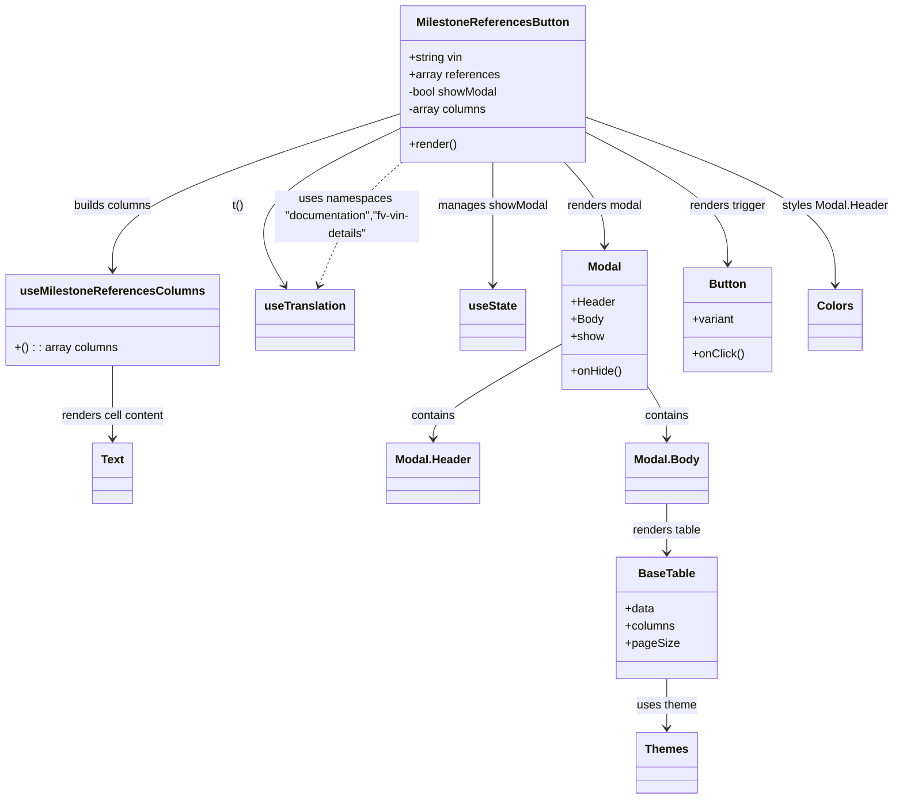

# Diagram: web/portal/src/modules/documentation/milestone-logs/MilestoneReferencesButton.js

> Auto-generated by Obscura crawlers

## Mermaid

### SVG

<svg id="container" width="1219.26953125" xmlns="http://www.w3.org/2000/svg" class="classDiagram" height="1104" viewBox="0 0 1219.26953125 1104" role="graphics-document document" aria-roledescription="class"><g><defs><marker id="container_class-aggregationStart" class="marker aggregation class" refX="18" refY="7" markerWidth="190" markerHeight="240" orient="auto"><path d="M 18,7 L9,13 L1,7 L9,1 Z"></path></marker></defs><defs><marker id="container_class-aggregationEnd" class="marker aggregation class" refX="1" refY="7" markerWidth="20" markerHeight="28" orient="auto"><path d="M 18,7 L9,13 L1,7 L9,1 Z"></path></marker></defs><defs><marker id="container_class-extensionStart" class="marker extension class" refX="18" refY="7" markerWidth="190" markerHeight="240" orient="auto"><path d="M 1,7 L18,13 V 1 Z"></path></marker></defs><defs><marker id="container_class-extensionEnd" class="marker extension class" refX="1" refY="7" markerWidth="20" markerHeight="28" orient="auto"><path d="M 1,1 V 13 L18,7 Z"></path></marker></defs><defs><marker id="container_class-compositionStart" class="marker composition class" refX="18" refY="7" markerWidth="190" markerHeight="240" orient="auto"><path d="M 18,7 L9,13 L1,7 L9,1 Z"></path></marker></defs><defs><marker id="container_class-compositionEnd" class="marker composition class" refX="1" refY="7" markerWidth="20" markerHeight="28" orient="auto"><path d="M 18,7 L9,13 L1,7 L9,1 Z"></path></marker></defs><defs><marker id="container_class-dependencyStart" class="marker dependency class" refX="6" refY="7" markerWidth="190" markerHeight="240" orient="auto"><path d="M 5,7 L9,13 L1,7 L9,1 Z"></path></marker></defs><defs><marker id="container_class-dependencyEnd" class="marker dependency class" refX="13" refY="7" markerWidth="20" markerHeight="28" orient="auto"><path d="M 18,7 L9,13 L14,7 L9,1 Z"></path></marker></defs><defs><marker id="container_class-lollipopStart" class="marker lollipop class" refX="13" refY="7" markerWidth="190" markerHeight="240" orient="auto"><circle stroke="black" fill="transparent" cx="7" cy="7" r="6"></circle></marker></defs><defs><marker id="container_class-lollipopEnd" class="marker lollipop class" refX="1" refY="7" markerWidth="190" markerHeight="240" orient="auto"><circle stroke="black" fill="transparent" cx="7" cy="7" r="6"></circle></marker></defs><g class="root"><g class="clusters"></g><g class="edgePaths"><path d="M669.078,224L669.078,234.167C669.078,244.333,669.078,264.667,669.078,293C669.078,321.333,669.078,357.667,669.078,375.833L669.078,394" id="id_MilestoneReferencesButton_useState_1" class="edge-thickness-normal edge-pattern-solid relation" style=";;;" data-edge="true" data-et="edge" data-id="id_MilestoneReferencesButton_useState_1" data-points="W3sieCI6NjY5LjA3ODEyNSwieSI6MjI0fSx7IngiOjY2OS4wNzgxMjUsInkiOjI4NX0seyJ4Ijo2NjkuMDc4MTI1LCJ5Ijo0MDB9XQ==" marker-end="url(#container_class-dependencyEnd)"></path><path d="M543.656,177.027L506.672,195.022C469.688,213.018,395.719,249.009,368.958,285.298C342.198,321.587,362.645,358.175,372.869,376.469L383.093,394.762" id="id_MilestoneReferencesButton_useTranslation_2" class="edge-thickness-normal edge-pattern-solid relation" style=";;;" data-edge="true" data-et="edge" data-id="id_MilestoneReferencesButton_useTranslation_2" data-points="W3sieCI6NTQzLjY1NjI1LCJ5IjoxNzcuMDI2NzIxODQ5ODM1OH0seyJ4IjozMjEuNzUsInkiOjI4NX0seyJ4IjozODYuMDE5NzU1MTc1MTU5MiwieSI6NDAwfV0=" marker-end="url(#container_class-dependencyEnd)"></path><path d="M543.656,156.89L478.164,178.242C412.672,199.593,281.688,242.297,216.195,278.315C150.703,314.333,150.703,343.667,150.703,358.333L150.703,373" id="id_MilestoneReferencesButton_useMilestoneReferencesColumns_3" class="edge-thickness-normal edge-pattern-solid relation" style=";;;" data-edge="true" data-et="edge" data-id="id_MilestoneReferencesButton_useMilestoneReferencesColumns_3" data-points="W3sieCI6NTQzLjY1NjI1LCJ5IjoxNTYuODg5ODkwMjgyMTMxNjZ9LHsieCI6MTUwLjcwMzEyNSwieSI6Mjg1fSx7IngiOjE1MC43MDMxMjUsInkiOjM3OX1d" marker-end="url(#container_class-dependencyEnd)"></path><path d="M794.5,181.978L827.14,199.149C859.78,216.319,925.06,250.659,957.7,280.996C990.34,311.333,990.34,337.667,990.34,350.833L990.34,364" id="id_MilestoneReferencesButton_Button_4" class="edge-thickness-normal edge-pattern-solid relation" style=";;;" data-edge="true" data-et="edge" data-id="id_MilestoneReferencesButton_Button_4" data-points="W3sieCI6Nzk0LjUsInkiOjE4MS45NzgyODM4NjYxMDQxfSx7IngiOjk5MC4zMzk4NDM3NSwieSI6Mjg1fSx7IngiOjk5MC4zMzk4NDM3NSwieSI6MzcwfV0=" marker-end="url(#container_class-dependencyEnd)"></path><path d="M766.711,224L775.902,234.167C785.092,244.333,803.474,264.667,812.665,284C821.855,303.333,821.855,321.667,821.855,330.833L821.855,340" id="id_MilestoneReferencesButton_Modal_5" class="edge-thickness-normal edge-pattern-solid relation" style=";;;" data-edge="true" data-et="edge" data-id="id_MilestoneReferencesButton_Modal_5" data-points="W3sieCI6NzY2LjcxMDk4MzcyNzgxMDcsInkiOjIyNH0seyJ4Ijo4MjEuODU1NDY4NzUsInkiOjI4NX0seyJ4Ijo4MjEuODU1NDY4NzUsInkiOjM0Nn1d" marker-end="url(#container_class-dependencyEnd)"></path><path d="M763.25,475.393L734.115,491.994C704.98,508.596,646.71,541.798,617.575,563.566C588.439,585.333,588.439,595.667,588.439,600.833L588.439,606" id="id_Modal_Modal.Header_6" class="edge-thickness-normal edge-pattern-solid relation" style=";;;" data-edge="true" data-et="edge" data-id="id_Modal_Modal.Header_6" data-points="W3sieCI6NzYzLjI1LCJ5Ijo0NzUuMzkzMjg0MTg3ODAxOH0seyJ4Ijo1ODguNDM5NDUzMTI1LCJ5Ijo1NzV9LHsieCI6NTg4LjQzOTQ1MzEyNSwieSI6NjEyfV0=" marker-end="url(#container_class-dependencyEnd)"></path><path d="M880.461,534.861L884.683,541.551C888.905,548.241,897.349,561.62,901.571,573.477C905.793,585.333,905.793,595.667,905.793,600.833L905.793,606" id="id_Modal_Modal.Body_7" class="edge-thickness-normal edge-pattern-solid relation" style=";;;" data-edge="true" data-et="edge" data-id="id_Modal_Modal.Body_7" data-points="W3sieCI6ODgwLjQ2MDkzNzUsInkiOjUzNC44NjEwODUyNTY4ODc2fSx7IngiOjkwNS43OTI5Njg3NSwieSI6NTc1fSx7IngiOjkwNS43OTI5Njg3NSwieSI6NjEyfV0=" marker-end="url(#container_class-dependencyEnd)"></path><path d="M905.793,696L905.793,702.167C905.793,708.333,905.793,720.667,905.793,732C905.793,743.333,905.793,753.667,905.793,758.833L905.793,764" id="id_Modal.Body_BaseTable_8" class="edge-thickness-normal edge-pattern-solid relation" style=";;;" data-edge="true" data-et="edge" data-id="id_Modal.Body_BaseTable_8" data-points="W3sieCI6OTA1Ljc5Mjk2ODc1LCJ5Ijo2OTZ9LHsieCI6OTA1Ljc5Mjk2ODc1LCJ5Ijo3MzN9LHsieCI6OTA1Ljc5Mjk2ODc1LCJ5Ijo3NzB9XQ==" marker-end="url(#container_class-dependencyEnd)"></path><path d="M905.793,938L905.793,944.167C905.793,950.333,905.793,962.667,905.793,974C905.793,985.333,905.793,995.667,905.793,1000.833L905.793,1006" id="id_BaseTable_Themes_9" class="edge-thickness-normal edge-pattern-solid relation" style=";;;" data-edge="true" data-et="edge" data-id="id_BaseTable_Themes_9" data-points="W3sieCI6OTA1Ljc5Mjk2ODc1LCJ5Ijo5Mzh9LHsieCI6OTA1Ljc5Mjk2ODc1LCJ5Ijo5NzV9LHsieCI6OTA1Ljc5Mjk2ODc1LCJ5IjoxMDEyfV0=" marker-end="url(#container_class-dependencyEnd)"></path><path d="M150.703,505L150.703,516.667C150.703,528.333,150.703,551.667,150.703,568.5C150.703,585.333,150.703,595.667,150.703,600.833L150.703,606" id="id_useMilestoneReferencesColumns_Text_10" class="edge-thickness-normal edge-pattern-solid relation" style=";;;" data-edge="true" data-et="edge" data-id="id_useMilestoneReferencesColumns_Text_10" data-points="W3sieCI6MTUwLjcwMzEyNSwieSI6NTA1fSx7IngiOjE1MC43MDMxMjUsInkiOjU3NX0seyJ4IjoxNTAuNzAzMTI1LCJ5Ijo2MTJ9XQ==" marker-end="url(#container_class-dependencyEnd)"></path><path d="M794.5,161.233L851.696,181.861C908.892,202.489,1023.284,243.744,1080.48,282.539C1137.676,321.333,1137.676,357.667,1137.676,375.833L1137.676,394" id="id_MilestoneReferencesButton_Colors_11" class="edge-thickness-normal edge-pattern-solid relation" style=";;;" data-edge="true" data-et="edge" data-id="id_MilestoneReferencesButton_Colors_11" data-points="W3sieCI6Nzk0LjUsInkiOjE2MS4yMzM0Njc1NDM2MTgzNn0seyJ4IjoxMTM3LjY3NTc4MTI1LCJ5IjoyODV9LHsieCI6MTEzNy42NzU3ODEyNSwieSI6NDAwfV0=" marker-end="url(#container_class-dependencyEnd)"></path><path d="M544.113,224L532.35,234.167C520.586,244.333,497.059,264.667,477.855,293.074C458.651,321.481,443.77,357.963,436.33,376.204L428.89,394.444" id="id_MilestoneReferencesButton_useTranslation_12" class="edge-thickness-normal edge-pattern-dashed relation" style=";;;" data-edge="true" data-et="edge" data-id="id_MilestoneReferencesButton_useTranslation_12" data-points="W3sieCI6NTQ0LjExMzI1ODEzNjA5NDcsInkiOjIyNH0seyJ4Ijo0NzMuNTMxMjUsInkiOjI4NX0seyJ4Ijo0MjYuNjIzNjU2NDQ5MDQ0NiwieSI6NDAwfV0=" marker-end="url(#container_class-dependencyEnd)"></path></g><g class="edgeLabels"><g class="edgeLabel" transform="translate(669.078125, 285)"><g class="label" data-id="id_MilestoneReferencesButton_useState_1" transform="translate(-75.546875, -12)"><foreignObject width="151.09375" height="24">

manages showModal

</foreignObject></g></g><g class="edgeLabel" transform="translate(321.75, 285)"><g class="label" data-id="id_MilestoneReferencesButton_useTranslation_2" transform="translate(-8.078125, -12)"><foreignObject width="16.15625" height="24">

t()

</foreignObject></g></g><g class="edgeLabel" transform="translate(150.703125, 285)"><g class="label" data-id="id_MilestoneReferencesButton_useMilestoneReferencesColumns_3" transform="translate(-55.2265625, -12)"><foreignObject width="110.453125" height="24">

builds columns

</foreignObject></g></g><g class="edgeLabel" transform="translate(990.33984375, 285)"><g class="label" data-id="id_MilestoneReferencesButton_Button_4" transform="translate(-53.7421875, -12)"><foreignObject width="107.484375" height="24">

renders trigger

</foreignObject></g></g><g class="edgeLabel" transform="translate(821.85546875, 285)"><g class="label" data-id="id_MilestoneReferencesButton_Modal_5" transform="translate(-52.796875, -12)"><foreignObject width="105.59375" height="24">

renders modal

</foreignObject></g></g><g class="edgeLabel" transform="translate(588.439453125, 575)"><g class="label" data-id="id_Modal_Modal.Header_6" transform="translate(-30.890625, -12)"><foreignObject width="61.78125" height="24">

contains

</foreignObject></g></g><g class="edgeLabel" transform="translate(905.79296875, 575)"><g class="label" data-id="id_Modal_Modal.Body_7" transform="translate(-30.890625, -12)"><foreignObject width="61.78125" height="24">

contains

</foreignObject></g></g><g class="edgeLabel" transform="translate(905.79296875, 733)"><g class="label" data-id="id_Modal.Body_BaseTable_8" transform="translate(-48.46875, -12)"><foreignObject width="96.9375" height="24">

renders table

</foreignObject></g></g><g class="edgeLabel" transform="translate(905.79296875, 975)"><g class="label" data-id="id_BaseTable_Themes_9" transform="translate(-41.765625, -12)"><foreignObject width="83.53125" height="24">

uses theme

</foreignObject></g></g><g class="edgeLabel" transform="translate(150.703125, 575)"><g class="label" data-id="id_useMilestoneReferencesColumns_Text_10" transform="translate(-72.4296875, -12)"><foreignObject width="144.859375" height="24">

renders cell content

</foreignObject></g></g><g class="edgeLabel" transform="translate(1137.67578125, 285)"><g class="label" data-id="id_MilestoneReferencesButton_Colors_11" transform="translate(-73.59375, -12)"><foreignObject width="147.1875" height="24">

styles Modal.Header

</foreignObject></g></g><g class="edgeLabel" transform="translate(467.69421, 299.31025)"><g class="label" data-id="id_MilestoneReferencesButton_useTranslation_12" transform="translate(-100, -36)"><foreignObject width="200" height="72">

uses namespaces "documentation","fv-vin-details"

</foreignObject></g></g></g><g class="nodes"><g class="node default" id="classId-MilestoneReferencesButton-0" transform="translate(669.078125, 116)"><g class="basic label-container"><path d="M-125.421875 -108 L125.421875 -108 L125.421875 108 L-125.421875 108" stroke="none" stroke-width="0" fill="#ECECFF" style=""></path><path d="M-125.421875 -108 C-54.77211220508413 -108, 15.877650589831745 -108, 125.421875 -108 M-125.421875 -108 C-31.48879673642371 -108, 62.44428152715258 -108, 125.421875 -108 M125.421875 -108 C125.421875 -57.887758910505745, 125.421875 -7.775517821011491, 125.421875 108 M125.421875 -108 C125.421875 -38.12724656521051, 125.421875 31.745506869578975, 125.421875 108 M125.421875 108 C38.720649671670884 108, -47.98057565665823 108, -125.421875 108 M125.421875 108 C55.1986411348785 108, -15.024592730243 108, -125.421875 108 M-125.421875 108 C-125.421875 54.93316800063396, -125.421875 1.8663360012679249, -125.421875 -108 M-125.421875 108 C-125.421875 32.99211180418618, -125.421875 -42.01577639162764, -125.421875 -108" stroke="#9370DB" stroke-width="1.3" fill="none" stroke-dasharray="0 0" style=""></path></g><g class="annotation-group text" transform="translate(0, -84)"></g><g class="label-group text" transform="translate(-101.015625, -84)"><g class="label" style="font-weight: bolder" transform="translate(0,-12)"><foreignObject width="202.03125" height="24">

MilestoneReferencesButton

</foreignObject></g></g><g class="members-group text" transform="translate(-113.421875, -36)"><g class="label" style="" transform="translate(0,-12)"><foreignObject width="75.625" height="24">

+string vin

</foreignObject></g><g class="label" style="" transform="translate(0,12)"><foreignObject width="124.46875" height="24">

+array references

</foreignObject></g><g class="label" style="" transform="translate(0,36)"><foreignObject width="125.828125" height="24">

-bool showModal

</foreignObject></g><g class="label" style="" transform="translate(0,60)"><foreignObject width="108.515625" height="24">

-array columns

</foreignObject></g></g><g class="methods-group text" transform="translate(-113.421875, 84)"><g class="label" style="" transform="translate(0,-12)"><foreignObject width="66.609375" height="24">

+render()

</foreignObject></g></g><g class="divider" style=""><path d="M-125.421875 -60 C-53.94356723430481 -60, 17.534740531390383 -60, 125.421875 -60 M-125.421875 -60 C-26.392926026766418 -60, 72.63602294646716 -60, 125.421875 -60" stroke="#9370DB" stroke-width="1.3" fill="none" stroke-dasharray="0 0" style=""></path></g><g class="divider" style=""><path d="M-125.421875 60 C-61.05230628458959 60, 3.3172624308208185 60, 125.421875 60 M-125.421875 60 C-50.474283284559064 60, 24.473308430881872 60, 125.421875 60" stroke="#9370DB" stroke-width="1.3" fill="none" stroke-dasharray="0 0" style=""></path></g></g><g class="node default" id="classId-useMilestoneReferencesColumns-1" transform="translate(150.703125, 442)"><g class="basic label-container"><path d="M-142.703125 -63 L142.703125 -63 L142.703125 63 L-142.703125 63" stroke="none" stroke-width="0" fill="#ECECFF" style=""></path><path d="M-142.703125 -63 C-28.762641445094786 -63, 85.17784210981043 -63, 142.703125 -63 M-142.703125 -63 C-42.17637218912394 -63, 58.35038062175212 -63, 142.703125 -63 M142.703125 -63 C142.703125 -27.437120836345322, 142.703125 8.125758327309356, 142.703125 63 M142.703125 -63 C142.703125 -21.533933788885236, 142.703125 19.93213242222953, 142.703125 63 M142.703125 63 C81.11711664722046 63, 19.531108294440898 63, -142.703125 63 M142.703125 63 C65.23341647075952 63, -12.236292058480956 63, -142.703125 63 M-142.703125 63 C-142.703125 17.415239280821424, -142.703125 -28.16952143835715, -142.703125 -63 M-142.703125 63 C-142.703125 30.43782818743282, -142.703125 -2.124343625134358, -142.703125 -63" stroke="#9370DB" stroke-width="1.3" fill="none" stroke-dasharray="0 0" style=""></path></g><g class="annotation-group text" transform="translate(0, -39)"></g><g class="label-group text" transform="translate(-120.34375, -39)"><g class="label" style="font-weight: bolder" transform="translate(0,-12)"><foreignObject width="240.6875" height="24">

useMilestoneReferencesColumns

</foreignObject></g></g><g class="members-group text" transform="translate(-130.703125, 9)"></g><g class="methods-group text" transform="translate(-130.703125, 39)"><g class="label" style="" transform="translate(0,-12)"><foreignObject width="141.0625" height="24">

+() : : array columns

</foreignObject></g></g><g class="divider" style=""><path d="M-142.703125 -15 C-50.88105345276749 -15, 40.94101809446502 -15, 142.703125 -15 M-142.703125 -15 C-65.7323764268638 -15, 11.238372146272411 -15, 142.703125 -15" stroke="#9370DB" stroke-width="1.3" fill="none" stroke-dasharray="0 0" style=""></path></g><g class="divider" style=""><path d="M-142.703125 9 C-31.177122244285982 9, 80.34888051142804 9, 142.703125 9 M-142.703125 9 C-50.1792902697282 9, 42.3445444605436 9, 142.703125 9" stroke="#9370DB" stroke-width="1.3" fill="none" stroke-dasharray="0 0" style=""></path></g></g><g class="node default" id="classId-useTranslation-2" transform="translate(409.4921875, 442)"><g class="basic label-container"><path d="M-66.0859375 -42 L66.0859375 -42 L66.0859375 42 L-66.0859375 42" stroke="none" stroke-width="0" fill="#ECECFF" style=""></path><path d="M-66.0859375 -42 C-20.658605512135743 -42, 24.768726475728513 -42, 66.0859375 -42 M-66.0859375 -42 C-18.29777645058745 -42, 29.490384598825102 -42, 66.0859375 -42 M66.0859375 -42 C66.0859375 -8.504954153814005, 66.0859375 24.99009169237199, 66.0859375 42 M66.0859375 -42 C66.0859375 -24.9636500242675, 66.0859375 -7.9273000485350025, 66.0859375 42 M66.0859375 42 C20.6255439430033 42, -24.8348496139934 42, -66.0859375 42 M66.0859375 42 C20.044798462719342 42, -25.996340574561316 42, -66.0859375 42 M-66.0859375 42 C-66.0859375 18.918514768711646, -66.0859375 -4.162970462576709, -66.0859375 -42 M-66.0859375 42 C-66.0859375 19.079447893741825, -66.0859375 -3.841104212516349, -66.0859375 -42" stroke="#9370DB" stroke-width="1.3" fill="none" stroke-dasharray="0 0" style=""></path></g><g class="annotation-group text" transform="translate(0, -18)"></g><g class="label-group text" transform="translate(-54.0859375, -18)"><g class="label" style="font-weight: bolder" transform="translate(0,-12)"><foreignObject width="108.171875" height="24">

useTranslation

</foreignObject></g></g><g class="members-group text" transform="translate(-54.0859375, 30)"></g><g class="methods-group text" transform="translate(-54.0859375, 60)"></g><g class="divider" style=""><path d="M-66.0859375 6 C-15.415513273807498 6, 35.254910952385 6, 66.0859375 6 M-66.0859375 6 C-17.746899066481326 6, 30.592139367037348 6, 66.0859375 6" stroke="#9370DB" stroke-width="1.3" fill="none" stroke-dasharray="0 0" style=""></path></g><g class="divider" style=""><path d="M-66.0859375 24 C-38.77228028371884 24, -11.458623067437685 24, 66.0859375 24 M-66.0859375 24 C-23.21097772572284 24, 19.663982048554317 24, 66.0859375 24" stroke="#9370DB" stroke-width="1.3" fill="none" stroke-dasharray="0 0" style=""></path></g></g><g class="node default" id="classId-useState-3" transform="translate(669.078125, 442)"><g class="basic label-container"><path d="M-44.171875 -42 L44.171875 -42 L44.171875 42 L-44.171875 42" stroke="none" stroke-width="0" fill="#ECECFF" style=""></path><path d="M-44.171875 -42 C-25.361631899885598 -42, -6.551388799771196 -42, 44.171875 -42 M-44.171875 -42 C-19.259283764068034 -42, 5.653307471863933 -42, 44.171875 -42 M44.171875 -42 C44.171875 -18.21178167399217, 44.171875 5.5764366520156585, 44.171875 42 M44.171875 -42 C44.171875 -24.67723001335166, 44.171875 -7.354460026703322, 44.171875 42 M44.171875 42 C23.0546189085518 42, 1.9373628171035975 42, -44.171875 42 M44.171875 42 C26.169865321471974 42, 8.167855642943948 42, -44.171875 42 M-44.171875 42 C-44.171875 17.246050455575965, -44.171875 -7.50789908884807, -44.171875 -42 M-44.171875 42 C-44.171875 23.299619808430883, -44.171875 4.599239616861766, -44.171875 -42" stroke="#9370DB" stroke-width="1.3" fill="none" stroke-dasharray="0 0" style=""></path></g><g class="annotation-group text" transform="translate(0, -18)"></g><g class="label-group text" transform="translate(-32.171875, -18)"><g class="label" style="font-weight: bolder" transform="translate(0,-12)"><foreignObject width="64.34375" height="24">

useState

</foreignObject></g></g><g class="members-group text" transform="translate(-32.171875, 30)"></g><g class="methods-group text" transform="translate(-32.171875, 60)"></g><g class="divider" style=""><path d="M-44.171875 6 C-25.906947418451416 6, -7.642019836902833 6, 44.171875 6 M-44.171875 6 C-17.427109767926645 6, 9.31765546414671 6, 44.171875 6" stroke="#9370DB" stroke-width="1.3" fill="none" stroke-dasharray="0 0" style=""></path></g><g class="divider" style=""><path d="M-44.171875 24 C-9.514024295171623 24, 25.143826409656754 24, 44.171875 24 M-44.171875 24 C-20.7139963894223 24, 2.7438822211554026 24, 44.171875 24" stroke="#9370DB" stroke-width="1.3" fill="none" stroke-dasharray="0 0" style=""></path></g></g><g class="node default" id="classId-Modal-4" transform="translate(821.85546875, 442)"><g class="basic label-container"><path d="M-58.60546875 -96 L58.60546875 -96 L58.60546875 96 L-58.60546875 96" stroke="none" stroke-width="0" fill="#ECECFF" style=""></path><path d="M-58.60546875 -96 C-15.32389966098092 -96, 27.95766942803816 -96, 58.60546875 -96 M-58.60546875 -96 C-18.641876850993874 -96, 21.32171504801225 -96, 58.60546875 -96 M58.60546875 -96 C58.60546875 -35.08884566822453, 58.60546875 25.822308663550942, 58.60546875 96 M58.60546875 -96 C58.60546875 -56.751071634652604, 58.60546875 -17.502143269305208, 58.60546875 96 M58.60546875 96 C16.521995348493583 96, -25.561478053012834 96, -58.60546875 96 M58.60546875 96 C34.42916688625414 96, 10.252865022508281 96, -58.60546875 96 M-58.60546875 96 C-58.60546875 52.01106751159754, -58.60546875 8.022135023195077, -58.60546875 -96 M-58.60546875 96 C-58.60546875 23.483373505541337, -58.60546875 -49.033252988917326, -58.60546875 -96" stroke="#9370DB" stroke-width="1.3" fill="none" stroke-dasharray="0 0" style=""></path></g><g class="annotation-group text" transform="translate(0, -72)"></g><g class="label-group text" transform="translate(-22.4453125, -72)"><g class="label" style="font-weight: bolder" transform="translate(0,-12)"><foreignObject width="44.890625" height="24">

Modal

</foreignObject></g></g><g class="members-group text" transform="translate(-46.60546875, -24)"><g class="label" style="" transform="translate(0,-12)"><foreignObject width="60.59375" height="24">

+Header

</foreignObject></g><g class="label" style="" transform="translate(0,12)"><foreignObject width="44.5" height="24">

+Body

</foreignObject></g><g class="label" style="" transform="translate(0,36)"><foreignObject width="45.65625" height="24">

+show

</foreignObject></g></g><g class="methods-group text" transform="translate(-46.60546875, 72)"><g class="label" style="" transform="translate(0,-12)"><foreignObject width="70.765625" height="24">

+onHide()

</foreignObject></g></g><g class="divider" style=""><path d="M-58.60546875 -48 C-18.15426474994507 -48, 22.296939250109858 -48, 58.60546875 -48 M-58.60546875 -48 C-26.858462696174282 -48, 4.888543357651436 -48, 58.60546875 -48" stroke="#9370DB" stroke-width="1.3" fill="none" stroke-dasharray="0 0" style=""></path></g><g class="divider" style=""><path d="M-58.60546875 48 C-23.809259492251428 48, 10.986949765497144 48, 58.60546875 48 M-58.60546875 48 C-33.52996403978671 48, -8.454459329573424 48, 58.60546875 48" stroke="#9370DB" stroke-width="1.3" fill="none" stroke-dasharray="0 0" style=""></path></g></g><g class="node default" id="classId-Button-5" transform="translate(990.33984375, 442)"><g class="basic label-container"><path d="M-59.87890625 -72 L59.87890625 -72 L59.87890625 72 L-59.87890625 72" stroke="none" stroke-width="0" fill="#ECECFF" style=""></path><path d="M-59.87890625 -72 C-19.69801488586846 -72, 20.48287647826308 -72, 59.87890625 -72 M-59.87890625 -72 C-24.783241302117702 -72, 10.312423645764596 -72, 59.87890625 -72 M59.87890625 -72 C59.87890625 -19.320707466693847, 59.87890625 33.35858506661231, 59.87890625 72 M59.87890625 -72 C59.87890625 -20.304079512195045, 59.87890625 31.39184097560991, 59.87890625 72 M59.87890625 72 C31.15073681729412 72, 2.422567384588241 72, -59.87890625 72 M59.87890625 72 C29.562849941521076 72, -0.7532063669578477 72, -59.87890625 72 M-59.87890625 72 C-59.87890625 29.79183889896977, -59.87890625 -12.416322202060456, -59.87890625 -72 M-59.87890625 72 C-59.87890625 28.695643425163446, -59.87890625 -14.608713149673108, -59.87890625 -72" stroke="#9370DB" stroke-width="1.3" fill="none" stroke-dasharray="0 0" style=""></path></g><g class="annotation-group text" transform="translate(0, -48)"></g><g class="label-group text" transform="translate(-24.8359375, -48)"><g class="label" style="font-weight: bolder" transform="translate(0,-12)"><foreignObject width="49.671875" height="24">

Button

</foreignObject></g></g><g class="members-group text" transform="translate(-47.87890625, 0)"><g class="label" style="" transform="translate(0,-12)"><foreignObject width="58.703125" height="24">

+variant

</foreignObject></g></g><g class="methods-group text" transform="translate(-47.87890625, 48)"><g class="label" style="" transform="translate(0,-12)"><foreignObject width="70.921875" height="24">

+onClick()

</foreignObject></g></g><g class="divider" style=""><path d="M-59.87890625 -24 C-13.85739463399512 -24, 32.16411698200976 -24, 59.87890625 -24 M-59.87890625 -24 C-33.41524441642818 -24, -6.9515825828563536 -24, 59.87890625 -24" stroke="#9370DB" stroke-width="1.3" fill="none" stroke-dasharray="0 0" style=""></path></g><g class="divider" style=""><path d="M-59.87890625 24 C-23.294601862195414 24, 13.289702525609172 24, 59.87890625 24 M-59.87890625 24 C-19.903743762699506 24, 20.07141872460099 24, 59.87890625 24" stroke="#9370DB" stroke-width="1.3" fill="none" stroke-dasharray="0 0" style=""></path></g></g><g class="node default" id="classId-Text-6" transform="translate(150.703125, 654)"><g class="basic label-container"><path d="M-27.3828125 -42 L27.3828125 -42 L27.3828125 42 L-27.3828125 42" stroke="none" stroke-width="0" fill="#ECECFF" style=""></path><path d="M-27.3828125 -42 C-14.255013526220733 -42, -1.1272145524414654 -42, 27.3828125 -42 M-27.3828125 -42 C-13.337398231586679 -42, 0.7080160368266419 -42, 27.3828125 -42 M27.3828125 -42 C27.3828125 -11.65066068203408, 27.3828125 18.69867863593184, 27.3828125 42 M27.3828125 -42 C27.3828125 -19.85489419872902, 27.3828125 2.2902116025419588, 27.3828125 42 M27.3828125 42 C13.796800151721552 42, 0.21078780344310388 42, -27.3828125 42 M27.3828125 42 C7.682025806113469 42, -12.018760887773063 42, -27.3828125 42 M-27.3828125 42 C-27.3828125 21.13956842224945, -27.3828125 0.2791368444989004, -27.3828125 -42 M-27.3828125 42 C-27.3828125 15.294103754045835, -27.3828125 -11.41179249190833, -27.3828125 -42" stroke="#9370DB" stroke-width="1.3" fill="none" stroke-dasharray="0 0" style=""></path></g><g class="annotation-group text" transform="translate(0, -18)"></g><g class="label-group text" transform="translate(-15.3828125, -18)"><g class="label" style="font-weight: bolder" transform="translate(0,-12)"><foreignObject width="30.765625" height="24">

Text

</foreignObject></g></g><g class="members-group text" transform="translate(-15.3828125, 30)"></g><g class="methods-group text" transform="translate(-15.3828125, 60)"></g><g class="divider" style=""><path d="M-27.3828125 6 C-10.089626000909934 6, 7.203560498180131 6, 27.3828125 6 M-27.3828125 6 C-8.317110645662641 6, 10.748591208674718 6, 27.3828125 6" stroke="#9370DB" stroke-width="1.3" fill="none" stroke-dasharray="0 0" style=""></path></g><g class="divider" style=""><path d="M-27.3828125 24 C-15.93980628140599 24, -4.496800062811982 24, 27.3828125 24 M-27.3828125 24 C-13.070479125349676 24, 1.2418542493006477 24, 27.3828125 24" stroke="#9370DB" stroke-width="1.3" fill="none" stroke-dasharray="0 0" style=""></path></g></g><g class="node default" id="classId-BaseTable-7" transform="translate(905.79296875, 854)"><g class="basic label-container"><path d="M-66.4296875 -84 L66.4296875 -84 L66.4296875 84 L-66.4296875 84" stroke="none" stroke-width="0" fill="#ECECFF" style=""></path><path d="M-66.4296875 -84 C-30.984125810973552 -84, 4.461435878052896 -84, 66.4296875 -84 M-66.4296875 -84 C-24.509608402590587 -84, 17.410470694818827 -84, 66.4296875 -84 M66.4296875 -84 C66.4296875 -47.78980443344561, 66.4296875 -11.57960886689122, 66.4296875 84 M66.4296875 -84 C66.4296875 -16.8427432908732, 66.4296875 50.3145134182536, 66.4296875 84 M66.4296875 84 C36.831477136236884 84, 7.233266772473776 84, -66.4296875 84 M66.4296875 84 C25.44221653411035 84, -15.545254431779298 84, -66.4296875 84 M-66.4296875 84 C-66.4296875 17.298943673109065, -66.4296875 -49.40211265378187, -66.4296875 -84 M-66.4296875 84 C-66.4296875 30.801706574775615, -66.4296875 -22.39658685044877, -66.4296875 -84" stroke="#9370DB" stroke-width="1.3" fill="none" stroke-dasharray="0 0" style=""></path></g><g class="annotation-group text" transform="translate(0, -60)"></g><g class="label-group text" transform="translate(-37.359375, -60)"><g class="label" style="font-weight: bolder" transform="translate(0,-12)"><foreignObject width="74.71875" height="24">

BaseTable

</foreignObject></g></g><g class="members-group text" transform="translate(-54.4296875, -12)"><g class="label" style="" transform="translate(0,-12)"><foreignObject width="40.625" height="24">

+data

</foreignObject></g><g class="label" style="" transform="translate(0,12)"><foreignObject width="69.21875" height="24">

+columns

</foreignObject></g><g class="label" style="" transform="translate(0,36)"><foreignObject width="71.5" height="24">

+pageSize

</foreignObject></g></g><g class="methods-group text" transform="translate(-54.4296875, 84)"></g><g class="divider" style=""><path d="M-66.4296875 -36 C-24.794548149945783 -36, 16.840591200108435 -36, 66.4296875 -36 M-66.4296875 -36 C-37.07856313567035 -36, -7.727438771340708 -36, 66.4296875 -36" stroke="#9370DB" stroke-width="1.3" fill="none" stroke-dasharray="0 0" style=""></path></g><g class="divider" style=""><path d="M-66.4296875 60 C-22.487760186606664 60, 21.454167126786672 60, 66.4296875 60 M-66.4296875 60 C-25.79153408129462 60, 14.846619337410758 60, 66.4296875 60" stroke="#9370DB" stroke-width="1.3" fill="none" stroke-dasharray="0 0" style=""></path></g></g><g class="node default" id="classId-Themes-8" transform="translate(905.79296875, 1054)"><g class="basic label-container"><path d="M-40.3984375 -42 L40.3984375 -42 L40.3984375 42 L-40.3984375 42" stroke="none" stroke-width="0" fill="#ECECFF" style=""></path><path d="M-40.3984375 -42 C-22.374572707665987 -42, -4.350707915331974 -42, 40.3984375 -42 M-40.3984375 -42 C-13.14331685749518 -42, 14.111803785009641 -42, 40.3984375 -42 M40.3984375 -42 C40.3984375 -10.049678210410946, 40.3984375 21.90064357917811, 40.3984375 42 M40.3984375 -42 C40.3984375 -11.175174702690512, 40.3984375 19.649650594618976, 40.3984375 42 M40.3984375 42 C13.92851075567524 42, -12.541415988649518 42, -40.3984375 42 M40.3984375 42 C22.910979795256676 42, 5.423522090513352 42, -40.3984375 42 M-40.3984375 42 C-40.3984375 19.159070556783877, -40.3984375 -3.681858886432245, -40.3984375 -42 M-40.3984375 42 C-40.3984375 14.818489136545889, -40.3984375 -12.363021726908222, -40.3984375 -42" stroke="#9370DB" stroke-width="1.3" fill="none" stroke-dasharray="0 0" style=""></path></g><g class="annotation-group text" transform="translate(0, -18)"></g><g class="label-group text" transform="translate(-28.3984375, -18)"><g class="label" style="font-weight: bolder" transform="translate(0,-12)"><foreignObject width="56.796875" height="24">

Themes

</foreignObject></g></g><g class="members-group text" transform="translate(-28.3984375, 30)"></g><g class="methods-group text" transform="translate(-28.3984375, 60)"></g><g class="divider" style=""><path d="M-40.3984375 6 C-13.707359660392868 6, 12.983718179214264 6, 40.3984375 6 M-40.3984375 6 C-23.911959040131173 6, -7.425480580262345 6, 40.3984375 6" stroke="#9370DB" stroke-width="1.3" fill="none" stroke-dasharray="0 0" style=""></path></g><g class="divider" style=""><path d="M-40.3984375 24 C-16.15121331085974 24, 8.096010878280516 24, 40.3984375 24 M-40.3984375 24 C-14.80887665542167 24, 10.78068418915666 24, 40.3984375 24" stroke="#9370DB" stroke-width="1.3" fill="none" stroke-dasharray="0 0" style=""></path></g></g><g class="node default" id="classId-Colors-9" transform="translate(1137.67578125, 442)"><g class="basic label-container"><path d="M-35.1015625 -42 L35.1015625 -42 L35.1015625 42 L-35.1015625 42" stroke="none" stroke-width="0" fill="#ECECFF" style=""></path><path d="M-35.1015625 -42 C-7.702074614852037 -42, 19.697413270295925 -42, 35.1015625 -42 M-35.1015625 -42 C-20.61684930769446 -42, -6.132136115388921 -42, 35.1015625 -42 M35.1015625 -42 C35.1015625 -10.672090890642764, 35.1015625 20.655818218714472, 35.1015625 42 M35.1015625 -42 C35.1015625 -21.45339381674677, 35.1015625 -0.9067876334935434, 35.1015625 42 M35.1015625 42 C8.0938592118289 42, -18.9138440763422 42, -35.1015625 42 M35.1015625 42 C12.623125313931428 42, -9.855311872137143 42, -35.1015625 42 M-35.1015625 42 C-35.1015625 9.974370543126156, -35.1015625 -22.051258913747688, -35.1015625 -42 M-35.1015625 42 C-35.1015625 15.32976601187789, -35.1015625 -11.34046797624422, -35.1015625 -42" stroke="#9370DB" stroke-width="1.3" fill="none" stroke-dasharray="0 0" style=""></path></g><g class="annotation-group text" transform="translate(0, -18)"></g><g class="label-group text" transform="translate(-23.1015625, -18)"><g class="label" style="font-weight: bolder" transform="translate(0,-12)"><foreignObject width="46.203125" height="24">

Colors

</foreignObject></g></g><g class="members-group text" transform="translate(-23.1015625, 30)"></g><g class="methods-group text" transform="translate(-23.1015625, 60)"></g><g class="divider" style=""><path d="M-35.1015625 6 C-18.823708604023462 6, -2.5458547080469245 6, 35.1015625 6 M-35.1015625 6 C-17.86189319421168 6, -0.6222238884233633 6, 35.1015625 6" stroke="#9370DB" stroke-width="1.3" fill="none" stroke-dasharray="0 0" style=""></path></g><g class="divider" style=""><path d="M-35.1015625 24 C-18.048632717369504 24, -0.9957029347390076 24, 35.1015625 24 M-35.1015625 24 C-9.71252160045027 24, 15.67651929909946 24, 35.1015625 24" stroke="#9370DB" stroke-width="1.3" fill="none" stroke-dasharray="0 0" style=""></path></g></g><g class="node default" id="classId-Modal.Header-10" transform="translate(588.439453125, 654)"><g class="basic label-container"><path d="M-62.8984375 -42 L62.8984375 -42 L62.8984375 42 L-62.8984375 42" stroke="none" stroke-width="0" fill="#ECECFF" style=""></path><path d="M-62.8984375 -42 C-31.270721111598274 -42, 0.35699527680345255 -42, 62.8984375 -42 M-62.8984375 -42 C-34.921961549712535 -42, -6.945485599425076 -42, 62.8984375 -42 M62.8984375 -42 C62.8984375 -8.93237877084411, 62.8984375 24.13524245831178, 62.8984375 42 M62.8984375 -42 C62.8984375 -13.303583579638698, 62.8984375 15.392832840722605, 62.8984375 42 M62.8984375 42 C27.976624615052863 42, -6.945188269894274 42, -62.8984375 42 M62.8984375 42 C35.23464605940677 42, 7.5708546188135415 42, -62.8984375 42 M-62.8984375 42 C-62.8984375 20.68485596840797, -62.8984375 -0.6302880631840608, -62.8984375 -42 M-62.8984375 42 C-62.8984375 25.19349151581901, -62.8984375 8.386983031638017, -62.8984375 -42" stroke="#9370DB" stroke-width="1.3" fill="none" stroke-dasharray="0 0" style=""></path></g><g class="annotation-group text" transform="translate(0, -18)"></g><g class="label-group text" transform="translate(-50.8984375, -18)"><g class="label" style="font-weight: bolder" transform="translate(0,-12)"><foreignObject width="101.796875" height="24">

Modal.Header

</foreignObject></g></g><g class="members-group text" transform="translate(-50.8984375, 30)"></g><g class="methods-group text" transform="translate(-50.8984375, 60)"></g><g class="divider" style=""><path d="M-62.8984375 6 C-16.377423172782862 6, 30.143591154434276 6, 62.8984375 6 M-62.8984375 6 C-13.02066763720245 6, 36.8571022255951 6, 62.8984375 6" stroke="#9370DB" stroke-width="1.3" fill="none" stroke-dasharray="0 0" style=""></path></g><g class="divider" style=""><path d="M-62.8984375 24 C-28.762000522209362 24, 5.374436455581275 24, 62.8984375 24 M-62.8984375 24 C-12.921804419252666 24, 37.05482866149467 24, 62.8984375 24" stroke="#9370DB" stroke-width="1.3" fill="none" stroke-dasharray="0 0" style=""></path></g></g><g class="node default" id="classId-Modal.Body-11" transform="translate(905.79296875, 654)"><g class="basic label-container"><path d="M-54.9765625 -42 L54.9765625 -42 L54.9765625 42 L-54.9765625 42" stroke="none" stroke-width="0" fill="#ECECFF" style=""></path><path d="M-54.9765625 -42 C-30.30618341849202 -42, -5.635804336984037 -42, 54.9765625 -42 M-54.9765625 -42 C-24.135304377935153 -42, 6.705953744129694 -42, 54.9765625 -42 M54.9765625 -42 C54.9765625 -21.655300256253845, 54.9765625 -1.3106005125076905, 54.9765625 42 M54.9765625 -42 C54.9765625 -13.733371688690365, 54.9765625 14.53325662261927, 54.9765625 42 M54.9765625 42 C11.475976731786481 42, -32.02460903642704 42, -54.9765625 42 M54.9765625 42 C30.399887338046288 42, 5.823212176092575 42, -54.9765625 42 M-54.9765625 42 C-54.9765625 23.901668393714843, -54.9765625 5.803336787429686, -54.9765625 -42 M-54.9765625 42 C-54.9765625 10.980038177097835, -54.9765625 -20.03992364580433, -54.9765625 -42" stroke="#9370DB" stroke-width="1.3" fill="none" stroke-dasharray="0 0" style=""></path></g><g class="annotation-group text" transform="translate(0, -18)"></g><g class="label-group text" transform="translate(-42.9765625, -18)"><g class="label" style="font-weight: bolder" transform="translate(0,-12)"><foreignObject width="85.953125" height="24">

Modal.Body

</foreignObject></g></g><g class="members-group text" transform="translate(-42.9765625, 30)"></g><g class="methods-group text" transform="translate(-42.9765625, 60)"></g><g class="divider" style=""><path d="M-54.9765625 6 C-20.32428189963558 6, 14.327998700728841 6, 54.9765625 6 M-54.9765625 6 C-21.119869770560385 6, 12.73682295887923 6, 54.9765625 6" stroke="#9370DB" stroke-width="1.3" fill="none" stroke-dasharray="0 0" style=""></path></g><g class="divider" style=""><path d="M-54.9765625 24 C-28.90820318382997 24, -2.839843867659937 24, 54.9765625 24 M-54.9765625 24 C-21.222085900629892 24, 12.532390698740215 24, 54.9765625 24" stroke="#9370DB" stroke-width="1.3" fill="none" stroke-dasharray="0 0" style=""></path></g></g></g></g></g></svg>
