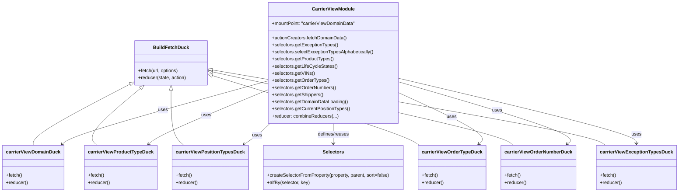

# Diagram: web/portal/src/modules/domain-data/CarrierViewDomainData.js


> Auto-generated by Obscura crawlers

## Diagram 1

```mermaid
flowchart LR
  A[fetchDomainData()] --> B[apiUrl("/entity-search/list")]
  B --> C{dispatch() each duck.fetch}
  C --> D[carrierViewDomainDuck.fetch(url, params: {shipper:1, lifecycleState:1})]
  C --> E[carrierViewProductTypeDuck.fetch(url, params: {productType:1})]
  C --> F[carrierViewPositionTypesDuck.fetch(url, params: {currentPositionTypes:1})]
  C --> G[carrierViewOrderTypeDuck.fetch(url, params: {"ref:OrderType":1})]
  C --> H[carrierViewOrderNumberDuck.fetch(url, params: {"ref:OrderNumber":1})]
  C --> I[carrierViewExceptionTypesDuck.fetch(url, params: {exceptionType:1})]
  style A fill:#f9f,stroke:#333,stroke-width:1px
  style B fill:#fffae6,stroke:#333
  style C fill:#eef,stroke:#333
  style D fill:#e6ffed,stroke:#333
  style E fill:#e6ffed,stroke:#333
  style F fill:#e6ffed,stroke:#333
  style G fill:#e6ffed,stroke:#333
  style H fill:#e6ffed,stroke:#333
  style I fill:#e6ffed,stroke:#333
```

> SVG rendering failed for this diagram.

## Diagram 2



### SVG

<svg id="container" width="2228.7890625" xmlns="http://www.w3.org/2000/svg" class="classDiagram" height="648" viewBox="0 0 2228.7890625 648" role="graphics-document document" aria-roledescription="class"><style>#container{font-family:"trebuchet ms",verdana,arial,sans-serif;font-size:16px;fill:#333;}@keyframes edge-animation-frame{from{stroke-dashoffset:0;}}@keyframes dash{to{stroke-dashoffset:0;}}#container .edge-animation-slow{stroke-dasharray:9,5!important;stroke-dashoffset:900;animation:dash 50s linear infinite;stroke-linecap:round;}#container .edge-animation-fast{stroke-dasharray:9,5!important;stroke-dashoffset:900;animation:dash 20s linear infinite;stroke-linecap:round;}#container .error-icon{fill:#552222;}#container .error-text{fill:#552222;stroke:#552222;}#container .edge-thickness-normal{stroke-width:1px;}#container .edge-thickness-thick{stroke-width:3.5px;}#container .edge-pattern-solid{stroke-dasharray:0;}#container .edge-thickness-invisible{stroke-width:0;fill:none;}#container .edge-pattern-dashed{stroke-dasharray:3;}#container .edge-pattern-dotted{stroke-dasharray:2;}#container .marker{fill:#333333;stroke:#333333;}#container .marker.cross{stroke:#333333;}#container svg{font-family:"trebuchet ms",verdana,arial,sans-serif;font-size:16px;}#container p{margin:0;}#container g.classGroup text{fill:#9370DB;stroke:none;font-family:"trebuchet ms",verdana,arial,sans-serif;font-size:10px;}#container g.classGroup text .title{font-weight:bolder;}#container .nodeLabel,#container .edgeLabel{color:#131300;}#container .edgeLabel .label rect{fill:#ECECFF;}#container .label text{fill:#131300;}#container .labelBkg{background:#ECECFF;}#container .edgeLabel .label span{background:#ECECFF;}#container .classTitle{font-weight:bolder;}#container .node rect,#container .node circle,#container .node ellipse,#container .node polygon,#container .node path{fill:#ECECFF;stroke:#9370DB;stroke-width:1px;}#container .divider{stroke:#9370DB;stroke-width:1;}#container g.clickable{cursor:pointer;}#container g.classGroup rect{fill:#ECECFF;stroke:#9370DB;}#container g.classGroup line{stroke:#9370DB;stroke-width:1;}#container .classLabel .box{stroke:none;stroke-width:0;fill:#ECECFF;opacity:0.5;}#container .classLabel .label{fill:#9370DB;font-size:10px;}#container .relation{stroke:#333333;stroke-width:1;fill:none;}#container .dashed-line{stroke-dasharray:3;}#container .dotted-line{stroke-dasharray:1 2;}#container #compositionStart,#container .composition{fill:#333333!important;stroke:#333333!important;stroke-width:1;}#container #compositionEnd,#container .composition{fill:#333333!important;stroke:#333333!important;stroke-width:1;}#container #dependencyStart,#container .dependency{fill:#333333!important;stroke:#333333!important;stroke-width:1;}#container #dependencyStart,#container .dependency{fill:#333333!important;stroke:#333333!important;stroke-width:1;}#container #extensionStart,#container .extension{fill:transparent!important;stroke:#333333!important;stroke-width:1;}#container #extensionEnd,#container .extension{fill:transparent!important;stroke:#333333!important;stroke-width:1;}#container #aggregationStart,#container .aggregation{fill:transparent!important;stroke:#333333!important;stroke-width:1;}#container #aggregationEnd,#container .aggregation{fill:transparent!important;stroke:#333333!important;stroke-width:1;}#container #lollipopStart,#container .lollipop{fill:#ECECFF!important;stroke:#333333!important;stroke-width:1;}#container #lollipopEnd,#container .lollipop{fill:#ECECFF!important;stroke:#333333!important;stroke-width:1;}#container .edgeTerminals{font-size:11px;line-height:initial;}#container .classTitleText{text-anchor:middle;font-size:18px;fill:#333;}#container .label-icon{display:inline-block;height:1em;overflow:visible;vertical-align:-0.125em;}#container .node .label-icon path{fill:currentColor;stroke:revert;stroke-width:revert;}#container :root{--mermaid-font-family:"trebuchet ms",verdana,arial,sans-serif;}</style><g><defs><marker id="container_class-aggregationStart" class="marker aggregation class" refX="18" refY="7" markerWidth="190" markerHeight="240" orient="auto"><path d="M 18,7 L9,13 L1,7 L9,1 Z"></path></marker></defs><defs><marker id="container_class-aggregationEnd" class="marker aggregation class" refX="1" refY="7" markerWidth="20" markerHeight="28" orient="auto"><path d="M 18,7 L9,13 L1,7 L9,1 Z"></path></marker></defs><defs><marker id="container_class-extensionStart" class="marker extension class" refX="18" refY="7" markerWidth="190" markerHeight="240" orient="auto"><path d="M 1,7 L18,13 V 1 Z"></path></marker></defs><defs><marker id="container_class-extensionEnd" class="marker extension class" refX="1" refY="7" markerWidth="20" markerHeight="28" orient="auto"><path d="M 1,1 V 13 L18,7 Z"></path></marker></defs><defs><marker id="container_class-compositionStart" class="marker composition class" refX="18" refY="7" markerWidth="190" markerHeight="240" orient="auto"><path d="M 18,7 L9,13 L1,7 L9,1 Z"></path></marker></defs><defs><marker id="container_class-compositionEnd" class="marker composition class" refX="1" refY="7" markerWidth="20" markerHeight="28" orient="auto"><path d="M 18,7 L9,13 L1,7 L9,1 Z"></path></marker></defs><defs><marker id="container_class-dependencyStart" class="marker dependency class" refX="6" refY="7" markerWidth="190" markerHeight="240" orient="auto"><path d="M 5,7 L9,13 L1,7 L9,1 Z"></path></marker></defs><defs><marker id="container_class-dependencyEnd" class="marker dependency class" refX="13" refY="7" markerWidth="20" markerHeight="28" orient="auto"><path d="M 18,7 L9,13 L14,7 L9,1 Z"></path></marker></defs><defs><marker id="container_class-lollipopStart" class="marker lollipop class" refX="13" refY="7" markerWidth="190" markerHeight="240" orient="auto"><circle stroke="black" fill="transparent" cx="7" cy="7" r="6"></circle></marker></defs><defs><marker id="container_class-lollipopEnd" class="marker lollipop class" refX="1" refY="7" markerWidth="190" markerHeight="240" orient="auto"><circle stroke="black" fill="transparent" cx="7" cy="7" r="6"></circle></marker></defs><g class="root"><g class="clusters"></g><g class="edgePaths"><path d="M874.684,274.035L769.1,303.863C663.516,333.69,452.348,393.345,340.174,428.697C228.001,464.048,214.823,475.097,208.233,480.621L201.644,486.145" id="id_CarrierViewModule_carrierViewDomainDuck_1" class="edge-thickness-normal edge-pattern-solid relation" style=";;;" data-edge="true" data-et="edge" data-id="id_CarrierViewModule_carrierViewDomainDuck_1" data-points="W3sieCI6ODc0LjY4MzU5Mzc1LCJ5IjoyNzQuMDM1MjExNzUxMjkyNH0seyJ4IjoyNDEuMTc5Njg3NSwieSI6NDUzfSx7IngiOjE5Ny4wNDYwMzc5NDY0Mjg1NiwieSI6NDkwfV0=" marker-end="url(#container_class-dependencyEnd)"></path><path d="M874.684,304.156L815.572,328.963C756.46,353.771,638.236,403.385,572.882,433.698C507.527,464.01,495.043,475.021,488.801,480.526L482.559,486.031" id="id_CarrierViewModule_carrierViewProductTypeDuck_2" class="edge-thickness-normal edge-pattern-solid relation" style=";;;" data-edge="true" data-et="edge" data-id="id_CarrierViewModule_carrierViewProductTypeDuck_2" data-points="W3sieCI6ODc0LjY4MzU5Mzc1LCJ5IjozMDQuMTU2MTIzMzA5NjYxOH0seyJ4Ijo1MjAuMDExNzE4NzUsInkiOjQ1M30seyJ4Ijo0NzguMDU4OTQyNTIyMzIxNDQsInkiOjQ5MH1d" marker-end="url(#container_class-dependencyEnd)"></path><path d="M882.057,416L875.642,422.167C869.227,428.333,856.397,440.667,841.988,452.427C827.578,464.187,811.59,475.373,803.596,480.967L795.602,486.56" id="id_CarrierViewModule_carrierViewPositionTypesDuck_3" class="edge-thickness-normal edge-pattern-solid relation" style=";;;" data-edge="true" data-et="edge" data-id="id_CarrierViewModule_carrierViewPositionTypesDuck_3" data-points="W3sieCI6ODgyLjA1NzI5NzA2OTUwMiwieSI6NDE2fSx7IngiOjg0My41NjY0MDYyNSwieSI6NDUzfSx7IngiOjc5MC42ODYwMzUxNTYyNSwieSI6NDkwfV0=" marker-end="url(#container_class-dependencyEnd)"></path><path d="M1313.871,313.695L1364.006,336.912C1414.141,360.13,1514.41,406.565,1558.536,435.274C1602.661,463.984,1590.642,474.968,1584.633,480.46L1578.623,485.952" id="id_CarrierViewModule_carrierViewOrderTypeDuck_4" class="edge-thickness-normal edge-pattern-solid relation" style=";;;" data-edge="true" data-et="edge" data-id="id_CarrierViewModule_carrierViewOrderTypeDuck_4" data-points="W3sieCI6MTMxMy44NzEwOTM3NSwieSI6MzEzLjY5NDU3MjI1ODU0MzkzfSx7IngiOjE2MTQuNjc5Njg3NSwieSI6NDUzfSx7IngiOjE1NzQuMTk0MTYxNTUxMzM5MiwieSI6NDkwfV0=" marker-end="url(#container_class-dependencyEnd)"></path><path d="M1313.871,277.23L1412.492,306.525C1511.112,335.82,1708.353,394.41,1800.475,429.224C1892.597,464.039,1879.6,475.077,1873.101,480.597L1866.602,486.116" id="id_CarrierViewModule_carrierViewOrderNumberDuck_5" class="edge-thickness-normal edge-pattern-solid relation" style=";;;" data-edge="true" data-et="edge" data-id="id_CarrierViewModule_carrierViewOrderNumberDuck_5" data-points="W3sieCI6MTMxMy44NzEwOTM3NSwieSI6Mjc3LjIyOTkwNzAyODAyNjR9LHsieCI6MTkwNS41OTM3NSwieSI6NDUzfSx7IngiOjE4NjIuMDI5MTkyMjQzMzAzNywieSI6NDkwfV0=" marker-end="url(#container_class-dependencyEnd)"></path><path d="M1313.871,265.032L1443.593,296.36C1573.315,327.688,1832.759,390.344,1962.481,426.839C2092.203,463.333,2092.203,473.667,2092.203,478.833L2092.203,484" id="id_CarrierViewModule_carrierViewExceptionTypesDuck_6" class="edge-thickness-normal edge-pattern-solid relation" style=";;;" data-edge="true" data-et="edge" data-id="id_CarrierViewModule_carrierViewExceptionTypesDuck_6" data-points="W3sieCI6MTMxMy44NzEwOTM3NSwieSI6MjY1LjAzMjA5MzkxMzU0NzJ9LHsieCI6MjA5Mi4yMDMxMjUsInkiOjQ1M30seyJ4IjoyMDkyLjIwMzEyNSwieSI6NDkwfV0=" marker-end="url(#container_class-dependencyEnd)"></path><path d="M419.497,285.552L367.512,313.46C315.527,341.368,211.556,397.184,159.571,431.259C107.586,465.333,107.586,477.667,107.586,483.833L107.586,490" id="id_BuildFetchDuck_carrierViewDomainDuck_7" class="edge-thickness-normal edge-pattern-solid relation" style=";;;" data-edge="true" data-et="edge" data-id="id_BuildFetchDuck_carrierViewDomainDuck_7" data-points="W3sieCI6NDM0LjY5NTMxMjUsInkiOjI3Ny4zOTI1MDYyODY4MTgxNn0seyJ4IjoxMDcuNTg1OTM3NSwieSI6NDUzfSx7IngiOjEwNy41ODU5Mzc1LCJ5Ijo0OTB9XQ==" marker-start="url(#container_class-extensionStart)"></path><path d="M456.68,298.28L426.845,324.067C397.01,349.853,337.341,401.427,313.857,433.38C290.374,465.333,303.076,477.667,309.427,483.833L315.778,490" id="id_BuildFetchDuck_carrierViewProductTypeDuck_8" class="edge-thickness-normal edge-pattern-solid relation" style=";;;" data-edge="true" data-et="edge" data-id="id_BuildFetchDuck_carrierViewProductTypeDuck_8" data-points="W3sieCI6NDY5LjczMDQ1MjU0MTQ5MzgsInkiOjI4N30seyJ4IjoyNzcuNjcxODc1LCJ5Ijo0NTN9LHsieCI6MzE1Ljc3Nzc5NzE1NDAxNzksInkiOjQ5MH1d" marker-start="url(#container_class-extensionStart)"></path><path d="M556.504,304.25L556.504,329.042C556.504,353.833,556.504,403.417,563.496,434.375C570.488,465.333,584.472,477.667,591.465,483.833L598.457,490" id="id_BuildFetchDuck_carrierViewPositionTypesDuck_9" class="edge-thickness-normal edge-pattern-solid relation" style=";;;" data-edge="true" data-et="edge" data-id="id_BuildFetchDuck_carrierViewPositionTypesDuck_9" data-points="W3sieCI6NTU2LjUwMzkwNjI1LCJ5IjoyODd9LHsieCI6NTU2LjUwMzkwNjI1LCJ5Ijo0NTN9LHsieCI6NTk4LjQ1NjY4MjQ3NzY3ODYsInkiOjQ5MH1d" marker-start="url(#container_class-extensionStart)"></path><path d="M694.782,255.068L800.698,288.057C906.614,321.045,1118.446,387.023,1233.273,426.178C1348.1,465.333,1365.923,477.667,1374.835,483.833L1383.746,490" id="id_BuildFetchDuck_carrierViewOrderTypeDuck_10" class="edge-thickness-normal edge-pattern-solid relation" style=";;;" data-edge="true" data-et="edge" data-id="id_BuildFetchDuck_carrierViewOrderTypeDuck_10" data-points="W3sieCI6Njc4LjMxMjUsInkiOjI0OS45Mzg1ODcyODAyNzIyfSx7IngiOjEzMzAuMjc3MzQzNzUsInkiOjQ1M30seyJ4IjoxMzgzLjc0NjE2MzUwNDQ2NDIsInkiOjQ5MH1d" marker-start="url(#container_class-extensionStart)"></path><path d="M695.159,242.526L854.495,277.605C1013.83,312.684,1332.501,382.842,1498.584,424.088C1664.667,465.333,1678.162,477.667,1684.91,483.833L1691.657,490" id="id_BuildFetchDuck_carrierViewOrderNumberDuck_11" class="edge-thickness-normal edge-pattern-solid relation" style=";;;" data-edge="true" data-et="edge" data-id="id_BuildFetchDuck_carrierViewOrderNumberDuck_11" data-points="W3sieCI6Njc4LjMxMjUsInkiOjIzOC44MTcxNDYzMjM2MjEyNH0seyJ4IjoxNjUxLjE3MTg3NSwieSI6NDUzfSx7IngiOjE2OTEuNjU3NDAwOTQ4NjYwOCwieSI6NDkwfV0=" marker-start="url(#container_class-extensionStart)"></path><path d="M695.307,236.143L903.104,272.286C1110.9,308.428,1526.493,380.714,1742.555,423.024C1958.617,465.333,1975.147,477.667,1983.413,483.833L1991.678,490" id="id_BuildFetchDuck_carrierViewExceptionTypesDuck_12" class="edge-thickness-normal edge-pattern-solid relation" style=";;;" data-edge="true" data-et="edge" data-id="id_BuildFetchDuck_carrierViewExceptionTypesDuck_12" data-points="W3sieCI6Njc4LjMxMjUsInkiOjIzMy4xODY2NzEzMjc3NjQ0Nn0seyJ4IjoxOTQyLjA4NTkzNzUsInkiOjQ1M30seyJ4IjoxOTkxLjY3ODIyMjY1NjI1LCJ5Ijo0OTB9XQ==" marker-start="url(#container_class-extensionStart)"></path><path d="M1094.277,416L1094.277,422.167C1094.277,428.333,1094.277,440.667,1094.277,452C1094.277,463.333,1094.277,473.667,1094.277,478.833L1094.277,484" id="id_CarrierViewModule_Selectors_13" class="edge-thickness-normal edge-pattern-solid relation" style=";;;" data-edge="true" data-et="edge" data-id="id_CarrierViewModule_Selectors_13" data-points="W3sieCI6MTA5NC4yNzczNDM3NSwieSI6NDE2fSx7IngiOjEwOTQuMjc3MzQzNzUsInkiOjQ1M30seyJ4IjoxMDk0LjI3NzM0Mzc1LCJ5Ijo0OTB9XQ==" marker-end="url(#container_class-dependencyEnd)"></path></g><g class="edgeLabels"><g class="edgeLabel" transform="translate(530.22044, 371.34602)"><g class="label" data-id="id_CarrierViewModule_carrierViewDomainDuck_1" transform="translate(-16.4921875, -12)"><foreignObject width="32.984375" height="24"><div xmlns="http://www.w3.org/1999/xhtml" class="labelBkg" style="display: table-cell; white-space: nowrap; line-height: 1.5; max-width: 200px; text-align: center;"><span class="edgeLabel"><p>uses</p></span></div></foreignObject></g></g><g class="edgeLabel" transform="translate(671.55777, 389.40121)"><g class="label" data-id="id_CarrierViewModule_carrierViewProductTypeDuck_2" transform="translate(-16.4921875, -12)"><foreignObject width="32.984375" height="24"><div xmlns="http://www.w3.org/1999/xhtml" class="labelBkg" style="display: table-cell; white-space: nowrap; line-height: 1.5; max-width: 200px; text-align: center;"><span class="edgeLabel"><p>uses</p></span></div></foreignObject></g></g><g class="edgeLabel" transform="translate(838.99899, 456.19578)"><g class="label" data-id="id_CarrierViewModule_carrierViewPositionTypesDuck_3" transform="translate(-16.4921875, -12)"><foreignObject width="32.984375" height="24"><div xmlns="http://www.w3.org/1999/xhtml" class="labelBkg" style="display: table-cell; white-space: nowrap; line-height: 1.5; max-width: 200px; text-align: center;"><span class="edgeLabel"><p>uses</p></span></div></foreignObject></g></g><g class="edgeLabel" transform="translate(1489.1595, 394.8712)"><g class="label" data-id="id_CarrierViewModule_carrierViewOrderTypeDuck_4" transform="translate(-16.4921875, -12)"><foreignObject width="32.984375" height="24"><div xmlns="http://www.w3.org/1999/xhtml" class="labelBkg" style="display: table-cell; white-space: nowrap; line-height: 1.5; max-width: 200px; text-align: center;"><span class="edgeLabel"><p>uses</p></span></div></foreignObject></g></g><g class="edgeLabel" transform="translate(1637.1276, 373.25264)"><g class="label" data-id="id_CarrierViewModule_carrierViewOrderNumberDuck_5" transform="translate(-16.4921875, -12)"><foreignObject width="32.984375" height="24"><div xmlns="http://www.w3.org/1999/xhtml" class="labelBkg" style="display: table-cell; white-space: nowrap; line-height: 1.5; max-width: 200px; text-align: center;"><span class="edgeLabel"><p>uses</p></span></div></foreignObject></g></g><g class="edgeLabel" transform="translate(2092.203125, 453)"><g class="label" data-id="id_CarrierViewModule_carrierViewExceptionTypesDuck_6" transform="translate(-16.4921875, -12)"><foreignObject width="32.984375" height="24"><div xmlns="http://www.w3.org/1999/xhtml" class="labelBkg" style="display: table-cell; white-space: nowrap; line-height: 1.5; max-width: 200px; text-align: center;"><span class="edgeLabel"><p>uses</p></span></div></foreignObject></g></g><g class="edgeLabel"><g class="label" data-id="id_BuildFetchDuck_carrierViewDomainDuck_7" transform="translate(0, 0)"><foreignObject width="0" height="0"><div xmlns="http://www.w3.org/1999/xhtml" class="labelBkg" style="display: table-cell; white-space: nowrap; line-height: 1.5; max-width: 200px; text-align: center;"><span class="edgeLabel"></span></div></foreignObject></g></g><g class="edgeLabel"><g class="label" data-id="id_BuildFetchDuck_carrierViewProductTypeDuck_8" transform="translate(0, 0)"><foreignObject width="0" height="0"><div xmlns="http://www.w3.org/1999/xhtml" class="labelBkg" style="display: table-cell; white-space: nowrap; line-height: 1.5; max-width: 200px; text-align: center;"><span class="edgeLabel"></span></div></foreignObject></g></g><g class="edgeLabel"><g class="label" data-id="id_BuildFetchDuck_carrierViewPositionTypesDuck_9" transform="translate(0, 0)"><foreignObject width="0" height="0"><div xmlns="http://www.w3.org/1999/xhtml" class="labelBkg" style="display: table-cell; white-space: nowrap; line-height: 1.5; max-width: 200px; text-align: center;"><span class="edgeLabel"></span></div></foreignObject></g></g><g class="edgeLabel"><g class="label" data-id="id_BuildFetchDuck_carrierViewOrderTypeDuck_10" transform="translate(0, 0)"><foreignObject width="0" height="0"><div xmlns="http://www.w3.org/1999/xhtml" class="labelBkg" style="display: table-cell; white-space: nowrap; line-height: 1.5; max-width: 200px; text-align: center;"><span class="edgeLabel"></span></div></foreignObject></g></g><g class="edgeLabel"><g class="label" data-id="id_BuildFetchDuck_carrierViewOrderNumberDuck_11" transform="translate(0, 0)"><foreignObject width="0" height="0"><div xmlns="http://www.w3.org/1999/xhtml" class="labelBkg" style="display: table-cell; white-space: nowrap; line-height: 1.5; max-width: 200px; text-align: center;"><span class="edgeLabel"></span></div></foreignObject></g></g><g class="edgeLabel"><g class="label" data-id="id_BuildFetchDuck_carrierViewExceptionTypesDuck_12" transform="translate(0, 0)"><foreignObject width="0" height="0"><div xmlns="http://www.w3.org/1999/xhtml" class="labelBkg" style="display: table-cell; white-space: nowrap; line-height: 1.5; max-width: 200px; text-align: center;"><span class="edgeLabel"></span></div></foreignObject></g></g><g class="edgeLabel" transform="translate(1094.27734375, 453)"><g class="label" data-id="id_CarrierViewModule_Selectors_13" transform="translate(-54.1484375, -12)"><foreignObject width="108.296875" height="24"><div xmlns="http://www.w3.org/1999/xhtml" class="labelBkg" style="display: table-cell; white-space: nowrap; line-height: 1.5; max-width: 200px; text-align: center;"><span class="edgeLabel"><p>defines/reuses</p></span></div></foreignObject></g></g></g><g class="nodes"><g class="node default" id="classId-CarrierViewModule-0" transform="translate(1094.27734375, 212)"><g class="basic label-container"><path d="M-219.59375 -204 L219.59375 -204 L219.59375 204 L-219.59375 204" stroke="none" stroke-width="0" fill="#ECECFF" style=""></path><path d="M-219.59375 -204 C-99.61988177100359 -204, 20.353986457992818 -204, 219.59375 -204 M-219.59375 -204 C-74.36839560916377 -204, 70.85695878167246 -204, 219.59375 -204 M219.59375 -204 C219.59375 -107.24206337950636, 219.59375 -10.484126759012725, 219.59375 204 M219.59375 -204 C219.59375 -77.45192561620175, 219.59375 49.0961487675965, 219.59375 204 M219.59375 204 C88.00926595108086 204, -43.575218097838274 204, -219.59375 204 M219.59375 204 C75.64346706925613 204, -68.30681586148773 204, -219.59375 204 M-219.59375 204 C-219.59375 77.02591604452206, -219.59375 -49.948167910955874, -219.59375 -204 M-219.59375 204 C-219.59375 120.16448331521103, -219.59375 36.32896663042206, -219.59375 -204" stroke="#9370DB" stroke-width="1.3" fill="none" stroke-dasharray="0 0" style=""></path></g><g class="annotation-group text" transform="translate(0, -180)"></g><g class="label-group text" transform="translate(-69.515625, -180)"><g class="label" style="font-weight: bolder" transform="translate(0,-12)"><foreignObject width="139.03125" height="24"><div xmlns="http://www.w3.org/1999/xhtml" style="display: table-cell; white-space: nowrap; line-height: 1.5; max-width: 187px; text-align: center;"><span class="nodeLabel markdown-node-label" style=""><p>CarrierViewModule</p></span></div></foreignObject></g></g><g class="members-group text" transform="translate(-207.59375, -132)"><g class="label" style="" transform="translate(0,-12)"><foreignObject width="284.640625" height="24"><div xmlns="http://www.w3.org/1999/xhtml" style="display: table-cell; white-space: nowrap; line-height: 1.5; max-width: 342px; text-align: center;"><span class="nodeLabel markdown-node-label" style=""><p>+mountPoint: "carrierViewDomainData"</p></span></div></foreignObject></g></g><g class="methods-group text" transform="translate(-207.59375, -84)"><g class="label" style="" transform="translate(0,-12)"><foreignObject width="252.71875" height="24"><div xmlns="http://www.w3.org/1999/xhtml" style="display: table-cell; white-space: nowrap; line-height: 1.5; max-width: 310px; text-align: center;"><span class="nodeLabel markdown-node-label" style=""><p>+actionCreators.fetchDomainData()</p></span></div></foreignObject></g><g class="label" style="" transform="translate(0,12)"><foreignObject width="222" height="24"><div xmlns="http://www.w3.org/1999/xhtml" style="display: table-cell; white-space: nowrap; line-height: 1.5; max-width: 279px; text-align: center;"><span class="nodeLabel markdown-node-label" style=""><p>+selectors.getExceptionTypes()</p></span></div></foreignObject></g><g class="label" style="" transform="translate(0,36)"><foreignObject width="345.671875" height="24"><div xmlns="http://www.w3.org/1999/xhtml" style="display: table-cell; white-space: nowrap; line-height: 1.5; max-width: 403px; text-align: center;"><span class="nodeLabel markdown-node-label" style=""><p>+selectors.selectExceptionTypesAlphabetically()</p></span></div></foreignObject></g><g class="label" style="" transform="translate(0,60)"><foreignObject width="207.578125" height="24"><div xmlns="http://www.w3.org/1999/xhtml" style="display: table-cell; white-space: nowrap; line-height: 1.5; max-width: 265px; text-align: center;"><span class="nodeLabel markdown-node-label" style=""><p>+selectors.getProductTypes()</p></span></div></foreignObject></g><g class="label" style="" transform="translate(0,84)"><foreignObject width="218.21875" height="24"><div xmlns="http://www.w3.org/1999/xhtml" style="display: table-cell; white-space: nowrap; line-height: 1.5; max-width: 276px; text-align: center;"><span class="nodeLabel markdown-node-label" style=""><p>+selectors.getLifeCycleStates()</p></span></div></foreignObject></g><g class="label" style="" transform="translate(0,108)"><foreignObject width="142.078125" height="24"><div xmlns="http://www.w3.org/1999/xhtml" style="display: table-cell; white-space: nowrap; line-height: 1.5; max-width: 199px; text-align: center;"><span class="nodeLabel markdown-node-label" style=""><p>+selectors.getVINs()</p></span></div></foreignObject></g><g class="label" style="" transform="translate(0,132)"><foreignObject width="192.484375" height="24"><div xmlns="http://www.w3.org/1999/xhtml" style="display: table-cell; white-space: nowrap; line-height: 1.5; max-width: 250px; text-align: center;"><span class="nodeLabel markdown-node-label" style=""><p>+selectors.getOrderTypes()</p></span></div></foreignObject></g><g class="label" style="" transform="translate(0,156)"><foreignObject width="216.875" height="24"><div xmlns="http://www.w3.org/1999/xhtml" style="display: table-cell; white-space: nowrap; line-height: 1.5; max-width: 274px; text-align: center;"><span class="nodeLabel markdown-node-label" style=""><p>+selectors.getOrderNumbers()</p></span></div></foreignObject></g><g class="label" style="" transform="translate(0,180)"><foreignObject width="173.796875" height="24"><div xmlns="http://www.w3.org/1999/xhtml" style="display: table-cell; white-space: nowrap; line-height: 1.5; max-width: 231px; text-align: center;"><span class="nodeLabel markdown-node-label" style=""><p>+selectors.getShippers()</p></span></div></foreignObject></g><g class="label" style="" transform="translate(0,204)"><foreignObject width="256.453125" height="24"><div xmlns="http://www.w3.org/1999/xhtml" style="display: table-cell; white-space: nowrap; line-height: 1.5; max-width: 314px; text-align: center;"><span class="nodeLabel markdown-node-label" style=""><p>+selectors.getDomainDataLoading()</p></span></div></foreignObject></g><g class="label" style="" transform="translate(0,228)"><foreignObject width="264.15625" height="24"><div xmlns="http://www.w3.org/1999/xhtml" style="display: table-cell; white-space: nowrap; line-height: 1.5; max-width: 322px; text-align: center;"><span class="nodeLabel markdown-node-label" style=""><p>+selectors.getCurrentPositionTypes()</p></span></div></foreignObject></g><g class="label" style="" transform="translate(0,252)"><foreignObject width="222.625" height="24"><div xmlns="http://www.w3.org/1999/xhtml" style="display: table-cell; white-space: nowrap; line-height: 1.5; max-width: 280px; text-align: center;"><span class="nodeLabel markdown-node-label" style=""><p>+reducer: combineReducers(...)</p></span></div></foreignObject></g></g><g class="divider" style=""><path d="M-219.59375 -156 C-70.56852642701568 -156, 78.45669714596863 -156, 219.59375 -156 M-219.59375 -156 C-89.31913678775919 -156, 40.95547642448162 -156, 219.59375 -156" stroke="#9370DB" stroke-width="1.3" fill="none" stroke-dasharray="0 0" style=""></path></g><g class="divider" style=""><path d="M-219.59375 -108 C-50.971125210638206 -108, 117.65149957872359 -108, 219.59375 -108 M-219.59375 -108 C-90.84349588036582 -108, 37.906758239268356 -108, 219.59375 -108" stroke="#9370DB" stroke-width="1.3" fill="none" stroke-dasharray="0 0" style=""></path></g></g><g class="node default" id="classId-BuildFetchDuck-1" transform="translate(556.50390625, 212)"><g class="basic label-container"><path d="M-121.80859375 -75 L121.80859375 -75 L121.80859375 75 L-121.80859375 75" stroke="none" stroke-width="0" fill="#ECECFF" style=""></path><path d="M-121.80859375 -75 C-51.77311839959775 -75, 18.262356950804502 -75, 121.80859375 -75 M-121.80859375 -75 C-61.08388340041455 -75, -0.35917305082909934 -75, 121.80859375 -75 M121.80859375 -75 C121.80859375 -33.93836591521978, 121.80859375 7.123268169560447, 121.80859375 75 M121.80859375 -75 C121.80859375 -44.08642627696746, 121.80859375 -13.17285255393491, 121.80859375 75 M121.80859375 75 C41.840098330886775 75, -38.12839708822645 75, -121.80859375 75 M121.80859375 75 C44.774965028550085 75, -32.25866369289983 75, -121.80859375 75 M-121.80859375 75 C-121.80859375 40.91318104846458, -121.80859375 6.826362096929159, -121.80859375 -75 M-121.80859375 75 C-121.80859375 22.370397306451757, -121.80859375 -30.259205387096486, -121.80859375 -75" stroke="#9370DB" stroke-width="1.3" fill="none" stroke-dasharray="0 0" style=""></path></g><g class="annotation-group text" transform="translate(0, -51)"></g><g class="label-group text" transform="translate(-56.3671875, -51)"><g class="label" style="font-weight: bolder" transform="translate(0,-12)"><foreignObject width="112.734375" height="24"><div xmlns="http://www.w3.org/1999/xhtml" style="display: table-cell; white-space: nowrap; line-height: 1.5; max-width: 163px; text-align: center;"><span class="nodeLabel markdown-node-label" style=""><p>BuildFetchDuck</p></span></div></foreignObject></g></g><g class="members-group text" transform="translate(-109.80859375, -3)"></g><g class="methods-group text" transform="translate(-109.80859375, 27)"><g class="label" style="" transform="translate(0,-12)"><foreignObject width="138.25" height="24"><div xmlns="http://www.w3.org/1999/xhtml" style="display: table-cell; white-space: nowrap; line-height: 1.5; max-width: 196px; text-align: center;"><span class="nodeLabel markdown-node-label" style=""><p>+fetch(url, options)</p></span></div></foreignObject></g><g class="label" style="" transform="translate(0,12)"><foreignObject width="163.25" height="24"><div xmlns="http://www.w3.org/1999/xhtml" style="display: table-cell; white-space: nowrap; line-height: 1.5; max-width: 221px; text-align: center;"><span class="nodeLabel markdown-node-label" style=""><p>+reducer(state, action)</p></span></div></foreignObject></g></g><g class="divider" style=""><path d="M-121.80859375 -27 C-44.62398379898745 -27, 32.560626152025094 -27, 121.80859375 -27 M-121.80859375 -27 C-56.53851208202241 -27, 8.731569585955185 -27, 121.80859375 -27" stroke="#9370DB" stroke-width="1.3" fill="none" stroke-dasharray="0 0" style=""></path></g><g class="divider" style=""><path d="M-121.80859375 -3 C-33.02274681199013 -3, 55.76310012601974 -3, 121.80859375 -3 M-121.80859375 -3 C-29.199434821597535 -3, 63.40972410680493 -3, 121.80859375 -3" stroke="#9370DB" stroke-width="1.3" fill="none" stroke-dasharray="0 0" style=""></path></g></g><g class="node default" id="classId-carrierViewDomainDuck-2" transform="translate(107.5859375, 565)"><g class="basic label-container"><path d="M-99.5859375 -75 L99.5859375 -75 L99.5859375 75 L-99.5859375 75" stroke="none" stroke-width="0" fill="#ECECFF" style=""></path><path d="M-99.5859375 -75 C-31.606208513464225 -75, 36.37352047307155 -75, 99.5859375 -75 M-99.5859375 -75 C-20.536348560344607 -75, 58.51324037931079 -75, 99.5859375 -75 M99.5859375 -75 C99.5859375 -16.20738964494074, 99.5859375 42.58522071011852, 99.5859375 75 M99.5859375 -75 C99.5859375 -29.772368870844815, 99.5859375 15.45526225831037, 99.5859375 75 M99.5859375 75 C28.81648013898038 75, -41.95297722203924 75, -99.5859375 75 M99.5859375 75 C28.02441691463561 75, -43.53710367072878 75, -99.5859375 75 M-99.5859375 75 C-99.5859375 23.482641007593777, -99.5859375 -28.034717984812445, -99.5859375 -75 M-99.5859375 75 C-99.5859375 19.892816293597818, -99.5859375 -35.214367412804364, -99.5859375 -75" stroke="#9370DB" stroke-width="1.3" fill="none" stroke-dasharray="0 0" style=""></path></g><g class="annotation-group text" transform="translate(0, -51)"></g><g class="label-group text" transform="translate(-87.5859375, -51)"><g class="label" style="font-weight: bolder" transform="translate(0,-12)"><foreignObject width="175.171875" height="24"><div xmlns="http://www.w3.org/1999/xhtml" style="display: table-cell; white-space: nowrap; line-height: 1.5; max-width: 224px; text-align: center;"><span class="nodeLabel markdown-node-label" style=""><p>carrierViewDomainDuck</p></span></div></foreignObject></g></g><g class="members-group text" transform="translate(-87.5859375, -3)"></g><g class="methods-group text" transform="translate(-87.5859375, 27)"><g class="label" style="" transform="translate(0,-12)"><foreignObject width="54.59375" height="24"><div xmlns="http://www.w3.org/1999/xhtml" style="display: table-cell; white-space: nowrap; line-height: 1.5; max-width: 112px; text-align: center;"><span class="nodeLabel markdown-node-label" style=""><p>+fetch()</p></span></div></foreignObject></g><g class="label" style="" transform="translate(0,12)"><foreignObject width="73.875" height="24"><div xmlns="http://www.w3.org/1999/xhtml" style="display: table-cell; white-space: nowrap; line-height: 1.5; max-width: 131px; text-align: center;"><span class="nodeLabel markdown-node-label" style=""><p>+reducer()</p></span></div></foreignObject></g></g><g class="divider" style=""><path d="M-99.5859375 -27 C-37.050597674248905 -27, 25.48474215150219 -27, 99.5859375 -27 M-99.5859375 -27 C-31.224417566153093 -27, 37.137102367693814 -27, 99.5859375 -27" stroke="#9370DB" stroke-width="1.3" fill="none" stroke-dasharray="0 0" style=""></path></g><g class="divider" style=""><path d="M-99.5859375 -3 C-54.10993950801119 -3, -8.633941516022375 -3, 99.5859375 -3 M-99.5859375 -3 C-46.8374081546219 -3, 5.911121190756205 -3, 99.5859375 -3" stroke="#9370DB" stroke-width="1.3" fill="none" stroke-dasharray="0 0" style=""></path></g></g><g class="node default" id="classId-carrierViewProductTypeDuck-3" transform="translate(393.01953125, 565)"><g class="basic label-container"><path d="M-117.6015625 -75 L117.6015625 -75 L117.6015625 75 L-117.6015625 75" stroke="none" stroke-width="0" fill="#ECECFF" style=""></path><path d="M-117.6015625 -75 C-48.60112747195076 -75, 20.399307556098478 -75, 117.6015625 -75 M-117.6015625 -75 C-33.469049643157064 -75, 50.66346321368587 -75, 117.6015625 -75 M117.6015625 -75 C117.6015625 -43.958221839529216, 117.6015625 -12.916443679058425, 117.6015625 75 M117.6015625 -75 C117.6015625 -15.028900806121108, 117.6015625 44.942198387757784, 117.6015625 75 M117.6015625 75 C35.01811869177587 75, -47.565325116448264 75, -117.6015625 75 M117.6015625 75 C64.16684272358185 75, 10.732122947163703 75, -117.6015625 75 M-117.6015625 75 C-117.6015625 17.866661967479153, -117.6015625 -39.26667606504169, -117.6015625 -75 M-117.6015625 75 C-117.6015625 38.5911100251697, -117.6015625 2.182220050339396, -117.6015625 -75" stroke="#9370DB" stroke-width="1.3" fill="none" stroke-dasharray="0 0" style=""></path></g><g class="annotation-group text" transform="translate(0, -51)"></g><g class="label-group text" transform="translate(-105.6015625, -51)"><g class="label" style="font-weight: bolder" transform="translate(0,-12)"><foreignObject width="211.203125" height="24"><div xmlns="http://www.w3.org/1999/xhtml" style="display: table-cell; white-space: nowrap; line-height: 1.5; max-width: 258px; text-align: center;"><span class="nodeLabel markdown-node-label" style=""><p>carrierViewProductTypeDuck</p></span></div></foreignObject></g></g><g class="members-group text" transform="translate(-105.6015625, -3)"></g><g class="methods-group text" transform="translate(-105.6015625, 27)"><g class="label" style="" transform="translate(0,-12)"><foreignObject width="54.59375" height="24"><div xmlns="http://www.w3.org/1999/xhtml" style="display: table-cell; white-space: nowrap; line-height: 1.5; max-width: 112px; text-align: center;"><span class="nodeLabel markdown-node-label" style=""><p>+fetch()</p></span></div></foreignObject></g><g class="label" style="" transform="translate(0,12)"><foreignObject width="73.875" height="24"><div xmlns="http://www.w3.org/1999/xhtml" style="display: table-cell; white-space: nowrap; line-height: 1.5; max-width: 131px; text-align: center;"><span class="nodeLabel markdown-node-label" style=""><p>+reducer()</p></span></div></foreignObject></g></g><g class="divider" style=""><path d="M-117.6015625 -27 C-59.05074916635294 -27, -0.49993583270587294 -27, 117.6015625 -27 M-117.6015625 -27 C-66.45290091267636 -27, -15.304239325352711 -27, 117.6015625 -27" stroke="#9370DB" stroke-width="1.3" fill="none" stroke-dasharray="0 0" style=""></path></g><g class="divider" style=""><path d="M-117.6015625 -3 C-30.311450292364967 -3, 56.97866191527007 -3, 117.6015625 -3 M-117.6015625 -3 C-55.86502367766396 -3, 5.871515144672074 -3, 117.6015625 -3" stroke="#9370DB" stroke-width="1.3" fill="none" stroke-dasharray="0 0" style=""></path></g></g><g class="node default" id="classId-carrierViewPositionTypesDuck-4" transform="translate(683.49609375, 565)"><g class="basic label-container"><path d="M-122.875 -75 L122.875 -75 L122.875 75 L-122.875 75" stroke="none" stroke-width="0" fill="#ECECFF" style=""></path><path d="M-122.875 -75 C-33.060011965938 -75, 56.754976068123995 -75, 122.875 -75 M-122.875 -75 C-44.81603803934648 -75, 33.24292392130704 -75, 122.875 -75 M122.875 -75 C122.875 -30.195788397257218, 122.875 14.608423205485565, 122.875 75 M122.875 -75 C122.875 -19.53422366436893, 122.875 35.93155267126214, 122.875 75 M122.875 75 C44.84988153703691 75, -33.175236925926185 75, -122.875 75 M122.875 75 C72.87513419506936 75, 22.875268390138714 75, -122.875 75 M-122.875 75 C-122.875 31.805267850234948, -122.875 -11.389464299530104, -122.875 -75 M-122.875 75 C-122.875 15.640156783276773, -122.875 -43.719686433446455, -122.875 -75" stroke="#9370DB" stroke-width="1.3" fill="none" stroke-dasharray="0 0" style=""></path></g><g class="annotation-group text" transform="translate(0, -51)"></g><g class="label-group text" transform="translate(-110.875, -51)"><g class="label" style="font-weight: bolder" transform="translate(0,-12)"><foreignObject width="221.75" height="24"><div xmlns="http://www.w3.org/1999/xhtml" style="display: table-cell; white-space: nowrap; line-height: 1.5; max-width: 268px; text-align: center;"><span class="nodeLabel markdown-node-label" style=""><p>carrierViewPositionTypesDuck</p></span></div></foreignObject></g></g><g class="members-group text" transform="translate(-110.875, -3)"></g><g class="methods-group text" transform="translate(-110.875, 27)"><g class="label" style="" transform="translate(0,-12)"><foreignObject width="54.59375" height="24"><div xmlns="http://www.w3.org/1999/xhtml" style="display: table-cell; white-space: nowrap; line-height: 1.5; max-width: 112px; text-align: center;"><span class="nodeLabel markdown-node-label" style=""><p>+fetch()</p></span></div></foreignObject></g><g class="label" style="" transform="translate(0,12)"><foreignObject width="73.875" height="24"><div xmlns="http://www.w3.org/1999/xhtml" style="display: table-cell; white-space: nowrap; line-height: 1.5; max-width: 131px; text-align: center;"><span class="nodeLabel markdown-node-label" style=""><p>+reducer()</p></span></div></foreignObject></g></g><g class="divider" style=""><path d="M-122.875 -27 C-48.58747140585743 -27, 25.700057188285143 -27, 122.875 -27 M-122.875 -27 C-49.24257907197516 -27, 24.389841856049685 -27, 122.875 -27" stroke="#9370DB" stroke-width="1.3" fill="none" stroke-dasharray="0 0" style=""></path></g><g class="divider" style=""><path d="M-122.875 -3 C-49.148915689725726 -3, 24.577168620548548 -3, 122.875 -3 M-122.875 -3 C-67.52791221606455 -3, -12.180824432129086 -3, 122.875 -3" stroke="#9370DB" stroke-width="1.3" fill="none" stroke-dasharray="0 0" style=""></path></g></g><g class="node default" id="classId-carrierViewOrderTypeDuck-5" transform="translate(1492.12890625, 565)"><g class="basic label-container"><path d="M-109.9453125 -75 L109.9453125 -75 L109.9453125 75 L-109.9453125 75" stroke="none" stroke-width="0" fill="#ECECFF" style=""></path><path d="M-109.9453125 -75 C-57.83622385188558 -75, -5.727135203771155 -75, 109.9453125 -75 M-109.9453125 -75 C-37.20789345632308 -75, 35.529525587353845 -75, 109.9453125 -75 M109.9453125 -75 C109.9453125 -15.011136478627009, 109.9453125 44.97772704274598, 109.9453125 75 M109.9453125 -75 C109.9453125 -34.69638533851167, 109.9453125 5.607229322976664, 109.9453125 75 M109.9453125 75 C37.54626838810516 75, -34.85277572378968 75, -109.9453125 75 M109.9453125 75 C32.30724339039503 75, -45.33082571920994 75, -109.9453125 75 M-109.9453125 75 C-109.9453125 23.113963270989146, -109.9453125 -28.77207345802171, -109.9453125 -75 M-109.9453125 75 C-109.9453125 28.426596511663256, -109.9453125 -18.14680697667349, -109.9453125 -75" stroke="#9370DB" stroke-width="1.3" fill="none" stroke-dasharray="0 0" style=""></path></g><g class="annotation-group text" transform="translate(0, -51)"></g><g class="label-group text" transform="translate(-97.9453125, -51)"><g class="label" style="font-weight: bolder" transform="translate(0,-12)"><foreignObject width="195.890625" height="24"><div xmlns="http://www.w3.org/1999/xhtml" style="display: table-cell; white-space: nowrap; line-height: 1.5; max-width: 243px; text-align: center;"><span class="nodeLabel markdown-node-label" style=""><p>carrierViewOrderTypeDuck</p></span></div></foreignObject></g></g><g class="members-group text" transform="translate(-97.9453125, -3)"></g><g class="methods-group text" transform="translate(-97.9453125, 27)"><g class="label" style="" transform="translate(0,-12)"><foreignObject width="54.59375" height="24"><div xmlns="http://www.w3.org/1999/xhtml" style="display: table-cell; white-space: nowrap; line-height: 1.5; max-width: 112px; text-align: center;"><span class="nodeLabel markdown-node-label" style=""><p>+fetch()</p></span></div></foreignObject></g><g class="label" style="" transform="translate(0,12)"><foreignObject width="73.875" height="24"><div xmlns="http://www.w3.org/1999/xhtml" style="display: table-cell; white-space: nowrap; line-height: 1.5; max-width: 131px; text-align: center;"><span class="nodeLabel markdown-node-label" style=""><p>+reducer()</p></span></div></foreignObject></g></g><g class="divider" style=""><path d="M-109.9453125 -27 C-56.041017755188776 -27, -2.136723010377551 -27, 109.9453125 -27 M-109.9453125 -27 C-36.129788805455746 -27, 37.68573488908851 -27, 109.9453125 -27" stroke="#9370DB" stroke-width="1.3" fill="none" stroke-dasharray="0 0" style=""></path></g><g class="divider" style=""><path d="M-109.9453125 -3 C-61.487104224807275 -3, -13.02889594961455 -3, 109.9453125 -3 M-109.9453125 -3 C-54.25998403818598 -3, 1.425344423628033 -3, 109.9453125 -3" stroke="#9370DB" stroke-width="1.3" fill="none" stroke-dasharray="0 0" style=""></path></g></g><g class="node default" id="classId-carrierViewOrderNumberDuck-6" transform="translate(1773.72265625, 565)"><g class="basic label-container"><path d="M-121.6484375 -75 L121.6484375 -75 L121.6484375 75 L-121.6484375 75" stroke="none" stroke-width="0" fill="#ECECFF" style=""></path><path d="M-121.6484375 -75 C-39.486623738383344 -75, 42.67519002323331 -75, 121.6484375 -75 M-121.6484375 -75 C-48.62451643794563 -75, 24.39940462410874 -75, 121.6484375 -75 M121.6484375 -75 C121.6484375 -44.2017443427254, 121.6484375 -13.403488685450796, 121.6484375 75 M121.6484375 -75 C121.6484375 -41.215569097116095, 121.6484375 -7.43113819423219, 121.6484375 75 M121.6484375 75 C45.06568977381562 75, -31.51705795236876 75, -121.6484375 75 M121.6484375 75 C64.70408624258624 75, 7.759734985172486 75, -121.6484375 75 M-121.6484375 75 C-121.6484375 23.575996936478298, -121.6484375 -27.848006127043405, -121.6484375 -75 M-121.6484375 75 C-121.6484375 38.142857729060005, -121.6484375 1.2857154581200092, -121.6484375 -75" stroke="#9370DB" stroke-width="1.3" fill="none" stroke-dasharray="0 0" style=""></path></g><g class="annotation-group text" transform="translate(0, -51)"></g><g class="label-group text" transform="translate(-109.6484375, -51)"><g class="label" style="font-weight: bolder" transform="translate(0,-12)"><foreignObject width="219.296875" height="24"><div xmlns="http://www.w3.org/1999/xhtml" style="display: table-cell; white-space: nowrap; line-height: 1.5; max-width: 267px; text-align: center;"><span class="nodeLabel markdown-node-label" style=""><p>carrierViewOrderNumberDuck</p></span></div></foreignObject></g></g><g class="members-group text" transform="translate(-109.6484375, -3)"></g><g class="methods-group text" transform="translate(-109.6484375, 27)"><g class="label" style="" transform="translate(0,-12)"><foreignObject width="54.59375" height="24"><div xmlns="http://www.w3.org/1999/xhtml" style="display: table-cell; white-space: nowrap; line-height: 1.5; max-width: 112px; text-align: center;"><span class="nodeLabel markdown-node-label" style=""><p>+fetch()</p></span></div></foreignObject></g><g class="label" style="" transform="translate(0,12)"><foreignObject width="73.875" height="24"><div xmlns="http://www.w3.org/1999/xhtml" style="display: table-cell; white-space: nowrap; line-height: 1.5; max-width: 131px; text-align: center;"><span class="nodeLabel markdown-node-label" style=""><p>+reducer()</p></span></div></foreignObject></g></g><g class="divider" style=""><path d="M-121.6484375 -27 C-40.81003360895613 -27, 40.028370282087735 -27, 121.6484375 -27 M-121.6484375 -27 C-52.339895985585684 -27, 16.96864552882863 -27, 121.6484375 -27" stroke="#9370DB" stroke-width="1.3" fill="none" stroke-dasharray="0 0" style=""></path></g><g class="divider" style=""><path d="M-121.6484375 -3 C-49.54922268359309 -3, 22.549992132813827 -3, 121.6484375 -3 M-121.6484375 -3 C-45.67248512757618 -3, 30.30346724484764 -3, 121.6484375 -3" stroke="#9370DB" stroke-width="1.3" fill="none" stroke-dasharray="0 0" style=""></path></g></g><g class="node default" id="classId-carrierViewExceptionTypesDuck-7" transform="translate(2092.203125, 565)"><g class="basic label-container"><path d="M-128.5859375 -75 L128.5859375 -75 L128.5859375 75 L-128.5859375 75" stroke="none" stroke-width="0" fill="#ECECFF" style=""></path><path d="M-128.5859375 -75 C-45.017611120599724 -75, 38.55071525880055 -75, 128.5859375 -75 M-128.5859375 -75 C-47.351737361086634 -75, 33.88246277782673 -75, 128.5859375 -75 M128.5859375 -75 C128.5859375 -17.909472931609578, 128.5859375 39.181054136780844, 128.5859375 75 M128.5859375 -75 C128.5859375 -40.67466511525094, 128.5859375 -6.349330230501877, 128.5859375 75 M128.5859375 75 C45.03905700368857 75, -38.50782349262286 75, -128.5859375 75 M128.5859375 75 C70.02325775806028 75, 11.460578016120564 75, -128.5859375 75 M-128.5859375 75 C-128.5859375 25.538747211843436, -128.5859375 -23.922505576313128, -128.5859375 -75 M-128.5859375 75 C-128.5859375 30.424448649398755, -128.5859375 -14.15110270120249, -128.5859375 -75" stroke="#9370DB" stroke-width="1.3" fill="none" stroke-dasharray="0 0" style=""></path></g><g class="annotation-group text" transform="translate(0, -51)"></g><g class="label-group text" transform="translate(-116.5859375, -51)"><g class="label" style="font-weight: bolder" transform="translate(0,-12)"><foreignObject width="233.171875" height="24"><div xmlns="http://www.w3.org/1999/xhtml" style="display: table-cell; white-space: nowrap; line-height: 1.5; max-width: 280px; text-align: center;"><span class="nodeLabel markdown-node-label" style=""><p>carrierViewExceptionTypesDuck</p></span></div></foreignObject></g></g><g class="members-group text" transform="translate(-116.5859375, -3)"></g><g class="methods-group text" transform="translate(-116.5859375, 27)"><g class="label" style="" transform="translate(0,-12)"><foreignObject width="54.59375" height="24"><div xmlns="http://www.w3.org/1999/xhtml" style="display: table-cell; white-space: nowrap; line-height: 1.5; max-width: 112px; text-align: center;"><span class="nodeLabel markdown-node-label" style=""><p>+fetch()</p></span></div></foreignObject></g><g class="label" style="" transform="translate(0,12)"><foreignObject width="73.875" height="24"><div xmlns="http://www.w3.org/1999/xhtml" style="display: table-cell; white-space: nowrap; line-height: 1.5; max-width: 131px; text-align: center;"><span class="nodeLabel markdown-node-label" style=""><p>+reducer()</p></span></div></foreignObject></g></g><g class="divider" style=""><path d="M-128.5859375 -27 C-41.9652986357374 -27, 44.655340228525205 -27, 128.5859375 -27 M-128.5859375 -27 C-33.02129115719178 -27, 62.543355185616434 -27, 128.5859375 -27" stroke="#9370DB" stroke-width="1.3" fill="none" stroke-dasharray="0 0" style=""></path></g><g class="divider" style=""><path d="M-128.5859375 -3 C-39.66808188415517 -3, 49.24977373168966 -3, 128.5859375 -3 M-128.5859375 -3 C-30.739249996832214 -3, 67.10743750633557 -3, 128.5859375 -3" stroke="#9370DB" stroke-width="1.3" fill="none" stroke-dasharray="0 0" style=""></path></g></g><g class="node default" id="classId-Selectors-8" transform="translate(1094.27734375, 565)"><g class="basic label-container"><path d="M-237.90625 -75 L237.90625 -75 L237.90625 75 L-237.90625 75" stroke="none" stroke-width="0" fill="#ECECFF" style=""></path><path d="M-237.90625 -75 C-69.50832769889331 -75, 98.88959460221338 -75, 237.90625 -75 M-237.90625 -75 C-101.76354155933765 -75, 34.37916688132469 -75, 237.90625 -75 M237.90625 -75 C237.90625 -44.79806047804867, 237.90625 -14.596120956097337, 237.90625 75 M237.90625 -75 C237.90625 -31.986428260145253, 237.90625 11.027143479709494, 237.90625 75 M237.90625 75 C110.14972951616897 75, -17.60679096766205 75, -237.90625 75 M237.90625 75 C77.30808902668639 75, -83.29007194662722 75, -237.90625 75 M-237.90625 75 C-237.90625 42.87042941093257, -237.90625 10.740858821865146, -237.90625 -75 M-237.90625 75 C-237.90625 15.552506273753167, -237.90625 -43.894987452493666, -237.90625 -75" stroke="#9370DB" stroke-width="1.3" fill="none" stroke-dasharray="0 0" style=""></path></g><g class="annotation-group text" transform="translate(0, -51)"></g><g class="label-group text" transform="translate(-34.171875, -51)"><g class="label" style="font-weight: bolder" transform="translate(0,-12)"><foreignObject width="68.34375" height="24"><div xmlns="http://www.w3.org/1999/xhtml" style="display: table-cell; white-space: nowrap; line-height: 1.5; max-width: 117px; text-align: center;"><span class="nodeLabel markdown-node-label" style=""><p>Selectors</p></span></div></foreignObject></g></g><g class="members-group text" transform="translate(-225.90625, -3)"></g><g class="methods-group text" transform="translate(-225.90625, 27)"><g class="label" style="" transform="translate(0,-12)"><foreignObject width="417.640625" height="24"><div xmlns="http://www.w3.org/1999/xhtml" style="display: table-cell; white-space: nowrap; line-height: 1.5; max-width: 475px; text-align: center;"><span class="nodeLabel markdown-node-label" style=""><p>+createSelectorFromProperty(property, parent, sort=false)</p></span></div></foreignObject></g><g class="label" style="" transform="translate(0,12)"><foreignObject width="143.90625" height="24"><div xmlns="http://www.w3.org/1999/xhtml" style="display: table-cell; white-space: nowrap; line-height: 1.5; max-width: 201px; text-align: center;"><span class="nodeLabel markdown-node-label" style=""><p>+alfBy(selector, key)</p></span></div></foreignObject></g></g><g class="divider" style=""><path d="M-237.90625 -27 C-73.48003515584631 -27, 90.94617968830738 -27, 237.90625 -27 M-237.90625 -27 C-115.1618513099697 -27, 7.582547380060589 -27, 237.90625 -27" stroke="#9370DB" stroke-width="1.3" fill="none" stroke-dasharray="0 0" style=""></path></g><g class="divider" style=""><path d="M-237.90625 -3 C-68.22461230785254 -3, 101.45702538429492 -3, 237.90625 -3 M-237.90625 -3 C-132.39167036969573 -3, -26.877090739391463 -3, 237.90625 -3" stroke="#9370DB" stroke-width="1.3" fill="none" stroke-dasharray="0 0" style=""></path></g></g></g></g></g></svg>
