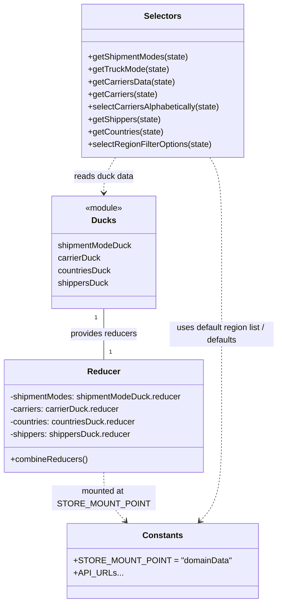

# Diagram: web/portal/src/modules/domain-data/DomainDataState.js


> Auto-generated by Obscura crawlers

## Diagram 1

```mermaid
flowchart TD
  subgraph Actions
    A[fetchDomainData()] -->|dispatch| B[shipmentModeDuck.fetch(SHIPMENT_MODES_URL)]
    A -->|dispatch| C[carrierDuck.fetch(CARRIERS_URL)]
    A -->|dispatch| D[fetchCountries()]
    D -->|returns| E[countriesDuck.fetch(COUNTRIES_URL)]
    F[fetchOrganizationTypeDomainData(isCarrier)] -->|dispatch| G[shippersDuck.fetch(SHIPPERS_URL + maybe ?active=f)]
  end
  subgraph URLs
    SM[SHIPMENT_MODES_URL: /shipping-ng/shipment_modes]
    CR[CARRIERS_URL: /shipping-ng/carriers]
    SH[SHIPPERS_URL: /shipping-ng/shippers]
    CO[COUNTRIES_URL: /shipping-ng/countries]
  end
  B --> SM
  C --> CR
  G --> SH
  E --> CO
```

> SVG rendering failed for this diagram.

## Diagram 2



### SVG

<svg id="container" width="538.84375" xmlns="http://www.w3.org/2000/svg" class="classDiagram" height="1156" viewBox="0 0 538.84375 1156" role="graphics-document document" aria-roledescription="class"><style>#container{font-family:"trebuchet ms",verdana,arial,sans-serif;font-size:16px;fill:#333;}@keyframes edge-animation-frame{from{stroke-dashoffset:0;}}@keyframes dash{to{stroke-dashoffset:0;}}#container .edge-animation-slow{stroke-dasharray:9,5!important;stroke-dashoffset:900;animation:dash 50s linear infinite;stroke-linecap:round;}#container .edge-animation-fast{stroke-dasharray:9,5!important;stroke-dashoffset:900;animation:dash 20s linear infinite;stroke-linecap:round;}#container .error-icon{fill:#552222;}#container .error-text{fill:#552222;stroke:#552222;}#container .edge-thickness-normal{stroke-width:1px;}#container .edge-thickness-thick{stroke-width:3.5px;}#container .edge-pattern-solid{stroke-dasharray:0;}#container .edge-thickness-invisible{stroke-width:0;fill:none;}#container .edge-pattern-dashed{stroke-dasharray:3;}#container .edge-pattern-dotted{stroke-dasharray:2;}#container .marker{fill:#333333;stroke:#333333;}#container .marker.cross{stroke:#333333;}#container svg{font-family:"trebuchet ms",verdana,arial,sans-serif;font-size:16px;}#container p{margin:0;}#container g.classGroup text{fill:#9370DB;stroke:none;font-family:"trebuchet ms",verdana,arial,sans-serif;font-size:10px;}#container g.classGroup text .title{font-weight:bolder;}#container .nodeLabel,#container .edgeLabel{color:#131300;}#container .edgeLabel .label rect{fill:#ECECFF;}#container .label text{fill:#131300;}#container .labelBkg{background:#ECECFF;}#container .edgeLabel .label span{background:#ECECFF;}#container .classTitle{font-weight:bolder;}#container .node rect,#container .node circle,#container .node ellipse,#container .node polygon,#container .node path{fill:#ECECFF;stroke:#9370DB;stroke-width:1px;}#container .divider{stroke:#9370DB;stroke-width:1;}#container g.clickable{cursor:pointer;}#container g.classGroup rect{fill:#ECECFF;stroke:#9370DB;}#container g.classGroup line{stroke:#9370DB;stroke-width:1;}#container .classLabel .box{stroke:none;stroke-width:0;fill:#ECECFF;opacity:0.5;}#container .classLabel .label{fill:#9370DB;font-size:10px;}#container .relation{stroke:#333333;stroke-width:1;fill:none;}#container .dashed-line{stroke-dasharray:3;}#container .dotted-line{stroke-dasharray:1 2;}#container #compositionStart,#container .composition{fill:#333333!important;stroke:#333333!important;stroke-width:1;}#container #compositionEnd,#container .composition{fill:#333333!important;stroke:#333333!important;stroke-width:1;}#container #dependencyStart,#container .dependency{fill:#333333!important;stroke:#333333!important;stroke-width:1;}#container #dependencyStart,#container .dependency{fill:#333333!important;stroke:#333333!important;stroke-width:1;}#container #extensionStart,#container .extension{fill:transparent!important;stroke:#333333!important;stroke-width:1;}#container #extensionEnd,#container .extension{fill:transparent!important;stroke:#333333!important;stroke-width:1;}#container #aggregationStart,#container .aggregation{fill:transparent!important;stroke:#333333!important;stroke-width:1;}#container #aggregationEnd,#container .aggregation{fill:transparent!important;stroke:#333333!important;stroke-width:1;}#container #lollipopStart,#container .lollipop{fill:#ECECFF!important;stroke:#333333!important;stroke-width:1;}#container #lollipopEnd,#container .lollipop{fill:#ECECFF!important;stroke:#333333!important;stroke-width:1;}#container .edgeTerminals{font-size:11px;line-height:initial;}#container .classTitleText{text-anchor:middle;font-size:18px;fill:#333;}#container .label-icon{display:inline-block;height:1em;overflow:visible;vertical-align:-0.125em;}#container .node .label-icon path{fill:currentColor;stroke:revert;stroke-width:revert;}#container :root{--mermaid-font-family:"trebuchet ms",verdana,arial,sans-serif;}</style><g><defs><marker id="container_class-aggregationStart" class="marker aggregation class" refX="18" refY="7" markerWidth="190" markerHeight="240" orient="auto"><path d="M 18,7 L9,13 L1,7 L9,1 Z"></path></marker></defs><defs><marker id="container_class-aggregationEnd" class="marker aggregation class" refX="1" refY="7" markerWidth="20" markerHeight="28" orient="auto"><path d="M 18,7 L9,13 L1,7 L9,1 Z"></path></marker></defs><defs><marker id="container_class-extensionStart" class="marker extension class" refX="18" refY="7" markerWidth="190" markerHeight="240" orient="auto"><path d="M 1,7 L18,13 V 1 Z"></path></marker></defs><defs><marker id="container_class-extensionEnd" class="marker extension class" refX="1" refY="7" markerWidth="20" markerHeight="28" orient="auto"><path d="M 1,1 V 13 L18,7 Z"></path></marker></defs><defs><marker id="container_class-compositionStart" class="marker composition class" refX="18" refY="7" markerWidth="190" markerHeight="240" orient="auto"><path d="M 18,7 L9,13 L1,7 L9,1 Z"></path></marker></defs><defs><marker id="container_class-compositionEnd" class="marker composition class" refX="1" refY="7" markerWidth="20" markerHeight="28" orient="auto"><path d="M 18,7 L9,13 L1,7 L9,1 Z"></path></marker></defs><defs><marker id="container_class-dependencyStart" class="marker dependency class" refX="6" refY="7" markerWidth="190" markerHeight="240" orient="auto"><path d="M 5,7 L9,13 L1,7 L9,1 Z"></path></marker></defs><defs><marker id="container_class-dependencyEnd" class="marker dependency class" refX="13" refY="7" markerWidth="20" markerHeight="28" orient="auto"><path d="M 18,7 L9,13 L14,7 L9,1 Z"></path></marker></defs><defs><marker id="container_class-lollipopStart" class="marker lollipop class" refX="13" refY="7" markerWidth="190" markerHeight="240" orient="auto"><circle stroke="black" fill="transparent" cx="7" cy="7" r="6"></circle></marker></defs><defs><marker id="container_class-lollipopEnd" class="marker lollipop class" refX="1" refY="7" markerWidth="190" markerHeight="240" orient="auto"><circle stroke="black" fill="transparent" cx="7" cy="7" r="6"></circle></marker></defs><g class="root"><g class="clusters"></g><g class="edgePaths"><path d="M201.922,592L201.922,600.167C201.922,608.333,201.922,624.667,201.922,641C201.922,657.333,201.922,673.667,201.922,681.833L201.922,690" id="id_Ducks_Reducer_1" class="edge-thickness-normal edge-pattern-solid relation" style=";;;" data-edge="true" data-et="edge" data-id="id_Ducks_Reducer_1" data-points="W3sieCI6MjAxLjkyMTg3NSwieSI6NTkyfSx7IngiOjIwMS45MjE4NzUsInkiOjY0MX0seyJ4IjoyMDEuOTIxODc1LCJ5Ijo2OTB9XQ=="></path><path d="M224.938,302L221.102,308.167C217.266,314.333,209.594,326.667,205.758,338C201.922,349.333,201.922,359.667,201.922,364.833L201.922,370" id="id_Selectors_Ducks_2" class="edge-thickness-normal edge-pattern-dashed relation" style=";;;" data-edge="true" data-et="edge" data-id="id_Selectors_Ducks_2" data-points="W3sieCI6MjI0LjkzODQ3NjU2MjUsInkiOjMwMn0seyJ4IjoyMDEuOTIxODc1LCJ5IjozMzl9LHsieCI6MjAxLjkyMTg3NSwieSI6Mzc2fV0=" marker-end="url(#container_class-dependencyEnd)"></path><path d="M201.922,906L201.922,914.167C201.922,922.333,201.922,938.667,208.96,954.274C215.998,969.88,230.074,984.761,237.112,992.201L244.151,999.641" id="id_Reducer_Constants_3" class="edge-thickness-normal edge-pattern-dashed relation" style=";;;" data-edge="true" data-et="edge" data-id="id_Reducer_Constants_3" data-points="W3sieCI6MjAxLjkyMTg3NSwieSI6OTA2fSx7IngiOjIwMS45MjE4NzUsInkiOjk1NX0seyJ4IjoyNDguMjczODI0ODk2Njk0MiwieSI6MTAwNH1d" marker-end="url(#container_class-dependencyEnd)"></path><path d="M407.827,302L411.663,308.167C415.499,314.333,423.172,326.667,427.008,357C430.844,387.333,430.844,435.667,430.844,486C430.844,536.333,430.844,588.667,430.844,641C430.844,693.333,430.844,745.667,430.844,798C430.844,850.333,430.844,902.667,423.806,936.274C416.768,969.88,402.691,984.761,395.653,992.201L388.615,999.641" id="id_Selectors_Constants_4" class="edge-thickness-normal edge-pattern-dashed relation" style=";;;" data-edge="true" data-et="edge" data-id="id_Selectors_Constants_4" data-points="W3sieCI6NDA3LjgyNzE0ODQzNzUsInkiOjMwMn0seyJ4Ijo0MzAuODQzNzUsInkiOjMzOX0seyJ4Ijo0MzAuODQzNzUsInkiOjQ4NH0seyJ4Ijo0MzAuODQzNzUsInkiOjY0MX0seyJ4Ijo0MzAuODQzNzUsInkiOjc5OH0seyJ4Ijo0MzAuODQzNzUsInkiOjk1NX0seyJ4IjozODQuNDkxODAwMTAzMzA1NzYsInkiOjEwMDR9XQ==" marker-end="url(#container_class-dependencyEnd)"></path></g><g class="edgeLabels"><g class="edgeLabel" transform="translate(201.921875, 641)"><g class="label" data-id="id_Ducks_Reducer_1" transform="translate(-64.8125, -12)"><foreignObject width="129.625" height="24"><div xmlns="http://www.w3.org/1999/xhtml" class="labelBkg" style="display: table-cell; white-space: nowrap; line-height: 1.5; max-width: 200px; text-align: center;"><span class="edgeLabel"><p>provides reducers</p></span></div></foreignObject></g></g><g class="edgeLabel" transform="translate(201.921875, 339)"><g class="label" data-id="id_Selectors_Ducks_2" transform="translate(-57.921875, -12)"><foreignObject width="115.84375" height="24"><div xmlns="http://www.w3.org/1999/xhtml" class="labelBkg" style="display: table-cell; white-space: nowrap; line-height: 1.5; max-width: 200px; text-align: center;"><span class="edgeLabel"><p>reads duck data</p></span></div></foreignObject></g></g><g class="edgeLabel" transform="translate(201.921875, 955)"><g class="label" data-id="id_Reducer_Constants_3" transform="translate(-100, -24)"><foreignObject width="200" height="48"><div xmlns="http://www.w3.org/1999/xhtml" class="labelBkg" style="display: table; white-space: break-spaces; line-height: 1.5; max-width: 200px; text-align: center; width: 200px;"><span class="edgeLabel"><p>mounted at STORE_MOUNT_POINT</p></span></div></foreignObject></g></g><g class="edgeLabel" transform="translate(430.84375, 641)"><g class="label" data-id="id_Selectors_Constants_4" transform="translate(-100, -24)"><foreignObject width="200" height="48"><div xmlns="http://www.w3.org/1999/xhtml" class="labelBkg" style="display: table; white-space: break-spaces; line-height: 1.5; max-width: 200px; text-align: center; width: 200px;"><span class="edgeLabel"><p>uses default region list / defaults</p></span></div></foreignObject></g></g><g class="edgeTerminals" transform="translate(186.92187750000014, 609.5000021428572)"><g class="inner" transform="translate(0, 0)"><foreignObject style="width: 9px; height: 12px;"><div xmlns="http://www.w3.org/1999/xhtml" style="display: inline-block; padding-right: 1px; white-space: nowrap;"><span class="edgeLabel">1</span></div></foreignObject></g></g><g class="edgeTerminals" transform="translate(211.92187749999985, 667.5000021428572)"><g class="inner" transform="translate(0, 0)"></g><foreignObject style="width: 9px; height: 12px;"><div xmlns="http://www.w3.org/1999/xhtml" style="display: inline-block; padding-right: 1px; white-space: nowrap;"><span class="edgeLabel">1</span></div></foreignObject></g></g><g class="nodes"><g class="node default" id="classId-Ducks-0" transform="translate(201.921875, 484)"><g class="basic label-container"><path d="M-102.29296875 -108 L102.29296875 -108 L102.29296875 108 L-102.29296875 108" stroke="none" stroke-width="0" fill="#ECECFF" style=""></path><path d="M-102.29296875 -108 C-40.24946902063954 -108, 21.794030708720925 -108, 102.29296875 -108 M-102.29296875 -108 C-53.98437063497769 -108, -5.675772519955373 -108, 102.29296875 -108 M102.29296875 -108 C102.29296875 -63.51664844337988, 102.29296875 -19.033296886759757, 102.29296875 108 M102.29296875 -108 C102.29296875 -21.73931383644694, 102.29296875 64.52137232710612, 102.29296875 108 M102.29296875 108 C55.20875940400217 108, 8.124550058004345 108, -102.29296875 108 M102.29296875 108 C23.122431419092067 108, -56.04810591181587 108, -102.29296875 108 M-102.29296875 108 C-102.29296875 30.971539954958743, -102.29296875 -46.056920090082514, -102.29296875 -108 M-102.29296875 108 C-102.29296875 31.57864681905322, -102.29296875 -44.84270636189356, -102.29296875 -108" stroke="#9370DB" stroke-width="1.3" fill="none" stroke-dasharray="0 0" style=""></path></g><g class="annotation-group text" transform="translate(-36.6015625, -84)"><g class="label" style="" transform="translate(0,-12)"><foreignObject width="73.203125" height="24"><div xmlns="http://www.w3.org/1999/xhtml" style="display: table-cell; white-space: nowrap; line-height: 1.5; max-width: 123px; text-align: center;"><span class="nodeLabel markdown-node-label" style=""><p>«module»</p></span></div></foreignObject></g></g><g class="label-group text" transform="translate(-21.859375, -60)"><g class="label" style="font-weight: bolder" transform="translate(0,-12)"><foreignObject width="43.71875" height="24"><div xmlns="http://www.w3.org/1999/xhtml" style="display: table-cell; white-space: nowrap; line-height: 1.5; max-width: 93px; text-align: center;"><span class="nodeLabel markdown-node-label" style=""><p>Ducks</p></span></div></foreignObject></g></g><g class="members-group text" transform="translate(-90.29296875, -12)"><g class="label" style="" transform="translate(0,-12)"><foreignObject width="143.984375" height="24"><div xmlns="http://www.w3.org/1999/xhtml" style="display: table-cell; white-space: nowrap; line-height: 1.5; max-width: 195px; text-align: center;"><span class="nodeLabel markdown-node-label" style=""><p>shipmentModeDuck</p></span></div></foreignObject></g><g class="label" style="" transform="translate(0,12)"><foreignObject width="83.421875" height="24"><div xmlns="http://www.w3.org/1999/xhtml" style="display: table-cell; white-space: nowrap; line-height: 1.5; max-width: 134px; text-align: center;"><span class="nodeLabel markdown-node-label" style=""><p>carrierDuck</p></span></div></foreignObject></g><g class="label" style="" transform="translate(0,36)"><foreignObject width="103.484375" height="24"><div xmlns="http://www.w3.org/1999/xhtml" style="display: table-cell; white-space: nowrap; line-height: 1.5; max-width: 154px; text-align: center;"><span class="nodeLabel markdown-node-label" style=""><p>countriesDuck</p></span></div></foreignObject></g><g class="label" style="" transform="translate(0,60)"><foreignObject width="97.953125" height="24"><div xmlns="http://www.w3.org/1999/xhtml" style="display: table-cell; white-space: nowrap; line-height: 1.5; max-width: 149px; text-align: center;"><span class="nodeLabel markdown-node-label" style=""><p>shippersDuck</p></span></div></foreignObject></g></g><g class="methods-group text" transform="translate(-90.29296875, 108)"></g><g class="divider" style=""><path d="M-102.29296875 -36 C-22.429667052350823 -36, 57.433634645298355 -36, 102.29296875 -36 M-102.29296875 -36 C-31.35104762128607 -36, 39.59087350742786 -36, 102.29296875 -36" stroke="#9370DB" stroke-width="1.3" fill="none" stroke-dasharray="0 0" style=""></path></g><g class="divider" style=""><path d="M-102.29296875 84 C-22.19582397618474 84, 57.90132079763052 84, 102.29296875 84 M-102.29296875 84 C-27.743404980777186 84, 46.80615878844563 84, 102.29296875 84" stroke="#9370DB" stroke-width="1.3" fill="none" stroke-dasharray="0 0" style=""></path></g></g><g class="node default" id="classId-Reducer-1" transform="translate(201.921875, 798)"><g class="basic label-container"><path d="M-193.921875 -108 L193.921875 -108 L193.921875 108 L-193.921875 108" stroke="none" stroke-width="0" fill="#ECECFF" style=""></path><path d="M-193.921875 -108 C-90.37869152618491 -108, 13.164491947630182 -108, 193.921875 -108 M-193.921875 -108 C-51.1385547451996 -108, 91.6447655096008 -108, 193.921875 -108 M193.921875 -108 C193.921875 -61.21221650027658, 193.921875 -14.424433000553165, 193.921875 108 M193.921875 -108 C193.921875 -55.421547039328146, 193.921875 -2.843094078656293, 193.921875 108 M193.921875 108 C64.50503156677755 108, -64.9118118664449 108, -193.921875 108 M193.921875 108 C72.1982293851942 108, -49.52541622961161 108, -193.921875 108 M-193.921875 108 C-193.921875 23.172357237471857, -193.921875 -61.655285525056286, -193.921875 -108 M-193.921875 108 C-193.921875 42.45284257054469, -193.921875 -23.09431485891062, -193.921875 -108" stroke="#9370DB" stroke-width="1.3" fill="none" stroke-dasharray="0 0" style=""></path></g><g class="annotation-group text" transform="translate(0, -84)"></g><g class="label-group text" transform="translate(-29.90625, -84)"><g class="label" style="font-weight: bolder" transform="translate(0,-12)"><foreignObject width="59.8125" height="24"><div xmlns="http://www.w3.org/1999/xhtml" style="display: table-cell; white-space: nowrap; line-height: 1.5; max-width: 110px; text-align: center;"><span class="nodeLabel markdown-node-label" style=""><p>Reducer</p></span></div></foreignObject></g></g><g class="members-group text" transform="translate(-181.921875, -36)"><g class="label" style="" transform="translate(0,-12)"><foreignObject width="333.9375" height="24"><div xmlns="http://www.w3.org/1999/xhtml" style="display: table-cell; white-space: nowrap; line-height: 1.5; max-width: 392px; text-align: center;"><span class="nodeLabel markdown-node-label" style=""><p>-shipmentModes: shipmentModeDuck.reducer</p></span></div></foreignObject></g><g class="label" style="" transform="translate(0,12)"><foreignObject width="212.546875" height="24"><div xmlns="http://www.w3.org/1999/xhtml" style="display: table-cell; white-space: nowrap; line-height: 1.5; max-width: 271px; text-align: center;"><span class="nodeLabel markdown-node-label" style=""><p>-carriers: carrierDuck.reducer</p></span></div></foreignObject></g><g class="label" style="" transform="translate(0,36)"><foreignObject width="245.453125" height="24"><div xmlns="http://www.w3.org/1999/xhtml" style="display: table-cell; white-space: nowrap; line-height: 1.5; max-width: 304px; text-align: center;"><span class="nodeLabel markdown-node-label" style=""><p>-countries: countriesDuck.reducer</p></span></div></foreignObject></g><g class="label" style="" transform="translate(0,60)"><foreignObject width="234.40625" height="24"><div xmlns="http://www.w3.org/1999/xhtml" style="display: table-cell; white-space: nowrap; line-height: 1.5; max-width: 293px; text-align: center;"><span class="nodeLabel markdown-node-label" style=""><p>-shippers: shippersDuck.reducer</p></span></div></foreignObject></g></g><g class="methods-group text" transform="translate(-181.921875, 84)"><g class="label" style="" transform="translate(0,-12)"><foreignObject width="147.359375" height="24"><div xmlns="http://www.w3.org/1999/xhtml" style="display: table-cell; white-space: nowrap; line-height: 1.5; max-width: 205px; text-align: center;"><span class="nodeLabel markdown-node-label" style=""><p>+combineReducers()</p></span></div></foreignObject></g></g><g class="divider" style=""><path d="M-193.921875 -60 C-62.30830393077832 -60, 69.30526713844336 -60, 193.921875 -60 M-193.921875 -60 C-100.57780317169215 -60, -7.2337313433843065 -60, 193.921875 -60" stroke="#9370DB" stroke-width="1.3" fill="none" stroke-dasharray="0 0" style=""></path></g><g class="divider" style=""><path d="M-193.921875 60 C-100.81911186470957 60, -7.716348729419138 60, 193.921875 60 M-193.921875 60 C-110.47226495058896 60, -27.02265490117793 60, 193.921875 60" stroke="#9370DB" stroke-width="1.3" fill="none" stroke-dasharray="0 0" style=""></path></g></g><g class="node default" id="classId-Selectors-2" transform="translate(316.3828125, 155)"><g class="basic label-container"><path d="M-157.5703125 -147 L157.5703125 -147 L157.5703125 147 L-157.5703125 147" stroke="none" stroke-width="0" fill="#ECECFF" style=""></path><path d="M-157.5703125 -147 C-92.16111989980658 -147, -26.751927299613158 -147, 157.5703125 -147 M-157.5703125 -147 C-42.44824275922517 -147, 72.67382698154967 -147, 157.5703125 -147 M157.5703125 -147 C157.5703125 -79.24652984928844, 157.5703125 -11.493059698576872, 157.5703125 147 M157.5703125 -147 C157.5703125 -45.30878236973588, 157.5703125 56.38243526052824, 157.5703125 147 M157.5703125 147 C85.93176134126567 147, 14.29321018253134 147, -157.5703125 147 M157.5703125 147 C56.00651656346466 147, -45.557279373070685 147, -157.5703125 147 M-157.5703125 147 C-157.5703125 61.441420409440795, -157.5703125 -24.11715918111841, -157.5703125 -147 M-157.5703125 147 C-157.5703125 58.92972336959646, -157.5703125 -29.14055326080708, -157.5703125 -147" stroke="#9370DB" stroke-width="1.3" fill="none" stroke-dasharray="0 0" style=""></path></g><g class="annotation-group text" transform="translate(0, -123)"></g><g class="label-group text" transform="translate(-34.171875, -123)"><g class="label" style="font-weight: bolder" transform="translate(0,-12)"><foreignObject width="68.34375" height="24"><div xmlns="http://www.w3.org/1999/xhtml" style="display: table-cell; white-space: nowrap; line-height: 1.5; max-width: 117px; text-align: center;"><span class="nodeLabel markdown-node-label" style=""><p>Selectors</p></span></div></foreignObject></g></g><g class="members-group text" transform="translate(-145.5703125, -75)"></g><g class="methods-group text" transform="translate(-145.5703125, -45)"><g class="label" style="" transform="translate(0,-12)"><foreignObject width="194.265625" height="24"><div xmlns="http://www.w3.org/1999/xhtml" style="display: table-cell; white-space: nowrap; line-height: 1.5; max-width: 252px; text-align: center;"><span class="nodeLabel markdown-node-label" style=""><p>+getShipmentModes(state)</p></span></div></foreignObject></g><g class="label" style="" transform="translate(0,12)"><foreignObject width="156.21875" height="24"><div xmlns="http://www.w3.org/1999/xhtml" style="display: table-cell; white-space: nowrap; line-height: 1.5; max-width: 214px; text-align: center;"><span class="nodeLabel markdown-node-label" style=""><p>+getTruckMode(state)</p></span></div></foreignObject></g><g class="label" style="" transform="translate(0,36)"><foreignObject width="166.734375" height="24"><div xmlns="http://www.w3.org/1999/xhtml" style="display: table-cell; white-space: nowrap; line-height: 1.5; max-width: 224px; text-align: center;"><span class="nodeLabel markdown-node-label" style=""><p>+getCarriersData(state)</p></span></div></foreignObject></g><g class="label" style="" transform="translate(0,60)"><foreignObject width="133.515625" height="24"><div xmlns="http://www.w3.org/1999/xhtml" style="display: table-cell; white-space: nowrap; line-height: 1.5; max-width: 191px; text-align: center;"><span class="nodeLabel markdown-node-label" style=""><p>+getCarriers(state)</p></span></div></foreignObject></g><g class="label" style="" transform="translate(0,84)"><foreignObject width="256.96875" height="24"><div xmlns="http://www.w3.org/1999/xhtml" style="display: table-cell; white-space: nowrap; line-height: 1.5; max-width: 314px; text-align: center;"><span class="nodeLabel markdown-node-label" style=""><p>+selectCarriersAlphabetically(state)</p></span></div></foreignObject></g><g class="label" style="" transform="translate(0,108)"><foreignObject width="140.765625" height="24"><div xmlns="http://www.w3.org/1999/xhtml" style="display: table-cell; white-space: nowrap; line-height: 1.5; max-width: 198px; text-align: center;"><span class="nodeLabel markdown-node-label" style=""><p>+getShippers(state)</p></span></div></foreignObject></g><g class="label" style="" transform="translate(0,132)"><foreignObject width="146.34375" height="24"><div xmlns="http://www.w3.org/1999/xhtml" style="display: table-cell; white-space: nowrap; line-height: 1.5; max-width: 204px; text-align: center;"><span class="nodeLabel markdown-node-label" style=""><p>+getCountries(state)</p></span></div></foreignObject></g><g class="label" style="" transform="translate(0,156)"><foreignObject width="241.09375" height="24"><div xmlns="http://www.w3.org/1999/xhtml" style="display: table-cell; white-space: nowrap; line-height: 1.5; max-width: 298px; text-align: center;"><span class="nodeLabel markdown-node-label" style=""><p>+selectRegionFilterOptions(state)</p></span></div></foreignObject></g></g><g class="divider" style=""><path d="M-157.5703125 -99 C-45.0014243892127 -99, 67.5674637215746 -99, 157.5703125 -99 M-157.5703125 -99 C-77.23131349851971 -99, 3.107685502960578 -99, 157.5703125 -99" stroke="#9370DB" stroke-width="1.3" fill="none" stroke-dasharray="0 0" style=""></path></g><g class="divider" style=""><path d="M-157.5703125 -75 C-85.79404066661571 -75, -14.017768833231429 -75, 157.5703125 -75 M-157.5703125 -75 C-33.156606820858215 -75, 91.25709885828357 -75, 157.5703125 -75" stroke="#9370DB" stroke-width="1.3" fill="none" stroke-dasharray="0 0" style=""></path></g></g><g class="node default" id="classId-Constants-3" transform="translate(316.3828125, 1076)"><g class="basic label-container"><path d="M-171.96484375 -72 L171.96484375 -72 L171.96484375 72 L-171.96484375 72" stroke="none" stroke-width="0" fill="#ECECFF" style=""></path><path d="M-171.96484375 -72 C-97.60210430089492 -72, -23.239364851789844 -72, 171.96484375 -72 M-171.96484375 -72 C-38.32199294005281 -72, 95.32085786989438 -72, 171.96484375 -72 M171.96484375 -72 C171.96484375 -29.254624257762657, 171.96484375 13.490751484474686, 171.96484375 72 M171.96484375 -72 C171.96484375 -21.72496301914964, 171.96484375 28.55007396170072, 171.96484375 72 M171.96484375 72 C54.242643623379394 72, -63.47955650324121 72, -171.96484375 72 M171.96484375 72 C75.91934952418022 72, -20.12614470163956 72, -171.96484375 72 M-171.96484375 72 C-171.96484375 36.785851405239, -171.96484375 1.5717028104780013, -171.96484375 -72 M-171.96484375 72 C-171.96484375 24.709263708846635, -171.96484375 -22.58147258230673, -171.96484375 -72" stroke="#9370DB" stroke-width="1.3" fill="none" stroke-dasharray="0 0" style=""></path></g><g class="annotation-group text" transform="translate(0, -48)"></g><g class="label-group text" transform="translate(-36.5390625, -48)"><g class="label" style="font-weight: bolder" transform="translate(0,-12)"><foreignObject width="73.078125" height="24"><div xmlns="http://www.w3.org/1999/xhtml" style="display: table-cell; white-space: nowrap; line-height: 1.5; max-width: 122px; text-align: center;"><span class="nodeLabel markdown-node-label" style=""><p>Constants</p></span></div></foreignObject></g></g><g class="members-group text" transform="translate(-159.96484375, 0)"><g class="label" style="" transform="translate(0,-12)"><foreignObject width="283.390625" height="24"><div xmlns="http://www.w3.org/1999/xhtml" style="display: table-cell; white-space: nowrap; line-height: 1.5; max-width: 341px; text-align: center;"><span class="nodeLabel markdown-node-label" style=""><p>+STORE_MOUNT_POINT = "domainData"</p></span></div></foreignObject></g><g class="label" style="" transform="translate(0,12)"><foreignObject width="85.84375" height="24"><div xmlns="http://www.w3.org/1999/xhtml" style="display: table-cell; white-space: nowrap; line-height: 1.5; max-width: 143px; text-align: center;"><span class="nodeLabel markdown-node-label" style=""><p>+API_URLs...</p></span></div></foreignObject></g></g><g class="methods-group text" transform="translate(-159.96484375, 72)"></g><g class="divider" style=""><path d="M-171.96484375 -24 C-35.5340504742922 -24, 100.8967428014156 -24, 171.96484375 -24 M-171.96484375 -24 C-93.45658429117714 -24, -14.948324832354274 -24, 171.96484375 -24" stroke="#9370DB" stroke-width="1.3" fill="none" stroke-dasharray="0 0" style=""></path></g><g class="divider" style=""><path d="M-171.96484375 48 C-79.64095515070497 48, 12.682933448590063 48, 171.96484375 48 M-171.96484375 48 C-63.483173711238464 48, 44.99849632752307 48, 171.96484375 48" stroke="#9370DB" stroke-width="1.3" fill="none" stroke-dasharray="0 0" style=""></path></g></g></g></g></g></svg>
