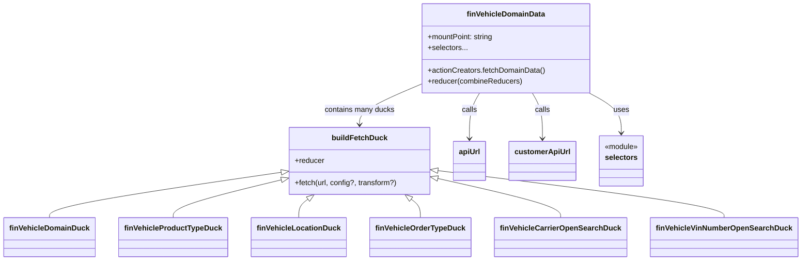

# Diagram: web/portal/src/modules/domain-data/FinVehicleDomainData.js


> Auto-generated by Obscura crawlers

## Diagram 1



### SVG

<svg id="container" width="1648.453125" xmlns="http://www.w3.org/2000/svg" class="classDiagram" height="560" viewBox="0 0 1648.453125 560" role="graphics-document document" aria-roledescription="class"><style>#container{font-family:"trebuchet ms",verdana,arial,sans-serif;font-size:16px;fill:#333;}@keyframes edge-animation-frame{from{stroke-dashoffset:0;}}@keyframes dash{to{stroke-dashoffset:0;}}#container .edge-animation-slow{stroke-dasharray:9,5!important;stroke-dashoffset:900;animation:dash 50s linear infinite;stroke-linecap:round;}#container .edge-animation-fast{stroke-dasharray:9,5!important;stroke-dashoffset:900;animation:dash 20s linear infinite;stroke-linecap:round;}#container .error-icon{fill:#552222;}#container .error-text{fill:#552222;stroke:#552222;}#container .edge-thickness-normal{stroke-width:1px;}#container .edge-thickness-thick{stroke-width:3.5px;}#container .edge-pattern-solid{stroke-dasharray:0;}#container .edge-thickness-invisible{stroke-width:0;fill:none;}#container .edge-pattern-dashed{stroke-dasharray:3;}#container .edge-pattern-dotted{stroke-dasharray:2;}#container .marker{fill:#333333;stroke:#333333;}#container .marker.cross{stroke:#333333;}#container svg{font-family:"trebuchet ms",verdana,arial,sans-serif;font-size:16px;}#container p{margin:0;}#container g.classGroup text{fill:#9370DB;stroke:none;font-family:"trebuchet ms",verdana,arial,sans-serif;font-size:10px;}#container g.classGroup text .title{font-weight:bolder;}#container .nodeLabel,#container .edgeLabel{color:#131300;}#container .edgeLabel .label rect{fill:#ECECFF;}#container .label text{fill:#131300;}#container .labelBkg{background:#ECECFF;}#container .edgeLabel .label span{background:#ECECFF;}#container .classTitle{font-weight:bolder;}#container .node rect,#container .node circle,#container .node ellipse,#container .node polygon,#container .node path{fill:#ECECFF;stroke:#9370DB;stroke-width:1px;}#container .divider{stroke:#9370DB;stroke-width:1;}#container g.clickable{cursor:pointer;}#container g.classGroup rect{fill:#ECECFF;stroke:#9370DB;}#container g.classGroup line{stroke:#9370DB;stroke-width:1;}#container .classLabel .box{stroke:none;stroke-width:0;fill:#ECECFF;opacity:0.5;}#container .classLabel .label{fill:#9370DB;font-size:10px;}#container .relation{stroke:#333333;stroke-width:1;fill:none;}#container .dashed-line{stroke-dasharray:3;}#container .dotted-line{stroke-dasharray:1 2;}#container #compositionStart,#container .composition{fill:#333333!important;stroke:#333333!important;stroke-width:1;}#container #compositionEnd,#container .composition{fill:#333333!important;stroke:#333333!important;stroke-width:1;}#container #dependencyStart,#container .dependency{fill:#333333!important;stroke:#333333!important;stroke-width:1;}#container #dependencyStart,#container .dependency{fill:#333333!important;stroke:#333333!important;stroke-width:1;}#container #extensionStart,#container .extension{fill:transparent!important;stroke:#333333!important;stroke-width:1;}#container #extensionEnd,#container .extension{fill:transparent!important;stroke:#333333!important;stroke-width:1;}#container #aggregationStart,#container .aggregation{fill:transparent!important;stroke:#333333!important;stroke-width:1;}#container #aggregationEnd,#container .aggregation{fill:transparent!important;stroke:#333333!important;stroke-width:1;}#container #lollipopStart,#container .lollipop{fill:#ECECFF!important;stroke:#333333!important;stroke-width:1;}#container #lollipopEnd,#container .lollipop{fill:#ECECFF!important;stroke:#333333!important;stroke-width:1;}#container .edgeTerminals{font-size:11px;line-height:initial;}#container .classTitleText{text-anchor:middle;font-size:18px;fill:#333;}#container .label-icon{display:inline-block;height:1em;overflow:visible;vertical-align:-0.125em;}#container .node .label-icon path{fill:currentColor;stroke:revert;stroke-width:revert;}#container :root{--mermaid-font-family:"trebuchet ms",verdana,arial,sans-serif;}</style><g><defs><marker id="container_class-aggregationStart" class="marker aggregation class" refX="18" refY="7" markerWidth="190" markerHeight="240" orient="auto"><path d="M 18,7 L9,13 L1,7 L9,1 Z"></path></marker></defs><defs><marker id="container_class-aggregationEnd" class="marker aggregation class" refX="1" refY="7" markerWidth="20" markerHeight="28" orient="auto"><path d="M 18,7 L9,13 L1,7 L9,1 Z"></path></marker></defs><defs><marker id="container_class-extensionStart" class="marker extension class" refX="18" refY="7" markerWidth="190" markerHeight="240" orient="auto"><path d="M 1,7 L18,13 V 1 Z"></path></marker></defs><defs><marker id="container_class-extensionEnd" class="marker extension class" refX="1" refY="7" markerWidth="20" markerHeight="28" orient="auto"><path d="M 1,1 V 13 L18,7 Z"></path></marker></defs><defs><marker id="container_class-compositionStart" class="marker composition class" refX="18" refY="7" markerWidth="190" markerHeight="240" orient="auto"><path d="M 18,7 L9,13 L1,7 L9,1 Z"></path></marker></defs><defs><marker id="container_class-compositionEnd" class="marker composition class" refX="1" refY="7" markerWidth="20" markerHeight="28" orient="auto"><path d="M 18,7 L9,13 L1,7 L9,1 Z"></path></marker></defs><defs><marker id="container_class-dependencyStart" class="marker dependency class" refX="6" refY="7" markerWidth="190" markerHeight="240" orient="auto"><path d="M 5,7 L9,13 L1,7 L9,1 Z"></path></marker></defs><defs><marker id="container_class-dependencyEnd" class="marker dependency class" refX="13" refY="7" markerWidth="20" markerHeight="28" orient="auto"><path d="M 18,7 L9,13 L14,7 L9,1 Z"></path></marker></defs><defs><marker id="container_class-lollipopStart" class="marker lollipop class" refX="13" refY="7" markerWidth="190" markerHeight="240" orient="auto"><circle stroke="black" fill="transparent" cx="7" cy="7" r="6"></circle></marker></defs><defs><marker id="container_class-lollipopEnd" class="marker lollipop class" refX="1" refY="7" markerWidth="190" markerHeight="240" orient="auto"><circle stroke="black" fill="transparent" cx="7" cy="7" r="6"></circle></marker></defs><g class="root"><g class="clusters"></g><g class="edgePaths"><path d="M1226.709,200L1238.014,206.167C1249.319,212.333,1271.929,224.667,1283.234,239C1294.539,253.333,1294.539,269.667,1294.539,277.833L1294.539,286" id="id_finVehicleDomainData_selectors_1" class="edge-thickness-normal edge-pattern-solid relation" style=";;;" data-edge="true" data-et="edge" data-id="id_finVehicleDomainData_selectors_1" data-points="W3sieCI6MTIyNi43MDkzNTE1MDM3NTkzLCJ5IjoyMDB9LHsieCI6MTI5NC41MzkwNjI1LCJ5IjoyMzd9LHsieCI6MTI5NC41MzkwNjI1LCJ5IjoyOTJ9XQ==" marker-end="url(#container_class-dependencyEnd)"></path><path d="M872.145,180.637L850.256,190.031C828.367,199.425,784.59,218.212,762.701,232.773C740.813,247.333,740.813,257.667,740.813,262.833L740.813,268" id="id_finVehicleDomainData_buildFetchDuck_2" class="edge-thickness-normal edge-pattern-solid relation" style=";;;" data-edge="true" data-et="edge" data-id="id_finVehicleDomainData_buildFetchDuck_2" data-points="W3sieCI6ODcyLjE0NDUzMTI1LCJ5IjoxODAuNjM3Mjc2ODk4MjU1NTJ9LHsieCI6NzQwLjgxMjUsInkiOjIzN30seyJ4Ijo3NDAuODEyNSwieSI6Mjc0fV0=" marker-end="url(#container_class-dependencyEnd)"></path><path d="M574.539,371.231L495.711,383.192C416.883,395.154,259.227,419.077,180.398,435.205C101.57,451.333,101.57,459.667,101.57,463.833L101.57,468" id="id_buildFetchDuck_finVehicleDomainDuck_3" class="edge-thickness-normal edge-pattern-solid relation" style=";;;" data-edge="true" data-et="edge" data-id="id_buildFetchDuck_finVehicleDomainDuck_3" data-points="W3sieCI6NTkxLjU5Mzc1LCJ5IjozNjguNjQyNzc3NzAzMDkwOH0seyJ4IjoxMDEuNTcwMzEyNSwieSI6NDQzfSx7IngiOjEwMS41NzAzMTI1LCJ5Ijo0Njh9XQ==" marker-start="url(#container_class-extensionStart)"></path><path d="M574.869,387.909L538.512,397.091C502.155,406.272,429.441,424.636,393.084,437.985C356.727,451.333,356.727,459.667,356.727,463.833L356.727,468" id="id_buildFetchDuck_finVehicleProductTypeDuck_4" class="edge-thickness-normal edge-pattern-solid relation" style=";;;" data-edge="true" data-et="edge" data-id="id_buildFetchDuck_finVehicleProductTypeDuck_4" data-points="W3sieCI6NTkxLjU5Mzc1LCJ5IjozODMuNjg0ODQ0MjkzNDcyNzR9LHsieCI6MzU2LjcyNjU2MjUsInkiOjQ0M30seyJ4IjozNTYuNzI2NTYyNSwieSI6NDY4fV0=" marker-start="url(#container_class-extensionStart)"></path><path d="M634.028,428.55L630.912,430.959C627.797,433.367,621.567,438.183,618.451,444.758C615.336,451.333,615.336,459.667,615.336,463.833L615.336,468" id="id_buildFetchDuck_finVehicleLocationDuck_5" class="edge-thickness-normal edge-pattern-solid relation" style=";;;" data-edge="true" data-et="edge" data-id="id_buildFetchDuck_finVehicleLocationDuck_5" data-points="W3sieCI6NjQ3LjY3NTI1NzczMTk1ODcsInkiOjQxOH0seyJ4Ijo2MTUuMzM1OTM3NSwieSI6NDQzfSx7IngiOjYxNS4zMzU5Mzc1LCJ5Ijo0Njh9XQ==" marker-start="url(#container_class-extensionStart)"></path><path d="M847.597,428.55L850.713,430.959C853.828,433.367,860.058,438.183,863.174,444.758C866.289,451.333,866.289,459.667,866.289,463.833L866.289,468" id="id_buildFetchDuck_finVehicleOrderTypeDuck_6" class="edge-thickness-normal edge-pattern-solid relation" style=";;;" data-edge="true" data-et="edge" data-id="id_buildFetchDuck_finVehicleOrderTypeDuck_6" data-points="W3sieCI6ODMzLjk0OTc0MjI2ODA0MTMsInkiOjQxOH0seyJ4Ijo4NjYuMjg5MDYyNSwieSI6NDQzfSx7IngiOjg2Ni4yODkwNjI1LCJ5Ijo0Njh9XQ==" marker-start="url(#container_class-extensionStart)"></path><path d="M906.827,384.866L948.213,394.555C989.598,404.244,1072.369,423.622,1113.755,437.478C1155.141,451.333,1155.141,459.667,1155.141,463.833L1155.141,468" id="id_buildFetchDuck_finVehicleCarrierOpenSearchDuck_7" class="edge-thickness-normal edge-pattern-solid relation" style=";;;" data-edge="true" data-et="edge" data-id="id_buildFetchDuck_finVehicleCarrierOpenSearchDuck_7" data-points="W3sieCI6ODkwLjAzMTI1LCJ5IjozODAuOTM0MTkzMTU5MTA1NDZ9LHsieCI6MTE1NS4xNDA2MjUsInkiOjQ0M30seyJ4IjoxMTU1LjE0MDYyNSwieSI6NDY4fV0=" marker-start="url(#container_class-extensionStart)"></path><path d="M907.139,367.527L1004.325,380.106C1101.512,392.685,1295.885,417.842,1393.071,434.588C1490.258,451.333,1490.258,459.667,1490.258,463.833L1490.258,468" id="id_buildFetchDuck_finVehicleVinNumberOpenSearchDuck_8" class="edge-thickness-normal edge-pattern-solid relation" style=";;;" data-edge="true" data-et="edge" data-id="id_buildFetchDuck_finVehicleVinNumberOpenSearchDuck_8" data-points="W3sieCI6ODkwLjAzMTI1LCJ5IjozNjUuMzEzMjQyMDg1MjkyMjV9LHsieCI6MTQ5MC4yNTc4MTI1LCJ5Ijo0NDN9LHsieCI6MTQ5MC4yNTc4MTI1LCJ5Ijo0Njh9XQ==" marker-start="url(#container_class-extensionStart)"></path><path d="M995.518,200L991.972,206.167C988.426,212.333,981.334,224.667,977.788,241C974.242,257.333,974.242,277.667,974.242,287.833L974.242,298" id="id_finVehicleDomainData_apiUrl_9" class="edge-thickness-normal edge-pattern-solid relation" style=";;;" data-edge="true" data-et="edge" data-id="id_finVehicleDomainData_apiUrl_9" data-points="W3sieCI6OTk1LjUxNzYyMjE4MDQ1MTEsInkiOjIwMH0seyJ4Ijo5NzQuMjQyMTg3NSwieSI6MjM3fSx7IngiOjk3NC4yNDIxODc1LCJ5IjozMDR9XQ==" marker-end="url(#container_class-dependencyEnd)"></path><path d="M1105.92,200L1109.466,206.167C1113.012,212.333,1120.104,224.667,1123.649,241C1127.195,257.333,1127.195,277.667,1127.195,287.833L1127.195,298" id="id_finVehicleDomainData_customerApiUrl_10" class="edge-thickness-normal edge-pattern-solid relation" style=";;;" data-edge="true" data-et="edge" data-id="id_finVehicleDomainData_customerApiUrl_10" data-points="W3sieCI6MTEwNS45MTk4Nzc4MTk1NDksInkiOjIwMH0seyJ4IjoxMTI3LjE5NTMxMjUsInkiOjIzN30seyJ4IjoxMTI3LjE5NTMxMjUsInkiOjMwNH1d" marker-end="url(#container_class-dependencyEnd)"></path></g><g class="edgeLabels"><g class="edgeLabel" transform="translate(1294.5390625, 237)"><g class="label" data-id="id_finVehicleDomainData_selectors_1" transform="translate(-16.4921875, -12)"><foreignObject width="32.984375" height="24"><div xmlns="http://www.w3.org/1999/xhtml" class="labelBkg" style="display: table-cell; white-space: nowrap; line-height: 1.5; max-width: 200px; text-align: center;"><span class="edgeLabel"><p>uses</p></span></div></foreignObject></g></g><g class="edgeLabel" transform="translate(740.8125, 237)"><g class="label" data-id="id_finVehicleDomainData_buildFetchDuck_2" transform="translate(-75.9609375, -12)"><foreignObject width="151.921875" height="24"><div xmlns="http://www.w3.org/1999/xhtml" class="labelBkg" style="display: table-cell; white-space: nowrap; line-height: 1.5; max-width: 200px; text-align: center;"><span class="edgeLabel"><p>contains many ducks</p></span></div></foreignObject></g></g><g class="edgeLabel"><g class="label" data-id="id_buildFetchDuck_finVehicleDomainDuck_3" transform="translate(0, 0)"><foreignObject width="0" height="0"><div xmlns="http://www.w3.org/1999/xhtml" class="labelBkg" style="display: table-cell; white-space: nowrap; line-height: 1.5; max-width: 200px; text-align: center;"><span class="edgeLabel"></span></div></foreignObject></g></g><g class="edgeLabel"><g class="label" data-id="id_buildFetchDuck_finVehicleProductTypeDuck_4" transform="translate(0, 0)"><foreignObject width="0" height="0"><div xmlns="http://www.w3.org/1999/xhtml" class="labelBkg" style="display: table-cell; white-space: nowrap; line-height: 1.5; max-width: 200px; text-align: center;"><span class="edgeLabel"></span></div></foreignObject></g></g><g class="edgeLabel"><g class="label" data-id="id_buildFetchDuck_finVehicleLocationDuck_5" transform="translate(0, 0)"><foreignObject width="0" height="0"><div xmlns="http://www.w3.org/1999/xhtml" class="labelBkg" style="display: table-cell; white-space: nowrap; line-height: 1.5; max-width: 200px; text-align: center;"><span class="edgeLabel"></span></div></foreignObject></g></g><g class="edgeLabel"><g class="label" data-id="id_buildFetchDuck_finVehicleOrderTypeDuck_6" transform="translate(0, 0)"><foreignObject width="0" height="0"><div xmlns="http://www.w3.org/1999/xhtml" class="labelBkg" style="display: table-cell; white-space: nowrap; line-height: 1.5; max-width: 200px; text-align: center;"><span class="edgeLabel"></span></div></foreignObject></g></g><g class="edgeLabel"><g class="label" data-id="id_buildFetchDuck_finVehicleCarrierOpenSearchDuck_7" transform="translate(0, 0)"><foreignObject width="0" height="0"><div xmlns="http://www.w3.org/1999/xhtml" class="labelBkg" style="display: table-cell; white-space: nowrap; line-height: 1.5; max-width: 200px; text-align: center;"><span class="edgeLabel"></span></div></foreignObject></g></g><g class="edgeLabel"><g class="label" data-id="id_buildFetchDuck_finVehicleVinNumberOpenSearchDuck_8" transform="translate(0, 0)"><foreignObject width="0" height="0"><div xmlns="http://www.w3.org/1999/xhtml" class="labelBkg" style="display: table-cell; white-space: nowrap; line-height: 1.5; max-width: 200px; text-align: center;"><span class="edgeLabel"></span></div></foreignObject></g></g><g class="edgeLabel" transform="translate(974.2421875, 237)"><g class="label" data-id="id_finVehicleDomainData_apiUrl_9" transform="translate(-16.4453125, -12)"><foreignObject width="32.890625" height="24"><div xmlns="http://www.w3.org/1999/xhtml" class="labelBkg" style="display: table-cell; white-space: nowrap; line-height: 1.5; max-width: 200px; text-align: center;"><span class="edgeLabel"><p>calls</p></span></div></foreignObject></g></g><g class="edgeLabel" transform="translate(1127.1953125, 237)"><g class="label" data-id="id_finVehicleDomainData_customerApiUrl_10" transform="translate(-16.4453125, -12)"><foreignObject width="32.890625" height="24"><div xmlns="http://www.w3.org/1999/xhtml" class="labelBkg" style="display: table-cell; white-space: nowrap; line-height: 1.5; max-width: 200px; text-align: center;"><span class="edgeLabel"><p>calls</p></span></div></foreignObject></g></g></g><g class="nodes"><g class="node default" id="classId-finVehicleDomainData-0" transform="translate(1050.71875, 104)"><g class="basic label-container"><path d="M-178.57421875 -96 L178.57421875 -96 L178.57421875 96 L-178.57421875 96" stroke="none" stroke-width="0" fill="#ECECFF" style=""></path><path d="M-178.57421875 -96 C-50.97068178901942 -96, 76.63285517196115 -96, 178.57421875 -96 M-178.57421875 -96 C-97.63548064124817 -96, -16.69674253249633 -96, 178.57421875 -96 M178.57421875 -96 C178.57421875 -50.32123628205149, 178.57421875 -4.642472564102974, 178.57421875 96 M178.57421875 -96 C178.57421875 -30.429633460940096, 178.57421875 35.14073307811981, 178.57421875 96 M178.57421875 96 C103.71823763483629 96, 28.86225651967257 96, -178.57421875 96 M178.57421875 96 C67.63784714498325 96, -43.29852446003349 96, -178.57421875 96 M-178.57421875 96 C-178.57421875 35.473233505438444, -178.57421875 -25.053532989123113, -178.57421875 -96 M-178.57421875 96 C-178.57421875 40.501993351945885, -178.57421875 -14.99601329610823, -178.57421875 -96" stroke="#9370DB" stroke-width="1.3" fill="none" stroke-dasharray="0 0" style=""></path></g><g class="annotation-group text" transform="translate(0, -72)"></g><g class="label-group text" transform="translate(-80.4296875, -72)"><g class="label" style="font-weight: bolder" transform="translate(0,-12)"><foreignObject width="160.859375" height="24"><div xmlns="http://www.w3.org/1999/xhtml" style="display: table-cell; white-space: nowrap; line-height: 1.5; max-width: 210px; text-align: center;"><span class="nodeLabel markdown-node-label" style=""><p>finVehicleDomainData</p></span></div></foreignObject></g></g><g class="members-group text" transform="translate(-166.57421875, -24)"><g class="label" style="" transform="translate(0,-12)"><foreignObject width="143.109375" height="24"><div xmlns="http://www.w3.org/1999/xhtml" style="display: table-cell; white-space: nowrap; line-height: 1.5; max-width: 201px; text-align: center;"><span class="nodeLabel markdown-node-label" style=""><p>+mountPoint: string</p></span></div></foreignObject></g><g class="label" style="" transform="translate(0,12)"><foreignObject width="84.96875" height="24"><div xmlns="http://www.w3.org/1999/xhtml" style="display: table-cell; white-space: nowrap; line-height: 1.5; max-width: 142px; text-align: center;"><span class="nodeLabel markdown-node-label" style=""><p>+selectors...</p></span></div></foreignObject></g></g><g class="methods-group text" transform="translate(-166.57421875, 48)"><g class="label" style="" transform="translate(0,-12)"><foreignObject width="252.71875" height="24"><div xmlns="http://www.w3.org/1999/xhtml" style="display: table-cell; white-space: nowrap; line-height: 1.5; max-width: 310px; text-align: center;"><span class="nodeLabel markdown-node-label" style=""><p>+actionCreators.fetchDomainData()</p></span></div></foreignObject></g><g class="label" style="" transform="translate(0,12)"><foreignObject width="202.875" height="24"><div xmlns="http://www.w3.org/1999/xhtml" style="display: table-cell; white-space: nowrap; line-height: 1.5; max-width: 260px; text-align: center;"><span class="nodeLabel markdown-node-label" style=""><p>+reducer(combineReducers)</p></span></div></foreignObject></g></g><g class="divider" style=""><path d="M-178.57421875 -48 C-105.43553350615201 -48, -32.296848262304025 -48, 178.57421875 -48 M-178.57421875 -48 C-68.76992006899621 -48, 41.03437861200757 -48, 178.57421875 -48" stroke="#9370DB" stroke-width="1.3" fill="none" stroke-dasharray="0 0" style=""></path></g><g class="divider" style=""><path d="M-178.57421875 24 C-95.28384970626936 24, -11.99348066253873 24, 178.57421875 24 M-178.57421875 24 C-76.7950828373163 24, 24.9840530753674 24, 178.57421875 24" stroke="#9370DB" stroke-width="1.3" fill="none" stroke-dasharray="0 0" style=""></path></g></g><g class="node default" id="classId-buildFetchDuck-1" transform="translate(740.8125, 346)"><g class="basic label-container"><path d="M-149.21875 -72 L149.21875 -72 L149.21875 72 L-149.21875 72" stroke="none" stroke-width="0" fill="#ECECFF" style=""></path><path d="M-149.21875 -72 C-73.66948490529201 -72, 1.8797801894159818 -72, 149.21875 -72 M-149.21875 -72 C-69.37290376043573 -72, 10.472942479128534 -72, 149.21875 -72 M149.21875 -72 C149.21875 -17.032236108465312, 149.21875 37.935527783069375, 149.21875 72 M149.21875 -72 C149.21875 -26.914733010718606, 149.21875 18.170533978562787, 149.21875 72 M149.21875 72 C47.04283988061681 72, -55.13307023876638 72, -149.21875 72 M149.21875 72 C67.04528105350596 72, -15.12818789298808 72, -149.21875 72 M-149.21875 72 C-149.21875 38.30668194547109, -149.21875 4.613363890942182, -149.21875 -72 M-149.21875 72 C-149.21875 26.396810173104654, -149.21875 -19.20637965379069, -149.21875 -72" stroke="#9370DB" stroke-width="1.3" fill="none" stroke-dasharray="0 0" style=""></path></g><g class="annotation-group text" transform="translate(0, -48)"></g><g class="label-group text" transform="translate(-56.203125, -48)"><g class="label" style="font-weight: bolder" transform="translate(0,-12)"><foreignObject width="112.40625" height="24"><div xmlns="http://www.w3.org/1999/xhtml" style="display: table-cell; white-space: nowrap; line-height: 1.5; max-width: 162px; text-align: center;"><span class="nodeLabel markdown-node-label" style=""><p>buildFetchDuck</p></span></div></foreignObject></g></g><g class="members-group text" transform="translate(-137.21875, 0)"><g class="label" style="" transform="translate(0,-12)"><foreignObject width="63.515625" height="24"><div xmlns="http://www.w3.org/1999/xhtml" style="display: table-cell; white-space: nowrap; line-height: 1.5; max-width: 122px; text-align: center;"><span class="nodeLabel markdown-node-label" style=""><p>+reducer</p></span></div></foreignObject></g></g><g class="methods-group text" transform="translate(-137.21875, 48)"><g class="label" style="" transform="translate(0,-12)"><foreignObject width="218.234375" height="24"><div xmlns="http://www.w3.org/1999/xhtml" style="display: table-cell; white-space: nowrap; line-height: 1.5; max-width: 276px; text-align: center;"><span class="nodeLabel markdown-node-label" style=""><p>+fetch(url, config?, transform?)</p></span></div></foreignObject></g></g><g class="divider" style=""><path d="M-149.21875 -24 C-61.46540612026398 -24, 26.287937759472044 -24, 149.21875 -24 M-149.21875 -24 C-88.86927811252642 -24, -28.519806225052847 -24, 149.21875 -24" stroke="#9370DB" stroke-width="1.3" fill="none" stroke-dasharray="0 0" style=""></path></g><g class="divider" style=""><path d="M-149.21875 24 C-77.92482863761606 24, -6.6309072752321185 24, 149.21875 24 M-149.21875 24 C-72.21981510594141 24, 4.779119788117185 24, 149.21875 24" stroke="#9370DB" stroke-width="1.3" fill="none" stroke-dasharray="0 0" style=""></path></g></g><g class="node default" id="classId-apiUrl-2" transform="translate(974.2421875, 346)"><g class="basic label-container"><path d="M-34.2109375 -42 L34.2109375 -42 L34.2109375 42 L-34.2109375 42" stroke="none" stroke-width="0" fill="#ECECFF" style=""></path><path d="M-34.2109375 -42 C-9.109214626969209 -42, 15.992508246061583 -42, 34.2109375 -42 M-34.2109375 -42 C-18.241386793292072 -42, -2.271836086584141 -42, 34.2109375 -42 M34.2109375 -42 C34.2109375 -16.759428870473034, 34.2109375 8.481142259053932, 34.2109375 42 M34.2109375 -42 C34.2109375 -24.06384755851973, 34.2109375 -6.127695117039458, 34.2109375 42 M34.2109375 42 C13.796927919087864 42, -6.6170816618242725 42, -34.2109375 42 M34.2109375 42 C18.334031896568902 42, 2.457126293137808 42, -34.2109375 42 M-34.2109375 42 C-34.2109375 9.305028652896446, -34.2109375 -23.389942694207107, -34.2109375 -42 M-34.2109375 42 C-34.2109375 23.759959375586984, -34.2109375 5.519918751173968, -34.2109375 -42" stroke="#9370DB" stroke-width="1.3" fill="none" stroke-dasharray="0 0" style=""></path></g><g class="annotation-group text" transform="translate(0, -18)"></g><g class="label-group text" transform="translate(-22.2109375, -18)"><g class="label" style="font-weight: bolder" transform="translate(0,-12)"><foreignObject width="44.421875" height="24"><div xmlns="http://www.w3.org/1999/xhtml" style="display: table-cell; white-space: nowrap; line-height: 1.5; max-width: 94px; text-align: center;"><span class="nodeLabel markdown-node-label" style=""><p>apiUrl</p></span></div></foreignObject></g></g><g class="members-group text" transform="translate(-22.2109375, 30)"></g><g class="methods-group text" transform="translate(-22.2109375, 60)"></g><g class="divider" style=""><path d="M-34.2109375 6 C-19.06490989175883 6, -3.9188822835176573 6, 34.2109375 6 M-34.2109375 6 C-8.5063596574956 6, 17.1982181850088 6, 34.2109375 6" stroke="#9370DB" stroke-width="1.3" fill="none" stroke-dasharray="0 0" style=""></path></g><g class="divider" style=""><path d="M-34.2109375 24 C-8.553515377879414 24, 17.103906744241172 24, 34.2109375 24 M-34.2109375 24 C-14.556383991020724 24, 5.098169517958553 24, 34.2109375 24" stroke="#9370DB" stroke-width="1.3" fill="none" stroke-dasharray="0 0" style=""></path></g></g><g class="node default" id="classId-customerApiUrl-3" transform="translate(1127.1953125, 346)"><g class="basic label-container"><path d="M-68.7421875 -42 L68.7421875 -42 L68.7421875 42 L-68.7421875 42" stroke="none" stroke-width="0" fill="#ECECFF" style=""></path><path d="M-68.7421875 -42 C-29.762222676421068 -42, 9.217742147157864 -42, 68.7421875 -42 M-68.7421875 -42 C-29.30636294245066 -42, 10.129461615098677 -42, 68.7421875 -42 M68.7421875 -42 C68.7421875 -14.48819546483946, 68.7421875 13.02360907032108, 68.7421875 42 M68.7421875 -42 C68.7421875 -24.255735920531677, 68.7421875 -6.511471841063354, 68.7421875 42 M68.7421875 42 C22.635422004443797 42, -23.471343491112407 42, -68.7421875 42 M68.7421875 42 C24.765073513778532 42, -19.212040472442936 42, -68.7421875 42 M-68.7421875 42 C-68.7421875 11.93661514087875, -68.7421875 -18.1267697182425, -68.7421875 -42 M-68.7421875 42 C-68.7421875 18.5738696334061, -68.7421875 -4.852260733187798, -68.7421875 -42" stroke="#9370DB" stroke-width="1.3" fill="none" stroke-dasharray="0 0" style=""></path></g><g class="annotation-group text" transform="translate(0, -18)"></g><g class="label-group text" transform="translate(-56.7421875, -18)"><g class="label" style="font-weight: bolder" transform="translate(0,-12)"><foreignObject width="113.484375" height="24"><div xmlns="http://www.w3.org/1999/xhtml" style="display: table-cell; white-space: nowrap; line-height: 1.5; max-width: 163px; text-align: center;"><span class="nodeLabel markdown-node-label" style=""><p>customerApiUrl</p></span></div></foreignObject></g></g><g class="members-group text" transform="translate(-56.7421875, 30)"></g><g class="methods-group text" transform="translate(-56.7421875, 60)"></g><g class="divider" style=""><path d="M-68.7421875 6 C-26.91252273112277 6, 14.91714203775446 6, 68.7421875 6 M-68.7421875 6 C-36.57137985157649 6, -4.400572203152976 6, 68.7421875 6" stroke="#9370DB" stroke-width="1.3" fill="none" stroke-dasharray="0 0" style=""></path></g><g class="divider" style=""><path d="M-68.7421875 24 C-32.94628385636856 24, 2.8496197872628812 24, 68.7421875 24 M-68.7421875 24 C-32.0673726755463 24, 4.607442148907396 24, 68.7421875 24" stroke="#9370DB" stroke-width="1.3" fill="none" stroke-dasharray="0 0" style=""></path></g></g><g class="node default" id="classId-selectors-4" transform="translate(1294.5390625, 346)"><g class="basic label-container"><path d="M-48.6015625 -54 L48.6015625 -54 L48.6015625 54 L-48.6015625 54" stroke="none" stroke-width="0" fill="#ECECFF" style=""></path><path d="M-48.6015625 -54 C-20.230112216539002 -54, 8.141338066921996 -54, 48.6015625 -54 M-48.6015625 -54 C-13.406663579199027 -54, 21.788235341601947 -54, 48.6015625 -54 M48.6015625 -54 C48.6015625 -16.89024016336566, 48.6015625 20.219519673268678, 48.6015625 54 M48.6015625 -54 C48.6015625 -27.59977925756118, 48.6015625 -1.1995585151223622, 48.6015625 54 M48.6015625 54 C15.1521026690126 54, -18.2973571619748 54, -48.6015625 54 M48.6015625 54 C20.309348706565775 54, -7.9828650868684505 54, -48.6015625 54 M-48.6015625 54 C-48.6015625 15.387871241716716, -48.6015625 -23.224257516566567, -48.6015625 -54 M-48.6015625 54 C-48.6015625 11.681051200045175, -48.6015625 -30.63789759990965, -48.6015625 -54" stroke="#9370DB" stroke-width="1.3" fill="none" stroke-dasharray="0 0" style=""></path></g><g class="annotation-group text" transform="translate(-36.6015625, -30)"><g class="label" style="" transform="translate(0,-12)"><foreignObject width="73.203125" height="24"><div xmlns="http://www.w3.org/1999/xhtml" style="display: table-cell; white-space: nowrap; line-height: 1.5; max-width: 123px; text-align: center;"><span class="nodeLabel markdown-node-label" style=""><p>«module»</p></span></div></foreignObject></g></g><g class="label-group text" transform="translate(-33.4609375, -6)"><g class="label" style="font-weight: bolder" transform="translate(0,-12)"><foreignObject width="66.921875" height="24"><div xmlns="http://www.w3.org/1999/xhtml" style="display: table-cell; white-space: nowrap; line-height: 1.5; max-width: 115px; text-align: center;"><span class="nodeLabel markdown-node-label" style=""><p>selectors</p></span></div></foreignObject></g></g><g class="members-group text" transform="translate(-36.6015625, 42)"></g><g class="methods-group text" transform="translate(-36.6015625, 72)"></g><g class="divider" style=""><path d="M-48.6015625 18 C-13.117180633538439 18, 22.367201232923122 18, 48.6015625 18 M-48.6015625 18 C-25.109269346708558 18, -1.6169761934171163 18, 48.6015625 18" stroke="#9370DB" stroke-width="1.3" fill="none" stroke-dasharray="0 0" style=""></path></g><g class="divider" style=""><path d="M-48.6015625 36 C-18.98207715649449 36, 10.637408187011019 36, 48.6015625 36 M-48.6015625 36 C-26.465997949390204 36, -4.330433398780407 36, 48.6015625 36" stroke="#9370DB" stroke-width="1.3" fill="none" stroke-dasharray="0 0" style=""></path></g></g><g class="node default" id="classId-finVehicleDomainDuck-5" transform="translate(101.5703125, 510)"><g class="basic label-container"><path d="M-93.5703125 -42 L93.5703125 -42 L93.5703125 42 L-93.5703125 42" stroke="none" stroke-width="0" fill="#ECECFF" style=""></path><path d="M-93.5703125 -42 C-33.47374104313394 -42, 26.622830413732117 -42, 93.5703125 -42 M-93.5703125 -42 C-25.59115024384417 -42, 42.38801201231166 -42, 93.5703125 -42 M93.5703125 -42 C93.5703125 -19.366763456317127, 93.5703125 3.266473087365746, 93.5703125 42 M93.5703125 -42 C93.5703125 -17.70445639325198, 93.5703125 6.5910872134960385, 93.5703125 42 M93.5703125 42 C39.25354723714543 42, -15.063218025709133 42, -93.5703125 42 M93.5703125 42 C42.21209371276521 42, -9.14612507446958 42, -93.5703125 42 M-93.5703125 42 C-93.5703125 18.338804404472587, -93.5703125 -5.322391191054827, -93.5703125 -42 M-93.5703125 42 C-93.5703125 12.309318848198913, -93.5703125 -17.381362303602174, -93.5703125 -42" stroke="#9370DB" stroke-width="1.3" fill="none" stroke-dasharray="0 0" style=""></path></g><g class="annotation-group text" transform="translate(0, -18)"></g><g class="label-group text" transform="translate(-81.5703125, -18)"><g class="label" style="font-weight: bolder" transform="translate(0,-12)"><foreignObject width="163.140625" height="24"><div xmlns="http://www.w3.org/1999/xhtml" style="display: table-cell; white-space: nowrap; line-height: 1.5; max-width: 213px; text-align: center;"><span class="nodeLabel markdown-node-label" style=""><p>finVehicleDomainDuck</p></span></div></foreignObject></g></g><g class="members-group text" transform="translate(-81.5703125, 30)"></g><g class="methods-group text" transform="translate(-81.5703125, 60)"></g><g class="divider" style=""><path d="M-93.5703125 6 C-29.142528860853943 6, 35.28525477829211 6, 93.5703125 6 M-93.5703125 6 C-25.080739797077797 6, 43.408832905844406 6, 93.5703125 6" stroke="#9370DB" stroke-width="1.3" fill="none" stroke-dasharray="0 0" style=""></path></g><g class="divider" style=""><path d="M-93.5703125 24 C-22.99411167440759 24, 47.58208915118482 24, 93.5703125 24 M-93.5703125 24 C-47.45377914200463 24, -1.337245784009255 24, 93.5703125 24" stroke="#9370DB" stroke-width="1.3" fill="none" stroke-dasharray="0 0" style=""></path></g></g><g class="node default" id="classId-finVehicleProductTypeDuck-6" transform="translate(356.7265625, 510)"><g class="basic label-container"><path d="M-111.5859375 -42 L111.5859375 -42 L111.5859375 42 L-111.5859375 42" stroke="none" stroke-width="0" fill="#ECECFF" style=""></path><path d="M-111.5859375 -42 C-40.45987299163136 -42, 30.666191516737285 -42, 111.5859375 -42 M-111.5859375 -42 C-34.28818585914799 -42, 43.009565781704026 -42, 111.5859375 -42 M111.5859375 -42 C111.5859375 -10.490206576443125, 111.5859375 21.01958684711375, 111.5859375 42 M111.5859375 -42 C111.5859375 -17.282642664596047, 111.5859375 7.434714670807907, 111.5859375 42 M111.5859375 42 C49.597996787663114 42, -12.389943924673773 42, -111.5859375 42 M111.5859375 42 C31.380288545500164 42, -48.82536040899967 42, -111.5859375 42 M-111.5859375 42 C-111.5859375 10.171502089177384, -111.5859375 -21.656995821645232, -111.5859375 -42 M-111.5859375 42 C-111.5859375 23.589209416970395, -111.5859375 5.178418833940789, -111.5859375 -42" stroke="#9370DB" stroke-width="1.3" fill="none" stroke-dasharray="0 0" style=""></path></g><g class="annotation-group text" transform="translate(0, -18)"></g><g class="label-group text" transform="translate(-99.5859375, -18)"><g class="label" style="font-weight: bolder" transform="translate(0,-12)"><foreignObject width="199.171875" height="24"><div xmlns="http://www.w3.org/1999/xhtml" style="display: table-cell; white-space: nowrap; line-height: 1.5; max-width: 247px; text-align: center;"><span class="nodeLabel markdown-node-label" style=""><p>finVehicleProductTypeDuck</p></span></div></foreignObject></g></g><g class="members-group text" transform="translate(-99.5859375, 30)"></g><g class="methods-group text" transform="translate(-99.5859375, 60)"></g><g class="divider" style=""><path d="M-111.5859375 6 C-44.03088952098366 6, 23.524158458032673 6, 111.5859375 6 M-111.5859375 6 C-36.94009043656055 6, 37.705756626878895 6, 111.5859375 6" stroke="#9370DB" stroke-width="1.3" fill="none" stroke-dasharray="0 0" style=""></path></g><g class="divider" style=""><path d="M-111.5859375 24 C-45.98937174748508 24, 19.60719400502984 24, 111.5859375 24 M-111.5859375 24 C-23.42007780007509 24, 64.74578189984982 24, 111.5859375 24" stroke="#9370DB" stroke-width="1.3" fill="none" stroke-dasharray="0 0" style=""></path></g></g><g class="node default" id="classId-finVehicleLocationDuck-7" transform="translate(615.3359375, 510)"><g class="basic label-container"><path d="M-97.0234375 -42 L97.0234375 -42 L97.0234375 42 L-97.0234375 42" stroke="none" stroke-width="0" fill="#ECECFF" style=""></path><path d="M-97.0234375 -42 C-22.060836561212824 -42, 52.90176437757435 -42, 97.0234375 -42 M-97.0234375 -42 C-20.452938861056808 -42, 56.117559777886385 -42, 97.0234375 -42 M97.0234375 -42 C97.0234375 -18.15631688998207, 97.0234375 5.687366220035862, 97.0234375 42 M97.0234375 -42 C97.0234375 -20.407012292119752, 97.0234375 1.1859754157604954, 97.0234375 42 M97.0234375 42 C46.118413813850026 42, -4.786609872299948 42, -97.0234375 42 M97.0234375 42 C37.22548594420258 42, -22.572465611594836 42, -97.0234375 42 M-97.0234375 42 C-97.0234375 14.90627546403703, -97.0234375 -12.18744907192594, -97.0234375 -42 M-97.0234375 42 C-97.0234375 14.802562343122993, -97.0234375 -12.394875313754014, -97.0234375 -42" stroke="#9370DB" stroke-width="1.3" fill="none" stroke-dasharray="0 0" style=""></path></g><g class="annotation-group text" transform="translate(0, -18)"></g><g class="label-group text" transform="translate(-85.0234375, -18)"><g class="label" style="font-weight: bolder" transform="translate(0,-12)"><foreignObject width="170.046875" height="24"><div xmlns="http://www.w3.org/1999/xhtml" style="display: table-cell; white-space: nowrap; line-height: 1.5; max-width: 219px; text-align: center;"><span class="nodeLabel markdown-node-label" style=""><p>finVehicleLocationDuck</p></span></div></foreignObject></g></g><g class="members-group text" transform="translate(-85.0234375, 30)"></g><g class="methods-group text" transform="translate(-85.0234375, 60)"></g><g class="divider" style=""><path d="M-97.0234375 6 C-25.02692536221751 6, 46.96958677556498 6, 97.0234375 6 M-97.0234375 6 C-40.706184517689 6, 15.611068464621994 6, 97.0234375 6" stroke="#9370DB" stroke-width="1.3" fill="none" stroke-dasharray="0 0" style=""></path></g><g class="divider" style=""><path d="M-97.0234375 24 C-20.047339683560523 24, 56.928758132878954 24, 97.0234375 24 M-97.0234375 24 C-38.26834660476204 24, 20.486744290475926 24, 97.0234375 24" stroke="#9370DB" stroke-width="1.3" fill="none" stroke-dasharray="0 0" style=""></path></g></g><g class="node default" id="classId-finVehicleOrderTypeDuck-8" transform="translate(866.2890625, 510)"><g class="basic label-container"><path d="M-103.9296875 -42 L103.9296875 -42 L103.9296875 42 L-103.9296875 42" stroke="none" stroke-width="0" fill="#ECECFF" style=""></path><path d="M-103.9296875 -42 C-54.92242558526694 -42, -5.915163670533886 -42, 103.9296875 -42 M-103.9296875 -42 C-55.37215128004728 -42, -6.814615060094553 -42, 103.9296875 -42 M103.9296875 -42 C103.9296875 -15.735211240908217, 103.9296875 10.529577518183565, 103.9296875 42 M103.9296875 -42 C103.9296875 -11.179669033386915, 103.9296875 19.64066193322617, 103.9296875 42 M103.9296875 42 C53.519680266095875 42, 3.1096730321917505 42, -103.9296875 42 M103.9296875 42 C53.059267276616836 42, 2.1888470532336726 42, -103.9296875 42 M-103.9296875 42 C-103.9296875 15.779496264867454, -103.9296875 -10.441007470265092, -103.9296875 -42 M-103.9296875 42 C-103.9296875 22.631423560061805, -103.9296875 3.2628471201236096, -103.9296875 -42" stroke="#9370DB" stroke-width="1.3" fill="none" stroke-dasharray="0 0" style=""></path></g><g class="annotation-group text" transform="translate(0, -18)"></g><g class="label-group text" transform="translate(-91.9296875, -18)"><g class="label" style="font-weight: bolder" transform="translate(0,-12)"><foreignObject width="183.859375" height="24"><div xmlns="http://www.w3.org/1999/xhtml" style="display: table-cell; white-space: nowrap; line-height: 1.5; max-width: 232px; text-align: center;"><span class="nodeLabel markdown-node-label" style=""><p>finVehicleOrderTypeDuck</p></span></div></foreignObject></g></g><g class="members-group text" transform="translate(-91.9296875, 30)"></g><g class="methods-group text" transform="translate(-91.9296875, 60)"></g><g class="divider" style=""><path d="M-103.9296875 6 C-21.212182725356513 6, 61.505322049286974 6, 103.9296875 6 M-103.9296875 6 C-33.586484419717635 6, 36.75671866056473 6, 103.9296875 6" stroke="#9370DB" stroke-width="1.3" fill="none" stroke-dasharray="0 0" style=""></path></g><g class="divider" style=""><path d="M-103.9296875 24 C-38.3411381894187 24, 27.2474111211626 24, 103.9296875 24 M-103.9296875 24 C-51.69132441558822 24, 0.5470386688235607 24, 103.9296875 24" stroke="#9370DB" stroke-width="1.3" fill="none" stroke-dasharray="0 0" style=""></path></g></g><g class="node default" id="classId-finVehicleCarrierOpenSearchDuck-9" transform="translate(1155.140625, 510)"><g class="basic label-container"><path d="M-134.921875 -42 L134.921875 -42 L134.921875 42 L-134.921875 42" stroke="none" stroke-width="0" fill="#ECECFF" style=""></path><path d="M-134.921875 -42 C-72.8090080905304 -42, -10.696141181060781 -42, 134.921875 -42 M-134.921875 -42 C-60.450668597265405 -42, 14.02053780546919 -42, 134.921875 -42 M134.921875 -42 C134.921875 -23.645963896152203, 134.921875 -5.291927792304406, 134.921875 42 M134.921875 -42 C134.921875 -22.494232389036544, 134.921875 -2.9884647780730873, 134.921875 42 M134.921875 42 C37.86133986134202 42, -59.199195277315965 42, -134.921875 42 M134.921875 42 C48.02616092297663 42, -38.86955315404674 42, -134.921875 42 M-134.921875 42 C-134.921875 18.01420093369762, -134.921875 -5.971598132604761, -134.921875 -42 M-134.921875 42 C-134.921875 16.230087605209146, -134.921875 -9.539824789581708, -134.921875 -42" stroke="#9370DB" stroke-width="1.3" fill="none" stroke-dasharray="0 0" style=""></path></g><g class="annotation-group text" transform="translate(0, -18)"></g><g class="label-group text" transform="translate(-122.921875, -18)"><g class="label" style="font-weight: bolder" transform="translate(0,-12)"><foreignObject width="245.84375" height="24"><div xmlns="http://www.w3.org/1999/xhtml" style="display: table-cell; white-space: nowrap; line-height: 1.5; max-width: 294px; text-align: center;"><span class="nodeLabel markdown-node-label" style=""><p>finVehicleCarrierOpenSearchDuck</p></span></div></foreignObject></g></g><g class="members-group text" transform="translate(-122.921875, 30)"></g><g class="methods-group text" transform="translate(-122.921875, 60)"></g><g class="divider" style=""><path d="M-134.921875 6 C-80.49530731559577 6, -26.068739631191548 6, 134.921875 6 M-134.921875 6 C-71.95810767245489 6, -8.994340344909773 6, 134.921875 6" stroke="#9370DB" stroke-width="1.3" fill="none" stroke-dasharray="0 0" style=""></path></g><g class="divider" style=""><path d="M-134.921875 24 C-60.85808776797445 24, 13.205699464051094 24, 134.921875 24 M-134.921875 24 C-68.59216560597173 24, -2.2624562119434586 24, 134.921875 24" stroke="#9370DB" stroke-width="1.3" fill="none" stroke-dasharray="0 0" style=""></path></g></g><g class="node default" id="classId-finVehicleVinNumberOpenSearchDuck-10" transform="translate(1490.2578125, 510)"><g class="basic label-container"><path d="M-150.1953125 -42 L150.1953125 -42 L150.1953125 42 L-150.1953125 42" stroke="none" stroke-width="0" fill="#ECECFF" style=""></path><path d="M-150.1953125 -42 C-33.448458213400386 -42, 83.29839607319923 -42, 150.1953125 -42 M-150.1953125 -42 C-82.8112535103221 -42, -15.427194520644207 -42, 150.1953125 -42 M150.1953125 -42 C150.1953125 -15.549935435239792, 150.1953125 10.900129129520415, 150.1953125 42 M150.1953125 -42 C150.1953125 -20.331492126274522, 150.1953125 1.3370157474509554, 150.1953125 42 M150.1953125 42 C68.06269479237459 42, -14.069922915250828 42, -150.1953125 42 M150.1953125 42 C36.3735657853296 42, -77.4481809293408 42, -150.1953125 42 M-150.1953125 42 C-150.1953125 23.46691231477817, -150.1953125 4.933824629556341, -150.1953125 -42 M-150.1953125 42 C-150.1953125 8.63285865901733, -150.1953125 -24.73428268196534, -150.1953125 -42" stroke="#9370DB" stroke-width="1.3" fill="none" stroke-dasharray="0 0" style=""></path></g><g class="annotation-group text" transform="translate(0, -18)"></g><g class="label-group text" transform="translate(-138.1953125, -18)"><g class="label" style="font-weight: bolder" transform="translate(0,-12)"><foreignObject width="276.390625" height="24"><div xmlns="http://www.w3.org/1999/xhtml" style="display: table-cell; white-space: nowrap; line-height: 1.5; max-width: 325px; text-align: center;"><span class="nodeLabel markdown-node-label" style=""><p>finVehicleVinNumberOpenSearchDuck</p></span></div></foreignObject></g></g><g class="members-group text" transform="translate(-138.1953125, 30)"></g><g class="methods-group text" transform="translate(-138.1953125, 60)"></g><g class="divider" style=""><path d="M-150.1953125 6 C-55.239367364224876 6, 39.71657777155025 6, 150.1953125 6 M-150.1953125 6 C-52.40819914399354 6, 45.378914212012916 6, 150.1953125 6" stroke="#9370DB" stroke-width="1.3" fill="none" stroke-dasharray="0 0" style=""></path></g><g class="divider" style=""><path d="M-150.1953125 24 C-32.50858666088722 24, 85.17813917822556 24, 150.1953125 24 M-150.1953125 24 C-79.58248106569638 24, -8.96964963139277 24, 150.1953125 24" stroke="#9370DB" stroke-width="1.3" fill="none" stroke-dasharray="0 0" style=""></path></g></g></g></g></g></svg>

## Diagram 2

```mermaid
flowchart LR
    A[fetchDomainData(solutionId, isOpenSearchEnabled)] --> B[build axiosConfiguration & URL list]
    B --> C{isOpenSearchEnabled?}
    C -- No --> D[dispatch domain, positionTypes, exceptionTypes]
    D --> D1[dispatch productType, location, orderType, orderNumber, categories, shipmentExceptions, carrier, routeId]
    C -- Yes --> E[dispatch domain, positionTypes, exceptionTypes]
    E --> E1[dispatch carrierOpenSearch, itssIdFilter, spotBuyAuth, shipmentStatus, routeIdFilter, orderTypeFilter, externalState]
    E1 --> E2[dispatch vinNumberOpenSearch (with transform) , shipmentIdOpenSearch, orderNumberOpenSearch, productTypeOpenSearch, locationOpenSearch, lastMilestoneOpenSearch, itssIdOpenSearch, routeIdOpenSearch]
    D1 --> F[end]
    E2 --> F
    F[done]
```

> SVG rendering failed for this diagram.
