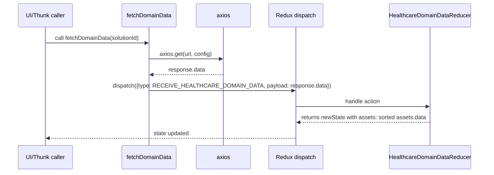
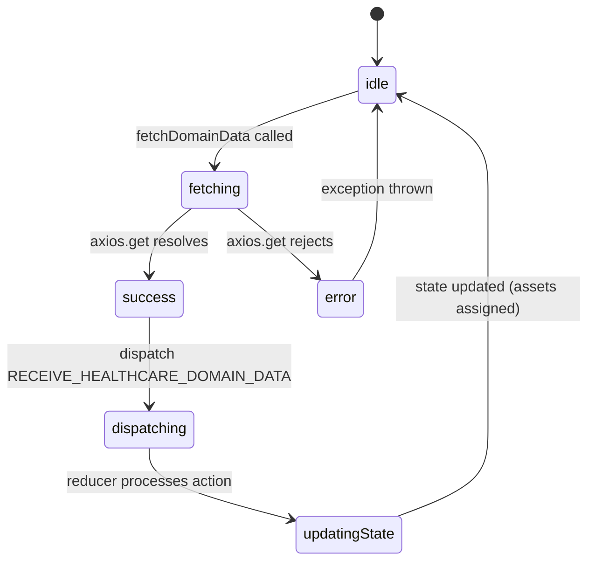

# Diagram: web/portal/src/modules/domain-data/HealthcareDomainData.js


> Auto-generated by Obscura crawlers

## Diagram 1

```mermaid
flowchart LR
  A[fetchDomainData(solutionId)] -->|builds URL & config| B[axios.get(url, config)]
  B -->|then(response)| C[dispatch({ type: RECEIVE_HEALTHCARE_DOMAIN_DATA, payload: response.data })]
  B -->|catch(err)| D[throw Error(err)]
  C --> E[Redux store at "healthcareDomainData"]
  E --> F[HealthcareDomainDataReducer(state, action)]
  F -->|on RECEIVE_HEALTHCARE_DOMAIN_DATA| G[assets = action.payload || []]
  G --> H[assets.data.sort()]
  H --> I[state.assets = sorted assets]
  style A fill:#f9f,stroke:#333,stroke-width:1px
  style B fill:#fffae6,stroke:#333
  style F fill:#e6f7ff,stroke:#333
```

> SVG rendering failed for this diagram.

## Diagram 2

```mermaid
classDiagram
  class Module {
    <<export default>>
    +mountPoint: "healthcareDomainData"
    +actionCreators.fetchDomainData
    +selectors.getAssets
    +selectors.getAssetsOptions
    +reducer HealthcareDomainDataReducer
  }
  class Constants {
    +STORE_MOUNT_POINT = "healthcareDomainData"
    +RECEIVE_HEALTHCARE_DOMAIN_DATA
    +CCE(actionName)
  }
  class Network {
    +axios.get(url, config)
    +apiUrl(path)
  }
  class Selectors {
    +getAssets(state)
    +getAssetsOptions (reselect.createSelector)
    -convertToOptions(items)
  }
  class Reducer {
    +initialState { assets: [] }
    +HealthcareDomainDataReducer(state, action)
  }
  Module --> Constants
  Module --> Network
  Module --> Selectors
  Module --> Reducer
  Selectors ..> Reducer : reads state["healthcareDomainData"]
  Network --> Module : used by fetchDomainData
  Reducer --> Module : exported as reducer
```

> SVG rendering failed for this diagram.

## Diagram 3



### SVG

<svg id="container" width="1444" xmlns="http://www.w3.org/2000/svg" height="507" viewBox="-50 -10 1444 507" role="graphics-document document" aria-roledescription="sequence"><g><rect x="1096" y="421" fill="#eaeaea" stroke="#666" width="248" height="65" name="Reducer" rx="3" ry="3" class="actor actor-bottom"></rect><text x="1220" y="453.5" dominant-baseline="central" alignment-baseline="central" class="actor actor-box" style="text-anchor: middle; font-size: 16px; font-weight: 400;"><tspan x="1220" dy="0">HealthcareDomainDataReducer</tspan></text></g><g><rect x="726" y="421" fill="#eaeaea" stroke="#666" width="150" height="65" name="Store" rx="3" ry="3" class="actor actor-bottom"></rect><text x="801" y="453.5" dominant-baseline="central" alignment-baseline="central" class="actor actor-box" style="text-anchor: middle; font-size: 16px; font-weight: 400;"><tspan x="801" dy="0">Redux dispatch</tspan></text></g><g><rect x="526" y="421" fill="#eaeaea" stroke="#666" width="150" height="65" name="HTTP" rx="3" ry="3" class="actor actor-bottom"></rect><text x="601" y="453.5" dominant-baseline="central" alignment-baseline="central" class="actor actor-box" style="text-anchor: middle; font-size: 16px; font-weight: 400;"><tspan x="601" dy="0">axios</tspan></text></g><g><rect x="310" y="421" fill="#eaeaea" stroke="#666" width="150" height="65" name="Thunk" rx="3" ry="3" class="actor actor-bottom"></rect><text x="385" y="453.5" dominant-baseline="central" alignment-baseline="central" class="actor actor-box" style="text-anchor: middle; font-size: 16px; font-weight: 400;"><tspan x="385" dy="0">fetchDomainData</tspan></text></g><g><rect x="0" y="421" fill="#eaeaea" stroke="#666" width="150" height="65" name="Caller" rx="3" ry="3" class="actor actor-bottom"></rect><text x="75" y="453.5" dominant-baseline="central" alignment-baseline="central" class="actor actor-box" style="text-anchor: middle; font-size: 16px; font-weight: 400;"><tspan x="75" dy="0">UI/Thunk caller</tspan></text></g><g><line id="actor4" x1="1220" y1="65" x2="1220" y2="421" class="actor-line 200" stroke-width="0.5px" stroke="#999" name="Reducer"></line><g id="root-4"><rect x="1096" y="0" fill="#eaeaea" stroke="#666" width="248" height="65" name="Reducer" rx="3" ry="3" class="actor actor-top"></rect><text x="1220" y="32.5" dominant-baseline="central" alignment-baseline="central" class="actor actor-box" style="text-anchor: middle; font-size: 16px; font-weight: 400;"><tspan x="1220" dy="0">HealthcareDomainDataReducer</tspan></text></g></g><g><line id="actor3" x1="801" y1="65" x2="801" y2="421" class="actor-line 200" stroke-width="0.5px" stroke="#999" name="Store"></line><g id="root-3"><rect x="726" y="0" fill="#eaeaea" stroke="#666" width="150" height="65" name="Store" rx="3" ry="3" class="actor actor-top"></rect><text x="801" y="32.5" dominant-baseline="central" alignment-baseline="central" class="actor actor-box" style="text-anchor: middle; font-size: 16px; font-weight: 400;"><tspan x="801" dy="0">Redux dispatch</tspan></text></g></g><g><line id="actor2" x1="601" y1="65" x2="601" y2="421" class="actor-line 200" stroke-width="0.5px" stroke="#999" name="HTTP"></line><g id="root-2"><rect x="526" y="0" fill="#eaeaea" stroke="#666" width="150" height="65" name="HTTP" rx="3" ry="3" class="actor actor-top"></rect><text x="601" y="32.5" dominant-baseline="central" alignment-baseline="central" class="actor actor-box" style="text-anchor: middle; font-size: 16px; font-weight: 400;"><tspan x="601" dy="0">axios</tspan></text></g></g><g><line id="actor1" x1="385" y1="65" x2="385" y2="421" class="actor-line 200" stroke-width="0.5px" stroke="#999" name="Thunk"></line><g id="root-1"><rect x="310" y="0" fill="#eaeaea" stroke="#666" width="150" height="65" name="Thunk" rx="3" ry="3" class="actor actor-top"></rect><text x="385" y="32.5" dominant-baseline="central" alignment-baseline="central" class="actor actor-box" style="text-anchor: middle; font-size: 16px; font-weight: 400;"><tspan x="385" dy="0">fetchDomainData</tspan></text></g></g><g><line id="actor0" x1="75" y1="65" x2="75" y2="421" class="actor-line 200" stroke-width="0.5px" stroke="#999" name="Caller"></line><g id="root-0"><rect x="0" y="0" fill="#eaeaea" stroke="#666" width="150" height="65" name="Caller" rx="3" ry="3" class="actor actor-top"></rect><text x="75" y="32.5" dominant-baseline="central" alignment-baseline="central" class="actor actor-box" style="text-anchor: middle; font-size: 16px; font-weight: 400;"><tspan x="75" dy="0">UI/Thunk caller</tspan></text></g></g><style>#container{font-family:"trebuchet ms",verdana,arial,sans-serif;font-size:16px;fill:#333;}@keyframes edge-animation-frame{from{stroke-dashoffset:0;}}@keyframes dash{to{stroke-dashoffset:0;}}#container .edge-animation-slow{stroke-dasharray:9,5!important;stroke-dashoffset:900;animation:dash 50s linear infinite;stroke-linecap:round;}#container .edge-animation-fast{stroke-dasharray:9,5!important;stroke-dashoffset:900;animation:dash 20s linear infinite;stroke-linecap:round;}#container .error-icon{fill:#552222;}#container .error-text{fill:#552222;stroke:#552222;}#container .edge-thickness-normal{stroke-width:1px;}#container .edge-thickness-thick{stroke-width:3.5px;}#container .edge-pattern-solid{stroke-dasharray:0;}#container .edge-thickness-invisible{stroke-width:0;fill:none;}#container .edge-pattern-dashed{stroke-dasharray:3;}#container .edge-pattern-dotted{stroke-dasharray:2;}#container .marker{fill:#333333;stroke:#333333;}#container .marker.cross{stroke:#333333;}#container svg{font-family:"trebuchet ms",verdana,arial,sans-serif;font-size:16px;}#container p{margin:0;}#container .actor{stroke:hsl(259.6261682243, 59.7765363128%, 87.9019607843%);fill:#ECECFF;}#container text.actor&gt;tspan{fill:black;stroke:none;}#container .actor-line{stroke:hsl(259.6261682243, 59.7765363128%, 87.9019607843%);}#container .innerArc{stroke-width:1.5;stroke-dasharray:none;}#container .messageLine0{stroke-width:1.5;stroke-dasharray:none;stroke:#333;}#container .messageLine1{stroke-width:1.5;stroke-dasharray:2,2;stroke:#333;}#container #arrowhead path{fill:#333;stroke:#333;}#container .sequenceNumber{fill:white;}#container #sequencenumber{fill:#333;}#container #crosshead path{fill:#333;stroke:#333;}#container .messageText{fill:#333;stroke:none;}#container .labelBox{stroke:hsl(259.6261682243, 59.7765363128%, 87.9019607843%);fill:#ECECFF;}#container .labelText,#container .labelText&gt;tspan{fill:black;stroke:none;}#container .loopText,#container .loopText&gt;tspan{fill:black;stroke:none;}#container .loopLine{stroke-width:2px;stroke-dasharray:2,2;stroke:hsl(259.6261682243, 59.7765363128%, 87.9019607843%);fill:hsl(259.6261682243, 59.7765363128%, 87.9019607843%);}#container .note{stroke:#aaaa33;fill:#fff5ad;}#container .noteText,#container .noteText&gt;tspan{fill:black;stroke:none;}#container .activation0{fill:#f4f4f4;stroke:#666;}#container .activation1{fill:#f4f4f4;stroke:#666;}#container .activation2{fill:#f4f4f4;stroke:#666;}#container .actorPopupMenu{position:absolute;}#container .actorPopupMenuPanel{position:absolute;fill:#ECECFF;box-shadow:0px 8px 16px 0px rgba(0,0,0,0.2);filter:drop-shadow(3px 5px 2px rgb(0 0 0 / 0.4));}#container .actor-man line{stroke:hsl(259.6261682243, 59.7765363128%, 87.9019607843%);fill:#ECECFF;}#container .actor-man circle,#container line{stroke:hsl(259.6261682243, 59.7765363128%, 87.9019607843%);fill:#ECECFF;stroke-width:2px;}#container :root{--mermaid-font-family:"trebuchet ms",verdana,arial,sans-serif;}</style><g></g><defs><symbol id="computer" width="24" height="24"><path transform="scale(.5)" d="M2 2v13h20v-13h-20zm18 11h-16v-9h16v9zm-10.228 6l.466-1h3.524l.467 1h-4.457zm14.228 3h-24l2-6h2.104l-1.33 4h18.45l-1.297-4h2.073l2 6zm-5-10h-14v-7h14v7z"></path></symbol></defs><defs><symbol id="database" fill-rule="evenodd" clip-rule="evenodd"><path transform="scale(.5)" d="M12.258.001l.256.004.255.005.253.008.251.01.249.012.247.015.246.016.242.019.241.02.239.023.236.024.233.027.231.028.229.031.225.032.223.034.22.036.217.038.214.04.211.041.208.043.205.045.201.046.198.048.194.05.191.051.187.053.183.054.18.056.175.057.172.059.168.06.163.061.16.063.155.064.15.066.074.033.073.033.071.034.07.034.069.035.068.035.067.035.066.035.064.036.064.036.062.036.06.036.06.037.058.037.058.037.055.038.055.038.053.038.052.038.051.039.05.039.048.039.047.039.045.04.044.04.043.04.041.04.04.041.039.041.037.041.036.041.034.041.033.042.032.042.03.042.029.042.027.042.026.043.024.043.023.043.021.043.02.043.018.044.017.043.015.044.013.044.012.044.011.045.009.044.007.045.006.045.004.045.002.045.001.045v17l-.001.045-.002.045-.004.045-.006.045-.007.045-.009.044-.011.045-.012.044-.013.044-.015.044-.017.043-.018.044-.02.043-.021.043-.023.043-.024.043-.026.043-.027.042-.029.042-.03.042-.032.042-.033.042-.034.041-.036.041-.037.041-.039.041-.04.041-.041.04-.043.04-.044.04-.045.04-.047.039-.048.039-.05.039-.051.039-.052.038-.053.038-.055.038-.055.038-.058.037-.058.037-.06.037-.06.036-.062.036-.064.036-.064.036-.066.035-.067.035-.068.035-.069.035-.07.034-.071.034-.073.033-.074.033-.15.066-.155.064-.16.063-.163.061-.168.06-.172.059-.175.057-.18.056-.183.054-.187.053-.191.051-.194.05-.198.048-.201.046-.205.045-.208.043-.211.041-.214.04-.217.038-.22.036-.223.034-.225.032-.229.031-.231.028-.233.027-.236.024-.239.023-.241.02-.242.019-.246.016-.247.015-.249.012-.251.01-.253.008-.255.005-.256.004-.258.001-.258-.001-.256-.004-.255-.005-.253-.008-.251-.01-.249-.012-.247-.015-.245-.016-.243-.019-.241-.02-.238-.023-.236-.024-.234-.027-.231-.028-.228-.031-.226-.032-.223-.034-.22-.036-.217-.038-.214-.04-.211-.041-.208-.043-.204-.045-.201-.046-.198-.048-.195-.05-.19-.051-.187-.053-.184-.054-.179-.056-.176-.057-.172-.059-.167-.06-.164-.061-.159-.063-.155-.064-.151-.066-.074-.033-.072-.033-.072-.034-.07-.034-.069-.035-.068-.035-.067-.035-.066-.035-.064-.036-.063-.036-.062-.036-.061-.036-.06-.037-.058-.037-.057-.037-.056-.038-.055-.038-.053-.038-.052-.038-.051-.039-.049-.039-.049-.039-.046-.039-.046-.04-.044-.04-.043-.04-.041-.04-.04-.041-.039-.041-.037-.041-.036-.041-.034-.041-.033-.042-.032-.042-.03-.042-.029-.042-.027-.042-.026-.043-.024-.043-.023-.043-.021-.043-.02-.043-.018-.044-.017-.043-.015-.044-.013-.044-.012-.044-.011-.045-.009-.044-.007-.045-.006-.045-.004-.045-.002-.045-.001-.045v-17l.001-.045.002-.045.004-.045.006-.045.007-.045.009-.044.011-.045.012-.044.013-.044.015-.044.017-.043.018-.044.02-.043.021-.043.023-.043.024-.043.026-.043.027-.042.029-.042.03-.042.032-.042.033-.042.034-.041.036-.041.037-.041.039-.041.04-.041.041-.04.043-.04.044-.04.046-.04.046-.039.049-.039.049-.039.051-.039.052-.038.053-.038.055-.038.056-.038.057-.037.058-.037.06-.037.061-.036.062-.036.063-.036.064-.036.066-.035.067-.035.068-.035.069-.035.07-.034.072-.034.072-.033.074-.033.151-.066.155-.064.159-.063.164-.061.167-.06.172-.059.176-.057.179-.056.184-.054.187-.053.19-.051.195-.05.198-.048.201-.046.204-.045.208-.043.211-.041.214-.04.217-.038.22-.036.223-.034.226-.032.228-.031.231-.028.234-.027.236-.024.238-.023.241-.02.243-.019.245-.016.247-.015.249-.012.251-.01.253-.008.255-.005.256-.004.258-.001.258.001zm-9.258 20.499v.01l.001.021.003.021.004.022.005.021.006.022.007.022.009.023.01.022.011.023.012.023.013.023.015.023.016.024.017.023.018.024.019.024.021.024.022.025.023.024.024.025.052.049.056.05.061.051.066.051.07.051.075.051.079.052.084.052.088.052.092.052.097.052.102.051.105.052.11.052.114.051.119.051.123.051.127.05.131.05.135.05.139.048.144.049.147.047.152.047.155.047.16.045.163.045.167.043.171.043.176.041.178.041.183.039.187.039.19.037.194.035.197.035.202.033.204.031.209.03.212.029.216.027.219.025.222.024.226.021.23.02.233.018.236.016.24.015.243.012.246.01.249.008.253.005.256.004.259.001.26-.001.257-.004.254-.005.25-.008.247-.011.244-.012.241-.014.237-.016.233-.018.231-.021.226-.021.224-.024.22-.026.216-.027.212-.028.21-.031.205-.031.202-.034.198-.034.194-.036.191-.037.187-.039.183-.04.179-.04.175-.042.172-.043.168-.044.163-.045.16-.046.155-.046.152-.047.148-.048.143-.049.139-.049.136-.05.131-.05.126-.05.123-.051.118-.052.114-.051.11-.052.106-.052.101-.052.096-.052.092-.052.088-.053.083-.051.079-.052.074-.052.07-.051.065-.051.06-.051.056-.05.051-.05.023-.024.023-.025.021-.024.02-.024.019-.024.018-.024.017-.024.015-.023.014-.024.013-.023.012-.023.01-.023.01-.022.008-.022.006-.022.006-.022.004-.022.004-.021.001-.021.001-.021v-4.127l-.077.055-.08.053-.083.054-.085.053-.087.052-.09.052-.093.051-.095.05-.097.05-.1.049-.102.049-.105.048-.106.047-.109.047-.111.046-.114.045-.115.045-.118.044-.12.043-.122.042-.124.042-.126.041-.128.04-.13.04-.132.038-.134.038-.135.037-.138.037-.139.035-.142.035-.143.034-.144.033-.147.032-.148.031-.15.03-.151.03-.153.029-.154.027-.156.027-.158.026-.159.025-.161.024-.162.023-.163.022-.165.021-.166.02-.167.019-.169.018-.169.017-.171.016-.173.015-.173.014-.175.013-.175.012-.177.011-.178.01-.179.008-.179.008-.181.006-.182.005-.182.004-.184.003-.184.002h-.37l-.184-.002-.184-.003-.182-.004-.182-.005-.181-.006-.179-.008-.179-.008-.178-.01-.176-.011-.176-.012-.175-.013-.173-.014-.172-.015-.171-.016-.17-.017-.169-.018-.167-.019-.166-.02-.165-.021-.163-.022-.162-.023-.161-.024-.159-.025-.157-.026-.156-.027-.155-.027-.153-.029-.151-.03-.15-.03-.148-.031-.146-.032-.145-.033-.143-.034-.141-.035-.14-.035-.137-.037-.136-.037-.134-.038-.132-.038-.13-.04-.128-.04-.126-.041-.124-.042-.122-.042-.12-.044-.117-.043-.116-.045-.113-.045-.112-.046-.109-.047-.106-.047-.105-.048-.102-.049-.1-.049-.097-.05-.095-.05-.093-.052-.09-.051-.087-.052-.085-.053-.083-.054-.08-.054-.077-.054v4.127zm0-5.654v.011l.001.021.003.021.004.021.005.022.006.022.007.022.009.022.01.022.011.023.012.023.013.023.015.024.016.023.017.024.018.024.019.024.021.024.022.024.023.025.024.024.052.05.056.05.061.05.066.051.07.051.075.052.079.051.084.052.088.052.092.052.097.052.102.052.105.052.11.051.114.051.119.052.123.05.127.051.131.05.135.049.139.049.144.048.147.048.152.047.155.046.16.045.163.045.167.044.171.042.176.042.178.04.183.04.187.038.19.037.194.036.197.034.202.033.204.032.209.03.212.028.216.027.219.025.222.024.226.022.23.02.233.018.236.016.24.014.243.012.246.01.249.008.253.006.256.003.259.001.26-.001.257-.003.254-.006.25-.008.247-.01.244-.012.241-.015.237-.016.233-.018.231-.02.226-.022.224-.024.22-.025.216-.027.212-.029.21-.03.205-.032.202-.033.198-.035.194-.036.191-.037.187-.039.183-.039.179-.041.175-.042.172-.043.168-.044.163-.045.16-.045.155-.047.152-.047.148-.048.143-.048.139-.05.136-.049.131-.05.126-.051.123-.051.118-.051.114-.052.11-.052.106-.052.101-.052.096-.052.092-.052.088-.052.083-.052.079-.052.074-.051.07-.052.065-.051.06-.05.056-.051.051-.049.023-.025.023-.024.021-.025.02-.024.019-.024.018-.024.017-.024.015-.023.014-.023.013-.024.012-.022.01-.023.01-.023.008-.022.006-.022.006-.022.004-.021.004-.022.001-.021.001-.021v-4.139l-.077.054-.08.054-.083.054-.085.052-.087.053-.09.051-.093.051-.095.051-.097.05-.1.049-.102.049-.105.048-.106.047-.109.047-.111.046-.114.045-.115.044-.118.044-.12.044-.122.042-.124.042-.126.041-.128.04-.13.039-.132.039-.134.038-.135.037-.138.036-.139.036-.142.035-.143.033-.144.033-.147.033-.148.031-.15.03-.151.03-.153.028-.154.028-.156.027-.158.026-.159.025-.161.024-.162.023-.163.022-.165.021-.166.02-.167.019-.169.018-.169.017-.171.016-.173.015-.173.014-.175.013-.175.012-.177.011-.178.009-.179.009-.179.007-.181.007-.182.005-.182.004-.184.003-.184.002h-.37l-.184-.002-.184-.003-.182-.004-.182-.005-.181-.007-.179-.007-.179-.009-.178-.009-.176-.011-.176-.012-.175-.013-.173-.014-.172-.015-.171-.016-.17-.017-.169-.018-.167-.019-.166-.02-.165-.021-.163-.022-.162-.023-.161-.024-.159-.025-.157-.026-.156-.027-.155-.028-.153-.028-.151-.03-.15-.03-.148-.031-.146-.033-.145-.033-.143-.033-.141-.035-.14-.036-.137-.036-.136-.037-.134-.038-.132-.039-.13-.039-.128-.04-.126-.041-.124-.042-.122-.043-.12-.043-.117-.044-.116-.044-.113-.046-.112-.046-.109-.046-.106-.047-.105-.048-.102-.049-.1-.049-.097-.05-.095-.051-.093-.051-.09-.051-.087-.053-.085-.052-.083-.054-.08-.054-.077-.054v4.139zm0-5.666v.011l.001.02.003.022.004.021.005.022.006.021.007.022.009.023.01.022.011.023.012.023.013.023.015.023.016.024.017.024.018.023.019.024.021.025.022.024.023.024.024.025.052.05.056.05.061.05.066.051.07.051.075.052.079.051.084.052.088.052.092.052.097.052.102.052.105.051.11.052.114.051.119.051.123.051.127.05.131.05.135.05.139.049.144.048.147.048.152.047.155.046.16.045.163.045.167.043.171.043.176.042.178.04.183.04.187.038.19.037.194.036.197.034.202.033.204.032.209.03.212.028.216.027.219.025.222.024.226.021.23.02.233.018.236.017.24.014.243.012.246.01.249.008.253.006.256.003.259.001.26-.001.257-.003.254-.006.25-.008.247-.01.244-.013.241-.014.237-.016.233-.018.231-.02.226-.022.224-.024.22-.025.216-.027.212-.029.21-.03.205-.032.202-.033.198-.035.194-.036.191-.037.187-.039.183-.039.179-.041.175-.042.172-.043.168-.044.163-.045.16-.045.155-.047.152-.047.148-.048.143-.049.139-.049.136-.049.131-.051.126-.05.123-.051.118-.052.114-.051.11-.052.106-.052.101-.052.096-.052.092-.052.088-.052.083-.052.079-.052.074-.052.07-.051.065-.051.06-.051.056-.05.051-.049.023-.025.023-.025.021-.024.02-.024.019-.024.018-.024.017-.024.015-.023.014-.024.013-.023.012-.023.01-.022.01-.023.008-.022.006-.022.006-.022.004-.022.004-.021.001-.021.001-.021v-4.153l-.077.054-.08.054-.083.053-.085.053-.087.053-.09.051-.093.051-.095.051-.097.05-.1.049-.102.048-.105.048-.106.048-.109.046-.111.046-.114.046-.115.044-.118.044-.12.043-.122.043-.124.042-.126.041-.128.04-.13.039-.132.039-.134.038-.135.037-.138.036-.139.036-.142.034-.143.034-.144.033-.147.032-.148.032-.15.03-.151.03-.153.028-.154.028-.156.027-.158.026-.159.024-.161.024-.162.023-.163.023-.165.021-.166.02-.167.019-.169.018-.169.017-.171.016-.173.015-.173.014-.175.013-.175.012-.177.01-.178.01-.179.009-.179.007-.181.006-.182.006-.182.004-.184.003-.184.001-.185.001-.185-.001-.184-.001-.184-.003-.182-.004-.182-.006-.181-.006-.179-.007-.179-.009-.178-.01-.176-.01-.176-.012-.175-.013-.173-.014-.172-.015-.171-.016-.17-.017-.169-.018-.167-.019-.166-.02-.165-.021-.163-.023-.162-.023-.161-.024-.159-.024-.157-.026-.156-.027-.155-.028-.153-.028-.151-.03-.15-.03-.148-.032-.146-.032-.145-.033-.143-.034-.141-.034-.14-.036-.137-.036-.136-.037-.134-.038-.132-.039-.13-.039-.128-.041-.126-.041-.124-.041-.122-.043-.12-.043-.117-.044-.116-.044-.113-.046-.112-.046-.109-.046-.106-.048-.105-.048-.102-.048-.1-.05-.097-.049-.095-.051-.093-.051-.09-.052-.087-.052-.085-.053-.083-.053-.08-.054-.077-.054v4.153zm8.74-8.179l-.257.004-.254.005-.25.008-.247.011-.244.012-.241.014-.237.016-.233.018-.231.021-.226.022-.224.023-.22.026-.216.027-.212.028-.21.031-.205.032-.202.033-.198.034-.194.036-.191.038-.187.038-.183.04-.179.041-.175.042-.172.043-.168.043-.163.045-.16.046-.155.046-.152.048-.148.048-.143.048-.139.049-.136.05-.131.05-.126.051-.123.051-.118.051-.114.052-.11.052-.106.052-.101.052-.096.052-.092.052-.088.052-.083.052-.079.052-.074.051-.07.052-.065.051-.06.05-.056.05-.051.05-.023.025-.023.024-.021.024-.02.025-.019.024-.018.024-.017.023-.015.024-.014.023-.013.023-.012.023-.01.023-.01.022-.008.022-.006.023-.006.021-.004.022-.004.021-.001.021-.001.021.001.021.001.021.004.021.004.022.006.021.006.023.008.022.01.022.01.023.012.023.013.023.014.023.015.024.017.023.018.024.019.024.02.025.021.024.023.024.023.025.051.05.056.05.06.05.065.051.07.052.074.051.079.052.083.052.088.052.092.052.096.052.101.052.106.052.11.052.114.052.118.051.123.051.126.051.131.05.136.05.139.049.143.048.148.048.152.048.155.046.16.046.163.045.168.043.172.043.175.042.179.041.183.04.187.038.191.038.194.036.198.034.202.033.205.032.21.031.212.028.216.027.22.026.224.023.226.022.231.021.233.018.237.016.241.014.244.012.247.011.25.008.254.005.257.004.26.001.26-.001.257-.004.254-.005.25-.008.247-.011.244-.012.241-.014.237-.016.233-.018.231-.021.226-.022.224-.023.22-.026.216-.027.212-.028.21-.031.205-.032.202-.033.198-.034.194-.036.191-.038.187-.038.183-.04.179-.041.175-.042.172-.043.168-.043.163-.045.16-.046.155-.046.152-.048.148-.048.143-.048.139-.049.136-.05.131-.05.126-.051.123-.051.118-.051.114-.052.11-.052.106-.052.101-.052.096-.052.092-.052.088-.052.083-.052.079-.052.074-.051.07-.052.065-.051.06-.05.056-.05.051-.05.023-.025.023-.024.021-.024.02-.025.019-.024.018-.024.017-.023.015-.024.014-.023.013-.023.012-.023.01-.023.01-.022.008-.022.006-.023.006-.021.004-.022.004-.021.001-.021.001-.021-.001-.021-.001-.021-.004-.021-.004-.022-.006-.021-.006-.023-.008-.022-.01-.022-.01-.023-.012-.023-.013-.023-.014-.023-.015-.024-.017-.023-.018-.024-.019-.024-.02-.025-.021-.024-.023-.024-.023-.025-.051-.05-.056-.05-.06-.05-.065-.051-.07-.052-.074-.051-.079-.052-.083-.052-.088-.052-.092-.052-.096-.052-.101-.052-.106-.052-.11-.052-.114-.052-.118-.051-.123-.051-.126-.051-.131-.05-.136-.05-.139-.049-.143-.048-.148-.048-.152-.048-.155-.046-.16-.046-.163-.045-.168-.043-.172-.043-.175-.042-.179-.041-.183-.04-.187-.038-.191-.038-.194-.036-.198-.034-.202-.033-.205-.032-.21-.031-.212-.028-.216-.027-.22-.026-.224-.023-.226-.022-.231-.021-.233-.018-.237-.016-.241-.014-.244-.012-.247-.011-.25-.008-.254-.005-.257-.004-.26-.001-.26.001z"></path></symbol></defs><defs><symbol id="clock" width="24" height="24"><path transform="scale(.5)" d="M12 2c5.514 0 10 4.486 10 10s-4.486 10-10 10-10-4.486-10-10 4.486-10 10-10zm0-2c-6.627 0-12 5.373-12 12s5.373 12 12 12 12-5.373 12-12-5.373-12-12-12zm5.848 12.459c.202.038.202.333.001.372-1.907.361-6.045 1.111-6.547 1.111-.719 0-1.301-.582-1.301-1.301 0-.512.77-5.447 1.125-7.445.034-.192.312-.181.343.014l.985 6.238 5.394 1.011z"></path></symbol></defs><defs><marker id="arrowhead" refX="7.9" refY="5" markerUnits="userSpaceOnUse" markerWidth="12" markerHeight="12" orient="auto-start-reverse"><path d="M -1 0 L 10 5 L 0 10 z"></path></marker></defs><defs><marker id="crosshead" markerWidth="15" markerHeight="8" orient="auto" refX="4" refY="4.5"><path fill="none" stroke="#000000" stroke-width="1pt" d="M 1,2 L 6,7 M 6,2 L 1,7" style="stroke-dasharray: 0, 0;"></path></marker></defs><defs><marker id="filled-head" refX="15.5" refY="7" markerWidth="20" markerHeight="28" orient="auto"><path d="M 18,7 L9,13 L14,7 L9,1 Z"></path></marker></defs><defs><marker id="sequencenumber" refX="15" refY="15" markerWidth="60" markerHeight="40" orient="auto"><circle cx="15" cy="15" r="6"></circle></marker></defs><text x="229" y="80" text-anchor="middle" dominant-baseline="middle" alignment-baseline="middle" class="messageText" dy="1em" style="font-size: 16px; font-weight: 400;">call fetchDomainData(solutionId)</text><line x1="76" y1="113" x2="381" y2="113" class="messageLine0" stroke-width="2" stroke="none" marker-end="url(#arrowhead)" style="fill: none;"></line><text x="492" y="128" text-anchor="middle" dominant-baseline="middle" alignment-baseline="middle" class="messageText" dy="1em" style="font-size: 16px; font-weight: 400;">axios.get(url, config)</text><line x1="386" y1="161" x2="597" y2="161" class="messageLine0" stroke-width="2" stroke="none" marker-end="url(#arrowhead)" style="fill: none;"></line><text x="495" y="176" text-anchor="middle" dominant-baseline="middle" alignment-baseline="middle" class="messageText" dy="1em" style="font-size: 16px; font-weight: 400;">response.data</text><line x1="600" y1="209" x2="389" y2="209" class="messageLine1" stroke-width="2" stroke="none" marker-end="url(#arrowhead)" style="stroke-dasharray: 3, 3; fill: none;"></line><text x="592" y="224" text-anchor="middle" dominant-baseline="middle" alignment-baseline="middle" class="messageText" dy="1em" style="font-size: 16px; font-weight: 400;">dispatch({type: RECEIVE_HEALTHCARE_DOMAIN_DATA, payload: response.data})</text><line x1="386" y1="257" x2="797" y2="257" class="messageLine0" stroke-width="2" stroke="none" marker-end="url(#arrowhead)" style="fill: none;"></line><text x="1009" y="272" text-anchor="middle" dominant-baseline="middle" alignment-baseline="middle" class="messageText" dy="1em" style="font-size: 16px; font-weight: 400;">handle action</text><line x1="802" y1="305" x2="1216" y2="305" class="messageLine0" stroke-width="2" stroke="none" marker-end="url(#arrowhead)" style="fill: none;"></line><text x="1012" y="320" text-anchor="middle" dominant-baseline="middle" alignment-baseline="middle" class="messageText" dy="1em" style="font-size: 16px; font-weight: 400;">returns newState with assets: sorted assets.data</text><line x1="1219" y1="353" x2="805" y2="353" class="messageLine1" stroke-width="2" stroke="none" marker-end="url(#arrowhead)" style="stroke-dasharray: 3, 3; fill: none;"></line><text x="440" y="368" text-anchor="middle" dominant-baseline="middle" alignment-baseline="middle" class="messageText" dy="1em" style="font-size: 16px; font-weight: 400;">state updated</text><line x1="800" y1="401" x2="79" y2="401" class="messageLine1" stroke-width="2" stroke="none" marker-end="url(#arrowhead)" style="stroke-dasharray: 3, 3; fill: none;"></line></svg>

## Diagram 4



### SVG

<svg id="container" width="620.9296875" xmlns="http://www.w3.org/2000/svg" class="statediagram" height="608" viewBox="0 0 620.9296875 608" role="graphics-document document" aria-roledescription="stateDiagram"><style>#container{font-family:"trebuchet ms",verdana,arial,sans-serif;font-size:16px;fill:#333;}@keyframes edge-animation-frame{from{stroke-dashoffset:0;}}@keyframes dash{to{stroke-dashoffset:0;}}#container .edge-animation-slow{stroke-dasharray:9,5!important;stroke-dashoffset:900;animation:dash 50s linear infinite;stroke-linecap:round;}#container .edge-animation-fast{stroke-dasharray:9,5!important;stroke-dashoffset:900;animation:dash 20s linear infinite;stroke-linecap:round;}#container .error-icon{fill:#552222;}#container .error-text{fill:#552222;stroke:#552222;}#container .edge-thickness-normal{stroke-width:1px;}#container .edge-thickness-thick{stroke-width:3.5px;}#container .edge-pattern-solid{stroke-dasharray:0;}#container .edge-thickness-invisible{stroke-width:0;fill:none;}#container .edge-pattern-dashed{stroke-dasharray:3;}#container .edge-pattern-dotted{stroke-dasharray:2;}#container .marker{fill:#333333;stroke:#333333;}#container .marker.cross{stroke:#333333;}#container svg{font-family:"trebuchet ms",verdana,arial,sans-serif;font-size:16px;}#container p{margin:0;}#container defs #statediagram-barbEnd{fill:#333333;stroke:#333333;}#container g.stateGroup text{fill:#9370DB;stroke:none;font-size:10px;}#container g.stateGroup text{fill:#333;stroke:none;font-size:10px;}#container g.stateGroup .state-title{font-weight:bolder;fill:#131300;}#container g.stateGroup rect{fill:#ECECFF;stroke:#9370DB;}#container g.stateGroup line{stroke:#333333;stroke-width:1;}#container .transition{stroke:#333333;stroke-width:1;fill:none;}#container .stateGroup .composit{fill:white;border-bottom:1px;}#container .stateGroup .alt-composit{fill:#e0e0e0;border-bottom:1px;}#container .state-note{stroke:#aaaa33;fill:#fff5ad;}#container .state-note text{fill:black;stroke:none;font-size:10px;}#container .stateLabel .box{stroke:none;stroke-width:0;fill:#ECECFF;opacity:0.5;}#container .edgeLabel .label rect{fill:#ECECFF;opacity:0.5;}#container .edgeLabel{background-color:rgba(232,232,232, 0.8);text-align:center;}#container .edgeLabel p{background-color:rgba(232,232,232, 0.8);}#container .edgeLabel rect{opacity:0.5;background-color:rgba(232,232,232, 0.8);fill:rgba(232,232,232, 0.8);}#container .edgeLabel .label text{fill:#333;}#container .label div .edgeLabel{color:#333;}#container .stateLabel text{fill:#131300;font-size:10px;font-weight:bold;}#container .node circle.state-start{fill:#333333;stroke:#333333;}#container .node .fork-join{fill:#333333;stroke:#333333;}#container .node circle.state-end{fill:#9370DB;stroke:white;stroke-width:1.5;}#container .end-state-inner{fill:white;stroke-width:1.5;}#container .node rect{fill:#ECECFF;stroke:#9370DB;stroke-width:1px;}#container .node polygon{fill:#ECECFF;stroke:#9370DB;stroke-width:1px;}#container #statediagram-barbEnd{fill:#333333;}#container .statediagram-cluster rect{fill:#ECECFF;stroke:#9370DB;stroke-width:1px;}#container .cluster-label,#container .nodeLabel{color:#131300;}#container .statediagram-cluster rect.outer{rx:5px;ry:5px;}#container .statediagram-state .divider{stroke:#9370DB;}#container .statediagram-state .title-state{rx:5px;ry:5px;}#container .statediagram-cluster.statediagram-cluster .inner{fill:white;}#container .statediagram-cluster.statediagram-cluster-alt .inner{fill:#f0f0f0;}#container .statediagram-cluster .inner{rx:0;ry:0;}#container .statediagram-state rect.basic{rx:5px;ry:5px;}#container .statediagram-state rect.divider{stroke-dasharray:10,10;fill:#f0f0f0;}#container .note-edge{stroke-dasharray:5;}#container .statediagram-note rect{fill:#fff5ad;stroke:#aaaa33;stroke-width:1px;rx:0;ry:0;}#container .statediagram-note rect{fill:#fff5ad;stroke:#aaaa33;stroke-width:1px;rx:0;ry:0;}#container .statediagram-note text{fill:black;}#container .statediagram-note .nodeLabel{color:black;}#container .statediagram .edgeLabel{color:red;}#container #dependencyStart,#container #dependencyEnd{fill:#333333;stroke:#333333;stroke-width:1;}#container .statediagramTitleText{text-anchor:middle;font-size:18px;fill:#333;}#container :root{--mermaid-font-family:"trebuchet ms",verdana,arial,sans-serif;}</style><g><defs><marker id="container_stateDiagram-barbEnd" refX="19" refY="7" markerWidth="20" markerHeight="14" markerUnits="userSpaceOnUse" orient="auto"><path d="M 19,7 L9,13 L14,7 L9,1 Z"></path></marker></defs><g class="root"><g class="clusters"></g><g class="edgePaths"><path d="M390.887,22L390.887,26.167C390.887,30.333,390.887,38.667,390.97,47.083C391.053,55.5,391.22,64,391.303,68.25L391.387,72.5" id="edge0" class="edge-thickness-normal edge-pattern-solid transition" style="fill:none;;;fill:none" data-edge="true" data-et="edge" data-id="edge0" data-points="W3sieCI6MzkwLjg4NjcxODc1LCJ5IjoyMn0seyJ4IjozOTAuODg2NzE4NzUsInkiOjQ3fSx7IngiOjM5MS4zODY3MTg3NSwieSI6NzIuNX1d" marker-end="url(#container_stateDiagram-barbEnd)"></path><path d="M369.676,99.449L343.528,107.707C317.38,115.966,265.085,132.483,239.02,146.991C212.956,161.5,213.122,174,213.206,180.25L213.289,186.5" id="edge1" class="edge-thickness-normal edge-pattern-solid transition" style="fill:none;;;fill:none" data-edge="true" data-et="edge" data-id="edge1" data-points="W3sieCI6MzY5LjY3NTc4MTI1LCJ5Ijo5OS40NDg1NjY2NjU5MzU1Nn0seyJ4IjoyMTIuNzg5MDYyNSwieSI6MTQ5fSx7IngiOjIxMy4yODkwNjI1LCJ5IjoxODYuNX1d" marker-end="url(#container_stateDiagram-barbEnd)"></path><path d="M188.303,226.5L180.515,232.583C172.728,238.667,157.153,250.833,149.449,263.833C141.745,276.833,141.911,290.667,141.995,297.583L142.078,304.5" id="edge2" class="edge-thickness-normal edge-pattern-solid transition" style="fill:none;;;fill:none" data-edge="true" data-et="edge" data-id="edge2" data-points="W3sieCI6MTg4LjMwMjc2ODY0MDM1MDg4LCJ5IjoyMjYuNX0seyJ4IjoxNDEuNTc4MTI1LCJ5IjoyNjN9LHsieCI6MTQyLjA3ODEyNSwieSI6MzA0LjV9XQ==" marker-end="url(#container_stateDiagram-barbEnd)"></path><path d="M238.275,226.5L245.896,232.583C253.517,238.667,268.758,250.833,284.065,263.851C299.371,276.869,314.743,290.738,322.429,297.673L330.114,304.608" id="edge3" class="edge-thickness-normal edge-pattern-solid transition" style="fill:none;;;fill:none" data-edge="true" data-et="edge" data-id="edge3" data-points="W3sieCI6MjM4LjI3NTM1NjM1OTY0OTEyLCJ5IjoyMjYuNX0seyJ4IjoyODQsInkiOjI2M30seyJ4IjozMzAuMTE0MjM4NTE1NjU2NSwieSI6MzA0LjYwNzU2ODU5NzY3MzgzfV0=" marker-end="url(#container_stateDiagram-barbEnd)"></path><path d="M142.078,344.5L141.995,353.25C141.911,362,141.745,379.5,141.745,396.5C141.745,413.5,141.911,430,141.995,438.25L142.078,446.5" id="edge4" class="edge-thickness-normal edge-pattern-solid transition" style="fill:none;;;fill:none" data-edge="true" data-et="edge" data-id="edge4" data-points="W3sieCI6MTQyLjA3ODEyNSwieSI6MzQ0LjV9LHsieCI6MTQxLjU3ODEyNSwieSI6Mzk3fSx7IngiOjE0Mi4wNzgxMjUsInkiOjQ0Ni41fV0=" marker-end="url(#container_stateDiagram-barbEnd)"></path><path d="M142.078,486.5L141.995,492.583C141.911,498.667,141.745,510.833,168.451,523.937C195.156,537.041,248.734,551.082,275.523,558.103L302.312,565.123" id="edge5" class="edge-thickness-normal edge-pattern-solid transition" style="fill:none;;;fill:none" data-edge="true" data-et="edge" data-id="edge5" data-points="W3sieCI6MTQyLjA3ODEyNSwieSI6NDg2LjV9LHsieCI6MTQxLjU3ODEyNSwieSI6NTIzfSx7IngiOjMwMi4zMTI0NjExODU0MDYyLCJ5Ijo1NjUuMTIzMTYwNzc5MzE4N31d" marker-end="url(#container_stateDiagram-barbEnd)"></path><path d="M414.814,560.5L431.166,554.25C447.519,548,480.224,535.5,496.577,519.75C512.93,504,512.93,485,512.93,464C512.93,443,512.93,420,512.93,396.333C512.93,372.667,512.93,348.333,512.93,326C512.93,303.667,512.93,283.333,512.93,263.667C512.93,244,512.93,225,512.93,206C512.93,187,512.93,168,496.291,150.773C479.652,133.547,446.375,118.093,429.736,110.367L413.098,102.64" id="edge6" class="edge-thickness-normal edge-pattern-solid transition" style="fill:none;;;fill:none" data-edge="true" data-et="edge" data-id="edge6" data-points="W3sieCI6NDE0LjgxMzczMzU1MjYzMTU2LCJ5Ijo1NjAuNX0seyJ4Ijo1MTIuOTI5Njg3NSwieSI6NTIzfSx7IngiOjUxMi45Mjk2ODc1LCJ5Ijo0NjZ9LHsieCI6NTEyLjkyOTY4NzUsInkiOjM5N30seyJ4Ijo1MTIuOTI5Njg3NSwieSI6MzI0fSx7IngiOjUxMi45Mjk2ODc1LCJ5IjoyNjN9LHsieCI6NTEyLjkyOTY4NzUsInkiOjIwNn0seyJ4Ijo1MTIuOTI5Njg3NSwieSI6MTQ5fSx7IngiOjQxMy4wOTc2NTYyNSwieSI6MTAyLjY0MDA2MzM3NDE5NTgyfV0=" marker-end="url(#container_stateDiagram-barbEnd)"></path><path d="M365.04,304.5L369.348,297.583C373.655,290.667,382.271,276.833,386.579,260.417C390.887,244,390.887,225,390.887,206C390.887,187,390.887,168,390.97,152.417C391.053,136.833,391.22,124.667,391.303,118.583L391.387,112.5" id="edge7" class="edge-thickness-normal edge-pattern-solid transition" style="fill:none;;;fill:none" data-edge="true" data-et="edge" data-id="edge7" data-points="W3sieCI6MzY1LjAzOTcwMjg2ODg1MjUsInkiOjMwNC41fSx7IngiOjM5MC44ODY3MTg3NSwieSI6MjYzfSx7IngiOjM5MC44ODY3MTg3NSwieSI6MjA2fSx7IngiOjM5MC44ODY3MTg3NSwieSI6MTQ5fSx7IngiOjM5MS4zODY3MTg3NSwieSI6MTEyLjV9XQ==" marker-end="url(#container_stateDiagram-barbEnd)"></path></g><g class="edgeLabels"><g class="edgeLabel"><g class="label" data-id="edge0" transform="translate(0, 0)"><foreignObject width="0" height="0"><div xmlns="http://www.w3.org/1999/xhtml" class="labelBkg" style="display: table-cell; white-space: nowrap; line-height: 1.5; max-width: 200px; text-align: center;"><span class="edgeLabel"></span></div></foreignObject></g></g><g class="edgeLabel" transform="translate(212.7890625, 149)"><g class="label" data-id="edge1" transform="translate(-86.7578125, -12)"><foreignObject width="173.515625" height="24"><div xmlns="http://www.w3.org/1999/xhtml" class="labelBkg" style="display: table-cell; white-space: nowrap; line-height: 1.5; max-width: 200px; text-align: center;"><span class="edgeLabel"><p>fetchDomainData called</p></span></div></foreignObject></g></g><g class="edgeLabel" transform="translate(141.578125, 263)"><g class="label" data-id="edge2" transform="translate(-64.0234375, -12)"><foreignObject width="128.046875" height="24"><div xmlns="http://www.w3.org/1999/xhtml" class="labelBkg" style="display: table-cell; white-space: nowrap; line-height: 1.5; max-width: 200px; text-align: center;"><span class="edgeLabel"><p>axios.get resolves</p></span></div></foreignObject></g></g><g class="edgeLabel" transform="translate(284, 263)"><g class="label" data-id="edge3" transform="translate(-58.3984375, -12)"><foreignObject width="116.796875" height="24"><div xmlns="http://www.w3.org/1999/xhtml" class="labelBkg" style="display: table-cell; white-space: nowrap; line-height: 1.5; max-width: 200px; text-align: center;"><span class="edgeLabel"><p>axios.get rejects</p></span></div></foreignObject></g></g><g class="edgeLabel" transform="translate(141.578125, 397)"><g class="label" data-id="edge4" transform="translate(-133.578125, -24)"><foreignObject width="267.15625" height="48"><div xmlns="http://www.w3.org/1999/xhtml" class="labelBkg" style="display: table; white-space: break-spaces; line-height: 1.5; max-width: 200px; text-align: center; width: 200px;"><span class="edgeLabel"><p>dispatch RECEIVE_HEALTHCARE_DOMAIN_DATA</p></span></div></foreignObject></g></g><g class="edgeLabel" transform="translate(141.578125, 523)"><g class="label" data-id="edge5" transform="translate(-90.46875, -12)"><foreignObject width="180.9375" height="24"><div xmlns="http://www.w3.org/1999/xhtml" class="labelBkg" style="display: table-cell; white-space: nowrap; line-height: 1.5; max-width: 200px; text-align: center;"><span class="edgeLabel"><p>reducer processes action</p></span></div></foreignObject></g></g><g class="edgeLabel" transform="translate(512.9296875, 324)"><g class="label" data-id="edge6" transform="translate(-100, -24)"><foreignObject width="200" height="48"><div xmlns="http://www.w3.org/1999/xhtml" class="labelBkg" style="display: table; white-space: break-spaces; line-height: 1.5; max-width: 200px; text-align: center; width: 200px;"><span class="edgeLabel"><p>state updated (assets assigned)</p></span></div></foreignObject></g></g><g class="edgeLabel" transform="translate(390.88671875, 206)"><g class="label" data-id="edge7" transform="translate(-63.0234375, -12)"><foreignObject width="126.046875" height="24"><div xmlns="http://www.w3.org/1999/xhtml" class="labelBkg" style="display: table-cell; white-space: nowrap; line-height: 1.5; max-width: 200px; text-align: center;"><span class="edgeLabel"><p>exception thrown</p></span></div></foreignObject></g></g></g><g class="nodes"><g class="node default" id="state-root_start-0" transform="translate(390.88671875, 15)"><circle class="state-start" r="7" width="14" height="14"></circle></g><g class="node  statediagram-state" id="state-idle-7" transform="translate(390.88671875, 92)"><g class="basic label-container outer-path"><path d="M-16.7109375 -20 C-3.5665522073767093 -20, 9.577833085246581 -20, 16.7109375 -20 C16.7109375 -20, 16.7109375 -20, 16.7109375 -20 C16.81632423148731 -19.995641172543323, 16.921710962974625 -19.99128234508665, 17.123834227361662 -19.982922465033347 C17.247483397041197 -19.96750961210634, 17.37113256672073 -19.95209675917933, 17.53391045140367 -19.931806517013612 C17.634812937242383 -19.910649490588, 17.735715423081096 -19.88949246416239, 17.938364935703998 -19.847001329696653 C18.067673401800366 -19.808504531394558, 18.19698186789673 -19.77000773309246, 18.334434846023417 -19.729086208503173 C18.44358275827305 -19.68649656098289, 18.552730670522678 -19.643906913462605, 18.719414623264846 -19.578866633275286 C18.849279857689393 -19.515379388725027, 18.979145092113942 -19.451892144174764, 19.09067446518537 -19.397368756032446 C19.2098403816171 -19.32636128243644, 19.329006298048828 -19.255353808840436, 19.445678290612136 -19.185832391312644 C19.577292912971387 -19.091861357141372, 19.708907535330642 -18.9978903229701, 19.78200106344834 -18.94570254698197 C19.886417901671667 -18.857265996179922, 19.990834739894993 -18.76882944537787, 20.097345358128706 -18.678619553365657 C20.18178198902594 -18.594182922468423, 20.266218619923173 -18.50974629157119, 20.389557053365657 -18.386407858128706 C20.493529094883648 -18.263648300677925, 20.59750113640164 -18.14088874322714, 20.65664004698197 -18.07106356344834 C20.726879442202996 -17.97268716950647, 20.797118837424026 -17.874310775564602, 20.896769891312644 -17.734740790612136 C20.969794117533922 -17.612190326573852, 21.0428183437552 -17.48963986253557, 21.108306256032446 -17.37973696518537 C21.165743380439924 -17.262247449319805, 21.2231805048474 -17.144757933454237, 21.289804133275286 -17.008477123264846 C21.333384986710474 -16.896788967962735, 21.376965840145658 -16.785100812660623, 21.440023708503173 -16.623497346023417 C21.463793055450104 -16.543657517014754, 21.48756240239704 -16.463817688006095, 21.557938829696653 -16.227427435703994 C21.579275501994584 -16.125668179413562, 21.600612174292515 -16.023908923123134, 21.642744017013612 -15.82297295140367 C21.65351515411532 -15.736561813541153, 21.664286291217024 -15.650150675678635, 21.693859965033347 -15.412896727361662 C21.699722496569763 -15.271153783185785, 21.705585028106174 -15.129410839009905, 21.7109375 -15 C21.7109375 -15, 21.7109375 -15, 21.7109375 -15 C21.7109375 -3.3911101616916675, 21.7109375 8.217779676616665, 21.7109375 15 C21.7109375 15, 21.7109375 15, 21.7109375 15 C21.704560655690152 15.154177880564864, 21.698183811380304 15.308355761129729, 21.693859965033347 15.412896727361662 C21.683403602703358 15.496782593663921, 21.67294724037337 15.580668459966178, 21.642744017013612 15.822972951403669 C21.609570078258297 15.981186720112706, 21.57639613950298 16.139400488821742, 21.557938829696653 16.227427435703994 C21.51714317736005 16.36445761638683, 21.476347525023446 16.50148779706966, 21.440023708503173 16.623497346023417 C21.402202559028638 16.720424645129626, 21.364381409554102 16.81735194423584, 21.289804133275286 17.008477123264846 C21.232277340962515 17.126150057762356, 21.174750548649744 17.243822992259865, 21.108306256032446 17.379736965185366 C21.058379380005647 17.463525074168892, 21.008452503978845 17.54731318315242, 20.896769891312644 17.734740790612133 C20.801672961282282 17.867932328237, 20.70657603125192 18.001123865861867, 20.65664004698197 18.07106356344834 C20.565809451671992 18.178307044680885, 20.474978856362014 18.285550525913425, 20.389557053365657 18.386407858128706 C20.310799120910396 18.465165790583967, 20.23204118845514 18.543923723039224, 20.097345358128706 18.678619553365657 C20.003697461693985 18.75793527572876, 19.910049565259264 18.837250998091857, 19.78200106344834 18.94570254698197 C19.71128106470515 18.99619565556947, 19.64056106596196 19.04668876415697, 19.445678290612136 19.185832391312644 C19.365590128058788 19.23355457780812, 19.28550196550544 19.2812767643036, 19.09067446518537 19.397368756032446 C18.993602813836866 19.444824194705994, 18.89653116248836 19.492279633379543, 18.719414623264846 19.578866633275286 C18.606267235515702 19.6230168809782, 18.493119847766557 19.66716712868111, 18.334434846023417 19.729086208503173 C18.197481120345156 19.769859099198722, 18.0605273946669 19.810631989894276, 17.938364935703998 19.847001329696653 C17.847537114363288 19.866045921118886, 17.756709293022574 19.885090512541122, 17.53391045140367 19.931806517013612 C17.437753209792117 19.943792504680708, 17.34159596818056 19.955778492347807, 17.123834227361662 19.982922465033347 C16.975521141317063 19.98905673964754, 16.827208055272465 19.99519101426174, 16.7109375 20 C16.7109375 20, 16.7109375 20, 16.7109375 20 C7.111513459519259 20, -2.4879105809614828 20, -16.7109375 20 C-16.7109375 20, -16.7109375 20, -16.7109375 20 C-16.83524165870667 19.99485874196587, -16.959545817413346 19.98971748393174, -17.123834227361662 19.982922465033347 C-17.238433382544905 19.96863769523686, -17.353032537728147 19.954352925440375, -17.53391045140367 19.931806517013612 C-17.652846303259764 19.90686829136183, -17.771782155115858 19.88193006571004, -17.938364935703994 19.847001329696653 C-18.023326298848165 19.821707235975097, -18.108287661992332 19.796413142253538, -18.334434846023417 19.729086208503173 C-18.424179557851115 19.694067713281665, -18.51392426967881 19.659049218060158, -18.719414623264846 19.578866633275286 C-18.865793050019146 19.50730658090706, -19.012171476773446 19.435746528538836, -19.09067446518537 19.397368756032446 C-19.178388191569127 19.345102719763844, -19.266101917952884 19.292836683495242, -19.445678290612133 19.185832391312644 C-19.55801071869355 19.10562857923949, -19.670343146774968 19.025424767166335, -19.78200106344834 18.94570254698197 C-19.901295063877562 18.84466568253704, -20.020589064306783 18.743628818092112, -20.097345358128706 18.67861955336566 C-20.17983221657462 18.596132694919746, -20.26231907502053 18.51364583647383, -20.389557053365657 18.386407858128706 C-20.488685601431683 18.269367002590457, -20.587814149497706 18.15232614705221, -20.656640046981966 18.07106356344834 C-20.734975580789204 17.961347821887397, -20.81331111459644 17.851632080326453, -20.896769891312644 17.734740790612133 C-20.957578191336093 17.632691295932496, -21.018386491359543 17.530641801252862, -21.108306256032446 17.37973696518537 C-21.166826296041364 17.260032310051447, -21.225346336050283 17.14032765491752, -21.289804133275286 17.00847712326485 C-21.32302679403247 16.923334740734045, -21.35624945478965 16.83819235820324, -21.440023708503173 16.623497346023417 C-21.467602113852305 16.530863115376604, -21.495180519201437 16.438228884729792, -21.557938829696653 16.227427435703994 C-21.582234029938103 16.11155831265255, -21.606529230179557 15.995689189601105, -21.642744017013612 15.82297295140367 C-21.657339410773005 15.705881824404567, -21.6719348045324 15.588790697405464, -21.693859965033347 15.412896727361664 C-21.697925616103944 15.31459834736002, -21.701991267174538 15.216299967358378, -21.7109375 15 C-21.7109375 15, -21.7109375 15, -21.7109375 15 C-21.7109375 3.665145758029688, -21.7109375 -7.669708483940624, -21.7109375 -15 C-21.7109375 -15, -21.7109375 -15, -21.7109375 -15 C-21.70694798427025 -15.096457597175966, -21.702958468540498 -15.192915194351935, -21.693859965033347 -15.41289672736166 C-21.679516163517036 -15.527969462820787, -21.66517236200072 -15.643042198279915, -21.642744017013612 -15.822972951403669 C-21.62245243302941 -15.91974795297632, -21.602160849045205 -16.01652295454897, -21.557938829696653 -16.227427435703994 C-21.53008369198995 -16.32099119395452, -21.502228554283253 -16.414554952205044, -21.440023708503173 -16.623497346023417 C-21.40772855795364 -16.706262723609374, -21.375433407404106 -16.789028101195328, -21.28980413327529 -17.008477123264846 C-21.2387195824598 -17.112972242152452, -21.187635031644312 -17.21746736104006, -21.108306256032446 -17.379736965185366 C-21.045011680706313 -17.485958968193234, -20.98171710538018 -17.5921809712011, -20.896769891312644 -17.734740790612133 C-20.819714173504796 -17.842664038337777, -20.742658455696947 -17.950587286063424, -20.65664004698197 -18.07106356344834 C-20.60264709703437 -18.134812918989105, -20.54865414708677 -18.198562274529873, -20.38955705336566 -18.386407858128706 C-20.303811648100982 -18.472153263393384, -20.218066242836304 -18.557898668658062, -20.097345358128706 -18.678619553365657 C-19.999264829090457 -18.761689524038694, -19.901184300052204 -18.84475949471173, -19.78200106344834 -18.945702546981966 C-19.661156606915515 -19.0319838305559, -19.54031215038269 -19.118265114129837, -19.445678290612136 -19.185832391312644 C-19.30659481163209 -19.268708156103777, -19.167511332652044 -19.351583920894914, -19.090674465185366 -19.397368756032446 C-19.011235868825366 -19.43620391939379, -18.93179727246537 -19.475039082755135, -18.71941462326485 -19.578866633275286 C-18.60293706196116 -19.624316318731484, -18.486459500657475 -19.669766004187682, -18.33443484602342 -19.729086208503173 C-18.22567578871979 -19.761465182741592, -18.116916731416165 -19.79384415698001, -17.938364935703994 -19.847001329696653 C-17.8503893584204 -19.865447868430817, -17.762413781136807 -19.883894407164984, -17.533910451403674 -19.931806517013612 C-17.393815150439423 -19.949269378067378, -17.253719849475175 -19.96673223912114, -17.123834227361662 -19.982922465033347 C-17.041153335827527 -19.98634217200286, -16.958472444293395 -19.989761878972374, -16.7109375 -20 C-16.7109375 -20, -16.7109375 -20, -16.7109375 -20" stroke="none" stroke-width="0" fill="#ECECFF" style=""></path><path d="M-16.7109375 -20 C-4.699002661898319 -20, 7.312932176203361 -20, 16.7109375 -20 M-16.7109375 -20 C-4.398422876070333 -20, 7.9140917478593344 -20, 16.7109375 -20 M16.7109375 -20 C16.7109375 -20, 16.7109375 -20, 16.7109375 -20 M16.7109375 -20 C16.7109375 -20, 16.7109375 -20, 16.7109375 -20 M16.7109375 -20 C16.80609808861014 -19.99606412894134, 16.901258677220277 -19.992128257882687, 17.123834227361662 -19.982922465033347 M16.7109375 -20 C16.827320050335388 -19.99518638211167, 16.943702600670772 -19.99037276422334, 17.123834227361662 -19.982922465033347 M17.123834227361662 -19.982922465033347 C17.286595894307773 -19.962634244406416, 17.449357561253883 -19.942346023779486, 17.53391045140367 -19.931806517013612 M17.123834227361662 -19.982922465033347 C17.22884064975416 -19.969833428132237, 17.333847072146657 -19.95674439123113, 17.53391045140367 -19.931806517013612 M17.53391045140367 -19.931806517013612 C17.642706491218927 -19.908994386368462, 17.751502531034188 -19.88618225572331, 17.938364935703998 -19.847001329696653 M17.53391045140367 -19.931806517013612 C17.66094471857396 -19.905170232236884, 17.787978985744246 -19.878533947460152, 17.938364935703998 -19.847001329696653 M17.938364935703998 -19.847001329696653 C18.023628462078335 -19.82161727808388, 18.10889198845267 -19.796233226471113, 18.334434846023417 -19.729086208503173 M17.938364935703998 -19.847001329696653 C18.071575803304448 -19.807342736129854, 18.2047866709049 -19.767684142563056, 18.334434846023417 -19.729086208503173 M18.334434846023417 -19.729086208503173 C18.429416895594567 -19.6920240977526, 18.524398945165718 -19.65496198700203, 18.719414623264846 -19.578866633275286 M18.334434846023417 -19.729086208503173 C18.42752267548925 -19.69276322473129, 18.520610504955084 -19.65644024095941, 18.719414623264846 -19.578866633275286 M18.719414623264846 -19.578866633275286 C18.827094266743313 -19.526225263251238, 18.934773910221782 -19.47358389322719, 19.09067446518537 -19.397368756032446 M18.719414623264846 -19.578866633275286 C18.80652747746692 -19.53627975386368, 18.893640331668994 -19.493692874452073, 19.09067446518537 -19.397368756032446 M19.09067446518537 -19.397368756032446 C19.19504179176197 -19.335179327980512, 19.299409118338573 -19.272989899928582, 19.445678290612136 -19.185832391312644 M19.09067446518537 -19.397368756032446 C19.217492275131356 -19.321801743577154, 19.344310085077343 -19.246234731121863, 19.445678290612136 -19.185832391312644 M19.445678290612136 -19.185832391312644 C19.579246698428946 -19.090466381137155, 19.712815106245756 -18.995100370961666, 19.78200106344834 -18.94570254698197 M19.445678290612136 -19.185832391312644 C19.564373925619655 -19.101085336818752, 19.683069560627178 -19.016338282324863, 19.78200106344834 -18.94570254698197 M19.78200106344834 -18.94570254698197 C19.892625406285713 -18.852008507957766, 20.003249749123086 -18.75831446893356, 20.097345358128706 -18.678619553365657 M19.78200106344834 -18.94570254698197 C19.854887048826654 -18.883971266296374, 19.927773034204968 -18.82223998561078, 20.097345358128706 -18.678619553365657 M20.097345358128706 -18.678619553365657 C20.158641961587982 -18.61732294990638, 20.219938565047258 -18.556026346447105, 20.389557053365657 -18.386407858128706 M20.097345358128706 -18.678619553365657 C20.212767532502063 -18.5631973789923, 20.32818970687542 -18.447775204618942, 20.389557053365657 -18.386407858128706 M20.389557053365657 -18.386407858128706 C20.478367684149777 -18.281549344505148, 20.567178314933894 -18.176690830881594, 20.65664004698197 -18.07106356344834 M20.389557053365657 -18.386407858128706 C20.470226337462712 -18.291161814374604, 20.550895621559764 -18.195915770620505, 20.65664004698197 -18.07106356344834 M20.65664004698197 -18.07106356344834 C20.737541649019253 -17.957753819714025, 20.818443251056532 -17.84444407597971, 20.896769891312644 -17.734740790612136 M20.65664004698197 -18.07106356344834 C20.721896385625197 -17.979666374486666, 20.787152724268424 -17.88826918552499, 20.896769891312644 -17.734740790612136 M20.896769891312644 -17.734740790612136 C20.944042520511328 -17.655407082548546, 20.99131514971001 -17.576073374484956, 21.108306256032446 -17.37973696518537 M20.896769891312644 -17.734740790612136 C20.951878489224434 -17.642256630271643, 21.006987087136224 -17.54977246993115, 21.108306256032446 -17.37973696518537 M21.108306256032446 -17.37973696518537 C21.164866692132815 -17.264040743915064, 21.22142712823318 -17.148344522644756, 21.289804133275286 -17.008477123264846 M21.108306256032446 -17.37973696518537 C21.151443291317616 -17.291498749156734, 21.194580326602786 -17.203260533128102, 21.289804133275286 -17.008477123264846 M21.289804133275286 -17.008477123264846 C21.337805155092376 -16.88546104724099, 21.38580617690947 -16.76244497121714, 21.440023708503173 -16.623497346023417 M21.289804133275286 -17.008477123264846 C21.335784279183407 -16.890640108332647, 21.38176442509153 -16.772803093400448, 21.440023708503173 -16.623497346023417 M21.440023708503173 -16.623497346023417 C21.48423250725529 -16.475002608623715, 21.528441306007405 -16.326507871224013, 21.557938829696653 -16.227427435703994 M21.440023708503173 -16.623497346023417 C21.47834481259089 -16.494779026390272, 21.51666591667861 -16.36606070675713, 21.557938829696653 -16.227427435703994 M21.557938829696653 -16.227427435703994 C21.582767275789728 -16.109015146571007, 21.607595721882802 -15.990602857438024, 21.642744017013612 -15.82297295140367 M21.557938829696653 -16.227427435703994 C21.588793321475368 -16.080275616864565, 21.619647813254083 -15.933123798025136, 21.642744017013612 -15.82297295140367 M21.642744017013612 -15.82297295140367 C21.656430427905338 -15.713174113338509, 21.670116838797064 -15.603375275273349, 21.693859965033347 -15.412896727361662 M21.642744017013612 -15.82297295140367 C21.662239280463158 -15.666572760625503, 21.6817345439127 -15.510172569847336, 21.693859965033347 -15.412896727361662 M21.693859965033347 -15.412896727361662 C21.698657549199726 -15.29690183668173, 21.703455133366102 -15.180906946001796, 21.7109375 -15 M21.693859965033347 -15.412896727361662 C21.70002110834062 -15.26393401621233, 21.7061822516479 -15.114971305062998, 21.7109375 -15 M21.7109375 -15 C21.7109375 -15, 21.7109375 -15, 21.7109375 -15 M21.7109375 -15 C21.7109375 -15, 21.7109375 -15, 21.7109375 -15 M21.7109375 -15 C21.7109375 -3.426019224955777, 21.7109375 8.147961550088446, 21.7109375 15 M21.7109375 -15 C21.7109375 -8.167579689504977, 21.7109375 -1.335159379009955, 21.7109375 15 M21.7109375 15 C21.7109375 15, 21.7109375 15, 21.7109375 15 M21.7109375 15 C21.7109375 15, 21.7109375 15, 21.7109375 15 M21.7109375 15 C21.706973922885684 15.095830459275447, 21.703010345771368 15.191660918550893, 21.693859965033347 15.412896727361662 M21.7109375 15 C21.704253673780382 15.161600018838955, 21.697569847560764 15.323200037677909, 21.693859965033347 15.412896727361662 M21.693859965033347 15.412896727361662 C21.67985561954578 15.525246186585324, 21.66585127405821 15.637595645808986, 21.642744017013612 15.822972951403669 M21.693859965033347 15.412896727361662 C21.67928436412016 15.529829066820879, 21.66470876320697 15.646761406280095, 21.642744017013612 15.822972951403669 M21.642744017013612 15.822972951403669 C21.619237707786866 15.935079680683975, 21.59573139856012 16.047186409964283, 21.557938829696653 16.227427435703994 M21.642744017013612 15.822972951403669 C21.609349075487966 15.982240730655356, 21.575954133962316 16.141508509907045, 21.557938829696653 16.227427435703994 M21.557938829696653 16.227427435703994 C21.526563798060074 16.33281430925161, 21.495188766423492 16.438201182799226, 21.440023708503173 16.623497346023417 M21.557938829696653 16.227427435703994 C21.521681341241187 16.349214192615346, 21.485423852785726 16.4710009495267, 21.440023708503173 16.623497346023417 M21.440023708503173 16.623497346023417 C21.380660145440814 16.775633119602425, 21.321296582378455 16.927768893181433, 21.289804133275286 17.008477123264846 M21.440023708503173 16.623497346023417 C21.39206526287923 16.746404308615624, 21.344106817255284 16.869311271207835, 21.289804133275286 17.008477123264846 M21.289804133275286 17.008477123264846 C21.22989734874226 17.13101840966204, 21.169990564209236 17.253559696059234, 21.108306256032446 17.379736965185366 M21.289804133275286 17.008477123264846 C21.228116890336924 17.13466039554173, 21.16642964739856 17.260843667818612, 21.108306256032446 17.379736965185366 M21.108306256032446 17.379736965185366 C21.025558752797867 17.51860519350015, 20.942811249563288 17.657473421814935, 20.896769891312644 17.734740790612133 M21.108306256032446 17.379736965185366 C21.05621681342 17.467154329175056, 21.004127370807552 17.554571693164743, 20.896769891312644 17.734740790612133 M20.896769891312644 17.734740790612133 C20.83835683788888 17.81655336227339, 20.779943784465114 17.89836593393465, 20.65664004698197 18.07106356344834 M20.896769891312644 17.734740790612133 C20.834299249107225 17.82223636895621, 20.771828606901803 17.909731947300287, 20.65664004698197 18.07106356344834 M20.65664004698197 18.07106356344834 C20.589866850033133 18.149902528109767, 20.523093653084295 18.228741492771192, 20.389557053365657 18.386407858128706 M20.65664004698197 18.07106356344834 C20.55199594549525 18.194616620604783, 20.44735184400853 18.318169677761226, 20.389557053365657 18.386407858128706 M20.389557053365657 18.386407858128706 C20.301179709231636 18.474785202262726, 20.21280236509762 18.563162546396743, 20.097345358128706 18.678619553365657 M20.389557053365657 18.386407858128706 C20.303864859810666 18.472100051683697, 20.218172666255672 18.55779224523869, 20.097345358128706 18.678619553365657 M20.097345358128706 18.678619553365657 C20.00508265050266 18.75676208065282, 19.912819942876613 18.83490460793998, 19.78200106344834 18.94570254698197 M20.097345358128706 18.678619553365657 C19.977269561441044 18.780318565465148, 19.857193764753386 18.88201757756464, 19.78200106344834 18.94570254698197 M19.78200106344834 18.94570254698197 C19.648169191896088 19.041256666648962, 19.514337320343834 19.136810786315955, 19.445678290612136 19.185832391312644 M19.78200106344834 18.94570254698197 C19.679905651802976 19.01859726980592, 19.57781024015761 19.091491992629873, 19.445678290612136 19.185832391312644 M19.445678290612136 19.185832391312644 C19.35169566620683 19.241833879999774, 19.257713041801527 19.297835368686904, 19.09067446518537 19.397368756032446 M19.445678290612136 19.185832391312644 C19.344550526453688 19.246091459159597, 19.243422762295236 19.306350527006554, 19.09067446518537 19.397368756032446 M19.09067446518537 19.397368756032446 C19.01548795800544 19.434125199659285, 18.940301450825515 19.47088164328612, 18.719414623264846 19.578866633275286 M19.09067446518537 19.397368756032446 C19.013217732368346 19.43523504534543, 18.935760999551324 19.473101334658416, 18.719414623264846 19.578866633275286 M18.719414623264846 19.578866633275286 C18.62262085844289 19.616635677510416, 18.525827093620933 19.654404721745546, 18.334434846023417 19.729086208503173 M18.719414623264846 19.578866633275286 C18.577879648605343 19.6340937517634, 18.436344673945836 19.689320870251514, 18.334434846023417 19.729086208503173 M18.334434846023417 19.729086208503173 C18.204390100869116 19.767802206578054, 18.074345355714815 19.80651820465293, 17.938364935703998 19.847001329696653 M18.334434846023417 19.729086208503173 C18.18454023430475 19.773711767896973, 18.034645622586087 19.81833732729077, 17.938364935703998 19.847001329696653 M17.938364935703998 19.847001329696653 C17.82658021705954 19.870440120393255, 17.714795498415082 19.893878911089853, 17.53391045140367 19.931806517013612 M17.938364935703998 19.847001329696653 C17.849411228197877 19.865652960771147, 17.76045752069176 19.88430459184564, 17.53391045140367 19.931806517013612 M17.53391045140367 19.931806517013612 C17.4413636791947 19.943342460139014, 17.348816906985736 19.954878403264413, 17.123834227361662 19.982922465033347 M17.53391045140367 19.931806517013612 C17.400039088326785 19.948493565018786, 17.266167725249904 19.965180613023957, 17.123834227361662 19.982922465033347 M17.123834227361662 19.982922465033347 C17.008444506131863 19.98769501920612, 16.89305478490206 19.992467573378892, 16.7109375 20 M17.123834227361662 19.982922465033347 C17.03060551391237 19.98677843314431, 16.937376800463078 19.990634401255267, 16.7109375 20 M16.7109375 20 C16.7109375 20, 16.7109375 20, 16.7109375 20 M16.7109375 20 C16.7109375 20, 16.7109375 20, 16.7109375 20 M16.7109375 20 C9.593072470974693 20, 2.4752074419493884 20, -16.7109375 20 M16.7109375 20 C9.588248856297714 20, 2.4655602125954275 20, -16.7109375 20 M-16.7109375 20 C-16.7109375 20, -16.7109375 20, -16.7109375 20 M-16.7109375 20 C-16.7109375 20, -16.7109375 20, -16.7109375 20 M-16.7109375 20 C-16.816058805023534 19.99565215066307, -16.921180110047064 19.991304301326142, -17.123834227361662 19.982922465033347 M-16.7109375 20 C-16.847619802395027 19.99434677815591, -16.984302104790057 19.988693556311823, -17.123834227361662 19.982922465033347 M-17.123834227361662 19.982922465033347 C-17.210191882427463 19.9721579945553, -17.296549537493263 19.961393524077252, -17.53391045140367 19.931806517013612 M-17.123834227361662 19.982922465033347 C-17.278697562640197 19.963618770422052, -17.43356089791873 19.944315075810756, -17.53391045140367 19.931806517013612 M-17.53391045140367 19.931806517013612 C-17.690565504557128 19.89895940654132, -17.847220557710582 19.866112296069026, -17.938364935703994 19.847001329696653 M-17.53391045140367 19.931806517013612 C-17.61644911834955 19.91449997849582, -17.69898778529543 19.89719343997803, -17.938364935703994 19.847001329696653 M-17.938364935703994 19.847001329696653 C-18.0627583642516 19.809967801471714, -18.18715179279921 19.772934273246772, -18.334434846023417 19.729086208503173 M-17.938364935703994 19.847001329696653 C-18.08600885367548 19.803045830863006, -18.233652771646966 19.75909033202936, -18.334434846023417 19.729086208503173 M-18.334434846023417 19.729086208503173 C-18.451703400542073 19.68332787653673, -18.56897195506073 19.637569544570287, -18.719414623264846 19.578866633275286 M-18.334434846023417 19.729086208503173 C-18.417133238754726 19.696817195525032, -18.499831631486032 19.664548182546888, -18.719414623264846 19.578866633275286 M-18.719414623264846 19.578866633275286 C-18.836734898108777 19.52151224576176, -18.95405517295271 19.46415785824823, -19.09067446518537 19.397368756032446 M-18.719414623264846 19.578866633275286 C-18.79503145590601 19.54189981634943, -18.87064828854717 19.504932999423573, -19.09067446518537 19.397368756032446 M-19.09067446518537 19.397368756032446 C-19.201929855213116 19.331074933047127, -19.313185245240863 19.264781110061808, -19.445678290612133 19.185832391312644 M-19.09067446518537 19.397368756032446 C-19.223043998862373 19.318493634278397, -19.355413532539373 19.239618512524352, -19.445678290612133 19.185832391312644 M-19.445678290612133 19.185832391312644 C-19.524065713364433 19.129864847205365, -19.602453136116736 19.073897303098086, -19.78200106344834 18.94570254698197 M-19.445678290612133 19.185832391312644 C-19.517935659383856 19.134241621622635, -19.59019302815558 19.082650851932627, -19.78200106344834 18.94570254698197 M-19.78200106344834 18.94570254698197 C-19.904099162378234 18.842290732253847, -20.026197261308127 18.738878917525724, -20.097345358128706 18.67861955336566 M-19.78200106344834 18.94570254698197 C-19.899903045528095 18.845844661938973, -20.01780502760785 18.745986776895972, -20.097345358128706 18.67861955336566 M-20.097345358128706 18.67861955336566 C-20.156521581253497 18.619443330240866, -20.21569780437829 18.560267107116076, -20.389557053365657 18.386407858128706 M-20.097345358128706 18.67861955336566 C-20.19505979663657 18.580905114857796, -20.292774235144435 18.48319067634993, -20.389557053365657 18.386407858128706 M-20.389557053365657 18.386407858128706 C-20.482265823818018 18.276946819695898, -20.574974594270383 18.16748578126309, -20.656640046981966 18.07106356344834 M-20.389557053365657 18.386407858128706 C-20.44654679071921 18.31912020238379, -20.503536528072765 18.251832546638877, -20.656640046981966 18.07106356344834 M-20.656640046981966 18.07106356344834 C-20.74161117281169 17.95205409700854, -20.826582298641412 17.833044630568736, -20.896769891312644 17.734740790612133 M-20.656640046981966 18.07106356344834 C-20.742725462261557 17.950493437530472, -20.828810877541144 17.829923311612603, -20.896769891312644 17.734740790612133 M-20.896769891312644 17.734740790612133 C-20.963973683475288 17.621958275262937, -21.031177475637936 17.50917575991374, -21.108306256032446 17.37973696518537 M-20.896769891312644 17.734740790612133 C-20.942807521034787 17.65747967909313, -20.988845150756926 17.580218567574125, -21.108306256032446 17.37973696518537 M-21.108306256032446 17.37973696518537 C-21.177468883914077 17.238262548601497, -21.24663151179571 17.096788132017622, -21.289804133275286 17.00847712326485 M-21.108306256032446 17.37973696518537 C-21.150907076768693 17.29259559354794, -21.193507897504936 17.205454221910507, -21.289804133275286 17.00847712326485 M-21.289804133275286 17.00847712326485 C-21.32319540398775 16.922902630451972, -21.35658667470021 16.837328137639098, -21.440023708503173 16.623497346023417 M-21.289804133275286 17.00847712326485 C-21.33058795993054 16.90395713326372, -21.371371786585794 16.79943714326259, -21.440023708503173 16.623497346023417 M-21.440023708503173 16.623497346023417 C-21.476804247469605 16.499953693415613, -21.513584786436034 16.376410040807812, -21.557938829696653 16.227427435703994 M-21.440023708503173 16.623497346023417 C-21.471553204658548 16.517591635303027, -21.503082700813927 16.411685924582635, -21.557938829696653 16.227427435703994 M-21.557938829696653 16.227427435703994 C-21.588748105585214 16.08049126133294, -21.619557381473776 15.93355508696189, -21.642744017013612 15.82297295140367 M-21.557938829696653 16.227427435703994 C-21.589751486962008 16.075705916118253, -21.621564144227364 15.923984396532513, -21.642744017013612 15.82297295140367 M-21.642744017013612 15.82297295140367 C-21.660772170212333 15.678342610451601, -21.678800323411057 15.533712269499532, -21.693859965033347 15.412896727361664 M-21.642744017013612 15.82297295140367 C-21.654341701274 15.729930862713571, -21.665939385534386 15.636888774023472, -21.693859965033347 15.412896727361664 M-21.693859965033347 15.412896727361664 C-21.69965366778293 15.272817909822692, -21.705447370532514 15.132739092283717, -21.7109375 15 M-21.693859965033347 15.412896727361664 C-21.69961801306416 15.273679961443339, -21.705376061094977 15.134463195525013, -21.7109375 15 M-21.7109375 15 C-21.7109375 15, -21.7109375 15, -21.7109375 15 M-21.7109375 15 C-21.7109375 15, -21.7109375 15, -21.7109375 15 M-21.7109375 15 C-21.7109375 8.326616282800481, -21.7109375 1.6532325656009625, -21.7109375 -15 M-21.7109375 15 C-21.7109375 3.0071478968727003, -21.7109375 -8.9857042062546, -21.7109375 -15 M-21.7109375 -15 C-21.7109375 -15, -21.7109375 -15, -21.7109375 -15 M-21.7109375 -15 C-21.7109375 -15, -21.7109375 -15, -21.7109375 -15 M-21.7109375 -15 C-21.704946289841978 -15.144854106404303, -21.69895507968396 -15.289708212808607, -21.693859965033347 -15.41289672736166 M-21.7109375 -15 C-21.706343479646385 -15.11107317145853, -21.70174945929277 -15.22214634291706, -21.693859965033347 -15.41289672736166 M-21.693859965033347 -15.41289672736166 C-21.67597513083014 -15.556377295790847, -21.658090296626934 -15.699857864220032, -21.642744017013612 -15.822972951403669 M-21.693859965033347 -15.41289672736166 C-21.67694142887672 -15.54862519748118, -21.660022892720097 -15.684353667600696, -21.642744017013612 -15.822972951403669 M-21.642744017013612 -15.822972951403669 C-21.613273826584248 -15.963522734376175, -21.58380363615488 -16.104072517348683, -21.557938829696653 -16.227427435703994 M-21.642744017013612 -15.822972951403669 C-21.619931074980773 -15.931772860904255, -21.597118132947934 -16.040572770404843, -21.557938829696653 -16.227427435703994 M-21.557938829696653 -16.227427435703994 C-21.515743568022145 -16.369158821281793, -21.47354830634764 -16.510890206859592, -21.440023708503173 -16.623497346023417 M-21.557938829696653 -16.227427435703994 C-21.513017007727164 -16.37831717587266, -21.468095185757672 -16.52920691604132, -21.440023708503173 -16.623497346023417 M-21.440023708503173 -16.623497346023417 C-21.38413709728592 -16.76672245569743, -21.328250486068665 -16.909947565371443, -21.28980413327529 -17.008477123264846 M-21.440023708503173 -16.623497346023417 C-21.39157265164444 -16.747666763013775, -21.343121594785714 -16.871836180004138, -21.28980413327529 -17.008477123264846 M-21.28980413327529 -17.008477123264846 C-21.251291527276468 -17.08725591799388, -21.21277892127765 -17.16603471272291, -21.108306256032446 -17.379736965185366 M-21.28980413327529 -17.008477123264846 C-21.227802953685174 -17.135302563226958, -21.165801774095055 -17.262128003189066, -21.108306256032446 -17.379736965185366 M-21.108306256032446 -17.379736965185366 C-21.046972065785983 -17.482669017533855, -20.98563787553952 -17.585601069882344, -20.896769891312644 -17.734740790612133 M-21.108306256032446 -17.379736965185366 C-21.046206628001663 -17.483953587881462, -20.984106999970876 -17.58817021057756, -20.896769891312644 -17.734740790612133 M-20.896769891312644 -17.734740790612133 C-20.821183066784236 -17.84060672529483, -20.745596242255832 -17.94647265997753, -20.65664004698197 -18.07106356344834 M-20.896769891312644 -17.734740790612133 C-20.809867781119152 -17.856454768926906, -20.722965670925657 -17.978168747241675, -20.65664004698197 -18.07106356344834 M-20.65664004698197 -18.07106356344834 C-20.5873562023206 -18.152866844262512, -20.518072357659225 -18.234670125076683, -20.38955705336566 -18.386407858128706 M-20.65664004698197 -18.07106356344834 C-20.55217983269178 -18.19439950540211, -20.44771961840159 -18.317735447355876, -20.38955705336566 -18.386407858128706 M-20.38955705336566 -18.386407858128706 C-20.32754949611978 -18.448415415374587, -20.265541938873895 -18.51042297262047, -20.097345358128706 -18.678619553365657 M-20.38955705336566 -18.386407858128706 C-20.2855355758458 -18.490429335648567, -20.181514098325934 -18.59445081316843, -20.097345358128706 -18.678619553365657 M-20.097345358128706 -18.678619553365657 C-19.992622646713432 -18.76731516554649, -19.88789993529816 -18.85601077772732, -19.78200106344834 -18.945702546981966 M-20.097345358128706 -18.678619553365657 C-20.01228834790894 -18.750659166261062, -19.927231337689175 -18.822698779156468, -19.78200106344834 -18.945702546981966 M-19.78200106344834 -18.945702546981966 C-19.690509376726837 -19.011026355728887, -19.599017690005333 -19.076350164475805, -19.445678290612136 -19.185832391312644 M-19.78200106344834 -18.945702546981966 C-19.653816178565876 -19.037224795662294, -19.525631293683414 -19.128747044342617, -19.445678290612136 -19.185832391312644 M-19.445678290612136 -19.185832391312644 C-19.331961140716825 -19.253593104781668, -19.218243990821513 -19.321353818250692, -19.090674465185366 -19.397368756032446 M-19.445678290612136 -19.185832391312644 C-19.30548025489715 -19.26937228776405, -19.165282219182167 -19.35291218421545, -19.090674465185366 -19.397368756032446 M-19.090674465185366 -19.397368756032446 C-18.94247291374556 -19.469820079750292, -18.79427136230576 -19.54227140346814, -18.71941462326485 -19.578866633275286 M-19.090674465185366 -19.397368756032446 C-19.01531154113498 -19.434211444611964, -18.939948617084593 -19.47105413319148, -18.71941462326485 -19.578866633275286 M-18.71941462326485 -19.578866633275286 C-18.586807761243715 -19.630609991401407, -18.454200899222577 -19.68235334952753, -18.33443484602342 -19.729086208503173 M-18.71941462326485 -19.578866633275286 C-18.636802607705924 -19.611101941776177, -18.554190592147 -19.643337250277067, -18.33443484602342 -19.729086208503173 M-18.33443484602342 -19.729086208503173 C-18.19798110595594 -19.7697102470331, -18.06152736588846 -19.810334285563023, -17.938364935703994 -19.847001329696653 M-18.33443484602342 -19.729086208503173 C-18.224747423538957 -19.761741569030875, -18.11506000105449 -19.79439692955858, -17.938364935703994 -19.847001329696653 M-17.938364935703994 -19.847001329696653 C-17.824835516194927 -19.870805945694688, -17.71130609668586 -19.894610561692723, -17.533910451403674 -19.931806517013612 M-17.938364935703994 -19.847001329696653 C-17.82789782540582 -19.870163846975714, -17.717430715107646 -19.893326364254776, -17.533910451403674 -19.931806517013612 M-17.533910451403674 -19.931806517013612 C-17.433451285400764 -19.94432873899687, -17.332992119397854 -19.95685096098013, -17.123834227361662 -19.982922465033347 M-17.533910451403674 -19.931806517013612 C-17.376748831478732 -19.95139669250732, -17.219587211553794 -19.97098686800103, -17.123834227361662 -19.982922465033347 M-17.123834227361662 -19.982922465033347 C-16.95957844510076 -19.98971613444061, -16.795322662839858 -19.99650980384787, -16.7109375 -20 M-17.123834227361662 -19.982922465033347 C-17.034081422035456 -19.986634668520907, -16.94432861670925 -19.990346872008466, -16.7109375 -20 M-16.7109375 -20 C-16.7109375 -20, -16.7109375 -20, -16.7109375 -20 M-16.7109375 -20 C-16.7109375 -20, -16.7109375 -20, -16.7109375 -20" stroke="#9370DB" stroke-width="1.3" fill="none" stroke-dasharray="0 0" style=""></path></g><g class="label" style="" transform="translate(-13.7109375, -12)"><rect></rect><foreignObject width="27.421875" height="24"><div xmlns="http://www.w3.org/1999/xhtml" style="display: table-cell; white-space: nowrap; line-height: 1.5; max-width: 200px; text-align: center;"><span class="nodeLabel"><p>idle</p></span></div></foreignObject></g></g><g class="node  statediagram-state" id="state-fetching-3" transform="translate(212.7890625, 206)"><g class="basic label-container outer-path"><path d="M-32.3515625 -20 C-18.636415330990538 -20, -4.921268161981072 -20, 32.3515625 -20 C32.3515625 -20, 32.3515625 -20, 32.3515625 -20 C32.47015049680185 -19.995095164171076, 32.5887384936037 -19.990190328342152, 32.76445922736166 -19.982922465033347 C32.89496180965039 -19.9666553351155, 33.02546439193911 -19.95038820519765, 33.17453545140367 -19.931806517013612 C33.28040058607614 -19.909608932551755, 33.38626572074861 -19.887411348089895, 33.578989935703994 -19.847001329696653 C33.69422019462253 -19.81269579526568, 33.809450453541075 -19.778390260834705, 33.97505984602342 -19.729086208503173 C34.10016696745562 -19.680269258235825, 34.22527408888782 -19.63145230796848, 34.360039623264846 -19.578866633275286 C34.50424380394811 -19.5083695050425, 34.64844798463137 -19.43787237680971, 34.731299465185366 -19.397368756032446 C34.85269482887476 -19.32503282022155, 34.97409019256416 -19.252696884410653, 35.086303290612136 -19.185832391312644 C35.171424842218244 -19.125056771618535, 35.25654639382436 -19.06428115192443, 35.42262606344834 -18.94570254698197 C35.508394914016215 -18.873060036065716, 35.59416376458408 -18.80041752514946, 35.737970358128706 -18.678619553365657 C35.8248938632361 -18.591696048258264, 35.91181736834349 -18.504772543150867, 36.03018205336566 -18.386407858128706 C36.10690826804018 -18.2958173876445, 36.18363448271471 -18.205226917160292, 36.29726504698197 -18.07106356344834 C36.352015648308566 -17.994380575109528, 36.40676624963516 -17.917697586770718, 36.537394891312644 -17.734740790612136 C36.58516752254431 -17.654567970868317, 36.63294015377598 -17.5743951511245, 36.74893125603245 -17.37973696518537 C36.81332475289236 -17.248017962031774, 36.87771824975227 -17.11629895887818, 36.93042913327529 -17.008477123264846 C36.98892803846215 -16.85855727790821, 37.04742694364901 -16.708637432551576, 37.080648708503176 -16.623497346023417 C37.12448607675252 -16.47625022169007, 37.16832344500187 -16.329003097356726, 37.19856382969665 -16.227427435703994 C37.23003466289984 -16.07733614982401, 37.26150549610302 -15.927244863944027, 37.28336901701361 -15.82297295140367 C37.2996116270298 -15.692667079321364, 37.31585423704599 -15.562361207239059, 37.33448496503335 -15.412896727361662 C37.3388277238783 -15.307898499086626, 37.34317048272326 -15.20290027081159, 37.3515625 -15 C37.3515625 -15, 37.3515625 -15, 37.3515625 -15 C37.3515625 -5.697326477011998, 37.3515625 3.6053470459760035, 37.3515625 15 C37.3515625 15, 37.3515625 15, 37.3515625 15 C37.347662566170136 15.094291706526906, 37.343762632340265 15.188583413053813, 37.33448496503335 15.412896727361662 C37.31661315511447 15.556272808844149, 37.29874134519558 15.699648890326635, 37.28336901701361 15.822972951403669 C37.26239800338059 15.922988301555531, 37.241426989747566 16.02300365170739, 37.19856382969665 16.227427435703994 C37.17272447206392 16.314220308040653, 37.14688511443119 16.401013180377312, 37.080648708503176 16.623497346023417 C37.02154436524643 16.7749687961754, 36.962440021989686 16.926440246327385, 36.93042913327529 17.008477123264846 C36.89012940974481 17.090911525334185, 36.84982968621433 17.17334592740352, 36.74893125603245 17.379736965185366 C36.69026418103115 17.478193020623625, 36.631597106029844 17.576649076061884, 36.537394891312644 17.734740790612133 C36.484900606978094 17.808263610379324, 36.432406322643544 17.881786430146512, 36.29726504698197 18.07106356344834 C36.2125553026691 18.17108016956468, 36.127845558356235 18.271096775681016, 36.03018205336566 18.386407858128706 C35.965334617611106 18.45125529388326, 35.90048718185655 18.516102729637815, 35.737970358128706 18.678619553365657 C35.65214417337866 18.751310623857176, 35.56631798862861 18.8240016943487, 35.42262606344834 18.94570254698197 C35.30282058983406 19.031242011010384, 35.183015116219785 19.116781475038803, 35.086303290612136 19.185832391312644 C34.988433009881675 19.244150420350614, 34.89056272915121 19.30246844938858, 34.731299465185366 19.397368756032446 C34.63905479815351 19.442464425864785, 34.54681013112166 19.487560095697123, 34.360039623264846 19.578866633275286 C34.23192072218587 19.628858783607583, 34.1038018211069 19.678850933939877, 33.97505984602342 19.729086208503173 C33.88476678843113 19.755967616435267, 33.79447373083884 19.782849024367362, 33.578989935703994 19.847001329696653 C33.4480884430744 19.874448486381606, 33.31718695044479 19.90189564306656, 33.17453545140367 19.931806517013612 C33.07390719502567 19.944349816090146, 32.973278938647674 19.95689311516668, 32.76445922736166 19.982922465033347 C32.63827133952906 19.98814163468044, 32.51208345169646 19.99336080432753, 32.3515625 20 C32.3515625 20, 32.3515625 20, 32.3515625 20 C10.017408143343015 20, -12.31674621331397 20, -32.3515625 20 C-32.3515625 20, -32.3515625 20, -32.3515625 20 C-32.46770808347246 19.99519618313362, -32.58385366694492 19.99039236626724, -32.76445922736166 19.982922465033347 C-32.85301894303065 19.971883507987364, -32.941578658699626 19.960844550941385, -33.17453545140367 19.931806517013612 C-33.29614479131123 19.906307719866653, -33.417754131218786 19.88080892271969, -33.578989935703994 19.847001329696653 C-33.66884824720111 19.820249351284865, -33.75870655869822 19.793497372873077, -33.97505984602342 19.729086208503173 C-34.065769592865394 19.693691155450594, -34.15647933970736 19.658296102398015, -34.360039623264846 19.578866633275286 C-34.45089686494249 19.534449234368555, -34.54175410662015 19.490031835461828, -34.731299465185366 19.397368756032446 C-34.829509007363974 19.33884857105054, -34.92771854954258 19.280328386068632, -35.086303290612136 19.185832391312644 C-35.20257187828225 19.10281821531045, -35.318840465952356 19.019804039308255, -35.42262606344834 18.94570254698197 C-35.51016053668305 18.871564629947986, -35.59769500991776 18.797426712914003, -35.737970358128706 18.67861955336566 C-35.83794639319039 18.578643518303974, -35.93792242825208 18.478667483242287, -36.03018205336566 18.386407858128706 C-36.084034737192034 18.32282411448432, -36.13788742101842 18.259240370839937, -36.29726504698197 18.07106356344834 C-36.35747389275948 17.986735828103317, -36.41768273853698 17.902408092758293, -36.537394891312644 17.734740790612133 C-36.61772206890641 17.59993439281242, -36.698049246500176 17.465127995012704, -36.74893125603244 17.37973696518537 C-36.803333904629326 17.268454568801673, -36.85773655322621 17.15717217241798, -36.93042913327528 17.00847712326485 C-36.97178940206447 16.902479838683576, -37.01314967085367 16.796482554102298, -37.080648708503176 16.623497346023417 C-37.11466916602536 16.509224643562067, -37.14868962354754 16.394951941100718, -37.19856382969665 16.227427435703994 C-37.21981144367237 16.126092918028284, -37.241059057648094 16.024758400352574, -37.28336901701361 15.82297295140367 C-37.29364092367161 15.740566875429138, -37.303912830329615 15.658160799454606, -37.33448496503335 15.412896727361664 C-37.340008291719315 15.279355000336201, -37.34553161840528 15.14581327331074, -37.3515625 15 C-37.3515625 15, -37.3515625 15, -37.3515625 15 C-37.3515625 3.772167652451765, -37.3515625 -7.45566469509647, -37.3515625 -15 C-37.3515625 -15, -37.3515625 -15, -37.3515625 -15 C-37.346937921814956 -15.111811991705018, -37.34231334362991 -15.223623983410036, -37.33448496503335 -15.41289672736166 C-37.32261614250147 -15.508114015042967, -37.310747319969586 -15.603331302724275, -37.28336901701361 -15.822972951403669 C-37.26463307432459 -15.912328759437498, -37.24589713163558 -16.001684567471326, -37.19856382969665 -16.227427435703994 C-37.16178311424417 -16.35097168111799, -37.12500239879169 -16.474515926531986, -37.080648708503176 -16.623497346023417 C-37.026003065196456 -16.763542127507595, -36.971357421889735 -16.90358690899177, -36.93042913327529 -17.008477123264846 C-36.879705856645195 -17.112233243994478, -36.8289825800151 -17.215989364724106, -36.74893125603245 -17.379736965185366 C-36.664692381430584 -17.52110803759137, -36.580453506828725 -17.662479109997378, -36.537394891312644 -17.734740790612133 C-36.469945896623265 -17.82920898544305, -36.40249690193388 -17.923677180273963, -36.29726504698197 -18.07106356344834 C-36.1954714508845 -18.191251035251394, -36.093677854787025 -18.311438507054447, -36.03018205336566 -18.386407858128706 C-35.943678991527165 -18.472910919967198, -35.85717592968867 -18.55941398180569, -35.737970358128706 -18.678619553365657 C-35.647147955570254 -18.755542204486787, -35.5563255530118 -18.832464855607917, -35.42262606344834 -18.945702546981966 C-35.34421604080257 -19.001686227103036, -35.2658060181568 -19.057669907224106, -35.086303290612136 -19.185832391312644 C-35.00698056686193 -19.233098475281235, -34.92765784311171 -19.280364559249826, -34.731299465185366 -19.397368756032446 C-34.63159572692107 -19.4461109435918, -34.53189198865677 -19.494853131151153, -34.360039623264846 -19.578866633275286 C-34.243705825415056 -19.6242602220577, -34.127372027565265 -19.669653810840114, -33.97505984602342 -19.729086208503173 C-33.86030271697005 -19.763250886070402, -33.74554558791668 -19.797415563637628, -33.578989935703994 -19.847001329696653 C-33.456366413561405 -19.872712778496034, -33.33374289141881 -19.898424227295415, -33.17453545140367 -19.931806517013612 C-33.02542188539096 -19.950393503633354, -32.87630831937826 -19.968980490253095, -32.76445922736166 -19.982922465033347 C-32.64748352335986 -19.98776061593879, -32.53050781935805 -19.992598766844235, -32.3515625 -20 C-32.3515625 -20, -32.3515625 -20, -32.3515625 -20" stroke="none" stroke-width="0" fill="#ECECFF" style=""></path><path d="M-32.3515625 -20 C-17.511008260092765 -20, -2.6704540201855345 -20, 32.3515625 -20 M-32.3515625 -20 C-10.784743309118117 -20, 10.782075881763767 -20, 32.3515625 -20 M32.3515625 -20 C32.3515625 -20, 32.3515625 -20, 32.3515625 -20 M32.3515625 -20 C32.3515625 -20, 32.3515625 -20, 32.3515625 -20 M32.3515625 -20 C32.515711154333076 -19.993210761436607, 32.67985980866616 -19.986421522873215, 32.76445922736166 -19.982922465033347 M32.3515625 -20 C32.50549383273242 -19.99363335298393, 32.65942516546484 -19.987266705967865, 32.76445922736166 -19.982922465033347 M32.76445922736166 -19.982922465033347 C32.853362243098445 -19.97184071567854, 32.942265258835235 -19.960758966323734, 33.17453545140367 -19.931806517013612 M32.76445922736166 -19.982922465033347 C32.85645551610665 -19.97145513960017, 32.94845180485164 -19.959987814166997, 33.17453545140367 -19.931806517013612 M33.17453545140367 -19.931806517013612 C33.30702544691882 -19.904026286299338, 33.43951544243398 -19.876246055585064, 33.578989935703994 -19.847001329696653 M33.17453545140367 -19.931806517013612 C33.257830610231466 -19.91434135882849, 33.34112576905926 -19.89687620064337, 33.578989935703994 -19.847001329696653 M33.578989935703994 -19.847001329696653 C33.69521783606532 -19.81239878453962, 33.81144573642664 -19.77779623938259, 33.97505984602342 -19.729086208503173 M33.578989935703994 -19.847001329696653 C33.664033313492716 -19.82168281915751, 33.749076691281445 -19.796364308618365, 33.97505984602342 -19.729086208503173 M33.97505984602342 -19.729086208503173 C34.064239227824096 -19.69428830574273, 34.15341860962477 -19.659490402982293, 34.360039623264846 -19.578866633275286 M33.97505984602342 -19.729086208503173 C34.06374740183298 -19.694480216839988, 34.152434957642534 -19.659874225176804, 34.360039623264846 -19.578866633275286 M34.360039623264846 -19.578866633275286 C34.46390467480116 -19.52809010361875, 34.56776972633746 -19.477313573962213, 34.731299465185366 -19.397368756032446 M34.360039623264846 -19.578866633275286 C34.457550943311695 -19.531196253672423, 34.55506226335855 -19.483525874069556, 34.731299465185366 -19.397368756032446 M34.731299465185366 -19.397368756032446 C34.84034987232791 -19.332388817660185, 34.94940027947045 -19.267408879287924, 35.086303290612136 -19.185832391312644 M34.731299465185366 -19.397368756032446 C34.86974339285728 -19.31487408110312, 35.008187320529196 -19.2323794061738, 35.086303290612136 -19.185832391312644 M35.086303290612136 -19.185832391312644 C35.21445584348852 -19.094333227240956, 35.3426083963649 -19.00283406316927, 35.42262606344834 -18.94570254698197 M35.086303290612136 -19.185832391312644 C35.1548862547573 -19.136865096100866, 35.223469218902466 -19.08789780088909, 35.42262606344834 -18.94570254698197 M35.42262606344834 -18.94570254698197 C35.496322824984375 -18.883284573919152, 35.57001958652042 -18.820866600856334, 35.737970358128706 -18.678619553365657 M35.42262606344834 -18.94570254698197 C35.49800786650895 -18.881857416547533, 35.573389669569565 -18.818012286113095, 35.737970358128706 -18.678619553365657 M35.737970358128706 -18.678619553365657 C35.81056527913122 -18.606024632363145, 35.88316020013373 -18.533429711360636, 36.03018205336566 -18.386407858128706 M35.737970358128706 -18.678619553365657 C35.8141522315604 -18.602437679933963, 35.89033410499209 -18.52625580650227, 36.03018205336566 -18.386407858128706 M36.03018205336566 -18.386407858128706 C36.125869033726865 -18.273430453901135, 36.22155601408808 -18.160453049673563, 36.29726504698197 -18.07106356344834 M36.03018205336566 -18.386407858128706 C36.093264583668585 -18.31192645534195, 36.156347113971506 -18.2374450525552, 36.29726504698197 -18.07106356344834 M36.29726504698197 -18.07106356344834 C36.3876908923192 -17.944414286992746, 36.47811673765643 -17.81776501053715, 36.537394891312644 -17.734740790612136 M36.29726504698197 -18.07106356344834 C36.38519492465691 -17.947910107212145, 36.47312480233184 -17.82475665097595, 36.537394891312644 -17.734740790612136 M36.537394891312644 -17.734740790612136 C36.606402661074746 -17.61893081022335, 36.67541043083685 -17.503120829834568, 36.74893125603245 -17.37973696518537 M36.537394891312644 -17.734740790612136 C36.58376365838875 -17.656923958909736, 36.63013242546484 -17.57910712720734, 36.74893125603245 -17.37973696518537 M36.74893125603245 -17.37973696518537 C36.80326728903225 -17.26859083318348, 36.857603322032055 -17.157444701181593, 36.93042913327529 -17.008477123264846 M36.74893125603245 -17.37973696518537 C36.81573725877248 -17.243083102377813, 36.88254326151251 -17.10642923957026, 36.93042913327529 -17.008477123264846 M36.93042913327529 -17.008477123264846 C36.96165189885276 -16.9284600328248, 36.992874664430225 -16.848442942384754, 37.080648708503176 -16.623497346023417 M36.93042913327529 -17.008477123264846 C36.970918293433435 -16.90471229877557, 37.01140745359158 -16.800947474286293, 37.080648708503176 -16.623497346023417 M37.080648708503176 -16.623497346023417 C37.11639384458352 -16.503431550403633, 37.152138980663864 -16.38336575478385, 37.19856382969665 -16.227427435703994 M37.080648708503176 -16.623497346023417 C37.11932519964265 -16.49358530232591, 37.158001690782136 -16.363673258628403, 37.19856382969665 -16.227427435703994 M37.19856382969665 -16.227427435703994 C37.22686341568039 -16.092460521331343, 37.25516300166412 -15.957493606958694, 37.28336901701361 -15.82297295140367 M37.19856382969665 -16.227427435703994 C37.23065349134909 -16.0743848216184, 37.262743153001516 -15.921342207532803, 37.28336901701361 -15.82297295140367 M37.28336901701361 -15.82297295140367 C37.30367255561948 -15.660088396411737, 37.323976094225344 -15.497203841419806, 37.33448496503335 -15.412896727361662 M37.28336901701361 -15.82297295140367 C37.30366309832274 -15.660164267303086, 37.32395717963186 -15.497355583202502, 37.33448496503335 -15.412896727361662 M37.33448496503335 -15.412896727361662 C37.34009381330869 -15.27728727894426, 37.34570266158403 -15.14167783052686, 37.3515625 -15 M37.33448496503335 -15.412896727361662 C37.3410819343801 -15.253396714092899, 37.34767890372685 -15.093896700824137, 37.3515625 -15 M37.3515625 -15 C37.3515625 -15, 37.3515625 -15, 37.3515625 -15 M37.3515625 -15 C37.3515625 -15, 37.3515625 -15, 37.3515625 -15 M37.3515625 -15 C37.3515625 -6.620866028051838, 37.3515625 1.7582679438963247, 37.3515625 15 M37.3515625 -15 C37.3515625 -6.615320242919143, 37.3515625 1.7693595141617138, 37.3515625 15 M37.3515625 15 C37.3515625 15, 37.3515625 15, 37.3515625 15 M37.3515625 15 C37.3515625 15, 37.3515625 15, 37.3515625 15 M37.3515625 15 C37.345216673493766 15.153427939216304, 37.33887084698754 15.306855878432609, 37.33448496503335 15.412896727361662 M37.3515625 15 C37.34781468898002 15.090613716086155, 37.34406687796004 15.18122743217231, 37.33448496503335 15.412896727361662 M37.33448496503335 15.412896727361662 C37.32076456270449 15.522968260754382, 37.30704416037563 15.633039794147104, 37.28336901701361 15.822972951403669 M37.33448496503335 15.412896727361662 C37.32406124954434 15.49652068532029, 37.313637534055346 15.580144643278917, 37.28336901701361 15.822972951403669 M37.28336901701361 15.822972951403669 C37.26350099611923 15.917727887972257, 37.24363297522485 16.012482824540843, 37.19856382969665 16.227427435703994 M37.28336901701361 15.822972951403669 C37.253103637426584 15.96731516536841, 37.22283825783956 16.11165737933315, 37.19856382969665 16.227427435703994 M37.19856382969665 16.227427435703994 C37.166422109589426 16.335389570428784, 37.13428038948221 16.44335170515357, 37.080648708503176 16.623497346023417 M37.19856382969665 16.227427435703994 C37.16176166078328 16.35104374202287, 37.12495949186991 16.474660048341743, 37.080648708503176 16.623497346023417 M37.080648708503176 16.623497346023417 C37.03643792869362 16.736799864266672, 36.99222714888407 16.850102382509927, 36.93042913327529 17.008477123264846 M37.080648708503176 16.623497346023417 C37.02982093881071 16.753757755987966, 36.97899316911824 16.88401816595251, 36.93042913327529 17.008477123264846 M36.93042913327529 17.008477123264846 C36.86325894149436 17.14587594666262, 36.79608874971343 17.283274770060398, 36.74893125603245 17.379736965185366 M36.93042913327529 17.008477123264846 C36.870294684392 17.13148410453393, 36.810160235508704 17.25449108580301, 36.74893125603245 17.379736965185366 M36.74893125603245 17.379736965185366 C36.685368012724915 17.486409851242545, 36.62180476941739 17.593082737299728, 36.537394891312644 17.734740790612133 M36.74893125603245 17.379736965185366 C36.67640706868198 17.50144825572157, 36.60388288133151 17.62315954625777, 36.537394891312644 17.734740790612133 M36.537394891312644 17.734740790612133 C36.4599288115776 17.84323878597736, 36.38246273184255 17.951736781342586, 36.29726504698197 18.07106356344834 M36.537394891312644 17.734740790612133 C36.483747910466455 17.80987806229434, 36.430100929620274 17.885015333976547, 36.29726504698197 18.07106356344834 M36.29726504698197 18.07106356344834 C36.22425264156794 18.15726914762448, 36.151240236153896 18.243474731800617, 36.03018205336566 18.386407858128706 M36.29726504698197 18.07106356344834 C36.2263167827721 18.15483202070997, 36.155368518562234 18.238600477971605, 36.03018205336566 18.386407858128706 M36.03018205336566 18.386407858128706 C35.96294984160201 18.453640069892348, 35.89571762983837 18.52087228165599, 35.737970358128706 18.678619553365657 M36.03018205336566 18.386407858128706 C35.93146182735215 18.485128084142207, 35.832741601338654 18.583848310155712, 35.737970358128706 18.678619553365657 M35.737970358128706 18.678619553365657 C35.64913863186141 18.75385618767237, 35.56030690559411 18.82909282197908, 35.42262606344834 18.94570254698197 M35.737970358128706 18.678619553365657 C35.63239415198848 18.768038038704567, 35.52681794584825 18.857456524043478, 35.42262606344834 18.94570254698197 M35.42262606344834 18.94570254698197 C35.32963085807204 19.012099847415104, 35.23663565269574 19.078497147848235, 35.086303290612136 19.185832391312644 M35.42262606344834 18.94570254698197 C35.32903757195649 19.012523445559733, 35.23544908046465 19.079344344137496, 35.086303290612136 19.185832391312644 M35.086303290612136 19.185832391312644 C34.97826847376783 19.250207169220857, 34.870233656923524 19.31458194712907, 34.731299465185366 19.397368756032446 M35.086303290612136 19.185832391312644 C34.98659101888797 19.245248008744728, 34.886878747163806 19.30466362617681, 34.731299465185366 19.397368756032446 M34.731299465185366 19.397368756032446 C34.61953589082372 19.452006638208925, 34.507772316462066 19.506644520385404, 34.360039623264846 19.578866633275286 M34.731299465185366 19.397368756032446 C34.58909340246074 19.46688906391726, 34.446887339736115 19.536409371802073, 34.360039623264846 19.578866633275286 M34.360039623264846 19.578866633275286 C34.24602398588106 19.623355673036947, 34.132008348497266 19.667844712798612, 33.97505984602342 19.729086208503173 M34.360039623264846 19.578866633275286 C34.22137803497121 19.632972552924233, 34.08271644667757 19.68707847257318, 33.97505984602342 19.729086208503173 M33.97505984602342 19.729086208503173 C33.85438215625932 19.765013513363083, 33.733704466495226 19.80094081822299, 33.578989935703994 19.847001329696653 M33.97505984602342 19.729086208503173 C33.88889182558576 19.75473953966563, 33.802723805148105 19.780392870828088, 33.578989935703994 19.847001329696653 M33.578989935703994 19.847001329696653 C33.439550474510376 19.876238710131084, 33.30011101331676 19.905476090565518, 33.17453545140367 19.931806517013612 M33.578989935703994 19.847001329696653 C33.4252446385159 19.87923832850183, 33.271499341327804 19.911475327307006, 33.17453545140367 19.931806517013612 M33.17453545140367 19.931806517013612 C33.05250241376621 19.947017919291664, 32.93046937612875 19.962229321569712, 32.76445922736166 19.982922465033347 M33.17453545140367 19.931806517013612 C33.04665728899964 19.94774651333399, 32.91877912659561 19.963686509654366, 32.76445922736166 19.982922465033347 M32.76445922736166 19.982922465033347 C32.618380248371 19.98896433629628, 32.47230126938033 19.995006207559214, 32.3515625 20 M32.76445922736166 19.982922465033347 C32.66568479713699 19.98700780568681, 32.566910366912325 19.991093146340276, 32.3515625 20 M32.3515625 20 C32.3515625 20, 32.3515625 20, 32.3515625 20 M32.3515625 20 C32.3515625 20, 32.3515625 20, 32.3515625 20 M32.3515625 20 C17.53387133466579 20, 2.716180169331583 20, -32.3515625 20 M32.3515625 20 C8.73042050357348 20, -14.89072149285304 20, -32.3515625 20 M-32.3515625 20 C-32.3515625 20, -32.3515625 20, -32.3515625 20 M-32.3515625 20 C-32.3515625 20, -32.3515625 20, -32.3515625 20 M-32.3515625 20 C-32.512844500679506 19.993329327108754, -32.674126501359005 19.986658654217507, -32.76445922736166 19.982922465033347 M-32.3515625 20 C-32.47310370593025 19.994973018538012, -32.594644911860506 19.98994603707602, -32.76445922736166 19.982922465033347 M-32.76445922736166 19.982922465033347 C-32.910375777987106 19.96473398596604, -33.05629232861255 19.94654550689873, -33.17453545140367 19.931806517013612 M-32.76445922736166 19.982922465033347 C-32.90671070341221 19.965190837035365, -33.04896217946276 19.94745920903738, -33.17453545140367 19.931806517013612 M-33.17453545140367 19.931806517013612 C-33.27857247540457 19.909992247050557, -33.38260949940547 19.8881779770875, -33.578989935703994 19.847001329696653 M-33.17453545140367 19.931806517013612 C-33.26034489456621 19.913814168842343, -33.34615433772875 19.89582182067107, -33.578989935703994 19.847001329696653 M-33.578989935703994 19.847001329696653 C-33.71228096279217 19.807318871616385, -33.845571989880355 19.767636413536117, -33.97505984602342 19.729086208503173 M-33.578989935703994 19.847001329696653 C-33.65929724807309 19.82309280692327, -33.739604560442174 19.799184284149884, -33.97505984602342 19.729086208503173 M-33.97505984602342 19.729086208503173 C-34.114135918205626 19.674818556739034, -34.253211990387825 19.620550904974895, -34.360039623264846 19.578866633275286 M-33.97505984602342 19.729086208503173 C-34.11569612871245 19.67420976071011, -34.25633241140147 19.619333312917043, -34.360039623264846 19.578866633275286 M-34.360039623264846 19.578866633275286 C-34.457859783028724 19.531045271134804, -34.555679942792594 19.483223908994326, -34.731299465185366 19.397368756032446 M-34.360039623264846 19.578866633275286 C-34.49734025372797 19.51174444509503, -34.6346408841911 19.444622256914776, -34.731299465185366 19.397368756032446 M-34.731299465185366 19.397368756032446 C-34.827046446653995 19.340315938732743, -34.92279342812263 19.283263121433045, -35.086303290612136 19.185832391312644 M-34.731299465185366 19.397368756032446 C-34.8527045339723 19.325027037238648, -34.974109602759235 19.25268531844485, -35.086303290612136 19.185832391312644 M-35.086303290612136 19.185832391312644 C-35.174733601355854 19.122694363001536, -35.26316391209957 19.05955633469043, -35.42262606344834 18.94570254698197 M-35.086303290612136 19.185832391312644 C-35.19034086283182 19.111550992491576, -35.2943784350515 19.03726959367051, -35.42262606344834 18.94570254698197 M-35.42262606344834 18.94570254698197 C-35.54139938754325 18.845106672897163, -35.660172711638154 18.744510798812357, -35.737970358128706 18.67861955336566 M-35.42262606344834 18.94570254698197 C-35.51488089855403 18.867566687379426, -35.60713573365973 18.789430827776886, -35.737970358128706 18.67861955336566 M-35.737970358128706 18.67861955336566 C-35.82668374773612 18.589906163758247, -35.915397137343525 18.501192774150834, -36.03018205336566 18.386407858128706 M-35.737970358128706 18.67861955336566 C-35.84724947644121 18.569340435053153, -35.95652859475372 18.460061316740646, -36.03018205336566 18.386407858128706 M-36.03018205336566 18.386407858128706 C-36.10361428911833 18.299706581208408, -36.17704652487101 18.213005304288114, -36.29726504698197 18.07106356344834 M-36.03018205336566 18.386407858128706 C-36.127008833833386 18.27208469445835, -36.223835614301116 18.157761530787994, -36.29726504698197 18.07106356344834 M-36.29726504698197 18.07106356344834 C-36.370064510425465 17.969101570866574, -36.44286397386896 17.86713957828481, -36.537394891312644 17.734740790612133 M-36.29726504698197 18.07106356344834 C-36.37523289503531 17.9618627978273, -36.453200743088644 17.85266203220626, -36.537394891312644 17.734740790612133 M-36.537394891312644 17.734740790612133 C-36.60541901575409 17.62058158006691, -36.67344314019553 17.50642236952169, -36.74893125603244 17.37973696518537 M-36.537394891312644 17.734740790612133 C-36.61860597851143 17.59845100109615, -36.69981706571022 17.462161211580174, -36.74893125603244 17.37973696518537 M-36.74893125603244 17.37973696518537 C-36.80246884993309 17.27022406646554, -36.856006443833735 17.160711167745713, -36.93042913327528 17.00847712326485 M-36.74893125603244 17.37973696518537 C-36.796730430026024 17.28196219200142, -36.8445296040196 17.18418741881747, -36.93042913327528 17.00847712326485 M-36.93042913327528 17.00847712326485 C-36.96681916559871 16.915217463087895, -37.00320919792213 16.821957802910937, -37.080648708503176 16.623497346023417 M-36.93042913327528 17.00847712326485 C-36.9641252536705 16.922121367671927, -36.99782137406572 16.835765612079005, -37.080648708503176 16.623497346023417 M-37.080648708503176 16.623497346023417 C-37.10862758074694 16.529517970789236, -37.1366064529907 16.435538595555055, -37.19856382969665 16.227427435703994 M-37.080648708503176 16.623497346023417 C-37.11665016091451 16.502570599024367, -37.152651613325844 16.381643852025313, -37.19856382969665 16.227427435703994 M-37.19856382969665 16.227427435703994 C-37.21633628117476 16.142666727960197, -37.23410873265287 16.057906020216404, -37.28336901701361 15.82297295140367 M-37.19856382969665 16.227427435703994 C-37.22647219281764 16.09432634872004, -37.25438055593863 15.961225261736084, -37.28336901701361 15.82297295140367 M-37.28336901701361 15.82297295140367 C-37.29973544785814 15.6916737302843, -37.316101878702675 15.56037450916493, -37.33448496503335 15.412896727361664 M-37.28336901701361 15.82297295140367 C-37.303511327805175 15.66138184191871, -37.32365363859674 15.49979073243375, -37.33448496503335 15.412896727361664 M-37.33448496503335 15.412896727361664 C-37.34130184179907 15.248079842905469, -37.3481187185648 15.083262958449273, -37.3515625 15 M-37.33448496503335 15.412896727361664 C-37.33892447718307 15.305559219853524, -37.34336398933279 15.198221712345385, -37.3515625 15 M-37.3515625 15 C-37.3515625 15, -37.3515625 15, -37.3515625 15 M-37.3515625 15 C-37.3515625 15, -37.3515625 15, -37.3515625 15 M-37.3515625 15 C-37.3515625 5.856400082235227, -37.3515625 -3.2871998355295453, -37.3515625 -15 M-37.3515625 15 C-37.3515625 4.2350553824888735, -37.3515625 -6.529889235022253, -37.3515625 -15 M-37.3515625 -15 C-37.3515625 -15, -37.3515625 -15, -37.3515625 -15 M-37.3515625 -15 C-37.3515625 -15, -37.3515625 -15, -37.3515625 -15 M-37.3515625 -15 C-37.34542851028856 -15.148306197731012, -37.33929452057713 -15.296612395462025, -37.33448496503335 -15.41289672736166 M-37.3515625 -15 C-37.346094651465215 -15.132200388998275, -37.34062680293042 -15.264400777996551, -37.33448496503335 -15.41289672736166 M-37.33448496503335 -15.41289672736166 C-37.31470667477974 -15.571567492541906, -37.29492838452614 -15.730238257722151, -37.28336901701361 -15.822972951403669 M-37.33448496503335 -15.41289672736166 C-37.32097612774803 -15.52127098627242, -37.30746729046272 -15.629645245183179, -37.28336901701361 -15.822972951403669 M-37.28336901701361 -15.822972951403669 C-37.25425189649472 -15.961838866760525, -37.225134775975825 -16.100704782117383, -37.19856382969665 -16.227427435703994 M-37.28336901701361 -15.822972951403669 C-37.26234055433589 -15.923262288613165, -37.24131209165818 -16.02355162582266, -37.19856382969665 -16.227427435703994 M-37.19856382969665 -16.227427435703994 C-37.15824278830564 -16.36286342632236, -37.11792174691463 -16.49829941694072, -37.080648708503176 -16.623497346023417 M-37.19856382969665 -16.227427435703994 C-37.17353999064126 -16.31148102942634, -37.148516151585866 -16.395534623148688, -37.080648708503176 -16.623497346023417 M-37.080648708503176 -16.623497346023417 C-37.02211497605492 -16.773506446001583, -36.96358124360667 -16.923515545979747, -36.93042913327529 -17.008477123264846 M-37.080648708503176 -16.623497346023417 C-37.0307812835752 -16.751296603285674, -36.98091385864723 -16.879095860547928, -36.93042913327529 -17.008477123264846 M-36.93042913327529 -17.008477123264846 C-36.89271626823303 -17.085620021719933, -36.85500340319078 -17.16276292017502, -36.74893125603245 -17.379736965185366 M-36.93042913327529 -17.008477123264846 C-36.89377572303856 -17.08345287227667, -36.85712231280182 -17.158428621288493, -36.74893125603245 -17.379736965185366 M-36.74893125603245 -17.379736965185366 C-36.69088069052431 -17.477158384197057, -36.63283012501616 -17.574579803208746, -36.537394891312644 -17.734740790612133 M-36.74893125603245 -17.379736965185366 C-36.70486545074011 -17.45368892833843, -36.66079964544777 -17.52764089149149, -36.537394891312644 -17.734740790612133 M-36.537394891312644 -17.734740790612133 C-36.45915682614065 -17.844320018855626, -36.380918760968655 -17.95389924709912, -36.29726504698197 -18.07106356344834 M-36.537394891312644 -17.734740790612133 C-36.46881039145675 -17.8307993593811, -36.400225891600854 -17.926857928150067, -36.29726504698197 -18.07106356344834 M-36.29726504698197 -18.07106356344834 C-36.22903780223877 -18.15161931909648, -36.16081055749557 -18.232175074744614, -36.03018205336566 -18.386407858128706 M-36.29726504698197 -18.07106356344834 C-36.236573782945605 -18.142721603489264, -36.17588251890924 -18.21437964353019, -36.03018205336566 -18.386407858128706 M-36.03018205336566 -18.386407858128706 C-35.94422892237128 -18.472360989123082, -35.858275791376904 -18.558314120117455, -35.737970358128706 -18.678619553365657 M-36.03018205336566 -18.386407858128706 C-35.94777816885795 -18.468811742636408, -35.86537428435025 -18.551215627144114, -35.737970358128706 -18.678619553365657 M-35.737970358128706 -18.678619553365657 C-35.63960522600418 -18.761930570556917, -35.54124009387966 -18.84524158774818, -35.42262606344834 -18.945702546981966 M-35.737970358128706 -18.678619553365657 C-35.656679244215475 -18.747469614789335, -35.57538813030225 -18.816319676213013, -35.42262606344834 -18.945702546981966 M-35.42262606344834 -18.945702546981966 C-35.327634656592174 -19.013525107877157, -35.23264324973601 -19.081347668772352, -35.086303290612136 -19.185832391312644 M-35.42262606344834 -18.945702546981966 C-35.29215472531109 -19.038857291908414, -35.161683387173845 -19.132012036834862, -35.086303290612136 -19.185832391312644 M-35.086303290612136 -19.185832391312644 C-34.98230041226209 -19.247804655358294, -34.87829753391205 -19.309776919403948, -34.731299465185366 -19.397368756032446 M-35.086303290612136 -19.185832391312644 C-34.99149502650718 -19.24232585447476, -34.896686762402226 -19.298819317636873, -34.731299465185366 -19.397368756032446 M-34.731299465185366 -19.397368756032446 C-34.59989246657487 -19.46160972316555, -34.46848546796437 -19.525850690298657, -34.360039623264846 -19.578866633275286 M-34.731299465185366 -19.397368756032446 C-34.60875006174716 -19.457279508745025, -34.48620065830895 -19.5171902614576, -34.360039623264846 -19.578866633275286 M-34.360039623264846 -19.578866633275286 C-34.23897821309293 -19.626104942110167, -34.11791680292101 -19.673343250945052, -33.97505984602342 -19.729086208503173 M-34.360039623264846 -19.578866633275286 C-34.24385586785741 -19.624201675315017, -34.12767211244997 -19.669536717354745, -33.97505984602342 -19.729086208503173 M-33.97505984602342 -19.729086208503173 C-33.84457010280916 -19.767934688240516, -33.7140803595949 -19.80678316797786, -33.578989935703994 -19.847001329696653 M-33.97505984602342 -19.729086208503173 C-33.86158631419634 -19.76286874261906, -33.748112782369255 -19.79665127673495, -33.578989935703994 -19.847001329696653 M-33.578989935703994 -19.847001329696653 C-33.49669052190398 -19.86425770210518, -33.414391108103956 -19.881514074513714, -33.17453545140367 -19.931806517013612 M-33.578989935703994 -19.847001329696653 C-33.4272273128439 -19.87882260541233, -33.2754646899838 -19.910643881128014, -33.17453545140367 -19.931806517013612 M-33.17453545140367 -19.931806517013612 C-33.04620622721366 -19.947802738126978, -32.91787700302365 -19.96379895924034, -32.76445922736166 -19.982922465033347 M-33.17453545140367 -19.931806517013612 C-33.080248098734856 -19.943559423267068, -32.98596074606605 -19.955312329520527, -32.76445922736166 -19.982922465033347 M-32.76445922736166 -19.982922465033347 C-32.65976747068838 -19.98725254811909, -32.5550757140151 -19.99158263120484, -32.3515625 -20 M-32.76445922736166 -19.982922465033347 C-32.61965389851856 -19.988911657736512, -32.47484856967545 -19.99490085043968, -32.3515625 -20 M-32.3515625 -20 C-32.3515625 -20, -32.3515625 -20, -32.3515625 -20 M-32.3515625 -20 C-32.3515625 -20, -32.3515625 -20, -32.3515625 -20" stroke="#9370DB" stroke-width="1.3" fill="none" stroke-dasharray="0 0" style=""></path></g><g class="label" style="" transform="translate(-29.3515625, -12)"><rect></rect><foreignObject width="58.703125" height="24"><div xmlns="http://www.w3.org/1999/xhtml" style="display: table-cell; white-space: nowrap; line-height: 1.5; max-width: 200px; text-align: center;"><span class="nodeLabel"><p>fetching</p></span></div></foreignObject></g></g><g class="node  statediagram-state" id="state-success-4" transform="translate(141.578125, 324)"><g class="basic label-container outer-path"><path d="M-30.4765625 -20 C-10.319917701373875 -20, 9.83672709725225 -20, 30.4765625 -20 C30.4765625 -20, 30.4765625 -20, 30.4765625 -20 C30.561540054977808 -19.996485302327805, 30.646517609955612 -19.992970604655614, 30.889459227361662 -19.982922465033347 C31.04749965527102 -19.963222746238618, 31.20554008318038 -19.94352302744389, 31.29953545140367 -19.931806517013612 C31.42848380696875 -19.904768890105288, 31.55743216253383 -19.877731263196967, 31.703989935703998 -19.847001329696653 C31.78658723682415 -19.822411047733596, 31.869184537944307 -19.79782076577054, 32.10005984602342 -19.729086208503173 C32.21968822953759 -19.682407068405308, 32.33931661305176 -19.635727928307446, 32.485039623264846 -19.578866633275286 C32.58902041736609 -19.52803352052661, 32.69300121146735 -19.477200407777932, 32.856299465185366 -19.397368756032446 C32.93824224949856 -19.348541454839868, 33.02018503381174 -19.299714153647287, 33.211303290612136 -19.185832391312644 C33.338158319142885 -19.095259641817364, 33.46501334767363 -19.00468689232208, 33.54762606344834 -18.94570254698197 C33.646446875588026 -18.862005588504843, 33.745267687727704 -18.778308630027713, 33.862970358128706 -18.678619553365657 C33.925050203652056 -18.616539707842307, 33.987130049175406 -18.55445986231896, 34.15518205336566 -18.386407858128706 C34.25688159889422 -18.266331431622536, 34.35858114442277 -18.146255005116366, 34.42226504698197 -18.07106356344834 C34.48895051452451 -17.97766475492331, 34.55563598206705 -17.88426594639828, 34.662394891312644 -17.734740790612136 C34.704842988851325 -17.66350369136312, 34.747291086390014 -17.592266592114097, 34.87393125603245 -17.37973696518537 C34.92351739107871 -17.278306904743978, 34.97310352612497 -17.17687684430259, 35.05542913327529 -17.008477123264846 C35.10829366360128 -16.87299694314851, 35.16115819392727 -16.737516763032176, 35.205648708503176 -16.623497346023417 C35.23909852039513 -16.511141408445997, 35.27254833228709 -16.398785470868578, 35.32356382969665 -16.227427435703994 C35.34224449817443 -16.13833524247145, 35.36092516665221 -16.049243049238903, 35.40836901701361 -15.82297295140367 C35.42134682636686 -15.718858848817495, 35.4343246357201 -15.61474474623132, 35.45948496503335 -15.412896727361662 C35.46412847225461 -15.300627073756388, 35.46877197947587 -15.188357420151112, 35.4765625 -15 C35.4765625 -15, 35.4765625 -15, 35.4765625 -15 C35.4765625 -3.783807500356888, 35.4765625 7.432384999286224, 35.4765625 15 C35.4765625 15, 35.4765625 15, 35.4765625 15 C35.471495201302055 15.122515986823034, 35.46642790260412 15.245031973646068, 35.45948496503335 15.412896727361662 C35.445210360255565 15.527414333974457, 35.43093575547778 15.641931940587254, 35.40836901701361 15.822972951403669 C35.388050403439436 15.91987686300198, 35.36773178986526 16.016780774600292, 35.32356382969665 16.227427435703994 C35.28258359981446 16.365077601433605, 35.24160336993227 16.50272776716322, 35.205648708503176 16.623497346023417 C35.16087457530737 16.7382436152613, 35.116100442111566 16.852989884499188, 35.05542913327529 17.008477123264846 C34.99511232115593 17.13185713449562, 34.934795509036576 17.255237145726387, 34.87393125603245 17.379736965185366 C34.82196943143924 17.466940158504762, 34.770007606846036 17.55414335182416, 34.662394891312644 17.734740790612133 C34.606303250316024 17.813302021872246, 34.5502116093194 17.89186325313236, 34.42226504698197 18.07106356344834 C34.338783759084194 18.16962973381616, 34.25530247118642 18.268195904183976, 34.15518205336566 18.386407858128706 C34.076137806435284 18.46545210505908, 33.99709355950491 18.544496351989455, 33.862970358128706 18.678619553365657 C33.74352361592604 18.779785783493715, 33.624076873723375 18.880952013621773, 33.54762606344834 18.94570254698197 C33.450261276916216 19.01521966839508, 33.3528964903841 19.084736789808186, 33.211303290612136 19.185832391312644 C33.070901112687075 19.269493930118053, 32.930498934762014 19.35315546892346, 32.856299465185366 19.397368756032446 C32.70995680728616 19.468911322072934, 32.56361414938696 19.540453888113426, 32.485039623264846 19.578866633275286 C32.34397933229829 19.63390852961165, 32.20291904133173 19.68895042594801, 32.10005984602342 19.729086208503173 C31.992623612626485 19.761071361001513, 31.88518737922955 19.793056513499852, 31.703989935703998 19.847001329696653 C31.553752436337785 19.878502820643956, 31.40351493697157 19.910004311591262, 31.29953545140367 19.931806517013612 C31.137284817549908 19.95203103743201, 30.975034183696142 19.972255557850414, 30.889459227361662 19.982922465033347 C30.754626457225886 19.988499189657343, 30.61979368709011 19.994075914281336, 30.4765625 20 C30.4765625 20, 30.4765625 20, 30.4765625 20 C14.629881421756549 20, -1.2167996564869021 20, -30.4765625 20 C-30.4765625 20, -30.4765625 20, -30.4765625 20 C-30.62212132425389 19.993979642496118, -30.76768014850778 19.987959284992233, -30.889459227361662 19.982922465033347 C-31.020392826795664 19.96660160888437, -31.15132642622967 19.95028075273539, -31.29953545140367 19.931806517013612 C-31.3921559078848 19.912386049529236, -31.484776364365928 19.89296558204486, -31.703989935703994 19.847001329696653 C-31.808823981434497 19.815790882032132, -31.913658027165 19.784580434367616, -32.10005984602342 19.729086208503173 C-32.224539802871575 19.680513978615917, -32.34901975971973 19.631941748728657, -32.485039623264846 19.578866633275286 C-32.58740448087276 19.528823503741013, -32.68976933848069 19.478780374206735, -32.856299465185366 19.397368756032446 C-32.94979123287354 19.341659754462647, -33.04328300056171 19.285950752892848, -33.211303290612136 19.185832391312644 C-33.28121711518467 19.135914880019588, -33.3511309397572 19.085997368726527, -33.54762606344834 18.94570254698197 C-33.65806253082091 18.852167630359578, -33.76849899819347 18.75863271373719, -33.862970358128706 18.67861955336566 C-33.924479554157635 18.617110357336728, -33.985988750186564 18.5556011613078, -34.15518205336566 18.386407858128706 C-34.25108265396472 18.2731782329629, -34.346983254563796 18.159948607797094, -34.42226504698197 18.07106356344834 C-34.51363119954517 17.943097304780725, -34.604997352108384 17.81513104611311, -34.662394891312644 17.734740790612133 C-34.70818949530983 17.657887528883634, -34.75398409930702 17.58103426715514, -34.87393125603244 17.37973696518537 C-34.94181981105502 17.240868706290126, -35.009708366077604 17.102000447394886, -35.05542913327528 17.00847712326485 C-35.08795449196377 16.925121772781434, -35.12047985065225 16.84176642229802, -35.205648708503176 16.623497346023417 C-35.23532889436441 16.523803359083164, -35.26500908022563 16.424109372142915, -35.32356382969665 16.227427435703994 C-35.35572513246651 16.074043149462252, -35.38788643523637 15.92065886322051, -35.40836901701361 15.82297295140367 C-35.41992516769665 15.730264064644318, -35.431481318379674 15.637555177884966, -35.45948496503335 15.412896727361664 C-35.46561313664849 15.264731198229681, -35.47174130826364 15.116565669097698, -35.4765625 15 C-35.4765625 15, -35.4765625 15, -35.4765625 15 C-35.4765625 6.2728016037922085, -35.4765625 -2.454396792415583, -35.4765625 -15 C-35.4765625 -15, -35.4765625 -15, -35.4765625 -15 C-35.47134805476658 -15.126073662041405, -35.46613360953316 -15.252147324082808, -35.45948496503335 -15.41289672736166 C-35.44792562897657 -15.505631168690355, -35.436366292919786 -15.59836561001905, -35.40836901701361 -15.822972951403669 C-35.38451800387187 -15.93672364903764, -35.360666990730124 -16.050474346671614, -35.32356382969665 -16.227427435703994 C-35.29779700455873 -16.313976675685243, -35.27203017942082 -16.40052591566649, -35.205648708503176 -16.623497346023417 C-35.153758021461634 -16.756481779695605, -35.10186733442009 -16.889466213367797, -35.05542913327529 -17.008477123264846 C-34.989575227265426 -17.14318344108232, -34.92372132125556 -17.277889758899793, -34.87393125603245 -17.379736965185366 C-34.800862837220755 -17.502361593959694, -34.72779441840906 -17.624986222734023, -34.662394891312644 -17.734740790612133 C-34.58615642159366 -17.841519411171138, -34.50991795187468 -17.948298031730143, -34.42226504698197 -18.07106356344834 C-34.32683640747427 -18.18373594520655, -34.23140776796657 -18.296408326964755, -34.15518205336566 -18.386407858128706 C-34.04814298118006 -18.49344693031431, -33.94110390899445 -18.60048600249991, -33.862970358128706 -18.678619553365657 C-33.79416155783481 -18.736897634433426, -33.72535275754092 -18.79517571550119, -33.54762606344834 -18.945702546981966 C-33.44596858532386 -19.01828459128192, -33.34431110719938 -19.09086663558187, -33.211303290612136 -19.185832391312644 C-33.07392936137927 -19.267689485562997, -32.93655543214641 -19.34954657981335, -32.856299465185366 -19.397368756032446 C-32.711218408276366 -19.468294562930698, -32.566137351367374 -19.53922036982895, -32.485039623264846 -19.578866633275286 C-32.37124105903399 -19.623270970829832, -32.25744249480314 -19.66767530838438, -32.10005984602342 -19.729086208503173 C-31.964764817659216 -19.769365283612853, -31.82946978929501 -19.809644358722533, -31.703989935703994 -19.847001329696653 C-31.578525139892562 -19.873308530935574, -31.453060344081127 -19.899615732174496, -31.299535451403674 -19.931806517013612 C-31.214853898794054 -19.94236206153838, -31.13017234618443 -19.952917606063146, -30.889459227361662 -19.982922465033347 C-30.763015858696203 -19.98815220144585, -30.63657249003074 -19.99338193785835, -30.4765625 -20 C-30.4765625 -20, -30.4765625 -20, -30.4765625 -20" stroke="none" stroke-width="0" fill="#ECECFF" style=""></path><path d="M-30.4765625 -20 C-10.405113559612364 -20, 9.666335380775273 -20, 30.4765625 -20 M-30.4765625 -20 C-7.777408796727862 -20, 14.921744906544276 -20, 30.4765625 -20 M30.4765625 -20 C30.4765625 -20, 30.4765625 -20, 30.4765625 -20 M30.4765625 -20 C30.4765625 -20, 30.4765625 -20, 30.4765625 -20 M30.4765625 -20 C30.610701489308646 -19.994451970363272, 30.74484047861729 -19.988903940726548, 30.889459227361662 -19.982922465033347 M30.4765625 -20 C30.561397735207894 -19.996491188717034, 30.646232970415788 -19.992982377434064, 30.889459227361662 -19.982922465033347 M30.889459227361662 -19.982922465033347 C31.04196192397561 -19.963913023724725, 31.194464620589557 -19.944903582416103, 31.29953545140367 -19.931806517013612 M30.889459227361662 -19.982922465033347 C31.000947174448108 -19.969025506921692, 31.112435121534553 -19.955128548810038, 31.29953545140367 -19.931806517013612 M31.29953545140367 -19.931806517013612 C31.387182817302122 -19.913428796969995, 31.474830183200577 -19.895051076926382, 31.703989935703998 -19.847001329696653 M31.29953545140367 -19.931806517013612 C31.416675783796038 -19.90724477220297, 31.533816116188408 -19.88268302739232, 31.703989935703998 -19.847001329696653 M31.703989935703998 -19.847001329696653 C31.787128402383175 -19.822249935766198, 31.870266869062355 -19.797498541835747, 32.10005984602342 -19.729086208503173 M31.703989935703998 -19.847001329696653 C31.795474071488748 -19.819765322422988, 31.8869582072735 -19.792529315149324, 32.10005984602342 -19.729086208503173 M32.10005984602342 -19.729086208503173 C32.238829831596114 -19.674937992104685, 32.37759981716881 -19.6207897757062, 32.485039623264846 -19.578866633275286 M32.10005984602342 -19.729086208503173 C32.21240241047902 -19.68525000382391, 32.324744974934625 -19.641413799144647, 32.485039623264846 -19.578866633275286 M32.485039623264846 -19.578866633275286 C32.59687915808916 -19.5241916162914, 32.70871869291347 -19.46951659930751, 32.856299465185366 -19.397368756032446 M32.485039623264846 -19.578866633275286 C32.621374494693804 -19.512216575917808, 32.75770936612276 -19.445566518560327, 32.856299465185366 -19.397368756032446 M32.856299465185366 -19.397368756032446 C32.98554641100942 -19.320354292771686, 33.11479335683348 -19.24333982951093, 33.211303290612136 -19.185832391312644 M32.856299465185366 -19.397368756032446 C32.98626887397014 -19.319923798288507, 33.116238282754914 -19.242478840544564, 33.211303290612136 -19.185832391312644 M33.211303290612136 -19.185832391312644 C33.33880631479416 -19.09479698181502, 33.46630933897619 -19.003761572317394, 33.54762606344834 -18.94570254698197 M33.211303290612136 -19.185832391312644 C33.297427185898506 -19.124341111986347, 33.38355108118487 -19.062849832660046, 33.54762606344834 -18.94570254698197 M33.54762606344834 -18.94570254698197 C33.62855960667269 -18.87715533248347, 33.70949314989703 -18.80860811798497, 33.862970358128706 -18.678619553365657 M33.54762606344834 -18.94570254698197 C33.65543817394971 -18.85439034724807, 33.76325028445108 -18.76307814751417, 33.862970358128706 -18.678619553365657 M33.862970358128706 -18.678619553365657 C33.95594907248163 -18.58564083901273, 34.04892778683456 -18.492662124659805, 34.15518205336566 -18.386407858128706 M33.862970358128706 -18.678619553365657 C33.951085815471984 -18.59050409602238, 34.03920127281526 -18.5023886386791, 34.15518205336566 -18.386407858128706 M34.15518205336566 -18.386407858128706 C34.21279498891674 -18.31838439366237, 34.270407924467825 -18.250360929196034, 34.42226504698197 -18.07106356344834 M34.15518205336566 -18.386407858128706 C34.22835102676252 -18.300017414484564, 34.30152000015937 -18.213626970840423, 34.42226504698197 -18.07106356344834 M34.42226504698197 -18.07106356344834 C34.506193910731625 -17.95351387587846, 34.59012277448127 -17.835964188308576, 34.662394891312644 -17.734740790612136 M34.42226504698197 -18.07106356344834 C34.503391075590734 -17.95743949074326, 34.58451710419949 -17.84381541803818, 34.662394891312644 -17.734740790612136 M34.662394891312644 -17.734740790612136 C34.73903187707424 -17.60612733376948, 34.815668862835835 -17.47751387692682, 34.87393125603245 -17.37973696518537 M34.662394891312644 -17.734740790612136 C34.713240630322595 -17.64941063057515, 34.764086369332546 -17.564080470538162, 34.87393125603245 -17.37973696518537 M34.87393125603245 -17.37973696518537 C34.93935285685288 -17.24591494176697, 35.004774457673314 -17.112092918348573, 35.05542913327529 -17.008477123264846 M34.87393125603245 -17.37973696518537 C34.92876567119995 -17.267571376164998, 34.98360008636745 -17.155405787144623, 35.05542913327529 -17.008477123264846 M35.05542913327529 -17.008477123264846 C35.08894945541918 -16.92257189997793, 35.122469777563076 -16.836666676691014, 35.205648708503176 -16.623497346023417 M35.05542913327529 -17.008477123264846 C35.103342100579816 -16.8856867116165, 35.151255067884335 -16.76289629996816, 35.205648708503176 -16.623497346023417 M35.205648708503176 -16.623497346023417 C35.24963159011865 -16.475761450909093, 35.29361447173413 -16.32802555579477, 35.32356382969665 -16.227427435703994 M35.205648708503176 -16.623497346023417 C35.234626538728236 -16.5261625300785, 35.26360436895329 -16.428827714133583, 35.32356382969665 -16.227427435703994 M35.32356382969665 -16.227427435703994 C35.35074124987291 -16.09781237547285, 35.37791867004917 -15.968197315241705, 35.40836901701361 -15.82297295140367 M35.32356382969665 -16.227427435703994 C35.35483230331801 -16.078301246923594, 35.38610077693937 -15.929175058143198, 35.40836901701361 -15.82297295140367 M35.40836901701361 -15.82297295140367 C35.4237599551482 -15.699499592516588, 35.43915089328278 -15.576026233629506, 35.45948496503335 -15.412896727361662 M35.40836901701361 -15.82297295140367 C35.42116082845234 -15.72035101174164, 35.43395263989106 -15.617729072079609, 35.45948496503335 -15.412896727361662 M35.45948496503335 -15.412896727361662 C35.46520552358702 -15.274586373431605, 35.470926082140686 -15.136276019501548, 35.4765625 -15 M35.45948496503335 -15.412896727361662 C35.46357425398952 -15.314026835978773, 35.467663542945694 -15.215156944595885, 35.4765625 -15 M35.4765625 -15 C35.4765625 -15, 35.4765625 -15, 35.4765625 -15 M35.4765625 -15 C35.4765625 -15, 35.4765625 -15, 35.4765625 -15 M35.4765625 -15 C35.4765625 -6.760371563028448, 35.4765625 1.479256873943104, 35.4765625 15 M35.4765625 -15 C35.4765625 -7.739688761704914, 35.4765625 -0.47937752340982875, 35.4765625 15 M35.4765625 15 C35.4765625 15, 35.4765625 15, 35.4765625 15 M35.4765625 15 C35.4765625 15, 35.4765625 15, 35.4765625 15 M35.4765625 15 C35.4702526822559 15.152557327616396, 35.4639428645118 15.305114655232794, 35.45948496503335 15.412896727361662 M35.4765625 15 C35.47289287388146 15.08872337945389, 35.46922324776293 15.177446758907779, 35.45948496503335 15.412896727361662 M35.45948496503335 15.412896727361662 C35.44245189448765 15.549544046326089, 35.425418823941946 15.686191365290515, 35.40836901701361 15.822972951403669 M35.45948496503335 15.412896727361662 C35.44615371093001 15.519846330298277, 35.432822456826685 15.626795933234892, 35.40836901701361 15.822972951403669 M35.40836901701361 15.822972951403669 C35.38113612597998 15.95285256428451, 35.35390323494635 16.082732177165354, 35.32356382969665 16.227427435703994 M35.40836901701361 15.822972951403669 C35.38570140531613 15.931079748752754, 35.36303379361865 16.03918654610184, 35.32356382969665 16.227427435703994 M35.32356382969665 16.227427435703994 C35.298388477455404 16.311989953246503, 35.27321312521416 16.396552470789008, 35.205648708503176 16.623497346023417 M35.32356382969665 16.227427435703994 C35.2976177003298 16.314578947973594, 35.27167157096295 16.401730460243197, 35.205648708503176 16.623497346023417 M35.205648708503176 16.623497346023417 C35.16114010608298 16.73756311820431, 35.11663150366278 16.8516288903852, 35.05542913327529 17.008477123264846 M35.205648708503176 16.623497346023417 C35.16870654232833 16.71817200399149, 35.13176437615348 16.812846661959565, 35.05542913327529 17.008477123264846 M35.05542913327529 17.008477123264846 C34.992913257799195 17.136355390489562, 34.93039738232309 17.26423365771428, 34.87393125603245 17.379736965185366 M35.05542913327529 17.008477123264846 C35.006637002005355 17.10828302302203, 34.95784487073542 17.20808892277921, 34.87393125603245 17.379736965185366 M34.87393125603245 17.379736965185366 C34.800142927667146 17.503569758077628, 34.726354599301835 17.627402550969894, 34.662394891312644 17.734740790612133 M34.87393125603245 17.379736965185366 C34.82504321720845 17.461781680396015, 34.77615517838445 17.54382639560666, 34.662394891312644 17.734740790612133 M34.662394891312644 17.734740790612133 C34.59634986070005 17.8272426114066, 34.53030483008746 17.919744432201067, 34.42226504698197 18.07106356344834 M34.662394891312644 17.734740790612133 C34.612379700353785 17.804791424068803, 34.56236450939493 17.87484205752547, 34.42226504698197 18.07106356344834 M34.42226504698197 18.07106356344834 C34.32103967194423 18.19058013791392, 34.21981429690648 18.310096712379494, 34.15518205336566 18.386407858128706 M34.42226504698197 18.07106356344834 C34.318903029100944 18.193102867351968, 34.21554101121991 18.315142171255598, 34.15518205336566 18.386407858128706 M34.15518205336566 18.386407858128706 C34.08208764994248 18.459502261551883, 34.0089932465193 18.53259666497506, 33.862970358128706 18.678619553365657 M34.15518205336566 18.386407858128706 C34.0486946533526 18.492895258141765, 33.94220725333954 18.599382658154823, 33.862970358128706 18.678619553365657 M33.862970358128706 18.678619553365657 C33.789108868519044 18.741177043990003, 33.71524737890938 18.803734534614353, 33.54762606344834 18.94570254698197 M33.862970358128706 18.678619553365657 C33.79177886252271 18.73891567442199, 33.720587366916725 18.799211795478318, 33.54762606344834 18.94570254698197 M33.54762606344834 18.94570254698197 C33.45978758940975 19.0084180120076, 33.37194911537115 19.071133477033225, 33.211303290612136 19.185832391312644 M33.54762606344834 18.94570254698197 C33.4146646767075 19.040635152439577, 33.281703289966664 19.135567757897185, 33.211303290612136 19.185832391312644 M33.211303290612136 19.185832391312644 C33.122479358756024 19.238759966451795, 33.033655426899905 19.29168754159095, 32.856299465185366 19.397368756032446 M33.211303290612136 19.185832391312644 C33.09459272939536 19.25537679076954, 32.97788216817858 19.324921190226434, 32.856299465185366 19.397368756032446 M32.856299465185366 19.397368756032446 C32.777853272472306 19.435718762813547, 32.69940707975925 19.474068769594652, 32.485039623264846 19.578866633275286 M32.856299465185366 19.397368756032446 C32.74986408270456 19.449401843920068, 32.643428700223765 19.50143493180769, 32.485039623264846 19.578866633275286 M32.485039623264846 19.578866633275286 C32.39000049548403 19.61595101601238, 32.294961367703216 19.653035398749477, 32.10005984602342 19.729086208503173 M32.485039623264846 19.578866633275286 C32.36897734867446 19.62415427335311, 32.25291507408408 19.66944191343093, 32.10005984602342 19.729086208503173 M32.10005984602342 19.729086208503173 C31.991759744587174 19.76132854565982, 31.88345964315093 19.793570882816464, 31.703989935703998 19.847001329696653 M32.10005984602342 19.729086208503173 C32.000109061965645 19.758842846178705, 31.90015827790787 19.788599483854238, 31.703989935703998 19.847001329696653 M31.703989935703998 19.847001329696653 C31.60455014883376 19.867851660400433, 31.50511036196352 19.888701991104217, 31.29953545140367 19.931806517013612 M31.703989935703998 19.847001329696653 C31.569927347945484 19.8751112983294, 31.43586476018697 19.903221266962152, 31.29953545140367 19.931806517013612 M31.29953545140367 19.931806517013612 C31.17473028098024 19.947363465283075, 31.04992511055681 19.96292041355254, 30.889459227361662 19.982922465033347 M31.29953545140367 19.931806517013612 C31.13774049044656 19.95197423786468, 30.975945529489454 19.972141958715746, 30.889459227361662 19.982922465033347 M30.889459227361662 19.982922465033347 C30.745387551349452 19.988881313630973, 30.601315875337242 19.994840162228595, 30.4765625 20 M30.889459227361662 19.982922465033347 C30.75181657029665 19.9886154074404, 30.614173913231635 19.994308349847454, 30.4765625 20 M30.4765625 20 C30.4765625 20, 30.4765625 20, 30.4765625 20 M30.4765625 20 C30.4765625 20, 30.4765625 20, 30.4765625 20 M30.4765625 20 C7.867521018868878 20, -14.741520462262244 20, -30.4765625 20 M30.4765625 20 C14.048415313413415 20, -2.3797318731731707 20, -30.4765625 20 M-30.4765625 20 C-30.4765625 20, -30.4765625 20, -30.4765625 20 M-30.4765625 20 C-30.4765625 20, -30.4765625 20, -30.4765625 20 M-30.4765625 20 C-30.609883071487573 19.99448582037474, -30.743203642975146 19.988971640749487, -30.889459227361662 19.982922465033347 M-30.4765625 20 C-30.574513372034794 19.99594872196523, -30.672464244069587 19.991897443930462, -30.889459227361662 19.982922465033347 M-30.889459227361662 19.982922465033347 C-31.047291669916355 19.96324867158604, -31.205124112471044 19.943574878138737, -31.29953545140367 19.931806517013612 M-30.889459227361662 19.982922465033347 C-30.97361594947161 19.97243234056214, -31.057772671581557 19.961942216090932, -31.29953545140367 19.931806517013612 M-31.29953545140367 19.931806517013612 C-31.455970290387828 19.899005580596995, -31.612405129371986 19.86620464418038, -31.703989935703994 19.847001329696653 M-31.29953545140367 19.931806517013612 C-31.423639944248684 19.905784541312677, -31.547744437093698 19.879762565611742, -31.703989935703994 19.847001329696653 M-31.703989935703994 19.847001329696653 C-31.829715424543064 19.809571229940747, -31.955440913382134 19.772141130184842, -32.10005984602342 19.729086208503173 M-31.703989935703994 19.847001329696653 C-31.79043549622814 19.82126537127047, -31.876881056752286 19.795529412844285, -32.10005984602342 19.729086208503173 M-32.10005984602342 19.729086208503173 C-32.187035826783166 19.695148075496864, -32.27401180754292 19.661209942490558, -32.485039623264846 19.578866633275286 M-32.10005984602342 19.729086208503173 C-32.24897329543711 19.670980000231832, -32.3978867448508 19.612873791960496, -32.485039623264846 19.578866633275286 M-32.485039623264846 19.578866633275286 C-32.60493810996229 19.52025183478902, -32.724836596659735 19.46163703630275, -32.856299465185366 19.397368756032446 M-32.485039623264846 19.578866633275286 C-32.56730347810293 19.53865028520573, -32.649567332941004 19.49843393713617, -32.856299465185366 19.397368756032446 M-32.856299465185366 19.397368756032446 C-32.938924890358045 19.348134689178533, -33.02155031553072 19.298900622324624, -33.211303290612136 19.185832391312644 M-32.856299465185366 19.397368756032446 C-32.974710395137166 19.326811156730567, -33.09312132508897 19.256253557428693, -33.211303290612136 19.185832391312644 M-33.211303290612136 19.185832391312644 C-33.322176441100396 19.106670483414828, -33.43304959158866 19.02750857551701, -33.54762606344834 18.94570254698197 M-33.211303290612136 19.185832391312644 C-33.299051926963706 19.123181069162676, -33.386800563315276 19.06052974701271, -33.54762606344834 18.94570254698197 M-33.54762606344834 18.94570254698197 C-33.62698352300622 18.878490207256633, -33.7063409825641 18.811277867531295, -33.862970358128706 18.67861955336566 M-33.54762606344834 18.94570254698197 C-33.65100918662012 18.85814150816847, -33.75439230979191 18.770580469354968, -33.862970358128706 18.67861955336566 M-33.862970358128706 18.67861955336566 C-33.95719644878282 18.58439346271155, -34.05142253943692 18.49016737205744, -34.15518205336566 18.386407858128706 M-33.862970358128706 18.67861955336566 C-33.973606379784556 18.56798353170981, -34.084242401440406 18.45734751005396, -34.15518205336566 18.386407858128706 M-34.15518205336566 18.386407858128706 C-34.23834702337132 18.288215163590376, -34.32151199337698 18.190022469052046, -34.42226504698197 18.07106356344834 M-34.15518205336566 18.386407858128706 C-34.216996406720284 18.313423789035404, -34.27881076007492 18.240439719942106, -34.42226504698197 18.07106356344834 M-34.42226504698197 18.07106356344834 C-34.49473561719263 17.9695622145002, -34.567206187403286 17.86806086555206, -34.662394891312644 17.734740790612133 M-34.42226504698197 18.07106356344834 C-34.516189188526404 17.939514618299384, -34.61011333007083 17.807965673150424, -34.662394891312644 17.734740790612133 M-34.662394891312644 17.734740790612133 C-34.724125708068584 17.631143113096467, -34.785856524824524 17.5275454355808, -34.87393125603244 17.37973696518537 M-34.662394891312644 17.734740790612133 C-34.713771379275705 17.6485199189051, -34.76514786723876 17.562299047198067, -34.87393125603244 17.37973696518537 M-34.87393125603244 17.37973696518537 C-34.94395384365183 17.236503472841783, -35.01397643127122 17.093269980498192, -35.05542913327528 17.00847712326485 M-34.87393125603244 17.37973696518537 C-34.920943368959975 17.283572151144742, -34.967955481887515 17.187407337104116, -35.05542913327528 17.00847712326485 M-35.05542913327528 17.00847712326485 C-35.08805855111466 16.924855092033138, -35.12068796895404 16.84123306080143, -35.205648708503176 16.623497346023417 M-35.05542913327528 17.00847712326485 C-35.09683474794374 16.902363627154752, -35.13824036261219 16.79625013104465, -35.205648708503176 16.623497346023417 M-35.205648708503176 16.623497346023417 C-35.25164380966391 16.46900252460036, -35.297638910824645 16.314507703177302, -35.32356382969665 16.227427435703994 M-35.205648708503176 16.623497346023417 C-35.24106356415883 16.504540942794225, -35.27647841981448 16.385584539565038, -35.32356382969665 16.227427435703994 M-35.32356382969665 16.227427435703994 C-35.35323938303346 16.085898232115216, -35.38291493637028 15.944369028526435, -35.40836901701361 15.82297295140367 M-35.32356382969665 16.227427435703994 C-35.355252066372614 16.076299305118543, -35.38694030304857 15.925171174533089, -35.40836901701361 15.82297295140367 M-35.40836901701361 15.82297295140367 C-35.4275756247335 15.66888849292142, -35.44678223245339 15.51480403443917, -35.45948496503335 15.412896727361664 M-35.40836901701361 15.82297295140367 C-35.42339703808651 15.702411084214576, -35.43842505915942 15.581849217025482, -35.45948496503335 15.412896727361664 M-35.45948496503335 15.412896727361664 C-35.46430922605085 15.296256849887838, -35.469133487068355 15.17961697241401, -35.4765625 15 M-35.45948496503335 15.412896727361664 C-35.464345859243664 15.295371140945964, -35.469206753453975 15.177845554530265, -35.4765625 15 M-35.4765625 15 C-35.4765625 15, -35.4765625 15, -35.4765625 15 M-35.4765625 15 C-35.4765625 15, -35.4765625 15, -35.4765625 15 M-35.4765625 15 C-35.4765625 6.926996253993774, -35.4765625 -1.1460074920124512, -35.4765625 -15 M-35.4765625 15 C-35.4765625 8.589589781007335, -35.4765625 2.179179562014671, -35.4765625 -15 M-35.4765625 -15 C-35.4765625 -15, -35.4765625 -15, -35.4765625 -15 M-35.4765625 -15 C-35.4765625 -15, -35.4765625 -15, -35.4765625 -15 M-35.4765625 -15 C-35.46990297615568 -15.16101244157753, -35.46324345231136 -15.322024883155057, -35.45948496503335 -15.41289672736166 M-35.4765625 -15 C-35.47120693800282 -15.129485550820782, -35.46585137600564 -15.258971101641563, -35.45948496503335 -15.41289672736166 M-35.45948496503335 -15.41289672736166 C-35.444925340434196 -15.529700897300614, -35.43036571583505 -15.646505067239566, -35.40836901701361 -15.822972951403669 M-35.45948496503335 -15.41289672736166 C-35.44587692672673 -15.522066823615033, -35.43226888842011 -15.631236919868403, -35.40836901701361 -15.822972951403669 M-35.40836901701361 -15.822972951403669 C-35.38669267892559 -15.926352148128323, -35.36501634083756 -16.02973134485298, -35.32356382969665 -16.227427435703994 M-35.40836901701361 -15.822972951403669 C-35.384303286241895 -15.93774768437143, -35.36023755547018 -16.052522417339194, -35.32356382969665 -16.227427435703994 M-35.32356382969665 -16.227427435703994 C-35.299233074260634 -16.309153002586434, -35.27490231882461 -16.390878569468875, -35.205648708503176 -16.623497346023417 M-35.32356382969665 -16.227427435703994 C-35.28651064571123 -16.351886886787234, -35.24945746172582 -16.476346337870474, -35.205648708503176 -16.623497346023417 M-35.205648708503176 -16.623497346023417 C-35.168930142266234 -16.717598966461885, -35.13221157602929 -16.811700586900354, -35.05542913327529 -17.008477123264846 M-35.205648708503176 -16.623497346023417 C-35.14911018691574 -16.76839315879129, -35.092571665328315 -16.91328897155916, -35.05542913327529 -17.008477123264846 M-35.05542913327529 -17.008477123264846 C-35.00834222650727 -17.10479493055155, -34.96125531973925 -17.20111273783825, -34.87393125603245 -17.379736965185366 M-35.05542913327529 -17.008477123264846 C-34.996794252449774 -17.12841668904381, -34.93815937162426 -17.248356254822774, -34.87393125603245 -17.379736965185366 M-34.87393125603245 -17.379736965185366 C-34.81364708439541 -17.480906858939473, -34.75336291275837 -17.58207675269358, -34.662394891312644 -17.734740790612133 M-34.87393125603245 -17.379736965185366 C-34.802123573538104 -17.500245805423255, -34.73031589104376 -17.620754645661147, -34.662394891312644 -17.734740790612133 M-34.662394891312644 -17.734740790612133 C-34.608767096722694 -17.80985119027052, -34.55513930213274 -17.884961589928906, -34.42226504698197 -18.07106356344834 M-34.662394891312644 -17.734740790612133 C-34.57879638153176 -17.851827788660422, -34.495197871750875 -17.96891478670871, -34.42226504698197 -18.07106356344834 M-34.42226504698197 -18.07106356344834 C-34.341915087981704 -18.165932580773106, -34.26156512898143 -18.260801598097867, -34.15518205336566 -18.386407858128706 M-34.42226504698197 -18.07106356344834 C-34.31939892799819 -18.19251736063037, -34.216532809014424 -18.313971157812396, -34.15518205336566 -18.386407858128706 M-34.15518205336566 -18.386407858128706 C-34.0760137668883 -18.46557614460606, -33.99684548041095 -18.544744431083416, -33.862970358128706 -18.678619553365657 M-34.15518205336566 -18.386407858128706 C-34.080622775498135 -18.460967135996224, -34.00606349763062 -18.535526413863742, -33.862970358128706 -18.678619553365657 M-33.862970358128706 -18.678619553365657 C-33.7604654871026 -18.765436750555338, -33.657960616076494 -18.85225394774502, -33.54762606344834 -18.945702546981966 M-33.862970358128706 -18.678619553365657 C-33.750578620487886 -18.773810499430738, -33.63818688284706 -18.86900144549582, -33.54762606344834 -18.945702546981966 M-33.54762606344834 -18.945702546981966 C-33.41943697649953 -19.037227795879996, -33.291247889550725 -19.128753044778023, -33.211303290612136 -19.185832391312644 M-33.54762606344834 -18.945702546981966 C-33.41623290705022 -19.039515457496243, -33.284839750652104 -19.133328368010524, -33.211303290612136 -19.185832391312644 M-33.211303290612136 -19.185832391312644 C-33.12766956316755 -19.235667275909528, -33.04403583572296 -19.285502160506407, -32.856299465185366 -19.397368756032446 M-33.211303290612136 -19.185832391312644 C-33.07387623691427 -19.267721140873164, -32.93644918321641 -19.34960989043368, -32.856299465185366 -19.397368756032446 M-32.856299465185366 -19.397368756032446 C-32.754717778566686 -19.447029016599988, -32.65313609194801 -19.496689277167533, -32.485039623264846 -19.578866633275286 M-32.856299465185366 -19.397368756032446 C-32.71610382635052 -19.465906227566133, -32.57590818751567 -19.534443699099818, -32.485039623264846 -19.578866633275286 M-32.485039623264846 -19.578866633275286 C-32.37448436335344 -19.62200542955727, -32.263929103442024 -19.66514422583925, -32.10005984602342 -19.729086208503173 M-32.485039623264846 -19.578866633275286 C-32.358670781049746 -19.62817590851986, -32.23230193883464 -19.677485183764436, -32.10005984602342 -19.729086208503173 M-32.10005984602342 -19.729086208503173 C-32.0102260303637 -19.755830894188197, -31.92039221470397 -19.782575579873225, -31.703989935703994 -19.847001329696653 M-32.10005984602342 -19.729086208503173 C-32.009509012634155 -19.756044359615068, -31.918958179244886 -19.783002510726963, -31.703989935703994 -19.847001329696653 M-31.703989935703994 -19.847001329696653 C-31.549584050160064 -19.87937683931437, -31.395178164616134 -19.911752348932087, -31.299535451403674 -19.931806517013612 M-31.703989935703994 -19.847001329696653 C-31.576041539455794 -19.873829287184883, -31.448093143207597 -19.900657244673113, -31.299535451403674 -19.931806517013612 M-31.299535451403674 -19.931806517013612 C-31.184383613779435 -19.946160178604522, -31.069231776155195 -19.960513840195436, -30.889459227361662 -19.982922465033347 M-31.299535451403674 -19.931806517013612 C-31.15953433822538 -19.9492576375721, -31.019533225047088 -19.966708758130586, -30.889459227361662 -19.982922465033347 M-30.889459227361662 -19.982922465033347 C-30.763786367587343 -19.988120332962378, -30.638113507813024 -19.99331820089141, -30.4765625 -20 M-30.889459227361662 -19.982922465033347 C-30.779600032748196 -19.98746627493324, -30.669740838134725 -19.992010084833137, -30.4765625 -20 M-30.4765625 -20 C-30.4765625 -20, -30.4765625 -20, -30.4765625 -20 M-30.4765625 -20 C-30.4765625 -20, -30.4765625 -20, -30.4765625 -20" stroke="#9370DB" stroke-width="1.3" fill="none" stroke-dasharray="0 0" style=""></path></g><g class="label" style="" transform="translate(-27.4765625, -12)"><rect></rect><foreignObject width="54.953125" height="24"><div xmlns="http://www.w3.org/1999/xhtml" style="display: table-cell; white-space: nowrap; line-height: 1.5; max-width: 200px; text-align: center;"><span class="nodeLabel"><p>success</p></span></div></foreignObject></g></g><g class="node  statediagram-state" id="state-error-7" transform="translate(351.6875, 324)"><g class="basic label-container outer-path"><path d="M-21.0625 -20 C-6.004430172802955 -20, 9.05363965439409 -20, 21.0625 -20 C21.0625 -20, 21.0625 -20, 21.0625 -20 C21.164708379445987 -19.995772630156146, 21.266916758891977 -19.991545260312297, 21.475396727361662 -19.982922465033347 C21.578263528373913 -19.97010013165915, 21.681130329386164 -19.957277798284952, 21.88547295140367 -19.931806517013612 C22.01038390738284 -19.905615443775595, 22.135294863362006 -19.87942437053758, 22.289927435703998 -19.847001329696653 C22.395354711373596 -19.815614269827215, 22.500781987043194 -19.784227209957773, 22.685997346023417 -19.729086208503173 C22.806826692321458 -19.68193845127287, 22.9276560386195 -19.634790694042568, 23.070977123264846 -19.578866633275286 C23.192521088264712 -19.519447409464174, 23.314065053264578 -19.460028185653062, 23.44223696518537 -19.397368756032446 C23.5477722771063 -19.33448335977936, 23.653307589027232 -19.27159796352627, 23.797240790612136 -19.185832391312644 C23.87760618927677 -19.128452599548414, 23.957971587941397 -19.07107280778418, 24.13356356344834 -18.94570254698197 C24.258425989372093 -18.839949466718654, 24.383288415295848 -18.73419638645534, 24.448907858128706 -18.678619553365657 C24.539905416247077 -18.587621995247286, 24.630902974365448 -18.496624437128915, 24.741119553365657 -18.386407858128706 C24.81216233551202 -18.30252780375033, 24.88320511765838 -18.218647749371954, 25.00820254698197 -18.07106356344834 C25.086608821414924 -17.961248743476467, 25.165015095847874 -17.851433923504594, 25.248332391312644 -17.734740790612136 C25.294586163384295 -17.657116945427862, 25.340839935455946 -17.57949310024359, 25.459868756032446 -17.37973696518537 C25.50071068993967 -17.296193454062994, 25.541552623846894 -17.212649942940622, 25.641366633275286 -17.008477123264846 C25.699594941268277 -16.85925075908241, 25.75782324926127 -16.710024394899975, 25.791586208503173 -16.623497346023417 C25.8350348014643 -16.477556094863765, 25.878483394425427 -16.33161484370411, 25.909501329696653 -16.227427435703994 C25.93662341130982 -16.098076297182164, 25.963745492922992 -15.968725158660334, 25.994306517013612 -15.82297295140367 C26.00743794124445 -15.71762647787652, 26.02056936547529 -15.612280004349367, 26.045422465033347 -15.412896727361662 C26.05182352695066 -15.258133319032636, 26.05822458886797 -15.103369910703611, 26.0625 -15 C26.0625 -15, 26.0625 -15, 26.0625 -15 C26.0625 -7.086643674173921, 26.0625 0.8267126516521586, 26.0625 15 C26.0625 15, 26.0625 15, 26.0625 15 C26.058508691854243 15.096500933799492, 26.054517383708482 15.193001867598982, 26.045422465033347 15.412896727361662 C26.030446388213743 15.53304187327141, 26.01547031139414 15.653187019181157, 25.994306517013612 15.822972951403669 C25.972641580452017 15.926297771755396, 25.95097664389042 16.02962259210712, 25.909501329696653 16.227427435703994 C25.87563339956993 16.34118780767515, 25.841765469443214 16.45494817964631, 25.791586208503173 16.623497346023417 C25.754201295614898 16.71930666657358, 25.716816382726627 16.81511598712374, 25.641366633275286 17.008477123264846 C25.597887238280308 17.097415647273248, 25.554407843285325 17.18635417128165, 25.459868756032446 17.379736965185366 C25.41038645205175 17.46277898600928, 25.360904148071054 17.545821006833194, 25.248332391312644 17.734740790612133 C25.16145789265672 17.85641609656236, 25.0745833940008 17.978091402512586, 25.00820254698197 18.07106356344834 C24.906054346796914 18.191669715506453, 24.803906146611858 18.31227586756457, 24.741119553365657 18.386407858128706 C24.647761457779612 18.47976595371475, 24.55440336219357 18.573124049300795, 24.448907858128706 18.678619553365657 C24.371613210256786 18.744084780713678, 24.294318562384863 18.8095500080617, 24.13356356344834 18.94570254698197 C23.99967350861874 19.04129820871052, 23.865783453789142 19.136893870439067, 23.797240790612136 19.185832391312644 C23.722048625383458 19.23063719663767, 23.646856460154783 19.27544200196269, 23.44223696518537 19.397368756032446 C23.297018891453813 19.46836154637365, 23.151800817722254 19.53935433671485, 23.070977123264846 19.578866633275286 C22.98958211918332 19.61062706242409, 22.908187115101796 19.642387491572894, 22.685997346023417 19.729086208503173 C22.537914800386474 19.773172292450667, 22.389832254749532 19.817258376398165, 22.289927435703998 19.847001329696653 C22.169736680538353 19.872202680902394, 22.049545925372705 19.897404032108135, 21.88547295140367 19.931806517013612 C21.775710125601456 19.945488438981442, 21.665947299799242 19.959170360949273, 21.475396727361662 19.982922465033347 C21.353572589837796 19.98796114863261, 21.231748452313926 19.99299983223187, 21.0625 20 C21.0625 20, 21.0625 20, 21.0625 20 C4.232111047968644 20, -12.598277904062712 20, -21.0625 20 C-21.0625 20, -21.0625 20, -21.0625 20 C-21.16160858024521 19.995900838799454, -21.260717160490422 19.99180167759891, -21.475396727361662 19.982922465033347 C-21.564535272028202 19.971811357028063, -21.65367381669474 19.96070024902278, -21.88547295140367 19.931806517013612 C-21.994823343642636 19.908878150888434, -22.104173735881602 19.885949784763252, -22.289927435703994 19.847001329696653 C-22.425154164549873 19.80674258823457, -22.56038089339575 19.766483846772488, -22.685997346023417 19.729086208503173 C-22.814288971687944 19.679026660828452, -22.94258059735247 19.628967113153735, -23.070977123264846 19.578866633275286 C-23.189813393814692 19.520771120621188, -23.308649664364534 19.46267560796709, -23.44223696518537 19.397368756032446 C-23.563461066290987 19.325134870570842, -23.68468516739661 19.252900985109235, -23.797240790612133 19.185832391312644 C-23.875035394430622 19.130288111788648, -23.95282999824911 19.074743832264648, -24.13356356344834 18.94570254698197 C-24.20614542475904 18.884228846242422, -24.278727286069735 18.82275514550287, -24.448907858128706 18.67861955336566 C-24.535429862983214 18.592097548511152, -24.621951867837723 18.505575543656644, -24.741119553365657 18.386407858128706 C-24.835898387262038 18.274502700406018, -24.930677221158415 18.162597542683326, -25.008202546981966 18.07106356344834 C-25.079927575016793 17.970606411286912, -25.15165260305162 17.87014925912548, -25.248332391312644 17.734740790612133 C-25.3290892326445 17.599213324021857, -25.409846073976357 17.46368585743158, -25.459868756032446 17.37973696518537 C-25.522909038816035 17.250786005667834, -25.585949321599625 17.121835046150295, -25.641366633275286 17.00847712326485 C-25.690163748868347 16.883420833746374, -25.738960864461408 16.758364544227895, -25.791586208503173 16.623497346023417 C-25.827090825690124 16.50423943912539, -25.862595442877076 16.38498153222736, -25.909501329696653 16.227427435703994 C-25.934414246293677 16.10861228826488, -25.959327162890702 15.989797140825765, -25.994306517013612 15.82297295140367 C-26.01104966151045 15.688651555834477, -26.027792806007287 15.554330160265284, -26.045422465033347 15.412896727361664 C-26.05190990192609 15.256044964668176, -26.058397338818835 15.099193201974687, -26.0625 15 C-26.0625 15, -26.0625 15, -26.0625 15 C-26.0625 7.865646449704339, -26.0625 0.7312928994086771, -26.0625 -15 C-26.0625 -15, -26.0625 -15, -26.0625 -15 C-26.0575157347231 -15.120508423794961, -26.052531469446198 -15.241016847589922, -26.045422465033347 -15.41289672736166 C-26.025723976287125 -15.570927287242219, -26.006025487540906 -15.728957847122775, -25.994306517013612 -15.822972951403669 C-25.96437504398001 -15.965722691993339, -25.93444357094641 -16.108472432583007, -25.909501329696653 -16.227427435703994 C-25.872945374471186 -16.350216724823525, -25.836389419245723 -16.473006013943056, -25.791586208503173 -16.623497346023417 C-25.754536753295834 -16.71844696221691, -25.7174872980885 -16.813396578410398, -25.64136663327529 -17.008477123264846 C-25.589502845775524 -17.11456619626706, -25.537639058275758 -17.22065526926927, -25.459868756032446 -17.379736965185366 C-25.402522830245683 -17.47597584616409, -25.345176904458917 -17.572214727142814, -25.248332391312644 -17.734740790612133 C-25.172385106682878 -17.841111581078682, -25.096437822053115 -17.94748237154523, -25.00820254698197 -18.07106356344834 C-24.929703182212588 -18.163747588293514, -24.851203817443206 -18.256431613138687, -24.74111955336566 -18.386407858128706 C-24.64662756901046 -18.480899842483904, -24.55213558465526 -18.575391826839105, -24.448907858128706 -18.678619553365657 C-24.323787224877677 -18.784591324079713, -24.198666591626647 -18.890563094793766, -24.13356356344834 -18.945702546981966 C-24.00411114862825 -19.038129794643, -23.874658733808165 -19.130557042304037, -23.797240790612136 -19.185832391312644 C-23.722274164278694 -19.230502804626695, -23.647307537945256 -19.27517321794075, -23.442236965185366 -19.397368756032446 C-23.342850687053556 -19.445955746789856, -23.243464408921746 -19.494542737547267, -23.07097712326485 -19.578866633275286 C-22.96322660519762 -19.62091101589358, -22.855476087130388 -19.662955398511873, -22.68599734602342 -19.729086208503173 C-22.548111973220156 -19.77013646256512, -22.41022660041689 -19.811186716627066, -22.289927435703994 -19.847001329696653 C-22.14436644911893 -19.87752225902877, -21.998805462533866 -19.908043188360885, -21.885472951403674 -19.931806517013612 C-21.775795785381703 -19.94547776150097, -21.66611861935973 -19.95914900598833, -21.475396727361662 -19.982922465033347 C-21.38013369216801 -19.986862573314042, -21.284870656974356 -19.990802681594737, -21.0625 -20 C-21.0625 -20, -21.0625 -20, -21.0625 -20" stroke="none" stroke-width="0" fill="#ECECFF" style=""></path><path d="M-21.0625 -20 C-4.664375015865488 -20, 11.733749968269024 -20, 21.0625 -20 M-21.0625 -20 C-5.499724306829988 -20, 10.063051386340025 -20, 21.0625 -20 M21.0625 -20 C21.0625 -20, 21.0625 -20, 21.0625 -20 M21.0625 -20 C21.0625 -20, 21.0625 -20, 21.0625 -20 M21.0625 -20 C21.20828638571368 -19.993970230484518, 21.35407277142736 -19.98794046096904, 21.475396727361662 -19.982922465033347 M21.0625 -20 C21.166489148456037 -19.995698977005077, 21.270478296912074 -19.991397954010157, 21.475396727361662 -19.982922465033347 M21.475396727361662 -19.982922465033347 C21.62787714226168 -19.96391580113747, 21.780357557161704 -19.94490913724159, 21.88547295140367 -19.931806517013612 M21.475396727361662 -19.982922465033347 C21.596053864364197 -19.967882568590582, 21.71671100136673 -19.95284267214782, 21.88547295140367 -19.931806517013612 M21.88547295140367 -19.931806517013612 C22.015374280667643 -19.904569072533278, 22.145275609931613 -19.87733162805294, 22.289927435703998 -19.847001329696653 M21.88547295140367 -19.931806517013612 C22.003288141759718 -19.9071032693683, 22.121103332115762 -19.88240002172299, 22.289927435703998 -19.847001329696653 M22.289927435703998 -19.847001329696653 C22.41849285810623 -19.808725745086793, 22.547058280508463 -19.770450160476933, 22.685997346023417 -19.729086208503173 M22.289927435703998 -19.847001329696653 C22.371219536982434 -19.8227996225622, 22.452511638260866 -19.79859791542775, 22.685997346023417 -19.729086208503173 M22.685997346023417 -19.729086208503173 C22.836523168734242 -19.67035085021897, 22.987048991445068 -19.611615491934764, 23.070977123264846 -19.578866633275286 M22.685997346023417 -19.729086208503173 C22.838080789472357 -19.66974306472093, 22.9901642329213 -19.610399920938686, 23.070977123264846 -19.578866633275286 M23.070977123264846 -19.578866633275286 C23.17595641760137 -19.52754538350594, 23.280935711937893 -19.476224133736597, 23.44223696518537 -19.397368756032446 M23.070977123264846 -19.578866633275286 C23.145802739108394 -19.5422866186722, 23.220628354951945 -19.50570660406911, 23.44223696518537 -19.397368756032446 M23.44223696518537 -19.397368756032446 C23.552488664577275 -19.331673002851456, 23.66274036396918 -19.265977249670463, 23.797240790612136 -19.185832391312644 M23.44223696518537 -19.397368756032446 C23.568226729506026 -19.32229515167267, 23.694216493826687 -19.24722154731289, 23.797240790612136 -19.185832391312644 M23.797240790612136 -19.185832391312644 C23.86658681746688 -19.136320279798, 23.935932844321627 -19.086808168283355, 24.13356356344834 -18.94570254698197 M23.797240790612136 -19.185832391312644 C23.911564711032213 -19.104206681039628, 24.02588863145229 -19.02258097076661, 24.13356356344834 -18.94570254698197 M24.13356356344834 -18.94570254698197 C24.24421010858137 -18.85198970357256, 24.3548566537144 -18.758276860163146, 24.448907858128706 -18.678619553365657 M24.13356356344834 -18.94570254698197 C24.244089101578737 -18.85209219127586, 24.354614639709137 -18.758481835569754, 24.448907858128706 -18.678619553365657 M24.448907858128706 -18.678619553365657 C24.508563290484442 -18.61896412100992, 24.56821872284018 -18.559308688654184, 24.741119553365657 -18.386407858128706 M24.448907858128706 -18.678619553365657 C24.522718670886775 -18.604808740607588, 24.59652948364484 -18.530997927849523, 24.741119553365657 -18.386407858128706 M24.741119553365657 -18.386407858128706 C24.828433942600746 -18.283315953563857, 24.91574833183584 -18.180224048999012, 25.00820254698197 -18.07106356344834 M24.741119553365657 -18.386407858128706 C24.80073449383992 -18.3160206309162, 24.860349434314177 -18.245633403703696, 25.00820254698197 -18.07106356344834 M25.00820254698197 -18.07106356344834 C25.065486479092595 -17.99083242458217, 25.12277041120322 -17.910601285715998, 25.248332391312644 -17.734740790612136 M25.00820254698197 -18.07106356344834 C25.073577614874523 -17.979500083826455, 25.138952682767076 -17.887936604204565, 25.248332391312644 -17.734740790612136 M25.248332391312644 -17.734740790612136 C25.317823842472205 -17.618119088103548, 25.387315293631765 -17.501497385594956, 25.459868756032446 -17.37973696518537 M25.248332391312644 -17.734740790612136 C25.295329477062225 -17.655869504121465, 25.342326562811802 -17.576998217630795, 25.459868756032446 -17.37973696518537 M25.459868756032446 -17.37973696518537 C25.501772894045466 -17.294020680836134, 25.54367703205849 -17.208304396486895, 25.641366633275286 -17.008477123264846 M25.459868756032446 -17.37973696518537 C25.529370235300107 -17.237569417012722, 25.59887171456777 -17.095401868840074, 25.641366633275286 -17.008477123264846 M25.641366633275286 -17.008477123264846 C25.692532126304613 -16.877351202565123, 25.743697619333936 -16.746225281865403, 25.791586208503173 -16.623497346023417 M25.641366633275286 -17.008477123264846 C25.699403418293507 -16.859741590400844, 25.75744020331173 -16.711006057536842, 25.791586208503173 -16.623497346023417 M25.791586208503173 -16.623497346023417 C25.835785174842243 -16.475035635116956, 25.879984141181314 -16.326573924210493, 25.909501329696653 -16.227427435703994 M25.791586208503173 -16.623497346023417 C25.815452692375416 -16.54333123983413, 25.839319176247656 -16.463165133644846, 25.909501329696653 -16.227427435703994 M25.909501329696653 -16.227427435703994 C25.935572597500233 -16.10308785804181, 25.961643865303817 -15.978748280379628, 25.994306517013612 -15.82297295140367 M25.909501329696653 -16.227427435703994 C25.942757277036232 -16.068822550122213, 25.97601322437581 -15.910217664540431, 25.994306517013612 -15.82297295140367 M25.994306517013612 -15.82297295140367 C26.00507458660768 -15.736586422533026, 26.015842656201748 -15.650199893662384, 26.045422465033347 -15.412896727361662 M25.994306517013612 -15.82297295140367 C26.01310431970684 -15.672168119499736, 26.031902122400073 -15.5213632875958, 26.045422465033347 -15.412896727361662 M26.045422465033347 -15.412896727361662 C26.049543141618432 -15.313267953078963, 26.053663818203518 -15.213639178796262, 26.0625 -15 M26.045422465033347 -15.412896727361662 C26.050038976033573 -15.301279782202766, 26.0546554870338 -15.189662837043867, 26.0625 -15 M26.0625 -15 C26.0625 -15, 26.0625 -15, 26.0625 -15 M26.0625 -15 C26.0625 -15, 26.0625 -15, 26.0625 -15 M26.0625 -15 C26.0625 -4.609114299097213, 26.0625 5.781771401805575, 26.0625 15 M26.0625 -15 C26.0625 -6.356283577731883, 26.0625 2.2874328445362337, 26.0625 15 M26.0625 15 C26.0625 15, 26.0625 15, 26.0625 15 M26.0625 15 C26.0625 15, 26.0625 15, 26.0625 15 M26.0625 15 C26.0583084191752 15.101343080743877, 26.0541168383504 15.202686161487753, 26.045422465033347 15.412896727361662 M26.0625 15 C26.055755147793235 15.163075491172995, 26.049010295586474 15.326150982345991, 26.045422465033347 15.412896727361662 M26.045422465033347 15.412896727361662 C26.02977246429332 15.538448408556086, 26.014122463553296 15.664000089750509, 25.994306517013612 15.822972951403669 M26.045422465033347 15.412896727361662 C26.026701588306036 15.563084422914688, 26.00798071157872 15.713272118467712, 25.994306517013612 15.822972951403669 M25.994306517013612 15.822972951403669 C25.96669864166134 15.954640946505169, 25.939090766309068 16.08630894160667, 25.909501329696653 16.227427435703994 M25.994306517013612 15.822972951403669 C25.964489230836683 15.96517810990243, 25.93467194465975 16.10738326840119, 25.909501329696653 16.227427435703994 M25.909501329696653 16.227427435703994 C25.88249683945291 16.318133919493388, 25.855492349209168 16.40884040328278, 25.791586208503173 16.623497346023417 M25.909501329696653 16.227427435703994 C25.8771610292863 16.33605658990903, 25.844820728875945 16.444685744114064, 25.791586208503173 16.623497346023417 M25.791586208503173 16.623497346023417 C25.745785022660506 16.74087572561446, 25.699983836817836 16.858254105205496, 25.641366633275286 17.008477123264846 M25.791586208503173 16.623497346023417 C25.759854325879044 16.704819191632133, 25.72812244325491 16.786141037240846, 25.641366633275286 17.008477123264846 M25.641366633275286 17.008477123264846 C25.588512535034855 17.116591909265008, 25.535658436794428 17.22470669526517, 25.459868756032446 17.379736965185366 M25.641366633275286 17.008477123264846 C25.591035872887943 17.111430339186725, 25.540705112500596 17.214383555108608, 25.459868756032446 17.379736965185366 M25.459868756032446 17.379736965185366 C25.417521591189836 17.450804677514725, 25.375174426347222 17.52187238984408, 25.248332391312644 17.734740790612133 M25.459868756032446 17.379736965185366 C25.40808816522117 17.46663600897488, 25.356307574409897 17.553535052764396, 25.248332391312644 17.734740790612133 M25.248332391312644 17.734740790612133 C25.165338452538474 17.850981034280842, 25.082344513764305 17.96722127794955, 25.00820254698197 18.07106356344834 M25.248332391312644 17.734740790612133 C25.186936340411727 17.82073131019018, 25.125540289510806 17.906721829768227, 25.00820254698197 18.07106356344834 M25.00820254698197 18.07106356344834 C24.909890169260347 18.187140768481893, 24.81157779153872 18.30321797351544, 24.741119553365657 18.386407858128706 M25.00820254698197 18.07106356344834 C24.93375628030395 18.158962104419814, 24.859310013625926 18.246860645391287, 24.741119553365657 18.386407858128706 M24.741119553365657 18.386407858128706 C24.64988889355184 18.477638517942523, 24.55865823373802 18.568869177756344, 24.448907858128706 18.678619553365657 M24.741119553365657 18.386407858128706 C24.658343840102155 18.469183571392207, 24.57556812683865 18.551959284655712, 24.448907858128706 18.678619553365657 M24.448907858128706 18.678619553365657 C24.358321125735426 18.755342602038667, 24.267734393342142 18.832065650711677, 24.13356356344834 18.94570254698197 M24.448907858128706 18.678619553365657 C24.383520106556162 18.734000153967727, 24.31813235498362 18.789380754569795, 24.13356356344834 18.94570254698197 M24.13356356344834 18.94570254698197 C24.03418535462005 19.016657224283648, 23.934807145791762 19.087611901585326, 23.797240790612136 19.185832391312644 M24.13356356344834 18.94570254698197 C24.010842429234824 19.033323752665616, 23.88812129502131 19.120944958349263, 23.797240790612136 19.185832391312644 M23.797240790612136 19.185832391312644 C23.692029475447786 19.248524727403673, 23.586818160283432 19.311217063494706, 23.44223696518537 19.397368756032446 M23.797240790612136 19.185832391312644 C23.70414138855865 19.24130759371168, 23.61104198650516 19.296782796110715, 23.44223696518537 19.397368756032446 M23.44223696518537 19.397368756032446 C23.306424788125792 19.463763283683296, 23.170612611066215 19.530157811334146, 23.070977123264846 19.578866633275286 M23.44223696518537 19.397368756032446 C23.309344994852374 19.462335681604806, 23.17645302451938 19.52730260717717, 23.070977123264846 19.578866633275286 M23.070977123264846 19.578866633275286 C22.9790516289589 19.61473607246038, 22.887126134652952 19.650605511645477, 22.685997346023417 19.729086208503173 M23.070977123264846 19.578866633275286 C22.93767942821384 19.63087955528615, 22.80438173316283 19.682892477297017, 22.685997346023417 19.729086208503173 M22.685997346023417 19.729086208503173 C22.590611527720245 19.757483796990233, 22.49522570941707 19.785881385477293, 22.289927435703998 19.847001329696653 M22.685997346023417 19.729086208503173 C22.570376541498153 19.7635080133989, 22.454755736972892 19.79792981829463, 22.289927435703998 19.847001329696653 M22.289927435703998 19.847001329696653 C22.15011560819317 19.87631678713729, 22.01030378068234 19.905632244577934, 21.88547295140367 19.931806517013612 M22.289927435703998 19.847001329696653 C22.13760980406089 19.878938978516434, 21.98529217241778 19.910876627336215, 21.88547295140367 19.931806517013612 M21.88547295140367 19.931806517013612 C21.786459662105518 19.944148510653577, 21.687446372807365 19.956490504293544, 21.475396727361662 19.982922465033347 M21.88547295140367 19.931806517013612 C21.749169089757753 19.948796775649207, 21.612865228111836 19.9657870342848, 21.475396727361662 19.982922465033347 M21.475396727361662 19.982922465033347 C21.322951858749263 19.989227631438638, 21.17050699013686 19.99553279784393, 21.0625 20 M21.475396727361662 19.982922465033347 C21.372868867649434 19.987163048678752, 21.2703410079372 19.99140363232416, 21.0625 20 M21.0625 20 C21.0625 20, 21.0625 20, 21.0625 20 M21.0625 20 C21.0625 20, 21.0625 20, 21.0625 20 M21.0625 20 C5.897576581988515 20, -9.26734683602297 20, -21.0625 20 M21.0625 20 C10.18328475522966 20, -0.6959304895406788 20, -21.0625 20 M-21.0625 20 C-21.0625 20, -21.0625 20, -21.0625 20 M-21.0625 20 C-21.0625 20, -21.0625 20, -21.0625 20 M-21.0625 20 C-21.19092351235969 19.994688364238495, -21.31934702471938 19.989376728476987, -21.475396727361662 19.982922465033347 M-21.0625 20 C-21.152195883723046 19.99629015080736, -21.24189176744609 19.992580301614726, -21.475396727361662 19.982922465033347 M-21.475396727361662 19.982922465033347 C-21.56495980648914 19.971758438862693, -21.654522885616615 19.960594412692043, -21.88547295140367 19.931806517013612 M-21.475396727361662 19.982922465033347 C-21.623988340970065 19.96440053971295, -21.772579954578468 19.94587861439256, -21.88547295140367 19.931806517013612 M-21.88547295140367 19.931806517013612 C-21.96715028389459 19.914680581338985, -22.048827616385505 19.897554645664357, -22.289927435703994 19.847001329696653 M-21.88547295140367 19.931806517013612 C-22.029205201205972 19.90166903346201, -22.172937451008274 19.87153154991041, -22.289927435703994 19.847001329696653 M-22.289927435703994 19.847001329696653 C-22.433822817669522 19.80416181838421, -22.57771819963505 19.761322307071765, -22.685997346023417 19.729086208503173 M-22.289927435703994 19.847001329696653 C-22.436933728025945 19.803235660243583, -22.583940020347892 19.759469990790514, -22.685997346023417 19.729086208503173 M-22.685997346023417 19.729086208503173 C-22.772148152396337 19.69547005954176, -22.858298958769257 19.661853910580344, -23.070977123264846 19.578866633275286 M-22.685997346023417 19.729086208503173 C-22.766973731910923 19.697489124680555, -22.84795011779843 19.665892040857933, -23.070977123264846 19.578866633275286 M-23.070977123264846 19.578866633275286 C-23.20284286113111 19.514401402185435, -23.334708598997373 19.449936171095587, -23.44223696518537 19.397368756032446 M-23.070977123264846 19.578866633275286 C-23.20300040828774 19.514324382073738, -23.33502369331063 19.44978213087219, -23.44223696518537 19.397368756032446 M-23.44223696518537 19.397368756032446 C-23.57529234247989 19.318084960187516, -23.708347719774412 19.238801164342586, -23.797240790612133 19.185832391312644 M-23.44223696518537 19.397368756032446 C-23.570695639959908 19.320824000364354, -23.69915431473445 19.244279244696262, -23.797240790612133 19.185832391312644 M-23.797240790612133 19.185832391312644 C-23.903010488662186 19.110314278419256, -24.00878018671224 19.034796165525872, -24.13356356344834 18.94570254698197 M-23.797240790612133 19.185832391312644 C-23.920079301119888 19.098127380565707, -24.042917811627643 19.01042236981877, -24.13356356344834 18.94570254698197 M-24.13356356344834 18.94570254698197 C-24.214158150292047 18.877442413893768, -24.294752737135752 18.80918228080557, -24.448907858128706 18.67861955336566 M-24.13356356344834 18.94570254698197 C-24.210962376108426 18.880149096558657, -24.288361188768512 18.814595646135345, -24.448907858128706 18.67861955336566 M-24.448907858128706 18.67861955336566 C-24.53901344078251 18.588513970711855, -24.629119023436317 18.49840838805805, -24.741119553365657 18.386407858128706 M-24.448907858128706 18.67861955336566 C-24.561169573489803 18.566357838004564, -24.6734312888509 18.454096122643463, -24.741119553365657 18.386407858128706 M-24.741119553365657 18.386407858128706 C-24.805525413968304 18.31036400220952, -24.86993127457095 18.234320146290337, -25.008202546981966 18.07106356344834 M-24.741119553365657 18.386407858128706 C-24.845836873430777 18.2627683519601, -24.950554193495893 18.139128845791497, -25.008202546981966 18.07106356344834 M-25.008202546981966 18.07106356344834 C-25.10402151898948 17.93686074311292, -25.199840490996994 17.802657922777502, -25.248332391312644 17.734740790612133 M-25.008202546981966 18.07106356344834 C-25.08238859209617 17.967159542404616, -25.156574637210376 17.86325552136089, -25.248332391312644 17.734740790612133 M-25.248332391312644 17.734740790612133 C-25.30657487288818 17.63699729488245, -25.364817354463714 17.539253799152764, -25.459868756032446 17.37973696518537 M-25.248332391312644 17.734740790612133 C-25.30605487780308 17.63786995923336, -25.363777364293522 17.540999127854587, -25.459868756032446 17.37973696518537 M-25.459868756032446 17.37973696518537 C-25.52556389413648 17.245355412310143, -25.59125903224051 17.110973859434917, -25.641366633275286 17.00847712326485 M-25.459868756032446 17.37973696518537 C-25.51832622768563 17.260160295668754, -25.57678369933881 17.14058362615214, -25.641366633275286 17.00847712326485 M-25.641366633275286 17.00847712326485 C-25.69837383177216 16.862380194517776, -25.75538103026903 16.716283265770702, -25.791586208503173 16.623497346023417 M-25.641366633275286 17.00847712326485 C-25.67306996471879 16.927228448061133, -25.70477329616229 16.84597977285742, -25.791586208503173 16.623497346023417 M-25.791586208503173 16.623497346023417 C-25.83347523408129 16.482794589361106, -25.87536425965941 16.342091832698795, -25.909501329696653 16.227427435703994 M-25.791586208503173 16.623497346023417 C-25.83864378341759 16.465433738170937, -25.885701358332014 16.307370130318457, -25.909501329696653 16.227427435703994 M-25.909501329696653 16.227427435703994 C-25.94169922983056 16.07386860862963, -25.973897129964474 15.920309781555268, -25.994306517013612 15.82297295140367 M-25.909501329696653 16.227427435703994 C-25.931889457117173 16.12065355999197, -25.954277584537692 16.01387968427994, -25.994306517013612 15.82297295140367 M-25.994306517013612 15.82297295140367 C-26.005936665639258 15.729670418276216, -26.017566814264907 15.636367885148763, -26.045422465033347 15.412896727361664 M-25.994306517013612 15.82297295140367 C-26.008269154544998 15.710958093059913, -26.022231792076383 15.598943234716158, -26.045422465033347 15.412896727361664 M-26.045422465033347 15.412896727361664 C-26.051226959654816 15.272556986417031, -26.057031454276284 15.132217245472399, -26.0625 15 M-26.045422465033347 15.412896727361664 C-26.052145333668832 15.250352749937855, -26.058868202304318 15.087808772514046, -26.0625 15 M-26.0625 15 C-26.0625 15, -26.0625 15, -26.0625 15 M-26.0625 15 C-26.0625 15, -26.0625 15, -26.0625 15 M-26.0625 15 C-26.0625 4.68110219450776, -26.0625 -5.63779561098448, -26.0625 -15 M-26.0625 15 C-26.0625 7.113849770176378, -26.0625 -0.7723004596472443, -26.0625 -15 M-26.0625 -15 C-26.0625 -15, -26.0625 -15, -26.0625 -15 M-26.0625 -15 C-26.0625 -15, -26.0625 -15, -26.0625 -15 M-26.0625 -15 C-26.058436045895277 -15.098257351149586, -26.054372091790555 -15.196514702299174, -26.045422465033347 -15.41289672736166 M-26.0625 -15 C-26.056457750746965 -15.14608811794871, -26.05041550149393 -15.292176235897417, -26.045422465033347 -15.41289672736166 M-26.045422465033347 -15.41289672736166 C-26.032459668015694 -15.51689039391697, -26.019496870998037 -15.620884060472282, -25.994306517013612 -15.822972951403669 M-26.045422465033347 -15.41289672736166 C-26.026012444970007 -15.56861305552369, -26.006602424906667 -15.724329383685717, -25.994306517013612 -15.822972951403669 M-25.994306517013612 -15.822972951403669 C-25.96511065283462 -15.962214412495927, -25.93591478865563 -16.101455873588186, -25.909501329696653 -16.227427435703994 M-25.994306517013612 -15.822972951403669 C-25.967392773832028 -15.95133047838388, -25.940479030650447 -16.07968800536409, -25.909501329696653 -16.227427435703994 M-25.909501329696653 -16.227427435703994 C-25.877059475316113 -16.336397703681865, -25.844617620935573 -16.44536797165973, -25.791586208503173 -16.623497346023417 M-25.909501329696653 -16.227427435703994 C-25.879468337473217 -16.328306478325185, -25.84943534524978 -16.429185520946376, -25.791586208503173 -16.623497346023417 M-25.791586208503173 -16.623497346023417 C-25.735683267695396 -16.766764304851325, -25.679780326887617 -16.910031263679233, -25.64136663327529 -17.008477123264846 M-25.791586208503173 -16.623497346023417 C-25.74993327850776 -16.730244656996437, -25.708280348512353 -16.836991967969457, -25.64136663327529 -17.008477123264846 M-25.64136663327529 -17.008477123264846 C-25.577333996566605 -17.139457975180882, -25.513301359857923 -17.27043882709692, -25.459868756032446 -17.379736965185366 M-25.64136663327529 -17.008477123264846 C-25.57590449917735 -17.142382058827607, -25.51044236507941 -17.276286994390368, -25.459868756032446 -17.379736965185366 M-25.459868756032446 -17.379736965185366 C-25.387824911131727 -17.500642137079023, -25.31578106623101 -17.621547308972684, -25.248332391312644 -17.734740790612133 M-25.459868756032446 -17.379736965185366 C-25.381566337121185 -17.511145379480876, -25.30326391820993 -17.642553793776386, -25.248332391312644 -17.734740790612133 M-25.248332391312644 -17.734740790612133 C-25.196484543806303 -17.807358219268394, -25.14463669629996 -17.879975647924656, -25.00820254698197 -18.07106356344834 M-25.248332391312644 -17.734740790612133 C-25.18617970636832 -17.82179104210401, -25.124027021423995 -17.908841293595884, -25.00820254698197 -18.07106356344834 M-25.00820254698197 -18.07106356344834 C-24.905517516679186 -18.192303549628747, -24.802832486376406 -18.313543535809153, -24.74111955336566 -18.386407858128706 M-25.00820254698197 -18.07106356344834 C-24.929773666834908 -18.163664367257198, -24.851344786687847 -18.25626517106605, -24.74111955336566 -18.386407858128706 M-24.74111955336566 -18.386407858128706 C-24.679750000194854 -18.44777741129951, -24.61838044702405 -18.509146964470315, -24.448907858128706 -18.678619553365657 M-24.74111955336566 -18.386407858128706 C-24.646241661694084 -18.481285749800282, -24.55136377002251 -18.576163641471855, -24.448907858128706 -18.678619553365657 M-24.448907858128706 -18.678619553365657 C-24.3583622964516 -18.755307732220782, -24.267816734774495 -18.83199591107591, -24.13356356344834 -18.945702546981966 M-24.448907858128706 -18.678619553365657 C-24.356034541097134 -18.757279240438834, -24.263161224065563 -18.835938927512007, -24.13356356344834 -18.945702546981966 M-24.13356356344834 -18.945702546981966 C-24.03933642521376 -19.01297943056967, -23.945109286979182 -19.08025631415737, -23.797240790612136 -19.185832391312644 M-24.13356356344834 -18.945702546981966 C-24.01900924271045 -19.02749275992004, -23.904454921972558 -19.109282972858114, -23.797240790612136 -19.185832391312644 M-23.797240790612136 -19.185832391312644 C-23.697416947414688 -19.24531449091245, -23.597593104217243 -19.304796590512257, -23.442236965185366 -19.397368756032446 M-23.797240790612136 -19.185832391312644 C-23.702174049674323 -19.242479873236448, -23.60710730873651 -19.299127355160252, -23.442236965185366 -19.397368756032446 M-23.442236965185366 -19.397368756032446 C-23.327248363288312 -19.45358325810053, -23.21225976139126 -19.509797760168613, -23.07097712326485 -19.578866633275286 M-23.442236965185366 -19.397368756032446 C-23.362112991464624 -19.43653897996873, -23.28198901774388 -19.475709203905016, -23.07097712326485 -19.578866633275286 M-23.07097712326485 -19.578866633275286 C-22.971465497978265 -19.617696189954604, -22.871953872691677 -19.656525746633925, -22.68599734602342 -19.729086208503173 M-23.07097712326485 -19.578866633275286 C-22.98332993330105 -19.61306667292574, -22.89568274333725 -19.647266712576194, -22.68599734602342 -19.729086208503173 M-22.68599734602342 -19.729086208503173 C-22.601055471125047 -19.754374500322577, -22.516113596226674 -19.77966279214198, -22.289927435703994 -19.847001329696653 M-22.68599734602342 -19.729086208503173 C-22.567438367283433 -19.764382745762028, -22.448879388543446 -19.799679283020883, -22.289927435703994 -19.847001329696653 M-22.289927435703994 -19.847001329696653 C-22.164388216199814 -19.873324135942934, -22.03884899669563 -19.899646942189214, -21.885472951403674 -19.931806517013612 M-22.289927435703994 -19.847001329696653 C-22.172147916108457 -19.87169709797001, -22.054368396512917 -19.896392866243367, -21.885472951403674 -19.931806517013612 M-21.885472951403674 -19.931806517013612 C-21.731243760295335 -19.95103116563653, -21.577014569186996 -19.970255814259442, -21.475396727361662 -19.982922465033347 M-21.885472951403674 -19.931806517013612 C-21.72292521642122 -19.952068071049084, -21.560377481438763 -19.97232962508455, -21.475396727361662 -19.982922465033347 M-21.475396727361662 -19.982922465033347 C-21.332281749593978 -19.98884174429888, -21.189166771826294 -19.99476102356442, -21.0625 -20 M-21.475396727361662 -19.982922465033347 C-21.32845202383468 -19.989000142927967, -21.1815073203077 -19.995077820822583, -21.0625 -20 M-21.0625 -20 C-21.0625 -20, -21.0625 -20, -21.0625 -20 M-21.0625 -20 C-21.0625 -20, -21.0625 -20, -21.0625 -20" stroke="#9370DB" stroke-width="1.3" fill="none" stroke-dasharray="0 0" style=""></path></g><g class="label" style="" transform="translate(-18.0625, -12)"><rect></rect><foreignObject width="36.125" height="24"><div xmlns="http://www.w3.org/1999/xhtml" style="display: table-cell; white-space: nowrap; line-height: 1.5; max-width: 200px; text-align: center;"><span class="nodeLabel"><p>error</p></span></div></foreignObject></g></g><g class="node  statediagram-state" id="state-dispatching-5" transform="translate(141.578125, 466)"><g class="basic label-container outer-path"><path d="M-45.1875 -20 C-24.65597531045249 -20, -4.12445062090498 -20, 45.1875 -20 C45.1875 -20, 45.1875 -20, 45.1875 -20 C45.28274150145697 -19.996060782361244, 45.37798300291394 -19.99212156472249, 45.60039672736166 -19.982922465033347 C45.75847457698116 -19.963218081627314, 45.91655242660065 -19.943513698221285, 46.01047295140367 -19.931806517013612 C46.14507961937745 -19.903582466756447, 46.27968628735122 -19.875358416499285, 46.414927435703994 -19.847001329696653 C46.52902942796137 -19.81303169480418, 46.64313142021874 -19.779062059911706, 46.81099734602342 -19.729086208503173 C46.933468013248294 -19.681298005859844, 47.05593868047317 -19.63350980321652, 47.195977123264846 -19.578866633275286 C47.3336571216094 -19.511558983438803, 47.47133711995395 -19.444251333602324, 47.567236965185366 -19.397368756032446 C47.64396184258156 -19.351650652492424, 47.72068671997776 -19.305932548952406, 47.922240790612136 -19.185832391312644 C48.03313733708488 -19.10665377900298, 48.14403388355762 -19.027475166693318, 48.25856356344834 -18.94570254698197 C48.34604569643457 -18.871608959877165, 48.433527829420804 -18.79751537277236, 48.573907858128706 -18.678619553365657 C48.68103902678113 -18.571488384713238, 48.788170195433544 -18.464357216060815, 48.86611955336566 -18.386407858128706 C48.9548616947727 -18.281630209759854, 49.04360383617975 -18.176852561391, 49.13320254698197 -18.07106356344834 C49.22120928284305 -17.94780246062472, 49.309216018704134 -17.824541357801106, 49.373332391312644 -17.734740790612136 C49.43334889140883 -17.634020107664337, 49.49336539150502 -17.533299424716542, 49.58486875603245 -17.37973696518537 C49.6489862713711 -17.24858249125664, 49.71310378670976 -17.117428017327914, 49.76636663327529 -17.008477123264846 C49.805149320039966 -16.90908561527502, 49.84393200680465 -16.809694107285196, 49.916586208503176 -16.623497346023417 C49.95745173294317 -16.486232469082438, 49.99831725738316 -16.348967592141456, 50.03450132969665 -16.227427435703994 C50.05942678907363 -16.10855246900429, 50.084352248450614 -15.989677502304586, 50.11930651701361 -15.82297295140367 C50.12996680792413 -15.737451073924564, 50.140627098834635 -15.651929196445458, 50.17042246503335 -15.412896727361662 C50.17602768538842 -15.277374993969199, 50.1816329057435 -15.141853260576735, 50.1875 -15 C50.1875 -15, 50.1875 -15, 50.1875 -15 C50.1875 -8.255480126318846, 50.1875 -1.510960252637691, 50.1875 15 C50.1875 15, 50.1875 15, 50.1875 15 C50.183242585949955 15.102934781379098, 50.17898517189992 15.205869562758195, 50.17042246503335 15.412896727361662 C50.15709061924126 15.519851077104322, 50.14375877344917 15.626805426846984, 50.11930651701361 15.822972951403669 C50.09807525399095 15.92422948780847, 50.076843990968285 16.02548602421327, 50.03450132969665 16.227427435703994 C49.99871602066381 16.34762816989258, 49.96293071163096 16.467828904081166, 49.916586208503176 16.623497346023417 C49.874859187151266 16.73043453686979, 49.83313216579936 16.837371727716164, 49.76636663327529 17.008477123264846 C49.72894484334648 17.08502461805875, 49.69152305341768 17.161572112852657, 49.58486875603245 17.379736965185366 C49.53634331296759 17.461173166196826, 49.48781786990272 17.542609367208286, 49.373332391312644 17.734740790612133 C49.29334098930228 17.846775719890374, 49.21334958729191 17.95881064916862, 49.13320254698197 18.07106356344834 C49.06901532817305 18.146849269489472, 49.00482810936414 18.222634975530607, 48.86611955336566 18.386407858128706 C48.76632371183318 18.486203699661182, 48.666527870300705 18.585999541193654, 48.573907858128706 18.678619553365657 C48.45159388028368 18.78221420820817, 48.32927990243866 18.885808863050684, 48.25856356344834 18.94570254698197 C48.18726614546778 18.99660792498083, 48.11596872748722 19.047513302979684, 47.922240790612136 19.185832391312644 C47.782948813961916 19.268832393748674, 47.6436568373117 19.351832396184708, 47.567236965185366 19.397368756032446 C47.445828939251705 19.456721523283587, 47.324420913318036 19.51607429053473, 47.195977123264846 19.578866633275286 C47.08160204298737 19.623495928089294, 46.96722696270989 19.6681252229033, 46.81099734602342 19.729086208503173 C46.679075697741716 19.768360984849185, 46.547154049460005 19.8076357611952, 46.414927435703994 19.847001329696653 C46.3142629908027 19.868108444186383, 46.213598545901405 19.889215558676113, 46.01047295140367 19.931806517013612 C45.873414271827336 19.948890863606113, 45.73635559225101 19.96597521019861, 45.60039672736166 19.982922465033347 C45.514732372245135 19.9864655689694, 45.429068017128614 19.99000867290545, 45.1875 20 C45.1875 20, 45.1875 20, 45.1875 20 C13.235049494487424 20, -18.717401011025153 20, -45.1875 20 C-45.1875 20, -45.1875 20, -45.1875 20 C-45.33386866775305 19.993946147121225, -45.4802373355061 19.98789229424245, -45.60039672736166 19.982922465033347 C-45.75600657081579 19.963525718275005, -45.91161641426992 19.944128971516662, -46.01047295140367 19.931806517013612 C-46.092984466490044 19.914505671642072, -46.17549598157641 19.89720482627053, -46.414927435703994 19.847001329696653 C-46.57266134066186 19.800041911586785, -46.73039524561972 19.75308249347692, -46.81099734602342 19.729086208503173 C-46.89060950594108 19.698021447305845, -46.970221665858745 19.666956686108517, -47.195977123264846 19.578866633275286 C-47.307548847821685 19.52432254075336, -47.41912057237852 19.46977844823143, -47.567236965185366 19.397368756032446 C-47.649793913225814 19.348175492692697, -47.73235086126626 19.298982229352944, -47.922240790612136 19.185832391312644 C-48.01426385608922 19.120129185426535, -48.10628692156631 19.05442597954043, -48.25856356344834 18.94570254698197 C-48.32392186682519 18.890346887729386, -48.38928017020204 18.834991228476806, -48.573907858128706 18.67861955336566 C-48.684024378444654 18.568503033049712, -48.794140898760595 18.458386512733764, -48.86611955336566 18.386407858128706 C-48.956419383226965 18.27979105047723, -49.046719213088274 18.173174242825755, -49.13320254698197 18.07106356344834 C-49.20746585981304 17.967051322233733, -49.28172917264411 17.863039081019124, -49.373332391312644 17.734740790612133 C-49.41985664968152 17.656663010850853, -49.4663809080504 17.578585231089576, -49.58486875603244 17.37973696518537 C-49.65292437480404 17.24052697192942, -49.72097999357563 17.10131697867347, -49.76636663327528 17.00847712326485 C-49.82258312805684 16.864406594470804, -49.87879962283841 16.720336065676758, -49.916586208503176 16.623497346023417 C-49.957613689251666 16.485688467431647, -49.998641170000155 16.347879588839877, -50.03450132969665 16.227427435703994 C-50.05973339592482 16.107090193879333, -50.084965462152994 15.986752952054674, -50.11930651701361 15.82297295140367 C-50.13493402877298 15.69760168741027, -50.15056154053236 15.572230423416867, -50.17042246503335 15.412896727361664 C-50.17416651103539 15.322374041016488, -50.177910557037436 15.231851354671312, -50.1875 15 C-50.1875 15, -50.1875 15, -50.1875 15 C-50.1875 7.783062610485268, -50.1875 0.5661252209705356, -50.1875 -15 C-50.1875 -15, -50.1875 -15, -50.1875 -15 C-50.18122808449372 -15.151640935995214, -50.17495616898743 -15.303281871990427, -50.17042246503335 -15.41289672736166 C-50.15407481419279 -15.54404528643885, -50.13772716335223 -15.67519384551604, -50.11930651701361 -15.822972951403669 C-50.10124672375257 -15.90910405494886, -50.08318693049152 -15.99523515849405, -50.03450132969665 -16.227427435703994 C-50.01084471223632 -16.306888613041895, -49.98718809477599 -16.386349790379796, -49.916586208503176 -16.623497346023417 C-49.876072971588876 -16.72732387395052, -49.835559734674575 -16.83115040187763, -49.76636663327529 -17.008477123264846 C-49.72929250077168 -17.084313473428967, -49.69221836826806 -17.160149823593088, -49.58486875603245 -17.379736965185366 C-49.53338831833257 -17.466132287059732, -49.4819078806327 -17.5525276089341, -49.373332391312644 -17.734740790612133 C-49.30838584514536 -17.82570408821473, -49.24343929897807 -17.91666738581733, -49.13320254698197 -18.07106356344834 C-49.05166874150557 -18.16733034566622, -48.970134936029176 -18.263597127884097, -48.86611955336566 -18.386407858128706 C-48.780300584631455 -18.472226826862908, -48.69448161589725 -18.558045795597113, -48.573907858128706 -18.678619553365657 C-48.455812450484956 -18.7786412615047, -48.337717042841206 -18.87866296964374, -48.25856356344834 -18.945702546981966 C-48.171890166522175 -19.007586162938082, -48.08521676959601 -19.0694697788942, -47.922240790612136 -19.185832391312644 C-47.848184710353664 -19.229960236933582, -47.7741286300952 -19.274088082554517, -47.567236965185366 -19.397368756032446 C-47.47740419015482 -19.441285323713277, -47.387571415124285 -19.48520189139411, -47.195977123264846 -19.578866633275286 C-47.0795157270482 -19.62431001109495, -46.96305433083155 -19.669753388914614, -46.81099734602342 -19.729086208503173 C-46.72067823989873 -19.755975371419364, -46.630359133774036 -19.782864534335552, -46.414927435703994 -19.847001329696653 C-46.29243537486103 -19.872685213960164, -46.16994331401807 -19.898369098223675, -46.01047295140367 -19.931806517013612 C-45.902290802351246 -19.94529140783006, -45.79410865329882 -19.958776298646505, -45.60039672736166 -19.982922465033347 C-45.48921405799718 -19.98752101425385, -45.3780313886327 -19.992119563474358, -45.1875 -20 C-45.1875 -20, -45.1875 -20, -45.1875 -20" stroke="none" stroke-width="0" fill="#ECECFF" style=""></path><path d="M-45.1875 -20 C-19.11963994008334 -20, 6.948220119833323 -20, 45.1875 -20 M-45.1875 -20 C-14.418312333861959 -20, 16.350875332276082 -20, 45.1875 -20 M45.1875 -20 C45.1875 -20, 45.1875 -20, 45.1875 -20 M45.1875 -20 C45.1875 -20, 45.1875 -20, 45.1875 -20 M45.1875 -20 C45.3027216008465 -19.995234399337715, 45.417943201693014 -19.99046879867543, 45.60039672736166 -19.982922465033347 M45.1875 -20 C45.307854816585525 -19.995022087964276, 45.42820963317104 -19.990044175928553, 45.60039672736166 -19.982922465033347 M45.60039672736166 -19.982922465033347 C45.72439777779428 -19.96746575021621, 45.8483988282269 -19.952009035399072, 46.01047295140367 -19.931806517013612 M45.60039672736166 -19.982922465033347 C45.71471539525937 -19.96867265794054, 45.82903406315707 -19.954422850847738, 46.01047295140367 -19.931806517013612 M46.01047295140367 -19.931806517013612 C46.09729711266286 -19.913601404831557, 46.18412127392205 -19.895396292649497, 46.414927435703994 -19.847001329696653 M46.01047295140367 -19.931806517013612 C46.170384486470226 -19.898276594088117, 46.330296021536775 -19.864746671162617, 46.414927435703994 -19.847001329696653 M46.414927435703994 -19.847001329696653 C46.52116327892943 -19.815373548836156, 46.62739912215486 -19.783745767975663, 46.81099734602342 -19.729086208503173 M46.414927435703994 -19.847001329696653 C46.528365475149066 -19.813229362120705, 46.64180351459413 -19.779457394544757, 46.81099734602342 -19.729086208503173 M46.81099734602342 -19.729086208503173 C46.90786150920056 -19.69128969474461, 47.00472567237769 -19.653493180986047, 47.195977123264846 -19.578866633275286 M46.81099734602342 -19.729086208503173 C46.91323910833839 -19.689191349049622, 47.01548087065336 -19.649296489596075, 47.195977123264846 -19.578866633275286 M47.195977123264846 -19.578866633275286 C47.30842129422293 -19.523896027697123, 47.420865465181016 -19.46892542211896, 47.567236965185366 -19.397368756032446 M47.195977123264846 -19.578866633275286 C47.30953707951729 -19.523350553504876, 47.42309703576974 -19.467834473734467, 47.567236965185366 -19.397368756032446 M47.567236965185366 -19.397368756032446 C47.69441302835893 -19.32158827098902, 47.8215890915325 -19.245807785945594, 47.922240790612136 -19.185832391312644 M47.567236965185366 -19.397368756032446 C47.69111795179368 -19.32355171044562, 47.81499893840199 -19.2497346648588, 47.922240790612136 -19.185832391312644 M47.922240790612136 -19.185832391312644 C48.04371449105844 -19.09910183621982, 48.16518819150475 -19.012371281126995, 48.25856356344834 -18.94570254698197 M47.922240790612136 -19.185832391312644 C48.04036356257762 -19.101494353169173, 48.15848633454309 -19.0171563150257, 48.25856356344834 -18.94570254698197 M48.25856356344834 -18.94570254698197 C48.32853898940427 -18.886436384380772, 48.398514415360204 -18.827170221779575, 48.573907858128706 -18.678619553365657 M48.25856356344834 -18.94570254698197 C48.32932422919206 -18.88577132020562, 48.40008489493579 -18.82584009342927, 48.573907858128706 -18.678619553365657 M48.573907858128706 -18.678619553365657 C48.674411546520474 -18.578115864973885, 48.77491523491225 -18.477612176582117, 48.86611955336566 -18.386407858128706 M48.573907858128706 -18.678619553365657 C48.660211451824075 -18.592315959670287, 48.746515045519445 -18.50601236597492, 48.86611955336566 -18.386407858128706 M48.86611955336566 -18.386407858128706 C48.9721226260837 -18.261250266671407, 49.07812569880174 -18.13609267521411, 49.13320254698197 -18.07106356344834 M48.86611955336566 -18.386407858128706 C48.95617163621291 -18.280083564823986, 49.04622371906016 -18.173759271519263, 49.13320254698197 -18.07106356344834 M49.13320254698197 -18.07106356344834 C49.21038142881733 -17.962967813769172, 49.28756031065269 -17.854872064090006, 49.373332391312644 -17.734740790612136 M49.13320254698197 -18.07106356344834 C49.21101315885047 -17.96208302080634, 49.28882377071897 -17.85310247816434, 49.373332391312644 -17.734740790612136 M49.373332391312644 -17.734740790612136 C49.440970179094386 -17.621229936638034, 49.50860796687613 -17.507719082663936, 49.58486875603245 -17.37973696518537 M49.373332391312644 -17.734740790612136 C49.42649648783237 -17.645519924663823, 49.47966058435209 -17.556299058715513, 49.58486875603245 -17.37973696518537 M49.58486875603245 -17.37973696518537 C49.65123294553501 -17.243986845800016, 49.717597135037565 -17.108236726414667, 49.76636663327529 -17.008477123264846 M49.58486875603245 -17.37973696518537 C49.64903671468501 -17.24847930780881, 49.71320467333758 -17.117221650432253, 49.76636663327529 -17.008477123264846 M49.76636663327529 -17.008477123264846 C49.82372104318809 -16.86149036791991, 49.881075453100884 -16.71450361257497, 49.916586208503176 -16.623497346023417 M49.76636663327529 -17.008477123264846 C49.82615736468906 -16.855246611023976, 49.88594809610283 -16.702016098783105, 49.916586208503176 -16.623497346023417 M49.916586208503176 -16.623497346023417 C49.95390885653073 -16.49813278117765, 49.99123150455828 -16.37276821633188, 50.03450132969665 -16.227427435703994 M49.916586208503176 -16.623497346023417 C49.95752777030827 -16.485977064075243, 49.99846933211336 -16.348456782127066, 50.03450132969665 -16.227427435703994 M50.03450132969665 -16.227427435703994 C50.06010013328141 -16.105341143224233, 50.08569893686617 -15.98325485074447, 50.11930651701361 -15.82297295140367 M50.03450132969665 -16.227427435703994 C50.05385261052253 -16.135136945527623, 50.073203891348406 -16.04284645535125, 50.11930651701361 -15.82297295140367 M50.11930651701361 -15.82297295140367 C50.13691625259841 -15.681699353734986, 50.15452598818322 -15.540425756066302, 50.17042246503335 -15.412896727361662 M50.11930651701361 -15.82297295140367 C50.13134275818859 -15.726412552469306, 50.14337899936357 -15.629852153534943, 50.17042246503335 -15.412896727361662 M50.17042246503335 -15.412896727361662 C50.175007783471116 -15.302033948830488, 50.179593101908885 -15.191171170299313, 50.1875 -15 M50.17042246503335 -15.412896727361662 C50.17654461919028 -15.264876686955505, 50.182666773347215 -15.116856646549348, 50.1875 -15 M50.1875 -15 C50.1875 -15, 50.1875 -15, 50.1875 -15 M50.1875 -15 C50.1875 -15, 50.1875 -15, 50.1875 -15 M50.1875 -15 C50.1875 -5.033825785405279, 50.1875 4.932348429189442, 50.1875 15 M50.1875 -15 C50.1875 -7.56405872621775, 50.1875 -0.1281174524355002, 50.1875 15 M50.1875 15 C50.1875 15, 50.1875 15, 50.1875 15 M50.1875 15 C50.1875 15, 50.1875 15, 50.1875 15 M50.1875 15 C50.181943786780714 15.134336850092676, 50.17638757356142 15.268673700185351, 50.17042246503335 15.412896727361662 M50.1875 15 C50.18093362145251 15.158760395933648, 50.17436724290502 15.317520791867295, 50.17042246503335 15.412896727361662 M50.17042246503335 15.412896727361662 C50.15589723758743 15.529424947127293, 50.14137201014152 15.645953166892925, 50.11930651701361 15.822972951403669 M50.17042246503335 15.412896727361662 C50.15912977565026 15.50349200341346, 50.14783708626717 15.594087279465258, 50.11930651701361 15.822972951403669 M50.11930651701361 15.822972951403669 C50.094744863337034 15.940112849157737, 50.070183209660456 16.057252746911804, 50.03450132969665 16.227427435703994 M50.11930651701361 15.822972951403669 C50.09426431217705 15.942404702731075, 50.069222107340494 16.06183645405848, 50.03450132969665 16.227427435703994 M50.03450132969665 16.227427435703994 C49.999560122953746 16.344792880280092, 49.96461891621083 16.462158324856187, 49.916586208503176 16.623497346023417 M50.03450132969665 16.227427435703994 C49.989236200761496 16.37947032364309, 49.94397107182634 16.531513211582183, 49.916586208503176 16.623497346023417 M49.916586208503176 16.623497346023417 C49.856685180712155 16.77701052365381, 49.79678415292113 16.930523701284205, 49.76636663327529 17.008477123264846 M49.916586208503176 16.623497346023417 C49.87870722418604 16.72057286312844, 49.8408282398689 16.817648380233464, 49.76636663327529 17.008477123264846 M49.76636663327529 17.008477123264846 C49.701529553267626 17.141103490249993, 49.63669247325996 17.273729857235136, 49.58486875603245 17.379736965185366 M49.76636663327529 17.008477123264846 C49.71885967720353 17.105654155135724, 49.67135272113178 17.202831187006606, 49.58486875603245 17.379736965185366 M49.58486875603245 17.379736965185366 C49.52862453966031 17.474126939205608, 49.47238032328818 17.568516913225853, 49.373332391312644 17.734740790612133 M49.58486875603245 17.379736965185366 C49.52783442647058 17.47545292022664, 49.470800096908704 17.571168875267915, 49.373332391312644 17.734740790612133 M49.373332391312644 17.734740790612133 C49.32011602681221 17.80927494657653, 49.26689966231177 17.883809102540923, 49.13320254698197 18.07106356344834 M49.373332391312644 17.734740790612133 C49.31172853638029 17.82102235784505, 49.25012468144794 17.90730392507797, 49.13320254698197 18.07106356344834 M49.13320254698197 18.07106356344834 C49.06019147868851 18.157267568889203, 48.98718041039504 18.243471574330062, 48.86611955336566 18.386407858128706 M49.13320254698197 18.07106356344834 C49.05781146917323 18.160077640813906, 48.98242039136449 18.249091718179468, 48.86611955336566 18.386407858128706 M48.86611955336566 18.386407858128706 C48.75458841085031 18.497939000644052, 48.643057268334964 18.6094701431594, 48.573907858128706 18.678619553365657 M48.86611955336566 18.386407858128706 C48.77440090353439 18.47812650795997, 48.68268225370313 18.569845157791235, 48.573907858128706 18.678619553365657 M48.573907858128706 18.678619553365657 C48.50499957464149 18.736981892400145, 48.43609129115428 18.795344231434633, 48.25856356344834 18.94570254698197 M48.573907858128706 18.678619553365657 C48.47247956295525 18.76452493731999, 48.371051267781795 18.850430321274324, 48.25856356344834 18.94570254698197 M48.25856356344834 18.94570254698197 C48.17197917314067 19.007522613433945, 48.085394782833 19.06934267988592, 47.922240790612136 19.185832391312644 M48.25856356344834 18.94570254698197 C48.17875414716691 19.002685374954535, 48.098944730885485 19.0596682029271, 47.922240790612136 19.185832391312644 M47.922240790612136 19.185832391312644 C47.8263867921078 19.242948976924332, 47.73053279360346 19.300065562536023, 47.567236965185366 19.397368756032446 M47.922240790612136 19.185832391312644 C47.82643386068033 19.242920930142823, 47.73062693074853 19.300009468973006, 47.567236965185366 19.397368756032446 M47.567236965185366 19.397368756032446 C47.4796586125753 19.440183203748973, 47.39208025996523 19.482997651465496, 47.195977123264846 19.578866633275286 M47.567236965185366 19.397368756032446 C47.42434164526203 19.4672260212294, 47.2814463253387 19.53708328642636, 47.195977123264846 19.578866633275286 M47.195977123264846 19.578866633275286 C47.085185705133966 19.622097578780455, 46.974394287003086 19.665328524285624, 46.81099734602342 19.729086208503173 M47.195977123264846 19.578866633275286 C47.10250026946703 19.615341414812555, 47.00902341566922 19.65181619634982, 46.81099734602342 19.729086208503173 M46.81099734602342 19.729086208503173 C46.726173250046486 19.75433943601844, 46.64134915406955 19.779592663533705, 46.414927435703994 19.847001329696653 M46.81099734602342 19.729086208503173 C46.70263348076569 19.76134752897196, 46.594269615507955 19.79360884944075, 46.414927435703994 19.847001329696653 M46.414927435703994 19.847001329696653 C46.263475200935936 19.87875752387335, 46.112022966167885 19.910513718050048, 46.01047295140367 19.931806517013612 M46.414927435703994 19.847001329696653 C46.32482434719479 19.865893960624156, 46.23472125868559 19.88478659155166, 46.01047295140367 19.931806517013612 M46.01047295140367 19.931806517013612 C45.921002533338616 19.94295899299488, 45.83153211527355 19.954111468976148, 45.60039672736166 19.982922465033347 M46.01047295140367 19.931806517013612 C45.866243500060435 19.949784699374707, 45.72201404871719 19.967762881735798, 45.60039672736166 19.982922465033347 M45.60039672736166 19.982922465033347 C45.44888323324013 19.989189109504746, 45.2973697391186 19.99545575397615, 45.1875 20 M45.60039672736166 19.982922465033347 C45.460176241723936 19.988722027218838, 45.319955756086216 19.99452158940433, 45.1875 20 M45.1875 20 C45.1875 20, 45.1875 20, 45.1875 20 M45.1875 20 C45.1875 20, 45.1875 20, 45.1875 20 M45.1875 20 C12.529563720768664 20, -20.128372558462672 20, -45.1875 20 M45.1875 20 C13.162991348834716 20, -18.86151730233057 20, -45.1875 20 M-45.1875 20 C-45.1875 20, -45.1875 20, -45.1875 20 M-45.1875 20 C-45.1875 20, -45.1875 20, -45.1875 20 M-45.1875 20 C-45.35199255923369 19.993196537424705, -45.516485118467386 19.986393074849406, -45.60039672736166 19.982922465033347 M-45.1875 20 C-45.35085334702987 19.99324365558999, -45.51420669405974 19.986487311179975, -45.60039672736166 19.982922465033347 M-45.60039672736166 19.982922465033347 C-45.76108937541554 19.962892147342377, -45.92178202346941 19.942861829651406, -46.01047295140367 19.931806517013612 M-45.60039672736166 19.982922465033347 C-45.754211311525836 19.963749497112126, -45.90802589569 19.944576529190904, -46.01047295140367 19.931806517013612 M-46.01047295140367 19.931806517013612 C-46.1623005931995 19.89997160826075, -46.31412823499532 19.868136699507886, -46.414927435703994 19.847001329696653 M-46.01047295140367 19.931806517013612 C-46.10867322222615 19.91121608549427, -46.20687349304864 19.890625653974926, -46.414927435703994 19.847001329696653 M-46.414927435703994 19.847001329696653 C-46.554072735470065 19.805575979126125, -46.69321803523614 19.764150628555598, -46.81099734602342 19.729086208503173 M-46.414927435703994 19.847001329696653 C-46.55964526026241 19.803916966615652, -46.70436308482081 19.760832603534652, -46.81099734602342 19.729086208503173 M-46.81099734602342 19.729086208503173 C-46.89885970432832 19.694802209905486, -46.98672206263322 19.6605182113078, -47.195977123264846 19.578866633275286 M-46.81099734602342 19.729086208503173 C-46.89740874633948 19.695368375469606, -46.983820146655546 19.661650542436043, -47.195977123264846 19.578866633275286 M-47.195977123264846 19.578866633275286 C-47.34100816975639 19.507965274980364, -47.48603921624794 19.437063916685442, -47.567236965185366 19.397368756032446 M-47.195977123264846 19.578866633275286 C-47.287100709110135 19.534319026639135, -47.378224294955416 19.48977142000298, -47.567236965185366 19.397368756032446 M-47.567236965185366 19.397368756032446 C-47.68014523937033 19.33009002786899, -47.7930535135553 19.262811299705536, -47.922240790612136 19.185832391312644 M-47.567236965185366 19.397368756032446 C-47.707467111958685 19.31380972554343, -47.84769725873201 19.230250695054416, -47.922240790612136 19.185832391312644 M-47.922240790612136 19.185832391312644 C-48.0518785439936 19.09327281446225, -48.18151629737507 19.00071323761186, -48.25856356344834 18.94570254698197 M-47.922240790612136 19.185832391312644 C-48.045022884800986 19.098167661043185, -48.167804978989835 19.010502930773725, -48.25856356344834 18.94570254698197 M-48.25856356344834 18.94570254698197 C-48.357419350513005 18.861975966254423, -48.45627513757767 18.778249385526877, -48.573907858128706 18.67861955336566 M-48.25856356344834 18.94570254698197 C-48.34494100984242 18.872544581694385, -48.43131845623651 18.7993866164068, -48.573907858128706 18.67861955336566 M-48.573907858128706 18.67861955336566 C-48.680164103838464 18.5723633076559, -48.78642034954823 18.466107061946136, -48.86611955336566 18.386407858128706 M-48.573907858128706 18.67861955336566 C-48.69014929223243 18.56237811926194, -48.80639072633614 18.446136685158223, -48.86611955336566 18.386407858128706 M-48.86611955336566 18.386407858128706 C-48.95911154796177 18.276612417581273, -49.05210354255787 18.16681697703384, -49.13320254698197 18.07106356344834 M-48.86611955336566 18.386407858128706 C-48.957162669657656 18.278913453846844, -49.04820578594965 18.17141904956498, -49.13320254698197 18.07106356344834 M-49.13320254698197 18.07106356344834 C-49.2067897720222 17.967998242101736, -49.280376997062426 17.864932920755127, -49.373332391312644 17.734740790612133 M-49.13320254698197 18.07106356344834 C-49.192096989382605 17.988576764574866, -49.250991431783234 17.906089965701387, -49.373332391312644 17.734740790612133 M-49.373332391312644 17.734740790612133 C-49.44268120270817 17.61835846851436, -49.5120300141037 17.50197614641658, -49.58486875603244 17.37973696518537 M-49.373332391312644 17.734740790612133 C-49.42510894773452 17.647848517401624, -49.47688550415639 17.560956244191114, -49.58486875603244 17.37973696518537 M-49.58486875603244 17.37973696518537 C-49.625754255766104 17.29610433874065, -49.666639755499766 17.21247171229593, -49.76636663327528 17.00847712326485 M-49.58486875603244 17.37973696518537 C-49.63817631050058 17.2706946196458, -49.69148386496873 17.161652274106224, -49.76636663327528 17.00847712326485 M-49.76636663327528 17.00847712326485 C-49.81848714800108 16.87490369171702, -49.87060766272688 16.741330260169185, -49.916586208503176 16.623497346023417 M-49.76636663327528 17.00847712326485 C-49.80795013732342 16.901907735746057, -49.84953364137156 16.79533834822727, -49.916586208503176 16.623497346023417 M-49.916586208503176 16.623497346023417 C-49.958878709507694 16.481439339293665, -50.001171210512204 16.339381332563917, -50.03450132969665 16.227427435703994 M-49.916586208503176 16.623497346023417 C-49.94144771428154 16.539989020166846, -49.9663092200599 16.45648069431028, -50.03450132969665 16.227427435703994 M-50.03450132969665 16.227427435703994 C-50.052852190243186 16.139908168621027, -50.07120305078971 16.052388901538063, -50.11930651701361 15.82297295140367 M-50.03450132969665 16.227427435703994 C-50.06785785394115 16.068342876867582, -50.10121437818564 15.909258318031169, -50.11930651701361 15.82297295140367 M-50.11930651701361 15.82297295140367 C-50.13450741632589 15.701024173507287, -50.149708315638165 15.579075395610905, -50.17042246503335 15.412896727361664 M-50.11930651701361 15.82297295140367 C-50.131799652195795 15.722747133426495, -50.144292787377985 15.62252131544932, -50.17042246503335 15.412896727361664 M-50.17042246503335 15.412896727361664 C-50.175474295544035 15.290754726825732, -50.18052612605472 15.1686127262898, -50.1875 15 M-50.17042246503335 15.412896727361664 C-50.1742834846719 15.319545879235593, -50.17814450431046 15.22619503110952, -50.1875 15 M-50.1875 15 C-50.1875 15, -50.1875 15, -50.1875 15 M-50.1875 15 C-50.1875 15, -50.1875 15, -50.1875 15 M-50.1875 15 C-50.1875 3.6828761567144497, -50.1875 -7.634247686571101, -50.1875 -15 M-50.1875 15 C-50.1875 6.186468931887584, -50.1875 -2.6270621362248328, -50.1875 -15 M-50.1875 -15 C-50.1875 -15, -50.1875 -15, -50.1875 -15 M-50.1875 -15 C-50.1875 -15, -50.1875 -15, -50.1875 -15 M-50.1875 -15 C-50.18310996785254 -15.10614119135108, -50.178719935705075 -15.212282382702158, -50.17042246503335 -15.41289672736166 M-50.1875 -15 C-50.18373867298709 -15.0909405026662, -50.17997734597418 -15.181881005332398, -50.17042246503335 -15.41289672736166 M-50.17042246503335 -15.41289672736166 C-50.15464839669578 -15.539443737291984, -50.138874328358206 -15.66599074722231, -50.11930651701361 -15.822972951403669 M-50.17042246503335 -15.41289672736166 C-50.151259632087765 -15.566630003974996, -50.13209679914219 -15.720363280588332, -50.11930651701361 -15.822972951403669 M-50.11930651701361 -15.822972951403669 C-50.10077579683007 -15.911350008428911, -50.08224507664653 -15.999727065454156, -50.03450132969665 -16.227427435703994 M-50.11930651701361 -15.822972951403669 C-50.095499137178756 -15.936515552254956, -50.071691757343906 -16.050058153106242, -50.03450132969665 -16.227427435703994 M-50.03450132969665 -16.227427435703994 C-49.99082468299787 -16.37413470586536, -49.94714803629908 -16.520841976026723, -49.916586208503176 -16.623497346023417 M-50.03450132969665 -16.227427435703994 C-50.002151180485846 -16.3360896714466, -49.96980103127504 -16.444751907189207, -49.916586208503176 -16.623497346023417 M-49.916586208503176 -16.623497346023417 C-49.87230296536185 -16.73698557187025, -49.82801972222052 -16.85047379771708, -49.76636663327529 -17.008477123264846 M-49.916586208503176 -16.623497346023417 C-49.880338222977926 -16.716392971455658, -49.84409023745268 -16.8092885968879, -49.76636663327529 -17.008477123264846 M-49.76636663327529 -17.008477123264846 C-49.72650767514521 -17.09000992529697, -49.686648717015125 -17.171542727329093, -49.58486875603245 -17.379736965185366 M-49.76636663327529 -17.008477123264846 C-49.721306314999616 -17.100649477531725, -49.67624599672395 -17.192821831798604, -49.58486875603245 -17.379736965185366 M-49.58486875603245 -17.379736965185366 C-49.515734006633856 -17.495760044899956, -49.44659925723527 -17.611783124614544, -49.373332391312644 -17.734740790612133 M-49.58486875603245 -17.379736965185366 C-49.52935849011584 -17.47289521141388, -49.47384822419924 -17.566053457642393, -49.373332391312644 -17.734740790612133 M-49.373332391312644 -17.734740790612133 C-49.30746528535783 -17.826993412418332, -49.24159817940302 -17.919246034224532, -49.13320254698197 -18.07106356344834 M-49.373332391312644 -17.734740790612133 C-49.29767639878997 -17.840703601098372, -49.22202040626729 -17.946666411584612, -49.13320254698197 -18.07106356344834 M-49.13320254698197 -18.07106356344834 C-49.05133380419229 -18.16772580540474, -48.969465061402616 -18.264388047361138, -48.86611955336566 -18.386407858128706 M-49.13320254698197 -18.07106356344834 C-49.055378030032145 -18.1629507969786, -48.97755351308232 -18.25483803050886, -48.86611955336566 -18.386407858128706 M-48.86611955336566 -18.386407858128706 C-48.77515963687277 -18.47736777462159, -48.68419972037989 -18.568327691114476, -48.573907858128706 -18.678619553365657 M-48.86611955336566 -18.386407858128706 C-48.76959636790076 -18.482931043593606, -48.67307318243586 -18.579454229058502, -48.573907858128706 -18.678619553365657 M-48.573907858128706 -18.678619553365657 C-48.46056686748617 -18.774614475712134, -48.34722587684364 -18.87060939805861, -48.25856356344834 -18.945702546981966 M-48.573907858128706 -18.678619553365657 C-48.47110104027868 -18.765692486470037, -48.36829422242866 -18.852765419574414, -48.25856356344834 -18.945702546981966 M-48.25856356344834 -18.945702546981966 C-48.17520689113214 -19.00521806708313, -48.091850218815935 -19.064733587184296, -47.922240790612136 -19.185832391312644 M-48.25856356344834 -18.945702546981966 C-48.17485068710082 -19.005472391873184, -48.091137810753295 -19.065242236764398, -47.922240790612136 -19.185832391312644 M-47.922240790612136 -19.185832391312644 C-47.83817005644381 -19.23592767539561, -47.75409932227547 -19.286022959478576, -47.567236965185366 -19.397368756032446 M-47.922240790612136 -19.185832391312644 C-47.84444530884578 -19.232188436588203, -47.766649827079426 -19.278544481863765, -47.567236965185366 -19.397368756032446 M-47.567236965185366 -19.397368756032446 C-47.44744278999207 -19.455932559731675, -47.32764861479877 -19.514496363430904, -47.195977123264846 -19.578866633275286 M-47.567236965185366 -19.397368756032446 C-47.43538804655911 -19.461825764696886, -47.30353912793285 -19.526282773361327, -47.195977123264846 -19.578866633275286 M-47.195977123264846 -19.578866633275286 C-47.077920910477175 -19.624932310452024, -46.959864697689504 -19.670997987628766, -46.81099734602342 -19.729086208503173 M-47.195977123264846 -19.578866633275286 C-47.04743776673844 -19.636826870049042, -46.898898410212034 -19.694787106822798, -46.81099734602342 -19.729086208503173 M-46.81099734602342 -19.729086208503173 C-46.69463934888336 -19.763727485149346, -46.5782813517433 -19.798368761795523, -46.414927435703994 -19.847001329696653 M-46.81099734602342 -19.729086208503173 C-46.67201136441199 -19.770464128004022, -46.53302538280056 -19.811842047504875, -46.414927435703994 -19.847001329696653 M-46.414927435703994 -19.847001329696653 C-46.3072172974583 -19.869585770726314, -46.1995071592126 -19.89217021175597, -46.01047295140367 -19.931806517013612 M-46.414927435703994 -19.847001329696653 C-46.271447133456576 -19.877085985401326, -46.127966831209164 -19.907170641105996, -46.01047295140367 -19.931806517013612 M-46.01047295140367 -19.931806517013612 C-45.910288406450036 -19.944294507518777, -45.8101038614964 -19.956782498023944, -45.60039672736166 -19.982922465033347 M-46.01047295140367 -19.931806517013612 C-45.894216032827785 -19.946297926801492, -45.7779591142519 -19.960789336589375, -45.60039672736166 -19.982922465033347 M-45.60039672736166 -19.982922465033347 C-45.501282244477196 -19.987021870368856, -45.40216776159273 -19.99112127570437, -45.1875 -20 M-45.60039672736166 -19.982922465033347 C-45.458184443244114 -19.98880440861334, -45.31597215912657 -19.994686352193334, -45.1875 -20 M-45.1875 -20 C-45.1875 -20, -45.1875 -20, -45.1875 -20 M-45.1875 -20 C-45.1875 -20, -45.1875 -20, -45.1875 -20" stroke="#9370DB" stroke-width="1.3" fill="none" stroke-dasharray="0 0" style=""></path></g><g class="label" style="" transform="translate(-42.1875, -12)"><rect></rect><foreignObject width="84.375" height="24"><div xmlns="http://www.w3.org/1999/xhtml" style="display: table-cell; white-space: nowrap; line-height: 1.5; max-width: 200px; text-align: center;"><span class="nodeLabel"><p>dispatching</p></span></div></foreignObject></g></g><g class="node  statediagram-state" id="state-updatingState-6" transform="translate(361.0078125, 580)"><g class="basic label-container outer-path"><path d="M-54.2109375 -20 C-25.847487229554975 -20, 2.5159630408900497 -20, 54.2109375 -20 C54.2109375 -20, 54.2109375 -20, 54.2109375 -20 C54.35379326626719 -19.99409144180143, 54.49664903253438 -19.988182883602857, 54.62383422736166 -19.982922465033347 C54.74775900780377 -19.96747525726061, 54.87168378824589 -19.952028049487875, 55.03391045140367 -19.931806517013612 C55.13009295958833 -19.911639165828657, 55.226275467773 -19.891471814643698, 55.438364935703994 -19.847001329696653 C55.546006697499806 -19.814954988742862, 55.653648459295624 -19.782908647789075, 55.83443484602342 -19.729086208503173 C55.95977934023517 -19.680176635089826, 56.085123834446925 -19.631267061676475, 56.219414623264846 -19.578866633275286 C56.29405847585703 -19.542375477311243, 56.36870232844921 -19.505884321347196, 56.590674465185366 -19.397368756032446 C56.67660274280801 -19.34616661630036, 56.76253102043065 -19.294964476568268, 56.945678290612136 -19.185832391312644 C57.07816992453306 -19.091235182921874, 57.21066155845398 -18.996637974531104, 57.28200106344834 -18.94570254698197 C57.395883535136406 -18.8492490135838, 57.50976600682448 -18.752795480185636, 57.597345358128706 -18.678619553365657 C57.69157254443981 -18.58439236705456, 57.7857997307509 -18.49016518074346, 57.88955705336566 -18.386407858128706 C57.95959021241829 -18.30371986348455, 58.029623371470926 -18.22103186884039, 58.15664004698197 -18.07106356344834 C58.20736122983416 -18.000024126822165, 58.25808241268636 -17.92898469019599, 58.396769891312644 -17.734740790612136 C58.44272277148974 -17.65762190718112, 58.48867565166684 -17.580503023750104, 58.60830625603245 -17.37973696518537 C58.66674851060943 -17.260191422695648, 58.725190765186404 -17.14064588020593, 58.78980413327529 -17.008477123264846 C58.831829736372455 -16.90077473298555, 58.87385533946962 -16.79307234270625, 58.940023708503176 -16.623497346023417 C58.970446025764026 -16.52131058365354, 59.00086834302487 -16.419123821283662, 59.05793882969665 -16.227427435703994 C59.08693322829716 -16.089146808013872, 59.11592762689767 -15.95086618032375, 59.14274401701361 -15.82297295140367 C59.158579097154515 -15.695936476034438, 59.17441417729542 -15.568900000665206, 59.19385996503335 -15.412896727361662 C59.19747131930214 -15.32558223133868, 59.20108267357093 -15.238267735315699, 59.2109375 -15 C59.2109375 -15, 59.2109375 -15, 59.2109375 -15 C59.2109375 -4.7857778320741104, 59.2109375 5.428444335851779, 59.2109375 15 C59.2109375 15, 59.2109375 15, 59.2109375 15 C59.20600532341755 15.119249035275885, 59.2010731468351 15.238498070551769, 59.19385996503335 15.412896727361662 C59.179180313936655 15.530663806427892, 59.16450066283996 15.648430885494122, 59.14274401701361 15.822972951403669 C59.11380928828174 15.960969000441091, 59.08487455954987 16.098965049478515, 59.05793882969665 16.227427435703994 C59.01801376462278 16.3615333653189, 58.97808869954891 16.495639294933802, 58.940023708503176 16.623497346023417 C58.89372707874007 16.74214543956376, 58.847430448976965 16.860793533104104, 58.78980413327529 17.008477123264846 C58.72067193006555 17.149889305187642, 58.65153972685581 17.29130148711044, 58.60830625603245 17.379736965185366 C58.53874610837873 17.496473955286476, 58.469185960725014 17.613210945387582, 58.396769891312644 17.734740790612133 C58.332649942227185 17.824546366968743, 58.26852999314172 17.91435194332535, 58.15664004698197 18.07106356344834 C58.075906753663986 18.166385182746783, 57.995173460346 18.26170680204523, 57.88955705336566 18.386407858128706 C57.82876717316819 18.447197738326174, 57.76797729297072 18.50798761852364, 57.597345358128706 18.678619553365657 C57.48250903406267 18.7758809585182, 57.36767270999663 18.87314236367074, 57.28200106344834 18.94570254698197 C57.16989577466428 19.025744184713925, 57.05779048588022 19.105785822445878, 56.945678290612136 19.185832391312644 C56.85250009425887 19.241354544923304, 56.759321897905615 19.29687669853396, 56.590674465185366 19.397368756032446 C56.463707922565675 19.459438916508542, 56.336741379945984 19.52150907698464, 56.219414623264846 19.578866633275286 C56.12977618447644 19.61384366062818, 56.040137745688035 19.648820687981075, 55.83443484602342 19.729086208503173 C55.71232589577357 19.76543961807147, 55.590216945523714 19.801793027639764, 55.438364935703994 19.847001329696653 C55.32163444161706 19.8714771404514, 55.20490394753011 19.89595295120615, 55.03391045140367 19.931806517013612 C54.92736263815663 19.94508768808437, 54.82081482490959 19.958368859155126, 54.62383422736166 19.982922465033347 C54.45905471796453 19.989737795955193, 54.29427520856739 19.996553126877043, 54.2109375 20 C54.2109375 20, 54.2109375 20, 54.2109375 20 C14.698150080770596 20, -24.81463733845881 20, -54.2109375 20 C-54.2109375 20, -54.2109375 20, -54.2109375 20 C-54.34020619824649 19.994653407091636, -54.469474896492976 19.989306814183273, -54.62383422736166 19.982922465033347 C-54.75213307413658 19.966930030460826, -54.88043192091149 19.950937595888306, -55.03391045140367 19.931806517013612 C-55.147540276171874 19.907980848246627, -55.261170100940085 19.88415517947964, -55.438364935703994 19.847001329696653 C-55.528770258677355 19.820086498912506, -55.61917558165071 19.793171668128362, -55.83443484602342 19.729086208503173 C-55.952710553402355 19.68293488427115, -56.07098626078129 19.636783560039124, -56.219414623264846 19.578866633275286 C-56.29640369005669 19.54122897195069, -56.37339275684853 19.5035913106261, -56.590674465185366 19.397368756032446 C-56.715677869042516 19.322882894935727, -56.840681272899666 19.248397033839005, -56.945678290612136 19.185832391312644 C-57.04089769908417 19.117847040392668, -57.1361171075562 19.049861689472692, -57.28200106344834 18.94570254698197 C-57.362137234127935 18.87783067257959, -57.44227340480752 18.80995879817721, -57.597345358128706 18.67861955336566 C-57.704104298068266 18.571860613426097, -57.810863238007826 18.465101673486537, -57.88955705336566 18.386407858128706 C-57.97680164930649 18.283398358350677, -58.06404624524732 18.18038885857265, -58.15664004698197 18.07106356344834 C-58.238389469493676 17.956566373257207, -58.32013889200539 17.842069183066073, -58.396769891312644 17.734740790612133 C-58.46297123607823 17.623640599062043, -58.52917258084382 17.512540407511953, -58.60830625603244 17.37973696518537 C-58.674117594408386 17.24511772085481, -58.73992893278434 17.110498476524253, -58.78980413327528 17.00847712326485 C-58.84496340955632 16.86711601328129, -58.90012268583737 16.725754903297734, -58.940023708503176 16.623497346023417 C-58.98037566547487 16.487957511800072, -59.02072762244655 16.352417677576728, -59.05793882969665 16.227427435703994 C-59.090056817052535 16.074249730144114, -59.12217480440842 15.921072024584234, -59.14274401701361 15.82297295140367 C-59.15595832862743 15.716961516228555, -59.16917264024125 15.610950081053437, -59.19385996503335 15.412896727361664 C-59.19960843040158 15.273911648863484, -59.20535689576982 15.134926570365304, -59.2109375 15 C-59.2109375 15, -59.2109375 15, -59.2109375 15 C-59.2109375 7.2465220069428975, -59.2109375 -0.506955986114205, -59.2109375 -15 C-59.2109375 -15, -59.2109375 -15, -59.2109375 -15 C-59.20511143893525 -15.140861169468772, -59.19928537787049 -15.281722338937543, -59.19385996503335 -15.41289672736166 C-59.176720612504816 -15.550396690479088, -59.15958125997628 -15.687896653596518, -59.14274401701361 -15.822972951403669 C-59.124176817435476 -15.911523986639382, -59.10560961785735 -16.000075021875098, -59.05793882969665 -16.227427435703994 C-59.02896624530041 -16.324744631220526, -58.999993660904174 -16.422061826737057, -58.940023708503176 -16.623497346023417 C-58.90018148238028 -16.72560422067225, -58.86033925625738 -16.82771109532108, -58.78980413327529 -17.008477123264846 C-58.72961583658145 -17.131594251990943, -58.669427539887614 -17.254711380717037, -58.60830625603245 -17.379736965185366 C-58.56217312633928 -17.45715834633502, -58.51603999664611 -17.534579727484676, -58.396769891312644 -17.734740790612133 C-58.31716496499062 -17.846234427009854, -58.23756003866859 -17.957728063407576, -58.15664004698197 -18.07106356344834 C-58.06250941771292 -18.182203387413736, -57.968378788443864 -18.29334321137913, -57.88955705336566 -18.386407858128706 C-57.780816860891555 -18.495148050602804, -57.67207666841746 -18.603888243076906, -57.597345358128706 -18.678619553365657 C-57.52792335633758 -18.737416989609123, -57.458501354546456 -18.796214425852593, -57.28200106344834 -18.945702546981966 C-57.17869297909072 -19.01946310148054, -57.0753848947331 -19.093223655979113, -56.945678290612136 -19.185832391312644 C-56.860492269639245 -19.236592242082946, -56.77530624866636 -19.28735209285325, -56.590674465185366 -19.397368756032446 C-56.45254513074282 -19.464896072901947, -56.314415796300274 -19.532423389771452, -56.219414623264846 -19.578866633275286 C-56.075929580822965 -19.6348546705733, -55.93244453838109 -19.690842707871315, -55.83443484602342 -19.729086208503173 C-55.69147622862466 -19.771646832920798, -55.548517611225904 -19.81420745733842, -55.438364935703994 -19.847001329696653 C-55.350003317142416 -19.865528812774773, -55.261641698580846 -19.884056295852893, -55.03391045140367 -19.931806517013612 C-54.87515545572856 -19.951595306587453, -54.71640046005345 -19.97138409616129, -54.62383422736166 -19.982922465033347 C-54.52917749476516 -19.98683749645313, -54.434520762168646 -19.99075252787291, -54.2109375 -20 C-54.2109375 -20, -54.2109375 -20, -54.2109375 -20" stroke="none" stroke-width="0" fill="#ECECFF" style=""></path><path d="M-54.2109375 -20 C-16.65515926221545 -20, 20.900618975569103 -20, 54.2109375 -20 M-54.2109375 -20 C-28.89185810437958 -20, -3.5727787087591594 -20, 54.2109375 -20 M54.2109375 -20 C54.2109375 -20, 54.2109375 -20, 54.2109375 -20 M54.2109375 -20 C54.2109375 -20, 54.2109375 -20, 54.2109375 -20 M54.2109375 -20 C54.322549872665626 -19.995383678119495, 54.43416224533126 -19.99076735623899, 54.62383422736166 -19.982922465033347 M54.2109375 -20 C54.329061851308346 -19.995114340690538, 54.44718620261669 -19.990228681381073, 54.62383422736166 -19.982922465033347 M54.62383422736166 -19.982922465033347 C54.75189418345117 -19.966959808153707, 54.879954139540686 -19.950997151274066, 55.03391045140367 -19.931806517013612 M54.62383422736166 -19.982922465033347 C54.712674786999024 -19.971848500823214, 54.801515346636386 -19.96077453661308, 55.03391045140367 -19.931806517013612 M55.03391045140367 -19.931806517013612 C55.11785010137415 -19.91420622324661, 55.201789751344634 -19.89660592947961, 55.438364935703994 -19.847001329696653 M55.03391045140367 -19.931806517013612 C55.15391940675182 -19.906643285220994, 55.27392836209997 -19.88148005342838, 55.438364935703994 -19.847001329696653 M55.438364935703994 -19.847001329696653 C55.595287276446804 -19.800283524721944, 55.752209617189614 -19.753565719747236, 55.83443484602342 -19.729086208503173 M55.438364935703994 -19.847001329696653 C55.562143465519426 -19.810150864755837, 55.68592199533486 -19.773300399815025, 55.83443484602342 -19.729086208503173 M55.83443484602342 -19.729086208503173 C55.977238849347565 -19.673363913493525, 56.12004285267171 -19.61764161848388, 56.219414623264846 -19.578866633275286 M55.83443484602342 -19.729086208503173 C55.93663786021742 -19.689206468613346, 56.03884087441141 -19.64932672872352, 56.219414623264846 -19.578866633275286 M56.219414623264846 -19.578866633275286 C56.32949394867141 -19.525052130240795, 56.439573274077986 -19.471237627206307, 56.590674465185366 -19.397368756032446 M56.219414623264846 -19.578866633275286 C56.332673183806556 -19.52349789688957, 56.445931744348265 -19.468129160503853, 56.590674465185366 -19.397368756032446 M56.590674465185366 -19.397368756032446 C56.68307094797736 -19.342312402599582, 56.77546743076937 -19.287256049166714, 56.945678290612136 -19.185832391312644 M56.590674465185366 -19.397368756032446 C56.68867759356184 -19.33897156697961, 56.78668072193832 -19.280574377926772, 56.945678290612136 -19.185832391312644 M56.945678290612136 -19.185832391312644 C57.07227531229818 -19.095443855163765, 57.19887233398423 -19.005055319014883, 57.28200106344834 -18.94570254698197 M56.945678290612136 -19.185832391312644 C57.05305329844507 -19.109168109264505, 57.160428306278 -19.032503827216367, 57.28200106344834 -18.94570254698197 M57.28200106344834 -18.94570254698197 C57.38356096911462 -18.85968569462625, 57.4851208747809 -18.773668842270528, 57.597345358128706 -18.678619553365657 M57.28200106344834 -18.94570254698197 C57.39728799709795 -18.848059494980056, 57.51257493074755 -18.750416442978143, 57.597345358128706 -18.678619553365657 M57.597345358128706 -18.678619553365657 C57.68475273560754 -18.591212175886824, 57.77216011308637 -18.50380479840799, 57.88955705336566 -18.386407858128706 M57.597345358128706 -18.678619553365657 C57.692206044580956 -18.583758866913406, 57.78706673103321 -18.48889818046116, 57.88955705336566 -18.386407858128706 M57.88955705336566 -18.386407858128706 C57.9943231846807 -18.262710720626217, 58.09908931599575 -18.13901358312373, 58.15664004698197 -18.07106356344834 M57.88955705336566 -18.386407858128706 C57.99311703948468 -18.264134813568162, 58.0966770256037 -18.141861769007615, 58.15664004698197 -18.07106356344834 M58.15664004698197 -18.07106356344834 C58.22835876532732 -17.97061524855687, 58.30007748367267 -17.8701669336654, 58.396769891312644 -17.734740790612136 M58.15664004698197 -18.07106356344834 C58.223011854445296 -17.978104063197808, 58.28938366190863 -17.88514456294728, 58.396769891312644 -17.734740790612136 M58.396769891312644 -17.734740790612136 C58.460846002562526 -17.62720720109286, 58.52492211381241 -17.519673611573587, 58.60830625603245 -17.37973696518537 M58.396769891312644 -17.734740790612136 C58.4484232385663 -17.648055289065233, 58.500076585819954 -17.561369787518327, 58.60830625603245 -17.37973696518537 M58.60830625603245 -17.37973696518537 C58.64679328779822 -17.301010483386186, 58.68528031956398 -17.222284001587006, 58.78980413327529 -17.008477123264846 M58.60830625603245 -17.37973696518537 C58.64987942516244 -17.294697688507313, 58.69145259429242 -17.209658411829256, 58.78980413327529 -17.008477123264846 M58.78980413327529 -17.008477123264846 C58.820536943306834 -16.929715681275688, 58.85126975333838 -16.850954239286533, 58.940023708503176 -16.623497346023417 M58.78980413327529 -17.008477123264846 C58.83301648386703 -16.89773335981293, 58.87622883445876 -16.78698959636101, 58.940023708503176 -16.623497346023417 M58.940023708503176 -16.623497346023417 C58.96766251688187 -16.530660225176778, 58.99530132526056 -16.437823104330135, 59.05793882969665 -16.227427435703994 M58.940023708503176 -16.623497346023417 C58.9795572695117 -16.49070645538299, 59.019090830520234 -16.357915564742566, 59.05793882969665 -16.227427435703994 M59.05793882969665 -16.227427435703994 C59.08056482550953 -16.11951911360954, 59.10319082132241 -16.011610791515093, 59.14274401701361 -15.82297295140367 M59.05793882969665 -16.227427435703994 C59.08807836967832 -16.083685378336966, 59.11821790966 -15.939943320969936, 59.14274401701361 -15.82297295140367 M59.14274401701361 -15.82297295140367 C59.16251822587196 -15.664334929099562, 59.182292434730314 -15.505696906795455, 59.19385996503335 -15.412896727361662 M59.14274401701361 -15.82297295140367 C59.16238894959445 -15.665372044320826, 59.18203388217529 -15.507771137237981, 59.19385996503335 -15.412896727361662 M59.19385996503335 -15.412896727361662 C59.2006425663706 -15.248908546361484, 59.20742516770784 -15.084920365361304, 59.2109375 -15 M59.19385996503335 -15.412896727361662 C59.19968534284681 -15.272052077386094, 59.20551072066027 -15.131207427410526, 59.2109375 -15 M59.2109375 -15 C59.2109375 -15, 59.2109375 -15, 59.2109375 -15 M59.2109375 -15 C59.2109375 -15, 59.2109375 -15, 59.2109375 -15 M59.2109375 -15 C59.2109375 -8.039922163428049, 59.2109375 -1.079844326856099, 59.2109375 15 M59.2109375 -15 C59.2109375 -4.133827988406374, 59.2109375 6.7323440231872524, 59.2109375 15 M59.2109375 15 C59.2109375 15, 59.2109375 15, 59.2109375 15 M59.2109375 15 C59.2109375 15, 59.2109375 15, 59.2109375 15 M59.2109375 15 C59.20730409460121 15.087847643191232, 59.20367068920243 15.175695286382462, 59.19385996503335 15.412896727361662 M59.2109375 15 C59.207098072474864 15.092828798955207, 59.203258644949734 15.185657597910412, 59.19385996503335 15.412896727361662 M59.19385996503335 15.412896727361662 C59.17425774284918 15.5701549915146, 59.15465552066502 15.727413255667539, 59.14274401701361 15.822972951403669 M59.19385996503335 15.412896727361662 C59.17936428007784 15.529187943346987, 59.16486859512233 15.64547915933231, 59.14274401701361 15.822972951403669 M59.14274401701361 15.822972951403669 C59.1148951615902 15.955790233164214, 59.087046306166776 16.08860751492476, 59.05793882969665 16.227427435703994 M59.14274401701361 15.822972951403669 C59.11882632281701 15.937041665570703, 59.0949086286204 16.05111037973774, 59.05793882969665 16.227427435703994 M59.05793882969665 16.227427435703994 C59.011301319589386 16.384080070741344, 58.96466380948212 16.54073270577869, 58.940023708503176 16.623497346023417 M59.05793882969665 16.227427435703994 C59.01118306155941 16.38447729246197, 58.96442729342216 16.54152714921994, 58.940023708503176 16.623497346023417 M58.940023708503176 16.623497346023417 C58.89281267878319 16.744488845815425, 58.8456016490632 16.865480345607434, 58.78980413327529 17.008477123264846 M58.940023708503176 16.623497346023417 C58.88012962824534 16.776992718652195, 58.82023554798751 16.930488091280978, 58.78980413327529 17.008477123264846 M58.78980413327529 17.008477123264846 C58.736710234995066 17.117082428086608, 58.683616336714834 17.22568773290837, 58.60830625603245 17.379736965185366 M58.78980413327529 17.008477123264846 C58.72377360200784 17.14354473382143, 58.65774307074039 17.278612344378008, 58.60830625603245 17.379736965185366 M58.60830625603245 17.379736965185366 C58.55293538381596 17.472661278601205, 58.49756451159947 17.565585592017044, 58.396769891312644 17.734740790612133 M58.60830625603245 17.379736965185366 C58.55434741575342 17.470291583253143, 58.50038857547439 17.560846201320917, 58.396769891312644 17.734740790612133 M58.396769891312644 17.734740790612133 C58.321909218507045 17.83958968652735, 58.24704854570144 17.94443858244257, 58.15664004698197 18.07106356344834 M58.396769891312644 17.734740790612133 C58.31487097589875 17.849447358640173, 58.232972060484855 17.964153926668214, 58.15664004698197 18.07106356344834 M58.15664004698197 18.07106356344834 C58.06855354876657 18.175067095363605, 57.98046705055117 18.27907062727887, 57.88955705336566 18.386407858128706 M58.15664004698197 18.07106356344834 C58.08747798527372 18.152723055401466, 58.01831592356547 18.234382547354596, 57.88955705336566 18.386407858128706 M57.88955705336566 18.386407858128706 C57.780872231380215 18.495092680114144, 57.67218740939478 18.603777502099586, 57.597345358128706 18.678619553365657 M57.88955705336566 18.386407858128706 C57.80366804057362 18.47229687092074, 57.71777902778159 18.558185883712774, 57.597345358128706 18.678619553365657 M57.597345358128706 18.678619553365657 C57.51540193739342 18.748022090485676, 57.433458516658135 18.8174246276057, 57.28200106344834 18.94570254698197 M57.597345358128706 18.678619553365657 C57.501628552507796 18.75968755242534, 57.40591174688688 18.84075555148502, 57.28200106344834 18.94570254698197 M57.28200106344834 18.94570254698197 C57.19772564564138 19.005874038755273, 57.11345022783442 19.066045530528577, 56.945678290612136 19.185832391312644 M57.28200106344834 18.94570254698197 C57.150611922581035 19.03951259046235, 57.01922278171374 19.13332263394273, 56.945678290612136 19.185832391312644 M56.945678290612136 19.185832391312644 C56.859949534341936 19.23691564212423, 56.77422077807173 19.287998892935818, 56.590674465185366 19.397368756032446 M56.945678290612136 19.185832391312644 C56.86293464009197 19.235136905182713, 56.78019098957181 19.28444141905278, 56.590674465185366 19.397368756032446 M56.590674465185366 19.397368756032446 C56.490047343366804 19.446562358304774, 56.38942022154825 19.4957559605771, 56.219414623264846 19.578866633275286 M56.590674465185366 19.397368756032446 C56.505683286213305 19.438918411626755, 56.420692107241244 19.480468067221064, 56.219414623264846 19.578866633275286 M56.219414623264846 19.578866633275286 C56.0697554983821 19.637263805017543, 55.92009637349935 19.6956609767598, 55.83443484602342 19.729086208503173 M56.219414623264846 19.578866633275286 C56.078065284175494 19.634021316539155, 55.936715945086135 19.689175999803023, 55.83443484602342 19.729086208503173 M55.83443484602342 19.729086208503173 C55.69638904320663 19.770184224649526, 55.55834324038984 19.811282240795883, 55.438364935703994 19.847001329696653 M55.83443484602342 19.729086208503173 C55.691068963200834 19.771768081090773, 55.54770308037824 19.814449953678373, 55.438364935703994 19.847001329696653 M55.438364935703994 19.847001329696653 C55.27770273450567 19.88068865075813, 55.11704053330734 19.91437597181961, 55.03391045140367 19.931806517013612 M55.438364935703994 19.847001329696653 C55.32855270588397 19.870026532979267, 55.21874047606396 19.89305173626188, 55.03391045140367 19.931806517013612 M55.03391045140367 19.931806517013612 C54.92895726958986 19.94488891748351, 54.82400408777605 19.957971317953405, 54.62383422736166 19.982922465033347 M55.03391045140367 19.931806517013612 C54.91181161727063 19.947026120816282, 54.78971278313759 19.962245724618953, 54.62383422736166 19.982922465033347 M54.62383422736166 19.982922465033347 C54.50165491421364 19.987975838805088, 54.37947560106561 19.99302921257683, 54.2109375 20 M54.62383422736166 19.982922465033347 C54.47552863955645 19.98905642951807, 54.32722305175123 19.995190394002787, 54.2109375 20 M54.2109375 20 C54.2109375 20, 54.2109375 20, 54.2109375 20 M54.2109375 20 C54.2109375 20, 54.2109375 20, 54.2109375 20 M54.2109375 20 C15.241763981615861 20, -23.727409536768278 20, -54.2109375 20 M54.2109375 20 C18.36724446959198 20, -17.47644856081604 20, -54.2109375 20 M-54.2109375 20 C-54.2109375 20, -54.2109375 20, -54.2109375 20 M-54.2109375 20 C-54.2109375 20, -54.2109375 20, -54.2109375 20 M-54.2109375 20 C-54.342492217512586 19.9945588566354, -54.47404693502517 19.989117713270797, -54.62383422736166 19.982922465033347 M-54.2109375 20 C-54.35972594483148 19.993846064400948, -54.50851438966296 19.987692128801893, -54.62383422736166 19.982922465033347 M-54.62383422736166 19.982922465033347 C-54.73302805415722 19.96931146871773, -54.84222188095277 19.955700472402114, -55.03391045140367 19.931806517013612 M-54.62383422736166 19.982922465033347 C-54.74105698709798 19.968310663270373, -54.85827974683429 19.953698861507398, -55.03391045140367 19.931806517013612 M-55.03391045140367 19.931806517013612 C-55.14071682587406 19.909411575320046, -55.247523200344446 19.887016633626484, -55.438364935703994 19.847001329696653 M-55.03391045140367 19.931806517013612 C-55.134562214124124 19.910702061697567, -55.235213976844584 19.88959760638152, -55.438364935703994 19.847001329696653 M-55.438364935703994 19.847001329696653 C-55.530515942818525 19.819566786226165, -55.622666949933055 19.792132242755674, -55.83443484602342 19.729086208503173 M-55.438364935703994 19.847001329696653 C-55.586783620767775 19.802815172705937, -55.735202305831564 19.758629015715222, -55.83443484602342 19.729086208503173 M-55.83443484602342 19.729086208503173 C-55.93080894661018 19.69148091776076, -56.027183047196935 19.65387562701835, -56.219414623264846 19.578866633275286 M-55.83443484602342 19.729086208503173 C-55.93991482814291 19.68792779176094, -56.045394810262394 19.646769375018707, -56.219414623264846 19.578866633275286 M-56.219414623264846 19.578866633275286 C-56.3170094738687 19.531155418071396, -56.41460432447256 19.483444202867506, -56.590674465185366 19.397368756032446 M-56.219414623264846 19.578866633275286 C-56.36129002306215 19.50950797664551, -56.50316542285946 19.44014932001573, -56.590674465185366 19.397368756032446 M-56.590674465185366 19.397368756032446 C-56.71925614062292 19.320750707877774, -56.84783781606047 19.2441326597231, -56.945678290612136 19.185832391312644 M-56.590674465185366 19.397368756032446 C-56.66905000967815 19.350667068395676, -56.74742555417094 19.303965380758907, -56.945678290612136 19.185832391312644 M-56.945678290612136 19.185832391312644 C-57.06652256911891 19.099551234846867, -57.18736684762568 19.01327007838109, -57.28200106344834 18.94570254698197 M-56.945678290612136 19.185832391312644 C-57.03663669725495 19.120889337223524, -57.12759510389776 19.055946283134404, -57.28200106344834 18.94570254698197 M-57.28200106344834 18.94570254698197 C-57.39138956031767 18.853055216099825, -57.500778057187 18.76040788521768, -57.597345358128706 18.67861955336566 M-57.28200106344834 18.94570254698197 C-57.36796383166543 18.87289579619475, -57.453926599882514 18.800089045407535, -57.597345358128706 18.67861955336566 M-57.597345358128706 18.67861955336566 C-57.69247792523878 18.583486986255586, -57.787610492348854 18.488354419145512, -57.88955705336566 18.386407858128706 M-57.597345358128706 18.67861955336566 C-57.66398715161941 18.61197775987496, -57.730628945110105 18.545335966384258, -57.88955705336566 18.386407858128706 M-57.88955705336566 18.386407858128706 C-57.96070769646301 18.30240045256614, -58.031858339560365 18.218393047003577, -58.15664004698197 18.07106356344834 M-57.88955705336566 18.386407858128706 C-57.94527675192866 18.320619734350245, -58.000996450491655 18.254831610571784, -58.15664004698197 18.07106356344834 M-58.15664004698197 18.07106356344834 C-58.206956974329316 18.000590321885106, -58.25727390167666 17.930117080321875, -58.396769891312644 17.734740790612133 M-58.15664004698197 18.07106356344834 C-58.23866034073538 17.956186994478426, -58.32068063448879 17.841310425508514, -58.396769891312644 17.734740790612133 M-58.396769891312644 17.734740790612133 C-58.45055775804062 17.644473103185106, -58.5043456247686 17.55420541575808, -58.60830625603244 17.37973696518537 M-58.396769891312644 17.734740790612133 C-58.47354563688813 17.605894464755146, -58.550321382463615 17.477048138898162, -58.60830625603244 17.37973696518537 M-58.60830625603244 17.37973696518537 C-58.67414084403412 17.24507016298523, -58.739975432035806 17.110403360785092, -58.78980413327528 17.00847712326485 M-58.60830625603244 17.37973696518537 C-58.67923855633184 17.23464262581203, -58.75017085663124 17.08954828643869, -58.78980413327528 17.00847712326485 M-58.78980413327528 17.00847712326485 C-58.82163320743347 16.926906197101395, -58.85346228159165 16.84533527093794, -58.940023708503176 16.623497346023417 M-58.78980413327528 17.00847712326485 C-58.83869850515451 16.88317158724621, -58.88759287703373 16.757866051227566, -58.940023708503176 16.623497346023417 M-58.940023708503176 16.623497346023417 C-58.98464730829548 16.47360931649014, -59.02927090808778 16.323721286956868, -59.05793882969665 16.227427435703994 M-58.940023708503176 16.623497346023417 C-58.973961061771845 16.509503785829004, -59.007898415040515 16.395510225634595, -59.05793882969665 16.227427435703994 M-59.05793882969665 16.227427435703994 C-59.09177186103703 16.066070310320303, -59.12560489237741 15.904713184936613, -59.14274401701361 15.82297295140367 M-59.05793882969665 16.227427435703994 C-59.08979657150922 16.075490898053097, -59.121654313321784 15.923554360402202, -59.14274401701361 15.82297295140367 M-59.14274401701361 15.82297295140367 C-59.161640260970685 15.671378377289537, -59.18053650492775 15.519783803175402, -59.19385996503335 15.412896727361664 M-59.14274401701361 15.82297295140367 C-59.1603424127102 15.681790327662302, -59.17794080840679 15.540607703920935, -59.19385996503335 15.412896727361664 M-59.19385996503335 15.412896727361664 C-59.19731637163626 15.32932852050029, -59.200772778239184 15.245760313638916, -59.2109375 15 M-59.19385996503335 15.412896727361664 C-59.199568589330724 15.274874917145738, -59.205277213628094 15.136853106929811, -59.2109375 15 M-59.2109375 15 C-59.2109375 15, -59.2109375 15, -59.2109375 15 M-59.2109375 15 C-59.2109375 15, -59.2109375 15, -59.2109375 15 M-59.2109375 15 C-59.2109375 3.8182815621519985, -59.2109375 -7.363436875696003, -59.2109375 -15 M-59.2109375 15 C-59.2109375 8.743723156922357, -59.2109375 2.487446313844714, -59.2109375 -15 M-59.2109375 -15 C-59.2109375 -15, -59.2109375 -15, -59.2109375 -15 M-59.2109375 -15 C-59.2109375 -15, -59.2109375 -15, -59.2109375 -15 M-59.2109375 -15 C-59.206486330004644 -15.107619368228653, -59.20203516000928 -15.215238736457305, -59.19385996503335 -15.41289672736166 M-59.2109375 -15 C-59.20611340473767 -15.116635869883138, -59.20128930947535 -15.233271739766275, -59.19385996503335 -15.41289672736166 M-59.19385996503335 -15.41289672736166 C-59.17524066772559 -15.562269504940437, -59.15662137041784 -15.711642282519213, -59.14274401701361 -15.822972951403669 M-59.19385996503335 -15.41289672736166 C-59.17765731342379 -15.542882034275028, -59.16145466181425 -15.672867341188397, -59.14274401701361 -15.822972951403669 M-59.14274401701361 -15.822972951403669 C-59.123452016829596 -15.914980719234945, -59.10416001664559 -16.006988487066224, -59.05793882969665 -16.227427435703994 M-59.14274401701361 -15.822972951403669 C-59.123869297447875 -15.912990616711587, -59.10499457788214 -16.003008282019504, -59.05793882969665 -16.227427435703994 M-59.05793882969665 -16.227427435703994 C-59.02849348866471 -16.326332592767876, -58.99904814763276 -16.42523774983176, -58.940023708503176 -16.623497346023417 M-59.05793882969665 -16.227427435703994 C-59.0174245527978 -16.363512492951703, -58.976910275898945 -16.49959755019941, -58.940023708503176 -16.623497346023417 M-58.940023708503176 -16.623497346023417 C-58.898546076636975 -16.729795406393563, -58.857068444770775 -16.836093466763707, -58.78980413327529 -17.008477123264846 M-58.940023708503176 -16.623497346023417 C-58.89813830585033 -16.7308404333574, -58.85625290319748 -16.838183520691384, -58.78980413327529 -17.008477123264846 M-58.78980413327529 -17.008477123264846 C-58.73676623948873 -17.116967869063757, -58.68372834570217 -17.225458614862667, -58.60830625603245 -17.379736965185366 M-58.78980413327529 -17.008477123264846 C-58.75149392193623 -17.086841913100105, -58.71318371059717 -17.165206702935365, -58.60830625603245 -17.379736965185366 M-58.60830625603245 -17.379736965185366 C-58.52534311313947 -17.51896708354089, -58.44237997024649 -17.65819720189641, -58.396769891312644 -17.734740790612133 M-58.60830625603245 -17.379736965185366 C-58.54665191083319 -17.483206306870002, -58.48499756563393 -17.58667564855464, -58.396769891312644 -17.734740790612133 M-58.396769891312644 -17.734740790612133 C-58.33894205317489 -17.81573371726739, -58.281114215037135 -17.896726643922648, -58.15664004698197 -18.07106356344834 M-58.396769891312644 -17.734740790612133 C-58.30814449560042 -17.858868380469705, -58.2195190998882 -17.982995970327273, -58.15664004698197 -18.07106356344834 M-58.15664004698197 -18.07106356344834 C-58.09490119491186 -18.143958488343458, -58.033162342841756 -18.21685341323857, -57.88955705336566 -18.386407858128706 M-58.15664004698197 -18.07106356344834 C-58.10116383356739 -18.136564204855297, -58.045687620152805 -18.202064846262253, -57.88955705336566 -18.386407858128706 M-57.88955705336566 -18.386407858128706 C-57.801922906993234 -18.474042004501133, -57.7142887606208 -18.56167615087356, -57.597345358128706 -18.678619553365657 M-57.88955705336566 -18.386407858128706 C-57.792668009088 -18.483296902406366, -57.69577896481034 -18.580185946684026, -57.597345358128706 -18.678619553365657 M-57.597345358128706 -18.678619553365657 C-57.48871806037622 -18.7706221814823, -57.380090762623745 -18.862624809598945, -57.28200106344834 -18.945702546981966 M-57.597345358128706 -18.678619553365657 C-57.47384763507701 -18.783216789256283, -57.35034991202531 -18.887814025146913, -57.28200106344834 -18.945702546981966 M-57.28200106344834 -18.945702546981966 C-57.19704012978038 -19.006363487672452, -57.11207919611242 -19.067024428362938, -56.945678290612136 -19.185832391312644 M-57.28200106344834 -18.945702546981966 C-57.16086054944366 -19.032195211527903, -57.03972003543899 -19.11868787607384, -56.945678290612136 -19.185832391312644 M-56.945678290612136 -19.185832391312644 C-56.86019807974752 -19.236767541208692, -56.7747178688829 -19.28770269110474, -56.590674465185366 -19.397368756032446 M-56.945678290612136 -19.185832391312644 C-56.855621398915986 -19.239494651048766, -56.76556450721984 -19.293156910784887, -56.590674465185366 -19.397368756032446 M-56.590674465185366 -19.397368756032446 C-56.49678622332079 -19.443267920639993, -56.40289798145622 -19.489167085247544, -56.219414623264846 -19.578866633275286 M-56.590674465185366 -19.397368756032446 C-56.49579011900694 -19.44375488636605, -56.40090577282852 -19.490141016699653, -56.219414623264846 -19.578866633275286 M-56.219414623264846 -19.578866633275286 C-56.09833476531974 -19.626112140453603, -55.97725490737463 -19.67335764763192, -55.83443484602342 -19.729086208503173 M-56.219414623264846 -19.578866633275286 C-56.09444084658256 -19.627631552259757, -55.96946706990027 -19.676396471244228, -55.83443484602342 -19.729086208503173 M-55.83443484602342 -19.729086208503173 C-55.746598199092574 -19.755236311296205, -55.65876155216173 -19.781386414089233, -55.438364935703994 -19.847001329696653 M-55.83443484602342 -19.729086208503173 C-55.73808042638672 -19.757772162101176, -55.64172600675002 -19.786458115699183, -55.438364935703994 -19.847001329696653 M-55.438364935703994 -19.847001329696653 C-55.32814568758554 -19.870111875741877, -55.21792643946709 -19.8932224217871, -55.03391045140367 -19.931806517013612 M-55.438364935703994 -19.847001329696653 C-55.32175905017475 -19.871451012784416, -55.2051531646455 -19.89590069587218, -55.03391045140367 -19.931806517013612 M-55.03391045140367 -19.931806517013612 C-54.89369969528239 -19.94928376953769, -54.753488939161116 -19.96676102206177, -54.62383422736166 -19.982922465033347 M-55.03391045140367 -19.931806517013612 C-54.87170717842042 -19.95202513390566, -54.709503905437174 -19.972243750797706, -54.62383422736166 -19.982922465033347 M-54.62383422736166 -19.982922465033347 C-54.49615388933558 -19.988203362877044, -54.36847355130949 -19.993484260720745, -54.2109375 -20 M-54.62383422736166 -19.982922465033347 C-54.5401908240272 -19.986381981785396, -54.45654742069274 -19.989841498537448, -54.2109375 -20 M-54.2109375 -20 C-54.2109375 -20, -54.2109375 -20, -54.2109375 -20 M-54.2109375 -20 C-54.2109375 -20, -54.2109375 -20, -54.2109375 -20" stroke="#9370DB" stroke-width="1.3" fill="none" stroke-dasharray="0 0" style=""></path></g><g class="label" style="" transform="translate(-51.2109375, -12)"><rect></rect><foreignObject width="102.421875" height="24"><div xmlns="http://www.w3.org/1999/xhtml" style="display: table-cell; white-space: nowrap; line-height: 1.5; max-width: 200px; text-align: center;"><span class="nodeLabel"><p>updatingState</p></span></div></foreignObject></g></g></g></g></g></svg>
