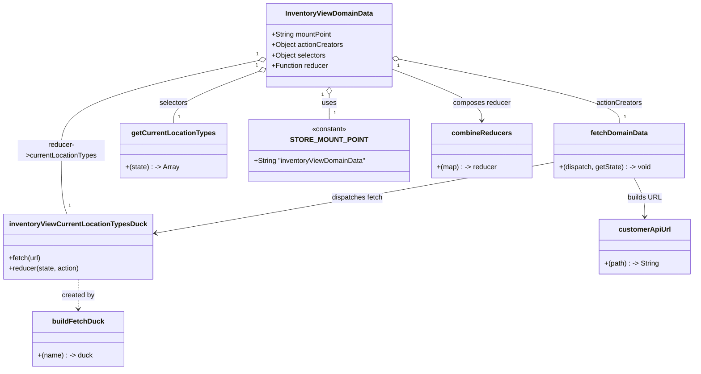

# Diagram: web/portal/src/modules/domain-data/InventoryViewDomainData.js


> Auto-generated by Obscura crawlers

## Diagram 1



### SVG

<svg id="container" width="1567.5625" xmlns="http://www.w3.org/2000/svg" class="classDiagram" height="850" viewBox="0 0 1567.5625 850" role="graphics-document document" aria-roledescription="class"><style>#container{font-family:"trebuchet ms",verdana,arial,sans-serif;font-size:16px;fill:#333;}@keyframes edge-animation-frame{from{stroke-dashoffset:0;}}@keyframes dash{to{stroke-dashoffset:0;}}#container .edge-animation-slow{stroke-dasharray:9,5!important;stroke-dashoffset:900;animation:dash 50s linear infinite;stroke-linecap:round;}#container .edge-animation-fast{stroke-dasharray:9,5!important;stroke-dashoffset:900;animation:dash 20s linear infinite;stroke-linecap:round;}#container .error-icon{fill:#552222;}#container .error-text{fill:#552222;stroke:#552222;}#container .edge-thickness-normal{stroke-width:1px;}#container .edge-thickness-thick{stroke-width:3.5px;}#container .edge-pattern-solid{stroke-dasharray:0;}#container .edge-thickness-invisible{stroke-width:0;fill:none;}#container .edge-pattern-dashed{stroke-dasharray:3;}#container .edge-pattern-dotted{stroke-dasharray:2;}#container .marker{fill:#333333;stroke:#333333;}#container .marker.cross{stroke:#333333;}#container svg{font-family:"trebuchet ms",verdana,arial,sans-serif;font-size:16px;}#container p{margin:0;}#container g.classGroup text{fill:#9370DB;stroke:none;font-family:"trebuchet ms",verdana,arial,sans-serif;font-size:10px;}#container g.classGroup text .title{font-weight:bolder;}#container .nodeLabel,#container .edgeLabel{color:#131300;}#container .edgeLabel .label rect{fill:#ECECFF;}#container .label text{fill:#131300;}#container .labelBkg{background:#ECECFF;}#container .edgeLabel .label span{background:#ECECFF;}#container .classTitle{font-weight:bolder;}#container .node rect,#container .node circle,#container .node ellipse,#container .node polygon,#container .node path{fill:#ECECFF;stroke:#9370DB;stroke-width:1px;}#container .divider{stroke:#9370DB;stroke-width:1;}#container g.clickable{cursor:pointer;}#container g.classGroup rect{fill:#ECECFF;stroke:#9370DB;}#container g.classGroup line{stroke:#9370DB;stroke-width:1;}#container .classLabel .box{stroke:none;stroke-width:0;fill:#ECECFF;opacity:0.5;}#container .classLabel .label{fill:#9370DB;font-size:10px;}#container .relation{stroke:#333333;stroke-width:1;fill:none;}#container .dashed-line{stroke-dasharray:3;}#container .dotted-line{stroke-dasharray:1 2;}#container #compositionStart,#container .composition{fill:#333333!important;stroke:#333333!important;stroke-width:1;}#container #compositionEnd,#container .composition{fill:#333333!important;stroke:#333333!important;stroke-width:1;}#container #dependencyStart,#container .dependency{fill:#333333!important;stroke:#333333!important;stroke-width:1;}#container #dependencyStart,#container .dependency{fill:#333333!important;stroke:#333333!important;stroke-width:1;}#container #extensionStart,#container .extension{fill:transparent!important;stroke:#333333!important;stroke-width:1;}#container #extensionEnd,#container .extension{fill:transparent!important;stroke:#333333!important;stroke-width:1;}#container #aggregationStart,#container .aggregation{fill:transparent!important;stroke:#333333!important;stroke-width:1;}#container #aggregationEnd,#container .aggregation{fill:transparent!important;stroke:#333333!important;stroke-width:1;}#container #lollipopStart,#container .lollipop{fill:#ECECFF!important;stroke:#333333!important;stroke-width:1;}#container #lollipopEnd,#container .lollipop{fill:#ECECFF!important;stroke:#333333!important;stroke-width:1;}#container .edgeTerminals{font-size:11px;line-height:initial;}#container .classTitleText{text-anchor:middle;font-size:18px;fill:#333;}#container .label-icon{display:inline-block;height:1em;overflow:visible;vertical-align:-0.125em;}#container .node .label-icon path{fill:currentColor;stroke:revert;stroke-width:revert;}#container :root{--mermaid-font-family:"trebuchet ms",verdana,arial,sans-serif;}</style><g><defs><marker id="container_class-aggregationStart" class="marker aggregation class" refX="18" refY="7" markerWidth="190" markerHeight="240" orient="auto"><path d="M 18,7 L9,13 L1,7 L9,1 Z"></path></marker></defs><defs><marker id="container_class-aggregationEnd" class="marker aggregation class" refX="1" refY="7" markerWidth="20" markerHeight="28" orient="auto"><path d="M 18,7 L9,13 L1,7 L9,1 Z"></path></marker></defs><defs><marker id="container_class-extensionStart" class="marker extension class" refX="18" refY="7" markerWidth="190" markerHeight="240" orient="auto"><path d="M 1,7 L18,13 V 1 Z"></path></marker></defs><defs><marker id="container_class-extensionEnd" class="marker extension class" refX="1" refY="7" markerWidth="20" markerHeight="28" orient="auto"><path d="M 1,1 V 13 L18,7 Z"></path></marker></defs><defs><marker id="container_class-compositionStart" class="marker composition class" refX="18" refY="7" markerWidth="190" markerHeight="240" orient="auto"><path d="M 18,7 L9,13 L1,7 L9,1 Z"></path></marker></defs><defs><marker id="container_class-compositionEnd" class="marker composition class" refX="1" refY="7" markerWidth="20" markerHeight="28" orient="auto"><path d="M 18,7 L9,13 L1,7 L9,1 Z"></path></marker></defs><defs><marker id="container_class-dependencyStart" class="marker dependency class" refX="6" refY="7" markerWidth="190" markerHeight="240" orient="auto"><path d="M 5,7 L9,13 L1,7 L9,1 Z"></path></marker></defs><defs><marker id="container_class-dependencyEnd" class="marker dependency class" refX="13" refY="7" markerWidth="20" markerHeight="28" orient="auto"><path d="M 18,7 L9,13 L14,7 L9,1 Z"></path></marker></defs><defs><marker id="container_class-lollipopStart" class="marker lollipop class" refX="13" refY="7" markerWidth="190" markerHeight="240" orient="auto"><circle stroke="black" fill="transparent" cx="7" cy="7" r="6"></circle></marker></defs><defs><marker id="container_class-lollipopEnd" class="marker lollipop class" refX="1" refY="7" markerWidth="190" markerHeight="240" orient="auto"><circle stroke="black" fill="transparent" cx="7" cy="7" r="6"></circle></marker></defs><g class="root"><g class="clusters"></g><g class="edgePaths"><path d="M741.434,217.25L741.434,220.542C741.434,223.833,741.434,230.417,741.434,239.875C741.434,249.333,741.434,261.667,741.434,267.833L741.434,274" id="id_InventoryViewDomainData_STORE_MOUNT_POINT_1" class="edge-thickness-normal edge-pattern-solid relation" style=";;;" data-edge="true" data-et="edge" data-id="id_InventoryViewDomainData_STORE_MOUNT_POINT_1" data-points="W3sieCI6NzQxLjQzMzU5Mzc1LCJ5IjoyMDB9LHsieCI6NzQxLjQzMzU5Mzc1LCJ5IjoyMzd9LHsieCI6NzQxLjQzMzU5Mzc1LCJ5IjoyNzR9XQ==" marker-start="url(#container_class-aggregationStart)"></path><path d="M901.203,136.397L983.89,153.165C1066.578,169.932,1231.953,203.466,1314.641,227.9C1397.328,252.333,1397.328,267.667,1397.328,275.333L1397.328,283" id="id_InventoryViewDomainData_fetchDomainData_2" class="edge-thickness-normal edge-pattern-solid relation" style=";;;" data-edge="true" data-et="edge" data-id="id_InventoryViewDomainData_fetchDomainData_2" data-points="W3sieCI6ODg0LjI5Njg3NSwieSI6MTMyLjk2OTMxNjcxMzIxOTY1fSx7IngiOjEzOTcuMzI4MTI1LCJ5IjoyMzd9LHsieCI6MTM5Ny4zMjgxMjUsInkiOjI4M31d" marker-start="url(#container_class-aggregationStart)"></path><path d="M582.443,164.352L550.546,176.46C518.648,188.568,454.853,212.784,422.956,232.559C391.059,252.333,391.059,267.667,391.059,275.333L391.059,283" id="id_InventoryViewDomainData_getCurrentLocationTypes_3" class="edge-thickness-normal edge-pattern-solid relation" style=";;;" data-edge="true" data-et="edge" data-id="id_InventoryViewDomainData_getCurrentLocationTypes_3" data-points="W3sieCI6NTk4LjU3MDMxMjUsInkiOjE1OC4yMjk5NDMzNjQyNTI2fSx7IngiOjM5MS4wNTg1OTM3NSwieSI6MjM3fSx7IngiOjM5MS4wNTg1OTM3NSwieSI6MjgzfV0=" marker-start="url(#container_class-aggregationStart)"></path><path d="M581.723,139.135L507.58,155.446C433.437,171.757,285.15,204.378,211.007,238.856C136.863,273.333,136.863,309.667,136.863,346C136.863,382.333,136.863,418.667,139.053,443C141.243,467.333,145.622,479.667,147.812,485.833L150.001,492" id="id_InventoryViewDomainData_inventoryViewCurrentLocationTypesDuck_4" class="edge-thickness-normal edge-pattern-solid relation" style=";;;" data-edge="true" data-et="edge" data-id="id_InventoryViewDomainData_inventoryViewCurrentLocationTypesDuck_4" data-points="W3sieCI6NTk4LjU3MDMxMjUsInkiOjEzNS40Mjg2Mjk1NzkzNzU4NH0seyJ4IjoxMzYuODYzMjgxMjUsInkiOjIzN30seyJ4IjoxMzYuODYzMjgxMjUsInkiOjM0Nn0seyJ4IjoxMzYuODYzMjgxMjUsInkiOjQ1NX0seyJ4IjoxNTAuMDAxNDI5OTY2NTE3ODYsInkiOjQ5Mn1d" marker-start="url(#container_class-aggregationStart)"></path><path d="M1431.508,409L1435.668,416.667C1439.827,424.333,1448.146,439.667,1452.305,454.5C1456.465,469.333,1456.465,483.667,1456.465,490.833L1456.465,498" id="id_fetchDomainData_customerApiUrl_5" class="edge-thickness-normal edge-pattern-solid relation" style=";;;" data-edge="true" data-et="edge" data-id="id_fetchDomainData_customerApiUrl_5" data-points="W3sieCI6MTQzMS41MDgwNjMzNjAwOTE3LCJ5Ijo0MDl9LHsieCI6MTQ1Ni40NjQ4NDM3NSwieSI6NDU1fSx7IngiOjE0NTYuNDY0ODQzNzUsInkiOjUwNH1d" marker-end="url(#container_class-dependencyEnd)"></path><path d="M1248.27,373.516L1174.702,387.097C1101.135,400.678,954,427.839,804.484,454.916C654.968,481.994,503.07,508.988,427.122,522.485L351.173,535.982" id="id_fetchDomainData_inventoryViewCurrentLocationTypesDuck_6" class="edge-thickness-normal edge-pattern-solid relation" style=";;;" data-edge="true" data-et="edge" data-id="id_fetchDomainData_inventoryViewCurrentLocationTypesDuck_6" data-points="W3sieCI6MTI0OC4yNjk1MzEyNSwieSI6MzczLjUxNjM1NTM0ODg1NTY1fSx7IngiOjgwNi44NjUyMzQzNzUsInkiOjQ1NX0seyJ4IjozNDUuMjY1NjI1LCJ5Ijo1MzcuMDMxODg5Mjc2OTU5NH1d" marker-end="url(#container_class-dependencyEnd)"></path><path d="M176.633,642L176.633,648.167C176.633,654.333,176.633,666.667,176.633,678C176.633,689.333,176.633,699.667,176.633,704.833L176.633,710" id="id_inventoryViewCurrentLocationTypesDuck_buildFetchDuck_7" class="edge-thickness-normal edge-pattern-dashed relation" style=";;;" data-edge="true" data-et="edge" data-id="id_inventoryViewCurrentLocationTypesDuck_buildFetchDuck_7" data-points="W3sieCI6MTc2LjYzMjgxMjUsInkiOjY0Mn0seyJ4IjoxNzYuNjMyODEyNSwieSI6Njc5fSx7IngiOjE3Ni42MzI4MTI1LCJ5Ijo3MTZ9XQ==" marker-end="url(#container_class-dependencyEnd)"></path><path d="M884.297,159.234L917.821,172.195C951.345,185.156,1018.393,211.078,1051.917,230.706C1085.441,250.333,1085.441,263.667,1085.441,270.333L1085.441,277" id="id_InventoryViewDomainData_combineReducers_8" class="edge-thickness-normal edge-pattern-solid relation" style=";;;" data-edge="true" data-et="edge" data-id="id_InventoryViewDomainData_combineReducers_8" data-points="W3sieCI6ODg0LjI5Njg3NSwieSI6MTU5LjIzMzY3NzAxNDk2NjA1fSx7IngiOjEwODUuNDQxNDA2MjUsInkiOjIzN30seyJ4IjoxMDg1LjQ0MTQwNjI1LCJ5IjoyODN9XQ==" marker-end="url(#container_class-dependencyEnd)"></path></g><g class="edgeLabels"><g class="edgeLabel" transform="translate(741.43359375, 237)"><g class="label" data-id="id_InventoryViewDomainData_STORE_MOUNT_POINT_1" transform="translate(-16.4921875, -12)"><foreignObject width="32.984375" height="24"><div xmlns="http://www.w3.org/1999/xhtml" class="labelBkg" style="display: table-cell; white-space: nowrap; line-height: 1.5; max-width: 200px; text-align: center;"><span class="edgeLabel"><p>uses</p></span></div></foreignObject></g></g><g class="edgeLabel" transform="translate(1397.328125, 237)"><g class="label" data-id="id_InventoryViewDomainData_fetchDomainData_2" transform="translate(-52.671875, -12)"><foreignObject width="105.34375" height="24"><div xmlns="http://www.w3.org/1999/xhtml" class="labelBkg" style="display: table-cell; white-space: nowrap; line-height: 1.5; max-width: 200px; text-align: center;"><span class="edgeLabel"><p>actionCreators</p></span></div></foreignObject></g></g><g class="edgeLabel" transform="translate(391.05859375, 237)"><g class="label" data-id="id_InventoryViewDomainData_getCurrentLocationTypes_3" transform="translate(-32.734375, -12)"><foreignObject width="65.46875" height="24"><div xmlns="http://www.w3.org/1999/xhtml" class="labelBkg" style="display: table-cell; white-space: nowrap; line-height: 1.5; max-width: 200px; text-align: center;"><span class="edgeLabel"><p>selectors</p></span></div></foreignObject></g></g><g class="edgeLabel" transform="translate(136.86328125, 346)"><g class="label" data-id="id_InventoryViewDomainData_inventoryViewCurrentLocationTypesDuck_4" transform="translate(-100, -24)"><foreignObject width="200" height="48"><div xmlns="http://www.w3.org/1999/xhtml" class="labelBkg" style="display: table; white-space: break-spaces; line-height: 1.5; max-width: 200px; text-align: center; width: 200px;"><span class="edgeLabel"><p>reducer-&gt;currentLocationTypes</p></span></div></foreignObject></g></g><g class="edgeLabel" transform="translate(1456.46484375, 455)"><g class="label" data-id="id_fetchDomainData_customerApiUrl_5" transform="translate(-38.734375, -12)"><foreignObject width="77.46875" height="24"><div xmlns="http://www.w3.org/1999/xhtml" class="labelBkg" style="display: table-cell; white-space: nowrap; line-height: 1.5; max-width: 200px; text-align: center;"><span class="edgeLabel"><p>builds URL</p></span></div></foreignObject></g></g><g class="edgeLabel" transform="translate(806.865234375, 455)"><g class="label" data-id="id_fetchDomainData_inventoryViewCurrentLocationTypesDuck_6" transform="translate(-59.5390625, -12)"><foreignObject width="119.078125" height="24"><div xmlns="http://www.w3.org/1999/xhtml" class="labelBkg" style="display: table-cell; white-space: nowrap; line-height: 1.5; max-width: 200px; text-align: center;"><span class="edgeLabel"><p>dispatches fetch</p></span></div></foreignObject></g></g><g class="edgeLabel" transform="translate(176.6328125, 679)"><g class="label" data-id="id_inventoryViewCurrentLocationTypesDuck_buildFetchDuck_7" transform="translate(-37.9921875, -12)"><foreignObject width="75.984375" height="24"><div xmlns="http://www.w3.org/1999/xhtml" class="labelBkg" style="display: table-cell; white-space: nowrap; line-height: 1.5; max-width: 200px; text-align: center;"><span class="edgeLabel"><p>created by</p></span></div></foreignObject></g></g><g class="edgeLabel" transform="translate(1085.44140625, 237)"><g class="label" data-id="id_InventoryViewDomainData_combineReducers_8" transform="translate(-66.328125, -12)"><foreignObject width="132.65625" height="24"><div xmlns="http://www.w3.org/1999/xhtml" class="labelBkg" style="display: table-cell; white-space: nowrap; line-height: 1.5; max-width: 200px; text-align: center;"><span class="edgeLabel"><p>composes reducer</p></span></div></foreignObject></g></g><g class="edgeTerminals" transform="translate(726.4335918750002, 217.49999839285712)"><g class="inner" transform="translate(0, 0)"><foreignObject style="width: 9px; height: 12px;"><div xmlns="http://www.w3.org/1999/xhtml" style="display: inline-block; padding-right: 1px; white-space: nowrap;"><span class="edgeLabel">1</span></div></foreignObject></g></g><g class="edgeTerminals" transform="translate(898.4668402198304, 151.14793198930462)"><g class="inner" transform="translate(0, 0)"><foreignObject style="width: 9px; height: 12px;"><div xmlns="http://www.w3.org/1999/xhtml" style="display: inline-block; padding-right: 1px; white-space: nowrap;"><span class="edgeLabel">1</span></div></foreignObject></g></g><g class="edgeTerminals" transform="translate(576.8861072687314, 150.41679566353434)"><g class="inner" transform="translate(0, 0)"><foreignObject style="width: 9px; height: 12px;"><div xmlns="http://www.w3.org/1999/xhtml" style="display: inline-block; padding-right: 1px; white-space: nowrap;"><span class="edgeLabel">1</span></div></foreignObject></g></g><g class="edgeTerminals" transform="translate(578.2561998149562, 124.53887022255513)"><g class="inner" transform="translate(0, 0)"><foreignObject style="width: 9px; height: 12px;"><div xmlns="http://www.w3.org/1999/xhtml" style="display: inline-block; padding-right: 1px; white-space: nowrap;"><span class="edgeLabel">1</span></div></foreignObject></g></g><g class="edgeTerminals" transform="translate(751.4335918749999, 251.49999839285715)"><g class="inner" transform="translate(0, 0)"></g><foreignObject style="width: 9px; height: 12px;"><div xmlns="http://www.w3.org/1999/xhtml" style="display: inline-block; padding-right: 1px; white-space: nowrap;"><span class="edgeLabel">1</span></div></foreignObject></g><g class="edgeTerminals" transform="translate(1407.3281274999997, 260.50000214285717)"><g class="inner" transform="translate(0, 0)"></g><foreignObject style="width: 9px; height: 12px;"><div xmlns="http://www.w3.org/1999/xhtml" style="display: inline-block; padding-right: 1px; white-space: nowrap;"><span class="edgeLabel">1</span></div></foreignObject></g><g class="edgeTerminals" transform="translate(401.0585918749999, 260.49999839285715)"><g class="inner" transform="translate(0, 0)"></g><foreignObject style="width: 9px; height: 12px;"><div xmlns="http://www.w3.org/1999/xhtml" style="display: inline-block; padding-right: 1px; white-space: nowrap;"><span class="edgeLabel">1</span></div></foreignObject></g><g class="edgeTerminals" transform="translate(153.28096851858507, 465.4895550271689)"><g class="inner" transform="translate(0, 0)"></g><foreignObject style="width: 9px; height: 12px;"><div xmlns="http://www.w3.org/1999/xhtml" style="display: inline-block; padding-right: 1px; white-space: nowrap;"><span class="edgeLabel">1</span></div></foreignObject></g></g><g class="nodes"><g class="node default" id="classId-InventoryViewDomainData-0" transform="translate(741.43359375, 104)"><g class="basic label-container"><path d="M-142.86328125 -96 L142.86328125 -96 L142.86328125 96 L-142.86328125 96" stroke="none" stroke-width="0" fill="#ECECFF" style=""></path><path d="M-142.86328125 -96 C-44.505363284053686 -96, 53.85255468189263 -96, 142.86328125 -96 M-142.86328125 -96 C-47.832835809004024 -96, 47.19760963199195 -96, 142.86328125 -96 M142.86328125 -96 C142.86328125 -35.81600629888162, 142.86328125 24.367987402236764, 142.86328125 96 M142.86328125 -96 C142.86328125 -33.789792482551, 142.86328125 28.420415034898, 142.86328125 96 M142.86328125 96 C78.48224869636016 96, 14.101216142720318 96, -142.86328125 96 M142.86328125 96 C29.515026034925114 96, -83.83322918014977 96, -142.86328125 96 M-142.86328125 96 C-142.86328125 26.158605479796407, -142.86328125 -43.68278904040719, -142.86328125 -96 M-142.86328125 96 C-142.86328125 22.55728412360824, -142.86328125 -50.88543175278352, -142.86328125 -96" stroke="#9370DB" stroke-width="1.3" fill="none" stroke-dasharray="0 0" style=""></path></g><g class="annotation-group text" transform="translate(0, -72)"></g><g class="label-group text" transform="translate(-96.9609375, -72)"><g class="label" style="font-weight: bolder" transform="translate(0,-12)"><foreignObject width="193.921875" height="24"><div xmlns="http://www.w3.org/1999/xhtml" style="display: table-cell; white-space: nowrap; line-height: 1.5; max-width: 242px; text-align: center;"><span class="nodeLabel markdown-node-label" style=""><p>InventoryViewDomainData</p></span></div></foreignObject></g></g><g class="members-group text" transform="translate(-130.86328125, -24)"><g class="label" style="" transform="translate(0,-12)"><foreignObject width="139.8125" height="24"><div xmlns="http://www.w3.org/1999/xhtml" style="display: table-cell; white-space: nowrap; line-height: 1.5; max-width: 197px; text-align: center;"><span class="nodeLabel markdown-node-label" style=""><p>+String mountPoint</p></span></div></foreignObject></g><g class="label" style="" transform="translate(0,12)"><foreignObject width="164.765625" height="24"><div xmlns="http://www.w3.org/1999/xhtml" style="display: table-cell; white-space: nowrap; line-height: 1.5; max-width: 222px; text-align: center;"><span class="nodeLabel markdown-node-label" style=""><p>+Object actionCreators</p></span></div></foreignObject></g><g class="label" style="" transform="translate(0,36)"><foreignObject width="124.890625" height="24"><div xmlns="http://www.w3.org/1999/xhtml" style="display: table-cell; white-space: nowrap; line-height: 1.5; max-width: 182px; text-align: center;"><span class="nodeLabel markdown-node-label" style=""><p>+Object selectors</p></span></div></foreignObject></g><g class="label" style="" transform="translate(0,60)"><foreignObject width="130.359375" height="24"><div xmlns="http://www.w3.org/1999/xhtml" style="display: table-cell; white-space: nowrap; line-height: 1.5; max-width: 189px; text-align: center;"><span class="nodeLabel markdown-node-label" style=""><p>+Function reducer</p></span></div></foreignObject></g></g><g class="methods-group text" transform="translate(-130.86328125, 96)"></g><g class="divider" style=""><path d="M-142.86328125 -48 C-41.86233714444997 -48, 59.138606961100066 -48, 142.86328125 -48 M-142.86328125 -48 C-46.66921535814642 -48, 49.524850533707166 -48, 142.86328125 -48" stroke="#9370DB" stroke-width="1.3" fill="none" stroke-dasharray="0 0" style=""></path></g><g class="divider" style=""><path d="M-142.86328125 72 C-38.99836754637637 72, 64.86654615724726 72, 142.86328125 72 M-142.86328125 72 C-76.95547911737273 72, -11.047676984745465 72, 142.86328125 72" stroke="#9370DB" stroke-width="1.3" fill="none" stroke-dasharray="0 0" style=""></path></g></g><g class="node default" id="classId-fetchDomainData-1" transform="translate(1397.328125, 346)"><g class="basic label-container"><path d="M-149.05859375 -63 L149.05859375 -63 L149.05859375 63 L-149.05859375 63" stroke="none" stroke-width="0" fill="#ECECFF" style=""></path><path d="M-149.05859375 -63 C-30.341853151896302 -63, 88.3748874462074 -63, 149.05859375 -63 M-149.05859375 -63 C-45.293131875190284 -63, 58.47232999961943 -63, 149.05859375 -63 M149.05859375 -63 C149.05859375 -24.21234727804925, 149.05859375 14.575305443901499, 149.05859375 63 M149.05859375 -63 C149.05859375 -30.46220489010704, 149.05859375 2.075590219785923, 149.05859375 63 M149.05859375 63 C51.241106860003285 63, -46.57638002999343 63, -149.05859375 63 M149.05859375 63 C62.97099995423012 63, -23.116593841539753 63, -149.05859375 63 M-149.05859375 63 C-149.05859375 15.544675360657443, -149.05859375 -31.910649278685113, -149.05859375 -63 M-149.05859375 63 C-149.05859375 16.021275939967104, -149.05859375 -30.95744812006579, -149.05859375 -63" stroke="#9370DB" stroke-width="1.3" fill="none" stroke-dasharray="0 0" style=""></path></g><g class="annotation-group text" transform="translate(0, -39)"></g><g class="label-group text" transform="translate(-63.3671875, -39)"><g class="label" style="font-weight: bolder" transform="translate(0,-12)"><foreignObject width="126.734375" height="24"><div xmlns="http://www.w3.org/1999/xhtml" style="display: table-cell; white-space: nowrap; line-height: 1.5; max-width: 176px; text-align: center;"><span class="nodeLabel markdown-node-label" style=""><p>fetchDomainData</p></span></div></foreignObject></g></g><g class="members-group text" transform="translate(-137.05859375, 9)"></g><g class="methods-group text" transform="translate(-137.05859375, 39)"><g class="label" style="" transform="translate(0,-12)"><foreignObject width="210.75" height="24"><div xmlns="http://www.w3.org/1999/xhtml" style="display: table-cell; white-space: nowrap; line-height: 1.5; max-width: 282px; text-align: center;"><span class="nodeLabel markdown-node-label" style=""><p>+(dispatch, getState) : -&gt; void</p></span></div></foreignObject></g></g><g class="divider" style=""><path d="M-149.05859375 -15 C-47.549530715800444 -15, 53.95953231839911 -15, 149.05859375 -15 M-149.05859375 -15 C-80.97858811962588 -15, -12.898582489251766 -15, 149.05859375 -15" stroke="#9370DB" stroke-width="1.3" fill="none" stroke-dasharray="0 0" style=""></path></g><g class="divider" style=""><path d="M-149.05859375 9 C-41.61979359431952 9, 65.81900656136096 9, 149.05859375 9 M-149.05859375 9 C-48.632493131193286 9, 51.79360748761343 9, 149.05859375 9" stroke="#9370DB" stroke-width="1.3" fill="none" stroke-dasharray="0 0" style=""></path></g></g><g class="node default" id="classId-getCurrentLocationTypes-2" transform="translate(391.05859375, 346)"><g class="basic label-container"><path d="M-119.1953125 -63 L119.1953125 -63 L119.1953125 63 L-119.1953125 63" stroke="none" stroke-width="0" fill="#ECECFF" style=""></path><path d="M-119.1953125 -63 C-25.07440414471435 -63, 69.0465042105713 -63, 119.1953125 -63 M-119.1953125 -63 C-38.07989893135144 -63, 43.035514637297126 -63, 119.1953125 -63 M119.1953125 -63 C119.1953125 -29.054331028931955, 119.1953125 4.89133794213609, 119.1953125 63 M119.1953125 -63 C119.1953125 -28.547240411549637, 119.1953125 5.905519176900725, 119.1953125 63 M119.1953125 63 C35.3996818256455 63, -48.395948848709 63, -119.1953125 63 M119.1953125 63 C55.33759693800745 63, -8.520118623985098 63, -119.1953125 63 M-119.1953125 63 C-119.1953125 37.234298960936, -119.1953125 11.46859792187201, -119.1953125 -63 M-119.1953125 63 C-119.1953125 27.837245361130407, -119.1953125 -7.325509277739187, -119.1953125 -63" stroke="#9370DB" stroke-width="1.3" fill="none" stroke-dasharray="0 0" style=""></path></g><g class="annotation-group text" transform="translate(0, -39)"></g><g class="label-group text" transform="translate(-91.625, -39)"><g class="label" style="font-weight: bolder" transform="translate(0,-12)"><foreignObject width="183.25" height="24"><div xmlns="http://www.w3.org/1999/xhtml" style="display: table-cell; white-space: nowrap; line-height: 1.5; max-width: 230px; text-align: center;"><span class="nodeLabel markdown-node-label" style=""><p>getCurrentLocationTypes</p></span></div></foreignObject></g></g><g class="members-group text" transform="translate(-107.1953125, 9)"></g><g class="methods-group text" transform="translate(-107.1953125, 39)"><g class="label" style="" transform="translate(0,-12)"><foreignObject width="122.765625" height="24"><div xmlns="http://www.w3.org/1999/xhtml" style="display: table-cell; white-space: nowrap; line-height: 1.5; max-width: 194px; text-align: center;"><span class="nodeLabel markdown-node-label" style=""><p>+(state) : -&gt; Array</p></span></div></foreignObject></g></g><g class="divider" style=""><path d="M-119.1953125 -15 C-71.16513685285483 -15, -23.134961205709672 -15, 119.1953125 -15 M-119.1953125 -15 C-46.78835363903258 -15, 25.618605221934843 -15, 119.1953125 -15" stroke="#9370DB" stroke-width="1.3" fill="none" stroke-dasharray="0 0" style=""></path></g><g class="divider" style=""><path d="M-119.1953125 9 C-53.830080649664964 9, 11.535151200670072 9, 119.1953125 9 M-119.1953125 9 C-67.05271764010888 9, -14.910122780217776 9, 119.1953125 9" stroke="#9370DB" stroke-width="1.3" fill="none" stroke-dasharray="0 0" style=""></path></g></g><g class="node default" id="classId-STORE_MOUNT_POINT-3" transform="translate(741.43359375, 346)"><g class="basic label-container"><path d="M-181.1796875 -72 L181.1796875 -72 L181.1796875 72 L-181.1796875 72" stroke="none" stroke-width="0" fill="#ECECFF" style=""></path><path d="M-181.1796875 -72 C-66.86586462683825 -72, 47.44795824632351 -72, 181.1796875 -72 M-181.1796875 -72 C-107.25700753030294 -72, -33.334327560605885 -72, 181.1796875 -72 M181.1796875 -72 C181.1796875 -34.71228339429179, 181.1796875 2.5754332114164242, 181.1796875 72 M181.1796875 -72 C181.1796875 -34.84869705490054, 181.1796875 2.302605890198919, 181.1796875 72 M181.1796875 72 C69.9845878718238 72, -41.21051175635239 72, -181.1796875 72 M181.1796875 72 C72.88673343894418 72, -35.40622062211165 72, -181.1796875 72 M-181.1796875 72 C-181.1796875 32.23724133558174, -181.1796875 -7.525517328836514, -181.1796875 -72 M-181.1796875 72 C-181.1796875 21.261975076959885, -181.1796875 -29.47604984608023, -181.1796875 -72" stroke="#9370DB" stroke-width="1.3" fill="none" stroke-dasharray="0 0" style=""></path></g><g class="annotation-group text" transform="translate(-40.4921875, -48)"><g class="label" style="" transform="translate(0,-12)"><foreignObject width="80.984375" height="24"><div xmlns="http://www.w3.org/1999/xhtml" style="display: table-cell; white-space: nowrap; line-height: 1.5; max-width: 131px; text-align: center;"><span class="nodeLabel markdown-node-label" style=""><p>«constant»</p></span></div></foreignObject></g></g><g class="label-group text" transform="translate(-79.90625, -24)"><g class="label" style="font-weight: bolder" transform="translate(0,-12)"><foreignObject width="159.8125" height="24"><div xmlns="http://www.w3.org/1999/xhtml" style="display: table-cell; white-space: nowrap; line-height: 1.5; max-width: 209px; text-align: center;"><span class="nodeLabel markdown-node-label" style=""><p>STORE_MOUNT_POINT</p></span></div></foreignObject></g></g><g class="members-group text" transform="translate(-169.1796875, 24)"><g class="label" style="" transform="translate(0,-12)"><foreignObject width="258.453125" height="24"><div xmlns="http://www.w3.org/1999/xhtml" style="display: table-cell; white-space: nowrap; line-height: 1.5; max-width: 316px; text-align: center;"><span class="nodeLabel markdown-node-label" style=""><p>+String "inventoryViewDomainData"</p></span></div></foreignObject></g></g><g class="methods-group text" transform="translate(-169.1796875, 72)"></g><g class="divider" style=""><path d="M-181.1796875 0 C-68.22375861980433 0, 44.73217026039134 0, 181.1796875 0 M-181.1796875 0 C-79.98367051791116 0, 21.21234646417767 0, 181.1796875 0" stroke="#9370DB" stroke-width="1.3" fill="none" stroke-dasharray="0 0" style=""></path></g><g class="divider" style=""><path d="M-181.1796875 48 C-54.02072270940205 48, 73.1382420811959 48, 181.1796875 48 M-181.1796875 48 C-71.3828928047602 48, 38.41390189047959 48, 181.1796875 48" stroke="#9370DB" stroke-width="1.3" fill="none" stroke-dasharray="0 0" style=""></path></g></g><g class="node default" id="classId-inventoryViewCurrentLocationTypesDuck-4" transform="translate(176.6328125, 567)"><g class="basic label-container"><path d="M-168.6328125 -75 L168.6328125 -75 L168.6328125 75 L-168.6328125 75" stroke="none" stroke-width="0" fill="#ECECFF" style=""></path><path d="M-168.6328125 -75 C-84.7697255985226 -75, -0.9066386970451958 -75, 168.6328125 -75 M-168.6328125 -75 C-40.653884347528745 -75, 87.32504380494251 -75, 168.6328125 -75 M168.6328125 -75 C168.6328125 -33.372108853636, 168.6328125 8.255782292728, 168.6328125 75 M168.6328125 -75 C168.6328125 -16.67362133974001, 168.6328125 41.65275732051998, 168.6328125 75 M168.6328125 75 C90.30129204002431 75, 11.969771580048615 75, -168.6328125 75 M168.6328125 75 C98.42096642385077 75, 28.209120347701543 75, -168.6328125 75 M-168.6328125 75 C-168.6328125 21.2948286434536, -168.6328125 -32.4103427130928, -168.6328125 -75 M-168.6328125 75 C-168.6328125 44.41356634857137, -168.6328125 13.827132697142744, -168.6328125 -75" stroke="#9370DB" stroke-width="1.3" fill="none" stroke-dasharray="0 0" style=""></path></g><g class="annotation-group text" transform="translate(0, -51)"></g><g class="label-group text" transform="translate(-150.015625, -51)"><g class="label" style="font-weight: bolder" transform="translate(0,-12)"><foreignObject width="300.03125" height="24"><div xmlns="http://www.w3.org/1999/xhtml" style="display: table-cell; white-space: nowrap; line-height: 1.5; max-width: 346px; text-align: center;"><span class="nodeLabel markdown-node-label" style=""><p>inventoryViewCurrentLocationTypesDuck</p></span></div></foreignObject></g></g><g class="members-group text" transform="translate(-156.6328125, -3)"></g><g class="methods-group text" transform="translate(-156.6328125, 27)"><g class="label" style="" transform="translate(0,-12)"><foreignObject width="74.78125" height="24"><div xmlns="http://www.w3.org/1999/xhtml" style="display: table-cell; white-space: nowrap; line-height: 1.5; max-width: 132px; text-align: center;"><span class="nodeLabel markdown-node-label" style=""><p>+fetch(url)</p></span></div></foreignObject></g><g class="label" style="" transform="translate(0,12)"><foreignObject width="163.25" height="24"><div xmlns="http://www.w3.org/1999/xhtml" style="display: table-cell; white-space: nowrap; line-height: 1.5; max-width: 221px; text-align: center;"><span class="nodeLabel markdown-node-label" style=""><p>+reducer(state, action)</p></span></div></foreignObject></g></g><g class="divider" style=""><path d="M-168.6328125 -27 C-91.75046627367054 -27, -14.86812004734108 -27, 168.6328125 -27 M-168.6328125 -27 C-89.93956802676809 -27, -11.246323553536172 -27, 168.6328125 -27" stroke="#9370DB" stroke-width="1.3" fill="none" stroke-dasharray="0 0" style=""></path></g><g class="divider" style=""><path d="M-168.6328125 -3 C-94.10096867945438 -3, -19.569124858908765 -3, 168.6328125 -3 M-168.6328125 -3 C-82.51050163483133 -3, 3.611809230337343 -3, 168.6328125 -3" stroke="#9370DB" stroke-width="1.3" fill="none" stroke-dasharray="0 0" style=""></path></g></g><g class="node default" id="classId-buildFetchDuck-5" transform="translate(176.6328125, 779)"><g class="basic label-container"><path d="M-102.3984375 -63 L102.3984375 -63 L102.3984375 63 L-102.3984375 63" stroke="none" stroke-width="0" fill="#ECECFF" style=""></path><path d="M-102.3984375 -63 C-30.630630059896674 -63, 41.13717738020665 -63, 102.3984375 -63 M-102.3984375 -63 C-22.44015293705111 -63, 57.51813162589778 -63, 102.3984375 -63 M102.3984375 -63 C102.3984375 -30.32967743852518, 102.3984375 2.3406451229496383, 102.3984375 63 M102.3984375 -63 C102.3984375 -30.472390460720696, 102.3984375 2.0552190785586077, 102.3984375 63 M102.3984375 63 C29.283821062559454 63, -43.83079537488109 63, -102.3984375 63 M102.3984375 63 C33.47828395372015 63, -35.4418695925597 63, -102.3984375 63 M-102.3984375 63 C-102.3984375 16.17859357116766, -102.3984375 -30.64281285766468, -102.3984375 -63 M-102.3984375 63 C-102.3984375 29.88534667785712, -102.3984375 -3.2293066442857565, -102.3984375 -63" stroke="#9370DB" stroke-width="1.3" fill="none" stroke-dasharray="0 0" style=""></path></g><g class="annotation-group text" transform="translate(0, -39)"></g><g class="label-group text" transform="translate(-56.203125, -39)"><g class="label" style="font-weight: bolder" transform="translate(0,-12)"><foreignObject width="112.40625" height="24"><div xmlns="http://www.w3.org/1999/xhtml" style="display: table-cell; white-space: nowrap; line-height: 1.5; max-width: 162px; text-align: center;"><span class="nodeLabel markdown-node-label" style=""><p>buildFetchDuck</p></span></div></foreignObject></g></g><g class="members-group text" transform="translate(-90.3984375, 9)"></g><g class="methods-group text" transform="translate(-90.3984375, 39)"><g class="label" style="" transform="translate(0,-12)"><foreignObject width="124.59375" height="24"><div xmlns="http://www.w3.org/1999/xhtml" style="display: table-cell; white-space: nowrap; line-height: 1.5; max-width: 197px; text-align: center;"><span class="nodeLabel markdown-node-label" style=""><p>+(name) : -&gt; duck</p></span></div></foreignObject></g></g><g class="divider" style=""><path d="M-102.3984375 -15 C-21.737682319854756 -15, 58.92307286029049 -15, 102.3984375 -15 M-102.3984375 -15 C-30.45996010810603 -15, 41.47851728378794 -15, 102.3984375 -15" stroke="#9370DB" stroke-width="1.3" fill="none" stroke-dasharray="0 0" style=""></path></g><g class="divider" style=""><path d="M-102.3984375 9 C-59.09946822514057 9, -15.800498950281138 9, 102.3984375 9 M-102.3984375 9 C-32.458079671813934 9, 37.48227815637213 9, 102.3984375 9" stroke="#9370DB" stroke-width="1.3" fill="none" stroke-dasharray="0 0" style=""></path></g></g><g class="node default" id="classId-customerApiUrl-6" transform="translate(1456.46484375, 567)"><g class="basic label-container"><path d="M-103.09765625 -63 L103.09765625 -63 L103.09765625 63 L-103.09765625 63" stroke="none" stroke-width="0" fill="#ECECFF" style=""></path><path d="M-103.09765625 -63 C-26.989486567330147 -63, 49.11868311533971 -63, 103.09765625 -63 M-103.09765625 -63 C-39.68557500074551 -63, 23.726506248508983 -63, 103.09765625 -63 M103.09765625 -63 C103.09765625 -34.94628670918794, 103.09765625 -6.892573418375875, 103.09765625 63 M103.09765625 -63 C103.09765625 -26.564263315588036, 103.09765625 9.871473368823928, 103.09765625 63 M103.09765625 63 C23.380872483344092 63, -56.335911283311816 63, -103.09765625 63 M103.09765625 63 C55.558693288757816 63, 8.019730327515632 63, -103.09765625 63 M-103.09765625 63 C-103.09765625 27.88907010109606, -103.09765625 -7.2218597978078805, -103.09765625 -63 M-103.09765625 63 C-103.09765625 21.504770520807895, -103.09765625 -19.99045895838421, -103.09765625 -63" stroke="#9370DB" stroke-width="1.3" fill="none" stroke-dasharray="0 0" style=""></path></g><g class="annotation-group text" transform="translate(0, -39)"></g><g class="label-group text" transform="translate(-56.7421875, -39)"><g class="label" style="font-weight: bolder" transform="translate(0,-12)"><foreignObject width="113.484375" height="24"><div xmlns="http://www.w3.org/1999/xhtml" style="display: table-cell; white-space: nowrap; line-height: 1.5; max-width: 163px; text-align: center;"><span class="nodeLabel markdown-node-label" style=""><p>customerApiUrl</p></span></div></foreignObject></g></g><g class="members-group text" transform="translate(-91.09765625, 9)"></g><g class="methods-group text" transform="translate(-91.09765625, 39)"><g class="label" style="" transform="translate(0,-12)"><foreignObject width="125.453125" height="24"><div xmlns="http://www.w3.org/1999/xhtml" style="display: table-cell; white-space: nowrap; line-height: 1.5; max-width: 197px; text-align: center;"><span class="nodeLabel markdown-node-label" style=""><p>+(path) : -&gt; String</p></span></div></foreignObject></g></g><g class="divider" style=""><path d="M-103.09765625 -15 C-51.795144857980254 -15, -0.49263346596050894 -15, 103.09765625 -15 M-103.09765625 -15 C-49.92027047420639 -15, 3.25711530158722 -15, 103.09765625 -15" stroke="#9370DB" stroke-width="1.3" fill="none" stroke-dasharray="0 0" style=""></path></g><g class="divider" style=""><path d="M-103.09765625 9 C-49.651953419708256 9, 3.7937494105834872 9, 103.09765625 9 M-103.09765625 9 C-52.075466718705194 9, -1.0532771874103872 9, 103.09765625 9" stroke="#9370DB" stroke-width="1.3" fill="none" stroke-dasharray="0 0" style=""></path></g></g><g class="node default" id="classId-combineReducers-7" transform="translate(1085.44140625, 346)"><g class="basic label-container"><path d="M-112.828125 -63 L112.828125 -63 L112.828125 63 L-112.828125 63" stroke="none" stroke-width="0" fill="#ECECFF" style=""></path><path d="M-112.828125 -63 C-63.69497433549946 -63, -14.561823670998919 -63, 112.828125 -63 M-112.828125 -63 C-30.123664683201994 -63, 52.58079563359601 -63, 112.828125 -63 M112.828125 -63 C112.828125 -25.35724754860245, 112.828125 12.285504902795097, 112.828125 63 M112.828125 -63 C112.828125 -18.51508582335567, 112.828125 25.969828353288662, 112.828125 63 M112.828125 63 C25.9096931306661 63, -61.0087387386678 63, -112.828125 63 M112.828125 63 C35.940291222699315 63, -40.94754255460137 63, -112.828125 63 M-112.828125 63 C-112.828125 20.1493604529785, -112.828125 -22.701279094043002, -112.828125 -63 M-112.828125 63 C-112.828125 16.362604154911068, -112.828125 -30.274791690177864, -112.828125 -63" stroke="#9370DB" stroke-width="1.3" fill="none" stroke-dasharray="0 0" style=""></path></g><g class="annotation-group text" transform="translate(0, -39)"></g><g class="label-group text" transform="translate(-64.84375, -39)"><g class="label" style="font-weight: bolder" transform="translate(0,-12)"><foreignObject width="129.6875" height="24"><div xmlns="http://www.w3.org/1999/xhtml" style="display: table-cell; white-space: nowrap; line-height: 1.5; max-width: 179px; text-align: center;"><span class="nodeLabel markdown-node-label" style=""><p>combineReducers</p></span></div></foreignObject></g></g><g class="members-group text" transform="translate(-100.828125, 9)"></g><g class="methods-group text" transform="translate(-100.828125, 39)"><g class="label" style="" transform="translate(0,-12)"><foreignObject width="136.8125" height="24"><div xmlns="http://www.w3.org/1999/xhtml" style="display: table-cell; white-space: nowrap; line-height: 1.5; max-width: 209px; text-align: center;"><span class="nodeLabel markdown-node-label" style=""><p>+(map) : -&gt; reducer</p></span></div></foreignObject></g></g><g class="divider" style=""><path d="M-112.828125 -15 C-66.40567721673011 -15, -19.983229433460224 -15, 112.828125 -15 M-112.828125 -15 C-58.869313156033165 -15, -4.91050131206633 -15, 112.828125 -15" stroke="#9370DB" stroke-width="1.3" fill="none" stroke-dasharray="0 0" style=""></path></g><g class="divider" style=""><path d="M-112.828125 9 C-45.22130221691732 9, 22.385520566165354 9, 112.828125 9 M-112.828125 9 C-43.171950699673914 9, 26.48422360065217 9, 112.828125 9" stroke="#9370DB" stroke-width="1.3" fill="none" stroke-dasharray="0 0" style=""></path></g></g></g></g></g></svg>

## Diagram 2

```mermaid
flowchart LR
    A[getState()] --> B{state.location.payload.locationId}
    B -- falsy --> C[no-op return]
    B -- truthy --> D[customerApiUrl(`/entity-inventory/location/${locationId}/search/options/current-location-type`)]
    D --> E[inventoryViewCurrentLocationTypesDuck.fetch(urlCurrentLocationType)]
    F[dispatch(...)] --> E
    subgraph dispatch_flow
        A
        B
        D
        F
    end
    B -->|true| F
```

> SVG rendering failed for this diagram.
