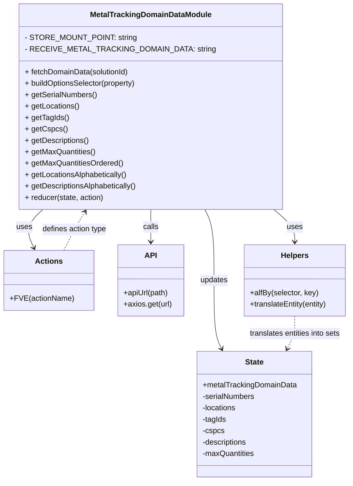

# Diagram: web/portal/src/modules/domain-data/MetalTrackingDomainData.js


> Auto-generated by Obscura crawlers

## Diagram 1



### SVG

<svg id="container" width="734.5703125" xmlns="http://www.w3.org/2000/svg" class="classDiagram" height="1010" viewBox="0 0 734.5703125 1010" role="graphics-document document" aria-roledescription="class"><style>#container{font-family:"trebuchet ms",verdana,arial,sans-serif;font-size:16px;fill:#333;}@keyframes edge-animation-frame{from{stroke-dashoffset:0;}}@keyframes dash{to{stroke-dashoffset:0;}}#container .edge-animation-slow{stroke-dasharray:9,5!important;stroke-dashoffset:900;animation:dash 50s linear infinite;stroke-linecap:round;}#container .edge-animation-fast{stroke-dasharray:9,5!important;stroke-dashoffset:900;animation:dash 20s linear infinite;stroke-linecap:round;}#container .error-icon{fill:#552222;}#container .error-text{fill:#552222;stroke:#552222;}#container .edge-thickness-normal{stroke-width:1px;}#container .edge-thickness-thick{stroke-width:3.5px;}#container .edge-pattern-solid{stroke-dasharray:0;}#container .edge-thickness-invisible{stroke-width:0;fill:none;}#container .edge-pattern-dashed{stroke-dasharray:3;}#container .edge-pattern-dotted{stroke-dasharray:2;}#container .marker{fill:#333333;stroke:#333333;}#container .marker.cross{stroke:#333333;}#container svg{font-family:"trebuchet ms",verdana,arial,sans-serif;font-size:16px;}#container p{margin:0;}#container g.classGroup text{fill:#9370DB;stroke:none;font-family:"trebuchet ms",verdana,arial,sans-serif;font-size:10px;}#container g.classGroup text .title{font-weight:bolder;}#container .nodeLabel,#container .edgeLabel{color:#131300;}#container .edgeLabel .label rect{fill:#ECECFF;}#container .label text{fill:#131300;}#container .labelBkg{background:#ECECFF;}#container .edgeLabel .label span{background:#ECECFF;}#container .classTitle{font-weight:bolder;}#container .node rect,#container .node circle,#container .node ellipse,#container .node polygon,#container .node path{fill:#ECECFF;stroke:#9370DB;stroke-width:1px;}#container .divider{stroke:#9370DB;stroke-width:1;}#container g.clickable{cursor:pointer;}#container g.classGroup rect{fill:#ECECFF;stroke:#9370DB;}#container g.classGroup line{stroke:#9370DB;stroke-width:1;}#container .classLabel .box{stroke:none;stroke-width:0;fill:#ECECFF;opacity:0.5;}#container .classLabel .label{fill:#9370DB;font-size:10px;}#container .relation{stroke:#333333;stroke-width:1;fill:none;}#container .dashed-line{stroke-dasharray:3;}#container .dotted-line{stroke-dasharray:1 2;}#container #compositionStart,#container .composition{fill:#333333!important;stroke:#333333!important;stroke-width:1;}#container #compositionEnd,#container .composition{fill:#333333!important;stroke:#333333!important;stroke-width:1;}#container #dependencyStart,#container .dependency{fill:#333333!important;stroke:#333333!important;stroke-width:1;}#container #dependencyStart,#container .dependency{fill:#333333!important;stroke:#333333!important;stroke-width:1;}#container #extensionStart,#container .extension{fill:transparent!important;stroke:#333333!important;stroke-width:1;}#container #extensionEnd,#container .extension{fill:transparent!important;stroke:#333333!important;stroke-width:1;}#container #aggregationStart,#container .aggregation{fill:transparent!important;stroke:#333333!important;stroke-width:1;}#container #aggregationEnd,#container .aggregation{fill:transparent!important;stroke:#333333!important;stroke-width:1;}#container #lollipopStart,#container .lollipop{fill:#ECECFF!important;stroke:#333333!important;stroke-width:1;}#container #lollipopEnd,#container .lollipop{fill:#ECECFF!important;stroke:#333333!important;stroke-width:1;}#container .edgeTerminals{font-size:11px;line-height:initial;}#container .classTitleText{text-anchor:middle;font-size:18px;fill:#333;}#container .label-icon{display:inline-block;height:1em;overflow:visible;vertical-align:-0.125em;}#container .node .label-icon path{fill:currentColor;stroke:revert;stroke-width:revert;}#container :root{--mermaid-font-family:"trebuchet ms",verdana,arial,sans-serif;}</style><g><defs><marker id="container_class-aggregationStart" class="marker aggregation class" refX="18" refY="7" markerWidth="190" markerHeight="240" orient="auto"><path d="M 18,7 L9,13 L1,7 L9,1 Z"></path></marker></defs><defs><marker id="container_class-aggregationEnd" class="marker aggregation class" refX="1" refY="7" markerWidth="20" markerHeight="28" orient="auto"><path d="M 18,7 L9,13 L1,7 L9,1 Z"></path></marker></defs><defs><marker id="container_class-extensionStart" class="marker extension class" refX="18" refY="7" markerWidth="190" markerHeight="240" orient="auto"><path d="M 1,7 L18,13 V 1 Z"></path></marker></defs><defs><marker id="container_class-extensionEnd" class="marker extension class" refX="1" refY="7" markerWidth="20" markerHeight="28" orient="auto"><path d="M 1,1 V 13 L18,7 Z"></path></marker></defs><defs><marker id="container_class-compositionStart" class="marker composition class" refX="18" refY="7" markerWidth="190" markerHeight="240" orient="auto"><path d="M 18,7 L9,13 L1,7 L9,1 Z"></path></marker></defs><defs><marker id="container_class-compositionEnd" class="marker composition class" refX="1" refY="7" markerWidth="20" markerHeight="28" orient="auto"><path d="M 18,7 L9,13 L1,7 L9,1 Z"></path></marker></defs><defs><marker id="container_class-dependencyStart" class="marker dependency class" refX="6" refY="7" markerWidth="190" markerHeight="240" orient="auto"><path d="M 5,7 L9,13 L1,7 L9,1 Z"></path></marker></defs><defs><marker id="container_class-dependencyEnd" class="marker dependency class" refX="13" refY="7" markerWidth="20" markerHeight="28" orient="auto"><path d="M 18,7 L9,13 L14,7 L9,1 Z"></path></marker></defs><defs><marker id="container_class-lollipopStart" class="marker lollipop class" refX="13" refY="7" markerWidth="190" markerHeight="240" orient="auto"><circle stroke="black" fill="transparent" cx="7" cy="7" r="6"></circle></marker></defs><defs><marker id="container_class-lollipopEnd" class="marker lollipop class" refX="1" refY="7" markerWidth="190" markerHeight="240" orient="auto"><circle stroke="black" fill="transparent" cx="7" cy="7" r="6"></circle></marker></defs><g class="root"><g class="clusters"></g><g class="edgePaths"><path d="M84.736,440L78.305,446.167C71.875,452.333,59.014,464.667,56.015,478.096C53.016,491.525,59.879,506.05,63.311,513.313L66.742,520.575" id="id_MetalTrackingDomainDataModule_Actions_1" class="edge-thickness-normal edge-pattern-solid relation" style=";;;" data-edge="true" data-et="edge" data-id="id_MetalTrackingDomainDataModule_Actions_1" data-points="W3sieCI6ODQuNzM1OTAzNTMyNjA4NjksInkiOjQ0MH0seyJ4Ijo0Ni4xNTIzNDM3NSwieSI6NDc3fSx7IngiOjY5LjMwNTY2NDA2MjUsInkiOjUyNn1d" marker-end="url(#container_class-dependencyEnd)"></path><path d="M309.98,440L309.98,446.167C309.98,452.333,309.98,464.667,309.98,476C309.98,487.333,309.98,497.667,309.98,502.833L309.98,508" id="id_MetalTrackingDomainDataModule_API_2" class="edge-thickness-normal edge-pattern-solid relation" style=";;;" data-edge="true" data-et="edge" data-id="id_MetalTrackingDomainDataModule_API_2" data-points="W3sieCI6MzA5Ljk4MDQ2ODc1LCJ5Ijo0NDB9LHsieCI6MzA5Ljk4MDQ2ODc1LCJ5Ijo0Nzd9LHsieCI6MzA5Ljk4MDQ2ODc1LCJ5Ijo1MTR9XQ==" marker-end="url(#container_class-dependencyEnd)"></path><path d="M564.105,433.25L572.961,440.541C581.816,447.833,599.527,462.417,608.383,474.875C617.238,487.333,617.238,497.667,617.238,502.833L617.238,508" id="id_MetalTrackingDomainDataModule_Helpers_3" class="edge-thickness-normal edge-pattern-solid relation" style=";;;" data-edge="true" data-et="edge" data-id="id_MetalTrackingDomainDataModule_Helpers_3" data-points="W3sieCI6NTY0LjEwNTQ2ODc1LCJ5Ijo0MzMuMjQ5NzY0ODA0NTk3MTN9LHsieCI6NjE3LjIzODI4MTI1LCJ5Ijo0Nzd9LHsieCI6NjE3LjIzODI4MTI1LCJ5Ijo1MTR9XQ==" marker-end="url(#container_class-dependencyEnd)"></path><path d="M423.967,440L427.221,446.167C430.475,452.333,436.984,464.667,440.238,489.5C443.492,514.333,443.492,551.667,443.492,589C443.492,626.333,443.492,663.667,446.205,687.611C448.918,711.555,454.343,722.109,457.056,727.386L459.769,732.664" id="id_MetalTrackingDomainDataModule_State_4" class="edge-thickness-normal edge-pattern-solid relation" style=";;;" data-edge="true" data-et="edge" data-id="id_MetalTrackingDomainDataModule_State_4" data-points="W3sieCI6NDIzLjk2Njc1ODI3NTY5MTcsInkiOjQ0MH0seyJ4Ijo0NDMuNDkyMTg3NSwieSI6NDc3fSx7IngiOjQ0My40OTIxODc1LCJ5Ijo1ODl9LHsieCI6NDQzLjQ5MjE4NzUsInkiOjcwMX0seyJ4Ijo0NjIuNTExNzMwMzA2OTUyNjQsInkiOjczOH1d" marker-end="url(#container_class-dependencyEnd)"></path><path d="M617.238,664L617.238,670.167C617.238,676.333,617.238,688.667,614.526,700.111C611.813,711.555,606.387,722.109,603.675,727.386L600.962,732.664" id="id_Helpers_State_5" class="edge-thickness-normal edge-pattern-dashed relation" style=";;;" data-edge="true" data-et="edge" data-id="id_Helpers_State_5" data-points="W3sieCI6NjE3LjIzODI4MTI1LCJ5Ijo2NjR9LHsieCI6NjE3LjIzODI4MTI1LCJ5Ijo3MDF9LHsieCI6NTk4LjIxODczODQ0MzA0NzMsInkiOjczOH1d" marker-end="url(#container_class-dependencyEnd)"></path><path d="M128.843,526L132.702,517.833C136.561,509.667,144.278,493.333,151.458,479.848C158.638,466.363,165.28,455.726,168.601,450.408L171.923,445.089" id="id_Actions_MetalTrackingDomainDataModule_6" class="edge-thickness-normal edge-pattern-dashed relation" style=";;;" data-edge="true" data-et="edge" data-id="id_Actions_MetalTrackingDomainDataModule_6" data-points="W3sieCI6MTI4Ljg0Mjc3MzQzNzUsInkiOjUyNn0seyJ4IjoxNTEuOTk2MDkzNzUsInkiOjQ3N30seyJ4IjoxNzUuMTAwNTI4MDM4NTM3NTYsInkiOjQ0MH1d" marker-end="url(#container_class-dependencyEnd)"></path></g><g class="edgeLabels"><g class="edgeLabel" transform="translate(46.15234375, 477)"><g class="label" data-id="id_MetalTrackingDomainDataModule_Actions_1" transform="translate(-16.4921875, -12)"><foreignObject width="32.984375" height="24"><div xmlns="http://www.w3.org/1999/xhtml" class="labelBkg" style="display: table-cell; white-space: nowrap; line-height: 1.5; max-width: 200px; text-align: center;"><span class="edgeLabel"><p>uses</p></span></div></foreignObject></g></g><g class="edgeLabel" transform="translate(309.98046875, 477)"><g class="label" data-id="id_MetalTrackingDomainDataModule_API_2" transform="translate(-16.4453125, -12)"><foreignObject width="32.890625" height="24"><div xmlns="http://www.w3.org/1999/xhtml" class="labelBkg" style="display: table-cell; white-space: nowrap; line-height: 1.5; max-width: 200px; text-align: center;"><span class="edgeLabel"><p>calls</p></span></div></foreignObject></g></g><g class="edgeLabel" transform="translate(617.23828125, 477)"><g class="label" data-id="id_MetalTrackingDomainDataModule_Helpers_3" transform="translate(-16.4921875, -12)"><foreignObject width="32.984375" height="24"><div xmlns="http://www.w3.org/1999/xhtml" class="labelBkg" style="display: table-cell; white-space: nowrap; line-height: 1.5; max-width: 200px; text-align: center;"><span class="edgeLabel"><p>uses</p></span></div></foreignObject></g></g><g class="edgeLabel" transform="translate(443.4921875, 589)"><g class="label" data-id="id_MetalTrackingDomainDataModule_State_4" transform="translate(-29.4140625, -12)"><foreignObject width="58.828125" height="24"><div xmlns="http://www.w3.org/1999/xhtml" class="labelBkg" style="display: table-cell; white-space: nowrap; line-height: 1.5; max-width: 200px; text-align: center;"><span class="edgeLabel"><p>updates</p></span></div></foreignObject></g></g><g class="edgeLabel" transform="translate(617.23828125, 701)"><g class="label" data-id="id_Helpers_State_5" transform="translate(-98.890625, -12)"><foreignObject width="197.78125" height="24"><div xmlns="http://www.w3.org/1999/xhtml" class="labelBkg" style="display: table-cell; white-space: nowrap; line-height: 1.5; max-width: 200px; text-align: center;"><span class="edgeLabel"><p>translates entities into sets</p></span></div></foreignObject></g></g><g class="edgeLabel" transform="translate(149.73746, 481.78001)"><g class="label" data-id="id_Actions_MetalTrackingDomainDataModule_6" transform="translate(-69.3515625, -12)"><foreignObject width="138.703125" height="24"><div xmlns="http://www.w3.org/1999/xhtml" class="labelBkg" style="display: table-cell; white-space: nowrap; line-height: 1.5; max-width: 200px; text-align: center;"><span class="edgeLabel"><p>defines action type</p></span></div></foreignObject></g></g></g><g class="nodes"><g class="node default" id="classId-MetalTrackingDomainDataModule-0" transform="translate(309.98046875, 224)"><g class="basic label-container"><path d="M-254.125 -216 L254.125 -216 L254.125 216 L-254.125 216" stroke="none" stroke-width="0" fill="#ECECFF" style=""></path><path d="M-254.125 -216 C-76.55254692277421 -216, 101.01990615445158 -216, 254.125 -216 M-254.125 -216 C-102.84500508557187 -216, 48.43498982885626 -216, 254.125 -216 M254.125 -216 C254.125 -66.9755738988651, 254.125 82.04885220226981, 254.125 216 M254.125 -216 C254.125 -50.26844265109915, 254.125 115.4631146978017, 254.125 216 M254.125 216 C144.28550337295678 216, 34.44600674591359 216, -254.125 216 M254.125 216 C80.73346569639818 216, -92.65806860720363 216, -254.125 216 M-254.125 216 C-254.125 61.989060673287725, -254.125 -92.02187865342455, -254.125 -216 M-254.125 216 C-254.125 56.92077225742523, -254.125 -102.15845548514955, -254.125 -216" stroke="#9370DB" stroke-width="1.3" fill="none" stroke-dasharray="0 0" style=""></path></g><g class="annotation-group text" transform="translate(0, -192)"></g><g class="label-group text" transform="translate(-123.171875, -192)"><g class="label" style="font-weight: bolder" transform="translate(0,-12)"><foreignObject width="246.34375" height="24"><div xmlns="http://www.w3.org/1999/xhtml" style="display: table-cell; white-space: nowrap; line-height: 1.5; max-width: 293px; text-align: center;"><span class="nodeLabel markdown-node-label" style=""><p>MetalTrackingDomainDataModule</p></span></div></foreignObject></g></g><g class="members-group text" transform="translate(-242.125, -144)"><g class="label" style="" transform="translate(0,-12)"><foreignObject width="218.4375" height="24"><div xmlns="http://www.w3.org/1999/xhtml" style="display: table-cell; white-space: nowrap; line-height: 1.5; max-width: 276px; text-align: center;"><span class="nodeLabel markdown-node-label" style=""><p>- STORE_MOUNT_POINT: string</p></span></div></foreignObject></g><g class="label" style="" transform="translate(0,12)"><foreignObject width="361.078125" height="24"><div xmlns="http://www.w3.org/1999/xhtml" style="display: table-cell; white-space: nowrap; line-height: 1.5; max-width: 419px; text-align: center;"><span class="nodeLabel markdown-node-label" style=""><p>- RECEIVE_METAL_TRACKING_DOMAIN_DATA: string</p></span></div></foreignObject></g></g><g class="methods-group text" transform="translate(-242.125, -72)"><g class="label" style="" transform="translate(0,-12)"><foreignObject width="222.359375" height="24"><div xmlns="http://www.w3.org/1999/xhtml" style="display: table-cell; white-space: nowrap; line-height: 1.5; max-width: 280px; text-align: center;"><span class="nodeLabel markdown-node-label" style=""><p>+ fetchDomainData(solutionId)</p></span></div></foreignObject></g><g class="label" style="" transform="translate(0,12)"><foreignObject width="239.140625" height="24"><div xmlns="http://www.w3.org/1999/xhtml" style="display: table-cell; white-space: nowrap; line-height: 1.5; max-width: 297px; text-align: center;"><span class="nodeLabel markdown-node-label" style=""><p>+ buildOptionsSelector(property)</p></span></div></foreignObject></g><g class="label" style="" transform="translate(0,36)"><foreignObject width="152.109375" height="24"><div xmlns="http://www.w3.org/1999/xhtml" style="display: table-cell; white-space: nowrap; line-height: 1.5; max-width: 209px; text-align: center;"><span class="nodeLabel markdown-node-label" style=""><p>+ getSerialNumbers()</p></span></div></foreignObject></g><g class="label" style="" transform="translate(0,60)"><foreignObject width="114.75" height="24"><div xmlns="http://www.w3.org/1999/xhtml" style="display: table-cell; white-space: nowrap; line-height: 1.5; max-width: 172px; text-align: center;"><span class="nodeLabel markdown-node-label" style=""><p>+ getLocations()</p></span></div></foreignObject></g><g class="label" style="" transform="translate(0,84)"><foreignObject width="91.25" height="24"><div xmlns="http://www.w3.org/1999/xhtml" style="display: table-cell; white-space: nowrap; line-height: 1.5; max-width: 149px; text-align: center;"><span class="nodeLabel markdown-node-label" style=""><p>+ getTagIds()</p></span></div></foreignObject></g><g class="label" style="" transform="translate(0,108)"><foreignObject width="86.015625" height="24"><div xmlns="http://www.w3.org/1999/xhtml" style="display: table-cell; white-space: nowrap; line-height: 1.5; max-width: 143px; text-align: center;"><span class="nodeLabel markdown-node-label" style=""><p>+ getCspcs()</p></span></div></foreignObject></g><g class="label" style="" transform="translate(0,132)"><foreignObject width="135.96875" height="24"><div xmlns="http://www.w3.org/1999/xhtml" style="display: table-cell; white-space: nowrap; line-height: 1.5; max-width: 193px; text-align: center;"><span class="nodeLabel markdown-node-label" style=""><p>+ getDescriptions()</p></span></div></foreignObject></g><g class="label" style="" transform="translate(0,156)"><foreignObject width="149.28125" height="24"><div xmlns="http://www.w3.org/1999/xhtml" style="display: table-cell; white-space: nowrap; line-height: 1.5; max-width: 207px; text-align: center;"><span class="nodeLabel markdown-node-label" style=""><p>+ getMaxQuantities()</p></span></div></foreignObject></g><g class="label" style="" transform="translate(0,180)"><foreignObject width="208.328125" height="24"><div xmlns="http://www.w3.org/1999/xhtml" style="display: table-cell; white-space: nowrap; line-height: 1.5; max-width: 266px; text-align: center;"><span class="nodeLabel markdown-node-label" style=""><p>+ getMaxQuantitiesOrdered()</p></span></div></foreignObject></g><g class="label" style="" transform="translate(0,204)"><foreignObject width="217.8125" height="24"><div xmlns="http://www.w3.org/1999/xhtml" style="display: table-cell; white-space: nowrap; line-height: 1.5; max-width: 275px; text-align: center;"><span class="nodeLabel markdown-node-label" style=""><p>+ getLocationsAlphabetically()</p></span></div></foreignObject></g><g class="label" style="" transform="translate(0,228)"><foreignObject width="239.046875" height="24"><div xmlns="http://www.w3.org/1999/xhtml" style="display: table-cell; white-space: nowrap; line-height: 1.5; max-width: 296px; text-align: center;"><span class="nodeLabel markdown-node-label" style=""><p>+ getDescriptionsAlphabetically()</p></span></div></foreignObject></g><g class="label" style="" transform="translate(0,252)"><foreignObject width="167.5" height="24"><div xmlns="http://www.w3.org/1999/xhtml" style="display: table-cell; white-space: nowrap; line-height: 1.5; max-width: 225px; text-align: center;"><span class="nodeLabel markdown-node-label" style=""><p>+ reducer(state, action)</p></span></div></foreignObject></g></g><g class="divider" style=""><path d="M-254.125 -168 C-100.9843267900041 -168, 52.15634641999179 -168, 254.125 -168 M-254.125 -168 C-151.8239364404094 -168, -49.52287288081877 -168, 254.125 -168" stroke="#9370DB" stroke-width="1.3" fill="none" stroke-dasharray="0 0" style=""></path></g><g class="divider" style=""><path d="M-254.125 -96 C-110.82601057649856 -96, 32.47297884700288 -96, 254.125 -96 M-254.125 -96 C-82.38080273401147 -96, 89.36339453197706 -96, 254.125 -96" stroke="#9370DB" stroke-width="1.3" fill="none" stroke-dasharray="0 0" style=""></path></g></g><g class="node default" id="classId-Actions-1" transform="translate(99.07421875, 589)"><g class="basic label-container"><path d="M-91.07421875 -63 L91.07421875 -63 L91.07421875 63 L-91.07421875 63" stroke="none" stroke-width="0" fill="#ECECFF" style=""></path><path d="M-91.07421875 -63 C-48.505274397141626 -63, -5.9363300442832525 -63, 91.07421875 -63 M-91.07421875 -63 C-43.5470241559428 -63, 3.980170438114399 -63, 91.07421875 -63 M91.07421875 -63 C91.07421875 -36.21622216845054, 91.07421875 -9.432444336901078, 91.07421875 63 M91.07421875 -63 C91.07421875 -23.073623250773664, 91.07421875 16.85275349845267, 91.07421875 63 M91.07421875 63 C19.507786143999724 63, -52.05864646200055 63, -91.07421875 63 M91.07421875 63 C22.232185589072003 63, -46.609847571855994 63, -91.07421875 63 M-91.07421875 63 C-91.07421875 14.125623502542247, -91.07421875 -34.748752994915506, -91.07421875 -63 M-91.07421875 63 C-91.07421875 27.349434448414094, -91.07421875 -8.301131103171812, -91.07421875 -63" stroke="#9370DB" stroke-width="1.3" fill="none" stroke-dasharray="0 0" style=""></path></g><g class="annotation-group text" transform="translate(0, -39)"></g><g class="label-group text" transform="translate(-27.0546875, -39)"><g class="label" style="font-weight: bolder" transform="translate(0,-12)"><foreignObject width="54.109375" height="24"><div xmlns="http://www.w3.org/1999/xhtml" style="display: table-cell; white-space: nowrap; line-height: 1.5; max-width: 103px; text-align: center;"><span class="nodeLabel markdown-node-label" style=""><p>Actions</p></span></div></foreignObject></g></g><g class="members-group text" transform="translate(-79.07421875, 9)"></g><g class="methods-group text" transform="translate(-79.07421875, 39)"><g class="label" style="" transform="translate(0,-12)"><foreignObject width="131.09375" height="24"><div xmlns="http://www.w3.org/1999/xhtml" style="display: table-cell; white-space: nowrap; line-height: 1.5; max-width: 188px; text-align: center;"><span class="nodeLabel markdown-node-label" style=""><p>+FVE(actionName)</p></span></div></foreignObject></g></g><g class="divider" style=""><path d="M-91.07421875 -15 C-22.58948775168284 -15, 45.89524324663432 -15, 91.07421875 -15 M-91.07421875 -15 C-19.9444059017017 -15, 51.1854069465966 -15, 91.07421875 -15" stroke="#9370DB" stroke-width="1.3" fill="none" stroke-dasharray="0 0" style=""></path></g><g class="divider" style=""><path d="M-91.07421875 9 C-38.23756376003727 9, 14.599091229925463 9, 91.07421875 9 M-91.07421875 9 C-36.74754886028715 9, 17.579121029425707 9, 91.07421875 9" stroke="#9370DB" stroke-width="1.3" fill="none" stroke-dasharray="0 0" style=""></path></g></g><g class="node default" id="classId-API-2" transform="translate(309.98046875, 589)"><g class="basic label-container"><path d="M-69.09765625 -75 L69.09765625 -75 L69.09765625 75 L-69.09765625 75" stroke="none" stroke-width="0" fill="#ECECFF" style=""></path><path d="M-69.09765625 -75 C-26.297481225603235 -75, 16.50269379879353 -75, 69.09765625 -75 M-69.09765625 -75 C-17.89429394889484 -75, 33.30906835221032 -75, 69.09765625 -75 M69.09765625 -75 C69.09765625 -36.34197564049347, 69.09765625 2.316048719013054, 69.09765625 75 M69.09765625 -75 C69.09765625 -18.543635917631597, 69.09765625 37.912728164736805, 69.09765625 75 M69.09765625 75 C35.44917181164831 75, 1.8006873732966255 75, -69.09765625 75 M69.09765625 75 C33.099247910656736 75, -2.8991604286865282 75, -69.09765625 75 M-69.09765625 75 C-69.09765625 37.09564683494821, -69.09765625 -0.8087063301035755, -69.09765625 -75 M-69.09765625 75 C-69.09765625 36.81941769867957, -69.09765625 -1.361164602640855, -69.09765625 -75" stroke="#9370DB" stroke-width="1.3" fill="none" stroke-dasharray="0 0" style=""></path></g><g class="annotation-group text" transform="translate(0, -51)"></g><g class="label-group text" transform="translate(-11.8671875, -51)"><g class="label" style="font-weight: bolder" transform="translate(0,-12)"><foreignObject width="23.734375" height="24"><div xmlns="http://www.w3.org/1999/xhtml" style="display: table-cell; white-space: nowrap; line-height: 1.5; max-width: 73px; text-align: center;"><span class="nodeLabel markdown-node-label" style=""><p>API</p></span></div></foreignObject></g></g><g class="members-group text" transform="translate(-57.09765625, -3)"></g><g class="methods-group text" transform="translate(-57.09765625, 27)"><g class="label" style="" transform="translate(0,-12)"><foreignObject width="95.5" height="24"><div xmlns="http://www.w3.org/1999/xhtml" style="display: table-cell; white-space: nowrap; line-height: 1.5; max-width: 153px; text-align: center;"><span class="nodeLabel markdown-node-label" style=""><p>+apiUrl(path)</p></span></div></foreignObject></g><g class="label" style="" transform="translate(0,12)"><foreignObject width="102.328125" height="24"><div xmlns="http://www.w3.org/1999/xhtml" style="display: table-cell; white-space: nowrap; line-height: 1.5; max-width: 160px; text-align: center;"><span class="nodeLabel markdown-node-label" style=""><p>+axios.get(url)</p></span></div></foreignObject></g></g><g class="divider" style=""><path d="M-69.09765625 -27 C-39.30404676555587 -27, -9.510437281111741 -27, 69.09765625 -27 M-69.09765625 -27 C-17.414278122873597 -27, 34.269100004252806 -27, 69.09765625 -27" stroke="#9370DB" stroke-width="1.3" fill="none" stroke-dasharray="0 0" style=""></path></g><g class="divider" style=""><path d="M-69.09765625 -3 C-25.56286877002072 -3, 17.97191870995856 -3, 69.09765625 -3 M-69.09765625 -3 C-39.194528442030546 -3, -9.291400634061084 -3, 69.09765625 -3" stroke="#9370DB" stroke-width="1.3" fill="none" stroke-dasharray="0 0" style=""></path></g></g><g class="node default" id="classId-Helpers-3" transform="translate(617.23828125, 589)"><g class="basic label-container"><path d="M-109.33203125 -75 L109.33203125 -75 L109.33203125 75 L-109.33203125 75" stroke="none" stroke-width="0" fill="#ECECFF" style=""></path><path d="M-109.33203125 -75 C-54.534475767883166 -75, 0.26307971423366894 -75, 109.33203125 -75 M-109.33203125 -75 C-38.493772091770566 -75, 32.34448706645887 -75, 109.33203125 -75 M109.33203125 -75 C109.33203125 -44.00485103407874, 109.33203125 -13.009702068157488, 109.33203125 75 M109.33203125 -75 C109.33203125 -27.338328646184856, 109.33203125 20.32334270763029, 109.33203125 75 M109.33203125 75 C50.31533280311845 75, -8.701365643763097 75, -109.33203125 75 M109.33203125 75 C61.345326087035836 75, 13.358620924071673 75, -109.33203125 75 M-109.33203125 75 C-109.33203125 21.215641726121206, -109.33203125 -32.56871654775759, -109.33203125 -75 M-109.33203125 75 C-109.33203125 42.24301584173234, -109.33203125 9.486031683464674, -109.33203125 -75" stroke="#9370DB" stroke-width="1.3" fill="none" stroke-dasharray="0 0" style=""></path></g><g class="annotation-group text" transform="translate(0, -51)"></g><g class="label-group text" transform="translate(-28.2890625, -51)"><g class="label" style="font-weight: bolder" transform="translate(0,-12)"><foreignObject width="56.578125" height="24"><div xmlns="http://www.w3.org/1999/xhtml" style="display: table-cell; white-space: nowrap; line-height: 1.5; max-width: 106px; text-align: center;"><span class="nodeLabel markdown-node-label" style=""><p>Helpers</p></span></div></foreignObject></g></g><g class="members-group text" transform="translate(-97.33203125, -3)"></g><g class="methods-group text" transform="translate(-97.33203125, 27)"><g class="label" style="" transform="translate(0,-12)"><foreignObject width="143.90625" height="24"><div xmlns="http://www.w3.org/1999/xhtml" style="display: table-cell; white-space: nowrap; line-height: 1.5; max-width: 201px; text-align: center;"><span class="nodeLabel markdown-node-label" style=""><p>+alfBy(selector, key)</p></span></div></foreignObject></g><g class="label" style="" transform="translate(0,12)"><foreignObject width="166.375" height="24"><div xmlns="http://www.w3.org/1999/xhtml" style="display: table-cell; white-space: nowrap; line-height: 1.5; max-width: 224px; text-align: center;"><span class="nodeLabel markdown-node-label" style=""><p>+translateEntity(entity)</p></span></div></foreignObject></g></g><g class="divider" style=""><path d="M-109.33203125 -27 C-47.55578440672339 -27, 14.22046243655322 -27, 109.33203125 -27 M-109.33203125 -27 C-57.30706050890716 -27, -5.282089767814327 -27, 109.33203125 -27" stroke="#9370DB" stroke-width="1.3" fill="none" stroke-dasharray="0 0" style=""></path></g><g class="divider" style=""><path d="M-109.33203125 -3 C-50.34168886142869 -3, 8.648653527142613 -3, 109.33203125 -3 M-109.33203125 -3 C-39.74637138326901 -3, 29.839288483461985 -3, 109.33203125 -3" stroke="#9370DB" stroke-width="1.3" fill="none" stroke-dasharray="0 0" style=""></path></g></g><g class="node default" id="classId-State-4" transform="translate(530.365234375, 870)"><g class="basic label-container"><path d="M-120.9765625 -132 L120.9765625 -132 L120.9765625 132 L-120.9765625 132" stroke="none" stroke-width="0" fill="#ECECFF" style=""></path><path d="M-120.9765625 -132 C-70.21174511122578 -132, -19.446927722451576 -132, 120.9765625 -132 M-120.9765625 -132 C-72.2186154560386 -132, -23.460668412077197 -132, 120.9765625 -132 M120.9765625 -132 C120.9765625 -29.254355382590745, 120.9765625 73.49128923481851, 120.9765625 132 M120.9765625 -132 C120.9765625 -41.79610846582264, 120.9765625 48.40778306835472, 120.9765625 132 M120.9765625 132 C26.332429684674267 132, -68.31170313065147 132, -120.9765625 132 M120.9765625 132 C41.8897783859088 132, -37.197005728182404 132, -120.9765625 132 M-120.9765625 132 C-120.9765625 68.66344369586027, -120.9765625 5.326887391720533, -120.9765625 -132 M-120.9765625 132 C-120.9765625 66.56705583350578, -120.9765625 1.1341116670115525, -120.9765625 -132" stroke="#9370DB" stroke-width="1.3" fill="none" stroke-dasharray="0 0" style=""></path></g><g class="annotation-group text" transform="translate(0, -108)"></g><g class="label-group text" transform="translate(-19.3125, -108)"><g class="label" style="font-weight: bolder" transform="translate(0,-12)"><foreignObject width="38.625" height="24"><div xmlns="http://www.w3.org/1999/xhtml" style="display: table-cell; white-space: nowrap; line-height: 1.5; max-width: 87px; text-align: center;"><span class="nodeLabel markdown-node-label" style=""><p>State</p></span></div></foreignObject></g></g><g class="members-group text" transform="translate(-108.9765625, -60)"><g class="label" style="" transform="translate(0,-12)"><foreignObject width="198.640625" height="24"><div xmlns="http://www.w3.org/1999/xhtml" style="display: table-cell; white-space: nowrap; line-height: 1.5; max-width: 256px; text-align: center;"><span class="nodeLabel markdown-node-label" style=""><p>+metalTrackingDomainData</p></span></div></foreignObject></g><g class="label" style="" transform="translate(0,12)"><foreignObject width="112.15625" height="24"><div xmlns="http://www.w3.org/1999/xhtml" style="display: table-cell; white-space: nowrap; line-height: 1.5; max-width: 170px; text-align: center;"><span class="nodeLabel markdown-node-label" style=""><p>-serialNumbers</p></span></div></foreignObject></g><g class="label" style="" transform="translate(0,36)"><foreignObject width="73.078125" height="24"><div xmlns="http://www.w3.org/1999/xhtml" style="display: table-cell; white-space: nowrap; line-height: 1.5; max-width: 130px; text-align: center;"><span class="nodeLabel markdown-node-label" style=""><p>-locations</p></span></div></foreignObject></g><g class="label" style="" transform="translate(0,60)"><foreignObject width="50.65625" height="24"><div xmlns="http://www.w3.org/1999/xhtml" style="display: table-cell; white-space: nowrap; line-height: 1.5; max-width: 108px; text-align: center;"><span class="nodeLabel markdown-node-label" style=""><p>-tagIds</p></span></div></foreignObject></g><g class="label" style="" transform="translate(0,84)"><foreignObject width="46.203125" height="24"><div xmlns="http://www.w3.org/1999/xhtml" style="display: table-cell; white-space: nowrap; line-height: 1.5; max-width: 104px; text-align: center;"><span class="nodeLabel markdown-node-label" style=""><p>-cspcs</p></span></div></foreignObject></g><g class="label" style="" transform="translate(0,108)"><foreignObject width="96.53125" height="24"><div xmlns="http://www.w3.org/1999/xhtml" style="display: table-cell; white-space: nowrap; line-height: 1.5; max-width: 154px; text-align: center;"><span class="nodeLabel markdown-node-label" style=""><p>-descriptions</p></span></div></foreignObject></g><g class="label" style="" transform="translate(0,132)"><foreignObject width="111.84375" height="24"><div xmlns="http://www.w3.org/1999/xhtml" style="display: table-cell; white-space: nowrap; line-height: 1.5; max-width: 169px; text-align: center;"><span class="nodeLabel markdown-node-label" style=""><p>-maxQuantities</p></span></div></foreignObject></g></g><g class="methods-group text" transform="translate(-108.9765625, 132)"></g><g class="divider" style=""><path d="M-120.9765625 -84 C-39.270459297452604 -84, 42.43564390509479 -84, 120.9765625 -84 M-120.9765625 -84 C-37.42886966595847 -84, 46.118823168083054 -84, 120.9765625 -84" stroke="#9370DB" stroke-width="1.3" fill="none" stroke-dasharray="0 0" style=""></path></g><g class="divider" style=""><path d="M-120.9765625 108 C-45.532549761144196 108, 29.911462977711608 108, 120.9765625 108 M-120.9765625 108 C-59.19243290552612 108, 2.5916966889477635 108, 120.9765625 108" stroke="#9370DB" stroke-width="1.3" fill="none" stroke-dasharray="0 0" style=""></path></g></g></g></g></g></svg>

## Diagram 2

```mermaid
flowchart TD
    A[fetchDomainData(solutionId)] --> B[build URL via apiUrl]
    B --> C[axios.get(url)]
    C --> D[Promise.all resolves]
    D --> E[dispatch({ type: RECEIVE_METAL_TRACKING_DOMAIN_DATA, payload })]
    E --> F[MetalTrackingDomainDataReducer]
    F --> G[translateEntity for each payload item]
    G --> H[Populate Sets: serialNumbers, locations, tagIds, cspcs, descriptions, maxQuantities]
    H --> I[Update state.mtDomainData]
    I --> J[Selectors derive options]
    J --> K[getX = buildOptionsSelector(property)]
    J --> L[alfBy sorts/selects by key]
    style C fill:#f9f,stroke:#333,stroke-width:1px
    style F fill:#bbf,stroke:#333,stroke-width:1px
```

> SVG rendering failed for this diagram.
