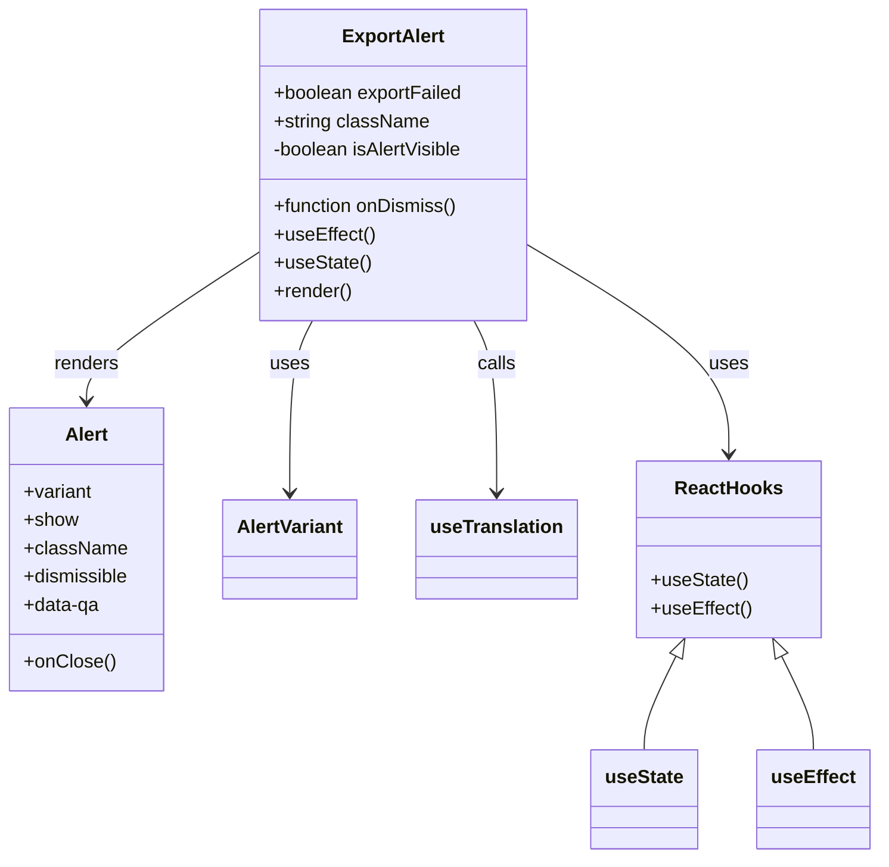

# Diagram: web/portal/src/modules/exports/ExportAlert.tsx


> Auto-generated by Obscura crawlers

## Diagram 1



### SVG

<svg id="container" width="733.6953125" xmlns="http://www.w3.org/2000/svg" class="classDiagram" height="728" viewBox="0 0 733.6953125 728" role="graphics-document document" aria-roledescription="class"><style>#container{font-family:"trebuchet ms",verdana,arial,sans-serif;font-size:16px;fill:#333;}@keyframes edge-animation-frame{from{stroke-dashoffset:0;}}@keyframes dash{to{stroke-dashoffset:0;}}#container .edge-animation-slow{stroke-dasharray:9,5!important;stroke-dashoffset:900;animation:dash 50s linear infinite;stroke-linecap:round;}#container .edge-animation-fast{stroke-dasharray:9,5!important;stroke-dashoffset:900;animation:dash 20s linear infinite;stroke-linecap:round;}#container .error-icon{fill:#552222;}#container .error-text{fill:#552222;stroke:#552222;}#container .edge-thickness-normal{stroke-width:1px;}#container .edge-thickness-thick{stroke-width:3.5px;}#container .edge-pattern-solid{stroke-dasharray:0;}#container .edge-thickness-invisible{stroke-width:0;fill:none;}#container .edge-pattern-dashed{stroke-dasharray:3;}#container .edge-pattern-dotted{stroke-dasharray:2;}#container .marker{fill:#333333;stroke:#333333;}#container .marker.cross{stroke:#333333;}#container svg{font-family:"trebuchet ms",verdana,arial,sans-serif;font-size:16px;}#container p{margin:0;}#container g.classGroup text{fill:#9370DB;stroke:none;font-family:"trebuchet ms",verdana,arial,sans-serif;font-size:10px;}#container g.classGroup text .title{font-weight:bolder;}#container .nodeLabel,#container .edgeLabel{color:#131300;}#container .edgeLabel .label rect{fill:#ECECFF;}#container .label text{fill:#131300;}#container .labelBkg{background:#ECECFF;}#container .edgeLabel .label span{background:#ECECFF;}#container .classTitle{font-weight:bolder;}#container .node rect,#container .node circle,#container .node ellipse,#container .node polygon,#container .node path{fill:#ECECFF;stroke:#9370DB;stroke-width:1px;}#container .divider{stroke:#9370DB;stroke-width:1;}#container g.clickable{cursor:pointer;}#container g.classGroup rect{fill:#ECECFF;stroke:#9370DB;}#container g.classGroup line{stroke:#9370DB;stroke-width:1;}#container .classLabel .box{stroke:none;stroke-width:0;fill:#ECECFF;opacity:0.5;}#container .classLabel .label{fill:#9370DB;font-size:10px;}#container .relation{stroke:#333333;stroke-width:1;fill:none;}#container .dashed-line{stroke-dasharray:3;}#container .dotted-line{stroke-dasharray:1 2;}#container #compositionStart,#container .composition{fill:#333333!important;stroke:#333333!important;stroke-width:1;}#container #compositionEnd,#container .composition{fill:#333333!important;stroke:#333333!important;stroke-width:1;}#container #dependencyStart,#container .dependency{fill:#333333!important;stroke:#333333!important;stroke-width:1;}#container #dependencyStart,#container .dependency{fill:#333333!important;stroke:#333333!important;stroke-width:1;}#container #extensionStart,#container .extension{fill:transparent!important;stroke:#333333!important;stroke-width:1;}#container #extensionEnd,#container .extension{fill:transparent!important;stroke:#333333!important;stroke-width:1;}#container #aggregationStart,#container .aggregation{fill:transparent!important;stroke:#333333!important;stroke-width:1;}#container #aggregationEnd,#container .aggregation{fill:transparent!important;stroke:#333333!important;stroke-width:1;}#container #lollipopStart,#container .lollipop{fill:#ECECFF!important;stroke:#333333!important;stroke-width:1;}#container #lollipopEnd,#container .lollipop{fill:#ECECFF!important;stroke:#333333!important;stroke-width:1;}#container .edgeTerminals{font-size:11px;line-height:initial;}#container .classTitleText{text-anchor:middle;font-size:18px;fill:#333;}#container .label-icon{display:inline-block;height:1em;overflow:visible;vertical-align:-0.125em;}#container .node .label-icon path{fill:currentColor;stroke:revert;stroke-width:revert;}#container :root{--mermaid-font-family:"trebuchet ms",verdana,arial,sans-serif;}</style><g><defs><marker id="container_class-aggregationStart" class="marker aggregation class" refX="18" refY="7" markerWidth="190" markerHeight="240" orient="auto"><path d="M 18,7 L9,13 L1,7 L9,1 Z"></path></marker></defs><defs><marker id="container_class-aggregationEnd" class="marker aggregation class" refX="1" refY="7" markerWidth="20" markerHeight="28" orient="auto"><path d="M 18,7 L9,13 L1,7 L9,1 Z"></path></marker></defs><defs><marker id="container_class-extensionStart" class="marker extension class" refX="18" refY="7" markerWidth="190" markerHeight="240" orient="auto"><path d="M 1,7 L18,13 V 1 Z"></path></marker></defs><defs><marker id="container_class-extensionEnd" class="marker extension class" refX="1" refY="7" markerWidth="20" markerHeight="28" orient="auto"><path d="M 1,1 V 13 L18,7 Z"></path></marker></defs><defs><marker id="container_class-compositionStart" class="marker composition class" refX="18" refY="7" markerWidth="190" markerHeight="240" orient="auto"><path d="M 18,7 L9,13 L1,7 L9,1 Z"></path></marker></defs><defs><marker id="container_class-compositionEnd" class="marker composition class" refX="1" refY="7" markerWidth="20" markerHeight="28" orient="auto"><path d="M 18,7 L9,13 L1,7 L9,1 Z"></path></marker></defs><defs><marker id="container_class-dependencyStart" class="marker dependency class" refX="6" refY="7" markerWidth="190" markerHeight="240" orient="auto"><path d="M 5,7 L9,13 L1,7 L9,1 Z"></path></marker></defs><defs><marker id="container_class-dependencyEnd" class="marker dependency class" refX="13" refY="7" markerWidth="20" markerHeight="28" orient="auto"><path d="M 18,7 L9,13 L14,7 L9,1 Z"></path></marker></defs><defs><marker id="container_class-lollipopStart" class="marker lollipop class" refX="13" refY="7" markerWidth="190" markerHeight="240" orient="auto"><circle stroke="black" fill="transparent" cx="7" cy="7" r="6"></circle></marker></defs><defs><marker id="container_class-lollipopEnd" class="marker lollipop class" refX="1" refY="7" markerWidth="190" markerHeight="240" orient="auto"><circle stroke="black" fill="transparent" cx="7" cy="7" r="6"></circle></marker></defs><g class="root"><g class="clusters"></g><g class="edgePaths"><path d="M216.316,215.592L192.569,231.16C168.822,246.728,121.327,277.864,97.579,298.599C73.832,319.333,73.832,329.667,73.832,334.833L73.832,340" id="id_ExportAlert_Alert_1" class="edge-thickness-normal edge-pattern-solid relation" style=";;;" data-edge="true" data-et="edge" data-id="id_ExportAlert_Alert_1" data-points="W3sieCI6MjE2LjMxNjQwNjI1LCJ5IjoyMTUuNTkyMjU2OTg5MTY1ODN9LHsieCI6NzMuODMyMDMxMjUsInkiOjMwOX0seyJ4Ijo3My44MzIwMzEyNSwieSI6MzQ2fV0=" marker-end="url(#container_class-dependencyEnd)"></path><path d="M264.441,272L261.303,278.167C258.164,284.333,251.887,296.667,248.748,321C245.609,345.333,245.609,381.667,245.609,399.833L245.609,418" id="id_ExportAlert_AlertVariant_2" class="edge-thickness-normal edge-pattern-solid relation" style=";;;" data-edge="true" data-et="edge" data-id="id_ExportAlert_AlertVariant_2" data-points="W3sieCI6MjY0LjQ0MTE5ODIyNDg1MjEsInkiOjI3Mn0seyJ4IjoyNDUuNjA5Mzc1LCJ5IjozMDl9LHsieCI6MjQ1LjYwOTM3NSwieSI6NDI0fV0=" marker-end="url(#container_class-dependencyEnd)"></path><path d="M398.809,272L401.947,278.167C405.086,284.333,411.363,296.667,414.502,321C417.641,345.333,417.641,381.667,417.641,399.833L417.641,418" id="id_ExportAlert_useTranslation_3" class="edge-thickness-normal edge-pattern-solid relation" style=";;;" data-edge="true" data-et="edge" data-id="id_ExportAlert_useTranslation_3" data-points="W3sieCI6Mzk4LjgwODgwMTc3NTE0NzksInkiOjI3Mn0seyJ4Ijo0MTcuNjQwNjI1LCJ5IjozMDl9LHsieCI6NDE3LjY0MDYyNSwieSI6NDI0fV0=" marker-end="url(#container_class-dependencyEnd)"></path><path d="M446.934,210.048L474.081,226.54C501.229,243.032,555.525,276.016,582.673,305.175C609.82,334.333,609.82,359.667,609.82,372.333L609.82,385" id="id_ExportAlert_ReactHooks_4" class="edge-thickness-normal edge-pattern-solid relation" style=";;;" data-edge="true" data-et="edge" data-id="id_ExportAlert_ReactHooks_4" data-points="W3sieCI6NDQ2LjkzMzU5Mzc1LCJ5IjoyMTAuMDQ4NDU2ODUwNzk2MTN9LHsieCI6NjA5LjgyMDMxMjUsInkiOjMwOX0seyJ4Ijo2MDkuODIwMzEyNSwieSI6MzkxfV0=" marker-end="url(#container_class-dependencyEnd)"></path><path d="M566.105,556.534L561.721,565.612C557.338,574.689,548.571,592.845,544.188,606.089C539.805,619.333,539.805,627.667,539.805,631.833L539.805,636" id="id_ReactHooks_useState_5" class="edge-thickness-normal edge-pattern-solid relation" style=";;;" data-edge="true" data-et="edge" data-id="id_ReactHooks_useState_5" data-points="W3sieCI6NTczLjYwNTMzNDA1MTcyNDIsInkiOjU0MX0seyJ4Ijo1MzkuODA0Njg3NSwieSI6NjExfSx7IngiOjUzOS44MDQ2ODc1LCJ5Ijo2MzZ9XQ==" marker-start="url(#container_class-extensionStart)"></path><path d="M653.536,556.534L657.919,565.612C662.303,574.689,671.069,592.845,675.453,606.089C679.836,619.333,679.836,627.667,679.836,631.833L679.836,636" id="id_ReactHooks_useEffect_6" class="edge-thickness-normal edge-pattern-solid relation" style=";;;" data-edge="true" data-et="edge" data-id="id_ReactHooks_useEffect_6" data-points="W3sieCI6NjQ2LjAzNTI5MDk0ODI3NTgsInkiOjU0MX0seyJ4Ijo2NzkuODM1OTM3NSwieSI6NjExfSx7IngiOjY3OS44MzU5Mzc1LCJ5Ijo2MzZ9XQ==" marker-start="url(#container_class-extensionStart)"></path></g><g class="edgeLabels"><g class="edgeLabel" transform="translate(73.83203125, 309)"><g class="label" data-id="id_ExportAlert_Alert_1" transform="translate(-27.75, -12)"><foreignObject width="55.5" height="24"><div xmlns="http://www.w3.org/1999/xhtml" class="labelBkg" style="display: table-cell; white-space: nowrap; line-height: 1.5; max-width: 200px; text-align: center;"><span class="edgeLabel"><p>renders</p></span></div></foreignObject></g></g><g class="edgeLabel" transform="translate(245.609375, 309)"><g class="label" data-id="id_ExportAlert_AlertVariant_2" transform="translate(-16.4921875, -12)"><foreignObject width="32.984375" height="24"><div xmlns="http://www.w3.org/1999/xhtml" class="labelBkg" style="display: table-cell; white-space: nowrap; line-height: 1.5; max-width: 200px; text-align: center;"><span class="edgeLabel"><p>uses</p></span></div></foreignObject></g></g><g class="edgeLabel" transform="translate(417.640625, 309)"><g class="label" data-id="id_ExportAlert_useTranslation_3" transform="translate(-16.4453125, -12)"><foreignObject width="32.890625" height="24"><div xmlns="http://www.w3.org/1999/xhtml" class="labelBkg" style="display: table-cell; white-space: nowrap; line-height: 1.5; max-width: 200px; text-align: center;"><span class="edgeLabel"><p>calls</p></span></div></foreignObject></g></g><g class="edgeLabel" transform="translate(609.8203125, 309)"><g class="label" data-id="id_ExportAlert_ReactHooks_4" transform="translate(-16.4921875, -12)"><foreignObject width="32.984375" height="24"><div xmlns="http://www.w3.org/1999/xhtml" class="labelBkg" style="display: table-cell; white-space: nowrap; line-height: 1.5; max-width: 200px; text-align: center;"><span class="edgeLabel"><p>uses</p></span></div></foreignObject></g></g><g class="edgeLabel"><g class="label" data-id="id_ReactHooks_useState_5" transform="translate(0, 0)"><foreignObject width="0" height="0"><div xmlns="http://www.w3.org/1999/xhtml" class="labelBkg" style="display: table-cell; white-space: nowrap; line-height: 1.5; max-width: 200px; text-align: center;"><span class="edgeLabel"></span></div></foreignObject></g></g><g class="edgeLabel"><g class="label" data-id="id_ReactHooks_useEffect_6" transform="translate(0, 0)"><foreignObject width="0" height="0"><div xmlns="http://www.w3.org/1999/xhtml" class="labelBkg" style="display: table-cell; white-space: nowrap; line-height: 1.5; max-width: 200px; text-align: center;"><span class="edgeLabel"></span></div></foreignObject></g></g></g><g class="nodes"><g class="node default" id="classId-ExportAlert-0" transform="translate(331.625, 140)"><g class="basic label-container"><path d="M-115.30859375 -132 L115.30859375 -132 L115.30859375 132 L-115.30859375 132" stroke="none" stroke-width="0" fill="#ECECFF" style=""></path><path d="M-115.30859375 -132 C-43.34074376691798 -132, 28.627106216164037 -132, 115.30859375 -132 M-115.30859375 -132 C-63.14512364957949 -132, -10.981653549158978 -132, 115.30859375 -132 M115.30859375 -132 C115.30859375 -56.19634375685101, 115.30859375 19.607312486297985, 115.30859375 132 M115.30859375 -132 C115.30859375 -55.814444522993455, 115.30859375 20.37111095401309, 115.30859375 132 M115.30859375 132 C37.519660044097975 132, -40.26927366180405 132, -115.30859375 132 M115.30859375 132 C29.21496796713086 132, -56.87865781573828 132, -115.30859375 132 M-115.30859375 132 C-115.30859375 69.80853194704595, -115.30859375 7.617063894091899, -115.30859375 -132 M-115.30859375 132 C-115.30859375 34.27802437632258, -115.30859375 -63.443951247354846, -115.30859375 -132" stroke="#9370DB" stroke-width="1.3" fill="none" stroke-dasharray="0 0" style=""></path></g><g class="annotation-group text" transform="translate(0, -108)"></g><g class="label-group text" transform="translate(-41.8203125, -108)"><g class="label" style="font-weight: bolder" transform="translate(0,-12)"><foreignObject width="83.640625" height="24"><div xmlns="http://www.w3.org/1999/xhtml" style="display: table-cell; white-space: nowrap; line-height: 1.5; max-width: 132px; text-align: center;"><span class="nodeLabel markdown-node-label" style=""><p>ExportAlert</p></span></div></foreignObject></g></g><g class="members-group text" transform="translate(-103.30859375, -60)"><g class="label" style="" transform="translate(0,-12)"><foreignObject width="161.8125" height="24"><div xmlns="http://www.w3.org/1999/xhtml" style="display: table-cell; white-space: nowrap; line-height: 1.5; max-width: 219px; text-align: center;"><span class="nodeLabel markdown-node-label" style=""><p>+boolean exportFailed</p></span></div></foreignObject></g><g class="label" style="" transform="translate(0,12)"><foreignObject width="131.515625" height="24"><div xmlns="http://www.w3.org/1999/xhtml" style="display: table-cell; white-space: nowrap; line-height: 1.5; max-width: 189px; text-align: center;"><span class="nodeLabel markdown-node-label" style=""><p>+string className</p></span></div></foreignObject></g><g class="label" style="" transform="translate(0,36)"><foreignObject width="164.796875" height="24"><div xmlns="http://www.w3.org/1999/xhtml" style="display: table-cell; white-space: nowrap; line-height: 1.5; max-width: 222px; text-align: center;"><span class="nodeLabel markdown-node-label" style=""><p>-boolean isAlertVisible</p></span></div></foreignObject></g></g><g class="methods-group text" transform="translate(-103.30859375, 36)"><g class="label" style="" transform="translate(0,-12)"><foreignObject width="157.078125" height="24"><div xmlns="http://www.w3.org/1999/xhtml" style="display: table-cell; white-space: nowrap; line-height: 1.5; max-width: 214px; text-align: center;"><span class="nodeLabel markdown-node-label" style=""><p>+function onDismiss()</p></span></div></foreignObject></g><g class="label" style="" transform="translate(0,12)"><foreignObject width="84.8125" height="24"><div xmlns="http://www.w3.org/1999/xhtml" style="display: table-cell; white-space: nowrap; line-height: 1.5; max-width: 142px; text-align: center;"><span class="nodeLabel markdown-node-label" style=""><p>+useEffect()</p></span></div></foreignObject></g><g class="label" style="" transform="translate(0,36)"><foreignObject width="81.203125" height="24"><div xmlns="http://www.w3.org/1999/xhtml" style="display: table-cell; white-space: nowrap; line-height: 1.5; max-width: 139px; text-align: center;"><span class="nodeLabel markdown-node-label" style=""><p>+useState()</p></span></div></foreignObject></g><g class="label" style="" transform="translate(0,60)"><foreignObject width="66.609375" height="24"><div xmlns="http://www.w3.org/1999/xhtml" style="display: table-cell; white-space: nowrap; line-height: 1.5; max-width: 124px; text-align: center;"><span class="nodeLabel markdown-node-label" style=""><p>+render()</p></span></div></foreignObject></g></g><g class="divider" style=""><path d="M-115.30859375 -84 C-66.71769985329189 -84, -18.126805956583794 -84, 115.30859375 -84 M-115.30859375 -84 C-49.13661800705047 -84, 17.035357735899055 -84, 115.30859375 -84" stroke="#9370DB" stroke-width="1.3" fill="none" stroke-dasharray="0 0" style=""></path></g><g class="divider" style=""><path d="M-115.30859375 12 C-28.300860829798552 12, 58.706872090402896 12, 115.30859375 12 M-115.30859375 12 C-32.19804584155821 12, 50.912502066883576 12, 115.30859375 12" stroke="#9370DB" stroke-width="1.3" fill="none" stroke-dasharray="0 0" style=""></path></g></g><g class="node default" id="classId-Alert-1" transform="translate(73.83203125, 466)"><g class="basic label-container"><path d="M-65.83203125 -120 L65.83203125 -120 L65.83203125 120 L-65.83203125 120" stroke="none" stroke-width="0" fill="#ECECFF" style=""></path><path d="M-65.83203125 -120 C-21.880890163821704 -120, 22.070250922356593 -120, 65.83203125 -120 M-65.83203125 -120 C-23.72425579771145 -120, 18.3835196545771 -120, 65.83203125 -120 M65.83203125 -120 C65.83203125 -31.651183259073747, 65.83203125 56.697633481852506, 65.83203125 120 M65.83203125 -120 C65.83203125 -57.815486524461875, 65.83203125 4.3690269510762505, 65.83203125 120 M65.83203125 120 C23.31749731403044 120, -19.19703662193912 120, -65.83203125 120 M65.83203125 120 C17.59595537410467 120, -30.640120501790662 120, -65.83203125 120 M-65.83203125 120 C-65.83203125 47.766748068910815, -65.83203125 -24.46650386217837, -65.83203125 -120 M-65.83203125 120 C-65.83203125 56.07317788710672, -65.83203125 -7.853644225786553, -65.83203125 -120" stroke="#9370DB" stroke-width="1.3" fill="none" stroke-dasharray="0 0" style=""></path></g><g class="annotation-group text" transform="translate(0, -96)"></g><g class="label-group text" transform="translate(-17.7734375, -96)"><g class="label" style="font-weight: bolder" transform="translate(0,-12)"><foreignObject width="35.546875" height="24"><div xmlns="http://www.w3.org/1999/xhtml" style="display: table-cell; white-space: nowrap; line-height: 1.5; max-width: 85px; text-align: center;"><span class="nodeLabel markdown-node-label" style=""><p>Alert</p></span></div></foreignObject></g></g><g class="members-group text" transform="translate(-53.83203125, -48)"><g class="label" style="" transform="translate(0,-12)"><foreignObject width="58.703125" height="24"><div xmlns="http://www.w3.org/1999/xhtml" style="display: table-cell; white-space: nowrap; line-height: 1.5; max-width: 116px; text-align: center;"><span class="nodeLabel markdown-node-label" style=""><p>+variant</p></span></div></foreignObject></g><g class="label" style="" transform="translate(0,12)"><foreignObject width="45.65625" height="24"><div xmlns="http://www.w3.org/1999/xhtml" style="display: table-cell; white-space: nowrap; line-height: 1.5; max-width: 104px; text-align: center;"><span class="nodeLabel markdown-node-label" style=""><p>+show</p></span></div></foreignObject></g><g class="label" style="" transform="translate(0,36)"><foreignObject width="85.640625" height="24"><div xmlns="http://www.w3.org/1999/xhtml" style="display: table-cell; white-space: nowrap; line-height: 1.5; max-width: 143px; text-align: center;"><span class="nodeLabel markdown-node-label" style=""><p>+className</p></span></div></foreignObject></g><g class="label" style="" transform="translate(0,60)"><foreignObject width="89.890625" height="24"><div xmlns="http://www.w3.org/1999/xhtml" style="display: table-cell; white-space: nowrap; line-height: 1.5; max-width: 147px; text-align: center;"><span class="nodeLabel markdown-node-label" style=""><p>+dismissible</p></span></div></foreignObject></g><g class="label" style="" transform="translate(0,84)"><foreignObject width="65.1875" height="24"><div xmlns="http://www.w3.org/1999/xhtml" style="display: table-cell; white-space: nowrap; line-height: 1.5; max-width: 123px; text-align: center;"><span class="nodeLabel markdown-node-label" style=""><p>+data-qa</p></span></div></foreignObject></g></g><g class="methods-group text" transform="translate(-53.83203125, 96)"><g class="label" style="" transform="translate(0,-12)"><foreignObject width="76.03125" height="24"><div xmlns="http://www.w3.org/1999/xhtml" style="display: table-cell; white-space: nowrap; line-height: 1.5; max-width: 133px; text-align: center;"><span class="nodeLabel markdown-node-label" style=""><p>+onClose()</p></span></div></foreignObject></g></g><g class="divider" style=""><path d="M-65.83203125 -72 C-37.09565709950289 -72, -8.359282949005774 -72, 65.83203125 -72 M-65.83203125 -72 C-25.431016489035045 -72, 14.96999827192991 -72, 65.83203125 -72" stroke="#9370DB" stroke-width="1.3" fill="none" stroke-dasharray="0 0" style=""></path></g><g class="divider" style=""><path d="M-65.83203125 72 C-31.414466450751064 72, 3.003098348497872 72, 65.83203125 72 M-65.83203125 72 C-37.187088953041346 72, -8.542146656082693 72, 65.83203125 72" stroke="#9370DB" stroke-width="1.3" fill="none" stroke-dasharray="0 0" style=""></path></g></g><g class="node default" id="classId-AlertVariant-2" transform="translate(245.609375, 466)"><g class="basic label-container"><path d="M-55.9453125 -42 L55.9453125 -42 L55.9453125 42 L-55.9453125 42" stroke="none" stroke-width="0" fill="#ECECFF" style=""></path><path d="M-55.9453125 -42 C-13.231911984254687 -42, 29.481488531490626 -42, 55.9453125 -42 M-55.9453125 -42 C-13.934873200148047 -42, 28.075566099703906 -42, 55.9453125 -42 M55.9453125 -42 C55.9453125 -25.019759466123055, 55.9453125 -8.03951893224611, 55.9453125 42 M55.9453125 -42 C55.9453125 -20.050384474728858, 55.9453125 1.8992310505422836, 55.9453125 42 M55.9453125 42 C30.311481005765273 42, 4.6776495115305465 42, -55.9453125 42 M55.9453125 42 C30.20126695618846 42, 4.457221412376917 42, -55.9453125 42 M-55.9453125 42 C-55.9453125 16.992807628748594, -55.9453125 -8.014384742502813, -55.9453125 -42 M-55.9453125 42 C-55.9453125 16.04295261608621, -55.9453125 -9.914094767827578, -55.9453125 -42" stroke="#9370DB" stroke-width="1.3" fill="none" stroke-dasharray="0 0" style=""></path></g><g class="annotation-group text" transform="translate(0, -18)"></g><g class="label-group text" transform="translate(-43.9453125, -18)"><g class="label" style="font-weight: bolder" transform="translate(0,-12)"><foreignObject width="87.890625" height="24"><div xmlns="http://www.w3.org/1999/xhtml" style="display: table-cell; white-space: nowrap; line-height: 1.5; max-width: 136px; text-align: center;"><span class="nodeLabel markdown-node-label" style=""><p>AlertVariant</p></span></div></foreignObject></g></g><g class="members-group text" transform="translate(-43.9453125, 30)"></g><g class="methods-group text" transform="translate(-43.9453125, 60)"></g><g class="divider" style=""><path d="M-55.9453125 6 C-22.226645541489113 6, 11.492021417021775 6, 55.9453125 6 M-55.9453125 6 C-12.95836483709703 6, 30.02858282580594 6, 55.9453125 6" stroke="#9370DB" stroke-width="1.3" fill="none" stroke-dasharray="0 0" style=""></path></g><g class="divider" style=""><path d="M-55.9453125 24 C-32.23060973177652 24, -8.515906963553036 24, 55.9453125 24 M-55.9453125 24 C-32.07312625426083 24, -8.200940008521648 24, 55.9453125 24" stroke="#9370DB" stroke-width="1.3" fill="none" stroke-dasharray="0 0" style=""></path></g></g><g class="node default" id="classId-useTranslation-3" transform="translate(417.640625, 466)"><g class="basic label-container"><path d="M-66.0859375 -42 L66.0859375 -42 L66.0859375 42 L-66.0859375 42" stroke="none" stroke-width="0" fill="#ECECFF" style=""></path><path d="M-66.0859375 -42 C-13.58206020322303 -42, 38.92181709355394 -42, 66.0859375 -42 M-66.0859375 -42 C-34.609210126003475 -42, -3.1324827520069505 -42, 66.0859375 -42 M66.0859375 -42 C66.0859375 -14.641632490381955, 66.0859375 12.71673501923609, 66.0859375 42 M66.0859375 -42 C66.0859375 -23.54872680083023, 66.0859375 -5.097453601660462, 66.0859375 42 M66.0859375 42 C18.13852085154837 42, -29.808895796903258 42, -66.0859375 42 M66.0859375 42 C33.776021319113475 42, 1.4661051382269505 42, -66.0859375 42 M-66.0859375 42 C-66.0859375 20.995851765557457, -66.0859375 -0.008296468885085062, -66.0859375 -42 M-66.0859375 42 C-66.0859375 9.349696839698119, -66.0859375 -23.300606320603762, -66.0859375 -42" stroke="#9370DB" stroke-width="1.3" fill="none" stroke-dasharray="0 0" style=""></path></g><g class="annotation-group text" transform="translate(0, -18)"></g><g class="label-group text" transform="translate(-54.0859375, -18)"><g class="label" style="font-weight: bolder" transform="translate(0,-12)"><foreignObject width="108.171875" height="24"><div xmlns="http://www.w3.org/1999/xhtml" style="display: table-cell; white-space: nowrap; line-height: 1.5; max-width: 157px; text-align: center;"><span class="nodeLabel markdown-node-label" style=""><p>useTranslation</p></span></div></foreignObject></g></g><g class="members-group text" transform="translate(-54.0859375, 30)"></g><g class="methods-group text" transform="translate(-54.0859375, 60)"></g><g class="divider" style=""><path d="M-66.0859375 6 C-17.373597683724917 6, 31.338742132550166 6, 66.0859375 6 M-66.0859375 6 C-36.4240853580441 6, -6.762233216088205 6, 66.0859375 6" stroke="#9370DB" stroke-width="1.3" fill="none" stroke-dasharray="0 0" style=""></path></g><g class="divider" style=""><path d="M-66.0859375 24 C-27.862160444889504 24, 10.361616610220992 24, 66.0859375 24 M-66.0859375 24 C-26.849716089902543 24, 12.386505320194914 24, 66.0859375 24" stroke="#9370DB" stroke-width="1.3" fill="none" stroke-dasharray="0 0" style=""></path></g></g><g class="node default" id="classId-ReactHooks-4" transform="translate(609.8203125, 466)"><g class="basic label-container"><path d="M-76.09375 -75 L76.09375 -75 L76.09375 75 L-76.09375 75" stroke="none" stroke-width="0" fill="#ECECFF" style=""></path><path d="M-76.09375 -75 C-44.7561915601911 -75, -13.418633120382196 -75, 76.09375 -75 M-76.09375 -75 C-32.82376211458497 -75, 10.446225770830054 -75, 76.09375 -75 M76.09375 -75 C76.09375 -44.96016687248657, 76.09375 -14.920333744973128, 76.09375 75 M76.09375 -75 C76.09375 -36.60155448312707, 76.09375 1.7968910337458652, 76.09375 75 M76.09375 75 C22.21471213114266 75, -31.664325737714677 75, -76.09375 75 M76.09375 75 C38.64259616083666 75, 1.1914423216733212 75, -76.09375 75 M-76.09375 75 C-76.09375 20.821426292389148, -76.09375 -33.357147415221704, -76.09375 -75 M-76.09375 75 C-76.09375 15.119810283873157, -76.09375 -44.760379432253686, -76.09375 -75" stroke="#9370DB" stroke-width="1.3" fill="none" stroke-dasharray="0 0" style=""></path></g><g class="annotation-group text" transform="translate(0, -51)"></g><g class="label-group text" transform="translate(-43.375, -51)"><g class="label" style="font-weight: bolder" transform="translate(0,-12)"><foreignObject width="86.75" height="24"><div xmlns="http://www.w3.org/1999/xhtml" style="display: table-cell; white-space: nowrap; line-height: 1.5; max-width: 135px; text-align: center;"><span class="nodeLabel markdown-node-label" style=""><p>ReactHooks</p></span></div></foreignObject></g></g><g class="members-group text" transform="translate(-64.09375, -3)"></g><g class="methods-group text" transform="translate(-64.09375, 27)"><g class="label" style="" transform="translate(0,-12)"><foreignObject width="81.203125" height="24"><div xmlns="http://www.w3.org/1999/xhtml" style="display: table-cell; white-space: nowrap; line-height: 1.5; max-width: 139px; text-align: center;"><span class="nodeLabel markdown-node-label" style=""><p>+useState()</p></span></div></foreignObject></g><g class="label" style="" transform="translate(0,12)"><foreignObject width="84.8125" height="24"><div xmlns="http://www.w3.org/1999/xhtml" style="display: table-cell; white-space: nowrap; line-height: 1.5; max-width: 142px; text-align: center;"><span class="nodeLabel markdown-node-label" style=""><p>+useEffect()</p></span></div></foreignObject></g></g><g class="divider" style=""><path d="M-76.09375 -27 C-20.92474093069775 -27, 34.2442681386045 -27, 76.09375 -27 M-76.09375 -27 C-23.417301386949063 -27, 29.259147226101874 -27, 76.09375 -27" stroke="#9370DB" stroke-width="1.3" fill="none" stroke-dasharray="0 0" style=""></path></g><g class="divider" style=""><path d="M-76.09375 -3 C-37.43875803303624 -3, 1.2162339339275263 -3, 76.09375 -3 M-76.09375 -3 C-19.30447396670501 -3, 37.48480206658998 -3, 76.09375 -3" stroke="#9370DB" stroke-width="1.3" fill="none" stroke-dasharray="0 0" style=""></path></g></g><g class="node default" id="classId-useState-5" transform="translate(539.8046875, 678)"><g class="basic label-container"><path d="M-44.171875 -42 L44.171875 -42 L44.171875 42 L-44.171875 42" stroke="none" stroke-width="0" fill="#ECECFF" style=""></path><path d="M-44.171875 -42 C-19.54967792212717 -42, 5.07251915574566 -42, 44.171875 -42 M-44.171875 -42 C-16.94959935080575 -42, 10.272676298388497 -42, 44.171875 -42 M44.171875 -42 C44.171875 -21.10991488044741, 44.171875 -0.2198297608948181, 44.171875 42 M44.171875 -42 C44.171875 -23.060017530082945, 44.171875 -4.12003506016589, 44.171875 42 M44.171875 42 C14.99323588638341 42, -14.18540322723318 42, -44.171875 42 M44.171875 42 C25.506567365518606 42, 6.841259731037212 42, -44.171875 42 M-44.171875 42 C-44.171875 15.04921313696585, -44.171875 -11.9015737260683, -44.171875 -42 M-44.171875 42 C-44.171875 22.619293088226993, -44.171875 3.2385861764539854, -44.171875 -42" stroke="#9370DB" stroke-width="1.3" fill="none" stroke-dasharray="0 0" style=""></path></g><g class="annotation-group text" transform="translate(0, -18)"></g><g class="label-group text" transform="translate(-32.171875, -18)"><g class="label" style="font-weight: bolder" transform="translate(0,-12)"><foreignObject width="64.34375" height="24"><div xmlns="http://www.w3.org/1999/xhtml" style="display: table-cell; white-space: nowrap; line-height: 1.5; max-width: 113px; text-align: center;"><span class="nodeLabel markdown-node-label" style=""><p>useState</p></span></div></foreignObject></g></g><g class="members-group text" transform="translate(-32.171875, 30)"></g><g class="methods-group text" transform="translate(-32.171875, 60)"></g><g class="divider" style=""><path d="M-44.171875 6 C-24.15037037581437 6, -4.128865751628737 6, 44.171875 6 M-44.171875 6 C-9.866514221912261 6, 24.438846556175477 6, 44.171875 6" stroke="#9370DB" stroke-width="1.3" fill="none" stroke-dasharray="0 0" style=""></path></g><g class="divider" style=""><path d="M-44.171875 24 C-20.929878079085288 24, 2.312118841829424 24, 44.171875 24 M-44.171875 24 C-14.076549406669919 24, 16.018776186660162 24, 44.171875 24" stroke="#9370DB" stroke-width="1.3" fill="none" stroke-dasharray="0 0" style=""></path></g></g><g class="node default" id="classId-useEffect-6" transform="translate(679.8359375, 678)"><g class="basic label-container"><path d="M-45.859375 -42 L45.859375 -42 L45.859375 42 L-45.859375 42" stroke="none" stroke-width="0" fill="#ECECFF" style=""></path><path d="M-45.859375 -42 C-12.721806943726001 -42, 20.415761112547997 -42, 45.859375 -42 M-45.859375 -42 C-27.22661395189197 -42, -8.59385290378394 -42, 45.859375 -42 M45.859375 -42 C45.859375 -22.90299906631644, 45.859375 -3.8059981326328796, 45.859375 42 M45.859375 -42 C45.859375 -13.726774174158741, 45.859375 14.546451651682517, 45.859375 42 M45.859375 42 C25.22734336738677 42, 4.595311734773539 42, -45.859375 42 M45.859375 42 C23.43231106846917 42, 1.005247136938337 42, -45.859375 42 M-45.859375 42 C-45.859375 11.970522084002173, -45.859375 -18.058955831995654, -45.859375 -42 M-45.859375 42 C-45.859375 11.034053695343474, -45.859375 -19.931892609313053, -45.859375 -42" stroke="#9370DB" stroke-width="1.3" fill="none" stroke-dasharray="0 0" style=""></path></g><g class="annotation-group text" transform="translate(0, -18)"></g><g class="label-group text" transform="translate(-33.859375, -18)"><g class="label" style="font-weight: bolder" transform="translate(0,-12)"><foreignObject width="67.71875" height="24"><div xmlns="http://www.w3.org/1999/xhtml" style="display: table-cell; white-space: nowrap; line-height: 1.5; max-width: 117px; text-align: center;"><span class="nodeLabel markdown-node-label" style=""><p>useEffect</p></span></div></foreignObject></g></g><g class="members-group text" transform="translate(-33.859375, 30)"></g><g class="methods-group text" transform="translate(-33.859375, 60)"></g><g class="divider" style=""><path d="M-45.859375 6 C-24.67638086535327 6, -3.49338673070654 6, 45.859375 6 M-45.859375 6 C-14.220107446159606 6, 17.41916010768079 6, 45.859375 6" stroke="#9370DB" stroke-width="1.3" fill="none" stroke-dasharray="0 0" style=""></path></g><g class="divider" style=""><path d="M-45.859375 24 C-25.461824452886017 24, -5.064273905772033 24, 45.859375 24 M-45.859375 24 C-25.894140702238076 24, -5.928906404476152 24, 45.859375 24" stroke="#9370DB" stroke-width="1.3" fill="none" stroke-dasharray="0 0" style=""></path></g></g></g></g></g></svg>

## Diagram 2

```mermaid
flowchart TD
    A[props.exportFailed] -->|changes| B{useEffect}
    B --> C[set isAlertVisible = exportFailed]
    C --> D{isAlertVisible?}
    D -->|true| E[Render Alert variant=Danger show=true]
    D -->|false| F[No Alert rendered]
    E --> G[User clicks close]
    G --> H[onClose handler]
    H --> I[set isAlertVisible = false]
    H --> J[call onDismiss()]
    I --> F
    J --> F
```

> SVG rendering failed for this diagram.
