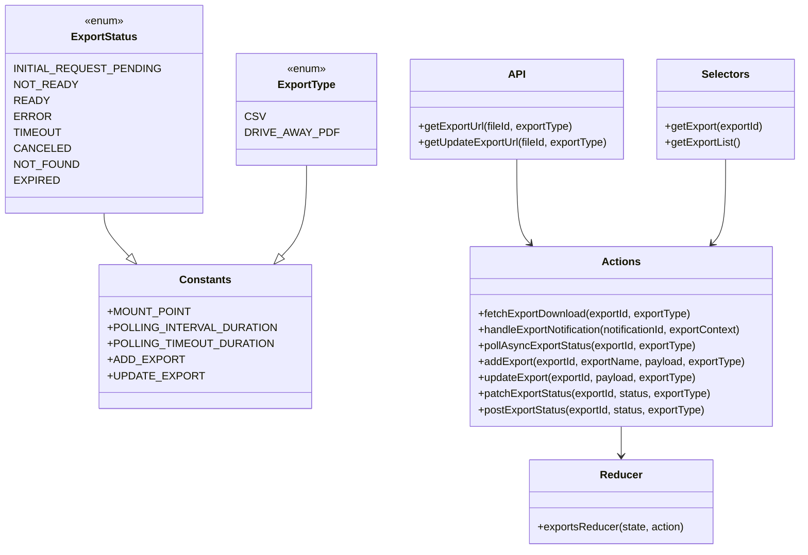

# Diagram: web/portal/src/modules/exports/ExportsState.js


> Auto-generated by Obscura crawlers

## Diagram 1



### SVG

<svg id="container" width="1154.7578125" xmlns="http://www.w3.org/2000/svg" class="classDiagram" height="824" viewBox="0 0 1154.7578125 824" role="graphics-document document" aria-roledescription="class"><style>#container{font-family:"trebuchet ms",verdana,arial,sans-serif;font-size:16px;fill:#333;}@keyframes edge-animation-frame{from{stroke-dashoffset:0;}}@keyframes dash{to{stroke-dashoffset:0;}}#container .edge-animation-slow{stroke-dasharray:9,5!important;stroke-dashoffset:900;animation:dash 50s linear infinite;stroke-linecap:round;}#container .edge-animation-fast{stroke-dasharray:9,5!important;stroke-dashoffset:900;animation:dash 20s linear infinite;stroke-linecap:round;}#container .error-icon{fill:#552222;}#container .error-text{fill:#552222;stroke:#552222;}#container .edge-thickness-normal{stroke-width:1px;}#container .edge-thickness-thick{stroke-width:3.5px;}#container .edge-pattern-solid{stroke-dasharray:0;}#container .edge-thickness-invisible{stroke-width:0;fill:none;}#container .edge-pattern-dashed{stroke-dasharray:3;}#container .edge-pattern-dotted{stroke-dasharray:2;}#container .marker{fill:#333333;stroke:#333333;}#container .marker.cross{stroke:#333333;}#container svg{font-family:"trebuchet ms",verdana,arial,sans-serif;font-size:16px;}#container p{margin:0;}#container g.classGroup text{fill:#9370DB;stroke:none;font-family:"trebuchet ms",verdana,arial,sans-serif;font-size:10px;}#container g.classGroup text .title{font-weight:bolder;}#container .nodeLabel,#container .edgeLabel{color:#131300;}#container .edgeLabel .label rect{fill:#ECECFF;}#container .label text{fill:#131300;}#container .labelBkg{background:#ECECFF;}#container .edgeLabel .label span{background:#ECECFF;}#container .classTitle{font-weight:bolder;}#container .node rect,#container .node circle,#container .node ellipse,#container .node polygon,#container .node path{fill:#ECECFF;stroke:#9370DB;stroke-width:1px;}#container .divider{stroke:#9370DB;stroke-width:1;}#container g.clickable{cursor:pointer;}#container g.classGroup rect{fill:#ECECFF;stroke:#9370DB;}#container g.classGroup line{stroke:#9370DB;stroke-width:1;}#container .classLabel .box{stroke:none;stroke-width:0;fill:#ECECFF;opacity:0.5;}#container .classLabel .label{fill:#9370DB;font-size:10px;}#container .relation{stroke:#333333;stroke-width:1;fill:none;}#container .dashed-line{stroke-dasharray:3;}#container .dotted-line{stroke-dasharray:1 2;}#container #compositionStart,#container .composition{fill:#333333!important;stroke:#333333!important;stroke-width:1;}#container #compositionEnd,#container .composition{fill:#333333!important;stroke:#333333!important;stroke-width:1;}#container #dependencyStart,#container .dependency{fill:#333333!important;stroke:#333333!important;stroke-width:1;}#container #dependencyStart,#container .dependency{fill:#333333!important;stroke:#333333!important;stroke-width:1;}#container #extensionStart,#container .extension{fill:transparent!important;stroke:#333333!important;stroke-width:1;}#container #extensionEnd,#container .extension{fill:transparent!important;stroke:#333333!important;stroke-width:1;}#container #aggregationStart,#container .aggregation{fill:transparent!important;stroke:#333333!important;stroke-width:1;}#container #aggregationEnd,#container .aggregation{fill:transparent!important;stroke:#333333!important;stroke-width:1;}#container #lollipopStart,#container .lollipop{fill:#ECECFF!important;stroke:#333333!important;stroke-width:1;}#container #lollipopEnd,#container .lollipop{fill:#ECECFF!important;stroke:#333333!important;stroke-width:1;}#container .edgeTerminals{font-size:11px;line-height:initial;}#container .classTitleText{text-anchor:middle;font-size:18px;fill:#333;}#container .label-icon{display:inline-block;height:1em;overflow:visible;vertical-align:-0.125em;}#container .node .label-icon path{fill:currentColor;stroke:revert;stroke-width:revert;}#container :root{--mermaid-font-family:"trebuchet ms",verdana,arial,sans-serif;}</style><g><defs><marker id="container_class-aggregationStart" class="marker aggregation class" refX="18" refY="7" markerWidth="190" markerHeight="240" orient="auto"><path d="M 18,7 L9,13 L1,7 L9,1 Z"></path></marker></defs><defs><marker id="container_class-aggregationEnd" class="marker aggregation class" refX="1" refY="7" markerWidth="20" markerHeight="28" orient="auto"><path d="M 18,7 L9,13 L1,7 L9,1 Z"></path></marker></defs><defs><marker id="container_class-extensionStart" class="marker extension class" refX="18" refY="7" markerWidth="190" markerHeight="240" orient="auto"><path d="M 1,7 L18,13 V 1 Z"></path></marker></defs><defs><marker id="container_class-extensionEnd" class="marker extension class" refX="1" refY="7" markerWidth="20" markerHeight="28" orient="auto"><path d="M 1,1 V 13 L18,7 Z"></path></marker></defs><defs><marker id="container_class-compositionStart" class="marker composition class" refX="18" refY="7" markerWidth="190" markerHeight="240" orient="auto"><path d="M 18,7 L9,13 L1,7 L9,1 Z"></path></marker></defs><defs><marker id="container_class-compositionEnd" class="marker composition class" refX="1" refY="7" markerWidth="20" markerHeight="28" orient="auto"><path d="M 18,7 L9,13 L1,7 L9,1 Z"></path></marker></defs><defs><marker id="container_class-dependencyStart" class="marker dependency class" refX="6" refY="7" markerWidth="190" markerHeight="240" orient="auto"><path d="M 5,7 L9,13 L1,7 L9,1 Z"></path></marker></defs><defs><marker id="container_class-dependencyEnd" class="marker dependency class" refX="13" refY="7" markerWidth="20" markerHeight="28" orient="auto"><path d="M 18,7 L9,13 L14,7 L9,1 Z"></path></marker></defs><defs><marker id="container_class-lollipopStart" class="marker lollipop class" refX="13" refY="7" markerWidth="190" markerHeight="240" orient="auto"><circle stroke="black" fill="transparent" cx="7" cy="7" r="6"></circle></marker></defs><defs><marker id="container_class-lollipopEnd" class="marker lollipop class" refX="1" refY="7" markerWidth="190" markerHeight="240" orient="auto"><circle stroke="black" fill="transparent" cx="7" cy="7" r="6"></circle></marker></defs><g class="root"><g class="clusters"></g><g class="edgePaths"><path d="M141.719,320L141.719,324.167C141.719,328.333,141.719,336.667,147.378,347.332C153.038,357.997,164.357,370.994,170.017,377.493L175.677,383.992" id="id_ExportStatus_Constants_1" class="edge-thickness-normal edge-pattern-solid relation" style=";;;" data-edge="true" data-et="edge" data-id="id_ExportStatus_Constants_1" data-points="W3sieCI6MTQxLjcxODc1LCJ5IjozMjB9LHsieCI6MTQxLjcxODc1LCJ5IjozNDV9LHsieCI6MTg3LjAwNTQ2ODc1LCJ5IjozOTd9XQ==" marker-end="url(#container_class-extensionEnd)"></path><path d="M420.406,248L420.406,264.167C420.406,280.333,420.406,312.667,414.747,335.332C409.087,357.997,397.768,370.994,392.108,377.493L386.448,383.992" id="id_ExportType_Constants_2" class="edge-thickness-normal edge-pattern-solid relation" style=";;;" data-edge="true" data-et="edge" data-id="id_ExportType_Constants_2" data-points="W3sieCI6NDIwLjQwNjI1LCJ5IjoyNDh9LHsieCI6NDIwLjQwNjI1LCJ5IjozNDV9LHsieCI6Mzc1LjExOTUzMTI1LCJ5IjozOTd9XQ==" marker-end="url(#container_class-extensionEnd)"></path><path d="M727.246,239L727.246,256.667C727.246,274.333,727.246,309.667,730.654,330.788C734.063,351.91,740.879,358.819,744.287,362.274L747.696,365.729" id="id_API_Actions_3" class="edge-thickness-normal edge-pattern-solid relation" style=";;;" data-edge="true" data-et="edge" data-id="id_API_Actions_3" data-points="W3sieCI6NzI3LjI0NjA5Mzc1LCJ5IjoyMzl9LHsieCI6NzI3LjI0NjA5Mzc1LCJ5IjozNDV9LHsieCI6NzUxLjkwOTQ4NDg2MzI4MTIsInkiOjM3MH1d" marker-end="url(#container_class-dependencyEnd)"></path><path d="M885.092,640L885.092,644.167C885.092,648.333,885.092,656.667,885.092,664C885.092,671.333,885.092,677.667,885.092,680.833L885.092,684" id="id_Actions_Reducer_4" class="edge-thickness-normal edge-pattern-solid relation" style=";;;" data-edge="true" data-et="edge" data-id="id_Actions_Reducer_4" data-points="W3sieCI6ODg1LjA5MTc5Njg3NSwieSI6NjQwfSx7IngiOjg4NS4wOTE3OTY4NzUsInkiOjY2NX0seyJ4Ijo4ODUuMDkxNzk2ODc1LCJ5Ijo2OTB9XQ==" marker-end="url(#container_class-dependencyEnd)"></path><path d="M1042.938,239L1042.938,256.667C1042.938,274.333,1042.938,309.667,1039.529,330.788C1036.121,351.91,1029.304,358.819,1025.896,362.274L1022.488,365.729" id="id_Selectors_Actions_5" class="edge-thickness-normal edge-pattern-solid relation" style=";;;" data-edge="true" data-et="edge" data-id="id_Selectors_Actions_5" data-points="W3sieCI6MTA0Mi45Mzc1LCJ5IjoyMzl9LHsieCI6MTA0Mi45Mzc1LCJ5IjozNDV9LHsieCI6MTAxOC4yNzQxMDg4ODY3MTg4LCJ5IjozNzB9XQ==" marker-end="url(#container_class-dependencyEnd)"></path></g><g class="edgeLabels"><g class="edgeLabel"><g class="label" data-id="id_ExportStatus_Constants_1" transform="translate(0, 0)"><foreignObject width="0" height="0"><div xmlns="http://www.w3.org/1999/xhtml" class="labelBkg" style="display: table-cell; white-space: nowrap; line-height: 1.5; max-width: 200px; text-align: center;"><span class="edgeLabel"></span></div></foreignObject></g></g><g class="edgeLabel"><g class="label" data-id="id_ExportType_Constants_2" transform="translate(0, 0)"><foreignObject width="0" height="0"><div xmlns="http://www.w3.org/1999/xhtml" class="labelBkg" style="display: table-cell; white-space: nowrap; line-height: 1.5; max-width: 200px; text-align: center;"><span class="edgeLabel"></span></div></foreignObject></g></g><g class="edgeLabel"><g class="label" data-id="id_API_Actions_3" transform="translate(0, 0)"><foreignObject width="0" height="0"><div xmlns="http://www.w3.org/1999/xhtml" class="labelBkg" style="display: table-cell; white-space: nowrap; line-height: 1.5; max-width: 200px; text-align: center;"><span class="edgeLabel"></span></div></foreignObject></g></g><g class="edgeLabel"><g class="label" data-id="id_Actions_Reducer_4" transform="translate(0, 0)"><foreignObject width="0" height="0"><div xmlns="http://www.w3.org/1999/xhtml" class="labelBkg" style="display: table-cell; white-space: nowrap; line-height: 1.5; max-width: 200px; text-align: center;"><span class="edgeLabel"></span></div></foreignObject></g></g><g class="edgeLabel"><g class="label" data-id="id_Selectors_Actions_5" transform="translate(0, 0)"><foreignObject width="0" height="0"><div xmlns="http://www.w3.org/1999/xhtml" class="labelBkg" style="display: table-cell; white-space: nowrap; line-height: 1.5; max-width: 200px; text-align: center;"><span class="edgeLabel"></span></div></foreignObject></g></g></g><g class="nodes"><g class="node default" id="classId-ExportStatus-0" transform="translate(141.71875, 164)"><g class="basic label-container"><path d="M-133.71875 -156 L133.71875 -156 L133.71875 156 L-133.71875 156" stroke="none" stroke-width="0" fill="#ECECFF" style=""></path><path d="M-133.71875 -156 C-42.803148430035435 -156, 48.11245313992913 -156, 133.71875 -156 M-133.71875 -156 C-39.56344826527784 -156, 54.59185346944432 -156, 133.71875 -156 M133.71875 -156 C133.71875 -44.106346353567616, 133.71875 67.78730729286477, 133.71875 156 M133.71875 -156 C133.71875 -67.21756822900876, 133.71875 21.564863541982476, 133.71875 156 M133.71875 156 C55.115645361648134 156, -23.48745927670373 156, -133.71875 156 M133.71875 156 C55.33010278276416 156, -23.058544434471685 156, -133.71875 156 M-133.71875 156 C-133.71875 81.59295174155521, -133.71875 7.1859034831104225, -133.71875 -156 M-133.71875 156 C-133.71875 81.14708613630911, -133.71875 6.294172272618226, -133.71875 -156" stroke="#9370DB" stroke-width="1.3" fill="none" stroke-dasharray="0 0" style=""></path></g><g class="annotation-group text" transform="translate(-29.53125, -132)"><g class="label" style="" transform="translate(0,-12)"><foreignObject width="59.0625" height="24"><div xmlns="http://www.w3.org/1999/xhtml" style="display: table-cell; white-space: nowrap; line-height: 1.5; max-width: 109px; text-align: center;"><span class="nodeLabel markdown-node-label" style=""><p>«enum»</p></span></div></foreignObject></g></g><g class="label-group text" transform="translate(-47.53125, -108)"><g class="label" style="font-weight: bolder" transform="translate(0,-12)"><foreignObject width="95.0625" height="24"><div xmlns="http://www.w3.org/1999/xhtml" style="display: table-cell; white-space: nowrap; line-height: 1.5; max-width: 143px; text-align: center;"><span class="nodeLabel markdown-node-label" style=""><p>ExportStatus</p></span></div></foreignObject></g></g><g class="members-group text" transform="translate(-121.71875, -60)"><g class="label" style="" transform="translate(0,-12)"><foreignObject width="195.90625" height="24"><div xmlns="http://www.w3.org/1999/xhtml" style="display: table-cell; white-space: nowrap; line-height: 1.5; max-width: 246px; text-align: center;"><span class="nodeLabel markdown-node-label" style=""><p>INITIAL_REQUEST_PENDING</p></span></div></foreignObject></g><g class="label" style="" transform="translate(0,12)"><foreignObject width="83.25" height="24"><div xmlns="http://www.w3.org/1999/xhtml" style="display: table-cell; white-space: nowrap; line-height: 1.5; max-width: 133px; text-align: center;"><span class="nodeLabel markdown-node-label" style=""><p>NOT_READY</p></span></div></foreignObject></g><g class="label" style="" transform="translate(0,36)"><foreignObject width="46.03125" height="24"><div xmlns="http://www.w3.org/1999/xhtml" style="display: table-cell; white-space: nowrap; line-height: 1.5; max-width: 96px; text-align: center;"><span class="nodeLabel markdown-node-label" style=""><p>READY</p></span></div></foreignObject></g><g class="label" style="" transform="translate(0,60)"><foreignObject width="48.53125" height="24"><div xmlns="http://www.w3.org/1999/xhtml" style="display: table-cell; white-space: nowrap; line-height: 1.5; max-width: 99px; text-align: center;"><span class="nodeLabel markdown-node-label" style=""><p>ERROR</p></span></div></foreignObject></g><g class="label" style="" transform="translate(0,84)"><foreignObject width="63.75" height="24"><div xmlns="http://www.w3.org/1999/xhtml" style="display: table-cell; white-space: nowrap; line-height: 1.5; max-width: 114px; text-align: center;"><span class="nodeLabel markdown-node-label" style=""><p>TIMEOUT</p></span></div></foreignObject></g><g class="label" style="" transform="translate(0,108)"><foreignObject width="73.421875" height="24"><div xmlns="http://www.w3.org/1999/xhtml" style="display: table-cell; white-space: nowrap; line-height: 1.5; max-width: 123px; text-align: center;"><span class="nodeLabel markdown-node-label" style=""><p>CANCELED</p></span></div></foreignObject></g><g class="label" style="" transform="translate(0,132)"><foreignObject width="87.71875" height="24"><div xmlns="http://www.w3.org/1999/xhtml" style="display: table-cell; white-space: nowrap; line-height: 1.5; max-width: 138px; text-align: center;"><span class="nodeLabel markdown-node-label" style=""><p>NOT_FOUND</p></span></div></foreignObject></g><g class="label" style="" transform="translate(0,156)"><foreignObject width="59.765625" height="24"><div xmlns="http://www.w3.org/1999/xhtml" style="display: table-cell; white-space: nowrap; line-height: 1.5; max-width: 110px; text-align: center;"><span class="nodeLabel markdown-node-label" style=""><p>EXPIRED</p></span></div></foreignObject></g></g><g class="methods-group text" transform="translate(-121.71875, 156)"></g><g class="divider" style=""><path d="M-133.71875 -84 C-31.3106198604835 -84, 71.097510279033 -84, 133.71875 -84 M-133.71875 -84 C-57.93416437635274 -84, 17.85042124729452 -84, 133.71875 -84" stroke="#9370DB" stroke-width="1.3" fill="none" stroke-dasharray="0 0" style=""></path></g><g class="divider" style=""><path d="M-133.71875 132 C-48.61099706818831 132, 36.49675586362338 132, 133.71875 132 M-133.71875 132 C-67.75027442114245 132, -1.7817988422848998 132, 133.71875 132" stroke="#9370DB" stroke-width="1.3" fill="none" stroke-dasharray="0 0" style=""></path></g></g><g class="node default" id="classId-ExportType-1" transform="translate(420.40625, 164)"><g class="basic label-container"><path d="M-94.96875 -84 L94.96875 -84 L94.96875 84 L-94.96875 84" stroke="none" stroke-width="0" fill="#ECECFF" style=""></path><path d="M-94.96875 -84 C-26.341847340644136 -84, 42.28505531871173 -84, 94.96875 -84 M-94.96875 -84 C-32.472906468912896 -84, 30.022937062174208 -84, 94.96875 -84 M94.96875 -84 C94.96875 -27.17327432947537, 94.96875 29.653451341049262, 94.96875 84 M94.96875 -84 C94.96875 -33.95122087995138, 94.96875 16.097558240097243, 94.96875 84 M94.96875 84 C19.950019737986494 84, -55.06871052402701 84, -94.96875 84 M94.96875 84 C27.21935622286746 84, -40.53003755426508 84, -94.96875 84 M-94.96875 84 C-94.96875 38.20896832376328, -94.96875 -7.58206335247344, -94.96875 -84 M-94.96875 84 C-94.96875 35.51520430637923, -94.96875 -12.969591387241536, -94.96875 -84" stroke="#9370DB" stroke-width="1.3" fill="none" stroke-dasharray="0 0" style=""></path></g><g class="annotation-group text" transform="translate(-29.53125, -60)"><g class="label" style="" transform="translate(0,-12)"><foreignObject width="59.0625" height="24"><div xmlns="http://www.w3.org/1999/xhtml" style="display: table-cell; white-space: nowrap; line-height: 1.5; max-width: 109px; text-align: center;"><span class="nodeLabel markdown-node-label" style=""><p>«enum»</p></span></div></foreignObject></g></g><g class="label-group text" transform="translate(-41.390625, -36)"><g class="label" style="font-weight: bolder" transform="translate(0,-12)"><foreignObject width="82.78125" height="24"><div xmlns="http://www.w3.org/1999/xhtml" style="display: table-cell; white-space: nowrap; line-height: 1.5; max-width: 131px; text-align: center;"><span class="nodeLabel markdown-node-label" style=""><p>ExportType</p></span></div></foreignObject></g></g><g class="members-group text" transform="translate(-82.96875, 12)"><g class="label" style="" transform="translate(0,-12)"><foreignObject width="26.109375" height="24"><div xmlns="http://www.w3.org/1999/xhtml" style="display: table-cell; white-space: nowrap; line-height: 1.5; max-width: 76px; text-align: center;"><span class="nodeLabel markdown-node-label" style=""><p>CSV</p></span></div></foreignObject></g><g class="label" style="" transform="translate(0,12)"><foreignObject width="124.546875" height="24"><div xmlns="http://www.w3.org/1999/xhtml" style="display: table-cell; white-space: nowrap; line-height: 1.5; max-width: 175px; text-align: center;"><span class="nodeLabel markdown-node-label" style=""><p>DRIVE_AWAY_PDF</p></span></div></foreignObject></g></g><g class="methods-group text" transform="translate(-82.96875, 84)"></g><g class="divider" style=""><path d="M-94.96875 -12 C-51.14775138494287 -12, -7.3267527698857435 -12, 94.96875 -12 M-94.96875 -12 C-50.40721702746478 -12, -5.8456840549295634 -12, 94.96875 -12" stroke="#9370DB" stroke-width="1.3" fill="none" stroke-dasharray="0 0" style=""></path></g><g class="divider" style=""><path d="M-94.96875 60 C-46.07127767672784 60, 2.826194646544323 60, 94.96875 60 M-94.96875 60 C-44.15301564786211 60, 6.662718704275775 60, 94.96875 60" stroke="#9370DB" stroke-width="1.3" fill="none" stroke-dasharray="0 0" style=""></path></g></g><g class="node default" id="classId-Constants-2" transform="translate(281.0625, 505)"><g class="basic label-container"><path d="M-144.50390625 -108 L144.50390625 -108 L144.50390625 108 L-144.50390625 108" stroke="none" stroke-width="0" fill="#ECECFF" style=""></path><path d="M-144.50390625 -108 C-35.27007710711416 -108, 73.96375203577168 -108, 144.50390625 -108 M-144.50390625 -108 C-62.304455245546734 -108, 19.894995758906532 -108, 144.50390625 -108 M144.50390625 -108 C144.50390625 -55.84297522134427, 144.50390625 -3.6859504426885366, 144.50390625 108 M144.50390625 -108 C144.50390625 -36.103156120980856, 144.50390625 35.79368775803829, 144.50390625 108 M144.50390625 108 C68.66286830875501 108, -7.178169632489983 108, -144.50390625 108 M144.50390625 108 C60.69762366512204 108, -23.108658919755925 108, -144.50390625 108 M-144.50390625 108 C-144.50390625 51.61578993882212, -144.50390625 -4.768420122355764, -144.50390625 -108 M-144.50390625 108 C-144.50390625 57.61167565119118, -144.50390625 7.223351302382355, -144.50390625 -108" stroke="#9370DB" stroke-width="1.3" fill="none" stroke-dasharray="0 0" style=""></path></g><g class="annotation-group text" transform="translate(0, -84)"></g><g class="label-group text" transform="translate(-36.5390625, -84)"><g class="label" style="font-weight: bolder" transform="translate(0,-12)"><foreignObject width="73.078125" height="24"><div xmlns="http://www.w3.org/1999/xhtml" style="display: table-cell; white-space: nowrap; line-height: 1.5; max-width: 122px; text-align: center;"><span class="nodeLabel markdown-node-label" style=""><p>Constants</p></span></div></foreignObject></g></g><g class="members-group text" transform="translate(-132.50390625, -36)"><g class="label" style="" transform="translate(0,-12)"><foreignObject width="112.953125" height="24"><div xmlns="http://www.w3.org/1999/xhtml" style="display: table-cell; white-space: nowrap; line-height: 1.5; max-width: 171px; text-align: center;"><span class="nodeLabel markdown-node-label" style=""><p>+MOUNT_POINT</p></span></div></foreignObject></g><g class="label" style="" transform="translate(0,12)"><foreignObject width="228.46875" height="24"><div xmlns="http://www.w3.org/1999/xhtml" style="display: table-cell; white-space: nowrap; line-height: 1.5; max-width: 286px; text-align: center;"><span class="nodeLabel markdown-node-label" style=""><p>+POLLING_INTERVAL_DURATION</p></span></div></foreignObject></g><g class="label" style="" transform="translate(0,36)"><foreignObject width="222.765625" height="24"><div xmlns="http://www.w3.org/1999/xhtml" style="display: table-cell; white-space: nowrap; line-height: 1.5; max-width: 280px; text-align: center;"><span class="nodeLabel markdown-node-label" style=""><p>+POLLING_TIMEOUT_DURATION</p></span></div></foreignObject></g><g class="label" style="" transform="translate(0,60)"><foreignObject width="100.484375" height="24"><div xmlns="http://www.w3.org/1999/xhtml" style="display: table-cell; white-space: nowrap; line-height: 1.5; max-width: 159px; text-align: center;"><span class="nodeLabel markdown-node-label" style=""><p>+ADD_EXPORT</p></span></div></foreignObject></g><g class="label" style="" transform="translate(0,84)"><foreignObject width="126.75" height="24"><div xmlns="http://www.w3.org/1999/xhtml" style="display: table-cell; white-space: nowrap; line-height: 1.5; max-width: 185px; text-align: center;"><span class="nodeLabel markdown-node-label" style=""><p>+UPDATE_EXPORT</p></span></div></foreignObject></g></g><g class="methods-group text" transform="translate(-132.50390625, 108)"></g><g class="divider" style=""><path d="M-144.50390625 -60 C-30.826854941949406 -60, 82.85019636610119 -60, 144.50390625 -60 M-144.50390625 -60 C-56.85987336662578 -60, 30.784159516748446 -60, 144.50390625 -60" stroke="#9370DB" stroke-width="1.3" fill="none" stroke-dasharray="0 0" style=""></path></g><g class="divider" style=""><path d="M-144.50390625 84 C-84.38682846863813 84, -24.26975068727627 84, 144.50390625 84 M-144.50390625 84 C-67.43798745679649 84, 9.627931336407016 84, 144.50390625 84" stroke="#9370DB" stroke-width="1.3" fill="none" stroke-dasharray="0 0" style=""></path></g></g><g class="node default" id="classId-API-3" transform="translate(727.24609375, 164)"><g class="basic label-container"><path d="M-161.87109375 -75 L161.87109375 -75 L161.87109375 75 L-161.87109375 75" stroke="none" stroke-width="0" fill="#ECECFF" style=""></path><path d="M-161.87109375 -75 C-47.16995786378986 -75, 67.53117802242028 -75, 161.87109375 -75 M-161.87109375 -75 C-56.373563140398815 -75, 49.12396746920237 -75, 161.87109375 -75 M161.87109375 -75 C161.87109375 -17.709623980194486, 161.87109375 39.58075203961103, 161.87109375 75 M161.87109375 -75 C161.87109375 -33.11547223470526, 161.87109375 8.769055530589483, 161.87109375 75 M161.87109375 75 C59.0681547258866 75, -43.7347842982268 75, -161.87109375 75 M161.87109375 75 C89.0617314558746 75, 16.252369161749186 75, -161.87109375 75 M-161.87109375 75 C-161.87109375 28.76106374282707, -161.87109375 -17.47787251434586, -161.87109375 -75 M-161.87109375 75 C-161.87109375 34.41880567477339, -161.87109375 -6.162388650453224, -161.87109375 -75" stroke="#9370DB" stroke-width="1.3" fill="none" stroke-dasharray="0 0" style=""></path></g><g class="annotation-group text" transform="translate(0, -51)"></g><g class="label-group text" transform="translate(-11.8671875, -51)"><g class="label" style="font-weight: bolder" transform="translate(0,-12)"><foreignObject width="23.734375" height="24"><div xmlns="http://www.w3.org/1999/xhtml" style="display: table-cell; white-space: nowrap; line-height: 1.5; max-width: 73px; text-align: center;"><span class="nodeLabel markdown-node-label" style=""><p>API</p></span></div></foreignObject></g></g><g class="members-group text" transform="translate(-149.87109375, -3)"></g><g class="methods-group text" transform="translate(-149.87109375, 27)"><g class="label" style="" transform="translate(0,-12)"><foreignObject width="235.25" height="24"><div xmlns="http://www.w3.org/1999/xhtml" style="display: table-cell; white-space: nowrap; line-height: 1.5; max-width: 293px; text-align: center;"><span class="nodeLabel markdown-node-label" style=""><p>+getExportUrl(fileId, exportType)</p></span></div></foreignObject></g><g class="label" style="" transform="translate(0,12)"><foreignObject width="287.875" height="24"><div xmlns="http://www.w3.org/1999/xhtml" style="display: table-cell; white-space: nowrap; line-height: 1.5; max-width: 345px; text-align: center;"><span class="nodeLabel markdown-node-label" style=""><p>+getUpdateExportUrl(fileId, exportType)</p></span></div></foreignObject></g></g><g class="divider" style=""><path d="M-161.87109375 -27 C-54.65440823364172 -27, 52.562277282716565 -27, 161.87109375 -27 M-161.87109375 -27 C-84.82982038468225 -27, -7.788547019364501 -27, 161.87109375 -27" stroke="#9370DB" stroke-width="1.3" fill="none" stroke-dasharray="0 0" style=""></path></g><g class="divider" style=""><path d="M-161.87109375 -3 C-55.28468918218961 -3, 51.30171538562078 -3, 161.87109375 -3 M-161.87109375 -3 C-84.44972300970417 -3, -7.0283522694083445 -3, 161.87109375 -3" stroke="#9370DB" stroke-width="1.3" fill="none" stroke-dasharray="0 0" style=""></path></g></g><g class="node default" id="classId-Actions-4" transform="translate(885.091796875, 505)"><g class="basic label-container"><path d="M-229.88671875 -135 L229.88671875 -135 L229.88671875 135 L-229.88671875 135" stroke="none" stroke-width="0" fill="#ECECFF" style=""></path><path d="M-229.88671875 -135 C-127.58589021987348 -135, -25.285061689746954 -135, 229.88671875 -135 M-229.88671875 -135 C-114.00403410627526 -135, 1.878650537449488 -135, 229.88671875 -135 M229.88671875 -135 C229.88671875 -36.289164878692944, 229.88671875 62.42167024261411, 229.88671875 135 M229.88671875 -135 C229.88671875 -38.651791414357675, 229.88671875 57.69641717128465, 229.88671875 135 M229.88671875 135 C87.77869137784114 135, -54.32933599431772 135, -229.88671875 135 M229.88671875 135 C48.2923457886904 135, -133.3020271726192 135, -229.88671875 135 M-229.88671875 135 C-229.88671875 67.86683726238347, -229.88671875 0.7336745247669398, -229.88671875 -135 M-229.88671875 135 C-229.88671875 35.95718144230443, -229.88671875 -63.08563711539114, -229.88671875 -135" stroke="#9370DB" stroke-width="1.3" fill="none" stroke-dasharray="0 0" style=""></path></g><g class="annotation-group text" transform="translate(0, -111)"></g><g class="label-group text" transform="translate(-27.0546875, -111)"><g class="label" style="font-weight: bolder" transform="translate(0,-12)"><foreignObject width="54.109375" height="24"><div xmlns="http://www.w3.org/1999/xhtml" style="display: table-cell; white-space: nowrap; line-height: 1.5; max-width: 103px; text-align: center;"><span class="nodeLabel markdown-node-label" style=""><p>Actions</p></span></div></foreignObject></g></g><g class="members-group text" transform="translate(-217.88671875, -63)"></g><g class="methods-group text" transform="translate(-217.88671875, -33)"><g class="label" style="" transform="translate(0,-12)"><foreignObject width="324.640625" height="24"><div xmlns="http://www.w3.org/1999/xhtml" style="display: table-cell; white-space: nowrap; line-height: 1.5; max-width: 382px; text-align: center;"><span class="nodeLabel markdown-node-label" style=""><p>+fetchExportDownload(exportId, exportType)</p></span></div></foreignObject></g><g class="label" style="" transform="translate(0,12)"><foreignObject width="408.71875" height="24"><div xmlns="http://www.w3.org/1999/xhtml" style="display: table-cell; white-space: nowrap; line-height: 1.5; max-width: 466px; text-align: center;"><span class="nodeLabel markdown-node-label" style=""><p>+handleExportNotification(notificationId, exportContext)</p></span></div></foreignObject></g><g class="label" style="" transform="translate(0,36)"><foreignObject width="330.984375" height="24"><div xmlns="http://www.w3.org/1999/xhtml" style="display: table-cell; white-space: nowrap; line-height: 1.5; max-width: 388px; text-align: center;"><span class="nodeLabel markdown-node-label" style=""><p>+pollAsyncExportStatus(exportId, exportType)</p></span></div></foreignObject></g><g class="label" style="" transform="translate(0,60)"><foreignObject width="406.390625" height="24"><div xmlns="http://www.w3.org/1999/xhtml" style="display: table-cell; white-space: nowrap; line-height: 1.5; max-width: 464px; text-align: center;"><span class="nodeLabel markdown-node-label" style=""><p>+addExport(exportId, exportName, payload, exportType)</p></span></div></foreignObject></g><g class="label" style="" transform="translate(0,84)"><foreignObject width="333.015625" height="24"><div xmlns="http://www.w3.org/1999/xhtml" style="display: table-cell; white-space: nowrap; line-height: 1.5; max-width: 390px; text-align: center;"><span class="nodeLabel markdown-node-label" style=""><p>+updateExport(exportId, payload, exportType)</p></span></div></foreignObject></g><g class="label" style="" transform="translate(0,108)"><foreignObject width="354.578125" height="24"><div xmlns="http://www.w3.org/1999/xhtml" style="display: table-cell; white-space: nowrap; line-height: 1.5; max-width: 412px; text-align: center;"><span class="nodeLabel markdown-node-label" style=""><p>+patchExportStatus(exportId, status, exportType)</p></span></div></foreignObject></g><g class="label" style="" transform="translate(0,132)"><foreignObject width="346.078125" height="24"><div xmlns="http://www.w3.org/1999/xhtml" style="display: table-cell; white-space: nowrap; line-height: 1.5; max-width: 403px; text-align: center;"><span class="nodeLabel markdown-node-label" style=""><p>+postExportStatus(exportId, status, exportType)</p></span></div></foreignObject></g></g><g class="divider" style=""><path d="M-229.88671875 -87 C-103.93389261547475 -87, 22.018933519050506 -87, 229.88671875 -87 M-229.88671875 -87 C-96.23494465338874 -87, 37.416829443222525 -87, 229.88671875 -87" stroke="#9370DB" stroke-width="1.3" fill="none" stroke-dasharray="0 0" style=""></path></g><g class="divider" style=""><path d="M-229.88671875 -63 C-64.77686210621175 -63, 100.3329945375765 -63, 229.88671875 -63 M-229.88671875 -63 C-104.09256838101706 -63, 21.70158198796588 -63, 229.88671875 -63" stroke="#9370DB" stroke-width="1.3" fill="none" stroke-dasharray="0 0" style=""></path></g></g><g class="node default" id="classId-Selectors-5" transform="translate(1042.9375, 164)"><g class="basic label-container"><path d="M-103.8203125 -75 L103.8203125 -75 L103.8203125 75 L-103.8203125 75" stroke="none" stroke-width="0" fill="#ECECFF" style=""></path><path d="M-103.8203125 -75 C-38.3935839328561 -75, 27.033144634287794 -75, 103.8203125 -75 M-103.8203125 -75 C-27.748303735857277 -75, 48.323705028285445 -75, 103.8203125 -75 M103.8203125 -75 C103.8203125 -21.279851980125216, 103.8203125 32.44029603974957, 103.8203125 75 M103.8203125 -75 C103.8203125 -29.15807102857697, 103.8203125 16.68385794284606, 103.8203125 75 M103.8203125 75 C35.59291892853942 75, -32.63447464292116 75, -103.8203125 75 M103.8203125 75 C48.58446594780498 75, -6.651380604390042 75, -103.8203125 75 M-103.8203125 75 C-103.8203125 31.546626254847844, -103.8203125 -11.906747490304312, -103.8203125 -75 M-103.8203125 75 C-103.8203125 38.58182771451842, -103.8203125 2.1636554290368366, -103.8203125 -75" stroke="#9370DB" stroke-width="1.3" fill="none" stroke-dasharray="0 0" style=""></path></g><g class="annotation-group text" transform="translate(0, -51)"></g><g class="label-group text" transform="translate(-34.171875, -51)"><g class="label" style="font-weight: bolder" transform="translate(0,-12)"><foreignObject width="68.34375" height="24"><div xmlns="http://www.w3.org/1999/xhtml" style="display: table-cell; white-space: nowrap; line-height: 1.5; max-width: 117px; text-align: center;"><span class="nodeLabel markdown-node-label" style=""><p>Selectors</p></span></div></foreignObject></g></g><g class="members-group text" transform="translate(-91.8203125, -3)"></g><g class="methods-group text" transform="translate(-91.8203125, 27)"><g class="label" style="" transform="translate(0,-12)"><foreignObject width="149.46875" height="24"><div xmlns="http://www.w3.org/1999/xhtml" style="display: table-cell; white-space: nowrap; line-height: 1.5; max-width: 207px; text-align: center;"><span class="nodeLabel markdown-node-label" style=""><p>+getExport(exportId)</p></span></div></foreignObject></g><g class="label" style="" transform="translate(0,12)"><foreignObject width="113.765625" height="24"><div xmlns="http://www.w3.org/1999/xhtml" style="display: table-cell; white-space: nowrap; line-height: 1.5; max-width: 171px; text-align: center;"><span class="nodeLabel markdown-node-label" style=""><p>+getExportList()</p></span></div></foreignObject></g></g><g class="divider" style=""><path d="M-103.8203125 -27 C-45.875011893956426 -27, 12.070288712087148 -27, 103.8203125 -27 M-103.8203125 -27 C-44.02190872876085 -27, 15.776495042478302 -27, 103.8203125 -27" stroke="#9370DB" stroke-width="1.3" fill="none" stroke-dasharray="0 0" style=""></path></g><g class="divider" style=""><path d="M-103.8203125 -3 C-55.610471516872174 -3, -7.400630533744348 -3, 103.8203125 -3 M-103.8203125 -3 C-49.63201209006102 -3, 4.5562883198779645 -3, 103.8203125 -3" stroke="#9370DB" stroke-width="1.3" fill="none" stroke-dasharray="0 0" style=""></path></g></g><g class="node default" id="classId-Reducer-6" transform="translate(885.091796875, 753)"><g class="basic label-container"><path d="M-137.7578125 -63 L137.7578125 -63 L137.7578125 63 L-137.7578125 63" stroke="none" stroke-width="0" fill="#ECECFF" style=""></path><path d="M-137.7578125 -63 C-39.23455866316253 -63, 59.28869517367494 -63, 137.7578125 -63 M-137.7578125 -63 C-61.42309721826143 -63, 14.911618063477135 -63, 137.7578125 -63 M137.7578125 -63 C137.7578125 -14.16125235588553, 137.7578125 34.67749528822894, 137.7578125 63 M137.7578125 -63 C137.7578125 -34.617067803333626, 137.7578125 -6.234135606667252, 137.7578125 63 M137.7578125 63 C64.01983997685903 63, -9.718132546281936 63, -137.7578125 63 M137.7578125 63 C43.67084524240737 63, -50.416122015185266 63, -137.7578125 63 M-137.7578125 63 C-137.7578125 21.02503508091592, -137.7578125 -20.94992983816816, -137.7578125 -63 M-137.7578125 63 C-137.7578125 22.76151795714827, -137.7578125 -17.476964085703457, -137.7578125 -63" stroke="#9370DB" stroke-width="1.3" fill="none" stroke-dasharray="0 0" style=""></path></g><g class="annotation-group text" transform="translate(0, -39)"></g><g class="label-group text" transform="translate(-29.90625, -39)"><g class="label" style="font-weight: bolder" transform="translate(0,-12)"><foreignObject width="59.8125" height="24"><div xmlns="http://www.w3.org/1999/xhtml" style="display: table-cell; white-space: nowrap; line-height: 1.5; max-width: 110px; text-align: center;"><span class="nodeLabel markdown-node-label" style=""><p>Reducer</p></span></div></foreignObject></g></g><g class="members-group text" transform="translate(-125.7578125, 9)"></g><g class="methods-group text" transform="translate(-125.7578125, 39)"><g class="label" style="" transform="translate(0,-12)"><foreignObject width="221.609375" height="24"><div xmlns="http://www.w3.org/1999/xhtml" style="display: table-cell; white-space: nowrap; line-height: 1.5; max-width: 279px; text-align: center;"><span class="nodeLabel markdown-node-label" style=""><p>+exportsReducer(state, action)</p></span></div></foreignObject></g></g><g class="divider" style=""><path d="M-137.7578125 -15 C-51.05512402251459 -15, 35.64756445497082 -15, 137.7578125 -15 M-137.7578125 -15 C-63.75291314912931 -15, 10.251986201741374 -15, 137.7578125 -15" stroke="#9370DB" stroke-width="1.3" fill="none" stroke-dasharray="0 0" style=""></path></g><g class="divider" style=""><path d="M-137.7578125 9 C-67.91165304532869 9, 1.9345064093426174 9, 137.7578125 9 M-137.7578125 9 C-48.15297738424982 9, 41.451857731500354 9, 137.7578125 9" stroke="#9370DB" stroke-width="1.3" fill="none" stroke-dasharray="0 0" style=""></path></g></g></g></g></g></svg>

## Diagram 2

```mermaid
flowchart TD
    A[Start: addExport called] --> B{payload.async_process_completed?}
    B -- false / not polled --> C[dispatch pollAsyncExportStatus]
    B -- true / already polled --> D[No polling started]
    C --> E[set status INITIAL_REQUEST_PENDING via updateExport]
    E --> F[setInterval -> axios.get(getExportUrl)]
    F --> G{response.data.status}
    G -->|READY| H[clearInterval, dispatch updateExport(status=READY, url)]
    G -->|ERROR| I[clearInterval, dispatch updateExport(status=ERROR)]
    G -->|CANCELED| J[clearInterval, dispatch updateExport(status=CANCELED)]
    G -->|NOT_FOUND| K[clearInterval, dispatch updateExport(status=NOT_FOUND)]
    G -->|TIMEOUT| L[dispatch updateExport(status=TIMEOUT)]
    G -->|NOT_READY| M[dispatch updateExport(status=NOT_READY)]
    G -->|EXPIRED| N[dispatch updateExport(status=EXPIRED)]
    F --> O{axios.get fails}
    O --> I
    H --> P[export ready -> fetchExportDownload allowed]
    P --> Q[GET file (blob for pdf) -> fileDownload(result)]
    I --> R[cleanup handles and mark exportFailed]
    K --> S[postExportStatus(exportId, NOT_FOUND)]
    L --> T[on polling timeout clearInterval -> updateExport TIMEOUT]
    D --> U[store payload and return]
    R --> End[End]
    Q --> End
    S --> End
    T --> End
```

> SVG rendering failed for this diagram.
