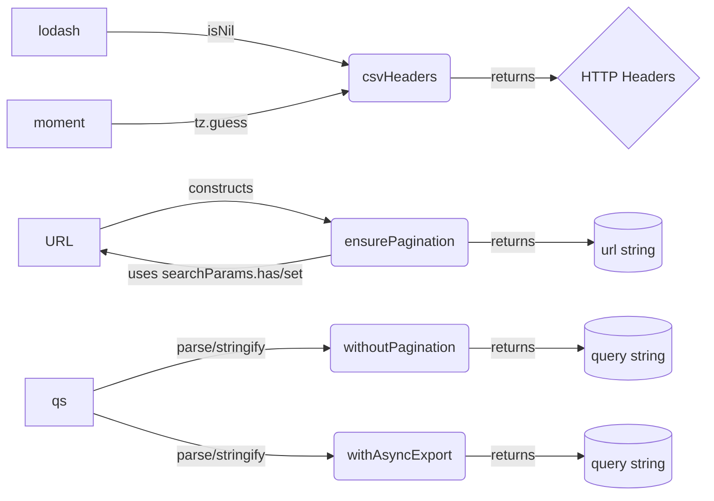
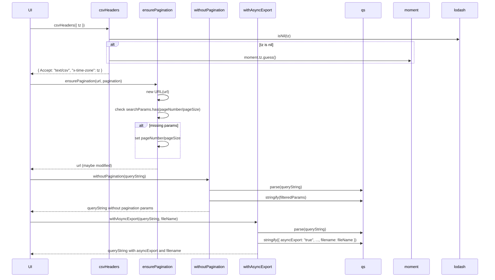

# Diagram: web/portal/src/modules/exports/exportUtils.js

> Auto-generated by Obscura crawlers

## Diagram 1

### SVG

<svg id="container" width="803.28125" xmlns="http://www.w3.org/2000/svg" class="flowchart" height="559.6749267578125" viewBox="0 0 803.28125 559.6749267578125" role="graphics-document document" aria-roledescription="flowchart-v2"><g><marker id="container_flowchart-v2-pointEnd" class="marker flowchart-v2" viewBox="0 0 10 10" refX="5" refY="5" markerUnits="userSpaceOnUse" markerWidth="8" markerHeight="8" orient="auto"><path d="M 0 0 L 10 5 L 0 10 z" class="arrowMarkerPath" style="stroke-width: 1; stroke-dasharray: 1, 0;"></path></marker><marker id="container_flowchart-v2-pointStart" class="marker flowchart-v2" viewBox="0 0 10 10" refX="4.5" refY="5" markerUnits="userSpaceOnUse" markerWidth="8" markerHeight="8" orient="auto"><path d="M 0 5 L 10 10 L 10 0 z" class="arrowMarkerPath" style="stroke-width: 1; stroke-dasharray: 1, 0;"></path></marker><marker id="container_flowchart-v2-circleEnd" class="marker flowchart-v2" viewBox="0 0 10 10" refX="11" refY="5" markerUnits="userSpaceOnUse" markerWidth="11" markerHeight="11" orient="auto"><circle cx="5" cy="5" r="5" class="arrowMarkerPath" style="stroke-width: 1; stroke-dasharray: 1, 0;"></circle></marker><marker id="container_flowchart-v2-circleStart" class="marker flowchart-v2" viewBox="0 0 10 10" refX="-1" refY="5" markerUnits="userSpaceOnUse" markerWidth="11" markerHeight="11" orient="auto"><circle cx="5" cy="5" r="5" class="arrowMarkerPath" style="stroke-width: 1; stroke-dasharray: 1, 0;"></circle></marker><marker id="container_flowchart-v2-crossEnd" class="marker cross flowchart-v2" viewBox="0 0 11 11" refX="12" refY="5.2" markerUnits="userSpaceOnUse" markerWidth="11" markerHeight="11" orient="auto"><path d="M 1,1 l 9,9 M 10,1 l -9,9" class="arrowMarkerPath" style="stroke-width: 2; stroke-dasharray: 1, 0;"></path></marker><marker id="container_flowchart-v2-crossStart" class="marker cross flowchart-v2" viewBox="0 0 11 11" refX="-1" refY="5.2" markerUnits="userSpaceOnUse" markerWidth="11" markerHeight="11" orient="auto"><path d="M 1,1 l 9,9 M 10,1 l -9,9" class="arrowMarkerPath" style="stroke-width: 2; stroke-dasharray: 1, 0;"></path></marker><g class="root"><g class="clusters"></g><g class="edgePaths"><path d="M122.781,35L144.286,35C165.792,35,208.802,35,254.431,41.198C300.06,47.395,348.308,59.791,372.432,65.989L396.556,72.186" id="L_L_csvHeaders_0" class="edge-thickness-normal edge-pattern-solid edge-thickness-normal edge-pattern-solid flowchart-link" style=";" data-edge="true" data-et="edge" data-id="L_L_csvHeaders_0" data-points="W3sieCI6MTIyLjc4MTI1LCJ5IjozNX0seyJ4IjoyNTEuODEyNSwieSI6MzV9LHsieCI6NDAwLjQyOTY4NzUsInkiOjczLjE4MTc2NDMyMzY2MzE5fV0=" marker-end="url(#container_flowchart-v2-pointEnd)"></path><path d="M128.641,139L149.169,139C169.698,139,210.755,139,255.407,132.965C300.058,126.93,348.304,114.859,372.426,108.824L396.549,102.789" id="L_M_csvHeaders_0" class="edge-thickness-normal edge-pattern-solid edge-thickness-normal edge-pattern-solid flowchart-link" style=";" data-edge="true" data-et="edge" data-id="L_M_csvHeaders_0" data-points="W3sieCI6MTI4LjY0MDYyNSwieSI6MTM5fSx7IngiOjI1MS44MTI1LCJ5IjoxMzl9LHsieCI6NDAwLjQyOTY4NzUsInkiOjEwMS44MTgyMzU2NzYzMzY4MX1d" marker-end="url(#container_flowchart-v2-pointEnd)"></path><path d="M512.992,87.5L525.611,87.417C538.229,87.333,563.466,87.167,583.962,87.083C604.458,87,620.214,87,628.091,87L635.969,87" id="L_csvHeaders_Headers_0" class="edge-thickness-normal edge-pattern-solid edge-thickness-normal edge-pattern-solid flowchart-link" style=";" data-edge="true" data-et="edge" data-id="L_csvHeaders_Headers_0" data-points="W3sieCI6NTEyLjk5MjE4NzUsInkiOjg3LjV9LHsieCI6NTg4LjcwMzEyNSwieSI6ODd9LHsieCI6NjM5Ljk2ODc1LCJ5Ijo4N31d" marker-end="url(#container_flowchart-v2-pointEnd)"></path><path d="M112.445,257.682L135.673,250.235C158.901,242.788,205.357,227.894,249.083,226.404C292.808,224.914,333.804,236.829,354.302,242.786L374.8,248.743" id="L_URLObj_ensurePagination_0" class="edge-thickness-normal edge-pattern-solid edge-thickness-normal edge-pattern-solid flowchart-link" style=";" data-edge="true" data-et="edge" data-id="L_URLObj_ensurePagination_0" data-points="W3sieCI6MTEyLjQ0NTMxMjUsInkiOjI1Ny42ODIyOTkxMTc3MjY5fSx7IngiOjI1MS44MTI1LCJ5IjoyMTN9LHsieCI6Mzc4LjY0MTM0MzE3NDc4MTg3LCJ5IjoyNDkuODU5NDY2NDM4MDgzMTZ9XQ==" marker-end="url(#container_flowchart-v2-pointEnd)"></path><path d="M378.617,286.972L357.483,290.836C336.349,294.699,294.081,302.427,250.371,301.575C206.662,300.724,161.511,291.294,138.936,286.578L116.361,281.863" id="L_ensurePagination_URLObj_0" class="edge-thickness-normal edge-pattern-solid edge-thickness-normal edge-pattern-solid flowchart-link" style=";" data-edge="true" data-et="edge" data-id="L_ensurePagination_URLObj_0" data-points="W3sieCI6Mzc4LjYxNzE4NzUsInkiOjI4Ni45NzE5Mjg3ODA1Mzl9LHsieCI6MjUxLjgxMjUsInkiOjMxMC4xNTQzODY1MjAzODU3NH0seyJ4IjoxMTIuNDQ1MzEyNSwieSI6MjgxLjA0NTM0OTk1NzIxODV9XQ==" marker-end="url(#container_flowchart-v2-pointEnd)"></path><path d="M534.805,272.329L543.788,272.246C552.771,272.162,570.737,271.996,593.743,271.912C616.75,271.829,644.797,271.829,658.82,271.829L672.844,271.829" id="L_ensurePagination_URLString_0" class="edge-thickness-normal edge-pattern-solid edge-thickness-normal edge-pattern-solid flowchart-link" style=";" data-edge="true" data-et="edge" data-id="L_ensurePagination_URLString_0" data-points="W3sieCI6NTM0LjgwNDY4NzUsInkiOjI3Mi4zMjkxNDczMzg4NjcyfSx7IngiOjU4OC43MDMxMjUsInkiOjI3MS44MjkxNDczMzg4NjcyfSx7IngiOjY3Ni44NDM3NSwieSI6MjcxLjgyOTE0NzMzODg2NzJ9XQ==" marker-end="url(#container_flowchart-v2-pointEnd)"></path><path d="M106.844,440.988L131.005,432.903C155.167,424.818,203.49,408.649,247.596,400.645C291.703,392.641,331.594,392.802,351.539,392.883L371.484,392.963" id="L_qsModule_withoutPagination_0" class="edge-thickness-normal edge-pattern-solid edge-thickness-normal edge-pattern-solid flowchart-link" style=";" data-edge="true" data-et="edge" data-id="L_qsModule_withoutPagination_0" data-points="W3sieCI6MTA2Ljg0Mzc1LCJ5Ijo0NDAuOTg3NzA4Mjc3OTg3OTZ9LHsieCI6MjUxLjgxMjUsInkiOjM5Mi40Nzk2MjU3MDE5MDQzfSx7IngiOjM3NS40ODQzNzUsInkiOjM5Mi45Nzk2MjU3MDE5MDQzfV0=" marker-end="url(#container_flowchart-v2-pointEnd)"></path><path d="M106.844,466.768L131.005,474.853C155.167,482.938,203.49,499.107,248.673,507.273C293.857,515.438,335.901,515.6,356.923,515.68L377.945,515.761" id="L_qsModule_withAsyncExport_0" class="edge-thickness-normal edge-pattern-solid edge-thickness-normal edge-pattern-solid flowchart-link" style=";" data-edge="true" data-et="edge" data-id="L_qsModule_withAsyncExport_0" data-points="W3sieCI6MTA2Ljg0Mzc1LCJ5Ijo0NjYuNzY4NDEwNDk2NDI2MX0seyJ4IjoyNTEuODEyNSwieSI6NTE1LjI3NjQ5MzA3MjUwOTh9LHsieCI6MzgxLjk0NTMxMjUsInkiOjUxNS43NzY0OTMwNzI1MDk4fV0=" marker-end="url(#container_flowchart-v2-pointEnd)"></path><path d="M537.938,392.98L546.398,392.896C554.859,392.813,571.781,392.646,592.477,392.563C613.172,392.48,637.641,392.48,649.875,392.48L662.109,392.48" id="L_withoutPagination_QueryStringNoPagination_0" class="edge-thickness-normal edge-pattern-solid edge-thickness-normal edge-pattern-solid flowchart-link" style=";" data-edge="true" data-et="edge" data-id="L_withoutPagination_QueryStringNoPagination_0" data-points="W3sieCI6NTM3LjkzNzUsInkiOjM5Mi45Nzk2MjU3MDE5MDQzfSx7IngiOjU4OC43MDMxMjUsInkiOjM5Mi40Nzk2MjU3MDE5MDQzfSx7IngiOjY2Ni4xMDkzNzUsInkiOjM5Mi40Nzk2MjU3MDE5MDQzfV0=" marker-end="url(#container_flowchart-v2-pointEnd)"></path><path d="M531.477,515.776L541.014,515.693C550.552,515.61,569.628,515.443,591.4,515.36C613.172,515.276,637.641,515.276,649.875,515.276L662.109,515.276" id="L_withAsyncExport_QueryStringWithAsyncExport_0" class="edge-thickness-normal edge-pattern-solid edge-thickness-normal edge-pattern-solid flowchart-link" style=";" data-edge="true" data-et="edge" data-id="L_withAsyncExport_QueryStringWithAsyncExport_0" data-points="W3sieCI6NTMxLjQ3NjU2MjUsInkiOjUxNS43NzY0OTMwNzI1MDk4fSx7IngiOjU4OC43MDMxMjUsInkiOjUxNS4yNzY0OTMwNzI1MDk4fSx7IngiOjY2Ni4xMDkzNzUsInkiOjUxNS4yNzY0OTMwNzI1MDk4fV0=" marker-end="url(#container_flowchart-v2-pointEnd)"></path></g><g class="edgeLabels"><g class="edgeLabel" transform="translate(251.8125, 35)"><g class="label" data-id="L_L_csvHeaders_0" transform="translate(-16.0625, -12)"><foreignObject width="32.125" height="24">

isNil

</foreignObject></g></g><g class="edgeLabel" transform="translate(251.8125, 139)"><g class="label" data-id="L_M_csvHeaders_0" transform="translate(-28.71875, -12)"><foreignObject width="57.4375" height="24">

tz.guess

</foreignObject></g></g><g class="edgeLabel" transform="translate(588.703125, 87)"><g class="label" data-id="L_csvHeaders_Headers_0" transform="translate(-26.265625, -12)"><foreignObject width="52.53125" height="24">

returns

</foreignObject></g></g><g class="edgeLabel" transform="translate(245.01417, 215.1796)"><g class="label" data-id="L_URLObj_ensurePagination_0" transform="translate(-37.84375, -12)"><foreignObject width="75.6875" height="24">

constructs

</foreignObject></g></g><g class="edgeLabel" transform="translate(245.2206, 308.77756)"><g class="label" data-id="L_ensurePagination_URLObj_0" transform="translate(-98.171875, -12)"><foreignObject width="196.34375" height="24">

uses searchParams.has/set

</foreignObject></g></g><g class="edgeLabel" transform="translate(588.703125, 271.8291473388672)"><g class="label" data-id="L_ensurePagination_URLString_0" transform="translate(-26.265625, -12)"><foreignObject width="52.53125" height="24">

returns

</foreignObject></g></g><g class="edgeLabel" transform="translate(237.96882, 397.11187)"><g class="label" data-id="L_qsModule_withoutPagination_0" transform="translate(-53.703125, -12)"><foreignObject width="107.40625" height="24">

parse/stringify

</foreignObject></g></g><g class="edgeLabel" transform="translate(251.8125, 515.2764930725098)"><g class="label" data-id="L_qsModule_withAsyncExport_0" transform="translate(-53.703125, -12)"><foreignObject width="107.40625" height="24">

parse/stringify

</foreignObject></g></g><g class="edgeLabel" transform="translate(588.703125, 392.4796257019043)"><g class="label" data-id="L_withoutPagination_QueryStringNoPagination_0" transform="translate(-26.265625, -12)"><foreignObject width="52.53125" height="24">

returns

</foreignObject></g></g><g class="edgeLabel" transform="translate(588.703125, 515.2764930725098)"><g class="label" data-id="L_withAsyncExport_QueryStringWithAsyncExport_0" transform="translate(-26.265625, -12)"><foreignObject width="52.53125" height="24">

returns

</foreignObject></g></g></g><g class="nodes"><g class="node default" id="flowchart-L-0" transform="translate(68.3203125, 35)"><rect class="basic label-container" style="" x="-54.4609375" y="-27" width="108.921875" height="54"></rect><g class="label" style="" transform="translate(-24.4609375, -12)"><rect></rect><foreignObject width="48.921875" height="24">

lodash

</foreignObject></g></g><g class="node default" id="flowchart-csvHeaders-1" transform="translate(456.2109375, 87)"><g class="basic label-container outer-path"><path d="M-51.28125 -27 C-13.324385963488986 -27, 24.63247807302203 -27, 51.28125 -27 C51.28125 -27, 51.28125 -27, 51.28125 -27 C51.37551042313156 -26.996101360060937, 51.46977084626312 -26.992202720121874, 51.69414672736166 -26.982922465033347 C51.81851373191967 -26.96742013408205, 51.94288073647768 -26.951917803130755, 52.10422295140367 -26.931806517013612 C52.22565769404428 -26.90634432906374, 52.34709243668489 -26.88088214111387, 52.508677435703994 -26.847001329696653 C52.598879896769404 -26.82014689351921, 52.689082357834806 -26.79329245734177, 52.90474734602342 -26.729086208503173 C53.03657134886722 -26.677648322975962, 53.16839535171103 -26.62621043744875, 53.289727123264846 -26.578866633275286 C53.39583414932535 -26.526994069060123, 53.50194117538586 -26.475121504844964, 53.660986965185366 -26.397368756032446 C53.79725738809582 -26.316169208825727, 53.93352781100627 -26.234969661619004, 54.015990790612136 -26.185832391312644 C54.11139802788341 -26.117712933207653, 54.206805265154685 -26.049593475102657, 54.35231356344834 -25.94570254698197 C54.44978318483723 -25.86314998869459, 54.54725280622612 -25.78059743040721, 54.667657858128706 -25.678619553365657 C54.77866164830872 -25.567615763185643, 54.889665438488734 -25.45661197300563, 54.95986955336566 -25.386407858128706 C55.05320951301233 -25.276201576022416, 55.14654947265899 -25.165995293916122, 55.22695254698197 -25.07106356344834 C55.3206958188042 -24.93976794210702, 55.41443909062642 -24.808472320765706, 55.467082391312644 -24.734740790612136 C55.53941662949485 -24.613348275911285, 55.61175086767705 -24.491955761210434, 55.67861875603245 -24.37973696518537 C55.73334668163581 -24.267789204050093, 55.78807460723917 -24.155841442914813, 55.86011663327529 -24.008477123264846 C55.89949800714063 -23.907551311731023, 55.938879381005975 -23.8066255001972, 56.010336208503176 -23.623497346023417 C56.040063343480675 -23.52364565978148, 56.069790478458174 -23.423793973539546, 56.12825132969665 -23.227427435703994 C56.1480897365622 -23.132813734915192, 56.16792814342775 -23.03820003412639, 56.21305651701361 -22.82297295140367 C56.232743311373206 -22.665036209403755, 56.2524301057328 -22.507099467403837, 56.26417246503335 -22.412896727361662 C56.268079168817444 -22.31844133843259, 56.27198587260154 -22.22398594950352, 56.28125 -22 C56.28125 -22, 56.28125 -22, 56.28125 -22 C56.28125 -5.4452545893437865, 56.28125 11.109490821312427, 56.28125 22 C56.28125 22, 56.28125 22, 56.28125 22 C56.27518856597029 22.14655196308333, 56.26912713194057 22.293103926166662, 56.26417246503335 22.412896727361662 C56.2464124179658 22.555376194581118, 56.228652370898246 22.697855661800574, 56.21305651701361 22.82297295140367 C56.185744368026356 22.953230562798236, 56.15843221903909 23.0834881741928, 56.12825132969665 23.227427435703994 C56.09908150497121 23.32540714980768, 56.069911680245774 23.423386863911364, 56.010336208503176 23.623497346023417 C55.956243992343616 23.762123815283577, 55.902151776184056 23.900750284543737, 55.86011663327529 24.008477123264846 C55.8028604647571 24.12559648794257, 55.745604296238916 24.242715852620293, 55.67861875603245 24.379736965185366 C55.63403764666854 24.454553720152866, 55.58945653730463 24.52937047512037, 55.467082391312644 24.734740790612133 C55.38254000382907 24.85314977163622, 55.2979976163455 24.971558752660314, 55.22695254698197 25.07106356344834 C55.172030448218344 25.135909962923186, 55.11710834945472 25.20075636239803, 54.95986955336566 25.386407858128706 C54.85031397078954 25.495963440704823, 54.74075838821342 25.605519023280937, 54.667657858128706 25.678619553365657 C54.58869632713948 25.745496558698846, 54.509734796150255 25.812373564032036, 54.35231356344834 25.94570254698197 C54.26549396580353 26.00769054824483, 54.178674368158724 26.069678549507692, 54.015990790612136 26.185832391312644 C53.903414018922284 26.252913586864647, 53.790837247232425 26.319994782416654, 53.660986965185366 26.397368756032446 C53.538243709967986 26.457374277105206, 53.4155004547506 26.517379798177966, 53.289727123264846 26.578866633275286 C53.209415075242106 26.610204491658667, 53.12910302721937 26.641542350042048, 52.90474734602342 26.729086208503173 C52.75349464616186 26.77411608825504, 52.6022419463003 26.819145968006907, 52.508677435703994 26.847001329696653 C52.4268424850353 26.86416031442775, 52.3450075343666 26.881319299158847, 52.10422295140367 26.931806517013612 C51.961596035750986 26.949584943509198, 51.8189691200983 26.967363370004783, 51.69414672736166 26.982922465033347 C51.555197443109755 26.988669449940605, 51.41624815885785 26.99441643484786, 51.28125 27 C51.28125 27, 51.28125 27, 51.28125 27 C11.2489993217008 27, -28.7832513565984 27, -51.28125 27 C-51.28125 27, -51.28125 27, -51.28125 27 C-51.42516986209719 26.994047430472346, -51.569089724194384 26.988094860944695, -51.69414672736166 26.982922465033347 C-51.80717515105651 26.968833486712704, -51.920203574751355 26.954744508392064, -52.10422295140367 26.931806517013612 C-52.2042122741859 26.910840960746107, -52.30420159696813 26.889875404478605, -52.508677435703994 26.847001329696653 C-52.60369038056989 26.81871475044155, -52.69870332543578 26.79042817118645, -52.90474734602342 26.729086208503173 C-52.986779157861136 26.69707729619683, -53.068810969698845 26.665068383890492, -53.289727123264846 26.578866633275286 C-53.43342378024361 26.50861761826299, -53.577120437222376 26.438368603250687, -53.660986965185366 26.397368756032446 C-53.77021706460193 26.33228174430578, -53.8794471640185 26.267194732579117, -54.015990790612136 26.185832391312644 C-54.10623975685039 26.121395867936478, -54.196488723088656 26.05695934456031, -54.35231356344834 25.94570254698197 C-54.4553834649864 25.858406793359965, -54.55845336652445 25.771111039737956, -54.667657858128706 25.67861955336566 C-54.74388752804201 25.602389883452354, -54.82011719795531 25.52616021353905, -54.95986955336566 25.386407858128706 C-55.025048386313635 25.309451355485944, -55.09022721926162 25.232494852843182, -55.22695254698197 25.07106356344834 C-55.28127038750114 24.9949866943328, -55.3355882280203 24.918909825217252, -55.467082391312644 24.734740790612133 C-55.52144354089684 24.64351101041548, -55.575804690481036 24.55228123021883, -55.67861875603244 24.37973696518537 C-55.716968291032266 24.301291737516333, -55.7553178260321 24.222846509847297, -55.86011663327528 24.00847712326485 C-55.91743024891489 23.861594914682083, -55.974743864554505 23.714712706099313, -56.010336208503176 23.623497346023417 C-56.04734334034576 23.499192581361193, -56.08435047218835 23.37488781669897, -56.12825132969665 23.227427435703994 C-56.149395441747664 23.126586541341972, -56.17053955379868 23.025745646979953, -56.21305651701361 22.82297295140367 C-56.22407709046172 22.73456071762035, -56.235097663909826 22.646148483837035, -56.26417246503335 22.412896727361662 C-56.268550659405285 22.307041747034784, -56.27292885377722 22.201186766707902, -56.28125 22 C-56.28125 22, -56.28125 22, -56.28125 22 C-56.28125 7.79815782858137, -56.28125 -6.403684342837259, -56.28125 -22 C-56.28125 -22, -56.28125 -22, -56.28125 -22 C-56.275620033077615 -22.136120050226545, -56.26999006615523 -22.27224010045309, -56.26417246503335 -22.41289672736166 C-56.24584363958507 -22.559939202795245, -56.22751481413678 -22.706981678228832, -56.21305651701361 -22.82297295140367 C-56.17930576429805 -22.98393767203217, -56.14555501158248 -23.14490239266067, -56.12825132969665 -23.227427435703994 C-56.091586684391636 -23.350581808365185, -56.05492203908662 -23.47373618102638, -56.010336208503176 -23.623497346023417 C-55.9551767177017 -23.764859005775744, -55.90001722690022 -23.90622066552807, -55.86011663327529 -24.008477123264846 C-55.810558085136094 -24.109850753785885, -55.7609995369969 -24.211224384306924, -55.67861875603245 -24.379736965185366 C-55.61838109691575 -24.480828800858674, -55.55814343779904 -24.58192063653198, -55.467082391312644 -24.734740790612133 C-55.392461743785006 -24.83925351020882, -55.31784109625737 -24.943766229805508, -55.22695254698197 -25.07106356344834 C-55.14123081079194 -25.172275026116218, -55.05550907460191 -25.27348648878409, -54.95986955336566 -25.386407858128706 C-54.8981966594796 -25.448080752014764, -54.83652376559354 -25.509753645900823, -54.667657858128706 -25.678619553365657 C-54.55948169155062 -25.770240092868036, -54.45130552497253 -25.861860632370412, -54.35231356344834 -25.945702546981966 C-54.219369735168534 -26.04062261593936, -54.08642590688873 -26.135542684896752, -54.015990790612136 -26.185832391312644 C-53.906061460565944 -26.25133605405797, -53.79613213051975 -26.31683971680329, -53.660986965185366 -26.397368756032446 C-53.51800652381378 -26.467267634569765, -53.375026082442204 -26.53716651310708, -53.289727123264846 -26.578866633275286 C-53.20989639999405 -26.610016678157653, -53.13006567672326 -26.641166723040016, -52.90474734602342 -26.729086208503173 C-52.754048061843754 -26.77395132926805, -52.603348777664095 -26.81881645003293, -52.508677435703994 -26.847001329696653 C-52.41994901052497 -26.86560572403453, -52.33122058534594 -26.88421011837241, -52.10422295140367 -26.931806517013612 C-51.95498664199604 -26.950408803581574, -51.8057503325884 -26.96901109014954, -51.69414672736166 -26.982922465033347 C-51.53361110780789 -26.989562267372882, -51.373075488254116 -26.99620206971242, -51.28125 -27 C-51.28125 -27, -51.28125 -27, -51.28125 -27" stroke="none" stroke-width="0" fill="#ECECFF" style=""></path><path d="M-51.28125 -27 C-29.954141576813957 -27, -8.627033153627913 -27, 51.28125 -27 M-51.28125 -27 C-22.936387169055863 -27, 5.408475661888275 -27, 51.28125 -27 M51.28125 -27 C51.28125 -27, 51.28125 -27, 51.28125 -27 M51.28125 -27 C51.28125 -27, 51.28125 -27, 51.28125 -27 M51.28125 -27 C51.42164741497823 -26.994193119962855, 51.56204482995646 -26.988386239925713, 51.69414672736166 -26.982922465033347 M51.28125 -27 C51.40532791740016 -26.994868099375527, 51.529405834800315 -26.989736198751054, 51.69414672736166 -26.982922465033347 M51.69414672736166 -26.982922465033347 C51.81026030982117 -26.96844892207374, 51.92637389228068 -26.953975379114134, 52.10422295140367 -26.931806517013612 M51.69414672736166 -26.982922465033347 C51.79753469605979 -26.970035168174853, 51.90092266475792 -26.95714787131636, 52.10422295140367 -26.931806517013612 M52.10422295140367 -26.931806517013612 C52.25945153226597 -26.899258506327698, 52.41468011312827 -26.866710495641783, 52.508677435703994 -26.847001329696653 M52.10422295140367 -26.931806517013612 C52.24604938470257 -26.902068641160373, 52.387875818001476 -26.87233076530713, 52.508677435703994 -26.847001329696653 M52.508677435703994 -26.847001329696653 C52.624729782626524 -26.81245104906281, 52.74078212954905 -26.777900768428964, 52.90474734602342 -26.729086208503173 M52.508677435703994 -26.847001329696653 C52.65674611703678 -26.80291937333134, 52.80481479836958 -26.758837416966024, 52.90474734602342 -26.729086208503173 M52.90474734602342 -26.729086208503173 C53.04648244305311 -26.673781002023894, 53.1882175400828 -26.61847579554462, 53.289727123264846 -26.578866633275286 M52.90474734602342 -26.729086208503173 C53.04842115945868 -26.673024512534973, 53.192094972893926 -26.61696281656677, 53.289727123264846 -26.578866633275286 M53.289727123264846 -26.578866633275286 C53.36671489674834 -26.541229604210617, 53.44370267023184 -26.503592575145944, 53.660986965185366 -26.397368756032446 M53.289727123264846 -26.578866633275286 C53.42282227303262 -26.51380037932978, 53.5559174228004 -26.44873412538427, 53.660986965185366 -26.397368756032446 M53.660986965185366 -26.397368756032446 C53.77659748254825 -26.328479840435776, 53.89220799991113 -26.259590924839106, 54.015990790612136 -26.185832391312644 M53.660986965185366 -26.397368756032446 C53.757403120370526 -26.33991719774681, 53.853819275555686 -26.28246563946118, 54.015990790612136 -26.185832391312644 M54.015990790612136 -26.185832391312644 C54.094778315456665 -26.129579179802253, 54.173565840301194 -26.073325968291865, 54.35231356344834 -25.94570254698197 M54.015990790612136 -26.185832391312644 C54.09281863118047 -26.13097836748203, 54.169646471748806 -26.07612434365141, 54.35231356344834 -25.94570254698197 M54.35231356344834 -25.94570254698197 C54.42036655078109 -25.888064606838526, 54.48841953811383 -25.830426666695086, 54.667657858128706 -25.678619553365657 M54.35231356344834 -25.94570254698197 C54.46473806769422 -25.850483849018037, 54.57716257194009 -25.755265151054108, 54.667657858128706 -25.678619553365657 M54.667657858128706 -25.678619553365657 C54.74919498871533 -25.597082422779028, 54.83073211930196 -25.5155452921924, 54.95986955336566 -25.386407858128706 M54.667657858128706 -25.678619553365657 C54.75003487539413 -25.596242536100238, 54.83241189265954 -25.513865518834816, 54.95986955336566 -25.386407858128706 M54.95986955336566 -25.386407858128706 C55.04263439975665 -25.28868758864951, 55.125399246147644 -25.190967319170316, 55.22695254698197 -25.07106356344834 M54.95986955336566 -25.386407858128706 C55.03822645707131 -25.29389203674364, 55.11658336077696 -25.20137621535857, 55.22695254698197 -25.07106356344834 M55.22695254698197 -25.07106356344834 C55.316558920801455 -24.945562028265286, 55.40616529462094 -24.820060493082234, 55.467082391312644 -24.734740790612136 M55.22695254698197 -25.07106356344834 C55.30177773823434 -24.966264362540425, 55.376602929486715 -24.86146516163251, 55.467082391312644 -24.734740790612136 M55.467082391312644 -24.734740790612136 C55.5194121447556 -24.64692013301269, 55.57174189819856 -24.559099475413245, 55.67861875603245 -24.37973696518537 M55.467082391312644 -24.734740790612136 C55.51726477844809 -24.650523878660728, 55.56744716558353 -24.56630696670932, 55.67861875603245 -24.37973696518537 M55.67861875603245 -24.37973696518537 C55.750939524696875 -24.231802468375793, 55.8232602933613 -24.083867971566217, 55.86011663327529 -24.008477123264846 M55.67861875603245 -24.37973696518537 C55.74795005224496 -24.237917532016116, 55.81728134845748 -24.096098098846863, 55.86011663327529 -24.008477123264846 M55.86011663327529 -24.008477123264846 C55.89191394784271 -23.926987589956884, 55.92371126241013 -23.845498056648918, 56.010336208503176 -23.623497346023417 M55.86011663327529 -24.008477123264846 C55.90734035213179 -23.887453104002986, 55.95456407098829 -23.76642908474113, 56.010336208503176 -23.623497346023417 M56.010336208503176 -23.623497346023417 C56.035476777949626 -23.53905166182913, 56.060617347396075 -23.45460597763485, 56.12825132969665 -23.227427435703994 M56.010336208503176 -23.623497346023417 C56.04582110073327 -23.504305694087552, 56.081305992963365 -23.385114042151688, 56.12825132969665 -23.227427435703994 M56.12825132969665 -23.227427435703994 C56.15499573377912 -23.099877523920135, 56.18174013786158 -22.972327612136276, 56.21305651701361 -22.82297295140367 M56.12825132969665 -23.227427435703994 C56.15378484184686 -23.105652532354167, 56.17931835399706 -22.983877629004336, 56.21305651701361 -22.82297295140367 M56.21305651701361 -22.82297295140367 C56.22835321474858 -22.700255633414283, 56.24364991248355 -22.577538315424892, 56.26417246503335 -22.412896727361662 M56.21305651701361 -22.82297295140367 C56.22455356379005 -22.730738224036468, 56.23605061056649 -22.638503496669262, 56.26417246503335 -22.412896727361662 M56.26417246503335 -22.412896727361662 C56.267946525242294 -22.32164836439927, 56.27172058545124 -22.230400001436873, 56.28125 -22 M56.26417246503335 -22.412896727361662 C56.27048089669909 -22.260372912030267, 56.27678932836483 -22.10784909669887, 56.28125 -22 M56.28125 -22 C56.28125 -22, 56.28125 -22, 56.28125 -22 M56.28125 -22 C56.28125 -22, 56.28125 -22, 56.28125 -22 M56.28125 -22 C56.28125 -9.34901915238882, 56.28125 3.30196169522236, 56.28125 22 M56.28125 -22 C56.28125 -4.837756023594313, 56.28125 12.324487952811374, 56.28125 22 M56.28125 22 C56.28125 22, 56.28125 22, 56.28125 22 M56.28125 22 C56.28125 22, 56.28125 22, 56.28125 22 M56.28125 22 C56.2773293200915 22.094793300462428, 56.27340864018301 22.18958660092486, 56.26417246503335 22.412896727361662 M56.28125 22 C56.27716404166858 22.098789364300828, 56.273078083337154 22.197578728601655, 56.26417246503335 22.412896727361662 M56.26417246503335 22.412896727361662 C56.24440058435097 22.571516071940948, 56.224628703668586 22.730135416520238, 56.21305651701361 22.82297295140367 M56.26417246503335 22.412896727361662 C56.243879878656394 22.575693418411895, 56.22358729227943 22.738490109462127, 56.21305651701361 22.82297295140367 M56.21305651701361 22.82297295140367 C56.182990984314806 22.966362051854112, 56.152925451616 23.109751152304554, 56.12825132969665 23.227427435703994 M56.21305651701361 22.82297295140367 C56.194092059762916 22.913418595355843, 56.17512760251221 23.00386423930801, 56.12825132969665 23.227427435703994 M56.12825132969665 23.227427435703994 C56.086299200262104 23.368342154483678, 56.044347070827556 23.509256873263357, 56.010336208503176 23.623497346023417 M56.12825132969665 23.227427435703994 C56.10326287380257 23.311362179482536, 56.07827441790849 23.395296923261082, 56.010336208503176 23.623497346023417 M56.010336208503176 23.623497346023417 C55.95803547179439 23.75753264692988, 55.9057347350856 23.891567947836343, 55.86011663327529 24.008477123264846 M56.010336208503176 23.623497346023417 C55.959012425307435 23.755028929652976, 55.907688642111694 23.886560513282536, 55.86011663327529 24.008477123264846 M55.86011663327529 24.008477123264846 C55.79172984769895 24.148364529047303, 55.723343062122616 24.28825193482976, 55.67861875603245 24.379736965185366 M55.86011663327529 24.008477123264846 C55.814366056690616 24.102061423470587, 55.76861548010594 24.195645723676325, 55.67861875603245 24.379736965185366 M55.67861875603245 24.379736965185366 C55.61094842888103 24.493302427267757, 55.54327810172961 24.60686788935015, 55.467082391312644 24.734740790612133 M55.67861875603245 24.379736965185366 C55.60290518774542 24.506800727551752, 55.52719161945839 24.633864489918135, 55.467082391312644 24.734740790612133 M55.467082391312644 24.734740790612133 C55.410896333103345 24.81343426140648, 55.35471027489405 24.89212773220083, 55.22695254698197 25.07106356344834 M55.467082391312644 24.734740790612133 C55.39370772356081 24.837508406953276, 55.32033305580897 24.94027602329442, 55.22695254698197 25.07106356344834 M55.22695254698197 25.07106356344834 C55.14079350287136 25.17279135460237, 55.05463445876076 25.274519145756404, 54.95986955336566 25.386407858128706 M55.22695254698197 25.07106356344834 C55.12417241837584 25.192415831983336, 55.021392289769715 25.31376810051833, 54.95986955336566 25.386407858128706 M54.95986955336566 25.386407858128706 C54.868387279864194 25.477890131630165, 54.77690500636274 25.569372405131624, 54.667657858128706 25.678619553365657 M54.95986955336566 25.386407858128706 C54.87081566839158 25.475461743102787, 54.781761783417494 25.564515628076865, 54.667657858128706 25.678619553365657 M54.667657858128706 25.678619553365657 C54.54281043042054 25.784359930788348, 54.41796300271237 25.89010030821104, 54.35231356344834 25.94570254698197 M54.667657858128706 25.678619553365657 C54.584139049228014 25.74935637619949, 54.50062024032733 25.820093199033323, 54.35231356344834 25.94570254698197 M54.35231356344834 25.94570254698197 C54.26487550770989 26.008132118836375, 54.17743745197144 26.07056169069078, 54.015990790612136 26.185832391312644 M54.35231356344834 25.94570254698197 C54.21995934075649 26.040201645640924, 54.087605118064644 26.134700744299877, 54.015990790612136 26.185832391312644 M54.015990790612136 26.185832391312644 C53.89756637392899 26.256398026962067, 53.77914195724584 26.326963662611487, 53.660986965185366 26.397368756032446 M54.015990790612136 26.185832391312644 C53.913563074931645 26.24686606213452, 53.81113535925116 26.307899732956397, 53.660986965185366 26.397368756032446 M53.660986965185366 26.397368756032446 C53.54452185536248 26.45430507884172, 53.42805674553961 26.511241401650995, 53.289727123264846 26.578866633275286 M53.660986965185366 26.397368756032446 C53.53485878526148 26.45902906596058, 53.40873060533759 26.52068937588871, 53.289727123264846 26.578866633275286 M53.289727123264846 26.578866633275286 C53.181878819693345 26.620949171915747, 53.074030516121844 26.66303171055621, 52.90474734602342 26.729086208503173 M53.289727123264846 26.578866633275286 C53.1957594362689 26.615532938520783, 53.101791749272955 26.652199243766283, 52.90474734602342 26.729086208503173 M52.90474734602342 26.729086208503173 C52.74778938528995 26.77581461800856, 52.59083142455648 26.822543027513948, 52.508677435703994 26.847001329696653 M52.90474734602342 26.729086208503173 C52.79298562862308 26.76235911338359, 52.68122391122274 26.795632018264005, 52.508677435703994 26.847001329696653 M52.508677435703994 26.847001329696653 C52.35754206992325 26.87869108343353, 52.2064067041425 26.91038083717041, 52.10422295140367 26.931806517013612 M52.508677435703994 26.847001329696653 C52.4130347032575 26.86705550181113, 52.317391970811 26.887109673925607, 52.10422295140367 26.931806517013612 M52.10422295140367 26.931806517013612 C52.02193926662401 26.942063167625083, 51.93965558184435 26.95231981823655, 51.69414672736166 26.982922465033347 M52.10422295140367 26.931806517013612 C52.00854567876073 26.943732676611162, 51.9128684061178 26.955658836208716, 51.69414672736166 26.982922465033347 M51.69414672736166 26.982922465033347 C51.55391846670421 26.98872234879603, 51.41369020604676 26.994522232558715, 51.28125 27 M51.69414672736166 26.982922465033347 C51.57109003049373 26.988012127664174, 51.448033333625794 26.993101790295, 51.28125 27 M51.28125 27 C51.28125 27, 51.28125 27, 51.28125 27 M51.28125 27 C51.28125 27, 51.28125 27, 51.28125 27 M51.28125 27 C22.624046153534273 27, -6.033157692931454 27, -51.28125 27 M51.28125 27 C22.35505534864388 27, -6.57113930271224 27, -51.28125 27 M-51.28125 27 C-51.28125 27, -51.28125 27, -51.28125 27 M-51.28125 27 C-51.28125 27, -51.28125 27, -51.28125 27 M-51.28125 27 C-51.403971406512106 26.99492420508087, -51.52669281302421 26.98984841016174, -51.69414672736166 26.982922465033347 M-51.28125 27 C-51.40348142333246 26.99494447093509, -51.52571284666492 26.989888941870177, -51.69414672736166 26.982922465033347 M-51.69414672736166 26.982922465033347 C-51.84304449695799 26.964362377408857, -51.99194226655431 26.945802289784364, -52.10422295140367 26.931806517013612 M-51.69414672736166 26.982922465033347 C-51.82590946411605 26.966498257025165, -51.95767220087044 26.950074049016987, -52.10422295140367 26.931806517013612 M-52.10422295140367 26.931806517013612 C-52.25124717348741 26.900978779461113, -52.398271395571136 26.870151041908617, -52.508677435703994 26.847001329696653 M-52.10422295140367 26.931806517013612 C-52.24735877390664 26.901794091115725, -52.3904945964096 26.87178166521784, -52.508677435703994 26.847001329696653 M-52.508677435703994 26.847001329696653 C-52.643285262525396 26.806926843350453, -52.7778930893468 26.766852357004254, -52.90474734602342 26.729086208503173 M-52.508677435703994 26.847001329696653 C-52.620430684888895 26.813730945913203, -52.7321839340738 26.780460562129758, -52.90474734602342 26.729086208503173 M-52.90474734602342 26.729086208503173 C-53.028920886009814 26.680633542846394, -53.153094425996215 26.63218087718962, -53.289727123264846 26.578866633275286 M-52.90474734602342 26.729086208503173 C-53.02569170540769 26.68189357302736, -53.14663606479196 26.634700937551546, -53.289727123264846 26.578866633275286 M-53.289727123264846 26.578866633275286 C-53.40422737828797 26.522890869446485, -53.518727633311094 26.466915105617684, -53.660986965185366 26.397368756032446 M-53.289727123264846 26.578866633275286 C-53.42986026970987 26.510359712409397, -53.569993416154894 26.441852791543507, -53.660986965185366 26.397368756032446 M-53.660986965185366 26.397368756032446 C-53.77610930640395 26.328770730278393, -53.89123164762254 26.260172704524344, -54.015990790612136 26.185832391312644 M-53.660986965185366 26.397368756032446 C-53.74888451478266 26.344993184903775, -53.836782064379946 26.292617613775107, -54.015990790612136 26.185832391312644 M-54.015990790612136 26.185832391312644 C-54.12968119295688 26.104659004251427, -54.24337159530162 26.023485617190214, -54.35231356344834 25.94570254698197 M-54.015990790612136 26.185832391312644 C-54.137409182447975 26.099141325808674, -54.25882757428381 26.012450260304703, -54.35231356344834 25.94570254698197 M-54.35231356344834 25.94570254698197 C-54.46957762432077 25.846384953641145, -54.5868416851932 25.74706736030032, -54.667657858128706 25.67861955336566 M-54.35231356344834 25.94570254698197 C-54.47210156298732 25.844247286633568, -54.5918895625263 25.742792026285166, -54.667657858128706 25.67861955336566 M-54.667657858128706 25.67861955336566 C-54.73060201269419 25.615675398800175, -54.79354616725968 25.552731244234685, -54.95986955336566 25.386407858128706 M-54.667657858128706 25.67861955336566 C-54.75133495567509 25.59494245581927, -54.835012053221476 25.511265358272887, -54.95986955336566 25.386407858128706 M-54.95986955336566 25.386407858128706 C-55.050712997747 25.279149206026272, -55.14155644212833 25.17189055392384, -55.22695254698197 25.07106356344834 M-54.95986955336566 25.386407858128706 C-55.04410010240131 25.286957036807053, -55.12833065143697 25.187506215485396, -55.22695254698197 25.07106356344834 M-55.22695254698197 25.07106356344834 C-55.31479962742727 24.948026071947517, -55.40264670787257 24.824988580446696, -55.467082391312644 24.734740790612133 M-55.22695254698197 25.07106356344834 C-55.31735261037493 24.944450396852424, -55.4077526737679 24.817837230256508, -55.467082391312644 24.734740790612133 M-55.467082391312644 24.734740790612133 C-55.516749393792416 24.651388805712724, -55.56641639627219 24.56803682081332, -55.67861875603244 24.37973696518537 M-55.467082391312644 24.734740790612133 C-55.52971468896692 24.62963023294519, -55.5923469866212 24.524519675278242, -55.67861875603244 24.37973696518537 M-55.67861875603244 24.37973696518537 C-55.73495695187739 24.264495343623604, -55.791295147722344 24.14925372206184, -55.86011663327528 24.00847712326485 M-55.67861875603244 24.37973696518537 C-55.738350447022775 24.25755383835439, -55.79808213801311 24.135370711523407, -55.86011663327528 24.00847712326485 M-55.86011663327528 24.00847712326485 C-55.89746605149697 23.91275876774914, -55.93481546971866 23.81704041223343, -56.010336208503176 23.623497346023417 M-55.86011663327528 24.00847712326485 C-55.90827924352353 23.885046931583048, -55.956441853771786 23.76161673990125, -56.010336208503176 23.623497346023417 M-56.010336208503176 23.623497346023417 C-56.04136021808526 23.519289534772785, -56.07238422766735 23.41508172352215, -56.12825132969665 23.227427435703994 M-56.010336208503176 23.623497346023417 C-56.05263382396073 23.481422160148732, -56.09493143941829 23.339346974274047, -56.12825132969665 23.227427435703994 M-56.12825132969665 23.227427435703994 C-56.152533101745334 23.11162235464046, -56.17681487379402 22.995817273576925, -56.21305651701361 22.82297295140367 M-56.12825132969665 23.227427435703994 C-56.15477552779402 23.100927734419717, -56.1812997258914 22.974428033135435, -56.21305651701361 22.82297295140367 M-56.21305651701361 22.82297295140367 C-56.225110686436906 22.726268723612385, -56.23716485586021 22.6295644958211, -56.26417246503335 22.412896727361662 M-56.21305651701361 22.82297295140367 C-56.22450679980281 22.731113386780226, -56.23595708259201 22.639253822156782, -56.26417246503335 22.412896727361662 M-56.26417246503335 22.412896727361662 C-56.26923122571554 22.290587170727214, -56.27428998639772 22.168277614092762, -56.28125 22 M-56.26417246503335 22.412896727361662 C-56.27032962276038 22.26403037865823, -56.27648678048741 22.115164029954798, -56.28125 22 M-56.28125 22 C-56.28125 22, -56.28125 22, -56.28125 22 M-56.28125 22 C-56.28125 22, -56.28125 22, -56.28125 22 M-56.28125 22 C-56.28125 4.8578194823051035, -56.28125 -12.284361035389793, -56.28125 -22 M-56.28125 22 C-56.28125 11.482788613941713, -56.28125 0.9655772278834256, -56.28125 -22 M-56.28125 -22 C-56.28125 -22, -56.28125 -22, -56.28125 -22 M-56.28125 -22 C-56.28125 -22, -56.28125 -22, -56.28125 -22 M-56.28125 -22 C-56.27750015386476 -22.090662920636696, -56.273750307729514 -22.18132584127339, -56.26417246503335 -22.41289672736166 M-56.28125 -22 C-56.2772933442874 -22.09566311521063, -56.2733366885748 -22.191326230421264, -56.26417246503335 -22.41289672736166 M-56.26417246503335 -22.41289672736166 C-56.253196296274886 -22.500952725798403, -56.24222012751642 -22.58900872423515, -56.21305651701361 -22.82297295140367 M-56.26417246503335 -22.41289672736166 C-56.25323978617178 -22.500603829350347, -56.24230710731021 -22.588310931339034, -56.21305651701361 -22.82297295140367 M-56.21305651701361 -22.82297295140367 C-56.18320110586162 -22.965359936246042, -56.15334569470962 -23.10774692108841, -56.12825132969665 -23.227427435703994 M-56.21305651701361 -22.82297295140367 C-56.193166867889275 -22.917831037730778, -56.17327721876494 -23.012689124057882, -56.12825132969665 -23.227427435703994 M-56.12825132969665 -23.227427435703994 C-56.09218380014172 -23.348576131915962, -56.056116270586784 -23.46972482812793, -56.010336208503176 -23.623497346023417 M-56.12825132969665 -23.227427435703994 C-56.09789269197094 -23.32940030228582, -56.06753405424523 -23.431373168867644, -56.010336208503176 -23.623497346023417 M-56.010336208503176 -23.623497346023417 C-55.96490849862732 -23.739918588741382, -55.919480788751464 -23.856339831459348, -55.86011663327529 -24.008477123264846 M-56.010336208503176 -23.623497346023417 C-55.95082810573979 -23.77600354310962, -55.8913200029764 -23.92850974019582, -55.86011663327529 -24.008477123264846 M-55.86011663327529 -24.008477123264846 C-55.789840654641225 -24.152228935213493, -55.71956467600717 -24.29598074716214, -55.67861875603245 -24.379736965185366 M-55.86011663327529 -24.008477123264846 C-55.7904408246057 -24.15100126792877, -55.720765015936124 -24.293525412592697, -55.67861875603245 -24.379736965185366 M-55.67861875603245 -24.379736965185366 C-55.61291169019367 -24.49000764966665, -55.54720462435488 -24.600278334147937, -55.467082391312644 -24.734740790612133 M-55.67861875603245 -24.379736965185366 C-55.610297033926855 -24.494395609051907, -55.541975311821254 -24.60905425291845, -55.467082391312644 -24.734740790612133 M-55.467082391312644 -24.734740790612133 C-55.40631893591403 -24.819845305062366, -55.345555480515415 -24.9049498195126, -55.22695254698197 -25.07106356344834 M-55.467082391312644 -24.734740790612133 C-55.371980176751315 -24.86793972968313, -55.27687796218999 -25.001138668754127, -55.22695254698197 -25.07106356344834 M-55.22695254698197 -25.07106356344834 C-55.12573740616826 -25.190568054388432, -55.02452226535455 -25.310072545328527, -54.95986955336566 -25.386407858128706 M-55.22695254698197 -25.07106356344834 C-55.168111207063106 -25.14053740221105, -55.10926986714425 -25.210011240973756, -54.95986955336566 -25.386407858128706 M-54.95986955336566 -25.386407858128706 C-54.85147269885404 -25.494804712640324, -54.74307584434242 -25.603201567151945, -54.667657858128706 -25.678619553365657 M-54.95986955336566 -25.386407858128706 C-54.89583499948557 -25.45044241200879, -54.83180044560549 -25.514476965888875, -54.667657858128706 -25.678619553365657 M-54.667657858128706 -25.678619553365657 C-54.58069723547013 -25.752271443754008, -54.49373661281156 -25.825923334142356, -54.35231356344834 -25.945702546981966 M-54.667657858128706 -25.678619553365657 C-54.548308350681154 -25.779703429857012, -54.4289588432336 -25.88078730634837, -54.35231356344834 -25.945702546981966 M-54.35231356344834 -25.945702546981966 C-54.28009392897625 -25.99726637489988, -54.20787429450416 -26.048830202817793, -54.015990790612136 -26.185832391312644 M-54.35231356344834 -25.945702546981966 C-54.2513621225959 -26.017780490358877, -54.15041068174346 -26.089858433735788, -54.015990790612136 -26.185832391312644 M-54.015990790612136 -26.185832391312644 C-53.93946429868082 -26.231432282774236, -53.8629378067495 -26.277032174235824, -53.660986965185366 -26.397368756032446 M-54.015990790612136 -26.185832391312644 C-53.94432059467999 -26.228538558458915, -53.87265039874786 -26.271244725605182, -53.660986965185366 -26.397368756032446 M-53.660986965185366 -26.397368756032446 C-53.5509962592529 -26.451139935645934, -53.44100555332044 -26.504911115259425, -53.289727123264846 -26.578866633275286 M-53.660986965185366 -26.397368756032446 C-53.545806970491675 -26.453676824337396, -53.43062697579799 -26.509984892642347, -53.289727123264846 -26.578866633275286 M-53.289727123264846 -26.578866633275286 C-53.16369455444813 -26.62804469423264, -53.03766198563141 -26.67722275518999, -52.90474734602342 -26.729086208503173 M-53.289727123264846 -26.578866633275286 C-53.17667679524668 -26.62297900815365, -53.06362646722852 -26.66709138303201, -52.90474734602342 -26.729086208503173 M-52.90474734602342 -26.729086208503173 C-52.7820178249711 -26.765624370004083, -52.65928830391878 -26.802162531504994, -52.508677435703994 -26.847001329696653 M-52.90474734602342 -26.729086208503173 C-52.82132323836015 -26.753922641439065, -52.737899130696874 -26.778759074374953, -52.508677435703994 -26.847001329696653 M-52.508677435703994 -26.847001329696653 C-52.4166970479286 -26.866287588886664, -52.32471666015321 -26.885573848076678, -52.10422295140367 -26.931806517013612 M-52.508677435703994 -26.847001329696653 C-52.39360554926334 -26.871129366999533, -52.27853366282268 -26.895257404302416, -52.10422295140367 -26.931806517013612 M-52.10422295140367 -26.931806517013612 C-51.94986984563144 -26.951046611583273, -51.79551673985921 -26.970286706152937, -51.69414672736166 -26.982922465033347 M-52.10422295140367 -26.931806517013612 C-51.9733076144624 -26.948125096745244, -51.84239227752113 -26.964443676476876, -51.69414672736166 -26.982922465033347 M-51.69414672736166 -26.982922465033347 C-51.60716353315139 -26.986520116557806, -51.520180338941124 -26.990117768082268, -51.28125 -27 M-51.69414672736166 -26.982922465033347 C-51.60578075334235 -26.986577308753763, -51.51741477932304 -26.990232152474174, -51.28125 -27 M-51.28125 -27 C-51.28125 -27, -51.28125 -27, -51.28125 -27 M-51.28125 -27 C-51.28125 -27, -51.28125 -27, -51.28125 -27" stroke="#9370DB" stroke-width="1.3" fill="none" stroke-dasharray="0 0" style=""></path></g><g class="label" style="" transform="translate(-41.28125, -12)"><rect></rect><foreignObject width="82.5625" height="24">

csvHeaders

</foreignObject></g></g><g class="node default" id="flowchart-M-2" transform="translate(68.3203125, 139)"><rect class="basic label-container" style="" x="-60.3203125" y="-27" width="120.640625" height="54"></rect><g class="label" style="" transform="translate(-30.3203125, -12)"><rect></rect><foreignObject width="60.640625" height="24">

moment

</foreignObject></g></g><g class="node default" id="flowchart-Headers-5" transform="translate(717.375, 87)"><polygon points="77.40625,0 154.8125,-77.40625 77.40625,-154.8125 0,-77.40625" class="label-container" transform="translate(-76.90625, 77.40625)"></polygon><g class="label" style="" transform="translate(-50.40625, -12)"><rect></rect><foreignObject width="100.8125" height="24">

HTTP Headers

</foreignObject></g></g><g class="node default" id="flowchart-URLObj-6" transform="translate(68.3203125, 271.8291473388672)"><rect class="basic label-container" style="" x="-44.125" y="-27" width="88.25" height="54"></rect><g class="label" style="" transform="translate(-14.125, -12)"><rect></rect><foreignObject width="28.25" height="24">

URL

</foreignObject></g></g><g class="node default" id="flowchart-ensurePagination-7" transform="translate(456.2109375, 271.8291473388672)"><g class="basic label-container outer-path"><path d="M-73.09375 -27 C-38.43850494553729 -27, -3.7832598910745787 -27, 73.09375 -27 C73.09375 -27, 73.09375 -27, 73.09375 -27 C73.24442286604274 -26.99376812416312, 73.39509573208548 -26.987536248326247, 73.50664672736166 -26.982922465033347 C73.63595594668378 -26.966804087654157, 73.76526516600592 -26.950685710274968, 73.91672295140367 -26.931806517013612 C74.00557427596925 -26.91317635338425, 74.09442560053482 -26.89454618975489, 74.321177435704 -26.847001329696653 C74.4553676597703 -26.807051169077287, 74.5895578838366 -26.76710100845792, 74.71724734602341 -26.729086208503173 C74.85729350875545 -26.674440026231867, 74.9973396714875 -26.61979384396056, 75.10222712326485 -26.578866633275286 C75.22661859601 -26.51805534775201, 75.35101006875514 -26.457244062228735, 75.47348696518537 -26.397368756032446 C75.56119197688434 -26.345107912588844, 75.64889698858332 -26.292847069145243, 75.82849079061214 -26.185832391312644 C75.95700975165454 -26.094071616838765, 76.08552871269694 -26.00231084236488, 76.16481356344833 -25.94570254698197 C76.26191224092693 -25.863464162160536, 76.35901091840552 -25.781225777339106, 76.4801578581287 -25.678619553365657 C76.59487433820459 -25.56390307328978, 76.70959081828047 -25.4491865932139, 76.77236955336566 -25.386407858128706 C76.83344349325087 -25.314297993566832, 76.89451743313607 -25.24218812900496, 77.03945254698196 -25.07106356344834 C77.10047097416164 -24.98560193879951, 77.1614894013413 -24.900140314150676, 77.27958239131264 -24.734740790612136 C77.36273463091088 -24.595193327038785, 77.44588687050911 -24.455645863465435, 77.49111875603245 -24.37973696518537 C77.5399002389749 -24.279952846930207, 77.58868172191734 -24.180168728675042, 77.67261663327528 -24.008477123264846 C77.71226946101028 -23.906855635084927, 77.75192228874529 -23.805234146905008, 77.82283620850318 -23.623497346023417 C77.86736634047064 -23.473923269379565, 77.91189647243809 -23.32434919273571, 77.94075132969665 -23.227427435703994 C77.96564867699281 -23.10868654166553, 77.99054602428897 -22.989945647627067, 78.02555651701361 -22.82297295140367 C78.04411133272053 -22.674117475614587, 78.06266614842745 -22.525261999825506, 78.07667246503335 -22.412896727361662 C78.08022174550473 -22.327083037389325, 78.0837710259761 -22.24126934741699, 78.09375 -22 C78.09375 -22, 78.09375 -22, 78.09375 -22 C78.09375 -6.672587828962282, 78.09375 8.654824342075436, 78.09375 22 C78.09375 22, 78.09375 22, 78.09375 22 C78.08738109575995 22.15398590737677, 78.08101219151989 22.307971814753543, 78.07667246503335 22.412896727361662 C78.06206999119935 22.53004465405588, 78.04746751736533 22.647192580750097, 78.02555651701361 22.82297295140367 C77.9968227725667 22.960010462433026, 77.96808902811978 23.097047973462384, 77.94075132969665 23.227427435703994 C77.91198349403138 23.324056892356424, 77.8832156583661 23.420686349008854, 77.82283620850318 23.623497346023417 C77.78612349152561 23.71758397609481, 77.74941077454805 23.811670606166206, 77.67261663327528 24.008477123264846 C77.61485609934172 24.126628183889785, 77.55709556540818 24.244779244514728, 77.49111875603245 24.379736965185366 C77.4403339737651 24.46496482660887, 77.38954919149776 24.55019268803238, 77.27958239131264 24.734740790612133 C77.19081288806844 24.859070215626343, 77.10204338482423 24.983399640640556, 77.03945254698196 25.07106356344834 C76.96351914728315 25.160717959059564, 76.88758574758432 25.250372354670787, 76.77236955336566 25.386407858128706 C76.68314678356462 25.47563062792974, 76.5939240137636 25.564853397730776, 76.4801578581287 25.678619553365657 C76.36599857559808 25.77530753358826, 76.25183929306748 25.87199551381087, 76.16481356344833 25.94570254698197 C76.08883036777334 25.9999535059501, 76.01284717209835 26.05420446491823, 75.82849079061214 26.185832391312644 C75.70162955874427 26.261425277617302, 75.5747683268764 26.337018163921964, 75.47348696518537 26.397368756032446 C75.36760090869728 26.449133294806124, 75.26171485220918 26.500897833579806, 75.10222712326485 26.578866633275286 C75.01346915939452 26.613500098249038, 74.92471119552418 26.648133563222785, 74.71724734602341 26.729086208503173 C74.5786349797579 26.770352897896295, 74.44002261349239 26.811619587289417, 74.321177435704 26.847001329696653 C74.234846749631 26.865102971013073, 74.148516063558 26.883204612329493, 73.91672295140367 26.931806517013612 C73.8035048766614 26.94591913531266, 73.69028680191914 26.96003175361171, 73.50664672736166 26.982922465033347 C73.39129966763062 26.98769325471348, 73.2759526078996 26.99246404439361, 73.09375 27 C73.09375 27, 73.09375 27, 73.09375 27 C42.03509516223201 27, 10.976440324464022 27, -73.09375 27 C-73.09375 27, -73.09375 27, -73.09375 27 C-73.21640169512874 26.994927088365014, -73.33905339025748 26.98985417673003, -73.50664672736166 26.982922465033347 C-73.59384959012819 26.972052639525273, -73.68105245289473 26.9611828140172, -73.91672295140367 26.931806517013612 C-74.02948580383463 26.908162633229395, -74.1422486562656 26.884518749445178, -74.321177435704 26.847001329696653 C-74.40055307024578 26.82337017943014, -74.47992870478754 26.799739029163625, -74.71724734602341 26.729086208503173 C-74.86139235416553 26.672840651789816, -75.00553736230765 26.61659509507646, -75.10222712326485 26.578866633275286 C-75.20649877335894 26.52789132969603, -75.31077042345304 26.47691602611677, -75.47348696518537 26.397368756032446 C-75.5977098473817 26.32334798489502, -75.72193272957801 26.249327213757592, -75.82849079061214 26.185832391312644 C-75.90965854904242 26.127879725686793, -75.99082630747272 26.06992706006094, -76.16481356344833 25.94570254698197 C-76.26897902233281 25.857478903619455, -76.37314448121731 25.769255260256937, -76.4801578581287 25.67861955336566 C-76.57540971752648 25.58336769396789, -76.67066157692425 25.48811583457012, -76.77236955336566 25.386407858128706 C-76.86381895527047 25.278433753330248, -76.95526835717527 25.17045964853179, -77.03945254698196 25.07106356344834 C-77.13449253466791 24.937951778539002, -77.22953252235386 24.804839993629663, -77.27958239131264 24.734740790612133 C-77.36084379498718 24.59836655915448, -77.44210519866172 24.461992327696827, -77.49111875603245 24.37973696518537 C-77.54414913866286 24.271261583701925, -77.59717952129327 24.162786202218477, -77.67261663327528 24.00847712326485 C-77.71806217769355 23.892010174531848, -77.76350772211181 23.775543225798845, -77.82283620850318 23.623497346023417 C-77.85567040458993 23.51320922548497, -77.88850460067668 23.402921104946525, -77.94075132969665 23.227427435703994 C-77.96901052068657 23.092653173890845, -77.99726971167648 22.9578789120777, -78.02555651701361 22.82297295140367 C-78.03884172903247 22.716392719766663, -78.05212694105133 22.609812488129652, -78.07667246503335 22.412896727361662 C-78.08253537402734 22.271144657102912, -78.08839828302133 22.129392586844162, -78.09375 22 C-78.09375 22, -78.09375 22, -78.09375 22 C-78.09375 6.890484285007274, -78.09375 -8.219031429985453, -78.09375 -22 C-78.09375 -22, -78.09375 -22, -78.09375 -22 C-78.0872938494097 -22.156095329641587, -78.08083769881942 -22.31219065928317, -78.07667246503335 -22.41289672736166 C-78.06089203075206 -22.53949480789252, -78.04511159647078 -22.66609288842338, -78.02555651701361 -22.82297295140367 C-77.99360914641252 -22.975336948347902, -77.96166177581142 -23.127700945292137, -77.94075132969665 -23.227427435703994 C-77.89380619545143 -23.385113362006283, -77.8468610612062 -23.54279928830857, -77.82283620850318 -23.623497346023417 C-77.77415942394917 -23.74824525351818, -77.72548263939515 -23.87299316101295, -77.67261663327528 -24.008477123264846 C-77.62644586424464 -24.102920940856873, -77.580275095214 -24.197364758448902, -77.49111875603245 -24.379736965185366 C-77.44209213887665 -24.462014244844106, -77.39306552172084 -24.54429152450285, -77.27958239131264 -24.734740790612133 C-77.19292941547185 -24.85610583455541, -77.10627643963105 -24.977470878498693, -77.03945254698196 -25.07106356344834 C-76.96008228953711 -25.16477584933241, -76.88071203209228 -25.258488135216478, -76.77236955336566 -25.386407858128706 C-76.68522775683164 -25.473549654662737, -76.5980859602976 -25.560691451196767, -76.4801578581287 -25.678619553365657 C-76.40833031317878 -25.739454380736735, -76.33650276822887 -25.800289208107817, -76.16481356344833 -25.945702546981966 C-76.03661487337523 -26.037234652378956, -75.90841618330214 -26.128766757775946, -75.82849079061214 -26.185832391312644 C-75.68903782317206 -26.268928323437326, -75.54958485573196 -26.352024255562007, -75.47348696518537 -26.397368756032446 C-75.36053454196734 -26.45258783100015, -75.2475821187493 -26.507806905967858, -75.10222712326485 -26.578866633275286 C-74.99716591099947 -26.61986164551338, -74.8921046987341 -26.660856657751477, -74.71724734602341 -26.729086208503173 C-74.57022965327741 -26.772855272009537, -74.4232119605314 -26.816624335515904, -74.321177435704 -26.847001329696653 C-74.213202137482 -26.869641368926683, -74.10522683926001 -26.892281408156713, -73.91672295140367 -26.931806517013612 C-73.83155662038344 -26.942422489104246, -73.74639028936322 -26.953038461194875, -73.50664672736167 -26.982922465033347 C-73.36410489776922 -26.988818038715003, -73.22156306817678 -26.994713612396662, -73.09375 -27 C-73.09375 -27, -73.09375 -27, -73.09375 -27" stroke="none" stroke-width="0" fill="#ECECFF" style=""></path><path d="M-73.09375 -27 C-29.46690957629898 -27, 14.159930847402038 -27, 73.09375 -27 M-73.09375 -27 C-36.93072643678184 -27, -0.7677028735636782 -27, 73.09375 -27 M73.09375 -27 C73.09375 -27, 73.09375 -27, 73.09375 -27 M73.09375 -27 C73.09375 -27, 73.09375 -27, 73.09375 -27 M73.09375 -27 C73.23341726218985 -26.99422331930557, 73.37308452437969 -26.988446638611137, 73.50664672736166 -26.982922465033347 M73.09375 -27 C73.24329578069533 -26.993814740757916, 73.39284156139067 -26.98762948151583, 73.50664672736166 -26.982922465033347 M73.50664672736166 -26.982922465033347 C73.65914158404212 -26.963914000971414, 73.81163644072258 -26.94490553690948, 73.91672295140367 -26.931806517013612 M73.50664672736166 -26.982922465033347 C73.62986858654577 -26.967562876304047, 73.75309044572988 -26.952203287574743, 73.91672295140367 -26.931806517013612 M73.91672295140367 -26.931806517013612 C74.05266502348147 -26.903302461960898, 74.18860709555926 -26.874798406908187, 74.321177435704 -26.847001329696653 M73.91672295140367 -26.931806517013612 C74.0515605521533 -26.903534045245316, 74.18639815290294 -26.87526157347702, 74.321177435704 -26.847001329696653 M74.321177435704 -26.847001329696653 C74.47651416097385 -26.80075558290104, 74.6318508862437 -26.75450983610543, 74.71724734602341 -26.729086208503173 M74.321177435704 -26.847001329696653 C74.47482393364042 -26.801258785380384, 74.62847043157684 -26.75551624106411, 74.71724734602341 -26.729086208503173 M74.71724734602341 -26.729086208503173 C74.87033093729377 -26.669352805829995, 75.02341452856415 -26.609619403156817, 75.10222712326485 -26.578866633275286 M74.71724734602341 -26.729086208503173 C74.80558280152937 -26.69461760680479, 74.89391825703534 -26.66014900510641, 75.10222712326485 -26.578866633275286 M75.10222712326485 -26.578866633275286 C75.24291596759255 -26.51008804826826, 75.38360481192025 -26.44130946326123, 75.47348696518537 -26.397368756032446 M75.10222712326485 -26.578866633275286 C75.22923991260778 -26.516773864153844, 75.35625270195071 -26.454681095032402, 75.47348696518537 -26.397368756032446 M75.47348696518537 -26.397368756032446 C75.5592834257436 -26.346245162221887, 75.64507988630182 -26.29512156841133, 75.82849079061214 -26.185832391312644 M75.47348696518537 -26.397368756032446 C75.55930400081182 -26.346232902142344, 75.64512103643828 -26.295097048252245, 75.82849079061214 -26.185832391312644 M75.82849079061214 -26.185832391312644 C75.94592051048375 -26.101989182853195, 76.06335023035535 -26.01814597439375, 76.16481356344833 -25.94570254698197 M75.82849079061214 -26.185832391312644 C75.96241294238487 -26.090213812807168, 76.09633509415762 -25.99459523430169, 76.16481356344833 -25.94570254698197 M76.16481356344833 -25.94570254698197 C76.24627157266481 -25.876711132446907, 76.32772958188127 -25.807719717911844, 76.4801578581287 -25.678619553365657 M76.16481356344833 -25.94570254698197 C76.28838044201146 -25.841046739360927, 76.41194732057458 -25.73639093173988, 76.4801578581287 -25.678619553365657 M76.4801578581287 -25.678619553365657 C76.539544968334 -25.619232443160367, 76.59893207853929 -25.559845332955078, 76.77236955336566 -25.386407858128706 M76.4801578581287 -25.678619553365657 C76.56764517996058 -25.591132231533784, 76.65513250179245 -25.503644909701915, 76.77236955336566 -25.386407858128706 M76.77236955336566 -25.386407858128706 C76.87874342238969 -25.260812468300195, 76.98511729141373 -25.135217078471683, 77.03945254698196 -25.07106356344834 M76.77236955336566 -25.386407858128706 C76.87856070977314 -25.26102819667891, 76.98475186618062 -25.13564853522912, 77.03945254698196 -25.07106356344834 M77.03945254698196 -25.07106356344834 C77.11897130160456 -24.95969061802501, 77.19849005622716 -24.84831767260168, 77.27958239131264 -24.734740790612136 M77.03945254698196 -25.07106356344834 C77.08851799277055 -25.002343130867143, 77.13758343855912 -24.933622698285944, 77.27958239131264 -24.734740790612136 M77.27958239131264 -24.734740790612136 C77.32733232448308 -24.654606063130025, 77.37508225765352 -24.574471335647914, 77.49111875603245 -24.37973696518537 M77.27958239131264 -24.734740790612136 C77.32714080964116 -24.654927466504798, 77.37469922796967 -24.57511414239746, 77.49111875603245 -24.37973696518537 M77.49111875603245 -24.37973696518537 C77.54014277969496 -24.279456721957516, 77.58916680335746 -24.179176478729662, 77.67261663327528 -24.008477123264846 M77.49111875603245 -24.37973696518537 C77.52839895994578 -24.30347908921523, 77.5656791638591 -24.227221213245095, 77.67261663327528 -24.008477123264846 M77.67261663327528 -24.008477123264846 C77.72675165639839 -23.869740949159194, 77.7808866795215 -23.731004775053542, 77.82283620850318 -23.623497346023417 M77.67261663327528 -24.008477123264846 C77.71450654423244 -23.901122482137136, 77.75639645518959 -23.793767841009423, 77.82283620850318 -23.623497346023417 M77.82283620850318 -23.623497346023417 C77.85480655661249 -23.516110839692637, 77.88677690472181 -23.408724333361857, 77.94075132969665 -23.227427435703994 M77.82283620850318 -23.623497346023417 C77.86692769410242 -23.47539665655809, 77.91101917970165 -23.327295967092766, 77.94075132969665 -23.227427435703994 M77.94075132969665 -23.227427435703994 C77.95823629644 -23.144037805530083, 77.97572126318336 -23.06064817535617, 78.02555651701361 -22.82297295140367 M77.94075132969665 -23.227427435703994 C77.95856054275609 -23.142491403939488, 77.97636975581553 -23.05755537217498, 78.02555651701361 -22.82297295140367 M78.02555651701361 -22.82297295140367 C78.04048470897361 -22.70321196040401, 78.05541290093362 -22.583450969404346, 78.07667246503335 -22.412896727361662 M78.02555651701361 -22.82297295140367 C78.0436189047857 -22.678067964570612, 78.0616812925578 -22.533162977737554, 78.07667246503335 -22.412896727361662 M78.07667246503335 -22.412896727361662 C78.08035809748345 -22.323786350490714, 78.08404372993355 -22.23467597361977, 78.09375 -22 M78.07667246503335 -22.412896727361662 C78.0825791126879 -22.270087153790104, 78.08848576034245 -22.127277580218546, 78.09375 -22 M78.09375 -22 C78.09375 -22, 78.09375 -22, 78.09375 -22 M78.09375 -22 C78.09375 -22, 78.09375 -22, 78.09375 -22 M78.09375 -22 C78.09375 -8.511781955987505, 78.09375 4.97643608802499, 78.09375 22 M78.09375 -22 C78.09375 -12.602308024426314, 78.09375 -3.2046160488526283, 78.09375 22 M78.09375 22 C78.09375 22, 78.09375 22, 78.09375 22 M78.09375 22 C78.09375 22, 78.09375 22, 78.09375 22 M78.09375 22 C78.088349532353 22.13057126933243, 78.08294906470603 22.261142538664863, 78.07667246503335 22.412896727361662 M78.09375 22 C78.08786355158473 22.14232120099264, 78.08197710316946 22.28464240198528, 78.07667246503335 22.412896727361662 M78.07667246503335 22.412896727361662 C78.06049541903063 22.54267661403009, 78.0443183730279 22.672456500698512, 78.02555651701361 22.82297295140367 M78.07667246503335 22.412896727361662 C78.06243392786806 22.52712498258984, 78.04819539070274 22.64135323781802, 78.02555651701361 22.82297295140367 M78.02555651701361 22.82297295140367 C78.000664321446 22.941689275722045, 77.9757721258784 23.06040560004042, 77.94075132969665 23.227427435703994 M78.02555651701361 22.82297295140367 C77.99868354872274 22.95113601401304, 77.97181058043188 23.07929907662241, 77.94075132969665 23.227427435703994 M77.94075132969665 23.227427435703994 C77.91607298339777 23.3103205397139, 77.89139463709888 23.393213643723808, 77.82283620850318 23.623497346023417 M77.94075132969665 23.227427435703994 C77.90741676911531 23.339396250953072, 77.87408220853399 23.45136506620215, 77.82283620850318 23.623497346023417 M77.82283620850318 23.623497346023417 C77.79187313414208 23.702848904914212, 77.76091005978097 23.78220046380501, 77.67261663327528 24.008477123264846 M77.82283620850318 23.623497346023417 C77.77472558762678 23.746794300364044, 77.72661496675038 23.870091254704676, 77.67261663327528 24.008477123264846 M77.67261663327528 24.008477123264846 C77.62869996539055 24.09831010326575, 77.58478329750582 24.188143083266652, 77.49111875603245 24.379736965185366 M77.67261663327528 24.008477123264846 C77.62122314259102 24.11360418875473, 77.56982965190676 24.218731254244613, 77.49111875603245 24.379736965185366 M77.49111875603245 24.379736965185366 C77.44741918458844 24.45307430863779, 77.40371961314443 24.52641165209022, 77.27958239131264 24.734740790612133 M77.49111875603245 24.379736965185366 C77.44613920277713 24.45522239528045, 77.40115964952182 24.530707825375536, 77.27958239131264 24.734740790612133 M77.27958239131264 24.734740790612133 C77.22294697891189 24.81406362111008, 77.16631156651115 24.89338645160803, 77.03945254698196 25.07106356344834 M77.27958239131264 24.734740790612133 C77.20873832248905 24.833964082627997, 77.13789425366548 24.933187374643865, 77.03945254698196 25.07106356344834 M77.03945254698196 25.07106356344834 C76.98308255223743 25.13761949047747, 76.92671255749292 25.2041754175066, 76.77236955336566 25.386407858128706 M77.03945254698196 25.07106356344834 C76.950168759096 25.176480732606404, 76.86088497121003 25.281897901764466, 76.77236955336566 25.386407858128706 M76.77236955336566 25.386407858128706 C76.672004018768 25.48677339272636, 76.57163848417035 25.587138927324016, 76.4801578581287 25.678619553365657 M76.77236955336566 25.386407858128706 C76.69347747379635 25.46529993769802, 76.61458539422703 25.54419201726733, 76.4801578581287 25.678619553365657 M76.4801578581287 25.678619553365657 C76.39489670215782 25.750832068892443, 76.30963554618694 25.823044584419232, 76.16481356344833 25.94570254698197 M76.4801578581287 25.678619553365657 C76.41566899907417 25.73323883084028, 76.35118014001964 25.7878581083149, 76.16481356344833 25.94570254698197 M76.16481356344833 25.94570254698197 C76.0958532506004 25.994939263989043, 76.02689293775246 26.044175980996112, 75.82849079061214 26.185832391312644 M76.16481356344833 25.94570254698197 C76.09450315404237 25.995903214403633, 76.0241927446364 26.046103881825292, 75.82849079061214 26.185832391312644 M75.82849079061214 26.185832391312644 C75.69352129326802 26.266256755140024, 75.5585517959239 26.346681118967403, 75.47348696518537 26.397368756032446 M75.82849079061214 26.185832391312644 C75.6989443298879 26.26302532671547, 75.56939786916364 26.340218262118295, 75.47348696518537 26.397368756032446 M75.47348696518537 26.397368756032446 C75.37328668182144 26.44635368969941, 75.27308639845751 26.49533862336638, 75.10222712326485 26.578866633275286 M75.47348696518537 26.397368756032446 C75.36968742132866 26.448113260935834, 75.26588787747197 26.498857765839222, 75.10222712326485 26.578866633275286 M75.10222712326485 26.578866633275286 C74.9745245719376 26.628696323430326, 74.84682202061035 26.67852601358537, 74.71724734602341 26.729086208503173 M75.10222712326485 26.578866633275286 C75.00082608621841 26.618433440711073, 74.89942504917197 26.65800024814686, 74.71724734602341 26.729086208503173 M74.71724734602341 26.729086208503173 C74.63363419730766 26.753978921398826, 74.55002104859189 26.778871634294475, 74.321177435704 26.847001329696653 M74.71724734602341 26.729086208503173 C74.57717691134874 26.77078698366927, 74.43710647667407 26.812487758835374, 74.321177435704 26.847001329696653 M74.321177435704 26.847001329696653 C74.23222209636931 26.865653302929616, 74.14326675703464 26.88430527616258, 73.91672295140367 26.931806517013612 M74.321177435704 26.847001329696653 C74.19358465128055 26.873754723226316, 74.0659918668571 26.900508116755976, 73.91672295140367 26.931806517013612 M73.91672295140367 26.931806517013612 C73.77264389144293 26.94976595310843, 73.62856483148217 26.967725389203245, 73.50664672736166 26.982922465033347 M73.91672295140367 26.931806517013612 C73.77790957867909 26.949109585878944, 73.6390962059545 26.966412654744275, 73.50664672736166 26.982922465033347 M73.50664672736166 26.982922465033347 C73.38777526244372 26.987839025190276, 73.26890379752581 26.992755585347208, 73.09375 27 M73.50664672736166 26.982922465033347 C73.3880528564126 26.987827543818796, 73.26945898546353 26.992732622604247, 73.09375 27 M73.09375 27 C73.09375 27, 73.09375 27, 73.09375 27 M73.09375 27 C73.09375 27, 73.09375 27, 73.09375 27 M73.09375 27 C30.45769012088732 27, -12.178369758225358 27, -73.09375 27 M73.09375 27 C15.227878540021642 27, -42.637992919956716 27, -73.09375 27 M-73.09375 27 C-73.09375 27, -73.09375 27, -73.09375 27 M-73.09375 27 C-73.09375 27, -73.09375 27, -73.09375 27 M-73.09375 27 C-73.18118683582253 26.99638358571967, -73.26862367164505 26.992767171439336, -73.50664672736166 26.982922465033347 M-73.09375 27 C-73.19228904247925 26.995924395055702, -73.2908280849585 26.9918487901114, -73.50664672736166 26.982922465033347 M-73.50664672736166 26.982922465033347 C-73.64264701749572 26.965970046547245, -73.77864730762977 26.94901762806114, -73.91672295140367 26.931806517013612 M-73.50664672736166 26.982922465033347 C-73.66377366327299 26.963336612897425, -73.82090059918431 26.943750760761503, -73.91672295140367 26.931806517013612 M-73.91672295140367 26.931806517013612 C-74.0550927080547 26.902793430035253, -74.19346246470573 26.873780343056897, -74.321177435704 26.847001329696653 M-73.91672295140367 26.931806517013612 C-74.06185622179883 26.901375270335567, -74.20698949219401 26.870944023657522, -74.321177435704 26.847001329696653 M-74.321177435704 26.847001329696653 C-74.41571067314426 26.818857565529893, -74.5102439105845 26.79071380136313, -74.71724734602341 26.729086208503173 M-74.321177435704 26.847001329696653 C-74.41835263511068 26.818071019373917, -74.51552783451736 26.78914070905118, -74.71724734602341 26.729086208503173 M-74.71724734602341 26.729086208503173 C-74.80503179038178 26.69483261202177, -74.89281623474014 26.660579015540367, -75.10222712326485 26.578866633275286 M-74.71724734602341 26.729086208503173 C-74.85686697276084 26.674606461093433, -74.99648659949825 26.620126713683693, -75.10222712326485 26.578866633275286 M-75.10222712326485 26.578866633275286 C-75.2381052852318 26.512439847568857, -75.37398344719873 26.446013061862423, -75.47348696518537 26.397368756032446 M-75.10222712326485 26.578866633275286 C-75.18181912237026 26.539956475881436, -75.26141112147565 26.50104631848758, -75.47348696518537 26.397368756032446 M-75.47348696518537 26.397368756032446 C-75.59877401367122 26.322713879422853, -75.72406106215706 26.24805900281326, -75.82849079061214 26.185832391312644 M-75.47348696518537 26.397368756032446 C-75.56884825590248 26.34054576053645, -75.6642095466196 26.28372276504045, -75.82849079061214 26.185832391312644 M-75.82849079061214 26.185832391312644 C-75.95452719358642 26.0958441292304, -76.08056359656068 26.005855867148156, -76.16481356344833 25.94570254698197 M-75.82849079061214 26.185832391312644 C-75.95517167212087 26.095383980401202, -76.0818525536296 26.00493556948976, -76.16481356344833 25.94570254698197 M-76.16481356344833 25.94570254698197 C-76.28923317801186 25.84032450880978, -76.41365279257536 25.734946470637585, -76.4801578581287 25.67861955336566 M-76.16481356344833 25.94570254698197 C-76.24368437359377 25.87890237828402, -76.3225551837392 25.812102209586072, -76.4801578581287 25.67861955336566 M-76.4801578581287 25.67861955336566 C-76.59369080912111 25.56508660237325, -76.70722376011352 25.45155365138084, -76.77236955336566 25.386407858128706 M-76.4801578581287 25.67861955336566 C-76.57190200608794 25.58687540540643, -76.66364615404716 25.495131257447206, -76.77236955336566 25.386407858128706 M-76.77236955336566 25.386407858128706 C-76.85986539865378 25.283101708806882, -76.94736124394191 25.17979555948506, -77.03945254698196 25.07106356344834 M-76.77236955336566 25.386407858128706 C-76.84316020611493 25.302825492366956, -76.9139508588642 25.219243126605207, -77.03945254698196 25.07106356344834 M-77.03945254698196 25.07106356344834 C-77.10625284807503 24.97750392052875, -77.1730531491681 24.883944277609164, -77.27958239131264 24.734740790612133 M-77.03945254698196 25.07106356344834 C-77.09872631255946 24.988045489409973, -77.15800007813695 24.905027415371606, -77.27958239131264 24.734740790612133 M-77.27958239131264 24.734740790612133 C-77.34846565278558 24.6191397620932, -77.41734891425853 24.50353873357427, -77.49111875603245 24.37973696518537 M-77.27958239131264 24.734740790612133 C-77.33836444184594 24.636091781334752, -77.39714649237922 24.53744277205737, -77.49111875603245 24.37973696518537 M-77.49111875603245 24.37973696518537 C-77.5470698314685 24.26528721107677, -77.60302090690458 24.150837456968173, -77.67261663327528 24.00847712326485 M-77.49111875603245 24.37973696518537 C-77.55235425436618 24.25447775126692, -77.61358975269991 24.12921853734847, -77.67261663327528 24.00847712326485 M-77.67261663327528 24.00847712326485 C-77.71952390098767 23.888264098780386, -77.76643116870004 23.76805107429592, -77.82283620850318 23.623497346023417 M-77.67261663327528 24.00847712326485 C-77.73230720063982 23.85550330948222, -77.79199776800438 23.70252949569959, -77.82283620850318 23.623497346023417 M-77.82283620850318 23.623497346023417 C-77.86025292992389 23.497816794220142, -77.89766965134459 23.37213624241687, -77.94075132969665 23.227427435703994 M-77.82283620850318 23.623497346023417 C-77.86923294851199 23.467653443490754, -77.9156296885208 23.311809540958095, -77.94075132969665 23.227427435703994 M-77.94075132969665 23.227427435703994 C-77.97204384455127 23.07818658902466, -78.00333635940588 22.928945742345327, -78.02555651701361 22.82297295140367 M-77.94075132969665 23.227427435703994 C-77.9669778410493 23.102347467606236, -77.99320435240193 22.977267499508475, -78.02555651701361 22.82297295140367 M-78.02555651701361 22.82297295140367 C-78.04417662728065 22.673593651882396, -78.0627967375477 22.52421435236112, -78.07667246503335 22.412896727361662 M-78.02555651701361 22.82297295140367 C-78.045864609135 22.66005186596437, -78.06617270125638 22.49713078052507, -78.07667246503335 22.412896727361662 M-78.07667246503335 22.412896727361662 C-78.08066818611478 22.316289098614806, -78.0846639071962 22.219681469867954, -78.09375 22 M-78.07667246503335 22.412896727361662 C-78.0815259669256 22.295549870718418, -78.08637946881784 22.178203014075176, -78.09375 22 M-78.09375 22 C-78.09375 22, -78.09375 22, -78.09375 22 M-78.09375 22 C-78.09375 22, -78.09375 22, -78.09375 22 M-78.09375 22 C-78.09375 11.91838333910675, -78.09375 1.8367666782135004, -78.09375 -22 M-78.09375 22 C-78.09375 5.028976089379988, -78.09375 -11.942047821240024, -78.09375 -22 M-78.09375 -22 C-78.09375 -22, -78.09375 -22, -78.09375 -22 M-78.09375 -22 C-78.09375 -22, -78.09375 -22, -78.09375 -22 M-78.09375 -22 C-78.08866661232163 -22.122904982505357, -78.08358322464326 -22.245809965010714, -78.07667246503335 -22.41289672736166 M-78.09375 -22 C-78.08950164801844 -22.102715680763698, -78.08525329603688 -22.205431361527395, -78.07667246503335 -22.41289672736166 M-78.07667246503335 -22.41289672736166 C-78.06624005355206 -22.496590448668485, -78.05580764207077 -22.58028416997531, -78.02555651701361 -22.82297295140367 M-78.07667246503335 -22.41289672736166 C-78.0588482425933 -22.555891039662782, -78.04102402015324 -22.698885351963906, -78.02555651701361 -22.82297295140367 M-78.02555651701361 -22.82297295140367 C-78.00432620263945 -22.924224963496307, -77.9830958882653 -23.025476975588944, -77.94075132969665 -23.227427435703994 M-78.02555651701361 -22.82297295140367 C-78.00402263456407 -22.925672746034877, -77.98248875211453 -23.028372540666084, -77.94075132969665 -23.227427435703994 M-77.94075132969665 -23.227427435703994 C-77.89586094498296 -23.378211579991845, -77.85097056026926 -23.528995724279696, -77.82283620850318 -23.623497346023417 M-77.94075132969665 -23.227427435703994 C-77.90155101977065 -23.359098955690047, -77.86235070984465 -23.490770475676097, -77.82283620850318 -23.623497346023417 M-77.82283620850318 -23.623497346023417 C-77.77397432574551 -23.748719619559385, -77.72511244298784 -23.873941893095356, -77.67261663327528 -24.008477123264846 M-77.82283620850318 -23.623497346023417 C-77.76582743057541 -23.769598322504955, -77.70881865264765 -23.915699298986496, -77.67261663327528 -24.008477123264846 M-77.67261663327528 -24.008477123264846 C-77.63130954278267 -24.092972127390798, -77.59000245229005 -24.17746713151675, -77.49111875603245 -24.379736965185366 M-77.67261663327528 -24.008477123264846 C-77.60229958115787 -24.152312952366593, -77.53198252904045 -24.29614878146834, -77.49111875603245 -24.379736965185366 M-77.49111875603245 -24.379736965185366 C-77.4430839264636 -24.460349810514597, -77.39504909689474 -24.54096265584383, -77.27958239131264 -24.734740790612133 M-77.49111875603245 -24.379736965185366 C-77.43437310307108 -24.47496845838185, -77.37762745010973 -24.57019995157833, -77.27958239131264 -24.734740790612133 M-77.27958239131264 -24.734740790612133 C-77.22912232603278 -24.805414509323462, -77.1786622607529 -24.87608822803479, -77.03945254698196 -25.07106356344834 M-77.27958239131264 -24.734740790612133 C-77.18625917289795 -24.865448090551116, -77.09293595448324 -24.996155390490095, -77.03945254698196 -25.07106356344834 M-77.03945254698196 -25.07106356344834 C-76.96270480119419 -25.16167945566992, -76.88595705540644 -25.252295347891497, -76.77236955336566 -25.386407858128706 M-77.03945254698196 -25.07106356344834 C-76.95940405675644 -25.165576637263364, -76.87935556653092 -25.260089711078386, -76.77236955336566 -25.386407858128706 M-76.77236955336566 -25.386407858128706 C-76.68185430147197 -25.4769231100224, -76.59133904957827 -25.5674383619161, -76.4801578581287 -25.678619553365657 M-76.77236955336566 -25.386407858128706 C-76.65934240093969 -25.499435010554667, -76.54631524851374 -25.61246216298063, -76.4801578581287 -25.678619553365657 M-76.4801578581287 -25.678619553365657 C-76.39048561910185 -25.75456806566661, -76.30081338007501 -25.83051657796756, -76.16481356344833 -25.945702546981966 M-76.4801578581287 -25.678619553365657 C-76.36267027364197 -25.77812646155079, -76.24518268915524 -25.87763336973593, -76.16481356344833 -25.945702546981966 M-76.16481356344833 -25.945702546981966 C-76.0881130399417 -26.000465668177746, -76.01141251643507 -26.055228789373526, -75.82849079061214 -26.185832391312644 M-76.16481356344833 -25.945702546981966 C-76.09262039913376 -25.997247475570667, -76.02042723481921 -26.048792404159364, -75.82849079061214 -26.185832391312644 M-75.82849079061214 -26.185832391312644 C-75.75390103597569 -26.230278237838853, -75.67931128133925 -26.274724084365065, -75.47348696518537 -26.397368756032446 M-75.82849079061214 -26.185832391312644 C-75.72799898279992 -26.245712511430117, -75.62750717498771 -26.30559263154759, -75.47348696518537 -26.397368756032446 M-75.47348696518537 -26.397368756032446 C-75.3279334105757 -26.468525552981315, -75.182379855966 -26.53968234993018, -75.10222712326485 -26.578866633275286 M-75.47348696518537 -26.397368756032446 C-75.37064996033929 -26.44764270428665, -75.2678129554932 -26.49791665254085, -75.10222712326485 -26.578866633275286 M-75.10222712326485 -26.578866633275286 C-74.96898480443626 -26.630857947417116, -74.83574248560765 -26.682849261558943, -74.71724734602341 -26.729086208503173 M-75.10222712326485 -26.578866633275286 C-74.94868816079443 -26.63877772234211, -74.79514919832401 -26.69868881140893, -74.71724734602341 -26.729086208503173 M-74.71724734602341 -26.729086208503173 C-74.61056677091547 -26.760846391781673, -74.50388619580751 -26.792606575060173, -74.321177435704 -26.847001329696653 M-74.71724734602341 -26.729086208503173 C-74.56665619522624 -26.773919136565276, -74.41606504442908 -26.81875206462738, -74.321177435704 -26.847001329696653 M-74.321177435704 -26.847001329696653 C-74.21049167793088 -26.870209692530132, -74.09980592015775 -26.89341805536361, -73.91672295140367 -26.931806517013612 M-74.321177435704 -26.847001329696653 C-74.20405585947144 -26.87155914175415, -74.08693428323888 -26.89611695381165, -73.91672295140367 -26.931806517013612 M-73.91672295140367 -26.931806517013612 C-73.79739256081886 -26.946681034687874, -73.67806217023404 -26.96155555236214, -73.50664672736167 -26.982922465033347 M-73.91672295140367 -26.931806517013612 C-73.76641929383757 -26.95054184839078, -73.61611563627147 -26.96927717976795, -73.50664672736167 -26.982922465033347 M-73.50664672736167 -26.982922465033347 C-73.42203797023468 -26.9864219091136, -73.33742921310768 -26.98992135319385, -73.09375 -27 M-73.50664672736167 -26.982922465033347 C-73.37840502958534 -26.98822658088806, -73.25016333180902 -26.993530696742774, -73.09375 -27 M-73.09375 -27 C-73.09375 -27, -73.09375 -27, -73.09375 -27 M-73.09375 -27 C-73.09375 -27, -73.09375 -27, -73.09375 -27" stroke="#9370DB" stroke-width="1.3" fill="none" stroke-dasharray="0 0" style=""></path></g><g class="label" style="" transform="translate(-63.09375, -12)"><rect></rect><foreignObject width="126.1875" height="24">

ensurePagination

</foreignObject></g></g><g class="node default" id="flowchart-URLString-11" transform="translate(717.375, 271.8291473388672)"><path d="M0,9.83469821049439 a40.53125,9.83469821049439 0,0,0 81.0625,0 a40.53125,9.83469821049439 0,0,0 -81.0625,0 l0,48.83469821049439 a40.53125,9.83469821049439 0,0,0 81.0625,0 l0,-48.83469821049439" class="basic label-container" style="" transform="translate(-40.53125, -34.252047315741585)"></path><g class="label" style="" transform="translate(-33.03125, -2)"><rect></rect><foreignObject width="66.0625" height="24">

url string

</foreignObject></g></g><g class="node default" id="flowchart-qsModule-12" transform="translate(68.3203125, 453.87805938720703)"><rect class="basic label-container" style="" x="-38.5234375" y="-27" width="77.046875" height="54"></rect><g class="label" style="" transform="translate(-8.5234375, -12)"><rect></rect><foreignObject width="17.046875" height="24">

qs

</foreignObject></g></g><g class="node default" id="flowchart-withoutPagination-13" transform="translate(456.2109375, 392.4796257019043)"><g class="basic label-container outer-path"><path d="M-76.2265625 -27 C-41.33009597292697 -27, -6.4336294458539385 -27, 76.2265625 -27 C76.2265625 -27, 76.2265625 -27, 76.2265625 -27 C76.3665530309987 -26.994209948808734, 76.5065435619974 -26.988419897617465, 76.63945922736166 -26.982922465033347 C76.77330885971308 -26.966238125760277, 76.90715849206451 -26.949553786487208, 77.04953545140367 -26.931806517013612 C77.17147813864649 -26.90623782428061, 77.29342082588931 -26.880669131547602, 77.453989935704 -26.847001329696653 C77.58024130610063 -26.809414668217734, 77.70649267649726 -26.77182800673881, 77.85005984602341 -26.729086208503173 C77.9353540172624 -26.695804319608264, 78.0206481885014 -26.66252243071336, 78.23503962326485 -26.578866633275286 C78.35100578222126 -26.522174232681365, 78.46697194117768 -26.465481832087445, 78.60629946518537 -26.397368756032446 C78.69530270074488 -26.34433433907673, 78.78430593630438 -26.291299922121013, 78.96130329061214 -26.185832391312644 C79.07199837459375 -26.10679762045691, 79.18269345857534 -26.027762849601174, 79.29762606344833 -25.94570254698197 C79.37814010438507 -25.877510632797105, 79.45865414532182 -25.809318718612243, 79.6129703581287 -25.678619553365657 C79.68757382036921 -25.604016091125153, 79.76217728260971 -25.52941262888465, 79.90518205336566 -25.386407858128706 C79.95879422545751 -25.323108086152686, 80.01240639754936 -25.259808314176666, 80.17226504698196 -25.07106356344834 C80.22736746173612 -24.993887829745834, 80.28246987649028 -24.916712096043327, 80.41239489131264 -24.734740790612136 C80.48808758429543 -24.60771206152654, 80.56378027727823 -24.480683332440947, 80.62393125603245 -24.37973696518537 C80.69025665418098 -24.244066194782924, 80.75658205232953 -24.10839542438048, 80.80542913327528 -24.008477123264846 C80.86110850726487 -23.865783117087986, 80.91678788125446 -23.723089110911125, 80.95564870850318 -23.623497346023417 C80.99520093795873 -23.490643749174794, 81.03475316741428 -23.35779015232617, 81.07356382969665 -23.227427435703994 C81.09083529706912 -23.145056030719847, 81.10810676444159 -23.0626846257357, 81.15836901701361 -22.82297295140367 C81.17140406233133 -22.718399674937352, 81.18443910764906 -22.613826398471033, 81.20948496503335 -22.412896727361662 C81.21544180928043 -22.26887351207746, 81.22139865352753 -22.12485029679326, 81.2265625 -22 C81.2265625 -22, 81.2265625 -22, 81.2265625 -22 C81.2265625 -5.848332577501864, 81.2265625 10.303334844996272, 81.2265625 22 C81.2265625 22, 81.2265625 22, 81.2265625 22 C81.22015676413305 22.154876414012314, 81.21375102826612 22.309752828024624, 81.20948496503335 22.412896727361662 C81.18909013657327 22.576513652585625, 81.16869530811317 22.74013057780959, 81.15836901701361 22.82297295140367 C81.1277409344045 22.969044975399992, 81.09711285179539 23.115116999396317, 81.07356382969665 23.227427435703994 C81.04086336860655 23.337266348307164, 81.00816290751644 23.44710526091033, 80.95564870850318 23.623497346023417 C80.92411587414941 23.70430907463394, 80.89258303979564 23.785120803244467, 80.80542913327528 24.008477123264846 C80.75219115894402 24.117377140359544, 80.69895318461275 24.22627715745424, 80.62393125603245 24.379736965185366 C80.57544461284282 24.46110805160458, 80.52695796965318 24.542479138023793, 80.41239489131264 24.734740790612133 C80.3340827491138 24.84442377018707, 80.25577060691498 24.954106749762012, 80.17226504698196 25.07106356344834 C80.11007766099054 25.144488071343645, 80.04789027499912 25.217912579238945, 79.90518205336566 25.386407858128706 C79.79846311967061 25.49312679182376, 79.69174418597555 25.59984572551881, 79.6129703581287 25.678619553365657 C79.52332016880416 25.75454939052139, 79.4336699794796 25.830479227677124, 79.29762606344833 25.94570254698197 C79.1798358979887 26.029803108644746, 79.06204573252906 26.113903670307526, 78.96130329061214 26.185832391312644 C78.88027360997168 26.234115600814636, 78.79924392933121 26.28239881031663, 78.60629946518537 26.397368756032446 C78.48714530348259 26.455619676201543, 78.36799114177983 26.51387059637064, 78.23503962326485 26.578866633275286 C78.11222091476697 26.626790642044767, 77.98940220626906 26.674714650814245, 77.85005984602341 26.729086208503173 C77.7541348318048 26.757644322569327, 77.6582098175862 26.786202436635485, 77.453989935704 26.847001329696653 C77.30728161491909 26.87776282971227, 77.16057329413418 26.908524329727886, 77.04953545140367 26.931806517013612 C76.91820897711067 26.948176344962693, 76.78688250281766 26.96454617291177, 76.63945922736166 26.982922465033347 C76.54584842994957 26.986794236253903, 76.45223763253749 26.990666007474463, 76.2265625 27 C76.2265625 27, 76.2265625 27, 76.2265625 27 C41.04977232769132 27, 5.872982155382644 27, -76.2265625 27 C-76.2265625 27, -76.2265625 27, -76.2265625 27 C-76.35068010398517 26.99486645792623, -76.47479770797034 26.989732915852457, -76.63945922736166 26.982922465033347 C-76.76040487446771 26.967846605843683, -76.88135052157378 26.952770746654018, -77.04953545140367 26.931806517013612 C-77.16490858636678 26.907615314537967, -77.2802817213299 26.883424112062325, -77.453989935704 26.847001329696653 C-77.54309387357814 26.820473938043058, -77.6321978114523 26.793946546389467, -77.85005984602341 26.729086208503173 C-77.96167789279191 26.68553271150269, -78.07329593956041 26.641979214502214, -78.23503962326485 26.578866633275286 C-78.32120878150188 26.536741098709197, -78.40737793973891 26.49461556414311, -78.60629946518537 26.397368756032446 C-78.68980705220143 26.347609034816305, -78.77331463921749 26.29784931360016, -78.96130329061214 26.185832391312644 C-79.04684860473274 26.12475421099862, -79.13239391885337 26.063676030684597, -79.29762606344833 25.94570254698197 C-79.40141680672781 25.85779627154787, -79.50520755000728 25.76988999611377, -79.6129703581287 25.67861955336566 C-79.71725649478965 25.574333416704718, -79.8215426314506 25.470047280043776, -79.90518205336566 25.386407858128706 C-80.00420202403429 25.269495199681327, -80.1032219947029 25.152582541233944, -80.17226504698196 25.07106356344834 C-80.2253694527336 24.996686215468163, -80.27847385848523 24.92230886748799, -80.41239489131264 24.734740790612133 C-80.48425153797886 24.6141497778913, -80.55610818464507 24.493558765170466, -80.62393125603245 24.37973696518537 C-80.69473285102531 24.234909987789912, -80.76553444601818 24.09008301039446, -80.80542913327528 24.00847712326485 C-80.84694163158878 23.90208970784832, -80.88845412990227 23.795702292431788, -80.95564870850318 23.623497346023417 C-80.99274005462202 23.498909710593576, -81.02983140074087 23.374322075163736, -81.07356382969665 23.227427435703994 C-81.10410813087292 23.081754983683005, -81.1346524320492 22.936082531662013, -81.15836901701361 22.82297295140367 C-81.17014298379655 22.728516641242365, -81.18191695057948 22.634060331081063, -81.20948496503335 22.412896727361662 C-81.21474050780226 22.285829418523992, -81.21999605057118 22.158762109686325, -81.2265625 22 C-81.2265625 22, -81.2265625 22, -81.2265625 22 C-81.2265625 8.061031682660627, -81.2265625 -5.877936634678747, -81.2265625 -22 C-81.2265625 -22, -81.2265625 -22, -81.2265625 -22 C-81.22054872634311 -22.14539964150999, -81.21453495268622 -22.290799283019982, -81.20948496503335 -22.41289672736166 C-81.19158152533608 -22.556526557832377, -81.17367808563878 -22.700156388303096, -81.15836901701361 -22.82297295140367 C-81.12815413698856 -22.967074321913692, -81.09793925696349 -23.11117569242371, -81.07356382969665 -23.227427435703994 C-81.03622049190228 -23.352861496251432, -80.99887715410793 -23.478295556798866, -80.95564870850318 -23.623497346023417 C-80.91258222088453 -23.733867294712496, -80.86951573326589 -23.84423724340158, -80.80542913327528 -24.008477123264846 C-80.75126961425141 -24.11926219015789, -80.69711009522754 -24.230047257050938, -80.62393125603245 -24.379736965185366 C-80.5805193422269 -24.45259155683195, -80.53710742842136 -24.525446148478537, -80.41239489131264 -24.734740790612133 C-80.31772292969994 -24.867337122934657, -80.22305096808724 -24.999933455257178, -80.17226504698196 -25.07106356344834 C-80.08778618689757 -25.17080756507124, -80.00330732681319 -25.270551566694138, -79.90518205336566 -25.386407858128706 C-79.82882819346227 -25.46276171803209, -79.7524743335589 -25.539115577935476, -79.6129703581287 -25.678619553365657 C-79.49017968042963 -25.782617952389444, -79.36738900273056 -25.88661635141323, -79.29762606344833 -25.945702546981966 C-79.18656426251894 -26.024999148705835, -79.07550246158955 -26.104295750429703, -78.96130329061214 -26.185832391312644 C-78.86220094155247 -26.24488457372243, -78.76309859249282 -26.303936756132217, -78.60629946518537 -26.397368756032446 C-78.47399753345132 -26.462047229310464, -78.34169560171728 -26.526725702588482, -78.23503962326485 -26.578866633275286 C-78.13535273540177 -26.61776457762417, -78.03566584753868 -26.65666252197305, -77.85005984602341 -26.729086208503173 C-77.70791417208336 -26.771404809167013, -77.56576849814331 -26.81372340983085, -77.453989935704 -26.847001329696653 C-77.30136161482888 -26.879004123197827, -77.14873329395375 -26.911006916699005, -77.04953545140367 -26.931806517013612 C-76.96663648499789 -26.942139862399795, -76.8837375185921 -26.952473207785978, -76.63945922736167 -26.982922465033347 C-76.48877314007247 -26.989154887705023, -76.33808705278325 -26.9953873103767, -76.2265625 -27 C-76.2265625 -27, -76.2265625 -27, -76.2265625 -27" stroke="none" stroke-width="0" fill="#ECECFF" style=""></path><path d="M-76.2265625 -27 C-32.13219351643783 -27, 11.96217546712434 -27, 76.2265625 -27 M-76.2265625 -27 C-21.42316923087504 -27, 33.38022403824992 -27, 76.2265625 -27 M76.2265625 -27 C76.2265625 -27, 76.2265625 -27, 76.2265625 -27 M76.2265625 -27 C76.2265625 -27, 76.2265625 -27, 76.2265625 -27 M76.2265625 -27 C76.35674216254816 -26.994615729329418, 76.48692182509632 -26.989231458658832, 76.63945922736166 -26.982922465033347 M76.2265625 -27 C76.32836190242196 -26.995789545570986, 76.43016130484392 -26.991579091141972, 76.63945922736166 -26.982922465033347 M76.63945922736166 -26.982922465033347 C76.76416197950081 -26.967378283189706, 76.88886473163997 -26.951834101346062, 77.04953545140367 -26.931806517013612 M76.63945922736166 -26.982922465033347 C76.73582503585988 -26.97091047953094, 76.8321908443581 -26.95889849402853, 77.04953545140367 -26.931806517013612 M77.04953545140367 -26.931806517013612 C77.17993506717993 -26.904464592838647, 77.31033468295617 -26.87712266866368, 77.453989935704 -26.847001329696653 M77.04953545140367 -26.931806517013612 C77.15457590745127 -26.909781849475593, 77.25961636349888 -26.887757181937573, 77.453989935704 -26.847001329696653 M77.453989935704 -26.847001329696653 C77.59632569731089 -26.80462613748246, 77.73866145891778 -26.76225094526827, 77.85005984602341 -26.729086208503173 M77.453989935704 -26.847001329696653 C77.60016371645227 -26.8034835096776, 77.74633749720054 -26.75996568965855, 77.85005984602341 -26.729086208503173 M77.85005984602341 -26.729086208503173 C77.97720440983963 -26.67947424575057, 78.10434897365586 -26.62986228299797, 78.23503962326485 -26.578866633275286 M77.85005984602341 -26.729086208503173 C77.93223263401634 -26.697022287130366, 78.01440542200929 -26.66495836575756, 78.23503962326485 -26.578866633275286 M78.23503962326485 -26.578866633275286 C78.35401109305961 -26.520705025737804, 78.47298256285436 -26.462543418200326, 78.60629946518537 -26.397368756032446 M78.23503962326485 -26.578866633275286 C78.37322822601008 -26.51131034189814, 78.51141682875533 -26.443754050521, 78.60629946518537 -26.397368756032446 M78.60629946518537 -26.397368756032446 C78.7354676011914 -26.32040125323018, 78.86463573719745 -26.243433750427915, 78.96130329061214 -26.185832391312644 M78.60629946518537 -26.397368756032446 C78.72532583927854 -26.326444431622196, 78.8443522133717 -26.255520107211947, 78.96130329061214 -26.185832391312644 M78.96130329061214 -26.185832391312644 C79.08837717635963 -26.095103380768066, 79.2154510621071 -26.004374370223484, 79.29762606344833 -25.94570254698197 M78.96130329061214 -26.185832391312644 C79.0672497532178 -26.110188070952358, 79.17319621582345 -26.03454375059207, 79.29762606344833 -25.94570254698197 M79.29762606344833 -25.94570254698197 C79.39712555801422 -25.861430773811303, 79.49662505258011 -25.777159000640637, 79.6129703581287 -25.678619553365657 M79.29762606344833 -25.94570254698197 C79.42051054422632 -25.841624700802967, 79.5433950250043 -25.737546854623965, 79.6129703581287 -25.678619553365657 M79.6129703581287 -25.678619553365657 C79.72023335576571 -25.57135655572865, 79.82749635340272 -25.46409355809164, 79.90518205336566 -25.386407858128706 M79.6129703581287 -25.678619553365657 C79.7225841337105 -25.56900577778386, 79.8321979092923 -25.459392002202065, 79.90518205336566 -25.386407858128706 M79.90518205336566 -25.386407858128706 C79.99153858350948 -25.284446895655865, 80.0778951136533 -25.18248593318302, 80.17226504698196 -25.07106356344834 M79.90518205336566 -25.386407858128706 C79.99421909736866 -25.281282018922763, 80.08325614137165 -25.17615617971682, 80.17226504698196 -25.07106356344834 M80.17226504698196 -25.07106356344834 C80.22695142064927 -24.994470531543413, 80.28163779431658 -24.917877499638486, 80.41239489131264 -24.734740790612136 M80.17226504698196 -25.07106356344834 C80.25047008770598 -24.961530588822132, 80.32867512842998 -24.851997614195927, 80.41239489131264 -24.734740790612136 M80.41239489131264 -24.734740790612136 C80.46635298386259 -24.64418742739566, 80.52031107641255 -24.553634064179185, 80.62393125603245 -24.37973696518537 M80.41239489131264 -24.734740790612136 C80.46179768827021 -24.651832199789236, 80.51120048522777 -24.568923608966337, 80.62393125603245 -24.37973696518537 M80.62393125603245 -24.37973696518537 C80.68878646646881 -24.247073511815536, 80.75364167690519 -24.114410058445703, 80.80542913327528 -24.008477123264846 M80.62393125603245 -24.37973696518537 C80.66304657478575 -24.299725301811513, 80.70216189353906 -24.219713638437653, 80.80542913327528 -24.008477123264846 M80.80542913327528 -24.008477123264846 C80.85353058290906 -23.8852036728047, 80.90163203254284 -23.761930222344557, 80.95564870850318 -23.623497346023417 M80.80542913327528 -24.008477123264846 C80.84454557785436 -23.908230267302915, 80.88366202243346 -23.807983411340985, 80.95564870850318 -23.623497346023417 M80.95564870850318 -23.623497346023417 C80.99890087403426 -23.478215882970755, 81.04215303956536 -23.33293441991809, 81.07356382969665 -23.227427435703994 M80.95564870850318 -23.623497346023417 C80.98361357147226 -23.52956502711337, 81.01157843444136 -23.43563270820333, 81.07356382969665 -23.227427435703994 M81.07356382969665 -23.227427435703994 C81.09778050295235 -23.111932825020624, 81.12199717620804 -22.996438214337257, 81.15836901701361 -22.82297295140367 M81.07356382969665 -23.227427435703994 C81.09459408469486 -23.127129550526092, 81.11562433969308 -23.02683166534819, 81.15836901701361 -22.82297295140367 M81.15836901701361 -22.82297295140367 C81.17082512131309 -22.723044212618934, 81.18328122561255 -22.623115473834197, 81.20948496503335 -22.412896727361662 M81.15836901701361 -22.82297295140367 C81.16901595121234 -22.737558227760935, 81.17966288541109 -22.652143504118204, 81.20948496503335 -22.412896727361662 M81.20948496503335 -22.412896727361662 C81.21540158117816 -22.269846137916772, 81.22131819732296 -22.126795548471883, 81.2265625 -22 M81.20948496503335 -22.412896727361662 C81.21388542905187 -22.306503316622468, 81.21828589307039 -22.200109905883274, 81.2265625 -22 M81.2265625 -22 C81.2265625 -22, 81.2265625 -22, 81.2265625 -22 M81.2265625 -22 C81.2265625 -22, 81.2265625 -22, 81.2265625 -22 M81.2265625 -22 C81.2265625 -10.80302225183275, 81.2265625 0.3939554963344989, 81.2265625 22 M81.2265625 -22 C81.2265625 -9.05662251113069, 81.2265625 3.8867549777386188, 81.2265625 22 M81.2265625 22 C81.2265625 22, 81.2265625 22, 81.2265625 22 M81.2265625 22 C81.2265625 22, 81.2265625 22, 81.2265625 22 M81.2265625 22 C81.2222616218389 22.103985646697073, 81.2179607436778 22.20797129339414, 81.20948496503335 22.412896727361662 M81.2265625 22 C81.2210362851716 22.133611555871266, 81.21551007034323 22.26722311174253, 81.20948496503335 22.412896727361662 M81.20948496503335 22.412896727361662 C81.19502550364042 22.52889734085721, 81.18056604224748 22.64489795435276, 81.15836901701361 22.82297295140367 M81.20948496503335 22.412896727361662 C81.19538695543825 22.525997604196345, 81.18128894584315 22.63909848103103, 81.15836901701361 22.82297295140367 M81.15836901701361 22.82297295140367 C81.13766147718772 22.921731737350438, 81.11695393736181 23.020490523297205, 81.07356382969665 23.227427435703994 M81.15836901701361 22.82297295140367 C81.13494211341025 22.934700977900935, 81.11151520980687 23.0464290043982, 81.07356382969665 23.227427435703994 M81.07356382969665 23.227427435703994 C81.04420664404991 23.32603648404866, 81.01484945840318 23.424645532393324, 80.95564870850318 23.623497346023417 M81.07356382969665 23.227427435703994 C81.04096504561129 23.33692482126853, 81.00836626152594 23.446422206833066, 80.95564870850318 23.623497346023417 M80.95564870850318 23.623497346023417 C80.92506984894382 23.701864246765876, 80.89449098938447 23.78023114750833, 80.80542913327528 24.008477123264846 M80.95564870850318 23.623497346023417 C80.90583676182086 23.75115442472723, 80.85602481513854 23.87881150343104, 80.80542913327528 24.008477123264846 M80.80542913327528 24.008477123264846 C80.7499748411469 24.121910690875414, 80.6945205490185 24.235344258485977, 80.62393125603245 24.379736965185366 M80.80542913327528 24.008477123264846 C80.73828182448202 24.145829138763194, 80.67113451568876 24.28318115426154, 80.62393125603245 24.379736965185366 M80.62393125603245 24.379736965185366 C80.55221386914403 24.500094269844187, 80.4804964822556 24.620451574503008, 80.41239489131264 24.734740790612133 M80.62393125603245 24.379736965185366 C80.56701428740766 24.475255963161242, 80.51009731878287 24.570774961137115, 80.41239489131264 24.734740790612133 M80.41239489131264 24.734740790612133 C80.34315391580104 24.83171881074477, 80.27391294028942 24.92869683087741, 80.17226504698196 25.07106356344834 M80.41239489131264 24.734740790612133 C80.36060729289466 24.807273835169802, 80.30881969447668 24.879806879727475, 80.17226504698196 25.07106356344834 M80.17226504698196 25.07106356344834 C80.11595960998599 25.13754326728779, 80.05965417299002 25.204022971127234, 79.90518205336566 25.386407858128706 M80.17226504698196 25.07106356344834 C80.07667142724347 25.183930736996967, 79.98107780750499 25.296797910545592, 79.90518205336566 25.386407858128706 M79.90518205336566 25.386407858128706 C79.81413583615291 25.47745407534145, 79.72308961894018 25.56850029255419, 79.6129703581287 25.678619553365657 M79.90518205336566 25.386407858128706 C79.83053587955516 25.461054031939206, 79.75588970574465 25.53570020574971, 79.6129703581287 25.678619553365657 M79.6129703581287 25.678619553365657 C79.49141858302258 25.781568655418145, 79.36986680791647 25.884517757470633, 79.29762606344833 25.94570254698197 M79.6129703581287 25.678619553365657 C79.51557724276933 25.76110731435137, 79.41818412740994 25.843595075337085, 79.29762606344833 25.94570254698197 M79.29762606344833 25.94570254698197 C79.18120265583022 26.028827262302396, 79.06477924821209 26.111951977622827, 78.96130329061214 26.185832391312644 M79.29762606344833 25.94570254698197 C79.17993787444215 26.029730298856446, 79.06224968543594 26.113758050730926, 78.96130329061214 26.185832391312644 M78.96130329061214 26.185832391312644 C78.84782956993423 26.253448052452566, 78.73435584925635 26.321063713592487, 78.60629946518537 26.397368756032446 M78.96130329061214 26.185832391312644 C78.87040077162092 26.239998535545478, 78.77949825262971 26.294164679778312, 78.60629946518537 26.397368756032446 M78.60629946518537 26.397368756032446 C78.48754075526764 26.455426351603965, 78.3687820453499 26.51348394717548, 78.23503962326485 26.578866633275286 M78.60629946518537 26.397368756032446 C78.47326585599102 26.462404924624842, 78.34023224679666 26.527441093217238, 78.23503962326485 26.578866633275286 M78.23503962326485 26.578866633275286 C78.09791982478092 26.63237094467363, 77.96080002629697 26.685875256071974, 77.85005984602341 26.729086208503173 M78.23503962326485 26.578866633275286 C78.11220975249319 26.62679499757751, 77.98937988172152 26.67472336187973, 77.85005984602341 26.729086208503173 M77.85005984602341 26.729086208503173 C77.70035852866157 26.773654221673652, 77.55065721129971 26.818222234844132, 77.453989935704 26.847001329696653 M77.85005984602341 26.729086208503173 C77.70209228126643 26.77313806115957, 77.55412471650946 26.817189913815966, 77.453989935704 26.847001329696653 M77.453989935704 26.847001329696653 C77.30195572453194 26.87887955149295, 77.14992151335987 26.910757773289248, 77.04953545140367 26.931806517013612 M77.453989935704 26.847001329696653 C77.34372658016005 26.870121124096453, 77.2334632246161 26.893240918496254, 77.04953545140367 26.931806517013612 M77.04953545140367 26.931806517013612 C76.91733160325211 26.94828570950011, 76.78512775510056 26.964764901986605, 76.63945922736166 26.982922465033347 M77.04953545140367 26.931806517013612 C76.92368306312599 26.947494000852476, 76.79783067484831 26.96318148469134, 76.63945922736166 26.982922465033347 M76.63945922736166 26.982922465033347 C76.53970811872927 26.987048201404562, 76.43995701009689 26.99117393777578, 76.2265625 27 M76.63945922736166 26.982922465033347 C76.51304868901727 26.988150843573724, 76.38663815067287 26.993379222114104, 76.2265625 27 M76.2265625 27 C76.2265625 27, 76.2265625 27, 76.2265625 27 M76.2265625 27 C76.2265625 27, 76.2265625 27, 76.2265625 27 M76.2265625 27 C39.60263860557254 27, 2.9787147111450736 27, -76.2265625 27 M76.2265625 27 C39.558479077970084 27, 2.890395655940168 27, -76.2265625 27 M-76.2265625 27 C-76.2265625 27, -76.2265625 27, -76.2265625 27 M-76.2265625 27 C-76.2265625 27, -76.2265625 27, -76.2265625 27 M-76.2265625 27 C-76.39138144467273 26.993183038023087, -76.55620038934548 26.986366076046178, -76.63945922736166 26.982922465033347 M-76.2265625 27 C-76.3360572829923 26.995471262276247, -76.44555206598459 26.990942524552494, -76.63945922736166 26.982922465033347 M-76.63945922736166 26.982922465033347 C-76.77249409624262 26.966339685920957, -76.9055289651236 26.949756906808567, -77.04953545140367 26.931806517013612 M-76.63945922736166 26.982922465033347 C-76.75769640605867 26.96818421607879, -76.87593358475569 26.953445967124228, -77.04953545140367 26.931806517013612 M-77.04953545140367 26.931806517013612 C-77.1345627363123 26.913978170181945, -77.21959002122095 26.896149823350278, -77.453989935704 26.847001329696653 M-77.04953545140367 26.931806517013612 C-77.1487693930623 26.91099934751191, -77.2480033347209 26.890192178010214, -77.453989935704 26.847001329696653 M-77.453989935704 26.847001329696653 C-77.54875342094192 26.818789017790568, -77.64351690617984 26.790576705884487, -77.85005984602341 26.729086208503173 M-77.453989935704 26.847001329696653 C-77.54473763189769 26.819984569988552, -77.63548532809138 26.79296781028045, -77.85005984602341 26.729086208503173 M-77.85005984602341 26.729086208503173 C-77.99979749637808 26.670658396026692, -78.14953514673275 26.612230583550215, -78.23503962326485 26.578866633275286 M-77.85005984602341 26.729086208503173 C-77.99152394511894 26.673886745745943, -78.13298804421446 26.618687282988713, -78.23503962326485 26.578866633275286 M-78.23503962326485 26.578866633275286 C-78.33230398195333 26.53131698572379, -78.42956834064181 26.483767338172292, -78.60629946518537 26.397368756032446 M-78.23503962326485 26.578866633275286 C-78.3488489598356 26.523228638896057, -78.46265829640636 26.46759064451683, -78.60629946518537 26.397368756032446 M-78.60629946518537 26.397368756032446 C-78.69597202712896 26.34393550712068, -78.78564458907255 26.290502258208914, -78.96130329061214 26.185832391312644 M-78.60629946518537 26.397368756032446 C-78.6956941277501 26.34410109920772, -78.78508879031484 26.290833442382993, -78.96130329061214 26.185832391312644 M-78.96130329061214 26.185832391312644 C-79.093204935896 26.091656426712113, -79.22510658117987 25.99748046211158, -79.29762606344833 25.94570254698197 M-78.96130329061214 26.185832391312644 C-79.04453524530354 26.12640591788404, -79.12776719999495 26.066979444455438, -79.29762606344833 25.94570254698197 M-79.29762606344833 25.94570254698197 C-79.39741061643524 25.861189341644224, -79.49719516942216 25.776676136306477, -79.6129703581287 25.67861955336566 M-79.29762606344833 25.94570254698197 C-79.37920000484982 25.876612942894873, -79.46077394625131 25.80752333880778, -79.6129703581287 25.67861955336566 M-79.6129703581287 25.67861955336566 C-79.71125751586844 25.580332395625934, -79.80954467360816 25.482045237886208, -79.90518205336566 25.386407858128706 M-79.6129703581287 25.67861955336566 C-79.69403744148573 25.59755247000864, -79.77510452484275 25.516485386651617, -79.90518205336566 25.386407858128706 M-79.90518205336566 25.386407858128706 C-80.00297707348632 25.270941496060356, -80.10077209360696 25.155475133992002, -80.17226504698196 25.07106356344834 M-79.90518205336566 25.386407858128706 C-79.9651393209129 25.315616446104897, -80.02509658846013 25.24482503408109, -80.17226504698196 25.07106356344834 M-80.17226504698196 25.07106356344834 C-80.2315729998377 24.987997607147594, -80.29088095269341 24.904931650846848, -80.41239489131264 24.734740790612133 M-80.17226504698196 25.07106356344834 C-80.25706144598071 24.952298817161708, -80.34185784497944 24.833534070875075, -80.41239489131264 24.734740790612133 M-80.41239489131264 24.734740790612133 C-80.49054628235437 24.603585833784795, -80.56869767339612 24.472430876957453, -80.62393125603245 24.37973696518537 M-80.41239489131264 24.734740790612133 C-80.49459782505133 24.596786467830846, -80.57680075879001 24.458832145049556, -80.62393125603245 24.37973696518537 M-80.62393125603245 24.37973696518537 C-80.6774747606934 24.270211975812096, -80.73101826535434 24.160686986438826, -80.80542913327528 24.00847712326485 M-80.62393125603245 24.37973696518537 C-80.66758543497426 24.29044091489921, -80.71123961391608 24.201144864613056, -80.80542913327528 24.00847712326485 M-80.80542913327528 24.00847712326485 C-80.8559368813992 23.879036858291283, -80.90644462952314 23.749596593317712, -80.95564870850318 23.623497346023417 M-80.80542913327528 24.00847712326485 C-80.84996780715063 23.894334284549263, -80.89450648102599 23.780191445833676, -80.95564870850318 23.623497346023417 M-80.95564870850318 23.623497346023417 C-80.9962388479725 23.48715747089331, -81.03682898744184 23.350817595763203, -81.07356382969665 23.227427435703994 M-80.95564870850318 23.623497346023417 C-80.98539644790749 23.5235764507318, -81.0151441873118 23.423655555440185, -81.07356382969665 23.227427435703994 M-81.07356382969665 23.227427435703994 C-81.10622280371683 23.071669646434074, -81.13888177773703 22.915911857164158, -81.15836901701361 22.82297295140367 M-81.07356382969665 23.227427435703994 C-81.10265729165965 23.088674353174028, -81.13175075362267 22.949921270644065, -81.15836901701361 22.82297295140367 M-81.15836901701361 22.82297295140367 C-81.17063740349862 22.724550173390895, -81.18290578998362 22.62612739537812, -81.20948496503335 22.412896727361662 M-81.15836901701361 22.82297295140367 C-81.16932361697384 22.73508998803097, -81.18027821693406 22.647207024658275, -81.20948496503335 22.412896727361662 M-81.20948496503335 22.412896727361662 C-81.21290385886867 22.330235495599865, -81.21632275270399 22.247574263838068, -81.2265625 22 M-81.20948496503335 22.412896727361662 C-81.21317493538136 22.323681469789044, -81.21686490572937 22.23446621221642, -81.2265625 22 M-81.2265625 22 C-81.2265625 22, -81.2265625 22, -81.2265625 22 M-81.2265625 22 C-81.2265625 22, -81.2265625 22, -81.2265625 22 M-81.2265625 22 C-81.2265625 10.31115231316273, -81.2265625 -1.3776953736745412, -81.2265625 -22 M-81.2265625 22 C-81.2265625 4.940409169658377, -81.2265625 -12.119181660683246, -81.2265625 -22 M-81.2265625 -22 C-81.2265625 -22, -81.2265625 -22, -81.2265625 -22 M-81.2265625 -22 C-81.2265625 -22, -81.2265625 -22, -81.2265625 -22 M-81.2265625 -22 C-81.2228096014168 -22.09073672202402, -81.2190567028336 -22.18147344404804, -81.20948496503335 -22.41289672736166 M-81.2265625 -22 C-81.22209182143712 -22.108091041904267, -81.21762114287424 -22.216182083808533, -81.20948496503335 -22.41289672736166 M-81.20948496503335 -22.41289672736166 C-81.19240501994308 -22.54992009601282, -81.17532507485282 -22.68694346466398, -81.15836901701361 -22.82297295140367 M-81.20948496503335 -22.41289672736166 C-81.1899956103654 -22.56924951510925, -81.17050625569746 -22.72560230285684, -81.15836901701361 -22.82297295140367 M-81.15836901701361 -22.82297295140367 C-81.1294430953782 -22.960926997472022, -81.1005171737428 -23.09888104354037, -81.07356382969665 -23.227427435703994 M-81.15836901701361 -22.82297295140367 C-81.12667521058627 -22.97412764535153, -81.09498140415893 -23.125282339299392, -81.07356382969665 -23.227427435703994 M-81.07356382969665 -23.227427435703994 C-81.03872752284336 -23.344440527762, -81.00389121599007 -23.461453619820006, -80.95564870850318 -23.623497346023417 M-81.07356382969665 -23.227427435703994 C-81.04895963862948 -23.3100714566813, -81.02435544756231 -23.392715477658605, -80.95564870850318 -23.623497346023417 M-80.95564870850318 -23.623497346023417 C-80.9052372495586 -23.752690842979163, -80.85482579061403 -23.881884339934913, -80.80542913327528 -24.008477123264846 M-80.95564870850318 -23.623497346023417 C-80.89858940082802 -23.76972781914922, -80.84153009315285 -23.915958292275025, -80.80542913327528 -24.008477123264846 M-80.80542913327528 -24.008477123264846 C-80.73600425435166 -24.150487982929345, -80.66657937542803 -24.292498842593844, -80.62393125603245 -24.379736965185366 M-80.80542913327528 -24.008477123264846 C-80.75428373816837 -24.113096701139867, -80.70313834306144 -24.21771627901489, -80.62393125603245 -24.379736965185366 M-80.62393125603245 -24.379736965185366 C-80.56533038917003 -24.478081909030067, -80.50672952230762 -24.57642685287477, -80.41239489131264 -24.734740790612133 M-80.62393125603245 -24.379736965185366 C-80.56103483385851 -24.485290780988986, -80.4981384116846 -24.59084459679261, -80.41239489131264 -24.734740790612133 M-80.41239489131264 -24.734740790612133 C-80.34011382170783 -24.835976727447967, -80.267832752103 -24.9372126642838, -80.17226504698196 -25.07106356344834 M-80.41239489131264 -24.734740790612133 C-80.32084696437302 -24.862961640134444, -80.2292990374334 -24.99118248965675, -80.17226504698196 -25.07106356344834 M-80.17226504698196 -25.07106356344834 C-80.10771031476202 -25.147283191753928, -80.04315558254207 -25.22350282005952, -79.90518205336566 -25.386407858128706 M-80.17226504698196 -25.07106356344834 C-80.08356967078834 -25.175785996234058, -79.9948742945947 -25.280508429019775, -79.90518205336566 -25.386407858128706 M-79.90518205336566 -25.386407858128706 C-79.82056043606102 -25.471029475433358, -79.73593881875635 -25.55565109273801, -79.6129703581287 -25.678619553365657 M-79.90518205336566 -25.386407858128706 C-79.83187967760324 -25.459710233891133, -79.7585773018408 -25.53301260965356, -79.6129703581287 -25.678619553365657 M-79.6129703581287 -25.678619553365657 C-79.54073755454503 -25.739797617290932, -79.46850475096136 -25.800975681216205, -79.29762606344833 -25.945702546981966 M-79.6129703581287 -25.678619553365657 C-79.52088361590928 -25.756613045555728, -79.42879687368986 -25.8346065377458, -79.29762606344833 -25.945702546981966 M-79.29762606344833 -25.945702546981966 C-79.16609561706062 -26.03961348066474, -79.03456517067289 -26.13352441434752, -78.96130329061214 -26.185832391312644 M-79.29762606344833 -25.945702546981966 C-79.17307895542953 -26.034627472904113, -79.04853184741074 -26.123552398826263, -78.96130329061214 -26.185832391312644 M-78.96130329061214 -26.185832391312644 C-78.84082030636317 -26.25762466698173, -78.72033732211422 -26.329416942650816, -78.60629946518537 -26.397368756032446 M-78.96130329061214 -26.185832391312644 C-78.88211925626558 -26.23301583433437, -78.80293522191903 -26.280199277356097, -78.60629946518537 -26.397368756032446 M-78.60629946518537 -26.397368756032446 C-78.46316092934386 -26.467344922246635, -78.32002239350234 -26.537321088460825, -78.23503962326485 -26.578866633275286 M-78.60629946518537 -26.397368756032446 C-78.53146534778416 -26.43395292679382, -78.45663123038297 -26.470537097555187, -78.23503962326485 -26.578866633275286 M-78.23503962326485 -26.578866633275286 C-78.08762352034744 -26.63638857513073, -77.94020741743002 -26.69391051698618, -77.85005984602341 -26.729086208503173 M-78.23503962326485 -26.578866633275286 C-78.11452084503682 -26.62589320646862, -77.99400206680879 -26.67291977966196, -77.85005984602341 -26.729086208503173 M-77.85005984602341 -26.729086208503173 C-77.73272210747047 -26.764019166805614, -77.61538436891753 -26.798952125108052, -77.453989935704 -26.847001329696653 M-77.85005984602341 -26.729086208503173 C-77.72870775807777 -26.765214290400763, -77.60735567013214 -26.801342372298357, -77.453989935704 -26.847001329696653 M-77.453989935704 -26.847001329696653 C-77.30965130564367 -26.877265957817947, -77.16531267558334 -26.90753058593924, -77.04953545140367 -26.931806517013612 M-77.453989935704 -26.847001329696653 C-77.30598153366145 -26.878035428085784, -77.1579731316189 -26.909069526474916, -77.04953545140367 -26.931806517013612 M-77.04953545140367 -26.931806517013612 C-76.91500266665892 -26.948576011143704, -76.78046988191416 -26.9653455052738, -76.63945922736167 -26.982922465033347 M-77.04953545140367 -26.931806517013612 C-76.8904811316429 -26.95163261729582, -76.73142681188213 -26.971458717578027, -76.63945922736167 -26.982922465033347 M-76.63945922736167 -26.982922465033347 C-76.48598438102897 -26.989270231632265, -76.33250953469629 -26.99561799823118, -76.2265625 -27 M-76.63945922736167 -26.982922465033347 C-76.50600557453694 -26.988442148943424, -76.3725519217122 -26.993961832853504, -76.2265625 -27 M-76.2265625 -27 C-76.2265625 -27, -76.2265625 -27, -76.2265625 -27 M-76.2265625 -27 C-76.2265625 -27, -76.2265625 -27, -76.2265625 -27" stroke="#9370DB" stroke-width="1.3" fill="none" stroke-dasharray="0 0" style=""></path></g><g class="label" style="" transform="translate(-66.2265625, -12)"><rect></rect><foreignObject width="132.453125" height="24">

withoutPagination

</foreignObject></g></g><g class="node default" id="flowchart-withAsyncExport-15" transform="translate(456.2109375, 515.2764930725098)"><g class="basic label-container outer-path"><path d="M-69.765625 -27 C-17.873914194376418 -27, 34.017796611247164 -27, 69.765625 -27 C69.765625 -27, 69.765625 -27, 69.765625 -27 C69.90860324525185 -26.994086376033152, 70.0515814905037 -26.988172752066305, 70.17852172736166 -26.982922465033347 C70.33783810045206 -26.963063699837665, 70.49715447354247 -26.943204934641987, 70.58859795140367 -26.931806517013612 C70.73902350565044 -26.900265595104383, 70.88944905989722 -26.86872467319515, 70.993052435704 -26.847001329696653 C71.13491576683275 -26.80476678612967, 71.2767790979615 -26.762532242562685, 71.38912234602341 -26.729086208503173 C71.49251847488914 -26.688740913823768, 71.59591460375488 -26.64839561914436, 71.77410212326485 -26.578866633275286 C71.85402558433073 -26.53979443400289, 71.9339490453966 -26.500722234730492, 72.14536196518537 -26.397368756032446 C72.25740021218284 -26.33060845154577, 72.36943845918032 -26.2638481470591, 72.50036579061214 -26.185832391312644 C72.58476611356195 -26.12557171898146, 72.66916643651177 -26.065311046650272, 72.83668856344833 -25.94570254698197 C72.95003645874243 -25.849701776693927, 73.06338435403651 -25.753701006405887, 73.1520328581287 -25.678619553365657 C73.23933109167255 -25.591321319821816, 73.32662932521639 -25.504023086277975, 73.44424455336566 -25.386407858128706 C73.51584569800367 -25.301868546402194, 73.58744684264168 -25.217329234675677, 73.71132754698196 -25.07106356344834 C73.79747725777037 -24.950403386067425, 73.88362696855876 -24.829743208686505, 73.95145739131264 -24.734740790612136 C74.01443902846319 -24.62904396562556, 74.07742066561374 -24.523347140638986, 74.16299375603245 -24.37973696518537 C74.20549691996118 -24.292795353740566, 74.24800008388992 -24.20585374229576, 74.34449163327528 -24.008477123264846 C74.3888505082351 -23.894795069678953, 74.43320938319489 -23.781113016093062, 74.49471120850318 -23.623497346023417 C74.53547622675121 -23.486570063430243, 74.57624124499924 -23.349642780837073, 74.61262632969665 -23.227427435703994 C74.63580697367878 -23.116873875194756, 74.65898761766091 -23.006320314685517, 74.69743151701361 -22.82297295140367 C74.71680996744882 -22.667509889676122, 74.73618841788402 -22.512046827948577, 74.74854746503335 -22.412896727361662 C74.75446350587653 -22.26986004742771, 74.7603795467197 -22.12682336749376, 74.765625 -22 C74.765625 -22, 74.765625 -22, 74.765625 -22 C74.765625 -9.072880818612052, 74.765625 3.854238362775895, 74.765625 22 C74.765625 22, 74.765625 22, 74.765625 22 C74.76100487703167 22.111704274496194, 74.75638475406333 22.223408548992392, 74.74854746503335 22.412896727361662 C74.73165111456444 22.548447213439054, 74.71475476409553 22.68399769951645, 74.69743151701361 22.82297295140367 C74.67833424849296 22.91405200134665, 74.6592369799723 23.005131051289634, 74.61262632969665 23.227427435703994 C74.58016070480092 23.336477547434946, 74.54769507990518 23.445527659165897, 74.49471120850318 23.623497346023417 C74.45884495983823 23.715414663726992, 74.42297871117327 23.807331981430565, 74.34449163327528 24.008477123264846 C74.28374192825396 24.132742631079893, 74.22299222323264 24.25700813889494, 74.16299375603245 24.379736965185366 C74.08859157142616 24.504599941772526, 74.01418938681987 24.629462918359682, 73.95145739131264 24.734740790612133 C73.86701549458857 24.853009025570387, 73.78257359786448 24.97127726052864, 73.71132754698196 25.07106356344834 C73.64566469546773 25.148591545732394, 73.58000184395351 25.226119528016447, 73.44424455336566 25.386407858128706 C73.36113535503115 25.469517056463214, 73.27802615669664 25.552626254797726, 73.1520328581287 25.678619553365657 C73.0303655169325 25.781666534903586, 72.90869817573629 25.88471351644152, 72.83668856344833 25.94570254698197 C72.74581634972132 26.010584060512066, 72.65494413599431 26.075465574042163, 72.50036579061214 26.185832391312644 C72.39115012368902 26.250910803139874, 72.28193445676591 26.315989214967104, 72.14536196518537 26.397368756032446 C72.03669744577434 26.45049160256142, 71.92803292636331 26.503614449090396, 71.77410212326485 26.578866633275286 C71.62220308421706 26.638137822236914, 71.47030404516929 26.69740901119854, 71.38912234602341 26.729086208503173 C71.24088706198025 26.77321776464437, 71.09265177793708 26.817349320785567, 70.993052435704 26.847001329696653 C70.89237239118525 26.8681117150822, 70.7916923466665 26.889222100467745, 70.58859795140367 26.931806517013612 C70.50340553061982 26.94242574118989, 70.41821310983596 26.953044965366164, 70.17852172736166 26.982922465033347 C70.03042964841023 26.989047598726554, 69.88233756945881 26.995172732419757, 69.765625 27 C69.765625 27, 69.765625 27, 69.765625 27 C23.295561156222938 27, -23.174502687554124 27, -69.765625 27 C-69.765625 27, -69.765625 27, -69.765625 27 C-69.87444453149682 26.99549919088469, -69.98326406299364 26.990998381769376, -70.17852172736166 26.982922465033347 C-70.33739810892615 26.963118544724175, -70.49627449049066 26.943314624415002, -70.58859795140367 26.931806517013612 C-70.71484465927591 26.905335366056352, -70.84109136714814 26.878864215099096, -70.993052435704 26.847001329696653 C-71.09439554855398 26.81683017778008, -71.19573866140396 26.786659025863507, -71.38912234602341 26.729086208503173 C-71.51258208891358 26.680912067337637, -71.63604183180375 26.632737926172105, -71.77410212326485 26.578866633275286 C-71.88918522861181 26.522605931285714, -72.00426833395875 26.466345229296145, -72.14536196518537 26.397368756032446 C-72.24966208424294 26.335219374969416, -72.35396220330051 26.27306999390639, -72.50036579061214 26.185832391312644 C-72.59057544220852 26.12142393805125, -72.68078509380489 26.057015484789858, -72.83668856344833 25.94570254698197 C-72.91380508480744 25.88038818509462, -72.99092160616654 25.815073823207268, -73.1520328581287 25.67861955336566 C-73.26808789015398 25.56256452134039, -73.38414292217925 25.446509489315126, -73.44424455336566 25.386407858128706 C-73.54503941080273 25.267399594833723, -73.6458342682398 25.148391331538743, -73.71132754698196 25.07106356344834 C-73.78001705732521 24.974857918340824, -73.84870656766844 24.87865227323331, -73.95145739131264 24.734740790612133 C-74.02526166889704 24.61088123147663, -74.09906594648145 24.487021672341125, -74.16299375603245 24.37973696518537 C-74.22153704280298 24.259984758040513, -74.28008032957352 24.140232550895654, -74.34449163327528 24.00847712326485 C-74.39247539588968 23.885505278786738, -74.44045915850405 23.762533434308622, -74.49471120850318 23.623497346023417 C-74.53235969004666 23.497038325690276, -74.57000817159015 23.37057930535714, -74.61262632969665 23.227427435703994 C-74.63326563090973 23.128994094624783, -74.65390493212281 23.030560753545576, -74.69743151701361 22.82297295140367 C-74.71766143688755 22.660679000573058, -74.73789135676148 22.49838504974245, -74.74854746503335 22.412896727361662 C-74.75290439368675 22.307555904704913, -74.75726132234014 22.20221508204816, -74.765625 22 C-74.765625 22, -74.765625 22, -74.765625 22 C-74.765625 4.625358901001743, -74.765625 -12.749282197996514, -74.765625 -22 C-74.765625 -22, -74.765625 -22, -74.765625 -22 C-74.76058200647942 -22.121928341813923, -74.75553901295885 -22.243856683627843, -74.74854746503335 -22.41289672736166 C-74.73092171208471 -22.554298823871527, -74.71329595913605 -22.695700920381395, -74.69743151701361 -22.82297295140367 C-74.66939885944558 -22.956666825787458, -74.64136620187755 -23.090360700171246, -74.61262632969665 -23.227427435703994 C-74.5676069593608 -23.378644835059436, -74.52258758902494 -23.529862234414882, -74.49471120850318 -23.623497346023417 C-74.43891988216338 -23.76647826148479, -74.38312855582356 -23.909459176946157, -74.34449163327528 -24.008477123264846 C-74.30251645051088 -24.09433873197584, -74.26054126774646 -24.18020034068683, -74.16299375603245 -24.379736965185366 C-74.09900506191546 -24.487123849826617, -74.03501636779846 -24.59451073446787, -73.95145739131264 -24.734740790612133 C-73.8854069848476 -24.82725014075642, -73.81935657838257 -24.919759490900702, -73.71132754698196 -25.07106356344834 C-73.64713572361636 -25.14685470607928, -73.58294390025077 -25.22264584871022, -73.44424455336566 -25.386407858128706 C-73.34987600072633 -25.480776410768044, -73.25550744808699 -25.575144963407382, -73.1520328581287 -25.678619553365657 C-73.03389822937532 -25.77867448009006, -72.91576360062194 -25.878729406814465, -72.83668856344833 -25.945702546981966 C-72.75629923208706 -26.003099426363168, -72.67590990072578 -26.06049630574437, -72.50036579061214 -26.185832391312644 C-72.42611309034648 -26.23007739702757, -72.3518603900808 -26.274322402742495, -72.14536196518537 -26.397368756032446 C-72.05798184213695 -26.44008629522135, -71.97060171908855 -26.482803834410248, -71.77410212326485 -26.578866633275286 C-71.67489864077743 -26.617575952261262, -71.57569515828999 -26.65628527124724, -71.38912234602341 -26.729086208503173 C-71.25108466042697 -26.770181808048328, -71.11304697483052 -26.811277407593487, -70.993052435704 -26.847001329696653 C-70.88121623082134 -26.870450915922156, -70.76938002593867 -26.89390050214766, -70.58859795140367 -26.931806517013612 C-70.45075365950213 -26.948988790080325, -70.31290936760058 -26.96617106314704, -70.17852172736167 -26.982922465033347 C-70.07941251063336 -26.98702165255903, -69.98030329390505 -26.991120840084708, -69.765625 -27 C-69.765625 -27, -69.765625 -27, -69.765625 -27" stroke="none" stroke-width="0" fill="#ECECFF" style=""></path><path d="M-69.765625 -27 C-25.961170087202973 -27, 17.843284825594054 -27, 69.765625 -27 M-69.765625 -27 C-16.903334123942678 -27, 35.958956752114645 -27, 69.765625 -27 M69.765625 -27 C69.765625 -27, 69.765625 -27, 69.765625 -27 M69.765625 -27 C69.765625 -27, 69.765625 -27, 69.765625 -27 M69.765625 -27 C69.87195487540298 -26.995602163822422, 69.97828475080597 -26.991204327644844, 70.17852172736166 -26.982922465033347 M69.765625 -27 C69.86159686256603 -26.996030574402322, 69.95756872513206 -26.99206114880465, 70.17852172736166 -26.982922465033347 M70.17852172736166 -26.982922465033347 C70.29973497906086 -26.967813248965935, 70.42094823076005 -26.952704032898524, 70.58859795140367 -26.931806517013612 M70.17852172736166 -26.982922465033347 C70.32094105578946 -26.965169914258357, 70.46336038421727 -26.94741736348337, 70.58859795140367 -26.931806517013612 M70.58859795140367 -26.931806517013612 C70.70149571024268 -26.908134346330254, 70.8143934690817 -26.884462175646895, 70.993052435704 -26.847001329696653 M70.58859795140367 -26.931806517013612 C70.68357296771931 -26.91189235024893, 70.77854798403497 -26.89197818348425, 70.993052435704 -26.847001329696653 M70.993052435704 -26.847001329696653 C71.07294304033775 -26.823216866191178, 71.15283364497151 -26.7994324026857, 71.38912234602341 -26.729086208503173 M70.993052435704 -26.847001329696653 C71.07658601915749 -26.82213230440589, 71.16011960261098 -26.797263279115125, 71.38912234602341 -26.729086208503173 M71.38912234602341 -26.729086208503173 C71.52849016635653 -26.67470471625729, 71.66785798668965 -26.6203232240114, 71.77410212326485 -26.578866633275286 M71.38912234602341 -26.729086208503173 C71.4710560064123 -26.697115595011013, 71.55298966680118 -26.665144981518853, 71.77410212326485 -26.578866633275286 M71.77410212326485 -26.578866633275286 C71.92203243901112 -26.50654790860816, 72.0699627547574 -26.43422918394103, 72.14536196518537 -26.397368756032446 M71.77410212326485 -26.578866633275286 C71.909832458562 -26.512512115624105, 72.04556279385913 -26.446157597972924, 72.14536196518537 -26.397368756032446 M72.14536196518537 -26.397368756032446 C72.24126860054275 -26.340220805664252, 72.33717523590013 -26.283072855296055, 72.50036579061214 -26.185832391312644 M72.14536196518537 -26.397368756032446 C72.2748482798865 -26.320211659880275, 72.40433459458764 -26.2430545637281, 72.50036579061214 -26.185832391312644 M72.50036579061214 -26.185832391312644 C72.58711841809951 -26.123892205823136, 72.67387104558688 -26.06195202033363, 72.83668856344833 -25.94570254698197 M72.50036579061214 -26.185832391312644 C72.61960505785513 -26.10069719086308, 72.73884432509811 -26.01556199041352, 72.83668856344833 -25.94570254698197 M72.83668856344833 -25.94570254698197 C72.91042209857315 -25.883253428278206, 72.98415563369797 -25.82080430957444, 73.1520328581287 -25.678619553365657 M72.83668856344833 -25.94570254698197 C72.92642949749721 -25.86969585296522, 73.01617043154609 -25.79368915894847, 73.1520328581287 -25.678619553365657 M73.1520328581287 -25.678619553365657 C73.24405054809426 -25.586601863400098, 73.33606823805982 -25.494584173434536, 73.44424455336566 -25.386407858128706 M73.1520328581287 -25.678619553365657 C73.25936657663225 -25.571285834862124, 73.36670029513577 -25.463952116358595, 73.44424455336566 -25.386407858128706 M73.44424455336566 -25.386407858128706 C73.52266189698695 -25.2938206754701, 73.60107924060821 -25.201233492811497, 73.71132754698196 -25.07106356344834 M73.44424455336566 -25.386407858128706 C73.49846522026367 -25.322389637692652, 73.55268588716167 -25.258371417256594, 73.71132754698196 -25.07106356344834 M73.71132754698196 -25.07106356344834 C73.7776105426919 -24.97822845179783, 73.84389353840184 -24.88539334014732, 73.95145739131264 -24.734740790612136 M73.71132754698196 -25.07106356344834 C73.80655314883828 -24.93769180971827, 73.90177875069459 -24.804320055988196, 73.95145739131264 -24.734740790612136 M73.95145739131264 -24.734740790612136 C74.02376295328507 -24.613396400800738, 74.09606851525751 -24.49205201098934, 74.16299375603245 -24.37973696518537 M73.95145739131264 -24.734740790612136 C74.02145046697156 -24.617277253573434, 74.09144354263046 -24.49981371653473, 74.16299375603245 -24.37973696518537 M74.16299375603245 -24.37973696518537 C74.22854675380694 -24.245646165001446, 74.29409975158144 -24.11155536481752, 74.34449163327528 -24.008477123264846 M74.16299375603245 -24.37973696518537 C74.20850911474733 -24.286633810822654, 74.25402447346222 -24.193530656459938, 74.34449163327528 -24.008477123264846 M74.34449163327528 -24.008477123264846 C74.38417780065218 -23.90677019290542, 74.4238639680291 -23.80506326254599, 74.49471120850318 -23.623497346023417 M74.34449163327528 -24.008477123264846 C74.38100146396253 -23.914910446193794, 74.41751129464978 -23.82134376912274, 74.49471120850318 -23.623497346023417 M74.49471120850318 -23.623497346023417 C74.52192254537165 -23.532096076668946, 74.54913388224013 -23.440694807314475, 74.61262632969665 -23.227427435703994 M74.49471120850318 -23.623497346023417 C74.53123337474462 -23.500821552100582, 74.56775554098606 -23.378145758177745, 74.61262632969665 -23.227427435703994 M74.61262632969665 -23.227427435703994 C74.63997500738613 -23.09699561094011, 74.66732368507562 -22.966563786176224, 74.69743151701361 -22.82297295140367 M74.61262632969665 -23.227427435703994 C74.63166841774587 -23.136611553496692, 74.65071050579508 -23.04579567128939, 74.69743151701361 -22.82297295140367 M74.69743151701361 -22.82297295140367 C74.70911827593046 -22.729216263841924, 74.7208050348473 -22.635459576280176, 74.74854746503335 -22.412896727361662 M74.69743151701361 -22.82297295140367 C74.71594135256852 -22.67447832759145, 74.73445118812343 -22.52598370377923, 74.74854746503335 -22.412896727361662 M74.74854746503335 -22.412896727361662 C74.75437141711288 -22.272086548454407, 74.76019536919242 -22.13127636954715, 74.765625 -22 M74.74854746503335 -22.412896727361662 C74.75372076297711 -22.287817915061353, 74.75889406092087 -22.162739102761044, 74.765625 -22 M74.765625 -22 C74.765625 -22, 74.765625 -22, 74.765625 -22 M74.765625 -22 C74.765625 -22, 74.765625 -22, 74.765625 -22 M74.765625 -22 C74.765625 -9.056347996084353, 74.765625 3.8873040078312933, 74.765625 22 M74.765625 -22 C74.765625 -11.926412825261407, 74.765625 -1.8528256505228136, 74.765625 22 M74.765625 22 C74.765625 22, 74.765625 22, 74.765625 22 M74.765625 22 C74.765625 22, 74.765625 22, 74.765625 22 M74.765625 22 C74.76181497502833 22.092117910754894, 74.75800495005664 22.184235821509787, 74.74854746503335 22.412896727361662 M74.765625 22 C74.7588566763049 22.163642979439878, 74.7520883526098 22.327285958879752, 74.74854746503335 22.412896727361662 M74.74854746503335 22.412896727361662 C74.7368753885884 22.50653562521453, 74.72520331214346 22.600174523067395, 74.69743151701361 22.82297295140367 M74.74854746503335 22.412896727361662 C74.73782355672952 22.49892897355046, 74.72709964842569 22.584961219739252, 74.69743151701361 22.82297295140367 M74.69743151701361 22.82297295140367 C74.67948398635008 22.908568650070727, 74.66153645568653 22.994164348737783, 74.61262632969665 23.227427435703994 M74.69743151701361 22.82297295140367 C74.66997154456377 22.953935565218718, 74.64251157211392 23.08489817903376, 74.61262632969665 23.227427435703994 M74.61262632969665 23.227427435703994 C74.57658858814767 23.34847607576774, 74.54055084659868 23.46952471583148, 74.49471120850318 23.623497346023417 M74.61262632969665 23.227427435703994 C74.57996788140623 23.337125229800606, 74.54730943311581 23.446823023897217, 74.49471120850318 23.623497346023417 M74.49471120850318 23.623497346023417 C74.44356001820324 23.754586611969145, 74.3924088279033 23.885675877914878, 74.34449163327528 24.008477123264846 M74.49471120850318 23.623497346023417 C74.45829323267384 23.716828619268536, 74.42187525684452 23.81015989251366, 74.34449163327528 24.008477123264846 M74.34449163327528 24.008477123264846 C74.28099333762493 24.13836496307594, 74.21749504197459 24.268252802887034, 74.16299375603245 24.379736965185366 M74.34449163327528 24.008477123264846 C74.29665776190994 24.10632287105717, 74.24882389054459 24.204168618849497, 74.16299375603245 24.379736965185366 M74.16299375603245 24.379736965185366 C74.10587791026394 24.475589722072634, 74.04876206449545 24.5714424789599, 73.95145739131264 24.734740790612133 M74.16299375603245 24.379736965185366 C74.1004158179973 24.484756295640548, 74.03783787996215 24.58977562609573, 73.95145739131264 24.734740790612133 M73.95145739131264 24.734740790612133 C73.89759117342919 24.81018512287019, 73.84372495554575 24.88562945512825, 73.71132754698196 25.07106356344834 M73.95145739131264 24.734740790612133 C73.88104070708668 24.833365493255073, 73.81062402286071 24.93199019589801, 73.71132754698196 25.07106356344834 M73.71132754698196 25.07106356344834 C73.60556305109478 25.19593946777374, 73.49979855520759 25.32081537209914, 73.44424455336566 25.386407858128706 M73.71132754698196 25.07106356344834 C73.64394364950851 25.150623580856667, 73.57655975203505 25.230183598264993, 73.44424455336566 25.386407858128706 M73.44424455336566 25.386407858128706 C73.36904853388992 25.46160387760444, 73.2938525144142 25.536799897080176, 73.1520328581287 25.678619553365657 M73.44424455336566 25.386407858128706 C73.3710416310888 25.459610780405562, 73.29783870881195 25.532813702682418, 73.1520328581287 25.678619553365657 M73.1520328581287 25.678619553365657 C73.07494277477208 25.743911523407128, 72.99785269141545 25.8092034934486, 72.83668856344833 25.94570254698197 M73.1520328581287 25.678619553365657 C73.03691355112366 25.776120632841685, 72.92179424411862 25.873621712317714, 72.83668856344833 25.94570254698197 M72.83668856344833 25.94570254698197 C72.72303776651563 26.026847656322506, 72.60938696958294 26.10799276566304, 72.50036579061214 26.185832391312644 M72.83668856344833 25.94570254698197 C72.71957313418254 26.029321356261985, 72.60245770491673 26.112940165542003, 72.50036579061214 26.185832391312644 M72.50036579061214 26.185832391312644 C72.42856567811488 26.22861597192867, 72.35676556561761 26.271399552544697, 72.14536196518537 26.397368756032446 M72.50036579061214 26.185832391312644 C72.38055817822942 26.257222232700215, 72.2607505658467 26.328612074087786, 72.14536196518537 26.397368756032446 M72.14536196518537 26.397368756032446 C72.03641296425836 26.450630677100158, 71.92746396333135 26.503892598167866, 71.77410212326485 26.578866633275286 M72.14536196518537 26.397368756032446 C72.04272686168753 26.44754400073194, 71.94009175818968 26.497719245431433, 71.77410212326485 26.578866633275286 M71.77410212326485 26.578866633275286 C71.69442949751407 26.609954988313913, 71.61475687176328 26.641043343352543, 71.38912234602341 26.729086208503173 M71.77410212326485 26.578866633275286 C71.695099209683 26.609693665814685, 71.61609629610112 26.640520698354088, 71.38912234602341 26.729086208503173 M71.38912234602341 26.729086208503173 C71.29279658926491 26.757763628792617, 71.1964708325064 26.78644104908206, 70.993052435704 26.847001329696653 M71.38912234602341 26.729086208503173 C71.29739796763155 26.756393739099856, 71.20567358923968 26.783701269696543, 70.993052435704 26.847001329696653 M70.993052435704 26.847001329696653 C70.86779974042106 26.87326405813147, 70.74254704513812 26.899526786566287, 70.58859795140367 26.931806517013612 M70.993052435704 26.847001329696653 C70.84463610871734 26.878120960952, 70.69621978173069 26.90924059220735, 70.58859795140367 26.931806517013612 M70.58859795140367 26.931806517013612 C70.44014930704137 26.950310621236067, 70.29170066267906 26.968814725458518, 70.17852172736166 26.982922465033347 M70.58859795140367 26.931806517013612 C70.4614131663291 26.947660083940008, 70.33422838125452 26.9635136508664, 70.17852172736166 26.982922465033347 M70.17852172736166 26.982922465033347 C70.06797827841048 26.98749457590199, 69.9574348294593 26.992066686770638, 69.765625 27 M70.17852172736166 26.982922465033347 C70.03475984025239 26.988868500667166, 69.89099795314314 26.99481453630099, 69.765625 27 M69.765625 27 C69.765625 27, 69.765625 27, 69.765625 27 M69.765625 27 C69.765625 27, 69.765625 27, 69.765625 27 M69.765625 27 C37.62138129601414 27, 5.477137592028285 27, -69.765625 27 M69.765625 27 C37.13439990662109 27, 4.5031748132421825 27, -69.765625 27 M-69.765625 27 C-69.765625 27, -69.765625 27, -69.765625 27 M-69.765625 27 C-69.765625 27, -69.765625 27, -69.765625 27 M-69.765625 27 C-69.89901646132172 26.994482888349513, -70.03240792264343 26.98896577669903, -70.17852172736166 26.982922465033347 M-69.765625 27 C-69.88342405234515 26.995127795155177, -70.00122310469031 26.990255590310355, -70.17852172736166 26.982922465033347 M-70.17852172736166 26.982922465033347 C-70.29767306260491 26.968070266584135, -70.41682439784816 26.95321806813492, -70.58859795140367 26.931806517013612 M-70.17852172736166 26.982922465033347 C-70.27319515620704 26.971121434434668, -70.36786858505242 26.95932040383599, -70.58859795140367 26.931806517013612 M-70.58859795140367 26.931806517013612 C-70.71283866957765 26.9057559778649, -70.83707938775164 26.879705438716186, -70.993052435704 26.847001329696653 M-70.58859795140367 26.931806517013612 C-70.73011546389195 26.902133415042794, -70.87163297638021 26.87246031307198, -70.993052435704 26.847001329696653 M-70.993052435704 26.847001329696653 C-71.1311775451743 26.805879702936576, -71.26930265464459 26.7647580761765, -71.38912234602341 26.729086208503173 M-70.993052435704 26.847001329696653 C-71.07554854868708 26.822441172747226, -71.15804466167016 26.797881015797795, -71.38912234602341 26.729086208503173 M-71.38912234602341 26.729086208503173 C-71.49813222919173 26.68655042009755, -71.60714211236004 26.644014631691928, -71.77410212326485 26.578866633275286 M-71.38912234602341 26.729086208503173 C-71.51346250928925 26.680568526241, -71.63780267255511 26.63205084397883, -71.77410212326485 26.578866633275286 M-71.77410212326485 26.578866633275286 C-71.91799568075511 26.508521359468393, -72.06188923824537 26.4381760856615, -72.14536196518537 26.397368756032446 M-71.77410212326485 26.578866633275286 C-71.85975453613491 26.536993720125764, -71.94540694900498 26.495120806976242, -72.14536196518537 26.397368756032446 M-72.14536196518537 26.397368756032446 C-72.26753223119027 26.32457107866528, -72.38970249719517 26.251773401298113, -72.50036579061214 26.185832391312644 M-72.14536196518537 26.397368756032446 C-72.2311083984469 26.346274972020314, -72.31685483170845 26.295181188008183, -72.50036579061214 26.185832391312644 M-72.50036579061214 26.185832391312644 C-72.60637193147568 26.110145461495208, -72.71237807233923 26.03445853167777, -72.83668856344833 25.94570254698197 M-72.50036579061214 26.185832391312644 C-72.59615301666886 26.117441626429557, -72.6919402427256 26.04905086154647, -72.83668856344833 25.94570254698197 M-72.83668856344833 25.94570254698197 C-72.9269214195949 25.86927921620123, -73.01715427574148 25.792855885420494, -73.1520328581287 25.67861955336566 M-72.83668856344833 25.94570254698197 C-72.90515171860825 25.887717212409598, -72.97361487376818 25.829731877837222, -73.1520328581287 25.67861955336566 M-73.1520328581287 25.67861955336566 C-73.22045512045433 25.61019729104004, -73.28887738277994 25.541775028714422, -73.44424455336566 25.386407858128706 M-73.1520328581287 25.67861955336566 C-73.23273634072862 25.597916070765738, -73.31343982332855 25.51721258816582, -73.44424455336566 25.386407858128706 M-73.44424455336566 25.386407858128706 C-73.50787829753834 25.31127563835574, -73.571512041711 25.23614341858277, -73.71132754698196 25.07106356344834 M-73.44424455336566 25.386407858128706 C-73.54258604683625 25.27029627619532, -73.64092754030682 25.154184694261932, -73.71132754698196 25.07106356344834 M-73.71132754698196 25.07106356344834 C-73.78620745199416 24.96618773115183, -73.86108735700634 24.86131189885532, -73.95145739131264 24.734740790612133 M-73.71132754698196 25.07106356344834 C-73.7892171151735 24.961972435595367, -73.86710668336504 24.852881307742393, -73.95145739131264 24.734740790612133 M-73.95145739131264 24.734740790612133 C-74.03048374846561 24.602117451187688, -74.1095101056186 24.469494111763243, -74.16299375603245 24.37973696518537 M-73.95145739131264 24.734740790612133 C-74.01742118861554 24.624039255142222, -74.08338498591844 24.51333771967231, -74.16299375603245 24.37973696518537 M-74.16299375603245 24.37973696518537 C-74.20752972751036 24.288637179436662, -74.25206569898828 24.19753739368796, -74.34449163327528 24.00847712326485 M-74.16299375603245 24.37973696518537 C-74.21805792495437 24.267101407348598, -74.27312209387628 24.15446584951183, -74.34449163327528 24.00847712326485 M-74.34449163327528 24.00847712326485 C-74.37728495602275 23.924435039753604, -74.41007827877021 23.840392956242358, -74.49471120850318 23.623497346023417 M-74.34449163327528 24.00847712326485 C-74.39312066055318 23.8838516071794, -74.44174968783108 23.75922609109395, -74.49471120850318 23.623497346023417 M-74.49471120850318 23.623497346023417 C-74.53268540300995 23.495944275132103, -74.57065959751672 23.36839120424079, -74.61262632969665 23.227427435703994 M-74.49471120850318 23.623497346023417 C-74.52407144259091 23.524878058145955, -74.55343167667864 23.426258770268497, -74.61262632969665 23.227427435703994 M-74.61262632969665 23.227427435703994 C-74.64095996351813 23.09229813974725, -74.66929359733962 22.95716884379051, -74.69743151701361 22.82297295140367 M-74.61262632969665 23.227427435703994 C-74.64041888198376 23.094878675913385, -74.66821143427087 22.962329916122776, -74.69743151701361 22.82297295140367 M-74.69743151701361 22.82297295140367 C-74.71722612656924 22.6641712650919, -74.73702073612488 22.505369578780122, -74.74854746503335 22.412896727361662 M-74.69743151701361 22.82297295140367 C-74.71149499281722 22.710149120918867, -74.72555846862083 22.59732529043406, -74.74854746503335 22.412896727361662 M-74.74854746503335 22.412896727361662 C-74.7546960525647 22.264237586885677, -74.76084464009605 22.11557844640969, -74.765625 22 M-74.74854746503335 22.412896727361662 C-74.7538691784522 22.284229559711854, -74.75919089187104 22.15556239206205, -74.765625 22 M-74.765625 22 C-74.765625 22, -74.765625 22, -74.765625 22 M-74.765625 22 C-74.765625 22, -74.765625 22, -74.765625 22 M-74.765625 22 C-74.765625 5.5336460857403615, -74.765625 -10.932707828519277, -74.765625 -22 M-74.765625 22 C-74.765625 4.880178648513834, -74.765625 -12.239642702972333, -74.765625 -22 M-74.765625 -22 C-74.765625 -22, -74.765625 -22, -74.765625 -22 M-74.765625 -22 C-74.765625 -22, -74.765625 -22, -74.765625 -22 M-74.765625 -22 C-74.76148390437007 -22.100122461270207, -74.75734280874015 -22.20024492254041, -74.74854746503335 -22.41289672736166 M-74.765625 -22 C-74.75989773379828 -22.1384725299075, -74.75417046759658 -22.276945059815002, -74.74854746503335 -22.41289672736166 M-74.74854746503335 -22.41289672736166 C-74.72921249842919 -22.56801094130427, -74.70987753182503 -22.723125155246876, -74.69743151701361 -22.82297295140367 M-74.74854746503335 -22.41289672736166 C-74.73069226914727 -22.556139523243456, -74.71283707326118 -22.699382319125252, -74.69743151701361 -22.82297295140367 M-74.69743151701361 -22.82297295140367 C-74.67291900289926 -22.939878491839192, -74.6484064887849 -23.056784032274717, -74.61262632969665 -23.227427435703994 M-74.69743151701361 -22.82297295140367 C-74.6655139916154 -22.97519461004853, -74.6335964662172 -23.127416268693388, -74.61262632969665 -23.227427435703994 M-74.61262632969665 -23.227427435703994 C-74.58348319121319 -23.325317512300956, -74.55434005272974 -23.423207588897917, -74.49471120850318 -23.623497346023417 M-74.61262632969665 -23.227427435703994 C-74.5688180360624 -23.37457690012679, -74.52500974242813 -23.52172636454959, -74.49471120850318 -23.623497346023417 M-74.49471120850318 -23.623497346023417 C-74.4405304177619 -23.762350812482055, -74.38634962702065 -23.901204278940696, -74.34449163327528 -24.008477123264846 M-74.49471120850318 -23.623497346023417 C-74.44017104952444 -23.763271794343446, -74.3856308905457 -23.90304624266347, -74.34449163327528 -24.008477123264846 M-74.34449163327528 -24.008477123264846 C-74.30485203093215 -24.089561225862994, -74.26521242858902 -24.170645328461138, -74.16299375603245 -24.379736965185366 M-74.34449163327528 -24.008477123264846 C-74.28451887443406 -24.13115336226649, -74.22454611559282 -24.253829601268134, -74.16299375603245 -24.379736965185366 M-74.16299375603245 -24.379736965185366 C-74.08086186953105 -24.51757205531814, -73.99872998302965 -24.65540714545092, -73.95145739131264 -24.734740790612133 M-74.16299375603245 -24.379736965185366 C-74.1178989767894 -24.455415769438524, -74.07280419754638 -24.53109457369168, -73.95145739131264 -24.734740790612133 M-73.95145739131264 -24.734740790612133 C-73.8774079892365 -24.83845343117344, -73.80335858716036 -24.94216607173475, -73.71132754698196 -25.07106356344834 M-73.95145739131264 -24.734740790612133 C-73.89640306511485 -24.811849172100818, -73.84134873891708 -24.888957553589503, -73.71132754698196 -25.07106356344834 M-73.71132754698196 -25.07106356344834 C-73.62312095005372 -25.175208895645923, -73.53491435312546 -25.279354227843505, -73.44424455336566 -25.386407858128706 M-73.71132754698196 -25.07106356344834 C-73.61685947736366 -25.18260180248124, -73.52239140774537 -25.294140041514144, -73.44424455336566 -25.386407858128706 M-73.44424455336566 -25.386407858128706 C-73.35061539193552 -25.480037019558846, -73.25698623050538 -25.573666180988987, -73.1520328581287 -25.678619553365657 M-73.44424455336566 -25.386407858128706 C-73.3515506345626 -25.479101776931763, -73.25885671575955 -25.571795695734817, -73.1520328581287 -25.678619553365657 M-73.1520328581287 -25.678619553365657 C-73.03831172654036 -25.774936438669823, -72.924590594952 -25.87125332397399, -72.83668856344833 -25.945702546981966 M-73.1520328581287 -25.678619553365657 C-73.07117920996461 -25.74709910019987, -72.99032556180052 -25.815578647034084, -72.83668856344833 -25.945702546981966 M-72.83668856344833 -25.945702546981966 C-72.74269963237046 -26.012809353928784, -72.64871070129257 -26.079916160875605, -72.50036579061214 -26.185832391312644 M-72.83668856344833 -25.945702546981966 C-72.75396864991815 -26.004763430048378, -72.67124873638797 -26.06382431311479, -72.50036579061214 -26.185832391312644 M-72.50036579061214 -26.185832391312644 C-72.37324820240995 -26.26157803283612, -72.24613061420777 -26.337323674359595, -72.14536196518537 -26.397368756032446 M-72.50036579061214 -26.185832391312644 C-72.3816214758481 -26.256588644843514, -72.26287716108409 -26.32734489837439, -72.14536196518537 -26.397368756032446 M-72.14536196518537 -26.397368756032446 C-72.05552850793819 -26.441285657228672, -71.965695050691 -26.485202558424895, -71.77410212326485 -26.578866633275286 M-72.14536196518537 -26.397368756032446 C-72.0054241001362 -26.46578020964115, -71.86548623508702 -26.534191663249853, -71.77410212326485 -26.578866633275286 M-71.77410212326485 -26.578866633275286 C-71.63975026107363 -26.63129089258069, -71.5053983988824 -26.683715151886094, -71.38912234602341 -26.729086208503173 M-71.77410212326485 -26.578866633275286 C-71.63108979749748 -26.63467021595452, -71.48807747173011 -26.690473798633757, -71.38912234602341 -26.729086208503173 M-71.38912234602341 -26.729086208503173 C-71.25578265727243 -26.768783153788142, -71.12244296852145 -26.808480099073112, -70.993052435704 -26.847001329696653 M-71.38912234602341 -26.729086208503173 C-71.2872676768493 -26.759409657335983, -71.1854130076752 -26.789733106168796, -70.993052435704 -26.847001329696653 M-70.993052435704 -26.847001329696653 C-70.87143626488965 -26.872501559134147, -70.74982009407532 -26.89800178857164, -70.58859795140367 -26.931806517013612 M-70.993052435704 -26.847001329696653 C-70.88618469126585 -26.869409139319277, -70.77931694682769 -26.8918169489419, -70.58859795140367 -26.931806517013612 M-70.58859795140367 -26.931806517013612 C-70.4382061898619 -26.950552830539895, -70.28781442832013 -26.969299144066177, -70.17852172736167 -26.982922465033347 M-70.58859795140367 -26.931806517013612 C-70.46138527203834 -26.947663560959725, -70.33417259267301 -26.963520604905835, -70.17852172736167 -26.982922465033347 M-70.17852172736167 -26.982922465033347 C-70.05824604642461 -26.987897103994438, -69.93797036548754 -26.99287174295553, -69.765625 -27 M-70.17852172736167 -26.982922465033347 C-70.02558301777886 -26.98924805685226, -69.87264430819604 -26.995573648671176, -69.765625 -27 M-69.765625 -27 C-69.765625 -27, -69.765625 -27, -69.765625 -27 M-69.765625 -27 C-69.765625 -27, -69.765625 -27, -69.765625 -27" stroke="#9370DB" stroke-width="1.3" fill="none" stroke-dasharray="0 0" style=""></path></g><g class="label" style="" transform="translate(-59.765625, -12)"><rect></rect><foreignObject width="119.53125" height="24">

withAsyncExport

</foreignObject></g></g><g class="node default" id="flowchart-QueryStringNoPagination-17" transform="translate(717.375, 392.4796257019043)"><path d="M0,11.26562285400357 a51.265625,11.26562285400357 0,0,0 102.53125,0 a51.265625,11.26562285400357 0,0,0 -102.53125,0 l0,50.26562285400357 a51.265625,11.26562285400357 0,0,0 102.53125,0 l0,-50.26562285400357" class="basic label-container" style="" transform="translate(-51.265625, -36.39843428100535)"></path><g class="label" style="" transform="translate(-43.765625, -2)"><rect></rect><foreignObject width="87.53125" height="24">

query string

</foreignObject></g></g><g class="node default" id="flowchart-QueryStringWithAsyncExport-19" transform="translate(717.375, 515.2764930725098)"><path d="M0,11.26562285400357 a51.265625,11.26562285400357 0,0,0 102.53125,0 a51.265625,11.26562285400357 0,0,0 -102.53125,0 l0,50.26562285400357 a51.265625,11.26562285400357 0,0,0 102.53125,0 l0,-50.26562285400357" class="basic label-container" style="" transform="translate(-51.265625, -36.39843428100535)"></path><g class="label" style="" transform="translate(-43.765625, -2)"><rect></rect><foreignObject width="87.53125" height="24">

query string

</foreignObject></g></g></g></g></g></svg>

## Diagram 2

### SVG

<svg id="container" width="2086.5" xmlns="http://www.w3.org/2000/svg" height="1217" viewBox="-50 -10 2086.5 1217" role="graphics-document document" aria-roledescription="sequence"><g><rect x="1836.5" y="1131" fill="#eaeaea" stroke="#666" width="150" height="65" name="L" rx="3" ry="3" class="actor actor-bottom"></rect><text x="1911.5" y="1163.5" dominant-baseline="central" alignment-baseline="central" class="actor actor-box" style="text-anchor: middle; font-size: 16px; font-weight: 400;"><tspan x="1911.5" dy="0">lodash</tspan></text></g><g><rect x="1636.5" y="1131" fill="#eaeaea" stroke="#666" width="150" height="65" name="M" rx="3" ry="3" class="actor actor-bottom"></rect><text x="1711.5" y="1163.5" dominant-baseline="central" alignment-baseline="central" class="actor actor-box" style="text-anchor: middle; font-size: 16px; font-weight: 400;"><tspan x="1711.5" dy="0">moment</tspan></text></g><g><rect x="1436.5" y="1131" fill="#eaeaea" stroke="#666" width="150" height="65" name="QS" rx="3" ry="3" class="actor actor-bottom"></rect><text x="1511.5" y="1163.5" dominant-baseline="central" alignment-baseline="central" class="actor actor-box" style="text-anchor: middle; font-size: 16px; font-weight: 400;"><tspan x="1511.5" dy="0">qs</tspan></text></g><g><rect x="977.5" y="1131" fill="#eaeaea" stroke="#666" width="150" height="65" name="WA" rx="3" ry="3" class="actor actor-bottom"></rect><text x="1052.5" y="1163.5" dominant-baseline="central" alignment-baseline="central" class="actor actor-box" style="text-anchor: middle; font-size: 16px; font-weight: 400;"><tspan x="1052.5" dy="0">withAsyncExport</tspan></text></g><g><rect x="775.5" y="1131" fill="#eaeaea" stroke="#666" width="152" height="65" name="WP" rx="3" ry="3" class="actor actor-bottom"></rect><text x="851.5" y="1163.5" dominant-baseline="central" alignment-baseline="central" class="actor actor-box" style="text-anchor: middle; font-size: 16px; font-weight: 400;"><tspan x="851.5" dy="0">withoutPagination</tspan></text></g><g><rect x="542" y="1131" fill="#eaeaea" stroke="#666" width="150" height="65" name="EP" rx="3" ry="3" class="actor actor-bottom"></rect><text x="617" y="1163.5" dominant-baseline="central" alignment-baseline="central" class="actor actor-box" style="text-anchor: middle; font-size: 16px; font-weight: 400;"><tspan x="617" dy="0">ensurePagination</tspan></text></g><g><rect x="342" y="1131" fill="#eaeaea" stroke="#666" width="150" height="65" name="CH" rx="3" ry="3" class="actor actor-bottom"></rect><text x="417" y="1163.5" dominant-baseline="central" alignment-baseline="central" class="actor actor-box" style="text-anchor: middle; font-size: 16px; font-weight: 400;"><tspan x="417" dy="0">csvHeaders</tspan></text></g><g><rect x="0" y="1131" fill="#eaeaea" stroke="#666" width="150" height="65" name="U" rx="3" ry="3" class="actor actor-bottom"></rect><text x="75" y="1163.5" dominant-baseline="central" alignment-baseline="central" class="actor actor-box" style="text-anchor: middle; font-size: 16px; font-weight: 400;"><tspan x="75" dy="0">UI</tspan></text></g><g><line id="actor7" x1="1911.5" y1="65" x2="1911.5" y2="1131" class="actor-line 200" stroke-width="0.5px" stroke="#999" name="L"></line><g id="root-7"><rect x="1836.5" y="0" fill="#eaeaea" stroke="#666" width="150" height="65" name="L" rx="3" ry="3" class="actor actor-top"></rect><text x="1911.5" y="32.5" dominant-baseline="central" alignment-baseline="central" class="actor actor-box" style="text-anchor: middle; font-size: 16px; font-weight: 400;"><tspan x="1911.5" dy="0">lodash</tspan></text></g></g><g><line id="actor6" x1="1711.5" y1="65" x2="1711.5" y2="1131" class="actor-line 200" stroke-width="0.5px" stroke="#999" name="M"></line><g id="root-6"><rect x="1636.5" y="0" fill="#eaeaea" stroke="#666" width="150" height="65" name="M" rx="3" ry="3" class="actor actor-top"></rect><text x="1711.5" y="32.5" dominant-baseline="central" alignment-baseline="central" class="actor actor-box" style="text-anchor: middle; font-size: 16px; font-weight: 400;"><tspan x="1711.5" dy="0">moment</tspan></text></g></g><g><line id="actor5" x1="1511.5" y1="65" x2="1511.5" y2="1131" class="actor-line 200" stroke-width="0.5px" stroke="#999" name="QS"></line><g id="root-5"><rect x="1436.5" y="0" fill="#eaeaea" stroke="#666" width="150" height="65" name="QS" rx="3" ry="3" class="actor actor-top"></rect><text x="1511.5" y="32.5" dominant-baseline="central" alignment-baseline="central" class="actor actor-box" style="text-anchor: middle; font-size: 16px; font-weight: 400;"><tspan x="1511.5" dy="0">qs</tspan></text></g></g><g><line id="actor4" x1="1052.5" y1="65" x2="1052.5" y2="1131" class="actor-line 200" stroke-width="0.5px" stroke="#999" name="WA"></line><g id="root-4"><rect x="977.5" y="0" fill="#eaeaea" stroke="#666" width="150" height="65" name="WA" rx="3" ry="3" class="actor actor-top"></rect><text x="1052.5" y="32.5" dominant-baseline="central" alignment-baseline="central" class="actor actor-box" style="text-anchor: middle; font-size: 16px; font-weight: 400;"><tspan x="1052.5" dy="0">withAsyncExport</tspan></text></g></g><g><line id="actor3" x1="851.5" y1="65" x2="851.5" y2="1131" class="actor-line 200" stroke-width="0.5px" stroke="#999" name="WP"></line><g id="root-3"><rect x="775.5" y="0" fill="#eaeaea" stroke="#666" width="152" height="65" name="WP" rx="3" ry="3" class="actor actor-top"></rect><text x="851.5" y="32.5" dominant-baseline="central" alignment-baseline="central" class="actor actor-box" style="text-anchor: middle; font-size: 16px; font-weight: 400;"><tspan x="851.5" dy="0">withoutPagination</tspan></text></g></g><g><line id="actor2" x1="617" y1="65" x2="617" y2="1131" class="actor-line 200" stroke-width="0.5px" stroke="#999" name="EP"></line><g id="root-2"><rect x="542" y="0" fill="#eaeaea" stroke="#666" width="150" height="65" name="EP" rx="3" ry="3" class="actor actor-top"></rect><text x="617" y="32.5" dominant-baseline="central" alignment-baseline="central" class="actor actor-box" style="text-anchor: middle; font-size: 16px; font-weight: 400;"><tspan x="617" dy="0">ensurePagination</tspan></text></g></g><g><line id="actor1" x1="417" y1="65" x2="417" y2="1131" class="actor-line 200" stroke-width="0.5px" stroke="#999" name="CH"></line><g id="root-1"><rect x="342" y="0" fill="#eaeaea" stroke="#666" width="150" height="65" name="CH" rx="3" ry="3" class="actor actor-top"></rect><text x="417" y="32.5" dominant-baseline="central" alignment-baseline="central" class="actor actor-box" style="text-anchor: middle; font-size: 16px; font-weight: 400;"><tspan x="417" dy="0">csvHeaders</tspan></text></g></g><g><line id="actor0" x1="75" y1="65" x2="75" y2="1131" class="actor-line 200" stroke-width="0.5px" stroke="#999" name="U"></line><g id="root-0"><rect x="0" y="0" fill="#eaeaea" stroke="#666" width="150" height="65" name="U" rx="3" ry="3" class="actor actor-top"></rect><text x="75" y="32.5" dominant-baseline="central" alignment-baseline="central" class="actor actor-box" style="text-anchor: middle; font-size: 16px; font-weight: 400;"><tspan x="75" dy="0">UI</tspan></text></g></g><g></g><defs><symbol id="computer" width="24" height="24"><path transform="scale(.5)" d="M2 2v13h20v-13h-20zm18 11h-16v-9h16v9zm-10.228 6l.466-1h3.524l.467 1h-4.457zm14.228 3h-24l2-6h2.104l-1.33 4h18.45l-1.297-4h2.073l2 6zm-5-10h-14v-7h14v7z"></path></symbol></defs><defs><symbol id="database" fill-rule="evenodd" clip-rule="evenodd"><path transform="scale(.5)" d="M12.258.001l.256.004.255.005.253.008.251.01.249.012.247.015.246.016.242.019.241.02.239.023.236.024.233.027.231.028.229.031.225.032.223.034.22.036.217.038.214.04.211.041.208.043.205.045.201.046.198.048.194.05.191.051.187.053.183.054.18.056.175.057.172.059.168.06.163.061.16.063.155.064.15.066.074.033.073.033.071.034.07.034.069.035.068.035.067.035.066.035.064.036.064.036.062.036.06.036.06.037.058.037.058.037.055.038.055.038.053.038.052.038.051.039.05.039.048.039.047.039.045.04.044.04.043.04.041.04.04.041.039.041.037.041.036.041.034.041.033.042.032.042.03.042.029.042.027.042.026.043.024.043.023.043.021.043.02.043.018.044.017.043.015.044.013.044.012.044.011.045.009.044.007.045.006.045.004.045.002.045.001.045v17l-.001.045-.002.045-.004.045-.006.045-.007.045-.009.044-.011.045-.012.044-.013.044-.015.044-.017.043-.018.044-.02.043-.021.043-.023.043-.024.043-.026.043-.027.042-.029.042-.03.042-.032.042-.033.042-.034.041-.036.041-.037.041-.039.041-.04.041-.041.04-.043.04-.044.04-.045.04-.047.039-.048.039-.05.039-.051.039-.052.038-.053.038-.055.038-.055.038-.058.037-.058.037-.06.037-.06.036-.062.036-.064.036-.064.036-.066.035-.067.035-.068.035-.069.035-.07.034-.071.034-.073.033-.074.033-.15.066-.155.064-.16.063-.163.061-.168.06-.172.059-.175.057-.18.056-.183.054-.187.053-.191.051-.194.05-.198.048-.201.046-.205.045-.208.043-.211.041-.214.04-.217.038-.22.036-.223.034-.225.032-.229.031-.231.028-.233.027-.236.024-.239.023-.241.02-.242.019-.246.016-.247.015-.249.012-.251.01-.253.008-.255.005-.256.004-.258.001-.258-.001-.256-.004-.255-.005-.253-.008-.251-.01-.249-.012-.247-.015-.245-.016-.243-.019-.241-.02-.238-.023-.236-.024-.234-.027-.231-.028-.228-.031-.226-.032-.223-.034-.22-.036-.217-.038-.214-.04-.211-.041-.208-.043-.204-.045-.201-.046-.198-.048-.195-.05-.19-.051-.187-.053-.184-.054-.179-.056-.176-.057-.172-.059-.167-.06-.164-.061-.159-.063-.155-.064-.151-.066-.074-.033-.072-.033-.072-.034-.07-.034-.069-.035-.068-.035-.067-.035-.066-.035-.064-.036-.063-.036-.062-.036-.061-.036-.06-.037-.058-.037-.057-.037-.056-.038-.055-.038-.053-.038-.052-.038-.051-.039-.049-.039-.049-.039-.046-.039-.046-.04-.044-.04-.043-.04-.041-.04-.04-.041-.039-.041-.037-.041-.036-.041-.034-.041-.033-.042-.032-.042-.03-.042-.029-.042-.027-.042-.026-.043-.024-.043-.023-.043-.021-.043-.02-.043-.018-.044-.017-.043-.015-.044-.013-.044-.012-.044-.011-.045-.009-.044-.007-.045-.006-.045-.004-.045-.002-.045-.001-.045v-17l.001-.045.002-.045.004-.045.006-.045.007-.045.009-.044.011-.045.012-.044.013-.044.015-.044.017-.043.018-.044.02-.043.021-.043.023-.043.024-.043.026-.043.027-.042.029-.042.03-.042.032-.042.033-.042.034-.041.036-.041.037-.041.039-.041.04-.041.041-.04.043-.04.044-.04.046-.04.046-.039.049-.039.049-.039.051-.039.052-.038.053-.038.055-.038.056-.038.057-.037.058-.037.06-.037.061-.036.062-.036.063-.036.064-.036.066-.035.067-.035.068-.035.069-.035.07-.034.072-.034.072-.033.074-.033.151-.066.155-.064.159-.063.164-.061.167-.06.172-.059.176-.057.179-.056.184-.054.187-.053.19-.051.195-.05.198-.048.201-.046.204-.045.208-.043.211-.041.214-.04.217-.038.22-.036.223-.034.226-.032.228-.031.231-.028.234-.027.236-.024.238-.023.241-.02.243-.019.245-.016.247-.015.249-.012.251-.01.253-.008.255-.005.256-.004.258-.001.258.001zm-9.258 20.499v.01l.001.021.003.021.004.022.005.021.006.022.007.022.009.023.01.022.011.023.012.023.013.023.015.023.016.024.017.023.018.024.019.024.021.024.022.025.023.024.024.025.052.049.056.05.061.051.066.051.07.051.075.051.079.052.084.052.088.052.092.052.097.052.102.051.105.052.11.052.114.051.119.051.123.051.127.05.131.05.135.05.139.048.144.049.147.047.152.047.155.047.16.045.163.045.167.043.171.043.176.041.178.041.183.039.187.039.19.037.194.035.197.035.202.033.204.031.209.03.212.029.216.027.219.025.222.024.226.021.23.02.233.018.236.016.24.015.243.012.246.01.249.008.253.005.256.004.259.001.26-.001.257-.004.254-.005.25-.008.247-.011.244-.012.241-.014.237-.016.233-.018.231-.021.226-.021.224-.024.22-.026.216-.027.212-.028.21-.031.205-.031.202-.034.198-.034.194-.036.191-.037.187-.039.183-.04.179-.04.175-.042.172-.043.168-.044.163-.045.16-.046.155-.046.152-.047.148-.048.143-.049.139-.049.136-.05.131-.05.126-.05.123-.051.118-.052.114-.051.11-.052.106-.052.101-.052.096-.052.092-.052.088-.053.083-.051.079-.052.074-.052.07-.051.065-.051.06-.051.056-.05.051-.05.023-.024.023-.025.021-.024.02-.024.019-.024.018-.024.017-.024.015-.023.014-.024.013-.023.012-.023.01-.023.01-.022.008-.022.006-.022.006-.022.004-.022.004-.021.001-.021.001-.021v-4.127l-.077.055-.08.053-.083.054-.085.053-.087.052-.09.052-.093.051-.095.05-.097.05-.1.049-.102.049-.105.048-.106.047-.109.047-.111.046-.114.045-.115.045-.118.044-.12.043-.122.042-.124.042-.126.041-.128.04-.13.04-.132.038-.134.038-.135.037-.138.037-.139.035-.142.035-.143.034-.144.033-.147.032-.148.031-.15.03-.151.03-.153.029-.154.027-.156.027-.158.026-.159.025-.161.024-.162.023-.163.022-.165.021-.166.02-.167.019-.169.018-.169.017-.171.016-.173.015-.173.014-.175.013-.175.012-.177.011-.178.01-.179.008-.179.008-.181.006-.182.005-.182.004-.184.003-.184.002h-.37l-.184-.002-.184-.003-.182-.004-.182-.005-.181-.006-.179-.008-.179-.008-.178-.01-.176-.011-.176-.012-.175-.013-.173-.014-.172-.015-.171-.016-.17-.017-.169-.018-.167-.019-.166-.02-.165-.021-.163-.022-.162-.023-.161-.024-.159-.025-.157-.026-.156-.027-.155-.027-.153-.029-.151-.03-.15-.03-.148-.031-.146-.032-.145-.033-.143-.034-.141-.035-.14-.035-.137-.037-.136-.037-.134-.038-.132-.038-.13-.04-.128-.04-.126-.041-.124-.042-.122-.042-.12-.044-.117-.043-.116-.045-.113-.045-.112-.046-.109-.047-.106-.047-.105-.048-.102-.049-.1-.049-.097-.05-.095-.05-.093-.052-.09-.051-.087-.052-.085-.053-.083-.054-.08-.054-.077-.054v4.127zm0-5.654v.011l.001.021.003.021.004.021.005.022.006.022.007.022.009.022.01.022.011.023.012.023.013.023.015.024.016.023.017.024.018.024.019.024.021.024.022.024.023.025.024.024.052.05.056.05.061.05.066.051.07.051.075.052.079.051.084.052.088.052.092.052.097.052.102.052.105.052.11.051.114.051.119.052.123.05.127.051.131.05.135.049.139.049.144.048.147.048.152.047.155.046.16.045.163.045.167.044.171.042.176.042.178.04.183.04.187.038.19.037.194.036.197.034.202.033.204.032.209.03.212.028.216.027.219.025.222.024.226.022.23.02.233.018.236.016.24.014.243.012.246.01.249.008.253.006.256.003.259.001.26-.001.257-.003.254-.006.25-.008.247-.01.244-.012.241-.015.237-.016.233-.018.231-.02.226-.022.224-.024.22-.025.216-.027.212-.029.21-.03.205-.032.202-.033.198-.035.194-.036.191-.037.187-.039.183-.039.179-.041.175-.042.172-.043.168-.044.163-.045.16-.045.155-.047.152-.047.148-.048.143-.048.139-.05.136-.049.131-.05.126-.051.123-.051.118-.051.114-.052.11-.052.106-.052.101-.052.096-.052.092-.052.088-.052.083-.052.079-.052.074-.051.07-.052.065-.051.06-.05.056-.051.051-.049.023-.025.023-.024.021-.025.02-.024.019-.024.018-.024.017-.024.015-.023.014-.023.013-.024.012-.022.01-.023.01-.023.008-.022.006-.022.006-.022.004-.021.004-.022.001-.021.001-.021v-4.139l-.077.054-.08.054-.083.054-.085.052-.087.053-.09.051-.093.051-.095.051-.097.05-.1.049-.102.049-.105.048-.106.047-.109.047-.111.046-.114.045-.115.044-.118.044-.12.044-.122.042-.124.042-.126.041-.128.04-.13.039-.132.039-.134.038-.135.037-.138.036-.139.036-.142.035-.143.033-.144.033-.147.033-.148.031-.15.03-.151.03-.153.028-.154.028-.156.027-.158.026-.159.025-.161.024-.162.023-.163.022-.165.021-.166.02-.167.019-.169.018-.169.017-.171.016-.173.015-.173.014-.175.013-.175.012-.177.011-.178.009-.179.009-.179.007-.181.007-.182.005-.182.004-.184.003-.184.002h-.37l-.184-.002-.184-.003-.182-.004-.182-.005-.181-.007-.179-.007-.179-.009-.178-.009-.176-.011-.176-.012-.175-.013-.173-.014-.172-.015-.171-.016-.17-.017-.169-.018-.167-.019-.166-.02-.165-.021-.163-.022-.162-.023-.161-.024-.159-.025-.157-.026-.156-.027-.155-.028-.153-.028-.151-.03-.15-.03-.148-.031-.146-.033-.145-.033-.143-.033-.141-.035-.14-.036-.137-.036-.136-.037-.134-.038-.132-.039-.13-.039-.128-.04-.126-.041-.124-.042-.122-.043-.12-.043-.117-.044-.116-.044-.113-.046-.112-.046-.109-.046-.106-.047-.105-.048-.102-.049-.1-.049-.097-.05-.095-.051-.093-.051-.09-.051-.087-.053-.085-.052-.083-.054-.08-.054-.077-.054v4.139zm0-5.666v.011l.001.02.003.022.004.021.005.022.006.021.007.022.009.023.01.022.011.023.012.023.013.023.015.023.016.024.017.024.018.023.019.024.021.025.022.024.023.024.024.025.052.05.056.05.061.05.066.051.07.051.075.052.079.051.084.052.088.052.092.052.097.052.102.052.105.051.11.052.114.051.119.051.123.051.127.05.131.05.135.05.139.049.144.048.147.048.152.047.155.046.16.045.163.045.167.043.171.043.176.042.178.04.183.04.187.038.19.037.194.036.197.034.202.033.204.032.209.03.212.028.216.027.219.025.222.024.226.021.23.02.233.018.236.017.24.014.243.012.246.01.249.008.253.006.256.003.259.001.26-.001.257-.003.254-.006.25-.008.247-.01.244-.013.241-.014.237-.016.233-.018.231-.02.226-.022.224-.024.22-.025.216-.027.212-.029.21-.03.205-.032.202-.033.198-.035.194-.036.191-.037.187-.039.183-.039.179-.041.175-.042.172-.043.168-.044.163-.045.16-.045.155-.047.152-.047.148-.048.143-.049.139-.049.136-.049.131-.051.126-.05.123-.051.118-.052.114-.051.11-.052.106-.052.101-.052.096-.052.092-.052.088-.052.083-.052.079-.052.074-.052.07-.051.065-.051.06-.051.056-.05.051-.049.023-.025.023-.025.021-.024.02-.024.019-.024.018-.024.017-.024.015-.023.014-.024.013-.023.012-.023.01-.022.01-.023.008-.022.006-.022.006-.022.004-.022.004-.021.001-.021.001-.021v-4.153l-.077.054-.08.054-.083.053-.085.053-.087.053-.09.051-.093.051-.095.051-.097.05-.1.049-.102.048-.105.048-.106.048-.109.046-.111.046-.114.046-.115.044-.118.044-.12.043-.122.043-.124.042-.126.041-.128.04-.13.039-.132.039-.134.038-.135.037-.138.036-.139.036-.142.034-.143.034-.144.033-.147.032-.148.032-.15.03-.151.03-.153.028-.154.028-.156.027-.158.026-.159.024-.161.024-.162.023-.163.023-.165.021-.166.02-.167.019-.169.018-.169.017-.171.016-.173.015-.173.014-.175.013-.175.012-.177.01-.178.01-.179.009-.179.007-.181.006-.182.006-.182.004-.184.003-.184.001-.185.001-.185-.001-.184-.001-.184-.003-.182-.004-.182-.006-.181-.006-.179-.007-.179-.009-.178-.01-.176-.01-.176-.012-.175-.013-.173-.014-.172-.015-.171-.016-.17-.017-.169-.018-.167-.019-.166-.02-.165-.021-.163-.023-.162-.023-.161-.024-.159-.024-.157-.026-.156-.027-.155-.028-.153-.028-.151-.03-.15-.03-.148-.032-.146-.032-.145-.033-.143-.034-.141-.034-.14-.036-.137-.036-.136-.037-.134-.038-.132-.039-.13-.039-.128-.041-.126-.041-.124-.041-.122-.043-.12-.043-.117-.044-.116-.044-.113-.046-.112-.046-.109-.046-.106-.048-.105-.048-.102-.048-.1-.05-.097-.049-.095-.051-.093-.051-.09-.052-.087-.052-.085-.053-.083-.053-.08-.054-.077-.054v4.153zm8.74-8.179l-.257.004-.254.005-.25.008-.247.011-.244.012-.241.014-.237.016-.233.018-.231.021-.226.022-.224.023-.22.026-.216.027-.212.028-.21.031-.205.032-.202.033-.198.034-.194.036-.191.038-.187.038-.183.04-.179.041-.175.042-.172.043-.168.043-.163.045-.16.046-.155.046-.152.048-.148.048-.143.048-.139.049-.136.05-.131.05-.126.051-.123.051-.118.051-.114.052-.11.052-.106.052-.101.052-.096.052-.092.052-.088.052-.083.052-.079.052-.074.051-.07.052-.065.051-.06.05-.056.05-.051.05-.023.025-.023.024-.021.024-.02.025-.019.024-.018.024-.017.023-.015.024-.014.023-.013.023-.012.023-.01.023-.01.022-.008.022-.006.023-.006.021-.004.022-.004.021-.001.021-.001.021.001.021.001.021.004.021.004.022.006.021.006.023.008.022.01.022.01.023.012.023.013.023.014.023.015.024.017.023.018.024.019.024.02.025.021.024.023.024.023.025.051.05.056.05.06.05.065.051.07.052.074.051.079.052.083.052.088.052.092.052.096.052.101.052.106.052.11.052.114.052.118.051.123.051.126.051.131.05.136.05.139.049.143.048.148.048.152.048.155.046.16.046.163.045.168.043.172.043.175.042.179.041.183.04.187.038.191.038.194.036.198.034.202.033.205.032.21.031.212.028.216.027.22.026.224.023.226.022.231.021.233.018.237.016.241.014.244.012.247.011.25.008.254.005.257.004.26.001.26-.001.257-.004.254-.005.25-.008.247-.011.244-.012.241-.014.237-.016.233-.018.231-.021.226-.022.224-.023.22-.026.216-.027.212-.028.21-.031.205-.032.202-.033.198-.034.194-.036.191-.038.187-.038.183-.04.179-.041.175-.042.172-.043.168-.043.163-.045.16-.046.155-.046.152-.048.148-.048.143-.048.139-.049.136-.05.131-.05.126-.051.123-.051.118-.051.114-.052.11-.052.106-.052.101-.052.096-.052.092-.052.088-.052.083-.052.079-.052.074-.051.07-.052.065-.051.06-.05.056-.05.051-.05.023-.025.023-.024.021-.024.02-.025.019-.024.018-.024.017-.023.015-.024.014-.023.013-.023.012-.023.01-.023.01-.022.008-.022.006-.023.006-.021.004-.022.004-.021.001-.021.001-.021-.001-.021-.001-.021-.004-.021-.004-.022-.006-.021-.006-.023-.008-.022-.01-.022-.01-.023-.012-.023-.013-.023-.014-.023-.015-.024-.017-.023-.018-.024-.019-.024-.02-.025-.021-.024-.023-.024-.023-.025-.051-.05-.056-.05-.06-.05-.065-.051-.07-.052-.074-.051-.079-.052-.083-.052-.088-.052-.092-.052-.096-.052-.101-.052-.106-.052-.11-.052-.114-.052-.118-.051-.123-.051-.126-.051-.131-.05-.136-.05-.139-.049-.143-.048-.148-.048-.152-.048-.155-.046-.16-.046-.163-.045-.168-.043-.172-.043-.175-.042-.179-.041-.183-.04-.187-.038-.191-.038-.194-.036-.198-.034-.202-.033-.205-.032-.21-.031-.212-.028-.216-.027-.22-.026-.224-.023-.226-.022-.231-.021-.233-.018-.237-.016-.241-.014-.244-.012-.247-.011-.25-.008-.254-.005-.257-.004-.26-.001-.26.001z"></path></symbol></defs><defs><symbol id="clock" width="24" height="24"><path transform="scale(.5)" d="M12 2c5.514 0 10 4.486 10 10s-4.486 10-10 10-10-4.486-10-10 4.486-10 10-10zm0-2c-6.627 0-12 5.373-12 12s5.373 12 12 12 12-5.373 12-12-5.373-12-12-12zm5.848 12.459c.202.038.202.333.001.372-1.907.361-6.045 1.111-6.547 1.111-.719 0-1.301-.582-1.301-1.301 0-.512.77-5.447 1.125-7.445.034-.192.312-.181.343.014l.985 6.238 5.394 1.011z"></path></symbol></defs><defs><marker id="arrowhead" refX="7.9" refY="5" markerUnits="userSpaceOnUse" markerWidth="12" markerHeight="12" orient="auto-start-reverse"><path d="M -1 0 L 10 5 L 0 10 z"></path></marker></defs><defs><marker id="crosshead" markerWidth="15" markerHeight="8" orient="auto" refX="4" refY="4.5"><path fill="none" stroke="#000000" stroke-width="1pt" d="M 1,2 L 6,7 M 6,2 L 1,7" style="stroke-dasharray: 0, 0;"></path></marker></defs><defs><marker id="filled-head" refX="15.5" refY="7" markerWidth="20" markerHeight="28" orient="auto"><path d="M 18,7 L9,13 L14,7 L9,1 Z"></path></marker></defs><defs><marker id="sequencenumber" refX="15" refY="15" markerWidth="60" markerHeight="40" orient="auto"><circle cx="15" cy="15" r="6"></circle></marker></defs><g><line x1="406" y1="171" x2="1722.5" y2="171" class="loopLine"></line><line x1="1722.5" y1="171" x2="1722.5" y2="264" class="loopLine"></line><line x1="406" y1="264" x2="1722.5" y2="264" class="loopLine"></line><line x1="406" y1="171" x2="406" y2="264" class="loopLine"></line><polygon points="406,171 456,171 456,184 447.6,191 406,191" class="labelBox"></polygon><text x="431" y="184" text-anchor="middle" dominant-baseline="middle" alignment-baseline="middle" class="labelText" style="font-size: 16px; font-weight: 400;">alt</text><text x="1089.25" y="189" text-anchor="middle" class="loopText" style="font-size: 16px; font-weight: 400;"><tspan x="1089.25">[tz is nil]</tspan></text></g><g><line x1="513" y1="526" x2="723" y2="526" class="loopLine"></line><line x1="723" y1="526" x2="723" y2="679" class="loopLine"></line><line x1="513" y1="679" x2="723" y2="679" class="loopLine"></line><line x1="513" y1="526" x2="513" y2="679" class="loopLine"></line><polygon points="513,526 563,526 563,539 554.6,546 513,546" class="labelBox"></polygon><text x="538" y="539" text-anchor="middle" dominant-baseline="middle" alignment-baseline="middle" class="labelText" style="font-size: 16px; font-weight: 400;">alt</text><text x="643" y="544" text-anchor="middle" class="loopText" style="font-size: 16px; font-weight: 400;"><tspan x="643">[missing params]</tspan></text></g><text x="245" y="80" text-anchor="middle" dominant-baseline="middle" alignment-baseline="middle" class="messageText" dy="1em" style="font-size: 16px; font-weight: 400;">csvHeaders({ tz })</text><line x1="76" y1="113" x2="413" y2="113" class="messageLine0" stroke-width="2" stroke="none" marker-end="url(#arrowhead)" style="fill: none;"></line><text x="1163" y="128" text-anchor="middle" dominant-baseline="middle" alignment-baseline="middle" class="messageText" dy="1em" style="font-size: 16px; font-weight: 400;">isNil(tz)</text><line x1="418" y1="161" x2="1907.5" y2="161" class="messageLine0" stroke-width="2" stroke="none" marker-end="url(#arrowhead)" style="fill: none;"></line><text x="1063" y="221" text-anchor="middle" dominant-baseline="middle" alignment-baseline="middle" class="messageText" dy="1em" style="font-size: 16px; font-weight: 400;">moment.tz.guess()</text><line x1="418" y1="254" x2="1707.5" y2="254" class="messageLine0" stroke-width="2" stroke="none" marker-end="url(#arrowhead)" style="fill: none;"></line><text x="248" y="279" text-anchor="middle" dominant-baseline="middle" alignment-baseline="middle" class="messageText" dy="1em" style="font-size: 16px; font-weight: 400;">{ Accept: "text/csv", "x-time-zone": tz }</text><line x1="416" y1="312" x2="79" y2="312" class="messageLine1" stroke-width="2" stroke="none" marker-end="url(#arrowhead)" style="stroke-dasharray: 3, 3; fill: none;"></line><text x="345" y="327" text-anchor="middle" dominant-baseline="middle" alignment-baseline="middle" class="messageText" dy="1em" style="font-size: 16px; font-weight: 400;">ensurePagination(url, pagination)</text><line x1="76" y1="360" x2="613" y2="360" class="messageLine0" stroke-width="2" stroke="none" marker-end="url(#arrowhead)" style="fill: none;"></line><text x="618" y="375" text-anchor="middle" dominant-baseline="middle" alignment-baseline="middle" class="messageText" dy="1em" style="font-size: 16px; font-weight: 400;">new URL(url)</text><path d="M 618,408 C 678,398 678,438 618,428" class="messageLine0" stroke-width="2" stroke="none" marker-end="url(#arrowhead)" style="fill: none;"></path><text x="618" y="453" text-anchor="middle" dominant-baseline="middle" alignment-baseline="middle" class="messageText" dy="1em" style="font-size: 16px; font-weight: 400;">check searchParams.has(pageNumber/pageSize)</text><path d="M 618,486 C 678,476 678,516 618,506" class="messageLine0" stroke-width="2" stroke="none" marker-end="url(#arrowhead)" style="fill: none;"></path><text x="618" y="576" text-anchor="middle" dominant-baseline="middle" alignment-baseline="middle" class="messageText" dy="1em" style="font-size: 16px; font-weight: 400;">set pageNumber/pageSize</text><path d="M 618,609 C 678,599 678,639 618,629" class="messageLine0" stroke-width="2" stroke="none" marker-end="url(#arrowhead)" style="fill: none;"></path><text x="348" y="694" text-anchor="middle" dominant-baseline="middle" alignment-baseline="middle" class="messageText" dy="1em" style="font-size: 16px; font-weight: 400;">url (maybe modified)</text><line x1="616" y1="727" x2="79" y2="727" class="messageLine1" stroke-width="2" stroke="none" marker-end="url(#arrowhead)" style="stroke-dasharray: 3, 3; fill: none;"></line><text x="462" y="742" text-anchor="middle" dominant-baseline="middle" alignment-baseline="middle" class="messageText" dy="1em" style="font-size: 16px; font-weight: 400;">withoutPagination(queryString)</text><line x1="76" y1="775" x2="847.5" y2="775" class="messageLine0" stroke-width="2" stroke="none" marker-end="url(#arrowhead)" style="fill: none;"></line><text x="1180" y="790" text-anchor="middle" dominant-baseline="middle" alignment-baseline="middle" class="messageText" dy="1em" style="font-size: 16px; font-weight: 400;">parse(queryString)</text><line x1="852.5" y1="823" x2="1507.5" y2="823" class="messageLine0" stroke-width="2" stroke="none" marker-end="url(#arrowhead)" style="fill: none;"></line><text x="1180" y="838" text-anchor="middle" dominant-baseline="middle" alignment-baseline="middle" class="messageText" dy="1em" style="font-size: 16px; font-weight: 400;">stringify(filteredParams)</text><line x1="852.5" y1="871" x2="1507.5" y2="871" class="messageLine0" stroke-width="2" stroke="none" marker-end="url(#arrowhead)" style="fill: none;"></line><text x="465" y="886" text-anchor="middle" dominant-baseline="middle" alignment-baseline="middle" class="messageText" dy="1em" style="font-size: 16px; font-weight: 400;">queryString without pagination params</text><line x1="850.5" y1="919" x2="79" y2="919" class="messageLine1" stroke-width="2" stroke="none" marker-end="url(#arrowhead)" style="stroke-dasharray: 3, 3; fill: none;"></line><text x="562" y="934" text-anchor="middle" dominant-baseline="middle" alignment-baseline="middle" class="messageText" dy="1em" style="font-size: 16px; font-weight: 400;">withAsyncExport(queryString, fileName)</text><line x1="76" y1="967" x2="1048.5" y2="967" class="messageLine0" stroke-width="2" stroke="none" marker-end="url(#arrowhead)" style="fill: none;"></line><text x="1281" y="982" text-anchor="middle" dominant-baseline="middle" alignment-baseline="middle" class="messageText" dy="1em" style="font-size: 16px; font-weight: 400;">parse(queryString)</text><line x1="1053.5" y1="1015" x2="1507.5" y2="1015" class="messageLine0" stroke-width="2" stroke="none" marker-end="url(#arrowhead)" style="fill: none;"></line><text x="1281" y="1030" text-anchor="middle" dominant-baseline="middle" alignment-baseline="middle" class="messageText" dy="1em" style="font-size: 16px; font-weight: 400;">stringify({ asyncExport: "true", ..., filename: fileName })</text><line x1="1053.5" y1="1063" x2="1507.5" y2="1063" class="messageLine0" stroke-width="2" stroke="none" marker-end="url(#arrowhead)" style="fill: none;"></line><text x="565" y="1078" text-anchor="middle" dominant-baseline="middle" alignment-baseline="middle" class="messageText" dy="1em" style="font-size: 16px; font-weight: 400;">queryString with asyncExport and filename</text><line x1="1051.5" y1="1111" x2="79" y2="1111" class="messageLine1" stroke-width="2" stroke="none" marker-end="url(#arrowhead)" style="stroke-dasharray: 3, 3; fill: none;"></line></svg>
