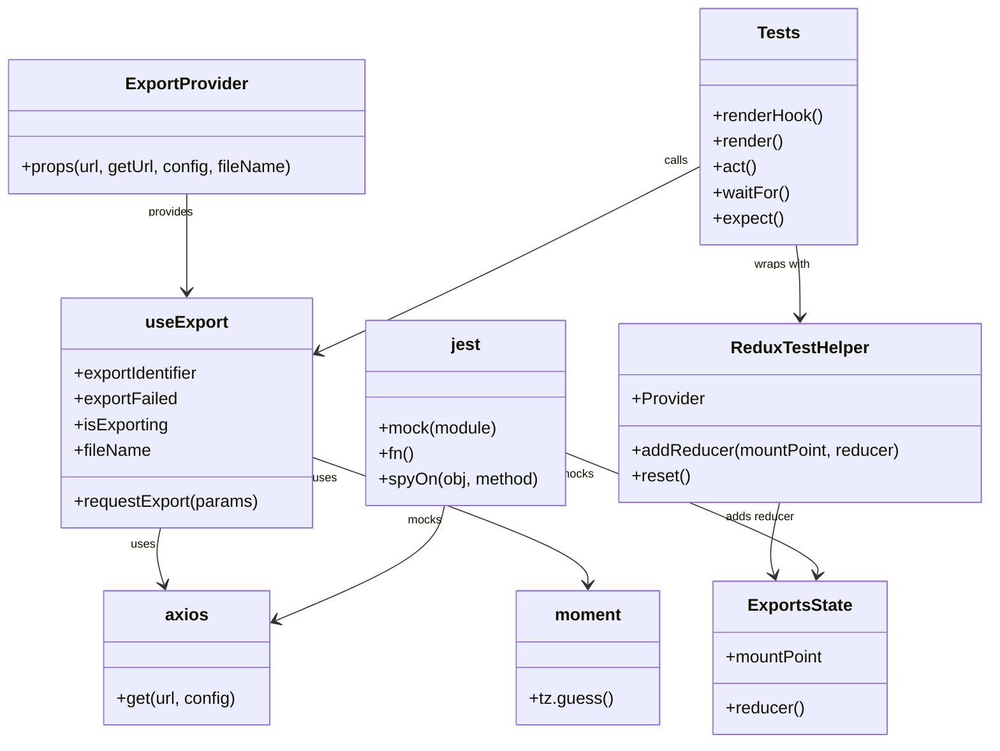

# Diagram: web/portal/src/modules/exports/hooks/__tests__/useExport.test.tsx

> Auto-generated by Obscura crawlers

## Mermaid

### SVG

<svg id="container" width="931.25390625" xmlns="http://www.w3.org/2000/svg" class="classDiagram" height="698" viewBox="0 0 931.25390625 698" role="graphics-document document" aria-roledescription="class"><g><defs><marker id="container_class-aggregationStart" class="marker aggregation class" refX="18" refY="7" markerWidth="190" markerHeight="240" orient="auto"><path d="M 18,7 L9,13 L1,7 L9,1 Z"></path></marker></defs><defs><marker id="container_class-aggregationEnd" class="marker aggregation class" refX="1" refY="7" markerWidth="20" markerHeight="28" orient="auto"><path d="M 18,7 L9,13 L1,7 L9,1 Z"></path></marker></defs><defs><marker id="container_class-extensionStart" class="marker extension class" refX="18" refY="7" markerWidth="190" markerHeight="240" orient="auto"><path d="M 1,7 L18,13 V 1 Z"></path></marker></defs><defs><marker id="container_class-extensionEnd" class="marker extension class" refX="1" refY="7" markerWidth="20" markerHeight="28" orient="auto"><path d="M 1,1 V 13 L18,7 Z"></path></marker></defs><defs><marker id="container_class-compositionStart" class="marker composition class" refX="18" refY="7" markerWidth="190" markerHeight="240" orient="auto"><path d="M 18,7 L9,13 L1,7 L9,1 Z"></path></marker></defs><defs><marker id="container_class-compositionEnd" class="marker composition class" refX="1" refY="7" markerWidth="20" markerHeight="28" orient="auto"><path d="M 18,7 L9,13 L1,7 L9,1 Z"></path></marker></defs><defs><marker id="container_class-dependencyStart" class="marker dependency class" refX="6" refY="7" markerWidth="190" markerHeight="240" orient="auto"><path d="M 5,7 L9,13 L1,7 L9,1 Z"></path></marker></defs><defs><marker id="container_class-dependencyEnd" class="marker dependency class" refX="13" refY="7" markerWidth="20" markerHeight="28" orient="auto"><path d="M 18,7 L9,13 L14,7 L9,1 Z"></path></marker></defs><defs><marker id="container_class-lollipopStart" class="marker lollipop class" refX="13" refY="7" markerWidth="190" markerHeight="240" orient="auto"><circle stroke="black" fill="transparent" cx="7" cy="7" r="6"></circle></marker></defs><defs><marker id="container_class-lollipopEnd" class="marker lollipop class" refX="1" refY="7" markerWidth="190" markerHeight="240" orient="auto"><circle stroke="black" fill="transparent" cx="7" cy="7" r="6"></circle></marker></defs><g class="root"><g class="clusters"></g><g class="edgePaths"><path d="M175.824,182L175.824,194.167C175.824,206.333,175.824,230.667,175.824,246C175.824,261.333,175.824,267.667,175.824,270.833L175.824,274" id="id_ExportProvider_useExport_1" class="edge-thickness-normal edge-pattern-solid relation" style=";;;" data-edge="true" data-et="edge" data-id="id_ExportProvider_useExport_1" data-points="W3sieCI6MTc1LjgyNDIxODc1LCJ5IjoxODJ9LHsieCI6MTc1LjgyNDIxODc1LCJ5IjoyNTV9LHsieCI6MTc1LjgyNDIxODc1LCJ5IjoyODB9XQ==" marker-end="url(#container_class-dependencyEnd)"></path><path d="M153.319,496L152.451,500.167C151.582,504.333,149.846,512.667,150.322,521.538C150.798,530.41,153.487,539.821,154.831,544.526L156.175,549.231" id="id_useExport_axios_2" class="edge-thickness-normal edge-pattern-solid relation" style=";;;" data-edge="true" data-et="edge" data-id="id_useExport_axios_2" data-points="W3sieCI6MTUzLjMxODkzMjA5NTg2NDY1LCJ5Ijo0OTZ9LHsieCI6MTQ4LjEwOTM3NSwieSI6NTIxfSx7IngiOjE1Ny44MjM4NTYzMTQ0MzMsInkiOjU1NX1d" marker-end="url(#container_class-dependencyEnd)"></path><path d="M293.426,429.184L337.122,444.487C380.819,459.79,468.212,490.395,511.909,510.364C555.605,530.333,555.605,539.667,555.605,544.333L555.605,549" id="id_useExport_moment_3" class="edge-thickness-normal edge-pattern-solid relation" style=";;;" data-edge="true" data-et="edge" data-id="id_useExport_moment_3" data-points="W3sieCI6MjkzLjQyNTc4MTI1LCJ5Ijo0MjkuMTg0MjU0OTE2NDgxNX0seyJ4Ijo1NTUuNjA1NDY4NzUsInkiOjUyMX0seyJ4Ijo1NTUuNjA1NDY4NzUsInkiOjU1NX1d" marker-end="url(#container_class-dependencyEnd)"></path><path d="M659.152,156.349L626.687,172.79C594.222,189.232,529.292,222.116,469.245,251.271C409.199,280.427,354.037,305.854,326.456,318.567L298.875,331.28" id="id_Tests_useExport_4" class="edge-thickness-normal edge-pattern-solid relation" style=";;;" data-edge="true" data-et="edge" data-id="id_Tests_useExport_4" data-points="W3sieCI6NjU5LjE1MjM0Mzc1LCJ5IjoxNTYuMzQ4NTM5MTc3MTA5Nzl9LHsieCI6NDY0LjM2MTMyODEyNSwieSI6MjU1fSx7IngiOjI5My40MjU3ODEyNSwieSI6MzMzLjc5MjA0MDkzOTI3NDh9XQ==" marker-end="url(#container_class-dependencyEnd)"></path><path d="M749.222,230L749.835,234.167C750.447,238.333,751.673,246.667,752.286,258C752.898,269.333,752.898,283.667,752.898,290.833L752.898,298" id="id_Tests_ReduxTestHelper_5" class="edge-thickness-normal edge-pattern-solid relation" style=";;;" data-edge="true" data-et="edge" data-id="id_Tests_ReduxTestHelper_5" data-points="W3sieCI6NzQ5LjIyMTk2NjkxMTc2NDgsInkiOjIzMH0seyJ4Ijo3NTIuODk4NDM3NSwieSI6MjU1fSx7IngiOjc1Mi44OTg0Mzc1LCJ5IjozMDR9XQ==" marker-end="url(#container_class-dependencyEnd)"></path><path d="M735.394,472L733.693,480.167C731.991,488.333,728.587,504.667,727.801,516.038C727.015,527.41,728.847,533.821,729.762,537.026L730.678,540.231" id="id_ReduxTestHelper_ExportsState_6" class="edge-thickness-normal edge-pattern-solid relation" style=";;;" data-edge="true" data-et="edge" data-id="id_ReduxTestHelper_ExportsState_6" data-points="W3sieCI6NzM1LjM5NDMyNTY1Nzg5NDcsInkiOjQ3Mn0seyJ4Ijo3MjUuMTgzNTkzNzUsInkiOjUyMX0seyJ4Ijo3MzIuMzI2NTk0NzE2NDk0OCwieSI6NTQ2fV0=" marker-end="url(#container_class-dependencyEnd)"></path><path d="M419.855,475L418.258,482.667C416.66,490.333,413.465,505.667,386.724,523.736C359.983,541.805,309.697,562.611,284.554,573.014L259.411,583.416" id="id_jest_axios_7" class="edge-thickness-normal edge-pattern-solid relation" style=";;;" data-edge="true" data-et="edge" data-id="id_jest_axios_7" data-points="W3sieCI6NDE5Ljg1NTExNjMwNjM5MSwieSI6NDc1fSx7IngiOjQxMC4yNjk1MzEyNSwieSI6NTIxfSx7IngiOjI1My44NjcxODc1LCJ5Ijo1ODUuNzEwMzAzNTc1NTk0fV0=" marker-end="url(#container_class-dependencyEnd)"></path><path d="M532.543,425.551L572.602,441.459C612.661,457.367,692.78,489.184,732.182,508.279C771.584,527.375,770.27,533.749,769.613,536.936L768.955,540.124" id="id_jest_ExportsState_8" class="edge-thickness-normal edge-pattern-solid relation" style=";;;" data-edge="true" data-et="edge" data-id="id_jest_ExportsState_8" data-points="W3sieCI6NTMyLjU0Mjk2ODc1LCJ5Ijo0MjUuNTUwODA1OTQzNjg4OTR9LHsieCI6NzcyLjg5ODQzNzUsInkiOjUyMX0seyJ4Ijo3NjcuNzQzNzk4MzI0NzQyMiwieSI6NTQ2fV0=" marker-end="url(#container_class-dependencyEnd)"></path></g><g class="edgeLabels"><g class="edgeLabel"><g class="label" data-id="id_ExportProvider_useExport_1" transform="translate(0, 0)"><foreignObject width="0" height="0">

</foreignObject></g></g><g class="edgeLabel"><g class="label" data-id="id_useExport_axios_2" transform="translate(0, 0)"><foreignObject width="0" height="0">

</foreignObject></g></g><g class="edgeLabel"><g class="label" data-id="id_useExport_moment_3" transform="translate(0, 0)"><foreignObject width="0" height="0">

</foreignObject></g></g><g class="edgeLabel"><g class="label" data-id="id_Tests_useExport_4" transform="translate(0, 0)"><foreignObject width="0" height="0">

</foreignObject></g></g><g class="edgeLabel"><g class="label" data-id="id_Tests_ReduxTestHelper_5" transform="translate(0, 0)"><foreignObject width="0" height="0">

</foreignObject></g></g><g class="edgeLabel"><g class="label" data-id="id_ReduxTestHelper_ExportsState_6" transform="translate(0, 0)"><foreignObject width="0" height="0">

</foreignObject></g></g><g class="edgeLabel"><g class="label" data-id="id_jest_axios_7" transform="translate(0, 0)"><foreignObject width="0" height="0">

</foreignObject></g></g><g class="edgeLabel"><g class="label" data-id="id_jest_ExportsState_8" transform="translate(0, 0)"><foreignObject width="0" height="0">

</foreignObject></g></g><g class="edgeTerminals" transform="translate(160.82421937499998, 199.5000005357143)"><g class="inner" transform="translate(0, 0)"><foreignObject style="width: 72px; height: 12px;">
provides
</foreignObject></g></g><g class="edgeTerminals" transform="translate(137.05775853521385, 511.90472489990844)"><g class="inner" transform="translate(0, 0)"><foreignObject style="width: 36px; height: 12px;">
uses
</foreignObject></g></g><g class="edgeTerminals" transform="translate(304.9844680597412, 449.1253381297004)"><g class="inner" transform="translate(0, 0)"><foreignObject style="width: 36px; height: 12px;">
uses
</foreignObject></g></g><g class="edgeTerminals" transform="translate(636.7631996564121, 150.87348783213557)"><g class="inner" transform="translate(0, 0)"><foreignObject style="width: 45px; height: 12px;">
calls
</foreignObject></g></g><g class="edgeTerminals" transform="translate(736.1435437956212, 248.9445674667133)"><g class="inner" transform="translate(0, 0)"><foreignObject style="width: 90px; height: 12px;">
wraps with
</foreignObject></g></g><g class="edgeTerminals" transform="translate(717.1397600091761, 486.07198758297557)"><g class="inner" transform="translate(0, 0)"><foreignObject style="width: 108px; height: 12px;">
adds reducer
</foreignObject></g></g><g class="edgeTerminals" transform="translate(401.6005503889292, 489.0719873166148)"><g class="inner" transform="translate(0, 0)"><foreignObject style="width: 45px; height: 12px;">
mocks
</foreignObject></g></g><g class="edgeTerminals" transform="translate(543.2712358975629, 445.950665003596)"><g class="inner" transform="translate(0, 0)"><foreignObject style="width: 45px; height: 12px;">
mocks
</foreignObject></g></g></g><g class="nodes"><g class="node default" id="classId-useExport-0" transform="translate(175.82421875, 388)"><g class="basic label-container"><path d="M-117.6015625 -108 L117.6015625 -108 L117.6015625 108 L-117.6015625 108" stroke="none" stroke-width="0" fill="#ECECFF" style=""></path><path d="M-117.6015625 -108 C-39.743819850713095 -108, 38.11392279857381 -108, 117.6015625 -108 M-117.6015625 -108 C-58.60001284047468 -108, 0.40153681905063365 -108, 117.6015625 -108 M117.6015625 -108 C117.6015625 -63.26349589922834, 117.6015625 -18.526991798456677, 117.6015625 108 M117.6015625 -108 C117.6015625 -46.210383243698324, 117.6015625 15.579233512603352, 117.6015625 108 M117.6015625 108 C66.25695956014789 108, 14.912356620295768 108, -117.6015625 108 M117.6015625 108 C44.00510517963684 108, -29.591352140726315 108, -117.6015625 108 M-117.6015625 108 C-117.6015625 35.83599255267137, -117.6015625 -36.32801489465726, -117.6015625 -108 M-117.6015625 108 C-117.6015625 27.299894114107957, -117.6015625 -53.400211771784086, -117.6015625 -108" stroke="#9370DB" stroke-width="1.3" fill="none" stroke-dasharray="0 0" style=""></path></g><g class="annotation-group text" transform="translate(0, -84)"></g><g class="label-group text" transform="translate(-36.90625, -84)"><g class="label" style="font-weight: bolder" transform="translate(0,-12)"><foreignObject width="73.8125" height="24">

useExport

</foreignObject></g></g><g class="members-group text" transform="translate(-105.6015625, -36)"><g class="label" style="" transform="translate(0,-12)"><foreignObject width="121.890625" height="24">

+exportIdentifier

</foreignObject></g><g class="label" style="" transform="translate(0,12)"><foreignObject width="98.140625" height="24">

+exportFailed

</foreignObject></g><g class="label" style="" transform="translate(0,36)"><foreignObject width="89.296875" height="24">

+isExporting

</foreignObject></g><g class="label" style="" transform="translate(0,60)"><foreignObject width="72.34375" height="24">

+fileName

</foreignObject></g></g><g class="methods-group text" transform="translate(-105.6015625, 84)"><g class="label" style="" transform="translate(0,-12)"><foreignObject width="174.296875" height="24">

+requestExport(params)

</foreignObject></g></g><g class="divider" style=""><path d="M-117.6015625 -60 C-27.454131705864697 -60, 62.69329908827061 -60, 117.6015625 -60 M-117.6015625 -60 C-39.81827606699299 -60, 37.96501036601401 -60, 117.6015625 -60" stroke="#9370DB" stroke-width="1.3" fill="none" stroke-dasharray="0 0" style=""></path></g><g class="divider" style=""><path d="M-117.6015625 60 C-36.687615049757994 60, 44.22633240048401 60, 117.6015625 60 M-117.6015625 60 C-55.0196863900886 60, 7.562189719822797 60, 117.6015625 60" stroke="#9370DB" stroke-width="1.3" fill="none" stroke-dasharray="0 0" style=""></path></g></g><g class="node default" id="classId-ExportProvider-1" transform="translate(175.82421875, 119)"><g class="basic label-container"><path d="M-167.82421875 -63 L167.82421875 -63 L167.82421875 63 L-167.82421875 63" stroke="none" stroke-width="0" fill="#ECECFF" style=""></path><path d="M-167.82421875 -63 C-95.38309528468285 -63, -22.941971819365705 -63, 167.82421875 -63 M-167.82421875 -63 C-77.41881453650102 -63, 12.986589676997966 -63, 167.82421875 -63 M167.82421875 -63 C167.82421875 -21.35605168553574, 167.82421875 20.28789662892852, 167.82421875 63 M167.82421875 -63 C167.82421875 -32.69783341202988, 167.82421875 -2.3956668240597665, 167.82421875 63 M167.82421875 63 C91.18314693618801 63, 14.54207512237602 63, -167.82421875 63 M167.82421875 63 C40.29347678237309 63, -87.23726518525382 63, -167.82421875 63 M-167.82421875 63 C-167.82421875 37.414339175394, -167.82421875 11.828678350787996, -167.82421875 -63 M-167.82421875 63 C-167.82421875 29.17017453045174, -167.82421875 -4.659650939096522, -167.82421875 -63" stroke="#9370DB" stroke-width="1.3" fill="none" stroke-dasharray="0 0" style=""></path></g><g class="annotation-group text" transform="translate(0, -39)"></g><g class="label-group text" transform="translate(-55.0546875, -39)"><g class="label" style="font-weight: bolder" transform="translate(0,-12)"><foreignObject width="110.109375" height="24">

ExportProvider

</foreignObject></g></g><g class="members-group text" transform="translate(-155.82421875, 9)"></g><g class="methods-group text" transform="translate(-155.82421875, 39)"><g class="label" style="" transform="translate(0,-12)"><foreignObject width="256.59375" height="24">

+props(url, getUrl, config, fileName)

</foreignObject></g></g><g class="divider" style=""><path d="M-167.82421875 -15 C-86.5061595669599 -15, -5.188100383919789 -15, 167.82421875 -15 M-167.82421875 -15 C-88.56097926606292 -15, -9.29773978212583 -15, 167.82421875 -15" stroke="#9370DB" stroke-width="1.3" fill="none" stroke-dasharray="0 0" style=""></path></g><g class="divider" style=""><path d="M-167.82421875 9 C-44.53945880708574 9, 78.74530113582853 9, 167.82421875 9 M-167.82421875 9 C-61.20982959265923 9, 45.404559564681534 9, 167.82421875 9" stroke="#9370DB" stroke-width="1.3" fill="none" stroke-dasharray="0 0" style=""></path></g></g><g class="node default" id="classId-ReduxTestHelper-2" transform="translate(752.8984375, 388)"><g class="basic label-container"><path d="M-170.35546875 -84 L170.35546875 -84 L170.35546875 84 L-170.35546875 84" stroke="none" stroke-width="0" fill="#ECECFF" style=""></path><path d="M-170.35546875 -84 C-71.85027579126877 -84, 26.654917167462457 -84, 170.35546875 -84 M-170.35546875 -84 C-51.81272606822293 -84, 66.73001661355414 -84, 170.35546875 -84 M170.35546875 -84 C170.35546875 -21.922754355275465, 170.35546875 40.15449128944907, 170.35546875 84 M170.35546875 -84 C170.35546875 -35.56737322066383, 170.35546875 12.865253558672336, 170.35546875 84 M170.35546875 84 C94.79006215106928 84, 19.224655552138557 84, -170.35546875 84 M170.35546875 84 C61.49726235993228 84, -47.36094403013544 84, -170.35546875 84 M-170.35546875 84 C-170.35546875 36.85825930766764, -170.35546875 -10.283481384664725, -170.35546875 -84 M-170.35546875 84 C-170.35546875 44.39912378098333, -170.35546875 4.798247561966662, -170.35546875 -84" stroke="#9370DB" stroke-width="1.3" fill="none" stroke-dasharray="0 0" style=""></path></g><g class="annotation-group text" transform="translate(0, -60)"></g><g class="label-group text" transform="translate(-62.4765625, -60)"><g class="label" style="font-weight: bolder" transform="translate(0,-12)"><foreignObject width="124.953125" height="24">

ReduxTestHelper

</foreignObject></g></g><g class="members-group text" transform="translate(-158.35546875, -12)"><g class="label" style="" transform="translate(0,-12)"><foreignObject width="68.796875" height="24">

+Provider

</foreignObject></g></g><g class="methods-group text" transform="translate(-158.35546875, 36)"><g class="label" style="" transform="translate(0,-12)"><foreignObject width="254.234375" height="24">

+addReducer(mountPoint, reducer)

</foreignObject></g><g class="label" style="" transform="translate(0,12)"><foreignObject width="54.75" height="24">

+reset()

</foreignObject></g></g><g class="divider" style=""><path d="M-170.35546875 -36 C-39.31997877668826 -36, 91.71551119662348 -36, 170.35546875 -36 M-170.35546875 -36 C-49.113767919967756 -36, 72.12793291006449 -36, 170.35546875 -36" stroke="#9370DB" stroke-width="1.3" fill="none" stroke-dasharray="0 0" style=""></path></g><g class="divider" style=""><path d="M-170.35546875 12 C-39.99047479736757 12, 90.37451915526486 12, 170.35546875 12 M-170.35546875 12 C-50.81170400172957 12, 68.73206074654087 12, 170.35546875 12" stroke="#9370DB" stroke-width="1.3" fill="none" stroke-dasharray="0 0" style=""></path></g></g><g class="node default" id="classId-ExportsState-3" transform="translate(752.8984375, 618)"><g class="basic label-container"><path d="M-82.28515625 -72 L82.28515625 -72 L82.28515625 72 L-82.28515625 72" stroke="none" stroke-width="0" fill="#ECECFF" style=""></path><path d="M-82.28515625 -72 C-20.694415308954312 -72, 40.896325632091376 -72, 82.28515625 -72 M-82.28515625 -72 C-42.904722522496904 -72, -3.524288794993808 -72, 82.28515625 -72 M82.28515625 -72 C82.28515625 -32.025589899679154, 82.28515625 7.948820200641691, 82.28515625 72 M82.28515625 -72 C82.28515625 -37.7992486293409, 82.28515625 -3.598497258681803, 82.28515625 72 M82.28515625 72 C45.9043785415406 72, 9.523600833081204 72, -82.28515625 72 M82.28515625 72 C38.18725821672729 72, -5.910639816545427 72, -82.28515625 72 M-82.28515625 72 C-82.28515625 36.7635710432971, -82.28515625 1.5271420865941963, -82.28515625 -72 M-82.28515625 72 C-82.28515625 32.71025703891745, -82.28515625 -6.579485922165105, -82.28515625 -72" stroke="#9370DB" stroke-width="1.3" fill="none" stroke-dasharray="0 0" style=""></path></g><g class="annotation-group text" transform="translate(0, -48)"></g><g class="label-group text" transform="translate(-47.2265625, -48)"><g class="label" style="font-weight: bolder" transform="translate(0,-12)"><foreignObject width="94.453125" height="24">

ExportsState

</foreignObject></g></g><g class="members-group text" transform="translate(-70.28515625, 0)"><g class="label" style="" transform="translate(0,-12)"><foreignObject width="93.34375" height="24">

+mountPoint

</foreignObject></g></g><g class="methods-group text" transform="translate(-70.28515625, 48)"><g class="label" style="" transform="translate(0,-12)"><foreignObject width="73.875" height="24">

+reducer()

</foreignObject></g></g><g class="divider" style=""><path d="M-82.28515625 -24 C-24.997474842862196 -24, 32.29020656427561 -24, 82.28515625 -24 M-82.28515625 -24 C-19.722445567818042 -24, 42.840265114363916 -24, 82.28515625 -24" stroke="#9370DB" stroke-width="1.3" fill="none" stroke-dasharray="0 0" style=""></path></g><g class="divider" style=""><path d="M-82.28515625 24 C-24.135396616674065 24, 34.01436301665187 24, 82.28515625 24 M-82.28515625 24 C-46.875029525416295 24, -11.46490280083259 24, 82.28515625 24" stroke="#9370DB" stroke-width="1.3" fill="none" stroke-dasharray="0 0" style=""></path></g></g><g class="node default" id="classId-axios-4" transform="translate(175.82421875, 618)"><g class="basic label-container"><path d="M-78.04296875 -63 L78.04296875 -63 L78.04296875 63 L-78.04296875 63" stroke="none" stroke-width="0" fill="#ECECFF" style=""></path><path d="M-78.04296875 -63 C-19.243621697304853 -63, 39.555725355390294 -63, 78.04296875 -63 M-78.04296875 -63 C-36.55061089168329 -63, 4.941746966633417 -63, 78.04296875 -63 M78.04296875 -63 C78.04296875 -23.37223262314079, 78.04296875 16.255534753718422, 78.04296875 63 M78.04296875 -63 C78.04296875 -34.932126659630015, 78.04296875 -6.864253319260037, 78.04296875 63 M78.04296875 63 C45.03638784475376 63, 12.029806939507523 63, -78.04296875 63 M78.04296875 63 C16.536886429716567 63, -44.969195890566866 63, -78.04296875 63 M-78.04296875 63 C-78.04296875 29.79521958137773, -78.04296875 -3.409560837244541, -78.04296875 -63 M-78.04296875 63 C-78.04296875 14.006177321456363, -78.04296875 -34.987645357087274, -78.04296875 -63" stroke="#9370DB" stroke-width="1.3" fill="none" stroke-dasharray="0 0" style=""></path></g><g class="annotation-group text" transform="translate(0, -39)"></g><g class="label-group text" transform="translate(-19.2734375, -39)"><g class="label" style="font-weight: bolder" transform="translate(0,-12)"><foreignObject width="38.546875" height="24">

axios

</foreignObject></g></g><g class="members-group text" transform="translate(-66.04296875, 9)"></g><g class="methods-group text" transform="translate(-66.04296875, 39)"><g class="label" style="" transform="translate(0,-12)"><foreignObject width="112.8125" height="24">

+get(url, config)

</foreignObject></g></g><g class="divider" style=""><path d="M-78.04296875 -15 C-39.30631491418537 -15, -0.5696610783707428 -15, 78.04296875 -15 M-78.04296875 -15 C-32.521597195794165 -15, 12.99977435841167 -15, 78.04296875 -15" stroke="#9370DB" stroke-width="1.3" fill="none" stroke-dasharray="0 0" style=""></path></g><g class="divider" style=""><path d="M-78.04296875 9 C-28.646002035150694 9, 20.750964679698612 9, 78.04296875 9 M-78.04296875 9 C-25.54202255982623 9, 26.95892363034754 9, 78.04296875 9" stroke="#9370DB" stroke-width="1.3" fill="none" stroke-dasharray="0 0" style=""></path></g></g><g class="node default" id="classId-moment-5" transform="translate(555.60546875, 618)"><g class="basic label-container"><path d="M-65.0078125 -63 L65.0078125 -63 L65.0078125 63 L-65.0078125 63" stroke="none" stroke-width="0" fill="#ECECFF" style=""></path><path d="M-65.0078125 -63 C-17.221107963020913 -63, 30.565596573958175 -63, 65.0078125 -63 M-65.0078125 -63 C-14.998928666957589 -63, 35.00995516608482 -63, 65.0078125 -63 M65.0078125 -63 C65.0078125 -18.434120019177385, 65.0078125 26.13175996164523, 65.0078125 63 M65.0078125 -63 C65.0078125 -32.15616235467141, 65.0078125 -1.3123247093428176, 65.0078125 63 M65.0078125 63 C32.36405020779554 63, -0.2797120844089136 63, -65.0078125 63 M65.0078125 63 C36.655134595371536 63, 8.302456690743071 63, -65.0078125 63 M-65.0078125 63 C-65.0078125 35.25352223990884, -65.0078125 7.507044479817679, -65.0078125 -63 M-65.0078125 63 C-65.0078125 26.549853207719963, -65.0078125 -9.900293584560075, -65.0078125 -63" stroke="#9370DB" stroke-width="1.3" fill="none" stroke-dasharray="0 0" style=""></path></g><g class="annotation-group text" transform="translate(0, -39)"></g><g class="label-group text" transform="translate(-30.3125, -39)"><g class="label" style="font-weight: bolder" transform="translate(0,-12)"><foreignObject width="60.625" height="24">

moment

</foreignObject></g></g><g class="members-group text" transform="translate(-53.0078125, 9)"></g><g class="methods-group text" transform="translate(-53.0078125, 39)"><g class="label" style="" transform="translate(0,-12)"><foreignObject width="75.703125" height="24">

+tz.guess()

</foreignObject></g></g><g class="divider" style=""><path d="M-65.0078125 -15 C-25.91382350892833 -15, 13.180165482143337 -15, 65.0078125 -15 M-65.0078125 -15 C-16.942812438984767 -15, 31.122187622030467 -15, 65.0078125 -15" stroke="#9370DB" stroke-width="1.3" fill="none" stroke-dasharray="0 0" style=""></path></g><g class="divider" style=""><path d="M-65.0078125 9 C-14.192321501014014 9, 36.62316949797197 9, 65.0078125 9 M-65.0078125 9 C-26.91503226973368 9, 11.177747960532642 9, 65.0078125 9" stroke="#9370DB" stroke-width="1.3" fill="none" stroke-dasharray="0 0" style=""></path></g></g><g class="node default" id="classId-Tests-6" transform="translate(732.8984375, 119)"><g class="basic label-container"><path d="M-73.74609375 -111 L73.74609375 -111 L73.74609375 111 L-73.74609375 111" stroke="none" stroke-width="0" fill="#ECECFF" style=""></path><path d="M-73.74609375 -111 C-39.04651068062246 -111, -4.346927611244922 -111, 73.74609375 -111 M-73.74609375 -111 C-28.74923417740156 -111, 16.247625395196877 -111, 73.74609375 -111 M73.74609375 -111 C73.74609375 -55.4024864111661, 73.74609375 0.19502717766779654, 73.74609375 111 M73.74609375 -111 C73.74609375 -28.60428598923022, 73.74609375 53.79142802153956, 73.74609375 111 M73.74609375 111 C30.04953201277125 111, -13.647029724457497 111, -73.74609375 111 M73.74609375 111 C27.985269131926096 111, -17.77555548614781 111, -73.74609375 111 M-73.74609375 111 C-73.74609375 24.465232483872455, -73.74609375 -62.06953503225509, -73.74609375 -111 M-73.74609375 111 C-73.74609375 46.529896597992575, -73.74609375 -17.94020680401485, -73.74609375 -111" stroke="#9370DB" stroke-width="1.3" fill="none" stroke-dasharray="0 0" style=""></path></g><g class="annotation-group text" transform="translate(0, -87)"></g><g class="label-group text" transform="translate(-19.1171875, -87)"><g class="label" style="font-weight: bolder" transform="translate(0,-12)"><foreignObject width="38.234375" height="24">

Tests

</foreignObject></g></g><g class="members-group text" transform="translate(-61.74609375, -39)"></g><g class="methods-group text" transform="translate(-61.74609375, -9)"><g class="label" style="" transform="translate(0,-12)"><foreignObject width="104.375" height="24">

+renderHook()

</foreignObject></g><g class="label" style="" transform="translate(0,12)"><foreignObject width="66.609375" height="24">

+render()

</foreignObject></g><g class="label" style="" transform="translate(0,36)"><foreignObject width="40.25" height="24">

+act()

</foreignObject></g><g class="label" style="" transform="translate(0,60)"><foreignObject width="71.453125" height="24">

+waitFor()

</foreignObject></g><g class="label" style="" transform="translate(0,84)"><foreignObject width="66.34375" height="24">

+expect()

</foreignObject></g></g><g class="divider" style=""><path d="M-73.74609375 -63 C-35.065213975250664 -63, 3.6156657994986716 -63, 73.74609375 -63 M-73.74609375 -63 C-25.59950188455955 -63, 22.547089980880898 -63, 73.74609375 -63" stroke="#9370DB" stroke-width="1.3" fill="none" stroke-dasharray="0 0" style=""></path></g><g class="divider" style=""><path d="M-73.74609375 -39 C-31.377484949250608 -39, 10.991123851498784 -39, 73.74609375 -39 M-73.74609375 -39 C-41.89298370358946 -39, -10.039873657178916 -39, 73.74609375 -39" stroke="#9370DB" stroke-width="1.3" fill="none" stroke-dasharray="0 0" style=""></path></g></g><g class="node default" id="classId-jest-7" transform="translate(437.984375, 388)"><g class="basic label-container"><path d="M-94.55859375 -87 L94.55859375 -87 L94.55859375 87 L-94.55859375 87" stroke="none" stroke-width="0" fill="#ECECFF" style=""></path><path d="M-94.55859375 -87 C-36.01935801469268 -87, 22.519877720614645 -87, 94.55859375 -87 M-94.55859375 -87 C-41.69066112566849 -87, 11.177271498663018 -87, 94.55859375 -87 M94.55859375 -87 C94.55859375 -50.76058975392812, 94.55859375 -14.521179507856246, 94.55859375 87 M94.55859375 -87 C94.55859375 -49.14285558535377, 94.55859375 -11.285711170707543, 94.55859375 87 M94.55859375 87 C36.72199290572598 87, -21.114607938548033 87, -94.55859375 87 M94.55859375 87 C45.833897309833574 87, -2.8907991303328515 87, -94.55859375 87 M-94.55859375 87 C-94.55859375 32.887697834653125, -94.55859375 -21.22460433069375, -94.55859375 -87 M-94.55859375 87 C-94.55859375 40.42487192753022, -94.55859375 -6.150256144939561, -94.55859375 -87" stroke="#9370DB" stroke-width="1.3" fill="none" stroke-dasharray="0 0" style=""></path></g><g class="annotation-group text" transform="translate(0, -63)"></g><g class="label-group text" transform="translate(-13.6171875, -63)"><g class="label" style="font-weight: bolder" transform="translate(0,-12)"><foreignObject width="27.234375" height="24">

jest

</foreignObject></g></g><g class="members-group text" transform="translate(-82.55859375, -15)"></g><g class="methods-group text" transform="translate(-82.55859375, 15)"><g class="label" style="" transform="translate(0,-12)"><foreignObject width="112.515625" height="24">

+mock(module)

</foreignObject></g><g class="label" style="" transform="translate(0,12)"><foreignObject width="32.859375" height="24">

+fn()

</foreignObject></g><g class="label" style="" transform="translate(0,36)"><foreignObject width="151.5" height="24">

+spyOn(obj, method)

</foreignObject></g></g><g class="divider" style=""><path d="M-94.55859375 -39 C-44.74316319403018 -39, 5.0722673619396375 -39, 94.55859375 -39 M-94.55859375 -39 C-28.91823026194858 -39, 36.72213322610284 -39, 94.55859375 -39" stroke="#9370DB" stroke-width="1.3" fill="none" stroke-dasharray="0 0" style=""></path></g><g class="divider" style=""><path d="M-94.55859375 -15 C-33.292684095609594 -15, 27.97322555878081 -15, 94.55859375 -15 M-94.55859375 -15 C-44.77889632535488 -15, 5.000801099290243 -15, 94.55859375 -15" stroke="#9370DB" stroke-width="1.3" fill="none" stroke-dasharray="0 0" style=""></path></g></g></g></g></g></svg>
