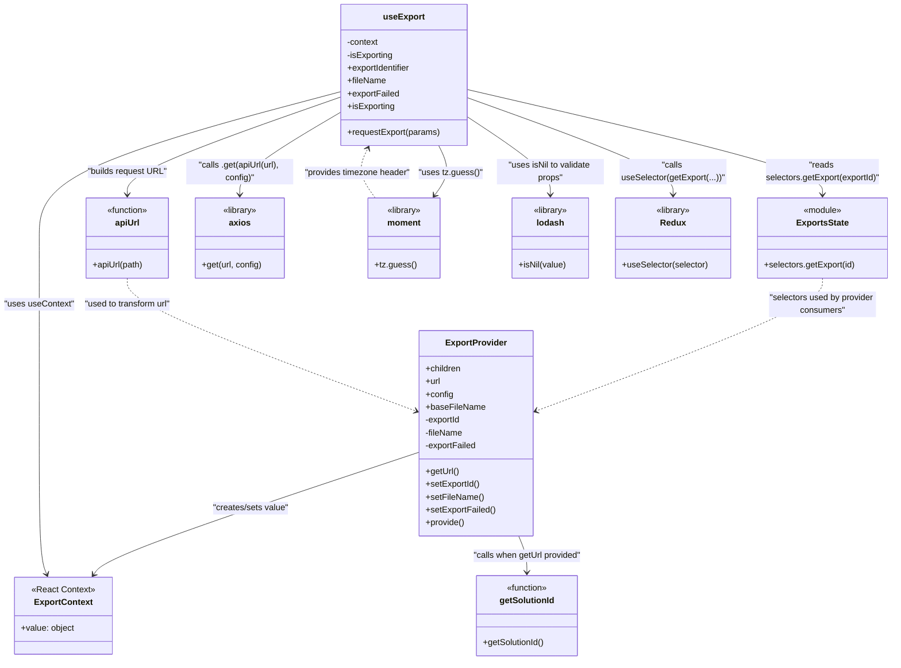

# Diagram: web/portal/src/modules/exports/hooks/useExport.js

> Auto-generated by Obscura crawlers

## Mermaid

### SVG

<svg id="container" width="1680.52734375" xmlns="http://www.w3.org/2000/svg" class="classDiagram" height="1258" viewBox="0 0 1680.52734375 1258" role="graphics-document document" aria-roledescription="class"><g><defs><marker id="container_class-aggregationStart" class="marker aggregation class" refX="18" refY="7" markerWidth="190" markerHeight="240" orient="auto"><path d="M 18,7 L9,13 L1,7 L9,1 Z"></path></marker></defs><defs><marker id="container_class-aggregationEnd" class="marker aggregation class" refX="1" refY="7" markerWidth="20" markerHeight="28" orient="auto"><path d="M 18,7 L9,13 L1,7 L9,1 Z"></path></marker></defs><defs><marker id="container_class-extensionStart" class="marker extension class" refX="18" refY="7" markerWidth="190" markerHeight="240" orient="auto"><path d="M 1,7 L18,13 V 1 Z"></path></marker></defs><defs><marker id="container_class-extensionEnd" class="marker extension class" refX="1" refY="7" markerWidth="20" markerHeight="28" orient="auto"><path d="M 1,1 V 13 L18,7 Z"></path></marker></defs><defs><marker id="container_class-compositionStart" class="marker composition class" refX="18" refY="7" markerWidth="190" markerHeight="240" orient="auto"><path d="M 18,7 L9,13 L1,7 L9,1 Z"></path></marker></defs><defs><marker id="container_class-compositionEnd" class="marker composition class" refX="1" refY="7" markerWidth="20" markerHeight="28" orient="auto"><path d="M 18,7 L9,13 L1,7 L9,1 Z"></path></marker></defs><defs><marker id="container_class-dependencyStart" class="marker dependency class" refX="6" refY="7" markerWidth="190" markerHeight="240" orient="auto"><path d="M 5,7 L9,13 L1,7 L9,1 Z"></path></marker></defs><defs><marker id="container_class-dependencyEnd" class="marker dependency class" refX="13" refY="7" markerWidth="20" markerHeight="28" orient="auto"><path d="M 18,7 L9,13 L14,7 L9,1 Z"></path></marker></defs><defs><marker id="container_class-lollipopStart" class="marker lollipop class" refX="13" refY="7" markerWidth="190" markerHeight="240" orient="auto"><circle stroke="black" fill="transparent" cx="7" cy="7" r="6"></circle></marker></defs><defs><marker id="container_class-lollipopEnd" class="marker lollipop class" refX="1" refY="7" markerWidth="190" markerHeight="240" orient="auto"><circle stroke="black" fill="transparent" cx="7" cy="7" r="6"></circle></marker></defs><g class="root"><g class="clusters"></g><g class="edgePaths"><path d="M794.291,846.306L695.857,880.422C597.423,914.537,400.555,982.769,296.794,1024.724C193.034,1066.679,182.38,1082.358,177.053,1090.198L171.726,1098.037" id="id_ExportProvider_ExportContext_1" class="edge-thickness-normal edge-pattern-solid relation" style=";;;" data-edge="true" data-et="edge" data-id="id_ExportProvider_ExportContext_1" data-points="W3sieCI6Nzk0LjI5MTAxNTYyNSwieSI6ODQ2LjMwNjA2NDQ5NTgzMzF9LHsieCI6MjAzLjY4NzUsInkiOjEwNTF9LHsieCI6MTY4LjM1MzU3ODYyOTAzMjI2LCJ5IjoxMTAzfV0=" marker-end="url(#container_class-dependencyEnd)"></path><path d="M647.723,170.751L551.958,195.793C456.193,220.834,264.663,270.917,168.898,316.625C73.133,362.333,73.133,403.667,73.133,445C73.133,486.333,73.133,527.667,73.133,588.5C73.133,649.333,73.133,729.667,73.133,810C73.133,890.333,73.133,970.667,76.019,1018.563C78.905,1066.46,84.677,1081.919,87.563,1089.649L90.449,1097.379" id="id_useExport_ExportContext_2" class="edge-thickness-normal edge-pattern-solid relation" style=";;;" data-edge="true" data-et="edge" data-id="id_useExport_ExportContext_2" data-points="W3sieCI6NjQ3LjcyMjY1NjI1LCJ5IjoxNzAuNzUxNDQwNDU0NjI0OTd9LHsieCI6NzMuMTMyODEyNSwieSI6MzIxfSx7IngiOjczLjEzMjgxMjUsInkiOjQ0NX0seyJ4Ijo3My4xMzI4MTI1LCJ5Ijo1Njl9LHsieCI6NzMuMTMyODEyNSwieSI6ODEwfSx7IngiOjczLjEzMjgxMjUsInkiOjEwNTF9LHsieCI6OTIuNTQ3NjMxMDQ4Mzg3MSwieSI6MTEwM31d" marker-end="url(#container_class-dependencyEnd)"></path><path d="M647.723,208.787L615.749,227.489C583.775,246.191,519.827,283.596,487.853,309.465C455.879,335.333,455.879,349.667,455.879,356.833L455.879,364" id="id_useExport_axios_3" class="edge-thickness-normal edge-pattern-solid relation" style=";;;" data-edge="true" data-et="edge" data-id="id_useExport_axios_3" data-points="W3sieCI6NjQ3LjcyMjY1NjI1LCJ5IjoyMDguNzg3MjIwMDc2MjQ1MzJ9LHsieCI6NDU1Ljg3ODkwNjI1LCJ5IjozMjF9LHsieCI6NDU1Ljg3ODkwNjI1LCJ5IjozNzB9XQ==" marker-end="url(#container_class-dependencyEnd)"></path><path d="M647.723,180.647L580.044,204.039C512.365,227.431,377.007,274.216,309.327,304.775C241.648,335.333,241.648,349.667,241.648,356.833L241.648,364" id="id_useExport_apiUrl_4" class="edge-thickness-normal edge-pattern-solid relation" style=";;;" data-edge="true" data-et="edge" data-id="id_useExport_apiUrl_4" data-points="W3sieCI6NjQ3LjcyMjY1NjI1LCJ5IjoxODAuNjQ3MDYzNjUwMTI5NH0seyJ4IjoyNDEuNjQ4NDM3NSwieSI6MzIxfSx7IngiOjI0MS42NDg0Mzc1LCJ5IjozNzB9XQ==" marker-end="url(#container_class-dependencyEnd)"></path><path d="M830.555,272L834.591,280.167C838.627,288.333,846.698,304.667,845.428,320.189C844.158,335.711,833.546,350.423,828.24,357.778L822.934,365.134" id="id_useExport_moment_5" class="edge-thickness-normal edge-pattern-solid relation" style=";;;" data-edge="true" data-et="edge" data-id="id_useExport_moment_5" data-points="W3sieCI6ODMwLjU1NTA1NDM4NTM1OTEsInkiOjI3Mn0seyJ4Ijo4NTQuNzY5NTMxMjUsInkiOjMyMX0seyJ4Ijo4MTkuNDI0MjA2MTQ5MTkzNSwieSI6MzcwfV0=" marker-end="url(#container_class-dependencyEnd)"></path><path d="M882.926,217.831L908.907,235.026C934.888,252.221,986.85,286.61,1012.831,310.972C1038.813,335.333,1038.813,349.667,1038.813,356.833L1038.813,364" id="id_useExport_lodash_6" class="edge-thickness-normal edge-pattern-solid relation" style=";;;" data-edge="true" data-et="edge" data-id="id_useExport_lodash_6" data-points="W3sieCI6ODgyLjkyNTc4MTI1LCJ5IjoyMTcuODMxMDU5OTQ2MDEwMDR9LHsieCI6MTAzOC44MTI1LCJ5IjozMjF9LHsieCI6MTAzOC44MTI1LCJ5IjozNzB9XQ==" marker-end="url(#container_class-dependencyEnd)"></path><path d="M882.926,167.082L994.32,192.735C1105.714,218.388,1328.501,269.694,1439.895,302.514C1551.289,335.333,1551.289,349.667,1551.289,356.833L1551.289,364" id="id_useExport_ExportsState_7" class="edge-thickness-normal edge-pattern-solid relation" style=";;;" data-edge="true" data-et="edge" data-id="id_useExport_ExportsState_7" data-points="W3sieCI6ODgyLjkyNTc4MTI1LCJ5IjoxNjcuMDgyNDg3MTg5ODA5NX0seyJ4IjoxNTUxLjI4OTA2MjUsInkiOjMyMX0seyJ4IjoxNTUxLjI4OTA2MjUsInkiOjM3MH1d" marker-end="url(#container_class-dependencyEnd)"></path><path d="M975.763,1002L979.026,1010.167C982.289,1018.333,988.815,1034.667,992.079,1050C995.342,1065.333,995.342,1079.667,995.342,1086.833L995.342,1094" id="id_ExportProvider_getSolutionId_8" class="edge-thickness-normal edge-pattern-solid relation" style=";;;" data-edge="true" data-et="edge" data-id="id_ExportProvider_getSolutionId_8" data-points="W3sieCI6OTc1Ljc2Mjc2NDE5ODY1MTQsInkiOjEwMDJ9LHsieCI6OTk1LjM0MTc5Njg3NSwieSI6MTA1MX0seyJ4Ijo5OTUuMzQxNzk2ODc1LCJ5IjoxMTAwfV0=" marker-end="url(#container_class-dependencyEnd)"></path><path d="M882.926,182.099L947.594,205.249C1012.263,228.399,1141.6,274.7,1206.269,305.017C1270.938,335.333,1270.938,349.667,1270.938,356.833L1270.938,364" id="id_useExport_Redux_9" class="edge-thickness-normal edge-pattern-solid relation" style=";;;" data-edge="true" data-et="edge" data-id="id_useExport_Redux_9" data-points="W3sieCI6ODgyLjkyNTc4MTI1LCJ5IjoxODIuMDk5MTM3MDMxOTE1MTV9LHsieCI6MTI3MC45Mzc1LCJ5IjozMjF9LHsieCI6MTI3MC45Mzc1LCJ5IjozNzB9XQ==" marker-end="url(#container_class-dependencyEnd)"></path><path d="M1551.289,520L1551.289,528.167C1551.289,536.333,1551.289,552.667,1460.979,594.202C1370.668,635.738,1190.048,702.476,1099.737,735.845L1009.427,769.215" id="id_ExportsState_ExportProvider_10" class="edge-thickness-normal edge-pattern-dashed relation" style=";;;" data-edge="true" data-et="edge" data-id="id_ExportsState_ExportProvider_10" data-points="W3sieCI6MTU1MS4yODkwNjI1LCJ5Ijo1MjB9LHsieCI6MTU1MS4yODkwNjI1LCJ5Ijo1Njl9LHsieCI6MTAwMy43OTg4MjgxMjUsInkiOjc3MS4yOTQxMDc3ODI5MjQ5fV0=" marker-end="url(#container_class-dependencyEnd)"></path><path d="M241.648,520L241.648,528.167C241.648,536.333,241.648,552.667,332.817,594.255C423.985,635.844,606.321,702.688,697.489,736.11L788.658,769.532" id="id_apiUrl_ExportProvider_11" class="edge-thickness-normal edge-pattern-dashed relation" style=";;;" data-edge="true" data-et="edge" data-id="id_apiUrl_ExportProvider_11" data-points="W3sieCI6MjQxLjY0ODQzNzUsInkiOjUyMH0seyJ4IjoyNDEuNjQ4NDM3NSwieSI6NTY5fSx7IngiOjc5NC4yOTEwMTU2MjUsInkiOjc3MS41OTc0NjUxNDI3NDE3fV0=" marker-end="url(#container_class-dependencyEnd)"></path><path d="M711.224,370L705.333,361.833C699.442,353.667,687.661,337.333,685.363,321.897C683.064,306.46,690.25,291.919,693.842,284.649L697.435,277.379" id="id_moment_useExport_12" class="edge-thickness-normal edge-pattern-dashed relation" style=";;;" data-edge="true" data-et="edge" data-id="id_moment_useExport_12" data-points="W3sieCI6NzExLjIyNDIzMTM1MDgwNjUsInkiOjM3MH0seyJ4Ijo2NzUuODc4OTA2MjUsInkiOjMyMX0seyJ4Ijo3MDAuMDkzMzgzMTE0NjQwOSwieSI6MjcyfV0=" marker-end="url(#container_class-dependencyEnd)"></path></g><g class="edgeLabels"><g class="edgeLabel" transform="translate(469.28814, 958.94697)"><g class="label" data-id="id_ExportProvider_ExportContext_1" transform="translate(-72.59375, -12)"><foreignObject width="145.1875" height="24">

"creates/sets value"

</foreignObject></g></g><g class="edgeLabel" transform="translate(73.1328125, 569)"><g class="label" data-id="id_useExport_ExportContext_2" transform="translate(-65.1328125, -12)"><foreignObject width="130.265625" height="24">

"uses useContext"

</foreignObject></g></g><g class="edgeLabel" transform="translate(455.87890625, 321)"><g class="label" data-id="id_useExport_axios_3" transform="translate(-100, -24)"><foreignObject width="200" height="48">

"calls .get(apiUrl(url), config)"

</foreignObject></g></g><g class="edgeLabel" transform="translate(241.6484375, 321)"><g class="label" data-id="id_useExport_apiUrl_4" transform="translate(-74.0703125, -12)"><foreignObject width="148.140625" height="24">

"builds request URL"

</foreignObject></g></g><g class="edgeLabel" transform="translate(853.08437, 323.33618)"><g class="label" data-id="id_useExport_moment_5" transform="translate(-58.890625, -12)"><foreignObject width="117.78125" height="24">

"uses tz.guess()"

</foreignObject></g></g><g class="edgeLabel" transform="translate(1038.8125, 321)"><g class="label" data-id="id_useExport_lodash_6" transform="translate(-100, -24)"><foreignObject width="200" height="48">

"uses isNil to validate props"

</foreignObject></g></g><g class="edgeLabel" transform="translate(1551.2890625, 321)"><g class="label" data-id="id_useExport_ExportsState_7" transform="translate(-108.5, -24)"><foreignObject width="217" height="48">

"reads selectors.getExport(exportId)"

</foreignObject></g></g><g class="edgeLabel" transform="translate(995.341796875, 1051)"><g class="label" data-id="id_ExportProvider_getSolutionId_8" transform="translate(-100, -24)"><foreignObject width="200" height="48">

"calls when getUrl provided"

</foreignObject></g></g><g class="edgeLabel" transform="translate(1270.9375, 321)"><g class="label" data-id="id_useExport_Redux_9" transform="translate(-100, -24)"><foreignObject width="200" height="48">

"calls useSelector(getExport(...))"

</foreignObject></g></g><g class="edgeLabel" transform="translate(1551.2890625, 569)"><g class="label" data-id="id_ExportsState_ExportProvider_10" transform="translate(-100, -24)"><foreignObject width="200" height="48">

"selectors used by provider consumers"

</foreignObject></g></g><g class="edgeLabel" transform="translate(241.6484375, 569)"><g class="label" data-id="id_apiUrl_ExportProvider_11" transform="translate(-83.3828125, -12)"><foreignObject width="166.765625" height="24">

"used to transform url"

</foreignObject></g></g><g class="edgeLabel" transform="translate(677.56407, 323.33618)"><g class="label" data-id="id_moment_useExport_12" transform="translate(-100, -24)"><foreignObject width="200" height="48">

"provides timezone header"

</foreignObject></g></g></g><g class="nodes"><g class="node default" id="classId-ExportContext-0" transform="translate(119.4296875, 1175)"><g class="basic label-container"><path d="M-91.54296875 -72 L91.54296875 -72 L91.54296875 72 L-91.54296875 72" stroke="none" stroke-width="0" fill="#ECECFF" style=""></path><path d="M-91.54296875 -72 C-31.227913773501008 -72, 29.087141202997984 -72, 91.54296875 -72 M-91.54296875 -72 C-50.404813617506825 -72, -9.26665848501365 -72, 91.54296875 -72 M91.54296875 -72 C91.54296875 -41.72405323670711, 91.54296875 -11.448106473414214, 91.54296875 72 M91.54296875 -72 C91.54296875 -42.408880665115724, 91.54296875 -12.817761330231448, 91.54296875 72 M91.54296875 72 C29.398869998376107 72, -32.74522875324779 72, -91.54296875 72 M91.54296875 72 C44.55461548199406 72, -2.433737786011875 72, -91.54296875 72 M-91.54296875 72 C-91.54296875 21.883241578562725, -91.54296875 -28.23351684287455, -91.54296875 -72 M-91.54296875 72 C-91.54296875 15.31855254896172, -91.54296875 -41.36289490207656, -91.54296875 -72" stroke="#9370DB" stroke-width="1.3" fill="none" stroke-dasharray="0 0" style=""></path></g><g class="annotation-group text" transform="translate(-58.8203125, -48)"><g class="label" style="" transform="translate(0,-12)"><foreignObject width="117.640625" height="24">

«React Context»

</foreignObject></g></g><g class="label-group text" transform="translate(-52.21875, -24)"><g class="label" style="font-weight: bolder" transform="translate(0,-12)"><foreignObject width="104.4375" height="24">

ExportContext

</foreignObject></g></g><g class="members-group text" transform="translate(-79.54296875, 24)"><g class="label" style="" transform="translate(0,-12)"><foreignObject width="100.265625" height="24">

+value: object

</foreignObject></g></g><g class="methods-group text" transform="translate(-79.54296875, 72)"></g><g class="divider" style=""><path d="M-91.54296875 0 C-20.84529829990062 0, 49.85237215019876 0, 91.54296875 0 M-91.54296875 0 C-20.083891609400865 0, 51.37518553119827 0, 91.54296875 0" stroke="#9370DB" stroke-width="1.3" fill="none" stroke-dasharray="0 0" style=""></path></g><g class="divider" style=""><path d="M-91.54296875 48 C-43.050698013640776 48, 5.441572722718448 48, 91.54296875 48 M-91.54296875 48 C-37.992914082547934 48, 15.557140584904133 48, 91.54296875 48" stroke="#9370DB" stroke-width="1.3" fill="none" stroke-dasharray="0 0" style=""></path></g></g><g class="node default" id="classId-ExportProvider-1" transform="translate(899.044921875, 810)"><g class="basic label-container"><path d="M-104.75390625 -192 L104.75390625 -192 L104.75390625 192 L-104.75390625 192" stroke="none" stroke-width="0" fill="#ECECFF" style=""></path><path d="M-104.75390625 -192 C-56.8423243909155 -192, -8.930742531831001 -192, 104.75390625 -192 M-104.75390625 -192 C-30.382907571099594 -192, 43.98809110780081 -192, 104.75390625 -192 M104.75390625 -192 C104.75390625 -85.43898760436623, 104.75390625 21.122024791267535, 104.75390625 192 M104.75390625 -192 C104.75390625 -47.432264163599314, 104.75390625 97.13547167280137, 104.75390625 192 M104.75390625 192 C45.04992498838405 192, -14.654056273231902 192, -104.75390625 192 M104.75390625 192 C57.40948938889942 192, 10.065072527798847 192, -104.75390625 192 M-104.75390625 192 C-104.75390625 65.15712747394247, -104.75390625 -61.68574505211507, -104.75390625 -192 M-104.75390625 192 C-104.75390625 106.2584042375378, -104.75390625 20.516808475075607, -104.75390625 -192" stroke="#9370DB" stroke-width="1.3" fill="none" stroke-dasharray="0 0" style=""></path></g><g class="annotation-group text" transform="translate(0, -168)"></g><g class="label-group text" transform="translate(-55.0546875, -168)"><g class="label" style="font-weight: bolder" transform="translate(0,-12)"><foreignObject width="110.109375" height="24">

ExportProvider

</foreignObject></g></g><g class="members-group text" transform="translate(-92.75390625, -120)"><g class="label" style="" transform="translate(0,-12)"><foreignObject width="67.5" height="24">

+children

</foreignObject></g><g class="label" style="" transform="translate(0,12)"><foreignObject width="28.171875" height="24">

+url

</foreignObject></g><g class="label" style="" transform="translate(0,36)"><foreignObject width="51.5625" height="24">

+config

</foreignObject></g><g class="label" style="" transform="translate(0,60)"><foreignObject width="109.265625" height="24">

+baseFileName

</foreignObject></g><g class="label" style="" transform="translate(0,84)"><foreignObject width="67.875" height="24">

-exportId

</foreignObject></g><g class="label" style="" transform="translate(0,108)"><foreignObject width="70.8125" height="24">

-fileName

</foreignObject></g><g class="label" style="" transform="translate(0,132)"><foreignObject width="96.59375" height="24">

-exportFailed

</foreignObject></g></g><g class="methods-group text" transform="translate(-92.75390625, 72)"><g class="label" style="" transform="translate(0,-12)"><foreignObject width="62.375" height="24">

+getUrl()

</foreignObject></g><g class="label" style="" transform="translate(0,12)"><foreignObject width="101.734375" height="24">

+setExportId()

</foreignObject></g><g class="label" style="" transform="translate(0,36)"><foreignObject width="107.53125" height="24">

+setFileName()

</foreignObject></g><g class="label" style="" transform="translate(0,60)"><foreignObject width="130.453125" height="24">

+setExportFailed()

</foreignObject></g><g class="label" style="" transform="translate(0,84)"><foreignObject width="73.515625" height="24">

+provide()

</foreignObject></g></g><g class="divider" style=""><path d="M-104.75390625 -144 C-34.466438017939595 -144, 35.82103021412081 -144, 104.75390625 -144 M-104.75390625 -144 C-48.225696338389646 -144, 8.302513573220708 -144, 104.75390625 -144" stroke="#9370DB" stroke-width="1.3" fill="none" stroke-dasharray="0 0" style=""></path></g><g class="divider" style=""><path d="M-104.75390625 48 C-52.11665449603036 48, 0.5205972579392864 48, 104.75390625 48 M-104.75390625 48 C-57.553174815769104 48, -10.352443381538208 48, 104.75390625 48" stroke="#9370DB" stroke-width="1.3" fill="none" stroke-dasharray="0 0" style=""></path></g></g><g class="node default" id="classId-useExport-2" transform="translate(765.32421875, 140)"><g class="basic label-container"><path d="M-117.6015625 -132 L117.6015625 -132 L117.6015625 132 L-117.6015625 132" stroke="none" stroke-width="0" fill="#ECECFF" style=""></path><path d="M-117.6015625 -132 C-51.7124217247536 -132, 14.176719050492807 -132, 117.6015625 -132 M-117.6015625 -132 C-25.376356223562894 -132, 66.84885005287421 -132, 117.6015625 -132 M117.6015625 -132 C117.6015625 -41.141685997622574, 117.6015625 49.71662800475485, 117.6015625 132 M117.6015625 -132 C117.6015625 -39.50264902302281, 117.6015625 52.994701953954376, 117.6015625 132 M117.6015625 132 C23.714314186105554 132, -70.17293412778889 132, -117.6015625 132 M117.6015625 132 C53.61236750640882 132, -10.376827487182354 132, -117.6015625 132 M-117.6015625 132 C-117.6015625 28.50945257986976, -117.6015625 -74.98109484026048, -117.6015625 -132 M-117.6015625 132 C-117.6015625 74.36211672436212, -117.6015625 16.724233448724263, -117.6015625 -132" stroke="#9370DB" stroke-width="1.3" fill="none" stroke-dasharray="0 0" style=""></path></g><g class="annotation-group text" transform="translate(0, -108)"></g><g class="label-group text" transform="translate(-36.90625, -108)"><g class="label" style="font-weight: bolder" transform="translate(0,-12)"><foreignObject width="73.8125" height="24">

useExport

</foreignObject></g></g><g class="members-group text" transform="translate(-105.6015625, -60)"><g class="label" style="" transform="translate(0,-12)"><foreignObject width="60.15625" height="24">

-context

</foreignObject></g><g class="label" style="" transform="translate(0,12)"><foreignObject width="87.765625" height="24">

-isExporting

</foreignObject></g><g class="label" style="" transform="translate(0,36)"><foreignObject width="121.890625" height="24">

+exportIdentifier

</foreignObject></g><g class="label" style="" transform="translate(0,60)"><foreignObject width="72.34375" height="24">

+fileName

</foreignObject></g><g class="label" style="" transform="translate(0,84)"><foreignObject width="98.140625" height="24">

+exportFailed

</foreignObject></g><g class="label" style="" transform="translate(0,108)"><foreignObject width="89.296875" height="24">

+isExporting

</foreignObject></g></g><g class="methods-group text" transform="translate(-105.6015625, 108)"><g class="label" style="" transform="translate(0,-12)"><foreignObject width="174.296875" height="24">

+requestExport(params)

</foreignObject></g></g><g class="divider" style=""><path d="M-117.6015625 -84 C-27.485936795741964 -84, 62.62968890851607 -84, 117.6015625 -84 M-117.6015625 -84 C-35.35217232425559 -84, 46.89721785148882 -84, 117.6015625 -84" stroke="#9370DB" stroke-width="1.3" fill="none" stroke-dasharray="0 0" style=""></path></g><g class="divider" style=""><path d="M-117.6015625 84 C-64.83872951515568 84, -12.075896530311368 84, 117.6015625 84 M-117.6015625 84 C-62.111666346751754 84, -6.621770193503508 84, 117.6015625 84" stroke="#9370DB" stroke-width="1.3" fill="none" stroke-dasharray="0 0" style=""></path></g></g><g class="node default" id="classId-ExportsState-3" transform="translate(1551.2890625, 445)"><g class="basic label-container"><path d="M-121.23828125 -75 L121.23828125 -75 L121.23828125 75 L-121.23828125 75" stroke="none" stroke-width="0" fill="#ECECFF" style=""></path><path d="M-121.23828125 -75 C-67.059543083416 -75, -12.880804916831991 -75, 121.23828125 -75 M-121.23828125 -75 C-28.763739289433076 -75, 63.71080267113385 -75, 121.23828125 -75 M121.23828125 -75 C121.23828125 -43.91485862756112, 121.23828125 -12.829717255122226, 121.23828125 75 M121.23828125 -75 C121.23828125 -23.14446520100877, 121.23828125 28.71106959798246, 121.23828125 75 M121.23828125 75 C55.815090049035234 75, -9.608101151929532 75, -121.23828125 75 M121.23828125 75 C66.5042254188442 75, 11.7701695876884 75, -121.23828125 75 M-121.23828125 75 C-121.23828125 15.982372120342262, -121.23828125 -43.035255759315476, -121.23828125 -75 M-121.23828125 75 C-121.23828125 15.0787184480632, -121.23828125 -44.8425631038736, -121.23828125 -75" stroke="#9370DB" stroke-width="1.3" fill="none" stroke-dasharray="0 0" style=""></path></g><g class="annotation-group text" transform="translate(-36.6015625, -51)"><g class="label" style="" transform="translate(0,-12)"><foreignObject width="73.203125" height="24">

«module»

</foreignObject></g></g><g class="label-group text" transform="translate(-47.2265625, -27)"><g class="label" style="font-weight: bolder" transform="translate(0,-12)"><foreignObject width="94.453125" height="24">

ExportsState

</foreignObject></g></g><g class="members-group text" transform="translate(-109.23828125, 21)"></g><g class="methods-group text" transform="translate(-109.23828125, 51)"><g class="label" style="" transform="translate(0,-12)"><foreignObject width="171.25" height="24">

+selectors.getExport(id)

</foreignObject></g></g><g class="divider" style=""><path d="M-121.23828125 -3 C-58.607266781522924 -3, 4.023747686954152 -3, 121.23828125 -3 M-121.23828125 -3 C-47.54986346713666 -3, 26.13855431572668 -3, 121.23828125 -3" stroke="#9370DB" stroke-width="1.3" fill="none" stroke-dasharray="0 0" style=""></path></g><g class="divider" style=""><path d="M-121.23828125 21 C-38.94381746964194 21, 43.350646310716115 21, 121.23828125 21 M-121.23828125 21 C-29.96853772224955 21, 61.3012058055009 21, 121.23828125 21" stroke="#9370DB" stroke-width="1.3" fill="none" stroke-dasharray="0 0" style=""></path></g></g><g class="node default" id="classId-getSolutionId-4" transform="translate(995.341796875, 1175)"><g class="basic label-container"><path d="M-95 -75 L95 -75 L95 75 L-95 75" stroke="none" stroke-width="0" fill="#ECECFF" style=""></path><path d="M-95 -75 C-25.72956840061012 -75, 43.54086319877976 -75, 95 -75 M-95 -75 C-54.98881823716679 -75, -14.977636474333579 -75, 95 -75 M95 -75 C95 -36.24276271602817, 95 2.5144745679436653, 95 75 M95 -75 C95 -20.75110018020765, 95 33.4977996395847, 95 75 M95 75 C20.88200027637336 75, -53.23599944725328 75, -95 75 M95 75 C26.963254953906713 75, -41.073490092186574 75, -95 75 M-95 75 C-95 38.095696429260656, -95 1.1913928585213114, -95 -75 M-95 75 C-95 39.05719299436596, -95 3.114385988731925, -95 -75" stroke="#9370DB" stroke-width="1.3" fill="none" stroke-dasharray="0 0" style=""></path></g><g class="annotation-group text" transform="translate(-39.484375, -51)"><g class="label" style="" transform="translate(0,-12)"><foreignObject width="78.96875" height="24">

«function»

</foreignObject></g></g><g class="label-group text" transform="translate(-49.71875, -27)"><g class="label" style="font-weight: bolder" transform="translate(0,-12)"><foreignObject width="99.4375" height="24">

getSolutionId

</foreignObject></g></g><g class="members-group text" transform="translate(-83, 21)"></g><g class="methods-group text" transform="translate(-83, 51)"><g class="label" style="" transform="translate(0,-12)"><foreignObject width="116.28125" height="24">

+getSolutionId()

</foreignObject></g></g><g class="divider" style=""><path d="M-95 -3 C-50.20648002717413 -3, -5.412960054348261 -3, 95 -3 M-95 -3 C-27.08907779321372 -3, 40.82184441357256 -3, 95 -3" stroke="#9370DB" stroke-width="1.3" fill="none" stroke-dasharray="0 0" style=""></path></g><g class="divider" style=""><path d="M-95 21 C-26.193694040468486 21, 42.61261191906303 21, 95 21 M-95 21 C-49.326139216933164 21, -3.6522784338663286 21, 95 21" stroke="#9370DB" stroke-width="1.3" fill="none" stroke-dasharray="0 0" style=""></path></g></g><g class="node default" id="classId-apiUrl-5" transform="translate(241.6484375, 445)"><g class="basic label-container"><path d="M-79.4921875 -75 L79.4921875 -75 L79.4921875 75 L-79.4921875 75" stroke="none" stroke-width="0" fill="#ECECFF" style=""></path><path d="M-79.4921875 -75 C-31.50241308050675 -75, 16.487361338986503 -75, 79.4921875 -75 M-79.4921875 -75 C-37.15639667204265 -75, 5.179394155914693 -75, 79.4921875 -75 M79.4921875 -75 C79.4921875 -20.201489876317503, 79.4921875 34.597020247364995, 79.4921875 75 M79.4921875 -75 C79.4921875 -37.440351176171234, 79.4921875 0.11929764765753248, 79.4921875 75 M79.4921875 75 C41.12712662265199 75, 2.7620657453039854 75, -79.4921875 75 M79.4921875 75 C42.72605301330902 75, 5.95991852661804 75, -79.4921875 75 M-79.4921875 75 C-79.4921875 33.15510235165008, -79.4921875 -8.689795296699842, -79.4921875 -75 M-79.4921875 75 C-79.4921875 34.67975128662906, -79.4921875 -5.640497426741874, -79.4921875 -75" stroke="#9370DB" stroke-width="1.3" fill="none" stroke-dasharray="0 0" style=""></path></g><g class="annotation-group text" transform="translate(-39.484375, -51)"><g class="label" style="" transform="translate(0,-12)"><foreignObject width="78.96875" height="24">

«function»

</foreignObject></g></g><g class="label-group text" transform="translate(-22.2109375, -27)"><g class="label" style="font-weight: bolder" transform="translate(0,-12)"><foreignObject width="44.421875" height="24">

apiUrl

</foreignObject></g></g><g class="members-group text" transform="translate(-67.4921875, 21)"></g><g class="methods-group text" transform="translate(-67.4921875, 51)"><g class="label" style="" transform="translate(0,-12)"><foreignObject width="95.5" height="24">

+apiUrl(path)

</foreignObject></g></g><g class="divider" style=""><path d="M-79.4921875 -3 C-24.539800052027864 -3, 30.41258739594427 -3, 79.4921875 -3 M-79.4921875 -3 C-38.65692913867625 -3, 2.1783292226475055 -3, 79.4921875 -3" stroke="#9370DB" stroke-width="1.3" fill="none" stroke-dasharray="0 0" style=""></path></g><g class="divider" style=""><path d="M-79.4921875 21 C-16.9244835158999 21, 45.6432204682002 21, 79.4921875 21 M-79.4921875 21 C-32.58243931872628 21, 14.32730886254744 21, 79.4921875 21" stroke="#9370DB" stroke-width="1.3" fill="none" stroke-dasharray="0 0" style=""></path></g></g><g class="node default" id="classId-axios-6" transform="translate(455.87890625, 445)"><g class="basic label-container"><path d="M-84.73828125 -75 L84.73828125 -75 L84.73828125 75 L-84.73828125 75" stroke="none" stroke-width="0" fill="#ECECFF" style=""></path><path d="M-84.73828125 -75 C-29.967068385951492 -75, 24.804144478097015 -75, 84.73828125 -75 M-84.73828125 -75 C-36.882410894975635 -75, 10.97345946004873 -75, 84.73828125 -75 M84.73828125 -75 C84.73828125 -23.218989710310275, 84.73828125 28.56202057937945, 84.73828125 75 M84.73828125 -75 C84.73828125 -17.786554757973313, 84.73828125 39.426890484053374, 84.73828125 75 M84.73828125 75 C49.08330436039171 75, 13.428327470783415 75, -84.73828125 75 M84.73828125 75 C45.032845392481796 75, 5.327409534963593 75, -84.73828125 75 M-84.73828125 75 C-84.73828125 37.63219543483065, -84.73828125 0.2643908696612982, -84.73828125 -75 M-84.73828125 75 C-84.73828125 29.856475056540837, -84.73828125 -15.287049886918325, -84.73828125 -75" stroke="#9370DB" stroke-width="1.3" fill="none" stroke-dasharray="0 0" style=""></path></g><g class="annotation-group text" transform="translate(-32.6640625, -51)"><g class="label" style="" transform="translate(0,-12)"><foreignObject width="65.328125" height="24">

«library»

</foreignObject></g></g><g class="label-group text" transform="translate(-19.2734375, -27)"><g class="label" style="font-weight: bolder" transform="translate(0,-12)"><foreignObject width="38.546875" height="24">

axios

</foreignObject></g></g><g class="members-group text" transform="translate(-72.73828125, 21)"></g><g class="methods-group text" transform="translate(-72.73828125, 51)"><g class="label" style="" transform="translate(0,-12)"><foreignObject width="112.8125" height="24">

+get(url, config)

</foreignObject></g></g><g class="divider" style=""><path d="M-84.73828125 -3 C-39.23594693981571 -3, 6.266387370368577 -3, 84.73828125 -3 M-84.73828125 -3 C-39.15409274615667 -3, 6.430095757686658 -3, 84.73828125 -3" stroke="#9370DB" stroke-width="1.3" fill="none" stroke-dasharray="0 0" style=""></path></g><g class="divider" style=""><path d="M-84.73828125 21 C-35.79636116439664 21, 13.145558921206714 21, 84.73828125 21 M-84.73828125 21 C-31.97272569650668 21, 20.792829856986643 21, 84.73828125 21" stroke="#9370DB" stroke-width="1.3" fill="none" stroke-dasharray="0 0" style=""></path></g></g><g class="node default" id="classId-moment-7" transform="translate(765.32421875, 445)"><g class="basic label-container"><path d="M-66.18359375 -75 L66.18359375 -75 L66.18359375 75 L-66.18359375 75" stroke="none" stroke-width="0" fill="#ECECFF" style=""></path><path d="M-66.18359375 -75 C-38.868097610192265 -75, -11.55260147038453 -75, 66.18359375 -75 M-66.18359375 -75 C-13.694418241238616 -75, 38.79475726752277 -75, 66.18359375 -75 M66.18359375 -75 C66.18359375 -37.488815401565105, 66.18359375 0.02236919686978922, 66.18359375 75 M66.18359375 -75 C66.18359375 -39.81185465969224, 66.18359375 -4.623709319384474, 66.18359375 75 M66.18359375 75 C14.614059937026198 75, -36.955473875947604 75, -66.18359375 75 M66.18359375 75 C31.65115867180983 75, -2.881276406380337 75, -66.18359375 75 M-66.18359375 75 C-66.18359375 20.97710249525482, -66.18359375 -33.04579500949036, -66.18359375 -75 M-66.18359375 75 C-66.18359375 29.774737477412813, -66.18359375 -15.450525045174373, -66.18359375 -75" stroke="#9370DB" stroke-width="1.3" fill="none" stroke-dasharray="0 0" style=""></path></g><g class="annotation-group text" transform="translate(-32.6640625, -51)"><g class="label" style="" transform="translate(0,-12)"><foreignObject width="65.328125" height="24">

«library»

</foreignObject></g></g><g class="label-group text" transform="translate(-30.3125, -27)"><g class="label" style="font-weight: bolder" transform="translate(0,-12)"><foreignObject width="60.625" height="24">

moment

</foreignObject></g></g><g class="members-group text" transform="translate(-54.18359375, 21)"></g><g class="methods-group text" transform="translate(-54.18359375, 51)"><g class="label" style="" transform="translate(0,-12)"><foreignObject width="75.703125" height="24">

+tz.guess()

</foreignObject></g></g><g class="divider" style=""><path d="M-66.18359375 -3 C-29.058703981876626 -3, 8.066185786246749 -3, 66.18359375 -3 M-66.18359375 -3 C-17.662526847365463 -3, 30.858540055269074 -3, 66.18359375 -3" stroke="#9370DB" stroke-width="1.3" fill="none" stroke-dasharray="0 0" style=""></path></g><g class="divider" style=""><path d="M-66.18359375 21 C-33.94040762558326 21, -1.6972215011665241 21, 66.18359375 21 M-66.18359375 21 C-37.11096300204517 21, -8.038332254090342 21, 66.18359375 21" stroke="#9370DB" stroke-width="1.3" fill="none" stroke-dasharray="0 0" style=""></path></g></g><g class="node default" id="classId-lodash-8" transform="translate(1038.8125, 445)"><g class="basic label-container"><path d="M-73.01171875 -75 L73.01171875 -75 L73.01171875 75 L-73.01171875 75" stroke="none" stroke-width="0" fill="#ECECFF" style=""></path><path d="M-73.01171875 -75 C-31.1621508777273 -75, 10.687416994545401 -75, 73.01171875 -75 M-73.01171875 -75 C-20.880975394190514 -75, 31.24976796161897 -75, 73.01171875 -75 M73.01171875 -75 C73.01171875 -32.162758928856874, 73.01171875 10.674482142286251, 73.01171875 75 M73.01171875 -75 C73.01171875 -33.49599479948776, 73.01171875 8.008010401024478, 73.01171875 75 M73.01171875 75 C21.703768151579844 75, -29.604182446840312 75, -73.01171875 75 M73.01171875 75 C28.45695959053578 75, -16.097799568928437 75, -73.01171875 75 M-73.01171875 75 C-73.01171875 29.571973670967658, -73.01171875 -15.856052658064684, -73.01171875 -75 M-73.01171875 75 C-73.01171875 29.023538874460215, -73.01171875 -16.95292225107957, -73.01171875 -75" stroke="#9370DB" stroke-width="1.3" fill="none" stroke-dasharray="0 0" style=""></path></g><g class="annotation-group text" transform="translate(-32.6640625, -51)"><g class="label" style="" transform="translate(0,-12)"><foreignObject width="65.328125" height="24">

«library»

</foreignObject></g></g><g class="label-group text" transform="translate(-24.59375, -27)"><g class="label" style="font-weight: bolder" transform="translate(0,-12)"><foreignObject width="49.1875" height="24">

lodash

</foreignObject></g></g><g class="members-group text" transform="translate(-61.01171875, 21)"></g><g class="methods-group text" transform="translate(-61.01171875, 51)"><g class="label" style="" transform="translate(0,-12)"><foreignObject width="89.359375" height="24">

+isNil(value)

</foreignObject></g></g><g class="divider" style=""><path d="M-73.01171875 -3 C-17.131303844118037 -3, 38.74911106176393 -3, 73.01171875 -3 M-73.01171875 -3 C-21.867082097096777 -3, 29.277554555806447 -3, 73.01171875 -3" stroke="#9370DB" stroke-width="1.3" fill="none" stroke-dasharray="0 0" style=""></path></g><g class="divider" style=""><path d="M-73.01171875 21 C-34.348415046629135 21, 4.314888656741729 21, 73.01171875 21 M-73.01171875 21 C-18.19890020588869 21, 36.61391833822262 21, 73.01171875 21" stroke="#9370DB" stroke-width="1.3" fill="none" stroke-dasharray="0 0" style=""></path></g></g><g class="node default" id="classId-Redux-9" transform="translate(1270.9375, 445)"><g class="basic label-container"><path d="M-109.11328125 -75 L109.11328125 -75 L109.11328125 75 L-109.11328125 75" stroke="none" stroke-width="0" fill="#ECECFF" style=""></path><path d="M-109.11328125 -75 C-28.150002073227256 -75, 52.81327710354549 -75, 109.11328125 -75 M-109.11328125 -75 C-36.23753093651408 -75, 36.63821937697185 -75, 109.11328125 -75 M109.11328125 -75 C109.11328125 -30.056098615684746, 109.11328125 14.887802768630507, 109.11328125 75 M109.11328125 -75 C109.11328125 -18.244684624601298, 109.11328125 38.510630750797404, 109.11328125 75 M109.11328125 75 C59.61263885250905 75, 10.111996455018101 75, -109.11328125 75 M109.11328125 75 C38.44860890087104 75, -32.21606344825793 75, -109.11328125 75 M-109.11328125 75 C-109.11328125 30.918240904400804, -109.11328125 -13.163518191198392, -109.11328125 -75 M-109.11328125 75 C-109.11328125 16.57026728799557, -109.11328125 -41.85946542400886, -109.11328125 -75" stroke="#9370DB" stroke-width="1.3" fill="none" stroke-dasharray="0 0" style=""></path></g><g class="annotation-group text" transform="translate(-32.6640625, -51)"><g class="label" style="" transform="translate(0,-12)"><foreignObject width="65.328125" height="24">

«library»

</foreignObject></g></g><g class="label-group text" transform="translate(-22.7109375, -27)"><g class="label" style="font-weight: bolder" transform="translate(0,-12)"><foreignObject width="45.421875" height="24">

Redux

</foreignObject></g></g><g class="members-group text" transform="translate(-97.11328125, 21)"></g><g class="methods-group text" transform="translate(-97.11328125, 51)"><g class="label" style="" transform="translate(0,-12)"><foreignObject width="161.5625" height="24">

+useSelector(selector)

</foreignObject></g></g><g class="divider" style=""><path d="M-109.11328125 -3 C-57.33359617436028 -3, -5.553911098720562 -3, 109.11328125 -3 M-109.11328125 -3 C-61.96374580319785 -3, -14.814210356395705 -3, 109.11328125 -3" stroke="#9370DB" stroke-width="1.3" fill="none" stroke-dasharray="0 0" style=""></path></g><g class="divider" style=""><path d="M-109.11328125 21 C-60.97666895638638 21, -12.840056662772767 21, 109.11328125 21 M-109.11328125 21 C-52.256016890227485 21, 4.601247469545029 21, 109.11328125 21" stroke="#9370DB" stroke-width="1.3" fill="none" stroke-dasharray="0 0" style=""></path></g></g></g></g></g></svg>
