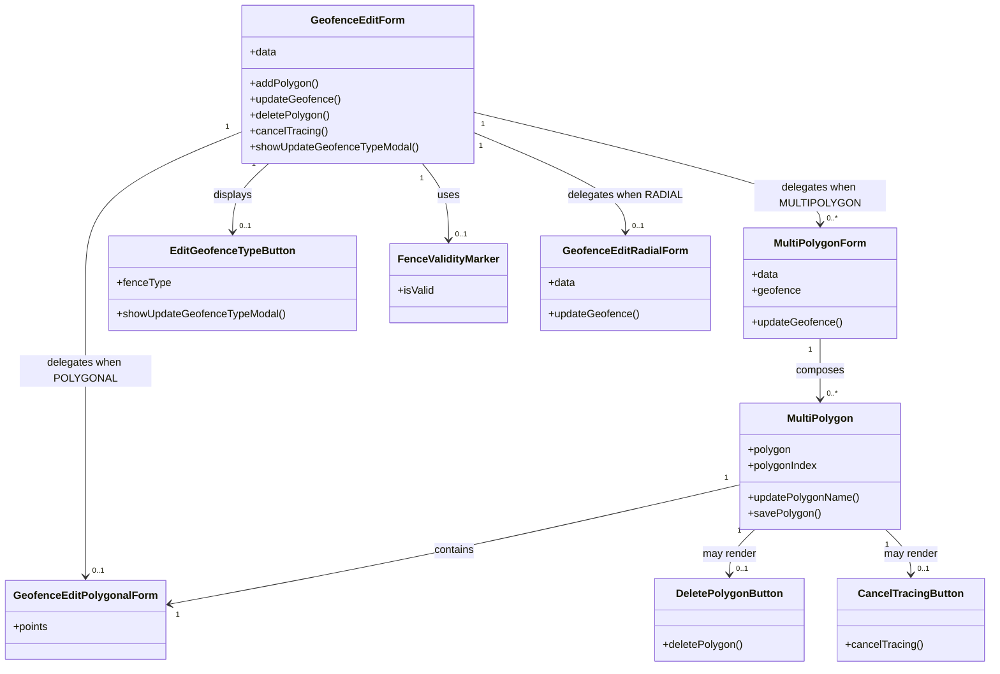

# Diagram: web/portal/src/modules/geofence-edit/GeofenceEditForm.js


> Auto-generated by Obscura crawlers

## Diagram 1



### SVG

<svg id="container" width="1463.501953125" xmlns="http://www.w3.org/2000/svg" class="classDiagram" height="1012" viewBox="0 0 1463.501953125 1012" role="graphics-document document" aria-roledescription="class"><style>#container{font-family:"trebuchet ms",verdana,arial,sans-serif;font-size:16px;fill:#333;}@keyframes edge-animation-frame{from{stroke-dashoffset:0;}}@keyframes dash{to{stroke-dashoffset:0;}}#container .edge-animation-slow{stroke-dasharray:9,5!important;stroke-dashoffset:900;animation:dash 50s linear infinite;stroke-linecap:round;}#container .edge-animation-fast{stroke-dasharray:9,5!important;stroke-dashoffset:900;animation:dash 20s linear infinite;stroke-linecap:round;}#container .error-icon{fill:#552222;}#container .error-text{fill:#552222;stroke:#552222;}#container .edge-thickness-normal{stroke-width:1px;}#container .edge-thickness-thick{stroke-width:3.5px;}#container .edge-pattern-solid{stroke-dasharray:0;}#container .edge-thickness-invisible{stroke-width:0;fill:none;}#container .edge-pattern-dashed{stroke-dasharray:3;}#container .edge-pattern-dotted{stroke-dasharray:2;}#container .marker{fill:#333333;stroke:#333333;}#container .marker.cross{stroke:#333333;}#container svg{font-family:"trebuchet ms",verdana,arial,sans-serif;font-size:16px;}#container p{margin:0;}#container g.classGroup text{fill:#9370DB;stroke:none;font-family:"trebuchet ms",verdana,arial,sans-serif;font-size:10px;}#container g.classGroup text .title{font-weight:bolder;}#container .nodeLabel,#container .edgeLabel{color:#131300;}#container .edgeLabel .label rect{fill:#ECECFF;}#container .label text{fill:#131300;}#container .labelBkg{background:#ECECFF;}#container .edgeLabel .label span{background:#ECECFF;}#container .classTitle{font-weight:bolder;}#container .node rect,#container .node circle,#container .node ellipse,#container .node polygon,#container .node path{fill:#ECECFF;stroke:#9370DB;stroke-width:1px;}#container .divider{stroke:#9370DB;stroke-width:1;}#container g.clickable{cursor:pointer;}#container g.classGroup rect{fill:#ECECFF;stroke:#9370DB;}#container g.classGroup line{stroke:#9370DB;stroke-width:1;}#container .classLabel .box{stroke:none;stroke-width:0;fill:#ECECFF;opacity:0.5;}#container .classLabel .label{fill:#9370DB;font-size:10px;}#container .relation{stroke:#333333;stroke-width:1;fill:none;}#container .dashed-line{stroke-dasharray:3;}#container .dotted-line{stroke-dasharray:1 2;}#container #compositionStart,#container .composition{fill:#333333!important;stroke:#333333!important;stroke-width:1;}#container #compositionEnd,#container .composition{fill:#333333!important;stroke:#333333!important;stroke-width:1;}#container #dependencyStart,#container .dependency{fill:#333333!important;stroke:#333333!important;stroke-width:1;}#container #dependencyStart,#container .dependency{fill:#333333!important;stroke:#333333!important;stroke-width:1;}#container #extensionStart,#container .extension{fill:transparent!important;stroke:#333333!important;stroke-width:1;}#container #extensionEnd,#container .extension{fill:transparent!important;stroke:#333333!important;stroke-width:1;}#container #aggregationStart,#container .aggregation{fill:transparent!important;stroke:#333333!important;stroke-width:1;}#container #aggregationEnd,#container .aggregation{fill:transparent!important;stroke:#333333!important;stroke-width:1;}#container #lollipopStart,#container .lollipop{fill:#ECECFF!important;stroke:#333333!important;stroke-width:1;}#container #lollipopEnd,#container .lollipop{fill:#ECECFF!important;stroke:#333333!important;stroke-width:1;}#container .edgeTerminals{font-size:11px;line-height:initial;}#container .classTitleText{text-anchor:middle;font-size:18px;fill:#333;}#container .label-icon{display:inline-block;height:1em;overflow:visible;vertical-align:-0.125em;}#container .node .label-icon path{fill:currentColor;stroke:revert;stroke-width:revert;}#container :root{--mermaid-font-family:"trebuchet ms",verdana,arial,sans-serif;}</style><g><defs><marker id="container_class-aggregationStart" class="marker aggregation class" refX="18" refY="7" markerWidth="190" markerHeight="240" orient="auto"><path d="M 18,7 L9,13 L1,7 L9,1 Z"></path></marker></defs><defs><marker id="container_class-aggregationEnd" class="marker aggregation class" refX="1" refY="7" markerWidth="20" markerHeight="28" orient="auto"><path d="M 18,7 L9,13 L1,7 L9,1 Z"></path></marker></defs><defs><marker id="container_class-extensionStart" class="marker extension class" refX="18" refY="7" markerWidth="190" markerHeight="240" orient="auto"><path d="M 1,7 L18,13 V 1 Z"></path></marker></defs><defs><marker id="container_class-extensionEnd" class="marker extension class" refX="1" refY="7" markerWidth="20" markerHeight="28" orient="auto"><path d="M 1,1 V 13 L18,7 Z"></path></marker></defs><defs><marker id="container_class-compositionStart" class="marker composition class" refX="18" refY="7" markerWidth="190" markerHeight="240" orient="auto"><path d="M 18,7 L9,13 L1,7 L9,1 Z"></path></marker></defs><defs><marker id="container_class-compositionEnd" class="marker composition class" refX="1" refY="7" markerWidth="20" markerHeight="28" orient="auto"><path d="M 18,7 L9,13 L1,7 L9,1 Z"></path></marker></defs><defs><marker id="container_class-dependencyStart" class="marker dependency class" refX="6" refY="7" markerWidth="190" markerHeight="240" orient="auto"><path d="M 5,7 L9,13 L1,7 L9,1 Z"></path></marker></defs><defs><marker id="container_class-dependencyEnd" class="marker dependency class" refX="13" refY="7" markerWidth="20" markerHeight="28" orient="auto"><path d="M 18,7 L9,13 L14,7 L9,1 Z"></path></marker></defs><defs><marker id="container_class-lollipopStart" class="marker lollipop class" refX="13" refY="7" markerWidth="190" markerHeight="240" orient="auto"><circle stroke="black" fill="transparent" cx="7" cy="7" r="6"></circle></marker></defs><defs><marker id="container_class-lollipopEnd" class="marker lollipop class" refX="1" refY="7" markerWidth="190" markerHeight="240" orient="auto"><circle stroke="black" fill="transparent" cx="7" cy="7" r="6"></circle></marker></defs><g class="root"><g class="clusters"></g><g class="edgePaths"><path d="M623.289,248L629.803,256.167C636.318,264.333,649.346,280.667,655.861,300C662.375,319.333,662.375,341.667,662.375,352.833L662.375,364" id="id_GeofenceEditForm_FenceValidityMarker_1" class="edge-thickness-normal edge-pattern-solid relation" style=";;;" data-edge="true" data-et="edge" data-id="id_GeofenceEditForm_FenceValidityMarker_1" data-points="W3sieCI6NjIzLjI4OTA1MDk0MzA0NzMsInkiOjI0OH0seyJ4Ijo2NjIuMzc1LCJ5IjoyOTd9LHsieCI6NjYyLjM3NSwieSI6MzcwfV0=" marker-end="url(#container_class-dependencyEnd)"></path><path d="M395.743,248L386.771,256.167C377.8,264.333,359.857,280.667,350.886,298C341.914,315.333,341.914,333.667,341.914,342.833L341.914,352" id="id_GeofenceEditForm_EditGeofenceTypeButton_2" class="edge-thickness-normal edge-pattern-solid relation" style=";;;" data-edge="true" data-et="edge" data-id="id_GeofenceEditForm_EditGeofenceTypeButton_2" data-points="W3sieCI6Mzk1Ljc0MjgyMzEzMjM5NjQ0LCJ5IjoyNDh9LHsieCI6MzQxLjkxNDA2MjUsInkiOjI5N30seyJ4IjozNDEuOTE0MDYyNSwieSI6MzU4fV0=" marker-end="url(#container_class-dependencyEnd)"></path><path d="M700.096,170.556L785.534,191.63C870.971,212.704,1041.847,254.852,1127.285,283.093C1212.723,311.333,1212.723,325.667,1212.723,332.833L1212.723,340" id="id_GeofenceEditForm_MultiPolygonForm_3" class="edge-thickness-normal edge-pattern-solid relation" style=";;;" data-edge="true" data-et="edge" data-id="id_GeofenceEditForm_MultiPolygonForm_3" data-points="W3sieCI6NzAwLjA5NTcwMzEyNSwieSI6MTcwLjU1NTU1NDYwNTM0Mzh9LHsieCI6MTIxMi43MjI2NTYyNSwieSI6Mjk3fSx7IngiOjEyMTIuNzIyNjU2MjUsInkiOjM0Nn1d" marker-end="url(#container_class-dependencyEnd)"></path><path d="M700.096,201.598L737.369,217.499C774.642,233.399,849.188,265.199,886.461,290.266C923.734,315.333,923.734,333.667,923.734,342.833L923.734,352" id="id_GeofenceEditForm_GeofenceEditRadialForm_4" class="edge-thickness-normal edge-pattern-solid relation" style=";;;" data-edge="true" data-et="edge" data-id="id_GeofenceEditForm_GeofenceEditRadialForm_4" data-points="W3sieCI6NzAwLjA5NTcwMzEyNSwieSI6MjAxLjU5ODIzODk4MDA2NzcyfSx7IngiOjkyMy43MzQzNzUsInkiOjI5N30seyJ4Ijo5MjMuNzM0Mzc1LCJ5IjozNTh9XQ==" marker-end="url(#container_class-dependencyEnd)"></path><path d="M355.041,199.968L316.272,216.14C277.504,232.312,199.967,264.656,161.198,302.995C122.43,341.333,122.43,385.667,122.43,430C122.43,474.333,122.43,518.667,122.43,565C122.43,611.333,122.43,659.667,122.43,706C122.43,752.333,122.43,796.667,122.43,824.5C122.43,852.333,122.43,863.667,122.43,869.333L122.43,875" id="id_GeofenceEditForm_GeofenceEditPolygonalForm_5" class="edge-thickness-normal edge-pattern-solid relation" style=";;;" data-edge="true" data-et="edge" data-id="id_GeofenceEditForm_GeofenceEditPolygonalForm_5" data-points="W3sieCI6MzU1LjA0MTAxNTYyNSwieSI6MTk5Ljk2ODI0OTY4MzAyNzEyfSx7IngiOjEyMi40Mjk2ODc1LCJ5IjoyOTd9LHsieCI6MTIyLjQyOTY4NzUsInkiOjQzMH0seyJ4IjoxMjIuNDI5Njg3NSwieSI6NTYzfSx7IngiOjEyMi40Mjk2ODc1LCJ5Ijo3MDh9LHsieCI6MTIyLjQyOTY4NzUsInkiOjg0MX0seyJ4IjoxMjIuNDI5Njg3NSwieSI6ODgxfV0=" marker-end="url(#container_class-dependencyEnd)"></path><path d="M1212.723,514L1212.723,522.167C1212.723,530.333,1212.723,546.667,1212.723,562C1212.723,577.333,1212.723,591.667,1212.723,598.833L1212.723,606" id="id_MultiPolygonForm_MultiPolygon_6" class="edge-thickness-normal edge-pattern-solid relation" style=";;;" data-edge="true" data-et="edge" data-id="id_MultiPolygonForm_MultiPolygon_6" data-points="W3sieCI6MTIxMi43MjI2NTYyNSwieSI6NTE0fSx7IngiOjEyMTIuNzIyNjU2MjUsInkiOjU2M30seyJ4IjoxMjEyLjcyMjY1NjI1LCJ5Ijo2MTJ9XQ==" marker-end="url(#container_class-dependencyEnd)"></path><path d="M1092.309,736.306L1018.08,753.755C943.852,771.204,795.396,806.102,653.803,836.394C512.211,866.687,377.482,892.373,310.118,905.217L242.753,918.06" id="id_MultiPolygon_GeofenceEditPolygonalForm_7" class="edge-thickness-normal edge-pattern-solid relation" style=";;;" data-edge="true" data-et="edge" data-id="id_MultiPolygon_GeofenceEditPolygonalForm_7" data-points="W3sieCI6MTA5Mi4zMDg1OTM3NSwieSI6NzM2LjMwNjAxOTM3OTkzODd9LHsieCI6NjQ2LjkzOTQ1MzEyNSwieSI6ODQxfSx7IngiOjIzNi44NTkzNzUsInkiOjkxOS4xODM0OTcyMzg4NjUxfV0=" marker-end="url(#container_class-dependencyEnd)"></path><path d="M1115.419,804L1109.168,810.167C1102.918,816.333,1090.417,828.667,1084.166,840C1077.916,851.333,1077.916,861.667,1077.916,866.833L1077.916,872" id="id_MultiPolygon_DeletePolygonButton_8" class="edge-thickness-normal edge-pattern-solid relation" style=";;;" data-edge="true" data-et="edge" data-id="id_MultiPolygon_DeletePolygonButton_8" data-points="W3sieCI6MTExNS40MTg2MTQ4OTY2MTY2LCJ5Ijo4MDR9LHsieCI6MTA3Ny45MTYwMTU2MjUsInkiOjg0MX0seyJ4IjoxMDc3LjkxNjAxNTYyNSwieSI6ODc4fV0=" marker-end="url(#container_class-dependencyEnd)"></path><path d="M1310.027,804L1316.277,810.167C1322.528,816.333,1335.028,828.667,1341.279,840C1347.529,851.333,1347.529,861.667,1347.529,866.833L1347.529,872" id="id_MultiPolygon_CancelTracingButton_9" class="edge-thickness-normal edge-pattern-solid relation" style=";;;" data-edge="true" data-et="edge" data-id="id_MultiPolygon_CancelTracingButton_9" data-points="W3sieCI6MTMxMC4wMjY2OTc2MDMzODM0LCJ5Ijo4MDR9LHsieCI6MTM0Ny41MjkyOTY4NzUsInkiOjg0MX0seyJ4IjoxMzQ3LjUyOTI5Njg3NSwieSI6ODc4fV0=" marker-end="url(#container_class-dependencyEnd)"></path></g><g class="edgeLabels"><g class="edgeLabel" transform="translate(662.375, 297)"><g class="label" data-id="id_GeofenceEditForm_FenceValidityMarker_1" transform="translate(-16.4921875, -12)"><foreignObject width="32.984375" height="24"><div xmlns="http://www.w3.org/1999/xhtml" class="labelBkg" style="display: table-cell; white-space: nowrap; line-height: 1.5; max-width: 200px; text-align: center;"><span class="edgeLabel"><p>uses</p></span></div></foreignObject></g></g><g class="edgeLabel" transform="translate(341.9140625, 297)"><g class="label" data-id="id_GeofenceEditForm_EditGeofenceTypeButton_2" transform="translate(-29.6875, -12)"><foreignObject width="59.375" height="24"><div xmlns="http://www.w3.org/1999/xhtml" class="labelBkg" style="display: table-cell; white-space: nowrap; line-height: 1.5; max-width: 200px; text-align: center;"><span class="edgeLabel"><p>displays</p></span></div></foreignObject></g></g><g class="edgeLabel" transform="translate(1212.72265625, 297)"><g class="label" data-id="id_GeofenceEditForm_MultiPolygonForm_3" transform="translate(-100, -24)"><foreignObject width="200" height="48"><div xmlns="http://www.w3.org/1999/xhtml" class="labelBkg" style="display: table; white-space: break-spaces; line-height: 1.5; max-width: 200px; text-align: center; width: 200px;"><span class="edgeLabel"><p>delegates when MULTIPOLYGON</p></span></div></foreignObject></g></g><g class="edgeLabel" transform="translate(923.734375, 297)"><g class="label" data-id="id_GeofenceEditForm_GeofenceEditRadialForm_4" transform="translate(-84.25, -12)"><foreignObject width="168.5" height="24"><div xmlns="http://www.w3.org/1999/xhtml" class="labelBkg" style="display: table-cell; white-space: nowrap; line-height: 1.5; max-width: 200px; text-align: center;"><span class="edgeLabel"><p>delegates when RADIAL</p></span></div></foreignObject></g></g><g class="edgeLabel" transform="translate(122.4296875, 563)"><g class="label" data-id="id_GeofenceEditForm_GeofenceEditPolygonalForm_5" transform="translate(-100, -24)"><foreignObject width="200" height="48"><div xmlns="http://www.w3.org/1999/xhtml" class="labelBkg" style="display: table; white-space: break-spaces; line-height: 1.5; max-width: 200px; text-align: center; width: 200px;"><span class="edgeLabel"><p>delegates when POLYGONAL</p></span></div></foreignObject></g></g><g class="edgeLabel" transform="translate(1212.72265625, 563)"><g class="label" data-id="id_MultiPolygonForm_MultiPolygon_6" transform="translate(-36.453125, -12)"><foreignObject width="72.90625" height="24"><div xmlns="http://www.w3.org/1999/xhtml" class="labelBkg" style="display: table-cell; white-space: nowrap; line-height: 1.5; max-width: 200px; text-align: center;"><span class="edgeLabel"><p>composes</p></span></div></foreignObject></g></g><g class="edgeLabel" transform="translate(666.42942, 836.41845)"><g class="label" data-id="id_MultiPolygon_GeofenceEditPolygonalForm_7" transform="translate(-30.890625, -12)"><foreignObject width="61.78125" height="24"><div xmlns="http://www.w3.org/1999/xhtml" class="labelBkg" style="display: table-cell; white-space: nowrap; line-height: 1.5; max-width: 200px; text-align: center;"><span class="edgeLabel"><p>contains</p></span></div></foreignObject></g></g><g class="edgeLabel" transform="translate(1077.916015625, 841)"><g class="label" data-id="id_MultiPolygon_DeletePolygonButton_8" transform="translate(-41.2734375, -12)"><foreignObject width="82.546875" height="24"><div xmlns="http://www.w3.org/1999/xhtml" class="labelBkg" style="display: table-cell; white-space: nowrap; line-height: 1.5; max-width: 200px; text-align: center;"><span class="edgeLabel"><p>may render</p></span></div></foreignObject></g></g><g class="edgeLabel" transform="translate(1347.529296875, 841)"><g class="label" data-id="id_MultiPolygon_CancelTracingButton_9" transform="translate(-41.2734375, -12)"><foreignObject width="82.546875" height="24"><div xmlns="http://www.w3.org/1999/xhtml" class="labelBkg" style="display: table-cell; white-space: nowrap; line-height: 1.5; max-width: 200px; text-align: center;"><span class="edgeLabel"><p>may render</p></span></div></foreignObject></g></g><g class="edgeTerminals" transform="translate(622.4754499757713, 271.03449727866166)"><g class="inner" transform="translate(0, 0)"><foreignObject style="width: 9px; height: 12px;"><div xmlns="http://www.w3.org/1999/xhtml" style="display: inline-block; padding-right: 1px; white-space: nowrap;"><span class="edgeLabel">1</span></div></foreignObject></g></g><g class="edgeTerminals" transform="translate(372.70422951414344, 248.68783933080059)"><g class="inner" transform="translate(0, 0)"><foreignObject style="width: 9px; height: 12px;"><div xmlns="http://www.w3.org/1999/xhtml" style="display: inline-block; padding-right: 1px; white-space: nowrap;"><span class="edgeLabel">1</span></div></foreignObject></g></g><g class="edgeTerminals" transform="translate(713.4942342562049, 189.3100037974183)"><g class="inner" transform="translate(0, 0)"><foreignObject style="width: 9px; height: 12px;"><div xmlns="http://www.w3.org/1999/xhtml" style="display: inline-block; padding-right: 1px; white-space: nowrap;"><span class="edgeLabel">1</span></div></foreignObject></g></g><g class="edgeTerminals" transform="translate(710.3066003953211, 222.26191486215075)"><g class="inner" transform="translate(0, 0)"><foreignObject style="width: 9px; height: 12px;"><div xmlns="http://www.w3.org/1999/xhtml" style="display: inline-block; padding-right: 1px; white-space: nowrap;"><span class="edgeLabel">1</span></div></foreignObject></g></g><g class="edgeTerminals" transform="translate(333.11506393108533, 192.8617298704803)"><g class="inner" transform="translate(0, 0)"><foreignObject style="width: 9px; height: 12px;"><div xmlns="http://www.w3.org/1999/xhtml" style="display: inline-block; padding-right: 1px; white-space: nowrap;"><span class="edgeLabel">1</span></div></foreignObject></g></g><g class="edgeTerminals" transform="translate(1197.722658125, 531.5000016071428)"><g class="inner" transform="translate(0, 0)"><foreignObject style="width: 9px; height: 12px;"><div xmlns="http://www.w3.org/1999/xhtml" style="display: inline-block; padding-right: 1px; white-space: nowrap;"><span class="edgeLabel">1</span></div></foreignObject></g></g><g class="edgeTerminals" transform="translate(1071.840428739947, 725.7086508881998)"><g class="inner" transform="translate(0, 0)"><foreignObject style="width: 9px; height: 12px;"><div xmlns="http://www.w3.org/1999/xhtml" style="display: inline-block; padding-right: 1px; white-space: nowrap;"><span class="edgeLabel">1</span></div></foreignObject></g></g><g class="edgeTerminals" transform="translate(1092.4262431256936, 805.6126985686315)"><g class="inner" transform="translate(0, 0)"><foreignObject style="width: 9px; height: 12px;"><div xmlns="http://www.w3.org/1999/xhtml" style="display: inline-block; padding-right: 1px; white-space: nowrap;"><span class="edgeLabel">1</span></div></foreignObject></g></g><g class="edgeTerminals" transform="translate(1311.9494489434117, 826.9685209028818)"><g class="inner" transform="translate(0, 0)"><foreignObject style="width: 9px; height: 12px;"><div xmlns="http://www.w3.org/1999/xhtml" style="display: inline-block; padding-right: 1px; white-space: nowrap;"><span class="edgeLabel">1</span></div></foreignObject></g></g><g class="edgeTerminals" transform="translate(672.375, 347.5)"><g class="inner" transform="translate(0, 0)"></g><foreignObject style="width: 36px; height: 12px;"><div xmlns="http://www.w3.org/1999/xhtml" style="display: inline-block; padding-right: 1px; white-space: nowrap;"><span class="edgeLabel">0..1</span></div></foreignObject></g><g class="edgeTerminals" transform="translate(351.91406125, 335.4999989285714)"><g class="inner" transform="translate(0, 0)"></g><foreignObject style="width: 36px; height: 12px;"><div xmlns="http://www.w3.org/1999/xhtml" style="display: inline-block; padding-right: 1px; white-space: nowrap;"><span class="edgeLabel">0..1</span></div></foreignObject></g><g class="edgeTerminals" transform="translate(1222.722658125, 323.5000016071428)"><g class="inner" transform="translate(0, 0)"></g><foreignObject style="width: 36px; height: 12px;"><div xmlns="http://www.w3.org/1999/xhtml" style="display: inline-block; padding-right: 1px; white-space: nowrap;"><span class="edgeLabel">0..*</span></div></foreignObject></g><g class="edgeTerminals" transform="translate(933.7343774999998, 335.5000021428571)"><g class="inner" transform="translate(0, 0)"></g><foreignObject style="width: 36px; height: 12px;"><div xmlns="http://www.w3.org/1999/xhtml" style="display: inline-block; padding-right: 1px; white-space: nowrap;"><span class="edgeLabel">0..1</span></div></foreignObject></g><g class="edgeTerminals" transform="translate(132.42968874999997, 858.5000010714285)"><g class="inner" transform="translate(0, 0)"></g><foreignObject style="width: 36px; height: 12px;"><div xmlns="http://www.w3.org/1999/xhtml" style="display: inline-block; padding-right: 1px; white-space: nowrap;"><span class="edgeLabel">0..1</span></div></foreignObject></g><g class="edgeTerminals" transform="translate(1222.722658125, 589.5000016071428)"><g class="inner" transform="translate(0, 0)"></g><foreignObject style="width: 36px; height: 12px;"><div xmlns="http://www.w3.org/1999/xhtml" style="display: inline-block; padding-right: 1px; white-space: nowrap;"><span class="edgeLabel">0..*</span></div></foreignObject></g><g class="edgeTerminals" transform="translate(251.8589491604332, 925.6406799778974)"><g class="inner" transform="translate(0, 0)"></g><foreignObject style="width: 9px; height: 12px;"><div xmlns="http://www.w3.org/1999/xhtml" style="display: inline-block; padding-right: 1px; white-space: nowrap;"><span class="edgeLabel">1</span></div></foreignObject></g><g class="edgeTerminals" transform="translate(1087.9160178124996, 855.500001875)"><g class="inner" transform="translate(0, 0)"></g><foreignObject style="width: 36px; height: 12px;"><div xmlns="http://www.w3.org/1999/xhtml" style="display: inline-block; padding-right: 1px; white-space: nowrap;"><span class="edgeLabel">0..1</span></div></foreignObject></g><g class="edgeTerminals" transform="translate(1357.5292984375, 855.5000013392856)"><g class="inner" transform="translate(0, 0)"></g><foreignObject style="width: 36px; height: 12px;"><div xmlns="http://www.w3.org/1999/xhtml" style="display: inline-block; padding-right: 1px; white-space: nowrap;"><span class="edgeLabel">0..1</span></div></foreignObject></g></g><g class="nodes"><g class="node default" id="classId-GeofenceEditForm-0" transform="translate(527.568359375, 128)"><g class="basic label-container"><path d="M-172.52734375 -120 L172.52734375 -120 L172.52734375 120 L-172.52734375 120" stroke="none" stroke-width="0" fill="#ECECFF" style=""></path><path d="M-172.52734375 -120 C-53.56445272958092 -120, 65.39843829083816 -120, 172.52734375 -120 M-172.52734375 -120 C-37.99244035319083 -120, 96.54246304361834 -120, 172.52734375 -120 M172.52734375 -120 C172.52734375 -38.32496709608614, 172.52734375 43.35006580782772, 172.52734375 120 M172.52734375 -120 C172.52734375 -33.79024509502412, 172.52734375 52.41950980995176, 172.52734375 120 M172.52734375 120 C102.46651634488538 120, 32.405688939770755 120, -172.52734375 120 M172.52734375 120 C64.17877491410366 120, -44.16979392179269 120, -172.52734375 120 M-172.52734375 120 C-172.52734375 42.654105605591084, -172.52734375 -34.69178878881783, -172.52734375 -120 M-172.52734375 120 C-172.52734375 39.030318084541335, -172.52734375 -41.93936383091733, -172.52734375 -120" stroke="#9370DB" stroke-width="1.3" fill="none" stroke-dasharray="0 0" style=""></path></g><g class="annotation-group text" transform="translate(0, -96)"></g><g class="label-group text" transform="translate(-66.5859375, -96)"><g class="label" style="font-weight: bolder" transform="translate(0,-12)"><foreignObject width="133.171875" height="24"><div xmlns="http://www.w3.org/1999/xhtml" style="display: table-cell; white-space: nowrap; line-height: 1.5; max-width: 182px; text-align: center;"><span class="nodeLabel markdown-node-label" style=""><p>GeofenceEditForm</p></span></div></foreignObject></g></g><g class="members-group text" transform="translate(-160.52734375, -48)"><g class="label" style="" transform="translate(0,-12)"><foreignObject width="40.625" height="24"><div xmlns="http://www.w3.org/1999/xhtml" style="display: table-cell; white-space: nowrap; line-height: 1.5; max-width: 98px; text-align: center;"><span class="nodeLabel markdown-node-label" style=""><p>+data</p></span></div></foreignObject></g></g><g class="methods-group text" transform="translate(-160.52734375, 0)"><g class="label" style="" transform="translate(0,-12)"><foreignObject width="103.265625" height="24"><div xmlns="http://www.w3.org/1999/xhtml" style="display: table-cell; white-space: nowrap; line-height: 1.5; max-width: 161px; text-align: center;"><span class="nodeLabel markdown-node-label" style=""><p>+addPolygon()</p></span></div></foreignObject></g><g class="label" style="" transform="translate(0,12)"><foreignObject width="137.203125" height="24"><div xmlns="http://www.w3.org/1999/xhtml" style="display: table-cell; white-space: nowrap; line-height: 1.5; max-width: 195px; text-align: center;"><span class="nodeLabel markdown-node-label" style=""><p>+updateGeofence()</p></span></div></foreignObject></g><g class="label" style="" transform="translate(0,36)"><foreignObject width="121.546875" height="24"><div xmlns="http://www.w3.org/1999/xhtml" style="display: table-cell; white-space: nowrap; line-height: 1.5; max-width: 179px; text-align: center;"><span class="nodeLabel markdown-node-label" style=""><p>+deletePolygon()</p></span></div></foreignObject></g><g class="label" style="" transform="translate(0,60)"><foreignObject width="116.625" height="24"><div xmlns="http://www.w3.org/1999/xhtml" style="display: table-cell; white-space: nowrap; line-height: 1.5; max-width: 174px; text-align: center;"><span class="nodeLabel markdown-node-label" style=""><p>+cancelTracing()</p></span></div></foreignObject></g><g class="label" style="" transform="translate(0,84)"><foreignObject width="254.46875" height="24"><div xmlns="http://www.w3.org/1999/xhtml" style="display: table-cell; white-space: nowrap; line-height: 1.5; max-width: 312px; text-align: center;"><span class="nodeLabel markdown-node-label" style=""><p>+showUpdateGeofenceTypeModal()</p></span></div></foreignObject></g></g><g class="divider" style=""><path d="M-172.52734375 -72 C-64.82286488244195 -72, 42.881613985116104 -72, 172.52734375 -72 M-172.52734375 -72 C-56.80294492437628 -72, 58.921453901247446 -72, 172.52734375 -72" stroke="#9370DB" stroke-width="1.3" fill="none" stroke-dasharray="0 0" style=""></path></g><g class="divider" style=""><path d="M-172.52734375 -24 C-75.62027260373365 -24, 21.286798542532694 -24, 172.52734375 -24 M-172.52734375 -24 C-75.8915066426676 -24, 20.744330464664813 -24, 172.52734375 -24" stroke="#9370DB" stroke-width="1.3" fill="none" stroke-dasharray="0 0" style=""></path></g></g><g class="node default" id="classId-MultiPolygonForm-1" transform="translate(1212.72265625, 430)"><g class="basic label-container"><path d="M-113.60546875 -84 L113.60546875 -84 L113.60546875 84 L-113.60546875 84" stroke="none" stroke-width="0" fill="#ECECFF" style=""></path><path d="M-113.60546875 -84 C-62.87715572102487 -84, -12.14884269204974 -84, 113.60546875 -84 M-113.60546875 -84 C-26.177785949484175 -84, 61.24989685103165 -84, 113.60546875 -84 M113.60546875 -84 C113.60546875 -39.33192759678942, 113.60546875 5.33614480642116, 113.60546875 84 M113.60546875 -84 C113.60546875 -24.793590488814083, 113.60546875 34.412819022371835, 113.60546875 84 M113.60546875 84 C37.476028936966316 84, -38.65341087606737 84, -113.60546875 84 M113.60546875 84 C42.98391013021059 84, -27.637648489578822 84, -113.60546875 84 M-113.60546875 84 C-113.60546875 46.42688141410081, -113.60546875 8.853762828201624, -113.60546875 -84 M-113.60546875 84 C-113.60546875 48.42074154068599, -113.60546875 12.841483081371976, -113.60546875 -84" stroke="#9370DB" stroke-width="1.3" fill="none" stroke-dasharray="0 0" style=""></path></g><g class="annotation-group text" transform="translate(0, -60)"></g><g class="label-group text" transform="translate(-66.0078125, -60)"><g class="label" style="font-weight: bolder" transform="translate(0,-12)"><foreignObject width="132.015625" height="24"><div xmlns="http://www.w3.org/1999/xhtml" style="display: table-cell; white-space: nowrap; line-height: 1.5; max-width: 181px; text-align: center;"><span class="nodeLabel markdown-node-label" style=""><p>MultiPolygonForm</p></span></div></foreignObject></g></g><g class="members-group text" transform="translate(-101.60546875, -12)"><g class="label" style="" transform="translate(0,-12)"><foreignObject width="40.625" height="24"><div xmlns="http://www.w3.org/1999/xhtml" style="display: table-cell; white-space: nowrap; line-height: 1.5; max-width: 98px; text-align: center;"><span class="nodeLabel markdown-node-label" style=""><p>+data</p></span></div></foreignObject></g><g class="label" style="" transform="translate(0,12)"><foreignObject width="73.46875" height="24"><div xmlns="http://www.w3.org/1999/xhtml" style="display: table-cell; white-space: nowrap; line-height: 1.5; max-width: 131px; text-align: center;"><span class="nodeLabel markdown-node-label" style=""><p>+geofence</p></span></div></foreignObject></g></g><g class="methods-group text" transform="translate(-101.60546875, 60)"><g class="label" style="" transform="translate(0,-12)"><foreignObject width="137.203125" height="24"><div xmlns="http://www.w3.org/1999/xhtml" style="display: table-cell; white-space: nowrap; line-height: 1.5; max-width: 195px; text-align: center;"><span class="nodeLabel markdown-node-label" style=""><p>+updateGeofence()</p></span></div></foreignObject></g></g><g class="divider" style=""><path d="M-113.60546875 -36 C-68.01688115541015 -36, -22.428293560820293 -36, 113.60546875 -36 M-113.60546875 -36 C-57.47105543867518 -36, -1.336642127350359 -36, 113.60546875 -36" stroke="#9370DB" stroke-width="1.3" fill="none" stroke-dasharray="0 0" style=""></path></g><g class="divider" style=""><path d="M-113.60546875 36 C-44.20995672623209 36, 25.185555297535814 36, 113.60546875 36 M-113.60546875 36 C-44.217664560415955 36, 25.17013962916809 36, 113.60546875 36" stroke="#9370DB" stroke-width="1.3" fill="none" stroke-dasharray="0 0" style=""></path></g></g><g class="node default" id="classId-MultiPolygon-2" transform="translate(1212.72265625, 708)"><g class="basic label-container"><path d="M-120.4140625 -96 L120.4140625 -96 L120.4140625 96 L-120.4140625 96" stroke="none" stroke-width="0" fill="#ECECFF" style=""></path><path d="M-120.4140625 -96 C-24.743190905335055 -96, 70.92768068932989 -96, 120.4140625 -96 M-120.4140625 -96 C-33.2036104410946 -96, 54.00684161781081 -96, 120.4140625 -96 M120.4140625 -96 C120.4140625 -47.063716376574234, 120.4140625 1.8725672468515313, 120.4140625 96 M120.4140625 -96 C120.4140625 -49.68817927124886, 120.4140625 -3.3763585424977265, 120.4140625 96 M120.4140625 96 C43.25720506123673 96, -33.899652377526536 96, -120.4140625 96 M120.4140625 96 C39.61816576904839 96, -41.17773096190322 96, -120.4140625 96 M-120.4140625 96 C-120.4140625 46.53285389755263, -120.4140625 -2.9342922048947457, -120.4140625 -96 M-120.4140625 96 C-120.4140625 46.779787949162845, -120.4140625 -2.44042410167431, -120.4140625 -96" stroke="#9370DB" stroke-width="1.3" fill="none" stroke-dasharray="0 0" style=""></path></g><g class="annotation-group text" transform="translate(0, -72)"></g><g class="label-group text" transform="translate(-47.75, -72)"><g class="label" style="font-weight: bolder" transform="translate(0,-12)"><foreignObject width="95.5" height="24"><div xmlns="http://www.w3.org/1999/xhtml" style="display: table-cell; white-space: nowrap; line-height: 1.5; max-width: 144px; text-align: center;"><span class="nodeLabel markdown-node-label" style=""><p>MultiPolygon</p></span></div></foreignObject></g></g><g class="members-group text" transform="translate(-108.4140625, -24)"><g class="label" style="" transform="translate(0,-12)"><foreignObject width="65.984375" height="24"><div xmlns="http://www.w3.org/1999/xhtml" style="display: table-cell; white-space: nowrap; line-height: 1.5; max-width: 123px; text-align: center;"><span class="nodeLabel markdown-node-label" style=""><p>+polygon</p></span></div></foreignObject></g><g class="label" style="" transform="translate(0,12)"><foreignObject width="105.984375" height="24"><div xmlns="http://www.w3.org/1999/xhtml" style="display: table-cell; white-space: nowrap; line-height: 1.5; max-width: 164px; text-align: center;"><span class="nodeLabel markdown-node-label" style=""><p>+polygonIndex</p></span></div></foreignObject></g></g><g class="methods-group text" transform="translate(-108.4140625, 48)"><g class="label" style="" transform="translate(0,-12)"><foreignObject width="169.078125" height="24"><div xmlns="http://www.w3.org/1999/xhtml" style="display: table-cell; white-space: nowrap; line-height: 1.5; max-width: 226px; text-align: center;"><span class="nodeLabel markdown-node-label" style=""><p>+updatePolygonName()</p></span></div></foreignObject></g><g class="label" style="" transform="translate(0,12)"><foreignObject width="107.96875" height="24"><div xmlns="http://www.w3.org/1999/xhtml" style="display: table-cell; white-space: nowrap; line-height: 1.5; max-width: 165px; text-align: center;"><span class="nodeLabel markdown-node-label" style=""><p>+savePolygon()</p></span></div></foreignObject></g></g><g class="divider" style=""><path d="M-120.4140625 -48 C-32.41176261767946 -48, 55.590537264641085 -48, 120.4140625 -48 M-120.4140625 -48 C-25.784259891158257 -48, 68.84554271768349 -48, 120.4140625 -48" stroke="#9370DB" stroke-width="1.3" fill="none" stroke-dasharray="0 0" style=""></path></g><g class="divider" style=""><path d="M-120.4140625 24 C-53.26620213023148 24, 13.881658239537046 24, 120.4140625 24 M-120.4140625 24 C-65.6277608036346 24, -10.841459107269216 24, 120.4140625 24" stroke="#9370DB" stroke-width="1.3" fill="none" stroke-dasharray="0 0" style=""></path></g></g><g class="node default" id="classId-EditGeofenceTypeButton-3" transform="translate(341.9140625, 430)"><g class="basic label-container"><path d="M-184.484375 -72 L184.484375 -72 L184.484375 72 L-184.484375 72" stroke="none" stroke-width="0" fill="#ECECFF" style=""></path><path d="M-184.484375 -72 C-79.66339539636253 -72, 25.157584207274937 -72, 184.484375 -72 M-184.484375 -72 C-37.362599002942034 -72, 109.75917699411593 -72, 184.484375 -72 M184.484375 -72 C184.484375 -42.74645824972832, 184.484375 -13.49291649945664, 184.484375 72 M184.484375 -72 C184.484375 -34.09223059778286, 184.484375 3.815538804434283, 184.484375 72 M184.484375 72 C57.96587648462045 72, -68.5526220307591 72, -184.484375 72 M184.484375 72 C103.26621999259302 72, 22.048064985186045 72, -184.484375 72 M-184.484375 72 C-184.484375 38.195643041206196, -184.484375 4.3912860824123925, -184.484375 -72 M-184.484375 72 C-184.484375 42.48982847578668, -184.484375 12.979656951573368, -184.484375 -72" stroke="#9370DB" stroke-width="1.3" fill="none" stroke-dasharray="0 0" style=""></path></g><g class="annotation-group text" transform="translate(0, -48)"></g><g class="label-group text" transform="translate(-90.5, -48)"><g class="label" style="font-weight: bolder" transform="translate(0,-12)"><foreignObject width="181" height="24"><div xmlns="http://www.w3.org/1999/xhtml" style="display: table-cell; white-space: nowrap; line-height: 1.5; max-width: 228px; text-align: center;"><span class="nodeLabel markdown-node-label" style=""><p>EditGeofenceTypeButton</p></span></div></foreignObject></g></g><g class="members-group text" transform="translate(-172.484375, 0)"><g class="label" style="" transform="translate(0,-12)"><foreignObject width="80.828125" height="24"><div xmlns="http://www.w3.org/1999/xhtml" style="display: table-cell; white-space: nowrap; line-height: 1.5; max-width: 138px; text-align: center;"><span class="nodeLabel markdown-node-label" style=""><p>+fenceType</p></span></div></foreignObject></g></g><g class="methods-group text" transform="translate(-172.484375, 48)"><g class="label" style="" transform="translate(0,-12)"><foreignObject width="254.46875" height="24"><div xmlns="http://www.w3.org/1999/xhtml" style="display: table-cell; white-space: nowrap; line-height: 1.5; max-width: 312px; text-align: center;"><span class="nodeLabel markdown-node-label" style=""><p>+showUpdateGeofenceTypeModal()</p></span></div></foreignObject></g></g><g class="divider" style=""><path d="M-184.484375 -24 C-55.510671924933774 -24, 73.46303115013245 -24, 184.484375 -24 M-184.484375 -24 C-60.88370308536017 -24, 62.716968829279665 -24, 184.484375 -24" stroke="#9370DB" stroke-width="1.3" fill="none" stroke-dasharray="0 0" style=""></path></g><g class="divider" style=""><path d="M-184.484375 24 C-103.68106602937723 24, -22.87775705875447 24, 184.484375 24 M-184.484375 24 C-104.81294080059259 24, -25.14150660118517 24, 184.484375 24" stroke="#9370DB" stroke-width="1.3" fill="none" stroke-dasharray="0 0" style=""></path></g></g><g class="node default" id="classId-FenceValidityMarker-4" transform="translate(662.375, 430)"><g class="basic label-container"><path d="M-85.9765625 -60 L85.9765625 -60 L85.9765625 60 L-85.9765625 60" stroke="none" stroke-width="0" fill="#ECECFF" style=""></path><path d="M-85.9765625 -60 C-27.115262983813885 -60, 31.74603653237223 -60, 85.9765625 -60 M-85.9765625 -60 C-43.096736256323254 -60, -0.21691001264650822 -60, 85.9765625 -60 M85.9765625 -60 C85.9765625 -14.266688354358095, 85.9765625 31.46662329128381, 85.9765625 60 M85.9765625 -60 C85.9765625 -20.780294282174772, 85.9765625 18.439411435650456, 85.9765625 60 M85.9765625 60 C32.27529513613778 60, -21.425972227724444 60, -85.9765625 60 M85.9765625 60 C30.298420321711568 60, -25.379721856576865 60, -85.9765625 60 M-85.9765625 60 C-85.9765625 21.872540615556126, -85.9765625 -16.254918768887748, -85.9765625 -60 M-85.9765625 60 C-85.9765625 30.27746651333631, -85.9765625 0.5549330266726216, -85.9765625 -60" stroke="#9370DB" stroke-width="1.3" fill="none" stroke-dasharray="0 0" style=""></path></g><g class="annotation-group text" transform="translate(0, -36)"></g><g class="label-group text" transform="translate(-73.9765625, -36)"><g class="label" style="font-weight: bolder" transform="translate(0,-12)"><foreignObject width="147.953125" height="24"><div xmlns="http://www.w3.org/1999/xhtml" style="display: table-cell; white-space: nowrap; line-height: 1.5; max-width: 196px; text-align: center;"><span class="nodeLabel markdown-node-label" style=""><p>FenceValidityMarker</p></span></div></foreignObject></g></g><g class="members-group text" transform="translate(-73.9765625, 12)"><g class="label" style="" transform="translate(0,-12)"><foreignObject width="55.546875" height="24"><div xmlns="http://www.w3.org/1999/xhtml" style="display: table-cell; white-space: nowrap; line-height: 1.5; max-width: 113px; text-align: center;"><span class="nodeLabel markdown-node-label" style=""><p>+isValid</p></span></div></foreignObject></g></g><g class="methods-group text" transform="translate(-73.9765625, 60)"></g><g class="divider" style=""><path d="M-85.9765625 -12 C-39.43049483691891 -12, 7.115572826162179 -12, 85.9765625 -12 M-85.9765625 -12 C-43.46550744720025 -12, -0.954452394400505 -12, 85.9765625 -12" stroke="#9370DB" stroke-width="1.3" fill="none" stroke-dasharray="0 0" style=""></path></g><g class="divider" style=""><path d="M-85.9765625 36 C-44.4495240314951 36, -2.922485562990204 36, 85.9765625 36 M-85.9765625 36 C-51.54320098042408 36, -17.109839460848164 36, 85.9765625 36" stroke="#9370DB" stroke-width="1.3" fill="none" stroke-dasharray="0 0" style=""></path></g></g><g class="node default" id="classId-GeofenceEditPolygonalForm-5" transform="translate(122.4296875, 941)"><g class="basic label-container"><path d="M-114.4296875 -60 L114.4296875 -60 L114.4296875 60 L-114.4296875 60" stroke="none" stroke-width="0" fill="#ECECFF" style=""></path><path d="M-114.4296875 -60 C-26.46843798972425 -60, 61.4928115205515 -60, 114.4296875 -60 M-114.4296875 -60 C-42.366205971302364 -60, 29.697275557395272 -60, 114.4296875 -60 M114.4296875 -60 C114.4296875 -31.401510098997598, 114.4296875 -2.8030201979951954, 114.4296875 60 M114.4296875 -60 C114.4296875 -24.716680086252687, 114.4296875 10.566639827494626, 114.4296875 60 M114.4296875 60 C52.98162074745894 60, -8.466446005082119 60, -114.4296875 60 M114.4296875 60 C44.53444752832108 60, -25.360792443357838 60, -114.4296875 60 M-114.4296875 60 C-114.4296875 21.46243352707633, -114.4296875 -17.075132945847344, -114.4296875 -60 M-114.4296875 60 C-114.4296875 13.70611251068226, -114.4296875 -32.58777497863548, -114.4296875 -60" stroke="#9370DB" stroke-width="1.3" fill="none" stroke-dasharray="0 0" style=""></path></g><g class="annotation-group text" transform="translate(0, -36)"></g><g class="label-group text" transform="translate(-102.4296875, -36)"><g class="label" style="font-weight: bolder" transform="translate(0,-12)"><foreignObject width="204.859375" height="24"><div xmlns="http://www.w3.org/1999/xhtml" style="display: table-cell; white-space: nowrap; line-height: 1.5; max-width: 253px; text-align: center;"><span class="nodeLabel markdown-node-label" style=""><p>GeofenceEditPolygonalForm</p></span></div></foreignObject></g></g><g class="members-group text" transform="translate(-102.4296875, 12)"><g class="label" style="" transform="translate(0,-12)"><foreignObject width="53.96875" height="24"><div xmlns="http://www.w3.org/1999/xhtml" style="display: table-cell; white-space: nowrap; line-height: 1.5; max-width: 111px; text-align: center;"><span class="nodeLabel markdown-node-label" style=""><p>+points</p></span></div></foreignObject></g></g><g class="methods-group text" transform="translate(-102.4296875, 60)"></g><g class="divider" style=""><path d="M-114.4296875 -12 C-48.37687351391028 -12, 17.675940472179434 -12, 114.4296875 -12 M-114.4296875 -12 C-49.259000640803734 -12, 15.911686218392532 -12, 114.4296875 -12" stroke="#9370DB" stroke-width="1.3" fill="none" stroke-dasharray="0 0" style=""></path></g><g class="divider" style=""><path d="M-114.4296875 36 C-45.65375920267667 36, 23.122169094646665 36, 114.4296875 36 M-114.4296875 36 C-52.94084115743483 36, 8.548005185130336 36, 114.4296875 36" stroke="#9370DB" stroke-width="1.3" fill="none" stroke-dasharray="0 0" style=""></path></g></g><g class="node default" id="classId-GeofenceEditRadialForm-6" transform="translate(923.734375, 430)"><g class="basic label-container"><path d="M-125.3828125 -72 L125.3828125 -72 L125.3828125 72 L-125.3828125 72" stroke="none" stroke-width="0" fill="#ECECFF" style=""></path><path d="M-125.3828125 -72 C-59.55875311019145 -72, 6.265306279617107 -72, 125.3828125 -72 M-125.3828125 -72 C-51.12064672367413 -72, 23.141519052651745 -72, 125.3828125 -72 M125.3828125 -72 C125.3828125 -42.14197540068276, 125.3828125 -12.28395080136552, 125.3828125 72 M125.3828125 -72 C125.3828125 -26.73004256477816, 125.3828125 18.53991487044368, 125.3828125 72 M125.3828125 72 C46.64416394688115 72, -32.0944846062377 72, -125.3828125 72 M125.3828125 72 C67.21658390946001 72, 9.05035531892004 72, -125.3828125 72 M-125.3828125 72 C-125.3828125 27.61250515792267, -125.3828125 -16.77498968415466, -125.3828125 -72 M-125.3828125 72 C-125.3828125 41.178538890146626, -125.3828125 10.357077780293245, -125.3828125 -72" stroke="#9370DB" stroke-width="1.3" fill="none" stroke-dasharray="0 0" style=""></path></g><g class="annotation-group text" transform="translate(0, -48)"></g><g class="label-group text" transform="translate(-89.5625, -48)"><g class="label" style="font-weight: bolder" transform="translate(0,-12)"><foreignObject width="179.125" height="24"><div xmlns="http://www.w3.org/1999/xhtml" style="display: table-cell; white-space: nowrap; line-height: 1.5; max-width: 228px; text-align: center;"><span class="nodeLabel markdown-node-label" style=""><p>GeofenceEditRadialForm</p></span></div></foreignObject></g></g><g class="members-group text" transform="translate(-113.3828125, 0)"><g class="label" style="" transform="translate(0,-12)"><foreignObject width="40.625" height="24"><div xmlns="http://www.w3.org/1999/xhtml" style="display: table-cell; white-space: nowrap; line-height: 1.5; max-width: 98px; text-align: center;"><span class="nodeLabel markdown-node-label" style=""><p>+data</p></span></div></foreignObject></g></g><g class="methods-group text" transform="translate(-113.3828125, 48)"><g class="label" style="" transform="translate(0,-12)"><foreignObject width="137.203125" height="24"><div xmlns="http://www.w3.org/1999/xhtml" style="display: table-cell; white-space: nowrap; line-height: 1.5; max-width: 195px; text-align: center;"><span class="nodeLabel markdown-node-label" style=""><p>+updateGeofence()</p></span></div></foreignObject></g></g><g class="divider" style=""><path d="M-125.3828125 -24 C-60.605608346461295 -24, 4.171595807077409 -24, 125.3828125 -24 M-125.3828125 -24 C-55.552865680793815 -24, 14.27708113841237 -24, 125.3828125 -24" stroke="#9370DB" stroke-width="1.3" fill="none" stroke-dasharray="0 0" style=""></path></g><g class="divider" style=""><path d="M-125.3828125 24 C-57.04610422230769 24, 11.29060405538462 24, 125.3828125 24 M-125.3828125 24 C-51.95851659744052 24, 21.465779305118957 24, 125.3828125 24" stroke="#9370DB" stroke-width="1.3" fill="none" stroke-dasharray="0 0" style=""></path></g></g><g class="node default" id="classId-DeletePolygonButton-7" transform="translate(1077.916015625, 941)"><g class="basic label-container"><path d="M-111.640625 -63 L111.640625 -63 L111.640625 63 L-111.640625 63" stroke="none" stroke-width="0" fill="#ECECFF" style=""></path><path d="M-111.640625 -63 C-50.59895832975472 -63, 10.442708340490555 -63, 111.640625 -63 M-111.640625 -63 C-23.52864192811522 -63, 64.58334114376956 -63, 111.640625 -63 M111.640625 -63 C111.640625 -33.170973651969845, 111.640625 -3.3419473039396976, 111.640625 63 M111.640625 -63 C111.640625 -32.5016791622853, 111.640625 -2.0033583245705984, 111.640625 63 M111.640625 63 C31.932218241931693 63, -47.776188516136614 63, -111.640625 63 M111.640625 63 C27.92584826208882 63, -55.78892847582236 63, -111.640625 63 M-111.640625 63 C-111.640625 17.258106237240533, -111.640625 -28.483787525518935, -111.640625 -63 M-111.640625 63 C-111.640625 22.6875206892191, -111.640625 -17.624958621561802, -111.640625 -63" stroke="#9370DB" stroke-width="1.3" fill="none" stroke-dasharray="0 0" style=""></path></g><g class="annotation-group text" transform="translate(0, -39)"></g><g class="label-group text" transform="translate(-77.734375, -39)"><g class="label" style="font-weight: bolder" transform="translate(0,-12)"><foreignObject width="155.46875" height="24"><div xmlns="http://www.w3.org/1999/xhtml" style="display: table-cell; white-space: nowrap; line-height: 1.5; max-width: 203px; text-align: center;"><span class="nodeLabel markdown-node-label" style=""><p>DeletePolygonButton</p></span></div></foreignObject></g></g><g class="members-group text" transform="translate(-99.640625, 9)"></g><g class="methods-group text" transform="translate(-99.640625, 39)"><g class="label" style="" transform="translate(0,-12)"><foreignObject width="121.546875" height="24"><div xmlns="http://www.w3.org/1999/xhtml" style="display: table-cell; white-space: nowrap; line-height: 1.5; max-width: 179px; text-align: center;"><span class="nodeLabel markdown-node-label" style=""><p>+deletePolygon()</p></span></div></foreignObject></g></g><g class="divider" style=""><path d="M-111.640625 -15 C-52.881929532936915 -15, 5.876765934126169 -15, 111.640625 -15 M-111.640625 -15 C-38.57529512157812 -15, 34.490034756843755 -15, 111.640625 -15" stroke="#9370DB" stroke-width="1.3" fill="none" stroke-dasharray="0 0" style=""></path></g><g class="divider" style=""><path d="M-111.640625 9 C-23.028438533509387 9, 65.58374793298123 9, 111.640625 9 M-111.640625 9 C-49.03218476891238 9, 13.57625546217524 9, 111.640625 9" stroke="#9370DB" stroke-width="1.3" fill="none" stroke-dasharray="0 0" style=""></path></g></g><g class="node default" id="classId-CancelTracingButton-8" transform="translate(1347.529296875, 941)"><g class="basic label-container"><path d="M-107.97265625 -63 L107.97265625 -63 L107.97265625 63 L-107.97265625 63" stroke="none" stroke-width="0" fill="#ECECFF" style=""></path><path d="M-107.97265625 -63 C-46.78967499562184 -63, 14.393306258756326 -63, 107.97265625 -63 M-107.97265625 -63 C-55.330817853841026 -63, -2.688979457682052 -63, 107.97265625 -63 M107.97265625 -63 C107.97265625 -29.338937259568453, 107.97265625 4.322125480863093, 107.97265625 63 M107.97265625 -63 C107.97265625 -18.265371101625107, 107.97265625 26.469257796749787, 107.97265625 63 M107.97265625 63 C44.05812307560164 63, -19.856410098796715 63, -107.97265625 63 M107.97265625 63 C51.67654921268781 63, -4.61955782462438 63, -107.97265625 63 M-107.97265625 63 C-107.97265625 27.957968385473414, -107.97265625 -7.0840632290531715, -107.97265625 -63 M-107.97265625 63 C-107.97265625 20.010655264759514, -107.97265625 -22.978689470480973, -107.97265625 -63" stroke="#9370DB" stroke-width="1.3" fill="none" stroke-dasharray="0 0" style=""></path></g><g class="annotation-group text" transform="translate(0, -39)"></g><g class="label-group text" transform="translate(-75.3203125, -39)"><g class="label" style="font-weight: bolder" transform="translate(0,-12)"><foreignObject width="150.640625" height="24"><div xmlns="http://www.w3.org/1999/xhtml" style="display: table-cell; white-space: nowrap; line-height: 1.5; max-width: 199px; text-align: center;"><span class="nodeLabel markdown-node-label" style=""><p>CancelTracingButton</p></span></div></foreignObject></g></g><g class="members-group text" transform="translate(-95.97265625, 9)"></g><g class="methods-group text" transform="translate(-95.97265625, 39)"><g class="label" style="" transform="translate(0,-12)"><foreignObject width="116.625" height="24"><div xmlns="http://www.w3.org/1999/xhtml" style="display: table-cell; white-space: nowrap; line-height: 1.5; max-width: 174px; text-align: center;"><span class="nodeLabel markdown-node-label" style=""><p>+cancelTracing()</p></span></div></foreignObject></g></g><g class="divider" style=""><path d="M-107.97265625 -15 C-21.96905470248349 -15, 64.03454684503302 -15, 107.97265625 -15 M-107.97265625 -15 C-41.05357074716245 -15, 25.865514755675093 -15, 107.97265625 -15" stroke="#9370DB" stroke-width="1.3" fill="none" stroke-dasharray="0 0" style=""></path></g><g class="divider" style=""><path d="M-107.97265625 9 C-40.76642833773926 9, 26.439799574521487 9, 107.97265625 9 M-107.97265625 9 C-23.21224820951447 9, 61.54815983097106 9, 107.97265625 9" stroke="#9370DB" stroke-width="1.3" fill="none" stroke-dasharray="0 0" style=""></path></g></g></g></g></g></svg>

## Diagram 2

```mermaid
flowchart TD
    U[User] -->|open form| GEF[GeofenceEditForm]
    GEF --> FV[FenceValidityMarker]
    GEF --> EBT[EditGeofenceTypeButton]
    GEF -->|type==RADIAL| RForm[GeofenceEditRadialForm]
    GEF -->|type==POLYGONAL| PForm[GeofenceEditPolygonalForm]
    GEF -->|type==MULTIPOLYGON| MPF[MultiPolygonForm]
    MPF --> MP[MultiPolygon (list)]
    MP -->|edit name| TextInput[TextInput] -->|save| MP
    MP -->|delete| DP[DeletePolygonButton] -->|calls| GEF
    MP -->|trace| CT[CancelTracingButton] -->|cancels| GEF
    U -->|click Add Polygon| GEF -->|addPolygon()| MPF
    U -->|change fence type| EBT -->|show modal| Modal[UpdateTypeModal] -->|confirm| GEF
    RForm -->|update radius| GEF
    PForm -->|update points| GEF
    FV -->|shows status| U
```

> SVG rendering failed for this diagram.
