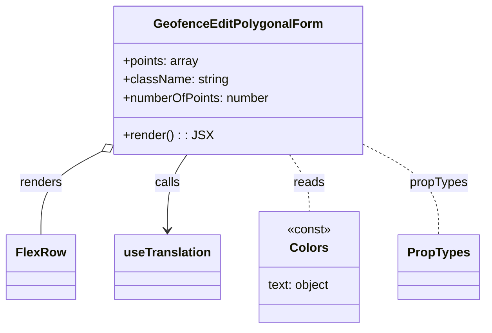

# Diagram: web/portal/src/modules/geofence-edit/GeofenceEditPolygonalForm.js


> Auto-generated by Obscura crawlers

## Diagram 1



### SVG

<svg id="container" width="616.6640625" xmlns="http://www.w3.org/2000/svg" class="classDiagram" height="426" viewBox="0 0 616.6640625 426" role="graphics-document document" aria-roledescription="class"><style>#container{font-family:"trebuchet ms",verdana,arial,sans-serif;font-size:16px;fill:#333;}@keyframes edge-animation-frame{from{stroke-dashoffset:0;}}@keyframes dash{to{stroke-dashoffset:0;}}#container .edge-animation-slow{stroke-dasharray:9,5!important;stroke-dashoffset:900;animation:dash 50s linear infinite;stroke-linecap:round;}#container .edge-animation-fast{stroke-dasharray:9,5!important;stroke-dashoffset:900;animation:dash 20s linear infinite;stroke-linecap:round;}#container .error-icon{fill:#552222;}#container .error-text{fill:#552222;stroke:#552222;}#container .edge-thickness-normal{stroke-width:1px;}#container .edge-thickness-thick{stroke-width:3.5px;}#container .edge-pattern-solid{stroke-dasharray:0;}#container .edge-thickness-invisible{stroke-width:0;fill:none;}#container .edge-pattern-dashed{stroke-dasharray:3;}#container .edge-pattern-dotted{stroke-dasharray:2;}#container .marker{fill:#333333;stroke:#333333;}#container .marker.cross{stroke:#333333;}#container svg{font-family:"trebuchet ms",verdana,arial,sans-serif;font-size:16px;}#container p{margin:0;}#container g.classGroup text{fill:#9370DB;stroke:none;font-family:"trebuchet ms",verdana,arial,sans-serif;font-size:10px;}#container g.classGroup text .title{font-weight:bolder;}#container .nodeLabel,#container .edgeLabel{color:#131300;}#container .edgeLabel .label rect{fill:#ECECFF;}#container .label text{fill:#131300;}#container .labelBkg{background:#ECECFF;}#container .edgeLabel .label span{background:#ECECFF;}#container .classTitle{font-weight:bolder;}#container .node rect,#container .node circle,#container .node ellipse,#container .node polygon,#container .node path{fill:#ECECFF;stroke:#9370DB;stroke-width:1px;}#container .divider{stroke:#9370DB;stroke-width:1;}#container g.clickable{cursor:pointer;}#container g.classGroup rect{fill:#ECECFF;stroke:#9370DB;}#container g.classGroup line{stroke:#9370DB;stroke-width:1;}#container .classLabel .box{stroke:none;stroke-width:0;fill:#ECECFF;opacity:0.5;}#container .classLabel .label{fill:#9370DB;font-size:10px;}#container .relation{stroke:#333333;stroke-width:1;fill:none;}#container .dashed-line{stroke-dasharray:3;}#container .dotted-line{stroke-dasharray:1 2;}#container #compositionStart,#container .composition{fill:#333333!important;stroke:#333333!important;stroke-width:1;}#container #compositionEnd,#container .composition{fill:#333333!important;stroke:#333333!important;stroke-width:1;}#container #dependencyStart,#container .dependency{fill:#333333!important;stroke:#333333!important;stroke-width:1;}#container #dependencyStart,#container .dependency{fill:#333333!important;stroke:#333333!important;stroke-width:1;}#container #extensionStart,#container .extension{fill:transparent!important;stroke:#333333!important;stroke-width:1;}#container #extensionEnd,#container .extension{fill:transparent!important;stroke:#333333!important;stroke-width:1;}#container #aggregationStart,#container .aggregation{fill:transparent!important;stroke:#333333!important;stroke-width:1;}#container #aggregationEnd,#container .aggregation{fill:transparent!important;stroke:#333333!important;stroke-width:1;}#container #lollipopStart,#container .lollipop{fill:#ECECFF!important;stroke:#333333!important;stroke-width:1;}#container #lollipopEnd,#container .lollipop{fill:#ECECFF!important;stroke:#333333!important;stroke-width:1;}#container .edgeTerminals{font-size:11px;line-height:initial;}#container .classTitleText{text-anchor:middle;font-size:18px;fill:#333;}#container .label-icon{display:inline-block;height:1em;overflow:visible;vertical-align:-0.125em;}#container .node .label-icon path{fill:currentColor;stroke:revert;stroke-width:revert;}#container :root{--mermaid-font-family:"trebuchet ms",verdana,arial,sans-serif;}</style><g><defs><marker id="container_class-aggregationStart" class="marker aggregation class" refX="18" refY="7" markerWidth="190" markerHeight="240" orient="auto"><path d="M 18,7 L9,13 L1,7 L9,1 Z"></path></marker></defs><defs><marker id="container_class-aggregationEnd" class="marker aggregation class" refX="1" refY="7" markerWidth="20" markerHeight="28" orient="auto"><path d="M 18,7 L9,13 L1,7 L9,1 Z"></path></marker></defs><defs><marker id="container_class-extensionStart" class="marker extension class" refX="18" refY="7" markerWidth="190" markerHeight="240" orient="auto"><path d="M 1,7 L18,13 V 1 Z"></path></marker></defs><defs><marker id="container_class-extensionEnd" class="marker extension class" refX="1" refY="7" markerWidth="20" markerHeight="28" orient="auto"><path d="M 1,1 V 13 L18,7 Z"></path></marker></defs><defs><marker id="container_class-compositionStart" class="marker composition class" refX="18" refY="7" markerWidth="190" markerHeight="240" orient="auto"><path d="M 18,7 L9,13 L1,7 L9,1 Z"></path></marker></defs><defs><marker id="container_class-compositionEnd" class="marker composition class" refX="1" refY="7" markerWidth="20" markerHeight="28" orient="auto"><path d="M 18,7 L9,13 L1,7 L9,1 Z"></path></marker></defs><defs><marker id="container_class-dependencyStart" class="marker dependency class" refX="6" refY="7" markerWidth="190" markerHeight="240" orient="auto"><path d="M 5,7 L9,13 L1,7 L9,1 Z"></path></marker></defs><defs><marker id="container_class-dependencyEnd" class="marker dependency class" refX="13" refY="7" markerWidth="20" markerHeight="28" orient="auto"><path d="M 18,7 L9,13 L14,7 L9,1 Z"></path></marker></defs><defs><marker id="container_class-lollipopStart" class="marker lollipop class" refX="13" refY="7" markerWidth="190" markerHeight="240" orient="auto"><circle stroke="black" fill="transparent" cx="7" cy="7" r="6"></circle></marker></defs><defs><marker id="container_class-lollipopEnd" class="marker lollipop class" refX="1" refY="7" markerWidth="190" markerHeight="240" orient="auto"><circle stroke="black" fill="transparent" cx="7" cy="7" r="6"></circle></marker></defs><g class="root"><g class="clusters"></g><g class="edgePaths"><path d="M125.551,196.775L112.967,203.479C100.383,210.183,75.215,223.592,62.631,241.462C50.047,259.333,50.047,281.667,50.047,292.833L50.047,304" id="id_GeofenceEditPolygonalForm_FlexRow_1" class="edge-thickness-normal edge-pattern-solid relation" style=";;;" data-edge="true" data-et="edge" data-id="id_GeofenceEditPolygonalForm_FlexRow_1" data-points="W3sieCI6MTQwLjc3NTM5MDYyNSwieSI6MTg4LjY2NDA3OTY3NTE2NTY4fSx7IngiOjUwLjA0Njg3NSwieSI6MjM3fSx7IngiOjUwLjA0Njg3NSwieSI6MzA0fV0=" marker-start="url(#container_class-aggregationStart)"></path><path d="M233.638,200L229.395,206.167C225.152,212.333,216.666,224.667,212.423,241C208.18,257.333,208.18,277.667,208.18,287.833L208.18,298" id="id_GeofenceEditPolygonalForm_useTranslation_2" class="edge-thickness-normal edge-pattern-solid relation" style=";;;" data-edge="true" data-et="edge" data-id="id_GeofenceEditPolygonalForm_useTranslation_2" data-points="W3sieCI6MjMzLjYzODM3ODE3MTk5MjQ5LCJ5IjoyMDB9LHsieCI6MjA4LjE3OTY4NzUsInkiOjIzN30seyJ4IjoyMDguMTc5Njg3NSwieSI6MzA0fV0=" marker-end="url(#container_class-dependencyEnd)"></path><path d="M365.748,200L369.991,206.167C374.235,212.333,382.721,224.667,386.964,237C391.207,249.333,391.207,261.667,391.207,267.833L391.207,274" id="id_GeofenceEditPolygonalForm_Colors_3" class="edge-thickness-normal edge-pattern-dashed relation" style=";;;" data-edge="true" data-et="edge" data-id="id_GeofenceEditPolygonalForm_Colors_3" data-points="W3sieCI6MzY1Ljc0ODM0MDU3ODAwNzUsInkiOjIwMH0seyJ4IjozOTEuMjA3MDMxMjUsInkiOjIzN30seyJ4IjozOTEuMjA3MDMxMjUsInkiOjI3NH1d"></path><path d="M458.611,185.697L475.244,194.248C491.876,202.798,525.141,219.899,541.774,239.616C558.406,259.333,558.406,281.667,558.406,292.833L558.406,304" id="id_GeofenceEditPolygonalForm_PropTypes_4" class="edge-thickness-normal edge-pattern-dashed relation" style=";;;" data-edge="true" data-et="edge" data-id="id_GeofenceEditPolygonalForm_PropTypes_4" data-points="W3sieCI6NDU4LjYxMTMyODEyNSwieSI6MTg1LjY5NzA4ODE5OTU0NTUzfSx7IngiOjU1OC40MDYyNSwieSI6MjM3fSx7IngiOjU1OC40MDYyNSwieSI6MzA0fV0="></path></g><g class="edgeLabels"><g class="edgeLabel" transform="translate(50.046875, 237)"><g class="label" data-id="id_GeofenceEditPolygonalForm_FlexRow_1" transform="translate(-27.75, -12)"><foreignObject width="55.5" height="24"><div xmlns="http://www.w3.org/1999/xhtml" class="labelBkg" style="display: table-cell; white-space: nowrap; line-height: 1.5; max-width: 200px; text-align: center;"><span class="edgeLabel"><p>renders</p></span></div></foreignObject></g></g><g class="edgeLabel" transform="translate(208.1796875, 237)"><g class="label" data-id="id_GeofenceEditPolygonalForm_useTranslation_2" transform="translate(-16.4453125, -12)"><foreignObject width="32.890625" height="24"><div xmlns="http://www.w3.org/1999/xhtml" class="labelBkg" style="display: table-cell; white-space: nowrap; line-height: 1.5; max-width: 200px; text-align: center;"><span class="edgeLabel"><p>calls</p></span></div></foreignObject></g></g><g class="edgeLabel" transform="translate(391.20703125, 237)"><g class="label" data-id="id_GeofenceEditPolygonalForm_Colors_3" transform="translate(-20.0078125, -12)"><foreignObject width="40.015625" height="24"><div xmlns="http://www.w3.org/1999/xhtml" class="labelBkg" style="display: table-cell; white-space: nowrap; line-height: 1.5; max-width: 200px; text-align: center;"><span class="edgeLabel"><p>reads</p></span></div></foreignObject></g></g><g class="edgeLabel" transform="translate(558.40625, 237)"><g class="label" data-id="id_GeofenceEditPolygonalForm_PropTypes_4" transform="translate(-37.625, -12)"><foreignObject width="75.25" height="24"><div xmlns="http://www.w3.org/1999/xhtml" class="labelBkg" style="display: table-cell; white-space: nowrap; line-height: 1.5; max-width: 200px; text-align: center;"><span class="edgeLabel"><p>propTypes</p></span></div></foreignObject></g></g></g><g class="nodes"><g class="node default" id="classId-GeofenceEditPolygonalForm-0" transform="translate(299.693359375, 104)"><g class="basic label-container"><path d="M-158.91796875 -96 L158.91796875 -96 L158.91796875 96 L-158.91796875 96" stroke="none" stroke-width="0" fill="#ECECFF" style=""></path><path d="M-158.91796875 -96 C-54.843275952267064 -96, 49.23141684546587 -96, 158.91796875 -96 M-158.91796875 -96 C-72.63157931020022 -96, 13.654810129599554 -96, 158.91796875 -96 M158.91796875 -96 C158.91796875 -46.99973278386625, 158.91796875 2.0005344322675, 158.91796875 96 M158.91796875 -96 C158.91796875 -24.803948959415905, 158.91796875 46.39210208116819, 158.91796875 96 M158.91796875 96 C51.624182885413035 96, -55.66960297917393 96, -158.91796875 96 M158.91796875 96 C76.78375777404044 96, -5.350453201919123 96, -158.91796875 96 M-158.91796875 96 C-158.91796875 46.164565846468975, -158.91796875 -3.670868307062051, -158.91796875 -96 M-158.91796875 96 C-158.91796875 25.105118367756475, -158.91796875 -45.78976326448705, -158.91796875 -96" stroke="#9370DB" stroke-width="1.3" fill="none" stroke-dasharray="0 0" style=""></path></g><g class="annotation-group text" transform="translate(0, -72)"></g><g class="label-group text" transform="translate(-102.4296875, -72)"><g class="label" style="font-weight: bolder" transform="translate(0,-12)"><foreignObject width="204.859375" height="24"><div xmlns="http://www.w3.org/1999/xhtml" style="display: table-cell; white-space: nowrap; line-height: 1.5; max-width: 253px; text-align: center;"><span class="nodeLabel markdown-node-label" style=""><p>GeofenceEditPolygonalForm</p></span></div></foreignObject></g></g><g class="members-group text" transform="translate(-146.91796875, -24)"><g class="label" style="" transform="translate(0,-12)"><foreignObject width="98.890625" height="24"><div xmlns="http://www.w3.org/1999/xhtml" style="display: table-cell; white-space: nowrap; line-height: 1.5; max-width: 156px; text-align: center;"><span class="nodeLabel markdown-node-label" style=""><p>+points: array</p></span></div></foreignObject></g><g class="label" style="" transform="translate(0,12)"><foreignObject width="135.359375" height="24"><div xmlns="http://www.w3.org/1999/xhtml" style="display: table-cell; white-space: nowrap; line-height: 1.5; max-width: 193px; text-align: center;"><span class="nodeLabel markdown-node-label" style=""><p>+className: string</p></span></div></foreignObject></g><g class="label" style="" transform="translate(0,36)"><foreignObject width="191.40625" height="24"><div xmlns="http://www.w3.org/1999/xhtml" style="display: table-cell; white-space: nowrap; line-height: 1.5; max-width: 250px; text-align: center;"><span class="nodeLabel markdown-node-label" style=""><p>+numberOfPoints: number</p></span></div></foreignObject></g></g><g class="methods-group text" transform="translate(-146.91796875, 72)"><g class="label" style="" transform="translate(0,-12)"><foreignObject width="109.140625" height="24"><div xmlns="http://www.w3.org/1999/xhtml" style="display: table-cell; white-space: nowrap; line-height: 1.5; max-width: 167px; text-align: center;"><span class="nodeLabel markdown-node-label" style=""><p>+render() : : JSX</p></span></div></foreignObject></g></g><g class="divider" style=""><path d="M-158.91796875 -48 C-80.82920354337524 -48, -2.7404383367504863 -48, 158.91796875 -48 M-158.91796875 -48 C-56.80453818293992 -48, 45.308892384120156 -48, 158.91796875 -48" stroke="#9370DB" stroke-width="1.3" fill="none" stroke-dasharray="0 0" style=""></path></g><g class="divider" style=""><path d="M-158.91796875 48 C-76.32838853173682 48, 6.2611916865263595 48, 158.91796875 48 M-158.91796875 48 C-54.13079621736186 48, 50.656376315276276 48, 158.91796875 48" stroke="#9370DB" stroke-width="1.3" fill="none" stroke-dasharray="0 0" style=""></path></g></g><g class="node default" id="classId-FlexRow-1" transform="translate(50.046875, 346)"><g class="basic label-container"><path d="M-42.046875 -42 L42.046875 -42 L42.046875 42 L-42.046875 42" stroke="none" stroke-width="0" fill="#ECECFF" style=""></path><path d="M-42.046875 -42 C-20.140993211806492 -42, 1.7648885763870155 -42, 42.046875 -42 M-42.046875 -42 C-18.069082704031036 -42, 5.908709591937928 -42, 42.046875 -42 M42.046875 -42 C42.046875 -21.736198395668634, 42.046875 -1.4723967913372675, 42.046875 42 M42.046875 -42 C42.046875 -17.599424314514863, 42.046875 6.801151370970274, 42.046875 42 M42.046875 42 C24.23985360313333 42, 6.43283220626666 42, -42.046875 42 M42.046875 42 C19.127884918892743 42, -3.7911051622145138 42, -42.046875 42 M-42.046875 42 C-42.046875 13.182137989600086, -42.046875 -15.635724020799827, -42.046875 -42 M-42.046875 42 C-42.046875 20.828836650610672, -42.046875 -0.3423266987786562, -42.046875 -42" stroke="#9370DB" stroke-width="1.3" fill="none" stroke-dasharray="0 0" style=""></path></g><g class="annotation-group text" transform="translate(0, -18)"></g><g class="label-group text" transform="translate(-30.046875, -18)"><g class="label" style="font-weight: bolder" transform="translate(0,-12)"><foreignObject width="60.09375" height="24"><div xmlns="http://www.w3.org/1999/xhtml" style="display: table-cell; white-space: nowrap; line-height: 1.5; max-width: 109px; text-align: center;"><span class="nodeLabel markdown-node-label" style=""><p>FlexRow</p></span></div></foreignObject></g></g><g class="members-group text" transform="translate(-30.046875, 30)"></g><g class="methods-group text" transform="translate(-30.046875, 60)"></g><g class="divider" style=""><path d="M-42.046875 6 C-13.730223591965153 6, 14.586427816069694 6, 42.046875 6 M-42.046875 6 C-8.697107974601195 6, 24.65265905079761 6, 42.046875 6" stroke="#9370DB" stroke-width="1.3" fill="none" stroke-dasharray="0 0" style=""></path></g><g class="divider" style=""><path d="M-42.046875 24 C-17.882249740474787 24, 6.282375519050426 24, 42.046875 24 M-42.046875 24 C-18.253741583868887 24, 5.5393918322622255 24, 42.046875 24" stroke="#9370DB" stroke-width="1.3" fill="none" stroke-dasharray="0 0" style=""></path></g></g><g class="node default" id="classId-Colors-2" transform="translate(391.20703125, 346)"><g class="basic label-container"><path d="M-66.94140625 -72 L66.94140625 -72 L66.94140625 72 L-66.94140625 72" stroke="none" stroke-width="0" fill="#ECECFF" style=""></path><path d="M-66.94140625 -72 C-17.06270971985861 -72, 32.81598681028278 -72, 66.94140625 -72 M-66.94140625 -72 C-16.986587798528674 -72, 32.96823065294265 -72, 66.94140625 -72 M66.94140625 -72 C66.94140625 -24.895122771237247, 66.94140625 22.209754457525506, 66.94140625 72 M66.94140625 -72 C66.94140625 -15.107201636462356, 66.94140625 41.78559672707529, 66.94140625 72 M66.94140625 72 C37.69265571426911 72, 8.443905178538223 72, -66.94140625 72 M66.94140625 72 C16.528976900466994 72, -33.88345244906601 72, -66.94140625 72 M-66.94140625 72 C-66.94140625 18.08952848189007, -66.94140625 -35.82094303621986, -66.94140625 -72 M-66.94140625 72 C-66.94140625 42.02456751931019, -66.94140625 12.049135038620378, -66.94140625 -72" stroke="#9370DB" stroke-width="1.3" fill="none" stroke-dasharray="0 0" style=""></path></g><g class="annotation-group text" transform="translate(-28.6171875, -48)"><g class="label" style="" transform="translate(0,-12)"><foreignObject width="57.234375" height="24"><div xmlns="http://www.w3.org/1999/xhtml" style="display: table-cell; white-space: nowrap; line-height: 1.5; max-width: 107px; text-align: center;"><span class="nodeLabel markdown-node-label" style=""><p>«const»</p></span></div></foreignObject></g></g><g class="label-group text" transform="translate(-23.1015625, -24)"><g class="label" style="font-weight: bolder" transform="translate(0,-12)"><foreignObject width="46.203125" height="24"><div xmlns="http://www.w3.org/1999/xhtml" style="display: table-cell; white-space: nowrap; line-height: 1.5; max-width: 95px; text-align: center;"><span class="nodeLabel markdown-node-label" style=""><p>Colors</p></span></div></foreignObject></g></g><g class="members-group text" transform="translate(-54.94140625, 24)"><g class="label" style="" transform="translate(0,-12)"><foreignObject width="81.265625" height="24"><div xmlns="http://www.w3.org/1999/xhtml" style="display: table-cell; white-space: nowrap; line-height: 1.5; max-width: 131px; text-align: center;"><span class="nodeLabel markdown-node-label" style=""><p>text: object</p></span></div></foreignObject></g></g><g class="methods-group text" transform="translate(-54.94140625, 72)"></g><g class="divider" style=""><path d="M-66.94140625 0 C-29.819628678254098 0, 7.302148893491804 0, 66.94140625 0 M-66.94140625 0 C-23.799625713003536 0, 19.342154823992928 0, 66.94140625 0" stroke="#9370DB" stroke-width="1.3" fill="none" stroke-dasharray="0 0" style=""></path></g><g class="divider" style=""><path d="M-66.94140625 48 C-26.845700545285055 48, 13.25000515942989 48, 66.94140625 48 M-66.94140625 48 C-26.273250384860766 48, 14.394905480278467 48, 66.94140625 48" stroke="#9370DB" stroke-width="1.3" fill="none" stroke-dasharray="0 0" style=""></path></g></g><g class="node default" id="classId-useTranslation-3" transform="translate(208.1796875, 346)"><g class="basic label-container"><path d="M-66.0859375 -42 L66.0859375 -42 L66.0859375 42 L-66.0859375 42" stroke="none" stroke-width="0" fill="#ECECFF" style=""></path><path d="M-66.0859375 -42 C-36.656512817458676 -42, -7.227088134917352 -42, 66.0859375 -42 M-66.0859375 -42 C-36.30764216270252 -42, -6.5293468254050495 -42, 66.0859375 -42 M66.0859375 -42 C66.0859375 -22.465661967924724, 66.0859375 -2.9313239358494485, 66.0859375 42 M66.0859375 -42 C66.0859375 -20.42954692713026, 66.0859375 1.1409061457394785, 66.0859375 42 M66.0859375 42 C14.422985387107936 42, -37.23996672578413 42, -66.0859375 42 M66.0859375 42 C30.94733743485603 42, -4.191262630287937 42, -66.0859375 42 M-66.0859375 42 C-66.0859375 20.25125511992763, -66.0859375 -1.4974897601447381, -66.0859375 -42 M-66.0859375 42 C-66.0859375 20.22952412720871, -66.0859375 -1.540951745582582, -66.0859375 -42" stroke="#9370DB" stroke-width="1.3" fill="none" stroke-dasharray="0 0" style=""></path></g><g class="annotation-group text" transform="translate(0, -18)"></g><g class="label-group text" transform="translate(-54.0859375, -18)"><g class="label" style="font-weight: bolder" transform="translate(0,-12)"><foreignObject width="108.171875" height="24"><div xmlns="http://www.w3.org/1999/xhtml" style="display: table-cell; white-space: nowrap; line-height: 1.5; max-width: 157px; text-align: center;"><span class="nodeLabel markdown-node-label" style=""><p>useTranslation</p></span></div></foreignObject></g></g><g class="members-group text" transform="translate(-54.0859375, 30)"></g><g class="methods-group text" transform="translate(-54.0859375, 60)"></g><g class="divider" style=""><path d="M-66.0859375 6 C-14.681947426626571 6, 36.72204264674686 6, 66.0859375 6 M-66.0859375 6 C-23.60318430670121 6, 18.879568886597582 6, 66.0859375 6" stroke="#9370DB" stroke-width="1.3" fill="none" stroke-dasharray="0 0" style=""></path></g><g class="divider" style=""><path d="M-66.0859375 24 C-29.04110722953815 24, 8.003723040923703 24, 66.0859375 24 M-66.0859375 24 C-28.34655898296097 24, 9.392819534078058 24, 66.0859375 24" stroke="#9370DB" stroke-width="1.3" fill="none" stroke-dasharray="0 0" style=""></path></g></g><g class="node default" id="classId-PropTypes-4" transform="translate(558.40625, 346)"><g class="basic label-container"><path d="M-50.2578125 -42 L50.2578125 -42 L50.2578125 42 L-50.2578125 42" stroke="none" stroke-width="0" fill="#ECECFF" style=""></path><path d="M-50.2578125 -42 C-15.084700605101759 -42, 20.088411289796483 -42, 50.2578125 -42 M-50.2578125 -42 C-21.876981815108266 -42, 6.503848869783468 -42, 50.2578125 -42 M50.2578125 -42 C50.2578125 -17.795921855788045, 50.2578125 6.4081562884239105, 50.2578125 42 M50.2578125 -42 C50.2578125 -18.903789584282915, 50.2578125 4.19242083143417, 50.2578125 42 M50.2578125 42 C18.12435143768692 42, -14.009109624626163 42, -50.2578125 42 M50.2578125 42 C16.081554913983965 42, -18.09470267203207 42, -50.2578125 42 M-50.2578125 42 C-50.2578125 18.113225789322055, -50.2578125 -5.7735484213558905, -50.2578125 -42 M-50.2578125 42 C-50.2578125 17.308856944656313, -50.2578125 -7.3822861106873745, -50.2578125 -42" stroke="#9370DB" stroke-width="1.3" fill="none" stroke-dasharray="0 0" style=""></path></g><g class="annotation-group text" transform="translate(0, -18)"></g><g class="label-group text" transform="translate(-38.2578125, -18)"><g class="label" style="font-weight: bolder" transform="translate(0,-12)"><foreignObject width="76.515625" height="24"><div xmlns="http://www.w3.org/1999/xhtml" style="display: table-cell; white-space: nowrap; line-height: 1.5; max-width: 125px; text-align: center;"><span class="nodeLabel markdown-node-label" style=""><p>PropTypes</p></span></div></foreignObject></g></g><g class="members-group text" transform="translate(-38.2578125, 30)"></g><g class="methods-group text" transform="translate(-38.2578125, 60)"></g><g class="divider" style=""><path d="M-50.2578125 6 C-14.59273844773363 6, 21.07233560453274 6, 50.2578125 6 M-50.2578125 6 C-19.38198956271393 6, 11.49383337457214 6, 50.2578125 6" stroke="#9370DB" stroke-width="1.3" fill="none" stroke-dasharray="0 0" style=""></path></g><g class="divider" style=""><path d="M-50.2578125 24 C-28.351226017394318 24, -6.444639534788635 24, 50.2578125 24 M-50.2578125 24 C-12.24066683855903 24, 25.77647882288194 24, 50.2578125 24" stroke="#9370DB" stroke-width="1.3" fill="none" stroke-dasharray="0 0" style=""></path></g></g></g></g></g></svg>

## Diagram 2

```mermaid
flowchart TD
    PointsProp[Points prop (array)] -->|passed to| GEPF[GeofenceEditPolygonalForm]
    GEPF -->|calls| UT[useTranslation("geofence-edit")]
    GEPF -->|computes| NumPts[numberOfPoints = points?.length ? points.length - 1 : 0]
    GEPF -->|renders| FR[FlexRow]
    FR --> DisplayDiv[div (styled) ]
    DisplayDiv --> BoldSpan[span (bold) : shows numberOfPoints]
    DisplayDiv --> TextLabel[translated "Points" label]
    Colors[Colors.text.LIGHT_GRAY] -.-> DisplayDiv
    PropTypes[PropTypes] -.-> GEPF
```

> SVG rendering failed for this diagram.
