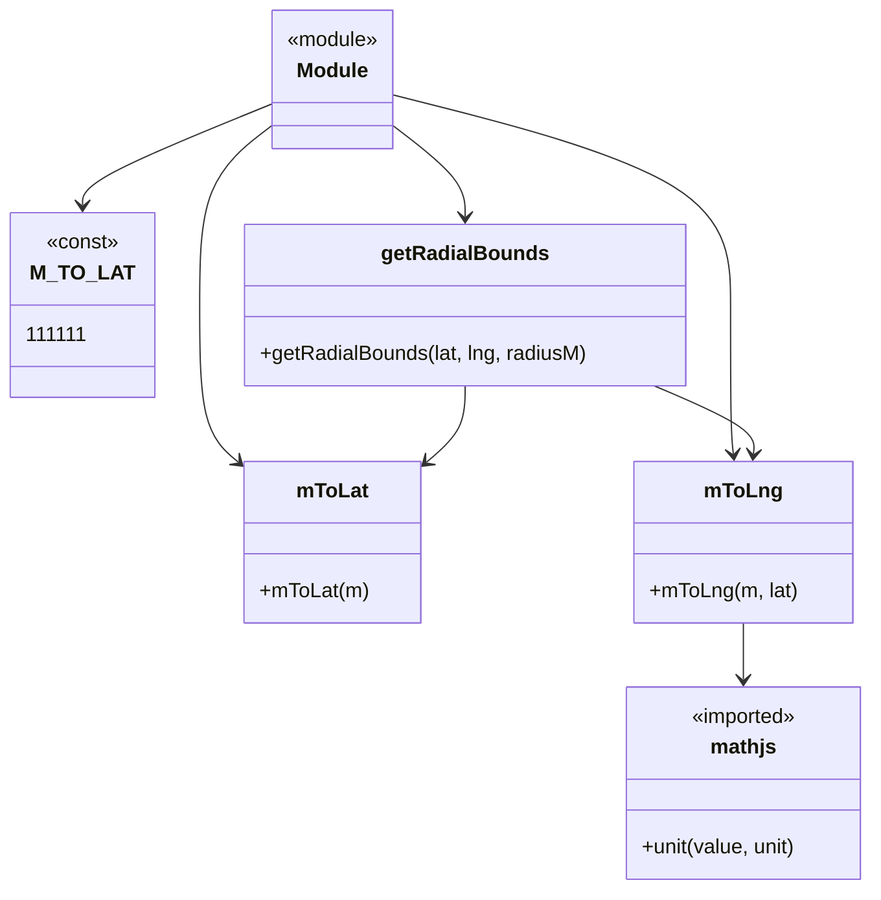

# Diagram: web/portal/src/modules/geofence-edit/geofence-radial-bounds.js

> Auto-generated by Obscura crawlers

## Mermaid

### SVG

<svg id="container" width="669.3046875" xmlns="http://www.w3.org/2000/svg" class="classDiagram" height="694" viewBox="0 0 669.3046875 694" role="graphics-document document" aria-roledescription="class"><g><defs><marker id="container_class-aggregationStart" class="marker aggregation class" refX="18" refY="7" markerWidth="190" markerHeight="240" orient="auto"><path d="M 18,7 L9,13 L1,7 L9,1 Z"></path></marker></defs><defs><marker id="container_class-aggregationEnd" class="marker aggregation class" refX="1" refY="7" markerWidth="20" markerHeight="28" orient="auto"><path d="M 18,7 L9,13 L1,7 L9,1 Z"></path></marker></defs><defs><marker id="container_class-extensionStart" class="marker extension class" refX="18" refY="7" markerWidth="190" markerHeight="240" orient="auto"><path d="M 1,7 L18,13 V 1 Z"></path></marker></defs><defs><marker id="container_class-extensionEnd" class="marker extension class" refX="1" refY="7" markerWidth="20" markerHeight="28" orient="auto"><path d="M 1,1 V 13 L18,7 Z"></path></marker></defs><defs><marker id="container_class-compositionStart" class="marker composition class" refX="18" refY="7" markerWidth="190" markerHeight="240" orient="auto"><path d="M 18,7 L9,13 L1,7 L9,1 Z"></path></marker></defs><defs><marker id="container_class-compositionEnd" class="marker composition class" refX="1" refY="7" markerWidth="20" markerHeight="28" orient="auto"><path d="M 18,7 L9,13 L1,7 L9,1 Z"></path></marker></defs><defs><marker id="container_class-dependencyStart" class="marker dependency class" refX="6" refY="7" markerWidth="190" markerHeight="240" orient="auto"><path d="M 5,7 L9,13 L1,7 L9,1 Z"></path></marker></defs><defs><marker id="container_class-dependencyEnd" class="marker dependency class" refX="13" refY="7" markerWidth="20" markerHeight="28" orient="auto"><path d="M 18,7 L9,13 L14,7 L9,1 Z"></path></marker></defs><defs><marker id="container_class-lollipopStart" class="marker lollipop class" refX="13" refY="7" markerWidth="190" markerHeight="240" orient="auto"><circle stroke="black" fill="transparent" cx="7" cy="7" r="6"></circle></marker></defs><defs><marker id="container_class-lollipopEnd" class="marker lollipop class" refX="1" refY="7" markerWidth="190" markerHeight="240" orient="auto"><circle stroke="black" fill="transparent" cx="7" cy="7" r="6"></circle></marker></defs><g class="root"><g class="clusters"></g><g class="edgePaths"><path d="M198.244,82.367L174.925,92.139C151.605,101.911,104.967,121.456,81.647,134.394C58.328,147.333,58.328,153.667,58.328,156.833L58.328,160" id="id_Module_M_TO_LAT_1" class="edge-thickness-normal edge-pattern-solid relation" style=";;;" data-edge="true" data-et="edge" data-id="id_Module_M_TO_LAT_1" data-points="W3sieCI6MTk4LjI0NDE0MDYyNSwieSI6ODIuMzY2OTI1MzMyMzExMX0seyJ4Ijo1OC4zMjgxMjUsInkiOjE0MX0seyJ4Ijo1OC4zMjgxMjUsInkiOjE2Nn1d" marker-end="url(#container_class-dependencyEnd)"></path><path d="M198.244,99.208L189.146,106.174C180.048,113.139,161.852,127.069,152.754,150.201C143.656,173.333,143.656,205.667,143.656,238C143.656,270.333,143.656,302.667,148.792,323.213C153.927,343.759,164.197,352.517,169.333,356.897L174.468,361.276" id="id_Module_mToLat_2" class="edge-thickness-normal edge-pattern-solid relation" style=";;;" data-edge="true" data-et="edge" data-id="id_Module_mToLat_2" data-points="W3sieCI6MTk4LjI0NDE0MDYyNSwieSI6OTkuMjA4NDg3MTE5NzkyNTV9LHsieCI6MTQzLjY1NjI1LCJ5IjoxNDF9LHsieCI6MTQzLjY1NjI1LCJ5IjoyMzh9LHsieCI6MTQzLjY1NjI1LCJ5IjozMzV9LHsieCI6MTc5LjAzMzIwMzEyNSwieSI6MzY1LjE2OTQ3NzQwOTk1MjF9XQ==" marker-end="url(#container_class-dependencyEnd)"></path><path d="M295.447,74.403L338.942,85.502C382.436,96.602,469.425,118.801,512.92,146.067C556.414,173.333,556.414,205.667,556.414,238C556.414,270.333,556.414,302.667,556.775,322.006C557.135,341.346,557.856,347.692,558.217,350.865L558.578,354.038" id="id_Module_mToLng_3" class="edge-thickness-normal edge-pattern-solid relation" style=";;;" data-edge="true" data-et="edge" data-id="id_Module_mToLng_3" data-points="W3sieCI6Mjk1LjQ0NzI2NTYyNSwieSI6NzQuNDAyODI5MDM5OTMwODV9LHsieCI6NTU2LjQxNDA2MjUsInkiOjE0MX0seyJ4Ijo1NTYuNDE0MDYyNSwieSI6MjM4fSx7IngiOjU1Ni40MTQwNjI1LCJ5IjozMzV9LHsieCI6NTU5LjI1NDk3MTU5MDkwOTEsInkiOjM2MH1d" marker-end="url(#container_class-dependencyEnd)"></path><path d="M295.447,99.208L304.545,106.174C313.643,113.139,331.839,127.069,340.937,138.701C350.035,150.333,350.035,159.667,350.035,164.333L350.035,169" id="id_Module_getRadialBounds_4" class="edge-thickness-normal edge-pattern-solid relation" style=";;;" data-edge="true" data-et="edge" data-id="id_Module_getRadialBounds_4" data-points="W3sieCI6Mjk1LjQ0NzI2NTYyNSwieSI6OTkuMjA4NDg3MTE5NzkyNTV9LHsieCI6MzUwLjAzNTE1NjI1LCJ5IjoxNDF9LHsieCI6MzUwLjAzNTE1NjI1LCJ5IjoxNzV9XQ==" marker-end="url(#container_class-dependencyEnd)"></path><path d="M350.035,301L350.035,306.667C350.035,312.333,350.035,323.667,344.9,333.713C339.765,343.759,329.494,352.517,324.359,356.897L319.224,361.276" id="id_getRadialBounds_mToLat_5" class="edge-thickness-normal edge-pattern-solid relation" style=";;;" data-edge="true" data-et="edge" data-id="id_getRadialBounds_mToLat_5" data-points="W3sieCI6MzUwLjAzNTE1NjI1LCJ5IjozMDF9LHsieCI6MzUwLjAzNTE1NjI1LCJ5IjozMzV9LHsieCI6MzE0LjY1ODIwMzEyNSwieSI6MzY1LjE2OTQ3NzQwOTk1MjF9XQ==" marker-end="url(#container_class-dependencyEnd)"></path><path d="M497.065,301L510.29,306.667C523.515,312.333,549.964,323.667,562.829,332.506C575.693,341.346,574.972,347.692,574.611,350.865L574.251,354.038" id="id_getRadialBounds_mToLng_6" class="edge-thickness-normal edge-pattern-solid relation" style=";;;" data-edge="true" data-et="edge" data-id="id_getRadialBounds_mToLng_6" data-points="W3sieCI6NDk3LjA2NDc1NTE1NDYzOTIsInkiOjMwMX0seyJ4Ijo1NzYuNDE0MDYyNSwieSI6MzM1fSx7IngiOjU3My41NzMxNTM0MDkwOTA5LCJ5IjozNjB9XQ==" marker-end="url(#container_class-dependencyEnd)"></path><path d="M566.414,486L566.414,490.167C566.414,494.333,566.414,502.667,566.414,510C566.414,517.333,566.414,523.667,566.414,526.833L566.414,530" id="id_mToLng_mathjs_7" class="edge-thickness-normal edge-pattern-solid relation" style=";;;" data-edge="true" data-et="edge" data-id="id_mToLng_mathjs_7" data-points="W3sieCI6NTY2LjQxNDA2MjUsInkiOjQ4Nn0seyJ4Ijo1NjYuNDE0MDYyNSwieSI6NTExfSx7IngiOjU2Ni40MTQwNjI1LCJ5Ijo1MzZ9XQ==" marker-end="url(#container_class-dependencyEnd)"></path></g><g class="edgeLabels"><g class="edgeLabel"><g class="label" data-id="id_Module_M_TO_LAT_1" transform="translate(0, 0)"><foreignObject width="0" height="0">

</foreignObject></g></g><g class="edgeLabel"><g class="label" data-id="id_Module_mToLat_2" transform="translate(0, 0)"><foreignObject width="0" height="0">

</foreignObject></g></g><g class="edgeLabel"><g class="label" data-id="id_Module_mToLng_3" transform="translate(0, 0)"><foreignObject width="0" height="0">

</foreignObject></g></g><g class="edgeLabel"><g class="label" data-id="id_Module_getRadialBounds_4" transform="translate(0, 0)"><foreignObject width="0" height="0">

</foreignObject></g></g><g class="edgeLabel"><g class="label" data-id="id_getRadialBounds_mToLat_5" transform="translate(0, 0)"><foreignObject width="0" height="0">

</foreignObject></g></g><g class="edgeLabel"><g class="label" data-id="id_getRadialBounds_mToLng_6" transform="translate(0, 0)"><foreignObject width="0" height="0">

</foreignObject></g></g><g class="edgeLabel"><g class="label" data-id="id_mToLng_mathjs_7" transform="translate(0, 0)"><foreignObject width="0" height="0">

</foreignObject></g></g></g><g class="nodes"><g class="node default" id="classId-Module-0" transform="translate(246.845703125, 62)"><g class="basic label-container"><path d="M-48.6015625 -54 L48.6015625 -54 L48.6015625 54 L-48.6015625 54" stroke="none" stroke-width="0" fill="#ECECFF" style=""></path><path d="M-48.6015625 -54 C-24.9474284332349 -54, -1.2932943664698016 -54, 48.6015625 -54 M-48.6015625 -54 C-22.913073035134495 -54, 2.7754164297310098 -54, 48.6015625 -54 M48.6015625 -54 C48.6015625 -17.5421974482743, 48.6015625 18.915605103451398, 48.6015625 54 M48.6015625 -54 C48.6015625 -21.400155385879117, 48.6015625 11.199689228241766, 48.6015625 54 M48.6015625 54 C26.27906507011683 54, 3.956567640233658 54, -48.6015625 54 M48.6015625 54 C14.186169134746983 54, -20.229224230506034 54, -48.6015625 54 M-48.6015625 54 C-48.6015625 24.594888909759014, -48.6015625 -4.810222180481972, -48.6015625 -54 M-48.6015625 54 C-48.6015625 19.13119812240464, -48.6015625 -15.737603755190719, -48.6015625 -54" stroke="#9370DB" stroke-width="1.3" fill="none" stroke-dasharray="0 0" style=""></path></g><g class="annotation-group text" transform="translate(-36.6015625, -30)"><g class="label" style="" transform="translate(0,-12)"><foreignObject width="73.203125" height="24">

«module»

</foreignObject></g></g><g class="label-group text" transform="translate(-27.09375, -6)"><g class="label" style="font-weight: bolder" transform="translate(0,-12)"><foreignObject width="54.1875" height="24">

Module

</foreignObject></g></g><g class="members-group text" transform="translate(-36.6015625, 42)"></g><g class="methods-group text" transform="translate(-36.6015625, 72)"></g><g class="divider" style=""><path d="M-48.6015625 18 C-11.48645660167778 18, 25.62864929664444 18, 48.6015625 18 M-48.6015625 18 C-17.73284242466233 18, 13.13587765067534 18, 48.6015625 18" stroke="#9370DB" stroke-width="1.3" fill="none" stroke-dasharray="0 0" style=""></path></g><g class="divider" style=""><path d="M-48.6015625 36 C-21.8826992275249 36, 4.836164044950202 36, 48.6015625 36 M-48.6015625 36 C-11.835287979177764 36, 24.930986541644472 36, 48.6015625 36" stroke="#9370DB" stroke-width="1.3" fill="none" stroke-dasharray="0 0" style=""></path></g></g><g class="node default" id="classId-M_TO_LAT-1" transform="translate(58.328125, 238)"><g class="basic label-container"><path d="M-50.328125 -72 L50.328125 -72 L50.328125 72 L-50.328125 72" stroke="none" stroke-width="0" fill="#ECECFF" style=""></path><path d="M-50.328125 -72 C-13.964994724050698 -72, 22.398135551898605 -72, 50.328125 -72 M-50.328125 -72 C-24.95759262668362 -72, 0.4129397466327589 -72, 50.328125 -72 M50.328125 -72 C50.328125 -33.35309089377089, 50.328125 5.29381821245822, 50.328125 72 M50.328125 -72 C50.328125 -18.90625049904679, 50.328125 34.18749900190642, 50.328125 72 M50.328125 72 C24.300210330366415 72, -1.72770433926717 72, -50.328125 72 M50.328125 72 C20.26725268425512 72, -9.793619631489761 72, -50.328125 72 M-50.328125 72 C-50.328125 34.19820456627315, -50.328125 -3.603590867453704, -50.328125 -72 M-50.328125 72 C-50.328125 26.04073802340269, -50.328125 -19.918523953194622, -50.328125 -72" stroke="#9370DB" stroke-width="1.3" fill="none" stroke-dasharray="0 0" style=""></path></g><g class="annotation-group text" transform="translate(-28.6171875, -48)"><g class="label" style="" transform="translate(0,-12)"><foreignObject width="57.234375" height="24">

«const»

</foreignObject></g></g><g class="label-group text" transform="translate(-36.203125, -24)"><g class="label" style="font-weight: bolder" transform="translate(0,-12)"><foreignObject width="72.40625" height="24">

M_TO_LAT

</foreignObject></g></g><g class="members-group text" transform="translate(-38.328125, 24)"><g class="label" style="" transform="translate(0,-12)"><foreignObject width="40.453125" height="24">

111111

</foreignObject></g></g><g class="methods-group text" transform="translate(-38.328125, 72)"></g><g class="divider" style=""><path d="M-50.328125 0 C-22.177323435412678 0, 5.973478129174644 0, 50.328125 0 M-50.328125 0 C-10.471997134584882 0, 29.384130730830236 0, 50.328125 0" stroke="#9370DB" stroke-width="1.3" fill="none" stroke-dasharray="0 0" style=""></path></g><g class="divider" style=""><path d="M-50.328125 48 C-26.35120182463945 48, -2.3742786492788994 48, 50.328125 48 M-50.328125 48 C-22.848359835114543 48, 4.631405329770914 48, 50.328125 48" stroke="#9370DB" stroke-width="1.3" fill="none" stroke-dasharray="0 0" style=""></path></g></g><g class="node default" id="classId-mToLat-2" transform="translate(246.845703125, 423)"><g class="basic label-container"><path d="M-67.8125 -63 L67.8125 -63 L67.8125 63 L-67.8125 63" stroke="none" stroke-width="0" fill="#ECECFF" style=""></path><path d="M-67.8125 -63 C-33.05929033878423 -63, 1.6939193224315403 -63, 67.8125 -63 M-67.8125 -63 C-36.89729134257088 -63, -5.982082685141755 -63, 67.8125 -63 M67.8125 -63 C67.8125 -25.99061936843262, 67.8125 11.018761263134763, 67.8125 63 M67.8125 -63 C67.8125 -13.81537833568585, 67.8125 35.3692433286283, 67.8125 63 M67.8125 63 C21.786919845449745 63, -24.23866030910051 63, -67.8125 63 M67.8125 63 C21.781528043912978 63, -24.249443912174044 63, -67.8125 63 M-67.8125 63 C-67.8125 23.76826842740443, -67.8125 -15.463463145191142, -67.8125 -63 M-67.8125 63 C-67.8125 31.541848957301777, -67.8125 0.08369791460355458, -67.8125 -63" stroke="#9370DB" stroke-width="1.3" fill="none" stroke-dasharray="0 0" style=""></path></g><g class="annotation-group text" transform="translate(0, -39)"></g><g class="label-group text" transform="translate(-26.8125, -39)"><g class="label" style="font-weight: bolder" transform="translate(0,-12)"><foreignObject width="53.625" height="24">

mToLat

</foreignObject></g></g><g class="members-group text" transform="translate(-55.8125, 9)"></g><g class="methods-group text" transform="translate(-55.8125, 39)"><g class="label" style="" transform="translate(0,-12)"><foreignObject width="84.8125" height="24">

+mToLat(m)

</foreignObject></g></g><g class="divider" style=""><path d="M-67.8125 -15 C-20.861482239305296 -15, 26.089535521389408 -15, 67.8125 -15 M-67.8125 -15 C-29.68299408612573 -15, 8.446511827748537 -15, 67.8125 -15" stroke="#9370DB" stroke-width="1.3" fill="none" stroke-dasharray="0 0" style=""></path></g><g class="divider" style=""><path d="M-67.8125 9 C-24.84515423386489 9, 18.12219153227022 9, 67.8125 9 M-67.8125 9 C-38.02222524918703 9, -8.231950498374054 9, 67.8125 9" stroke="#9370DB" stroke-width="1.3" fill="none" stroke-dasharray="0 0" style=""></path></g></g><g class="node default" id="classId-mToLng-3" transform="translate(566.4140625, 423)"><g class="basic label-container"><path d="M-83.77734375 -63 L83.77734375 -63 L83.77734375 63 L-83.77734375 63" stroke="none" stroke-width="0" fill="#ECECFF" style=""></path><path d="M-83.77734375 -63 C-25.812420979794517 -63, 32.152501790410966 -63, 83.77734375 -63 M-83.77734375 -63 C-27.607406810338645 -63, 28.56253012932271 -63, 83.77734375 -63 M83.77734375 -63 C83.77734375 -30.697459103209525, 83.77734375 1.6050817935809505, 83.77734375 63 M83.77734375 -63 C83.77734375 -27.87010828384249, 83.77734375 7.259783432315018, 83.77734375 63 M83.77734375 63 C46.32194213016946 63, 8.866540510338922 63, -83.77734375 63 M83.77734375 63 C39.18044973362332 63, -5.4164442827533605 63, -83.77734375 63 M-83.77734375 63 C-83.77734375 23.68906988130579, -83.77734375 -15.621860237388418, -83.77734375 -63 M-83.77734375 63 C-83.77734375 22.41490347076762, -83.77734375 -18.17019305846476, -83.77734375 -63" stroke="#9370DB" stroke-width="1.3" fill="none" stroke-dasharray="0 0" style=""></path></g><g class="annotation-group text" transform="translate(0, -39)"></g><g class="label-group text" transform="translate(-28.3671875, -39)"><g class="label" style="font-weight: bolder" transform="translate(0,-12)"><foreignObject width="56.734375" height="24">

mToLng

</foreignObject></g></g><g class="members-group text" transform="translate(-71.77734375, 9)"></g><g class="methods-group text" transform="translate(-71.77734375, 39)"><g class="label" style="" transform="translate(0,-12)"><foreignObject width="115.1875" height="24">

+mToLng(m, lat)

</foreignObject></g></g><g class="divider" style=""><path d="M-83.77734375 -15 C-37.05382018420439 -15, 9.66970338159122 -15, 83.77734375 -15 M-83.77734375 -15 C-37.69630434615714 -15, 8.384735057685717 -15, 83.77734375 -15" stroke="#9370DB" stroke-width="1.3" fill="none" stroke-dasharray="0 0" style=""></path></g><g class="divider" style=""><path d="M-83.77734375 9 C-17.966206580143165 9, 47.84493058971367 9, 83.77734375 9 M-83.77734375 9 C-33.525730273079596 9, 16.72588320384081 9, 83.77734375 9" stroke="#9370DB" stroke-width="1.3" fill="none" stroke-dasharray="0 0" style=""></path></g></g><g class="node default" id="classId-getRadialBounds-4" transform="translate(350.03515625, 238)"><g class="basic label-container"><path d="M-171.37890625 -63 L171.37890625 -63 L171.37890625 63 L-171.37890625 63" stroke="none" stroke-width="0" fill="#ECECFF" style=""></path><path d="M-171.37890625 -63 C-39.55123450749031 -63, 92.27643723501939 -63, 171.37890625 -63 M-171.37890625 -63 C-45.38544715494659 -63, 80.60801194010682 -63, 171.37890625 -63 M171.37890625 -63 C171.37890625 -35.01162597118514, 171.37890625 -7.02325194237028, 171.37890625 63 M171.37890625 -63 C171.37890625 -17.990179040779473, 171.37890625 27.019641918441053, 171.37890625 63 M171.37890625 63 C51.936666461170276 63, -67.50557332765945 63, -171.37890625 63 M171.37890625 63 C54.76805528150433 63, -61.84279568699134 63, -171.37890625 63 M-171.37890625 63 C-171.37890625 17.095634038249592, -171.37890625 -28.808731923500815, -171.37890625 -63 M-171.37890625 63 C-171.37890625 22.799538424856664, -171.37890625 -17.400923150286673, -171.37890625 -63" stroke="#9370DB" stroke-width="1.3" fill="none" stroke-dasharray="0 0" style=""></path></g><g class="annotation-group text" transform="translate(0, -39)"></g><g class="label-group text" transform="translate(-62.1796875, -39)"><g class="label" style="font-weight: bolder" transform="translate(0,-12)"><foreignObject width="124.359375" height="24">

getRadialBounds

</foreignObject></g></g><g class="members-group text" transform="translate(-159.37890625, 9)"></g><g class="methods-group text" transform="translate(-159.37890625, 39)"><g class="label" style="" transform="translate(0,-12)"><foreignObject width="256.578125" height="24">

+getRadialBounds(lat, lng, radiusM)

</foreignObject></g></g><g class="divider" style=""><path d="M-171.37890625 -15 C-78.64336868888574 -15, 14.092168872228513 -15, 171.37890625 -15 M-171.37890625 -15 C-59.1611939319653 -15, 53.0565183860694 -15, 171.37890625 -15" stroke="#9370DB" stroke-width="1.3" fill="none" stroke-dasharray="0 0" style=""></path></g><g class="divider" style=""><path d="M-171.37890625 9 C-54.716931530681066 9, 61.94504318863787 9, 171.37890625 9 M-171.37890625 9 C-43.77845625774273 9, 83.82199373451454 9, 171.37890625 9" stroke="#9370DB" stroke-width="1.3" fill="none" stroke-dasharray="0 0" style=""></path></g></g><g class="node default" id="classId-mathjs-5" transform="translate(566.4140625, 611)"><g class="basic label-container"><path d="M-94.890625 -75 L94.890625 -75 L94.890625 75 L-94.890625 75" stroke="none" stroke-width="0" fill="#ECECFF" style=""></path><path d="M-94.890625 -75 C-28.04033064854235 -75, 38.8099637029153 -75, 94.890625 -75 M-94.890625 -75 C-26.9114456043326 -75, 41.0677337913348 -75, 94.890625 -75 M94.890625 -75 C94.890625 -19.627922393965747, 94.890625 35.744155212068506, 94.890625 75 M94.890625 -75 C94.890625 -31.07565888821302, 94.890625 12.84868222357396, 94.890625 75 M94.890625 75 C41.51185154240265 75, -11.866921915194695 75, -94.890625 75 M94.890625 75 C53.3333505484315 75, 11.776076096862994 75, -94.890625 75 M-94.890625 75 C-94.890625 32.91950470484955, -94.890625 -9.160990590300898, -94.890625 -75 M-94.890625 75 C-94.890625 17.29275554374206, -94.890625 -40.41448891251588, -94.890625 -75" stroke="#9370DB" stroke-width="1.3" fill="none" stroke-dasharray="0 0" style=""></path></g><g class="annotation-group text" transform="translate(-42.671875, -51)"><g class="label" style="" transform="translate(0,-12)"><foreignObject width="85.34375" height="24">

«imported»

</foreignObject></g></g><g class="label-group text" transform="translate(-24.9609375, -27)"><g class="label" style="font-weight: bolder" transform="translate(0,-12)"><foreignObject width="49.921875" height="24">

mathjs

</foreignObject></g></g><g class="members-group text" transform="translate(-82.890625, 21)"></g><g class="methods-group text" transform="translate(-82.890625, 51)"><g class="label" style="" transform="translate(0,-12)"><foreignObject width="123.109375" height="24">

+unit(value, unit)

</foreignObject></g></g><g class="divider" style=""><path d="M-94.890625 -3 C-54.07931750843621 -3, -13.268010016872424 -3, 94.890625 -3 M-94.890625 -3 C-39.246561548000415 -3, 16.39750190399917 -3, 94.890625 -3" stroke="#9370DB" stroke-width="1.3" fill="none" stroke-dasharray="0 0" style=""></path></g><g class="divider" style=""><path d="M-94.890625 21 C-22.502052507822356 21, 49.88651998435529 21, 94.890625 21 M-94.890625 21 C-31.132224697414493 21, 32.626175605171014 21, 94.890625 21" stroke="#9370DB" stroke-width="1.3" fill="none" stroke-dasharray="0 0" style=""></path></g></g></g></g></g></svg>
