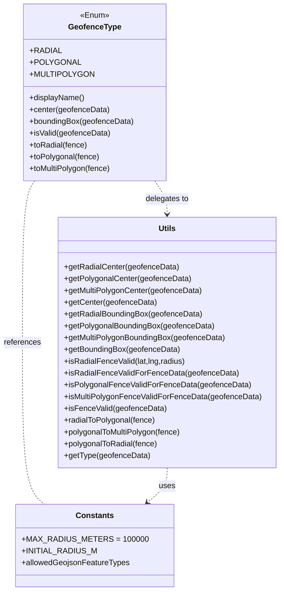

# Diagram: web/portal/src/modules/geofence-edit/geofence-types.js


> Auto-generated by Obscura crawlers

## Diagram 1



### SVG

<svg id="container" width="565.015625" xmlns="http://www.w3.org/2000/svg" class="classDiagram" height="1202" viewBox="0 0 565.015625 1202" role="graphics-document document" aria-roledescription="class"><style>#container{font-family:"trebuchet ms",verdana,arial,sans-serif;font-size:16px;fill:#333;}@keyframes edge-animation-frame{from{stroke-dashoffset:0;}}@keyframes dash{to{stroke-dashoffset:0;}}#container .edge-animation-slow{stroke-dasharray:9,5!important;stroke-dashoffset:900;animation:dash 50s linear infinite;stroke-linecap:round;}#container .edge-animation-fast{stroke-dasharray:9,5!important;stroke-dashoffset:900;animation:dash 20s linear infinite;stroke-linecap:round;}#container .error-icon{fill:#552222;}#container .error-text{fill:#552222;stroke:#552222;}#container .edge-thickness-normal{stroke-width:1px;}#container .edge-thickness-thick{stroke-width:3.5px;}#container .edge-pattern-solid{stroke-dasharray:0;}#container .edge-thickness-invisible{stroke-width:0;fill:none;}#container .edge-pattern-dashed{stroke-dasharray:3;}#container .edge-pattern-dotted{stroke-dasharray:2;}#container .marker{fill:#333333;stroke:#333333;}#container .marker.cross{stroke:#333333;}#container svg{font-family:"trebuchet ms",verdana,arial,sans-serif;font-size:16px;}#container p{margin:0;}#container g.classGroup text{fill:#9370DB;stroke:none;font-family:"trebuchet ms",verdana,arial,sans-serif;font-size:10px;}#container g.classGroup text .title{font-weight:bolder;}#container .nodeLabel,#container .edgeLabel{color:#131300;}#container .edgeLabel .label rect{fill:#ECECFF;}#container .label text{fill:#131300;}#container .labelBkg{background:#ECECFF;}#container .edgeLabel .label span{background:#ECECFF;}#container .classTitle{font-weight:bolder;}#container .node rect,#container .node circle,#container .node ellipse,#container .node polygon,#container .node path{fill:#ECECFF;stroke:#9370DB;stroke-width:1px;}#container .divider{stroke:#9370DB;stroke-width:1;}#container g.clickable{cursor:pointer;}#container g.classGroup rect{fill:#ECECFF;stroke:#9370DB;}#container g.classGroup line{stroke:#9370DB;stroke-width:1;}#container .classLabel .box{stroke:none;stroke-width:0;fill:#ECECFF;opacity:0.5;}#container .classLabel .label{fill:#9370DB;font-size:10px;}#container .relation{stroke:#333333;stroke-width:1;fill:none;}#container .dashed-line{stroke-dasharray:3;}#container .dotted-line{stroke-dasharray:1 2;}#container #compositionStart,#container .composition{fill:#333333!important;stroke:#333333!important;stroke-width:1;}#container #compositionEnd,#container .composition{fill:#333333!important;stroke:#333333!important;stroke-width:1;}#container #dependencyStart,#container .dependency{fill:#333333!important;stroke:#333333!important;stroke-width:1;}#container #dependencyStart,#container .dependency{fill:#333333!important;stroke:#333333!important;stroke-width:1;}#container #extensionStart,#container .extension{fill:transparent!important;stroke:#333333!important;stroke-width:1;}#container #extensionEnd,#container .extension{fill:transparent!important;stroke:#333333!important;stroke-width:1;}#container #aggregationStart,#container .aggregation{fill:transparent!important;stroke:#333333!important;stroke-width:1;}#container #aggregationEnd,#container .aggregation{fill:transparent!important;stroke:#333333!important;stroke-width:1;}#container #lollipopStart,#container .lollipop{fill:#ECECFF!important;stroke:#333333!important;stroke-width:1;}#container #lollipopEnd,#container .lollipop{fill:#ECECFF!important;stroke:#333333!important;stroke-width:1;}#container .edgeTerminals{font-size:11px;line-height:initial;}#container .classTitleText{text-anchor:middle;font-size:18px;fill:#333;}#container .label-icon{display:inline-block;height:1em;overflow:visible;vertical-align:-0.125em;}#container .node .label-icon path{fill:currentColor;stroke:revert;stroke-width:revert;}#container :root{--mermaid-font-family:"trebuchet ms",verdana,arial,sans-serif;}</style><g><defs><marker id="container_class-aggregationStart" class="marker aggregation class" refX="18" refY="7" markerWidth="190" markerHeight="240" orient="auto"><path d="M 18,7 L9,13 L1,7 L9,1 Z"></path></marker></defs><defs><marker id="container_class-aggregationEnd" class="marker aggregation class" refX="1" refY="7" markerWidth="20" markerHeight="28" orient="auto"><path d="M 18,7 L9,13 L1,7 L9,1 Z"></path></marker></defs><defs><marker id="container_class-extensionStart" class="marker extension class" refX="18" refY="7" markerWidth="190" markerHeight="240" orient="auto"><path d="M 1,7 L18,13 V 1 Z"></path></marker></defs><defs><marker id="container_class-extensionEnd" class="marker extension class" refX="1" refY="7" markerWidth="20" markerHeight="28" orient="auto"><path d="M 1,1 V 13 L18,7 Z"></path></marker></defs><defs><marker id="container_class-compositionStart" class="marker composition class" refX="18" refY="7" markerWidth="190" markerHeight="240" orient="auto"><path d="M 18,7 L9,13 L1,7 L9,1 Z"></path></marker></defs><defs><marker id="container_class-compositionEnd" class="marker composition class" refX="1" refY="7" markerWidth="20" markerHeight="28" orient="auto"><path d="M 18,7 L9,13 L1,7 L9,1 Z"></path></marker></defs><defs><marker id="container_class-dependencyStart" class="marker dependency class" refX="6" refY="7" markerWidth="190" markerHeight="240" orient="auto"><path d="M 5,7 L9,13 L1,7 L9,1 Z"></path></marker></defs><defs><marker id="container_class-dependencyEnd" class="marker dependency class" refX="13" refY="7" markerWidth="20" markerHeight="28" orient="auto"><path d="M 18,7 L9,13 L14,7 L9,1 Z"></path></marker></defs><defs><marker id="container_class-lollipopStart" class="marker lollipop class" refX="13" refY="7" markerWidth="190" markerHeight="240" orient="auto"><circle stroke="black" fill="transparent" cx="7" cy="7" r="6"></circle></marker></defs><defs><marker id="container_class-lollipopEnd" class="marker lollipop class" refX="1" refY="7" markerWidth="190" markerHeight="240" orient="auto"><circle stroke="black" fill="transparent" cx="7" cy="7" r="6"></circle></marker></defs><g class="root"><g class="clusters"></g><g class="edgePaths"><path d="M312.941,368L317.09,374.167C321.239,380.333,329.538,392.667,333.687,404C337.836,415.333,337.836,425.667,337.836,430.833L337.836,436" id="id_GeofenceType_Utils_1" class="edge-thickness-normal edge-pattern-dashed relation" style=";;;" data-edge="true" data-et="edge" data-id="id_GeofenceType_Utils_1" data-points="W3sieCI6MzEyLjk0MTI2MjI0MDc4MzQzLCJ5IjozNjh9LHsieCI6MzM3LjgzNTkzNzUsInkiOjQwNX0seyJ4IjozMzcuODM1OTM3NSwieSI6NDQyfV0=" marker-end="url(#container_class-dependencyEnd)"></path><path d="M70.723,368L66.574,374.167C62.425,380.333,54.126,392.667,49.977,447.5C45.828,502.333,45.828,599.667,45.828,697C45.828,794.333,45.828,891.667,53.269,946.5C60.71,1001.333,75.592,1013.667,83.033,1019.833L90.474,1026" id="id_GeofenceType_Constants_2" class="edge-thickness-normal edge-pattern-dashed relation" style=";;;" data-edge="true" data-et="edge" data-id="id_GeofenceType_Constants_2" data-points="W3sieCI6NzAuNzIyODAwMjU5MjE2NTgsInkiOjM2OH0seyJ4Ijo0NS44MjgxMjUsInkiOjQwNX0seyJ4Ijo0NS44MjgxMjUsInkiOjY5N30seyJ4Ijo0NS44MjgxMjUsInkiOjk4OX0seyJ4Ijo5MC40NzM5NDc1NzIzMTQwNSwieSI6MTAyNn1d"></path><path d="M337.836,952L337.836,958.167C337.836,964.333,337.836,976.667,331.165,988.362C324.494,1000.057,311.152,1011.114,304.481,1016.643L297.81,1022.171" id="id_Utils_Constants_3" class="edge-thickness-normal edge-pattern-dashed relation" style=";;;" data-edge="true" data-et="edge" data-id="id_Utils_Constants_3" data-points="W3sieCI6MzM3LjgzNTkzNzUsInkiOjk1Mn0seyJ4IjozMzcuODM1OTM3NSwieSI6OTg5fSx7IngiOjI5My4xOTAxMTQ5Mjc2ODU5NSwieSI6MTAyNn1d" marker-end="url(#container_class-dependencyEnd)"></path></g><g class="edgeLabels"><g class="edgeLabel" transform="translate(337.8359375, 405)"><g class="label" data-id="id_GeofenceType_Utils_1" transform="translate(-44.59375, -12)"><foreignObject width="89.1875" height="24"><div xmlns="http://www.w3.org/1999/xhtml" class="labelBkg" style="display: table-cell; white-space: nowrap; line-height: 1.5; max-width: 200px; text-align: center;"><span class="edgeLabel"><p>delegates to</p></span></div></foreignObject></g></g><g class="edgeLabel" transform="translate(45.828125, 697)"><g class="label" data-id="id_GeofenceType_Constants_2" transform="translate(-37.828125, -12)"><foreignObject width="75.65625" height="24"><div xmlns="http://www.w3.org/1999/xhtml" class="labelBkg" style="display: table-cell; white-space: nowrap; line-height: 1.5; max-width: 200px; text-align: center;"><span class="edgeLabel"><p>references</p></span></div></foreignObject></g></g><g class="edgeLabel" transform="translate(337.8359375, 989)"><g class="label" data-id="id_Utils_Constants_3" transform="translate(-16.4921875, -12)"><foreignObject width="32.984375" height="24"><div xmlns="http://www.w3.org/1999/xhtml" class="labelBkg" style="display: table-cell; white-space: nowrap; line-height: 1.5; max-width: 200px; text-align: center;"><span class="edgeLabel"><p>uses</p></span></div></foreignObject></g></g></g><g class="nodes"><g class="node default" id="classId-GeofenceType-0" transform="translate(191.83203125, 188)"><g class="basic label-container"><path d="M-144.26171875 -180 L144.26171875 -180 L144.26171875 180 L-144.26171875 180" stroke="none" stroke-width="0" fill="#ECECFF" style=""></path><path d="M-144.26171875 -180 C-45.71804081450854 -180, 52.82563712098292 -180, 144.26171875 -180 M-144.26171875 -180 C-83.46571167661153 -180, -22.669704603223067 -180, 144.26171875 -180 M144.26171875 -180 C144.26171875 -39.04224737520033, 144.26171875 101.91550524959933, 144.26171875 180 M144.26171875 -180 C144.26171875 -58.936312982870945, 144.26171875 62.12737403425811, 144.26171875 180 M144.26171875 180 C81.00703591716321 180, 17.752353084326415 180, -144.26171875 180 M144.26171875 180 C55.23464706662152 180, -33.79242461675696 180, -144.26171875 180 M-144.26171875 180 C-144.26171875 70.01897692249474, -144.26171875 -39.96204615501051, -144.26171875 -180 M-144.26171875 180 C-144.26171875 92.1086973760329, -144.26171875 4.217394752065786, -144.26171875 -180" stroke="#9370DB" stroke-width="1.3" fill="none" stroke-dasharray="0 0" style=""></path></g><g class="annotation-group text" transform="translate(-29.53125, -156)"><g class="label" style="" transform="translate(0,-12)"><foreignObject width="59.0625" height="24"><div xmlns="http://www.w3.org/1999/xhtml" style="display: table-cell; white-space: nowrap; line-height: 1.5; max-width: 109px; text-align: center;"><span class="nodeLabel markdown-node-label" style=""><p>«Enum»</p></span></div></foreignObject></g></g><g class="label-group text" transform="translate(-51.4765625, -132)"><g class="label" style="font-weight: bolder" transform="translate(0,-12)"><foreignObject width="102.953125" height="24"><div xmlns="http://www.w3.org/1999/xhtml" style="display: table-cell; white-space: nowrap; line-height: 1.5; max-width: 151px; text-align: center;"><span class="nodeLabel markdown-node-label" style=""><p>GeofenceType</p></span></div></foreignObject></g></g><g class="members-group text" transform="translate(-132.26171875, -84)"><g class="label" style="" transform="translate(0,-12)"><foreignObject width="59" height="24"><div xmlns="http://www.w3.org/1999/xhtml" style="display: table-cell; white-space: nowrap; line-height: 1.5; max-width: 116px; text-align: center;"><span class="nodeLabel markdown-node-label" style=""><p>+RADIAL</p></span></div></foreignObject></g><g class="label" style="" transform="translate(0,12)"><foreignObject width="92.421875" height="24"><div xmlns="http://www.w3.org/1999/xhtml" style="display: table-cell; white-space: nowrap; line-height: 1.5; max-width: 150px; text-align: center;"><span class="nodeLabel markdown-node-label" style=""><p>+POLYGONAL</p></span></div></foreignObject></g><g class="label" style="" transform="translate(0,36)"><foreignObject width="117.953125" height="24"><div xmlns="http://www.w3.org/1999/xhtml" style="display: table-cell; white-space: nowrap; line-height: 1.5; max-width: 175px; text-align: center;"><span class="nodeLabel markdown-node-label" style=""><p>+MULTIPOLYGON</p></span></div></foreignObject></g></g><g class="methods-group text" transform="translate(-132.26171875, 12)"><g class="label" style="" transform="translate(0,-12)"><foreignObject width="112.421875" height="24"><div xmlns="http://www.w3.org/1999/xhtml" style="display: table-cell; white-space: nowrap; line-height: 1.5; max-width: 170px; text-align: center;"><span class="nodeLabel markdown-node-label" style=""><p>+displayName()</p></span></div></foreignObject></g><g class="label" style="" transform="translate(0,12)"><foreignObject width="162.90625" height="24"><div xmlns="http://www.w3.org/1999/xhtml" style="display: table-cell; white-space: nowrap; line-height: 1.5; max-width: 220px; text-align: center;"><span class="nodeLabel markdown-node-label" style=""><p>+center(geofenceData)</p></span></div></foreignObject></g><g class="label" style="" transform="translate(0,36)"><foreignObject width="213.046875" height="24"><div xmlns="http://www.w3.org/1999/xhtml" style="display: table-cell; white-space: nowrap; line-height: 1.5; max-width: 270px; text-align: center;"><span class="nodeLabel markdown-node-label" style=""><p>+boundingBox(geofenceData)</p></span></div></foreignObject></g><g class="label" style="" transform="translate(0,60)"><foreignObject width="164.59375" height="24"><div xmlns="http://www.w3.org/1999/xhtml" style="display: table-cell; white-space: nowrap; line-height: 1.5; max-width: 222px; text-align: center;"><span class="nodeLabel markdown-node-label" style=""><p>+isValid(geofenceData)</p></span></div></foreignObject></g><g class="label" style="" transform="translate(0,84)"><foreignObject width="118.046875" height="24"><div xmlns="http://www.w3.org/1999/xhtml" style="display: table-cell; white-space: nowrap; line-height: 1.5; max-width: 175px; text-align: center;"><span class="nodeLabel markdown-node-label" style=""><p>+toRadial(fence)</p></span></div></foreignObject></g><g class="label" style="" transform="translate(0,108)"><foreignObject width="143.046875" height="24"><div xmlns="http://www.w3.org/1999/xhtml" style="display: table-cell; white-space: nowrap; line-height: 1.5; max-width: 200px; text-align: center;"><span class="nodeLabel markdown-node-label" style=""><p>+toPolygonal(fence)</p></span></div></foreignObject></g><g class="label" style="" transform="translate(0,132)"><foreignObject width="166.546875" height="24"><div xmlns="http://www.w3.org/1999/xhtml" style="display: table-cell; white-space: nowrap; line-height: 1.5; max-width: 224px; text-align: center;"><span class="nodeLabel markdown-node-label" style=""><p>+toMultiPolygon(fence)</p></span></div></foreignObject></g></g><g class="divider" style=""><path d="M-144.26171875 -108 C-60.65075635407955 -108, 22.960206041840905 -108, 144.26171875 -108 M-144.26171875 -108 C-60.03029780737937 -108, 24.20112313524126 -108, 144.26171875 -108" stroke="#9370DB" stroke-width="1.3" fill="none" stroke-dasharray="0 0" style=""></path></g><g class="divider" style=""><path d="M-144.26171875 -12 C-61.35667700813036 -12, 21.548364733739277 -12, 144.26171875 -12 M-144.26171875 -12 C-65.46360658376635 -12, 13.334505582467301 -12, 144.26171875 -12" stroke="#9370DB" stroke-width="1.3" fill="none" stroke-dasharray="0 0" style=""></path></g></g><g class="node default" id="classId-Utils-1" transform="translate(337.8359375, 697)"><g class="basic label-container"><path d="M-219.1796875 -255 L219.1796875 -255 L219.1796875 255 L-219.1796875 255" stroke="none" stroke-width="0" fill="#ECECFF" style=""></path><path d="M-219.1796875 -255 C-96.39117761310139 -255, 26.39733227379722 -255, 219.1796875 -255 M-219.1796875 -255 C-84.2775327538804 -255, 50.62462199223921 -255, 219.1796875 -255 M219.1796875 -255 C219.1796875 -85.80494956892142, 219.1796875 83.39010086215717, 219.1796875 255 M219.1796875 -255 C219.1796875 -54.460072424919844, 219.1796875 146.0798551501603, 219.1796875 255 M219.1796875 255 C81.49733408101218 255, -56.18501933797563 255, -219.1796875 255 M219.1796875 255 C99.02620088146968 255, -21.127285737060646 255, -219.1796875 255 M-219.1796875 255 C-219.1796875 67.3800099978366, -219.1796875 -120.23998000432681, -219.1796875 -255 M-219.1796875 255 C-219.1796875 122.95148241980627, -219.1796875 -9.097035160387463, -219.1796875 -255" stroke="#9370DB" stroke-width="1.3" fill="none" stroke-dasharray="0 0" style=""></path></g><g class="annotation-group text" transform="translate(0, -231)"></g><g class="label-group text" transform="translate(-16.796875, -231)"><g class="label" style="font-weight: bolder" transform="translate(0,-12)"><foreignObject width="33.59375" height="24"><div xmlns="http://www.w3.org/1999/xhtml" style="display: table-cell; white-space: nowrap; line-height: 1.5; max-width: 83px; text-align: center;"><span class="nodeLabel markdown-node-label" style=""><p>Utils</p></span></div></foreignObject></g></g><g class="members-group text" transform="translate(-207.1796875, -183)"></g><g class="methods-group text" transform="translate(-207.1796875, -153)"><g class="label" style="" transform="translate(0,-12)"><foreignObject width="232.3125" height="24"><div xmlns="http://www.w3.org/1999/xhtml" style="display: table-cell; white-space: nowrap; line-height: 1.5; max-width: 290px; text-align: center;"><span class="nodeLabel markdown-node-label" style=""><p>+getRadialCenter(geofenceData)</p></span></div></foreignObject></g><g class="label" style="" transform="translate(0,12)"><foreignObject width="257.328125" height="24"><div xmlns="http://www.w3.org/1999/xhtml" style="display: table-cell; white-space: nowrap; line-height: 1.5; max-width: 315px; text-align: center;"><span class="nodeLabel markdown-node-label" style=""><p>+getPolygonalCenter(geofenceData)</p></span></div></foreignObject></g><g class="label" style="" transform="translate(0,36)"><foreignObject width="280.828125" height="24"><div xmlns="http://www.w3.org/1999/xhtml" style="display: table-cell; white-space: nowrap; line-height: 1.5; max-width: 338px; text-align: center;"><span class="nodeLabel markdown-node-label" style=""><p>+getMultiPolygonCenter(geofenceData)</p></span></div></foreignObject></g><g class="label" style="" transform="translate(0,60)"><foreignObject width="186.78125" height="24"><div xmlns="http://www.w3.org/1999/xhtml" style="display: table-cell; white-space: nowrap; line-height: 1.5; max-width: 244px; text-align: center;"><span class="nodeLabel markdown-node-label" style=""><p>+getCenter(geofenceData)</p></span></div></foreignObject></g><g class="label" style="" transform="translate(0,84)"><foreignObject width="281.375" height="24"><div xmlns="http://www.w3.org/1999/xhtml" style="display: table-cell; white-space: nowrap; line-height: 1.5; max-width: 339px; text-align: center;"><span class="nodeLabel markdown-node-label" style=""><p>+getRadialBoundingBox(geofenceData)</p></span></div></foreignObject></g><g class="label" style="" transform="translate(0,108)"><foreignObject width="306.375" height="24"><div xmlns="http://www.w3.org/1999/xhtml" style="display: table-cell; white-space: nowrap; line-height: 1.5; max-width: 364px; text-align: center;"><span class="nodeLabel markdown-node-label" style=""><p>+getPolygonalBoundingBox(geofenceData)</p></span></div></foreignObject></g><g class="label" style="" transform="translate(0,132)"><foreignObject width="329.875" height="24"><div xmlns="http://www.w3.org/1999/xhtml" style="display: table-cell; white-space: nowrap; line-height: 1.5; max-width: 387px; text-align: center;"><span class="nodeLabel markdown-node-label" style=""><p>+getMultiPolygonBoundingBox(geofenceData)</p></span></div></foreignObject></g><g class="label" style="" transform="translate(0,156)"><foreignObject width="235.828125" height="24"><div xmlns="http://www.w3.org/1999/xhtml" style="display: table-cell; white-space: nowrap; line-height: 1.5; max-width: 293px; text-align: center;"><span class="nodeLabel markdown-node-label" style=""><p>+getBoundingBox(geofenceData)</p></span></div></foreignObject></g><g class="label" style="" transform="translate(0,180)"><foreignObject width="247.28125" height="24"><div xmlns="http://www.w3.org/1999/xhtml" style="display: table-cell; white-space: nowrap; line-height: 1.5; max-width: 305px; text-align: center;"><span class="nodeLabel markdown-node-label" style=""><p>+isRadialFenceValid(lat,lng,radius)</p></span></div></foreignObject></g><g class="label" style="" transform="translate(0,204)"><foreignObject width="349.046875" height="24"><div xmlns="http://www.w3.org/1999/xhtml" style="display: table-cell; white-space: nowrap; line-height: 1.5; max-width: 406px; text-align: center;"><span class="nodeLabel markdown-node-label" style=""><p>+isRadialFenceValidForFenceData(geofenceData)</p></span></div></foreignObject></g><g class="label" style="" transform="translate(0,228)"><foreignObject width="374.0625" height="24"><div xmlns="http://www.w3.org/1999/xhtml" style="display: table-cell; white-space: nowrap; line-height: 1.5; max-width: 431px; text-align: center;"><span class="nodeLabel markdown-node-label" style=""><p>+isPolygonalFenceValidForFenceData(geofenceData)</p></span></div></foreignObject></g><g class="label" style="" transform="translate(0,252)"><foreignObject width="397.5625" height="24"><div xmlns="http://www.w3.org/1999/xhtml" style="display: table-cell; white-space: nowrap; line-height: 1.5; max-width: 455px; text-align: center;"><span class="nodeLabel markdown-node-label" style=""><p>+isMultiPolygonFenceValidForFenceData(geofenceData)</p></span></div></foreignObject></g><g class="label" style="" transform="translate(0,276)"><foreignObject width="206.046875" height="24"><div xmlns="http://www.w3.org/1999/xhtml" style="display: table-cell; white-space: nowrap; line-height: 1.5; max-width: 263px; text-align: center;"><span class="nodeLabel markdown-node-label" style=""><p>+isFenceValid(geofenceData)</p></span></div></foreignObject></g><g class="label" style="" transform="translate(0,300)"><foreignObject width="186.609375" height="24"><div xmlns="http://www.w3.org/1999/xhtml" style="display: table-cell; white-space: nowrap; line-height: 1.5; max-width: 244px; text-align: center;"><span class="nodeLabel markdown-node-label" style=""><p>+radialToPolygonal(fence)</p></span></div></foreignObject></g><g class="label" style="" transform="translate(0,324)"><foreignObject width="239.71875" height="24"><div xmlns="http://www.w3.org/1999/xhtml" style="display: table-cell; white-space: nowrap; line-height: 1.5; max-width: 297px; text-align: center;"><span class="nodeLabel markdown-node-label" style=""><p>+polygonalToMultiPolygon(fence)</p></span></div></foreignObject></g><g class="label" style="" transform="translate(0,348)"><foreignObject width="191.203125" height="24"><div xmlns="http://www.w3.org/1999/xhtml" style="display: table-cell; white-space: nowrap; line-height: 1.5; max-width: 249px; text-align: center;"><span class="nodeLabel markdown-node-label" style=""><p>+polygonalToRadial(fence)</p></span></div></foreignObject></g><g class="label" style="" transform="translate(0,372)"><foreignObject width="173.34375" height="24"><div xmlns="http://www.w3.org/1999/xhtml" style="display: table-cell; white-space: nowrap; line-height: 1.5; max-width: 231px; text-align: center;"><span class="nodeLabel markdown-node-label" style=""><p>+getType(geofenceData)</p></span></div></foreignObject></g></g><g class="divider" style=""><path d="M-219.1796875 -207 C-104.77634771621588 -207, 9.626992067568239 -207, 219.1796875 -207 M-219.1796875 -207 C-118.38099933636532 -207, -17.58231117273064 -207, 219.1796875 -207" stroke="#9370DB" stroke-width="1.3" fill="none" stroke-dasharray="0 0" style=""></path></g><g class="divider" style=""><path d="M-219.1796875 -183 C-92.70518261919345 -183, 33.7693222616131 -183, 219.1796875 -183 M-219.1796875 -183 C-44.489149676006605 -183, 130.2013881479868 -183, 219.1796875 -183" stroke="#9370DB" stroke-width="1.3" fill="none" stroke-dasharray="0 0" style=""></path></g></g><g class="node default" id="classId-Constants-2" transform="translate(191.83203125, 1110)"><g class="basic label-container"><path d="M-146.09765625 -84 L146.09765625 -84 L146.09765625 84 L-146.09765625 84" stroke="none" stroke-width="0" fill="#ECECFF" style=""></path><path d="M-146.09765625 -84 C-69.98091133602631 -84, 6.1358335779473805 -84, 146.09765625 -84 M-146.09765625 -84 C-42.21149664631956 -84, 61.67466295736088 -84, 146.09765625 -84 M146.09765625 -84 C146.09765625 -20.222596393406782, 146.09765625 43.554807213186436, 146.09765625 84 M146.09765625 -84 C146.09765625 -30.262244174095365, 146.09765625 23.47551165180927, 146.09765625 84 M146.09765625 84 C77.61814497171648 84, 9.13863369343295 84, -146.09765625 84 M146.09765625 84 C85.85864608432149 84, 25.61963591864297 84, -146.09765625 84 M-146.09765625 84 C-146.09765625 29.041989944983555, -146.09765625 -25.91602011003289, -146.09765625 -84 M-146.09765625 84 C-146.09765625 39.094827760278264, -146.09765625 -5.810344479443472, -146.09765625 -84" stroke="#9370DB" stroke-width="1.3" fill="none" stroke-dasharray="0 0" style=""></path></g><g class="annotation-group text" transform="translate(0, -60)"></g><g class="label-group text" transform="translate(-36.5390625, -60)"><g class="label" style="font-weight: bolder" transform="translate(0,-12)"><foreignObject width="73.078125" height="24"><div xmlns="http://www.w3.org/1999/xhtml" style="display: table-cell; white-space: nowrap; line-height: 1.5; max-width: 122px; text-align: center;"><span class="nodeLabel markdown-node-label" style=""><p>Constants</p></span></div></foreignObject></g></g><g class="members-group text" transform="translate(-134.09765625, -12)"><g class="label" style="" transform="translate(0,-12)"><foreignObject width="231.65625" height="24"><div xmlns="http://www.w3.org/1999/xhtml" style="display: table-cell; white-space: nowrap; line-height: 1.5; max-width: 289px; text-align: center;"><span class="nodeLabel markdown-node-label" style=""><p>+MAX_RADIUS_METERS = 100000</p></span></div></foreignObject></g><g class="label" style="" transform="translate(0,12)"><foreignObject width="140.171875" height="24"><div xmlns="http://www.w3.org/1999/xhtml" style="display: table-cell; white-space: nowrap; line-height: 1.5; max-width: 198px; text-align: center;"><span class="nodeLabel markdown-node-label" style=""><p>+INITIAL_RADIUS_M</p></span></div></foreignObject></g><g class="label" style="" transform="translate(0,36)"><foreignObject width="218.796875" height="24"><div xmlns="http://www.w3.org/1999/xhtml" style="display: table-cell; white-space: nowrap; line-height: 1.5; max-width: 276px; text-align: center;"><span class="nodeLabel markdown-node-label" style=""><p>+allowedGeojsonFeatureTypes</p></span></div></foreignObject></g></g><g class="methods-group text" transform="translate(-134.09765625, 84)"></g><g class="divider" style=""><path d="M-146.09765625 -36 C-85.62638107900605 -36, -25.155105908012118 -36, 146.09765625 -36 M-146.09765625 -36 C-29.772235533951815 -36, 86.55318518209637 -36, 146.09765625 -36" stroke="#9370DB" stroke-width="1.3" fill="none" stroke-dasharray="0 0" style=""></path></g><g class="divider" style=""><path d="M-146.09765625 60 C-78.61916621730398 60, -11.140676184607969 60, 146.09765625 60 M-146.09765625 60 C-50.76803298503128 60, 44.561590279937434 60, 146.09765625 60" stroke="#9370DB" stroke-width="1.3" fill="none" stroke-dasharray="0 0" style=""></path></g></g></g></g></g></svg>

## Diagram 2

```mermaid
flowchart LR
    subgraph Types
        R[Radial (Point)]
        P[Polygonal (Polygon)]
        M[MultiPolygon (MultiPolygon)]
    end
    R -->|toPolygonal: radialToPolygonal| P
    P -->|toRadial: polygonalToRadial| R
    P -->|toMultiPolygon: polygonalToMultiPolygon| M
    R -->|toMultiPolygon: radial -> polygonal -> multi| M
    R ---|validate: isRadialFenceValidForFenceData| Utils[(Validation)]
    P ---|validate: isPolygonalFenceValidForFenceData| Utils
    M ---|validate: isMultiPolygonFenceValidForFenceData| Utils
    Utils -->|compute center/bbox| R
    Utils -->|compute center/bbox| P
    Utils -->|compute center/bbox| M
```

> SVG rendering failed for this diagram.
