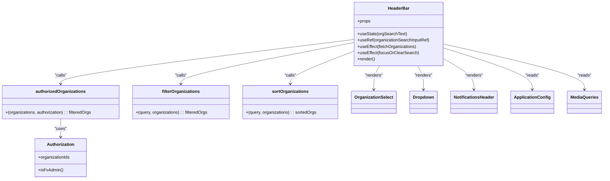
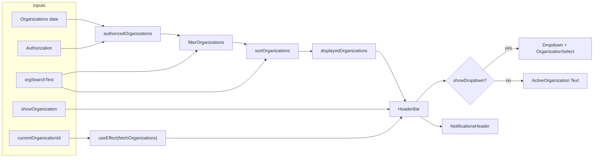

# Diagram: web/portal/src/modules/header-bar/HeaderBarView.js

> Auto-generated by Obscura crawlers

## Diagram 1

### SVG

<svg id="container" width="2235.2421875" xmlns="http://www.w3.org/2000/svg" class="classDiagram" height="674" viewBox="0 0 2235.2421875 674" role="graphics-document document" aria-roledescription="class"><g><defs><marker id="container_class-aggregationStart" class="marker aggregation class" refX="18" refY="7" markerWidth="190" markerHeight="240" orient="auto"><path d="M 18,7 L9,13 L1,7 L9,1 Z"></path></marker></defs><defs><marker id="container_class-aggregationEnd" class="marker aggregation class" refX="1" refY="7" markerWidth="20" markerHeight="28" orient="auto"><path d="M 18,7 L9,13 L1,7 L9,1 Z"></path></marker></defs><defs><marker id="container_class-extensionStart" class="marker extension class" refX="18" refY="7" markerWidth="190" markerHeight="240" orient="auto"><path d="M 1,7 L18,13 V 1 Z"></path></marker></defs><defs><marker id="container_class-extensionEnd" class="marker extension class" refX="1" refY="7" markerWidth="20" markerHeight="28" orient="auto"><path d="M 1,1 V 13 L18,7 Z"></path></marker></defs><defs><marker id="container_class-compositionStart" class="marker composition class" refX="18" refY="7" markerWidth="190" markerHeight="240" orient="auto"><path d="M 18,7 L9,13 L1,7 L9,1 Z"></path></marker></defs><defs><marker id="container_class-compositionEnd" class="marker composition class" refX="1" refY="7" markerWidth="20" markerHeight="28" orient="auto"><path d="M 18,7 L9,13 L1,7 L9,1 Z"></path></marker></defs><defs><marker id="container_class-dependencyStart" class="marker dependency class" refX="6" refY="7" markerWidth="190" markerHeight="240" orient="auto"><path d="M 5,7 L9,13 L1,7 L9,1 Z"></path></marker></defs><defs><marker id="container_class-dependencyEnd" class="marker dependency class" refX="13" refY="7" markerWidth="20" markerHeight="28" orient="auto"><path d="M 18,7 L9,13 L14,7 L9,1 Z"></path></marker></defs><defs><marker id="container_class-lollipopStart" class="marker lollipop class" refX="13" refY="7" markerWidth="190" markerHeight="240" orient="auto"><circle stroke="black" fill="transparent" cx="7" cy="7" r="6"></circle></marker></defs><defs><marker id="container_class-lollipopEnd" class="marker lollipop class" refX="1" refY="7" markerWidth="190" markerHeight="240" orient="auto"><circle stroke="black" fill="transparent" cx="7" cy="7" r="6"></circle></marker></defs><g class="root"><g class="clusters"></g><g class="edgePaths"><path d="M1322.078,148.744L1139.841,171.453C957.604,194.163,593.13,239.581,410.893,267.457C228.656,295.333,228.656,305.667,228.656,310.833L228.656,316" id="id_HeaderBar_authorizedOrganizations_1" class="edge-thickness-normal edge-pattern-solid relation" style=";;;" data-edge="true" data-et="edge" data-id="id_HeaderBar_authorizedOrganizations_1" data-points="W3sieCI6MTMyMi4wNzgxMjUsInkiOjE0OC43NDM5MTI5ODgyMDg4OH0seyJ4IjoyMjguNjU2MjUsInkiOjI4NX0seyJ4IjoyMjguNjU2MjUsInkiOjMyMn1d" marker-end="url(#container_class-dependencyEnd)"></path><path d="M1322.078,160.352L1215.182,181.126C1108.285,201.901,894.492,243.451,787.596,269.392C680.699,295.333,680.699,305.667,680.699,310.833L680.699,316" id="id_HeaderBar_filterOrganizations_2" class="edge-thickness-normal edge-pattern-solid relation" style=";;;" data-edge="true" data-et="edge" data-id="id_HeaderBar_filterOrganizations_2" data-points="W3sieCI6MTMyMi4wNzgxMjUsInkiOjE2MC4zNTE1Mjg5NTQzOTI0OH0seyJ4Ijo2ODAuNjk5MjE4NzUsInkiOjI4NX0seyJ4Ijo2ODAuNjk5MjE4NzUsInkiOjMyMn1d" marker-end="url(#container_class-dependencyEnd)"></path><path d="M1322.078,193.472L1283.293,208.727C1244.508,223.982,1166.938,254.491,1128.152,274.912C1089.367,295.333,1089.367,305.667,1089.367,310.833L1089.367,316" id="id_HeaderBar_sortOrganizations_3" class="edge-thickness-normal edge-pattern-solid relation" style=";;;" data-edge="true" data-et="edge" data-id="id_HeaderBar_sortOrganizations_3" data-points="W3sieCI6MTMyMi4wNzgxMjUsInkiOjE5My40NzIzNjAwMzg3NTE3M30seyJ4IjoxMDg5LjM2NzE4NzUsInkiOjI4NX0seyJ4IjoxMDg5LjM2NzE4NzUsInkiOjMyMn1d" marker-end="url(#container_class-dependencyEnd)"></path><path d="M1419.344,248L1415.788,254.167C1412.232,260.333,1405.12,272.667,1401.564,287.5C1398.008,302.333,1398.008,319.667,1398.008,328.333L1398.008,337" id="id_HeaderBar_OrganizationSelect_4" class="edge-thickness-normal edge-pattern-solid relation" style=";;;" data-edge="true" data-et="edge" data-id="id_HeaderBar_OrganizationSelect_4" data-points="W3sieCI6MTQxOS4zNDQxMjMyMDg1OTg4LCJ5IjoyNDh9LHsieCI6MTM5OC4wMDc4MTI1LCJ5IjoyODV9LHsieCI6MTM5OC4wMDc4MTI1LCJ5IjozNDN9XQ==" marker-end="url(#container_class-dependencyEnd)"></path><path d="M1557.742,248L1561.298,254.167C1564.854,260.333,1571.966,272.667,1575.522,287.5C1579.078,302.333,1579.078,319.667,1579.078,328.333L1579.078,337" id="id_HeaderBar_Dropdown_5" class="edge-thickness-normal edge-pattern-solid relation" style=";;;" data-edge="true" data-et="edge" data-id="id_HeaderBar_Dropdown_5" data-points="W3sieCI6MTU1Ny43NDE4MTQyOTE0MDEyLCJ5IjoyNDh9LHsieCI6MTU3OS4wNzgxMjUsInkiOjI4NX0seyJ4IjoxNTc5LjA3ODEyNSwieSI6MzQzfV0=" marker-end="url(#container_class-dependencyEnd)"></path><path d="M1655.008,222.876L1673.174,233.23C1691.341,243.584,1727.674,264.292,1745.841,283.313C1764.008,302.333,1764.008,319.667,1764.008,328.333L1764.008,337" id="id_HeaderBar_NotificationsHeader_6" class="edge-thickness-normal edge-pattern-solid relation" style=";;;" data-edge="true" data-et="edge" data-id="id_HeaderBar_NotificationsHeader_6" data-points="W3sieCI6MTY1NS4wMDc4MTI1LCJ5IjoyMjIuODc1OTE5OTY0ODMyMTh9LHsieCI6MTc2NC4wMDc4MTI1LCJ5IjoyODV9LHsieCI6MTc2NC4wMDc4MTI1LCJ5IjozNDN9XQ==" marker-end="url(#container_class-dependencyEnd)"></path><path d="M228.656,448L228.656,454.167C228.656,460.333,228.656,472.667,228.656,484C228.656,495.333,228.656,505.667,228.656,510.833L228.656,516" id="id_authorizedOrganizations_Authorization_7" class="edge-thickness-normal edge-pattern-solid relation" style=";;;" data-edge="true" data-et="edge" data-id="id_authorizedOrganizations_Authorization_7" data-points="W3sieCI6MjI4LjY1NjI1LCJ5Ijo0NDh9LHsieCI6MjI4LjY1NjI1LCJ5Ijo0ODV9LHsieCI6MjI4LjY1NjI1LCJ5Ijo1MjJ9XQ==" marker-end="url(#container_class-dependencyEnd)"></path><path d="M1655.008,181.634L1708.478,198.862C1761.948,216.089,1868.888,250.545,1922.358,276.439C1975.828,302.333,1975.828,319.667,1975.828,328.333L1975.828,337" id="id_HeaderBar_ApplicationConfig_8" class="edge-thickness-normal edge-pattern-solid relation" style=";;;" data-edge="true" data-et="edge" data-id="id_HeaderBar_ApplicationConfig_8" data-points="W3sieCI6MTY1NS4wMDc4MTI1LCJ5IjoxODEuNjMzODUzMDYwMjQyOX0seyJ4IjoxOTc1LjgyODEyNSwieSI6Mjg1fSx7IngiOjE5NzUuODI4MTI1LCJ5IjozNDN9XQ==" marker-end="url(#container_class-dependencyEnd)"></path><path d="M1655.008,166.644L1739.979,186.37C1824.951,206.096,1994.893,245.548,2079.865,273.941C2164.836,302.333,2164.836,319.667,2164.836,328.333L2164.836,337" id="id_HeaderBar_MediaQueries_9" class="edge-thickness-normal edge-pattern-solid relation" style=";;;" data-edge="true" data-et="edge" data-id="id_HeaderBar_MediaQueries_9" data-points="W3sieCI6MTY1NS4wMDc4MTI1LCJ5IjoxNjYuNjQ0NDY1NzUxMzY3NDh9LHsieCI6MjE2NC44MzU5Mzc1LCJ5IjoyODV9LHsieCI6MjE2NC44MzU5Mzc1LCJ5IjozNDN9XQ==" marker-end="url(#container_class-dependencyEnd)"></path></g><g class="edgeLabels"><g class="edgeLabel" transform="translate(228.65625, 285)"><g class="label" data-id="id_HeaderBar_authorizedOrganizations_1" transform="translate(-22.625, -12)"><foreignObject width="45.25" height="24">

"calls"

</foreignObject></g></g><g class="edgeLabel" transform="translate(680.69921875, 285)"><g class="label" data-id="id_HeaderBar_filterOrganizations_2" transform="translate(-22.625, -12)"><foreignObject width="45.25" height="24">

"calls"

</foreignObject></g></g><g class="edgeLabel" transform="translate(1089.3671875, 285)"><g class="label" data-id="id_HeaderBar_sortOrganizations_3" transform="translate(-22.625, -12)"><foreignObject width="45.25" height="24">

"calls"

</foreignObject></g></g><g class="edgeLabel" transform="translate(1398.0078125, 285)"><g class="label" data-id="id_HeaderBar_OrganizationSelect_4" transform="translate(-34.015625, -12)"><foreignObject width="68.03125" height="24">

"renders"

</foreignObject></g></g><g class="edgeLabel" transform="translate(1579.078125, 285)"><g class="label" data-id="id_HeaderBar_Dropdown_5" transform="translate(-34.015625, -12)"><foreignObject width="68.03125" height="24">

"renders"

</foreignObject></g></g><g class="edgeLabel" transform="translate(1764.0078125, 285)"><g class="label" data-id="id_HeaderBar_NotificationsHeader_6" transform="translate(-34.015625, -12)"><foreignObject width="68.03125" height="24">

"renders"

</foreignObject></g></g><g class="edgeLabel" transform="translate(228.65625, 485)"><g class="label" data-id="id_authorizedOrganizations_Authorization_7" transform="translate(-22.7578125, -12)"><foreignObject width="45.515625" height="24">

"uses"

</foreignObject></g></g><g class="edgeLabel" transform="translate(1975.828125, 285)"><g class="label" data-id="id_HeaderBar_ApplicationConfig_8" transform="translate(-26.265625, -12)"><foreignObject width="52.53125" height="24">

"reads"

</foreignObject></g></g><g class="edgeLabel" transform="translate(2164.8359375, 285)"><g class="label" data-id="id_HeaderBar_MediaQueries_9" transform="translate(-26.265625, -12)"><foreignObject width="52.53125" height="24">

"reads"

</foreignObject></g></g></g><g class="nodes"><g class="node default" id="classId-HeaderBar-0" transform="translate(1488.54296875, 128)"><g class="basic label-container"><path d="M-166.46484375 -120 L166.46484375 -120 L166.46484375 120 L-166.46484375 120" stroke="none" stroke-width="0" fill="#ECECFF" style=""></path><path d="M-166.46484375 -120 C-90.64057671469152 -120, -14.816309679383039 -120, 166.46484375 -120 M-166.46484375 -120 C-69.00011709107251 -120, 28.46460956785498 -120, 166.46484375 -120 M166.46484375 -120 C166.46484375 -60.33782128588034, 166.46484375 -0.675642571760676, 166.46484375 120 M166.46484375 -120 C166.46484375 -27.22290150185195, 166.46484375 65.5541969962961, 166.46484375 120 M166.46484375 120 C70.21272064051335 120, -26.039402468973293 120, -166.46484375 120 M166.46484375 120 C66.741875514086 120, -32.98109272182799 120, -166.46484375 120 M-166.46484375 120 C-166.46484375 59.57202174456602, -166.46484375 -0.855956510867955, -166.46484375 -120 M-166.46484375 120 C-166.46484375 67.05110120828769, -166.46484375 14.102202416575366, -166.46484375 -120" stroke="#9370DB" stroke-width="1.3" fill="none" stroke-dasharray="0 0" style=""></path></g><g class="annotation-group text" transform="translate(0, -96)"></g><g class="label-group text" transform="translate(-39.0078125, -96)"><g class="label" style="font-weight: bolder" transform="translate(0,-12)"><foreignObject width="78.015625" height="24">

HeaderBar

</foreignObject></g></g><g class="members-group text" transform="translate(-154.46484375, -48)"><g class="label" style="" transform="translate(0,-12)"><foreignObject width="49.515625" height="24">

+props

</foreignObject></g></g><g class="methods-group text" transform="translate(-154.46484375, 0)"><g class="label" style="" transform="translate(0,-12)"><foreignObject width="183.015625" height="24">

+useState(orgSearchText)

</foreignObject></g><g class="label" style="" transform="translate(0,12)"><foreignObject width="269.921875" height="24">

+useRef(organizationSearchInputRef)

</foreignObject></g><g class="label" style="" transform="translate(0,36)"><foreignObject width="220.84375" height="24">

+useEffect(fetchOrganizations)

</foreignObject></g><g class="label" style="" transform="translate(0,60)"><foreignObject width="226.421875" height="24">

+useEffect(focusOrClearSearch)

</foreignObject></g><g class="label" style="" transform="translate(0,84)"><foreignObject width="66.609375" height="24">

+render()

</foreignObject></g></g><g class="divider" style=""><path d="M-166.46484375 -72 C-81.29273899407427 -72, 3.87936576185146 -72, 166.46484375 -72 M-166.46484375 -72 C-74.71635035210245 -72, 17.032143045795095 -72, 166.46484375 -72" stroke="#9370DB" stroke-width="1.3" fill="none" stroke-dasharray="0 0" style=""></path></g><g class="divider" style=""><path d="M-166.46484375 -24 C-90.5395757950785 -24, -14.61430784015701 -24, 166.46484375 -24 M-166.46484375 -24 C-68.93361207722033 -24, 28.597619595559337 -24, 166.46484375 -24" stroke="#9370DB" stroke-width="1.3" fill="none" stroke-dasharray="0 0" style=""></path></g></g><g class="node default" id="classId-authorizedOrganizations-1" transform="translate(228.65625, 385)"><g class="basic label-container"><path d="M-220.65625 -63 L220.65625 -63 L220.65625 63 L-220.65625 63" stroke="none" stroke-width="0" fill="#ECECFF" style=""></path><path d="M-220.65625 -63 C-119.8660559094634 -63, -19.075861818926796 -63, 220.65625 -63 M-220.65625 -63 C-53.900433934715124 -63, 112.85538213056975 -63, 220.65625 -63 M220.65625 -63 C220.65625 -14.848367417512321, 220.65625 33.30326516497536, 220.65625 63 M220.65625 -63 C220.65625 -18.258864457999266, 220.65625 26.482271084001468, 220.65625 63 M220.65625 63 C118.22095458319345 63, 15.785659166386893 63, -220.65625 63 M220.65625 63 C54.67881799634412 63, -111.29861400731176 63, -220.65625 63 M-220.65625 63 C-220.65625 17.525441138691924, -220.65625 -27.94911772261615, -220.65625 -63 M-220.65625 63 C-220.65625 13.509600293795017, -220.65625 -35.980799412409965, -220.65625 -63" stroke="#9370DB" stroke-width="1.3" fill="none" stroke-dasharray="0 0" style=""></path></g><g class="annotation-group text" transform="translate(0, -39)"></g><g class="label-group text" transform="translate(-90.171875, -39)"><g class="label" style="font-weight: bolder" transform="translate(0,-12)"><foreignObject width="180.34375" height="24">

authorizedOrganizations

</foreignObject></g></g><g class="members-group text" transform="translate(-208.65625, 9)"></g><g class="methods-group text" transform="translate(-208.65625, 39)"><g class="label" style="" transform="translate(0,-12)"><foreignObject width="327.140625" height="24">

+(organizations, authorization) : : filteredOrgs

</foreignObject></g></g><g class="divider" style=""><path d="M-220.65625 -15 C-106.0442633944123 -15, 8.567723211175405 -15, 220.65625 -15 M-220.65625 -15 C-95.42683505891826 -15, 29.802579882163485 -15, 220.65625 -15" stroke="#9370DB" stroke-width="1.3" fill="none" stroke-dasharray="0 0" style=""></path></g><g class="divider" style=""><path d="M-220.65625 9 C-76.63465078305984 9, 67.38694843388032 9, 220.65625 9 M-220.65625 9 C-120.20218097828501 9, -19.74811195657003 9, 220.65625 9" stroke="#9370DB" stroke-width="1.3" fill="none" stroke-dasharray="0 0" style=""></path></g></g><g class="node default" id="classId-filterOrganizations-2" transform="translate(680.69921875, 385)"><g class="basic label-container"><path d="M-181.38671875 -63 L181.38671875 -63 L181.38671875 63 L-181.38671875 63" stroke="none" stroke-width="0" fill="#ECECFF" style=""></path><path d="M-181.38671875 -63 C-40.42924832314716 -63, 100.52822210370567 -63, 181.38671875 -63 M-181.38671875 -63 C-99.5280394892122 -63, -17.66936022842441 -63, 181.38671875 -63 M181.38671875 -63 C181.38671875 -14.504108705974225, 181.38671875 33.99178258805155, 181.38671875 63 M181.38671875 -63 C181.38671875 -18.452677660826872, 181.38671875 26.094644678346256, 181.38671875 63 M181.38671875 63 C39.14347871736652 63, -103.09976131526696 63, -181.38671875 63 M181.38671875 63 C67.0523731657326 63, -47.28197241853479 63, -181.38671875 63 M-181.38671875 63 C-181.38671875 34.66374301282222, -181.38671875 6.32748602564444, -181.38671875 -63 M-181.38671875 63 C-181.38671875 14.251618586997097, -181.38671875 -34.496762826005806, -181.38671875 -63" stroke="#9370DB" stroke-width="1.3" fill="none" stroke-dasharray="0 0" style=""></path></g><g class="annotation-group text" transform="translate(0, -39)"></g><g class="label-group text" transform="translate(-68.2890625, -39)"><g class="label" style="font-weight: bolder" transform="translate(0,-12)"><foreignObject width="136.578125" height="24">

filterOrganizations

</foreignObject></g></g><g class="members-group text" transform="translate(-169.38671875, 9)"></g><g class="methods-group text" transform="translate(-169.38671875, 39)"><g class="label" style="" transform="translate(0,-12)"><foreignObject width="270.484375" height="24">

+(query, organizations) : : filteredOrgs

</foreignObject></g></g><g class="divider" style=""><path d="M-181.38671875 -15 C-72.02654409663319 -15, 37.333630556733624 -15, 181.38671875 -15 M-181.38671875 -15 C-99.8895179790068 -15, -18.392317208013594 -15, 181.38671875 -15" stroke="#9370DB" stroke-width="1.3" fill="none" stroke-dasharray="0 0" style=""></path></g><g class="divider" style=""><path d="M-181.38671875 9 C-71.87359596609559 9, 37.639526817808814 9, 181.38671875 9 M-181.38671875 9 C-87.3274754258177 9, 6.731767898364609 9, 181.38671875 9" stroke="#9370DB" stroke-width="1.3" fill="none" stroke-dasharray="0 0" style=""></path></g></g><g class="node default" id="classId-sortOrganizations-3" transform="translate(1089.3671875, 385)"><g class="basic label-container"><path d="M-177.28125 -63 L177.28125 -63 L177.28125 63 L-177.28125 63" stroke="none" stroke-width="0" fill="#ECECFF" style=""></path><path d="M-177.28125 -63 C-53.048609881763056 -63, 71.18403023647389 -63, 177.28125 -63 M-177.28125 -63 C-81.81001053660269 -63, 13.661228926794621 -63, 177.28125 -63 M177.28125 -63 C177.28125 -16.46993653450879, 177.28125 30.06012693098242, 177.28125 63 M177.28125 -63 C177.28125 -31.14752612084325, 177.28125 0.7049477583135015, 177.28125 63 M177.28125 63 C46.94102101433168 63, -83.39920797133664 63, -177.28125 63 M177.28125 63 C92.8733380295086 63, 8.465426059017204 63, -177.28125 63 M-177.28125 63 C-177.28125 19.97416169713498, -177.28125 -23.051676605730037, -177.28125 -63 M-177.28125 63 C-177.28125 23.076971366408323, -177.28125 -16.846057267183355, -177.28125 -63" stroke="#9370DB" stroke-width="1.3" fill="none" stroke-dasharray="0 0" style=""></path></g><g class="annotation-group text" transform="translate(0, -39)"></g><g class="label-group text" transform="translate(-65.390625, -39)"><g class="label" style="font-weight: bolder" transform="translate(0,-12)"><foreignObject width="130.78125" height="24">

sortOrganizations

</foreignObject></g></g><g class="members-group text" transform="translate(-165.28125, 9)"></g><g class="methods-group text" transform="translate(-165.28125, 39)"><g class="label" style="" transform="translate(0,-12)"><foreignObject width="265.171875" height="24">

+(query, organizations) : : sortedOrgs

</foreignObject></g></g><g class="divider" style=""><path d="M-177.28125 -15 C-76.05956991331101 -15, 25.162110173377982 -15, 177.28125 -15 M-177.28125 -15 C-59.679742849981295 -15, 57.92176430003741 -15, 177.28125 -15" stroke="#9370DB" stroke-width="1.3" fill="none" stroke-dasharray="0 0" style=""></path></g><g class="divider" style=""><path d="M-177.28125 9 C-99.61339305689258 9, -21.945536113785153 9, 177.28125 9 M-177.28125 9 C-93.64686177996887 9, -10.012473559937746 9, 177.28125 9" stroke="#9370DB" stroke-width="1.3" fill="none" stroke-dasharray="0 0" style=""></path></g></g><g class="node default" id="classId-Authorization-4" transform="translate(228.65625, 594)"><g class="basic label-container"><path d="M-96.91015625 -72 L96.91015625 -72 L96.91015625 72 L-96.91015625 72" stroke="none" stroke-width="0" fill="#ECECFF" style=""></path><path d="M-96.91015625 -72 C-27.515625904957602 -72, 41.878904440084796 -72, 96.91015625 -72 M-96.91015625 -72 C-43.00961766802863 -72, 10.890920913942736 -72, 96.91015625 -72 M96.91015625 -72 C96.91015625 -19.035994443499924, 96.91015625 33.92801111300015, 96.91015625 72 M96.91015625 -72 C96.91015625 -37.118577066230905, 96.91015625 -2.2371541324618107, 96.91015625 72 M96.91015625 72 C19.856017111064062 72, -57.198122027871875 72, -96.91015625 72 M96.91015625 72 C25.367616586083358 72, -46.174923077833284 72, -96.91015625 72 M-96.91015625 72 C-96.91015625 21.567508289167534, -96.91015625 -28.86498342166493, -96.91015625 -72 M-96.91015625 72 C-96.91015625 34.50377142307346, -96.91015625 -2.9924571538530813, -96.91015625 -72" stroke="#9370DB" stroke-width="1.3" fill="none" stroke-dasharray="0 0" style=""></path></g><g class="annotation-group text" transform="translate(0, -48)"></g><g class="label-group text" transform="translate(-49.7109375, -48)"><g class="label" style="font-weight: bolder" transform="translate(0,-12)"><foreignObject width="99.421875" height="24">

Authorization

</foreignObject></g></g><g class="members-group text" transform="translate(-84.91015625, 0)"><g class="label" style="" transform="translate(0,-12)"><foreignObject width="120.109375" height="24">

+organizationIds

</foreignObject></g></g><g class="methods-group text" transform="translate(-84.91015625, 48)"><g class="label" style="" transform="translate(0,-12)"><foreignObject width="91.84375" height="24">

+isFvAdmin()

</foreignObject></g></g><g class="divider" style=""><path d="M-96.91015625 -24 C-45.98494781812117 -24, 4.940260613757658 -24, 96.91015625 -24 M-96.91015625 -24 C-39.5565717042716 -24, 17.797012841456805 -24, 96.91015625 -24" stroke="#9370DB" stroke-width="1.3" fill="none" stroke-dasharray="0 0" style=""></path></g><g class="divider" style=""><path d="M-96.91015625 24 C-46.6566646885812 24, 3.596826872837596 24, 96.91015625 24 M-96.91015625 24 C-28.224116496152064 24, 40.46192325769587 24, 96.91015625 24" stroke="#9370DB" stroke-width="1.3" fill="none" stroke-dasharray="0 0" style=""></path></g></g><g class="node default" id="classId-OrganizationSelect-5" transform="translate(1398.0078125, 385)"><g class="basic label-container"><path d="M-81.359375 -42 L81.359375 -42 L81.359375 42 L-81.359375 42" stroke="none" stroke-width="0" fill="#ECECFF" style=""></path><path d="M-81.359375 -42 C-44.9304700472504 -42, -8.501565094500805 -42, 81.359375 -42 M-81.359375 -42 C-27.213465418709582 -42, 26.932444162580836 -42, 81.359375 -42 M81.359375 -42 C81.359375 -8.576752838518232, 81.359375 24.846494322963537, 81.359375 42 M81.359375 -42 C81.359375 -13.755590579435385, 81.359375 14.48881884112923, 81.359375 42 M81.359375 42 C36.607409552648804 42, -8.144555894702393 42, -81.359375 42 M81.359375 42 C20.946830575848672 42, -39.465713848302656 42, -81.359375 42 M-81.359375 42 C-81.359375 23.59518545659305, -81.359375 5.190370913186101, -81.359375 -42 M-81.359375 42 C-81.359375 11.695870616706614, -81.359375 -18.608258766586772, -81.359375 -42" stroke="#9370DB" stroke-width="1.3" fill="none" stroke-dasharray="0 0" style=""></path></g><g class="annotation-group text" transform="translate(0, -18)"></g><g class="label-group text" transform="translate(-69.359375, -18)"><g class="label" style="font-weight: bolder" transform="translate(0,-12)"><foreignObject width="138.71875" height="24">

OrganizationSelect

</foreignObject></g></g><g class="members-group text" transform="translate(-69.359375, 30)"></g><g class="methods-group text" transform="translate(-69.359375, 60)"></g><g class="divider" style=""><path d="M-81.359375 6 C-44.83078705846155 6, -8.302199116923106 6, 81.359375 6 M-81.359375 6 C-46.86664588155719 6, -12.37391676311438 6, 81.359375 6" stroke="#9370DB" stroke-width="1.3" fill="none" stroke-dasharray="0 0" style=""></path></g><g class="divider" style=""><path d="M-81.359375 24 C-21.170052606783145 24, 39.01926978643371 24, 81.359375 24 M-81.359375 24 C-27.03399855154715 24, 27.2913778969057 24, 81.359375 24" stroke="#9370DB" stroke-width="1.3" fill="none" stroke-dasharray="0 0" style=""></path></g></g><g class="node default" id="classId-Dropdown-6" transform="translate(1579.078125, 385)"><g class="basic label-container"><path d="M-49.7109375 -42 L49.7109375 -42 L49.7109375 42 L-49.7109375 42" stroke="none" stroke-width="0" fill="#ECECFF" style=""></path><path d="M-49.7109375 -42 C-15.166808141721802 -42, 19.377321216556396 -42, 49.7109375 -42 M-49.7109375 -42 C-22.71008555538627 -42, 4.290766389227457 -42, 49.7109375 -42 M49.7109375 -42 C49.7109375 -17.570154962834263, 49.7109375 6.859690074331475, 49.7109375 42 M49.7109375 -42 C49.7109375 -10.187632535955991, 49.7109375 21.624734928088017, 49.7109375 42 M49.7109375 42 C25.047799619126273 42, 0.38466173825254657 42, -49.7109375 42 M49.7109375 42 C17.43753389058775 42, -14.835869718824497 42, -49.7109375 42 M-49.7109375 42 C-49.7109375 24.32860946506013, -49.7109375 6.6572189301202584, -49.7109375 -42 M-49.7109375 42 C-49.7109375 15.597877737636036, -49.7109375 -10.804244524727928, -49.7109375 -42" stroke="#9370DB" stroke-width="1.3" fill="none" stroke-dasharray="0 0" style=""></path></g><g class="annotation-group text" transform="translate(0, -18)"></g><g class="label-group text" transform="translate(-37.7109375, -18)"><g class="label" style="font-weight: bolder" transform="translate(0,-12)"><foreignObject width="75.421875" height="24">

Dropdown

</foreignObject></g></g><g class="members-group text" transform="translate(-37.7109375, 30)"></g><g class="methods-group text" transform="translate(-37.7109375, 60)"></g><g class="divider" style=""><path d="M-49.7109375 6 C-14.79168902059012 6, 20.12755945881976 6, 49.7109375 6 M-49.7109375 6 C-10.090112701722745 6, 29.53071209655451 6, 49.7109375 6" stroke="#9370DB" stroke-width="1.3" fill="none" stroke-dasharray="0 0" style=""></path></g><g class="divider" style=""><path d="M-49.7109375 24 C-25.616631170434108 24, -1.5223248408682153 24, 49.7109375 24 M-49.7109375 24 C-23.555528366546607 24, 2.599880766906786 24, 49.7109375 24" stroke="#9370DB" stroke-width="1.3" fill="none" stroke-dasharray="0 0" style=""></path></g></g><g class="node default" id="classId-NotificationsHeader-7" transform="translate(1764.0078125, 385)"><g class="basic label-container"><path d="M-85.21875 -42 L85.21875 -42 L85.21875 42 L-85.21875 42" stroke="none" stroke-width="0" fill="#ECECFF" style=""></path><path d="M-85.21875 -42 C-48.58455887782471 -42, -11.950367755649424 -42, 85.21875 -42 M-85.21875 -42 C-48.001215340403945 -42, -10.78368068080789 -42, 85.21875 -42 M85.21875 -42 C85.21875 -14.281821887315111, 85.21875 13.436356225369778, 85.21875 42 M85.21875 -42 C85.21875 -12.319310003196918, 85.21875 17.361379993606164, 85.21875 42 M85.21875 42 C35.674294374637405 42, -13.87016125072519 42, -85.21875 42 M85.21875 42 C40.55807339256053 42, -4.10260321487894 42, -85.21875 42 M-85.21875 42 C-85.21875 12.449201222587853, -85.21875 -17.101597554824295, -85.21875 -42 M-85.21875 42 C-85.21875 9.825062626392963, -85.21875 -22.349874747214074, -85.21875 -42" stroke="#9370DB" stroke-width="1.3" fill="none" stroke-dasharray="0 0" style=""></path></g><g class="annotation-group text" transform="translate(0, -18)"></g><g class="label-group text" transform="translate(-73.21875, -18)"><g class="label" style="font-weight: bolder" transform="translate(0,-12)"><foreignObject width="146.4375" height="24">

NotificationsHeader

</foreignObject></g></g><g class="members-group text" transform="translate(-73.21875, 30)"></g><g class="methods-group text" transform="translate(-73.21875, 60)"></g><g class="divider" style=""><path d="M-85.21875 6 C-20.031213275330273 6, 45.15632344933945 6, 85.21875 6 M-85.21875 6 C-20.427248754619626 6, 44.36425249076075 6, 85.21875 6" stroke="#9370DB" stroke-width="1.3" fill="none" stroke-dasharray="0 0" style=""></path></g><g class="divider" style=""><path d="M-85.21875 24 C-32.50511284734436 24, 20.208524305311286 24, 85.21875 24 M-85.21875 24 C-47.4074115597631 24, -9.596073119526196 24, 85.21875 24" stroke="#9370DB" stroke-width="1.3" fill="none" stroke-dasharray="0 0" style=""></path></g></g><g class="node default" id="classId-ApplicationConfig-8" transform="translate(1975.828125, 385)"><g class="basic label-container"><path d="M-76.6015625 -42 L76.6015625 -42 L76.6015625 42 L-76.6015625 42" stroke="none" stroke-width="0" fill="#ECECFF" style=""></path><path d="M-76.6015625 -42 C-38.16378550067604 -42, 0.2739914986479164 -42, 76.6015625 -42 M-76.6015625 -42 C-30.28849307915563 -42, 16.024576341688743 -42, 76.6015625 -42 M76.6015625 -42 C76.6015625 -24.691427402886013, 76.6015625 -7.382854805772027, 76.6015625 42 M76.6015625 -42 C76.6015625 -9.371764434777894, 76.6015625 23.25647113044421, 76.6015625 42 M76.6015625 42 C28.105368569376132 42, -20.390825361247735 42, -76.6015625 42 M76.6015625 42 C33.650399169240416 42, -9.300764161519169 42, -76.6015625 42 M-76.6015625 42 C-76.6015625 14.836223864130734, -76.6015625 -12.327552271738533, -76.6015625 -42 M-76.6015625 42 C-76.6015625 20.20861178153512, -76.6015625 -1.5827764369297626, -76.6015625 -42" stroke="#9370DB" stroke-width="1.3" fill="none" stroke-dasharray="0 0" style=""></path></g><g class="annotation-group text" transform="translate(0, -18)"></g><g class="label-group text" transform="translate(-64.6015625, -18)"><g class="label" style="font-weight: bolder" transform="translate(0,-12)"><foreignObject width="129.203125" height="24">

ApplicationConfig

</foreignObject></g></g><g class="members-group text" transform="translate(-64.6015625, 30)"></g><g class="methods-group text" transform="translate(-64.6015625, 60)"></g><g class="divider" style=""><path d="M-76.6015625 6 C-42.21121786168888 6, -7.82087322337776 6, 76.6015625 6 M-76.6015625 6 C-19.973598282966343 6, 36.654365934067314 6, 76.6015625 6" stroke="#9370DB" stroke-width="1.3" fill="none" stroke-dasharray="0 0" style=""></path></g><g class="divider" style=""><path d="M-76.6015625 24 C-40.4760758250305 24, -4.350589150060998 24, 76.6015625 24 M-76.6015625 24 C-34.33096179138919 24, 7.939638917221615 24, 76.6015625 24" stroke="#9370DB" stroke-width="1.3" fill="none" stroke-dasharray="0 0" style=""></path></g></g><g class="node default" id="classId-MediaQueries-9" transform="translate(2164.8359375, 385)"><g class="basic label-container"><path d="M-62.40625 -42 L62.40625 -42 L62.40625 42 L-62.40625 42" stroke="none" stroke-width="0" fill="#ECECFF" style=""></path><path d="M-62.40625 -42 C-22.882587669971386 -42, 16.641074660057228 -42, 62.40625 -42 M-62.40625 -42 C-16.62796689099249 -42, 29.15031621801502 -42, 62.40625 -42 M62.40625 -42 C62.40625 -12.469746578707099, 62.40625 17.060506842585802, 62.40625 42 M62.40625 -42 C62.40625 -10.342627229077024, 62.40625 21.31474554184595, 62.40625 42 M62.40625 42 C25.843356259568814 42, -10.719537480862371 42, -62.40625 42 M62.40625 42 C21.701642886527033 42, -19.002964226945934 42, -62.40625 42 M-62.40625 42 C-62.40625 20.9278186821452, -62.40625 -0.14436263570959795, -62.40625 -42 M-62.40625 42 C-62.40625 20.701563899139064, -62.40625 -0.5968722017218724, -62.40625 -42" stroke="#9370DB" stroke-width="1.3" fill="none" stroke-dasharray="0 0" style=""></path></g><g class="annotation-group text" transform="translate(0, -18)"></g><g class="label-group text" transform="translate(-50.40625, -18)"><g class="label" style="font-weight: bolder" transform="translate(0,-12)"><foreignObject width="100.8125" height="24">

MediaQueries

</foreignObject></g></g><g class="members-group text" transform="translate(-50.40625, 30)"></g><g class="methods-group text" transform="translate(-50.40625, 60)"></g><g class="divider" style=""><path d="M-62.40625 6 C-24.478634980343045 6, 13.44898003931391 6, 62.40625 6 M-62.40625 6 C-18.993473091938185 6, 24.41930381612363 6, 62.40625 6" stroke="#9370DB" stroke-width="1.3" fill="none" stroke-dasharray="0 0" style=""></path></g><g class="divider" style=""><path d="M-62.40625 24 C-28.686326100413517 24, 5.033597799172966 24, 62.40625 24 M-62.40625 24 C-30.23571369188143 24, 1.9348226162371418 24, 62.40625 24" stroke="#9370DB" stroke-width="1.3" fill="none" stroke-dasharray="0 0" style=""></path></g></g></g></g></g></svg>

## Diagram 2

### SVG

<svg id="container" width="2146.046875" xmlns="http://www.w3.org/2000/svg" class="flowchart" height="566" viewBox="0 0 2146.046875 566" role="graphics-document document" aria-roledescription="flowchart-v2"><g><marker id="container_flowchart-v2-pointEnd" class="marker flowchart-v2" viewBox="0 0 10 10" refX="5" refY="5" markerUnits="userSpaceOnUse" markerWidth="8" markerHeight="8" orient="auto"><path d="M 0 0 L 10 5 L 0 10 z" class="arrowMarkerPath" style="stroke-width: 1; stroke-dasharray: 1, 0;"></path></marker><marker id="container_flowchart-v2-pointStart" class="marker flowchart-v2" viewBox="0 0 10 10" refX="4.5" refY="5" markerUnits="userSpaceOnUse" markerWidth="8" markerHeight="8" orient="auto"><path d="M 0 5 L 10 10 L 10 0 z" class="arrowMarkerPath" style="stroke-width: 1; stroke-dasharray: 1, 0;"></path></marker><marker id="container_flowchart-v2-circleEnd" class="marker flowchart-v2" viewBox="0 0 10 10" refX="11" refY="5" markerUnits="userSpaceOnUse" markerWidth="11" markerHeight="11" orient="auto"><circle cx="5" cy="5" r="5" class="arrowMarkerPath" style="stroke-width: 1; stroke-dasharray: 1, 0;"></circle></marker><marker id="container_flowchart-v2-circleStart" class="marker flowchart-v2" viewBox="0 0 10 10" refX="-1" refY="5" markerUnits="userSpaceOnUse" markerWidth="11" markerHeight="11" orient="auto"><circle cx="5" cy="5" r="5" class="arrowMarkerPath" style="stroke-width: 1; stroke-dasharray: 1, 0;"></circle></marker><marker id="container_flowchart-v2-crossEnd" class="marker cross flowchart-v2" viewBox="0 0 11 11" refX="12" refY="5.2" markerUnits="userSpaceOnUse" markerWidth="11" markerHeight="11" orient="auto"><path d="M 1,1 l 9,9 M 10,1 l -9,9" class="arrowMarkerPath" style="stroke-width: 2; stroke-dasharray: 1, 0;"></path></marker><marker id="container_flowchart-v2-crossStart" class="marker cross flowchart-v2" viewBox="0 0 11 11" refX="-1" refY="5.2" markerUnits="userSpaceOnUse" markerWidth="11" markerHeight="11" orient="auto"><path d="M 1,1 l 9,9 M 10,1 l -9,9" class="arrowMarkerPath" style="stroke-width: 2; stroke-dasharray: 1, 0;"></path></marker><g class="root"><g class="clusters"><g class="cluster" id="Inputs" data-look="classic"><rect style="" x="8" y="8" width="268.921875" height="550"></rect><g class="cluster-label" transform="translate(119.375, 8)"><foreignObject width="46.171875" height="24">

Inputs

</foreignObject></g></g></g><g class="edgePaths"><path d="M240.68,70L246.72,70C252.76,70,264.841,70,275.048,70C285.255,70,293.589,70,310.056,73.962C326.523,77.925,351.124,85.849,363.424,89.811L375.725,93.774" id="L_ORGS_AORG_0" class="edge-thickness-normal edge-pattern-solid edge-thickness-normal edge-pattern-solid flowchart-link" style=";" data-edge="true" data-et="edge" data-id="L_ORGS_AORG_0" data-points="W3sieCI6MjQwLjY3OTY4NzUsInkiOjcwfSx7IngiOjI3Ni45MjE4NzUsInkiOjcwfSx7IngiOjMwMS45MjE4NzUsInkiOjcwfSx7IngiOjM3OS41MzIzMDE2ODI2OTIzLCJ5Ijo5NX1d" marker-end="url(#container_flowchart-v2-pointEnd)"></path><path d="M221.531,174L230.763,174C239.995,174,258.458,174,271.857,174C285.255,174,293.589,174,310.056,170.038C326.523,166.075,351.124,158.151,363.424,154.189L375.725,150.226" id="L_AUTH_AORG_0" class="edge-thickness-normal edge-pattern-solid edge-thickness-normal edge-pattern-solid flowchart-link" style=";" data-edge="true" data-et="edge" data-id="L_AUTH_AORG_0" data-points="W3sieCI6MjIxLjUzMTI1LCJ5IjoxNzR9LHsieCI6Mjc2LjkyMTg3NSwieSI6MTc0fSx7IngiOjMwMS45MjE4NzUsInkiOjE3NH0seyJ4IjozNzkuNTMyMzAxNjgyNjkyMywieSI6MTQ5fV0=" marker-end="url(#container_flowchart-v2-pointEnd)"></path><path d="M582.313,122L589.391,122C596.469,122,610.625,122,621.224,122.895C631.822,123.79,638.863,125.58,642.384,126.475L645.905,127.37" id="L_AORG_FILTER_0" class="edge-thickness-normal edge-pattern-solid edge-thickness-normal edge-pattern-solid flowchart-link" style=";" data-edge="true" data-et="edge" data-id="L_AORG_FILTER_0" data-points="W3sieCI6NTgyLjMxMjUsInkiOjEyMn0seyJ4Ijo2MjQuNzgxMjUsInkiOjEyMn0seyJ4Ijo2NDkuNzgxMjUsInkiOjEyOC4zNTU3MTUwMTc5Mzk1M31d" marker-end="url(#container_flowchart-v2-pointEnd)"></path><path d="M223.367,269.347L232.293,267.289C241.219,265.231,259.07,261.116,272.163,259.058C285.255,257,293.589,257,324.66,257C355.732,257,409.542,257,463.352,257C517.161,257,570.971,257,612.416,244.599C653.86,232.199,682.939,207.397,697.479,194.996L712.018,182.596" id="L_QUERY_FILTER_0" class="edge-thickness-normal edge-pattern-solid edge-thickness-normal edge-pattern-solid flowchart-link" style=";" data-edge="true" data-et="edge" data-id="L_QUERY_FILTER_0" data-points="W3sieCI6MjIzLjM2NzE4NzUsInkiOjI2OS4zNDcwNDU0OTQxNjA3NH0seyJ4IjoyNzYuOTIxODc1LCJ5IjoyNTd9LHsieCI6MzAxLjkyMTg3NSwieSI6MjU3fSx7IngiOjQ2My4zNTE1NjI1LCJ5IjoyNTd9LHsieCI6NjI0Ljc4MTI1LCJ5IjoyNTd9LHsieCI6NzE1LjA2MTg5OTAzODQ2MTUsInkiOjE4MH1d" marker-end="url(#container_flowchart-v2-pointEnd)"></path><path d="M843.656,153L847.823,153C851.99,153,860.323,153,868.011,153.916C875.699,154.832,882.742,156.664,886.264,157.58L889.785,158.497" id="L_FILTER_SORT_0" class="edge-thickness-normal edge-pattern-solid edge-thickness-normal edge-pattern-solid flowchart-link" style=";" data-edge="true" data-et="edge" data-id="L_FILTER_SORT_0" data-points="W3sieCI6ODQzLjY1NjI1LCJ5IjoxNTN9LHsieCI6ODY4LjY1NjI1LCJ5IjoxNTN9LHsieCI6ODkzLjY1NjI1LCJ5IjoxNTkuNTAzNjM4NjI4NDY2NTV9XQ==" marker-end="url(#container_flowchart-v2-pointEnd)"></path><path d="M223.367,313.272L232.293,316.06C241.219,318.848,259.07,324.424,272.163,327.212C285.255,330,293.589,330,324.66,330C355.732,330,409.542,330,463.352,330C517.161,330,570.971,330,618.199,330C665.427,330,706.073,330,746.719,330C787.365,330,828.01,330,864.1,310.683C900.189,291.366,931.721,252.733,947.488,233.416L963.254,214.099" id="L_QUERY_SORT_0" class="edge-thickness-normal edge-pattern-solid edge-thickness-normal edge-pattern-solid flowchart-link" style=";" data-edge="true" data-et="edge" data-id="L_QUERY_SORT_0" data-points="W3sieCI6MjIzLjM2NzE4NzUsInkiOjMxMy4yNzE3NDQ4MTQzNjI5M30seyJ4IjoyNzYuOTIxODc1LCJ5IjozMzB9LHsieCI6MzAxLjkyMTg3NSwieSI6MzMwfSx7IngiOjQ2My4zNTE1NjI1LCJ5IjozMzB9LHsieCI6NjI0Ljc4MTI1LCJ5IjozMzB9LHsieCI6NzQ2LjcxODc1LCJ5IjozMzB9LHsieCI6ODY4LjY1NjI1LCJ5IjozMzB9LHsieCI6OTY1Ljc4MzEyMjg1OTU4OTEsInkiOjIxMX1d" marker-end="url(#container_flowchart-v2-pointEnd)"></path><path d="M1081.984,184L1086.151,184C1090.318,184,1098.651,184,1106.318,184C1113.984,184,1120.984,184,1124.484,184L1127.984,184" id="L_SORT_DISPLAY_0" class="edge-thickness-normal edge-pattern-solid edge-thickness-normal edge-pattern-solid flowchart-link" style=";" data-edge="true" data-et="edge" data-id="L_SORT_DISPLAY_0" data-points="W3sieCI6MTA4MS45ODQzNzUsInkiOjE4NH0seyJ4IjoxMTA2Ljk4NDM3NSwieSI6MTg0fSx7IngiOjExMzEuOTg0Mzc1LCJ5IjoxODR9XQ==" marker-end="url(#container_flowchart-v2-pointEnd)"></path><path d="M1361.766,184L1365.932,184C1370.099,184,1378.432,184,1395.902,213.559C1413.371,243.117,1439.977,302.235,1453.279,331.794L1466.582,361.352" id="L_DISPLAY_Header_0" class="edge-thickness-normal edge-pattern-solid edge-thickness-normal edge-pattern-solid flowchart-link" style=";" data-edge="true" data-et="edge" data-id="L_DISPLAY_Header_0" data-points="W3sieCI6MTM2MS43NjU2MjUsInkiOjE4NH0seyJ4IjoxMzg2Ljc2NTYyNSwieSI6MTg0fSx7IngiOjE0NjguMjIzNzgzMDUyODg0NSwieSI6MzY1fV0=" marker-end="url(#container_flowchart-v2-pointEnd)"></path><path d="M237.336,392L243.934,392C250.531,392,263.727,392,274.491,392C285.255,392,293.589,392,324.66,392C355.732,392,409.542,392,463.352,392C517.161,392,570.971,392,618.199,392C665.427,392,706.073,392,746.719,392C787.365,392,828.01,392,868.194,392C908.378,392,948.099,392,987.82,392C1027.542,392,1067.263,392,1110.439,392C1153.615,392,1200.245,392,1246.875,392C1293.505,392,1340.135,392,1366.951,392C1393.766,392,1400.766,392,1404.266,392L1407.766,392" id="L_SHOW_ORG_Header_0" class="edge-thickness-normal edge-pattern-solid edge-thickness-normal edge-pattern-solid flowchart-link" style=";" data-edge="true" data-et="edge" data-id="L_SHOW_ORG_Header_0" data-points="W3sieCI6MjM3LjMzNTkzNzUsInkiOjM5Mn0seyJ4IjoyNzYuOTIxODc1LCJ5IjozOTJ9LHsieCI6MzAxLjkyMTg3NSwieSI6MzkyfSx7IngiOjQ2My4zNTE1NjI1LCJ5IjozOTJ9LHsieCI6NjI0Ljc4MTI1LCJ5IjozOTJ9LHsieCI6NzQ2LjcxODc1LCJ5IjozOTJ9LHsieCI6ODY4LjY1NjI1LCJ5IjozOTJ9LHsieCI6OTg3LjgyMDMxMjUsInkiOjM5Mn0seyJ4IjoxMTA2Ljk4NDM3NSwieSI6MzkyfSx7IngiOjEyNDYuODc1LCJ5IjozOTJ9LHsieCI6MTM4Ni43NjU2MjUsInkiOjM5Mn0seyJ4IjoxNDExLjc2NTYyNSwieSI6MzkyfV0=" marker-end="url(#container_flowchart-v2-pointEnd)"></path><path d="M251.922,496L256.089,496C260.255,496,268.589,496,276.922,496C285.255,496,293.589,496,301.255,496C308.922,496,315.922,496,319.422,496L322.922,496" id="L_CURR_ID_FetchTrigger_0" class="edge-thickness-normal edge-pattern-solid edge-thickness-normal edge-pattern-solid flowchart-link" style=";" data-edge="true" data-et="edge" data-id="L_CURR_ID_FetchTrigger_0" data-points="W3sieCI6MjUxLjkyMTg3NSwieSI6NDk2fSx7IngiOjI3Ni45MjE4NzUsInkiOjQ5Nn0seyJ4IjozMDEuOTIxODc1LCJ5Ijo0OTZ9LHsieCI6MzI2LjkyMTg3NSwieSI6NDk2fV0=" marker-end="url(#container_flowchart-v2-pointEnd)"></path><path d="M599.781,496L603.948,496C608.115,496,616.448,496,640.938,496C665.427,496,706.073,496,746.719,496C787.365,496,828.01,496,868.194,496C908.378,496,948.099,496,987.82,496C1027.542,496,1067.263,496,1110.439,496C1153.615,496,1200.245,496,1246.875,496C1293.505,496,1340.135,496,1374.556,483.662C1408.976,471.324,1431.186,446.649,1442.291,434.311L1453.397,421.973" id="L_FetchTrigger_Header_0" class="edge-thickness-normal edge-pattern-solid edge-thickness-normal edge-pattern-solid flowchart-link" style=";" data-edge="true" data-et="edge" data-id="L_FetchTrigger_Header_0" data-points="W3sieCI6NTk5Ljc4MTI1LCJ5Ijo0OTZ9LHsieCI6NjI0Ljc4MTI1LCJ5Ijo0OTZ9LHsieCI6NzQ2LjcxODc1LCJ5Ijo0OTZ9LHsieCI6ODY4LjY1NjI1LCJ5Ijo0OTZ9LHsieCI6OTg3LjgyMDMxMjUsInkiOjQ5Nn0seyJ4IjoxMTA2Ljk4NDM3NSwieSI6NDk2fSx7IngiOjEyNDYuODc1LCJ5Ijo0OTZ9LHsieCI6MTM4Ni43NjU2MjUsInkiOjQ5Nn0seyJ4IjoxNDU2LjA3MjU2NjEwNTc2OTMsInkiOjQxOX1d" marker-end="url(#container_flowchart-v2-pointEnd)"></path><path d="M1505.259,365L1516.713,352.572C1528.167,340.143,1551.076,315.286,1568.689,302.858C1586.302,290.43,1598.62,290.43,1604.779,290.43L1610.938,290.43" id="L_Header_RenderChoice_0" class="edge-thickness-normal edge-pattern-solid edge-thickness-normal edge-pattern-solid flowchart-link" style=";" data-edge="true" data-et="edge" data-id="L_Header_RenderChoice_0" data-points="W3sieCI6MTUwNS4yNTg3NzgxNzA5MDk5LCJ5IjozNjV9LHsieCI6MTU3My45ODQzNzUsInkiOjI5MC40Mjk2ODc1fSx7IngiOjE2MTQuOTM3NSwieSI6MjkwLjQyOTY4NzV9XQ==" marker-end="url(#container_flowchart-v2-pointEnd)"></path><path d="M1748.779,251.131L1764.156,238.347C1779.532,225.564,1810.286,199.997,1831.164,187.213C1852.042,174.43,1863.044,174.43,1868.546,174.43L1874.047,174.43" id="L_RenderChoice_DropdownComp_0" class="edge-thickness-normal edge-pattern-solid edge-thickness-normal edge-pattern-solid flowchart-link" style=";" data-edge="true" data-et="edge" data-id="L_RenderChoice_DropdownComp_0" data-points="W3sieCI6MTc0OC43Nzg5OTMyODkxMDM1LCJ5IjoyNTEuMTMwNTU1Nzg5MTAzNn0seyJ4IjoxODQxLjAzOTA2MjUsInkiOjE3NC40Mjk2ODc1fSx7IngiOjE4NzguMDQ2ODc1LCJ5IjoxNzQuNDI5Njg3NX1d" marker-end="url(#container_flowchart-v2-pointEnd)"></path><path d="M1788.078,290.43L1796.905,290.43C1805.732,290.43,1823.385,290.43,1840.258,290.43C1857.13,290.43,1873.221,290.43,1881.267,290.43L1889.313,290.43" id="L_RenderChoice_TextComp_0" class="edge-thickness-normal edge-pattern-solid edge-thickness-normal edge-pattern-solid flowchart-link" style=";" data-edge="true" data-et="edge" data-id="L_RenderChoice_TextComp_0" data-points="W3sieCI6MTc4OC4wNzgxMjUsInkiOjI5MC40Mjk2ODc1fSx7IngiOjE4NDEuMDM5MDYyNSwieSI6MjkwLjQyOTY4NzV9LHsieCI6MTg5My4zMTI1LCJ5IjoyOTAuNDI5Njg3NX1d" marker-end="url(#container_flowchart-v2-pointEnd)"></path><path d="M1521.14,419L1529.948,424.833C1538.755,430.667,1556.37,442.333,1568.677,448.167C1580.984,454,1587.984,454,1591.484,454L1594.984,454" id="L_Header_Notifications_0" class="edge-thickness-normal edge-pattern-solid edge-thickness-normal edge-pattern-solid flowchart-link" style=";" data-edge="true" data-et="edge" data-id="L_Header_Notifications_0" data-points="W3sieCI6MTUyMS4xNDAzNzI5ODM4NzEsInkiOjQxOX0seyJ4IjoxNTczLjk4NDM3NSwieSI6NDU0fSx7IngiOjE1OTguOTg0Mzc1LCJ5Ijo0NTR9XQ==" marker-end="url(#container_flowchart-v2-pointEnd)"></path></g><g class="edgeLabels"><g class="edgeLabel"><g class="label" data-id="L_ORGS_AORG_0" transform="translate(0, 0)"><foreignObject width="0" height="0">

</foreignObject></g></g><g class="edgeLabel"><g class="label" data-id="L_AUTH_AORG_0" transform="translate(0, 0)"><foreignObject width="0" height="0">

</foreignObject></g></g><g class="edgeLabel"><g class="label" data-id="L_AORG_FILTER_0" transform="translate(0, 0)"><foreignObject width="0" height="0">

</foreignObject></g></g><g class="edgeLabel"><g class="label" data-id="L_QUERY_FILTER_0" transform="translate(0, 0)"><foreignObject width="0" height="0">

</foreignObject></g></g><g class="edgeLabel"><g class="label" data-id="L_FILTER_SORT_0" transform="translate(0, 0)"><foreignObject width="0" height="0">

</foreignObject></g></g><g class="edgeLabel"><g class="label" data-id="L_QUERY_SORT_0" transform="translate(0, 0)"><foreignObject width="0" height="0">

</foreignObject></g></g><g class="edgeLabel"><g class="label" data-id="L_SORT_DISPLAY_0" transform="translate(0, 0)"><foreignObject width="0" height="0">

</foreignObject></g></g><g class="edgeLabel"><g class="label" data-id="L_DISPLAY_Header_0" transform="translate(0, 0)"><foreignObject width="0" height="0">

</foreignObject></g></g><g class="edgeLabel"><g class="label" data-id="L_SHOW_ORG_Header_0" transform="translate(0, 0)"><foreignObject width="0" height="0">

</foreignObject></g></g><g class="edgeLabel"><g class="label" data-id="L_CURR_ID_FetchTrigger_0" transform="translate(0, 0)"><foreignObject width="0" height="0">

</foreignObject></g></g><g class="edgeLabel"><g class="label" data-id="L_FetchTrigger_Header_0" transform="translate(0, 0)"><foreignObject width="0" height="0">

</foreignObject></g></g><g class="edgeLabel"><g class="label" data-id="L_Header_RenderChoice_0" transform="translate(0, 0)"><foreignObject width="0" height="0">

</foreignObject></g></g><g class="edgeLabel" transform="translate(1841.0390625, 174.4296875)"><g class="label" data-id="L_RenderChoice_DropdownComp_0" transform="translate(-12.0078125, -12)"><foreignObject width="24.015625" height="24">

yes

</foreignObject></g></g><g class="edgeLabel" transform="translate(1841.0390625, 290.4296875)"><g class="label" data-id="L_RenderChoice_TextComp_0" transform="translate(-9.3671875, -12)"><foreignObject width="18.734375" height="24">

no

</foreignObject></g></g><g class="edgeLabel"><g class="label" data-id="L_Header_Notifications_0" transform="translate(0, 0)"><foreignObject width="0" height="0">

</foreignObject></g></g></g><g class="nodes"><g class="node default" id="flowchart-ORGS-0" transform="translate(142.4609375, 70)"><rect class="basic label-container" style="" x="-98.21875" y="-27" width="196.4375" height="54"></rect><g class="label" style="" transform="translate(-68.21875, -12)"><rect></rect><foreignObject width="136.4375" height="24">

Organizations data

</foreignObject></g></g><g class="node default" id="flowchart-AUTH-1" transform="translate(142.4609375, 174)"><rect class="basic label-container" style="" x="-79.0703125" y="-27" width="158.140625" height="54"></rect><g class="label" style="" transform="translate(-49.0703125, -12)"><rect></rect><foreignObject width="98.140625" height="24">

Authorization

</foreignObject></g></g><g class="node default" id="flowchart-QUERY-2" transform="translate(142.4609375, 288)"><rect class="basic label-container" style="" x="-80.90625" y="-27" width="161.8125" height="54"></rect><g class="label" style="" transform="translate(-50.90625, -12)"><rect></rect><foreignObject width="101.8125" height="24">

orgSearchText

</foreignObject></g></g><g class="node default" id="flowchart-CURR_ID-3" transform="translate(142.4609375, 496)"><rect class="basic label-container" style="" x="-109.4609375" y="-27" width="218.921875" height="54"></rect><g class="label" style="" transform="translate(-79.4609375, -12)"><rect></rect><foreignObject width="158.921875" height="24">

currentOrganizationId

</foreignObject></g></g><g class="node default" id="flowchart-SHOW_ORG-4" transform="translate(142.4609375, 392)"><rect class="basic label-container" style="" x="-94.875" y="-27" width="189.75" height="54"></rect><g class="label" style="" transform="translate(-64.875, -12)"><rect></rect><foreignObject width="129.75" height="24">

showOrganization

</foreignObject></g></g><g class="node default" id="flowchart-AORG-6" transform="translate(463.3515625, 122)"><rect class="basic label-container" style="" x="-118.9609375" y="-27" width="237.921875" height="54"></rect><g class="label" style="" transform="translate(-88.9609375, -12)"><rect></rect><foreignObject width="177.921875" height="24">

authorizedOrganizations

</foreignObject></g></g><g class="node default" id="flowchart-FILTER-10" transform="translate(746.71875, 153)"><rect class="basic label-container" style="" x="-96.9375" y="-27" width="193.875" height="54"></rect><g class="label" style="" transform="translate(-66.9375, -12)"><rect></rect><foreignObject width="133.875" height="24">

filterOrganizations

</foreignObject></g></g><g class="node default" id="flowchart-SORT-14" transform="translate(987.8203125, 184)"><rect class="basic label-container" style="" x="-94.1640625" y="-27" width="188.328125" height="54"></rect><g class="label" style="" transform="translate(-64.1640625, -12)"><rect></rect><foreignObject width="128.328125" height="24">

sortOrganizations

</foreignObject></g></g><g class="node default" id="flowchart-DISPLAY-18" transform="translate(1246.875, 184)"><rect class="basic label-container" style="" x="-114.890625" y="-27" width="229.78125" height="54"></rect><g class="label" style="" transform="translate(-84.890625, -12)"><rect></rect><foreignObject width="169.78125" height="24">

displayedOrganizations

</foreignObject></g></g><g class="node default" id="flowchart-Header-20" transform="translate(1480.375, 392)"><rect class="basic label-container" style="" x="-68.609375" y="-27" width="137.21875" height="54"></rect><g class="label" style="" transform="translate(-38.609375, -12)"><rect></rect><foreignObject width="77.21875" height="24">

HeaderBar

</foreignObject></g></g><g class="node default" id="flowchart-FetchTrigger-24" transform="translate(463.3515625, 496)"><rect class="basic label-container" style="" x="-136.4296875" y="-27" width="272.859375" height="54"></rect><g class="label" style="" transform="translate(-106.4296875, -12)"><rect></rect><foreignObject width="212.859375" height="24">

useEffect(fetchOrganizations)

</foreignObject></g></g><g class="node default" id="flowchart-RenderChoice-28" transform="translate(1701.5078125, 290.4296875)"><polygon points="86.5703125,0 173.140625,-86.5703125 86.5703125,-173.140625 0,-86.5703125" class="label-container" transform="translate(-86.0703125, 86.5703125)"></polygon><g class="label" style="" transform="translate(-59.5703125, -12)"><rect></rect><foreignObject width="119.140625" height="24">

showDropdown?

</foreignObject></g></g><g class="node default" id="flowchart-DropdownComp-30" transform="translate(2008.046875, 174.4296875)"><rect class="basic label-container" style="" x="-130" y="-39" width="260" height="78"></rect><g class="label" style="" transform="translate(-100, -24)"><rect></rect><foreignObject width="200" height="48">

Dropdown + OrganizationSelect

</foreignObject></g></g><g class="node default" id="flowchart-TextComp-32" transform="translate(2008.046875, 290.4296875)"><rect class="basic label-container" style="" x="-114.734375" y="-27" width="229.46875" height="54"></rect><g class="label" style="" transform="translate(-84.734375, -12)"><rect></rect><foreignObject width="169.46875" height="24">

ActiveOrganization Text

</foreignObject></g></g><g class="node default" id="flowchart-Notifications-34" transform="translate(1701.5078125, 454)"><rect class="basic label-container" style="" x="-102.5234375" y="-27" width="205.046875" height="54"></rect><g class="label" style="" transform="translate(-72.5234375, -12)"><rect></rect><foreignObject width="145.046875" height="24">

NotificationsHeader

</foreignObject></g></g></g></g></g></svg>
