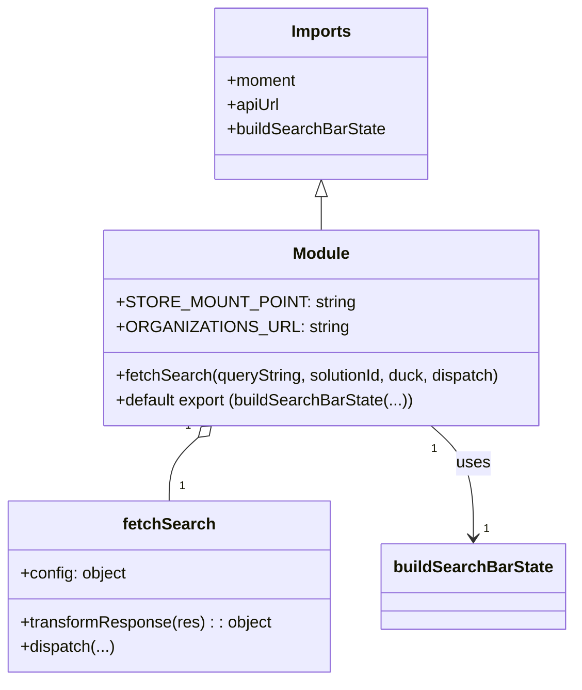

# Diagram: web/portal/src/modules/header-bar/HeaderSearchBarState.js


> Auto-generated by Obscura crawlers

## Diagram 1

```mermaid
flowchart TD
    A[import: moment, apiUrl, buildSearchBarState] --> B[const: STORE_MOUNT_POINT = "headerSearchBar"]
    A --> C[const: ORGANIZATIONS_URL = apiUrl("/iam/organizations")]
    B --> D[fetchSearch(queryString, solutionId, duck, dispatch)]
    C --> D
    D --> E{build config}
    E --> F[headers: Accept, x-time-zone (moment.tz.guess())]
    D --> G[transformResponse(res) -> {meta, data}]
    D --> H[dispatch(duck.fetch(ORGANIZATIONS_URL, config, transformResponse))]
    H --> I[export default buildSearchBarState(STORE_MOUNT_POINT, [], null, fetchSearch)]
```

> SVG rendering failed for this diagram.

## Diagram 2



### SVG

<svg id="container" width="555.3515625" xmlns="http://www.w3.org/2000/svg" class="classDiagram" height="668" viewBox="0 0 555.3515625 668" role="graphics-document document" aria-roledescription="class"><style>#container{font-family:"trebuchet ms",verdana,arial,sans-serif;font-size:16px;fill:#333;}@keyframes edge-animation-frame{from{stroke-dashoffset:0;}}@keyframes dash{to{stroke-dashoffset:0;}}#container .edge-animation-slow{stroke-dasharray:9,5!important;stroke-dashoffset:900;animation:dash 50s linear infinite;stroke-linecap:round;}#container .edge-animation-fast{stroke-dasharray:9,5!important;stroke-dashoffset:900;animation:dash 20s linear infinite;stroke-linecap:round;}#container .error-icon{fill:#552222;}#container .error-text{fill:#552222;stroke:#552222;}#container .edge-thickness-normal{stroke-width:1px;}#container .edge-thickness-thick{stroke-width:3.5px;}#container .edge-pattern-solid{stroke-dasharray:0;}#container .edge-thickness-invisible{stroke-width:0;fill:none;}#container .edge-pattern-dashed{stroke-dasharray:3;}#container .edge-pattern-dotted{stroke-dasharray:2;}#container .marker{fill:#333333;stroke:#333333;}#container .marker.cross{stroke:#333333;}#container svg{font-family:"trebuchet ms",verdana,arial,sans-serif;font-size:16px;}#container p{margin:0;}#container g.classGroup text{fill:#9370DB;stroke:none;font-family:"trebuchet ms",verdana,arial,sans-serif;font-size:10px;}#container g.classGroup text .title{font-weight:bolder;}#container .nodeLabel,#container .edgeLabel{color:#131300;}#container .edgeLabel .label rect{fill:#ECECFF;}#container .label text{fill:#131300;}#container .labelBkg{background:#ECECFF;}#container .edgeLabel .label span{background:#ECECFF;}#container .classTitle{font-weight:bolder;}#container .node rect,#container .node circle,#container .node ellipse,#container .node polygon,#container .node path{fill:#ECECFF;stroke:#9370DB;stroke-width:1px;}#container .divider{stroke:#9370DB;stroke-width:1;}#container g.clickable{cursor:pointer;}#container g.classGroup rect{fill:#ECECFF;stroke:#9370DB;}#container g.classGroup line{stroke:#9370DB;stroke-width:1;}#container .classLabel .box{stroke:none;stroke-width:0;fill:#ECECFF;opacity:0.5;}#container .classLabel .label{fill:#9370DB;font-size:10px;}#container .relation{stroke:#333333;stroke-width:1;fill:none;}#container .dashed-line{stroke-dasharray:3;}#container .dotted-line{stroke-dasharray:1 2;}#container #compositionStart,#container .composition{fill:#333333!important;stroke:#333333!important;stroke-width:1;}#container #compositionEnd,#container .composition{fill:#333333!important;stroke:#333333!important;stroke-width:1;}#container #dependencyStart,#container .dependency{fill:#333333!important;stroke:#333333!important;stroke-width:1;}#container #dependencyStart,#container .dependency{fill:#333333!important;stroke:#333333!important;stroke-width:1;}#container #extensionStart,#container .extension{fill:transparent!important;stroke:#333333!important;stroke-width:1;}#container #extensionEnd,#container .extension{fill:transparent!important;stroke:#333333!important;stroke-width:1;}#container #aggregationStart,#container .aggregation{fill:transparent!important;stroke:#333333!important;stroke-width:1;}#container #aggregationEnd,#container .aggregation{fill:transparent!important;stroke:#333333!important;stroke-width:1;}#container #lollipopStart,#container .lollipop{fill:#ECECFF!important;stroke:#333333!important;stroke-width:1;}#container #lollipopEnd,#container .lollipop{fill:#ECECFF!important;stroke:#333333!important;stroke-width:1;}#container .edgeTerminals{font-size:11px;line-height:initial;}#container .classTitleText{text-anchor:middle;font-size:18px;fill:#333;}#container .label-icon{display:inline-block;height:1em;overflow:visible;vertical-align:-0.125em;}#container .node .label-icon path{fill:currentColor;stroke:revert;stroke-width:revert;}#container :root{--mermaid-font-family:"trebuchet ms",verdana,arial,sans-serif;}</style><g><defs><marker id="container_class-aggregationStart" class="marker aggregation class" refX="18" refY="7" markerWidth="190" markerHeight="240" orient="auto"><path d="M 18,7 L9,13 L1,7 L9,1 Z"></path></marker></defs><defs><marker id="container_class-aggregationEnd" class="marker aggregation class" refX="1" refY="7" markerWidth="20" markerHeight="28" orient="auto"><path d="M 18,7 L9,13 L1,7 L9,1 Z"></path></marker></defs><defs><marker id="container_class-extensionStart" class="marker extension class" refX="18" refY="7" markerWidth="190" markerHeight="240" orient="auto"><path d="M 1,7 L18,13 V 1 Z"></path></marker></defs><defs><marker id="container_class-extensionEnd" class="marker extension class" refX="1" refY="7" markerWidth="20" markerHeight="28" orient="auto"><path d="M 1,1 V 13 L18,7 Z"></path></marker></defs><defs><marker id="container_class-compositionStart" class="marker composition class" refX="18" refY="7" markerWidth="190" markerHeight="240" orient="auto"><path d="M 18,7 L9,13 L1,7 L9,1 Z"></path></marker></defs><defs><marker id="container_class-compositionEnd" class="marker composition class" refX="1" refY="7" markerWidth="20" markerHeight="28" orient="auto"><path d="M 18,7 L9,13 L1,7 L9,1 Z"></path></marker></defs><defs><marker id="container_class-dependencyStart" class="marker dependency class" refX="6" refY="7" markerWidth="190" markerHeight="240" orient="auto"><path d="M 5,7 L9,13 L1,7 L9,1 Z"></path></marker></defs><defs><marker id="container_class-dependencyEnd" class="marker dependency class" refX="13" refY="7" markerWidth="20" markerHeight="28" orient="auto"><path d="M 18,7 L9,13 L14,7 L9,1 Z"></path></marker></defs><defs><marker id="container_class-lollipopStart" class="marker lollipop class" refX="13" refY="7" markerWidth="190" markerHeight="240" orient="auto"><circle stroke="black" fill="transparent" cx="7" cy="7" r="6"></circle></marker></defs><defs><marker id="container_class-lollipopEnd" class="marker lollipop class" refX="1" refY="7" markerWidth="190" markerHeight="240" orient="auto"><circle stroke="black" fill="transparent" cx="7" cy="7" r="6"></circle></marker></defs><g class="root"><g class="clusters"></g><g class="edgePaths"><path d="M312.717,193.25L312.717,194.542C312.717,195.833,312.717,198.417,312.717,203.875C312.717,209.333,312.717,217.667,312.717,221.833L312.717,226" id="id_Imports_Module_1" class="edge-thickness-normal edge-pattern-solid relation" style=";;;" data-edge="true" data-et="edge" data-id="id_Imports_Module_1" data-points="W3sieCI6MzEyLjcxNjc5Njg3NSwieSI6MTc2fSx7IngiOjMxMi43MTY3OTY4NzUsInkiOjIwMX0seyJ4IjozMTIuNzE2Nzk2ODc1LCJ5IjoyMjZ9XQ==" marker-start="url(#container_class-extensionStart)"></path><path d="M193.563,429.559L188.866,433.799C184.168,438.039,174.774,446.52,170.076,456.926C165.379,467.333,165.379,479.667,165.379,485.833L165.379,492" id="id_Module_fetchSearch_2" class="edge-thickness-normal edge-pattern-solid relation" style=";;;" data-edge="true" data-et="edge" data-id="id_Module_fetchSearch_2" data-points="W3sieCI6MjA2LjM2NzY0MjczOTY2MTY1LCJ5Ijo0MTh9LHsieCI6MTY1LjM3ODkwNjI1LCJ5Ijo0NTV9LHsieCI6MTY1LjM3ODkwNjI1LCJ5Ijo0OTJ9XQ==" marker-start="url(#container_class-aggregationStart)"></path><path d="M419.066,418L425.897,424.167C432.729,430.333,446.392,442.667,453.223,461C460.055,479.333,460.055,503.667,460.055,515.833L460.055,528" id="id_Module_buildSearchBarState_3" class="edge-thickness-normal edge-pattern-solid relation" style=";;;" data-edge="true" data-et="edge" data-id="id_Module_buildSearchBarState_3" data-points="W3sieCI6NDE5LjA2NTk1MTAxMDMzODQsInkiOjQxOH0seyJ4Ijo0NjAuMDU0Njg3NSwieSI6NDU1fSx7IngiOjQ2MC4wNTQ2ODc1LCJ5Ijo1MzR9XQ==" marker-end="url(#container_class-dependencyEnd)"></path></g><g class="edgeLabels"><g class="edgeLabel"><g class="label" data-id="id_Imports_Module_1" transform="translate(0, 0)"><foreignObject width="0" height="0"><div xmlns="http://www.w3.org/1999/xhtml" class="labelBkg" style="display: table-cell; white-space: nowrap; line-height: 1.5; max-width: 200px; text-align: center;"><span class="edgeLabel"></span></div></foreignObject></g></g><g class="edgeLabel"><g class="label" data-id="id_Module_fetchSearch_2" transform="translate(0, 0)"><foreignObject width="0" height="0"><div xmlns="http://www.w3.org/1999/xhtml" class="labelBkg" style="display: table-cell; white-space: nowrap; line-height: 1.5; max-width: 200px; text-align: center;"><span class="edgeLabel"></span></div></foreignObject></g></g><g class="edgeLabel" transform="translate(460.0546875, 455)"><g class="label" data-id="id_Module_buildSearchBarState_3" transform="translate(-16.4921875, -12)"><foreignObject width="32.984375" height="24"><div xmlns="http://www.w3.org/1999/xhtml" class="labelBkg" style="display: table-cell; white-space: nowrap; line-height: 1.5; max-width: 200px; text-align: center;"><span class="edgeLabel"><p>uses</p></span></div></foreignObject></g></g><g class="edgeTerminals" transform="translate(183.32637622622246, 418.591632238198)"><g class="inner" transform="translate(0, 0)"><foreignObject style="width: 9px; height: 12px;"><div xmlns="http://www.w3.org/1999/xhtml" style="display: inline-block; padding-right: 1px; white-space: nowrap;"><span class="edgeLabel">1</span></div></foreignObject></g></g><g class="edgeTerminals" transform="translate(422.00524169385807, 440.86067896444945)"><g class="inner" transform="translate(0, 0)"><foreignObject style="width: 9px; height: 12px;"><div xmlns="http://www.w3.org/1999/xhtml" style="display: inline-block; padding-right: 1px; white-space: nowrap;"><span class="edgeLabel">1</span></div></foreignObject></g></g><g class="edgeTerminals" transform="translate(175.37890812499992, 469.50000160714285)"><g class="inner" transform="translate(0, 0)"></g><foreignObject style="width: 9px; height: 12px;"><div xmlns="http://www.w3.org/1999/xhtml" style="display: inline-block; padding-right: 1px; white-space: nowrap;"><span class="edgeLabel">1</span></div></foreignObject></g><g class="edgeTerminals" transform="translate(470.0546887499999, 511.5000010714285)"><g class="inner" transform="translate(0, 0)"></g><foreignObject style="width: 9px; height: 12px;"><div xmlns="http://www.w3.org/1999/xhtml" style="display: inline-block; padding-right: 1px; white-space: nowrap;"><span class="edgeLabel">1</span></div></foreignObject></g></g><g class="nodes"><g class="node default" id="classId-Module-0" transform="translate(312.716796875, 322)"><g class="basic label-container"><path d="M-217.109375 -96 L217.109375 -96 L217.109375 96 L-217.109375 96" stroke="none" stroke-width="0" fill="#ECECFF" style=""></path><path d="M-217.109375 -96 C-98.11488004941381 -96, 20.879614901172374 -96, 217.109375 -96 M-217.109375 -96 C-83.33850064903166 -96, 50.43237370193668 -96, 217.109375 -96 M217.109375 -96 C217.109375 -48.08328168939195, 217.109375 -0.1665633787839056, 217.109375 96 M217.109375 -96 C217.109375 -46.28648726548657, 217.109375 3.4270254690268587, 217.109375 96 M217.109375 96 C64.51393473004029 96, -88.08150553991942 96, -217.109375 96 M217.109375 96 C108.9297602631156 96, 0.7501455262311936 96, -217.109375 96 M-217.109375 96 C-217.109375 48.94861211443696, -217.109375 1.8972242288739238, -217.109375 -96 M-217.109375 96 C-217.109375 24.505185895237588, -217.109375 -46.989628209524824, -217.109375 -96" stroke="#9370DB" stroke-width="1.3" fill="none" stroke-dasharray="0 0" style=""></path></g><g class="annotation-group text" transform="translate(0, -72)"></g><g class="label-group text" transform="translate(-27.09375, -72)"><g class="label" style="font-weight: bolder" transform="translate(0,-12)"><foreignObject width="54.1875" height="24"><div xmlns="http://www.w3.org/1999/xhtml" style="display: table-cell; white-space: nowrap; line-height: 1.5; max-width: 104px; text-align: center;"><span class="nodeLabel markdown-node-label" style=""><p>Module</p></span></div></foreignObject></g></g><g class="members-group text" transform="translate(-205.109375, -24)"><g class="label" style="" transform="translate(0,-12)"><foreignObject width="215.09375" height="24"><div xmlns="http://www.w3.org/1999/xhtml" style="display: table-cell; white-space: nowrap; line-height: 1.5; max-width: 273px; text-align: center;"><span class="nodeLabel markdown-node-label" style=""><p>+STORE_MOUNT_POINT: string</p></span></div></foreignObject></g><g class="label" style="" transform="translate(0,12)"><foreignObject width="209.25" height="24"><div xmlns="http://www.w3.org/1999/xhtml" style="display: table-cell; white-space: nowrap; line-height: 1.5; max-width: 267px; text-align: center;"><span class="nodeLabel markdown-node-label" style=""><p>+ORGANIZATIONS_URL: string</p></span></div></foreignObject></g></g><g class="methods-group text" transform="translate(-205.109375, 48)"><g class="label" style="" transform="translate(0,-12)"><foreignObject width="383.125" height="24"><div xmlns="http://www.w3.org/1999/xhtml" style="display: table-cell; white-space: nowrap; line-height: 1.5; max-width: 440px; text-align: center;"><span class="nodeLabel markdown-node-label" style=""><p>+fetchSearch(queryString, solutionId, duck, dispatch)</p></span></div></foreignObject></g><g class="label" style="" transform="translate(0,12)"><foreignObject width="295.796875" height="24"><div xmlns="http://www.w3.org/1999/xhtml" style="display: table-cell; white-space: nowrap; line-height: 1.5; max-width: 353px; text-align: center;"><span class="nodeLabel markdown-node-label" style=""><p>+default export (buildSearchBarState(...))</p></span></div></foreignObject></g></g><g class="divider" style=""><path d="M-217.109375 -48 C-49.90850364278688 -48, 117.29236771442623 -48, 217.109375 -48 M-217.109375 -48 C-122.74593180154719 -48, -28.382488603094373 -48, 217.109375 -48" stroke="#9370DB" stroke-width="1.3" fill="none" stroke-dasharray="0 0" style=""></path></g><g class="divider" style=""><path d="M-217.109375 24 C-63.9058685928681 24, 89.2976378142638 24, 217.109375 24 M-217.109375 24 C-49.224367363875075 24, 118.66064027224985 24, 217.109375 24" stroke="#9370DB" stroke-width="1.3" fill="none" stroke-dasharray="0 0" style=""></path></g></g><g class="node default" id="classId-Imports-1" transform="translate(312.716796875, 92)"><g class="basic label-container"><path d="M-104.4375 -84 L104.4375 -84 L104.4375 84 L-104.4375 84" stroke="none" stroke-width="0" fill="#ECECFF" style=""></path><path d="M-104.4375 -84 C-34.90125971378478 -84, 34.634980572430436 -84, 104.4375 -84 M-104.4375 -84 C-55.759063289255266 -84, -7.0806265785105325 -84, 104.4375 -84 M104.4375 -84 C104.4375 -28.53158234581616, 104.4375 26.936835308367677, 104.4375 84 M104.4375 -84 C104.4375 -43.82636591394932, 104.4375 -3.6527318278986343, 104.4375 84 M104.4375 84 C33.11311358988151 84, -38.211272820236985 84, -104.4375 84 M104.4375 84 C61.15421459823378 84, 17.870929196467557 84, -104.4375 84 M-104.4375 84 C-104.4375 27.903726411098106, -104.4375 -28.19254717780379, -104.4375 -84 M-104.4375 84 C-104.4375 29.49553939802808, -104.4375 -25.008921203943842, -104.4375 -84" stroke="#9370DB" stroke-width="1.3" fill="none" stroke-dasharray="0 0" style=""></path></g><g class="annotation-group text" transform="translate(0, -60)"></g><g class="label-group text" transform="translate(-28.71875, -60)"><g class="label" style="font-weight: bolder" transform="translate(0,-12)"><foreignObject width="57.4375" height="24"><div xmlns="http://www.w3.org/1999/xhtml" style="display: table-cell; white-space: nowrap; line-height: 1.5; max-width: 107px; text-align: center;"><span class="nodeLabel markdown-node-label" style=""><p>Imports</p></span></div></foreignObject></g></g><g class="members-group text" transform="translate(-92.4375, -12)"><g class="label" style="" transform="translate(0,-12)"><foreignObject width="68.625" height="24"><div xmlns="http://www.w3.org/1999/xhtml" style="display: table-cell; white-space: nowrap; line-height: 1.5; max-width: 126px; text-align: center;"><span class="nodeLabel markdown-node-label" style=""><p>+moment</p></span></div></foreignObject></g><g class="label" style="" transform="translate(0,12)"><foreignObject width="51.921875" height="24"><div xmlns="http://www.w3.org/1999/xhtml" style="display: table-cell; white-space: nowrap; line-height: 1.5; max-width: 110px; text-align: center;"><span class="nodeLabel markdown-node-label" style=""><p>+apiUrl</p></span></div></foreignObject></g><g class="label" style="" transform="translate(0,36)"><foreignObject width="156.15625" height="24"><div xmlns="http://www.w3.org/1999/xhtml" style="display: table-cell; white-space: nowrap; line-height: 1.5; max-width: 214px; text-align: center;"><span class="nodeLabel markdown-node-label" style=""><p>+buildSearchBarState</p></span></div></foreignObject></g></g><g class="methods-group text" transform="translate(-92.4375, 84)"></g><g class="divider" style=""><path d="M-104.4375 -36 C-22.29907996383207 -36, 59.83934007233586 -36, 104.4375 -36 M-104.4375 -36 C-34.15532750264585 -36, 36.12684499470831 -36, 104.4375 -36" stroke="#9370DB" stroke-width="1.3" fill="none" stroke-dasharray="0 0" style=""></path></g><g class="divider" style=""><path d="M-104.4375 60 C-37.82485837920042 60, 28.787783241599158 60, 104.4375 60 M-104.4375 60 C-51.42926813809089 60, 1.5789637238182195 60, 104.4375 60" stroke="#9370DB" stroke-width="1.3" fill="none" stroke-dasharray="0 0" style=""></path></g></g><g class="node default" id="classId-fetchSearch-2" transform="translate(165.37890625, 576)"><g class="basic label-container"><path d="M-157.37890625 -84 L157.37890625 -84 L157.37890625 84 L-157.37890625 84" stroke="none" stroke-width="0" fill="#ECECFF" style=""></path><path d="M-157.37890625 -84 C-37.36085071021334 -84, 82.65720482957332 -84, 157.37890625 -84 M-157.37890625 -84 C-47.67459152495954 -84, 62.02972320008092 -84, 157.37890625 -84 M157.37890625 -84 C157.37890625 -17.538198809994185, 157.37890625 48.92360238001163, 157.37890625 84 M157.37890625 -84 C157.37890625 -33.408450052042255, 157.37890625 17.18309989591549, 157.37890625 84 M157.37890625 84 C36.82380078722622 84, -83.73130467554756 84, -157.37890625 84 M157.37890625 84 C58.60531126912386 84, -40.16828371175228 84, -157.37890625 84 M-157.37890625 84 C-157.37890625 49.66747708036939, -157.37890625 15.334954160738775, -157.37890625 -84 M-157.37890625 84 C-157.37890625 26.90120197729007, -157.37890625 -30.197596045419857, -157.37890625 -84" stroke="#9370DB" stroke-width="1.3" fill="none" stroke-dasharray="0 0" style=""></path></g><g class="annotation-group text" transform="translate(0, -60)"></g><g class="label-group text" transform="translate(-43.2890625, -60)"><g class="label" style="font-weight: bolder" transform="translate(0,-12)"><foreignObject width="86.578125" height="24"><div xmlns="http://www.w3.org/1999/xhtml" style="display: table-cell; white-space: nowrap; line-height: 1.5; max-width: 135px; text-align: center;"><span class="nodeLabel markdown-node-label" style=""><p>fetchSearch</p></span></div></foreignObject></g></g><g class="members-group text" transform="translate(-145.37890625, -12)"><g class="label" style="" transform="translate(0,-12)"><foreignObject width="105.109375" height="24"><div xmlns="http://www.w3.org/1999/xhtml" style="display: table-cell; white-space: nowrap; line-height: 1.5; max-width: 163px; text-align: center;"><span class="nodeLabel markdown-node-label" style=""><p>+config: object</p></span></div></foreignObject></g></g><g class="methods-group text" transform="translate(-145.37890625, 36)"><g class="label" style="" transform="translate(0,-12)"><foreignObject width="247.46875" height="24"><div xmlns="http://www.w3.org/1999/xhtml" style="display: table-cell; white-space: nowrap; line-height: 1.5; max-width: 305px; text-align: center;"><span class="nodeLabel markdown-node-label" style=""><p>+transformResponse(res) : : object</p></span></div></foreignObject></g><g class="label" style="" transform="translate(0,12)"><foreignObject width="92.046875" height="24"><div xmlns="http://www.w3.org/1999/xhtml" style="display: table-cell; white-space: nowrap; line-height: 1.5; max-width: 149px; text-align: center;"><span class="nodeLabel markdown-node-label" style=""><p>+dispatch(...)</p></span></div></foreignObject></g></g><g class="divider" style=""><path d="M-157.37890625 -36 C-61.919376470522025 -36, 33.54015330895595 -36, 157.37890625 -36 M-157.37890625 -36 C-82.036848835673 -36, -6.694791421345997 -36, 157.37890625 -36" stroke="#9370DB" stroke-width="1.3" fill="none" stroke-dasharray="0 0" style=""></path></g><g class="divider" style=""><path d="M-157.37890625 12 C-64.17326785598824 12, 29.032370538023514 12, 157.37890625 12 M-157.37890625 12 C-67.6554515471749 12, 22.06800315565019 12, 157.37890625 12" stroke="#9370DB" stroke-width="1.3" fill="none" stroke-dasharray="0 0" style=""></path></g></g><g class="node default" id="classId-buildSearchBarState-3" transform="translate(460.0546875, 576)"><g class="basic label-container"><path d="M-87.296875 -42 L87.296875 -42 L87.296875 42 L-87.296875 42" stroke="none" stroke-width="0" fill="#ECECFF" style=""></path><path d="M-87.296875 -42 C-51.2320066884418 -42, -15.1671383768836 -42, 87.296875 -42 M-87.296875 -42 C-42.04164707748576 -42, 3.213580845028474 -42, 87.296875 -42 M87.296875 -42 C87.296875 -23.056252598773792, 87.296875 -4.112505197547584, 87.296875 42 M87.296875 -42 C87.296875 -8.587377606209635, 87.296875 24.82524478758073, 87.296875 42 M87.296875 42 C43.45743936916253 42, -0.38199626167494216 42, -87.296875 42 M87.296875 42 C40.42692123603496 42, -6.443032527930086 42, -87.296875 42 M-87.296875 42 C-87.296875 23.927594018021573, -87.296875 5.855188036043145, -87.296875 -42 M-87.296875 42 C-87.296875 16.13899603132279, -87.296875 -9.72200793735442, -87.296875 -42" stroke="#9370DB" stroke-width="1.3" fill="none" stroke-dasharray="0 0" style=""></path></g><g class="annotation-group text" transform="translate(0, -18)"></g><g class="label-group text" transform="translate(-75.296875, -18)"><g class="label" style="font-weight: bolder" transform="translate(0,-12)"><foreignObject width="150.59375" height="24"><div xmlns="http://www.w3.org/1999/xhtml" style="display: table-cell; white-space: nowrap; line-height: 1.5; max-width: 198px; text-align: center;"><span class="nodeLabel markdown-node-label" style=""><p>buildSearchBarState</p></span></div></foreignObject></g></g><g class="members-group text" transform="translate(-75.296875, 30)"></g><g class="methods-group text" transform="translate(-75.296875, 60)"></g><g class="divider" style=""><path d="M-87.296875 6 C-38.2957857247443 6, 10.705303550511402 6, 87.296875 6 M-87.296875 6 C-17.579135839743543 6, 52.138603320512914 6, 87.296875 6" stroke="#9370DB" stroke-width="1.3" fill="none" stroke-dasharray="0 0" style=""></path></g><g class="divider" style=""><path d="M-87.296875 24 C-20.28490365657042 24, 46.72706768685916 24, 87.296875 24 M-87.296875 24 C-27.371032984349313 24, 32.554809031301374 24, 87.296875 24" stroke="#9370DB" stroke-width="1.3" fill="none" stroke-dasharray="0 0" style=""></path></g></g></g></g></g></svg>
