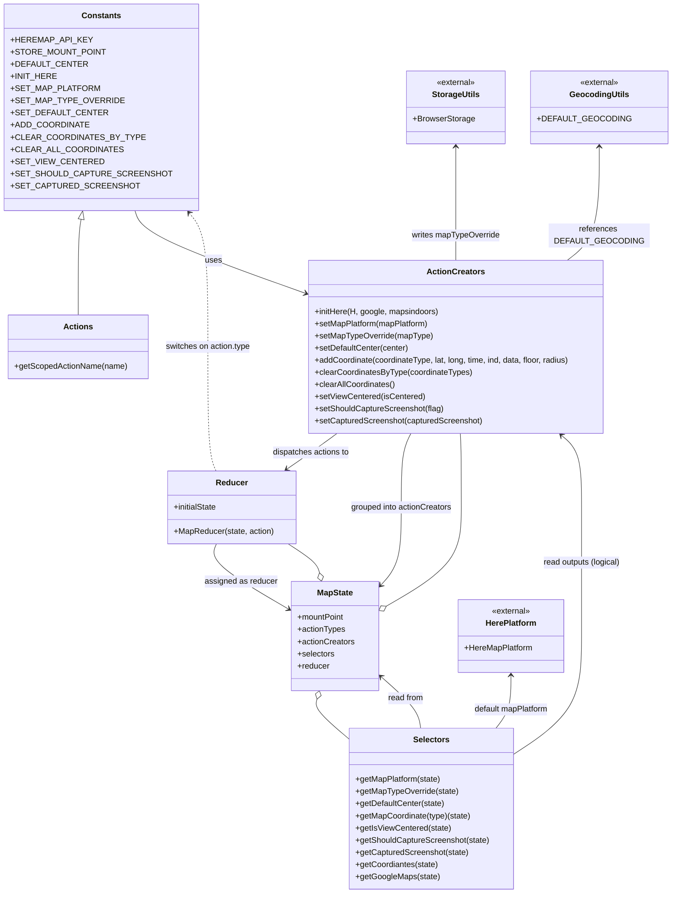

# Diagram: web/portal/src/modules/map/MapState.js

> Auto-generated by Obscura crawlers

## Mermaid

### SVG

<svg id="container" width="1297.951171875" xmlns="http://www.w3.org/2000/svg" class="classDiagram" height="1764" viewBox="0 0 1297.951171875 1764" role="graphics-document document" aria-roledescription="class"><g><defs><marker id="container_class-aggregationStart" class="marker aggregation class" refX="18" refY="7" markerWidth="190" markerHeight="240" orient="auto"><path d="M 18,7 L9,13 L1,7 L9,1 Z"></path></marker></defs><defs><marker id="container_class-aggregationEnd" class="marker aggregation class" refX="1" refY="7" markerWidth="20" markerHeight="28" orient="auto"><path d="M 18,7 L9,13 L1,7 L9,1 Z"></path></marker></defs><defs><marker id="container_class-extensionStart" class="marker extension class" refX="18" refY="7" markerWidth="190" markerHeight="240" orient="auto"><path d="M 1,7 L18,13 V 1 Z"></path></marker></defs><defs><marker id="container_class-extensionEnd" class="marker extension class" refX="1" refY="7" markerWidth="20" markerHeight="28" orient="auto"><path d="M 1,1 V 13 L18,7 Z"></path></marker></defs><defs><marker id="container_class-compositionStart" class="marker composition class" refX="18" refY="7" markerWidth="190" markerHeight="240" orient="auto"><path d="M 18,7 L9,13 L1,7 L9,1 Z"></path></marker></defs><defs><marker id="container_class-compositionEnd" class="marker composition class" refX="1" refY="7" markerWidth="20" markerHeight="28" orient="auto"><path d="M 18,7 L9,13 L1,7 L9,1 Z"></path></marker></defs><defs><marker id="container_class-dependencyStart" class="marker dependency class" refX="6" refY="7" markerWidth="190" markerHeight="240" orient="auto"><path d="M 5,7 L9,13 L1,7 L9,1 Z"></path></marker></defs><defs><marker id="container_class-dependencyEnd" class="marker dependency class" refX="13" refY="7" markerWidth="20" markerHeight="28" orient="auto"><path d="M 18,7 L9,13 L14,7 L9,1 Z"></path></marker></defs><defs><marker id="container_class-lollipopStart" class="marker lollipop class" refX="13" refY="7" markerWidth="190" markerHeight="240" orient="auto"><circle stroke="black" fill="transparent" cx="7" cy="7" r="6"></circle></marker></defs><defs><marker id="container_class-lollipopEnd" class="marker lollipop class" refX="1" refY="7" markerWidth="190" markerHeight="240" orient="auto"><circle stroke="black" fill="transparent" cx="7" cy="7" r="6"></circle></marker></defs><g class="root"><g class="clusters"></g><g class="edgePaths"><path d="M151.872,432.845L150.69,438.204C149.507,443.563,147.142,454.282,145.96,485.807C144.777,517.333,144.777,569.667,144.777,595.833L144.777,622" id="id_Constants_Actions_1" class="edge-thickness-normal edge-pattern-solid relation" style=";;;" data-edge="true" data-et="edge" data-id="id_Constants_Actions_1" data-points="W3sieCI6MTU1LjU4OTE0ODk2MjQ1MDYsInkiOjQxNn0seyJ4IjoxNDQuNzc3MzQzNzUsInkiOjQ2NX0seyJ4IjoxNDQuNzc3MzQzNzUsInkiOjYyMn1d" marker-start="url(#container_class-extensionStart)"></path><path d="M259.074,416L261.415,424.167C263.756,432.333,268.438,448.667,326.025,476.072C383.613,503.477,494.107,541.955,549.354,561.193L604.601,580.432" id="id_Constants_ActionCreators_2" class="edge-thickness-normal edge-pattern-solid relation" style=";;;" data-edge="true" data-et="edge" data-id="id_Constants_ActionCreators_2" data-points="W3sieCI6MjU5LjA3NDIzNDE4OTcyMzMsInkiOjQxNn0seyJ4IjoyNzMuMTE5MTQwNjI1LCJ5Ijo0NjV9LHsieCI6NjEwLjI2NzU3ODEyNSwieSI6NTgyLjQwNTMzNzIyNDU0NDN9XQ==" marker-end="url(#container_class-dependencyEnd)"></path><path d="M904.885,290L904.885,319.167C904.885,348.333,904.885,406.667,904.885,444C904.885,481.333,904.885,497.667,904.885,505.833L904.885,514" id="id_StorageUtils_ActionCreators_3" class="edge-thickness-normal edge-pattern-solid relation" style=";;;" data-edge="true" data-et="edge" data-id="id_StorageUtils_ActionCreators_3" data-points="W3sieCI6OTA0Ljg4NDc2NTYyNSwieSI6Mjg0fSx7IngiOjkwNC44ODQ3NjU2MjUsInkiOjQ2NX0seyJ4Ijo5MDQuODg0NzY1NjI1LCJ5Ijo1MTR9XQ==" marker-start="url(#container_class-dependencyStart)"></path><path d="M1169.92,290L1169.92,319.167C1169.92,348.333,1169.92,406.667,1160.081,444C1150.243,481.333,1130.566,497.667,1120.728,505.833L1110.889,514" id="id_GeocodingUtils_ActionCreators_4" class="edge-thickness-normal edge-pattern-solid relation" style=";;;" data-edge="true" data-et="edge" data-id="id_GeocodingUtils_ActionCreators_4" data-points="W3sieCI6MTE2OS45MTk5MjE4NzUsInkiOjI4NH0seyJ4IjoxMTY5LjkxOTkyMTg3NSwieSI6NDY1fSx7IngiOjExMTAuODg5MzY0MzQ2NTkwOCwieSI6NTE0fV0=" marker-start="url(#container_class-dependencyStart)"></path><path d="M1007.059,1334L1007.059,1345.167C1007.059,1356.333,1007.059,1378.667,1002.363,1396C997.667,1413.333,988.275,1425.667,983.579,1431.833L978.883,1438" id="id_HerePlatform_Selectors_5" class="edge-thickness-normal edge-pattern-solid relation" style=";;;" data-edge="true" data-et="edge" data-id="id_HerePlatform_Selectors_5" data-points="W3sieCI6MTAwNy4wNTg1OTM3NSwieSI6MTMyOH0seyJ4IjoxMDA3LjA1ODU5Mzc1LCJ5IjoxNDAxfSx7IngiOjk3OC44ODM0ODAxNDk4NzI0LCJ5IjoxNDM4fV0=" marker-start="url(#container_class-dependencyStart)"></path><path d="M661.405,856L652.625,862.167C643.844,868.333,626.284,880.667,609.353,892.434C592.423,904.201,576.123,915.401,567.973,921.002L559.823,926.602" id="id_ActionCreators_Reducer_6" class="edge-thickness-normal edge-pattern-solid relation" style=";;;" data-edge="true" data-et="edge" data-id="id_ActionCreators_Reducer_6" data-points="W3sieCI6NjYxLjQwNTMzOTE2NzY2ODIsInkiOjg1Nn0seyJ4Ijo2MDguNzIyNjU2MjUsInkiOjg5M30seyJ4Ijo1NTQuODc3NDcyNzYzNzYxNSwieSI6OTMwfV0=" marker-end="url(#container_class-dependencyEnd)"></path><path d="M828.46,1438L827.322,1431.833C826.184,1425.667,823.907,1413.333,810.582,1396.361C797.257,1379.388,772.883,1357.777,760.696,1346.971L748.509,1336.165" id="id_Selectors_MapState_7" class="edge-thickness-normal edge-pattern-solid relation" style=";;;" data-edge="true" data-et="edge" data-id="id_Selectors_MapState_7" data-points="W3sieCI6ODI4LjQ1OTk2MDkzNzUsInkiOjE0Mzh9LHsieCI6ODIxLjYzMDg1OTM3NSwieSI6MTQwMX0seyJ4Ijo3NDQuMDE5NTMxMjUsInkiOjEzMzIuMTg0MzU2Njc0NTA5NH1d" marker-end="url(#container_class-dependencyEnd)"></path><path d="M419.738,1074L417.138,1080.167C414.538,1086.333,409.337,1098.667,433.875,1120.328C458.413,1141.989,512.689,1172.978,539.827,1188.473L566.965,1203.968" id="id_Reducer_MapState_8" class="edge-thickness-normal edge-pattern-solid relation" style=";;;" data-edge="true" data-et="edge" data-id="id_Reducer_MapState_8" data-points="W3sieCI6NDE5LjczODEzNzkwMTM3NjE1LCJ5IjoxMDc0fSx7IngiOjQwNC4xMzY3MTg3NSwieSI6MTExMX0seyJ4Ijo1NzIuMTc1NzgxMjUsInkiOjEyMDYuOTQyNTY2MjE2NTA3Mn1d" marker-end="url(#container_class-dependencyEnd)"></path><path d="M808.586,856L805.114,862.167C801.641,868.333,794.695,880.667,791.223,905C787.75,929.333,787.75,965.667,787.75,1002C787.75,1038.333,787.75,1074.667,781.128,1100.239C774.506,1125.811,761.263,1140.623,754.641,1148.029L748.019,1155.434" id="id_ActionCreators_MapState_9" class="edge-thickness-normal edge-pattern-solid relation" style=";;;" data-edge="true" data-et="edge" data-id="id_ActionCreators_MapState_9" data-points="W3sieCI6ODA4LjU4NjQ3MjczMTM3MDIsInkiOjg1Nn0seyJ4Ijo3ODcuNzUsInkiOjg5M30seyJ4Ijo3ODcuNzUsInkiOjEwMDJ9LHsieCI6Nzg3Ljc1LCJ5IjoxMTExfSx7IngiOjc0NC4wMTk1MzEyNSwieSI6MTE1OS45MDcwODMyNDU0NTgxfV0=" marker-end="url(#container_class-dependencyEnd)"></path><path d="M1019.541,1487.1L1040.659,1472.75C1061.777,1458.4,1104.014,1429.7,1125.132,1391.183C1146.25,1352.667,1146.25,1304.333,1146.25,1256C1146.25,1207.667,1146.25,1159.333,1146.25,1117C1146.25,1074.667,1146.25,1038.333,1146.25,1002C1146.25,965.667,1146.25,929.333,1139.852,905.653C1133.453,881.972,1120.657,870.945,1114.258,865.431L1107.86,859.917" id="id_Selectors_ActionCreators_10" class="edge-thickness-normal edge-pattern-solid relation" style=";;;" data-edge="true" data-et="edge" data-id="id_Selectors_ActionCreators_10" data-points="W3sieCI6MTAxOS41NDEwMTU2MjUsInkiOjE0ODcuMDk5OTU3MzQxMDYxNn0seyJ4IjoxMTQ2LjI1LCJ5IjoxNDAxfSx7IngiOjExNDYuMjUsInkiOjEyNTZ9LHsieCI6MTE0Ni4yNSwieSI6MTExMX0seyJ4IjoxMTQ2LjI1LCJ5IjoxMDAyfSx7IngiOjExNDYuMjUsInkiOjg5M30seyJ4IjoxMTAzLjMxNDgzODExNTk4NTYsInkiOjg1Nn1d" marker-end="url(#container_class-dependencyEnd)"></path><path d="M417.971,930L415.219,923.833C412.467,917.667,406.964,905.333,404.213,864.5C401.461,823.667,401.461,754.333,401.461,683C401.461,611.667,401.461,538.333,395.599,494.283C389.737,450.233,378.014,435.466,372.152,428.083L366.29,420.699" id="id_Reducer_Constants_11" class="edge-thickness-normal edge-pattern-dashed relation" style=";;;" data-edge="true" data-et="edge" data-id="id_Reducer_Constants_11" data-points="W3sieCI6NDE3Ljk3MDY0OTM2OTI2NjEsInkiOjkzMH0seyJ4Ijo0MDEuNDYwOTM3NSwieSI6ODkzfSx7IngiOjQwMS40NjA5Mzc1LCJ5Ijo2ODV9LHsieCI6NDAxLjQ2MDkzNzUsInkiOjQ2NX0seyJ4IjozNjIuNTU5MzE5NDE2OTk2MDYsInkiOjQxNn1d" marker-end="url(#container_class-dependencyEnd)"></path><path d="M629.771,1131.178L629.007,1127.815C628.244,1124.452,626.718,1117.726,616.049,1108.196C605.38,1098.667,585.568,1086.333,575.662,1080.167L565.756,1074" id="id_MapState_Reducer_12" class="edge-thickness-normal edge-pattern-solid relation" style=";;;" data-edge="true" data-et="edge" data-id="id_MapState_Reducer_12" data-points="W3sieCI6NjMzLjU4ODE3MzQ5MTM3OTMsInkiOjExNDh9LHsieCI6NjI1LjE5MTQwNjI1LCJ5IjoxMTExfSx7IngiOjU2NS43NTU5MTMxMzA3MzM5LCJ5IjoxMDc0fV0=" marker-start="url(#container_class-aggregationStart)"></path><path d="M758.936,1197.432L783.738,1183.027C808.541,1168.622,858.145,1139.811,882.948,1107.239C907.75,1074.667,907.75,1038.333,907.75,1002C907.75,965.667,907.75,929.333,907.665,905C907.58,880.667,907.41,868.333,907.325,862.167L907.24,856" id="id_MapState_ActionCreators_13" class="edge-thickness-normal edge-pattern-solid relation" style=";;;" data-edge="true" data-et="edge" data-id="id_MapState_ActionCreators_13" data-points="W3sieCI6NzQ0LjAxOTUzMTI1LCJ5IjoxMjA2LjA5NTkxNDYzMTI4NDF9LHsieCI6OTA3Ljc1LCJ5IjoxMTExfSx7IngiOjkwNy43NSwieSI6MTAwMn0seyJ4Ijo5MDcuNzUsInkiOjg5M30seyJ4Ijo5MDcuMjQwMzE4ODg1MjE2MywieSI6ODU2fV0=" marker-start="url(#container_class-aggregationStart)"></path><path d="M619.186,1380.464L618.116,1383.887C617.046,1387.309,614.906,1394.155,627.72,1408.683C640.535,1423.211,668.303,1445.423,682.188,1456.528L696.072,1467.634" id="id_MapState_Selectors_14" class="edge-thickness-normal edge-pattern-solid relation" style=";;;" data-edge="true" data-et="edge" data-id="id_MapState_Selectors_14" data-points="W3sieCI6NjI0LjMzMzEwODgzNjIwNjksInkiOjEzNjR9LHsieCI6NjEyLjc2NTYyNSwieSI6MTQwMX0seyJ4Ijo2OTYuMDcyMjY1NjI1LCJ5IjoxNDY3LjYzNDE1NzIyODE0MjZ9XQ==" marker-start="url(#container_class-aggregationStart)"></path></g><g class="edgeLabels"><g class="edgeLabel"><g class="label" data-id="id_Constants_Actions_1" transform="translate(0, 0)"><foreignObject width="0" height="0">

</foreignObject></g></g><g class="edgeLabel" transform="translate(417.6244, 515.32113)"><g class="label" data-id="id_Constants_ActionCreators_2" transform="translate(-16.4921875, -12)"><foreignObject width="32.984375" height="24">

uses

</foreignObject></g></g><g class="edgeLabel" transform="translate(904.884765625, 465)"><g class="label" data-id="id_StorageUtils_ActionCreators_3" transform="translate(-88.265625, -12)"><foreignObject width="176.53125" height="24">

writes mapTypeOverride

</foreignObject></g></g><g class="edgeLabel" transform="translate(1169.919921875, 465)"><g class="label" data-id="id_GeocodingUtils_ActionCreators_4" transform="translate(-100, -24)"><foreignObject width="200" height="48">

references DEFAULT_GEOCODING

</foreignObject></g></g><g class="edgeLabel" transform="translate(1007.05859375, 1401)"><g class="label" data-id="id_HerePlatform_Selectors_5" transform="translate(-75.296875, -12)"><foreignObject width="150.59375" height="24">

default mapPlatform

</foreignObject></g></g><g class="edgeLabel" transform="translate(608.72265625, 893)"><g class="label" data-id="id_ActionCreators_Reducer_6" transform="translate(-77.2734375, -12)"><foreignObject width="154.546875" height="24">

dispatches actions to

</foreignObject></g></g><g class="edgeLabel" transform="translate(796.90131, 1379.07305)"><g class="label" data-id="id_Selectors_MapState_7" transform="translate(-35.4453125, -12)"><foreignObject width="70.890625" height="24">

read from

</foreignObject></g></g><g class="edgeLabel" transform="translate(470.72064, 1149.01635)"><g class="label" data-id="id_Reducer_MapState_8" transform="translate(-71.921875, -12)"><foreignObject width="143.84375" height="24">

assigned as reducer

</foreignObject></g></g><g class="edgeLabel" transform="translate(787.75, 1002)"><g class="label" data-id="id_ActionCreators_MapState_9" transform="translate(-100, -24)"><foreignObject width="200" height="48">

grouped into actionCreators

</foreignObject></g></g><g class="edgeLabel" transform="translate(1146.25, 1111)"><g class="label" data-id="id_Selectors_ActionCreators_10" transform="translate(-77.6953125, -12)"><foreignObject width="155.390625" height="24">

read outputs (logical)

</foreignObject></g></g><g class="edgeLabel" transform="translate(401.4609375, 685)"><g class="label" data-id="id_Reducer_Constants_11" transform="translate(-84.90625, -12)"><foreignObject width="169.8125" height="24">

switches on action.type

</foreignObject></g></g><g class="edgeLabel"><g class="label" data-id="id_MapState_Reducer_12" transform="translate(0, 0)"><foreignObject width="0" height="0">

</foreignObject></g></g><g class="edgeLabel"><g class="label" data-id="id_MapState_ActionCreators_13" transform="translate(0, 0)"><foreignObject width="0" height="0">

</foreignObject></g></g><g class="edgeLabel"><g class="label" data-id="id_MapState_Selectors_14" transform="translate(0, 0)"><foreignObject width="0" height="0">

</foreignObject></g></g></g><g class="nodes"><g class="node default" id="classId-Constants-0" transform="translate(200.6015625, 212)"><g class="basic label-container"><path d="M-166.56640625 -204 L166.56640625 -204 L166.56640625 204 L-166.56640625 204" stroke="none" stroke-width="0" fill="#ECECFF" style=""></path><path d="M-166.56640625 -204 C-39.99698879009139 -204, 86.57242866981721 -204, 166.56640625 -204 M-166.56640625 -204 C-71.16266114918693 -204, 24.241083951626138 -204, 166.56640625 -204 M166.56640625 -204 C166.56640625 -67.98889960761954, 166.56640625 68.02220078476091, 166.56640625 204 M166.56640625 -204 C166.56640625 -42.0320597529109, 166.56640625 119.9358804941782, 166.56640625 204 M166.56640625 204 C37.44901998377699 204, -91.66836628244602 204, -166.56640625 204 M166.56640625 204 C36.78623889271762 204, -92.99392846456476 204, -166.56640625 204 M-166.56640625 204 C-166.56640625 61.632790225518534, -166.56640625 -80.73441954896293, -166.56640625 -204 M-166.56640625 204 C-166.56640625 63.01152941646626, -166.56640625 -77.97694116706748, -166.56640625 -204" stroke="#9370DB" stroke-width="1.3" fill="none" stroke-dasharray="0 0" style=""></path></g><g class="annotation-group text" transform="translate(0, -180)"></g><g class="label-group text" transform="translate(-36.5390625, -180)"><g class="label" style="font-weight: bolder" transform="translate(0,-12)"><foreignObject width="73.078125" height="24">

Constants

</foreignObject></g></g><g class="members-group text" transform="translate(-154.56640625, -132)"><g class="label" style="" transform="translate(0,-12)"><foreignObject width="141.515625" height="24">

+HEREMAP_API_KEY

</foreignObject></g><g class="label" style="" transform="translate(0,12)"><foreignObject width="166.03125" height="24">

+STORE_MOUNT_POINT

</foreignObject></g><g class="label" style="" transform="translate(0,36)"><foreignObject width="130.265625" height="24">

+DEFAULT_CENTER

</foreignObject></g><g class="label" style="" transform="translate(0,60)"><foreignObject width="81.828125" height="24">

+INIT_HERE

</foreignObject></g><g class="label" style="" transform="translate(0,84)"><foreignObject width="152.75" height="24">

+SET_MAP_PLATFORM

</foreignObject></g><g class="label" style="" transform="translate(0,108)"><foreignObject width="191.25" height="24">

+SET_MAP_TYPE_OVERRIDE

</foreignObject></g><g class="label" style="" transform="translate(0,132)"><foreignObject width="162.703125" height="24">

+SET_DEFAULT_CENTER

</foreignObject></g><g class="label" style="" transform="translate(0,156)"><foreignObject width="136.265625" height="24">

+ADD_COORDINATE

</foreignObject></g><g class="label" style="" transform="translate(0,180)"><foreignObject width="227.34375" height="24">

+CLEAR_COORDINATES_BY_TYPE

</foreignObject></g><g class="label" style="" transform="translate(0,204)"><foreignObject width="193.609375" height="24">

+CLEAR_ALL_COORDINATES

</foreignObject></g><g class="label" style="" transform="translate(0,228)"><foreignObject width="155.5625" height="24">

+SET_VIEW_CENTERED

</foreignObject></g><g class="label" style="" transform="translate(0,252)"><foreignObject width="272.59375" height="24">

+SET_SHOULD_CAPTURE_SCREENSHOT

</foreignObject></g><g class="label" style="" transform="translate(0,276)"><foreignObject width="215.375" height="24">

+SET_CAPTURED_SCREENSHOT

</foreignObject></g></g><g class="methods-group text" transform="translate(-154.56640625, 204)"></g><g class="divider" style=""><path d="M-166.56640625 -156 C-47.44497367806095 -156, 71.6764588938781 -156, 166.56640625 -156 M-166.56640625 -156 C-97.72452622187994 -156, -28.882646193759882 -156, 166.56640625 -156" stroke="#9370DB" stroke-width="1.3" fill="none" stroke-dasharray="0 0" style=""></path></g><g class="divider" style=""><path d="M-166.56640625 180 C-74.5771359842102 180, 17.412134281579597 180, 166.56640625 180 M-166.56640625 180 C-44.12323028615374 180, 78.31994567769252 180, 166.56640625 180" stroke="#9370DB" stroke-width="1.3" fill="none" stroke-dasharray="0 0" style=""></path></g></g><g class="node default" id="classId-Actions-1" transform="translate(144.77734375, 685)"><g class="basic label-container"><path d="M-136.77734375 -63 L136.77734375 -63 L136.77734375 63 L-136.77734375 63" stroke="none" stroke-width="0" fill="#ECECFF" style=""></path><path d="M-136.77734375 -63 C-58.35461409417688 -63, 20.068115561646238 -63, 136.77734375 -63 M-136.77734375 -63 C-50.38382695342477 -63, 36.009689843150454 -63, 136.77734375 -63 M136.77734375 -63 C136.77734375 -35.34241392908814, 136.77734375 -7.684827858176277, 136.77734375 63 M136.77734375 -63 C136.77734375 -36.259617803992924, 136.77734375 -9.519235607985856, 136.77734375 63 M136.77734375 63 C45.27409202566436 63, -46.22915969867128 63, -136.77734375 63 M136.77734375 63 C29.537031212051943 63, -77.70328132589611 63, -136.77734375 63 M-136.77734375 63 C-136.77734375 26.051589611409383, -136.77734375 -10.896820777181233, -136.77734375 -63 M-136.77734375 63 C-136.77734375 31.14419928452623, -136.77734375 -0.7116014309475389, -136.77734375 -63" stroke="#9370DB" stroke-width="1.3" fill="none" stroke-dasharray="0 0" style=""></path></g><g class="annotation-group text" transform="translate(0, -39)"></g><g class="label-group text" transform="translate(-27.0546875, -39)"><g class="label" style="font-weight: bolder" transform="translate(0,-12)"><foreignObject width="54.109375" height="24">

Actions

</foreignObject></g></g><g class="members-group text" transform="translate(-124.77734375, 9)"></g><g class="methods-group text" transform="translate(-124.77734375, 39)"><g class="label" style="" transform="translate(0,-12)"><foreignObject width="222.5" height="24">

+getScopedActionName(name)

</foreignObject></g></g><g class="divider" style=""><path d="M-136.77734375 -15 C-57.57752940881913 -15, 21.622284932361737 -15, 136.77734375 -15 M-136.77734375 -15 C-73.7097411751756 -15, -10.642138600351203 -15, 136.77734375 -15" stroke="#9370DB" stroke-width="1.3" fill="none" stroke-dasharray="0 0" style=""></path></g><g class="divider" style=""><path d="M-136.77734375 9 C-39.69211874592365 9, 57.3931062581527 9, 136.77734375 9 M-136.77734375 9 C-46.459677076290845 9, 43.85798959741831 9, 136.77734375 9" stroke="#9370DB" stroke-width="1.3" fill="none" stroke-dasharray="0 0" style=""></path></g></g><g class="node default" id="classId-ActionCreators-2" transform="translate(904.884765625, 685)"><g class="basic label-container"><path d="M-294.6171875 -171 L294.6171875 -171 L294.6171875 171 L-294.6171875 171" stroke="none" stroke-width="0" fill="#ECECFF" style=""></path><path d="M-294.6171875 -171 C-98.67256298172816 -171, 97.27206153654367 -171, 294.6171875 -171 M-294.6171875 -171 C-72.60192509238695 -171, 149.4133373152261 -171, 294.6171875 -171 M294.6171875 -171 C294.6171875 -38.6354352360116, 294.6171875 93.7291295279768, 294.6171875 171 M294.6171875 -171 C294.6171875 -41.24302992631684, 294.6171875 88.51394014736633, 294.6171875 171 M294.6171875 171 C89.64558770110801 171, -115.32601209778397 171, -294.6171875 171 M294.6171875 171 C137.78050226509217 171, -19.056182969815666 171, -294.6171875 171 M-294.6171875 171 C-294.6171875 100.21663175018898, -294.6171875 29.43326350037796, -294.6171875 -171 M-294.6171875 171 C-294.6171875 88.97500304003381, -294.6171875 6.950006080067624, -294.6171875 -171" stroke="#9370DB" stroke-width="1.3" fill="none" stroke-dasharray="0 0" style=""></path></g><g class="annotation-group text" transform="translate(0, -147)"></g><g class="label-group text" transform="translate(-53.96875, -147)"><g class="label" style="font-weight: bolder" transform="translate(0,-12)"><foreignObject width="107.9375" height="24">

ActionCreators

</foreignObject></g></g><g class="members-group text" transform="translate(-282.6171875, -99)"></g><g class="methods-group text" transform="translate(-282.6171875, -69)"><g class="label" style="" transform="translate(0,-12)"><foreignObject width="246.78125" height="24">

+initHere(H, google, mapsindoors)

</foreignObject></g><g class="label" style="" transform="translate(0,12)"><foreignObject width="228.21875" height="24">

+setMapPlatform(mapPlatform)

</foreignObject></g><g class="label" style="" transform="translate(0,36)"><foreignObject width="233.109375" height="24">

+setMapTypeOverride(mapType)

</foreignObject></g><g class="label" style="" transform="translate(0,60)"><foreignObject width="185.859375" height="24">

+setDefaultCenter(center)

</foreignObject></g><g class="label" style="" transform="translate(0,84)"><foreignObject width="511.265625" height="24">

+addCoordinate(coordinateType, lat, long, time, ind, data, floor, radius)

</foreignObject></g><g class="label" style="" transform="translate(0,108)"><foreignObject width="311.625" height="24">

+clearCoordinatesByType(coordinateTypes)

</foreignObject></g><g class="label" style="" transform="translate(0,132)"><foreignObject width="159.515625" height="24">

+clearAllCoordinates()

</foreignObject></g><g class="label" style="" transform="translate(0,156)"><foreignObject width="215.859375" height="24">

+setViewCentered(isCentered)

</foreignObject></g><g class="label" style="" transform="translate(0,180)"><foreignObject width="254.875" height="24">

+setShouldCaptureScreenshot(flag)

</foreignObject></g><g class="label" style="" transform="translate(0,204)"><foreignObject width="332.875" height="24">

+setCapturedScreenshot(capturedScreenshot)

</foreignObject></g></g><g class="divider" style=""><path d="M-294.6171875 -123 C-118.26104429598675 -123, 58.0950989080265 -123, 294.6171875 -123 M-294.6171875 -123 C-152.3455171758089 -123, -10.073846851617816 -123, 294.6171875 -123" stroke="#9370DB" stroke-width="1.3" fill="none" stroke-dasharray="0 0" style=""></path></g><g class="divider" style=""><path d="M-294.6171875 -99 C-175.68111444051402 -99, -56.745041381028074 -99, 294.6171875 -99 M-294.6171875 -99 C-121.08558643245132 -99, 52.446014635097356 -99, 294.6171875 -99" stroke="#9370DB" stroke-width="1.3" fill="none" stroke-dasharray="0 0" style=""></path></g></g><g class="node default" id="classId-Selectors-3" transform="translate(857.806640625, 1597)"><g class="basic label-container"><path d="M-161.734375 -159 L161.734375 -159 L161.734375 159 L-161.734375 159" stroke="none" stroke-width="0" fill="#ECECFF" style=""></path><path d="M-161.734375 -159 C-60.853181564607354 -159, 40.02801187078529 -159, 161.734375 -159 M-161.734375 -159 C-45.97184952090561 -159, 69.79067595818879 -159, 161.734375 -159 M161.734375 -159 C161.734375 -63.99724071000705, 161.734375 31.005518579985903, 161.734375 159 M161.734375 -159 C161.734375 -40.326002723971214, 161.734375 78.34799455205757, 161.734375 159 M161.734375 159 C92.89640384389286 159, 24.05843268778571 159, -161.734375 159 M161.734375 159 C92.21461935895957 159, 22.694863717919134 159, -161.734375 159 M-161.734375 159 C-161.734375 45.77710452176774, -161.734375 -67.44579095646452, -161.734375 -159 M-161.734375 159 C-161.734375 86.81630479327379, -161.734375 14.632609586547574, -161.734375 -159" stroke="#9370DB" stroke-width="1.3" fill="none" stroke-dasharray="0 0" style=""></path></g><g class="annotation-group text" transform="translate(0, -135)"></g><g class="label-group text" transform="translate(-34.171875, -135)"><g class="label" style="font-weight: bolder" transform="translate(0,-12)"><foreignObject width="68.34375" height="24">

Selectors

</foreignObject></g></g><g class="members-group text" transform="translate(-149.734375, -87)"></g><g class="methods-group text" transform="translate(-149.734375, -57)"><g class="label" style="" transform="translate(0,-12)"><foreignObject width="170.328125" height="24">

+getMapPlatform(state)

</foreignObject></g><g class="label" style="" transform="translate(0,12)"><foreignObject width="204.15625" height="24">

+getMapTypeOverride(state)

</foreignObject></g><g class="label" style="" transform="translate(0,36)"><foreignObject width="176.703125" height="24">

+getDefaultCenter(state)

</foreignObject></g><g class="label" style="" transform="translate(0,60)"><foreignObject width="229.265625" height="24">

+getMapCoordinate(type)(state)

</foreignObject></g><g class="label" style="" transform="translate(0,84)"><foreignObject width="187.78125" height="24">

+getIsViewCentered(state)

</foreignObject></g><g class="label" style="" transform="translate(0,108)"><foreignObject width="265.296875" height="24">

+getShouldCaptureScreenshot(state)

</foreignObject></g><g class="label" style="" transform="translate(0,132)"><foreignObject width="223.9375" height="24">

+getCapturedScreenshot(state)

</foreignObject></g><g class="label" style="" transform="translate(0,156)"><foreignObject width="163.921875" height="24">

+getCoordiantes(state)

</foreignObject></g><g class="label" style="" transform="translate(0,180)"><foreignObject width="165.578125" height="24">

+getGoogleMaps(state)

</foreignObject></g></g><g class="divider" style=""><path d="M-161.734375 -111 C-92.93295619500837 -111, -24.131537390016746 -111, 161.734375 -111 M-161.734375 -111 C-35.38226577143841 -111, 90.96984345712318 -111, 161.734375 -111" stroke="#9370DB" stroke-width="1.3" fill="none" stroke-dasharray="0 0" style=""></path></g><g class="divider" style=""><path d="M-161.734375 -87 C-76.07014868618708 -87, 9.594077627625836 -87, 161.734375 -87 M-161.734375 -87 C-46.00209235436412 -87, 69.73019029127175 -87, 161.734375 -87" stroke="#9370DB" stroke-width="1.3" fill="none" stroke-dasharray="0 0" style=""></path></g></g><g class="node default" id="classId-Reducer-4" transform="translate(450.09765625, 1002)"><g class="basic label-container"><path d="M-125.78125 -72 L125.78125 -72 L125.78125 72 L-125.78125 72" stroke="none" stroke-width="0" fill="#ECECFF" style=""></path><path d="M-125.78125 -72 C-49.5787156105841 -72, 26.623818778831804 -72, 125.78125 -72 M-125.78125 -72 C-71.49774082807022 -72, -17.21423165614044 -72, 125.78125 -72 M125.78125 -72 C125.78125 -31.964068441745084, 125.78125 8.071863116509832, 125.78125 72 M125.78125 -72 C125.78125 -40.635070315187335, 125.78125 -9.270140630374677, 125.78125 72 M125.78125 72 C26.857204803317046 72, -72.06684039336591 72, -125.78125 72 M125.78125 72 C63.072240501861906 72, 0.36323100372381134 72, -125.78125 72 M-125.78125 72 C-125.78125 36.35804636134144, -125.78125 0.7160927226828733, -125.78125 -72 M-125.78125 72 C-125.78125 39.53836720650965, -125.78125 7.076734413019295, -125.78125 -72" stroke="#9370DB" stroke-width="1.3" fill="none" stroke-dasharray="0 0" style=""></path></g><g class="annotation-group text" transform="translate(0, -48)"></g><g class="label-group text" transform="translate(-29.90625, -48)"><g class="label" style="font-weight: bolder" transform="translate(0,-12)"><foreignObject width="59.8125" height="24">

Reducer

</foreignObject></g></g><g class="members-group text" transform="translate(-113.78125, 0)"><g class="label" style="" transform="translate(0,-12)"><foreignObject width="87.25" height="24">

+initialState

</foreignObject></g></g><g class="methods-group text" transform="translate(-113.78125, 48)"><g class="label" style="" transform="translate(0,-12)"><foreignObject width="197.65625" height="24">

+MapReducer(state, action)

</foreignObject></g></g><g class="divider" style=""><path d="M-125.78125 -24 C-69.63343661814895 -24, -13.485623236297911 -24, 125.78125 -24 M-125.78125 -24 C-64.6823887371176 -24, -3.5835274742352112 -24, 125.78125 -24" stroke="#9370DB" stroke-width="1.3" fill="none" stroke-dasharray="0 0" style=""></path></g><g class="divider" style=""><path d="M-125.78125 24 C-64.64206387528569 24, -3.502877750571386 24, 125.78125 24 M-125.78125 24 C-37.70561737813675 24, 50.3700152437265 24, 125.78125 24" stroke="#9370DB" stroke-width="1.3" fill="none" stroke-dasharray="0 0" style=""></path></g></g><g class="node default" id="classId-MapState-5" transform="translate(658.09765625, 1256)"><g class="basic label-container"><path d="M-85.921875 -108 L85.921875 -108 L85.921875 108 L-85.921875 108" stroke="none" stroke-width="0" fill="#ECECFF" style=""></path><path d="M-85.921875 -108 C-23.774401818484073 -108, 38.373071363031855 -108, 85.921875 -108 M-85.921875 -108 C-24.10424712427919 -108, 37.71338075144162 -108, 85.921875 -108 M85.921875 -108 C85.921875 -53.39317621461464, 85.921875 1.2136475707707177, 85.921875 108 M85.921875 -108 C85.921875 -28.035431780476657, 85.921875 51.92913643904669, 85.921875 108 M85.921875 108 C49.51249959683702 108, 13.103124193674034 108, -85.921875 108 M85.921875 108 C21.576759028041423 108, -42.768356943917155 108, -85.921875 108 M-85.921875 108 C-85.921875 30.335881327008124, -85.921875 -47.32823734598375, -85.921875 -108 M-85.921875 108 C-85.921875 55.519909125438076, -85.921875 3.039818250876152, -85.921875 -108" stroke="#9370DB" stroke-width="1.3" fill="none" stroke-dasharray="0 0" style=""></path></g><g class="annotation-group text" transform="translate(0, -84)"></g><g class="label-group text" transform="translate(-34.765625, -84)"><g class="label" style="font-weight: bolder" transform="translate(0,-12)"><foreignObject width="69.53125" height="24">

MapState

</foreignObject></g></g><g class="members-group text" transform="translate(-73.921875, -36)"><g class="label" style="" transform="translate(0,-12)"><foreignObject width="93.34375" height="24">

+mountPoint

</foreignObject></g><g class="label" style="" transform="translate(0,12)"><foreignObject width="94.3125" height="24">

+actionTypes

</foreignObject></g><g class="label" style="" transform="translate(0,36)"><foreignObject width="113.078125" height="24">

+actionCreators

</foreignObject></g><g class="label" style="" transform="translate(0,60)"><foreignObject width="73.453125" height="24">

+selectors

</foreignObject></g><g class="label" style="" transform="translate(0,84)"><foreignObject width="63.515625" height="24">

+reducer

</foreignObject></g></g><g class="methods-group text" transform="translate(-73.921875, 108)"></g><g class="divider" style=""><path d="M-85.921875 -60 C-20.237534401530297 -60, 45.446806196939406 -60, 85.921875 -60 M-85.921875 -60 C-43.37404459752846 -60, -0.8262141950569202 -60, 85.921875 -60" stroke="#9370DB" stroke-width="1.3" fill="none" stroke-dasharray="0 0" style=""></path></g><g class="divider" style=""><path d="M-85.921875 84 C-36.31230672233906 84, 13.297261555321882 84, 85.921875 84 M-85.921875 84 C-38.969374974593016 84, 7.9831250508139675 84, 85.921875 84" stroke="#9370DB" stroke-width="1.3" fill="none" stroke-dasharray="0 0" style=""></path></g></g><g class="node default" id="classId-StorageUtils-6" transform="translate(904.884765625, 212)"><g class="basic label-container"><path d="M-95.00390625 -72 L95.00390625 -72 L95.00390625 72 L-95.00390625 72" stroke="none" stroke-width="0" fill="#ECECFF" style=""></path><path d="M-95.00390625 -72 C-32.12945360019802 -72, 30.744999049603962 -72, 95.00390625 -72 M-95.00390625 -72 C-56.8571783573902 -72, -18.710450464780394 -72, 95.00390625 -72 M95.00390625 -72 C95.00390625 -30.343354332395904, 95.00390625 11.313291335208191, 95.00390625 72 M95.00390625 -72 C95.00390625 -15.783138502509708, 95.00390625 40.433722994980585, 95.00390625 72 M95.00390625 72 C44.01421232929588 72, -6.97548159140824 72, -95.00390625 72 M95.00390625 72 C22.20213664957282 72, -50.59963295085436 72, -95.00390625 72 M-95.00390625 72 C-95.00390625 15.05576997817046, -95.00390625 -41.88846004365908, -95.00390625 -72 M-95.00390625 72 C-95.00390625 26.773054853249462, -95.00390625 -18.453890293501075, -95.00390625 -72" stroke="#9370DB" stroke-width="1.3" fill="none" stroke-dasharray="0 0" style=""></path></g><g class="annotation-group text" transform="translate(-38.65625, -48)"><g class="label" style="" transform="translate(0,-12)"><foreignObject width="77.3125" height="24">

«external»

</foreignObject></g></g><g class="label-group text" transform="translate(-44.8671875, -24)"><g class="label" style="font-weight: bolder" transform="translate(0,-12)"><foreignObject width="89.734375" height="24">

StorageUtils

</foreignObject></g></g><g class="members-group text" transform="translate(-83.00390625, 24)"><g class="label" style="" transform="translate(0,-12)"><foreignObject width="121.140625" height="24">

+BrowserStorage

</foreignObject></g></g><g class="methods-group text" transform="translate(-83.00390625, 72)"></g><g class="divider" style=""><path d="M-95.00390625 0 C-34.384145146957415 0, 26.23561595608517 0, 95.00390625 0 M-95.00390625 0 C-25.985578155986545 0, 43.03274993802691 0, 95.00390625 0" stroke="#9370DB" stroke-width="1.3" fill="none" stroke-dasharray="0 0" style=""></path></g><g class="divider" style=""><path d="M-95.00390625 48 C-29.319844855332775 48, 36.36421653933445 48, 95.00390625 48 M-95.00390625 48 C-38.36169578248291 48, 18.280514685034177 48, 95.00390625 48" stroke="#9370DB" stroke-width="1.3" fill="none" stroke-dasharray="0 0" style=""></path></g></g><g class="node default" id="classId-GeocodingUtils-7" transform="translate(1169.919921875, 212)"><g class="basic label-container"><path d="M-120.03125 -72 L120.03125 -72 L120.03125 72 L-120.03125 72" stroke="none" stroke-width="0" fill="#ECECFF" style=""></path><path d="M-120.03125 -72 C-42.00931097906998 -72, 36.01262804186004 -72, 120.03125 -72 M-120.03125 -72 C-29.662641210279872 -72, 60.705967579440255 -72, 120.03125 -72 M120.03125 -72 C120.03125 -18.841947149895944, 120.03125 34.31610570020811, 120.03125 72 M120.03125 -72 C120.03125 -23.605786002286138, 120.03125 24.788427995427725, 120.03125 72 M120.03125 72 C40.719121580045794 72, -38.59300683990841 72, -120.03125 72 M120.03125 72 C37.87296783127968 72, -44.28531433744064 72, -120.03125 72 M-120.03125 72 C-120.03125 32.84806184986286, -120.03125 -6.303876300274283, -120.03125 -72 M-120.03125 72 C-120.03125 19.60158560117057, -120.03125 -32.79682879765886, -120.03125 -72" stroke="#9370DB" stroke-width="1.3" fill="none" stroke-dasharray="0 0" style=""></path></g><g class="annotation-group text" transform="translate(-38.65625, -48)"><g class="label" style="" transform="translate(0,-12)"><foreignObject width="77.3125" height="24">

«external»

</foreignObject></g></g><g class="label-group text" transform="translate(-55.46875, -24)"><g class="label" style="font-weight: bolder" transform="translate(0,-12)"><foreignObject width="110.9375" height="24">

GeocodingUtils

</foreignObject></g></g><g class="members-group text" transform="translate(-108.03125, 24)"><g class="label" style="" transform="translate(0,-12)"><foreignObject width="160.59375" height="24">

+DEFAULT_GEOCODING

</foreignObject></g></g><g class="methods-group text" transform="translate(-108.03125, 72)"></g><g class="divider" style=""><path d="M-120.03125 0 C-46.075170418425 0, 27.880909163149994 0, 120.03125 0 M-120.03125 0 C-42.372778163445844 0, 35.28569367310831 0, 120.03125 0" stroke="#9370DB" stroke-width="1.3" fill="none" stroke-dasharray="0 0" style=""></path></g><g class="divider" style=""><path d="M-120.03125 48 C-49.71046377382001 48, 20.61032245235998 48, 120.03125 48 M-120.03125 48 C-43.72369292358901 48, 32.583864152821974 48, 120.03125 48" stroke="#9370DB" stroke-width="1.3" fill="none" stroke-dasharray="0 0" style=""></path></g></g><g class="node default" id="classId-HerePlatform-8" transform="translate(1007.05859375, 1256)"><g class="basic label-container"><path d="M-104.19140625 -72 L104.19140625 -72 L104.19140625 72 L-104.19140625 72" stroke="none" stroke-width="0" fill="#ECECFF" style=""></path><path d="M-104.19140625 -72 C-57.51664365051217 -72, -10.841881051024345 -72, 104.19140625 -72 M-104.19140625 -72 C-28.683587470883452 -72, 46.824231308233095 -72, 104.19140625 -72 M104.19140625 -72 C104.19140625 -21.72937048953719, 104.19140625 28.541259020925622, 104.19140625 72 M104.19140625 -72 C104.19140625 -18.076362054790096, 104.19140625 35.84727589041981, 104.19140625 72 M104.19140625 72 C51.4278253078075 72, -1.335755634384995 72, -104.19140625 72 M104.19140625 72 C52.43173825373308 72, 0.6720702574661601 72, -104.19140625 72 M-104.19140625 72 C-104.19140625 41.53013993111339, -104.19140625 11.060279862226778, -104.19140625 -72 M-104.19140625 72 C-104.19140625 17.680273062295875, -104.19140625 -36.63945387540825, -104.19140625 -72" stroke="#9370DB" stroke-width="1.3" fill="none" stroke-dasharray="0 0" style=""></path></g><g class="annotation-group text" transform="translate(-38.65625, -48)"><g class="label" style="" transform="translate(0,-12)"><foreignObject width="77.3125" height="24">

«external»

</foreignObject></g></g><g class="label-group text" transform="translate(-49.0703125, -24)"><g class="label" style="font-weight: bolder" transform="translate(0,-12)"><foreignObject width="98.140625" height="24">

HerePlatform

</foreignObject></g></g><g class="members-group text" transform="translate(-92.19140625, 24)"><g class="label" style="" transform="translate(0,-12)"><foreignObject width="135.3125" height="24">

+HereMapPlatform

</foreignObject></g></g><g class="methods-group text" transform="translate(-92.19140625, 72)"></g><g class="divider" style=""><path d="M-104.19140625 0 C-56.408458631164834 0, -8.625511012329667 0, 104.19140625 0 M-104.19140625 0 C-57.08242955205884 0, -9.973452854117681 0, 104.19140625 0" stroke="#9370DB" stroke-width="1.3" fill="none" stroke-dasharray="0 0" style=""></path></g><g class="divider" style=""><path d="M-104.19140625 48 C-52.83571819831269 48, -1.4800301466253813 48, 104.19140625 48 M-104.19140625 48 C-47.21786330674579 48, 9.755679636508418 48, 104.19140625 48" stroke="#9370DB" stroke-width="1.3" fill="none" stroke-dasharray="0 0" style=""></path></g></g></g></g></g></svg>
