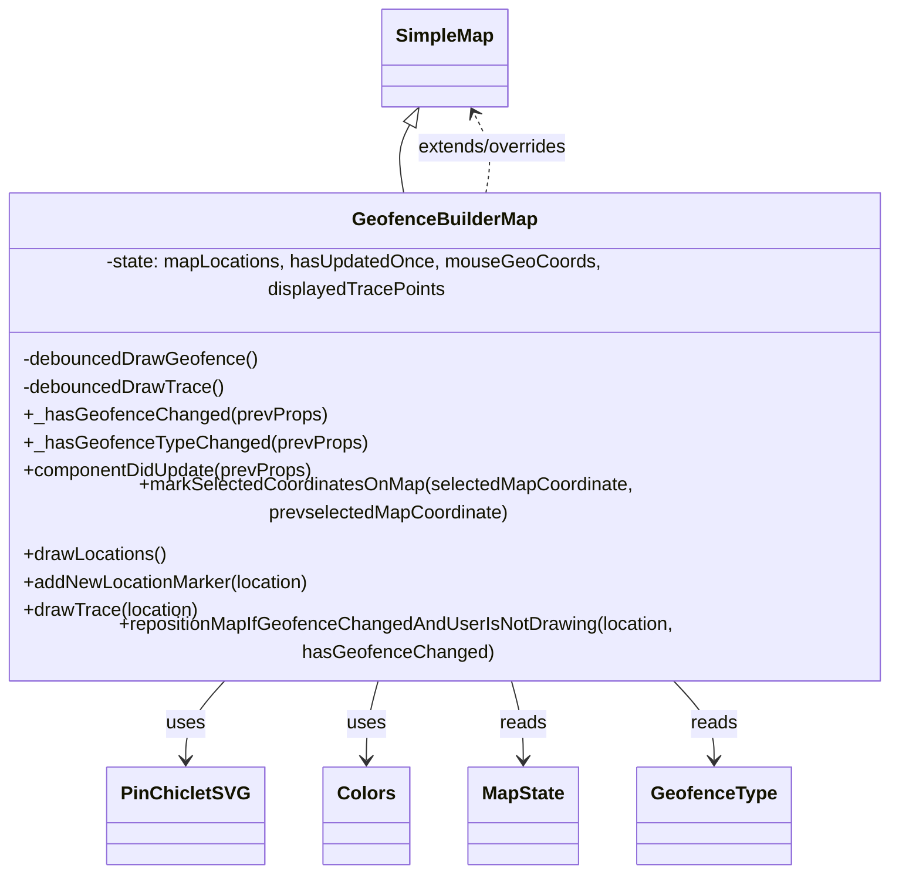

# Diagram: web/portal/src/modules/map/components/GeofenceBuilderMap.js


> Auto-generated by Obscura crawlers

## Diagram 1



### SVG

<svg id="container" width="759.7734375" xmlns="http://www.w3.org/2000/svg" class="classDiagram" height="692" viewBox="0 0 759.7734375 692" role="graphics-document document" aria-roledescription="class"><style>#container{font-family:"trebuchet ms",verdana,arial,sans-serif;font-size:16px;fill:#333;}@keyframes edge-animation-frame{from{stroke-dashoffset:0;}}@keyframes dash{to{stroke-dashoffset:0;}}#container .edge-animation-slow{stroke-dasharray:9,5!important;stroke-dashoffset:900;animation:dash 50s linear infinite;stroke-linecap:round;}#container .edge-animation-fast{stroke-dasharray:9,5!important;stroke-dashoffset:900;animation:dash 20s linear infinite;stroke-linecap:round;}#container .error-icon{fill:#552222;}#container .error-text{fill:#552222;stroke:#552222;}#container .edge-thickness-normal{stroke-width:1px;}#container .edge-thickness-thick{stroke-width:3.5px;}#container .edge-pattern-solid{stroke-dasharray:0;}#container .edge-thickness-invisible{stroke-width:0;fill:none;}#container .edge-pattern-dashed{stroke-dasharray:3;}#container .edge-pattern-dotted{stroke-dasharray:2;}#container .marker{fill:#333333;stroke:#333333;}#container .marker.cross{stroke:#333333;}#container svg{font-family:"trebuchet ms",verdana,arial,sans-serif;font-size:16px;}#container p{margin:0;}#container g.classGroup text{fill:#9370DB;stroke:none;font-family:"trebuchet ms",verdana,arial,sans-serif;font-size:10px;}#container g.classGroup text .title{font-weight:bolder;}#container .nodeLabel,#container .edgeLabel{color:#131300;}#container .edgeLabel .label rect{fill:#ECECFF;}#container .label text{fill:#131300;}#container .labelBkg{background:#ECECFF;}#container .edgeLabel .label span{background:#ECECFF;}#container .classTitle{font-weight:bolder;}#container .node rect,#container .node circle,#container .node ellipse,#container .node polygon,#container .node path{fill:#ECECFF;stroke:#9370DB;stroke-width:1px;}#container .divider{stroke:#9370DB;stroke-width:1;}#container g.clickable{cursor:pointer;}#container g.classGroup rect{fill:#ECECFF;stroke:#9370DB;}#container g.classGroup line{stroke:#9370DB;stroke-width:1;}#container .classLabel .box{stroke:none;stroke-width:0;fill:#ECECFF;opacity:0.5;}#container .classLabel .label{fill:#9370DB;font-size:10px;}#container .relation{stroke:#333333;stroke-width:1;fill:none;}#container .dashed-line{stroke-dasharray:3;}#container .dotted-line{stroke-dasharray:1 2;}#container #compositionStart,#container .composition{fill:#333333!important;stroke:#333333!important;stroke-width:1;}#container #compositionEnd,#container .composition{fill:#333333!important;stroke:#333333!important;stroke-width:1;}#container #dependencyStart,#container .dependency{fill:#333333!important;stroke:#333333!important;stroke-width:1;}#container #dependencyStart,#container .dependency{fill:#333333!important;stroke:#333333!important;stroke-width:1;}#container #extensionStart,#container .extension{fill:transparent!important;stroke:#333333!important;stroke-width:1;}#container #extensionEnd,#container .extension{fill:transparent!important;stroke:#333333!important;stroke-width:1;}#container #aggregationStart,#container .aggregation{fill:transparent!important;stroke:#333333!important;stroke-width:1;}#container #aggregationEnd,#container .aggregation{fill:transparent!important;stroke:#333333!important;stroke-width:1;}#container #lollipopStart,#container .lollipop{fill:#ECECFF!important;stroke:#333333!important;stroke-width:1;}#container #lollipopEnd,#container .lollipop{fill:#ECECFF!important;stroke:#333333!important;stroke-width:1;}#container .edgeTerminals{font-size:11px;line-height:initial;}#container .classTitleText{text-anchor:middle;font-size:18px;fill:#333;}#container .label-icon{display:inline-block;height:1em;overflow:visible;vertical-align:-0.125em;}#container .node .label-icon path{fill:currentColor;stroke:revert;stroke-width:revert;}#container :root{--mermaid-font-family:"trebuchet ms",verdana,arial,sans-serif;}</style><g><defs><marker id="container_class-aggregationStart" class="marker aggregation class" refX="18" refY="7" markerWidth="190" markerHeight="240" orient="auto"><path d="M 18,7 L9,13 L1,7 L9,1 Z"></path></marker></defs><defs><marker id="container_class-aggregationEnd" class="marker aggregation class" refX="1" refY="7" markerWidth="20" markerHeight="28" orient="auto"><path d="M 18,7 L9,13 L1,7 L9,1 Z"></path></marker></defs><defs><marker id="container_class-extensionStart" class="marker extension class" refX="18" refY="7" markerWidth="190" markerHeight="240" orient="auto"><path d="M 1,7 L18,13 V 1 Z"></path></marker></defs><defs><marker id="container_class-extensionEnd" class="marker extension class" refX="1" refY="7" markerWidth="20" markerHeight="28" orient="auto"><path d="M 1,1 V 13 L18,7 Z"></path></marker></defs><defs><marker id="container_class-compositionStart" class="marker composition class" refX="18" refY="7" markerWidth="190" markerHeight="240" orient="auto"><path d="M 18,7 L9,13 L1,7 L9,1 Z"></path></marker></defs><defs><marker id="container_class-compositionEnd" class="marker composition class" refX="1" refY="7" markerWidth="20" markerHeight="28" orient="auto"><path d="M 18,7 L9,13 L1,7 L9,1 Z"></path></marker></defs><defs><marker id="container_class-dependencyStart" class="marker dependency class" refX="6" refY="7" markerWidth="190" markerHeight="240" orient="auto"><path d="M 5,7 L9,13 L1,7 L9,1 Z"></path></marker></defs><defs><marker id="container_class-dependencyEnd" class="marker dependency class" refX="13" refY="7" markerWidth="20" markerHeight="28" orient="auto"><path d="M 18,7 L9,13 L14,7 L9,1 Z"></path></marker></defs><defs><marker id="container_class-lollipopStart" class="marker lollipop class" refX="13" refY="7" markerWidth="190" markerHeight="240" orient="auto"><circle stroke="black" fill="transparent" cx="7" cy="7" r="6"></circle></marker></defs><defs><marker id="container_class-lollipopEnd" class="marker lollipop class" refX="1" refY="7" markerWidth="190" markerHeight="240" orient="auto"><circle stroke="black" fill="transparent" cx="7" cy="7" r="6"></circle></marker></defs><g class="root"><g class="clusters"></g><g class="edgePaths"><path d="M348.615,107.132L346.62,110.776C344.625,114.421,340.635,121.711,339.868,131.522C339.102,141.333,341.56,153.667,342.789,159.833L344.018,166" id="id_SimpleMap_GeofenceBuilderMap_1" class="edge-thickness-normal edge-pattern-solid relation" style=";;;" data-edge="true" data-et="edge" data-id="id_SimpleMap_GeofenceBuilderMap_1" data-points="W3sieCI6MzU2Ljg5NzIwMTM0NDkzNjcsInkiOjkyfSx7IngiOjMzNi42NDQ1MzEyNSwieSI6MTI5fSx7IngiOjM0NC4wMTc2MjMxMjc4ODAyLCJ5IjoxNjZ9XQ==" marker-start="url(#container_class-extensionStart)"></path><path d="M202.482,526L196.404,532.167C190.327,538.333,178.171,550.667,172.093,562C166.016,573.333,166.016,583.667,166.016,588.833L166.016,594" id="id_GeofenceBuilderMap_PinChicletSVG_2" class="edge-thickness-normal edge-pattern-solid relation" style=";;;" data-edge="true" data-et="edge" data-id="id_GeofenceBuilderMap_PinChicletSVG_2" data-points="W3sieCI6MjAyLjQ4MjEyNDg1NTk5MDc4LCJ5Ijo1MjZ9LHsieCI6MTY2LjAxNTYyNSwieSI6NTYzfSx7IngiOjE2Ni4wMTU2MjUsInkiOjYwMH1d" marker-end="url(#container_class-dependencyEnd)"></path><path d="M325.195,526L323.322,532.167C321.448,538.333,317.701,550.667,315.827,562C313.953,573.333,313.953,583.667,313.953,588.833L313.953,594" id="id_GeofenceBuilderMap_Colors_3" class="edge-thickness-normal edge-pattern-solid relation" style=";;;" data-edge="true" data-et="edge" data-id="id_GeofenceBuilderMap_Colors_3" data-points="W3sieCI6MzI1LjE5NTI1ODQ5NjU0MzgsInkiOjUyNn0seyJ4IjozMTMuOTUzMTI1LCJ5Ijo1NjN9LHsieCI6MzEzLjk1MzEyNSwieSI6NjAwfV0=" marker-end="url(#container_class-dependencyEnd)"></path><path d="M434.578,526L436.452,532.167C438.326,538.333,442.073,550.667,443.947,562C445.82,573.333,445.82,583.667,445.82,588.833L445.82,594" id="id_GeofenceBuilderMap_MapState_4" class="edge-thickness-normal edge-pattern-solid relation" style=";;;" data-edge="true" data-et="edge" data-id="id_GeofenceBuilderMap_MapState_4" data-points="W3sieCI6NDM0LjU3ODE3OTAwMzQ1NjIsInkiOjUyNn0seyJ4Ijo0NDUuODIwMzEyNSwieSI6NTYzfSx7IngiOjQ0NS44MjAzMTI1LCJ5Ijo2MDB9XQ==" marker-end="url(#container_class-dependencyEnd)"></path><path d="M567.498,526L573.925,532.167C580.353,538.333,593.208,550.667,599.635,562C606.063,573.333,606.063,583.667,606.063,588.833L606.063,594" id="id_GeofenceBuilderMap_GeofenceType_5" class="edge-thickness-normal edge-pattern-solid relation" style=";;;" data-edge="true" data-et="edge" data-id="id_GeofenceBuilderMap_GeofenceType_5" data-points="W3sieCI6NTY3LjQ5Nzk2NTg2OTgxNTYsInkiOjUyNn0seyJ4Ijo2MDYuMDYyNSwieSI6NTYzfSx7IngiOjYwNi4wNjI1LCJ5Ijo2MDB9XQ==" marker-end="url(#container_class-dependencyEnd)"></path><path d="M415.756,166L416.985,159.833C418.214,153.667,420.671,141.333,419.005,129.877C417.338,118.421,411.548,107.842,408.652,102.553L405.757,97.263" id="id_GeofenceBuilderMap_SimpleMap_6" class="edge-thickness-normal edge-pattern-dashed relation" style=";;;" data-edge="true" data-et="edge" data-id="id_GeofenceBuilderMap_SimpleMap_6" data-points="W3sieCI6NDE1Ljc1NTgxNDM3MjExOTgsInkiOjE2Nn0seyJ4Ijo0MjMuMTI4OTA2MjUsInkiOjEyOX0seyJ4Ijo0MDIuODc2MjM2MTU1MDYzMywieSI6OTJ9XQ==" marker-end="url(#container_class-dependencyEnd)"></path></g><g class="edgeLabels"><g class="edgeLabel"><g class="label" data-id="id_SimpleMap_GeofenceBuilderMap_1" transform="translate(0, 0)"><foreignObject width="0" height="0"><div xmlns="http://www.w3.org/1999/xhtml" class="labelBkg" style="display: table-cell; white-space: nowrap; line-height: 1.5; max-width: 200px; text-align: center;"><span class="edgeLabel"></span></div></foreignObject></g></g><g class="edgeLabel" transform="translate(166.015625, 563)"><g class="label" data-id="id_GeofenceBuilderMap_PinChicletSVG_2" transform="translate(-16.4921875, -12)"><foreignObject width="32.984375" height="24"><div xmlns="http://www.w3.org/1999/xhtml" class="labelBkg" style="display: table-cell; white-space: nowrap; line-height: 1.5; max-width: 200px; text-align: center;"><span class="edgeLabel"><p>uses</p></span></div></foreignObject></g></g><g class="edgeLabel" transform="translate(313.953125, 563)"><g class="label" data-id="id_GeofenceBuilderMap_Colors_3" transform="translate(-16.4921875, -12)"><foreignObject width="32.984375" height="24"><div xmlns="http://www.w3.org/1999/xhtml" class="labelBkg" style="display: table-cell; white-space: nowrap; line-height: 1.5; max-width: 200px; text-align: center;"><span class="edgeLabel"><p>uses</p></span></div></foreignObject></g></g><g class="edgeLabel" transform="translate(445.8203125, 563)"><g class="label" data-id="id_GeofenceBuilderMap_MapState_4" transform="translate(-20.0078125, -12)"><foreignObject width="40.015625" height="24"><div xmlns="http://www.w3.org/1999/xhtml" class="labelBkg" style="display: table-cell; white-space: nowrap; line-height: 1.5; max-width: 200px; text-align: center;"><span class="edgeLabel"><p>reads</p></span></div></foreignObject></g></g><g class="edgeLabel" transform="translate(606.0625, 563)"><g class="label" data-id="id_GeofenceBuilderMap_GeofenceType_5" transform="translate(-20.0078125, -12)"><foreignObject width="40.015625" height="24"><div xmlns="http://www.w3.org/1999/xhtml" class="labelBkg" style="display: table-cell; white-space: nowrap; line-height: 1.5; max-width: 200px; text-align: center;"><span class="edgeLabel"><p>reads</p></span></div></foreignObject></g></g><g class="edgeLabel" transform="translate(422.05992, 127.04705)"><g class="label" data-id="id_GeofenceBuilderMap_SimpleMap_6" transform="translate(-66.484375, -12)"><foreignObject width="132.96875" height="24"><div xmlns="http://www.w3.org/1999/xhtml" class="labelBkg" style="display: table-cell; white-space: nowrap; line-height: 1.5; max-width: 200px; text-align: center;"><span class="edgeLabel"><p>extends/overrides</p></span></div></foreignObject></g></g></g><g class="nodes"><g class="node default" id="classId-SimpleMap-0" transform="translate(379.88671875, 50)"><g class="basic label-container"><path d="M-52.5703125 -42 L52.5703125 -42 L52.5703125 42 L-52.5703125 42" stroke="none" stroke-width="0" fill="#ECECFF" style=""></path><path d="M-52.5703125 -42 C-12.301157887504182 -42, 27.967996724991636 -42, 52.5703125 -42 M-52.5703125 -42 C-13.172215648500178 -42, 26.225881202999645 -42, 52.5703125 -42 M52.5703125 -42 C52.5703125 -14.66596161347156, 52.5703125 12.668076773056882, 52.5703125 42 M52.5703125 -42 C52.5703125 -18.407013122911184, 52.5703125 5.185973754177631, 52.5703125 42 M52.5703125 42 C18.385469483376013 42, -15.799373533247973 42, -52.5703125 42 M52.5703125 42 C30.873816780917394 42, 9.177321061834789 42, -52.5703125 42 M-52.5703125 42 C-52.5703125 19.624170647516337, -52.5703125 -2.7516587049673262, -52.5703125 -42 M-52.5703125 42 C-52.5703125 20.932104022621544, -52.5703125 -0.13579195475691108, -52.5703125 -42" stroke="#9370DB" stroke-width="1.3" fill="none" stroke-dasharray="0 0" style=""></path></g><g class="annotation-group text" transform="translate(0, -18)"></g><g class="label-group text" transform="translate(-40.5703125, -18)"><g class="label" style="font-weight: bolder" transform="translate(0,-12)"><foreignObject width="81.140625" height="24"><div xmlns="http://www.w3.org/1999/xhtml" style="display: table-cell; white-space: nowrap; line-height: 1.5; max-width: 130px; text-align: center;"><span class="nodeLabel markdown-node-label" style=""><p>SimpleMap</p></span></div></foreignObject></g></g><g class="members-group text" transform="translate(-40.5703125, 30)"></g><g class="methods-group text" transform="translate(-40.5703125, 60)"></g><g class="divider" style=""><path d="M-52.5703125 6 C-29.4057061543837 6, -6.241099808767402 6, 52.5703125 6 M-52.5703125 6 C-11.539422521774256 6, 29.49146745645149 6, 52.5703125 6" stroke="#9370DB" stroke-width="1.3" fill="none" stroke-dasharray="0 0" style=""></path></g><g class="divider" style=""><path d="M-52.5703125 24 C-19.387286951787793 24, 13.795738596424414 24, 52.5703125 24 M-52.5703125 24 C-14.174658026315484 24, 24.220996447369032 24, 52.5703125 24" stroke="#9370DB" stroke-width="1.3" fill="none" stroke-dasharray="0 0" style=""></path></g></g><g class="node default" id="classId-GeofenceBuilderMap-1" transform="translate(379.88671875, 346)"><g class="basic label-container"><path d="M-371.88671875 -180 L371.88671875 -180 L371.88671875 180 L-371.88671875 180" stroke="none" stroke-width="0" fill="#ECECFF" style=""></path><path d="M-371.88671875 -180 C-88.92836860348388 -180, 194.02998154303225 -180, 371.88671875 -180 M-371.88671875 -180 C-74.68330398463672 -180, 222.52011078072655 -180, 371.88671875 -180 M371.88671875 -180 C371.88671875 -42.87215083078951, 371.88671875 94.25569833842098, 371.88671875 180 M371.88671875 -180 C371.88671875 -94.86331576019394, 371.88671875 -9.726631520387883, 371.88671875 180 M371.88671875 180 C135.88114425290775 180, -100.12443024418451 180, -371.88671875 180 M371.88671875 180 C121.91456780878693 180, -128.05758313242615 180, -371.88671875 180 M-371.88671875 180 C-371.88671875 44.072544529410095, -371.88671875 -91.85491094117981, -371.88671875 -180 M-371.88671875 180 C-371.88671875 99.79862507376754, -371.88671875 19.597250147535078, -371.88671875 -180" stroke="#9370DB" stroke-width="1.3" fill="none" stroke-dasharray="0 0" style=""></path></g><g class="annotation-group text" transform="translate(0, -156)"></g><g class="label-group text" transform="translate(-76.1171875, -156)"><g class="label" style="font-weight: bolder" transform="translate(0,-12)"><foreignObject width="152.234375" height="24"><div xmlns="http://www.w3.org/1999/xhtml" style="display: table-cell; white-space: nowrap; line-height: 1.5; max-width: 201px; text-align: center;"><span class="nodeLabel markdown-node-label" style=""><p>GeofenceBuilderMap</p></span></div></foreignObject></g></g><g class="members-group text" transform="translate(-359.88671875, -108)"><g class="label" style="" transform="translate(0,-12)"><foreignObject width="580.765625" height="24"><div xmlns="http://www.w3.org/1999/xhtml" style="display: table-cell; white-space: nowrap; line-height: 1.5; max-width: 638px; text-align: center;"><span class="nodeLabel markdown-node-label" style=""><p>-state: mapLocations, hasUpdatedOnce, mouseGeoCoords, displayedTracePoints</p></span></div></foreignObject></g></g><g class="methods-group text" transform="translate(-359.88671875, -60)"><g class="label" style="" transform="translate(0,-12)"><foreignObject width="201.78125" height="24"><div xmlns="http://www.w3.org/1999/xhtml" style="display: table-cell; white-space: nowrap; line-height: 1.5; max-width: 259px; text-align: center;"><span class="nodeLabel markdown-node-label" style=""><p>-debouncedDrawGeofence()</p></span></div></foreignObject></g><g class="label" style="" transform="translate(0,12)"><foreignObject width="172.4375" height="24"><div xmlns="http://www.w3.org/1999/xhtml" style="display: table-cell; white-space: nowrap; line-height: 1.5; max-width: 230px; text-align: center;"><span class="nodeLabel markdown-node-label" style=""><p>-debouncedDrawTrace()</p></span></div></foreignObject></g><g class="label" style="" transform="translate(0,36)"><foreignObject width="253.625" height="24"><div xmlns="http://www.w3.org/1999/xhtml" style="display: table-cell; white-space: nowrap; line-height: 1.5; max-width: 311px; text-align: center;"><span class="nodeLabel markdown-node-label" style=""><p>+_hasGeofenceChanged(prevProps)</p></span></div></foreignObject></g><g class="label" style="" transform="translate(0,60)"><foreignObject width="287.359375" height="24"><div xmlns="http://www.w3.org/1999/xhtml" style="display: table-cell; white-space: nowrap; line-height: 1.5; max-width: 345px; text-align: center;"><span class="nodeLabel markdown-node-label" style=""><p>+_hasGeofenceTypeChanged(prevProps)</p></span></div></foreignObject></g><g class="label" style="" transform="translate(0,84)"><foreignObject width="250.5625" height="24"><div xmlns="http://www.w3.org/1999/xhtml" style="display: table-cell; white-space: nowrap; line-height: 1.5; max-width: 308px; text-align: center;"><span class="nodeLabel markdown-node-label" style=""><p>+componentDidUpdate(prevProps)</p></span></div></foreignObject></g><g class="label" style="" transform="translate(0,108)"><foreignObject width="637.109375" height="24"><div xmlns="http://www.w3.org/1999/xhtml" style="display: table-cell; white-space: nowrap; line-height: 1.5; max-width: 694px; text-align: center;"><span class="nodeLabel markdown-node-label" style=""><p>+markSelectedCoordinatesOnMap(selectedMapCoordinate, prevselectedMapCoordinate)</p></span></div></foreignObject></g><g class="label" style="" transform="translate(0,132)"><foreignObject width="123.21875" height="24"><div xmlns="http://www.w3.org/1999/xhtml" style="display: table-cell; white-space: nowrap; line-height: 1.5; max-width: 181px; text-align: center;"><span class="nodeLabel markdown-node-label" style=""><p>+drawLocations()</p></span></div></foreignObject></g><g class="label" style="" transform="translate(0,156)"><foreignObject width="248.609375" height="24"><div xmlns="http://www.w3.org/1999/xhtml" style="display: table-cell; white-space: nowrap; line-height: 1.5; max-width: 306px; text-align: center;"><span class="nodeLabel markdown-node-label" style=""><p>+addNewLocationMarker(location)</p></span></div></foreignObject></g><g class="label" style="" transform="translate(0,180)"><foreignObject width="150.953125" height="24"><div xmlns="http://www.w3.org/1999/xhtml" style="display: table-cell; white-space: nowrap; line-height: 1.5; max-width: 208px; text-align: center;"><span class="nodeLabel markdown-node-label" style=""><p>+drawTrace(location)</p></span></div></foreignObject></g><g class="label" style="" transform="translate(0,204)"><foreignObject width="643.65625" height="24"><div xmlns="http://www.w3.org/1999/xhtml" style="display: table-cell; white-space: nowrap; line-height: 1.5; max-width: 701px; text-align: center;"><span class="nodeLabel markdown-node-label" style=""><p>+repositionMapIfGeofenceChangedAndUserIsNotDrawing(location, hasGeofenceChanged)</p></span></div></foreignObject></g></g><g class="divider" style=""><path d="M-371.88671875 -132 C-220.93606180057859 -132, -69.98540485115717 -132, 371.88671875 -132 M-371.88671875 -132 C-201.03636199792518 -132, -30.186005245850367 -132, 371.88671875 -132" stroke="#9370DB" stroke-width="1.3" fill="none" stroke-dasharray="0 0" style=""></path></g><g class="divider" style=""><path d="M-371.88671875 -84 C-150.39056173921972 -84, 71.10559527156056 -84, 371.88671875 -84 M-371.88671875 -84 C-157.90661843047386 -84, 56.07348188905229 -84, 371.88671875 -84" stroke="#9370DB" stroke-width="1.3" fill="none" stroke-dasharray="0 0" style=""></path></g></g><g class="node default" id="classId-PinChicletSVG-2" transform="translate(166.015625, 642)"><g class="basic label-container"><path d="M-62.8359375 -42 L62.8359375 -42 L62.8359375 42 L-62.8359375 42" stroke="none" stroke-width="0" fill="#ECECFF" style=""></path><path d="M-62.8359375 -42 C-23.846118040735753 -42, 15.143701418528494 -42, 62.8359375 -42 M-62.8359375 -42 C-32.537389629545046 -42, -2.238841759090093 -42, 62.8359375 -42 M62.8359375 -42 C62.8359375 -24.439441923201883, 62.8359375 -6.878883846403767, 62.8359375 42 M62.8359375 -42 C62.8359375 -14.957278632234289, 62.8359375 12.085442735531423, 62.8359375 42 M62.8359375 42 C32.49541923198004 42, 2.154900963960067 42, -62.8359375 42 M62.8359375 42 C32.450516744679845 42, 2.0650959893596905 42, -62.8359375 42 M-62.8359375 42 C-62.8359375 17.28772123715966, -62.8359375 -7.424557525680683, -62.8359375 -42 M-62.8359375 42 C-62.8359375 17.043082419285795, -62.8359375 -7.913835161428409, -62.8359375 -42" stroke="#9370DB" stroke-width="1.3" fill="none" stroke-dasharray="0 0" style=""></path></g><g class="annotation-group text" transform="translate(0, -18)"></g><g class="label-group text" transform="translate(-50.8359375, -18)"><g class="label" style="font-weight: bolder" transform="translate(0,-12)"><foreignObject width="101.671875" height="24"><div xmlns="http://www.w3.org/1999/xhtml" style="display: table-cell; white-space: nowrap; line-height: 1.5; max-width: 150px; text-align: center;"><span class="nodeLabel markdown-node-label" style=""><p>PinChicletSVG</p></span></div></foreignObject></g></g><g class="members-group text" transform="translate(-50.8359375, 30)"></g><g class="methods-group text" transform="translate(-50.8359375, 60)"></g><g class="divider" style=""><path d="M-62.8359375 6 C-22.050427385905273 6, 18.735082728189454 6, 62.8359375 6 M-62.8359375 6 C-16.083239028645075 6, 30.66945944270985 6, 62.8359375 6" stroke="#9370DB" stroke-width="1.3" fill="none" stroke-dasharray="0 0" style=""></path></g><g class="divider" style=""><path d="M-62.8359375 24 C-16.94924836639266 24, 28.93744076721468 24, 62.8359375 24 M-62.8359375 24 C-34.136064451889055 24, -5.4361914037781105 24, 62.8359375 24" stroke="#9370DB" stroke-width="1.3" fill="none" stroke-dasharray="0 0" style=""></path></g></g><g class="node default" id="classId-Colors-3" transform="translate(313.953125, 642)"><g class="basic label-container"><path d="M-35.1015625 -42 L35.1015625 -42 L35.1015625 42 L-35.1015625 42" stroke="none" stroke-width="0" fill="#ECECFF" style=""></path><path d="M-35.1015625 -42 C-15.28014613153287 -42, 4.54127023693426 -42, 35.1015625 -42 M-35.1015625 -42 C-16.39336803488516 -42, 2.3148264302296795 -42, 35.1015625 -42 M35.1015625 -42 C35.1015625 -22.344642457565193, 35.1015625 -2.6892849151303864, 35.1015625 42 M35.1015625 -42 C35.1015625 -15.544342704387844, 35.1015625 10.911314591224311, 35.1015625 42 M35.1015625 42 C14.183424064819121 42, -6.734714370361758 42, -35.1015625 42 M35.1015625 42 C19.76165480588886 42, 4.421747111777716 42, -35.1015625 42 M-35.1015625 42 C-35.1015625 13.150296802965848, -35.1015625 -15.699406394068305, -35.1015625 -42 M-35.1015625 42 C-35.1015625 25.19502421451513, -35.1015625 8.390048429030259, -35.1015625 -42" stroke="#9370DB" stroke-width="1.3" fill="none" stroke-dasharray="0 0" style=""></path></g><g class="annotation-group text" transform="translate(0, -18)"></g><g class="label-group text" transform="translate(-23.1015625, -18)"><g class="label" style="font-weight: bolder" transform="translate(0,-12)"><foreignObject width="46.203125" height="24"><div xmlns="http://www.w3.org/1999/xhtml" style="display: table-cell; white-space: nowrap; line-height: 1.5; max-width: 95px; text-align: center;"><span class="nodeLabel markdown-node-label" style=""><p>Colors</p></span></div></foreignObject></g></g><g class="members-group text" transform="translate(-23.1015625, 30)"></g><g class="methods-group text" transform="translate(-23.1015625, 60)"></g><g class="divider" style=""><path d="M-35.1015625 6 C-15.912918786945589 6, 3.275724926108822 6, 35.1015625 6 M-35.1015625 6 C-7.5256415235168 6, 20.0502794529664 6, 35.1015625 6" stroke="#9370DB" stroke-width="1.3" fill="none" stroke-dasharray="0 0" style=""></path></g><g class="divider" style=""><path d="M-35.1015625 24 C-10.447682582904857 24, 14.206197334190286 24, 35.1015625 24 M-35.1015625 24 C-12.711728842689475 24, 9.67810481462105 24, 35.1015625 24" stroke="#9370DB" stroke-width="1.3" fill="none" stroke-dasharray="0 0" style=""></path></g></g><g class="node default" id="classId-MapState-4" transform="translate(445.8203125, 642)"><g class="basic label-container"><path d="M-46.765625 -42 L46.765625 -42 L46.765625 42 L-46.765625 42" stroke="none" stroke-width="0" fill="#ECECFF" style=""></path><path d="M-46.765625 -42 C-11.16944818807012 -42, 24.42672862385976 -42, 46.765625 -42 M-46.765625 -42 C-25.74721441840163 -42, -4.728803836803259 -42, 46.765625 -42 M46.765625 -42 C46.765625 -18.940035160801685, 46.765625 4.11992967839663, 46.765625 42 M46.765625 -42 C46.765625 -9.175930698786878, 46.765625 23.648138602426243, 46.765625 42 M46.765625 42 C9.543762588413784 42, -27.67809982317243 42, -46.765625 42 M46.765625 42 C10.78095362111673 42, -25.20371775776654 42, -46.765625 42 M-46.765625 42 C-46.765625 25.118794174251484, -46.765625 8.237588348502968, -46.765625 -42 M-46.765625 42 C-46.765625 22.73735931092028, -46.765625 3.474718621840559, -46.765625 -42" stroke="#9370DB" stroke-width="1.3" fill="none" stroke-dasharray="0 0" style=""></path></g><g class="annotation-group text" transform="translate(0, -18)"></g><g class="label-group text" transform="translate(-34.765625, -18)"><g class="label" style="font-weight: bolder" transform="translate(0,-12)"><foreignObject width="69.53125" height="24"><div xmlns="http://www.w3.org/1999/xhtml" style="display: table-cell; white-space: nowrap; line-height: 1.5; max-width: 118px; text-align: center;"><span class="nodeLabel markdown-node-label" style=""><p>MapState</p></span></div></foreignObject></g></g><g class="members-group text" transform="translate(-34.765625, 30)"></g><g class="methods-group text" transform="translate(-34.765625, 60)"></g><g class="divider" style=""><path d="M-46.765625 6 C-11.092216492798165 6, 24.58119201440367 6, 46.765625 6 M-46.765625 6 C-18.476550747153883 6, 9.812523505692234 6, 46.765625 6" stroke="#9370DB" stroke-width="1.3" fill="none" stroke-dasharray="0 0" style=""></path></g><g class="divider" style=""><path d="M-46.765625 24 C-24.692973042263475 24, -2.6203210845269496 24, 46.765625 24 M-46.765625 24 C-15.12089761651843 24, 16.52382976696314 24, 46.765625 24" stroke="#9370DB" stroke-width="1.3" fill="none" stroke-dasharray="0 0" style=""></path></g></g><g class="node default" id="classId-GeofenceType-5" transform="translate(606.0625, 642)"><g class="basic label-container"><path d="M-63.4765625 -42 L63.4765625 -42 L63.4765625 42 L-63.4765625 42" stroke="none" stroke-width="0" fill="#ECECFF" style=""></path><path d="M-63.4765625 -42 C-20.017105898013007 -42, 23.442350703973986 -42, 63.4765625 -42 M-63.4765625 -42 C-34.56279322670671 -42, -5.649023953413419 -42, 63.4765625 -42 M63.4765625 -42 C63.4765625 -18.816723172809333, 63.4765625 4.366553654381335, 63.4765625 42 M63.4765625 -42 C63.4765625 -20.82773571146762, 63.4765625 0.34452857706475726, 63.4765625 42 M63.4765625 42 C24.595041788437953 42, -14.286478923124093 42, -63.4765625 42 M63.4765625 42 C21.08752000167774 42, -21.301522496644523 42, -63.4765625 42 M-63.4765625 42 C-63.4765625 16.494880138619177, -63.4765625 -9.010239722761646, -63.4765625 -42 M-63.4765625 42 C-63.4765625 16.18542149844521, -63.4765625 -9.629157003109583, -63.4765625 -42" stroke="#9370DB" stroke-width="1.3" fill="none" stroke-dasharray="0 0" style=""></path></g><g class="annotation-group text" transform="translate(0, -18)"></g><g class="label-group text" transform="translate(-51.4765625, -18)"><g class="label" style="font-weight: bolder" transform="translate(0,-12)"><foreignObject width="102.953125" height="24"><div xmlns="http://www.w3.org/1999/xhtml" style="display: table-cell; white-space: nowrap; line-height: 1.5; max-width: 151px; text-align: center;"><span class="nodeLabel markdown-node-label" style=""><p>GeofenceType</p></span></div></foreignObject></g></g><g class="members-group text" transform="translate(-51.4765625, 30)"></g><g class="methods-group text" transform="translate(-51.4765625, 60)"></g><g class="divider" style=""><path d="M-63.4765625 6 C-19.551949878359736 6, 24.37266274328053 6, 63.4765625 6 M-63.4765625 6 C-16.52978757834134 6, 30.416987343317317 6, 63.4765625 6" stroke="#9370DB" stroke-width="1.3" fill="none" stroke-dasharray="0 0" style=""></path></g><g class="divider" style=""><path d="M-63.4765625 24 C-25.404223081258948 24, 12.668116337482104 24, 63.4765625 24 M-63.4765625 24 C-36.01296525155891 24, -8.54936800311782 24, 63.4765625 24" stroke="#9370DB" stroke-width="1.3" fill="none" stroke-dasharray="0 0" style=""></path></g></g></g></g></g></svg>

## Diagram 2

```mermaid
flowchart TD
  A[componentDidUpdate(prevProps)] --> B(handleHeatmapChanges(prevProps))
  B --> C{isTracing changed from true to false?}
  C -- yes --> D[clearMapMarkers("tracing:geofence:")]
  D --> E[set displayedTracePoints = []]
  C --> F[compute hasGeofenceChanged via _hasGeofenceChanged(prevProps)]
  F --> G[extract prevGeofence, currentGeofence, prevFenceType, newFenceType]
  G --> H[compute prevGeofenceCoords, newGeofenceCoords based on fence type]
  H --> I[compute hasGeofenceTypeChanged, hasReceivedNewGeofence, deletedGeofence]
  I --> J[shouldUpdate = (!enableGeofenceBuilder || hasGeofenceTypeChanged || hasReceivedNewGeofence || deletedGeofence || _hasGeofenceTypeChanged(prevProps) || !hasUpdatedOnce)]
  J --> K{hasGeofenceChanged && shouldUpdate}
  K -- true --> L[clearMap()]
  L --> M[clearInfoBubbles()]
  M --> N[loadLocations()]
  N --> O{selectedLocation && mapLocations.length == 1}
  O -- true --> P{shouldUpdate || prevProps.selectedLocation == null}
  P -- true --> Q[if isFenceValid(selectedLocation.geofence) or selectedLocation.latitude -> zoomSingleLocation(selectedLocation)]
  O --> R{enableGeofenceBuilder?}
  R -- true --> S[debouncedDrawGeofence(selectedLocation, enableDraggingGeofence, false)]
  O --> T{isTracing?}
  T -- true --> U[debouncedDrawTrace(selectedLocation)]
  O --> V{isNewLocation && hasGeofenceChanged}
  V -- true --> W[clearMapMarkers("newLocation:centerMarker")]
  W --> X[addNewLocationMarker(selectedLocation)]
  N --> Y[markSelectedCoordinatesOnMap(selectedMapCoordinate, prevProps.selectedMapCoordinate)]
  Y --> Z[handleMapSizeChanges(prevProps)]
  Z --> AA[if initialZoomLevel -> setMapZoom(initialZoomLevel)]
  AA --> AB[if !hasUpdatedOnce -> set hasUpdatedOnce = true]
```

> SVG rendering failed for this diagram.
