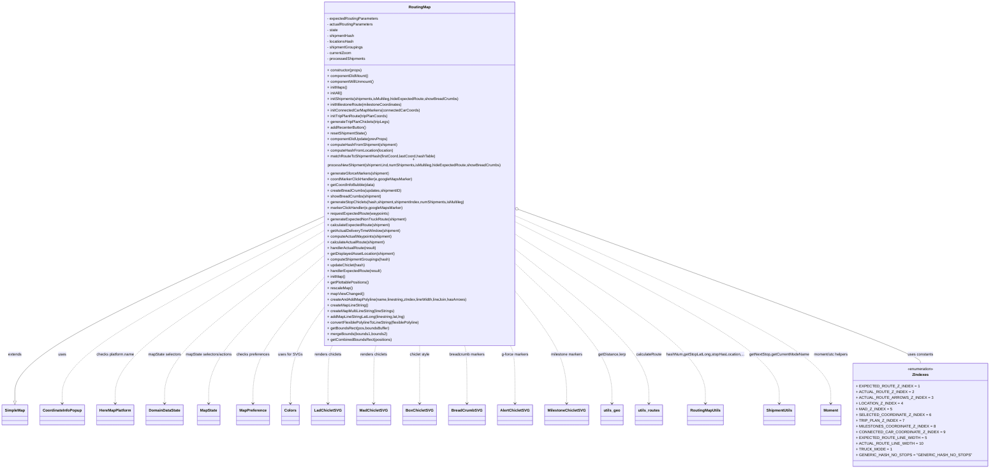

# Diagram: web/portal/src/modules/map/components/RoutingMap.js

> Auto-generated by Obscura crawlers

## Mermaid

### SVG

<svg id="container" width="3998.953125" xmlns="http://www.w3.org/2000/svg" class="classDiagram" height="1938" viewBox="0 0 3998.953125 1938" role="graphics-document document" aria-roledescription="class"><g><defs><marker id="container_class-aggregationStart" class="marker aggregation class" refX="18" refY="7" markerWidth="190" markerHeight="240" orient="auto"><path d="M 18,7 L9,13 L1,7 L9,1 Z"></path></marker></defs><defs><marker id="container_class-aggregationEnd" class="marker aggregation class" refX="1" refY="7" markerWidth="20" markerHeight="28" orient="auto"><path d="M 18,7 L9,13 L1,7 L9,1 Z"></path></marker></defs><defs><marker id="container_class-extensionStart" class="marker extension class" refX="18" refY="7" markerWidth="190" markerHeight="240" orient="auto"><path d="M 1,7 L18,13 V 1 Z"></path></marker></defs><defs><marker id="container_class-extensionEnd" class="marker extension class" refX="1" refY="7" markerWidth="20" markerHeight="28" orient="auto"><path d="M 1,1 V 13 L18,7 Z"></path></marker></defs><defs><marker id="container_class-compositionStart" class="marker composition class" refX="18" refY="7" markerWidth="190" markerHeight="240" orient="auto"><path d="M 18,7 L9,13 L1,7 L9,1 Z"></path></marker></defs><defs><marker id="container_class-compositionEnd" class="marker composition class" refX="1" refY="7" markerWidth="20" markerHeight="28" orient="auto"><path d="M 18,7 L9,13 L1,7 L9,1 Z"></path></marker></defs><defs><marker id="container_class-dependencyStart" class="marker dependency class" refX="6" refY="7" markerWidth="190" markerHeight="240" orient="auto"><path d="M 5,7 L9,13 L1,7 L9,1 Z"></path></marker></defs><defs><marker id="container_class-dependencyEnd" class="marker dependency class" refX="13" refY="7" markerWidth="20" markerHeight="28" orient="auto"><path d="M 18,7 L9,13 L14,7 L9,1 Z"></path></marker></defs><defs><marker id="container_class-lollipopStart" class="marker lollipop class" refX="13" refY="7" markerWidth="190" markerHeight="240" orient="auto"><circle stroke="black" fill="transparent" cx="7" cy="7" r="6"></circle></marker></defs><defs><marker id="container_class-lollipopEnd" class="marker lollipop class" refX="1" refY="7" markerWidth="190" markerHeight="240" orient="auto"><circle stroke="black" fill="transparent" cx="7" cy="7" r="6"></circle></marker></defs><g class="root"><g class="clusters"></g><g class="edgePaths"><path d="M1307.332,899.185L1099.538,992.821C891.745,1086.457,476.158,1273.728,268.364,1399.656C60.57,1525.583,60.57,1590.167,60.57,1622.458L60.57,1654.75" id="id_RoutingMap_SimpleMap_1" class="edge-thickness-normal edge-pattern-solid relation" style=";;;" data-edge="true" data-et="edge" data-id="id_RoutingMap_SimpleMap_1" data-points="W3sieCI6MTMwNy4zMzIwMzEyNSwieSI6ODk5LjE4NTQzODUyMTg3ODh9LHsieCI6NjAuNTcwMzEyNSwieSI6MTQ2MX0seyJ4Ijo2MC41NzAzMTI1LCJ5IjoxNjcyfV0=" marker-end="url(#container_class-extensionEnd)"></path><path d="M1307.332,923.325L1131.622,1012.938C955.911,1102.55,604.491,1281.775,428.781,1405.554C253.07,1529.333,253.07,1597.667,253.07,1631.833L253.07,1666" id="id_RoutingMap_CoordinateInfoPopup_2" class="edge-thickness-normal edge-pattern-dashed relation" style=";;;" data-edge="true" data-et="edge" data-id="id_RoutingMap_CoordinateInfoPopup_2" data-points="W3sieCI6MTMwNy4zMzIwMzEyNSwieSI6OTIzLjMyNTM5NTc2NDI1Mjl9LHsieCI6MjUzLjA3MDMxMjUsInkiOjE0NjF9LHsieCI6MjUzLjA3MDMxMjUsInkiOjE2NzJ9XQ==" marker-end="url(#container_class-dependencyEnd)"></path><path d="M1307.332,959.388L1167.696,1042.99C1028.06,1126.592,748.788,1293.796,609.152,1411.565C469.516,1529.333,469.516,1597.667,469.516,1631.833L469.516,1666" id="id_RoutingMap_HereMapPlatform_3" class="edge-thickness-normal edge-pattern-dashed relation" style=";;;" data-edge="true" data-et="edge" data-id="id_RoutingMap_HereMapPlatform_3" data-points="W3sieCI6MTMwNy4zMzIwMzEyNSwieSI6OTU5LjM4ODQ5NDc0MTc5ODh9LHsieCI6NDY5LjUxNTYyNSwieSI6MTQ2MX0seyJ4Ijo0NjkuNTE1NjI1LCJ5IjoxNjcyfV0=" marker-end="url(#container_class-dependencyEnd)"></path><path d="M1307.332,1006.728L1201.465,1082.44C1095.599,1158.152,883.866,1309.576,777.999,1419.455C672.133,1529.333,672.133,1597.667,672.133,1631.833L672.133,1666" id="id_RoutingMap_DomainDataState_4" class="edge-thickness-normal edge-pattern-dashed relation" style=";;;" data-edge="true" data-et="edge" data-id="id_RoutingMap_DomainDataState_4" data-points="W3sieCI6MTMwNy4zMzIwMzEyNSwieSI6MTAwNi43MjgyMzIzMzgzODMxfSx7IngiOjY3Mi4xMzI4MTI1LCJ5IjoxNDYxfSx7IngiOjY3Mi4xMzI4MTI1LCJ5IjoxNjcyfV0=" marker-end="url(#container_class-dependencyEnd)"></path><path d="M1307.332,1071.225L1232.989,1136.187C1158.646,1201.15,1009.96,1331.075,935.617,1430.204C861.273,1529.333,861.273,1597.667,861.273,1631.833L861.273,1666" id="id_RoutingMap_MapState_5" class="edge-thickness-normal edge-pattern-dashed relation" style=";;;" data-edge="true" data-et="edge" data-id="id_RoutingMap_MapState_5" data-points="W3sieCI6MTMwNy4zMzIwMzEyNSwieSI6MTA3MS4yMjQ5ODM5NjQwNzk1fSx7IngiOjg2MS4yNzM0Mzc1LCJ5IjoxNDYxfSx7IngiOjg2MS4yNzM0Mzc1LCJ5IjoxNjcyfV0=" marker-end="url(#container_class-dependencyEnd)"></path><path d="M1307.332,1172.293L1264.463,1220.41C1221.594,1268.528,1135.855,1364.764,1092.986,1447.049C1050.117,1529.333,1050.117,1597.667,1050.117,1631.833L1050.117,1666" id="id_RoutingMap_MapPreference_6" class="edge-thickness-normal edge-pattern-dashed relation" style=";;;" data-edge="true" data-et="edge" data-id="id_RoutingMap_MapPreference_6" data-points="W3sieCI6MTMwNy4zMzIwMzEyNSwieSI6MTE3Mi4yOTI1NTA0MzY2ODYzfSx7IngiOjEwNTAuMTE3MTg3NSwieSI6MTQ2MX0seyJ4IjoxMDUwLjExNzE4NzUsInkiOjE2NzJ9XQ==" marker-end="url(#container_class-dependencyEnd)"></path><path d="M1307.332,1307.653L1289.771,1333.211C1272.211,1358.769,1237.09,1409.884,1219.529,1469.609C1201.969,1529.333,1201.969,1597.667,1201.969,1631.833L1201.969,1666" id="id_RoutingMap_Colors_7" class="edge-thickness-normal edge-pattern-dashed relation" style=";;;" data-edge="true" data-et="edge" data-id="id_RoutingMap_Colors_7" data-points="W3sieCI6MTMwNy4zMzIwMzEyNSwieSI6MTMwNy42NTMwOTU5NTM5NjkxfSx7IngiOjEyMDEuOTY4NzUsInkiOjE0NjF9LHsieCI6MTIwMS45Njg3NSwieSI6MTY3Mn1d" marker-end="url(#container_class-dependencyEnd)"></path><path d="M1369.444,1424L1366.444,1430.167C1363.444,1436.333,1357.445,1448.667,1354.445,1489C1351.445,1529.333,1351.445,1597.667,1351.445,1631.833L1351.445,1666" id="id_RoutingMap_LadChicletSVG_8" class="edge-thickness-normal edge-pattern-dashed relation" style=";;;" data-edge="true" data-et="edge" data-id="id_RoutingMap_LadChicletSVG_8" data-points="W3sieCI6MTM2OS40NDQwMTIxNjQ0Mjk1LCJ5IjoxNDI0fSx7IngiOjEzNTEuNDQ1MzEyNSwieSI6MTQ2MX0seyJ4IjoxMzUxLjQ0NTMxMjUsInkiOjE2NzJ9XQ==" marker-end="url(#container_class-dependencyEnd)"></path><path d="M1541.462,1424L1539.961,1430.167C1538.459,1436.333,1535.456,1448.667,1533.955,1489C1532.453,1529.333,1532.453,1597.667,1532.453,1631.833L1532.453,1666" id="id_RoutingMap_MadChicletSVG_9" class="edge-thickness-normal edge-pattern-dashed relation" style=";;;" data-edge="true" data-et="edge" data-id="id_RoutingMap_MadChicletSVG_9" data-points="W3sieCI6MTU0MS40NjIxNzQ5MTYxMDc0LCJ5IjoxNDI0fSx7IngiOjE1MzIuNDUzMTI1LCJ5IjoxNDYxfSx7IngiOjE1MzIuNDUzMTI1LCJ5IjoxNjcyfV0=" marker-end="url(#container_class-dependencyEnd)"></path><path d="M1713.852,1424L1713.852,1430.167C1713.852,1436.333,1713.852,1448.667,1713.852,1489C1713.852,1529.333,1713.852,1597.667,1713.852,1631.833L1713.852,1666" id="id_RoutingMap_BoxChicletSVG_10" class="edge-thickness-normal edge-pattern-dashed relation" style=";;;" data-edge="true" data-et="edge" data-id="id_RoutingMap_BoxChicletSVG_10" data-points="W3sieCI6MTcxMy44NTE1NjI1LCJ5IjoxNDI0fSx7IngiOjE3MTMuODUxNTYyNSwieSI6MTQ2MX0seyJ4IjoxNzEzLjg1MTU2MjUsInkiOjE2NzJ9XQ==" marker-end="url(#container_class-dependencyEnd)"></path><path d="M1890.725,1424L1892.266,1430.167C1893.806,1436.333,1896.888,1448.667,1898.428,1489C1899.969,1529.333,1899.969,1597.667,1899.969,1631.833L1899.969,1666" id="id_RoutingMap_BreadCrumbSVG_11" class="edge-thickness-normal edge-pattern-dashed relation" style=";;;" data-edge="true" data-et="edge" data-id="id_RoutingMap_BreadCrumbSVG_11" data-points="W3sieCI6MTg5MC43MjUzNDYwNTcwNDY5LCJ5IjoxNDI0fSx7IngiOjE4OTkuOTY4NzUsInkiOjE0NjF9LHsieCI6MTg5OS45Njg3NSwieSI6MTY3Mn1d" marker-end="url(#container_class-dependencyEnd)"></path><path d="M2071.556,1424L2074.672,1430.167C2077.788,1436.333,2084.019,1448.667,2087.134,1489C2090.25,1529.333,2090.25,1597.667,2090.25,1631.833L2090.25,1666" id="id_RoutingMap_AlertChicletSVG_12" class="edge-thickness-normal edge-pattern-dashed relation" style=";;;" data-edge="true" data-et="edge" data-id="id_RoutingMap_AlertChicletSVG_12" data-points="W3sieCI6MjA3MS41NTYzODYzMjU1MDM0LCJ5IjoxNDI0fSx7IngiOjIwOTAuMjUsInkiOjE0NjF9LHsieCI6MjA5MC4yNSwieSI6MTY3Mn1d" marker-end="url(#container_class-dependencyEnd)"></path><path d="M2120.371,1236.108L2149.667,1273.59C2178.964,1311.072,2237.556,1386.036,2266.852,1457.685C2296.148,1529.333,2296.148,1597.667,2296.148,1631.833L2296.148,1666" id="id_RoutingMap_MilestoneChicletSVG_13" class="edge-thickness-normal edge-pattern-dashed relation" style=";;;" data-edge="true" data-et="edge" data-id="id_RoutingMap_MilestoneChicletSVG_13" data-points="W3sieCI6MjEyMC4zNzEwOTM3NSwieSI6MTIzNi4xMDc2MzU0NDE1NDM2fSx7IngiOjIyOTYuMTQ4NDM3NSwieSI6MTQ2MX0seyJ4IjoyMjk2LjE0ODQzNzUsInkiOjE2NzJ9XQ==" marker-end="url(#container_class-dependencyEnd)"></path><path d="M2120.371,1111.956L2180.097,1170.13C2239.823,1228.304,2359.275,1344.652,2419.001,1436.993C2478.727,1529.333,2478.727,1597.667,2478.727,1631.833L2478.727,1666" id="id_RoutingMap_utils_geo_14" class="edge-thickness-normal edge-pattern-dashed relation" style=";;;" data-edge="true" data-et="edge" data-id="id_RoutingMap_utils_geo_14" data-points="W3sieCI6MjEyMC4zNzEwOTM3NSwieSI6MTExMS45NTYyNjgzODUzNTcxfSx7IngiOjI0NzguNzI2NTYyNSwieSI6MTQ2MX0seyJ4IjoyNDc4LjcyNjU2MjUsInkiOjE2NzJ9XQ==" marker-end="url(#container_class-dependencyEnd)"></path><path d="M2120.371,1046.599L2205.299,1115.666C2290.227,1184.733,2460.082,1322.866,2545.01,1426.1C2629.938,1529.333,2629.938,1597.667,2629.938,1631.833L2629.938,1666" id="id_RoutingMap_utils_routes_15" class="edge-thickness-normal edge-pattern-dashed relation" style=";;;" data-edge="true" data-et="edge" data-id="id_RoutingMap_utils_routes_15" data-points="W3sieCI6MjEyMC4zNzEwOTM3NSwieSI6MTA0Ni41OTg5NTE4OTI4MTg0fSx7IngiOjI2MjkuOTM3NSwieSI6MTQ2MX0seyJ4IjoyNjI5LjkzNzUsInkiOjE2NzJ9XQ==" marker-end="url(#container_class-dependencyEnd)"></path><path d="M2120.371,978.824L2244.671,1059.186C2368.971,1139.549,2617.572,1300.275,2741.872,1414.804C2866.172,1529.333,2866.172,1597.667,2866.172,1631.833L2866.172,1666" id="id_RoutingMap_RoutingMapUtils_16" class="edge-thickness-normal edge-pattern-dashed relation" style=";;;" data-edge="true" data-et="edge" data-id="id_RoutingMap_RoutingMapUtils_16" data-points="W3sieCI6MjEyMC4zNzEwOTM3NSwieSI6OTc4LjgyMzY2NzYwMDAxOX0seyJ4IjoyODY2LjE3MTg3NSwieSI6MTQ2MX0seyJ4IjoyODY2LjE3MTg3NSwieSI6MTY3Mn1d" marker-end="url(#container_class-dependencyEnd)"></path><path d="M2120.371,923.406L2295.986,1013.005C2471.602,1102.604,2822.832,1281.802,2998.447,1405.568C3174.063,1529.333,3174.063,1597.667,3174.063,1631.833L3174.063,1666" id="id_RoutingMap_ShipmentUtils_17" class="edge-thickness-normal edge-pattern-dashed relation" style=";;;" data-edge="true" data-et="edge" data-id="id_RoutingMap_ShipmentUtils_17" data-points="W3sieCI6MjEyMC4zNzEwOTM3NSwieSI6OTIzLjQwNjM3MDU0NzkxOTZ9LHsieCI6MzE3NC4wNjI1LCJ5IjoxNDYxfSx7IngiOjMxNzQuMDYyNSwieSI6MTY3Mn1d" marker-end="url(#container_class-dependencyEnd)"></path><path d="M2120.371,896.232L2332.68,990.36C2544.99,1084.488,2969.608,1272.744,3181.917,1401.039C3394.227,1529.333,3394.227,1597.667,3394.227,1631.833L3394.227,1666" id="id_RoutingMap_Moment_18" class="edge-thickness-normal edge-pattern-dashed relation" style=";;;" data-edge="true" data-et="edge" data-id="id_RoutingMap_Moment_18" data-points="W3sieCI6MjEyMC4zNzEwOTM3NSwieSI6ODk2LjIzMTgyMzcxODY2Mzl9LHsieCI6MzM5NC4yMjY1NjI1LCJ5IjoxNDYxfSx7IngiOjMzOTQuMjI2NTYyNSwieSI6MTY3Mn1d" marker-end="url(#container_class-dependencyEnd)"></path><path d="M2136.56,871.541L2403.552,969.784C2670.544,1068.027,3204.528,1264.514,3471.52,1368.924C3738.512,1473.333,3738.512,1485.667,3738.512,1491.833L3738.512,1498" id="id_RoutingMap_ZIndexes_19" class="edge-thickness-normal edge-pattern-solid relation" style=";;;" data-edge="true" data-et="edge" data-id="id_RoutingMap_ZIndexes_19" data-points="W3sieCI6MjEyMC4zNzEwOTM3NSwieSI6ODY1LjU4NDE0MTI0MjgzOTh9LHsieCI6MzczOC41MTE3MTg3NSwieSI6MTQ2MX0seyJ4IjozNzM4LjUxMTcxODc1LCJ5IjoxNDk4fV0=" marker-start="url(#container_class-aggregationStart)"></path></g><g class="edgeLabels"><g class="edgeLabel" transform="translate(60.5703125, 1461)"><g class="label" data-id="id_RoutingMap_SimpleMap_1" transform="translate(-28.5078125, -12)"><foreignObject width="57.015625" height="24">

extends

</foreignObject></g></g><g class="edgeLabel" transform="translate(253.0703125, 1461)"><g class="label" data-id="id_RoutingMap_CoordinateInfoPopup_2" transform="translate(-16.4921875, -12)"><foreignObject width="32.984375" height="24">

uses

</foreignObject></g></g><g class="edgeLabel" transform="translate(469.515625, 1461)"><g class="label" data-id="id_RoutingMap_HereMapPlatform_3" transform="translate(-80.296875, -12)"><foreignObject width="160.59375" height="24">

checks platform.name

</foreignObject></g></g><g class="edgeLabel" transform="translate(672.1328125, 1461)"><g class="label" data-id="id_RoutingMap_DomainDataState_4" transform="translate(-69.484375, -12)"><foreignObject width="138.96875" height="24">

mapState selectors

</foreignObject></g></g><g class="edgeLabel" transform="translate(861.2734375, 1461)"><g class="label" data-id="id_RoutingMap_MapState_5" transform="translate(-99.65625, -12)"><foreignObject width="199.3125" height="24">

mapState selectors/actions

</foreignObject></g></g><g class="edgeLabel" transform="translate(1050.1171875, 1461)"><g class="label" data-id="id_RoutingMap_MapPreference_6" transform="translate(-69.1875, -12)"><foreignObject width="138.375" height="24">

checks preferences

</foreignObject></g></g><g class="edgeLabel" transform="translate(1201.96875, 1461)"><g class="label" data-id="id_RoutingMap_Colors_7" transform="translate(-48.484375, -12)"><foreignObject width="96.96875" height="24">

uses for SVGs

</foreignObject></g></g><g class="edgeLabel" transform="translate(1351.4453125, 1461)"><g class="label" data-id="id_RoutingMap_LadChicletSVG_8" transform="translate(-57.75, -12)"><foreignObject width="115.5" height="24">

renders chiclets

</foreignObject></g></g><g class="edgeLabel" transform="translate(1532.453125, 1461)"><g class="label" data-id="id_RoutingMap_MadChicletSVG_9" transform="translate(-57.75, -12)"><foreignObject width="115.5" height="24">

renders chiclets

</foreignObject></g></g><g class="edgeLabel" transform="translate(1713.8515625, 1461)"><g class="label" data-id="id_RoutingMap_BoxChicletSVG_10" transform="translate(-43.453125, -12)"><foreignObject width="86.90625" height="24">

chiclet style

</foreignObject></g></g><g class="edgeLabel" transform="translate(1899.96875, 1461)"><g class="label" data-id="id_RoutingMap_BreadCrumbSVG_11" transform="translate(-75.703125, -12)"><foreignObject width="151.40625" height="24">

breadcrumb markers

</foreignObject></g></g><g class="edgeLabel" transform="translate(2090.25, 1461)"><g class="label" data-id="id_RoutingMap_AlertChicletSVG_12" transform="translate(-56.8359375, -12)"><foreignObject width="113.671875" height="24">

g-force markers

</foreignObject></g></g><g class="edgeLabel" transform="translate(2296.1484375, 1461)"><g class="label" data-id="id_RoutingMap_MilestoneChicletSVG_13" transform="translate(-67.5078125, -12)"><foreignObject width="135.015625" height="24">

milestone markers

</foreignObject></g></g><g class="edgeLabel" transform="translate(2478.7265625, 1461)"><g class="label" data-id="id_RoutingMap_utils_geo_14" transform="translate(-58.671875, -12)"><foreignObject width="117.34375" height="24">

getDistance,lerp

</foreignObject></g></g><g class="edgeLabel" transform="translate(2629.9375, 1461)"><g class="label" data-id="id_RoutingMap_utils_routes_15" transform="translate(-53.6875, -12)"><foreignObject width="107.375" height="24">

calculateRoute

</foreignObject></g></g><g class="edgeLabel" transform="translate(2866.171875, 1461)"><g class="label" data-id="id_RoutingMap_RoutingMapUtils_16" transform="translate(-162.546875, -12)"><foreignObject width="325.09375" height="24">

hashNum,getStopLatLong,stopHasLocation,...

</foreignObject></g></g><g class="edgeLabel" transform="translate(3174.0625, 1461)"><g class="label" data-id="id_RoutingMap_ShipmentUtils_17" transform="translate(-125.34375, -12)"><foreignObject width="250.6875" height="24">

getNextStop,getCurrentModeName

</foreignObject></g></g><g class="edgeLabel" transform="translate(3394.2265625, 1461)"><g class="label" data-id="id_RoutingMap_Moment_18" transform="translate(-74.8203125, -12)"><foreignObject width="149.640625" height="24">

moment/utc helpers

</foreignObject></g></g><g class="edgeLabel" transform="translate(3738.51171875, 1461)"><g class="label" data-id="id_RoutingMap_ZIndexes_19" transform="translate(-53.8671875, -12)"><foreignObject width="107.734375" height="24">

uses constants

</foreignObject></g></g></g><g class="nodes"><g class="node default" id="classId-RoutingMap-0" transform="translate(1713.8515625, 716)"><g class="basic label-container"><path d="M-406.51953125 -708 L406.51953125 -708 L406.51953125 708 L-406.51953125 708" stroke="none" stroke-width="0" fill="#ECECFF" style=""></path><path d="M-406.51953125 -708 C-124.25276666929096 -708, 158.01399791141807 -708, 406.51953125 -708 M-406.51953125 -708 C-150.3852910468471 -708, 105.7489491563058 -708, 406.51953125 -708 M406.51953125 -708 C406.51953125 -418.2205386937146, 406.51953125 -128.44107738742923, 406.51953125 708 M406.51953125 -708 C406.51953125 -209.31642478151053, 406.51953125 289.36715043697893, 406.51953125 708 M406.51953125 708 C219.01203585927834 708, 31.504540468556684 708, -406.51953125 708 M406.51953125 708 C212.11958630741438 708, 17.71964136482876 708, -406.51953125 708 M-406.51953125 708 C-406.51953125 379.7290343456246, -406.51953125 51.458068691249196, -406.51953125 -708 M-406.51953125 708 C-406.51953125 253.19587433459293, -406.51953125 -201.60825133081414, -406.51953125 -708" stroke="#9370DB" stroke-width="1.3" fill="none" stroke-dasharray="0 0" style=""></path></g><g class="annotation-group text" transform="translate(0, -684)"></g><g class="label-group text" transform="translate(-43.8828125, -684)"><g class="label" style="font-weight: bolder" transform="translate(0,-12)"><foreignObject width="87.765625" height="24">

RoutingMap

</foreignObject></g></g><g class="members-group text" transform="translate(-394.51953125, -636)"><g class="label" style="" transform="translate(0,-12)"><foreignObject width="214.34375" height="24">

- expectedRoutingParameters

</foreignObject></g><g class="label" style="" transform="translate(0,12)"><foreignObject width="192.984375" height="24">

- actualRoutingParameters

</foreignObject></g><g class="label" style="" transform="translate(0,36)"><foreignObject width="46.796875" height="24">

- state

</foreignObject></g><g class="label" style="" transform="translate(0,60)"><foreignObject width="115.421875" height="24">

- shipmentHash

</foreignObject></g><g class="label" style="" transform="translate(0,84)"><foreignObject width="113.59375" height="24">

- locationsHash

</foreignObject></g><g class="label" style="" transform="translate(0,108)"><foreignObject width="152.671875" height="24">

- shipmentGroupings

</foreignObject></g><g class="label" style="" transform="translate(0,132)"><foreignObject width="103.640625" height="24">

- currentZoom

</foreignObject></g><g class="label" style="" transform="translate(0,156)"><foreignObject width="161.53125" height="24">

- processedShipments

</foreignObject></g></g><g class="methods-group text" transform="translate(-394.51953125, -420)"><g class="label" style="" transform="translate(0,-12)"><foreignObject width="147.609375" height="24">

+ constructor(props)

</foreignObject></g><g class="label" style="" transform="translate(0,12)"><foreignObject width="175.71875" height="24">

+ componentDidMount()

</foreignObject></g><g class="label" style="" transform="translate(0,36)"><foreignObject width="199.671875" height="24">

+ componentWillUnmount()

</foreignObject></g><g class="label" style="" transform="translate(0,60)"><foreignObject width="84.90625" height="24">

+ initMaps()

</foreignObject></g><g class="label" style="" transform="translate(0,84)"><foreignObject width="65.3125" height="24">

+ initAll()

</foreignObject></g><g class="label" style="" transform="translate(0,108)"><foreignObject width="557.015625" height="24">

+ initShipments(shipments,isMultileg,hideExpectedRoute,showBreadCrumbs)

</foreignObject></g><g class="label" style="" transform="translate(0,132)"><foreignObject width="318.78125" height="24">

+ initMilestoneRoute(milestoneCoordinates)

</foreignObject></g><g class="label" style="" transform="translate(0,156)"><foreignObject width="384.90625" height="24">

+ initConnectedCarMapMarkers(connectedCarCoords)

</foreignObject></g><g class="label" style="" transform="translate(0,180)"><foreignObject width="256.796875" height="24">

+ initTripPlanRoute(tripPlanCoords)

</foreignObject></g><g class="label" style="" transform="translate(0,204)"><foreignObject width="260.71875" height="24">

+ generateTripPlanChiclets(tripLegs)

</foreignObject></g><g class="label" style="" transform="translate(0,228)"><foreignObject width="163.53125" height="24">

+ addRecenterButton()

</foreignObject></g><g class="label" style="" transform="translate(0,252)"><foreignObject width="166.03125" height="24">

+ resetShipmentState()

</foreignObject></g><g class="label" style="" transform="translate(0,276)"><foreignObject width="254.8125" height="24">

+ componentDidUpdate(prevProps)

</foreignObject></g><g class="label" style="" transform="translate(0,300)"><foreignObject width="296.515625" height="24">

+ computeHashFromShipment(shipment)

</foreignObject></g><g class="label" style="" transform="translate(0,324)"><foreignObject width="279.640625" height="24">

+ computeHashFromLocation(location)

</foreignObject></g><g class="label" style="" transform="translate(0,348)"><foreignObject width="454.0625" height="24">

+ matchRouteToShipmentHash(firstCoord,lastCoord,hashTable)

</foreignObject></g><g class="label" style="" transform="translate(0,372)"><foreignObject width="745.15625" height="24">

+ processNewShipment(shipment,ind,numShipments,isMultileg,hideExpectedRoute,showBreadCrumbs)

</foreignObject></g><g class="label" style="" transform="translate(0,396)"><foreignObject width="258.390625" height="24">

+ generateGforceMarkers(shipment)

</foreignObject></g><g class="label" style="" transform="translate(0,420)"><foreignObject width="355.0625" height="24">

+ coordMarkerClickHandler(e,googleMapsMarker)

</foreignObject></g><g class="label" style="" transform="translate(0,444)"><foreignObject width="200.40625" height="24">

+ getCoordInfoBubble(data)

</foreignObject></g><g class="label" style="" transform="translate(0,468)"><foreignObject width="310.8125" height="24">

+ createBreadCrumbs(updates,shipmentID)

</foreignObject></g><g class="label" style="" transform="translate(0,492)"><foreignObject width="225.859375" height="24">

+ showBreadCrumbs(shipment)

</foreignObject></g><g class="label" style="" transform="translate(0,516)"><foreignObject width="583.28125" height="24">

+ generateStopChiclets(hash,shipment,shipmentIndex,numShipments,isMultileg)

</foreignObject></g><g class="label" style="" transform="translate(0,540)"><foreignObject width="315.046875" height="24">

+ markerClickHandler(e,googleMapsMarker)

</foreignObject></g><g class="label" style="" transform="translate(0,564)"><foreignObject width="259.828125" height="24">

+ requestExpectedRoute(waypoints)

</foreignObject></g><g class="label" style="" transform="translate(0,588)"><foreignObject width="331.640625" height="24">

+ generateExpectedNonTruckRoute(shipment)

</foreignObject></g><g class="label" style="" transform="translate(0,612)"><foreignObject width="264.421875" height="24">

+ calculateExpectedRoute(shipment)

</foreignObject></g><g class="label" style="" transform="translate(0,636)"><foreignObject width="310.25" height="24">

+ getActualDeliveryTimeWindow(shipment)

</foreignObject></g><g class="label" style="" transform="translate(0,660)"><foreignObject width="274.703125" height="24">

+ computeActualWaypoints(shipment)

</foreignObject></g><g class="label" style="" transform="translate(0,684)"><foreignObject width="243.546875" height="24">

+ calculateActualRoute(shipment)

</foreignObject></g><g class="label" style="" transform="translate(0,708)"><foreignObject width="208.28125" height="24">

+ handlerActualRoute(result)

</foreignObject></g><g class="label" style="" transform="translate(0,732)"><foreignObject width="285.125" height="24">

+ getDisplayedAssetLocation(shipment)

</foreignObject></g><g class="label" style="" transform="translate(0,756)"><foreignObject width="264.046875" height="24">

+ computeShipmentGroupings(hash)

</foreignObject></g><g class="label" style="" transform="translate(0,780)"><foreignObject width="158.15625" height="24">

+ updateChiclet(hash)

</foreignObject></g><g class="label" style="" transform="translate(0,804)"><foreignObject width="229.15625" height="24">

+ handlerExpectedRoute(result)

</foreignObject></g><g class="label" style="" transform="translate(0,828)"><foreignObject width="77.4375" height="24">

+ initMap()

</foreignObject></g><g class="label" style="" transform="translate(0,852)"><foreignObject width="177.84375" height="24">

+ getPlottablePositions()

</foreignObject></g><g class="label" style="" transform="translate(0,876)"><foreignObject width="104.5" height="24">

+ rescaleMap()

</foreignObject></g><g class="label" style="" transform="translate(0,900)"><foreignObject width="150.734375" height="24">

+ mapViewChanged()

</foreignObject></g><g class="label" style="" transform="translate(0,924)"><foreignObject width="587.859375" height="24">

+ createAndAddMapPolyline(name,linestring,zIndex,lineWidth,lineJoin,hasArrows)

</foreignObject></g><g class="label" style="" transform="translate(0,948)"><foreignObject width="171.578125" height="24">

+ createMapLineString()

</foreignObject></g><g class="label" style="" transform="translate(0,972)"><foreignObject width="285.84375" height="24">

+ createMapMultiLineString(lineStrings)

</foreignObject></g><g class="label" style="" transform="translate(0,996)"><foreignObject width="329.59375" height="24">

+ addMapLineStringLatLong(linestring,lat,lng)

</foreignObject></g><g class="label" style="" transform="translate(0,1020)"><foreignObject width="391.96875" height="24">

+ convertFlexiblePolylineToLineString(flexiblePolyline)

</foreignObject></g><g class="label" style="" transform="translate(0,1044)"><foreignObject width="260.78125" height="24">

+ getBoundsRect(pos,boundsBuffer)

</foreignObject></g><g class="label" style="" transform="translate(0,1068)"><foreignObject width="249.75" height="24">

+ mergeBounds(bounds1,bounds2)

</foreignObject></g><g class="label" style="" transform="translate(0,1092)"><foreignObject width="272.234375" height="24">

+ getCombinedBoundsRect(positions)

</foreignObject></g></g><g class="divider" style=""><path d="M-406.51953125 -660 C-169.62711839806306 -660, 67.26529445387388 -660, 406.51953125 -660 M-406.51953125 -660 C-130.99797275423953 -660, 144.52358574152095 -660, 406.51953125 -660" stroke="#9370DB" stroke-width="1.3" fill="none" stroke-dasharray="0 0" style=""></path></g><g class="divider" style=""><path d="M-406.51953125 -444 C-119.64634372453958 -444, 167.22684380092085 -444, 406.51953125 -444 M-406.51953125 -444 C-141.34798148419878 -444, 123.82356828160243 -444, 406.51953125 -444" stroke="#9370DB" stroke-width="1.3" fill="none" stroke-dasharray="0 0" style=""></path></g></g><g class="node default" id="classId-SimpleMap-1" transform="translate(60.5703125, 1714)"><g class="basic label-container"><path d="M-52.5703125 -42 L52.5703125 -42 L52.5703125 42 L-52.5703125 42" stroke="none" stroke-width="0" fill="#ECECFF" style=""></path><path d="M-52.5703125 -42 C-19.09596007054988 -42, 14.378392358900243 -42, 52.5703125 -42 M-52.5703125 -42 C-25.055753665888446 -42, 2.4588051682231082 -42, 52.5703125 -42 M52.5703125 -42 C52.5703125 -24.34931867353899, 52.5703125 -6.698637347077977, 52.5703125 42 M52.5703125 -42 C52.5703125 -11.290174519222074, 52.5703125 19.419650961555853, 52.5703125 42 M52.5703125 42 C25.17063906668859 42, -2.2290343666228196 42, -52.5703125 42 M52.5703125 42 C23.95132430266659 42, -4.667663894666823 42, -52.5703125 42 M-52.5703125 42 C-52.5703125 9.201866320942848, -52.5703125 -23.596267358114304, -52.5703125 -42 M-52.5703125 42 C-52.5703125 8.50704264982042, -52.5703125 -24.98591470035916, -52.5703125 -42" stroke="#9370DB" stroke-width="1.3" fill="none" stroke-dasharray="0 0" style=""></path></g><g class="annotation-group text" transform="translate(0, -18)"></g><g class="label-group text" transform="translate(-40.5703125, -18)"><g class="label" style="font-weight: bolder" transform="translate(0,-12)"><foreignObject width="81.140625" height="24">

SimpleMap

</foreignObject></g></g><g class="members-group text" transform="translate(-40.5703125, 30)"></g><g class="methods-group text" transform="translate(-40.5703125, 60)"></g><g class="divider" style=""><path d="M-52.5703125 6 C-13.915533965757803 6, 24.739244568484395 6, 52.5703125 6 M-52.5703125 6 C-24.123263685930436 6, 4.323785128139129 6, 52.5703125 6" stroke="#9370DB" stroke-width="1.3" fill="none" stroke-dasharray="0 0" style=""></path></g><g class="divider" style=""><path d="M-52.5703125 24 C-14.149241231393134 24, 24.271830037213732 24, 52.5703125 24 M-52.5703125 24 C-28.989540035982902 24, -5.408767571965804 24, 52.5703125 24" stroke="#9370DB" stroke-width="1.3" fill="none" stroke-dasharray="0 0" style=""></path></g></g><g class="node default" id="classId-CoordinateInfoPopup-2" transform="translate(253.0703125, 1714)"><g class="basic label-container"><path d="M-89.9296875 -42 L89.9296875 -42 L89.9296875 42 L-89.9296875 42" stroke="none" stroke-width="0" fill="#ECECFF" style=""></path><path d="M-89.9296875 -42 C-38.54766893831991 -42, 12.834349623360183 -42, 89.9296875 -42 M-89.9296875 -42 C-33.398342934346964 -42, 23.133001631306072 -42, 89.9296875 -42 M89.9296875 -42 C89.9296875 -24.773697599549195, 89.9296875 -7.547395199098389, 89.9296875 42 M89.9296875 -42 C89.9296875 -10.324742549363652, 89.9296875 21.350514901272696, 89.9296875 42 M89.9296875 42 C24.432043843433362 42, -41.065599813133275 42, -89.9296875 42 M89.9296875 42 C35.58243947614329 42, -18.764808547713415 42, -89.9296875 42 M-89.9296875 42 C-89.9296875 9.22375314808179, -89.9296875 -23.55249370383642, -89.9296875 -42 M-89.9296875 42 C-89.9296875 14.491831141911138, -89.9296875 -13.016337716177723, -89.9296875 -42" stroke="#9370DB" stroke-width="1.3" fill="none" stroke-dasharray="0 0" style=""></path></g><g class="annotation-group text" transform="translate(0, -18)"></g><g class="label-group text" transform="translate(-77.9296875, -18)"><g class="label" style="font-weight: bolder" transform="translate(0,-12)"><foreignObject width="155.859375" height="24">

CoordinateInfoPopup

</foreignObject></g></g><g class="members-group text" transform="translate(-77.9296875, 30)"></g><g class="methods-group text" transform="translate(-77.9296875, 60)"></g><g class="divider" style=""><path d="M-89.9296875 6 C-32.50522753651836 6, 24.919232426963276 6, 89.9296875 6 M-89.9296875 6 C-46.099525584173854 6, -2.269363668347708 6, 89.9296875 6" stroke="#9370DB" stroke-width="1.3" fill="none" stroke-dasharray="0 0" style=""></path></g><g class="divider" style=""><path d="M-89.9296875 24 C-48.77725993634732 24, -7.624832372694641 24, 89.9296875 24 M-89.9296875 24 C-31.23091954438867 24, 27.46784841122266 24, 89.9296875 24" stroke="#9370DB" stroke-width="1.3" fill="none" stroke-dasharray="0 0" style=""></path></g></g><g class="node default" id="classId-HereMapPlatform-3" transform="translate(469.515625, 1714)"><g class="basic label-container"><path d="M-76.515625 -42 L76.515625 -42 L76.515625 42 L-76.515625 42" stroke="none" stroke-width="0" fill="#ECECFF" style=""></path><path d="M-76.515625 -42 C-37.46479023404274 -42, 1.5860445319145242 -42, 76.515625 -42 M-76.515625 -42 C-22.62628147261659 -42, 31.26306205476682 -42, 76.515625 -42 M76.515625 -42 C76.515625 -8.752980757955314, 76.515625 24.494038484089373, 76.515625 42 M76.515625 -42 C76.515625 -11.450446469694139, 76.515625 19.099107060611722, 76.515625 42 M76.515625 42 C33.844843049071414 42, -8.825938901857171 42, -76.515625 42 M76.515625 42 C25.276325384770395 42, -25.96297423045921 42, -76.515625 42 M-76.515625 42 C-76.515625 14.931696609947185, -76.515625 -12.13660678010563, -76.515625 -42 M-76.515625 42 C-76.515625 13.54578022184068, -76.515625 -14.90843955631864, -76.515625 -42" stroke="#9370DB" stroke-width="1.3" fill="none" stroke-dasharray="0 0" style=""></path></g><g class="annotation-group text" transform="translate(0, -18)"></g><g class="label-group text" transform="translate(-64.515625, -18)"><g class="label" style="font-weight: bolder" transform="translate(0,-12)"><foreignObject width="129.03125" height="24">

HereMapPlatform

</foreignObject></g></g><g class="members-group text" transform="translate(-64.515625, 30)"></g><g class="methods-group text" transform="translate(-64.515625, 60)"></g><g class="divider" style=""><path d="M-76.515625 6 C-33.544213072701105 6, 9.42719885459779 6, 76.515625 6 M-76.515625 6 C-31.804190998178328 6, 12.907243003643345 6, 76.515625 6" stroke="#9370DB" stroke-width="1.3" fill="none" stroke-dasharray="0 0" style=""></path></g><g class="divider" style=""><path d="M-76.515625 24 C-39.48597767156566 24, -2.456330343131313 24, 76.515625 24 M-76.515625 24 C-19.31392496651464 24, 37.88777506697072 24, 76.515625 24" stroke="#9370DB" stroke-width="1.3" fill="none" stroke-dasharray="0 0" style=""></path></g></g><g class="node default" id="classId-DomainDataState-4" transform="translate(672.1328125, 1714)"><g class="basic label-container"><path d="M-76.1015625 -42 L76.1015625 -42 L76.1015625 42 L-76.1015625 42" stroke="none" stroke-width="0" fill="#ECECFF" style=""></path><path d="M-76.1015625 -42 C-25.669721026781545 -42, 24.76212044643691 -42, 76.1015625 -42 M-76.1015625 -42 C-41.91902994407184 -42, -7.736497388143675 -42, 76.1015625 -42 M76.1015625 -42 C76.1015625 -23.87443391106992, 76.1015625 -5.748867822139843, 76.1015625 42 M76.1015625 -42 C76.1015625 -10.309112599663372, 76.1015625 21.381774800673256, 76.1015625 42 M76.1015625 42 C23.442713664146105 42, -29.21613517170779 42, -76.1015625 42 M76.1015625 42 C37.2846890634518 42, -1.532184373096399 42, -76.1015625 42 M-76.1015625 42 C-76.1015625 9.64969055611084, -76.1015625 -22.70061888777832, -76.1015625 -42 M-76.1015625 42 C-76.1015625 23.996611900737744, -76.1015625 5.993223801475487, -76.1015625 -42" stroke="#9370DB" stroke-width="1.3" fill="none" stroke-dasharray="0 0" style=""></path></g><g class="annotation-group text" transform="translate(0, -18)"></g><g class="label-group text" transform="translate(-64.1015625, -18)"><g class="label" style="font-weight: bolder" transform="translate(0,-12)"><foreignObject width="128.203125" height="24">

DomainDataState

</foreignObject></g></g><g class="members-group text" transform="translate(-64.1015625, 30)"></g><g class="methods-group text" transform="translate(-64.1015625, 60)"></g><g class="divider" style=""><path d="M-76.1015625 6 C-20.023498692112646 6, 36.05456511577471 6, 76.1015625 6 M-76.1015625 6 C-45.2805496228835 6, -14.459536745767004 6, 76.1015625 6" stroke="#9370DB" stroke-width="1.3" fill="none" stroke-dasharray="0 0" style=""></path></g><g class="divider" style=""><path d="M-76.1015625 24 C-16.03861604192103 24, 44.02433041615794 24, 76.1015625 24 M-76.1015625 24 C-32.81994873766581 24, 10.461665024668378 24, 76.1015625 24" stroke="#9370DB" stroke-width="1.3" fill="none" stroke-dasharray="0 0" style=""></path></g></g><g class="node default" id="classId-MapState-5" transform="translate(861.2734375, 1714)"><g class="basic label-container"><path d="M-46.765625 -42 L46.765625 -42 L46.765625 42 L-46.765625 42" stroke="none" stroke-width="0" fill="#ECECFF" style=""></path><path d="M-46.765625 -42 C-17.768709534822225 -42, 11.22820593035555 -42, 46.765625 -42 M-46.765625 -42 C-18.152841545942362 -42, 10.459941908115276 -42, 46.765625 -42 M46.765625 -42 C46.765625 -10.469023997724182, 46.765625 21.061952004551635, 46.765625 42 M46.765625 -42 C46.765625 -15.890407374435718, 46.765625 10.219185251128565, 46.765625 42 M46.765625 42 C26.06455466894059 42, 5.363484337881182 42, -46.765625 42 M46.765625 42 C20.683086537503755 42, -5.399451924992491 42, -46.765625 42 M-46.765625 42 C-46.765625 20.462220971528172, -46.765625 -1.075558056943656, -46.765625 -42 M-46.765625 42 C-46.765625 20.833954013751423, -46.765625 -0.33209197249715317, -46.765625 -42" stroke="#9370DB" stroke-width="1.3" fill="none" stroke-dasharray="0 0" style=""></path></g><g class="annotation-group text" transform="translate(0, -18)"></g><g class="label-group text" transform="translate(-34.765625, -18)"><g class="label" style="font-weight: bolder" transform="translate(0,-12)"><foreignObject width="69.53125" height="24">

MapState

</foreignObject></g></g><g class="members-group text" transform="translate(-34.765625, 30)"></g><g class="methods-group text" transform="translate(-34.765625, 60)"></g><g class="divider" style=""><path d="M-46.765625 6 C-9.571656600605827 6, 27.622311798788346 6, 46.765625 6 M-46.765625 6 C-13.018421006111915 6, 20.72878298777617 6, 46.765625 6" stroke="#9370DB" stroke-width="1.3" fill="none" stroke-dasharray="0 0" style=""></path></g><g class="divider" style=""><path d="M-46.765625 24 C-17.382067061548188 24, 12.001490876903624 24, 46.765625 24 M-46.765625 24 C-21.806295091317793 24, 3.1530348173644143 24, 46.765625 24" stroke="#9370DB" stroke-width="1.3" fill="none" stroke-dasharray="0 0" style=""></path></g></g><g class="node default" id="classId-MapPreference-6" transform="translate(1050.1171875, 1714)"><g class="basic label-container"><path d="M-66.75 -42 L66.75 -42 L66.75 42 L-66.75 42" stroke="none" stroke-width="0" fill="#ECECFF" style=""></path><path d="M-66.75 -42 C-32.179372440502945 -42, 2.39125511899411 -42, 66.75 -42 M-66.75 -42 C-24.501792709171504 -42, 17.746414581656992 -42, 66.75 -42 M66.75 -42 C66.75 -14.962870025159685, 66.75 12.07425994968063, 66.75 42 M66.75 -42 C66.75 -23.42772230996572, 66.75 -4.85544461993144, 66.75 42 M66.75 42 C33.10501108315478 42, -0.5399778336904433 42, -66.75 42 M66.75 42 C23.61382623284365 42, -19.5223475343127 42, -66.75 42 M-66.75 42 C-66.75 16.994831195603926, -66.75 -8.010337608792149, -66.75 -42 M-66.75 42 C-66.75 21.678967145163853, -66.75 1.3579342903277052, -66.75 -42" stroke="#9370DB" stroke-width="1.3" fill="none" stroke-dasharray="0 0" style=""></path></g><g class="annotation-group text" transform="translate(0, -18)"></g><g class="label-group text" transform="translate(-54.75, -18)"><g class="label" style="font-weight: bolder" transform="translate(0,-12)"><foreignObject width="109.5" height="24">

MapPreference

</foreignObject></g></g><g class="members-group text" transform="translate(-54.75, 30)"></g><g class="methods-group text" transform="translate(-54.75, 60)"></g><g class="divider" style=""><path d="M-66.75 6 C-22.697516317697684 6, 21.354967364604633 6, 66.75 6 M-66.75 6 C-29.61589047781311 6, 7.5182190443737795 6, 66.75 6" stroke="#9370DB" stroke-width="1.3" fill="none" stroke-dasharray="0 0" style=""></path></g><g class="divider" style=""><path d="M-66.75 24 C-14.884235020318634 24, 36.98152995936273 24, 66.75 24 M-66.75 24 C-21.298489984839073 24, 24.153020030321855 24, 66.75 24" stroke="#9370DB" stroke-width="1.3" fill="none" stroke-dasharray="0 0" style=""></path></g></g><g class="node default" id="classId-Colors-7" transform="translate(1201.96875, 1714)"><g class="basic label-container"><path d="M-35.1015625 -42 L35.1015625 -42 L35.1015625 42 L-35.1015625 42" stroke="none" stroke-width="0" fill="#ECECFF" style=""></path><path d="M-35.1015625 -42 C-16.207248316675965 -42, 2.6870658666480693 -42, 35.1015625 -42 M-35.1015625 -42 C-16.32292115585746 -42, 2.4557201882850777 -42, 35.1015625 -42 M35.1015625 -42 C35.1015625 -10.29508310229635, 35.1015625 21.4098337954073, 35.1015625 42 M35.1015625 -42 C35.1015625 -21.918198481655452, 35.1015625 -1.8363969633109036, 35.1015625 42 M35.1015625 42 C15.596613760717005 42, -3.908334978565989 42, -35.1015625 42 M35.1015625 42 C10.219763313807995 42, -14.66203587238401 42, -35.1015625 42 M-35.1015625 42 C-35.1015625 22.60719169140676, -35.1015625 3.214383382813523, -35.1015625 -42 M-35.1015625 42 C-35.1015625 19.948711569141004, -35.1015625 -2.102576861717992, -35.1015625 -42" stroke="#9370DB" stroke-width="1.3" fill="none" stroke-dasharray="0 0" style=""></path></g><g class="annotation-group text" transform="translate(0, -18)"></g><g class="label-group text" transform="translate(-23.1015625, -18)"><g class="label" style="font-weight: bolder" transform="translate(0,-12)"><foreignObject width="46.203125" height="24">

Colors

</foreignObject></g></g><g class="members-group text" transform="translate(-23.1015625, 30)"></g><g class="methods-group text" transform="translate(-23.1015625, 60)"></g><g class="divider" style=""><path d="M-35.1015625 6 C-19.5365536712198 6, -3.9715448424396023 6, 35.1015625 6 M-35.1015625 6 C-18.559590550475583 6, -2.0176186009511667 6, 35.1015625 6" stroke="#9370DB" stroke-width="1.3" fill="none" stroke-dasharray="0 0" style=""></path></g><g class="divider" style=""><path d="M-35.1015625 24 C-7.224154420362822 24, 20.653253659274355 24, 35.1015625 24 M-35.1015625 24 C-9.053578362034628 24, 16.994405775930744 24, 35.1015625 24" stroke="#9370DB" stroke-width="1.3" fill="none" stroke-dasharray="0 0" style=""></path></g></g><g class="node default" id="classId-LadChicletSVG-8" transform="translate(1351.4453125, 1714)"><g class="basic label-container"><path d="M-64.375 -42 L64.375 -42 L64.375 42 L-64.375 42" stroke="none" stroke-width="0" fill="#ECECFF" style=""></path><path d="M-64.375 -42 C-32.90503552964613 -42, -1.4350710592922482 -42, 64.375 -42 M-64.375 -42 C-32.464936155201706 -42, -0.554872310403411 -42, 64.375 -42 M64.375 -42 C64.375 -24.416308411859013, 64.375 -6.832616823718027, 64.375 42 M64.375 -42 C64.375 -21.834804626906486, 64.375 -1.6696092538129719, 64.375 42 M64.375 42 C18.388955649689592 42, -27.597088700620816 42, -64.375 42 M64.375 42 C19.04000646521059 42, -26.294987069578823 42, -64.375 42 M-64.375 42 C-64.375 14.917643113671495, -64.375 -12.16471377265701, -64.375 -42 M-64.375 42 C-64.375 19.627341558362794, -64.375 -2.7453168832744126, -64.375 -42" stroke="#9370DB" stroke-width="1.3" fill="none" stroke-dasharray="0 0" style=""></path></g><g class="annotation-group text" transform="translate(0, -18)"></g><g class="label-group text" transform="translate(-52.375, -18)"><g class="label" style="font-weight: bolder" transform="translate(0,-12)"><foreignObject width="104.75" height="24">

LadChicletSVG

</foreignObject></g></g><g class="members-group text" transform="translate(-52.375, 30)"></g><g class="methods-group text" transform="translate(-52.375, 60)"></g><g class="divider" style=""><path d="M-64.375 6 C-34.98473624418161 6, -5.594472488363223 6, 64.375 6 M-64.375 6 C-19.276626026713224 6, 25.821747946573552 6, 64.375 6" stroke="#9370DB" stroke-width="1.3" fill="none" stroke-dasharray="0 0" style=""></path></g><g class="divider" style=""><path d="M-64.375 24 C-18.107671265805287 24, 28.159657468389426 24, 64.375 24 M-64.375 24 C-14.543603974215372 24, 35.287792051569255 24, 64.375 24" stroke="#9370DB" stroke-width="1.3" fill="none" stroke-dasharray="0 0" style=""></path></g></g><g class="node default" id="classId-MadChicletSVG-9" transform="translate(1532.453125, 1714)"><g class="basic label-container"><path d="M-66.6328125 -42 L66.6328125 -42 L66.6328125 42 L-66.6328125 42" stroke="none" stroke-width="0" fill="#ECECFF" style=""></path><path d="M-66.6328125 -42 C-19.151855043742863 -42, 28.329102412514274 -42, 66.6328125 -42 M-66.6328125 -42 C-16.78844779401134 -42, 33.05591691197732 -42, 66.6328125 -42 M66.6328125 -42 C66.6328125 -24.488789645476377, 66.6328125 -6.977579290952754, 66.6328125 42 M66.6328125 -42 C66.6328125 -19.40651703807215, 66.6328125 3.186965923855702, 66.6328125 42 M66.6328125 42 C18.642303163244932 42, -29.348206173510135 42, -66.6328125 42 M66.6328125 42 C27.293688118787017 42, -12.045436262425966 42, -66.6328125 42 M-66.6328125 42 C-66.6328125 19.48780086872738, -66.6328125 -3.0243982625452404, -66.6328125 -42 M-66.6328125 42 C-66.6328125 24.122781000228112, -66.6328125 6.245562000456225, -66.6328125 -42" stroke="#9370DB" stroke-width="1.3" fill="none" stroke-dasharray="0 0" style=""></path></g><g class="annotation-group text" transform="translate(0, -18)"></g><g class="label-group text" transform="translate(-54.6328125, -18)"><g class="label" style="font-weight: bolder" transform="translate(0,-12)"><foreignObject width="109.265625" height="24">

MadChicletSVG

</foreignObject></g></g><g class="members-group text" transform="translate(-54.6328125, 30)"></g><g class="methods-group text" transform="translate(-54.6328125, 60)"></g><g class="divider" style=""><path d="M-66.6328125 6 C-18.79900809768818 6, 29.03479630462364 6, 66.6328125 6 M-66.6328125 6 C-21.445633313393877 6, 23.741545873212246 6, 66.6328125 6" stroke="#9370DB" stroke-width="1.3" fill="none" stroke-dasharray="0 0" style=""></path></g><g class="divider" style=""><path d="M-66.6328125 24 C-29.353640342944693 24, 7.925531814110613 24, 66.6328125 24 M-66.6328125 24 C-31.628114618414912 24, 3.3765832631701755 24, 66.6328125 24" stroke="#9370DB" stroke-width="1.3" fill="none" stroke-dasharray="0 0" style=""></path></g></g><g class="node default" id="classId-BoxChicletSVG-10" transform="translate(1713.8515625, 1714)"><g class="basic label-container"><path d="M-64.765625 -42 L64.765625 -42 L64.765625 42 L-64.765625 42" stroke="none" stroke-width="0" fill="#ECECFF" style=""></path><path d="M-64.765625 -42 C-13.937031505288687 -42, 36.89156198942263 -42, 64.765625 -42 M-64.765625 -42 C-25.432165685271485 -42, 13.90129362945703 -42, 64.765625 -42 M64.765625 -42 C64.765625 -11.253742159100614, 64.765625 19.49251568179877, 64.765625 42 M64.765625 -42 C64.765625 -24.441379938161223, 64.765625 -6.882759876322446, 64.765625 42 M64.765625 42 C18.4456712489488 42, -27.874282502102403 42, -64.765625 42 M64.765625 42 C29.448280209421803 42, -5.869064581156394 42, -64.765625 42 M-64.765625 42 C-64.765625 18.534223358817883, -64.765625 -4.931553282364234, -64.765625 -42 M-64.765625 42 C-64.765625 14.126739795982246, -64.765625 -13.746520408035508, -64.765625 -42" stroke="#9370DB" stroke-width="1.3" fill="none" stroke-dasharray="0 0" style=""></path></g><g class="annotation-group text" transform="translate(0, -18)"></g><g class="label-group text" transform="translate(-52.765625, -18)"><g class="label" style="font-weight: bolder" transform="translate(0,-12)"><foreignObject width="105.53125" height="24">

BoxChicletSVG

</foreignObject></g></g><g class="members-group text" transform="translate(-52.765625, 30)"></g><g class="methods-group text" transform="translate(-52.765625, 60)"></g><g class="divider" style=""><path d="M-64.765625 6 C-14.320978169246239 6, 36.12366866150752 6, 64.765625 6 M-64.765625 6 C-18.528993657837745 6, 27.70763768432451 6, 64.765625 6" stroke="#9370DB" stroke-width="1.3" fill="none" stroke-dasharray="0 0" style=""></path></g><g class="divider" style=""><path d="M-64.765625 24 C-35.04574570445962 24, -5.3258664089192465 24, 64.765625 24 M-64.765625 24 C-35.13192354231317 24, -5.4982220846263345 24, 64.765625 24" stroke="#9370DB" stroke-width="1.3" fill="none" stroke-dasharray="0 0" style=""></path></g></g><g class="node default" id="classId-BreadCrumbSVG-11" transform="translate(1899.96875, 1714)"><g class="basic label-container"><path d="M-71.3515625 -42 L71.3515625 -42 L71.3515625 42 L-71.3515625 42" stroke="none" stroke-width="0" fill="#ECECFF" style=""></path><path d="M-71.3515625 -42 C-40.874243473137966 -42, -10.39692444627594 -42, 71.3515625 -42 M-71.3515625 -42 C-21.58007442602456 -42, 28.19141364795088 -42, 71.3515625 -42 M71.3515625 -42 C71.3515625 -15.489280515621257, 71.3515625 11.021438968757487, 71.3515625 42 M71.3515625 -42 C71.3515625 -11.1136185202216, 71.3515625 19.7727629595568, 71.3515625 42 M71.3515625 42 C34.312341878003096 42, -2.726878743993808 42, -71.3515625 42 M71.3515625 42 C41.74761128430332 42, 12.143660068606628 42, -71.3515625 42 M-71.3515625 42 C-71.3515625 18.23862279111838, -71.3515625 -5.522754417763238, -71.3515625 -42 M-71.3515625 42 C-71.3515625 9.056744939984924, -71.3515625 -23.886510120030152, -71.3515625 -42" stroke="#9370DB" stroke-width="1.3" fill="none" stroke-dasharray="0 0" style=""></path></g><g class="annotation-group text" transform="translate(0, -18)"></g><g class="label-group text" transform="translate(-59.3515625, -18)"><g class="label" style="font-weight: bolder" transform="translate(0,-12)"><foreignObject width="118.703125" height="24">

BreadCrumbSVG

</foreignObject></g></g><g class="members-group text" transform="translate(-59.3515625, 30)"></g><g class="methods-group text" transform="translate(-59.3515625, 60)"></g><g class="divider" style=""><path d="M-71.3515625 6 C-21.642116835566746 6, 28.067328828866508 6, 71.3515625 6 M-71.3515625 6 C-19.6558379259723 6, 32.0398866480554 6, 71.3515625 6" stroke="#9370DB" stroke-width="1.3" fill="none" stroke-dasharray="0 0" style=""></path></g><g class="divider" style=""><path d="M-71.3515625 24 C-42.254178049402725 24, -13.156793598805457 24, 71.3515625 24 M-71.3515625 24 C-36.74618199481255 24, -2.1408014896251046 24, 71.3515625 24" stroke="#9370DB" stroke-width="1.3" fill="none" stroke-dasharray="0 0" style=""></path></g></g><g class="node default" id="classId-AlertChicletSVG-12" transform="translate(2090.25, 1714)"><g class="basic label-container"><path d="M-68.9296875 -42 L68.9296875 -42 L68.9296875 42 L-68.9296875 42" stroke="none" stroke-width="0" fill="#ECECFF" style=""></path><path d="M-68.9296875 -42 C-19.05609878232203 -42, 30.817489935355937 -42, 68.9296875 -42 M-68.9296875 -42 C-26.124053794355383 -42, 16.681579911289234 -42, 68.9296875 -42 M68.9296875 -42 C68.9296875 -10.640311823574422, 68.9296875 20.719376352851157, 68.9296875 42 M68.9296875 -42 C68.9296875 -11.43033916826031, 68.9296875 19.13932166347938, 68.9296875 42 M68.9296875 42 C19.497410950527936 42, -29.93486559894413 42, -68.9296875 42 M68.9296875 42 C16.53483110430647 42, -35.86002529138706 42, -68.9296875 42 M-68.9296875 42 C-68.9296875 21.580772746104724, -68.9296875 1.1615454922094486, -68.9296875 -42 M-68.9296875 42 C-68.9296875 22.43042185251941, -68.9296875 2.8608437050388176, -68.9296875 -42" stroke="#9370DB" stroke-width="1.3" fill="none" stroke-dasharray="0 0" style=""></path></g><g class="annotation-group text" transform="translate(0, -18)"></g><g class="label-group text" transform="translate(-56.9296875, -18)"><g class="label" style="font-weight: bolder" transform="translate(0,-12)"><foreignObject width="113.859375" height="24">

AlertChicletSVG

</foreignObject></g></g><g class="members-group text" transform="translate(-56.9296875, 30)"></g><g class="methods-group text" transform="translate(-56.9296875, 60)"></g><g class="divider" style=""><path d="M-68.9296875 6 C-35.80296772639283 6, -2.6762479527856584 6, 68.9296875 6 M-68.9296875 6 C-30.197899500123995 6, 8.53388849975201 6, 68.9296875 6" stroke="#9370DB" stroke-width="1.3" fill="none" stroke-dasharray="0 0" style=""></path></g><g class="divider" style=""><path d="M-68.9296875 24 C-40.728063605066836 24, -12.526439710133666 24, 68.9296875 24 M-68.9296875 24 C-28.558207342858644 24, 11.813272814282712 24, 68.9296875 24" stroke="#9370DB" stroke-width="1.3" fill="none" stroke-dasharray="0 0" style=""></path></g></g><g class="node default" id="classId-MilestoneChicletSVG-13" transform="translate(2296.1484375, 1714)"><g class="basic label-container"><path d="M-86.96875 -42 L86.96875 -42 L86.96875 42 L-86.96875 42" stroke="none" stroke-width="0" fill="#ECECFF" style=""></path><path d="M-86.96875 -42 C-28.71073850851407 -42, 29.54727298297186 -42, 86.96875 -42 M-86.96875 -42 C-35.40120966215457 -42, 16.16633067569086 -42, 86.96875 -42 M86.96875 -42 C86.96875 -11.819269256540935, 86.96875 18.36146148691813, 86.96875 42 M86.96875 -42 C86.96875 -11.839174885397075, 86.96875 18.32165022920585, 86.96875 42 M86.96875 42 C35.7175451915437 42, -15.533659616912601 42, -86.96875 42 M86.96875 42 C20.280255202161243 42, -46.408239595677514 42, -86.96875 42 M-86.96875 42 C-86.96875 24.13365903207688, -86.96875 6.267318064153763, -86.96875 -42 M-86.96875 42 C-86.96875 11.000547288300083, -86.96875 -19.998905423399833, -86.96875 -42" stroke="#9370DB" stroke-width="1.3" fill="none" stroke-dasharray="0 0" style=""></path></g><g class="annotation-group text" transform="translate(0, -18)"></g><g class="label-group text" transform="translate(-74.96875, -18)"><g class="label" style="font-weight: bolder" transform="translate(0,-12)"><foreignObject width="149.9375" height="24">

MilestoneChicletSVG

</foreignObject></g></g><g class="members-group text" transform="translate(-74.96875, 30)"></g><g class="methods-group text" transform="translate(-74.96875, 60)"></g><g class="divider" style=""><path d="M-86.96875 6 C-52.03529088531791 6, -17.101831770635826 6, 86.96875 6 M-86.96875 6 C-18.28524310370328 6, 50.39826379259344 6, 86.96875 6" stroke="#9370DB" stroke-width="1.3" fill="none" stroke-dasharray="0 0" style=""></path></g><g class="divider" style=""><path d="M-86.96875 24 C-24.66804827133835 24, 37.6326534573233 24, 86.96875 24 M-86.96875 24 C-19.589816355836902 24, 47.789117288326196 24, 86.96875 24" stroke="#9370DB" stroke-width="1.3" fill="none" stroke-dasharray="0 0" style=""></path></g></g><g class="node default" id="classId-utils_geo-14" transform="translate(2478.7265625, 1714)"><g class="basic label-container"><path d="M-45.609375 -42 L45.609375 -42 L45.609375 42 L-45.609375 42" stroke="none" stroke-width="0" fill="#ECECFF" style=""></path><path d="M-45.609375 -42 C-23.95279720501261 -42, -2.2962194100252233 -42, 45.609375 -42 M-45.609375 -42 C-13.067373488541953 -42, 19.474628022916093 -42, 45.609375 -42 M45.609375 -42 C45.609375 -14.204950439376013, 45.609375 13.590099121247974, 45.609375 42 M45.609375 -42 C45.609375 -22.957891572699, 45.609375 -3.9157831453980023, 45.609375 42 M45.609375 42 C21.853421919269586 42, -1.9025311614608285 42, -45.609375 42 M45.609375 42 C10.058188578270439 42, -25.492997843459122 42, -45.609375 42 M-45.609375 42 C-45.609375 16.4503424119339, -45.609375 -9.099315176132201, -45.609375 -42 M-45.609375 42 C-45.609375 23.848414645051502, -45.609375 5.696829290103004, -45.609375 -42" stroke="#9370DB" stroke-width="1.3" fill="none" stroke-dasharray="0 0" style=""></path></g><g class="annotation-group text" transform="translate(0, -18)"></g><g class="label-group text" transform="translate(-33.609375, -18)"><g class="label" style="font-weight: bolder" transform="translate(0,-12)"><foreignObject width="67.21875" height="24">

utils_geo

</foreignObject></g></g><g class="members-group text" transform="translate(-33.609375, 30)"></g><g class="methods-group text" transform="translate(-33.609375, 60)"></g><g class="divider" style=""><path d="M-45.609375 6 C-22.10263229686603 6, 1.4041104062679395 6, 45.609375 6 M-45.609375 6 C-24.79943414869938 6, -3.9894932973987594 6, 45.609375 6" stroke="#9370DB" stroke-width="1.3" fill="none" stroke-dasharray="0 0" style=""></path></g><g class="divider" style=""><path d="M-45.609375 24 C-23.386296594565238 24, -1.1632181891304754 24, 45.609375 24 M-45.609375 24 C-18.69169303898738 24, 8.225988922025238 24, 45.609375 24" stroke="#9370DB" stroke-width="1.3" fill="none" stroke-dasharray="0 0" style=""></path></g></g><g class="node default" id="classId-utils_routes-15" transform="translate(2629.9375, 1714)"><g class="basic label-container"><path d="M-55.6015625 -42 L55.6015625 -42 L55.6015625 42 L-55.6015625 42" stroke="none" stroke-width="0" fill="#ECECFF" style=""></path><path d="M-55.6015625 -42 C-21.339931838158286 -42, 12.921698823683428 -42, 55.6015625 -42 M-55.6015625 -42 C-32.74598056270906 -42, -9.890398625418115 -42, 55.6015625 -42 M55.6015625 -42 C55.6015625 -24.306511154818704, 55.6015625 -6.613022309637408, 55.6015625 42 M55.6015625 -42 C55.6015625 -8.483787220011756, 55.6015625 25.032425559976488, 55.6015625 42 M55.6015625 42 C18.92366620118377 42, -17.75423009763246 42, -55.6015625 42 M55.6015625 42 C19.043812688038777 42, -17.513937123922446 42, -55.6015625 42 M-55.6015625 42 C-55.6015625 22.982969426105914, -55.6015625 3.9659388522118277, -55.6015625 -42 M-55.6015625 42 C-55.6015625 11.622576039278488, -55.6015625 -18.754847921443023, -55.6015625 -42" stroke="#9370DB" stroke-width="1.3" fill="none" stroke-dasharray="0 0" style=""></path></g><g class="annotation-group text" transform="translate(0, -18)"></g><g class="label-group text" transform="translate(-43.6015625, -18)"><g class="label" style="font-weight: bolder" transform="translate(0,-12)"><foreignObject width="87.203125" height="24">

utils_routes

</foreignObject></g></g><g class="members-group text" transform="translate(-43.6015625, 30)"></g><g class="methods-group text" transform="translate(-43.6015625, 60)"></g><g class="divider" style=""><path d="M-55.6015625 6 C-23.92072395139842 6, 7.760114597203163 6, 55.6015625 6 M-55.6015625 6 C-19.073927995582068 6, 17.453706508835864 6, 55.6015625 6" stroke="#9370DB" stroke-width="1.3" fill="none" stroke-dasharray="0 0" style=""></path></g><g class="divider" style=""><path d="M-55.6015625 24 C-20.2568784045219 24, 15.087805690956202 24, 55.6015625 24 M-55.6015625 24 C-29.436517047843477 24, -3.271471595686954 24, 55.6015625 24" stroke="#9370DB" stroke-width="1.3" fill="none" stroke-dasharray="0 0" style=""></path></g></g><g class="node default" id="classId-RoutingMapUtils-16" transform="translate(2866.171875, 1714)"><g class="basic label-container"><path d="M-72.6796875 -42 L72.6796875 -42 L72.6796875 42 L-72.6796875 42" stroke="none" stroke-width="0" fill="#ECECFF" style=""></path><path d="M-72.6796875 -42 C-20.542408346768212 -42, 31.594870806463575 -42, 72.6796875 -42 M-72.6796875 -42 C-20.299507410925017 -42, 32.080672678149966 -42, 72.6796875 -42 M72.6796875 -42 C72.6796875 -9.129411960726884, 72.6796875 23.741176078546232, 72.6796875 42 M72.6796875 -42 C72.6796875 -23.967938938397474, 72.6796875 -5.935877876794947, 72.6796875 42 M72.6796875 42 C35.292189215112614 42, -2.095309069774771 42, -72.6796875 42 M72.6796875 42 C34.6301445928941 42, -3.4193983142118043 42, -72.6796875 42 M-72.6796875 42 C-72.6796875 21.666577309205117, -72.6796875 1.3331546184102336, -72.6796875 -42 M-72.6796875 42 C-72.6796875 12.17096343373522, -72.6796875 -17.65807313252956, -72.6796875 -42" stroke="#9370DB" stroke-width="1.3" fill="none" stroke-dasharray="0 0" style=""></path></g><g class="annotation-group text" transform="translate(0, -18)"></g><g class="label-group text" transform="translate(-60.6796875, -18)"><g class="label" style="font-weight: bolder" transform="translate(0,-12)"><foreignObject width="121.359375" height="24">

RoutingMapUtils

</foreignObject></g></g><g class="members-group text" transform="translate(-60.6796875, 30)"></g><g class="methods-group text" transform="translate(-60.6796875, 60)"></g><g class="divider" style=""><path d="M-72.6796875 6 C-42.94335808354975 6, -13.207028667099493 6, 72.6796875 6 M-72.6796875 6 C-41.32941833409414 6, -9.979149168188279 6, 72.6796875 6" stroke="#9370DB" stroke-width="1.3" fill="none" stroke-dasharray="0 0" style=""></path></g><g class="divider" style=""><path d="M-72.6796875 24 C-32.080507367271835 24, 8.51867276545633 24, 72.6796875 24 M-72.6796875 24 C-24.092131241660915 24, 24.49542501667817 24, 72.6796875 24" stroke="#9370DB" stroke-width="1.3" fill="none" stroke-dasharray="0 0" style=""></path></g></g><g class="node default" id="classId-ShipmentUtils-17" transform="translate(3174.0625, 1714)"><g class="basic label-container"><path d="M-63.8984375 -42 L63.8984375 -42 L63.8984375 42 L-63.8984375 42" stroke="none" stroke-width="0" fill="#ECECFF" style=""></path><path d="M-63.8984375 -42 C-32.966065115076645 -42, -2.033692730153291 -42, 63.8984375 -42 M-63.8984375 -42 C-22.999209981282632 -42, 17.900017537434735 -42, 63.8984375 -42 M63.8984375 -42 C63.8984375 -11.978965688170135, 63.8984375 18.04206862365973, 63.8984375 42 M63.8984375 -42 C63.8984375 -11.964538425599667, 63.8984375 18.070923148800667, 63.8984375 42 M63.8984375 42 C34.94816349133897 42, 5.997889482677934 42, -63.8984375 42 M63.8984375 42 C20.017151306823088 42, -23.864134886353824 42, -63.8984375 42 M-63.8984375 42 C-63.8984375 19.13273477419561, -63.8984375 -3.7345304516087765, -63.8984375 -42 M-63.8984375 42 C-63.8984375 19.455024893135832, -63.8984375 -3.0899502137283363, -63.8984375 -42" stroke="#9370DB" stroke-width="1.3" fill="none" stroke-dasharray="0 0" style=""></path></g><g class="annotation-group text" transform="translate(0, -18)"></g><g class="label-group text" transform="translate(-51.8984375, -18)"><g class="label" style="font-weight: bolder" transform="translate(0,-12)"><foreignObject width="103.796875" height="24">

ShipmentUtils

</foreignObject></g></g><g class="members-group text" transform="translate(-51.8984375, 30)"></g><g class="methods-group text" transform="translate(-51.8984375, 60)"></g><g class="divider" style=""><path d="M-63.8984375 6 C-18.794919070693126 6, 26.308599358613748 6, 63.8984375 6 M-63.8984375 6 C-35.12568645816288 6, -6.352935416325764 6, 63.8984375 6" stroke="#9370DB" stroke-width="1.3" fill="none" stroke-dasharray="0 0" style=""></path></g><g class="divider" style=""><path d="M-63.8984375 24 C-27.413258456864675 24, 9.07192058627065 24, 63.8984375 24 M-63.8984375 24 C-31.82638881691564 24, 0.24565986616872237 24, 63.8984375 24" stroke="#9370DB" stroke-width="1.3" fill="none" stroke-dasharray="0 0" style=""></path></g></g><g class="node default" id="classId-Moment-18" transform="translate(3394.2265625, 1714)"><g class="basic label-container"><path d="M-41.84375 -42 L41.84375 -42 L41.84375 42 L-41.84375 42" stroke="none" stroke-width="0" fill="#ECECFF" style=""></path><path d="M-41.84375 -42 C-17.133834890929755 -42, 7.57608021814049 -42, 41.84375 -42 M-41.84375 -42 C-20.390606786827114 -42, 1.0625364263457726 -42, 41.84375 -42 M41.84375 -42 C41.84375 -15.813201575757656, 41.84375 10.373596848484688, 41.84375 42 M41.84375 -42 C41.84375 -12.933214445034302, 41.84375 16.133571109931395, 41.84375 42 M41.84375 42 C22.391731477510906 42, 2.939712955021811 42, -41.84375 42 M41.84375 42 C16.78355741703102 42, -8.276635165937961 42, -41.84375 42 M-41.84375 42 C-41.84375 9.692499480995835, -41.84375 -22.61500103800833, -41.84375 -42 M-41.84375 42 C-41.84375 12.064444797783782, -41.84375 -17.871110404432436, -41.84375 -42" stroke="#9370DB" stroke-width="1.3" fill="none" stroke-dasharray="0 0" style=""></path></g><g class="annotation-group text" transform="translate(0, -18)"></g><g class="label-group text" transform="translate(-29.84375, -18)"><g class="label" style="font-weight: bolder" transform="translate(0,-12)"><foreignObject width="59.6875" height="24">

Moment

</foreignObject></g></g><g class="members-group text" transform="translate(-29.84375, 30)"></g><g class="methods-group text" transform="translate(-29.84375, 60)"></g><g class="divider" style=""><path d="M-41.84375 6 C-12.067532675458615 6, 17.70868464908277 6, 41.84375 6 M-41.84375 6 C-12.476911484588147 6, 16.889927030823706 6, 41.84375 6" stroke="#9370DB" stroke-width="1.3" fill="none" stroke-dasharray="0 0" style=""></path></g><g class="divider" style=""><path d="M-41.84375 24 C-22.482769696197316 24, -3.121789392394632 24, 41.84375 24 M-41.84375 24 C-17.581586366061735 24, 6.680577267876529 24, 41.84375 24" stroke="#9370DB" stroke-width="1.3" fill="none" stroke-dasharray="0 0" style=""></path></g></g><g class="node default" id="classId-ZIndexes-19" transform="translate(3738.51171875, 1714)"><g class="basic label-container"><path d="M-252.44140625 -216 L252.44140625 -216 L252.44140625 216 L-252.44140625 216" stroke="none" stroke-width="0" fill="#ECECFF" style=""></path><path d="M-252.44140625 -216 C-93.55611021405423 -216, 65.32918582189154 -216, 252.44140625 -216 M-252.44140625 -216 C-112.82906391844546 -216, 26.783278413109088 -216, 252.44140625 -216 M252.44140625 -216 C252.44140625 -80.08897781488872, 252.44140625 55.82204437022256, 252.44140625 216 M252.44140625 -216 C252.44140625 -60.102125682817245, 252.44140625 95.79574863436551, 252.44140625 216 M252.44140625 216 C84.29888930038535 216, -83.84362764922929 216, -252.44140625 216 M252.44140625 216 C86.42271673364652 216, -79.59597278270695 216, -252.44140625 216 M-252.44140625 216 C-252.44140625 60.97690047886326, -252.44140625 -94.04619904227349, -252.44140625 -216 M-252.44140625 216 C-252.44140625 128.48539728319648, -252.44140625 40.970794566392954, -252.44140625 -216" stroke="#9370DB" stroke-width="1.3" fill="none" stroke-dasharray="0 0" style=""></path></g><g class="annotation-group text" transform="translate(-55.5546875, -192)"><g class="label" style="" transform="translate(0,-12)"><foreignObject width="111.109375" height="24">

«enumeration»

</foreignObject></g></g><g class="label-group text" transform="translate(-32.703125, -168)"><g class="label" style="font-weight: bolder" transform="translate(0,-12)"><foreignObject width="65.40625" height="24">

ZIndexes

</foreignObject></g></g><g class="members-group text" transform="translate(-240.44140625, -120)"><g class="label" style="" transform="translate(0,-12)"><foreignObject width="230.296875" height="24">

+ EXPECTED_ROUTE_Z_INDEX = 1

</foreignObject></g><g class="label" style="" transform="translate(0,12)"><foreignObject width="214.78125" height="24">

+ ACTUAL_ROUTE_Z_INDEX = 2

</foreignObject></g><g class="label" style="" transform="translate(0,36)"><foreignObject width="283.90625" height="24">

+ ACTUAL_ROUTE_ARROWS_Z_INDEX = 3

</foreignObject></g><g class="label" style="" transform="translate(0,60)"><foreignObject width="176.015625" height="24">

+ LOCATION_Z_INDEX = 4

</foreignObject></g><g class="label" style="" transform="translate(0,84)"><foreignObject width="136.15625" height="24">

+ MAD_Z_INDEX = 5

</foreignObject></g><g class="label" style="" transform="translate(0,108)"><foreignObject width="273.59375" height="24">

+ SELECTED_COORDINATE_Z_INDEX = 6

</foreignObject></g><g class="label" style="" transform="translate(0,132)"><foreignObject width="180.015625" height="24">

+ TRIP_PLAN_Z_INDEX = 7

</foreignObject></g><g class="label" style="" transform="translate(0,156)"><foreignObject width="293.21875" height="24">

+ MILESTONES_COORDINATE_Z_INDEX = 8

</foreignObject></g><g class="label" style="" transform="translate(0,180)"><foreignObject width="325.265625" height="24">

+ CONNECTED_CAR_COORDINATE_Z_INDEX = 9

</foreignObject></g><g class="label" style="" transform="translate(0,204)"><foreignObject width="257.921875" height="24">

+ EXPECTED_ROUTE_LINE_WIDTH = 5

</foreignObject></g><g class="label" style="" transform="translate(0,228)"><foreignObject width="249.25" height="24">

+ ACTUAL_ROUTE_LINE_WIDTH = 10

</foreignObject></g><g class="label" style="" transform="translate(0,252)"><foreignObject width="133" height="24">

+ TRUCK_MODE = 1

</foreignObject></g><g class="label" style="" transform="translate(0,276)"><foreignObject width="425.328125" height="24">

+ GENERIC_HASH_NO_STOPS = "GENERIC_HASH_NO_STOPS"

</foreignObject></g></g><g class="methods-group text" transform="translate(-240.44140625, 216)"></g><g class="divider" style=""><path d="M-252.44140625 -144 C-128.4153939221206 -144, -4.389381594241144 -144, 252.44140625 -144 M-252.44140625 -144 C-62.31006109174169 -144, 127.82128406651663 -144, 252.44140625 -144" stroke="#9370DB" stroke-width="1.3" fill="none" stroke-dasharray="0 0" style=""></path></g><g class="divider" style=""><path d="M-252.44140625 192 C-130.10451921518904 192, -7.767632180378087 192, 252.44140625 192 M-252.44140625 192 C-56.1893296573802 192, 140.0627469352396 192, 252.44140625 192" stroke="#9370DB" stroke-width="1.3" fill="none" stroke-dasharray="0 0" style=""></path></g></g></g></g></g></svg>
